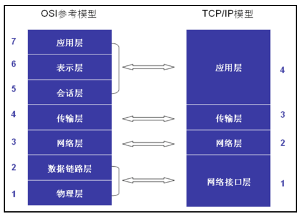
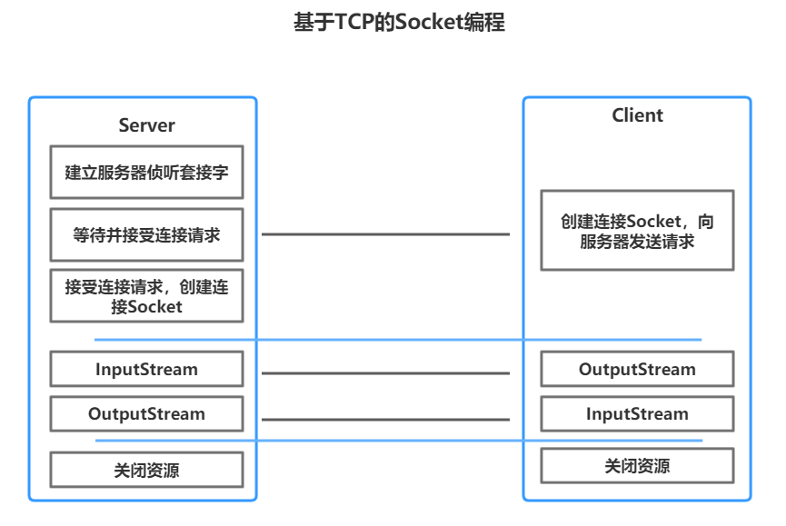



> Author：King
>
> Version：9.0.2


[TOC]


### 一、什么是网络

---

#### 1.1 概念

> 由点和线构成，表示诸多对象间的相互联系。

|         网络          |
| :-------------------: |
|  |

#### 1.2 计算机网络

> 为实现资源共享和信息传递，通过通信线路连接起来的若干主机（Host）。

|      计算机网络       |
| :-------------------: |
|  |

> 常见计算机网络：
>
> + 互联网：（Internet）点与点相连。
> + 万维网：（WWW – World Wide Web）端与端相连。
> + 物联网：（ IoT - Internet of things） 物与物相连。
> + 网络编程：让计算机与计算机之间建立连接、进行通信。

#### 1.3 网络模型【`重点`】

##### 1.3.1 OSI参考模型

>OSI（Open System Interconnect），即开放式系统互联。
>
>+ 是ISO组织在1985年研究的网络互联模型。
>+ 该体系结构标准定义了网络互联的七层框架（[物理层]()、[数据链路层]()、[网络层]()、[传输层]()、[会话层]()、[表示层]()和[应用层]()）。

|      OSI参考模型      |
| :-------------------: |
|  |

> 每层功能：
>
> + 第七层：应用层负责文件访问和管理、可靠运输服务、远程操作服务。（HTTP、FTP、SMTP）。
> + 第六层：表示层负责定义转换数据格式及加密，允许选择以二进制或ASCII格式传输。
> + 第五层：会话层负责使应用建立和维持会话，使通信在失效时继续恢复通信。（断点续传）。
> + 第四层：传输层负责是否选择差错恢复协议、数据流重用、错误顺序重排。（TCP、UDP）。
> + 第三层：网络层负责定义了能够标识所有网络节点的逻辑地址。（IP地址）。
> + 第二层：链路层在物理层上，通过规程或协议（差错控制）来控制传输数据的正确性。（MAC）。
> + 第一层：物理层为设备之间的数据通信提供传输信号和物理介质。（双绞线、光导纤维）。

##### 1.3.2 TCP/IP模型

> + TCP/IP模型是因特网使用的参考模型，基于TCP/IP的参考模型将协议分成四个层次。
>
> + 该模型中最重要的两个协议是TCP和IP协议。

|      TCP/IP模型       |
| :-------------------: |
|  |

> 每层功能：
>
> + 第四层：应用层负责传送各种最终形态的数据，是直接与用户打交道的层，典型协议是HTTP、FTP等。
> + 第三层：传输层负责传送文本数据，主要协议是TCP、UDP协议。
> + 第二层：网络层负责分配地址和传送二进制数据，主要协议是IP协议。
> + 第一层：接口层负责建立电路连接，是整个网络的物理基础，典型的协议包括以太网、ADSL等等。

### 二、常见协议

---

#### 2.1 TCP【`重点`】

> TCP协议：Transmission Control Protocol 传输控制协议：
>
> + 是一种面向连接的、可靠的、基于字节流的传输层通信协议。数据大小无限制。建立连接的过程需要三次握手，断开连接的过程需要四次挥手。

#### 2.2 UDP

> UDP协议：User Datagram Protocol 用户数据报协议：
>
> + 是一种无连接的传输层协议，提供面向事务的简单不可靠信息传送服务，每个包的大小64KB。

#### 2.3 IP

> IP协议：Internet Protocol Address 互联网协议地址/网际协议地址：
>
> + 分配给互联网设备的数字标签（唯一标识）。


> IP地址版本：
>
> + IPV4：4字节32位整数，并分成4段8位的二进制数，每8位之间用圆点隔开，每8位整数可以转换为一个0~255的十进制整数。
>     格式：D.D.D.D	例如：255.255.255.255
> + IPV6：16字节128位整数，并分成8段十六进制数，每16位之间用圆点隔开，每16位整数可以转换为一个0~65535的十进制数。
>            格式：X.X.X.X.X.X.X.X	例如：FFFF.FFFF.FFFF.FFFF.FFFF.FFFF.FFFF.FFFF


>IP地址分类：
>
>+ A类：政府机构，1.0.0.1 ~ 126.255.255.254
>+ B类：中型企业，128.0.0.1 ~ 191.255.255.254
>+ C类：个人用户，192.0.0.1 ~ 223.255.255.254
>+ D类：用于组播，224.0.0.1 ~ 239.255.255.254
>+ E类：用于实验，240.0.0.1 ~ 255.255.255.254
>+ 回环地址：127.0.0.1，指本机，一般用于测试使用。


> 查看IP命令：ipconfig
> 测试IP命令：ping D.D.D.D


#### 2.4 端口号

> 端口号：在通信实体上进行网络通讯的程序的唯一标识。
> 端口分类：
>
> + 公认端口：0~1023
> + 注册端口：1024~49151
> + 动态或私有端口：49152~65535
>
> 常用端口：
>
> + MySql：3306
> + Oracle：1521
> + Tomcat：8080
> + SMTP：25
> + Web服务器：80
> + FTP服务器：21

### 三、InetAddress类

---

> 概念：表示互联网协议（IP）地址对象，封装了与该IP地址相关的所有信息，并提供获取信息的常用方法。


> 常见方法：

| 方法名                                                |           描述           |
| :---------------------------------------------------- | :----------------------: |
| public static InetAddress getLocalHost()              |   获得本地主机地址对象   |
| public static InetAddress getByName(String host)      | 根据主机名称获得地址对象 |
| public static InetAddress[] getAllByName(String host) |   获得所有相关地址对象   |
| public String getHostAddress()                        |     获取IP地址字符串     |
| public String getHostName()                           |     获得IP地址主机名     |

> 案例演示：

```java
import java.net.InetAddress;

/**
 * 演示InetAddress类的使用
 * (1)创建本机IP地址对象
 * (2)创建局域网IP地址对象
 * (3)创建外网IP地址对象
 * @author wgy
 *
 */
public class Demo1 {
	public static void main(String[] args) throws Exception{
		//1创建本机IP地址对象
		//1.1getLocalhost()方法
		InetAddress ia1=InetAddress.getLocalHost();
		System.out.println("ip地址:"+ia1.getHostAddress()+" 主机名:"+ia1.getHostName());
		//1.2getByName("ip地址");
		InetAddress ia2=InetAddress.getByName("192.168.0.103");
		System.out.println("ip地址:"+ia2.getHostAddress()+" 主机名:"+ia2.getHostName());
		//1.3getByName("127.0.0.1");
		InetAddress ia3=InetAddress.getByName("127.0.0.1");
		System.out.println("ip地址:"+ia3.getHostAddress()+" 主机名:"+ia3.getHostName());
		//1.4getByName("localhost");
		InetAddress ia4=InetAddress.getByName("localhost");
		System.out.println("ip地址:"+ia4.getHostAddress()+" 主机名:"+ia4.getHostName());
		
		//2创建局域网IP地址对象
		
		InetAddress ia5=InetAddress.getByName("192.168.0.104");
		System.out.println("ip地址:"+ia5.getHostAddress()+" 主机名:"+ia5.getHostName());
		System.out.println("2秒钟是否可达:"+ia5.isReachable(2000));
		
		//3创建外网IP地址对象
		InetAddress ia6=InetAddress.getByName("www.baidu.com");
		System.out.println("ip地址:"+ia6.getHostAddress()+" 主机名:"+ia6.getHostName());
		System.out.println("2秒钟是否可达:"+ia6.isReachable(2000));
		System.out.println("--------------");
		InetAddress[] ias=InetAddress.getAllByName("www.baidu.com");
		for (InetAddress inetAddress : ias) {
			System.out.println(inetAddress.getHostAddress());
		}
	}
}

```

### 四、基于TCP的网络编程【`重点`】

---

> Socket编程：
>
> + Socket（套接字）是网络中的一个通信节点。
> + 分为客户端Socket与服务器ServerSocket。
> + 通信要求：IP地址 + 端口号。

|                       |
| --------------------- |
|  |

> 开发步骤：
>
> + 建立通信连接（会话）：
>   + 创建ServerSocket，指定端口号。
>   + 调用accept等待客户端接入。
> + 客户端请求服务器：
>   + 创建Socket，指定服务器IP + 端口号。
>   + 使用输出流，发送请求数据给服务器。
> + 使用输入流，接收响应数据到客户端（等待）
>   + 服务器响应客户端。
>   + 使用输入流，接收请求数据到服务器（等待）。
>   + 使用输出流，发送响应数据给客户端。

> 案例演示1：TCP编程实现客户端发送数据给服务器端。

```java
public class TcpServer {
	public static void main(String[] args) throws Exception{
		//1 创建ServerSocket 并指定端口号
		ServerSocket listener=new ServerSocket(8899);
		//2 调用accept(),接收客户端请求,阻塞方法(如果没有客户端请求，则阻塞)
		System.out.println("服务器已启动...");
		Socket socket=listener.accept();
		//3 获取输入流，读取客户端发送的数据
		InputStream is=socket.getInputStream();
		BufferedReader br=new BufferedReader(new InputStreamReader(is,"utf-8"));
		String data=br.readLine();
		System.out.println("客户发送:"+data);
		//4 获取输出流，发送数据给客户端[可选]
		//5 关闭释放资源
		br.close();
		socket.close();
		listener.close();
	}
}

```

```java
public class TcpClient {
	public static void main(String[] args) throws Exception{
		//1 创建客户端套接字，并指定服务器的地址和端口号
		Socket socket=new Socket("192.168.0.103", 8899);
		//2 获取输出流，发送数据给服务器
		OutputStream os=socket.getOutputStream();
		BufferedWriter bw=new BufferedWriter(new OutputStreamWriter(os,"utf-8"));
		bw.write("好久不见");
		//3 获取输入流，读取服务器回复的数据[可选]
		//4 关闭释放资源
		bw.close();
		socket.close();
	}
}
```

> 案例演示2：TCP编程实现客户端上传文件给服务器端。

```java
public class TcpFileServer {
	public static void main(String[] args) throws Exception {
		//1创建ServerSocket
		ServerSocket listener=new ServerSocket(9999);
		//2侦听,接收客户端请求
		System.out.println("服务器已启动.........");
		Socket socket=listener.accept();
		//3获取输入流
		InputStream is=socket.getInputStream();
		//4边读取，边保存
		FileOutputStream fos=new FileOutputStream("d:\\002.jpg");
		byte[] buf=new byte[1024*4];
		int count=0;
		while((count=is.read(buf))!=-1) {
			fos.write(buf,0,count);
		}
		//5关闭
		fos.close();
		is.close();
		socket.close();
		listener.close();
		System.out.println("接收完毕");
	}
}
```

```java
public class TcpFileClient {
	public static void main(String[] args) throws Exception {
		//1创建Socket
		Socket socket=new Socket("192.168.0.103", 9999);
		//2获取输出流
		OutputStream os=socket.getOutputStream();
		//3边读取文件，边发送
		FileInputStream fis=new FileInputStream("d:\\001.jpg");
		byte[] buf=new byte[1024*4];
		int count=0;
		while((count=fis.read(buf))!=-1) {
			os.write(buf,0,count);
		}
		//4关闭
		fis.close();
		os.close();
		socket.close();
		System.out.println("发送完毕");
	}
}
```

> 案例演示3：TCP实现多个客户端发送数据给服务器端。

> SocketThread类：

```java
public class SocketThread extends Thread{

	private Socket socket;
	
	public SocketThread(Socket socket) {
		this.socket=socket;
	}
	@Override
	public void run() {
		if(socket!=null) {
			BufferedReader br=null;
			try {
				InputStream is = socket.getInputStream();
				br=new BufferedReader(new InputStreamReader(is,"utf-8"));
				while(true) {
					String data=br.readLine();
					if(data==null) {//客户端已经关闭
						break;
					}
					System.out.println(socket.getInetAddress()+"说:"+data);
					if(data.equals("886")||data.equals("byebye")) {
						break;
					}
				}	
				
			} catch (IOException e) {
				// TODO Auto-generated catch block
				//e.printStackTrace();
			}finally {
				try {
					br.close();
					socket.close();
					System.out.println(socket.getInetAddress()+"退出了...");
				} catch (IOException e) {
					// TODO Auto-generated catch block
					e.printStackTrace();
				}
				
			}

		}
	}
}
```

>  TCPServer类：

```java
public class TcpServer {
	public static void main(String[] args) throws Exception {
		//1创建ServerSocket
		ServerSocket listener=new ServerSocket(10086);
		//2调用accept(),接收客户端请求
		System.out.println("服务器已启动..........");
		while(true) {
			Socket socket=listener.accept();
			System.out.println(socket.getInetAddress()+"进来了.........");
			//创建线程对象，负责接收数据
			new SocketThread(socket).start();
		}
	}
}
```

> TCPClient类：

```java
public class TcpClient {
	public static void main(String[] args) throws Exception {
		//1创建Socket
		Socket socket=new Socket("192.168.0.103", 10086);
		//2获取输出流
		OutputStream os=socket.getOutputStream();
		BufferedWriter bw=new BufferedWriter(new OutputStreamWriter(os,"utf-8"));
		//3控制输入
		Scanner input=new Scanner(System.in);
		while(true) {
			String data=input.nextLine();
			bw.write(data);
			bw.newLine();//发送换行符
			bw.flush();
			if(data.equals("886")||data.equals("byebye")) {
				break;
			}
		}
		//4关闭
		bw.close();
		socket.close();
	}
}

```

### 五、课堂案例

---

> 使用Socket编程实现服务器端注册：
>
> + 注册信息保存在properties文件中。
> + 封装格式：
>   id = {id : ”1001”, name :“tom”, pwd : ”123”, age : 20}
> + 注册成功后返回字符串“注册成功”。
>
> 使用Socket编程实现服务器端登录：
>
> + 获取properties文件中的用户信息，进行用户名与密码的校验。
> + 校验成功后返回字符串“登录成功”。

> RegistThread类：

```java
/**
 * 实现注册功能
 * @author wgy
 *
 */
public class RegistThread extends Thread{
	@Override
	public void run() {
		
		try {
			//1创建Serversocket 
			ServerSocket listener=new ServerSocket(6666);
			//2调用accept方法
			System.out.println("注册服务器已启动......");
			Socket socket=listener.accept();
			//3获取输入输出流
			BufferedReader br=new BufferedReader(new InputStreamReader(socket.getInputStream(),"utf-8"));
			BufferedWriter bw=new BufferedWriter(new OutputStreamWriter(socket.getOutputStream(),"utf-8"));
			//4接收客户端发送的数据{id : 1001, name :tom, pwd :123, age : 20 }
			String json=br.readLine();
			//id : 1001, name :tom, pwd :123, age : 20
			String[] infos=json.substring(1, json.length()-1).split(",");
			String id=infos[0].split(":")[1];
			//5加载属性文件
			Properties properties=Tools.loadProperties();
			//6判断
			if(properties.containsKey(id)) {
				//有
				bw.write("此用户已存在...");
			}else {
				//保存属性文件
				Tools.saveProperties(json);
				bw.write("注册成功");
			}
			bw.newLine();
			bw.flush();
			bw.close();
			br.close();
			socket.close();
			listener.close();			
		} catch (IOException e) {
			// TODO Auto-generated catch block
			e.printStackTrace();
		}
	}
}
```

> LoginThread类：

```java
public class LoginThread extends Thread {
	@Override
	public void run() {
		try {
			//1创建Serversocket 
			ServerSocket listener=new ServerSocket(7777);
			//2调用accept方法
			System.out.println("登录服务器已启动......");
			Socket socket=listener.accept();
			//3获取输入输出流
			BufferedReader br=new BufferedReader(new InputStreamReader(socket.getInputStream(),"utf-8"));
			BufferedWriter bw=new BufferedWriter(new OutputStreamWriter(socket.getOutputStream(),"utf-8"));
			//4接收客户端发送的数据{id : 1001, pwd :123}
			String json=br.readLine();
			//id : 1001 pwd :123
			String[] infos=json.substring(1, json.length()-1).split(",");
			String id=infos[0].split(":")[1];
			//5加载属性文件
			Properties properties=Tools.loadProperties();
			//6判断是否存在
			if(properties.containsKey(id)) {
				//判断密码是否正确
				String pwd=infos[1].split(":")[1];
				String value=properties.getProperty(id);
				String[] arr=value.substring(1, value.length()-1).split(",");
				String pwd2=arr[2].split(":")[1];
				if(pwd.equals(pwd2)) {
					bw.write("登录成功");
				}else {
					bw.write("密码错误");
				}
				
			}else {
				//保存属性文件
				bw.write("用户名或密码错误");
			}
			bw.newLine();
			bw.flush();
			bw.close();
			br.close();
			socket.close();
			listener.close();			
		} catch (IOException e) {
			// TODO Auto-generated catch block
			e.printStackTrace();
		}
	}
}
```

> Tools工具类：

````java
public class Tools {
	//1加载属性文件
	public static Properties loadProperties() {
		//1创建属性集合
		Properties properties=new Properties();
		//2判断文件是否存在
		File file=new File("users.properties");
		if(file.exists()) {
			FileInputStream fis=null;
			try {
				fis = new FileInputStream(file);
				properties.load(fis);
			} catch (Exception e) {
				// TODO Auto-generated catch block
				e.printStackTrace();
			}finally {
				if(fis!=null) {
					try {
						fis.close();
					} catch (IOException e) {
						// TODO Auto-generated catch block
						e.printStackTrace();
					}
				}
			}
			
		}
		
		return properties;
	}
	
	//2保存属性文件
	
	public static void saveProperties(String json) {
		String[] infos=json.substring(1, json.length()-1).split(",");
		String id=infos[0].split(":")[1];
		//保存
		FileOutputStream fos=null;
		try {
			fos=new FileOutputStream("users.properties",true);
			Properties properties=new Properties();
			properties.setProperty(id, json);
			properties.store(fos, "");
		} catch (Exception e) {
			// TODO Auto-generated catch block
			e.printStackTrace();
		}finally {
			if(fos!=null) {
				try {
					fos.close();
				} catch (IOException e) {
					// TODO Auto-generated catch block
					e.printStackTrace();
				}
			}
		}
		
	}
}
````

> UserServer类：

```java
public class UserServer {
	public static void main(String[] args) {
		new RegistThread().start();
		new LoginThread().start();
	}
}

```

> UserClient类：

````java
public class UserClient {
	public static void main(String[] args) throws Exception {
		System.out.println("---------请选择 1 注册 2 登录-----------");
		Scanner input = new Scanner(System.in);
		int choice = input.nextInt();
		switch (choice) {
		case 1:
			regist();
			break;
		case 2:
			login();
		default:
			break;
		}
	}

	public static void regist() throws Exception {
		// 1创建Socket
		Socket socket = new Socket("192.168.0.103", 6666);
		// 2获取流
		BufferedReader br = new BufferedReader(new InputStreamReader(socket.getInputStream(), "utf-8"));
		BufferedWriter bw = new BufferedWriter(new OutputStreamWriter(socket.getOutputStream(), "utf-8"));
		// 3获取用户信息
		String json = getRegistInfo();
		// 4发送
		bw.write(json);
		bw.newLine();
		bw.flush();
		// 5接收
		String reply = br.readLine();
		System.out.println("服务器回复:" + reply);
		// 6关闭
		bw.close();
		br.close();
		socket.close();
	}

	public static String getRegistInfo() {
		Scanner input = new Scanner(System.in);
		System.out.println("请输入用户编号");
		int id = input.nextInt();
		System.out.println("请输入姓名");
		String name = input.next();
		System.out.println("请输入密码");
		String pwd = input.next();
		System.out.println("请输入年龄");
		int age = input.nextInt();
		// {id : 1001, name :tom, pwd :123, age : 20 }
		String json = "{id:" + id + ",name:" + name + ",pwd:" + pwd + ",age:" + pwd + "}";
		return json;
	}

	public static void login() throws Exception {
		// 1创建Socket
		Socket socket = new Socket("192.168.0.103", 7777);
		// 2获取流
		BufferedReader br = new BufferedReader(new InputStreamReader(socket.getInputStream(), "utf-8"));
		BufferedWriter bw = new BufferedWriter(new OutputStreamWriter(socket.getOutputStream(), "utf-8"));
		// 3获取用户信息
		String json = getLoginInfo();
		// 4发送
		bw.write(json);
		bw.newLine();
		bw.flush();
		// 5接收
		String reply = br.readLine();
		System.out.println("服务器回复:" + reply);
		// 6关闭
		bw.close();
		br.close();
		socket.close();
	}
	public static String getLoginInfo() {
		Scanner input = new Scanner(System.in);
		System.out.println("请输入用户编号");
		int id = input.nextInt();
		System.out.println("请输入密码");
		String pwd = input.next();
		// {id : 1001, name :tom, pwd :123, age : 20 }
		String json = "{id:" + id+",pwd:"+ pwd+"}";
		return json;
	}
}
````


