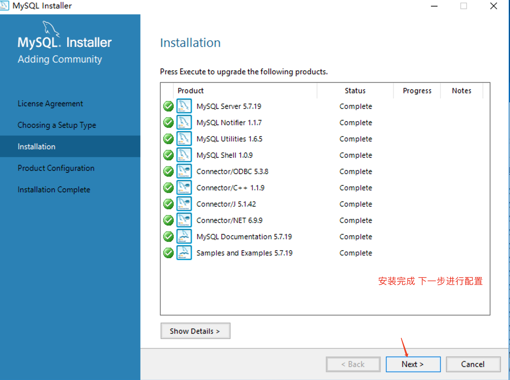
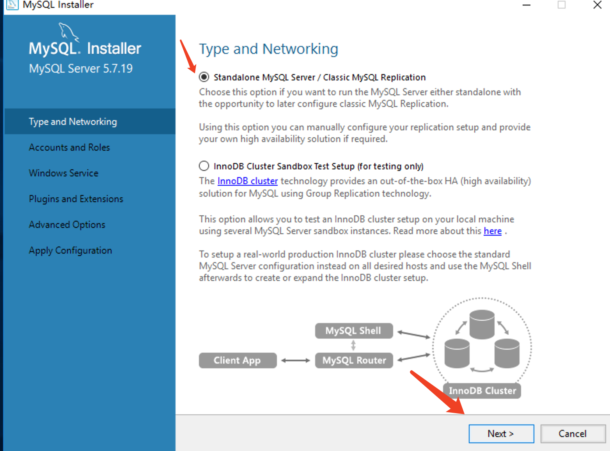
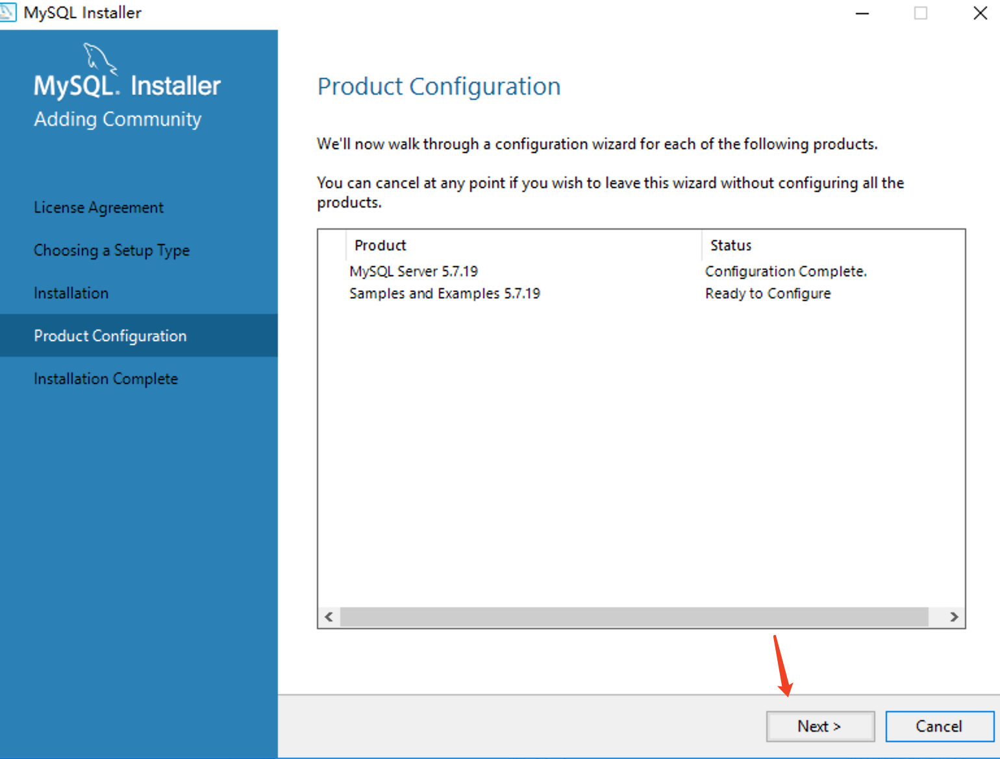

> Author：Jackiechan
>
> Version：1.0.1


[TOC]


### 一、引言

------

#### 1.1 现有的数据存储方式有哪些？

> * Java程序存储数据（变量、对象、数组、集合），数据保存在内存中，属于瞬时状态存储。
>
> * 文件（File）存储数据，保存在硬盘上，属于持久状态存储。


#### 1.2 以上存储方式存在哪些缺点？

> * 没有数据类型的区分。
>
> * 存储数据量级较小。
>
> * 没有访问安全限制。
>
> * 没有备份、恢复机制。


### 二、数据库

------

#### 2.1 概念

> ​		数据库是“按照数据结构来组织、[存储和管理数据的仓库]()。是一个长期存储在计算机内的、有组织的、有共享的、统一管理的数据集合。


#### 2.2 数据库的分类

> * 网状结构数据库：美国通用电气公司IDS（Integrated Data Store），以节点形式存储和访问。
> * 层次结构数据库：IBM公司IMS（Information Management System）定向有序的树状结构实现存储和访问。
> * 关系结构数据库：Oracle、DB2、MySQL、SQL Server，以表格（Table）存储，多表间建立关联关系，通过分类、合并、连接、选取等运算实现访问。
> * 非关系型数据库：ElastecSearch、MongoDB、Redis，多数使用哈希表，表中以键值（key-value）的方式实现特定的键和一个指针指向的特定数据。


### 三、数据库管理系统

------

#### 3.1 概念

> ​		[数据库管理系统]()（DataBase Management System，DBMS）：指一种操作和管理数据库的大型软件，用于建立、使用和维护数据库，对数据库进行统一管理和控制，以保证数据库的安全性和完整性。用户通过数据库管理系统访问数据库中的数据。


#### 3.2 常见数据库管理系统

> * Oracle：被认为是业界目前比较成功的关系型数据库管理系统。Oracle数据库可以运行在UNIX、Windows等主流操作系统平台，完全支持所有的工业标准，并获得最高级别的ISO标准安全性认证。
> * DB2：IBM公司的产品，DB2数据库系统采用多进程多线索体系结构，其功能足以满足大中公司的需要，并可灵活地服务于中小型电子商务解决方案。
> * SQL Server：Microsoft 公司推出的关系型数据库管理系统。具有使用方便可伸缩性好与相关软件集成程度高等优点。
> * SQLLite:应用在手机端的数据库。


### 四、MySQL

------

#### 4.1 简介

> ​		MySQL是一个[关系型数据库管理系统]()，由瑞典MySQL AB 公司开发，属于 Oracle 旗下产品。MySQL 是最流行的关系型数据库管理系统之一，在 WEB 应用方面，MySQL是最好的 RDBMS(Relational Database Management System，关系数据库管理系统) 应用软件之一。


#### 4.2 访问与下载

> 官方网站：https://www.mysql.com/
>
> 下载地址：https://dev.mysql.com/downloads/mysql/

|         版本选择         |
| :----------------------: |
|  |

|         下载页面         |
| :----------------------: |
|  |


#### 4.3 安装

> 运行mysql-installer-community-5.7.28.0.msi，进入安装步骤

|   同意协议，点击下一步   |
| :----------------------: |
|  |

| 选择安装类型，点击下一步 |
| :----------------------: |
|  |

| 注意：安装需要依赖环境，如需安装的功能缺少对应环境，需先安装环境 |
| :----------------------------------------------------------: |
|                                      |

| 下一步的时候会提示缺少环境,此处的提示是说你期望安装的产品中缺少依赖,不一定提示的是数据库服务器安装的依赖,可能是其他功能组件的依赖缺少 |
| :----------------------------------------------------------: |
|                                      |

| 此处发现没有 mysql server, 说明它对应的依赖缺少,可以先执行安装这些可以安装的,之后安装完依赖后再重新安装其他模块,我们此处的操作是先安装依赖,然后后退再次安装 |
| :----------------------------------------------------------: |
|                                      |

| 下载安装前面提示的 mysql server 需要的 vc2013后,vc2013 如果在64位系统上面建议32和64的程序都安装,然后在上图的地方后退,重新 next 就可以看到可以安装 mysql server 了 |
| :----------------------------------------------------------: |
|                                      |

|    检查是否存在失败项    |
| :----------------------: |
|  |

| 进行第一步配置,除了需要设置密码外,后面的步骤基本上都是下一步 |
| :----------------------------------------------------------: |
|                                      |

|      类型与网络配置      |
| :----------------------: |
|  |

|      设置 root 密码      |
| :----------------------: |
|  |

|    创建SQL服务与窗口     |
| :----------------------: |
|  |

|           插件           |
| :----------------------: |
|  |

|         应用配置         |
| :----------------------: |
|  |

| finish 后回到当前页面继续配置 |
| :---------------------------: |
|       |

| 连接服务器（先 check检查, 后下一步） |
| :----------------------------------: |
|              |

| 执行完此步骤 下一步 finish 配置完成 |
| :---------------------------------: |
|             |


#### 4.4 卸载

> * 控制台卸载。
> * 找到mysql的安装目录进行删除。
> * programdata  删除mysql 

* [注意：如果卸载后，如有未删除的MySQL服务，可采用手动删除。]()
* [以管理员身份打开命令行，输入 sc delete MySQL57 回车。]()


#### 4.5 配置环境变量

> * Windows 
>   * 创建MYSQL_HOME：C:\Program Files\MySQL\MySQL Server 5.7 
>   * 追加PATH：%MYSQL_HOME%\bin;
> * MacOS / Linux
>   * 终端中输入cd ~ 进入目录，并检查.bash_profile是否存在，有则追加，无则创建
>   * 创建文件 touch .bash_profile
>   * 打开文件 open .bash_profile
>   * 输入export PATH=${PATH}:/usr/local/mysql/bin 保存并退出终端


#### 4.6 MySQL目录结构

> 核心文件介绍

| 文件夹名称 |        内容        |
| :--------: | :----------------: |
|    bin     |      命令文件      |
|    lib     |       库文件       |
|  include   |       头文件       |
|   Share    | 字符集、语言等信息 |


#### 4.7 MySQL配置文件

> 在MySQL安装目录中找到my.ini文件，并打开my.ini文件查看几个常用配置参数

|          参数          |           描述           |
| :--------------------: | :----------------------: |
| default-character-set  |     客户端默认字符集     |
|  character-set-server  |    服务器端默认字符集    |
|          port          | 客户端和服务器端的端口号 |
| default-storage-engine | MySQL默认存储引擎 INNODB |


### 五、SQL语言

------

#### 5.1 概念

> ​		SQL（Structured Query Language）结构化查询语言，用于存取数据、更新、查询和管理关系数据库系统的程序设计语言。

* [经验：通常执行对数据库的“增删改查”，简称C（Create）R（Read）U（Update）D（Delete）。]()


#### 5.2 MySQL应用

> 对于数据库的操作，需要在进入MySQL环境下进行指令输入，并在一句指令的末尾使用 ; 结束


#### 5.3 基本命令

> 查看MySQL中所有数据库

```mysql
mysql> SHOW DATABASES; #显示当前MySQL中包含的所有数据库
```

|     数据库名称     |                             描述                             |
| :----------------: | :----------------------------------------------------------: |
| information_schema | 信息数据库，其中保存着关于所有数据库的信息（元数据）。<br />元数据是关于数据的数据，如数据库名或表名，列的数据类型，或访问权限等。 |
|       mysql        | 核心数据库，主要负责存储数据库的用户、权限设置、关键字等，<br />以及需要使用的控制和管理信息，不可以删除。 |
| performance_schema | 性能优化的数据库，MySQL 5.5版本中新增的一个性能优化的引擎。  |
|        sys         | 系统数据库，MySQL5.7版本中新增的可以快速的了解元数据信息的系统库<br/>便于发现数据库的多样信息，解决性能瓶颈问题。 |


> 创建自定义数据库

```mysql
mysql> CREATE DATABASE mydb1; #创建mydb数据库
mysql> CREATE DATABASE mydb2 CHARACTER SET gbk; #创建数据库并设置编码格式为gbk
mysql> CREATE DATABASE IF NOT EXISTS mydb4; #如果mydb4数据库不存在，则创建；如果存在，则不创建。
```


> 查看数据库创建信息

```mysql
mysql> SHOW CREATE DATABASE mydb2; #查看创建数据库时的基本信息
```


> 修改数据库

```mysql
mysql> ALTER DATABASE mydb2 CHARACTER SET gbk; #修改数据库的字符集
```


> 删除数据库

```mysql
mysql> DROP DATABASE mydb1; #删除数据库mydb1
```


> 查看当前所使用的数据库

```mysql
mysql> select database(); #查看当前使用的数据库
```


> 使用数据库

```mysql
mysql> USE mydb1; #使用mydb1数据库
```


### 六、客户端工具

------

#### 6.1 Navicate

> [Navicat是一套快速、可靠并价格相宜的数据库管理工具，专为简化数据库的管理及降低系统管理成本而设。]()它的设计符合数据库管理员、开发人员及中小企业的需要。Navicat 是以直觉化的图形用户界面而建的，让你可以以安全并且简单的方式创建、组织、访问并共用信息。


#### 6.2 SQLyog

> [MySQL可能是世界上最流行的开源数据库引擎，但是使用基于文本的工具和配置文件可能很难进行管理。]()SQLyog提供了完整的图形界面，即使初学者也可以轻松使用MySQL的强大功能。其拥有广泛的预定义工具和查询、友好的视觉界面、类似 Excel 的查询结果编辑界面等优点。


### 七、数据查询【`重点`】

------

#### 7.1 数据库表的基本结构

> 关系结构数据库是以表格（Table）进行数据存储，表格由“行”和“列”组成

- [经验：执行查询语句返回的结果集是一张虚拟表]()。


#### 7.2 基本查询

> 语法：[SELECT  列名 FROM 表名]()

| 关键字 | 描述           |
| ------ | -------------- |
| SELECT | 指定要查询的列 |
| FROM   | 指定要查询的表 |


##### 7.2.1 查询部分列

```mysql
#查询员工表中所有员工的编号、名字、邮箱
SELECT employee_id,first_name,email 
FROM t_employees;
```


##### 7.2.2 查询所有列

```mysql
#查询员工表中所有员工的所有信息（所有列）
SELECT 所有列的列名 FROM t_employees;
SELECT * FROM t_employees;
```

- [注意：生产环境下，优先使用列名查询。*的方式需转换成全列名，效率低，可读性差。]()


##### 7.2.3 对列中的数据进行运算

```MYSQL
#查询员工表中所有员工的编号、名字、年薪
SELECT employee_id , first_name , salary*12 
FROM t_employees;
```

| 算数运算符 | 描述           |
| ---------- | -------------- |
| +          | 两列做加法运算 |
| -          | 两列做减法运算 |
| *          | 两列做乘法运算 |
| /          | 两列做除法运算 |

- [注意：%是占位符，而非模运算符。]()


##### 7.2.4 列的别名

> 列  as '列名'

```mysql
#查询员工表中所有员工的编号、名字、年薪（列名均为中文）
SELECT employee_id as "编号" , first_name as "名字" , salary*12 as "年薪" 
FROM t_employees;
```


##### 7.2.5 查询结果去重

> DISTINCT 列名

```mysql
#查询员工表中所有经理的ID。
SELECT DISTINCT manager_id 
FROM t_employees;
```


#### 7.3排序查询

> 语法： SELECT 列名 FROM 表名 [ORDER BY 排序列 [排序规则]]() 

| 排序规则 | 描述                   |
| -------- | ---------------------- |
| ASC      | 对前面排序列做升序排序 |
| DESC     | 对前面排序列做降序排序 |


##### 7.3.1 依据单列排序

```mysql
#查询员工的编号，名字，薪资。按照工资高低进行降序排序。
SELECT employee_id , first_name , salary
FROM t_employees
ORDER BY salary DESC;
```


##### 7.3.2 依据多列排序

```mysql
#查询员工的编号，名字，薪资。按照工资高低进行升序排序（薪资相同时，按照编号进行升序排序）。
SELECT employee_id , first_name , salary
FROM t_employees
ORDER BY salary DESC , employee_id ASC;
```


#### 7.4 条件查询

> 语法：SELECT 列名 FROM 表名 [WHERE 条件]()      

| 关键字     | 描述                                                   |
| ---------- | ------------------------------------------------------ |
| WHERE 条件 | 在查询结果中，筛选符合条件的查询结果，条件为布尔表达式 |


##### 7.4.1 等值判断（=）

```mysql
#查询薪资是11000的员工信息（编号、名字、薪资）
SELECT employee_id , first_name , salary
FROM t_employees
WHERE salary = 11000;
```

- [注意：与 java 不同（==），mysql 中等值判断使用 =]() 


##### 7.4.2 逻辑判断（and、or、not）

```mysql
#查询薪资是11000并且提成是0.30的员工信息（编号、名字、薪资）
SELECT employee_id , first_name , salary
FROM t_employees
WHERE salary = 11000 AND commission_pct = 0.30;
```


##### 7.4.3 不等值判断（> 、< 、>= 、<= 、!= 、<>）

```mysql
#查询员工的薪资在6000~10000之间的员工信息（编号，名字，薪资）
SELECT employee_id , first_name , salary
FROM t_employees
WHERE salary >= 6000 AND salary <= 10000;
```


##### 7.4.4 区间判断（between and）

```mysql
#查询员工的薪资在6000~10000之间的员工信息（编号，名字，薪资）
SELECT employee_id , first_name , salary
FROM t_employees
WHERE salary BETWEEN 6000 AND 10000; #闭区间，包含区间边界的两个值
```

-  [注：在区间判断语法中，小值在前，大值在后，反之，得不到正确结果]()

  

##### 7.4.5 NULL 值判断（IS NULL、IS NOT NULL）

> - IS NULL 
>
>   列名  IS NULL
>
> - IS NOT NULL
>
>   列名 IS NOT NULL

```mysql
#查询没有提成的员工信息（编号，名字，薪资 , 提成）
SELECT employee_id , first_name , salary , commission_pct
FROM t_employees
WHERE commission_pct IS NULL;
```


##### 7.4.6 枚举查询（ IN (值 1，值 2，值 3 ) ）

```mysql
#查询部门编号为70、80、90的员工信息（编号，名字，薪资 , 部门编号）
SELECT employee_id , first_name , salary , department_id
FROM t_employees
WHERE department_id IN(70,80,90);
注：in的查询效率较低，可通过多条件拼接。
```


##### 7.4.7 模糊查询

> - LIKE _ （单个任意字符）
>
>   列名  LIKE '张_'
>
> - LIKE %（任意长度的任意字符）
>
>   列名 LIKE '张%'

- [注意：模糊查询只能和 LIKE 关键字结合使用]()

  

```mysql
#查询名字以"L"开头的员工信息（编号，名字，薪资 , 部门编号）
SELECT employee_id , first_name , salary , department_id
FROM t_employees
WHERE first_name LIKE 'L%';


#查询名字以"L"开头并且长度为4的员工信息（编号，名字，薪资 , 部门编号）
SELECT employee_id , first_name , salary , department_id
FROM t_employees
WHERE first_name LIKE 'L___';
```


##### 7.4.8 分支结构查询

```mysql
CASE
	WHEN 条件1 THEN 结果1
	WHEN 条件2 THEN 结果2
	WHEN 条件3 THEN 结果3
	ELSE 结果
END
```

- [注意：通过使用CASE END进行条件判断，每条数据对应生成一个值。]()
- [经验：类似 Java 中的switch。]()


```mysql
#查询员工信息（编号，名字，薪资 , 薪资级别<对应条件表达式生成>）
SELECT employee_id , first_name , salary , department_id , 
       CASE
           WHEN salary>=10000 THEN 'A'
           WHEN salary>=8000 AND salary<10000 THEN 'B'
           WHEN salary>=6000 AND salary<8000  THEN 'C'
           WHEN salary>=4000 AND salary<6000  THEN 'D'
   ELSE 'E'
       END as "LEVEL"
FROM t_employees;
```


#### 7.5 时间查询

> 语法：SELECT [时间函数([参数列表]) ]()

- [经验：执行时间函数查询，会自动生成一张虚表（一行一列）]()


| 时间函数              | 描述                                   |
| --------------------- | :------------------------------------- |
| SYSDATE()             | 当前系统时间（日、月、年、时、分、秒） |
| CURDATE()             | 获取当前日期                           |
| CURTIME()             | 获取当前时间                           |
| WEEK(DATE)            | 获取指定日期为一年中的第几周           |
| YEAR(DATE)            | 获取指定日期的年份                     |
| HOUR(TIME)            | 获取指定时间的小时值                   |
| MINUTE(TIME)          | 获取时间的分钟值                       |
| DATEDIFF(DATE1,DATE2) | 获取DATE1 和 DATE2 之间相隔的天数      |
| ADDDATE(DATE,N)       | 计算DATE 加上 N 天后的日期             |


##### 7.5.1 获得当前系统时间

```mysql
#查询当前时间
SELECT SYSDATE();
```

```mysql
#查询当前时间
SELECT NOW();
```

```mysql
#获取当前日期
SELECT CURDATE();
```

```mysql
#获取当前时间
SELECT CURTIME();
```


#### 7.6 字符串查询

> 语法： SELECT [字符串函数 ([参数列表])]()

| 字符串函数                 | 说明                                                  |
| -------------------------- | ----------------------------------------------------- |
| CONCAT(str1,str2,str....)  | 将 多个字符串连接                                     |
| INSERT(str,pos,len,newStr) | 将str 中指定 pos 位置开始 len 长度的内容替换为 newStr |
| LOWER(str)                 | 将指定字符串转换为小写                                |
| UPPER(str)                 | 将指定字符串转换为大写                                |
| SUBSTRING(str,num,len)     | 将str 字符串指定num位置开始截取 len 个内容            |


##### 7.6.1 字符串应用

```mysql
#拼接内容
SELECT CONCAT('My','S','QL');
```

```mysql
#字符串替换
SELECT INSERT('这是一个数据库',3,2,'MySql');#结果为这是 MySql 数据库
```

```mysql
#指定内容转换为小写
SELECT LOWER('MYSQL');#mysql
```

```mysql
#指定内容转换为大写
SELECT UPPER('mysql');#MYSQL
```

```mysql
#指定内容截取
SELECT SUBSTRING('JavaMySQLOracle',5,5);#MySQL
```


#### 7.7 聚合函数

> 语法：SELECT [聚合函数(列名)]() FROM 表名;

- [经验：对多条数据的单列进行统计，返回统计后的一行结果。]()


| 聚合函数 | 说明                     |
| -------- | ------------------------ |
| SUM()    | 求所有行中单列结果的总和 |
| AVG()    | 平均值                   |
| MAX()    | 最大值                   |
| MIN()    | 最小值                   |
| COUNT()  | 求总行数                 |


##### 7.7.1 单列总和

```mysql
#统计所有员工每月的工资总和
SELECT sum(salary)
FROM t_employees;
```


##### 7.7.2 单列平均值

```mysql
#统计所有员工每月的平均工资
SELECT AVG(salary)
FROM t_employees;
```


##### 7.7.3 单列最大值

```mysql
#统计所有员工中月薪最高的工资
SELECT MAX(salary)
FROM t_employees;
```


##### 7.7.4 单列最小值

```mysql
#统计所有员工中月薪最低的工资
SELECT MIN(salary)
FROM t_employees;
```


##### 7.7.5 总行数

```mysql
#统计员工总数
SELECT COUNT(*)
FROM t_employees;
```

```mysql
#统计有提成的员工人数
SELECT COUNT(commission_pct) 
FROM t_employees;
```

- [ 注意：聚合函数自动忽略null值，不进行统计。 ]()


#### 7.8 分组查询

> 语法：SELECT 列名 FROM 表名 WHERE 条件  [GROUP BY 分组依据（列）;]()

| 关键字   | 说明                            |
| -------- | ------------------------------- |
| GROUP BY | 分组依据，必须在 WHERE 之后生效 |


##### 7.8.1 查询各部门的总人数

```mysql
#思路：
#1.按照部门编号进行分组（分组依据是 department_id）
#2.再针对各部门的人数进行统计（count）
SELECT department_id,COUNT(employee_id)
FROM t_employees
GROUP BY department_id; 
```


##### 7.8.2 查询各部门的平均工资

```mysql
#思路：
#1.按照部门编号进行分组（分组依据department_id）。
#2.针对每个部门进行平均工资统计（avg）。
SELECT department_id , AVG(salary)
FROM t_employees
GROUP BY department_id
```


##### 7.8.3 查询各个部门、各个岗位的人数

```mysql
#思路：
#1.按照部门编号进行分组（分组依据 department_id）。
#2.按照岗位名称进行分组（分组依据 job_id）。
#3.针对每个部门中的各个岗位进行人数统计（count）。
SELECT department_id , job_id , COUNT(employee_id)
FROM t_employees
GROUP BY department_id , job_id;
```


##### 7.8.4 常见问题

```mysql
#查询各个部门id、总人数、first_name
SELECT department_id , COUNT(*) , first_name
FROM t_employees
GROUP BY department_id; #error
```

- [注：分组查询中，select显示的列只能是分组依据列，或者聚合函数列，不能出现其他列。]()


#### 7.9 分组过滤查询

> 语法：SELECT 列名  FROM 表名 WHERE 条件  GROUP BY 分组列 [HAVING 过滤规则]()

| 关键字          | 说明                               |
| --------------- | ---------------------------------- |
| HAVING 过滤规则 | 过滤规则定义对分组后的数据进行过滤 |


##### 7.9.1 统计部门的最高工资

```mysql
#统计60、70、90号部门的最高工资
#思路：
#1).	确定分组依据（department_id）
#2).	对分组后的数据，过滤出部门编号是60、70、90信息
#3).	max()函数处理

SELECT department_id , MAX(salary)
FROM t_employees
GROUP BY department_id
HAVING department_id in (60,70,90)

# group确定分组依据department_id 
#having过滤出60 70 90部门
#select查看部门编号和max函数。
```


#### 7.10 限定查询

>  SELECT 列名 FROM 表名 [LIMIT 起始行，查询行数]()

| 关键字                        | 说明                         |
| ----------------------------- | ---------------------------- |
| LIMIT offset_start，row_count | 限定查询结果的起始行和总行数 |


##### 7.10.1 查询前 5 行记录

```mysql
#查询表中前五名员工的所有信息
SELECT * FROM t_employees LIMIT 0,5;
```

- [注意：起始行是从 0 开始，代表了第一行。第二个参数代表的是从指定行开始查询几行]()


##### 7.10.2 查询范围记录

```MYSQL
#查询表中从第四条开始，查询 10 行
SELECT * FROM t_employees LIMIT 3,10;
```


##### 7.10.3 LIMIT典型应用

分页查询：一页显示 10 条，一共查询三页

```MYSQL
#思路：第一页是从 0开始，显示 10 条
SELECT * FROM LIMIT 0,10;

#第二页是从第 10 条开始，显示 10 条
SELECT * FROM LIMIT 10,10;

#第三页是从 20 条开始，显示 10 条
SELECT * FROM LIMIT 20,10;
```

- [经验：在分页应用场景中，起始行是变化的，但是一页显示的条数是不变的]()


#### 7.11 查询总结

------


##### 7.11.1 SQL 语句编写顺序

> [SELECT 列名 FROM 表名 WHERE 条件 GROUP BY 分组 HAVING 过滤条件 ORDER BY 排序列（asc|desc）LIMIT 起始行，总条数]()


##### 7.11.2 SQL 语句执行顺序

```mysql
1.FROM ：指定数据来源表
2.WHERE : 对查询数据做第一次过滤
3.GROUP BY ： 分组
4.HAVING : 对分组后的数据第二次过滤
5.SELECT : 查询各字段的值
6.ORDER BY : 排序
7.LIMIT : 限定查询结果
```


#### 7.12 子查询（作为条件判断）

> SELECT 列名 FROM 表名  [Where 条件 (子查询结果)]()


##### 7.12.1 查询工资大于Bruce 的员工信息

```MYSQL
#1.先查询到 Bruce 的工资（一行一列）
SELECT SALARY FROM t_employees WHERE FIRST_NAME = 'Bruce';#工资是 6000

#2.查询工资大于 Bruce 的员工信息
SELECT * FROM t_employees WHERE SALARY > 6000;

#3.将 1、2 两条语句整合
SELECT * FROM t_employees WHERE SALARY > （SELECT SALARY FROM t_employees WHERE FIRST_NAME = 'Bruce' ）;
```

- [注意：将子查询 ”一行一列“的结果作为外部查询的条件，做第二次查询]()
- [子查询得到一行一列的结果才能作为外部查询的等值判断条件或不等值条件判断]()


#### 7.13 子查询（作为枚举查询条件）

> SELECT 列名 FROM 表名 Where 列名 [in(子查询结果);]()


##### 7.13.1 查询与名为'King'同一部门的员工信息

```mysql
#思路：
#1.	先查询 'King' 所在的部门编号(多行单列)
SELECT department_id
FROM t_employees
WHERE last_name = 'King'; //部门编号：80、90

#2.	再查询80、90号部门的员工信息
SELECT employee_id , first_name , salary , department_id
FROM t_employees
WHERE department_id in (80,90); 

#3.SQL：合并
SELECT employee_id , first_name , salary , department_id
FROM t_employees
WHERE department_id in (SELECT department_id cfrom t_employees WHERE last_name = 'King'); #N行一列

```

- [将子查询 ”多行一列“的结果作为外部查询的枚举查询条件，做第二次查询]()

  

##### 7.13.2 工资高于60部门所有人的信息

```mysql
#1.查询 60 部门所有人的工资（多行多列）
SELECT SALARY from t_employees WHERE DEPARTMENT_ID=60;

#2.查询高于 60 部门所有人的工资的员工信息（高于所有）
select * from t_employees where SALARY > ALL(select  SALARY from t_employees WHERE DEPARTMENT_ID=60);

#。查询高于 60 部门的工资的员工信息（高于部分）
select * from t_employees where SALARY > ANY(select  SALARY from t_employees WHERE DEPARTMENT_ID=60);

```

- [注意：当子查询结果集形式为多行单列时可以使用 ANY 或 ALL 关键字]()


#### 7.14 子查询（作为一张表）

> SELECT 列名 FROM[（子查询的结果集）]()WHERE 条件;


##### 7.14.1 查询员工表中工资排名前 5 名的员工信息

```mysql
#思路：
#1.	先对所有员工的薪资进行排序（排序后的临时表）
select employee_id , first_name , salary
from t_employees
order by salary desc

#2.	再查询临时表中前5行员工信息
select employee_id , first_name , salary
from (临时表) 
limit 0,5;

#SQL：合并
select employee_id , first_name , salary
from (select employee_id , first_name , salary from t_employees order by salary desc) as temp
limit 0,5;
```

- [将子查询 ”多行多列“的结果作为外部查询的一张表，做第二次查询。]()

- [注意：子查询作为临时表，为其赋予一个临时表名]()


#### 7.15 合并查询（了解）

> - SELECT * FROM 表名 1 [UNION]() SELECT * FROM 表名 2
>
> - SELECT * FROM 表名 1 [UNION ALL]() SELECT * FROM 表名 2


##### 7.15.1 合并两张表的结果（去除重复记录）

```MYSQL
#合并两张表的结果，去除重复记录
SELECT * FROM t1 UNION SELECT * FROM t2;
```

- [注意：合并结果的两张表，列数必须相同，列的数据类型可以不同]()


##### 7.15.2 合并两张表的结果（保留重复记录）

```mysql
#合并两张表的结果，不去除重复记录（显示所有）
SELECT * FROM t1 UNION ALL SELECT * FROM t2;
```

- [经验：使用 UNION 合并结果集，会去除掉两张表中重复的数据]()


#### 7.16 表连接查询

> SELECT 列名 FROM 表 1 [连接方式]() 表 2 [ON 连接条件]()


##### 7.16.1 内连接查询（INNER JOIN ON）

```mysql
#1.查询所有有部门的员工信息（不包括没有部门的员工） SQL 标准
SELECT * FROM t_employees INNER JOIN t_jobs ON t_employees.JOB_ID = t_jobs.JOB_ID

#2.查询所有有部门的员工信息（不包括没有部门的员工） MYSQL
SELECT * FROM t_employees,t_jobs WHERE t_employees.JOB_ID = t_jobs.JOB_ID
```

- [经验：在 MySql 中，第二种方式也可以作为内连接查询，但是不符合 SQL 标准]()
- [而第一种属于 SQL 标准，与其他关系型数据库通用]()


##### 7.16.2 三表连接查询

```mysql
#查询所有员工工号、名字、部门名称、部门所在国家ID
SELECT * FROM t_employees e 
INNER JOIN t_departments d 
on e.department_id = d.department_id
INNER JOIN t_locations l
ON d.location_id = l.location_id
```


##### 7.16.3 左外连接（LEFT JOIN ON）

```mysql
#查询所有员工信息，以及所对应的部门名称（没有部门的员工，也在查询结果中,部门名称以NULL 填充）
SELECT e.employee_id , e.first_name , e.salary , d.department_name FROM t_employees e
LEFT JOIN t_departments d 
ON e.department_id = d.department_id;
```

- [注意：左外连接，是以左表为主表，依次向右匹配，匹配到，返回结果]()
- [匹配不到，则返回 NULL 值填充]()


##### 7.16.4 右外连接（RIGHT JOIN ON）

```MYSQL
#查询所有部门信息，以及此部门中的所有员工信息（没有员工的部门，也在查询结果中，员工信息以NULL 填充）
SELECT e.employee_id , e.first_name , e.salary , d.department_name FROM t_employees e 
RIGHT JOIN t_departments d 
ON e.department_id = d.department_id;
```

- [注意：右外连接，是以右表为主表，依次向左匹配，匹配到，返回结果]()
- [匹配不到，则返回 NULL 值填充]()


### 八、 DML 操作【`重点`】

------


#### 8.1 新增（INSERT）

> [INSERT INTO]() 表名[(列 1，列 2，列 3....) VALUES(值 1，值 2，值 3......);]()


##### 8.1.1 添加一条信息

```mysql
#添加一条工作岗位信息
INSERT INTO t_jobs(JOB_ID,JOB_TITLE,MIN_SALARY,MAX_SALARY) VALUES('JAVA_Le','JAVA_Lecturer',2500,9000);
```

```mysql
#添加一条员工信息
INSERT INTO `t_employees`
（EMPLOYEE_ID,FIRST_NAME,LAST_NAME,EMAIL,PHONE_NUMBER,HIRE_DATE,JOB_ID,SALARY,COMMISSION_PCT,MANAGER_ID,DEPARTMENT_ID）
VALUES 
('194','Samuel','McCain','SMCCAIN', '650.501.3876', '1998-07-01', 'SH_CLERK', '3200', NULL, '123', '50');
```

- [注意：表名后的列名和 VALUES 里的值要一一对应（个数、顺序、类型）]()


#### 8.2 修改（UPDATE）

> UPDATE 表名 [SET 列 1=新值 1 ,列 2 = 新值 2,.....WHERE 条件;]()


##### 8.2.1 修改一条信息

```MYSQL
#修改编号为100 的员工的工资为 25000
UPDATE t_employees SET SALARY = 25000 WHERE EMPLOYEE_ID = '100';
```

```mysql
#修改编号为135 的员工信息岗位编号为 ST_MAN，工资为3500
UPDATE t_employees SET JOB_ID=ST_MAN,SALARY = 3500 WHERE EMPLOYEE_ID = '135';
```

- [注意：SET 后多个列名=值，绝大多数情况下都要加 WHERE 条件，指定修改，否则为整表更新]()


#### 8.3 删除（DELETE）

> [DELETE]() FROM 表名 WHERE 条件；


##### 8.3.1 删除一条信息

```MYSQL
#删除编号为135 的员工
DELETE FROM t_employees WHERE EMPLOYEE_ID='135';
```

```mysql
#删除姓Peter，并且名为 Hall 的员工
DELETE FROM t_employees WHERE FIRST_NAME = 'Peter' AND LAST_NAME='Hall';
```

- [注意：删除时，如若不加 WHERE条件，删除的是整张表的数据]()


#### 8.4 清空整表数据（TRUNCATE）

> [TRUNCATE]() TABLE 表名;


##### 8.4.1 清空整张表

```mysql
#清空t_countries整张表
TRUNCATE TABLE t_countries;
```

- [注意：与 DELETE 不加 WHERE 删除整表数据不同，TRUNCATE 是把表销毁，再按照原表的格式创建一张新表]()


### 九、数据表操作

------


#### 9.1 数据类型

> MySQL支持多种类型，大致可以分为三类：数值、日期/时间和字符串(字符)类型。对于我们约束数据的类型有很大的帮助
>


##### 9.1.1 数值类型

| 类型             | 大小                              | 范围（有符号）                                  | 范围（无符号）              | 用途           |
| ---------------- | --------------------------------- | ----------------------------------------------- | --------------------------- | -------------- |
| [INT]()          | 4 字节                            | (-2 147 483 648，2 147 483 647)                 | (0，4 294 967 295)          | 大整数值       |
| DOUBLE           | 8 字节                            | （-1.797E+308,-2.22E-308）                      | (0,2.22E-308,1.797E+308)    | 双精度浮点数值 |
| [DOUBLE(M,D)]()  | 8个字节，M表示长度，D表示小数位数 | 同上，受M和D的约束   DOUBLE(5,2) -999.99-999.99 | 同上，受M和D的约束          | 双精度浮点数值 |
| [DECIMAL(M,D)]() | DECIMAL(M,D)                      | 依赖于M和D的值，M最大值为65                     | 依赖于M和D的值，M最大值为65 | 小数值         |


##### 9.1.2 日期类型

| 类型         | 大小 | 范围                                                         | 格式                | 用途                     |
| ------------ | :--- | ------------------------------------------------------------ | ------------------- | ------------------------ |
| [DATE]()     | 3    | 1000-01-01/9999-12-31                                        | YYYY-MM-DD          | 日期值                   |
| TIME         | 3    | '-838:59:59'/'838:59:59'                                     | HH:MM:SS            | 时间值或持续时间         |
| YEAR         | 1    | 1901/2155                                                    | YYYY                | 年份值                   |
| [DATETIME]() | 8    | 1000-01-01 00:00:00/9999-12-31 23:59:59                      | YYYY-MM-DD HH:MM:SS | 混合日期和时间值         |
| TIMESTAMP    | 4    | 1970-01-01 00:00:00/2038 结束时间是第 **2147483647** 秒北京时间 **2038-1-19 11:14:07**，格林尼治时间 2038年1月19日 凌晨 03:14:07 | YYYYMMDD HHMMSS     | 混合日期和时间值，时间戳 |


##### 9.1.3 字符串类型

| 类型                            | 大小         | 用途                              |
| ------------------------------- | ------------ | --------------------------------- |
| [CHAR]()                        | 0-255字符    | 定长字符串  char(10) 10个字符     |
| [VARCHAR]()                     | 0-65535 字节 | 变长字符串  varchar(10)  10个字符 |
| [BLOB]()（binary large object） | 0-65535字节  | 二进制形式的长文本数据            |
| [TEXT]()                        | 0-65535字节  | 长文本数据                        |

- [CHAR和VARCHAR类型类似，但它们保存和检索的方式不同。它们的最大长度和是否尾部空格被保留等方面也不同。在存储或检索过程中不进行大小写转换。]()
- [BLOB是一个二进制大对象，可以容纳可变数量的数据。有4种BLOB类型：TINYBLOB、BLOB、MEDIUMBLOB和LONGBLOB。它们只是可容纳值的最大长度不同。]()


#### 9.2 数据表的创建（CREATE）

> [CREATE TABLE 表名（]()
>
> ​	[列名 数据类型 [约束],]()
>
> ​	[列名 数据类型 [约束],]()
>
> ​	....
>
> ​	[列名 数据类型 [约束]]()        //最后一列的末尾不加逗号
>
> [）[charset=utf8]]()         //可根据需要指定表的字符编码集


##### 9.2.1 创建表

| 列名         | 数据类型      | 说明     |
| ------------ | ------------- | -------- |
| subjectId    | INT           | 课程编号 |
| subjectName  | VARCHAR（20） | 课程名称 |
| subjectHours | INT           | 课程时长 |

```mysql
#依据上述表格创建数据表，并向表中插入 3 条测试语句
CREATE TABLE subject(
	subjectId INT,
  subjectName VARCHAR(20),
  subjectHours INT
)charset=utf8;

INSERT INTO subject(subjectId,subjectName,subjectHours) VALUES(1,'Java',40);
INSERT INTO subject(subjectId,subjectName,subjectHours) VALUES(2,'MYSQL',20);
INSERT INTO subject(subjectId,subjectName,subjectHours) VALUES(3,'JavaScript',30);
```


#### 9.3 数据表的修改（ALTER）

> [ALTER]() TABLE 表名 操作;

##### 9.3.1 向现有表中添加列

```mysql
#在课程表基础上添加gradeId 列
ALTER TABLE subject ADD gradeId int;
```


##### 9.3.2 修改表中的列

```mysql
#修改课程表中课程名称长度为10个字符
ALTER TABLE subject MODIFY subjectName VARCHAR(10);
```

- [注意：修改表中的某列时，也要写全列的名字，数据类型，约束]()


##### 9.3.3 删除表中的列

```mysql
#删除课程表中 gradeId 列
ALTER TABLE subject DROP gradeId;
```

- [注意：删除列时，每次只能删除一列]()


##### 9.3.4 修改列名

```mysql
#修改课程表中 subjectHours 列为 classHours
ALTER TABLE subject CHANGE subjectHours classHours int ;
```

- [注意：修改列名时，在给定列新名称时，要指定列的类型和约束]()


##### 9.3.5 修改表名

```mysql
#修改课程表的subject 为 sub
ALTER TABLE subject rename sub;
```


#### 9.4 数据表的删除（DROP）

> [DROP]() TABLE 表名


##### 9.4.1 删除学生表

```mysql
#删除学生表
DROP TABLE subject;
```


### 十、约束

------

> - [问题：在往已创建表中新增数据时，可不可以新增两行相同列值得数据？]() 
> - [如果可行，会有什么弊端？]()


#### 10.1 实体完整性约束

> 表中的一行数据代表一个实体（entity），实体完整性的作用即是标识每一行数据不重复、实体唯一。
>


##### 10.1.1 主键约束

> [PRIMARY KEY]() 唯一，标识表中的一行数据，此列的值不可重复，且不能为 NULL

```mysql
#为表中适用主键的列添加主键约束
CREATE TABLE subject(
	subjectId INT PRIMARY KEY,#课程编号标识每一个课程的编号唯一，且不能为 NULL
  subjectName VARCHAR(20),
  subjectHours INT
)charset=utf8;

INSERT INTO subject(subjectId,subjectName,subjectHours) VALUES(1,'Java',40);
INSERT INTO subject(subjectId,subjectName,subjectHours) VALUES(1,'Java',40);#error 主键 1 已存在
```


##### 10.1.2 唯一约束

> [UNIQUE]() 唯一，标识表中的一行数据，不可重复，可以为 NULL

```mysql
#为表中列值不允许重复的列添加唯一约束
CREATE TABLE subject(
	subjectId INT PRIMARY KEY,
  subjectName VARCHAR(20) UNIQUE,#课程名称唯一！
  subjectHours INT
)charset=utf8;

INSERT INTO subject(subjectId,subjectName,subjectHours) VALUES(1,'Java',40);
INSERT INTO subject(subjectId,subjectName,subjectHours) VALUES(2,'Java',40);#error 课程名称已存在
```


##### 10.1.3 自动增长列

> [AUTO_INCREMENT]() 自动增长，给主键数值列添加自动增长。从 1 开始，每次加 1。不能单独使用，和主键配合。

```mysql
#为表中主键列添加自动增长，避免忘记主键 ID 序号
CREATE TABLE subject(
	subjectId INT PRIMARY KEY AUTO_INCREMENT,#课程编号主键且自动增长，会从 1 开始根据添加数据的顺序依次加 1
  subjectName VARCHAR(20) UNIQUE,
  subjectHours INT
)charset=utf8;

INSERT INTO subject(subjectName,subjectHours) VALUES('Java',40);#课程编号自动从 1 增长
INSERT INTO subject(subjectName,subjectHours) VALUES('JavaScript',30);#第二条编号为 2
```


#### 10.2 域完整性约束

> 限制列的单元格的数据正确性。


##### 10.2.1 非空约束

> [NOT NULL]() 非空，此列必须有值。

```mysql
#课程名称虽然添加了唯一约束，但是有 NULL 值存在的可能,要避免课程名称为NULL
CREATE TABLE subject(
	subjectId INT PRIMARY KEY AUTO_INCREMENT,
  subjectName VARCHAR(20) UNIQUE NOT NULL,
  subjectHours INT
)charset=utf8;

INSERT INTO subject(subjectName,subjectHours) VALUES(NULL,40);#error，课程名称约束了非空
```


##### 10.2.2 默认值约束

> [DEFAULT 值]()   为列赋予默认值，当新增数据不指定值时，书写DEFAULT，以指定的默认值进行填充。

```mysql
#当存储课程信息时，若课程时长没有指定值，则以默认课时 20 填充
CREATE TABLE subject(
	subjectId INT PRIMARY KEY AUTO_INCREMENT,
  subjectName VARCHAR(20) UNIQUE NOT NULL,
  subjectHours INT DEFAULT 20
)charset=utf8;

INSERT INTO subject(subjectName,subjectHours) VALUES('Java',DEFAULT);#课程时长以默认值 20 填充
```


##### 10.2.3 引用完整性约束

> - [语法：CONSTRAINT 引用名 FOREIGN KEY（列名） REFERENCES 被引用表名(列名)]()
>
> - 详解：FOREIGN KEY 引用外部表的某个列的值，新增数据时，约束此列的值必须是引用表中存在的值。

```MYSQL
#创建专业表
CREATE TABLE Speciality(
	id INT PRIMARY KEY AUTO_INCREMENT,
	SpecialName VARCHAR(20) UNIQUE NOT NULL
)CHARSET=utf8;

#创建课程表(课程表的SpecialId 引用专业表的 id)
CREATE TABLE subject(
	subjectId INT PRIMARY KEY AUTO_INCREMENT,
  subjectName VARCHAR(20) UNIQUE NOT NULL,
  subjectHours INT DEFAULT 20,
  specialId INT NOT NULL,
  CONSTRAINT fk_subject_specialId  FOREIGN KEY(specialId) REFERENCES Speciality(id)  #引用专业表里的 id 作为外键，新增课程信息时，约束课程所属的专业。
)charset=utf8;

#专业表新增数据
INSERT INTO Speciality(SpecialName) VALUES('Java');
INSERT INTO Speciality(SpecialName) VALUES('C#');
#课程信息表添加数据
INSERT INTO subject(subjectName,subjectHours) VALUES('Java',30,1);#专业 id 为 1，引用的是专业表的 Java
INSERT INTO subject(subjectName,subjectHours) VALUES('C#MVC',10,2);#专业 id 为 2，引用的是专业表的 C#
```

- [注意：当两张表存在引用关系，要执行删除操作，一定要先删除从表（引用表），再删除主表（被引用表）]()


#### 10.3 约束创建整合

> 创建带有约束的表。


##### 10.3.1 创建表

| 列名      | 数据类型    | 约束           | 说明     |
| --------- | ----------- | -------------- | -------- |
| GradeId   | INT         | 主键、自动增长 | 班级编号 |
| GradeName | VARCHAR(20) | 唯一、非空     | 班级名称 |

```MYSQL
CREATE TABLE Grade(
	GradeId INT PRIMARY KEY AUTO_INCREMENT,
	GradeName VARCHAR(20) unique NOT NULL
)CHARSET=UTF8;
```


| 列名         | 数据类型    | 约束                                   | 说明     |
| ------------ | ----------- | -------------------------------------- | -------- |
| student_id   | VARCHAR(50) | 主键                                   | 学号     |
| Student_name | VARCHAR(50) | 非空                                   | 姓名     |
| sex          | CHAR(2)     | 默认填充'男'                           | 性别     |
| borndate     | DATE        | 非空                                   | 生日     |
| phone        | VARCHAR(11) | 无                                     | 电话     |
| GradeId      | INT         | 非空，外键约束：引用班级表的 gradeid。 | 班级编号 |

```mysql
CREATE TABLE student(
  student_id varchar(50) PRIMARY KEY,
  student_name varchar(50) NOT NULL,
  sex CHAR(2) DEFAULT '男'
  borndate date NOT NULL,
  phone varchar(11),
  gradeId int not null，
  CONSTRAINT fk_student_gradeId  FOREIGN KEY(gradeId) REFERENCES Grade(GradeId)  #引用Grade表的GradeId列的值作为外键，插入时约束学生的班级编号必须存在。
);
```

- [注意：创建关系表时，一定要先创建主表，再创建从表]()
- [删除关系表时，先删除从表，再删除主表。]()


### 十一、事务【`重点`】

------

#### 11.1 模拟转账

> 生活当中转账是转账方账户扣钱，收账方账户加钱。我们用数据库操作来模拟现实转账。


##### 11.1.1 数据库模拟转账

```mysql
#A 账户转账给 B 账户 1000 元。
#A 账户减1000 元
UPDATE account SET MONEY = MONEY-1000 WHERE id=1;

#B 账户加 1000 元
UPDATE account SET MONEY = MONEY+1000 WHERE id=2;
```

- [上述代码完成了两个账户之间转账的操作。]()


##### 11.1.2 模拟转账错误

```mysql
#A 账户转账给 B 账户 1000 元。
#A 账户减1000 元
UPDATE account SET MONEY = MONEY-1000 WHERE id=1;
#断电、异常、出错...

#B 账户加 1000 元
UPDATE account SET MONEY = MONEY+1000 WHERE id=2;
```

- [上述代码在减操作后过程中出现了异常或加钱语句出错，会发现，减钱仍旧是成功的，而加钱失败了！]()
- [注意：每条 SQL 语句都是一个独立的操作，一个操作执行完对数据库是永久性的影响。]()


#### 11.2 事务的概念

> 事务是一个原子操作。是一个最小执行单元。可以由一个或多个SQL语句组成，在同一个事务当中，所有的SQL语句都成功执行时，整个事务成功，有一个SQL语句执行失败，整个事务都执行失败。


#### 11.3 事务的边界

> - 开始：连接到数据库，执行一条DML语句。 上一个事务结束后，又输入了一条DML语句，即事务的开始
>
>
> 
>
> - 结束：
>
>   ​	1).	提交：
>
>   ​			a.	显示提交：[commit]();
>
>   ​			b.	隐式提交：一条创建、删除的语句，正常退出（客户端退出连接）;
>
>   ​	2).	回滚：
>
>   ​			a.	显示回滚：[rollback]();
>
>   ​			b.	隐式回滚：非正常退出（断电、宕机），执行了创建、删除的语句，但是失败了，会为这个无效的语句执行回滚。
>
> 


#### 11.4 事务的原理

> 数据库会为每一个客户端都维护一个空间独立的缓存区(回滚段)，一个事务中所有的增删改语句的执行结果都会缓存在回滚段中，只有当事务中所有SQL	语句均正常结束（commit），才会将回滚段中的数据同步到数据库。否则无论因为哪种原因失败，整个事务将回滚（rollback）。


#### 11.5 事务的特性

> - [Atomicity(原子性)]()
>
> 　　　　表示一个事务内的所有操作是一个整体，要么全部成功，要么全部失败
>
> - [Consistency(一致性)]()
>
> 　　　　表示一个事务内有一个操作失败时，所有的更改过的数据都必须回滚到修改前状态
>
> - [Isolation(隔离性)]()
>
> 　　　　事务查看数据操作时数据所处的状态，要么是另一并发事务修改它之前的状态，要么是另一事务修改它之后的状态，事务不会查看中间状态的数据。
>
> - [Durability(持久性)]()
>
> 　　　　持久性事务完成之后，它对于系统的影响是永久性的。


#### 11.6 事务应用

> 应用环境：基于增删改语句的操作结果（均返回操作后受影响的行数），可通过程序逻辑手动控制事务提交或回滚


##### 11.6.1 事务完成转账

```mysql
#A 账户给 B 账户转账。
#1.开启事务
START TRANSACTION;|setAutoCommit=0;#禁止自动提交 setAutoCommit=1;#开启自动提交
#2.事务内数据操作语句
UPDATE ACCOUNT SET MONEY = MONEY-1000 WHERE ID = 1;
UPDATE ACCOUNT SET MONEY = MONEY+1000 WHERE ID = 2;
#3.事务内语句都成功了，执行 COMMIT；
COMMIT;
#4.事务内如果出现错误，执行 ROLLBACK;
ROLLBACK;
```

- [注意：开启事务后，执行的语句均属于当前事务，成功再执行 COMIIT，失败要进行 ROLLBACK]()


### 十二、权限管理

------

#### 12.1 创建用户

> CREATE [USER]() 用户名 [IDENTIFIED BY]() 密码


##### 12.1.1 创建一个用户

```MYSQL
#创建一个 zhangsan 用户
CREATE USER `zhangsan` IDENTIFIED BY '123';
```


#### 12.2 授权

> [GRANT ALL ON]() 数据库.表 [TO]() 用户名;


##### 12.2.1 用户授权

```mysql
#将 companyDB下的所有表的权限都赋给 zhangsan
GRANT ALL ON companyDB.* TO `zhangsan`;
```


#### 12.3 撤销权限

> [REVOKE ALL ON]() 数据库.表名 [FROM]() 用户名

- [注意：撤销权限后，账户要重新连接客户端才会生效]()


##### 12.3.1 撤销用户权限

```mysql
#将 zhangsan 的 companyDB 的权限撤销
REVOKE ALL ON companyDB.* FROM `zhangsan`;
```


#### 12.4 删除用户

> [DROP USER]() 用户名


##### 12.4.1 删除用户

```mysql
#删除用户 zhangsan
DROP USER `zhangsan`;
```


### 十三、视图

------

#### 13.1 概念

> 视图，虚拟表，从一个表或多个表中查询出来的表，作用和真实表一样，包含一系列带有行和列的数据。视图中，用户可以使用SELECT语句查询数据，也可以使用INSERT，UPDATE，DELETE修改记录，视图可以使用户操作方便，并保障数据库系统安全。


#### 13.2 视图特点

> - 优点
>   - 简单化，数据所见即所得。
>   - 安全性，用户只能查询或修改他们所能见到得到的数据。
>   - 逻辑独立性，可以屏蔽真实表结构变化带来的影响。
>
> - 缺点
>   - 性能相对较差，简单的查询也会变得稍显复杂。
>   - 修改不方便，特变是复杂的聚合视图基本无法修改。


#### 13.3 视图的创建

> 语法：[CREATE VIEW 视图名 AS]() 查询数据源表语句;


##### 13.3.1 创建视图

```MYSQL
#创建 t_empInfo 的视图，其视图从 t_employees 表中查询到员工编号、员工姓名、员工邮箱、工资
CREATE VIEW t_empInfo 
AS 
SELECT EMPLOYEE_ID,FIRST_NAME,LAST_NAME,EMAIL,SALARY from t_employees;
```


##### 13.3.2 使用视图

```mysql
#查询 t_empInfo 视图中编号为 101 的员工信息
SELECT * FROM t_empInfo where employee_id = '101';
```


#### 13.4 视图的修改

> - 方式一：[CREATE OR REPLACE VIEW]() 视图名 AS 查询语句
>
> - 方式二：[ALTER VIEW]() 视图名 AS 查询语句


##### 13.4.1 修改视图

```MYSQL
#方式 1：如果视图存在则进行修改，反之，进行创建
CREATE  OR  REPLACE VIEW t_empInfo 
AS
SELECT EMPLOYEE_ID,FIRST_NAME,LAST_NAME,EMAIL,SALARY,DEPARTMENT_ID from t_employees;

#方式 2：直接对已存在的视图进行修改
ALTER VIEW t_empInfo
AS 
SELECT EMPLOYEE_ID,FIRST_NAME,LAST_NAME,EMAIL,SALARY from t_employees;
```


#### 13.5 视图的删除

> [DROP VIEW]()  视图名


##### 13.5.1 删除视图

```mysql
#删除t_empInfo视图
DROP VIEW t_empInfo;
```

- [注意：删除视图不会影响原表]()


#### 13.6 视图的注意事项

> - 注意：
>   - 视图不会独立存储数据，原表发生改变，视图也发生改变。没有优化任何查询性能。
>   - 如果视图包含以下结构中的一种，则视图不可更新
>     - 聚合函数的结果
>     - DISTINCT 去重后的结果
>     - GROUP BY 分组后的结果
>     - HAVING 筛选过滤后的结果
>     - UNION、UNION ALL 联合后的结果


### 十四、SQL 语言分类

------

#### 14.1 SQL语言分类

> - 数据查询语言DQL（Data Query Language）：select、where、order by、group by、having 。
>
> - 数据定义语言DDL（Data Definition Language）：create、alter、drop。
>
> - 数据操作语言DML（Data Manipulation Language）：insert、update、delete 。
>
> - 事务处理语言TPL（Transaction Process Language）：commit、rollback 。
>
> - 数据控制语言DCL（Data Control Language）：grant、revoke。


### 十五、综合练习

------

#### 15.1 数据库表

```mysql
# 创建用户表
create table user(
	 userId int primary key auto_increment,
  	 username varchar(20) not null,
  	 password varchar(18) not null,
     address varchar(100),
     phone varchar(11)
);

#创建分类表
create table category(
  cid varchar(32) PRIMARY KEY ,
  cname varchar(100) not null		#分类名称
);

# 商品表
CREATE TABLE `products` (
  `pid` varchar(32) PRIMARY KEY,
  `name` VARCHAR(40) ,
  `price` DOUBLE(7,2),
   category_id varchar(32),
   constraint fk_products_category_id foreign key(category_id) references category(cid)
);

#订单表
create table `orders`(
  `oid` varchar(32) PRIMARY KEY ,
  `totalprice` double(12,2), #总计
  `userId` int,
   constraint fk_orders_userId foreign key(userId) references user(userId) #外键
);

# 订单项表
create table orderitem(
  oid varchar(32),	#订单id
  pid varchar(32),	#商品id
  num int ,         #购买商品数量
  primary key(oid,pid), #主键
  constraint fk_orderitem_oid foreign key(oid) references orders(oid),
  constraint fk_orderitem_pid foreign key(pid) references products(pid)
);

#-----------------------------------------------
#初始化数据

#用户表添加数据
INSERT INTO USER(username,PASSWORD,address,phone) VALUES('张三','123','北京昌平沙河','13812345678');
INSERT INTO USER(username,PASSWORD,address,phone) VALUES('王五','5678','北京海淀','13812345141');
INSERT INTO USER(username,PASSWORD,address,phone) VALUES('赵六','123','北京朝阳','13812340987');
INSERT INTO USER(username,PASSWORD,address,phone) VALUES('田七','123','北京大兴','13812345687');

#给商品表初始化数据
insert into products(pid,name,price,category_id) values('p001','联想',5000,'c001');
insert into products(pid,name,price,category_id) values('p002','海尔',3000,'c001');
insert into products(pid,name,price,category_id) values('p003','雷神',5000,'c001');
insert into products(pid,name,price,category_id) values('p004','JACK JONES',800,'c002');
insert into products(pid,name,price,category_id) values('p005','真维斯',200,'c002');
insert into products(pid,name,price,category_id) values('p006','花花公子',440,'c002');
insert into products(pid,name,price,category_id) values('p007','劲霸',2000,'c002');
insert into products(pid,name,price,category_id) values('p008','香奈儿',800,'c003');
insert into products(pid,name,price,category_id) values('p009','相宜本草',200,'c003');
insert into products(pid,name,price,category_id) values('p010','梅明子',200,null);


#给分类表初始化数据
insert into category values('c001','电器');
insert into category values('c002','服饰');
insert into category values('c003','化妆品');
insert into category values('c004','书籍');

#添加订单
insert into orders values('o6100',18000.50,1);
insert into orders values('o6101',7200.35,1);
insert into orders values('o6102',600.00,2);
insert into orders values('o6103',1300.26,4);

#订单详情表
insert into orderitem values('o6100','p001',1),('o6100','p002',1),('o6101','p003',1);
```


#### 15.2 综合练习1-【多表查询】

##### 15.2.1 查询所有用户的订单

```mysql
SELECT o.oid,o.totalprice, u.userId,u.username,u.phone 
FROM orders o INNER JOIN USER u ON o.userId=u.userId; 
```

##### 15.2.2 查询用户id为 1 的所有订单详情

```mysql
SELECT o.oid,o.totalprice, u.userId,u.username,u.phone ,oi.pid
FROM  orders o INNER JOIN USER u ON o.userId=u.userId
INNER JOIN orderitem oi ON o.oid=oi.oid
where u.userid=1;
```


#### 15.3 综合练习2-【子查询】

##### 15.3.1 查看用户为张三的订单

```mysql
SELECT * FROM orders WHERE userId=(SELECT userid FROM USER WHERE username='张三');
```


##### 15.3.2 查询出订单的价格大于800的所有用户信息。

```mysql
SELECT * FROM USER WHERE userId IN (SELECT DISTINCT userId FROM orders WHERE totalprice>800);
```


#### 15.4 综合练习3-【分页查询】

##### 15.4.1 查询所有订单信息，每页显示5条数据

```mysql
#查询第一页
SELECT * FROM orders LIMIT 0,5;
```


