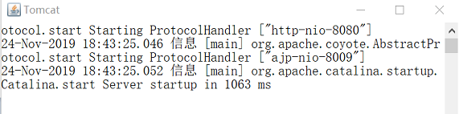
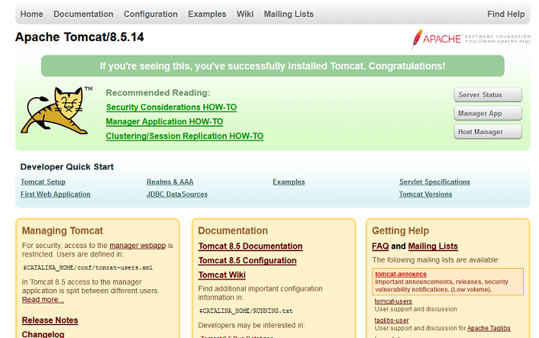
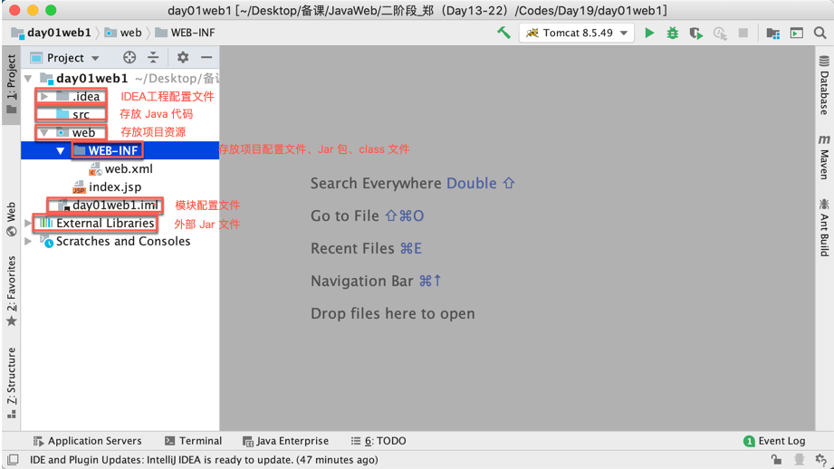
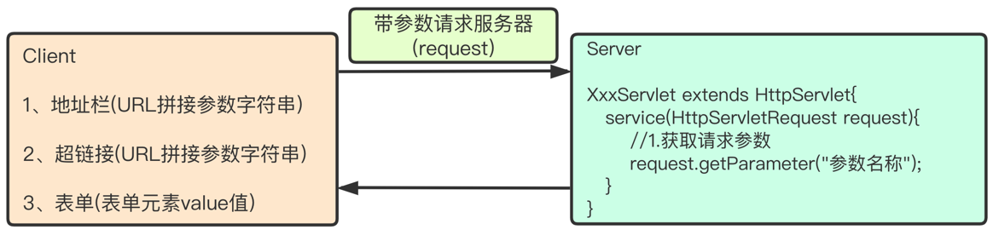
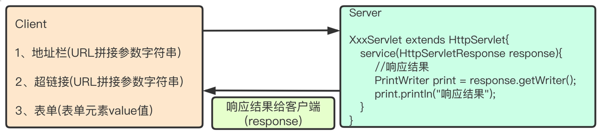
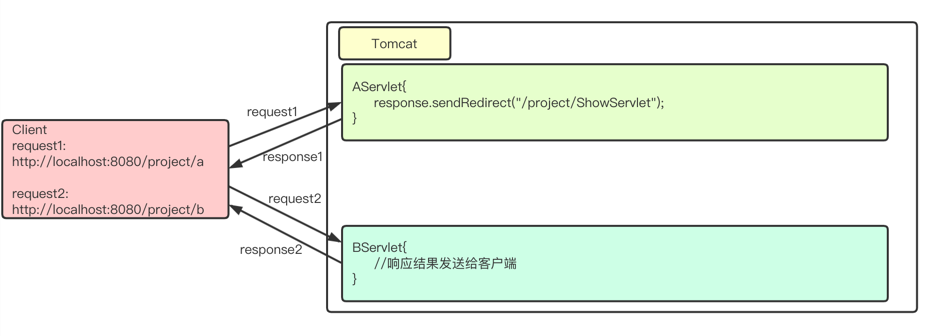

> Author：Gavin
>
> Version：9.0.2


[toc]

### 一、引言

------

#### 1.1 C/S架构和B/S架构

> C/S和B/S是软件发展过程中出现的两种软件架构方式。


####  1.2 C/S架构（Client/Server 客户端/服务器）

> - 特点：必须在客户端安装特定软件
>- 优点：图形效果显示较好(如：3D游戏)
> - 缺点：服务器的软件和功能进行升级，客户端也必须升级、不利于维护
>
> - 常见的C/S程序：QQ、微信等

|         C/S架构          |
| :----------------------: |
|  |


#### 1.3 B/S架构（Browser/Server 浏览器/服务器）

> - 特点：无需安装客户端，任何浏览器都可直接访问
> - 优点：涉及到功能的升级，只需要升级服务器端
> - 缺点：图形显示效果不如C/S架构
> - 需要通过HTTP协议访问

|         B/S架构          |
| :----------------------: |
|  |


### 二 、服务器

------

####  2.1 概念

##### 2.1.1 什么是Web

> Web(World Wide Web) 称为万维网，简单理解就是网站，它用来表示Internet主机上供外界访问的资源。
>
> Internet上供外界访问的资源分为两大类
>
> +  静态资源：指Web页面中供人们浏览的数据始终是不变的。(HTML、CSS)
>
> + 动态资源：指Web页面中供人们浏览的数据是由程序产生的，不同时间点，甚至不同设备访问Web页面看到的内容各不相同。（JSP/Servlet）
>
> - 在Java中，动态Web资源开发技术我们统称为Java Web。


##### 2.1.2 什么是Web服务器

> Web服务器是运行及发布Web应用的容器，只有将开发的Web项目放置到该容器中，才能使网络中的所有用户通过浏览器进行访问。


#### 2.2 常见服务器

> - 开源：OpenSource（1、开放源代码 2、免费）
>   - Tomcat(主流Web服务器之一，适合初学者)
>   - jetty（淘宝，运行效率比Tomcat高）
>   - resin（新浪，所有开源服务器软件中，运行效率最高的）
>   - 三者的用法从代码角度完全相同，只有在开启、关闭服务器软件时对应的命令稍有区别。掌握一个即掌握所有
> - 收费
>   - WebLogic（Oracle）
>   - WebSphere（IBM）
>   - 提供相应的服务与支持，软件大，耗资源


#### 2.3 Tomcat服务器

> Tomcat是Apache 软件基金会（Apache Software Foundation）的Jakarta 项目中的一个核心项目，免费开源、并支持Servlet 和JSP 规范。目前Tomcat最新版本为9.0。
>
> Tomcat 技术先进、性能稳定，深受Java 爱好者喜爱并得到了部分软件开发商的认可，成为目前比较流行的Web 应用服务器。


####  2.4 Tomcat安装


##### 2.4.1 下载

> 官网下载(http://tomcat.apache.org/) Tomcat8.5解压缩版本


##### 2.4.2 解压安装

> 将Tomcat解压到一个没有特殊符号的目录中（一般纯英文即可）
>
> 注意
>
> + 不建议将服务器软件放在磁盘层次很多的文件夹
> + 不建议放在中文路径下


##### 2.4.3 Tomcat目录结构

| 文件夹  | 说明                                                         | 备注                                                         |
| ------- | :----------------------------------------------------------- | ------------------------------------------------------------ |
| bin     | 该目录下存放的是二进制可执行文件                             | startup.bat启动Tomcat、shutdown.bat停止Tomcat                |
| conf    | 这是一个非常重要的目录，这个目录下有两个最为重要的文件server.xml和web.xml | server.xml：配置整个服务器信息。例如修改端口号，编码格式等。<br/>web.xml：项目部署描述符文件，这个文件中注册了很多MIME类型，即文档类型。 |
| lib     | Tomcat的类库，里面存放Tomcat运行所需要的jar文件。            |                                                              |
| logs    | 存放日志文件，记录了Tomcat启动和关闭的信息，如果启动Tomcat时有错误，异常也会记录在日志文件中。 |                                                              |
| temp    | Tomcat的临时文件，这个目录下的东西在停止Tomcat后删除。       |                                                              |
| webapps | 存放web项目的目录，其中每个文件夹都是一个项目；其中ROOT是一个特殊的项目，在地址栏中没有给出项目目录时，对应的就是ROOT项目。 |                                                              |
| work    | 运行时生成的文件，最终运行的文件都在这里。                   | 当客户端用户访问一个JSP文件时，Tomcat会通过JSP生成Java文件，然后再编译Java文件生成class文件，生成的java和class文件都会存放到这个目录下。 |


#### 2.5 Tomcat启动和停止

##### 2.5.1 启动

> 进入tomcat安装目录bin下，双击startup.bat 启动程序，出现如下界面

|   Tomcat启动控制台    |
| :-------------------: |
|  |


##### 2.5.2 验证

> 打开浏览器，输入 http://localhost:8080
>
> 如果出现以下界面证明Tomcat启动成功。

|      Tomcat访问页面      |
| :----------------------: |
|  |


##### 2.5.3 停止

> 双击shutdown.bat即可关闭Tomcat启动窗口。


##### 2.5.4 修改端口号

> Tomcat默认端口号为8080，可以通过conf/server.xml文件修改

```xml
 <Connector port="8080" protocol="HTTP/1.1"
               connectionTimeout="20000"
               redirectPort="8443" />
```

- [注意：修改端口号需要重新启动Tomcat才能生效]()


#### 2.6 项目部署及访问静态资源

> Tomcat是Web服务器，我们的项目应用是部署在webapps下，然后通过特定的[URL]()访问。


##### 2.6.1 创建项目

> -  在webapps中建立文件夹（项目应用），比如：myweb
>   -  创建WEB-INF文件夹，用于存放项目的核心内容
>     -  创建classes，用于存放.class文件
>     -  创建lib，用于存放jar文件
>     -  创建web.xml，项目配置文件（到ROOT项目下的WEB-INF复制即可）
>   -  把网页hello.html复制到myweb文件夹中，与WEB-INF在同级目录


##### 2.6.2 URL访问资源

> 浏览器地址中输入URL：http://localhost:8080/myweb/hello.html

- [经验：URL主要有4部分组成：协议、主机、端口、资源路径]()

|         URL组成          |
| :----------------------: |
|  |


##### 2.6.3 Tomcat响应流程图

|                  请求响应流程图                   |
| :-----------------------------------------------: |
|  |


#### 2.7 常见错误

##### 2.7.1 Tomcat控制台闪退

> 闪退问题是由于JAVA_HOME配置导致的，检查JAVA_HOME配置是否正确


##### 2.7.2 404

> 访问资源不存在，出现404错误

|         404错误          |
| :----------------------: |
|  |


### 三 、Servlet【`重点`】

------

#### 3.1 概念

> - Servlet：Server Applet的简称，是服务器端的程序（代码、功能实现），可交互式的处理客户端发送到服务端的请求，并完成操作响应。
> - 动态网页技术
> - JavaWeb程序开发的基础，JavaEE规范（一套接口）的一个组成部分。


##### 3.1.1 Servlet作用

> - 接收客户端请求，完成操作。
> - 动态生成网页（页面数据可变）。
> - 将包含操作结果的动态网页响应给客户端。


#### 3.2 Servlet开发步骤

##### 3.2.1 搭建开发环境

> 将Servlet相关jar包[(lib\servlet-api.jar)]() 配置到classpath中


##### 3.2.2 编写Servlet

> - 实现javax.servlet.Servlet
> - 重写5个主要方法
> - 在核心的service()方法中编写输出语句，打印访问结果

```java
package com.qf.servlet;
import javax.servlet.Servlet;
import javax.servlet.ServletConfig;
import javax.servlet.ServletRequest;
import javax.servlet.ServletResponse;
import javax.servlet.ServletException;
import java.io.IOException;

public class MyServlet implements Servlet{
	public void init(ServletConfig config) throws ServletException{
	}
    
	public void service(ServletRequest request,ServletResponse response) throws ServletException,IOException{
		System.out.println("My First Servlet!");
	}
    
	public void destroy(){
	
	}
    
	public ServletConfig getServletConfig(){
		return null;	
	}	
    
	public String getServletInfo(){
		return null;
	}
}
```


##### 3.2.3 部署Servlet

> 编译MyServlet后，将生成的.class文件放在WEB-INF/classes文件中。


##### 3.2.4 配置Servlet

> 编写WEB-INF下项目配置文件web.xml

```xml
<?xml version="1.0" encoding="UTF-8"?>
<web-app xmlns:xsi="http://www.w3.org/2001/XMLSchema-instance" xmlns="http://xmlns.jcp.org/xml/ns/javaee" xsi:schemaLocation="http://xmlns.jcp.org/xml/ns/javaee http://xmlns.jcp.org/xml/ns/javaee/web-app_3_1.xsd" version="3.1">
  	
  <!--1、添加servlet节点-->
  <servlet>
  	<servlet-name>MyServlet</servlet-name>
    <servlet-class>com.qf.servlet.MyServlet</servlet-class>
  </servlet>
  <!--2、添加servlet-mapping节点  -->
  <servlet-mapping>
  	<servlet-name>MyServlet</servlet-name>
  	<url-pattern>/myservlet</url-pattern>
  </servlet-mapping>
  
</web-app>
```

- [注意：url-pattern配置的内容就是浏览器地址栏输入的URL中项目名称后资源的内容]()


#### 3.3 运行测试

> 启动Tomcat，在浏览器地址栏中输入http://localhost:8080/myweb/myservlet访问，在Tomcat中打印时间表示成功。


#### 3.4 常见错误

##### 3.4.1 500错误

> 服务端出现异常

|        500错误        |
| :-------------------: |
|  |


### 四、IDEA创建Web项目

------

#### 4.1 IDEA创建Web项目

> 创建项目窗口,选择JavaEE7,并勾选Web Application

|      创建Web项目      |
| :-------------------: |
|  |


> 输入项目名称和项目保存位置，点击Finish,完成项目创建

|     项目目录设置      |
| :-------------------: |
|  |


> Web项目目录介绍

|                   目录结构                    |
| :-------------------------------------------: |
|  |


#### 4.2 IDEA开发Servlet

> 使用开发工具编写Servlet，仍要手工导入[servlet-api.jar]()文件，并与项目关联。


##### 4.2.1 编写Servlet

> 创建MyServlet，实现Servlet接口，覆盖5个方法w


##### 4.2.2 配置web.xml

```xml
<?xml version="1.0" encoding="UTF-8"?>
<web-app xmlns:xsi="http://www.w3.org/2001/XMLSchema-instance" xmlns="http://xmlns.jcp.org/xml/ns/javaee" xsi:schemaLocation="http://xmlns.jcp.org/xml/ns/javaee http://xmlns.jcp.org/xml/ns/javaee/web-app_3_1.xsd" version="3.1">
  	
  <!--1添加servlet节点  -->
  <servlet>
  	<servlet-name>MyServlet</servlet-name>
    <servlet-class>com.qf.servlet.MyServlet</servlet-class>
  </servlet>
  <!--2添加servlet-mapping节点  -->
  <servlet-mapping>
  	<servlet-name>MyServlet</servlet-name>
  	<url-pattern>/myservlet</url-pattern>
  </servlet-mapping>
  
</web-app>
```


##### 4.2.3 部署Web项目

> - 在Tomcat的webapps目录下，新建WebProject项目文件夹
>   - 创建WEB-INF，存放核心文件
>   - 在WEB-INF下，创建classes文件夹，将编译后的MyServlet.class文件复制至此。

- [问题：每当我们编写了新的Servlet或者重新编译，都需要手工将新的.class部署到Tomcat中，较为麻烦。如何实现自动部署？]()


#### 4.3 IDEA部署Web项目

> 前面我们是在Tomcat的webapps目录新建应用程序目录myweb,然后把静态资源和Servlet复制到相关目录下。使用IDEA不需要我们复制了。可以通过IDEA集成Tomcat服务器，实现自动部署。


##### 4.3.1 IDEA集成Tomcat

> 点击File选项，选择Settings

|                 Settings设置                 |
| :------------------------------------------: |
|  |


> 选择Build, Execution, Deployment下的Application Servers。

|                  应用服务器                  |
| :------------------------------------------: |
|  |


> 点击＋号，选择Tomcat Server

|               添加Tomcat服务器               |
| :------------------------------------------: |
|  |


> 选择Tomcat安装目录，点击OK即可

|                选择Tomcat目录                |
| :------------------------------------------: |
|  |


> 最后，点击OK

|                    点击OK                    |
| :------------------------------------------: |
|  |


##### 4.3.2 项目部署Tomcat

> 点击 Add Configuration 

|                 添加项目配置                 |
| :------------------------------------------: |
|  |


> 点击＋号，选择Tomcat Server，选择Local

|               选择Tomcat服务器               |
| :------------------------------------------: |
|  |


> 点击＋号 ，选择 Artifact，添加当前项目

|                 添加当前项目                 |
| :------------------------------------------: |
|  |


> 点击运行按钮，即可运行项目

|                     运行                     |
| :------------------------------------------: |
|  |


#### 4.4 其他操作

##### 4.4.1 关联第三方jar包

> 在[WEB-INF]()目录下新建lib目录

| WEB-INF下新建lib目录  |
| :-------------------: |
|  |


> 输入lib目录

|      文件夹名称       |
| :-------------------: |
|  |


> 复制jar包到lib目录中

|      复制Jar文件      |
| :-------------------: |
|  |


> 右击lib目录，选择Add as Library...

|       项目集成        |
| :-------------------: |
|  |


> 选择Project Library,完成。
>
> + Global Library  表示所有工程都可以使用。
> + Project Library 表示当前工程中所有模块都可以使用。
> + Module Library  表示当前模块可以使用。

|     关键项目环境      |
| :-------------------: |
|  |


##### 4.4.2 如何导出war包

> 项目完成后，有时候需要打成war方便部署。war包可以直接放入Tomcat的webapps目录中，启动Tomcat后自动解压，即可访问。


> 点击项目结构

|       项目结构配置        |
| :-----------------------: |
| **** |


> 选择Artifacts，点击+号

|         添加          |
| :-------------------: |
|  |


> 选择Archive--->For...

|   选择项目对应格式    |
| :-------------------: |
|  |


> 构建项目

|       构建项目        |
| :-------------------: |
|  |


> 在out\artifacts\目录中,查看生产的war包，把war放入Tomcat的webapps目录，启动Tomcat自动解压即可访问。

|       War包目录       |
| :-------------------: |
|  |


### 五、HTTP协议

------

#### 5.1 什么是HTTP

> 超文本传输协议（HTTP，HyperText Transfer Protocol)是互联网上应用最为广泛的一种网络协议,是一个基于请求与响应模式的、无状态的、应用层的协议，运行于TCP协议基础之上。


#### 5.2 HTTP协议特点

> - 支持客户端（浏览器）/服务器模式。
>
> - 简单快速：客户端只向服务器发送请求方法和路径，服务器即可响应数据，因而通信速度很快。请求方法常用的有GET、POST等。
>
> - 灵活：HTTP允许传输任意类型的数据，传输的数据类型由Content-Type标识。
>
>
> - 无连接：无连接指的是每次TCP连接只处理一个或多个请求，服务器处理完客户的请求后，即断开连接。采用这种方式可以节省传输时间。
>   - HTTP1.0版本是一个请求响应之后，直接就断开了。称为短连接。
>   - HTTP1.1版本不是响应后直接就断开了，而是等几秒钟,这几秒钟之内有新的请求，那么还是通过之前的连接通道来收发消息，如果过了这几秒钟用户没有发送新的请求，就会断开连接。称为长连接。
>
> - 无状态：HTTP协议是无状态协议。
>   - 无状态是指协议对于事务处理没有记忆能力。


#### 5.3 HTTP协议通信流程

> - 客户与服务器建立连接（三次握手）。
>
> - 客户向服务器发送请求。
> - 服务器接受请求，并根据请求返回相应的文件作为应答。
> - 客户与服务器关闭连接（四次挥手）。

|          HTTP原理          |
| :------------------------: |
|  |


#### 5.4 请求报文和响应报文【了解】

##### 5.4.1 HTTP请求报文

> 当浏览器向Web服务器发出请求时，它向服务器传递了一个数据块，也就是请求信息（请求报文），HTTP请求信息由4部分组成：
> 1、请求行 请求方法/地址 URI协议/版本
> 2、请求头(Request Header)
> 3、空行
> 4、请求正文

|              请求报文              |
| :--------------------------------: |
|  |


##### 5.4.2 HTTP响应报文

> HTTP响应报文与HTTP请求报文相似，HTTP响应也由4个部分组成：
> 1、状态行
> 2、响应头(Response Header)
> 3、空行
> 4、响应正文

|              响应报文              |
| :--------------------------------: |
|  |


##### 5.4.3 常见状态码

| 状态代码 | 状态描述              | 说明                                                         |
| -------- | --------------------- | ------------------------------------------------------------ |
| 200      | OK                    | 客户端请求成功                                               |
| 302      | Found                 | 临时重定向                                                   |
| 403      | Forbidden             | 服务器收到请求，但是拒绝提供服务。服务器通常会在响应正文中给出不提供服务的原因 |
| 404      | Not Found             | 请求的资源不存在，例如，输入了错误的URL。                    |
| 500      | Internal Server Error | 服务器发生不可预期的错误，导致无法完成客户端的请求。         |


###  六、Servlet详解【`重点`】

------

#### 6.1 Servlet核心接口和类

> 在Servlet体系结构中，除了实现Servlet接口，还可以通过继承GenericServlet 或 HttpServlet类，完成编写。


##### 6.1.1 Servlet接口

> 在Servlet API中最重要的是Servlet接口，所有Servlet都会直接或间接的与该接口发生联系，或是直接实现该接口，或间接继承自实现了该接口的类。
> 该接口包括以下五个方法：
>
> - init(ServletConfig config)
>
> - ServletConfig getServletConfig()
>
> - service(ServletRequest req,ServletResponse res)
>
> - String getServletInfo()
>
> - destroy( )


##### 6.1.2 GenericServlet抽象类

> GenericServlet 使编写 Servlet 变得更容易。它提供生命周期方法 init 和 destroy 的简单实现，要编写一般的 Servlet，只需重写抽象 service 方法即可。 


##### 6.1.3 HttpServlet类

> HttpServlet是继承GenericServlet的基础上进一步的扩展。
> 提供将要被子类化以创建适用于 Web 站点的 HTTP servlet 的抽象类。HttpServlet 的子类至少必须重写一个方法，该方法通常是以下这些方法之一： 
> 	doGet，如果 servlet 支持 HTTP GET 请求 
> 	doPost，用于 HTTP POST 请求 
> 	doPut，用于 HTTP PUT 请求 
> 	doDelete，用于 HTTP DELETE 请求 


#### 6.2 Servlet两种创建方式

##### 6.2.1 实现接口Servlet

```Java
/**
 * Servlet创建的第一种方式：实现接口Servlet
 * */
public class HelloServlet2 implements Servlet{

	@Override
	public void destroy() {
	}

	@Override
	public ServletConfig getServletConfig() {
		return null;
	}

	@Override
	public String getServletInfo() {
		return null;
	}

	@Override
	public void init(ServletConfig arg0) throws ServletException {
	}
	@Override
	public void service(ServletRequest request, ServletResponse response) throws ServletException, IOException {
		System.out.println("OK");
		response.getWriter().println("welcome use servlet");
	}
}
```

- [该方式比较麻烦，需要实现接口中所有方法。]()


##### 6.2.2 继承HttpServlet（推荐）

```Java
/**
 * Servlet implementation class HelloServlet
 * Servlet的第二种创建方式，继承HttpServlet.也是开发中推荐的
 * 
 */
public class HelloServlet extends HttpServlet {
	protected void doGet(HttpServletRequest request, HttpServletResponse response) throws ServletException, IOException {
		
		response.getWriter().print("welcome use servlet");
	}
    
	protected void doPost(HttpServletRequest request, HttpServletResponse response) throws ServletException, IOException {
		doGet(request, response);
	}
}
```


##### 6.2.3 常见错误

> - HTTP Status 404   资源找不到 。
>   - 第一种情况：地址书写错误。
>   - 第二种情况：地址没有问题，把IDEA项目中out目录删除，然后重新运行。
>
> - Serlvet地址配置重复。both mapped to the url-pattern [/helloservlet] which is not permitted。
>
> - Serlvet地址配置错误。比如没有写/  Invalid <url-pattern> [helloservlet2] in servlet mapping。


#### 6.3 Servlet两种配置方式

##### 6.3.1 使用web.xml（Servlet2.5之前使用）

```xml
<?xml version="1.0" encoding="UTF-8"?>
<web-app xmlns:xsi="http://www.w3.org/2001/XMLSchema-instance" xmlns="http://xmlns.jcp.org/xml/ns/javaee" xsi:schemaLocation="http://xmlns.jcp.org/xml/ns/javaee http://xmlns.jcp.org/xml/ns/javaee/web-app_3_1.xsd" version="3.1">
  <display-name>Web_Day11</display-name>
  <!--Servlet的第二种配置  -->
  <!--Servlet配置  -->
  <servlet>
  <!--名称  -->
    <servlet-name>hello2</servlet-name>
    <!--Servlet的全称类名  -->
    <servlet-class>com.qf.web.servlet.HelloServlet</servlet-class>
    <!--启动的优先级，数字越小越先起作用  -->
    <load-on-startup>1</load-on-startup>
  </servlet>
  <!--映射配置  -->
  <servlet-mapping>
  <!--名称  -->
    <servlet-name>hello2</servlet-name>
    <!--资源的匹配规则：精确匹配  -->
    <url-pattern>/hello2</url-pattern>
  </servlet-mapping>
  <welcome-file-list>
    <welcome-file>login.html</welcome-file>
  </welcome-file-list>
</web-app>
```


##### 6.3.2 配置属性

```
url-pattern定义匹配规则，取值说明：
精确匹配     /具体的名称		只有url路径是具体的名称的时候才会触发Servlet
后缀匹配     *.xxx		   只要是以xxx结尾的就匹配触发Servlet
通配符匹配   /* 			   匹配所有请求，包含服务器的所有资源
通配符匹配   /             匹配所有请求，包含服务器的所有资源，不包括.jsp

load-on-startup 
1元素标记容器是否应该在web应用程序启动的时候就加载这个servlet。
2它的值必须是一个整数，表示servlet被加载的先后顺序。
3如果该元素的值为负数或者没有设置，则容器会当Servlet被请求时再加载。
4如果值为正整数或者0时，表示容器在应用启动时就加载并初始化这个servlet，值越小，servlet的优先级越高，就越先被加载。值相同时，容器就会自己选择顺序来加载。
```


##### 6.3.3 使用注解 （Servlet3.0后支持，推荐）

```Java
/**
 * Servlet implementation class HelloServlet
 * 演示Servlet注解式配置
 */
@WebServlet("/hello")
public class HelloServlet extends HttpServlet {
	
	protected void doGet(HttpServletRequest request, HttpServletResponse response) throws ServletException, IOException {
		
		response.getWriter().print("OK");
	}
	
	protected void doPost(HttpServletRequest request, HttpServletResponse response) throws ServletException, IOException {
		doGet(request, response);
	}
}
```


##### 6.3.4 @WebServlet注解常用属性

> - name: Serlvet名字 （可选）
>
> - value: 配置url路径,可以配置多个
>
> - urlPatterns：配置url路径 ，和value作用一样，不能同时使用
>
> - loadOnStartup:配置Servlet的创建的时机， 如果是0或者正数 启动程序时创建，如果是负数，则访问时创建。 数子越小优先级越高。


### 七、Servlet应用【`重点`】

------

#### 	7.1 request对象

> 在Servlet中用来处理客户端请求需要用doGet或doPost方法的request对象

|                       request                        |
| :--------------------------------------------------: |
|  |


##### 7.1.1 get和post区别

> [get请求]()
>
> + get提交的数据会放在URL之后，以?分割URL和传输数据，参数之间以&相连
> + get方式明文传递，数据量小，不安全
> + 效率高，浏览器默认请求方式为GET请求
> + 对应的Servlet的方法是doGet
> 
>[post请求]()
> 
>+ post方法是把提交的数据放在HTTP包的Body中
> + 密文传递数据，数据量大，安全
> +  效率相对没有GET高
> + 对应的Servlet的方法是doPost


##### 7.1.2 request主要方法

| 方法名                                    | 说明                         |
| ----------------------------------------- | ---------------------------- |
| String getParameter(String name)          | 根据表单组件名称获取提交数据 |
| void setCharacterEncoding(String charset) | 指定每个请求的编码           |


##### 7.1.3 request应用

> HTML页面
>

~~~html
<!DOCTYPE html>
<html>
<head>
<meta charset="UTF-8">
<title>欢迎页面</title>
</head>
<body>
<h1>欢迎你</h1>
<div>
<form action="HelloServlet" method="post">
<label>姓名：</label><input type="text" name="name"><br/>
<label>年龄：</label><input type="text"  name="age"><br/>
<input type="submit" value="提交">
</form>
</div>
</body>
</html>
~~~


> Servlet代码
>

~~~java

@WebServlet("/HelloServlet")
public class HelloServlet extends HttpServlet {
	private static final long serialVersionUID = 1L;

	protected void doGet(HttpServletRequest request, HttpServletResponse response) throws ServletException, IOException {
		//获取表单提交的姓名
		String name=request.getParameter("name");
		//获取年龄
		String age=request.getParameter("age");
		//服务端输出打印
		System.out.println(request.getRemoteAddr()+"发来信息：姓名："+name+"---->年龄："+age);
	}

	protected void doPost(HttpServletRequest request, HttpServletResponse response) throws ServletException, IOException {
		doGet(request, response);
	}
}
~~~


##### 7.1.4 get请求收参问题

> 产生乱码是因为服务器和客户端沟通的编码不一致造成的，因此解决的办法是：在客户端和服务器之间设置一个统一的编码，之后就按照此编码进行数据的传输和接收


##### 7.1.5 get中文乱码

> 在Tomcat7及以下版本，客户端以UTF-8的编码传输数据到服务器端，而服务器端的request对象使用的是ISO8859-1这个字符编码来接收数据，服务器和客户端沟通的编码不一致因此才会产生中文乱码的。
>
> - 解决办法：在接收到数据后，先获取request对象以ISO8859-1字符编码接收到的原始数据的字节数组，然后通过字节数组以指定的编码构建字符串，解决乱码问题。
>
>
> - Tomcat8的版本中get方式不会出现乱码了，因为服务器对url的编码格式可以进行自动转换。

~~~java
/**
 * Servlet implementation class HelloServlet
 * 演示Servlet的GET请求,中文乱码的问题
 * 
 */
@WebServlet("/GETServlet")
public class GetServlet extends HttpServlet {
	private static final long serialVersionUID = 1L;

	protected void doGet(HttpServletRequest request, HttpServletResponse response) throws ServletException, IOException {
		//获取表单提交的姓名
		String name=request.getParameter("name");
		name=new String(name.getBytes("ISO8859-1"),"UTF-8");
		//获取年龄
		String age=request.getParameter("age");
		//服务端输出打印
		System.out.println(request.getRemoteAddr()+"发来信息：姓名："+name+"---->年龄："+age);
	}
	
	protected void doPost(HttpServletRequest request, HttpServletResponse response) throws ServletException, IOException {
		doGet(request, response);
	}
}
~~~


##### 7.1.6 post中文乱码

> 由于客户端是以UTF-8字符编码将表单数据传输到服务器端的，因此服务器也需要设置以UTF-8字符编码进行接收。
>
> - 解决方案：使用从ServletRequest接口继承而来的setCharacterEncoding(charset)方法进行统一的编码设置。

~~~Java
/**
 * Servlet implementation class HelloServlet
 * 演示Servlet的GET请求,中文乱码的问题
 * 
 */
@WebServlet("/GETServlet")
public class GetServlet extends HttpServlet {
	private static final long serialVersionUID = 1L;
    
	protected void doGet(HttpServletRequest request, HttpServletResponse response) throws ServletException, IOException {
		}

	protected void doPost(HttpServletRequest request, HttpServletResponse response) throws ServletException, IOException {
		//设置请求参数的编码格式--对GET无效
        request.setCharacterEncoding("UTF-8");
		//获取表单提交的信息
		String name=request.getParameter("msg");
		//服务端输出打印
		System.out.println(request.getRemoteAddr()+"发来信息："+msg);
	}
}
~~~

 

#### 	7.2 response对象

> response对象用于响应客户请求并向客户端输出信息。

|                       response                        |
| :---------------------------------------------------: |
|  |


##### 7.2.1 response主要方法

| 方法名称                     | 作用                               |
| :--------------------------- | :--------------------------------- |
| setHeader(name,value)        | 设置响应信息头                     |
| setContentType(String)       | 设置响应文件类型、响应式的编码格式 |
| setCharacterEncoding(String) | 设置服务端响应内容编码格式         |
| getWriter()                  | 获取字符输出流                     |


##### 7.2.2 response应用

```java
//获取请求参数代码省略
//获取输出流
PrintWriter out=response.getWriter();
out.println("<html>");
out.println("<head><title>login</title></head>");
out.println("<body>");
out.println("<h1>Login Success!!!</h1>");
//out.println("<h1>登录成功!!!</h1>");
out.println("</body>");
out.println("</html>");

```

- [如果输出内容包含中文，则出现乱码，因为服务器默认采用ISO8859-1编码响应内容]()


##### 7.2.3 解决输出中文乱码

> - 设置服务器端响应的编码格式
> - 设置客户端响应内容的头内容的文件类型及编码格式

```java
response.setCharacterEncoding("utf-8");//设置响应编码格式为utf-8
response.setHeader("Content-type","text/html;charset=UTF-8");
```

- [不推荐]()


> 同时设置服务端的编码格式和客户端响应的文件类型及响应时的编码格式

~~~java
response.setContentType("text/html;charset=UTF-8");
~~~

- [推荐]()


#### 7.3 综合案例(Servlet + JDBC)

> - 要求：实现登录功能、展示所有用户功能
>
> - 以下仅展示关键代码


##### 7.3.1 数据库

```mysql
CREATE TABLE admin(
	username VARCHAR(20) PRIMARY KEY,
	PASSWORD VARCHAR(20) NOT NULL,
    phone varchar(11) NOT NULL,
    Address varchar(20) NOT NULL
)CHARSET=utf8;
INSERT INTO admin(username,PASSWORD,phone,address)
VALUES('gavin','123456','12345678901','北京市昌平区');
INSERT INTO admin(username,PASSWORD,phone,address)
VALUES('aaron','123456','12345678901','北京市昌平区');
```


##### 7.3.2 DBUtils

```java
package com.qf.servletProject.utils;

import com.alibaba.druid.pool.DruidDataSource;
import com.alibaba.druid.pool.DruidDataSourceFactory;

import java.io.IOException;
import java.io.InputStream;
import java.sql.Connection;
import java.sql.ResultSet;
import java.sql.SQLException;
import java.sql.Statement;
import java.util.Properties;

public class DbUtils {
    private static DruidDataSource ds;
    private static final ThreadLocal<Connection> THREAD_LOCAL = new ThreadLocal<>();

    static {
        Properties properties = new Properties();
        InputStream inputStream = DbUtils.class.getResourceAsStream("/database.properties");
        try {
            properties.load(inputStream);
            ds = (DruidDataSource) DruidDataSourceFactory.createDataSource(properties);
        } catch (IOException e) {
            e.printStackTrace();
        } catch (Exception e) {
            e.printStackTrace();
        }
    }

    public static Connection getConnection() {
        Connection connection = THREAD_LOCAL.get();
        try {
            if (connection == null) {
                connection = ds.getConnection();
                THREAD_LOCAL.set(connection);
            }
        } catch (SQLException e) {
            e.printStackTrace();
        }
        return connection;
    }

    public static void begin() {
        Connection connection = null;
        try {
            connection = getConnection();
            connection.setAutoCommit(false);
        } catch (SQLException e) {
            e.printStackTrace();
        }
    }

    public static void commit() {
        Connection connection = null;
        try {
            connection = getConnection();
            connection.commit();
        } catch (SQLException e) {
            e.printStackTrace();
        } finally {
            closeAll(connection, null, null);
        }
    }

    public static void rollback() {
        Connection connection = null;
        try {
            connection = getConnection();
            connection.rollback();
        } catch (SQLException e) {
            e.printStackTrace();
        } finally {
            closeAll(connection, null, null);
        }
    }

    public static void closeAll(Connection connection, Statement statement, ResultSet resultSet) {
        try {
            if (resultSet != null) {
                resultSet.close();
            }
            if (statement != null) {
                statement.close();
            }
            if (connection != null) {
                connection.close();
                THREAD_LOCAL.remove();
            }
        } catch (SQLException e) {
            e.printStackTrace();
        }
    }
}

```


##### 7.3.3 AdminDaoImpl

```java
package com.qf.servletProject.dao.impl;

import com.qf.servletProject.dao.AdminDao;
import com.qf.servletProject.entity.Admin;
import com.qf.servletProject.utils.DbUtils;
import org.apache.commons.dbutils.QueryRunner;
import org.apache.commons.dbutils.handlers.BeanHandler;
import org.apache.commons.dbutils.handlers.BeanListHandler;

import java.sql.SQLException;
import java.util.List;

public class AdminDaoImpl implements AdminDao {
    private QueryRunner queryRunner = new QueryRunner();
    @Override
    public int insert(Admin admin) {
        return 0;
    }

    @Override
    public int delete(String username) {
        return 0;
    }

    @Override
    public int update(Admin admin) {
        return 0;
    }

    @Override
    public Admin select(String username) {
        try {
            Admin admin = queryRunner.query(DbUtils.getConnection(),"select * from admin where username=?;",new BeanHandler<Admin>(Admin.class),username);
            return admin;
        } catch (SQLException e) {
            e.printStackTrace();
        }
        return null;
    }

    @Override
    public List<Admin> selectAll() {
        try {
            List<Admin> admins = queryRunner.query(DbUtils.getConnection(),"select * from admin",new BeanListHandler<Admin>(Admin.class));
            return admins;
        } catch (SQLException e) {
            e.printStackTrace();
        }
        return null;
    }
}

```


##### 7.3.4 AdminServiceImpl

```java
package com.qf.servletProject.service.impl;

import com.qf.servletProject.dao.AdminDao;
import com.qf.servletProject.dao.impl.AdminDaoImpl;
import com.qf.servletProject.entity.Admin;
import com.qf.servletProject.service.AdminService;
import com.qf.servletProject.utils.DbUtils;

import java.util.List;

public class AdminServiceImpl implements AdminService {
    private AdminDao adminDao = new AdminDaoImpl();
    @Override
    public Admin login(String username, String password) {
        Admin result = null;
        try {
            DbUtils.begin();
            Admin admin = adminDao.select(username);
            if(admin!=null){
                if(admin.getPassword().equals(password)){
                    result = admin;
                }
            }
            DbUtils.commit();
        } catch (Exception e) {
            DbUtils.rollback();
            e.printStackTrace();
        }
        return result;
    }

    @Override
    public List<Admin> showAllAdmin() {
        List<Admin> admins = null;
        try {
            DbUtils.begin();
            admins = adminDao.selectAll();
            DbUtils.commit();
        } catch (Exception e) {
            DbUtils.rollback();
            e.printStackTrace();
        }

        return admins;
    }
}

```


##### 7.3.5 HTML页面代码

```html
<!DOCTYPE html>
<html lang="en">
<head>
    <meta charset="UTF-8">
    <title>登录页面</title>
</head>
<body>
    <form action="/WebProject_war_exploded/login" method="post">
        用户名:<input type="text" name="username" /><br/>
        密码:<input type="password" name="password"><br/>
        <input type="submit" value="登录" />
    </form>
</body>
</html>
```


##### 7.3.6 LoginServlet

```java
package com.qf.servletProject.servlet;

import com.qf.servletProject.entity.Admin;
import com.qf.servletProject.service.AdminService;
import com.qf.servletProject.service.impl.AdminServiceImpl;

import javax.servlet.ServletException;
import javax.servlet.annotation.WebServlet;
import javax.servlet.http.HttpServlet;
import javax.servlet.http.HttpServletRequest;
import javax.servlet.http.HttpServletResponse;
import java.io.IOException;
import java.io.PrintWriter;

@WebServlet(value = "/login")
public class LoginServlet extends HttpServlet {
    @Override
    protected void doGet(HttpServletRequest req, HttpServletResponse resp) throws ServletException, IOException {
        req.setCharacterEncoding("UTF-8");
        resp.setContentType("text/html;charset=UTF-8");
        //1.收参
        String username = req.getParameter("username");
        String password = req.getParameter("password");
        //2.调用业务逻辑
        AdminService adminService = new AdminServiceImpl();
        Admin admin = adminService.login(username,password);
        //3.处理结果
        PrintWriter printWriter = resp.getWriter();
        if(admin!=null){
            //响应给客户端一个结果页面，显示登录成功
            printWriter.println("<html>");
            printWriter.println("<head>");
            printWriter.println("<meta charset='UTF-8'>");
            printWriter.println("<title>结果页面</title>");
            printWriter.println("</head>");
            printWriter.println("<body>");
            printWriter.println("<h1>登录成功！</h1>");
            printWriter.println("</body>");
            printWriter.println("</html>");
        }else{
            //响应给客户端一个结果页面，显示登录失败！
            printWriter.println("<html>");
            printWriter.println("<head>");
            printWriter.println("<meta charset='UTF-8'>");
            printWriter.println("<title>结果页面</title>");
            printWriter.println("</head>");
            printWriter.println("<body>");
            printWriter.println("<h1>登录失败！</h1>");
            printWriter.println("</body>");
            printWriter.println("</html>");
        }
    }

    @Override
    protected void doPost(HttpServletRequest req, HttpServletResponse resp) throws ServletException, IOException {
        doGet(req,resp);
    }
}

```


##### 7.3.7 ShowAllAdminServlet

```java
package com.qf.servletProject.servlet;

import com.qf.servletProject.entity.Admin;
import com.qf.servletProject.service.AdminService;
import com.qf.servletProject.service.impl.AdminServiceImpl;

import javax.servlet.ServletException;
import javax.servlet.annotation.WebServlet;
import javax.servlet.http.HttpServlet;
import javax.servlet.http.HttpServletRequest;
import javax.servlet.http.HttpServletResponse;
import java.io.IOException;
import java.io.PrintWriter;
import java.util.List;

@WebServlet(value = "/showall")
public class ShowAllAdminServlet extends HttpServlet {
    @Override
    protected void doGet(HttpServletRequest req, HttpServletResponse resp) throws ServletException, IOException {
        resp.setContentType("text/html;charset=utf-8");
        AdminService adminService = new AdminServiceImpl();

        List<Admin> adminList = adminService.showAllAdmin();

        PrintWriter printWriter = resp.getWriter();

        if(adminList!=null){
            printWriter.println("<html>");
            printWriter.println("<head>");
            printWriter.println("<meta charset='UTF-8'>");
            printWriter.println("<title>显示所有</title>");
            printWriter.println("</head>");
            printWriter.println("<body>");
            printWriter.println("<table border='1'>");
            printWriter.println("   <tr>");
            printWriter.println("       <td>username</td>");
            printWriter.println("       <td>password</td>");
            printWriter.println("       <td>phone</td>");
            printWriter.println("       <td>address</td>");
            printWriter.println("   </tr>");
            for(Admin admin : adminList){
                printWriter.println("   <tr>");
                printWriter.println("       <td>"+admin.getUsername()+"</td>");
                printWriter.println("       <td>"+admin.getPassword()+"</td>");
                printWriter.println("       <td>"+admin.getPhone()+"</td>");
                printWriter.println("       <td>"+admin.getAddress()+"</td>");
                printWriter.println("   </tr>");
            }
            printWriter.println("</table>");
            printWriter.println("</body>");
            printWriter.println("</html>");
        }else{
            printWriter.println("<html>");
            printWriter.println("<head>");
            printWriter.println("<meta charset='UTF-8'>");
            printWriter.println("<title>显示所有</title>");
            printWriter.println("</head>");
            printWriter.println("<body>");
            printWriter.println("<h3>当前没有用户！</h3>");
            printWriter.println("</body>");
            printWriter.println("</html>");
        }
    }

    @Override
    protected void doPost(HttpServletRequest req, HttpServletResponse resp) throws ServletException, IOException {
        doGet(req,resp);
    }
}

```


### 八、 转发与重定向

------

#### 8.1 现有问题

> 在之前案例中，调用业务逻辑和显示结果页面都在同一个Servlet里，就会产生设计问题
>
> - 不符合单一职能原则、各司其职的思想
> - 不利于后续的维护
>
> 应该将业务逻辑和显示结果分离开

|                  现阶段问题                  |
| :------------------------------------------: |
|  |


##### 8.1.1 业务、显示分离

|                业务与显示分离                |
| :------------------------------------------: |
|  |


- [问题：业务逻辑和显示结果分离后，如何跳转到显示结果的Servlet？]()
- [业务逻辑得到的数据结果如何传递给显示结果的Servlet？]()


#### 8.2 转发

> 转发的作用在服务器端，将请求发送给服务器上的其他资源，以共同完成一次请求的处理。


##### 8.2.1 页面跳转

> 在调用业务逻辑的Servlet中，编写以下代码
>
> - request.getRequestDispatcher("/目标URL-pattern").forward(request, response);

|                     forward                      |
| :----------------------------------------------: |
|  |

- [使用forward跳转时，是在服务器内部跳转，地址栏不发生变化，属于同一次请求]()


##### 8.2.2 数据传递

> forward表示一次请求，是在服务器内部跳转，可以共享同一次request作用域中的数据
>
> - request作用域：拥有存储数据的空间，作用范围是一次请求有效(一次请求可以经过多次转发)
>   - 可以将数据存入request后，在一次请求过程中的任何位置进行获取
>   - 可传递任何数据(基本数据类型、对象、数组、集合等)
>   
> - 存数据：request.setAttribute(key,value); 
>   
>   - 以键值对形式存储在request作用域中。key为String类型，value为Object类型
>   
> - 取数据：request.getAttribute(key);
>   
>   - 通过String类型的key访问Object类型的value


##### 8.2.3 转发特点

> - 转发是服务器行为
>
> - 转发是浏览器只做了一次访问请求
>
> - 转发浏览器地址不变
>
> - 转发两次跳转之间传输的信息不会丢失，所以可以通过request进行数据的传递、
>
> - 转发只能将请求转发给同一个Web应用中的组件


#### 8.3 重定向

> 重定向作用在客户端，客户端将请求发送给服务器后，服务器响应给客户端一个新的请求地址，客户端重新发送新请求。
>


##### 8.3.1 页面跳转

> 在调用业务逻辑的Servlet中，编写以下代码
>
> - response.sendRedirect("目标URI");

- [URI:统一资源标识符(Uniform Resource Identifier)，用来表示服务器中定位一个资源，资源在web项目中的路径(/project/source)]()


|                     redirect                      |
| :-----------------------------------------------: |
|  |

- [使用redirect跳转时，是在客户端跳转，地址栏发生变化，属于多次请求]()


##### 8.3.2 数据传递

> sendRedirect跳转时，地址栏改变，代表客户端重新发送的请求。属于两次请求
>
> - response没有作用域，两次request请求中的数据无法共享
> - 传递数据：通过URI的拼接进行数据传递("/WebProject/b?username=tom");
> - 获取数据：request.getParameter("username");


##### 8.3.3 重定向特点

> - 重定向是客户端行为。
>
> - 重定向是浏览器做了至少两次的访问请求。
>
> - 重定向浏览器地址改变。
>
> - 重定向两次跳转之间传输的信息会丢失（request范围）。
>
> - 重定向可以指向任何的资源，包括当前应用程序中的其他资源、同一个站点上的其他应用程序中的资源、其他站点的资源。


#### 8.4 转发、重定向总结

> 当两个Servlet需要传递数据时，选择forward转发。不建议使用sendRedirect进行传递


### 九、 Servlet生命周期

------

#### 9.1 生命周期四个阶段

##### 9.1.1 实例化

> 当用户第一次访问Servlet时，由容器调用Servlet的构造器创建具体的Servlet对象。也可以在容器启动之后立刻创建实例。使用如下代码可以设置Servlet是否在服务器启动时就创建。
> <load-on-startup>1</load-on-startup> 
>
> + 注意：只执行一次


##### 9.1.2 初始化

> 在初始化阶段，init()方法会被调用。这个方法在javax.servlet.Servlet接口中定义。其中，方法以一个ServletConfig类型的对象作为参数。
>
> + 注意：init方法只被执行一次


##### 9.1.3 服务

> 当客户端有一个请求时，容器就会将请求ServletRequest与响应ServletResponse对象转给Servlet，以参数的形式传给service方法。
>
> + 此方法会执行多次


##### 9.1.4 销毁

> 当Servlet容器停止或者重新启动都会引起销毁Servlet对象并调用destroy方法。
>
> + destroy方法执行一次


##### 9.1.5 Servlet执行流程

|                 Servlet执行流程                  |
| :----------------------------------------------: |
|  |


```java
/**
 * Servlet implementation class LifeServlet
 * 演示Servlet的生命周期：
 * 1、实例化
 * 2、init:初始化
 * 3、service：服务
 * 4、destory：销毁
 */
@WebServlet("/lifeservlet")
public class LifeServlet extends HttpServlet {
    
    public LifeServlet() {
        super();
        System.out.println("1、完成了实例化");
    }
    @Override
    public void init() throws ServletException {
    	super.init();
    	System.out.println("2、完成了初始化");
    }

	
	protected void doGet(HttpServletRequest request, HttpServletResponse response) throws ServletException, IOException {
		System.out.println("3、就绪中");
		response.getWriter().append("Served at: ").append(request.getContextPath());
	}

	
	protected void doPost(HttpServletRequest request, HttpServletResponse response) throws ServletException, IOException {
		doGet(request, response);
	}
	
	@Override
	public void destroy() {
		super.destroy();
		System.out.println("4、销毁了");
	}
}
```


### 十、Servlet特性

------

#### 10.1 线程安全问题

> Servlet在访问之后，会执行实例化操作，创建一个Servlet对象。而我们Tomcat容器可以同时多个线程并发访问同一个Servlet，如果在方法中对成员变量做修改操作，就会有线程安全的问题。


#### 10.2 如何保证线程安全

> - synchronized
>   - 将存在线程安全问题的代码放到同步代码块中
>
> - 实现SingleThreadModel接口
>   - servlet实现SingleThreadModel接口后，每个线程都会创建servlet实例，这样每个客户端请求就不存在共享资源的问题，但是servlet响应客户端请求的效率太低，所以已经淘汰。
>
> - 尽可能使用局部变量

```java
package com.qf.servlet3;

import javax.servlet.ServletException;
import javax.servlet.SingleThreadModel;
import javax.servlet.http.HttpServlet;
import javax.servlet.http.HttpServletRequest;
import javax.servlet.http.HttpServletResponse;
import java.io.IOException;
import java.io.PrintWriter;

public class SafeServlet extends HttpServlet  implements SingleThreadModel {
     //private String message = "";

    @Override
    protected void doGet(HttpServletRequest req, HttpServletResponse resp) throws ServletException, IOException {
        String message = "";
        //假设1、接收参数
        //2、调用业务逻辑 得到登录结果
        message = "登录成功";//登录失败！
        PrintWriter printWriter = resp.getWriter();
        printWriter.println(message);

    }

    @Override
    protected void doPost(HttpServletRequest req, HttpServletResponse resp) throws ServletException, IOException {
        doGet(req,resp);
    }
}

```


### 十一、状态管理

------

#### 11.1 现有问题

> - HTTP协议是无状态的，不能保存每次提交的信息
>
> -  如果用户发来一个新的请求，服务器无法知道它是否与上次的请求有联系。
>
> - 对于那些需要多次提交数据才能完成的Web操作，比如登录来说，就成问题了。


#### 11.2 概念

> 将浏览器与web服务器之间多次交互当作一个整体来处理，并且将多次交互所涉及的数据（即状态）保存下来。


#### 11.3 状态管理分类

> - 客户端状态管理技术：将状态保存在客户端。代表性的是Cookie技术。
>
> - 服务器状态管理技术：将状态保存在服务器端。代表性的是session技术（服务器传递sessionID时需要使用Cookie的方式）


### 十二、Cookie的使用

------

#### 12.1 什么是Cookie

> - Cookie是在浏览器访问Web服务器的某个资源时，由Web服务器在HTTP响应消息头中附带传送给浏览器的一小段数据。
>
> 
>- 一旦Web浏览器保存了某个Cookie，那么它在以后每次访问该Web服务器时，都应在HTTP请求头中将这个Cookie回传给Web服务器。
> 
>
> - 一个Cookie主要由标识该信息的名称（name）和值（value）组成。
>

|                       Cookie原理                        |
| :-----------------------------------------------------: |
|  |


#### 12.2 创建Cookie

```java
		//创建Cookie
		Cookie ck=new Cookie("code", code);
		ck.setPath("/webs");//设置Cookie的路径
		ck.setMaxAge(-1);//内存存储，取值有三种：>0有效期，单位秒；=0浏览器关闭；<0内存存储,默认-1
		response.addCookie(ck);//添加到response对象中，响应时发送给客户端
        //注意：有效路径: 当前访问资源的上一级目录，不带主机名
```

+ [chrome浏览器查看cookie信息：chrome://settings/content/cookies]()


#### 12.3 获取Cookie

```java
//获取所有的Cookie
Cookie[] cks=request.getCookies();
		//遍历Cookie
		for(Cookie ck:cks){
          //检索出自己的Cookie
			if(ck.getName().equals("code"))
			{
              //记录Cookie的值
				code=ck.getValue();
				break;
			}
		}
```


#### 12.4 修改Cookie

> 只需要保证Cookie的名和路径一致即可修改

```java
	//修改Cookie
    Cookie ck=new Cookie("code", code);
    ck.setPath("/webs");//设置Cookie的路径
    ck.setMaxAge(-1);//内存存储，取值有三种：>0有效期，单位秒；=0失效；<0内存存储
    response.addCookie(ck);//让浏览器添加Cookie
```

+ [注意：如果改变cookie的name和有效路径会新建cookie, 而改变cookie值、有效期会覆盖原有cookie]()


#### 12.5 Cookie编码与解码

> Cookie默认不支持中文，只能包含ASCII字符，所以Cookie需要对Unicode字符进行编码，否则会出现乱码。
>
> - 编码可以使用java.net.URLEncoder类的encode(String str,String encoding)方法
>
> - 解码使用java.net.URLDecoder类的decode(String str,String encoding)方法


##### 12.5.1 创建带中文Cookie

```java
 // 使用中文的 Cookie. name 与 value 都使用 UTF-8 编码. 
    Cookie cookie = new Cookie(
        URLEncoder.encode("姓名", "UTF-8"), 
        URLEncoder.encode("老邢", "UTF-8"));
    // 发送到客户端   
    response.addCookie(cookie);
```


##### 12.5.2 读取带中文Cookie

```java
    if(request.getCookies() != null){
        for(Cookie cc : request.getCookies()){
            String cookieName = URLDecoder.decode(cc.getName(), "UTF-8");
            String cookieValue = URLDecoder.decode(cc.getValue(), "UTF-8");
            out.println(cookieName + "=");
            out.println(cookieValue + "; <br/>");
        }
    }
    else{
        out.println("Cookie 已经写入客户端. 请刷新页面. ");
    }
```


#### 12.6 Cookie优点和缺点

##### 12.6.1 优点

> - 可配置到期规则。
>
> - 简单性：Cookie 是一种基于文本的轻量结构，包含简单的键值对。
>
> - 数据持久性：Cookie默认在过期之前是可以一直存在客户端浏览器上的。


##### 12.6.2 缺点

> - 大小受到限制：大多数浏览器对 Cookie 的大小有 4K、8K字节的限制。
>
> - 用户配置为禁用：有些用户禁用了浏览器或客户端设备接收 Cookie 的能力，因此限制了这一功能。、
>
> - 潜在的安全风险：Cookie 可能会被篡改。会对安全性造成潜在风险或者导致依赖于Cookie 的应用程序失败。


### 十三、Session对象【`重点`】

------

#### 13.1 Session概述

> - Session用于记录用户的状态。Session指的是在一段时间内，单个客户端与Web服务器的一连串相关的交互过程。
> - 在一个Session中，客户可能会多次请求访问同一个资源，也有可能请求访问各种不同的服务器资源。


#### 13.2 Session原理

> - 服务器会为每一次会话分配一个Session对象
>
> - 同一个浏览器发起的多次请求，同属于一次会话(Session)
> - 首次使用到Session时，服务器会自动创建Session，并创建Cookie存储SessionId发送回客户端

- [注意：session是由服务端创建的。]()


#### 13.3 Session使用

> - Session作用域：拥有存储数据的空间，作用范围是一次会话有效
>   - 一次会话是使用同一浏览器发送的多次请求。一旦浏览器关闭，则结束会话
>   - 可以将数据存入Session中，在一次会话的任意位置进行获取
>   - 可传递任何数据(基本数据类型、对象、集合、数组)


##### 13.3.1 获取Session

> session是服务器端自动创建的，通过request对象获取

```java
        //获取Session对象
		HttpSession session=request.getSession();
		System.out.println("Id："+session.getId());//唯一标记，
```


##### 13.3.2 Session保存数据

> ​	setAttribute(属性名,Object)保存数据到session中

```java
	session.setAttribute("key",value);//以键值对形式存储在session作用域中。
```


##### 13.3.3 Session获取数据

> ​	getAttribute(属性名);获取session中数据

```java
	session.getAttribute("key");//通过String类型的key访问Object类型的value
```


##### 13.3.4 Session移除数据

> ​	removeAttribute(属性名);从session中删除数据	

```java
	session.removeAttribute("key");//通过键移除session作用域中的值
```


#### 13.4 Session与Request应用区别

> - request是一次请求有效，请求改变，则request改变
> - session是一次会话有效，浏览器改变，则session改变


##### 13.4.1 Session应用

```java
package com.qf.sessions;

import javax.servlet.ServletException;
import javax.servlet.annotation.WebServlet;
import javax.servlet.http.HttpServlet;
import javax.servlet.http.HttpServletRequest;
import javax.servlet.http.HttpServletResponse;
import javax.servlet.http.HttpSession;
import java.io.IOException;

@WebServlet(name = "SessionServlet",value = "/ss")
public class SessionServlet extends HttpServlet {
    protected void doPost(HttpServletRequest request, HttpServletResponse response) throws ServletException, IOException {
        //1.通过request对象获取Session对象
        HttpSession session = request.getSession();

        //2.使用session保存数据
        session.setAttribute("username","gavin");
        request.setAttribute("password","123456");

        response.sendRedirect("/WebProject_war_exploded/getValue");
        System.out.println(session.getId());
    }

    protected void doGet(HttpServletRequest request, HttpServletResponse response) throws ServletException, IOException {
        doPost(request,response);
    }
}

```


##### 13.4.2 GetValueServlet.java

```java
package com.qf.sessions;

import javax.servlet.ServletException;
import javax.servlet.annotation.WebServlet;
import javax.servlet.http.HttpServlet;
import javax.servlet.http.HttpServletRequest;
import javax.servlet.http.HttpServletResponse;
import javax.servlet.http.HttpSession;
import java.io.IOException;

@WebServlet(name = "GetValueServlet",value = "/getValue")
public class GetValueServlet extends HttpServlet {
    protected void doPost(HttpServletRequest request, HttpServletResponse response) throws ServletException, IOException {
        //1.通过request获取session对象
        HttpSession session = request.getSession();

        String password = (String)request.getAttribute("password");
        String s = (String) session.getAttribute("username");

        System.out.println("从session中获得了："+s);
        System.out.println("从reqeust中获得了："+password);


    }

    protected void doGet(HttpServletRequest request, HttpServletResponse response) throws ServletException, IOException {
        doPost(request,response);
    }
}

```


#### 13.5 Session的生命周期

> - 开始：第一次使用到Session的请求产生，则创建Session
>
> - 结束：
>   - 浏览器关闭，则失效
>   - Session超时，则失效
>     - session.setMaxInactiveInterval(seconds);//设置最大有效时间(单位：秒)
>   - 手工销毁，则失效
>     - session.invalidate();//登录退出、注销


##### 13.5.1 Session失效

```java
	session.setMaxInactiveInterval(60*60);//设置session最大有效期为一小时

	session.invalidate();//手工销毁
```


#### 13.4 浏览器禁用Cookie解决方案【了解】

##### 13.4.1 浏览器禁用Cookie的后果

> 服务器在默认情况下，会使用Cookie的方式将sessionID发送给浏览器，如果用户禁止Cookie，则sessionID不会被浏览器保存，此时，服务器可以使用如URL重写这样的方式来发送sessionID。


##### 13.4.2 URL重写

> 浏览器在访问服务器上的某个地址时，不再使用原来的那个地址，而是使用经过改写的地址（即在原来的地址后面加上了sessionID）。


##### 13.4.3 实现URL重写

> response.encodeRedirectURL(String url)生成重写的URL。

```java
 				HttpSession session = request.getSession();
				//重写URL追加SessionId
        String newUrl = response.encodeRedirectURL("/WebProject_war_exploded/cs");
        System.out.println(newUrl);
		
        response.sendRedirect(newUrl2);
```


#### 13.5 Session实战权限验证

|                  Session记录登录状态                  |
| :---------------------------------------------------: |
|  |


##### 13.5.1 创建管理员表

```mysql
CREATE TABLE Manager(
	username VARCHAR(20) PRIMARY KEY,
    password VARCHAR(20) NOT NULL
)charset=utf8;
```


##### 13.5.2 登录页面

```html
<!DOCTYPE html>
<html lang="en">
<head>
    <meta charset="UTF-8">
    <title>管理员登录</title>
    </head>
    <body>
    <form action="/WebProject_war_exploded/loginMgr" method="post">
        用户名：<input type="text" name="username"/><br/>
        密码：<input type="password" name="password" /><br/>
        <input type="submit" value="登录">
    </form>
</body>
</html>
```


##### 13.5.3 LoginMgrController

```java
package com.qf.servletProject.servlet.controller;

import com.qf.servletProject.entity.Manager;
import com.qf.servletProject.service.ManagerService;
import com.qf.servletProject.service.impl.ManagerServiceImpl;

import javax.servlet.ServletException;
import javax.servlet.annotation.WebServlet;
import javax.servlet.http.HttpServlet;
import javax.servlet.http.HttpServletRequest;
import javax.servlet.http.HttpServletResponse;
import javax.servlet.http.HttpSession;
import java.io.IOException;

@WebServlet(name = "LoginMgrController",value = "/loginMgr")
public class LoginMgrController extends HttpServlet {
    protected void doPost(HttpServletRequest request, HttpServletResponse response) throws ServletException, IOException {
        //1.处理乱码
        request.setCharacterEncoding("UTF-8");
        response.setContentType("text/html;charset=utf-8");
        //2.收参
        String username = request.getParameter("username");
        String password = request.getParameter("password");
        //3.调用业务方法
        ManagerService managerService = new ManagerServiceImpl();
        Manager mgr = managerService.login(username,password);
        //4.处理结果，流程跳转
        if(mgr!=null){
            //登录成功
            //将管理员信息存储在Session里
            HttpSession session = request.getSession();
            session.setAttribute("mgr",mgr);
            //跳转  目标、方式
            response.sendRedirect("/WebProject_war_exploded/showallcontroller");
        }else{
            //登录失败
            response.sendRedirect("/WebProject_war_exploded/loginMgr.html");
        }
    }

    protected void doGet(HttpServletRequest request, HttpServletResponse response) throws ServletException, IOException {
        doPost(request, response);
    }
}

```


##### 13.5.4 ShowAllAdminController

```java
package com.qf.servletProject.servlet.controller;

import com.qf.servletProject.entity.Admin;
import com.qf.servletProject.entity.Manager;
import com.qf.servletProject.service.AdminService;
import com.qf.servletProject.service.impl.AdminServiceImpl;

import javax.servlet.RequestDispatcher;
import javax.servlet.ServletException;
import javax.servlet.annotation.WebServlet;
import javax.servlet.http.HttpServlet;
import javax.servlet.http.HttpServletRequest;
import javax.servlet.http.HttpServletResponse;
import javax.servlet.http.HttpSession;
import java.io.IOException;
import java.util.List;

@WebServlet(value = "/showallcontroller")
public class ShowAllAdminController extends HttpServlet {
    @Override
    protected void doGet(HttpServletRequest req, HttpServletResponse resp) throws ServletException, IOException {
        //通过HttpSession完成权限控制
        HttpSession session = req.getSession();
        Manager mgr  =(Manager)session.getAttribute("mgr");
        if(mgr !=null){
            //只负责调用业务逻辑功能
            AdminService adminService = new AdminServiceImpl();

            List<Admin> adminList = adminService.showAllAdmin();

            //request作用域存储数据
            req.setAttribute("admins",adminList);
            //通过转发 跳转到显示结果servlet
            req.getRequestDispatcher("/showalljsp").forward(req,resp);
        }else{
            resp.sendRedirect("/WebProject_war_exploded/loginMgr.html");
        }

    }

    @Override
    protected void doPost(HttpServletRequest req, HttpServletResponse resp) throws ServletException, IOException {
        doGet(req,resp);
    }
}

```


#### 13.6 Session实战保存验证码

##### 13.6.1 创建验证码

> - 导入ValidateCode.jar
>
> - 创建生成验证码的Servlet

```java
/**
 * Servlet implementation class CreateCode
 * 验证码的生成
 */
@WebServlet("/createcode")
public class CreateCode extends HttpServlet {
	protected void doGet(HttpServletRequest request, HttpServletResponse response) throws ServletException, IOException {
		ValidateCode vc=new ValidateCode(200, 30, 4, 10);
		String code=vc.getCode();
		System.out.println(request.getRemoteAddr()+":生成:"+code);
		//使用Session存储生成的验证码
		HttpSession session=request.getSession();
      	session.setAttribute("code",code);
        //响应给客户端
		vc.write(response.getOutputStream());
	}

	/**
	 * @see HttpServlet#doPost(HttpServletRequest request, HttpServletResponse response)
	 */
	protected void doPost(HttpServletRequest request, HttpServletResponse response) throws ServletException, IOException {
		// TODO Auto-generated method stub
		doGet(request, response);
	}
}
```


##### 13.6.2 登录页面

```html
<!DOCTYPE html>
<html lang="en">
<head>
    <meta charset="UTF-8">
    <title>管理员登录</title>
    </head>
    <body>
    <form action="/WebProject_war_exploded/loginMgr" method="post">
        用户名：<input type="text" name="username"/><br/>
        密码：<input type="password" name="password" /><br/>
        验证码：<input type="text" name="inputVcode"/> <br/>
        <input type="submit" value="登录">
    </form>
</body>
</html>
```


##### 13.6.3 LoginMgrController

```java
package com.qf.servletProject.servlet.controller;

import com.qf.servletProject.entity.Manager;
import com.qf.servletProject.service.ManagerService;
import com.qf.servletProject.service.impl.ManagerServiceImpl;

import javax.servlet.ServletException;
import javax.servlet.annotation.WebServlet;
import javax.servlet.http.HttpServlet;
import javax.servlet.http.HttpServletRequest;
import javax.servlet.http.HttpServletResponse;
import javax.servlet.http.HttpSession;
import java.io.IOException;

@WebServlet(name = "LoginMgrController", value = "/loginMgr")
public class LoginMgrController extends HttpServlet {
    protected void doPost(HttpServletRequest request, HttpServletResponse response) throws ServletException, IOException {
        //1.处理乱码
        request.setCharacterEncoding("UTF-8");
        response.setContentType("text/html;charset=utf-8");

        //2.收参
        String username = request.getParameter("username");
        String password = request.getParameter("password");
        String inputVcode = request.getParameter("inputVcode");

        String codes = (String) request.getSession().getAttribute("codes");
        if (!inputVcode.isEmpty() && inputVcode.equalsIgnoreCase(codes)) {

            //3.调用业务方法
            ManagerService managerService = new ManagerServiceImpl();
            Manager mgr = managerService.login(username, password);
            //4.处理结果，流程跳转
            if (mgr != null) {
                //登录成功
                //将管理员信息存储在Session里
                HttpSession session = request.getSession();
                session.setAttribute("mgr", mgr);
                //跳转  目标、方式
                response.sendRedirect("/WebProject_war_exploded/showallcontroller");
            } else {
                //登录失败
                response.sendRedirect("/WebProject_war_exploded/loginMgr.html");
            }
        }else{
            response.sendRedirect("/WebProject_war_exploded/loginMgr.html");
        }

    }

    protected void doGet(HttpServletRequest request, HttpServletResponse response) throws ServletException, IOException {
        doPost(request, response);
    }
}

```


### 十四、ServletContext对象【`重点`】

------

#### 14.1 ServletContext概述

> - 全局对象，也拥有作用域，对应一个Tomcat中的Web应用
>
> - 当Web服务器启动时，会为每一个Web应用程序创建一块共享的存储区域（ServletContext）。
>
> - ServletContext在Web服务器启动时创建，服务器关闭时销毁。


#### 14.2 获取ServletContext对象

> - GenericServlet提供了getServletContext()方法。（推荐） this.getServletContext();
>
> - HttpServletRequest提供了getServletContext()方法。(推荐)
>
> - HttpSession提供了getServletContext()方法。


#### 14.3 ServletContext作用

##### 14.3.1 获取项目真实路径

> 获取当前项目在服务器发布的真实路径

```java
String realpath=servletContext.getRealPath("/");
```


##### 14.3.2 获取项目上下文路径

> 获取当前项目上下文路径（应用程序名称）

```java
System.out.println(servletContext.getContextPath());//上下文路径（应用程序名称）
System.out.println(request.getContextPath());
```


##### 14.3.3 全局容器

> ServletContext拥有作用域，可以存储数据到全局容器中
>
> - 存储数据：servletContext.setAttribute("name",value);
> - 获取数据：servletContext.getAttribute("name");
>
> - 移除数据：servletContext.removeAttribute("name");


#### 14.4 ServletContext特点

> - 唯一性: 一个应用对应一个ServletContext。
>
> - 生命周期: 只要容器不关闭或者应用不卸载，ServletContext就一直存在。


#### 14.5 ServletContext应用场景

> ServletContext统计当前项目访问次数

```java
package com.qf.servlet;

import java.io.IOException;
import java.io.PrintWriter;

import javax.servlet.ServletContext;
import javax.servlet.ServletException;
import javax.servlet.annotation.WebServlet;
import javax.servlet.http.HttpServlet;
import javax.servlet.http.HttpServletRequest;
import javax.servlet.http.HttpServletResponse;

/**
 * Servlet implementation class Servlet3
 */
@WebServlet("/servlet3")
public class Servlet3 extends HttpServlet {
	
	protected void doGet(HttpServletRequest request, HttpServletResponse response) throws ServletException, IOException {
		request.setCharacterEncoding("utf-8");
		response.setContentType("text/html;charset=utf-8");
		
		ServletContext application = request.getServletContext();
		Integer count=(Integer) application.getAttribute("count");
		if(count==null) {
			count=1;
			application.setAttribute("count", count);
		}else {
			count++;
			application.setAttribute("count", count);
		}
		
		PrintWriter out=response.getWriter();
		out.write("servlet共访问次数："+count);
		
	}

	
	protected void doPost(HttpServletRequest request, HttpServletResponse response) throws ServletException, IOException {
		
		doGet(request, response);
	}

}
```


#### 14.6 作用域总结

> - HttpServletRequest：一次请求，请求响应之前有效
> - HttpSession：一次会话开始，浏览器不关闭或不超时之前有效
> - ServletContext：服务器启动开始，服务器停止之前有效


### 十五、过滤器【`重点`】

------

#### 15.1 现有问题

> 在以往的Servlet中，有没有冗余的代码，多个Servlet都要进行编写。


#### 15.2 概念

> 过滤器（Filter）是处于客户端与服务器目标资源之间的一道过滤技术。

|                      过滤器                      |
| :----------------------------------------------: |
|  |


#### 15.3 过滤器作用

> - 执行地位在Servlet之前，客户端发送请求时，会先经过Filter，再到达目标Servlet中；响应时，会根据执行流程再次反向执行Filter
>
> - 可以解决多个Servlet共性代码的冗余问题（例如：乱码处理、登录验证）


#### 15.4 编写过滤器

> Servlet API中提供了一个Filter接口，开发人员编写一个Java类实现了这个接口即可，这个Java类称之为过滤器（Filter）


##### 15.4.1 实现过程

> - 编写Java类实现Filter接口
>
> - 在doFilter方法中编写拦截逻辑
>
> - 设置拦截路径

```java
package com.qf.web.filter;

import javax.servlet.*;
import javax.servlet.annotation.WebFilter;
import java.io.IOException;

@WebFilter("/myservlet1")//过滤路径
public class MyFilter1 implements Filter {

    //初始化过滤器
    @Override
    public void init(FilterConfig filterConfig) throws ServletException {
        System.out.println("过滤器初始化了........init...  "+filterConfig);
    }

    //执行过滤
    @Override
    public void doFilter(ServletRequest request, ServletResponse response, FilterChain chain) throws IOException, ServletException {
        System.out.println("过滤前........doFilter ");
        //放行
        chain.doFilter(request, response);

        System.out.println("过滤后.......doFilter");

    }

    //销毁
    @Override
    public void destroy() {
        System.out.println("销毁了.....destroy");
    }
}
```


#### 15.5 过滤器配置

##### 15.5.1 注解配置

> 在自定义的Filter类上使用注解@WebFilter(value=“/过滤目标资源”)


##### 15.5.2 xml配置

~~~Xml
<!--过滤器的xml配置  -->
  <filter>
  <!--名称-->
    <filter-name>sf</filter-name>
    <!--过滤器类全称-->
    <filter-class>com.qf.web.filter.SecondFilter</filter-class>
  </filter>
 <!--映射路径配置-->
  <filter-mapping>
     <!--名称-->
    <filter-name>sf</filter-name>
     <!--过滤的url匹配规则和Servlet类似-->
    <url-pattern>/*</url-pattern>
  </filter-mapping>
~~~


##### 15.5.3 过滤器路径

```
过滤器的过滤路径通常有三种形式:

精确过滤匹配 ，比如/index.jsp   /myservlet1

后缀过滤匹配，比如*.jsp、*.html、*.jpg

通配符过滤匹配/*，表示拦截所有。注意过滤器不能使用/匹配。
	/aaa/bbb/* 允许
```


#### 15.6 过滤器链和优先级

##### 15.6.1 过滤器链

> 客户端对服务器请求之后，服务器调用Servlet之前会执行一组过滤器（多个过滤器），那么这组过滤器就称为一条过滤器链。
>
> 每个过滤器实现某个特定的功能，当第一个Filter的doFilter方法被调用时，Web服务器会创建一个代表Filter链的FilterChain对象传递给该方法。在doFilter方法中，开发人员如果调用了FilterChain对象的doFilter方法，则Web服务器会检查FilterChain对象中是否还有filter，如果有，则调用第2个filter，如果没有，则调用目标资源。

|                    过滤器链                     |
| :---------------------------------------------: |
|  |


##### 15.6.2 过滤器优先级

> 在一个Web应用中，可以开发编写多个Filter，这些Filter组合起来称之为一个Filter链。
> 优先级：	
>
> - 如果为注解的话，是按照类全名称的字符串顺序决定作用顺序
>
> - 如果web.xml，按照 filter-mapping注册顺序，从上往下
>
> - web.xml配置高于注解方式
>
> - 如果注解和web.xml同时配置，会创建多个过滤器对象，造成过滤多次。


#### 15.7 过滤器典型应用

##### 15.7.1 过滤器解决编码

```java
package com.qf.filter;

import javax.servlet.*;
import javax.servlet.annotation.WebFilter;
import java.io.IOException;
@WebFilter(value = "/*")
public class EncodingFilter implements Filter {
    @Override
    public void init(FilterConfig filterConfig) throws ServletException {

    }

    @Override
    public void doFilter(ServletRequest servletRequest, ServletResponse servletResponse, FilterChain filterChain) throws IOException, ServletException {
        //统一处理请求和响应的乱码
        servletRequest.setCharacterEncoding("UTF-8");
        servletResponse.setContentType("text/html;charset=utf-8");

        filterChain.doFilter(servletRequest,servletResponse);
    }

    @Override
    public void destroy() {

    }
}

```


##### 15.7.2 权限验证

> ShowAllAdminController
>

~~~java
package com.qf.servletProject.servlet.controller;

import com.qf.servletProject.entity.Admin;
import com.qf.servletProject.entity.Manager;
import com.qf.servletProject.service.AdminService;
import com.qf.servletProject.service.impl.AdminServiceImpl;

import javax.servlet.RequestDispatcher;
import javax.servlet.ServletException;
import javax.servlet.annotation.WebServlet;
import javax.servlet.http.HttpServlet;
import javax.servlet.http.HttpServletRequest;
import javax.servlet.http.HttpServletResponse;
import javax.servlet.http.HttpSession;
import java.io.IOException;
import java.util.List;

@WebServlet(value = "/showallcontroller")
public class ShowAllAdminController extends HttpServlet {
    @Override
    protected void doGet(HttpServletRequest req, HttpServletResponse resp) throws ServletException, IOException {
//        //通过HttpSession完成权限控制
//        HttpSession session = req.getSession();
//        Manager mgr  =(Manager)session.getAttribute("mgr");
//        if(mgr !=null){
            //只负责调用业务逻辑功能
            AdminService adminService = new AdminServiceImpl();

            List<Admin> adminList = adminService.showAllAdmin();

            //request作用域存储数据
            req.setAttribute("admins",adminList);
            //通过转发 跳转到显示结果servlet
            req.getRequestDispatcher("/showalljsp").forward(req,resp);
//        }else{
//            resp.sendRedirect("/WebProject_war_exploded/loginMgr.html");
//        }

    }

    @Override
    protected void doPost(HttpServletRequest req, HttpServletResponse resp) throws ServletException, IOException {
        doGet(req,resp);
    }
}

~~~


> CheckFilter

~~~Java
package com.qf.servletProject.filter;

import com.qf.servletProject.entity.Manager;

import javax.servlet.*;
import javax.servlet.annotation.WebFilter;
import javax.servlet.http.HttpServletRequest;
import javax.servlet.http.HttpServletResponse;
import javax.servlet.http.HttpSession;
import java.io.IOException;
@WebFilter(value = "/showallcontroller")
public class CheckFilter implements Filter {
    @Override
    public void init(FilterConfig filterConfig) throws ServletException {

    }

    @Override
    public void doFilter(ServletRequest servletRequest, ServletResponse servletResponse, FilterChain filterChain) throws IOException, ServletException {
        //权限验证   验证管理员是否登录！
        //向下转型  拆箱
        HttpServletRequest request = (HttpServletRequest)servletRequest;
        HttpServletResponse response = (HttpServletResponse)servletResponse;
        HttpSession session =request.getSession();
        Manager mgr = (Manager) session.getAttribute("mgr");
        if(mgr!=null){//登录过！
            filterChain.doFilter(request,response);
        }else{
            response.sendRedirect(request.getContextPath()+"/loginMgr.html");
        }

    }

    @Override
    public void destroy() {

    }
}

~~~


### 十六、综合案例（EmpProject）

------

#### 16.1 数据库环境搭建

> 该案例是EmpProject员工管理系统。使用了两张表
>
> - EMP 员工信息表
> - EmpManager 管理员表


##### 16.1.1 创建数据库

```mysql
CREATE DATABASE EMP;
```


##### 16.1.2 创建数据表

```MYSQL
CREATE TABLE EMP(
	ID INT PRIMARY KEY AUTO_INCREMENT,
    NAME VARCHAR(20) NOT NULL,
    SALARY DOUBLE NOT NULL,
    AGE INT NOT NULL
)CHARSET=UTF8;

CREATE TABLE EmpManager(
    USERNAME VARCHAR(20) NOT NULL,
    PASSWORD VARCHAR(20) NOT NULL
)CHARSET=UTF8;
```


#### 16.2 创建Web项目

> 创建Web项目，导入相关jar包
>
> - commons-dbutils-1.7.jar
>
> - druid-1.1.5.jar
>
> - mysql-connector-java-5.1.25-bin.jar
>
> - ValidateCode.jar


#### 16.3 基础环境搭建

> 项目下创建包目录结构
>
> - com.qf.emp.controller   调用业务逻辑Servlet
> - com.qf.emp.dao      数据访问层
> - com.qf.emp.impl     数据访问层实现类
> - com.qf.emp.entity   实体类
> - com.qf.emp.filter     过滤器
> - com.qf.emp.jsp        打印显示页面Servlet
> - com.qf.emp.service  业务逻辑层
> - com.qf.emp.impl      业务逻辑层实现类
> - com.qf.emp.utils      工具类
> - database.properties  数据库连接及连接池配置文件


#### 16.4 管理员登录功能

> 仅展示Controller代码

```java
package com.qf.emp.controller;

import com.qf.emp.entity.EmpManager;
import com.qf.emp.service.EmpManagerService;
import com.qf.emp.service.impl.EmpManagerServiceImpl;

import javax.servlet.ServletException;
import javax.servlet.annotation.WebServlet;
import javax.servlet.http.HttpServlet;
import javax.servlet.http.HttpServletRequest;
import javax.servlet.http.HttpServletResponse;
import javax.servlet.http.HttpSession;
import java.io.IOException;

@WebServlet(name = "EmpManagerLoginController",value = "/manager/EmpManagerLoginController")
public class EmpManagerLoginController extends HttpServlet {
    protected void doPost(HttpServletRequest request, HttpServletResponse response) throws ServletException, IOException {
        //1.收参
        String username = request.getParameter("username");
        String password = request.getParameter("password");
        String inputVcode = request.getParameter("inputVcode");

        //2.校验验证码
        String codes = (String)request.getSession().getAttribute("codes");
        if(!inputVcode.isEmpty() && inputVcode.equalsIgnoreCase(codes)){
            //调用业务逻辑实现登录
            EmpManagerService empManagerService = new EmpManagerServiceImpl();
            EmpManager empManager = empManagerService.login(username,password);
            if(empManager!=null){
                //登录成功
                //存储在session作用域
                HttpSession session = request.getSession();
                session.setAttribute("empManager",empManager);
                //跳转到查询所有的controller
                response.sendRedirect(request.getContextPath()+"/manager/safe/showAllEmpController");
            }else{
                response.sendRedirect(request.getContextPath()+"/login.html");
            }
        }else{
            //验证码输入错误，跳转到登录页面
            response.sendRedirect(request.getContextPath()+"/login.html");
        }
    }

    protected void doGet(HttpServletRequest request, HttpServletResponse response) throws ServletException, IOException {
        doPost(request,response);
    }
}

```


#### 16.5 查询所有员工功能

##### 16.5.1 调用业务逻辑Controller

```java
package com.qf.emp.controller;

import com.qf.emp.entity.Emp;
import com.qf.emp.service.EmpService;
import com.qf.emp.service.impl.EmpServiceImpl;
import sun.security.util.AuthResources_it;

import javax.servlet.ServletException;
import javax.servlet.annotation.WebServlet;
import javax.servlet.http.HttpServlet;
import javax.servlet.http.HttpServletRequest;
import javax.servlet.http.HttpServletResponse;
import java.io.IOException;
import java.util.List;

@WebServlet(name = "ShowAllEmpController",value = "/manager/safe/showAllEmpController")
public class ShowAllEmpController extends HttpServlet {
    protected void doPost(HttpServletRequest request, HttpServletResponse response) throws ServletException, IOException {
		//权限验证存放在过滤器实现
        EmpService empService = new EmpServiceImpl();
        List<Emp> emps = empService.showAllEmp();

        request.setAttribute("emps",emps);

        request.getRequestDispatcher("/manager/safe/showAllEmpJSP").forward(request,response);
    }

    protected void doGet(HttpServletRequest request, HttpServletResponse response) throws ServletException, IOException {
        doPost(request, response);
    }
}

```


##### 16.5.2 显示页面JSP

```java
package com.qf.emp.jsp;

import com.qf.emp.entity.Emp;

import javax.servlet.ServletException;
import javax.servlet.annotation.WebServlet;
import javax.servlet.http.HttpServlet;
import javax.servlet.http.HttpServletRequest;
import javax.servlet.http.HttpServletResponse;
import java.io.IOException;
import java.io.PrintWriter;
import java.util.List;

@WebServlet(name = "ShowAllEmpJSP",value = "/manager/safe/showAllEmpJSP")
public class ShowAllEmpJSP extends HttpServlet {
    protected void doPost(HttpServletRequest request, HttpServletResponse response) throws ServletException, IOException {
        //1.获取集合数据
        List<Emp> emps = (List<Emp>)request.getAttribute("emps");

        PrintWriter printWriter = response.getWriter();

        printWriter.println("<html>");
        printWriter.println("   <head>");
        printWriter.println("       <meta charset='UTF-8'>");
        printWriter.println("       <title>查询所有员工页面</title>");
        printWriter.println("   </head>");
        printWriter.println("   <body>");
        printWriter.println("       <table border='1'>");
        printWriter.println("           <tr>");
        printWriter.println("               <td>编号</td>");
        printWriter.println("               <td>姓名</td>");
        printWriter.println("               <td>工资</td>");
        printWriter.println("               <td>年龄</td>");
        printWriter.println("               <td colspan='2'>操作</td>");
        printWriter.println("           </tr>");
        for(Emp emp: emps){
            printWriter.println("           <tr>");
            printWriter.println("               <td>"+emp.getId()+"</td>");
            printWriter.println("               <td>"+emp.getName()+"</td>");
            printWriter.println("               <td>"+emp.getSalary()+"</td>");
            printWriter.println("               <td>"+emp.getAge()+"</td>");
            printWriter.println("               <td><a href='"+request.getContextPath()+"/manager/safe/removeEmpController?id="+emp.getId()+"'>删除<a></td>");
            printWriter.println("               <td><a href='"+request.getContextPath()+"/manager/safe/showEmpController?id="+emp.getId()+"'>修改</a></td>");
            printWriter.println("           </tr>");
        }
        printWriter.println("       </table>");
        printWriter.println("   </body>");
        printWriter.println("</html>");
    }

    protected void doGet(HttpServletRequest request, HttpServletResponse response) throws ServletException, IOException {
        doPost(request, response);
    }
}

```


##### 16.5.3 权限验证过滤器

```java
package com.qf.emp.filter;

import com.qf.emp.entity.EmpManager;

import javax.servlet.*;
import javax.servlet.annotation.WebFilter;
import javax.servlet.http.HttpServletRequest;
import javax.servlet.http.HttpServletResponse;
import javax.servlet.http.HttpSession;
import java.io.IOException;
@WebFilter(value = "/manager/safe/*")
public class CheckFilter implements Filter {
    @Override
    public void init(FilterConfig filterConfig) throws ServletException {

    }

    @Override
    public void doFilter(ServletRequest servletRequest, ServletResponse servletResponse, FilterChain filterChain) throws IOException, ServletException {
        HttpServletRequest request = (HttpServletRequest)servletRequest;
        HttpServletResponse response = (HttpServletResponse)servletResponse;

        HttpSession session = request.getSession();
        EmpManager empManager = (EmpManager)session.getAttribute("empManager");
        if(empManager!=null){//登录过
            filterChain.doFilter(request,response);
        }else{
            response.sendRedirect(request.getContextPath()+"/login.html");
        }
    }

    @Override
    public void destroy() {

    }
}

```


##### 16.5.4 字符编码过滤器

```java
package com.qf.emp.filter;

import javax.servlet.*;
import javax.servlet.annotation.WebFilter;
import java.io.IOException;
@WebFilter(value = "/manager/*")
public class EncodingFilter implements Filter {
    @Override
    public void init(FilterConfig filterConfig) throws ServletException {

    }

    @Override
    public void doFilter(ServletRequest servletRequest, ServletResponse servletResponse, FilterChain filterChain) throws IOException, ServletException {
        servletRequest.setCharacterEncoding("UTF-8");
        servletResponse.setContentType("text/html;charset=UTF-8");
        filterChain.doFilter(servletRequest,servletResponse);
    }

    @Override
    public void destroy() {

    }
}

```


#### 16.6 删除员工功能

##### 16.6.1 删除员工Controller

```java
package com.qf.emp.controller;

import com.qf.emp.service.EmpService;
import com.qf.emp.service.impl.EmpServiceImpl;

import javax.servlet.ServletException;
import javax.servlet.annotation.WebServlet;
import javax.servlet.http.HttpServlet;
import javax.servlet.http.HttpServletRequest;
import javax.servlet.http.HttpServletResponse;
import java.io.IOException;

@WebServlet(name = "RemoveEmpController",value = "/manager/safe/removeEmpController")
public class RemoveEmpController extends HttpServlet {
    protected void doPost(HttpServletRequest request, HttpServletResponse response) throws ServletException, IOException {
        Integer id = Integer.valueOf(request.getParameter("id"));

        EmpService empService = new EmpServiceImpl();

        empService.removeEmp(id);

        response.sendRedirect(request.getContextPath()+"/manager/safe/showAllEmpController");
    }

    protected void doGet(HttpServletRequest request, HttpServletResponse response) throws ServletException, IOException {
        doPost(request, response);
    }
}

```


#### 16.7 修改员工功能

##### 16.7.1 查询单个员工Controller

```java
package com.qf.emp.controller;

import com.qf.emp.entity.Emp;
import com.qf.emp.service.EmpService;
import com.qf.emp.service.impl.EmpServiceImpl;

import javax.servlet.ServletException;
import javax.servlet.annotation.WebServlet;
import javax.servlet.http.HttpServlet;
import javax.servlet.http.HttpServletRequest;
import javax.servlet.http.HttpServletResponse;
import java.io.IOException;

@WebServlet(name = "ShowEmpController",value = "/manager/safe/showEmpController")
public class ShowEmpController extends HttpServlet {
    protected void doPost(HttpServletRequest request, HttpServletResponse response) throws ServletException, IOException {
        Integer id = Integer.valueOf(request.getParameter("id"));

        EmpService empService = new EmpServiceImpl();
        Emp emp = empService.showEmp(id);

        request.setAttribute("emp",emp);

        request.getRequestDispatcher("/manager/safe/showUpdateEmpInfoJSP").forward(request,response);
    }

    protected void doGet(HttpServletRequest request, HttpServletResponse response) throws ServletException, IOException {
        doPost(request, response);
    }
}

```


##### 16.7.2 显示修改页面JSP

```java
package com.qf.emp.jsp;

import com.qf.emp.entity.Emp;

import javax.servlet.ServletException;
import javax.servlet.annotation.WebServlet;
import javax.servlet.http.HttpServlet;
import javax.servlet.http.HttpServletRequest;
import javax.servlet.http.HttpServletResponse;
import java.io.IOException;
import java.io.PrintWriter;

@WebServlet(name = "ShowUpdateEmpInfoController",value = "/manager/safe/showUpdateEmpInfoJSP")
public class ShowUpdateEmpInfoController extends HttpServlet {
    protected void doPost(HttpServletRequest request, HttpServletResponse response) throws ServletException, IOException {
        Emp emp = (Emp)request.getAttribute("emp");

        PrintWriter printWriter = response.getWriter();

        printWriter.println("<html>");
        printWriter.println("   <head>");
        printWriter.println("       <meta charset='UTF-8'>");
        printWriter.println("       <title>修改员工信息页面</title>");
        printWriter.println("   </head>");
        printWriter.println("   <body>");
        printWriter.println("       <form action='/empproject/manager/safe/updateEmpController' method='post'>");
        printWriter.println("       编号：<input type='text' name='id' value='"+emp.getId()+"' readonly/><br/>");
        printWriter.println("       姓名：<input type='text' name='name' value='"+emp.getName()+"'/><br/>");
        printWriter.println("       工资：<input type='text' name='salary' value='"+emp.getSalary()+"'/><br/>");
        printWriter.println("       年龄：<input type='text' name='age' value='"+emp.getAge()+"'/><br/>");
        printWriter.println("       <input type='submit'  value='修改'/><br/>");
        printWriter.println("       </form>");
        printWriter.println("   </body>");
        printWriter.println("</html>");
    }

    protected void doGet(HttpServletRequest request, HttpServletResponse response) throws ServletException, IOException {
        doPost(request, response);
    }
}

```


##### 16.7.3 修改员工信息Controller

```java
package com.qf.emp.controller;

import com.qf.emp.entity.Emp;
import com.qf.emp.service.EmpService;
import com.qf.emp.service.impl.EmpServiceImpl;

import javax.servlet.ServletException;
import javax.servlet.annotation.WebServlet;
import javax.servlet.http.HttpServlet;
import javax.servlet.http.HttpServletRequest;
import javax.servlet.http.HttpServletResponse;
import java.io.IOException;

@WebServlet(name = "UpdateEmpController",value = "/manager/safe/updateEmpController")
public class UpdateEmpController extends HttpServlet {
    protected void doPost(HttpServletRequest request, HttpServletResponse response) throws ServletException, IOException {
        //1.收参
        Integer id = Integer.valueOf(request.getParameter("id"));
        String name = request.getParameter("name");
        Double salary = Double.valueOf(request.getParameter("salary"));
        Integer age = Integer.valueOf(request.getParameter("age"));

        Emp emp = new Emp(id,name,salary,age);

        EmpService empService = new EmpServiceImpl();
        empService.modify(emp);

        response.sendRedirect(request.getContextPath()+"/manager/safe/showAllEmpController");


    }

    protected void doGet(HttpServletRequest request, HttpServletResponse response) throws ServletException, IOException {
        doPost(request, response);
    }
}

```

