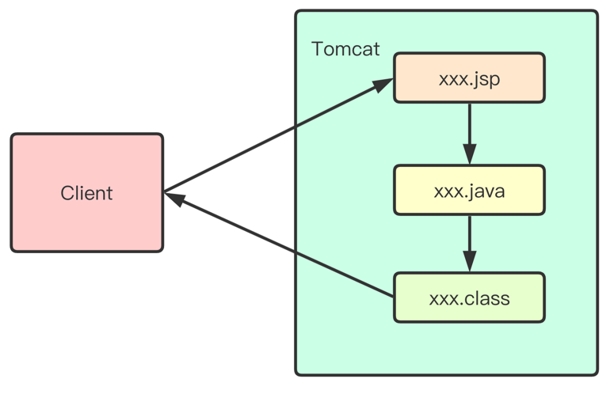

>Author：Gavin
>
>Version：9.0.2

[TOC]

### 一、引言

------

#### 1.1 现有问题

> 在之前学习Servlet时，服务端通过Servlet响应客户端页面，有什么不足之处？
>
> - 开发方式麻烦：继承父类、覆盖方法、配置Web.xml或注解
> - 代码修改麻烦：重新编译、部署、重启服务
> - 显示方式麻烦：获取流、使用println("");逐行打印
> - 协同开发麻烦：UI负责美化页面，程序员负责编写代码。UI不懂Java，程序员又不能将所有前端页面的内容通过流输出


### 二、JSP（Java Server Pages）

------

#### 2.1 概念

>简化的Servlet设计，在HTML标签中嵌套Java代码，用以高效开发Web应用的动态网页


#### 2.2 作用

> 替换显示页面部分的Servlet(使用*.jsp文件替换XxxJSP.java)
> 


### 三、JSP开发【`重点`】

------

#### 3.1 创建JSP

> 在web目录下新建*.jsp文件（与WEB-INF平级）


##### 3.1.1 JSP编写Java代码

```jsp
<%@ page contentType="text/html;charset=UTF-8" language="java" %>
<html>
<head>
    <title>This is my first page</title>
</head>
<body>
    <%=new java.util.Date() %>
</body>
</html>
```

- [使用<%= %>标签编写Java代码在页面中打印当前系统时间]()


##### 3.1.2 访问JSP

> 在浏览器输入http://ip:port/项目路径/资源名称


#### 3.2 JSP与Servlet

> - 关系
>   - JSP文件在容器中会转换成Servlet执行。
>   - JSP是对Servlet的一种高级封装。本质还是Servlet。
>
> - 区别
>   - 与 Servlet 相比：JSP可以很方便的编写或者修改HTML网页而不用去面对大量的println语句。

|                     JSP与Servlet区别                      |
| :-------------------------------------------------------: |
|  |


#### 3.3 JSP实现原理

> Tomcat会将xxx.jsp转换成Java代码，进而编译成.class文件运行，最终将运行结果通过response响应给客户端。

|                     JSP实现原理                      |
| :--------------------------------------------------: |
|  |


##### 3.3.1 JSP.java源文件存放目录

> 使用IDEA开发工具，Tomcat编译后的JSP文件（Xxx_jsp.class 和 Xxx_jsp.java）的存放地点：
>
> - C:\用户\账户名\\.IntelliJIdea2019.1\system\tomcat\项目名称\work\Catalina\localhost\应用上下文\org\apache\jsp


### 四、JSP与HTML集成开发

------

#### 4.1 脚本

> 脚本可以编写Java语句、变量、方法或表达式。


##### 4.1.1 普通脚本

> 语法：<% Java代码 %>

```jsp
<html>
<head><title>Hello World</title></head>
<body>
Hello World!<br/>  
<%  
	//jsp中，使用小脚本嵌入java代码！  
	out.println("hi");//打印内容在客户端页面
    System.out.println("hi");//打印内容在控制台
%>
</body>
</html>
```

- [经验：普通脚本可以使用所有Java语法，除了定义函数。]()
- [注意：脚本与脚本之间不可嵌套，脚本与HTML标签不可嵌套]()


##### 4.1.2 声明脚本

> 语法：<%! 定义变量、函数 %>

```jsp
<%! int i = 0; %> 
<%! int a, b, c; %> 
<%! Object object = new Object(); %> 
<%!
  //定义方法
  public void m1(){
 	 System.out.println("你好");
}
%>
```

- [注意：声明脚本声明的变量是全局变量。]()
- [声明脚本的内容必须在普通脚本<% %>中调用。]()
- [如果声明脚本中的函数具有返回值，可以使用输出脚本调用<%= %>]()


##### 4.1.3 输出脚本

> 语法：<%=Java表达式 %>

```jsp
<%@ page language="java" contentType="text/html; charset=UTF-8"
    pageEncoding="UTF-8"%>
<!DOCTYPE html>
<html>
<head>
<meta charset="utf-8">
<title>jsp基本使用</title>
</head>
<body>
<p>
   今天的日期是: <%= new java.util.Date() %>
</p>
</body> 
</html> 
```

- [经验：输出脚本可以输出带有返回值的函数]()
- [注意：输出脚本中不能加 ; ]()


####   4.2 JSP注释

>  JSP注释主要有两个作用：为脚本代码作注释以及HTML内容注释。


##### 4.2.1 语法规则

| **语法**         | 描述                                                 |
| :--------------- | :--------------------------------------------------- |
| <%--  注释  --%> | JSP注释，注释内容不会被发送至浏览器甚至不会被编译    |
| < !--注释-- >    | HTML注释，通过浏览器查看网页源代码时可以看见注释内容 |


##### 4.2.2 注释

```jsp
<%@ page language="java" contentType="text/html; charset=UTF-8"
    pageEncoding="UTF-8"%>
<!DOCTYPE html>
<html>
<head>
<meta charset="utf-8">
<title>jsp基础教程</title>
</head>
<body>
<%-- JSP注释在网页中不会被显示--%> 
<!-- HTML注释在网页源代码中会显示 -->
<p>
   今天的日期是: <%= new java.util.Date() %>
</p>
</body> 
</html> 
```


#### 4.3 JSP指令

> JSP指令用来设置与整个JSP页面相关的属性。
>

| **指令**           | **描述**                                                  |
| :----------------- | :-------------------------------------------------------- |
| <%@ page ... %>    | 定义页面的依赖属性，比如脚本语言、error页面、缓存需求等等 |
| <%@ include ... %> | 包含其他文件                                              |
| <%@ taglib ... %>  | 引入标签库的定义，可以是自定义标签                        |


##### 4.3.1 page指令

> - 语法：<%@ page attribute1="value1" attribute2="value2" %>
>
> - Page指令为容器提供当前页面的使用说明。一个JSP页面可以包含多个page指令。

| **属性**     | **描述**                                                     |
| :----------- | :----------------------------------------------------------- |
| contentType  | 指定当前JSP页面的MIME类型和字符编码格式                      |
| errorPage    | 指定当JSP页面发生异常时需要转向的错误处理页面                |
| isErrorPage  | 指定当前页面是否可以作为另一个JSP页面的错误处理页面          |
| import       | 导入要使用的Java类                                           |
| language     | 定义JSP页面所用的脚本语言，默认是Java                        |
| session      | 指定JSP页面是否使用session。默认为true立即创建，false为使用时创建 |
| pageEncoding | 指定JSP页面的解码格式                                        |


##### 4.3.2 include指令

> - 语法：<%@ include file = "被包含的JSP路径"%>
>
> - 通过include指令来包含其他文件。
> - 被包含的文件可以是JSP文件、HTML文件或文本文件。包含的文件就好像是当前JSP文件的一部分，会被同时编译执行（静态包含）。

```jsp
<%@ include file="header.jsp"%>
...
...
<%@ include file="footer.jsp" %>
```

- [注意：可能会有重名的冲突问题，不建议使用。]()


##### 4.3.3 taglib指令

> - 语法：<%@ taglib uri="外部标签库路径" prefix="前缀" %>
>
> - 引入JSP的标准标签库

```jsp
<%@ taglib uri="http://java.sun.com/jsp/jstl/core" prefix="c"%>
```


#### 4.4 动作标签

> - 语法：<jsp:action_name attribute="value" />
> - 动作标签指的是JSP页面在运行期间的命令
>


##### 4.4.1 include

> - 语法：<jsp:include page="相对 URL 地址" />
> - <jsp:include >动作元素会将外部文件输出结果包含在JSP中（动态包含）。

| 属性 | 描述                        |
| :--- | :-------------------------- |
| page | 包含在页面中的相对URL地址。 |

```jsp
<jsp:include page="index.jsp"/>
```

- [注意：前面已经介绍过include指令，它是将外部文件的输出代码复制到了当前JSP文件中。而这里的jsp:include动作不同，是将外部文件的输出结果引入到了当前JSP文件中。]()


##### 4.4.2 useBean

> - 语法：<jsp:useBean id="name" class="package.className" />
>
> - jsp:useBean 动作用来加载一个将在JSP页面中使用的JavaBean。

```jsp
<jsp:useBean id="user" class="com.qf.entity.User"/>
```

- [在类载入后，我们可以通过 jsp:setProperty 和 jsp:getProperty 动作来修改和获取bean的属性。]()


##### 4.4.3 setProperty

> 可以在jsp:useBean元素之后使用jsp:setProperty进行属性的赋值

| 属性     | 描述                                             |
| :------- | :----------------------------------------------- |
| name     | name属性是必需的。它表示要设置属性的是哪个Bean。 |
| property | property属性是必需的。它表示要设置哪个属性。     |
| value    | value 属性是可选的。该属性用来指定Bean属性的值。 |

```jsp
<jsp:useBean id="user" class="com.qf.entity.User" />

<jsp:setProperty name="user" property="name" value="gavin" />
```


##### 4.4.4 getProperty

> jsp:getProperty动作提取指定Bean属性的值，转换成字符串，然后输出。

| 属性     | 描述                                   |
| :------- | :------------------------------------- |
| name     | 要检索的Bean属性名称。Bean必须已定义。 |
| property | 表示要提取Bean属性的值                 |

```jsp
<jsp:useBean id="user" class="com.qf.entity.User" />

<jsp:setProperty name="user" property="name" value="gavin" />

<jsp:getProperty name="user" property="name" />
```


##### 4.4.5 forward

> - 语法：<jsp:forward page="相对 URL 地址" />
>
> - jsp:forward动作把请求转到另外的页面。

| 属性 | 描述                          |
| :--- | :---------------------------- |
| page | page属性包含的是一个相对URL。 |

```jsp
<jsp:forward page="index.jsp" />
```


##### 4.4.6 param

> - 语法：<jsp:param name="" value=""/>
>
> - 在转发动作内部使用，做参数传递

```jsp
<jsp:forward page="index.jsp">
         <!-- http请求参数传递-->
         <jsp:param name="sex" value="nan" />
</jsp:forward>
```


#### 4.5 内置对象

> 由JSP自动创建的对象，可以直接使用

| 对象名          | 类型                                   | 说明                        |
| --------------- | -------------------------------------- | --------------------------- |
| [request]()     | javax.servlet.http.HttpServletRequest  |                             |
| [response]()    | javax.servlet.http.HttpServletResponse |                             |
| [session]()     | javax.servlet.http.HttpSession         | 由session=“true”开关        |
| [application]() | javax.servlet.ServletContext           |                             |
| config          | javax.servlet.ServletConfig            |                             |
| exception       | java.lang.Throwable                    | 由isErrorPage=“false”开关   |
| out             | javax.servlet.jsp.JspWriter            | javax.servlet.jsp.JspWriter |
| [pageContext]() | javax.servlet.jsp.PageContext          |                             |
| page            | java.lang.Object当前对象this           | 当前servlet实例             |


##### 4.5.1 四大域对象

> JSP有四大作用域对象，存储数据和获取数据的方式一样，不同的是取值的范围有差别
>
> - [pageContext]() (javax.servlet.jsp.PageContext)  当前JSP页面范围
> - [request]()  (javax.servlet.http.HttpServletRequest) 一次请求有效
> - [session]()  (javax.servlet.http.HttpSession)  一次会话有效(关闭浏览器失效)
> - [application]()  (javax.servlet.ServletContext)  整个Web应用有效(服务器重启或关闭失效)


##### 4.5.2 pageContext 对象

> - pageContext对象是javax.servlet.jsp.PageContext 类的实例，拥有作用域，用来代表整个JSP页面。
> - 当前页面的作用域对象，一旦跳转则失效
> - 通过setAttribute("name",value);存储值
> - 通过getAttribute("name");获取值
> - 用于获取其他8个内置对象或者操作其他对象的作用域

```jsp
<%
	pageContext.setAttribute("name",value);//当前页面作用域有效
%>
```


##### 4.5.3 pageContext获取其他内置对象

```jsp
<%
    pageContext.getRequest();//返回request内置对象 
    pageContext.getResponse();//返回response内置对象 
    pageContext.getServletConfig();//返回config内置对象
    pageContext.getException();//返回exception内置对象 
    pageContext.getPage();//返回page内置对象
    pageContext.getOut();//返回out内置对象
    pageContext.getServletContext();//返回application内置对象
    pageContext.getSession();//返回session内置对象 
%>
```


##### 4.5.4 pageContext操作其他内置对象的作用域

> pageContext对象可以操作其他作用域存储和获取。

```jsp
<%
	//操作其他作用域存储
	pageContext.setAttribute("name",value);//当前页面有效
	pageContext.setAttribute("name",value,PageContext.REQUEST_SCOPE);//request作用域
	pageContext.setAttribute("name",value,PageContext.SESSION_SCOPE);//session作用域
	pageContext.setAttribute("name",value,PageContext.APPLICATION_SCOPE);//application作用域

%>

<%
	//操作其他作用域获取
    pageContext.getAttribute("name");//当前页面作用域
    pageContext.getAttribute("name",PageContext.REQUEST_SCOPE);//request作用域
    pageContext.getAttribute("name",PageContext.SESSION_SCOPE);//session作用域
    pageContext.getAttribute("name",PageContext.APPLICATION_SCOPE);//application作用域
    pageContext.findAttribute("name");//从pageContext,request ,session ,application依次查找
%>
```


#### 4.6 整合

> 将EmpProject项目所有显示页面JSP的Servlet替换为JSP页面，使用脚本进行显示


### 五、EL表达式（Expression Language）
------

#### 5.1 概念

> EL使JSP写起来更简单、简洁。主要用于获取作用域中的数据


#### 5.2 作用

> 用于替换作用域对象.getAttribute("name");


#### 5.3 EL的应用（获取基本类型、字符串）

> - ${scope.name}  获取具体某个作用域中的数据
> - ${name} 获取作用域中的数据，逐级查找(pageContext、request、session、application)


##### 5.3.1 EL应用案例

```jsp
<%
	//存储在request作用域
	request.setAttribute("name","tom");
    request.setAttribute("age",18);
%>
${requestScope.name} <%--获取request作用域中name对应的值，找到就返回,没找到返回""  --%>
${name}<%--从最小作用域逐级查找name对应的值,找到就返回,没找到返回"" --%>
```


##### 5.3.2 EL和JSP脚本的区别

> - <%=request.getAttribute() %>   没有找到返回null 
>
> - ${requestScope.name}       没找到返回"" 


#### 5.4 EL的应用（获取引用类型）

> 使用EL获取作用域中的对象调用属性时，只能访问对象的get方法，必须遵守命名规范定义

```jsp
<%
    Emp e = new Emp();
    e.setName("gavin");
    e.setAge(19);
    request.setAttribute("e",e);
%>
${requestScope.e.name}<%-- 调用getName()方法 --%>
```


#### 5.5 EL的应用（获取数组、集合的元素）

> EL可以获取Array、List、Map中的元素，Set由于没下标，无法直接访问元素，后续可遍历

```jsp
<%
    int[] array = new int[]{1,2,3,4,5};
    request.setAttribute("array",array);

	List<Emp> emps = new ArrayList<>();
    emps.add(new Emp(1,"gavin",2000,19));
    emps.add(new Emp(2,"marry",3000,29));
    emps.add(new Emp(3,"jack",4000,39));
    request.setAttribute("emps",emps);

	Map<String,String> maps = new HashMap<>();
    maps.put("CN","中国");
    maps.put("FK","法国");
    maps.put("US","美国");
	request.setAttribute("maps",maps);
%>
${requestScope.array[0]}

${requestScope.emps[0]} <%-- 也可以用 ${requestScope.emps.get(0)}  --%>

${requestScope.maps.CN} <%-- 也可以用 ${requestScope.maps["US"]} -->

```


#### 5.6 EL的运算符

| **操作符** | **描述**                         |
| :--------- | :------------------------------- |
| .          | 访问一个Bean属性或者一个映射条目 |
| []         | 访问一个数组或者链表的元素       |
| +          | 加                               |
| -          | 减或负                           |
| *          | 乘                               |
| / or div   | 除                               |
| % or mod   | 取模                             |
| == or eq   | 测试是否相等                     |
| != or ne   | 测试是否不等                     |
| < or lt    | 测试是否小于                     |
| > or gt    | 测试是否大于                     |
| <= or le   | 测试是否小于等于                 |
| >= or ge   | 测试是否大于等于                 |
| && or and  | 测试逻辑与                       |
| \|\| or or | 测试逻辑或                       |
| ! or not   | 测试取反                         |
| empty      | 测试是否空值                     |


##### 5.6.1 EL表达式执行运算

```jsp
<%@ page contentType="text/html;charset=UTF-8" language="java" %>
<html>
<head>
    <title>运算符</title>
</head>
<body>
    <%
        request.setAttribute("num",1234);
        String ss = "123";
        request.setAttribute("ss",ss);
    %>
    <h1>算术运算</h1>
    ${num + 1}<br/>
    ${num - 1}<br/>
    ${num * 2}<br/>
    ${num div 2}<br/>
    ${num mod 2}<br/>
    <hr/>
        <h1>关系运算</h1>
    ${num == 1234}<br/>
    ${num != 1234}<br/>
    ${num > 1200}<br/>
    ${num < 1200}<br/>
    ${num >= 1234}<br/>
    ${num <= 1234}<br/>
    <hr/>
        <h1>逻辑运算</h1>
    ${num %2==0 || num /2 ==1}<br/>
    ${num % 2==0 && num % 4==0}<br/>
    ${!(num > 1234)}<br/>
<hr/>
        <h1>empty运算符</h1>
    ${ss == null}<br/>
    ${empty ss}<br/>
</body>
</html>

```


##### 5.6.2 empty关键字

```jsp
<% 
	String s1="";
    pageContext.setAttribute("s1", s1);
    String s2=null;
    pageContext.setAttribute("s2", s2);
    String s3="122222";
    pageContext.setAttribute("s3", s3);
    List list1 =new ArrayList();
    pageContext.setAttribute("list1", list1);
%>
<!-- empty关键只要内容是空true -->
${empty s1}<br>
${empty s2}<br>
${empty  s3}<br>
${empty  list1}<br>
```


#### 5.7 隐式对象

> EL 表达式语言定义了11个隐式对象

| **隐含对象**     | **描述**                      |
| :--------------- | :---------------------------- |
| pageScope        | page 作用域                   |
| requestScope     | request 作用域                |
| sessionScope     | session 作用域                |
| applicationScope | application 作用域            |
| param            | Request 对象的参数，字符串    |
| paramValues      | Request对象的参数，字符串集合 |
| header           | HTTP 信息头，字符串           |
| headerValues     | HTTP 信息头，字符串集合       |
| initParam        | 上下文初始化参数              |
| cookie           | Cookie值                      |
| pageContext      | 当前页面的pageContext         |


##### 5.7.1 获得应用上下文

```jsp
<%=request.getContextPath() %>
${pageContext.request.contextPath}
```


##### 5.7.2 获取Cookie对象

```jsp
${cookie.username}//获取名为username的cookie对象
${cookie.password}//获取名为password的cookie对象
${cookie.password.value}//获取password的cookie的value值
```


### 六、JSTL标准标签库

------

#### 6.1 现有问题

> - EL主要是用于作用域获取数据，虽然可以做运算判断，但是得到的都是一个结果，做展示。
> - EL不存在流程控制。比如判断。
> - EL对于集合只能做单点访问，不能实现遍历操作。比如循环。


#### 6.2 什么是 JSTL?

> - JSTL:全称Java Server Pages Standard Tag Library
>
>
> - JSP标准标签库（JSTL）是一个JSP标签集合。
>


#### 6.3 JSTL的作用

> - 可对EL获取到的数据进行逻辑操作。
>
>
> - 与EL合作完成数据的展示。


#### 6.4 JSTL使用

> - 导入两个 jar 文件：standard.jar 和 jstl.jar 文件拷贝到 /WEB-INF/lib/ 下
> - 在JSP页面引入标签库<% @taglib uri="http://java.sun.com/jsp/jstl/core" prefix="c">


#### 6.5 核心标签

##### 6.5.1 条件标签if判断

> 语法：<c:if test ="条件"> < /c:if>

```jsp
	<!-- test属性中是条件，但是条件需要使用EL表达式来书写 -->
	<h3>条件标签：if</h3>
	<c:if test="${8>2 }">
    	8大于2是成立的
     </c:if>
	<c:if test="${8<2 }">
   	 	8小于2是成立的
    </c:if>
```


##### 6.5.2 多条件choose判断

> 语法：<c:choose >
>
> ​					<c:when test="条件1">结果1< /c:when> 
>
> ​					<c:when test="条件2">结果2< /c:when> 
>
> ​					<c:when test="条件3">结果3< /c:when> 
>
> ​					<c:otherwise >结果4< /c:otherwise>
>
> ​			  < /c:choose>


```jsp
<h3>条件标签：choose(等价于java中多重if)</h3>
<%-- 测试成绩等级 >90 优秀   >80  良好    >70 中等   >60及格--%>
<c:set var="score" value="80"></c:set>
<c:choose>
	<c:when test="${score>=90 }">优秀</c:when>
	<c:when test="${score>=80 }">良好</c:when>
	<c:when test="${score>=70 }">中等</c:when>
	<c:when test="${score>=60 }">及格</c:when>
	<c:otherwise>不及格</c:otherwise>
</c:choose>
```


#####            6.5.3 迭代foreach标签

> 语法
>
> <c:foreach 
>
> ​	var="变量名" 
>
> ​	items="集合" 
>
> ​	begin="起始下标" 
>
> ​	end="结束下标" 
>
> ​	step="间隔长度" 
>
> ​	varstatus="遍历状态">
>
> < /c:foreach>

```jsp
  <h3>测试list集合遍历获取学生列表</h3>
      <table border="1" width="80%" bordercolor="red" cellspacing="0"
          align="center">
          <tr>
              <th>学号</th>
              <th>姓名</th>
              <th>成绩</th>
              <th>班级</th>
              <th>是否是第一个</th>
              <th>是否是最后一个</th>
              <th>计数count</th>
              <th>索引index</th>
          </tr>
   <!-- varStatus:变量状态：遍历出的每一项内容的状态：
      first 是否是第一行
      last  是否是最后一行
      count 当前行数
      index 当前元素的下标
       -->
       <!-- var :遍历出的每一项使用变量先存储
            items：集合(使用El表达式)
            -->
          <c:forEach var="stu" items="${students}" varStatus="vs">
              <tr>
                  <td>${stu.id}</td>
                  <td>${stu.name}</td>
                  <td>${stu.score}</td>
                  <td>${stu.classes}</td>
                  <td>${vs.first}</td>
                  <td>${vs.last}</td>
                  <td>${vs.count}</td>
                  <td>${vs.index}</td>
              </tr>
          </c:forEach>
   </table>
```


##### 6.5.4 url标签

> 在Cookie禁用的情况下，通过重写URL拼接JSESSIONID来传递ID值。便于下一次访问时仍可查找到上一次的Session对象。

```html
<c:url context='${pageContext.request.contextPath}' value='/xxxController' />

//在form表单的action中嵌套动态路径
<form action="<c:url context='${pageContext.request.contextPath}' value='/xxxController' />">
    
</form>
```

- [经验：所有涉及到页面跳转或者重定向跳转时，都应该使用URL重写。]()


#### 6.6 整合

> 将现有的EmpProject项目进行整合，使用EL+JSTL替换脚本代码


### 七、MVC框架(Model-View-Controller)

------

#### 7.1 MVC概念

> MVC又称为编程模式，是一种软件设计思想，将数据操作、页面展示、业务逻辑分为三个层级（模块），独立完成，相互调用    
>
> - 模型层（Model） 
>
> - 视图（View）       
>
> - 控制器（Controller）


#### 7.2 MVC模式详解

> MVC并不是Java独有的，现在几乎所有的B/S的架构都采用了MVC模式。
>
> * 视图View：视图即是用户看到并与之交互的界面，比如HTML（静态资源），JSP（动态资源）等等。 
> * 控制器Controller：控制器即是控制请求的处理逻辑，对请求进行处理，负责流程跳转(转发和重定向)。 
> * 模型Model：对客观世界的一种代表和模拟(业务模拟、对象模拟)。

|                   MVC流程                    |
| :------------------------------------------: |
|  |


#### 7.3 优点

> - 低耦合性：模块与模块之间的关联性不强，不与某一种具体实现产生密不可分的关联性
>- 高维护性：基于低耦合性，可做到不同层级的功能模块灵活更换、插拔
> - 高重用性：相同的数据库操作，可以服务于不同的业务处理。将数据作为独立模块，提高重用性


#### 7.4 MVC在框架中应用

> MVC模式被广泛用于Java的各种框架中，比如Struts2、SpringMVC等等都用到了这种思想。


#### 7.5 三层架构与MVC

##### 7.5.1 三层架构

> View层（表示|界面层）、Service层（业务逻辑层）、DAO层(数据访问层)

|        三层架构流程        |
| :------------------------: |
|  |


##### 7.5.2 MVC与三层架构的区别

> - MVC强调的是视图和业务代码的分离。严格的说MVC其实关注的是Web层。View就是单独的页面，如JSP、HTML等，不负责业务处理，只负责数据的展示。而数据封装到Model里，由Controller负责在V和M之间传递。MVC强调业务和视图分离。
> - 三层架构是“数据访问层”、“业务逻辑层”、“表示层”，指的是代码之间的解耦，方便维护和复用。


### 八、分页

------

#### 8.1 概念

> ​     分页是Web应用程序非常重要的一个技术。数据库中的数据可能是成千上万的，不可能把这么多的数据一次显示在浏览器上面。一般根据每行数据在页面上所占的空间设置每页显示若干行，比如一般20行是一个比较理想的显示状态。


#### 8.2 分页实现思路

> 对于海量的数据查询，需要多少就取多少，显然是最佳的解决方法，假如某个表中有200万条记录，第一页取前20条，第二页取21~40条记录。

```sql
select  * from 表名 limit  0,20;//第一页
select  * from 表名 limit  20,20;//第二页
select  * from 表名 limit  40,20;//第三页
```


#### 8.3 分页代码实现

> 步骤：
>
> 1.确定每页显示的数据数量
>
> 2.确定分页显示所需的总页数
>
> 3.编写SQL查询语句，实现数据查询
>
> 4.在JSP页面中进行分页显示设置


##### 8.3.1 数据库准备

```sql
CREATE TABLE emp(
	id INT PRIMARY KEY AUTO_INCREMENT,
	NAME VARCHAR(20) NOT NULL,
	salary DOUBLE NOT NULL,
	age INT NOT NULL
)CHARSET=utf8;
  -- 向数据库中添加100条添加记录
```


##### 8.3.2 数据库配置文件db.properties

```properties
#连接设置
driverClassName=com.mysql.jdbc.Driver
url=jdbc:mysql://localhost:3306/emp
username=root
password=root
#<!-- 初始化连接 -->
initialSize=10
#最大连接数量
maxActive=50
#<!-- 最小空闲连接 -->
minIdle=5
#<!-- 超时等待时间以毫秒为单位 6000毫秒/1000等于60秒 -->
maxWait=5000
```


##### 8.3.3 PageBean类

> 分页数据所需要的实体类！内包含页码，页大小，总条数，总页数，起始行

```java
package com.qf.emp.entity;

public class Page {
    private Integer pageIndex;//页码

    private Integer pageSize;//页大小  显示多少行数据

    private Integer totalCounts;//数据的总行数

    private Integer totalPages;//总页数

    private Integer startRows;//起始行

    public Page(Integer pageIndex) {
        this(pageIndex, 5);
    }

    public Page(Integer pageIndex, Integer pageSize) {
        this.pageIndex = pageIndex;
        this.pageSize = pageSize;
        this.setStartRows((pageIndex - 1) * pageSize);
    }


    public Integer getPageIndex() {
        return pageIndex;
    }

    public void setPageIndex(Integer pageIndex) {
        this.pageIndex = pageIndex;
    }

    public Integer getPageSize() {
        return pageSize;
    }

    public void setPageSize(Integer pageSize) {
        this.pageSize = pageSize;
    }

    public Integer getTotalCounts() {
        return totalCounts;
    }

    public void setTotalCounts(Integer totalCounts) {
        this.totalCounts = totalCounts;

        this.setTotalPages(totalCounts % pageSize == 0? totalCounts/pageSize:totalCounts/pageSize +1);
    }

    public Integer getTotalPages() {
        return totalPages;
    }

    public void setTotalPages(Integer totalPages) {
        this.totalPages = totalPages;
    }

    public Integer getStartRows() {
        return startRows;
    }

    public void setStartRows(Integer startRows) {
        this.startRows = startRows;
    }
}

```


##### 8.3.4 创建DAO

```java
package com.qf.emp.dao;

import com.qf.emp.entity.Emp;
import com.qf.emp.entity.Page;

import java.util.List;

public interface EmpDao {
    public List<Emp> selectAll();

    public int delete(int id);

    public int update(Emp emp);

    public Emp select(int id);
	//分页查询所有
    public List<Emp> selectAll(Page page);
	//查询数据总行数
    public long selectCount();

}

```


##### 8.3.5 EmpDaoImpl实现类

```java
package com.qf.emp.dao.impl;

import com.qf.emp.dao.EmpDao;
import com.qf.emp.entity.Emp;
import com.qf.emp.entity.Page;
import com.qf.emp.utils.DbUtils;
import org.apache.commons.dbutils.QueryRunner;
import org.apache.commons.dbutils.handlers.BeanHandler;
import org.apache.commons.dbutils.handlers.BeanListHandler;
import org.apache.commons.dbutils.handlers.ScalarHandler;

import java.sql.SQLException;
import java.util.List;

public class EmpDaoImpl implements EmpDao {
    private QueryRunner queryRunner = new QueryRunner();
   	//...省略其他方法
	
    @Override
    public List<Emp> selectAll(Page page) {
        try {
            List<Emp> emps = queryRunner.query(DbUtils.getConnection(),"select * from emp limit ?,?",new BeanListHandler<Emp>(Emp.class),page.getStartRows(),page.getPageSize());
            return emps;
        } catch (SQLException e) {
            e.printStackTrace();
        }
        return null;
    }

    @Override
    public long selectCount() {
        try {
            return queryRunner.query(DbUtils.getConnection(),"select count(*) from emp;",new ScalarHandler<>());
        } catch (SQLException e) {
            e.printStackTrace();
        }
        return 0;
    }

}

```


##### 8.3.6 创建Service

```java
package com.qf.emp.service;

import com.qf.emp.entity.Emp;
import com.qf.emp.entity.Page;

import java.util.List;

public interface EmpService {
    public List<Emp> showAllEmp();

    public int removeEmp(int id);

    public int modify(Emp emp);

    public Emp showEmp(int id);

    public List<Emp> showAllEmp(Page page);
}

```


##### 8.3.7 Service实现类

```java
package com.qf.emp.service.impl;

import com.qf.emp.dao.EmpDao;
import com.qf.emp.dao.impl.EmpDaoImpl;
import com.qf.emp.entity.Emp;
import com.qf.emp.entity.Page;
import com.qf.emp.service.EmpService;
import com.qf.emp.utils.DbUtils;

import java.util.ArrayList;
import java.util.List;

public class EmpServiceImpl implements EmpService {
    private EmpDao empDao = new EmpDaoImpl();
    //...省略其他方法

    @Override
    public List<Emp> showAllEmp(Page page) {
        List<Emp> emps = null;
        try {
            DbUtils.begin();
            //获取总行数
            long count = empDao.selectCount();
            page.setTotalCounts((int)count);
            //根据controller传递的page对象查询对应数据
            emps = empDao.selectAll(page);
            DbUtils.commit();
        } catch (Exception e) {
            DbUtils.rollback();
            e.printStackTrace();
        }
        return emps;
    }
}

```


##### 8.3.8 ShowAllEmpController实现

```java
package com.qf.emp.controller;

import com.qf.emp.entity.Emp;
import com.qf.emp.entity.Page;
import com.qf.emp.service.EmpService;
import com.qf.emp.service.impl.EmpServiceImpl;
import sun.security.util.AuthResources_it;

import javax.servlet.ServletException;
import javax.servlet.annotation.WebServlet;
import javax.servlet.http.HttpServlet;
import javax.servlet.http.HttpServletRequest;
import javax.servlet.http.HttpServletResponse;
import java.io.IOException;
import java.util.List;

@WebServlet(name = "ShowAllEmpController",value = "/manager/safe/showAllEmpController")
public class ShowAllEmpController extends HttpServlet {
    protected void doPost(HttpServletRequest request, HttpServletResponse response) throws ServletException, IOException {

        String pageIndex = request.getParameter("pageIndex");

        if(pageIndex==null){//如果是第一次访问
            pageIndex ="1";
        }

        Page page = new Page(Integer.valueOf(pageIndex));

        EmpService empService = new EmpServiceImpl();

        List<Emp> emps = empService.showAllEmp(page);

        request.setAttribute("emps",emps);

        request.setAttribute("page",page);

        request.getRequestDispatcher("/manager/safe/showAllEmp.jsp").forward(request,response);
    }

    protected void doGet(HttpServletRequest request, HttpServletResponse response) throws ServletException, IOException {
        doPost(request, response);
    }
}

```


##### 8.3.9 showAllEmp.jsp

```jsp
<%@ page import="com.qf.emp.entity.Emp" %>
<%@ page import="java.util.*" %>
<%@ page contentType="text/html;charset=UTF-8" language="java" %>
<%@taglib prefix="c" uri="http://java.sun.com/jsp/jstl/core" %>
<html>
<head>
    <title>查询所有员工页面</title>
</head>
<body>
<table border="1">
    <tr>
        <td>编号</td>
        <td>姓名</td>
        <td>工资</td>
        <td>年龄</td>
        <td colspan="2">操作</td>
    </tr>

    <c:forEach var="emp" items="${emps}">
        <tr>
            <td>${emp.id}</td>
            <td>${emp.name}</td>
            <td>${emp.salary}</td>
            <td>${emp.age}</td>

            <td><a href="<c:url context='${pageContext.request.contextPath}' value='/manager/safe/removeEmpController?id=${emp.id}'></c:url>">删除</a></td>
            <td><a href="<c:url context='${pageContext.request.contextPath}' value='/manager/safe/showEmpController?id=${emp.id}'></c:url>">修改</a></td>
        </tr>

    </c:forEach>
        <tr>
            <td colspan="6">
                <a href="<c:url context='${pageContext.request.contextPath}' value='/manager/safe/showAllEmpController?pageIndex=1' /> ">首页</a>
                
                <c:if test="${page.pageIndex > 1}">
                    <a href="<c:url context='${pageContext.request.contextPath}' value="/manager/safe/showAllEmpController?pageIndex=${page.pageIndex - 1}" />">上一页</a>
                </c:if>
                
                <c:if test="${page.pageIndex == 1}">
                    <a>上一页</a>
                </c:if>

                <c:if test="${page.pageIndex < page.totalPages}">
                    <a href="<c:url context='${pageContext.request.contextPath}' value='/manager/safe/showAllEmpController?pageIndex=${page.pageIndex + 1}'/>">下一页</a>
                </c:if>
                
                <c:if test="${page.pageIndex == page.totalPages}">
                    <a>下一页</a>
                </c:if>
                
                <a href="<c:url context='${pageContext.request.contextPath}' value='/manager/safe/showAllEmpController?pageIndex=${page.totalPages}' /> ">尾页</a>
            </td>
        </tr>
</table>
</body>
</html>

```


##### 8.3.10 运行效果图

|                    页面运行结果                     |
| :-------------------------------------------------: |
|  |

