> Author：Jackiechan
>
> Version：9.0.2

[TOC]

### 一、引言

---

#### 1.1 项目管理问题

> 项目中jar包资源越来越多，jar包的管理越来越沉重。


##### 1.1.1 繁琐

> 要为每个项目手动导入所需的jar，需要搜集全部jar

##### 1.1.2 复杂

> 项目中的jar如果需要版本升级，就需要再重新搜集jar

##### 1.1.3 冗余

> 相同的jar在不同的项目中保存了多份

#### 1.2 项目管理方案

> java项目需要一个统一的便捷的管理工具：Maven

### 二、介绍

---

> Maven这个单词来自于意第绪语（犹太语），意为知识的积累.
>
> Maven是一个基于项目对象模型（POM）的概念的纯java开发的开源的项目管理工具。主要用来管理java项目，进行依赖管理(jar包依赖管理)和项目构建(项目编译、打包、测试、部署)。此外还能分模块开发，提高开发效率。

### 三、Maven安装

---

#### 3.1 下载Maven

> 下载Maven,版本根据具体需要版本下载

| https://maven.apache.org/download.cgi |
| ------------------------------------- |
| 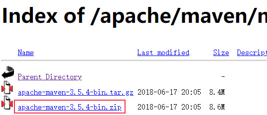       |

#### 3.2 Maven安装

##### 3.2.1 解压

> 注意： 解压文件尽量不要放在含有中文或者特殊字符的目录下。
>
> 解压后，有如下目录：

```markdown
`bin:含有mvn运行的脚本`
`boot:含有plexus-classworlds类加载器框架,Maven 使用该框架加载自己的类库。`
`conf:含有settings.xml配置文件`
`lib:含有Maven运行时所需要的java类库`
```

##### 3.2.2 环境变量

> maven依赖java环境，所以要确保java环境已配置好 （maven-3.3+ 需要jdk7+）
>
> maven本身有2个环境变量要配置：

```markdown
`MAVEN_HOME = maven的安装目录`
`PATH = maven的安装目录下的bin目录`
```

##### 3.2.3 测试

> 查看maven版本信息

```cmd
mvn -v
```

### 四、Maven配置

---

#### 4.1 本地仓库

> maven的conf目录中有 [settings.xml]() ，是maven的配置文件，做如下配置：

```xml
<settings xmlns="http://maven.apache.org/SETTINGS/1.0.0"
          xmlns:xsi="http://www.w3.org/2001/XMLSchema-instance"
          xsi:schemaLocation="http://maven.apache.org/SETTINGS/1.0.0 			  	http://maven.apache.org/xsd/settings-1.0.0.xsd">
  <!-- localRepository
   | The path to the local repository maven will use to store artifacts.
   |
   | Default: ${user.home}/.m2/repository
  <localRepository>/path/to/local/repo</localRepository>
  -->
  <!-- 选择一个磁盘目录，作为本地仓库 -->
  <localRepository>D:\Program Files\maven\myrepository</localRepository>
```

#### 4.2 JDK配置

> 在 [<profiles>]() 标签中 增加 一个 [<profile>]() 标签，限定maven项目默认的jdk版本.
>
> 内容如下：

```xml
<profiles>
    <!-- 在已有的profiles标签中添加profile标签 -->
	<profile>    
        <id>myjdk</id>    
        <activation>    
            <activeByDefault>true</activeByDefault>    
            <jdk>1.8</jdk>    
        </activation>    
        <properties>    
            <maven.compiler.source>1.8</maven.compiler.source>    
            <maven.compiler.target>1.8</maven.compiler.target>
            <maven.compiler.compilerVersion>1.8</maven.compiler.compilerVersion> 
        </properties>    
    </profile>
</profiles>
<!-- 让增加的 profile生效 -->
<activeProfiles>
    <activeProfile>myjdk</activeProfile>
</activeProfiles>
```

### 五、仓库

---

#### 5.1 概念

> * 存储依赖的地方，体现形式就是本地的一个目录。
>
> * 仓库中不仅存放依赖，而且管理着每个依赖的唯一标识(坐标)，Java项目凭坐标获取依赖。

#### 5.2 仓库分类

> 仓库分类如下：

|            仓库分类             |
| :-----------------------------: |
| 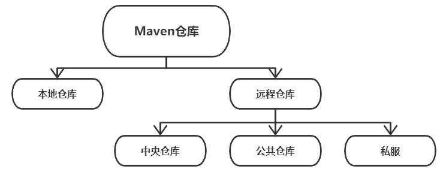 |

> 当需要依赖时，会从仓库中取查找，优先顺序为：
>
> [本地仓库  >  私服(如果配置了的话) >  公共仓库(如果配置了的话) > 中央仓库]() 

#### 5.3 本地仓库

> 即在[settings.xml]() 中配置的目录。
>
> 使用过了的依赖都会自动存储在本地仓库中，后续可以复用。

#### 5.4 远程仓库

##### 5.4.1 中央仓库

> * Maven 中央仓库是由 Maven 社区提供的仓库，不用任何配置，maven中内置了中央仓库的地址。
>
>   其中包含了绝大多数流行的开源Java构件。
>
> * https://mvnrepository.com/ 可以搜索需要的依赖的相关信息（仓库搜索服务）
>
>   http://repo.maven.apache.org/maven2/  中央仓库地址

##### 5.4.2 公共仓库【`重点`】

> * 除中央仓库之外，还有其他远程仓库。
>   比如aliyun仓库（http://maven.aliyun.com/nexus/content/groups/public/）
>
> * 中央仓库在国外，下载依赖速度过慢，所以都会配置一个国内的公共仓库替代中央仓库。

```xml
<!--setting.xml中添加如下配置-->
<mirrors>
	<mirror>
        <id>aliyun</id>  
        <!-- 中心仓库的 mirror(镜像) -->
        <mirrorOf>central</mirrorOf>    
        <name>Nexus aliyun</name>
        <!-- aliyun仓库地址 以后所有要指向中心仓库的请求，都会指向aliyun仓库-->
        <url>http://maven.aliyun.com/nexus/content/groups/public</url>  
    </mirror>
</mirrors>
```

##### 5.4.3 私服【了解】

> 公司范围内共享的仓库，不对外开放。
>
> 可以通过 Nexus来创建、管理一个私服。

### 六、Idea-Maven

---

#### 6.1 在Idea中关联Maven

> 在idea中关联本地安装的maven，后续就可以通过idea使用maven，管理项目啦。

|          在全局设置中，关联Maven          |
| :---------------------------------------: |
| 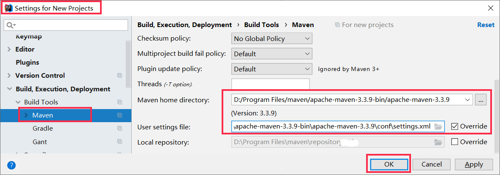 |

#### 6.2 创建Maven项目

##### 6.2.1 新建项目

> 新建项目，要选择 [Maven]() 选项

|                  如下选项                   |
| :-----------------------------------------: |
| 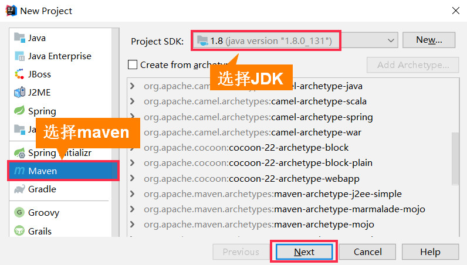 |

##### 6.2.2 指定项目名

|                 设置项目名                  |
| :-----------------------------------------: |
| 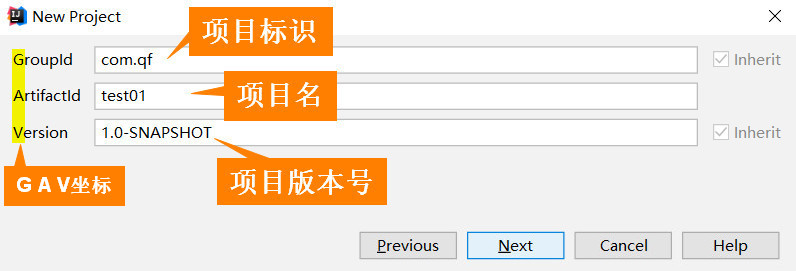 |

##### 6.2.3 项目位置

|                项目位置如下                 |
| :-----------------------------------------: |
| 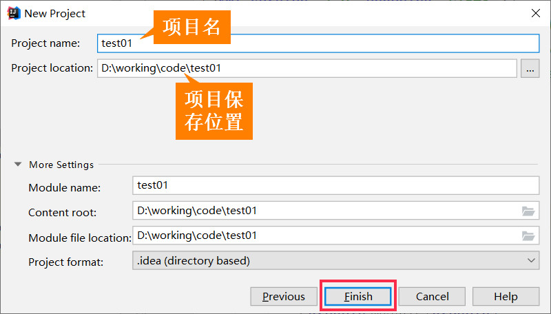 |

 #####  6.2.4 项目结构

> * src/main/java 存放源代码，建包，放项目中代码(service,dao,User,....)
>
> * src/main/resources 书写配置文件，项目中的配置文件(jdbc.properties)
>
> * src/test/java 书写测试代码，项目中测试案例代码 
>
> * src/test/resources 书写测试案例相关配置文件
>
> * 目根/pom.xml (project object model) maven项目核心文件，其中定义项目构建方式，声明依赖等
>
> * [注意：]()项目中的建包，建类，执行，都和普通项目无差异

|               项目结构如下：                |
| :-----------------------------------------: |
| 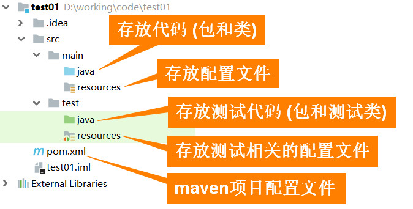 |

##### 6.2.5 项目类型

> 根据项目类型，在[pom.xml]()中做出对应配置，添加配置：[<packaging>war/jar</packaging>]()

```xml
<project xmlns="http://maven.apache.org/POM/4.0.0"
         xmlns:xsi="http://www.w3.org/2001/XMLSchema-instance"
         xsi:schemaLocation="http://maven.apache.org/POM/4.0.0 http://maven.apache.org/xsd/maven-4.0.0.xsd">
    <modelVersion>4.0.0</modelVersion>
    <groupId>com.qf</groupId>
    <artifactId>test01</artifactId>
    <version>1.0-SNAPSHOT</version>
    <!-- 打包方式，如果是java项目则用 jar，
         如果是web项目则用war -->
    <!--<packaging>war</packaging>-->
    <packaging>jar</packaging>
</project>
```


#### 6.3 导入依赖jar

> 建好项目后，需要导入需要的jar，要通过[坐标]()
>
> * 每个构件都有自己的坐标 = groupId + artifactId + version = 项目标识 + 项目名 + 版本号
>
> * 在maven项目中只需要配置坐标，maven便会自动加载对应依赖。删除坐标则会移除依赖

##### 6.3.1 查找依赖

> 依赖查找服务：https://mvnrepository.com/ ，获得依赖的坐标，在maven项目中导入。

|           查找依赖坐标            |
| :-------------------------------: |
|  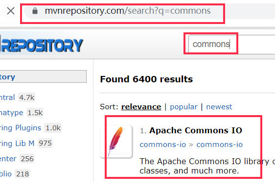  |
| 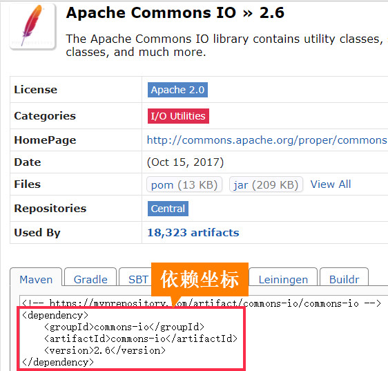 |

##### 6.3.2 导入依赖

>  在项目的pom文件中，增加依赖

|    在项目的pom.xml文件添加依赖    |
| :-------------------------------: |
|  |

##### 6.3.3 同步依赖

>  引入坐标后，同步依赖，确认导入。

| 窗口右下角弹窗，刷新依赖，使新加的配置被maven加载 |
| :-----------------------------------------------: |
|    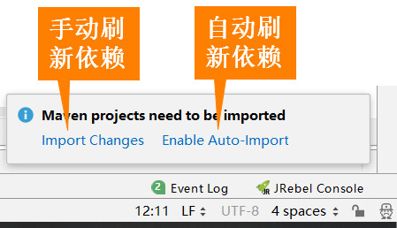    |


####6.4 创建web项目

##### 6.4.1 打包方式

> pom.xml中设置 [<packaging>war</packaging>]()

|   web项目打包方式为：[war]()    |
| :-----------------------------: |
| 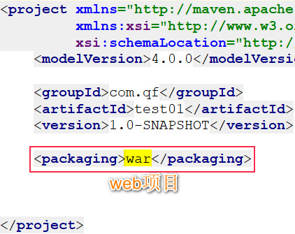 |

##### 6.4.2 web依赖

> 导入 [JSP]() 和 [Servlet]() 和 [JSTL]()依赖，使项目具有web编译环境

```xml
<?xml version="1.0" encoding="UTF-8"?>
<project ...>
    ...
    <packaging>war</packaging>

	<!-- 导入JSP 和 Servlet 和 JSTL 依赖 -->
    <dependencies>
        <dependency>
            <!-- jstl 支持 -->
            <groupId>javax.servlet</groupId>
            <artifactId>jstl</artifactId>
            <version>1.2</version>
        </dependency>
        <dependency>
            <!-- servlet编译环境 -->
            <groupId>javax.servlet</groupId>
            <artifactId>javax.servlet-api</artifactId>
            <version>3.1.0</version>
            <scope>provided</scope>
        </dependency>
        <dependency>
            <!-- jsp编译环境 -->
            <groupId>javax.servlet</groupId>
            <artifactId>jsp-api</artifactId>
            <version>2.0</version>
            <scope>provided</scope>
        </dependency>
    </dependencies>
</project>
```

##### 6.4.3 webapp目录

> 按照maven规范，新建web项目特有目录

|       新建如下目录和文件        |
| :-----------------------------: |
| 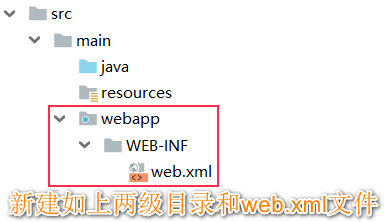 |

```xml
<?xml version="1.0" encoding="UTF-8"?>
<web-app xmlns="http://xmlns.jcp.org/xml/ns/javaee"
         xmlns:xsi="http://www.w3.org/2001/XMLSchema-instance"
         xsi:schemaLocation="http://xmlns.jcp.org/xml/ns/javaee http://xmlns.jcp.org/xml/ns/javaee/web-app_4_0.xsd"
         version="4.0">
	<!-- 这是一个空白的web.xml文件模板 -->
</web-app>
```

##### 6.4.4 定义Servlet和Jsp

|          照常定义即可           |
| :-----------------------------: |
|  |

#### 6.5 部署web项目

##### 6.5.1 新增Tomcat

|                       新增Tomcat                        |
| :-----------------------------------------------------: |
|  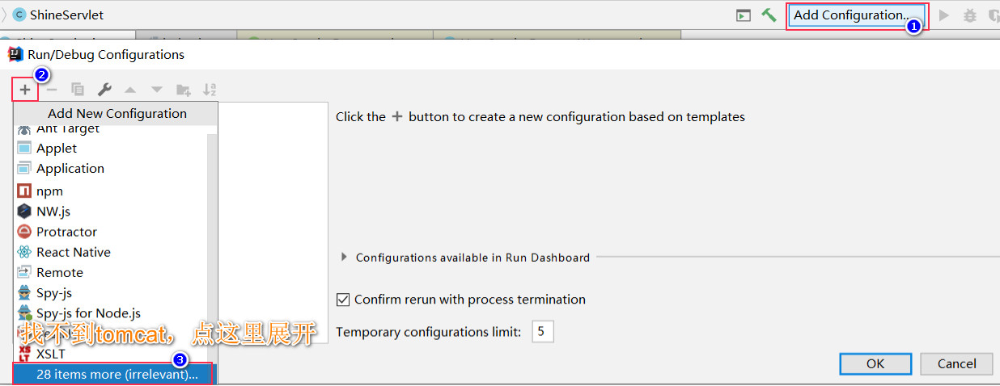  |
|  |
| 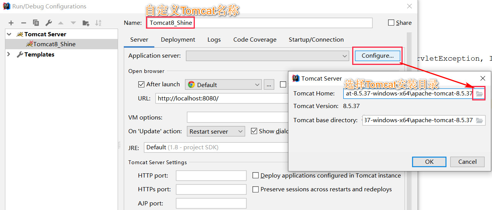 |

##### 6.5.2 部署web项目

|                       部署web项目                       |
| :-----------------------------------------------------: |
| 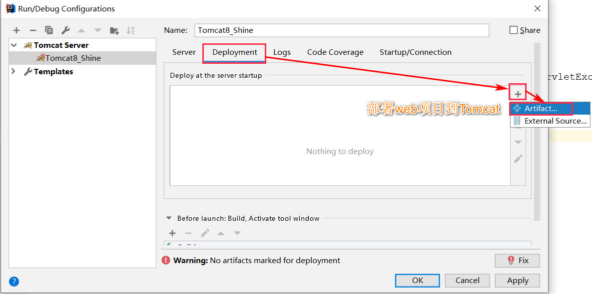 |
| 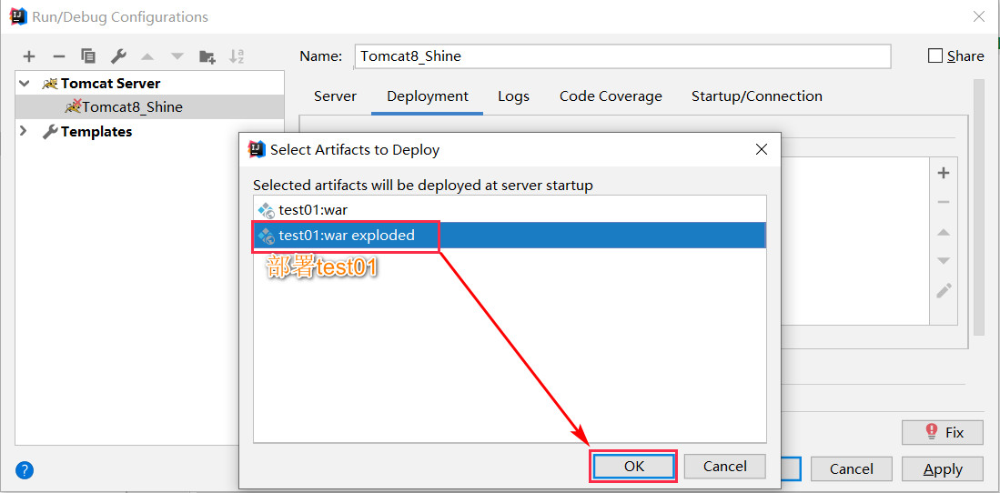 |
| 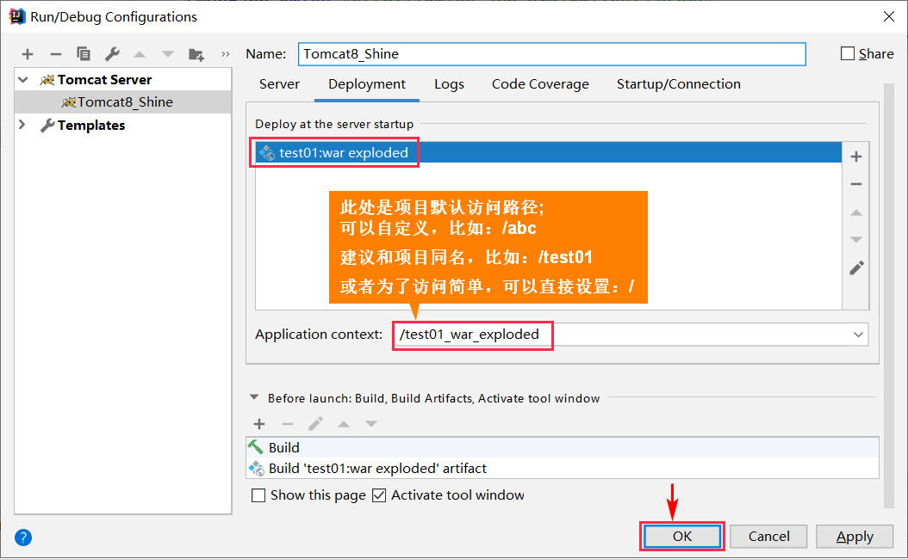 |

##### 6.5.3 启动Tomcat

|                        启动Tomcat                         |
| :-------------------------------------------------------: |
|    |
| 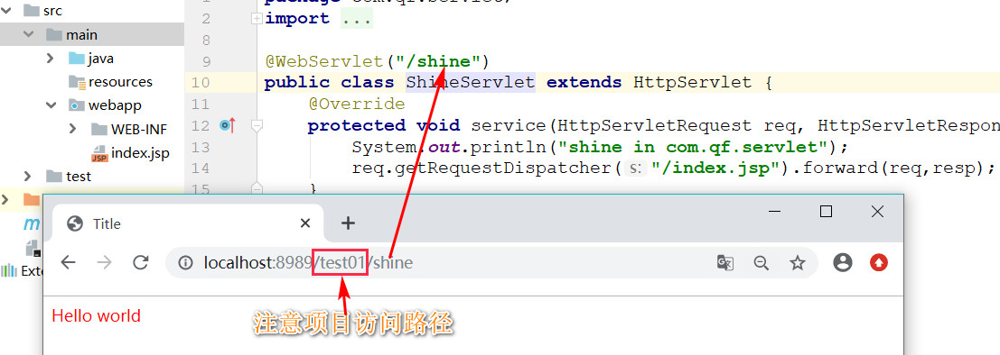 |

#### 6.6 依赖生命周期

##### 6.6.1 概念

> Jar包生效的时间段，即Jar的生命周期

##### 6.6.2 使用方式

> 项目中导入的依赖可以做生命周期的管理

```xml
<dependency>
    <groupId>commons-io</groupId>
    <artifactId>commons-io</artifactId>
    <version>2.6</version>
    <!-- 生命周期 -->
    <scope>compile</scope>
</dependency>
<dependency>
    <!-- servlet编译环境 -->
    <groupId>javax.servlet</groupId>
    <artifactId>javax.servlet-api</artifactId>
    <version>3.1.0</version>
    <!-- 生命周期 -->
    <scope>provided</scope>
</dependency>
<dependency>
    <groupId>junit</groupId>
    <artifactId>junit</artifactId>
    <version>4.12</version>
    <!-- 生命周期 -->
    <scope>test</scope>
</dependency>
```

##### 6.6.3 生命周期详解

| 标识     | 周期                                                         |
| -------- | ------------------------------------------------------------ |
| compile  | 缺省值，适用于所有阶段（测试运行，编译，运行，打包）         |
| provided | 类似compile，期望JDK、容器或使用者会提供这个依赖。如servlet-api.jar；适用于（测试运行，编译）阶段 |
| runtime  | 只在运行时使用，如 mysql的驱动jar，适用于（运行，测试运行）阶段 |
| test     | 只在测试时使用，适用于（编译，测试运行）阶段，如 junit.jar   |
| system   | Maven不会在仓库中查找对应依赖，在本地磁盘目录中查找；适用于（编译，测试运行，运行）阶段 |

### 七、Maven指令

---

#### 7.1 命令行

> 通过Idea打开 [cmd]()，然后执行Maven指令

|    打开 cmd，并定位到项目目录     |
| :-------------------------------: |
| 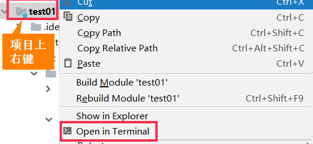 |

|            执行maven指令            |
| :---------------------------------: |
| 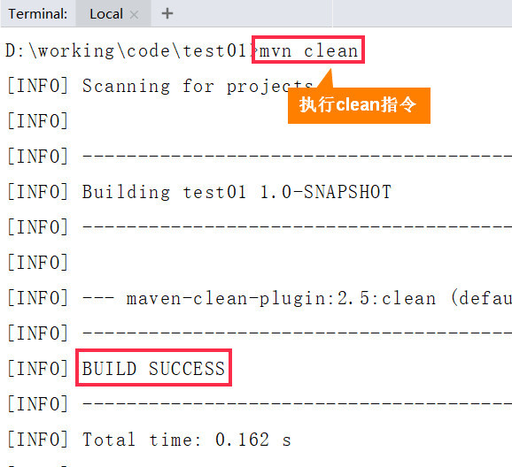 |

#### 7.2 Maven面板

> Idea中有Maven面板，其中可以快速执行Maven指令

|              maven面板              |
| :---------------------------------: |
| 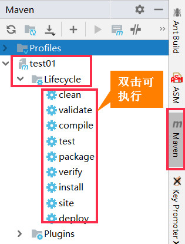 |

### 八、私服

---

#### 8.1 概念

> * 私服是架设在局域网的一种特殊的远程仓库，目的是代理远程仓库及部署第三方构件。
>
> * 有了私服之后，当 Maven 需要下载依赖时，直接请求私服，私服上存在则下载到本地仓库；否则，私服请求外部的远程仓库，将构件下载到私服，再提供给本地仓库下载。
>* 私服可以解决在企业做开发时每次需要的jar包都要在中心仓库下载,且每次下载完只能被自己使用,不能被其他开发人员使用
> 
>* 所谓私服就是一个服务器,但是不是本地层面的,是公司层面的,公司中所有的开发人员都在使用同一个私服

#### 8.2 架构

|          无私服           |          有私服           |
| :-----------------------: | :-----------------------: |
| 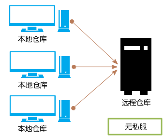 | 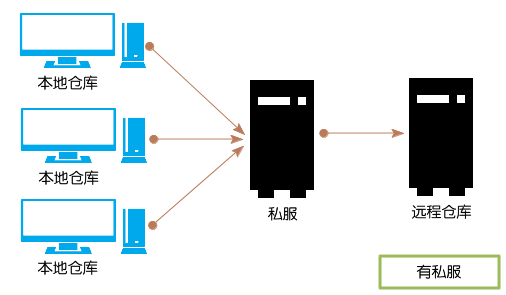 |

> 我们可以使用专门的 Maven 仓库管理软件来搭建私服，比如：[Apache Archiva](http://archiva.apache.org/index.cgi)，[Artifactory](http://www.jfrog.com/home/v_artifactory_opensource_overview/)，[Sonatype Nexus](http://www.sonatype.org/nexus/)。这里我们使用 [Sonatype Nexus]()

#### 8.3 Nexus安装【了解】

##### 8.3.1 下载

> * 官网：https://blog.sonatype.com/
>* 下载地址：<https://help.sonatype.com/repomanager2/download/download-archives---repository-manager-oss>  
> 

##### 8.3.2 安装

> 下载nexus-2.x-bundle.zip,解压即可 

|       nexus安装目录       |
| :-----------------------: |
| 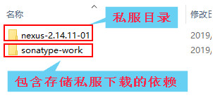 |

#### 8.4 启动【了解】

> - 解压后在bin目录中执行：
>   - nexus install  在系统中安装nexus服务
>   - nexus uninstall 卸载nexus服务
>   - nexus start    启动服务
>   - nexus stop    停止服务

#### 8.5 Nexus登录【了解】

> 访问私服：http://localhost:8081/nexus/

|               登录Nexus才可以使用Nexus管理功能               |
| :----------------------------------------------------------: |
|  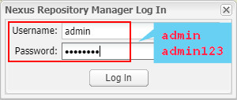 |

#### 8.6 仓库列表【了解】

| 仓库类型 | 描述                                                         |
| -------- | ------------------------------------------------------------ |
| group    | 包含多个仓库，通过group库的地址可以从包含的多个仓库中查找构件 |
| hosted   | 私服 服务器本地的仓库，其中存储诸多构件                      |
| proxy    | 代理仓库，其会关联一个远程仓库, 比如中央仓库，aliyun仓库，向该仓库查找构件时，如果没有会从其关联的仓库中下载 |

| 仓库名    | 描述                                                         |
| --------- | ------------------------------------------------------------ |
| Releases  | 存放项目的稳定发布版本，一个模块做完后如果需要共享给他人，可以上传到私服的该库 |
| Snapshots | 对应不稳定的发布版本                                         |
| 3rd party | 存放中央仓库没有的 ，如ojdbc.jar，可以上传到私服的该库中     |

|             仓库列表              |
| :-------------------------------: |
| 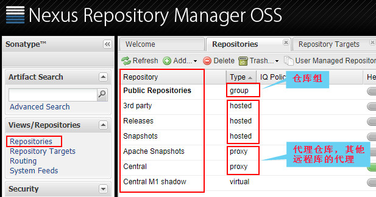 |


#### 8.7 Maven配置私服 【`重点`】

> 在maven中配置私服，使得maven可以从私服上获取构件

##### 8.7.1 仓库组

> 而此时就有问题，私服中有很多仓库，每个仓库都有自己的url，则项目中配置哪个仓库呢 ?
>
> 私服中有一个仓库组，组中包含多个仓库，可以指定仓库组的url，即可从多个仓库中获取构件

| 仓库组       注意：proxy的仓库排序在最后 |
| :--------------------------------------: |
| 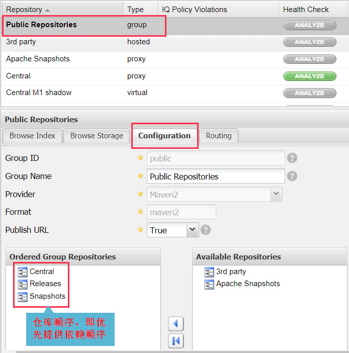  |

##### 8.7.2 Maven关联私服

> 配置[settings.xml]()，设置私服地址、认证等信息

```xml
<servers>
	<server> 
		<id>nexus-public</id> <!-- nexus的认证id -->
		<username>admin</username> <!--nexus中的用户名密码-->
		<password>admin123</password> 
	</server>
</servers>
<profiles>
	<profile> 
        <id>nexus</id> 
        <repositories> 
            <repository> 
                <id>nexus-public</id> <!--nexus认证id 【此处的repository的id要和 <server>的id保持一致】-->
                <!--name随便-->
                <name>Nexus Release Snapshot Repository</name> 
                <!--地址是nexus中仓库组对应的地址-->
                <url>http://localhost:8081/nexus/content/groups/public/</url>
                <releases><enabled>true</enabled></releases> 
                <snapshots><enabled>true</enabled></snapshots> 
            </repository>
        </repositories> 
        <pluginRepositories> <!--插件仓库地址，各节点的含义和上面是一样的-->
            <pluginRepository> 
                <id>nexus-public</id> <!--nexus认证id 【此处的repository的id要和 <server>的id保持一致】-->
                <!--地址是nexus中仓库组对应的地址-->
                <url>http://localhost:8081/nexus/content/groups/public/</url>
                <releases><enabled>true</enabled></releases> 
                <snapshots><enabled>true</enabled></snapshots> 
            </pluginRepository> 
        </pluginRepositories> 
    </profile>
</profiles>
<activeProfiles>
    <activeProfile>yourjdk</activeProfile>
    <!-- 使私服配置生效 -->
    <activeProfile>nexus</activeProfile>
</activeProfiles>
```

> 至此，Maven项目中需要依赖时，Maven会从私服中下载

#### 8.8 Maven项目部署到私服

> * 执行 ：[mvn deploy]()  即可将项目部署到私服对应的仓库中，此时项目中的打包方式多为jar
>
> * 但需要提前在项目的[pom.xml]()中配置部署私服仓库位置，如下：

```xml
    ...
	<dependencies>
		.....
	</dependencies>
	
	<!-- 在项目的pom.xml中 配置私服的仓库地址，可以将项目打jar包部署到私服 -->
	<distributionManagement>
        <repository>
            <id>nexus-public</id> <!-- nexus认证id 要和maven的settings文件里面的对应的server标签的id一致-->
            <url>http://localhost:8081/nexus/content/repositories/releases</url>
        </repository>
        <snapshotRepository>
            <id>nexus-public</id> <!-- nexus认证id -->
            <url>http://localhost:8081/nexus/content/repositories/snapshots</url>
        </snapshotRepository>
	</distributionManagement>
</project>
```

> 注意：如上的 repository的 id 依然是要和settings.xml中配置的server中的id 一致，才能通过私服的认证
