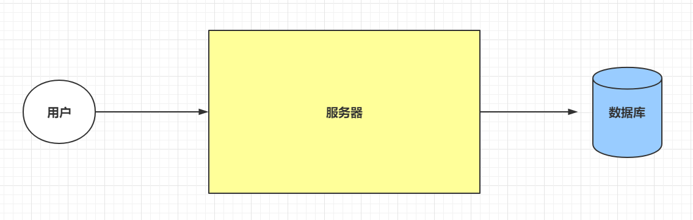
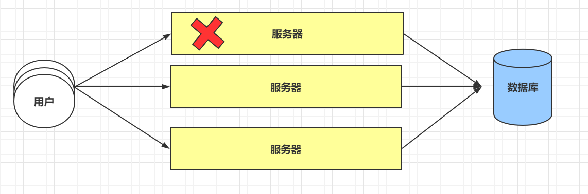
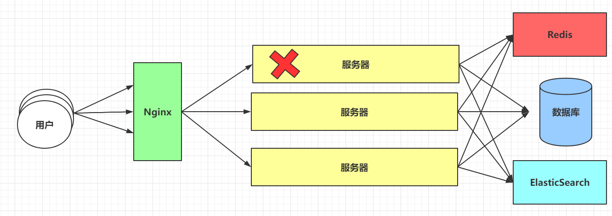
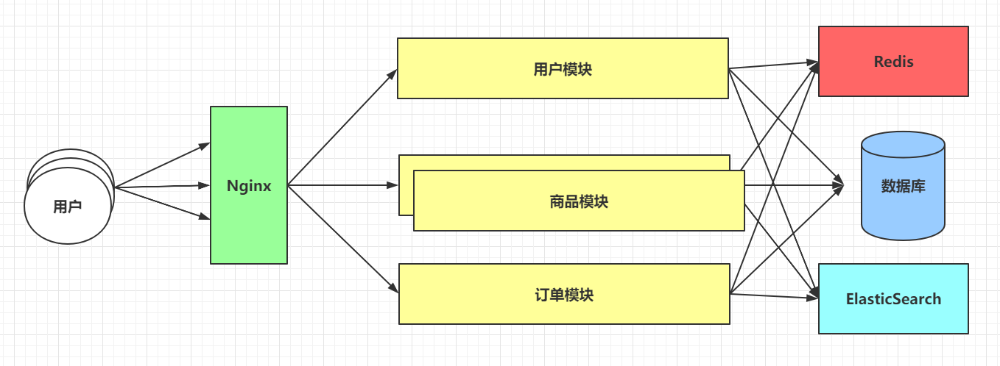
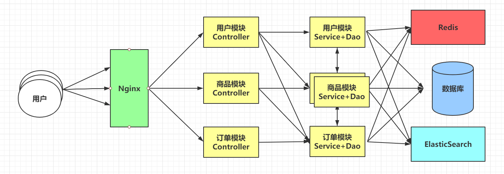
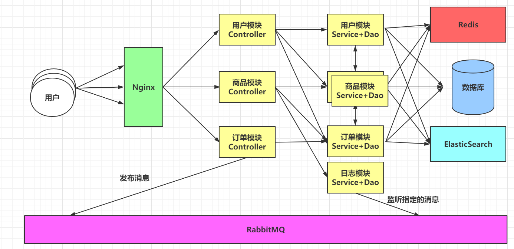
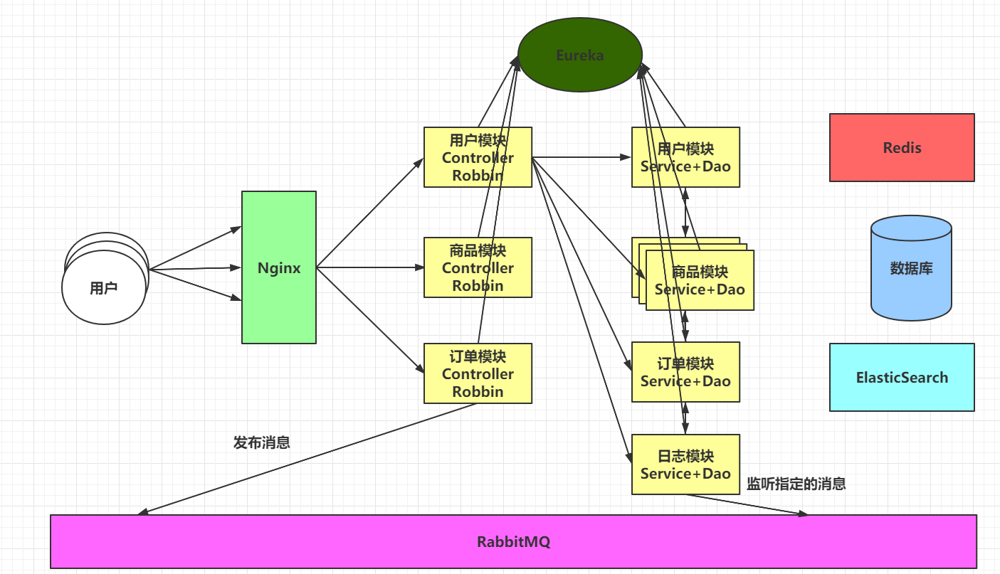
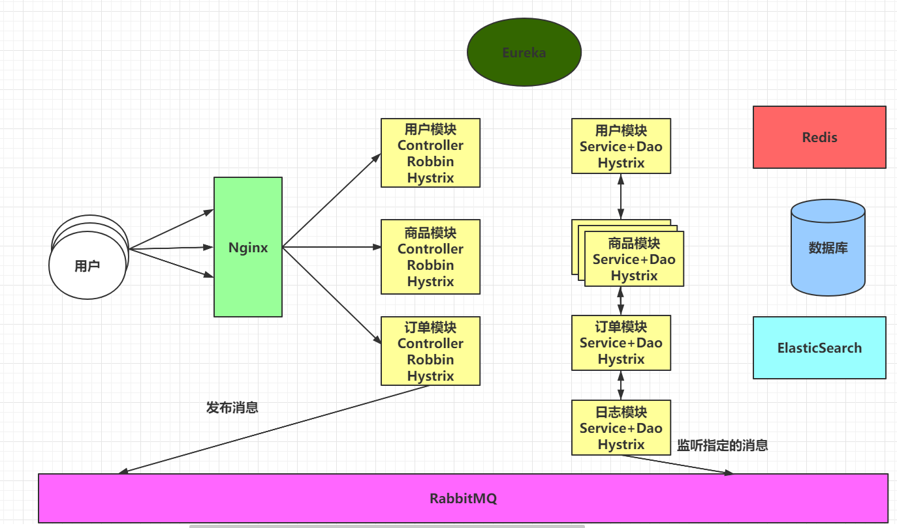
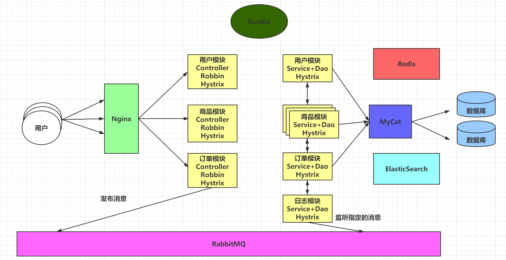
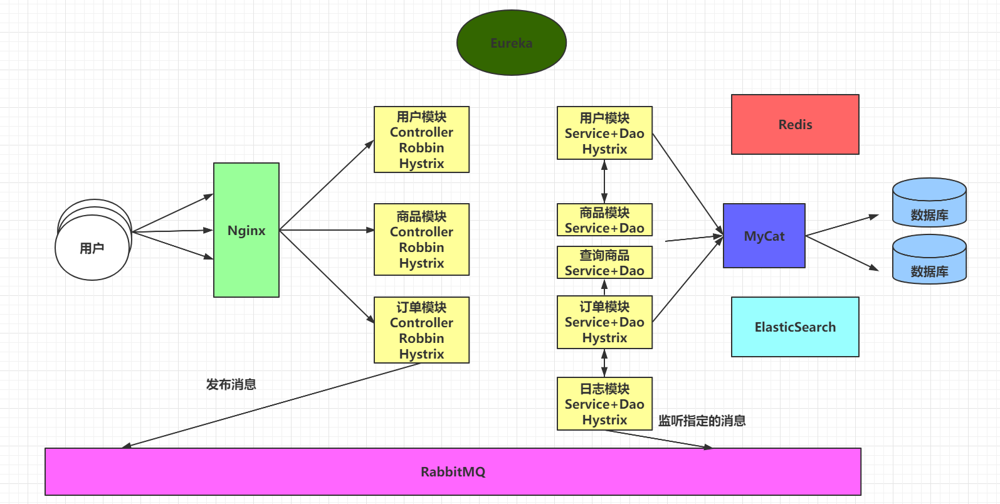

> Author：Jackiechan
>
> Version：9.0.0

[TOC]

### 一、开发环境&生产环境

-------------

#### 1.1 开发环境

> 平时在写代码时，大多都在是Win10/Win7/Mac，这些系统都可以称呼为开发环境，咱们会为了更高效的开发应用程序，安装很多很多的软件，会导致操作系统不安全，稳定性降低。

#### 1.2 生产环境

> - 在生产环境中，操作系统不会采用Win10/Mac，这种操作系统相对不安全，生产环境是要面向全体用户的，一般会采用专业的操作系统。
>
> - 大多市面上使用的都是基于Linux的操作系统，当然还有Windows版本的服务器操作系统，Windows 2003 server等等。
>
> - 由于Linux内核版本完全对外开源，市场占用率大，所以第一步我们要学会如何操作Linux操作系统。

### 二、Web1.0&Web2.0阶段

---

#### 2.1 Web1.0阶段

> 在Web1.0阶段，由于带宽不足，这时的项目大多是内容少，用户量也不多，甚至有一些项目不需要对外开放，对安全性和稳定性的要求是不高的。
>
> 单体架构就足以应对。

|                 单体架构                  |
| :---------------------------------------: |
|  |

#### 2.2 Web2.0阶段

> 随之到来的Web2.0阶段，实现了ADSL拨号上网，宽带提速，最高可以达到8M，用户量也就不断增加，一些门户网站也开始活跃，项目就需要考虑安全性和稳定性。
>
> 在基于上面的单体架构图中，无法满足Web2.0对项目的需求。
>
> 在单体架构的基础上去搭建集群。
>
> 在搭建集群之后，可以提升项目的稳定性，并且并发能力增强，还可以避免单点故障。

|             单体架构搭建集群              |
| :---------------------------------------: |
|  |

#### 2.3 搭建集群后发生的问题.

> - 用户的请求到底要发送到哪台服务器上。如何保证请求平均的分发给不同的服务器，从而缓解用户量增加的压力。
> - 编写项目时，如果用户登录成功了，将用户的标识放到Session域中，在搭建集群之后，数据共享问题。
> - 当数据量特别庞大时，如果还直接去数据库查询，速度很慢，如何提升查询效率。
> - 针对大家在搜索一些数据时，where content like '%#{xxx}%'
> - 等等……
>
> 为了解决上述的问题，需要使用到三门技术。
>
> - Nginx - 解决用户请求平均分发。
>
> - Redis - 解决数据共享并实现缓存功能。
>
> - ElasticSearch - 解决搜索数据的功能。

|                插入中间件                 |
| :---------------------------------------: |
|  |

### 三、垂直架构

---

> 比如项目包含了三个模块，用户模块，商品模块，订单模块。如果商品模块压过大，一般最直接有效的方式就是搭建集群。在单体架构的集群上去搭建，效果相对比较差。
>
> 随着项目的不断更新，项目中的功能越来越多，最严重可能会导致项目无法启动。
>
> 关于单体架构中，完美的体现了低内聚，高耦合，避开了开发的准则。
>
> 为了解决上述的各种问题，演进出了垂直架构。

|                垂直架构图                 |
| :---------------------------------------: |
|  |

### 四、分布式架构

---

> 随着项目的不断迭代，新老功能之间需要相互交互，服务器和服务器之间是需要通讯的。
>
> 项目一般是分为三层的，Controller，Service，Dao。 导致程序变慢的重灾区，一般是Service和Dao，在搭建集群时，确实针对三层都搭建集群，效果不是很好。
>
> 架构从垂直架构演变到了分布式架构。
>
> 分布式架构落地的技术，国内常用的方式有两种
>
> - Dubbo							RPC（通讯方式）
>
> - SpringCloud				HTTP（通讯方式）

|               分布式架构图                |
| :---------------------------------------: |
|  |

### 五、分布式架构常见问题

----

#### 5.1 服务之间的异步通讯

> 使用分布式架构之后，服务之间的通讯都是同步的。在一些不是核心业务的功能上，咱们希望可以实现异步通讯，以加快处理速度，可以更快的给用户响应。
>
> 为了实现服务之间的异步通讯，需要使用RabbitMQ等消息队列中间件。

|        分布式架构下，实现异步通讯         |
| :---------------------------------------: |
|  |

#### 5.2 服务之间通讯地址的维护.

> 由于服务越来越多，每个服务的访问地址都是一样的：[协议://地址:端口号/路径]()
>
> 由于模块繁多，并且模块搭建的集群数量增加，会导致其他模块需要维护各种ip地址等信息，导致项目的维护性极低，耦合性变高，并且实现负载均衡也变得很麻烦。
>
> 需要使用以下技术来解决当前问题:
>
> - Eureka注册中心帮助我们管理服务信息。
>
> - Robbin可以帮我们实现服务之间的负载均衡。

| Eureka实现通讯地址维护，Robbin实现服务之间的负载均衡 |
| :--------------------------------------------------: |
|             |

#### 5.3 服务降级

> 在上述的架构中，如果说订单模块出现了问题，只要是涉及到订单模块的功能，全部都无法使用，甚至可能会导致服务器提供的线程池耗尽。给用户友好的提示都是无法做到的。
>
> 为了解决上述的问题，使用Hystrix处理：
>
> Hystrix提供了线程池隔离的方式，避免服务器线程池耗尽，在一个服务无法使用时，还提供断路器的方式来处理问题服务，从而执行降级方法，返回托底数据。
>
> [Ps：Eureka，Robbin，Hystrix都是SpringCloud技术栈中的组件。]()

| 使用Hystrix帮我们提供断路器和隔离，并最终服务降级 |
| :-----------------------------------------------: |
|          |

#### 5.4 海量数据

> 海量数据会导致数据库无法存储全部的内容，即便数据库可以存储海量的数据，在查询数据时，数据库的响应时极其缓慢的，在用户高并发的情况下，数据库也时无法承受住的。
>
> 为了解决上述的问题，可以基于MyCat实现数据库的分库分表。

|           基于MyCat实现分库分表           |
| :---------------------------------------: |
|  |

### 六、微服务架构

----

#### 6.1 微服务架构

> 虽然已经将每个模块独立的做开发，比如商品模块，压力最大的是商品的查询。
>
> 在单独模块中再次拆分项目的方式就可以称之为微服务架构，微服务架构也是分布式架构。

| 微服务架构，在分布式架构的基础上再次拆分  |
| :---------------------------------------: |
|  |

#### 6.2 模块过多，运维成本增加

> 为了解决模块过多，运维成本增加的问题，采用Docker容器化技术来帮助我们管理各个模块的部署，还可以通过CI、CD持续集成，持续交付，持续部署。
>
> 而且后期在学习的时候，也需要大量的软件，可以使用Docker来帮助我们快速的安装软件。

|             Docker容器化技术              |
| :---------------------------------------: |
|  |

#### 6.3 分布式架构下的其他问题

> 分布式架构帮助我们解决了很多的问题，但是随之也带来了很多问题

##### 6.3.1 分布式事务

> 最传统的操作事务的方式，是通过Connection链接对象的方式操作，Spring也提供了声明式事务的操作。
>
> 为了解决事务的问题，后续会使用到RabbitMQ或者LCN等方式来解决。
>

##### 6.3.2 分布式锁

> 传统的锁方式，synchronized | Lock锁，在分布式环境下，传统的锁是没有效果的。
>
> 为了解决锁的问题，后续会使用到Redis或者Zookeeper来解决。

##### 6.3.3 分布式任务

> 在传统的定时任务下，由于分布式环境的问题，可能会造成任务重复执行，一个比较大的任务，需要可以拆分。
>
> 为了解决这个问题，后续会使用到Redis + Quartz或者Elastic-Job来解决。

