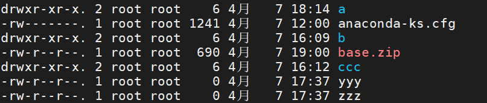

> Author：Jackiechan
>
> Version：9.1


[TOC]


### 一、引言

--------

#### 1.1 开发环境

> 平时大家大多是在Windows或者Mac操作系统下去编写代码进行开发，在开发环境中安装大量的软件，这样会导致环境的稳定性和安全性降低


#### 1.2 生产环境

> 是将程序运行在此环境中，供用户去使用。这个环境是有专业的人员去维护，一般人是没有权限去操做生产环境的


#### 1.3 测试环境

> 一般克隆一份生产环境，会将开发环境中的程序部署到测试环境中，这个环境的主要目的是去程序进程检测，收集程序中的各种问题，并交给开发人员进行修改


#### 1.4 操作系统的选择

> 生产环境中，常用的操作系统有Windows 2003 server，Linux，Unix等等，Linux操作系统，在生产环境中占据了大量的市场份额，Linux主要以稳定，可靠，免费的特点成为全球使用最多的服务器操作系统。
>
> Linux操作系统现在已经成为后台开发人员必备的技能，并且后期学习的各种知识都会涉及到Linux操作系统。


### 二、Linux介绍

----

#### 2.1 Linux介绍

> 在Linux操作系统出现之前，还有一个操作系统叫做Minix，Minix操作系统是由Andrew的大学教授研发出来的，当时大学教授是为了给学生上课，买了一套Unix操作系统，参考Unix自己写了一个操作系统，并且命名为Minix。同时将Minix开源，供学校内部的研究和教学，到了2000年，Andrew将Minix操作系统完全对外开源。
>
> Minix由于完全对外开源之后，在互联网上迅速的传播，但是大家在使用时，发展Minix不时很完美，内部存在各种各样问题。用户将问题解决后，编写了一个补丁，将补丁以邮件的方式发给Andrew，但是Andrew教授最初的目的只是为了教学和研究。
>
> 于此同时，一位芬兰的大学生出现了，叫Linus，在Minix操作系统基础上，自己添加了一些补丁和插件，并将其命名为Linux操作系统，并且完全对外开源，而且开始维护Linux操作系统。
>
> 之前学习的Git也时Linus研发的。

|          Linus Torvalds 和 Linux          |
| :---------------------------------------: |
|  |


#### 2.2 Linux的版本

> Linux的版本分为两种，一种是Linus团队正在维护的开源内核版本。另一种是一些厂商基于内核版本封装的发行版本。
>
>    - Linux的内核版本官网：https://www.kernel.org/
>
> - Linux的发行版本，咱们需要学习的发行版本就时CentOS

|            Linux的常见发行版本            |
| :---------------------------------------: |
|  |


#### 2.3 Linux和Windows区别

> - Linux是严格区分大小写的，Windows无所谓。
> - Linux中一切皆是文件。
> - Linux中文件是没有后缀的，但是他有一些约定俗成的后缀。
> - Windows下的软件一般是无法直接运行的Linux中。
>
> [Ps：我们在学习Linux时，参考Windows下做了什么，就在Linux中做什么]()

### 三、Linux安装

---

> - 安装Linux，我们需要一个虚拟机，为了安装虚拟环境：VMware或者Virtual Box（采用VMware）
>
>    https://www.vmware.com/go/getworkstation-win
>
> - 为了安装Linux，我们需要一个Linux的镜像文件：CentOS7版本
>
>    http://mirrors.163.com/centos/7/isos/x86_64/CentOS-7-x86_64-Minimal-1908.iso
>
> - 安装一个连接Linux的图形化界面：Xterm，SSH，XShell（Xterm）,finalshell任意一个都可以
>
>    https://download.mobatek.net/2012020021813110/MobaXterm_Portable_v20.1.zip
>    
>    http://www.hostbuf.com/downloads/finalshell_install.exe


#### 3.1 安装VMware

> 傻瓜式安装，下一步下一步下一步……,`如果安装后没有虚拟网卡,查看本文档最后的方案`


#### 3.2 安装finalshell

> 正常下载安装


#### 3.3 在VMware中安装Linux

> 按照下图步骤，逐步安装Linux操作系统
>


##### 3.3.1 选择安装方式

|               选择安装方式                |
| :---------------------------------------: |
|  |


##### 3.3.2 指定镜像方式

|           选择稍后安装操作系统            |
| :---------------------------------------: |
|  |


##### 3.3.3 选择操作系统类型

|             选择操作系统类型              |
| :---------------------------------------: |
|  |


##### 3.3.4 指定虚拟机名称

|        指定虚拟机名称，和安装目录         |
| :---------------------------------------: |
|  |


##### 3.3.5 磁盘存储方式

|            拆分成多个文件存储             |
| :---------------------------------------: |
|  |


##### 3.3.6 指定虚拟机配置

|             指定虚拟机的设置              |
| :---------------------------------------: |
|  |


##### 3.3.7 开始安装CentOS

> 语言尽量选择英文,避免中文汉字因为没有输入法无法输入的情况,图形化远程客户端可以输入中文

| 开始界面选择语言 |
| :----------------------------------------------------------: |
|                  |


##### 3.3.8 配置虚拟机网络连接

> 在配置界面选择network的配置

|                        配置界面                        |
| :----------------------------------------------------: |
|  |


|   配置安装位置以及网络和主机名（开启）    |
| :---------------------------------------: |
|  |


##### 3.3.9 开始安装

|     9、开始安装后，设置ROOT用户的密码     |
| :---------------------------------------: |
|  |


##### 3.3.10 安装成功

|           10、安装成功，并登录            |
| :---------------------------------------: |
|  |


#### 3.4 使用Finalshell连接Linux

> 直接在Vmware中操作Linux有很多限制，我们可以在图形化界面中操作Linux操作系统
>
> 具体步骤如下……


##### 3.4.1 查看ip地址

|                查看ip地址                 |
| :---------------------------------------: |
|  |


##### 3.4.2 通过Finalshell连接

|                连接上Linux                |
| :---------------------------------------: |
|  |

|                 连接成功                  |
| :---------------------------------------: |
|  |


### 四、Linux的目录结构

---

> Windows的目录结构是带有盘符的。D：  E： C：，而Linux中是没有盘符的
>
> 在Xterm中输入ls / 查看Linux的顶级目录。

|                   ls /                    |
| :---------------------------------------: |
|  |

> Linux的常用目录……

|              Linux目录树状图              |
| :---------------------------------------: |
|  |


|  目录  |                         介绍                         |
| :----: | :--------------------------------------------------: |
| `root` |           该目录为系统管理员ROOT的HOME目录           |
| `bin`  |             这个目录下放着经常使用的命令             |
| `boot` |        这里存放的是启动Linux时的一些核心文件         |
| `etc`  |         存放系统管理所需要的配置文件和子目录         |
| `home` |                  普通用户的HOME目录                  |
| `usr`  | 默认安装软件的目录，类似Windows中的Program Files目录 |
| `opt`  |             是主机额外安装软件拜访的目录             |


### 五、Linux的基本命令

---------------------------

> Linux中命令的基本格式：命令 【选项】 【参数】
>
> 需要注意，个别命令是不遵循这个格式
>
> 当命令中有多个选项时，可以写在一起的，并且选项也是由简写方式的 命令 -选项A选项B
>
> Linux的基本操作命令，不遵循上述格式，但是后期会经常使用……

```sh
# 1. 我是谁
who am i

# 2. 我在哪
pwd

# 3. 查看ip 地址
ip a | ip address

# 4. 清屏
clear

# 5. ping域名|ip
ping 地址

# 6. 强制停止
Ctrl + C
```


### 六、Linux目录命令【`重点`】

----

#### 6.1 列出目录

> 查看指定目录下的内容，默认查看当前目录下内容
>
> [Linux中的隐藏文件是以.开头的，当前目录使用.表示，上一级目录使用..表示]()

```sh
ls [-ald] [目录名]
# 目录名不填写，默认为当前目录。
# -a：列出的全部的文件，包括隐藏文件
# -l：列举出全部的信息,可以直接简写为 ll
# -d：仅查看目录本身
```


#### 6.2 切换目录

> 实现目录间切换，使用绝对路径、相对路径、特殊符号

```sh
cd 具体路径 | 特殊符号
```

| 特殊符号 |       表达的路径       |
| :------: | :--------------------: |
|    .     |        当前目录        |
|    ..    |       上一级目录       |
|    /     |         根目录         |
|    ~     | 当前登录用户的HOME目录 |
|    -     |          返回          |


#### 6.3 创建目录

> 创建目录，以及创建多级目录方式

```sh
mkdir [-p] 目录名
# -p：代表创建多级目录时，使用
```


#### 6.4 删除目录

> 删除非空目录或包含内容的目录

```sh
# 只能删除空目录
rmdir 目录名

# 删除非空目录
rm [-rf] 目录名
# -r：代表递归删除目录下的全部内容
# -f：不询问，直接删除
```


#### 6.5 复制目录

> 复制目录下的全部内容

```sh
cp -r 来源目录 目标目录
# -r：递归复制全部内容，必填项,如果目标目录存在,就是把来源目录放到目标目录里面,如果目标目录不存在,就是复制过去并重命名为目标目录的名字
```


#### 6.6 移动、重命名目录

> 移动、重命名目录，会根据第二个参数指定具体操作逻辑

```sh
mv 目录名 新目录名 | 路径
# 如果第二个参数指定的路径不存在，就是重命名，如果第二个参数的路径存在，就是移动
```

 

### 七、Linux的文件命令【`重点`】

---

#### 7.1 创建文件

> 创建空文件

```sh
touch 文件名1 文件名2 ……
```


#### 7.2 编辑文件

> 编辑文件，后期最常的命令之一

```sh
vi 文件名 				# 查看文件。（查看模式）

i | a | o   		  # 进入编辑模式。（编辑模式）
                      # i：在当前光标处，进入编辑模式。 
                      # a：在当前光标后一格，进入编辑模式。 
                      # o：在当前光标下一行，进入编辑模式。
I |A |O
                      # I：在当前光标所在行的行首，进入编辑模式。 
                      # A：在当前光标所在行的行尾，进入编辑模式。 
                      # O：在当前光标所在行的上一行，进入编辑模式。
                      
esc				      # 退出编辑模式，回到查看模式。

:				      # 从查看模式进入到底行命令模式。（底行命令模式）
                      # 在底行命令模式下，输入wq回车保存并退出。输入q!回车不保存并退出
                      # 在查看模式下，摁ZZ，可以快速保存并退出。
```


#### 7.3 vi文件时，其他操作

> 编辑文件时，常用的快捷键，方便操作

```sh
# 在vi文件时，在底行命令模式下可以输入以下常用内容
# 行号操作
set nu              # 查看文件的行号
to rownum           # 快速的跳转到指定行
set nonu            # 取消行号
# 搜索操作
/word               # 类似Windows的Ctrl + F搜索文件中的具体内容所在位置，查看下一个可以输入字母n
# 快速定位
G                   # 快速跳转到最后一行
gg                  # 快速跳转到第一行
```


#### 7.4 查看文件

> 根据不同的业务，可以选择不同的查看方式

```sh
# 查看文件，直接展示到最后一行
cat 文件名

# 从倒数第一行开始查看文件内容，展示全部
tac 文件名

# 显示文件的用时，展示行号
nl 文件名

more 文件名
# 查看大文件时，可以一页一页的向下翻
# 嗯space向下翻页，退出时摁q

less 文件名
# 查看大文件时，可以任意的向上或者向下翻
# 向上或向下翻页摁PageUp和PageDown，一行一行查看，摁光标的↑↓,可以按q退出

# 只查看前几行
head 文件名

# 只查看后几行
tail 文件名
# tail -f 日志 监控日志 ,ctrl+c结束
```


#### 7.5 移动、重命名文件

> 移动、重命名目录，会根据第二个参数指定具体操作逻辑

```sh
mv 文件名 新文件名 | 路径
# 如果第二个参数指定的路径不存在，就是重命名，如果第二个参数的路径存在，就是移动
```


#### 7.6 复制文件

> 复制文件到指定目录下

```sh
cp 文件名 目录
```


#### 7.7 删除文件

> 删除文件方式

```sh
rm [-f] 文件名
# -f：是否询问
```


### 八、Linux的压缩包命令【`重点`】

----

#### 8.1 针对tar命令

> Linux中常用的压缩包，大多是.tar，.tar.gz，tgz的


##### 8.1.1 解压压缩包

> 针对压缩包后缀的情况，采用不同的参数，否则可能会损失文件

```sh
tar [-zxvf] 压缩包名称 [-C 路径]
# -z： 代表压缩包后缀是.gz的
# -x： 代表解压
# -v： 解压时，打印详细信息
# -f： -f选项必须放在所有选项的最后，代表指定文件名称
# -C 路径： 代表将压缩包内容解压到指定路径
```


##### 8.1.2 打包成压缩包

> 可以将多个文件以及目录打包成压缩包，根据选择的参数指定压缩包名

```sh
tar [-zcvf] 压缩包名称 文件1 文件2 目录1 目录2 ...
# -c： 代表打包
# 其他参数同上
```


#### 8.2 针对zip类型压缩包

> Linux不仅仅针对tar类型的压缩包，也支持zip，rar这种Windows下的压缩包。
>
> 不过需要安装软件针对对各种类型压缩包的操作


##### 8.2.1 安装软件

```sh
yum -y install zip     # 打包程序
yum -y install unzip   # 解压程序
```


##### 8.2.2 解压以及打包

```sh
# 解压
unzip 压缩包名称

# 打包
zip -r 压缩包名称 文件1 文件2 目录1 目录2 ...
```


### 九、用户&用户组的操作

---

#### 9.1 用户的常用操作命令

> Linux是一个多用户的操作系统，任何一个用户想要操作Linux操作系统，必须向系统管理员申请一个账号才可以，并且以这个账号的身份去操作Linux。
>
> 用户的账号一方面可以帮助系统管理员追踪当前用户的操作。另一方面可以控制当前用户对系统资源访问。


##### 9.1.1 用户的创建

```sh
useradd [-cgd] [选项指定的具体内容] 用户名
# -c：代表comment，给用户添加一段注释
# -g：代表group，可以修改用户的所在组
# -d：代表指定用户的HOME目录
```


##### 9.1.2 设置用户密码

```sh
passwd 用户名
```


##### 9.1.3 切换用户

```sh
su 用户名
# [root@localhost ~]#   -> root用户在本地登录，并且当前在~目录下，#代表是超级管理员
# [qf@localhost ~]$		-> qf用户在本地登录，并且当前在~目录下，$代表是普通用户
```


##### 9.1.4 删除用户

```sh
userdel [-r] 用户名
# -r： 代表删除用户的同时，删除该用户的HOME目录
```


##### 9.1.5 修改用户

```sh
usermod [-cgd] [选项指定的具体内容] 用户名
# -c：代表comment，给用户添加一段注释
# -g：代表group，可以修改用户的所在组
# -d：代表指定用户的HOME目录
```


#### 9.2 用户组的操作

> 用户的身份除了用户本身，还会分配到指定的用户组，可以通过用户组对设置一些文件的操作权限


##### 9.2.1 创建用户组

```sh
groupadd 用户组名
```


##### 9.2.2 修改用户组

```sh
groupmod [-n] [选项指定的具体内容] 用户组名
# -n 修改用户组名称
groupmod oldname -n newname
```


##### 9.2.1 删除用户组

```sh
groupdel 用户组名
# 只能删除不存在用户的用户组
```


### 十、文件权限的修改【`重点`】

---

> 首先我们要清楚Linux文件的权限信息
>
> 在Linux中输入ls -l 或者 ll查看文件和目录的详细信息

|                 文件详情                  |
| :---------------------------------------: |
|  |

> 实例中，a目录的第一个属性用“d”标识这个a是一个目录。
>
> anaconda-ks.cfg第一个属性用“-”标识他是一个文件。
>
> 在Linux文件详情的后面属性需要分为三组查看
>
> - rwx： 代表文件拥有者的权限
> - rwx： 代表文件所属组用户的权限
> - rwx： 代表其他用户对当前文件的操作权限
>   - r： 代表read，读的权限
>   - w： 代表write，写的权限
>   - x： 代表execute，代表执行权限
>
> 其余信息
>
> - 后续的第一个root：代表当前文件的拥有者
>
> - 后续的第二个root： 代表当前文件的所属组
>
> - 后续分别为：文件的大小和最后修改时间等信息


#### 10.1 对文件的权限修改

> 使用chmod对文件的权限进行修改，一种使用数字，一种使用符号……
>
> - 数字方式方便操作，不过要修改整体权限信息
> - 符号方式更细粒度华，不过操作麻烦


##### 10.1.1 数字方式

```sh
chmod [-R] 777 文件|目录
# rwx在这三个权限中r：4，w：2，x：1
# -R： 当修改一个目录权限时，可以添加-R，将目录下的全部内容，都修改权限。
```


##### 10.1.2 符号方式

```sh
chmod [-R] a=rw 文件|目录
# user：u，group：g，other：o，all：a
# read：r，write：w，execute：x
# 赋予权限的方式 , 添加：+，减掉：-，设定：=
# -R： 当修改一个目录权限时，可以添加-R，将目录下的全部内容，都修改权限。
```


#### 10.2 文件拥有者及所属组修改

> chown可以直接修改拥有者和所属组，chgrp只能修改所属组……

```sh
# 修改文件的拥有者和所属组
chown [-R] 拥有者：所属组 文件|目录
# 修改文件的拥有者
chown [-R] 拥有者 文件|目录
# 修改文件的所属组
chgrp [-R] 所属组 文件|目录
```


### 十一、Linux的其他操作命令【`重点`】

----

#### 11.1 进程的操作

> 需要用到类似Windows的结束进程时，在Linux下需要使用如下命令

```sh
ps -ef 
# 查看全部正在运行的进程
ps -ef | grep 搜索的内容
# 杀死进程
kill -9 pid
```


#### 11.2 服务的操作

> 和Windows下的服务操作一致，只需使用如下命令，默认为centos7版本

```sh
# 针对服务的启动，停止，重启，开机自动启动，禁止开机自动启动，查看服务状态。
systemctl start|stop|restart|enable|disable|status 服务名称
```


#### 11.3 端口号查看

> 如发现端口号被占用，可以使用如下方式查找pid，并结束进程

```sh
# 想使用指定的命令需要事先下载netstat
yum -y install net-tools
# 查看端口号占用情况
netstat -naop | grep 端口号
```


#### 11.4 访问地址

> 类似浏览器访问路径，无法图形化显示，一般用于测试

```sh
curl 访问地址
```


#### 11.5 查找文件

> 在Linux中查找指定文件，参数较多，如下为根据文件名称查询

```sh
find 路径 -type f | grep profile
```


### 十二、Linux下安装软件

> 后续会通过docker进行容器化的管理

---

#### 12.1 安装JDK

> 在Linux下安装JDK，并配置JAVA_HOME环境变量……


##### 12.1.1 下载JDK的压缩包

> 去逛网下载压缩包，由于oracle官网更新，需要登录并同意协议才允许下载
>
> [https://www.oracle.com/java/technologies/javase-jdk8-downloads.html]()


##### 12.1.2 将jdk压缩包拉取到Linux系统中

> 需要使用图形化界面的Sftp拖拽到Linux操作系统

|               Xterm的Sftp图               |
| :---------------------------------------: |
|  |


##### 12.1.3 将jdk的压缩包解压

> 后期大多软件都安装在/usr/local下，直接使用tar解压

```sh
tar -zxvf jdk-8u241-linux-x64.tar.gz -C /usr/local
```


##### 12.1.4 将jdk的目录名修改一下

> 为了方便配置环境变量，修改一下目录名称

```sh
cd /usr/local
mv jdk1.8.0_241 jdk
```


##### 12.1.5 配置环境变量

> Linux提供了两种环境变量的文件
>
> - 第一个是用户级别的环境变量，存放在：~/.bashrc
> - 第二个是系统级别的环境变量，存放在：/etc/profile
>
> 修改哪个文件都可以，毕竟虚拟机就我们自己使用

```sh
# 在环境变量文件中，添加如下内容
export JAVA_HOME=/usr/local/jdk
export PATH=$JAVA_HOME/bin:$PATH
# 重新加载环境变量文件
source /etc/profile
# 最终测试
java -version
```

|                 测试效果                  |
| :---------------------------------------: |
|  |


#### 12.2 安装MySQL

> 在MySQL下用yum的方式安装MySQL……


##### 12.2.1 安装MySQL的YUM存储库

> 使用wget下载即可，不过需要先下载wget，再通过wget下载rpm包

```sh
# 首先通过yum下载wget命令
yum -y install wget
# 通过wget下载MySQL存储库
wget https://dev.mysql.com/get/mysql80-community-release-el7-3.noarch.rpm
```


##### 12.2.2 安装下载好的rpm包

> 使用rpm包的命令直接安装

```sh
# 安装rpm包
rpm -Uvh mysql80-community-release-el7-3.noarch.rpm
# 查看rpm包
rpm -qa | grep 内容
# 卸载rpm  （不需要指定当前命令。。。）
rpm -e --nodeps rpm名称
```


##### 12.2.3 选择发行版本

> 由于默认安装8.0版本的MySQL，我们需要修改为5.7版本

```sh
# 查看一下默认选择的发行版本
yum repolist all | grep mysql
# 通过编辑/etc/yum.repos.d/mysql-community.repo文件，去修改发行版本
# 将80的enabled更改为0，将67的enabled更改为1，保存即可，再次通过yum repolist all | grep mysql查看
# 效果如下
```

|               MySQL安装版本               |
| :---------------------------------------: |
|  |


##### 12.2.4 安装MySQL社区版服务

> 开始安装，这一步需要下载一段时间，下载失败就是网络较差了，学会科学上网

```sh
yum -y install mysql-community-server
```


##### 12.2.5 启动MySQL服务，并连接

> 安装成功后，手动启动，并使用日志中的密码登陆，而且第一个操作必须是修改密码，才可后续正常操作

```sh
# 启动MySQL服务
systemctl start mysqld.service
# 查看初始化密码
grep 'temporary password' /var/log/mysqld.log
# 连接MySQL服务
mysql -u root -p
Enter password:随机密码
# 修改密码
mysql> ALTER USER 'root'@'localhost' IDENTIFIED BY 'P@ssw0rd';
# 要求密码，必须携带大写字母，小写字母，数字，特殊符号
```


##### 12.2.6 开启远程连接

> 默认MySQL禁止远程链接，需要单独创建一个用户开启远程链接，这样就可以在windows下使用图形化工具连接

```sh
mysql> GRANT ALL PRIVILEGES ON *.* TO 'eric'@'%' IDENTIFIED BY 'P@ssw0rd' WITH GRANT OPTION;
mysql> FLUSH PRIVILEGES;
```


#### 12.3 安装Tomcat

> 在Linux下安装Tomcat，以便部署工程到Linux操作系统


##### 12.3.1 下载Tomcat的压缩包

> 通过wget直接下载即可

```sh
wget https://mirrors.tuna.tsinghua.edu.cn/apache/tomcat/tomcat-8/v8.5.53/bin/apache-tomcat-8.5.53.tar.gz
```


##### 12.3.2 解压压缩包

> 一样解压到/usr/local目录下

```sh
tar -zxvf apache-tomcat-8.5.53.tar.gz -C /usr/local
```


##### 12.3.3 启动Tomcat并监听日志

> 通过./执行可运行文件，并使用tail监控日志信息

```sh
# 跳转到tomcat的bin目录
cd /usr/local/apache-tomcat-8.5.53/bin
# 启动
./startup.sh
# 监控日志
cd ../logs
tail -f catalina.out
# 启动成功如下
```

|             日志及Tomcat首页              |
| :---------------------------------------: |
|  |
|  |


### 十三、部署SSM工程

----

> 部署项目到Linux中需要注意一下内容：
>
> - 项目要保证在Windows下是没有问题的，再考虑部署到Linux。
> - 将开发环境中的内容更改为测试环境。
>    - 连接数据库的信息。
>    - 存放文件的路径。
>    - 日志文件存放的位置。
>    - 项目路径问题。
> - 将Maven项目打包。
> - 根据项目路径的不同，将项目部署到Tomcat中。
> - 在部署到Linux操作系统中后，一定要查看日志。


###  十四 Vmvare 虚拟网卡问题

> 部分电脑在安装之后没有虚拟网卡,导致安装的linux系统无法获取ip连接网络,因此无法通过ssh工具连接,如下图 在网络适配器中缺少以下两个网卡


|  |
| :-----------------------------------------: |


#### 14.1 检查服务

> 首先win + r打开运行界面，输入services.msc进入服务界面,检查下面服务是不是正在运行,没有就启动起来


|  |
| :----------------------------------------------------------: |


#### 14.2 下载 CCleaner工具进行注册表清除

>https://www.ccleaner.com/ccleaner/download/standard
>
>下载后安装即可, 提示收费不管它,免费的就行


`点击左侧的注册表, 选择框全部选中,点击扫描问题,扫描完成后点击查看选定问题,将扫描的问题全部清理,清理的时候会询问是否备份注册表,这个随便`

|  |
| :-----------------------------------------: |


#### 14.3 重新安装虚拟网卡

> 点击选项栏的“编辑”下的“虚拟网络编辑器”


|  |
| :----------------------------------------------------------: |


> 点击更改设置,然后点击还原默认设置,等待完成即可,然后回到网络适配器中,就可以看到上面的两个适配器了,然后就可以使用虚拟机网络了


|  |
| :------------------------------------------------: |

