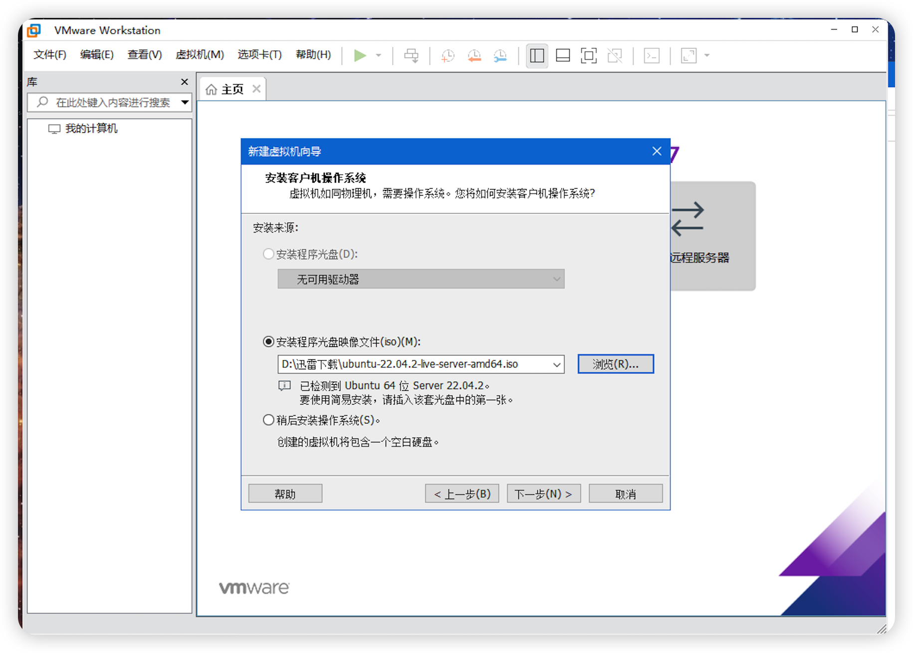

#### 一 在VMware中安装Ubuntu

> 按照下图步骤，逐步安装Ubuntu操作系统

##### 1.1  选择安装方式

|                         选择安装方式                         |
| :----------------------------------------------------------: |
|  |

##### 1.2 选择镜像文件

|                         选择镜像文件                         |
| :----------------------------------------------------------: |
|  |

##### 1.3 选择安装位置

|                         选择安装位置                         |
| :----------------------------------------------------------: |
|  |

##### 1.4 设置磁盘大小

|                         选择安装方式                         |
| :----------------------------------------------------------: |
|  |

##### 1.5 默认选项

|                           默认选项                           |
| :----------------------------------------------------------: |
|  |

##### 1.6 自定义硬件

|                          自定义硬件                          |
| :----------------------------------------------------------: |
|  |

##### 1.7 开始安装

|                           开始安装                           |
| :----------------------------------------------------------: |
|  |

##### 1.8 选择语言

|                           选择语言                           |
| :----------------------------------------------------------: |
|  |

##### 1.9 安装模式

|                           安装模式                           |
| :----------------------------------------------------------: |
|  |

##### 1.10 设置键盘模式

|                         设置键盘模式                         |
| :----------------------------------------------------------: |
|  |

##### 1.11 设置网络

|                           设置网络                           |
| :----------------------------------------------------------: |
|  |

##### 1.12 设置代理

|                           设置代理                           |
| :----------------------------------------------------------: |
|  |

##### 1.13设置镜像源

|                          设置镜像源                          |
| :----------------------------------------------------------: |
|  |

##### 1.14 选择引导磁盘

|                         选择引导磁盘                         |
| :----------------------------------------------------------: |
|  |

##### 1.15 设置磁盘分区

|                         设置磁盘分区                         |
| :----------------------------------------------------------: |
|  |

##### 1.16 确认设置

|                           确认设置                           |
| :----------------------------------------------------------: |
|  |

##### 1.17 设置用户

|                           设置用户                           |
| :----------------------------------------------------------: |
|  |

##### 1.18启用专业版

|                          启用专业版                          |
| :----------------------------------------------------------: |
|  |

##### 1.19 安装SSH

|                           安装SSH                            |
| :----------------------------------------------------------: |
|  |

##### 1.20 附加特性选择

|                         附加特性选择                         |
| :----------------------------------------------------------: |
|  |

##### 1.21 开始安装

|                           开始安装                           |
| :----------------------------------------------------------: |
|  |

##### 1.22 完成重启

|                        完成重启                         |
| :-----------------------------------------------------: |
|  |

##### 1.23 登录

|                             登录                             |
| :----------------------------------------------------------: |
|  |

