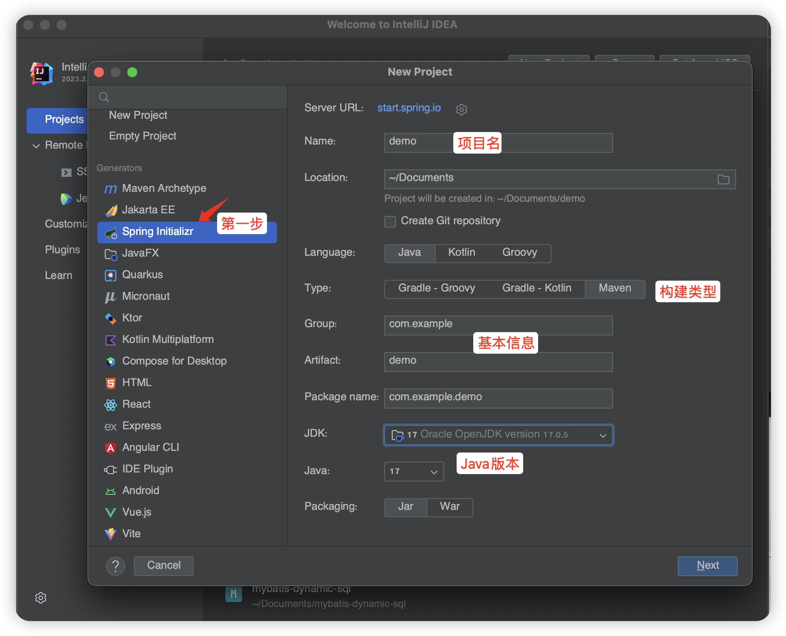
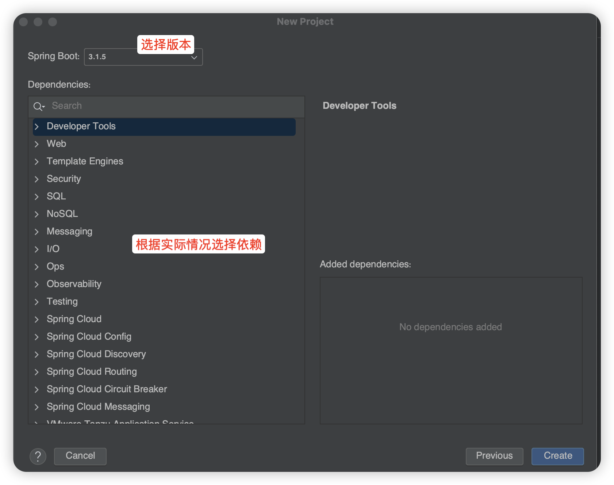
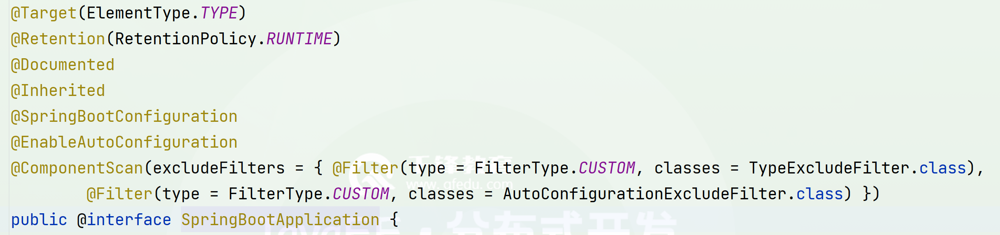
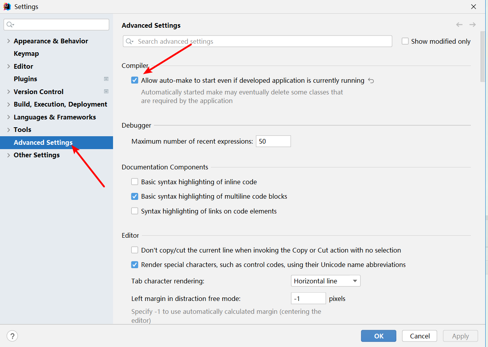

> Author：Jackiechan
>
> Version：9.0.1


[TOC]


### 一、引言

----

#### 1.1 初始化配置

> 为了使用SSM框架去开发，准备SSM框架的模板配置。


#### 1.2 整合第三方框架

> 为了Spring整合第三方框架，单独的去编写xml文件。


#### 1.3 后期维护

> 后期SSM项目后期xml文件特别多，维护xml文件的成本是很高的


#### 1.4 部署工程

> SSM工程部署也是很麻烦，依赖第三方的容器


#### 1.5 敏捷式开发

> 基于Java的SSM开发方式是很笨重，现在的企业更加注重敏解式开发,快速更新,快速迭代,因此需要一种能简化开发的技术


### 二、SpringBoot介绍

----

> SpringBoot是由Pivotal团队研发的，SpringBoot并不是一门新技术，只是将之前常用的Spring，SpringMVC，data-jpa等常用的框架封装到了一起，帮助你隐藏这些框架的整合细节，实现敏捷开发。
>
> SpringBoot就是一个工具集。

|                   LOGO                    |
| :---------------------------------------: |
|  |

> SpringBoot特点：
>
> - SpringBoot项目不需要模板化的配置。
> - SpringBoot中整合第三方框架时，只需要导入相应的starter依赖包，就自动整合了。
> - SpringBoot默认只有一个.yml的配置文件，不推荐使用xml，后期会采用.java的文件去编写配置信息。
> - SpringBoot工程在部署时，采用的是jar包的方式，内部自动依赖Tomcat容器，提供了多环境的配置。
> - SpringCloud需要建立在SpringBoot的基础上。


### 三、SpringBoot快速入门【`重点`】

----

#### 3.1 快速构建SpringBoot

> 通过脚手架来创建项目,图片取决于Idea的版本

##### 3.1.1 选择构建项目的类型

|            选择构建项目的类型             |
| :---------------------------------------: |
|  |


##### 3.1.2 指定SpringBoot版本和需要的依赖

|      指定SpringBoot版本和需要的依赖       |
| :---------------------------------------: |
|  |


##### 3.1.3 编写了Controller

```java
@RestController
public class TestController {

    @GetMapping("/test")
    public String test(){
        return "Hello SpringBoot!";
    }

}
```


##### 3.1.4 测试

> 通过主方法启动程序,默认端口是8080,访问我们的controller地址即可

|                   效果                    |
| :---------------------------------------: |
|  |


#### 3.2 SpringBoot的目录结构

##### 3.2.1 pom.xml文件

> - 指定了一个父工程： 指定当前工程为SpringBoot，帮助我们声明了starter依赖的版本。
>- 项目的元数据：包名，项目名，版本号。
> - 指定了properties信息：指定了java的版本为1.8
> - 导入依赖：默认情况导入spring-boot-starter，spring-boot-starter-test
> - 插件：spring-boot-maven-plugin


##### 3.2.2 .gitignore文件

> 默认帮我们忽略了一些文件和目录，避免提交到Git仓库中


##### 3.2.3 src目录

```json
-src
  -main	  
    -java
      -包名
        启动类.java			# 需要将controller类，放在启动类的子包中或者同级包下
    -resources
      -static				  # 存放静态资源的,如html,js,css
      -templates			   # 存储模板页面的
      application.properties	 # SpringBoot提供的配置文件
  -test   				      # 只是为了测试用的
```


#### 3.3 SpringBoot三种启动方式

##### 3.3.1 运行启动类的main方法

> 运行主类main方法即可


##### 3.3.2 maven命令

> 需要导入springboot的maven插件,通过脚手架创建的自带插件


```xml
 <build>
        <plugins>
            <plugin>
                <groupId>org.springframework.boot</groupId>
                <artifactId>spring-boot-maven-plugin</artifactId>
            </plugin>
        </plugins>
    </build>
```


```sh
mvn spring-boot:run
```


##### 3.3.3 采用jar包的方式运行

> 将当前项目打包成一个jar文件，并通过java -jar jar文件


### 四、Spring常用注解【`重点`】

----

#### 4.1 @Configuration和@Bean

> - 之前使用SSM去开发时，在xml文件中编写bean标签，但是SpringBoot不推荐使用xml文件。
>
> - @Configuration注解相当于beans标签
>
> - @Bean注解相当于bean标签
>  - id=“方法名 | 注解中的name属性（优先级更高）”
>   -  class=“方法的返回结果”

```java
@Configuration   // 代表当前类是一个配置类
public class UserConfig {
    
    
    @Bean(name = "user1")       // 构建一个实例，放到spring容器中
    public User user(){
        User user = new User();
        user.setId(1);
        user.setName("张三");
        return user;
    }
    
    /*
    <beans ....>            @Configuration
        <bean id="user1" class="xin.chenjunbo.firstspringboot.entity.User" />
    </beans>
     */
}
```


#### 4.2 ComponentScan

> 包扫描.用于扫描并创建我们自己指定了spring注解的类对象,当我们没有指定具体的包的时候,会扫描当前类所在的包以及子包,用于代替xml文件中的<context:component-scan base-package=""


```java
@Configuration
@ComponentScan(basePackages = "xin.chenjunbo.springannotation") //包扫描.用于扫描并创建我们自己指定了spring注解的类对象,当我们没有指定具体的包的时候,会扫描当前类所在的包以及子包,用于代替xml文件中的<context:component-scan base-package=""
public class SpringConfig {
}

```


#### 4.2 @SpringBootApplication

> @SpringBootApplication就是一个组合注解
|  |
| :----------------------------------------------------------: |


##### 4.2.1 @SpringBootConfiguration

> 就是@Configuration注解，代表启动类就是一个配置类。

##### 4.2.2@EnableAutoConfiguration

> 帮你实现自动装配的，SpringBoot工程启动时，运行一个SpringFactoriesLoader的类，加载META-INF/spring.factories配置类（已经开启的），通过SpringFactoriesLoader中的load方法，以for循环的方式，一个一个加载。

- 好处：无需编写大量的整合配置信息，只需要按照SpringBoot提供好了约定去整合即可。
- 坏处：如果说你导入了一个starter依赖，那么你就需要填写他必要的配置信息。
- 手动关闭自动装配指定内容：@SpringBootApplication(exclude = QuartzAutoConfiguration.class)

##### @ComponentScan

> 就相当于<context:component-scan basePackage=“包名” />，帮助扫描注解的。


### 五、SpringBoot常用配置【`重点`】

----------

#### 5.1 SpringBoot的配置文件格式

> SpringBoot的配置文件支持properties和yml，甚至他还支持json。
>
> 更推荐使用yml文件格式：
>
> 1. yml文件，会根据换行和缩进帮助咱们管理配置文件所在位置
>
>  	2. yml文件，相比properties更轻量级一些
>
> yml文件的劣势：
>
> 1. 严格遵循换行和缩进
>
>  	2. 在填写value时，一定要在`: `后面跟上`空格`


#### 5.2 多环境配置

> 在application.yml文件中添加一个配置项：

```yml
spring:
  profiles:
    active: 环境名
```

> 在resource目录下，创建多个application-环境名.yml文件即可
>
> 在部署工程时，通过 java -jar jar文件 --spring.profiles.active=环境 来手动修改指定 


#### 5.3 引入外部配置文件信息

##### 5.3.1 引入配置

> 和传统的SSM方式一样，通过@Value的注解去获取properties/yml文件中的内容。
>
> 如果在yml文件中需要编写大量的自定义配置，并且具有统一的前缀时，采用如下方式

```java
@ConfigurationProperties(prefix = "student") //在配置文件中的前置头
@Component
public class StudentConfig {

    private String name;
    private int age;
    private String sex;

    public String getName() {
        return name;
    }

    public void setName(String name) {
        this.name = name;
    }

    public int getAge() {
        return age;
    }

    public void setAge(int age) {
        this.age = age;
    }

    public String getSex() {
        return sex;
    }

    public void setSex(String sex) {
        this.sex = sex;
    }

    @Override
    public String toString() {
        return "StudentConfig{" + "name='" + name + '\'' + ", age=" + age + ", sex='" + sex + '\'' + '}';
    }
}
```


`配置文件中的内容`

```yaml
student: #和上面的前置保持一致
  name: zhangsan111 #和类中的属性保持一致
  age: 180
  sex: nan111
```


##### 5.3.2 小提示

>@ConfigurationProperties(prefix = "student")  这个注解直接使用会有波浪线提示,虽然不影响运行但是看着麻烦, 解决方式有两种


###### 5.3.2.1 第一种

> 在这个注解所在的类上面添加@Component注解即可


###### 5.3.2.2 第二种

> 第二种稍微复杂一点,需要导入依赖和添加一个注解


`添加依赖`

```xml
   <dependency>
            <groupId>org.springframework.boot</groupId>
            <artifactId>spring-boot-configuration-processor</artifactId>
            <optional>true</optional>
        </dependency>
```


`在springboot主程序添加注解`


```java
@SpringBootApplication
@EnableConfigurationProperties({StudentConfig.class}) //启用配置自动注入,不添加的话对应的类上面的注解会提示错误,里面的class就是哪个类有@ConfigurationProperties注解就写谁
public class ProviderStartApp {

    public static void main(String[] args) {
            SpringApplication.run(ProviderStartApp.class, args);
        }
}

```


#### 5.4 热加载

##### 5.4.1 导入依赖

```xml
<dependency>
    <groupId>org.springframework.boot</groupId>
    <artifactId>spring-boot-devtools</artifactId>
    <optional>true</optional>
</dependency>
```


##### 5.4.2 settings配置

|           修改settings中的配置            |
| :---------------------------------------: |
|  |


| 老版的idea设置,进入registry的设置开启 |
| :-----------------------------------: |
|                    |


|                         新版idea设置                         |
| :----------------------------------------------------------: |
|  |


### 六、SpringBoot整合Mybatis【`重点`】

----

#### 6.1 xml方式整合Mybatis

> xml方式在编写复杂SQL时，更适合

##### 6.1.1 导入依赖。

```xml
    <!--数据库驱动-->	      
    <dependency>
        <groupId>mysql</groupId>
        <artifactId>mysql-connector-java</artifactId>
        <version>5.1.49</version>
        <scope>runtime</scope>
    </dependency>
    <!--mybatis-->
    <dependency>
        <groupId>org.mybatis.spring.boot</groupId>
        <artifactId>mybatis-spring-boot-starter</artifactId>
        <version>3.0.2</version>
    </dependency>
    <!--连接池-->
    <dependency>
        <groupId>com.alibaba</groupId>
        <artifactId>druid-spring-boot-starter</artifactId>
        <version>1.2.20</version>
    </dependency>
```


##### 6.1.2 编写配置文件

```java
// 准备实体类
@Data
public class Air  implements Serializable {

	private Integer id;

	private Integer districtId;

	private java.util.Date monitorTime;

	private Integer pm10;

	private Integer pm25;

	private String monitoringStation;

	private java.util.Date lastModifyTime;

}
// ================================================
@Data
public class District  implements Serializable {

	private Integer id;

	private String name;

}
```


##### 6.1.3 准备Mybatis

```java
// 1. 接口
public interface AirMapper {

    List<Air> findAll();

}

// 2. 在启动类中添加直接，扫描Mapper接口所在的包
@MapperScan(basePackages = "xin.chenjunbo.firstspringboot.mapper")

// 3. 准备映射文件
<?xml version="1.0" encoding="UTF-8" ?>
<!DOCTYPE mapper
        PUBLIC "-//mybatis.org//DTD Mapper 3.0//EN"
        "http://mybatis.org/dtd/mybatis-3-mapper.dtd">
<mapper namespace="xin.chenjunbo.firstspringboot.mapper.AirMapper">

<!--    List<Air> findAll();-->
    <select id="findAll" resultType="Air">
        select * from air
    </select>

</mapper>


//4. yml文件
<!-- 添加yml文件配置信息 -->
# mybatis配置
mybatis:
  # 扫描映射文件
  mapper-locations: classpath:mapper/*.xml
  # 配置别名扫描的包
  type-aliases-package: xin.chenjunbo.firstspringboot.entity
  configuration:
    # 开启驼峰映射配置
    map-underscore-to-camel-case: true
# 连接数据库的信息
spring:
  datasource:
    driver-class-name: com.mysql.cj.jdbc.Driver
    url: jdbc:mysql:///air?serverTimezone=UTC
    username: root
    password: root
    type: com.alibaba.druid.pool.DruidDataSource    
```


##### 6.1.4 测试。

```java
class AirMapperTest extends FirstSpringbootApplicationTests {

    @Autowired
    private AirMapper airMapper;

    @Test
    void findAll() {
        List<Air> list = airMapper.findAll();
        for (Air air : list) {
            System.out.println(air);
        }
    }
}
```


#### 6.2 注解方式整合Mybatis

> 注解方式在编写配置简单，简单SQL推荐使用

##### 6.2.1 创建District的Mapper接口

```java
public interface DistrictMapper {
    
    List<District> findAll();
}
```


##### 6.2.2 添加Mybatis注解

> 针对增删改查：@Insert，@Delete，@Update，@Select
>
> 还是需要在启动类中添加@MapperScan注解

```java
@Select("select * from district")
List<District> findAll();


@Select("select * from district where id = #{id}")
District findOneById(@Param("id") Integer id);
```


##### 6.2.3 添加配置

```yml
// yml文件
logging:
  level:
    xin.chenjunbo.firstspringboot.mapper: DEBUG
```


##### 6.2.4 测试，查看日志

```java
class DistrictMapperTest extends FirstSpringbootApplicationTests {

    @Autowired
    private DistrictMapper mapper;

    @Test
    void findAll() {
        List<District> list = mapper.findAll();
        for (District district : list) {
            System.out.println(district);
        }
    }

    @Test
    void findOneById() {
        District district = mapper.findOneById(5);
        System.out.println(district);
    }
}
```


#### 6.3 SpringBoot整合分页助手

##### 6.3.1 导入依赖

```xml
<!--        pageHelper依赖-->
<dependency>
    <groupId>com.github.pagehelper</groupId>
    <artifactId>pagehelper-spring-boot-starter</artifactId>
    <version>1.4.7</version>
</dependency>
```


##### 6.3.2 测试使用

```java
@Test
public void findByPage(){
    //1. 执行分页
    PageHelper.startPage(1,5);

    //2. 执行查询
    List<Air> list = airMapper.findAll();

    //3. 封装PageInfo对象
    PageInfo<Air> pageInfo = new PageInfo<>(list);

    //4. 输出
    for (Air air : pageInfo.getList()) {
        System.out.println(air);
    }
}
```


### 七、SpringBoot整合JSP

----

#### 7.1 需要导入依赖

```xml
<!--        JSP核心引擎依赖-->
<dependency>
    <groupId>org.apache.tomcat.embed</groupId>
    <artifactId>tomcat-embed-jasper</artifactId>
</dependency>
<!--        JSTL-->
<dependency>
    <groupId>javax.servlet</groupId>
    <artifactId>jstl</artifactId>
</dependency>
```


#### 7.2 创建JSP页面

|    创建webapp以及WEB-INF去存放JSP页面     |
| :---------------------------------------: |
|  |


#### 7.3 创建Contorller

```java
// Controller
@Controller
public class JspController {

    @GetMapping("/index")
    public String index(Model model){
        model.addAttribute("name","张三");
        return "index";
    }
}
```


#### 7.4 配置前缀和后缀

```yml
spring:
  mvc:
    # 视图的前缀和后缀
    view:
      prefix: /WEB-INF/
      suffix: .jsp
```


###  八  添加Filter和Listener


#### 8.1 servlet注解方式

> 通过servlet原生注解声明filter和listener,然后在springboot主程序上添加@ServletComponentScan注解即可, servlet也一样,此处忽略servlet


`filter`

```java
@WebFilter(urlPatterns="/abc")
public class MyFilter implements Filter {
    @Override
    public void init(FilterConfig filterConfig) throws ServletException {
        Filter.super.init(filterConfig);
    }

    @Override
    public void doFilter(ServletRequest servletRequest, ServletResponse servletResponse, FilterChain filterChain) throws IOException, ServletException {
        System.err.println("Myfiler中的方法doFilter 执行了");
    }

    @Override
    public void destroy() {
        Filter.super.destroy();
    }
}

```


`listener`

```java
@WebListener
public class MyListener implements ServletContextListener {
    @Override
    public void contextInitialized(ServletContextEvent sce) {
        System.err.println("MyListener中的方法contextInitialized 执行了");
    }

    @Override
    public void contextDestroyed(ServletContextEvent sce) {
        System.err.println("MyListener中的方法contextInitialized 执行了");
    }
}

```


`主程序`

```java
@SpringBootApplication
@MapperScan("xin.chenjunbo.spring.mybatis.mapper")//扫描mapper
@EnableTransactionManagement//事务管理
@ServletComponentScan//扫描servlet相关的注解,如@WebServlet  @WebFilter @WebListener
public class SSMStartApp {
    public static void main(String[] args) {
        SpringApplication.run(SSMStartApp.class, args);
    }
}
```


#### 5.2 spring管理方式

> 此方式,filter和listener都通过spring来创建并注入到tomcat, Filter和Listener和上面一样,只不过没有了WebFilter和WebListener注解,此处只列明如何添加到spring中


`主程序`

```java
@SpringBootApplication
@MapperScan("xin.chenjunbo.spring.mybatis.mapper")//扫描mapper
@EnableTransactionManagement//事务管理
public class SSMStartApp {
    public static void main(String[] args) {
        SpringApplication.run(SSMStartApp.class, args);
    }

    @Bean
    public ServletRegistrationBean servletRegistrationBean() {
        //添加servlet
        ServletRegistrationBean<Servlet> registrationBean = new ServletRegistrationBean<>(new MyServlet());
        registrationBean.addUrlMappings("/abc");//设置servlet的地址
        return registrationBean;
    }

    @Bean
    public FilterRegistrationBean filterRegistrationBean() {
        //创建过滤器的封装对象,将我们的过滤器放进去
        FilterRegistrationBean<MyFilter> filterRegistrationBean = new FilterRegistrationBean<>(new MyFilter());
        filterRegistrationBean.addUrlPatterns("/abc");//设置过滤地址
        return filterRegistrationBean;
    }

    @Bean
    public ServletListenerRegistrationBean servletListenerRegistrationBean() {
        //添加监听器
        ServletListenerRegistrationBean servletListenerRegistrationBean = new ServletListenerRegistrationBean(new MyListener());
        return servletListenerRegistrationBean;
    }
}
```


