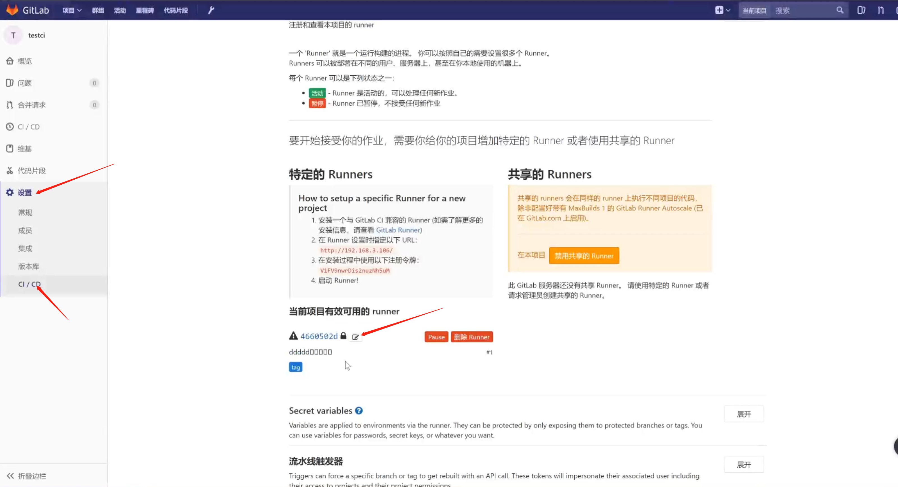
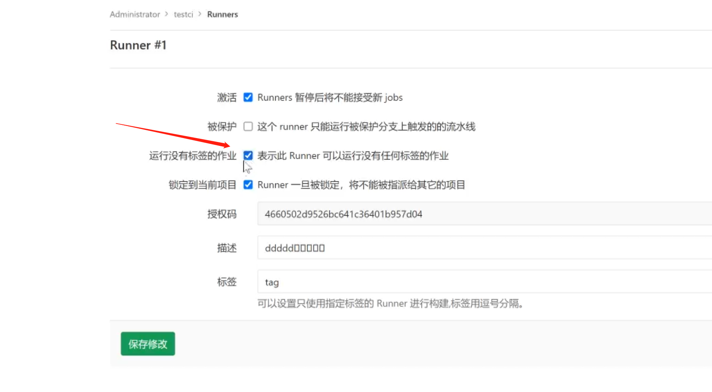
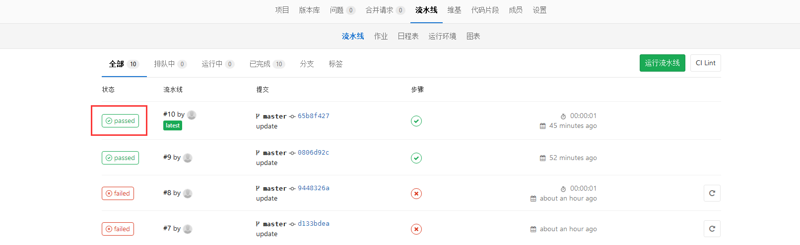

# 一 持续集成的操作流程

## 概述

根据持续集成的设计，代码从提交到生产，整个过程有以下几步。

## 提交

流程的第一步，是开发者向代码仓库提交代码。所有后面的步骤都始于本地代码的一次提交（commit）。

## 测试（第一轮）

代码仓库对 commit 操作配置了钩子（hook），只要提交代码或者合并进主干，就会跑自动化测试。

测试的种类：

- 单元测试：针对函数或模块的测试
- 集成测试：针对整体产品的某个功能的测试，又称功能测试
- 端对端测试：从用户界面直达数据库的全链路测试

第一轮至少要跑单元测试。

## 构建

通过第一轮测试，代码就可以合并进主干，就算可以交付了。

交付后，就先进行构建（build），再进入第二轮测试。所谓构建，指的是将源码转换为可以运行的实际代码，比如安装依赖，配置各种资源（样式表、JS脚本、图片）等等。

常用的构建工具如下：

- **Jenkins**
- Travis
- Codeship
- Strider

Jenkins 和 Strider 是开源软件，Travis 和 Codeship 对于开源项目可以免费使用。它们都会将构建和测试，在一次运行中执行完成。

## 测试（第二轮）

构建完成，就要进行第二轮测试。如果第一轮已经涵盖了所有测试内容，第二轮可以省略，当然，这时构建步骤也要移到第一轮测试前面。

第二轮是全面测试，单元测试和集成测试都会跑，有条件的话，也要做端对端测试。所有测试以自动化为主，少数无法自动化的测试用例，就要人工跑。

需要强调的是，新版本的每一个更新点都必须测试到。如果测试的覆盖率不高，进入后面的部署阶段后，很可能会出现严重的问题。

## 部署

通过了第二轮测试，当前代码就是一个可以直接部署的版本（artifact）。将这个版本的所有文件打包（ tar filename.tar * ）存档，发到生产服务器。

生产服务器将打包文件，解包成本地的一个目录，再将运行路径的符号链接（symlink）指向这个目录，然后重新启动应用。这方面的部署工具有Ansible，Chef，Puppet等。

## 回滚

一旦当前版本发生问题，就要回滚到上一个版本的构建结果。最简单的做法就是修改一下符号链接，指向上一个版本的目录。


# 二 使用 GitLab 持续集成

## 简介

从 GitLab 8.0 开始，GitLab CI 就已经集成在 GitLab 中，我们只要在项目中添加一个 `.gitlab-ci.yml` 文件，然后添加一个 Runner，即可进行持续集成。 而且随着 GitLab 的升级，GitLab CI 变得越来越强大。

## 概念

### Pipeline

一次 Pipeline 其实相当于一次构建任务，里面可以包含多个流程，如安装依赖、运行测试、编译、部署测试服务器、部署生产服务器等流程。

任何提交或者 Merge Request 的合并都可以触发 Pipeline，如下图所示：

```
+------------------+           +----------------+
|                  |  trigger  |                |
|   Commit / MR    +---------->+    Pipeline    |
|                  |           |                |
+------------------+           +----------------+
```

### Stages

Stages 表示构建阶段，说白了就是上面提到的流程。我们可以在一次 Pipeline 中定义多个 Stages，这些 Stages 会有以下特点：

* 所有 Stages 会按照顺序运行，即当一个 Stage 完成后，下一个 Stage 才会开始
* 只有当所有 Stages 完成后，该构建任务 (Pipeline) 才会成功
* 如果任何一个 Stage 失败，那么后面的 Stages 不会执行，该构建任务 (Pipeline) 失败

因此，Stages 和 Pipeline 的关系就是：

```
+--------------------------------------------------------+
|                                                        |
|  Pipeline                                              |
|                                                        |
|  +-----------+     +------------+      +------------+  |
|  |  Stage 1  |---->|   Stage 2  |----->|   Stage 3  |  |
|  +-----------+     +------------+      +------------+  |
|                                                        |
+--------------------------------------------------------+
```

### Jobs

Jobs 表示构建工作，表示某个 Stage 里面执行的工作。我们可以在 Stages 里面定义多个 Jobs，这些 Jobs 会有以下特点：

* 相同 Stage 中的 Jobs 会并行执行
* 相同 Stage 中的 Jobs 都执行成功时，该 Stage 才会成功
* 如果任何一个 Job 失败，那么该 Stage 失败，即该构建任务 (Pipeline) 失败

所以，Jobs 和 Stage 的关系图就是：

```
+------------------------------------------+
|                                          |
|  Stage 1                                 |
|                                          |
|  +---------+  +---------+  +---------+   |
|  |  Job 1  |  |  Job 2  |  |  Job 3  |   |
|  +---------+  +---------+  +---------+   |
|                                          |
+------------------------------------------+
```

# 三 基于 Docker 安装 GitLab Runner

### 3.1 GitLab Runner 简介

理解了上面的基本概念之后，有没有觉得少了些什么东西 —— 由谁来执行这些构建任务呢？

答案就是 GitLab Runner 了！

想问为什么不是 GitLab CI 来运行那些构建任务？

一般来说，构建任务都会占用很多的系统资源 (譬如编译代码)，而 GitLab CI 又是 GitLab 的一部分，如果由 GitLab CI 来运行构建任务的话，在执行构建任务的时候，GitLab 的性能会大幅下降。

GitLab CI 最大的作用是管理各个项目的构建状态，因此，运行构建任务这种浪费资源的事情就交给 GitLab Runner 来做拉！

因为 GitLab Runner 可以安装到不同的机器上，所以在构建任务运行期间并不会影响到 GitLab 的性能

### 3.2 基于 Docker 安装 GitLab Runner

#### 环境准备

- 创建工作目录 `/usr/local/docker/runner` (路径可以自己定义,不过下面的时候需要保持一致)
- 创建构建目录 `/usr/local/docker/runner/environment` (同上)
- 下载 `jdk-8u231-linux-x64.tar.gz` 并复制到 `/usr/local/docker/runner/environment` (版本可以自己定义)
- 下载 `apache-maven-3.6.2-bin.tar.gz` 并复制到 `/usr/local/docker/runner/environment`
- 复制一个`docker-compose`到`/usr/local/docker/runner/environment`
- 如果需要配置 maven 私服等信息复制一个 maven 的`settings.xml`到`/usr/local/docker/runner/environment`
- 复制`daemon.json`到`/usr/local/docker/runner/environment`(具体内容参考下面)
- 在宿主机启动dokcer程序后先执行 `sudo chown root:root /var/run/docker.sock` (如果重启过 docker,重新执行)

#### daemon.json

在 `/usr/local/docker/runner/environment` 目录下创建 `daemon.json`，用于配置加速器和仓库地址

```json
{
  "registry-mirrors": ["https://w6vrjqu4.mirror.aliyuncs.com"]
,
 "insecure-registries": [
    "baseservice.chenjunbo.xin:60001"
  ]

}

```

#### Dockerfile

在 `/usr/local/docker/runner/environment` 目录下创建 `Dockerfile`

```shell
FROM baseservice.chenjunbo.xin:60001/gitlab-runner:bleeding
# 修改软件源
RUN echo 'deb http://mirrors.aliyun.com/ubuntu/ xenial main restricted universe multiverse' > /etc/apt/sources.list && \
    echo 'deb http://mirrors.aliyun.com/ubuntu/ xenial-security main restricted universe multiverse' >> /etc/apt/sources.list && \
    echo 'deb http://mirrors.aliyun.com/ubuntu/ xenial-updates main restricted universe multiverse' >> /etc/apt/sources.list && \
    echo 'deb http://mirrors.aliyun.com/ubuntu/ xenial-backports main restricted universe multiverse' >> /etc/apt/sources.list && \
    apt-get update -y && \
    apt-get clean
RUN apt-get -y install gnupg gnupg2 gnupg1
# 安装 Docker
RUN apt-get -y install apt-transport-https ca-certificates curl software-properties-common && \
    curl -fsSL http://mirrors.aliyun.com/docker-ce/linux/ubuntu/gpg | apt-key add - && \
    add-apt-repository "deb [arch=amd64] http://mirrors.aliyun.com/docker-ce/linux/ubuntu $(lsb_release -cs) stable" && \
    apt-get update -y && \
    apt-get install -y docker-ce
COPY daemon.json /etc/docker/daemon.json

# 安装 Docker Compose,因为下载不下来，所以我们本地上传一份docker-compose到environment目录
WORKDIR /usr/local/bin
#RUN wget https://raw.githubusercontent.com/topsale/resources/master/docker/docker-compose
COPY docker-compose docker-compose
RUN chmod +x docker-compose

# 安装 Java
RUN mkdir -p /usr/local/java
WORKDIR /usr/local/java
COPY jdk-8u231-linux-x64.tar.gz /usr/local/java
RUN tar -zxvf jdk-8u231-linux-x64.tar.gz && \
    rm -fr jdk-8u231-linux-x64.tar.gz

# 安装 Maven
RUN mkdir -p /usr/local/maven
WORKDIR /usr/local/maven
# RUN wget https://raw.githubusercontent.com/topsale/resources/master/maven/apache-maven-3.6.2-bin.tar.gz
COPY apache-maven-3.6.2-bin.tar.gz /usr/local/maven
RUN tar -zxvf apache-maven-3.6.2-bin.tar.gz && \
    rm -fr apache-maven-3.6.2-bin.tar.gz
 COPY settings.xml /usr/local/maven/apache-maven-3.6.2/conf/settings.xml

# 配置环境变量
ENV JAVA_HOME /usr/local/java/jdk1.8.0_231
ENV MAVEN_HOME /usr/local/maven/apache-maven-3.6.2
ENV PATH $PATH:$JAVA_HOME/bin:$MAVEN_HOME/bin

WORKDIR /
```

`以上方式如果有错误,使用下面方式`

```shell
FROM baseservice.chenjunbo.xin:60001/gitlab-runner:bleeding
# 修改软件源
RUN echo 'deb http://mirrors.aliyun.com/ubuntu/ xenial main restricted universe multiverse' > /etc/apt/sources.list && \
    echo 'deb http://mirrors.aliyun.com/ubuntu/ xenial-security main restricted universe multiverse' >> /etc/apt/sources.list && \
    echo 'deb http://mirrors.aliyun.com/ubuntu/ xenial-updates main restricted universe multiverse' >> /etc/apt/sources.list && \
    echo 'deb http://mirrors.aliyun.com/ubuntu/ xenial-backports main restricted universe multiverse' >> /etc/apt/sources.list && \
    #下面的地址需要根据实际情况变化
    wget http.kali.org/kali/pool/main/k/kali-archive-keyring/kali-archive-keyring_2020.2_all.deb --no-check-certificate && \
    apt install -y ./kali-archive-keyring_2020.2_all.deb && \
    apt-get update -y && \
    apt install -y  gnupg  && \
    apt-get clean

# 安装 Docker
RUN curl -fsSL http://mirrors.aliyun.com/docker-ce/linux/ubuntu/gpg | apt-key add - && \
    apt-get install -y python-software-properties software-properties-common && \
    echo 'deb [arch=amd64] https://download.docker.com/linux/ubuntu bionic stable' >> /etc/apt/sources.list.d/docker.list && \
    apt-get update -y && \
    apt-get install -y docker-ce

COPY daemon.json /etc/docker/daemon.json

# 安装 Docker Compose,因为下载不下来，所以我们本地上传一份docker-compose到environment目录
WORKDIR /usr/local/bin
#RUN wget https://raw.githubusercontent.com/topsale/resources/master/docker/docker-compose
COPY docker-compose docker-compose
RUN chmod +x docker-compose

# 安装 Java
RUN mkdir -p /usr/local/java
WORKDIR /usr/local/java
COPY jdk-8u231-linux-x64.tar.gz /usr/local/java
RUN tar -zxvf jdk-8u231-linux-x64.tar.gz && \
    rm -fr jdk-8u231-linux-x64.tar.gz

# 安装 Maven
RUN mkdir -p /usr/local/maven
WORKDIR /usr/local/maven
# RUN wget https://raw.githubusercontent.com/topsale/resources/master/maven/apache-maven-3.6.2-bin.tar.gz
COPY apache-maven-3.6.2-bin.tar.gz /usr/local/maven
RUN tar -zxvf apache-maven-3.6.2-bin.tar.gz && \
    rm -fr apache-maven-3.6.2-bin.tar.gz
#需要配置maven 私服的话,不需要就加#注释掉
COPY settings.xml /usr/local/maven/apache-maven-3.6.2/conf/settings.xml

# 配置环境变量
ENV JAVA_HOME /usr/local/java/jdk1.8.0_231
ENV MAVEN_HOME /usr/local/maven/apache-maven-3.6.2
ENV PATH $PATH:$JAVA_HOME/bin:$MAVEN_HOME/bin

WORKDIR /
```


#### docker-compose.yml

在 `/usr/local/docker/runner` 目录下创建 `docker-compose.yml`

```yaml
version: '3.1'
services:
  gitlab-runner:
    build: environment
    restart: always
    container_name: gitlab-runner
    privileged: true
    volumes:
      - ./config:/etc/gitlab-runner
      - /var/run/docker.sock:/var/run/docker.sock
```


### 3.3 部署方式2快速部署

本镜像已经配置好了环境,所以`启动前`只需要运行此命令`sudo chown root:root /var/run/docker.sock`之后通过下面的 docker-compose.yml 启动容器并继续后续步骤即可

```yaml
version: '3.1'
services:
  gitlab-runner:
    image: baseservice.chenjunbo.xin:60001/gitlab-runner:bleeding
    restart: always
    container_name: gitlab-runner
    privileged: true
    networks:
      suibian: #使用当前网卡
    volumes:
      - ./config:/etc/gitlab-runner
      - /var/run/docker.sock:/var/run/docker.sock
networks: #需要定义一个网卡,不要使用默认的,防止内部的程序停止的时候无法移除网卡
  suibian: #声明的网卡的名字需要和上面保存一致
    driver: bridge      
```


## 启动

```shell
docker-compose up -d(新版本镜像运行方式)
docker-compose up -d --build(如果是自己配置的)
```

## 授权

> 给gitlab-runner 添加可以访问docker的权限

```shell
docker exec -it gitlab-runner usermod -aG root gitlab-runner
```

## 注册 Runner

> 进入gitlabrunner的设置

```shell
docker exec -it gitlab-runner gitlab-runner register
```


> 下面的选项不一定都有,根据实际情况查看

```shell

# 输入 GitLab 地址,在你gitlab项目的仓库的ci设置中查看
Please enter the gitlab-ci coordinator URL (e.g. https://gitlab.com/):
http://192.168.10.132/

# 输入 GitLab Token,在你gitlab项目的仓库的ci设置中查看
Please enter the gitlab-ci token for this runner:
1Lxq_f1NRfCfeNbE5WRh

# 输入 Runner 的说明
Please enter the gitlab-ci description for this runner:
可以为空

# 设置 Tag，可以用于指定在构建规定的 tag 时触发 ci
Please enter the gitlab-ci tags for this runner (comma separated):
deploy

# 这里选择 true ，可以用于代码上传后直接执行
Whether to run untagged builds [true/false]:
true

# 这里选择 false，可以直接回车，默认为 false
Whether to lock Runner to current project [true/false]:
false

# 选择 runner 执行器，这里我们选择的是 shell
Please enter the executor: virtualbox, docker+machine, parallels, shell, ssh, docker-ssh+machine, kubernetes, docker, docker-ssh:
shell
```

## 使用 Runner

### GitLab CI 地址与令牌参数

> 新版的runner默认不会运行无tag的代码,如果做cd可以通过设置tag来触发
>
> CI的话可以通过设置允许运行无tag的代码来实现持续集成

`项目` –> `设置` –> `CI/CD` –> `Runner 设置`




点击上面的编辑后,在新开的页面选中`表示此runner可以运行没有任何标签的作业`



### .gitlab-ci.yml

在项目工程下编写 `.gitlab-ci.yml` 配置文件：

> 具体内容取决于要做的具体事情


```yaml
stages:
  - test

test:
  stage: test
  script:
    # - echo nihao
    - /usr/local/maven/apache-maven-3.6.2/bin/mvn package
       #我们期望的事情是打完包了,有jar包了,可以不可以搞到一个容器中,因为是jar包,可以是只要java环境,比如我们自定义镜像
    - cp target/testci.jar docker/testci.jar #jar包名字取决于项目实际名字
    - cd docker
    - docker-compose down #如果是非首次启动,需要先关闭原先正在运行的容器
    - docker-compose up -d --build #用新的jar包重新构建镜像
    - docker rmi $(docker images -qf dangling=true) #清除之前的无用镜像
```


在项目中创建docker目录,里面创建docker-compose.yml和Dockerfile

`docker-compose.yml`

```yaml
version: '3.1'
services:
  testci:
    restart: always
    build:
      context: .
    container_name: testci
    ports:
      - 12345:12345 #端口映射取决于项目的实际端口
```


`Dockerfile`

> 具体取决于实际项目包情况

```dockerfile
FROM baseservice.chenjunbo.xin:60001/java:8u322
COPY testci.jar /usr/local/testci.jar #jar包名字取决于项目实际名字
WORKDIR /usr/local
CMD java -jar testci.jar #jar包名字取决于项目实际名字
```


###  测试

> 提交代码到git仓库测试即可


##  其他的案例文件

> 此文件为多步骤文件,实际内容取决于自己的需求,只是一个例子而已

```yaml
stages:
  - install_deps
  - test
  - build
  - deploy_test
  - deploy_production

cache:
  key: ${CI_BUILD_REF_NAME}
  paths:
    - node_modules/
    - dist/

# 安装依赖
install_deps:
  stage: install_deps #和上面stages中的某个tag保持一直
  only:
    - develop
    - master
  script:
    - npm install #要执行的脚本

# 运行测试用例
test:
  stage: test
  only:
    - develop
    - master
  script:
    - npm run test

# 编译
build:
  stage: build
  only:
    - develop
    - master
  script:
    - npm run clean
    - npm run build:client
    - npm run build:server
    - mvn package
    - docker build -t xxxx ../docker

# 部署测试服务器
deploy_test:
  stage: deploy_test
  only:
    - develop
  script:
    - pm2 delete app || true
    - pm2 start app.js --name app

# 部署生产服务器
deploy_production:
  stage: deploy_production
  only:
    - master
  script:
    - bash scripts/deploy/deploy.sh
```

上面的配置把一次 Pipeline 分成五个阶段：

- 安装依赖(install_deps)
- 运行测试(test)
- 编译(build)
- 部署测试服务器(deploy_test)
- 部署生产服务器(deploy_production)

**注意：** 设置 Job.only 后，只有当 develop 分支和 master 分支有提交的时候才会触发相关的 Jobs。

节点说明：

- stages：定义构建阶段，这里只有一个阶段 deploy
- deploy：构建阶段 deploy 的详细配置也就是任务配置
- script：需要执行的 shell 脚本
- only：这里的 master 指在提交到 master 时执行
- tags：与注册 runner 时的 tag 匹配

### 测试集成效果

所有操作完成后 push 代码到服务器，查看是否成功：



passed 表示执行成功

### 其它命令

- 删除注册信息

```
gitlab-ci-multi-runner unregister --name "名称"
```

- 查看注册列表

```
gitlab-ci-multi-runner list
```

## 附：项目配置 Dockerfile 案例

```shell
FROM java:8
ENV APP_VERSION 1.0.0-SNAPSHOT
ENV DOCKERIZE_VERSION v0.6.1
RUN wget https://github.com/jwilder/dockerize/releases/download/$DOCKERIZE_VERSION/dockerize-linux-amd64-$DOCKERIZE_VERSION.tar.gz \
    && tar -C /usr/local/bin -xzvf dockerize-linux-amd64-$DOCKERIZE_VERSION.tar.gz \
    && rm dockerize-linux-amd64-$DOCKERIZE_VERSION.tar.gz

RUN mkdir /app

COPY testci-$APP_VERSION.jar /app/app.jar
ENTRYPOINT ["dockerize", "-timeout", "5m", "-wait", "tcp://192.168.10.131:3306", "java", "-Djava.security.egd=file:/dev/./urandom", "-jar", "/app/app.jar"]

EXPOSE 8501
```

```shell
FROM java:8
ENV APP_VERSION 1.0.0-SNAPSHOT
ENV DOCKERIZE_VERSION v0.6.1
RUN wget https://github.com/jwilder/dockerize/releases/download/$DOCKERIZE_VERSION/dockerize-linux-amd64-$DOCKERIZE_VERSION.tar.gz \
    && tar -C /usr/local/bin -xzvf dockerize-linux-amd64-$DOCKERIZE_VERSION.tar.gz \
    && rm dockerize-linux-amd64-$DOCKERIZE_VERSION.tar.gz

RUN mkdir /app

COPY testci-$APP_VERSION.jar /app/app.jar
ENTRYPOINT ["dockerize", "-timeout", "5m", "-wait", "tcp://192.168.10.131:3306", "java", "-Djava.security.egd=file:/dev/./urandom", "-jar", "/app/app.jar"]

EXPOSE 8501
```