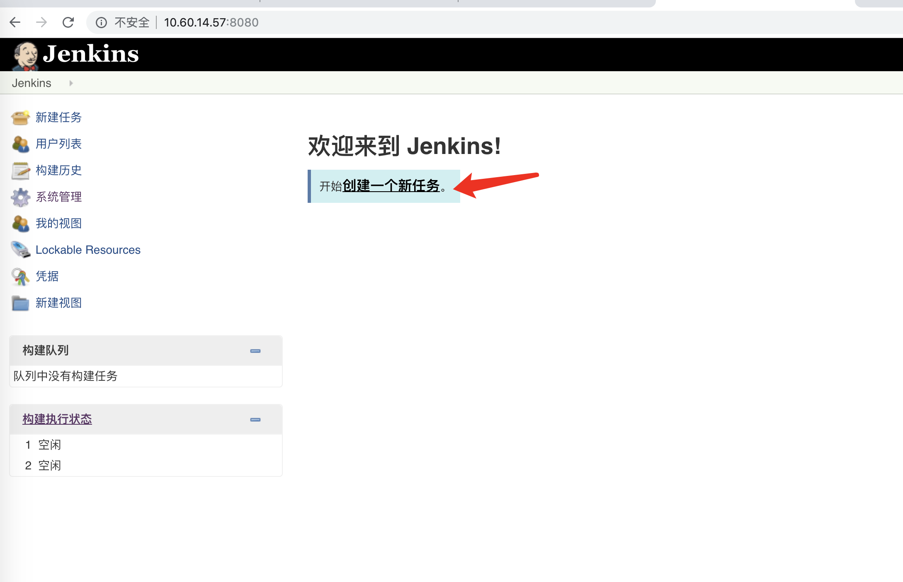
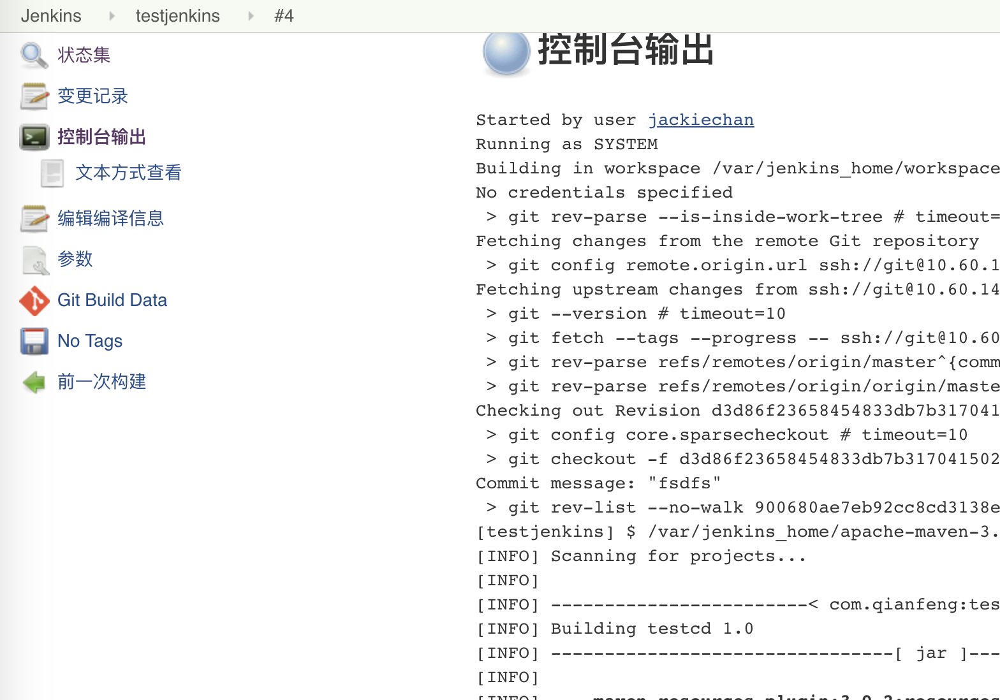

# 一 什么是 Jenkins


Jenkins 是一个开源软件项目，是基于 Java 开发的一种持续集成工具，用于监控持续重复的工作，旨在提供一个开放易用的软件平台，使软件的持续集成变成可能。

官方网站：https://jenkins.io/


# 二 安装配置Jenkins

> 使用的是 Docker 安装配置 Jenkins

## 2.1 docker-compose 文件

#### 2.1.1 方式1

Jenkins 是一个简单易用的持续集成软件平台，我们依然采用 Docker 的方式部署，`docker-compose.yml` 配置文件如下：

```yaml
version: '3.1'
services:
  jenkins:
    restart: always
    image: baseservice.chenjunbo.xin:60001/jenkins/jenkins
    container_name: jenkins
    ports:
      # 发布端口
      - 8080:8080
      # 基于 JNLP 的 Jenkins 代理通过 TCP 端口 50000 与 Jenkins master 进行通信
      - 50000:50000
    environment:
      TZ: Asia/Shanghai
    volumes:
    #将当前目录映射到容器中的 jenkins home 也就是 jenkin 的主目录
      - ./data:/var/jenkins_home
```

首次安装过程中会出现 `Docker 数据卷` 权限问题而导致失败，用以下命令解决：

```shell
#此路径取决于 docker-compose.yml文件所在的目录 最后的 data 代表上面的映射目录
chown -R 1000 /usr/local/docker/jenkins/data
```


#### 2.1.2 方式2

> 由于后面需要安装插件等方式比较慢，因此做了一个镜像，内部包含了插件和JDK 以及Maven，因此使用了下面的配置后可以快速跳过插件安装步骤进入 配置远程目标服务器阶段，JDK 位置为`/var/jenkins_home/jdk1.8.0_291` Maven Home为`/var/jenkins_home/apache-maven-3.6.3`
>
> `其实镜像就是上面那个，不过上面那个在配置数据卷后会导致插件数据丢失，所以需要单独再配置`

```yaml
version: '3.1'
services:
  jenkins:
    restart: always
    image: baseservice.chenjunbo.xin:60001/jenkins/jenkins
    container_name: jenkins
    ports:
      # 发布端口
      - 8080:8080
      # 基于 JNLP 的 Jenkins 代理通过 TCP 端口 50000 与 Jenkins master 进行通信
      - 50000:50000
    environment:
      TZ: Asia/Shanghai
```


## 2.2 解锁 Jenkins

Jenkins 第一次启动时需要输入一个初始密码用以解锁安装流程，使用 `docker logs jenkins` 即可方便的查看到初始密码或者在提示的位置中查找,注意提示的目录是容器中的目录,我们已经映射到本地的 data 目录中


**通过 log 查看到的密码**


## 2.3 安装插件

**`使用自定义方式来安装插件`**


**`安装Publish Over SSH 插件,因为我们最后通过 jenkins 将项目发布到其他服务器,所以需要 这个 ssh 创建来进行远程连接发布`**


**`插件安装页面,插件可能会安装失败,安装失败的可以选择重试或者跳过后进入程序再手动安装`**


**`安装插件完成后,创建账号和密码`**


**`设置 jenkins 的访问地址,一般情况默认即可`**


## 2.4 配置远程目标服务器

**`我们的 jenkins 主要是帮我们下载源码,编译打包后发布到另外的线上服务器最终完成自动部署功能的,所以除了 jenkins 服务器外,我们还需要最终运行程序的目标服务器,本步骤配置的就是这个目标服务器`**


在`系统管理中`点击`系统设置`


**`找到 Publish over SSH(没有这个的说明前面的Publish over SSH插件安装失败)`**


**`填写测试成功后保存即可(密码等内容需要点击高级后才可以显示)`**


## 2.5 配置JDK&Maven

> 因为我们是 maven 项目,jenkins 下载的是源码,需要编译和打包,所以我们需要在 jenkins 容器 中安装 JDK 和 Maven
>
> 上传 JDK 和 maven 的 tar 到我们宿主机上面的 jenkins 映射目录 data 中
>
> `注意使用方式 2 创建的容器不需要再通过下面的方式上传压缩包,容器内部已经有了,只需要在下面配置即可,位置在方式2那里已经写了`

**`上传 JDK 和 Maven并解压,Maven 如果需要配置私服,修改 setting 文件即可,此配置只有方式1需要`**


在`系统管理中`点击`全局工具配置`**


**`安装页面`**


**`新增 JDK`**


**`不要关闭页面,继续向下拉,配置 maven`**


**`最后保存`**


# 三 配置持续交付

Jenkins 的持续交付流程与 GitLab Runner 的持续集成差不多，但 GitLab Runner 已经默认是配置好了 Git，所以 Jenkins 需要额外配置多一个 GitLab 的 SSH 登录。按照之前 GitLab Runner 的持续集成流程，Jenkins 的持续交付流程大致如下:

- 拉取代码
- 打包构建
- 上传镜像
- 运行容器
- 维护清理

## 3.1 配置 Jenkins 的 GitLab SSH 免密登录

**`因为需要连接我们的 gitlab 拉取代码,账号密码的方式比较繁琐,所以使用 ssh 免密的方式下载代码,所以,我们需要在 jenkins 容器中创建 ssh 密钥,然后添加到我们的 gitlab 中`**

- 交互式进入 Jenkins 容器

```shell
docker exec -it jenkins /bin/bash
```

- 生成 SSH KEY

```shell
ssh-keygen -t rsa -C "你的邮箱"
```

- 查看公钥

```shell
cat /var/jenkins_home/.ssh/id_rsa.pub
```

- 复制公钥到 GitLab


## 3.2 手动克隆一次项目

在此之前我们需要已经把我们的项目上传到了 GitLab 中,然后在 Jenkins 容器中先克隆一次(`注意是在 jenkins 容器里面刻录一次`),为了是信任我们的 gitlab 服务器,再有注意`需要在 jenkins 容器里面的/var/jenkins_home 下执行`,以免没有权限, Gitlab 中的地址可能会显示的不对,具体以实际情况为准,要添加 ssh://开头,注意端口是宿主机的映射端口,比如`ssh://git@10.60.14.50:2222/jackiechan/testcd.git`


**`出现这个信任主机即可`**


## 3.3 创建 maven 任务




**`选择第一个,并起一个名字`**此处写的是testjenkins


## 3.4 配置项目

**`配置和项目相关的内容,如源码地址,编译方式等,分多个图 注意源码地址是 git 的地址, 需要是 SSH 免密方式的地址 比如此处是 ssh://git@10.60.14.50:2222/jackiechan/testcd.git`**


**`继续向下拉`**


**`选择 maven 版本和执行的命令`**


**`保存`**


## 3.5 测试构建


**`查看详情`**


**`查看控制台,第一次可能会有大量的下载依赖包的过程,直到最后构建成功`**


**`进入 jenkins 容器,在/var/jenkins_home 目录下的 workspace 目录中可以看到以当前 jenkins 任务名字为名字的目录,在里面就是我们的 maven 项目.在 target 目录中可以找到我们编译后的文件`**


## 3.6 发布到远程服务器

### 3.6.1 安装  Git Parameter 插件

> 在实际开发中,我们的 ci 一天会有很多次,但是我们的 cd 一段时间内只会有一次,所以只有我们在发布版本对时候才会有 CD,为了区分我们的版本,git 中使用 tag 来区分,我们每次发布之前先对代码添加 tag,这样我们就可以选择对应的 tag 来进行发布,jenkins 也可以通过读取我们的 gitlab 的 tag 来让我们选择对应的 tag,要读取这个 tag 我们需要一个插件
>
> `此插件可以在 步骤2.3 安装插件的时候一起安装, 如果使用的是方式2 安装的 jenkins 则已经安装好,可以跳过安装过程`


### 3.6.2 重新配置项目


**`添加参数化构建,和构建后发布到远程服务器`**


**`配置构建后发布`**

> 其实这里配置后之前的那个配置的maven目标就可以删除了

**`添加一个构建步骤,选择 shell`**


**`因为使用了 tag,所以需要重新切换 tag 然后更新代码,下面的所有路径都取决于实际情况,比如jenkins workspace的路径不同版本可能不一致`**

`比如/var/jenkins_home/workspace/testjenkins取决于任务的名字, maven 的命令路径取决于 maven 的版本`

```shell
echo $Tag
cd /var/jenkins_home/workspace/testjenkins #取决于jenkins中创建的任务的名字
git checkout $Tag
git pull origin $Tag
/var/jenkins_home/apache-maven-3.6.3/bin/mvn clean package
```


**`添加构建后操作`**


**`配置发布参数 路径和复制的文件名取决于实际情况`**

```shell
cd /usr/local/jenkins/jenkins_test #这里取决于我们在目标服务器上面具体的目录,也就是下面remote diretory对应的绝对路径
cp target/testcd-1.0.jar docker #jar包的名字取决于我们的代码编译后的名字
docker-compose down
docker-compose up -d --build
docker image prune -f
```

 >source files 意思是我们想需要将 jenkins 项目中的哪些文件发布到远程服务器,这个取决于我们的项目内容是什么样的
 >
 >比如我的配置是所有的 jar 包, 在我的项目根目录下有个 docker-compose.yml,因为我的目标服务器也是基于 docker 的,所以可以通过它快速启动这个项目,在项目目录中还有个 docker 文件夹,里面放到 Dockerfile 用于编译镜像的
 >
 >remove prefix 因为我们上传的文件可能是在某个文件夹内,这个选项是移动前缀文件夹的意思,比如我们的 jar 在 target 目录下,如果写 target 代表上传到目标服务器的时候不会保留 target 文件夹, 但是注意,这个要求只有你所有的文件都在这个目录的时候才可以使用这个移出前缀,我们当前的项目无法使用,因为我们的 jar包和 docker 目录还有 docker-compose 分别在不同地方,所以不能使用
 >
 >remote diretory 远程目录,代表的时候这些文件放到目标服务器的什么目录下, 注意我们在配置远程服务器的时候已经指定了一个目录,此处的目录会在那个指定目录下
 >
 >exec command 文件上传完成后要运行的命令,这里取决于你要做什么,我们是通过 docker 打包运行,所以执行了 docker 相关的命令
 >
 >


**`此处我们使用的是我们之前配置的服务器,如果需要多个,添加多个即可`**


**`最后保存即可,附上一张最终的配置图`**

![testjenkins Config [Jenkins]](mdpic/testjenkins Config [Jenkins].png)


### 3.6.3 构建项目

**`给我们的项目在 gitlab 上添加 tag`**


**`开始构建项目`**


**`选择对应的版本后进行构建,进入本次构建的控制台`**





###3.6.4 访问目标服务器

**`访问目标服务器 10.60.14.63:8080`**


### 3.6.5 修改代码,再次测试

> 修改我们的首页代码,然后提交到gitlab,但是注意,此时我们之前的1.0tag 中并没有我们最新的内容, 作为新版本发布,我们需要新建一个 tag,然后选择新 tag 发布,此处略过提交代码和新建 tag 过程,我们新建了一个2.0tag


**`重新构建,发现2.0已经自动出现了`**


**`构建完成访问服务器`**


### 3.6.6 降级

**`当我们最新发布的版本出现问题的时候,可以重新选择低版本的 tag 发布,可以快速降级,此处就不演示了`**


#附录: testcd 目录


> 项目中没有其他内容,就一个首页,和 springboot 的主程序


**`docker-compose.yml`**

```yaml
version: '3.1'
services:
  testjenkins:
    restart: always
    build: docker
    container_name: testjenkins
    ports:
      - 8080:8080

```


**`Dockerfile 镜像和文件的名字以及位置取决于实际情况`**

```shell
FROM 10.9.10.232:5000/java:8
COPY testcd-1.0.jar /usr/local/testcd-1.0.jar
WORKDIR /usr/local
CMD java -jar testcd-1.0.jar
```


# 附录:手动安装插件

1. **方式一** 直接安装

**在`系统管理`中的`插件管理`**


2. **方式二** 下载安装包


**`点击要安装的插件进入详情`**


**`点击下载安装包`**


**`选择要安装的版本,下载hpi文件`**


**`返回 jenkins 插件管理页面,上传安装插件`**


# 注:

**`上面我们分成了好几步来完成了 cd,实际开发中代码写完的情况下,可以一步全部配置完成执行即可`**