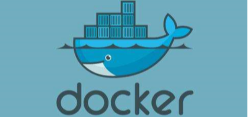
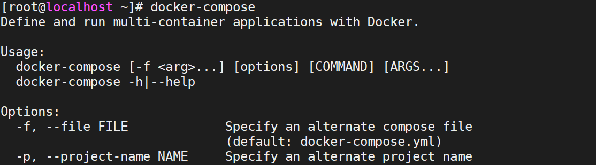

> Author：Jackiechan
>
> Version：9.0.1


[TOC]

### 一、引言

----

#### 1.1 环境不一致

> 我本地运行没问题啊：由于环境不一致，导致相同的程序，运行结果却不一致。


#### 1.2 隔离性

> 哪个哥们又写死循环了，怎么这么卡：在多用户的操作系统下，会因为其他用户的操作失误影响到你自己编些的程序。


#### 1.3 弹性伸缩

> 淘宝在双11的时候，用户量暴增：需要很多很多的运维人员去增加部署的服务器，运维成本过高的问题。


#### 1.4 学习成本

> 学习一门技术，得先安装啊：学习每一门技术都要先安装相应的软件，但是还有他所依赖的各种环境，安装软件成本快高过学习成本啦。


### 二、Docker介绍

---

#### 2.1 Docker的由来

> 一帮年轻人创业，创办了一家公司，2010年的专门做PAAS平台。但是到了2013年的时候，像亚马逊，微软，Google都开始做PAAS平台。到了2013年，公司资金链断裂，不得不倒闭，于是将公司内的核心技术对外开源，核心技术就是Docker。由于开源了Docker，到了2014年的时候，得到了C轮的融资 $4000W，2015年的时候，得到了D轮的融资.$9500W。于是公司开始全神贯注的维护Docker。
>

|           Docker主要作者-所罗门           |
| :---------------------------------------: |
|  |

|  Docker的作者已经离开了维护Docker的团队   |
| :---------------------------------------: |
|  |


#### 2.2 Docker的思想

> - 集装箱(镜像)：会将所有需要的内容放到不同的镜像中，谁需要这些环境就直接拿到这个镜像就可以了。类似于maven中的jar包,或者是我们平时的操作系统的iso文件
>
> - 标准化：
>   - 运输的标准化：Docker有一个码头，所有上传的集装箱都放在了这个码头上，当谁需要某一个环境，就直接通过命令来获取这个环境。
>   - 命令的标准化：Docker提供了一些列的命令，帮助我们去获取集装箱等等操作。
>   - 提供了REST的API：衍生出了很多的图形化界面，Rancher。
>
> - 隔离性：Docker在运行镜像内的内容时，会在Linux的内核中，单独的开辟一片空间，这片空间不会影响到其他程序。
> - 中央仓库|注册中心：超级码头，上面放的就是集装箱,类似于maven的中央仓库
> - 镜像：就是集装箱,就是jar包,就是相当于操作系统的iso
> - 容器：运行起来的镜像,相当于用这个iso文件安装了一个操作系统,容器都是独立的,内部有一整套简化版linux


### 三、Docker的安装


#### 3.1 Centos安装docker

##### 3.1.1 下载Docker依赖的环境

> 想安装Docker，需要先将依赖的环境全部下载，就像Maven依赖JDK一样

```sh
yum -y install yum-utils device-mapper-persistent-data lvm2
```


##### 3.1.2 指定Docker镜像源

> 默认下载Docker回去国外服务器下载，速度较慢，我们可以设置为阿里云镜像源，速度更快

```sh
yum-config-manager --add-repo http://mirrors.aliyun.com/docker-ce/linux/centos/docker-ce.repo
```


##### 3.1.3 更新缓存

```shell
yum makecache fast
#如果书arm版本linux,则执行 yum makecache
```


##### 3.1.4 安装Docker

> 依然采用yum的方式安装

```sh
yum -y install docker-ce

```


#### 3.2 Ubuntu安装


##### 3.2.1 设置Docker apt仓库

> 打开终端，依次运行下列命令

```shell
# Add Docker's official GPG key:
sudo apt-get update
sudo apt-get install ca-certificates curl
sudo install -m 0755 -d /etc/apt/keyrings
sudo curl -fsSL https://download.docker.com/linux/ubuntu/gpg -o /etc/apt/keyrings/docker.asc
sudo chmod a+r /etc/apt/keyrings/docker.asc

# Add the repository to Apt sources:
echo \
  "deb [arch=$(dpkg --print-architecture) signed-by=/etc/apt/keyrings/docker.asc] https://download.docker.com/linux/ubuntu \
  $(. /etc/os-release && echo "${UBUNTU_CODENAME:-$VERSION_CODENAME}") stable" | \
  sudo tee /etc/apt/sources.list.d/docker.list > /dev/null
sudo apt-get update
```


##### 3.2.2 安装 Docker

```shell
sudo apt-get install docker-ce docker-ce-cli containerd.io docker-buildx-plugin docker-compose-plugin
```


#### 3.3 启动Docker

> 安装成功后，需要手动启动，设置为开机自启

```sh
# 启动Docker服务
systemctl start docker
# 设置开机自动启动
systemctl enable docker
#查看状态
systemctl status docker
```


#### 3.4 关闭防火墙

> 为了方便测试,我们需要关闭和禁用系统的防火墙

```shell
systemctl stop firewalld
systemctl disable firewalld
```


#### 3.5 非管理员运行docker

> 默认情况下，Docker 需要使用 root 或具有 sudo 权限的用户才能运行。如果希望非管理员用户运行 Docker，可以通过将用户添加到 docker 用户组来实现。


##### 3.5.1 创建Docker用户组

```shell
sudo groupadd docker
```


##### 3.5.2 将非管理员用户加入 Docker 用户组

```shell
sudo usermod -aG docker your_username
```

##### 3.5.3 重新加载组

```shell
newgrp docker
```


### 四、Docker的中央仓库【`重点`】

----

> - Docker官方的中央仓库：这个仓库是镜像最全的，但是下载速度较慢。
>
>      https://hub.docker.com/
>
> - 国内的镜像网站：网易蜂巢，daoCloud等，下载速度快，但是镜像相对不全。
>
>      https://c.163yun.com/hub#/home
>
>      http://hub.daocloud.io/     （推荐使用）
>
> - 在公司内部会采用私服的方式拉取镜像


#### 4.1 设置私服

>需要创建`/etc/docker/daemon.json`，并添加如下内容

```json
{
	"registry-mirrors": ["https://w6vrjqu4.mirror.aliyuncs.com"],
	"insecure-registries": ["10.9.12.200:60001","baseservice.chenjunbo.xin:60001"]   
}
```

#### 4.2 重启docker
```shell
systemctl restart docker
```


### 五、镜像的操作【`重点`】

----

#### 5.1 拉取镜像

> 从中央仓库拉取镜像到本地

```sh
docker pull 镜像名称[:tag]

# 举个栗子：docker pull daocloud.io/library/tomcat:8.5.15-jre8
```


#### 5.2 查看本地全部镜像

> 查看本地已经安装过的镜像信息，包含标识，名称，版本，更新时间，大小

```sh
docker images
```


#### 5.3 删除本地镜像

> 镜像会占用磁盘空间，可以直接手动删除，表示通过查看获取

```sh
docker rmi 镜像的标识
```


#### 5.4 镜像的导入导出

> 如果因为网络原因可以通过硬盘的方式传输镜像，虽然不规范，但是有效，但是这种方式导出的镜像名称和版本都是null，需要手动修改

```sh
# 将本地的镜像导出
docker save -o 导出的路径 镜像id
# 加载本地的镜像文件
docker load -i 镜像文件
# 修改镜像名称
docker tag 镜像id 新镜像名称:版本
```


### 六、容器操作【`重点`】

----

#### 6.1 运行容器

> 运行容器需要指定具体镜像，如果镜像不存在，会直接下载

```sh
# 简单操作
docker run 镜像的标识|镜像名称[:tag]

# 常用的参数
docker run -d -p 宿主机端口:容器端口 --name 容器名称 镜像的标识|镜像名称[:tag]
# -d：代表后台运行容器
# -p 宿主机端口:容器端口：为了映射当前Linux的端口和容器的端口
# --name 容器名称：指定容器的名称
```


#### 6.2 查看正在运行的容器

> 查看全部正在运行的容器信息

```sh
docker ps [-qa]
# -a：查看全部的容器，包括没有运行
# -q：只查看容器的标识
```


#### 6.3 查看容器日志

> 查看容器日志，以查看容器运行的信息

```sh
docker logs -f 容器id
# -f：可以滚动查看日志的最后几行
```


#### 6.4 进入容器内容部

> 可以进入容器内部进行操作

```sh
docker exec -it 容器id bash
```


#### 6.5 复制内容到容器

> 将宿主机的文件复制到容器内部的指定目录

```sh
docker cp 文件名称 容器id:容器内部路径
```


#### 6.6 重启&启动&停止&删除容器

> 容器的启动，停止，删除等操作，后续经常会使用到

```sh
# 重新启动容器
docker restart 容器id

# 启动停止运行的容器
docker start 容器id

# 停止指定的容器（删除容器前，需要先停止容器）
docker stop 容器id
# 停止全部容器
docker stop $(docker ps -q)

# 删除指定容器
docker rm 容器id
# 删除全部容器
docker rm $(docker ps -qa)
```


### 七、Docker应用

----

#### 7.1 Docker安装Tomcat

> 运行Tomcat容器，为部署SSM工程做准备

```sh
docker run -d -p 8080:8080 --name tomcat daocloud.io/library/tomcat:8.5.15-jre8
```


#### 7.2 Docker安装MySQL

> 运行MySQL容器，为部署SSM工程做准备

```sh
docker run -d -p 3306:3306 --name mysql -e MYSQL_ROOT_PASSWORD=qishimeiyoumima daocloud.io/library/mysql:5.7.25
```


#### 7.3 部署SSM工程

> - 修改SSM工程环境，设置为Linux中Docker容器的信息
> - 通过Maven的package重新打成war包
> - 讲Windows下的war包复制到Linux中
> - 通过docker命令将宿主机的war包复制到容器内部
> - 测试访问SSM工程


### 八、数据卷【`重点`】

---------

> 为了部署SSM的工程，需要使用到cp的命令将宿主机内的ssm.war文件复制到容器内部。
>
> 我们的mysql在删除后重新安装发现数据丢失,因此需要一种可以在删除容器不影响数据的操作
>
> 数据卷：将宿主机的一个目录映射到容器的一个目录中。
>
> 可以在宿主机中操作目录中的内容，那么容器内部映射的文件，也会跟着一起改变。


#### 8.1 创建数据卷

> 创建数据卷之后，默认会存放在一个目录下 /var/lib/docker/volumes/数据卷名称/_data

```sh
docker volume create 数据卷名称
```


#### 8.2 查看数据卷详情

> 查看数据卷的详细信息，可以查询到存放路径，创建时间等等

```sh
docker volume inspect 数据卷名称
```


#### 8.3 查看全部数据卷

> 查看全部数据卷信息

```sh
docker volume ls
```


#### 8.4 删除数据卷

> 删除指定数据卷

```sh
docker volume rm 数据卷名称
```


#### 8.5 容器映射数据卷

> 映射有两种方式：
>
> - 通过数据卷名称映射，如果数据卷不存在。Docker会帮你自动创建，会将容器内部自带的文件，存储在默认的存放路径中。
> - 通过路径映射数据卷，直接指定一个路径作为数据卷的存放位置。但是这个路径下是空的。

```sh
# 通过数据卷名称映射,这种方式如果容器的这个目录内本来有数据会自动放到数据卷中
docker run -v 数据卷名称:容器内部的路径 镜像id
# 通过路径映射数据卷,如果容器内的路径中有数据就会丢失,不会自动放到外面的路径
docker run -v 路径:容器内部的路径 镜像id
```


#### 8.6 测试安装mysql

```shell
docker run -p 3306:3306 --name mysql \
-v /usr/local/docker/mysql/conf:/etc/mysql \
-v /usr/local/docker/mysql/logs:/var/log/mysql \
-v /usr/local/docker/mysql/data:/var/lib/mysql \
-e MYSQL_ROOT_PASSWORD=123456 \
-d mysql
```

命令参数：

- `-p 3306:3306`：将容器的3306端口映射到主机的3306端口
- `-v /usr/local/docker/mysql/conf:/etc/mysql`：将主机当前目录下的 conf 挂载到容器的 /etc/mysql
- `-v /usr/local/docker/mysql/logs:/var/log/mysql`：将主机当前目录下的 logs 目录挂载到容器的 /var/log/mysql
- `-v /usr/local/docker/mysql/data:/var/lib/mysql`：将主机当前目录下的 data 目录挂载到容器的 /var/lib/mysql
- `-e MYSQL\_ROOT\_PASSWORD=123456`：初始化root用户的密码


### 九、Dockerfile自定义镜像【`重点`】

---

> 我们可以从中央仓库下载一个镜像，也可以自己手动去制作一个镜像，需要通过Dockerfile去指定自定义镜像的信息


#### 9.1 Dockerfile

> 创建自定义镜像就需要创建一个Dockerfile，如下为Dockerfile的语言

```sh
from: 指定当前自定义镜像依赖的环境
copy: 将相对路径下的内容复制到自定义镜像中
workdir: 声明镜像的默认工作目录
run: 执行的命令，可以编写多个
cmd: 需要执行的命令（在workdir下执行的，cmd可以写多个，只以最后一个为准）

# 举个例子，制作SSM容器镜像，而且ssm.war要放在Dockerfile的同级目录下
from daocloud.io/library/tomcat:8.5.15-jre8
copy ssm.war /usr/local/tomcat/webapps
```


#### 9.2 通过Dockerfile制作镜像

> 编写完Dockerfile后需要通过命令将其制作为镜像，并且要在Dockerfile的当前目录下，之后即可在镜像中查看到指定的镜像信息，注意最后的 [.]() 

```sh
docker build -t 镜像名称[:tag] .
```


### 十. Docker-Compose【`重点`】

---------

> 之前运行一个镜像，需要添加大量的参数,命令会变得特别长,不容易记住,可以通过Docker-Compose来进行服务的编排,通过将我们的命令中的一些参数写到配置文件中,通过加载这个配置文件直接得到参数。而且Docker-Compose可以帮助我们批量的管理容器。这些信息只需要通过一个docker-compose.yml文件去维护即可。
>


#### 10.1 下载并安装Docker-Compose

##### 10.1.1 下载Docker-Compose

###### 10.1.1.1 方式1

> 方式一 去github官网搜索docker-compose,  2.20.0 替换为最新版的版本号既可,可以从https://github.com/docker/compose/releases看到最新的版本号
>
> 下载路径：[https://github.com/docker/compose/releases/download/2.20.0/docker-compose-Linux-x86_64]()


###### 10.1.1.2 方式2 

> 在终端执行,2.20.0替换为最新版既可,也可以从https://docs.docker.com/compose/install/standalone/查看命令

```shell
curl -SL https://github.com/docker/compose/releases/download/v2.20.0/docker-compose-linux-x86_64 -o /usr/local/bin/docker-compose
```


##### 10.1.2 复制到环境变量目录并设置权限

> 下载的文件名字很长,不方便使用,可以重命名为docker-compose，在给这个文件一个可执行的权限,为了方便在任何地方直接使用,可以移动到环境变量的目录中,就可以直接通过名字使用了

```sh
#移动到环境变量目录并重命名
mv docker-compose-linux-x86_64 /usr/local/bin/docker-compose
#设置权限
chmod 777 docker-compose
```


##### 10.1.3 测试

> 在任意目录下输入docker-compose

|                 测试效果                  |
| :---------------------------------------: |
|  |


#### 10.2 Docker-Compose管理MySQL和Tomcat容器

> yml文件以key: value方式来指定配置信息
>
> 多个配置信息以换行+缩进的方式来区分
>
> 在docker-compose.yml文件中，不要使用制表符

```yml
version: '3.1'
services:
  mysql:           # 服务的名称
    restart: always   # 代表只要docker启动，那么这个容器就跟着一起启动
    image: daocloud.io/library/mysql:5.7.25  # 指定镜像名字
    container_name: mysql  # 指定容器名称 代替了--name
    ports: #代替了-p
      - 3306:3306  #  指定端口号的映射
    environment: #  -e
      MYSQL_ROOT_PASSWORD: root   # 指定MySQL的ROOT用户登录密码
      TZ: Asia/Shanghai        # 指定时区
    volumes: # -v
     - ./mysql_data:/var/lib/mysql   # 映射数据卷
  tomcat:
    restart: always
    image: daocloud.io/library/tomcat:8.5.15-jre8
    container_name: tomcat
    ports:
      - 8080:8080
    environment:
      TZ: Asia/Shanghai
    volumes:
      - ./tomcat_webapps:/usr/local/tomcat/webapps
      - ./tomcat_logs:/usr/local/tomcat/logs
```


#### 10.3 使用docker-compose命令管理容器

> 在使用docker-compose的命令时 ，默认会在当前目录下找docker-compose.yml文件

```sh
# 1. 基于docker-compose.yml启动管理的容器
docker-compose up -d

# 2. 关闭并删除容器
docker-compose down

# 3. 开启|关闭|重启已经存在的由docker-compose维护的容器
docker-compose start|stop|restart

# 4. 查看由docker-compose管理的容器
docker-compose ps

# 5. 查看日志
docker-compose logs -f
```


#### 10.4 docker-compose配合Dockerfile使用

> 使用docker-compose.yml文件以及Dockerfile文件在生成自定义镜像的同时启动当前镜像，并且由docker-compose去管理容器

##### 10.4.1 docker-compose文件

> 编写docker-compose.yml文件

```yml
# yml文件
version: '3.1'
services:
  ssm:
    restart: always
    build:            # 构建自定义镜像
      context: ../      # 指定dockerfile文件的所在路径
      dockerfile: Dockerfile   # 指定Dockerfile文件名称
    image: ssm:1.0.1
    container_name: ssm
    ports:
      - 8081:8080
    environment:
      TZ: Asia/Shanghai
```


##### 10.4.2 Dockerfile文件

> 编写Dockerfile文件

```
from daocloud.io/library/tomcat:8.5.15-jre8
copy ssm.war /usr/local/tomcat/webapps
```


##### 10.4.3 运行

> 测试效果

```sh
# 可以直接启动基于docker-compose.yml以及Dockerfile文件构建的自定义镜像
docker-compose up -d
# 如果自定义镜像不存在，会帮助我们构建出自定义镜像，如果自定义镜像已经存在，会直接运行这个自定义镜像
# 重新构建的话。
# 重新构建自定义镜像
docker-compose build
# 运行当前内容，并重新构建
docker-compose up -d --build
```

