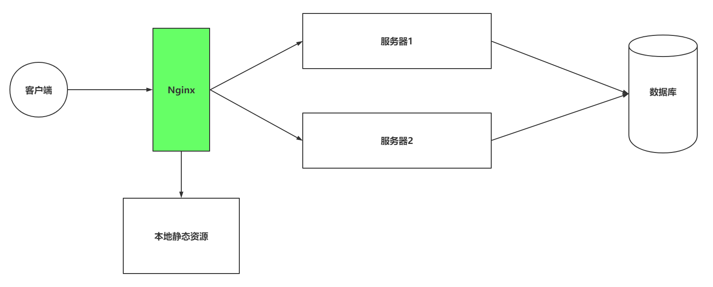
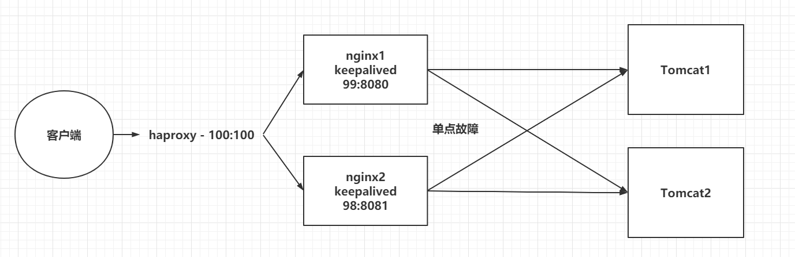

> Author：Eric
>
> version：9.0.1


[TOC]

### 一、引言

----------

#### 1.1 代理问题

> 客户端到底要将请求发送给哪台服务器。

|         发送给服务器1还是服务器2          |
| :---------------------------------------: |
|  |

#### 1.2 负载均衡问题

> 如果所有客户端的请求都发送给了服务器1，那么服务器2将没有任何意义

|               负载均衡问题                |
| :---------------------------------------: |
|  |


#### 1.3 资源优化

> 客户端发送的请求可能是申请动态资源的，也有申请静态资源，但是都是去Tomcat中获取的

|               静态资源访问                |
| :---------------------------------------: |
|  |


#### 1.4 Nginx处理

|          在搭建集群后，使用Nginx          |
| :---------------------------------------: |
|  |


### 二、Nginx概述

-----

> Nginx是由俄罗斯人研发的，应对Rambler的网站，并且2004年发布的第一个版本。

|                 Nginx之父                 |
| :---------------------------------------: |
|  |


> Nginx的特点：
>
> - 稳定性极强。 7*24小时不间断运行。
> - Nginx提供了非常丰富的配置实例。
> - 占用内存小，并发能力强。


### 三、Nginx的安装

----

#### 3.1 安装Nginx

> 使用Docker-Compose安装

```yml
version: '3.1'
services:
  nginx:
    restart: always
    image: daocloud.io/library/nginx:latest
    container_name: nginx
    ports:
      - 80:80
```

#### 3.2 Nginx的配置文件

> 关于Nginx的核心配置文件nginx.conf

```properties
worker_processes  1;		
error_log  /var/log/nginx/error.log warn;
# 以上统称为全局块， 
# worker_processes他的数值越大，Nginx的并发能力就越强
# error_log 代表Nginx的错误日志存放的位置

events {
    worker_connections  1024;
}
# events块
# worker_connections他的数值越大，Nignx并发能力越强

http {
    include       /etc/nginx/mime.types;
    default_type  application/octet-stream;
    server {
        listen       80;
        server_name  localhost;

        location / {
            root   /usr/share/nginx/html;
            index  index.html index.htm;
        }
		# location块
		# root：将接收到的请求根据/usr/share/nginx/html去查找静态资源
		# index： 默认去上述的路径中找到index.html或者index.htm
    }
	# server块
	# listen： 代表Nginx监听的端口号
	# localhost：代表Nginx接收请求的ip
}
# http块
# include代表引入一个外部的文件 -> /mime.types中放着大量的媒体类型
# include /etc/nginx/conf.d/*.conf; -> 引入了conf.d目录下的以.conf为结尾的配置文件

```

#### 3.3 修改docker-compose文件

> 为了方便修改Nginx配置，修改yml文件

```yml
version: '3.1'
services:
  nginx:
    restart: always
    image: daocloud.io/library/nginx:latest
    container_name: nginx
    ports:
      - 80:80
    volumes:
      - ./conf.d/:/etc/nginx/conf.d
```


### 四、Nginx的反向代理【`重点`】

---

#### 4.1 正向代理和反向代理介绍

> 正向代理：
>
> - 正向代理服务是由客户端设立的。
> - 客户端了解代理服务器和目标服务器都是谁。
> - 帮助咱们实现突破访问权限，提高访问的速度，对目标服务器隐藏客户端的ip地址。

|                 正向代理                  |
| :---------------------------------------: |
|  |


> 反向代理：
>
> - 反向代理服务器是配置在服务端的。
> - 客户端是不知道访问的到底是哪一台服务器。
> - 达到负载均衡，并且可以隐藏服务器真正的ip地址。


#### 4.2 基于Nginx实现反向代理

> 准备一个目标服务器。
>
> 启动了之前的tomcat服务器。
>
> 编写nginx的配置文件，通过Nginx访问到tomcat服务器。

```properties
server{
  listen 80;
  server_name localhost;
    # 基于反向代理访问到Tomcat服务器
  location / {
    proxy_pass http://192.168.199.109:8080/;
  }
}
```


#### 4.3 关于Nginx的location路径映射

> 优先级关系如下：
>
> - location = /路径：优先级最高，精准匹配，一旦匹配， 不再去找其他匹配项。
> - location ^~ /路径：优先级次之，字符串匹配，一旦匹配， 不再去找其他匹配项。
> - location ~ 正则表达式：如果有多个location的正则能匹配的话，则使用正则表达式最长的那个。
> - location ~* 正则表达式：和location ~ 正则表达式相同，不过当前方式不区分大小写。
> - location /路径：常规方式，匹配前缀，优先级最低。
>
> 举个栗子：

```properties
# 直接匹配
location = / {
  # 精准匹配，主机名后面不能带任何的字符串
}

# 常规匹配
location /xxx {
  # 匹配所有以/xxx开头的路径
}

# 正则匹配
location ~ /xxx {
  # 匹配所有以/xxx开头的路径
}

# 匹配开头路径
location ^~ /images/ {
  # 匹配所有以/images开头的路径，匹配后，不再删选其他选项
}

# 正则匹配后缀
location ~* \.(gif|jpg|png)$ {
  # 匹配以gif或者jpg或者png为结尾的路径
}

# 全部通配
location / {
  # 匹配全部路径  
}
```


### 五、Nginx负载均衡【`重点`】

---

> Nginx为我们默认提供了三种负载均衡的策略：
>
> - 轮询：将客户端发起的请求，平均的分配给每一台服务器。
>
> - 权重：会将客户端的请求，根据服务器的权重值不同，分配不同的数量。
>- ip_hash：基于发起请求的客户端的ip地址不同，他始终会将请求发送到指定的服务器上。
> 


#### 5.1 轮询

> 想实现Nginx轮询负载均衡机制只需要在配置文件中添加以下内容

```properties
upstream 名字 {
  server ip:port;
  server ip:port;
 # ...
}
server {
  listen 80;
  server_name localhost;
  
  location / {
    proxy_pass http://upstream的名字/;
  }
}
```


#### 5.2 权重

> 实现权重的方式

```properties
upstream 名字 {
  server ip:port weight=权重比例;
  server ip:port weight=权重比例;
#  ...
}
server {
  listen 80;
  server_name localhost;
  
  location / {
    proxy_pass http://upstream的名字/;
  }
}
```


#### 5.3 ip_hash

> ip_hash实现

```properties
upstream 名字 {
  ip_hash;
  server ip:port;
  server ip:port;
#  ...
}
server {
  listen 80;
  server_name localhost;
  
  location / {
    proxy_pass http://upstream的名字/;
  }
}
```


### 六、Nginx动静分离【`重点`】

---

> Nginx的并发能力公式：
>
> ​	worker_processes * worker_connections / 4 | 2 = Nginx最终的并发能力
>
> 动态资源需要/4，静态资源需要/2.
>
> Nginx通过动静分离，来提升Nginx的并发能力，更快的给用户响应。


#### 6.1 动态资源代理

> 使用proxy_pass动态代理

```properties
# 配置如下
location / {
  proxy_pass 路径;
}
```


#### 6.2 静态资源代理

> 使用root静态代理

```properties
# 配置如下
location / {
  root 静态资源路径;
  index 默认访问路径下的什么资源;
  autoindex on; # 代表展示静态资源全的全部内容，以列表的形式展开。
}

# 先修改docker，添加一个数据卷，映射到Nginx服务器的一个目录
# 添加了index.html和1.jpg静态资源
# 修改配置文件
```


### 七、Nginx集群

---

#### 7.1 集群结构

> 单点故障，避免nginx的宕机，导致整个程序的崩溃
>
> 准备多台Nginx。
>
> 准备keepalived，监听nginx的健康情况。
>
> 准备haproxy，提供一个虚拟的路径，统一的去接收用户得请求。

|                 Nginx集群                 |
| :---------------------------------------: |
|  |


#### 7.2 搭建Nginx集群

> 查看资料中的内容，直接通过运行docker-compose即可,具体情况根据版本不同会有所调整

