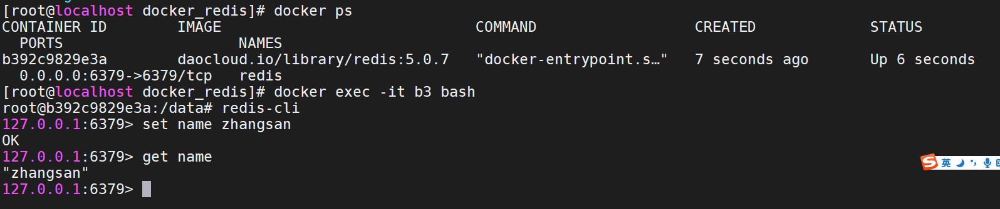
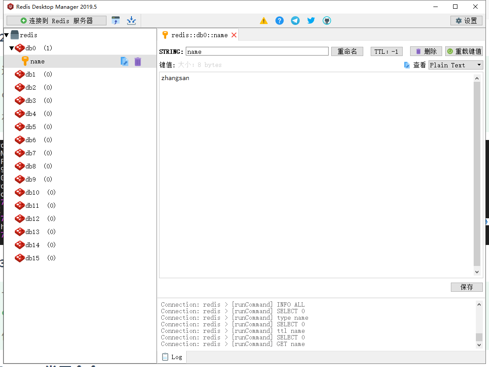
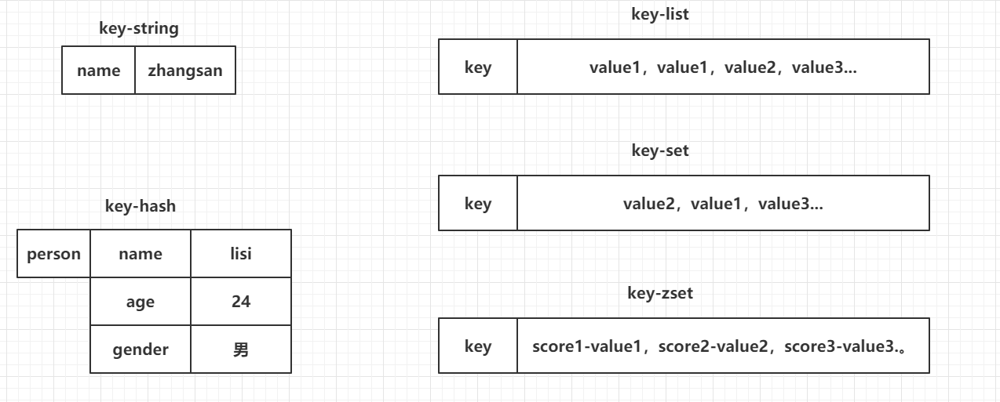
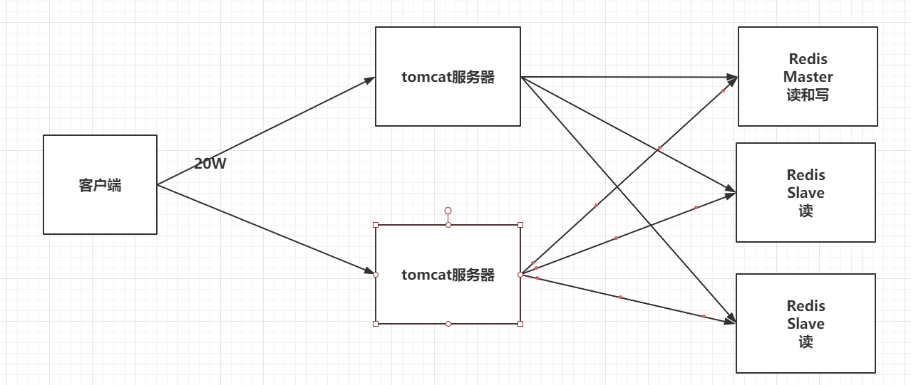
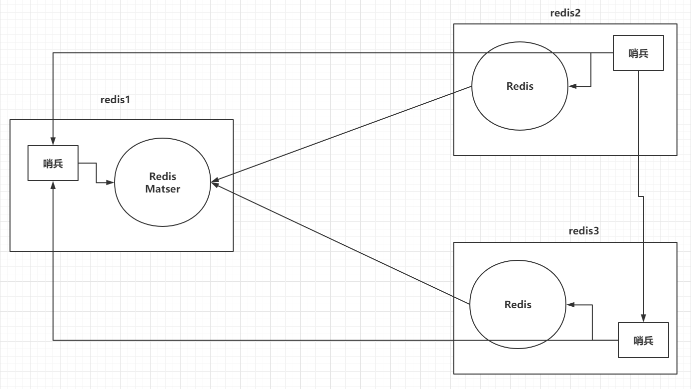
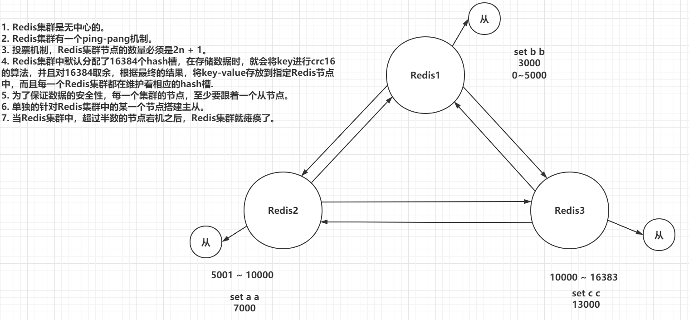
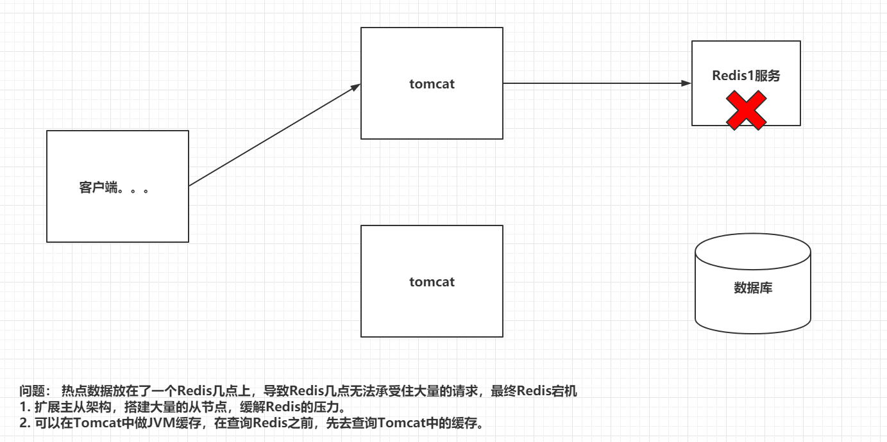
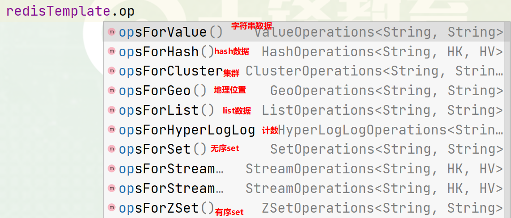

> Author：Jackiechan
>
> Version：9.0.1


[TOC]


### 一、引言

----

#### 1.1 数据库压力过大

> 由于用户量增大，请求数量也随之增大，数据库压力过大,导致程序不稳定


#### 1.2 数据不同步

> 多台服务器之间，数据不同步,比如在tomcat集群中session无法同步


#### 1.3 传统锁失效

> 多台服务器之间的锁，已经不存在互斥性了。


### 二、Redis介绍

-----

#### 2.1 NoSQL介绍

> NoSQL,Not Only SQL泛指非关系型数据库，和关系型数据库做一个区分,除了关系型数据库都是非关系型数据库


|   类型    |             常见             |
| :-------: | :--------------------------: |
| Key-Value |            Redis             |
|  文档型   | ElasticSearch，Solr，Mongodb |
|  面向列   |       Hbase，Cassandra       |
|  图形化   |            Neo4j             |


#### 2.2 Redis介绍

> - 有一位意大利人，在开发一款LLOOGG的统计页面，因为MySQL的性能不好，自己研发了一款非关系型数据库，并命名为Redis。
>
> - Redis（Remote Dictionary Server）即远程字典服务，Redis是由C语言去编写，Redis是一款基于Key-Value的NoSQL，而且Redis是基于内存存储数据的，Redis还提供了多种持久化机制，性能可以达到110000/s读取数据以及81000/s写入数据，Redis还提供了主从，哨兵以及集群的搭建方式，可以更方便的横向扩展以及垂直扩展。

|                 Redis之父                 |
| :---------------------------------------: |
|  |


### 三、Redis安装

----

#### 3.1 安装Redis

> Docker-Compose安装

```yml
version: '3.1'
services:
  redis:
    image: redis:6.2.7
    restart: always
    container_name: redis
    environment:
      - TZ=Asia/Shanghai
    ports:
      - 6379:6379
```

#### 3.2 使用redis-cli连接Redis

> 进去Redis容器的内部
>
> docker exec -it 容器id bash
>
> 在容器内部，使用redis-cli连接

|                 链接效果                  |
| :---------------------------------------: |
|  |


#### 3.3 使用图形化界面连接Redis 

> 下载地址：https://github.com/lework/RedisDesktopManager-Windows/releases
>

|            RedisDesktopManager            |
| :---------------------------------------: |
|  |


### 四、Redis常用命令【`重点`】

---

#### 4.1 Redis存储数据的结构

> 常用的是前面五种类型

|   结构类型   |                      介绍                      |                   介绍                    |
| :----------: | :--------------------------------------------: | :---------------------------------------: |
| `key-string` |               一个key对应一个值                |            存放一个字符串信息             |
|  `key-hash`  |          一个key对应一个Map或者Object          |           一般用于存放对象数据            |
|  `key-list`  |              一个key对应一个列表               |              实现队列或者栈               |
|  `key-set`   |              一个key对应一个集合               |      去重存放数据或者进行交叉并计算       |
|  `key-zset`  |           一个key对应一个有序的集合            |             排行榜等有序数据              |
|  `HyperLog`  |                  计算近似值的                  |                 统计计数                  |
|    `GEO`     |                 经纬度地理位置                 |                   坐标                    |
|    `BIT`     | 一般存储的也是一个字符串，存储的是一个byte[]。 | 通过byte位操作来记录一些数据,减少空间占用 |


|         五种常用的存储数据结构图          |
| :---------------------------------------: |
|  |


#### 4.2 string常用命令

> string常用操作命令

```shell
#1.  添加值
set key value

#2. 取值
get key

#3. 批量操作
mset key value [key value...]
mget key [key...]

#4. 自增命令（自增1）
incr key 

#5. 自减命令（自减1）
decr key

#6. 自增或自减指定数量
incrby key increment
decrby key increment

#7. 设置值的同时，指定生存时间（每次向Redis中添加数据时，尽量都设置上生存时间）
setex key second value

#8. 设置值，如果当前key不存在的话（如果这个key存在，什么事都不做，如果这个key不存在，和set命令一样）
setnx key value

#9. 在key对应的value后，追加内容
append key value

#10. 查看value字符串的长度
strlen key
#11 先获取key的值,再用value覆盖掉
getset key value
#12 先获取key的值,然后删除key
getdel key
```


#### 4.3 hash常用命令

> hash常用命令

```sh
#1. 存储数据
hset key field value

#2. 获取数据
hget key field

#3. 批量操作
hmset key field value [field value ...]
hmget key field [field ...]

#4. 自增（指定自增的值）
hincrby key field increment

#5. 设置值（如果key-field不存在，那么就正常添加，如果存在，什么事都不做）
hsetnx key field value

#6. 检查field是否存在
hexists key field 

#7. 删除key对应的field，可以删除多个
hdel key field [field ...]

#8. 获取当前hash结构中的全部field和value
hgetall key

#9. 获取当前hash结构中的全部field
hkeys key

#10. 获取当前hash结构中的全部value
hvals key

#11. 获取当前hash结构中field的数量
hlen key
##12 迭代指定key中的元素
##cursor 游标如果是0代表是新开的迭代
##match xxx 代表field的名字要符合表达式
##count 10  默认是10,代表期望返回多少条数据,如果我们要查询的是通过哈希表实现的hash,set等集合,并且没有提供match选项,,如果数据数量远远大于指定的数字,则大约按照指定的数字返回长度的数据,返回结果中第一行的数字如果是0代表已经结束了,否则会返回一个数字,这个数字是你下次查询的时候的游标的值
##如果是通过ziplist 压缩表实现的hash ,set等,redis会忽略count选项,一次性返回所有的数据
hscan key cursor [MATCH pattern] [COUNT count]
```


#### 4.4 list常用命令

> list常用命令,内部使用双向链表实现的,也就是两边都可以加,也都可以删除

```sh
 #1. 存储数据（从左侧插入数据，从右侧插入数据）
lpush key value [value ...]
rpush key value [value ...]

#2. 存储数据（如果key不存在，什么事都不做，如果key存在，但是不是list结构，什么都不做）
lpushx key value
rpushx key value

#3. 修改数据（在存储数据时，指定好你的索引位置,覆盖之前索引位置的数据，index超出整个列表的长度，也会失败）
lset key index value

#4. 弹栈方式获取数据（左侧弹出数据，从右侧弹出数据）
lpop key
rpop key

#5. 获取指定索引范围的数据（start从0开始，stop输入-1，代表最后一个，-2代表倒数第二个,除了查看所有的是start是0,stop是-1,start>stop之外,其他的情况下 start必须<=stop）
lrange key start stop

#6. 获取指定索引位置的数据
lindex key index

#7. 获取整个列表的长度
llen key

#8. 删除列表中的数据（他是删除当前列表中的count个value值，count > 0从左侧向右侧删除，count < 0从右侧向左侧删除，count == 0删除列表中全部的value）
lrem key count value

#9. 保留列表中的数据（保留你指定索引范围内的数据，超过整个索引范围被移除掉）
ltrim key start stop

#10. 将一个列表中最后的一个数据，插入到另外一个列表的头部位置
rpoplpush list1 list2
```


#### 4.5 set常用命令

> set常用命令

```sh
#1. 存储数据
sadd key member [member ...]

#2. 获取数据（获取全部数据）
smembers key

#3. 随机获取一个数据（获取的同时，移除数据，count默认为1，代表弹出数据的数量）
spop key [count]

#4. 交集（取多个set集合交集）
sinter set1 set2 ...
#将多个set的交集部分放到目标集合中
sinterstore  目标集合 原始集合1 原始集合2...

#5. 并集（获取全部集合中的数据）
sunion set1 set2 ...
#将多个集合的并集放到目标集合中
sunionstore 目标集合 原始集合1 原始集合2...

#6. 差集（获取多个集合中不一样的数据）
sdiff set1 set2 ...
#将多个集合的差集放到目标集合中
sdiffstore 目标集合 原始集合1 原始集合2...

# 7. 删除数据
srem key member [member ...]


# 8. 查看当前的set集合中是否包含这个值
sismember key member
```


#### 4.6 zset的常用命令

> zset常用命令

```sh
#1. 添加数据(score必须是数值。member不允许重复的。)
zadd key score member [score member ...]

#2. 修改member的分数（如果member是存在于key中的，正常增加分数，如果memeber不存在，这个命令就相当于zadd）
zincrby key increment member

#3. 查看指定的member的分数
zscore key member

#4. 获取zset中数据的数量
zcard key

#5. 根据score的范围查询member数量
zcount key min max

#6. 删除zset中的成员
zrem key member [member...]

#7. 根据分数从小到大排序，获取指定范围内的数据（withscores如果添加这个参数，那么会返回member对应的分数）
zrange key start stop [withscores]

#8. 根据分数从大到小排序，获取指定范围内的数据（withscores如果添加这个参数，那么会返回member对应的分数）
zrevrange key start stop [withscores]

#9. 根据分数的返回去获取member(withscores代表同时返回score，添加limit，就和MySQL中一样，如果不希望等于min或者max的值被查询出来可以采用 ‘(分数’ 相当于 < 但是不等于的方式，最大值和最小值使用+inf和-inf来标识)
zrangebyscore key min max [withscores] [limit offset count]

#10. 根据分数的返回去获取member(withscores代表同时返回score，添加limit，就和MySQL中一样)
zrevrangebyscore key max min [withscores] [limit offset count]
```


#### 4.7 key常用命令

> key常用命令

```sh
#1. 查看Redis中的全部的key（pattern：* ，xxx*，*xxx）
keys pattern

#2. 查看某一个key是否存在（1 - key存在，0 - key不存在）
exists key

#3. 删除key
del key [key ...]

#4. 设置key的生存时间，单位为秒，单位为毫秒,设置还能活多久
expire key second
pexpire key milliseconds

#5. 设置key的生存时间，单位为秒，单位为毫秒,设置能活到什么时间点
expireat key timestamp
pexpireat key milliseconds

#6. 查看key的剩余生存时间,单位为秒，单位为毫秒（-2 - 当前key不存在，-1 - 当前key没有设置生存时间，具体剩余的生存时间）
ttl key
pttl key

#7. 移除key的生存时间（1 - 移除成功，0 - key不存在生存时间，key不存在）
persist key

#8. 选择操作的库
select 0~15

#9. 移动key到另外一个库中
move key db
```


#### 4.8 库的常用命令

> db常用命令

```sh
#1. 清空当前所在的数据库
flushdb

#2. 清空全部数据库
flushall

#3. 查看当前数据库中有多少个key
dbsize

#4. 查看最后一次操作的时间
lastsave

#5. 实时监控Redis服务接收到的命令
monitor
```


### 五、Java连接Redis【`重点`】

-----------

#### 5.1 Jedis连接Redis

##### 5.1.1 创建Maven工程

> idea创建

##### 5.1.2 导入需要的依赖

```xml
<dependencies>
    <!--    1、 Jedis-->
    <dependency>
        <groupId>redis.clients</groupId>
        <artifactId>jedis</artifactId>
        <version>2.9.0</version>
    </dependency>
    <!--    2、 Junit测试-->
    <dependency>
        <groupId>junit</groupId>
        <artifactId>junit</artifactId>
        <version>4.12</version>
    </dependency>
    <!--    3、 Lombok-->
    <dependency>
        <groupId>org.projectlombok</groupId>
        <artifactId>lombok</artifactId>
        <version>1.16.20</version>
    </dependency>
</dependencies>
```


##### 5.1.3 测试

```java
public class Demo1 {

    @Test
    public void set(){
        //1. 连接Redis
        Jedis jedis = new Jedis("192.168.3.92",6379);
        //2. 操作Redis - 因为Redis的命令是什么，Jedis的方法就是什么
        jedis.set("name","李四");
        //3. 释放资源
        jedis.close();
    }

    @Test
    public void get(){
        //1. 连接Redis
        Jedis jedis = new Jedis("192.168.3.92",6379);
        //2. 操作Redis - 因为Redis的命令是什么，Jedis的方法就是什么
        String value = jedis.get("name");
        System.out.println(value);
        //3. 释放资源
        jedis.close();
    }
}
```


#### 5.2 Jedis存储一个对象到Redis以byte[]的形式

##### 5.2.1 准备一个User实体类

```java
@Data
@NoArgsConstructor
@AllArgsConstructor
public class User implements Serializable {

    private Integer id;

    private String name;

    private Date birthday;

}
```


##### 5.2.2 导入spring-context依赖

```xml
<!-- 4. 导入spring-context -->
<dependency>
    <groupId>org.springframework</groupId>
    <artifactId>spring-context</artifactId>
    <version>4.3.18.RELEASE</version>
</dependency>
```


##### 5.2.3 创建Demo测试类，编写内容

```java
public class Demo2 {

    // 存储对象 - 以byte[]形式存储在Redis中
    @Test
    public void setByteArray(){
        //1. 连接Redis服务
        Jedis jedis = new Jedis("192.168.3.92",6379);
        //------------------------------------------------
        //2.1 准备key(String)-value(User)
        String key = "user";
        User value = new User(1,"张三",new Date());
        //2.2 将key和value转换为byte[]
        byte[] byteKey = SerializationUtils.serialize(key);
        byte[] byteValue = SerializationUtils.serialize(value);
        //2.3 将key和value存储到Redis
        jedis.set(byteKey,byteValue);
        //------------------------------------------------
        //3. 释放资源
        jedis.close();
    }

    // 获取对象 - 以byte[]形式在Redis中获取
    @Test
    public void getByteArray(){
        //1. 连接Redis服务
        Jedis jedis = new Jedis("192.168.3.92",6379);
        //------------------------------------------------
        //2.1 准备key
        String key = "user";
        //2.2 将key转换为byte[]
        byte[] byteKey = SerializationUtils.serialize(key);
        //2.3 jedis去Redis中获取value
        byte[] value = jedis.get(byteKey);
        //2.4 将value反序列化为User对象
        User user = (User) SerializationUtils.deserialize(value);
        //2.5 输出
        System.out.println("user:" + user);
        //------------------------------------------------
        //3. 释放资源
        jedis.close();
    }

}
```


#### 5.3 Jedis存储一个对象到Redis以String的形式

##### 5.3.1 导入依赖

```xml
<!-- 导入fastJSON -->
<dependency>
    <groupId>com.alibaba</groupId>
    <artifactId>fastjson</artifactId>
    <version>1.2.47</version>
</dependency>
```


##### 5.3.2 测试

```java
public class Demo3 {

    // 存储对象 - 以String形式存储
    @Test
    public void setString(){
        //1. 连接Redis
        Jedis jedis = new Jedis("192.168.3.92",6379);
        //2.1 准备key(String)-value(User)
        String stringKey = "stringUser";
        User value = new User(2,"李四",new Date());
        //2.2 使用fastJSON将value转化为json字符串
        String stringValue = JSON.toJSONString(value);
        //2.3 存储到Redis中
        jedis.set(stringKey,stringValue);
        //3. 释放资源
        jedis.close();
    }


    // 获取对象 - 以String形式获取
    @Test
    public void getString(){
        //1. 连接Redis
        Jedis jedis = new Jedis("192.168.3.92",6379);

        //2.1 准备一个key
        String key = "stringUser";
        //2.2 去Redis中查询value
        String value = jedis.get(key);
        //2.3 将value反序列化为User
        User user = JSON.parseObject(value, User.class);
        //2.4 输出
        System.out.println("user:" + user);

        //3. 释放资源
        jedis.close();
    }
}
```


#### 5.4 Jedis连接池的操作

> 使用连接池操作Redis，避免频繁创建和销毁链接对象消耗资源

```java
@Test
public void pool2(){
    //1. 创建连接池配置信息
    GenericObjectPoolConfig poolConfig = new GenericObjectPoolConfig();
    poolConfig.setMaxTotal(100);  // 连接池中最大的活跃数
    poolConfig.setMaxIdle(10);   // 最大空闲数
    poolConfig.setMinIdle(5);   // 最小空闲数
    poolConfig.setMaxWaitMillis(3000);  // 当连接池空了之后,多久没获取到Jedis对象,就超时

    //2. 创建连接池
    JedisPool pool = new JedisPool(poolConfig,"192.168.3.92",6379);

    //3. 通过连接池获取jedis对象
    Jedis jedis = pool.getResource();

    //4. 操作
    String value = jedis.get("stringUser");
    System.out.println("user:" + value);

    //5. 释放资源
    jedis.close();
}
```


#### 5.5 Redis的管道操作

> 因为在操作Redis的时候，执行一个命令需要先发送请求到Redis服务器，这个过程需要经历网络的延迟，Redis还需要给客户端一个响应。
>
> 如果我需要一次性执行很多个命令，上述的方式效率很低，可以通过Redis的管道，先将命令放到客户端的一个Pipeline中，之后一次性的将全部命令都发送到Redis服务，Redis服务一次性的将全部的返回结果响应给客户端。

```java
//  Redis管道的操作
@Test
public void pipeline(){
    //1. 创建连接池
    JedisPool pool = new JedisPool("192.168.3.92",6379);
    long l = System.currentTimeMillis();

    /*//2. 获取一个连接对象
    Jedis jedis = pool.getResource();

    //3. 执行incr - 100000次
    for (int i = 0; i < 100000; i++) {
        jedis.incr("pp");
    }

    //4. 释放资源
    jedis.close();*/

    //================================
    //2. 获取一个连接对象
    Jedis jedis = pool.getResource();
    //3. 创建管道
    Pipeline pipelined = jedis.pipelined();
    //3. 执行incr - 100000次放到管道中
    for (int i = 0; i < 100000; i++) {
        pipelined.incr("qq");
    }
    //4. 执行命令
    pipelined.syncAndReturnAll();
    //5. 释放资源
    jedis.close();

    System.out.println(System.currentTimeMillis() - l);
}
```


#### 5.6 Redis的应用

##### 5.6.1 准备开放平台项目

> 在资料资料中


##### 5.6.2 准备docker-compose.yml文件

```yml
# docker-compose.yml
version: "3.1"
services:
  nginx:
    image: daocloud.io/library/nginx:latest
    restart: always
    container_name: nginx
    ports:
      - 80:80
    volumes:
      - ./nginx_conf:/etc/nginx/conf.d
  tomcat1:
    image: daocloud.io/library/tomcat:8.5.15-jre8
    restart: always
    container_name: tomcat1
    ports:
      - 8081:8080
    environment:
      - TZ=Asia/Shanghai
    volumes:
      - ./tomcat1_webapps:/usr/local/tomcat/webapps  
  tomcat2:
    image: daocloud.io/library/tomcat:8.5.15-jre8
    restart: always
    container_name: tomcat2
    ports:
      - 8082:8080
    environment:
      - TZ=Asia/Shanghai
    volumes:
      - ./tomcat2_webapps:/usr/local/tomcat/webapps    
  mysql:
    image: daocloud.io/library/mysql:5.7.24
    restart: always
    container_name: mysql
    ports:
      - 3306:3306
    environment:
      - MYSQL_ROOT_PASSWORD=root
      - TZ=Asia/Shanghai
    volumes:
      - ./mysql_data:/var/lib/mysql
    command:
      --lower_case_table_names=1   # 忽略表名的大小写
```


##### 5.6.3 部署项目到Tomcat容器中

> 打成war包，复制到数据卷路径中即可


##### 5.6.4 修改认证功能

```java
//登录  Controller
@RequestMapping("/dologin")
@ResponseBody
public AjaxMessage login(String email, String password, HttpSession session,HttpServletResponse resp) {
    //1. 调用service执行认证，返回Redis的key
    String key = adminUserService.doLoginByRedis(email,password);
    //2. 判断返回的key是否为null
    if(StringUtils.isEmpty(key)) {
        //2.1 如果为null -> 认证失败
        return new AjaxMessage(false);
    }

    //3. 查询用户的权限信息，并且放到Redis中
    menuService.setUserMenuList(key);

    //4. 将key作为Cookie写回浏览器端
    Cookie cookie = new Cookie(AdminConstants.USER_COOKIE_KEY,key);
    cookie.setPath("/");
    cookie.setMaxAge(9999999);
    resp.addCookie(cookie);

    //5. 返回认证成功信息
    return new AjaxMessage(true);
}
```

```java
//AdminUserService实现认证功能
@Override
public String doLoginByRedis(String email, String password) throws JsonProcessingException {
    //1. 判断用户名和密码是否正确
    AdminUser user = adminUserMapper.getUserByEmail(email);
    //2. 如果user==null ， 登录失败，返回null
    if(user == null){
        return null;
    }
    //3. user ！= null 登录成功，声明一个UUID，作为存储到Redis中的key，返回key到Controller
    //3.1 声明key和value
    String key = UUID.randomUUID().toString();
    ObjectMapper mapper = new ObjectMapper();
    String value = mapper.writeValueAsString(user);
    //3.2 将key和value存储到Redis中
    Jedis jedis = pool.getResource();
    jedis.setex(AdminConstants.SESSION_USER + key,600,value);
    jedis.close();
    //4. 返回结果
    return key;
}
```

```java
//MenuService将用户的权限信息存储到Redis中
@Override
public void setUserMenuList(String key) throws JsonProcessingException {
    //1. 获取用户的id
    Jedis jedis = pool.getResource();
    String value = jedis.get(AdminConstants.SESSION_USER + key);
    ObjectMapper mapper = new ObjectMapper();
    AdminUser adminUser = mapper.readValue(value, AdminUser.class);

    //2. 数据库查询用户权限信息
    List<Menu> menuList = menuMapper.getUserMenu(adminUser.getId());

    //3. 存储到Redis
    String menuKey = AdminConstants.USER_MENU + key;
    String menuValue = mapper.writeValueAsString(menuList);
    jedis.setex(menuKey,600,menuValue);
    jedis.close();
}
```


##### 5.6.5 修改过滤器信息

```java
//在filter中获取Jedis连接池的方式
private JedisPool pool;

public void init(FilterConfig filterConfig) throws ServletException {
    ServletContext servletContext = filterConfig.getServletContext();
    WebApplicationContext context = WebApplicationContextUtils.getWebApplicationContext(servletContext);
    pool = (JedisPool) context.getBean("jedisPool");
}
```

```java
// 修改doFilter方法
// 获取认证信息
String key = null;
// 获取Cookie
Cookie[] cookies = request.getCookies();
if(cookies != null){
    for (Cookie cookie : cookies) {
        if(cookie.getName().equals(AdminConstants.USER_COOKIE_KEY)){
            key = cookie.getValue();
        }
    }
}
// 没有认证过，cookie中没有获取到指定的信息
if(key == null){
    response.sendRedirect(request.getContextPath() + redirectUrl);
    return;
}

// 从Session域中获取用户认证信息
// AdminUser user = (AdminUser) session.getAttribute(AdminConstants.SESSION_USER);
// 修改为从Redis中获取用户的信息
Jedis jedis = pool.getResource();
String value = jedis.get(AdminConstants.SESSION_USER + key);
if (value == null) {
    jedis.close();
    response.sendRedirect(request.getContextPath() + redirectUrl);
    return;
}

// ...
//2.2 获取权限信息
// 从Session中获取了用户的权限信息
String menuValue = jedis.get(AdminConstants.USER_MENU + key);

// 重置key的生存时间
jedis.expire(AdminConstants.SESSION_USER + key,600);
jedis.expire(AdminConstants.USER_MENU + key,600);
jedis.close();
ObjectMapper mapper = new ObjectMapper();
List<Menu> menus = mapper.readValue(menuValue, new TypeReference<List<Menu>>() {});
```


##### 5.6.6 修改SystemController

```java
@RequestMapping("/side")
@ResponseBody
public AjaxMessage getMenuTree(@CookieValue(value = AdminConstants.USER_COOKIE_KEY,required = false)String key, HttpSession session, HttpServletResponse response) throws JsonProcessingException {

    // 修改AdminUser user = (AdminUser) session.getAttribute(AdminConstants.SESSION_USER);
    Jedis jedis = pool.getResource();
    String value = jedis.get(AdminConstants.SESSION_USER + key);
    ObjectMapper mapper = new ObjectMapper();
    AdminUser user = mapper.readValue(value, AdminUser.class);
    if (user == null) {
        try {
            response.sendRedirect("/login.html");
        } catch (IOException e) {
            e.printStackTrace();
        }
        return new AjaxMessage(true, null, new ArrayList<>());
    }
    jedis.expire(AdminConstants.SESSION_USER + key,600);
    jedis.close();
    List<Menu> menus = menuService.getUserPermission(user.getId());
    return new AjaxMessage(true, null, menus);
}
```


##### 5.6.7 重新部署

> 重新打成war包，复制到数据卷路径中即可


### 六、Redis其他配置及集群【`了解理论`】

------------

> 修改yml文件，以方便后期修改Redis配置信息,

```yml
version: '3.1'
services:
  redis:
    image: baseservice.qfjava.cn:60001/redis:6.2.6
    restart: always
    container_name: redis
    environment:
      - TZ=Asia/Shanghai
    ports:
      - 6379:6379
    volumes:
      - ./conf/redis.conf:/usr/local/redis/redis.conf #映射配置文件到容器,配置文件可以在资料文件夹解压获取
    command: ["redis-server","/usr/local/redis/redis.conf"]
```


#### 6.1 Redis的AUTH

> 方式一：通过修改Redis的配置文件，实现Redis的密码校验

```conf
# redis.conf
requirepass 密码
```

> 三种客户端的连接方式
>
> - redis-cli：在输入正常命令之前，先输入auth 密码即可。
>
> - 图形化界面：在连接Redis的信息中添加上验证的密码。
>
> - Jedis客户端：
>
>      - jedis.auth(password);
>  - 使用JedisPool的方式

```java
// 使用当前有参构造设置密码
public JedisPool(final GenericObjectPoolConfig poolConfig, final String host, int port,int timeout, final String password)
```

> 方式二：在不修改redis.conf文件的前提下，在第一次链接Redis时，输入命令：Config set requirepass 密码
>
> 后续向再次操作Redis时，需要先AUTH做一下校验。


#### 6.2 Redis的事务

> Redis的事务：一次事务操作，该成功的成功，该失败的失败。
>
> 先开启事务，执行一些列的命令，但是命令不会立即执行，会被放在一个队列中，如果你执行事务，那么这个队列中的命令全部执行，如果取消了事务，一个队列中的命令全部作废。
>
> Redis的事务想发挥更复杂的功能，需要配置watch监听机制
> 
> 在开启事务之前，先通过watch命令去监听一个或多个key，在开启事务之后，如果有其他客户端修改了我监听的key，事务会自动取消。
> 
>如果执行了事务，或者取消了事务，watch监听自动消除，一般不需要手动执行unwatch。


##### 6.2.1 事务

```shell
#开启事务
multi
## 正常输入命令

##提交事务
exec

#取消
discard
```


##### 6.2.2 Watch机制

> reids中有一个watch可以让我们监控某个key的数据是不是发生过修改,修改指的是从无到有,从有到无,或者被覆盖过数据,哪怕覆盖的数据和之前的数据内容是一样的,仍然视为修改
>
> 在watch的情况下,我们开启事务,当我们watch的key发生变化的时候就会自动回滚事务


```shell
# watch 一个key
watch asdasdas

#开启事务
multi
#执行命令

#提交事务
exec

#如果此时通过另外一个客户端修改了asdasdas 这个key,则上面的命令会取消,提交会没有结果
```


#### 6.3 Redis持久化机制

##### 6.3.1 RDB

> RDB是Redis默认的持久化机制
>
>  - RDB持久化文件，速度比较快，而且存储的是一个二进制的文件，传输起来很方便。
>
>  - RDB持久化的时机：变化的越多,保存的越快
>
>     save 3600 1：在3600秒内，有1个key改变了，就执行RDB持久化。
>
>     save 300 10：在300秒内，有10个key改变了，就执行RDB持久化。
>
>     save 60 10000：在60秒内，有10000个key改变了，就执行RDB持久化。
>
> - RDB无法保证数据的安全。


##### 6.3.2 AOF

> AOF持久化机制默认是关闭的，Redis官方推荐同时开启RDB和AOF持久化，更安全，避免数据丢失。
>
> - AOF存的是执行过的增删改的命令,而不是数据,在每次执行命令之后都可以存储一次
>
> - AOF持久化的速度，相对RDB较慢的，存储的是一个文本文件，到了后期文件会比较大，传输困难。
>
> - AOF持久化时机。
>
>    appendfsync always：每执行一个写操作，立即持久化到AOF文件中，性能比较低。
>    appendfsync everysec：每秒执行一次持久化。
>    appendfsync no：会根据你的操作系统不同，环境的不同，在一定时间内执行一次持久化。
>
> - AOF相对RDB更安全，推荐同时开启AOF和RDB。


##### 6.3.3 注意事项

> 同时开启RDB和AOF的注意事项：
>
> 如果同时开启了AOF和RDB持久化，那么在Redis宕机重启之后，需要加载一个持久化文件，优先选择AOF文件。
>
> 如果先开启了RDB，再次开启AOF，如果RDB执行了持久化，那么RDB文件中的内容会被AOF覆盖掉。


##### 6.3.3 AOF重写

> AOF中存放的都是命令,这些命令可能会对某些key进行了重复的操作,所以会导致AOF越来越大,导致存储变的困难,会提供重写机制


`配置`

```properties
#在我们的redis配置中有两个配置
auto-aof-rewrite-percentage 100 #增长率
auto-aof-rewrite-min-size 64mb #重写的最小的大小
```


>
> 第一次的时候当我们的aof文件到达64m以上的时候就会发生重写,重写之后文件会变小,但是会随着不断的重写重写慢慢的趋近于64m,所以后续的重写机制就变了,下次重写的触发大小就不是64m,而是以上次重写后的文件大小为基准,增加比率超过percentage ,比如我们第一次重写后是40m,我们配置的比例是100,那么等文件大小是80m的时候才会触发下次重写
> 
>如果在重写过程中数据发生变化怎么办,Redis有一个AOF 重写缓冲区,当我们开始重写的时候,之后收到的请求都会写入到AOF重写缓冲区一份,当重写完成后把重写缓冲区的命令写入AOF文件中


##### 6.3.4 开启aof的配置

```yaml
version: '3.1'
services:
  redis:
    image: baseservice.qfjava.cn:60001/redis:6.2.6
    restart: always
    container_name: redis
    environment:
      - TZ=Asia/Shanghai
    ports:
      - 6379:6379
    command: redis-server --port 6379 --requirepass meiyoumima --appendonly yes
```


#### 6.4 Redis的主从架构

> 单机版 Redis存在读写瓶颈的问题

|                 主从架构                  |
| :---------------------------------------: |
|  |

> 指定yml文件
>

```yml
version: "3.1"
services:
  redis1:
    image: baseservice.qfjava.cn:60001/redis:6.2.6
    restart: always
    container_name: redis1
    environment:
      - TZ=Asia/Shanghai
    ports:
      - 7001:6379
    volumes:
      - ./conf/redis1.conf:/usr/local/redis/redis.conf
    command: ["redis-server","/usr/local/redis/redis.conf"]
  redis2:
    image: baseservice.qfjava.cn:60001/redis:6.2.6
    restart: always
    container_name: redis2
    environment:
      - TZ=Asia/Shanghai
    ports:
      - 7002:6379
    volumes:
      - ./conf/redis2.conf:/usr/local/redis/redis.conf
    links:
      - redis1:master
    command: ["redis-server","/usr/local/redis/redis.conf"]
  redis3:
    image: baseservice.qfjava.cn:60001/redis:6.2.6
    restart: always
    container_name: redis3
    environment:
      - TZ=Asia/Shanghai
    ports:
      - 7003:6379
    volumes:
      - ./conf/redis3.conf:/usr/local/redis/redis.conf
    links:
      - redis1:master
    command: ["redis-server","/usr/local/redis/redis.conf"]
```

```sh
在从机的配置文件中
# redis2和redis3从节点配置,添加主的地址和端口
replicaof master 6379
#如果主机有密码,则额外配置以下属性
masterauth 主的密码
```


> 进入任意一个redis,通过redis-cli连接后输入`info Replication`可以查看主从信息


#### 6.5 哨兵【`了解`】

##### 6.5.1 配置哨兵

> 哨兵可以帮助我们解决主从架构中的单点故障问题,哨兵本身也是一个redis,此处我们没有和上面的redis放一起运行,而是单独搞了一个哨兵集群

|                 添加哨兵                  |
| :---------------------------------------: |
|  |


> 在新的目录新创建一个哨兵的docker-compose.yml

```yml
version: '3.1'
services:
  resentinel1:
    image: baseservice.qfjava.cn:60001/redis:6.2.6
    container_name: resentinel1
    ports:
      - 26379:26379
#    command: redis-sentinel /usr/local/etc/redis/sentinel.conf --sentinel
    volumes:
      - ./conf/sentinel1.conf:/usr/local/etc/redis/sentinel.conf
  resentinel2:
    image: baseservice.qfjava.cn:60001/redis:6.2.6
    container_name: resentinel2
    ports:
      - 26380:26380
  #  command: redis-sentinel /usr/local/etc/redis/sentinel.conf --sentinel
    volumes:
      - ./conf/sentinel2.conf:/usr/local/etc/redis/sentinel.conf
  resentinel3:
    image: baseservice.qfjava.cn:60001/redis:6.2.6
    container_name: resentinel3
    ports:
      - 26381:26381
 #   command: redis-sentinel /usr/local/etc/redis/sentinel.conf 
    volumes:
      - ./conf/sentinel3.conf:/usr/local/etc/redis/sentinel.conf
```


> 准备哨兵的配置文件,一个哨兵可以监控多个redis的主从,只要每个的主从名字确定好

```properties
bind 0.0.0.0
# 绑定的端口,根据实际情况修改,注意宿主机的端口和这个端口的映射关系,上面的是每个容器内部端口也不一样,所以每个哨兵都需要修改这个端口
port 26379 
# 哨兵需要后台启动
daemonize yes
# 指定Master节点的ip和端口
sentinel monitor mymaster 192.168.3.92 7001 2
# 哨兵每隔多久监听一次redis架构  mymaster是个别名
sentinel down-after-milliseconds mymaster 10000

#监控多个主从
#sentinel monitor mymaster2 192.168.3.92 7001 2
#sentinel down-after-milliseconds mymaster2 10000

```


>command中多个命令执行比较麻烦,此处测试就只启动redis,然后单独进入容器执行命令启动哨兵
>
>依次进入三个容器,执行 `redis-sentinel /usr/local/etc/redis/sentinel.conf`


> 连接redis 的主和任意一个从,通过redis-cli -p sentinel端口 登录后执行`info sentinel`命令,可以看到哨兵的信息

`停掉主redis,可以看到一会就会有一台机器变成新的主`


#####  6.5.2 java连接哨兵

```java
 public static void main(String[] args) {
        String mastername = "mymaster"; //哨兵的主节点名称
        Set<String> sentinels = new HashSet<String>();//哨兵的集群
        sentinels.add("192.168.3.92:26379");
        sentinels.add("192.168.3.92:26380");
        sentinels.add("192.168.3.92:26381");
        JedisSentinelPool redisSentinelJedisPool = new JedisSentinelPool(mastername,sentinels);
        Jedis jedis = null;
        jedis = redisSentinelJedisPool.getResource();
        jedis.set("name", "zhangsan");
        
    }
```


#### 6.6 Redis的集群

> Redis集群在保证主从加哨兵的基本功能之外，还能够提升Redis存储数据的能力。

| Redis集群架构图                           |
| ----------------------------------------- |
|  |

> 准备yml文件

```yml
# docker-compose.yml
version: "3.1"
services:
  redis1:
    image: baseservice.qfjava.cn:60001/redis:6.2.6
    restart: always
    container_name: redis1
    environment:
      - TZ=Asia/Shanghai
    ports:
      - 7001:7001
      - 17001:17001
    volumes:
      - ./conf/redis1.conf:/usr/local/redis/redis.conf
    command: ["redis-server","/usr/local/redis/redis.conf"]
  redis2:
    image: baseservice.qfjava.cn:60001/redis:6.2.6
    restart: always
    container_name: redis2
    environment:
      - TZ=Asia/Shanghai
    ports:
      - 7002:7002
      - 17002:17002
    volumes:
      - ./conf/redis2.conf:/usr/local/redis/redis.conf
    command: ["redis-server","/usr/local/redis/redis.conf"]  
  redis3:
    image: baseservice.qfjava.cn:60001/redis:6.2.6
    restart: always
    container_name: redis3
    environment:
      - TZ=Asia/Shanghai
    ports:
      - 7003:7003
      - 17003:17003
    volumes:
      - ./conf/redis3.conf:/usr/local/redis/redis.conf
    command: ["redis-server","/usr/local/redis/redis.conf"]  
  redis4:
    image: baseservice.qfjava.cn:60001/redis:6.2.6
    restart: always
    container_name: redis4
    environment:
      - TZ=Asia/Shanghai
    ports:
      - 7004:7004
      - 17004:17004
    volumes:
      - ./conf/redis4.conf:/usr/local/redis/redis.conf
    command: ["redis-server","/usr/local/redis/redis.conf"]  
  redis5:
    image: baseservice.qfjava.cn:60001/redis:6.2.6
    restart: always
    container_name: redis5
    environment:
      - TZ=Asia/Shanghai
    ports:
      - 7005:7005
      - 17005:17005
    volumes:
      - ./conf/redis5.conf:/usr/local/redis/redis.conf
    command: ["redis-server","/usr/local/redis/redis.conf"]  
  redis6:
    image: baseservice.qfjava.cn:60001/redis:6.2.6
    restart: always
    container_name: redis6
    environment:
      - TZ=Asia/Shanghai
    ports:
      - 7006:7006
      - 17006:17006
    volumes:
      - ./conf/redis6.conf:/usr/local/redis/redis.conf
    command: ["redis-server","/usr/local/redis/redis.conf"]  
```

> 配置文件

```sh
# redis.conf
# 指定redis的端口号,每个机器根据上面的映射端口进行修改,可以都用6379,但是宿主机端口不能重复
port 7001
bind 0.0.0.0
# 开启Redis集群
cluster-enabled yes
# 集群的配置，配置文件首次启动自动生成
cluster-config-file nodes-7001.conf
# 集群的对外ip地址
cluster-announce-ip 192.168.3.92
# 集群的对外port
cluster-announce-port 7001
# 集群的总线端口,根据实际情况修改成每个节点的端口
cluster-announce-bus-port 17001
```

> 启动了6个Redis的节点。
>
> 随便跳转到一个容器内部，使用redis-cli管理集群
>
> 下面是创建集群的命令, --cluster-replicas 1代表每个主有一个从, 会自动进行分配,可以整合哨兵

```sh
redis-cli --cluster create 192.168.3.92:7001 192.168.3.92:7002 192.168.3.92:7003 192.168.3.92:7004 192.168.3.92:7005 192.168.3.92:7006 --cluster-replicas 1
```


> 查看集群状态信息,选择任意一个redis节点,通过redis-cli连接后查看,注意如果端口不是6379 需要通过-p指定

```
#查看集群信息
cluster info
#查看集群节点
cluster nodes
#查看集群插槽
cluster slots
```

##### 6.6.1 集群的分片规则

>1. 根据主机的数量平分16384个哈希槽,每个机器上面是一个范围
>
>2. 根据传递的key计算出crc16的结果,然后求余16384 得到一个数字
>
>3. 根据得到的数字看看这个数字在哪个机器上,然后跳转到这个机器进行存放或者查询
>
>4. 因为相同的key总是得到相同的数字,总是计算出相同的结果,总是会去相同的机器


##### 6.6.2 问题

> 当我们集群中的机器数量不够的时候怎么办?比如原先我们有三台主机存放数据,现在发现不够了,那就加机器
>
> 但是加了机器之后,因为原先的记录中所有的哈希槽在之前的服务器中,新增的机器是没有记录的,所以不会使用新增的机器,除非我们给新增的机器分配哈希槽,但是一旦分配就出问题了,因为存放的时候是按照少的机器数量计算的,查询的时候变成了按照多个机器计算,位置会发生变化,比如原本存的时候保存在第一个服务器,现在插的时候可能要去第二个机器查,肯定查询不到
> 这个就和我们的hashmap一样,原先的数组长度不足以保存数据的时候就会扩容,那么也会发生上面的问题,为了解决这个问题,hashmap内部会按照新的长度重新计算位置,迁移数据
>
> 我们的redis也一样,主要重新构建集群,就会迁移数据,但是我们redis中的数据毕竟很多,会面临大量数据的迁移
>
> 我们可以选择一致性hash方式,也就是什么机器满了,我们从什么机器拆分,这样只需要一定小部分数据就可以了,当然也可以选择从每个服务器拿一小部分数据出来


#### 6.7 Java连接Redis集群

> 使用JedisCluster对象连接Redis集群

```java
@Test
public void test(){
    // 创建Set<HostAndPort> nodes
    Set<HostAndPort> nodes = new HashSet<>();
    nodes.add(new HostAndPort("192.168.3.92",7001));
    nodes.add(new HostAndPort("192.168.3.92",7002));
    nodes.add(new HostAndPort("192.168.3.92",7003));
    nodes.add(new HostAndPort("192.168.3.92",7004));
    nodes.add(new HostAndPort("192.168.3.92",7005));
    nodes.add(new HostAndPort("192.168.3.92",7006));

    // 创建JedisCluster对象
    JedisCluster jedisCluster = new JedisCluster(nodes);

    // 操作
    String value = jedisCluster.get("b");
    System.out.println(value);
}
```


### 七、Redis常见问题【`重点`】

-----------

#### 7.1 key的有效期到了，Redis会立即删除吗？

> 不会立即删除。
>
> - 定期删除：Redis每隔一段时间就去会去查看Redis设置了过期时间的key，会再100ms的间隔中默认查看3个key。
>- 惰性删除：如果当你去查询一个已经过了生存时间的key时，Redis会先查看当前key的生存时间，是否已经到了，直接删除当前key，并且给用户返回一个空值。
> - 定时删除: 到时间就立刻删除
>


#### 7.2 Redis的淘汰机制

>在Redis内存已经满的时候，添加了一个新的数据，执行淘汰机制。[指定淘汰机制的方式：在redis.conf中设置maxmemory-policy 具体策略，设置Redis的最大内存：maxmemory 字节大小]()


|       策略        |                             介绍                             |
| :---------------: | :----------------------------------------------------------: |
|  `volatile-lru`   | 在内存不足时，Redis会在设置过了生存时间的key中干掉一个最近最少使用的key |
|   `allkeys-lru`   | 在内存不足时，Redis会在全部的key中干掉一个最近最少使用的key。 |
|  `volatile-lfu`   | 在内存不足时，Redis 会在设置过了生存时间的key中干掉一个最近最少频次使用的key。 |
|   `allkeys-lfu`   | 在内存不足时，Redis 会在全部的key中干掉一个最近最少频次使用的key。 |
| `volatile-random` | 在内存不足时，Redis 会在设置过了生存时间的key中随机干掉一个。 |
| `allkeys-random`  |       在内存不足时，Redis会在全部的key中随机干掉一个。       |
|  `volatile-ttl`   | 在内存不足时，Redis会在设置过了生存时间的key中干掉一个剩余生存时间最少的key。 |
|   `noeviction`    |               （默认）在内存不足时，直接报错。               |


#### 7.3 缓存的常见问题

##### 7.3.1 缓存穿透问题

> 缓存穿透

|                 缓存穿透                  |
| :---------------------------------------: |
|  |


##### 7.3.2 缓存击穿问题

> 缓存击穿

|                 缓存击穿                  |
| :---------------------------------------: |
|  |


##### 7.3.3 缓存雪崩问题

> 缓存雪崩
>
> 我们缓存中的数据并不是每次请求才放进去的,实际上很多数据是在服务器启动的时候同步进去的,也就是预热进去的,我们写的代码放进去设置有效期,因为编码的问题,写死了一个时间,导致这些数据其实会在非常短的时间内集体到期

|                 缓存雪崩                  |
| :---------------------------------------: |
|  |


##### 7.3.4 缓存倾斜问题

> 缓存倾斜

|                 缓存倾斜                  |
| :---------------------------------------: |
|  |


###  八 整合Springboot


#### 8.1 依赖导入

> spring官方提供了相应的starter

```xml
     		<dependency>
                <groupId>org.springframework.boot</groupId>
                <artifactId>spring-boot-starter-data-redis</artifactId>
            </dependency>

```


#### 8.2 配置redis服务器信息

```yaml
spring:
  redis: #配置redis地址
    host: 10.9.43.146
    port: 7001 #端口
    password: redis001 #密码
    database: 0 #选择的库
```

#### 8.3 使用

> springboot提供了RedisTemplate 和StringRedisTemplate两个常用的模板,让我们操作redis,第一个需要指定数据的泛型,第二个默认操作的数据都是字符串格式,通过不同类型的数据的ops执行对应的增删改查方法


|              操作的方法,根据类型再执行内部方法               |
| :----------------------------------------------------------: |
|  |


#### 8.5 自定义序列化方式

```java
/**
     * 自定义序列化方式
     * @param redisTemplate
     * @return
     */
    @Bean
    public RedisTemplate redisTemplate(RedisTemplate redisTemplate) {
        // 实现了key value自定义序列化方式
        redisTemplate.setKeySerializer(RedisSerializer.string());//字符串
        //  redisTemplate.setValueSerializer(RedisSerializer.json());//我们发现这个方式如果传递一个对象进去,转成的json中包含类的信息
        redisTemplate.setValueSerializer(new Jackson2JsonRedisSerializer<Object>(Object.class));//利用jackson实现序列化为json
        redisTemplate.setHashKeySerializer(RedisSerializer.string());
        redisTemplate.setHashValueSerializer(new Jackson2JsonRedisSerializer<Object>(Object.class));
        return redisTemplate;
    }
```

