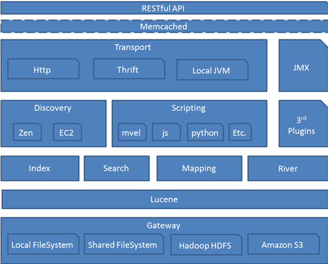
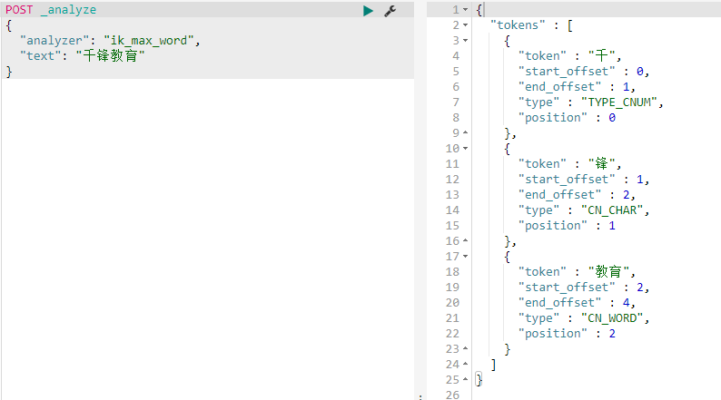
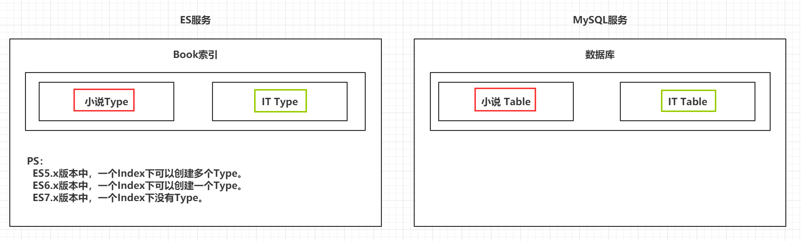
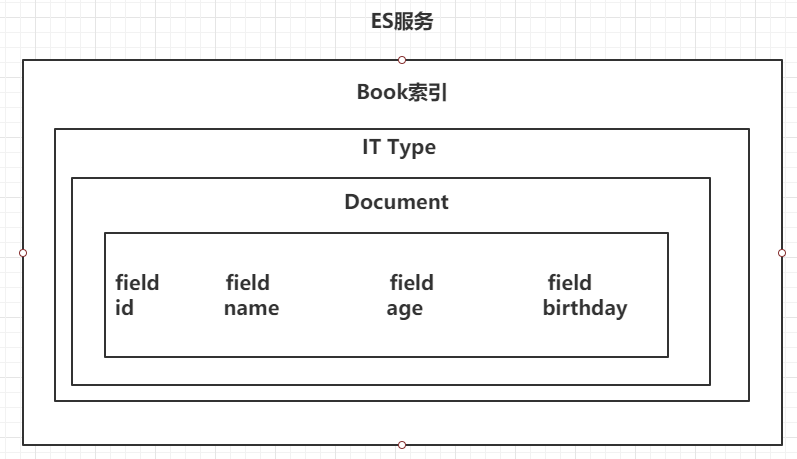
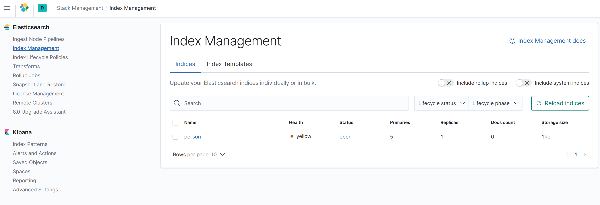
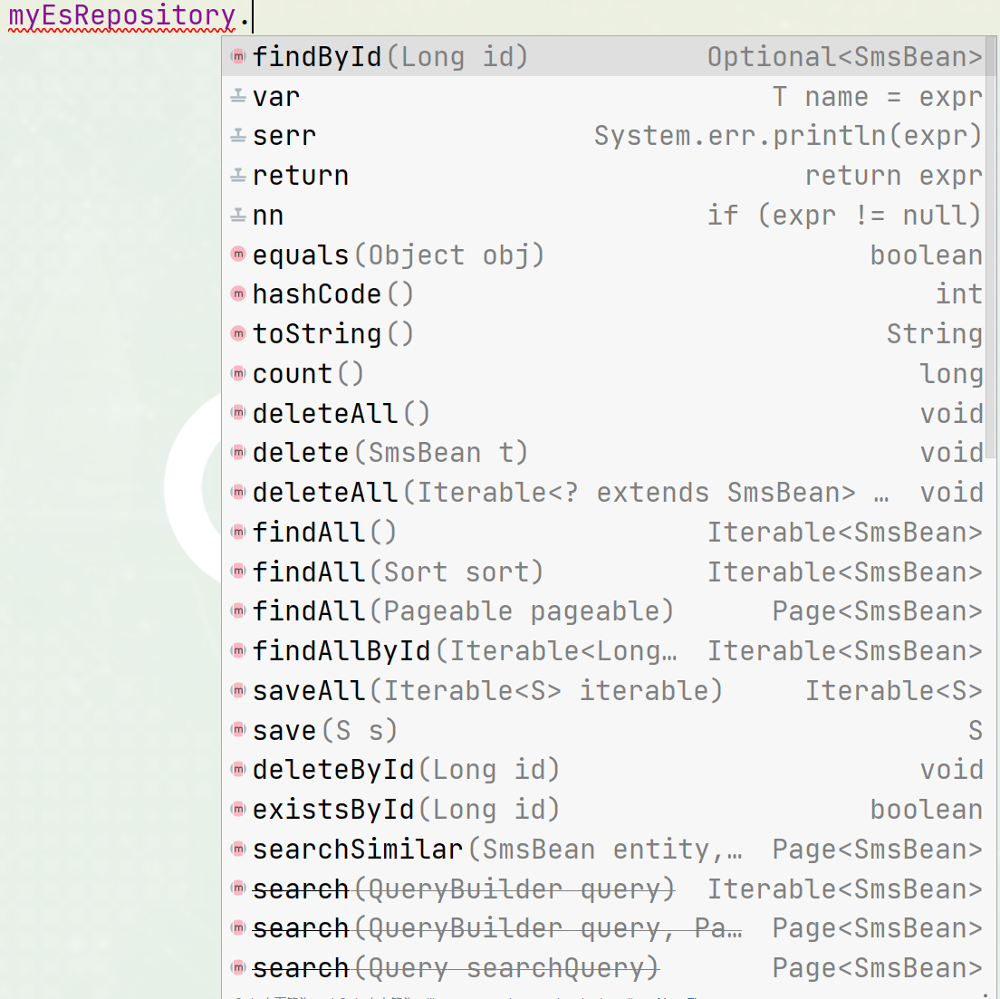

> Author：Jackiechan
>
> Version：9.0.2


[TOC]


### 一、引言

---

#### 1.1 海量数据

> 在海量数据中执行搜索功能时，如果使用MySQL，效率太低。


#### 1.2 全文检索

> 在海量数据中执行搜索功能时，如果使用MySQL，效率太低。


#### 1.3 高亮显示

> 将搜索关键字，以不同的颜色进行展示


### 二、ElasticSearch概述

-----

#### 2.1 Elasticsearch介绍

Elasticsearch是一个实时的分布式搜索和分析引擎。它可以帮助你用前所未有的速度去处理大规模数据, 它不但稳定、可靠、快速，而且也具有良好的水平扩展能力，是专门为分布式环境设计的,它可以用于全文搜索，结构化搜索以及分析，当然你也可以将这三者进行组合。Elasticsearch是一个建立在全文搜索引擎 Apache Lucene 基础上的搜索引擎，可以说Lucene是当今最先进，最高效的全功能开源搜索引擎框架。Elasticsearch分布式搜索引擎的总体框架图：



ElasticSearch是基于Lucene开发的分布式搜索框架，包含如下特性：

1. 分布式索引、搜索。

2. 索引自动分片、负载均衡。

3. 自动发现机器、组建集群。

4. 支持Restful 风格接口。

5. 配置简单等。


#### 2.2 Lucene简介

Lucene是Apache Jakarta家族中的一个开源项目，是一个开放源代码的全文检索引擎工具包，但它不是一个完整的全文检索引擎，而是一个**全文检索引擎的架构**，提供了完整的查询引擎、索引引擎和部分文本分析引擎。

Lucene提供了一个简单却强大的应用程式接口，能够做**全文索引和搜寻**。在Java开发环境里Lucene是一个成熟的免费开源工具，是目前最为流行的基于 Java 开源全文检索工具包。

数据总体分为两种：

- `结构化数据`：指**具有固定格式或有限长度的数据**，如数据库、元数据等。
- `非结构化数据`：指**不定长或无固定格式的数据**，如邮件、word文档等磁盘上的文件。

对于结构化数据的全文搜索很简单，因为数据都是有固定格式的，例如搜索数据库中数据使用SQL语句即可。

对于非结构化数据，有以下两种方法：

1. `顺序扫描法`(Serial Scanning)
2. `全文检索`(Full-text Search)

**顺序扫描法**
如果要找包含某一特定内容的文件，对于每一个文档，**从头到尾扫描内容**，如果此文档包含此字符串，则此文档为我们要找的文件，接着看下一个文件，直到扫描完所有的文件，因此速度很慢。

**全文检索**
将非结构化数据中的**一部分信息提取出来，重新组织**，使其变得**具有一定结构**，然后对此有一定结构的数据进行搜索，从而达到搜索相对较快的目的。这部分从非结构化数据中提取出的然后重新组织的信息，我们称之索引。

例如字典的拼音表和部首检字表就相当于字典的索引，通过查找拼音表或者部首检字表就可以快速的查找到我们要查的字。

这种**先建立索引，再对索引进行搜索**的过程就叫**全文检索**(Full-text Search)。


#### 2.3 ElasticSearch和Lucene关系

>  ElasticSearch vs Lucene的关系，简单一句话就是，成品与半成品的关系。

　   （1）Lucene专注于搜索底层的建设，而ElasticSearch专注于企业应用。

 　  （2）Luncene是单节点的API，ElasticSearch是分布式的。　

　   （3）Luncene需要二次开发，才能使用。不能像百度或谷歌一样，它只是提供一个接口需要被实现才能使用。

　　ElasticSearch直接拿来用。


|                        Lucene                         |
| :---------------------------------------------------: |
|  |

 


|                        ElasticSearch                         |
| :----------------------------------------------------------: |
|  |


#### 2.4 ES和Solr区别

> - Solr在查询死数据时，速度相对ES更快一些。但是数据如果是实时改变的，Solr的查询速度会降低很多，ES的查询的效率基本没有变化。
> - Solr搭建基于需要依赖Zookeeper来帮助管理。ES本身就支持集群的搭建，不需要第三方的介入。
> - 最开始Solr的社区可以说是非常火爆，针对国内的文档并不是很多。在ES出现之后，ES的社区火爆程度直线上升，ES的文档非常健全。
> - ES对现在云计算和大数据支持的特别好。


#### 2.5 倒排索引

> 将存放的数据，以一定的方式进行分词，并且将分词的内容存放到一个单独的分词库中。
>
> 当用户去查询数据时，会将用户的查询关键字进行分词。
>
> 然后去分词库中匹配内容，最终得到数据的id标识。
>
> 根据id标识去存放数据的位置拉取到指定的数据。

|                  倒排索引                   |
| :-----------------------------------------: |
|  |


### 三、 ElasticSearch安装

----

#### 3.1 安装ES&Kibana

> kibana是一个方便通过图形化界面操作ES的工具，配置好需要访问的ES地址后通过访问kibana地址即可

```yml
version: "3.1"
services:
  elasticsearch:
    image: baseservice.chenjunbo.xin:60001/elasticsearch:7.17.2
    restart: always
    container_name: elasticsearch
    environment:
      - node.name=elasticsearch
      - cluster.name=es-docker-cluster
      - discovery.seed_hosts=es01
      - cluster.initial_master_nodes=elasticsearch
      - "ES_JAVA_OPTS=-Xms512m -Xmx512m"
    ports:
      - 9200:9200
  kibana:
    image: baseservice.chenjunbo.xin:60001/kibana:7.17.2
    restart: always
    container_name: kibana
    ports:
      - 5601:5601
    environment:
      - elasticsearch_url=http://192.168.3.87:9200
    depends_on:
      - elasticsearch
```

> 如果无法启动,通过查看查看容器日志,会发现Centos 中可能会出现max virtual memory areas vm.max_map_count [65530] is too low的错误
>
> `只需要修改虚拟机的 vi /etc/sysctl.conf 文件,在最后面添加vm.max_map_count=655360 重启虚拟机 即可`


#### 3.2 安装IK分词器

> 分词器的作用就是当保存一段内容的时候如何将内容拆分为关键词保存到分词区域`分词器的版本取决于安装的es版本`

> - 下载IK分词器的地址：https://github.com/medcl/elasticsearch-analysis-ik/releases
>- github抽风,做了一个内部地址：http://baseservice.chenjunbo.xin:9071/elasticsearch-analysis-ik-7.17.2.zip
> - 进去到ES容器内部，跳转到ES安装目录的bin目录下(直接cd bin即可)，执行bin目录下的脚本文件：
>- ./elasticsearch-plugin install http://baseservice.chenjunbo.xin:9071/elasticsearch-analysis-ik-7.17.2.zip
> - 重启ES的容器，让IK分词器生效。


#### 3.3 测试分词器

> 通过访问kibana来进行测试

```json
POST _analyze
{
  "analyzer": "ik_max_word",
  "text": "千锋教育"
}

```

|               校验IK分词器                |
| :---------------------------------------: |
|  |


### 四、 ElasticSearch基本操作

-------------

#### 4.1 ES的结构

##### 4.1.1 索引Index，分片和备份

> - ES的服务中，可以创建多个索引。相当于数据库中的库
>
> - 每一个索引默认被分成5片存储。
>
> - 每一个分片都会存在至少一个备份分片。
>
> - 备份分片默认不会帮助检索数据，当ES检索压力特别大的时候，备份分片才会帮助检索数据。
>
> - 备份的分片必须放在不同的服务器中。

|               索引分片备份                |
| :---------------------------------------: |
|  |


##### 4.1.2 类型 Type

> 一个索引下，可以创建多个类型,相当于mysql中的表，在ES7之后没有type。
>
> [Ps：根据版本不同，类型的创建也不同。]()

|                   类型                    |
| :---------------------------------------: |
|  |


##### 4.1.3 文档 Doc

> 一个类型下，可以有多个文档。这个文档就类似于MySQL表中的每一行数据。

|                   文档                    |
| :---------------------------------------: |
|  |


##### 4.1.4 属性 Field

> 一个文档中，可以包含多个属性。类似于MySQL表中的列。

|                   属性                    |
| :---------------------------------------: |
|  |


#### 4.2 操作ES的RESTful语法

> ElasticSearch提供了统一的rest风格的api来进行操作,这样可以通过任何语言进行操作,风格约定如下


<table>
   <tr>
      <td>请求方式</td>
      <td>请求地址</td>
      <td>功能</td>
   </tr>
   <tr>
      <td rowspan="2">GET</td>
      <td style="color: green;">http://ip:port/index</td>
      <td>查询指定index名字的索引信息</td>
   </tr>
   <tr>
      <td style="color: green;">http://ip:port/index/_doc/id</td>
      <td>查询指定id的文档信息</td>
   </tr>
   <tr>
      <td rowspan="3">POST</td>
      <td style="color: green;">http://ip:port/index/_search</td>
      <td>传递复杂条件查询内容</td>
   </tr>
   <tr>
      <td style="color: green;">http://ip:port/index/_update/id</td>
      <td>根据id更新文档内容</td>
   </tr>
     <tr>
      <td style="color: green;">http://ip:port/index/_doc</td>
      <td>添加数据,自动生成id</td>
   </tr>
   <tr>
      <td rowspan="3">PUT</td>
      <td style="color: green;">http://ip:port/index</td>
      <td>创建一个索引，需要在请求体中指定索引的信息,如setting,mapping等</td>
   </tr>
   <tr>
      <td style="color: green;">http://ip:port/index/_mappings</td>
      <td>给索引创建或者更新mapping,需要在请求体中传递mapping</td>
   </tr>
   <tr>
      <td style="color: green;">http://ip:port/index/_doc/id</td>
      <td>指定id添加文档</td>
   </tr>
   <tr>
      <td rowspan="2">DELETE</td>
      <td style="color: green;">http://ip:port/index</td>
      <td>删除指定index名字索引</td>
   </tr>
   <tr>
      <td style="color: green;">http://ip:port/index/_doc/id</td>
      <td>删除指定index下指定id的文档</td>
   </tr>
</table>


#### 4.3 索引的操作

##### 4.3.1 创建一个索引

> 语法如下

```json
# 创建一个索引
PUT /person
{
  "settings": {
    "number_of_shards": 5,
    "number_of_replicas": 1
  }
}
```

##### 4.3.2 查看索引信息

> 语法如下

```sh
# 查看索引信息
GET /person
```

|                 查看信息                  |
| :---------------------------------------: |
|  |


##### 4.3.3 删除索引

> 语法如下

```json
# 删除索引
DELETE /person
```


#### 4.4 ES中Field可以指定的类型

>[数据类型参考官网：]()https://www.elastic.co/guide/en/elasticsearch/reference/7.17/mapping-types.html


<table>
   <tr>
      <td>分类</td>
      <td>类型</td>
      <td>介绍</td>
   </tr>
   <tr>
      <td rowspan="2">字符串</td>
      <td>text</td>
      <td>一般被用于全文检索。 在插入和查询数据的时候Field进行分词。</td>
   </tr>
   <tr>
      <td>keyword</td>
      <td>在插入和查询数据的时候Field不会被分词</td>
   </tr>
   <tr>
      <td rowspan="8">数值</td>
      <td>long</td>
      <td>取值范围为和Java一样，占用8个字节</td>
   </tr>
   <tr>
      <td>integer</td>
      <td>取值范围为和Java一样，占用4个字节</td>
   </tr>
   <tr>
      <td>short</td>
      <td>取值范围为和Java一样，占用2个字节</td>
   </tr>
   <tr>
      <td>byte</td>
      <td>取值范围为和Java一样，占用4个字节</td>
   </tr>
   <tr>
      <td>double</td>
      <td>取值范围为和Java一样，占用8个字节</td>
   </tr>
   <tr>
      <td>float</td>
      <td>取值范围为和Java一样，占用4个字节</td>
   </tr>
   <tr>
      <td>half_float</td>
      <td>精度比float小一半</td>
   </tr>
   <tr>
      <td>scaled_float</td>
      <td>根据一个long和scaled来表达一个浮点型，long-345，scaled-100代表3.45</td>
   </tr>
     <tr>
      <td >IP地址</td>
      <td>ip</td>
      <td>ipv4 IPV6类型的数据</td>
   </tr>
   <tr>
      <td >布尔</td>
      <td>boolean</td>
      <td>表达true和false</td>
   </tr>
       <tr>
      <td >二进制</td>
      <td>binary</td>
      <td>暂时支持Base64 encode string</td>
   </tr>
     <tr>
      <td rowspan="6">范围</td>
      <td>long_range</td>
      <td>范围值指定gt，lt，gte，lte</td>
   </tr>
   <tr>
      <td>integer_range</td>
      <td>同上</td>
   </tr>
   <tr>
      <td>double_range</td>
      <td>同上</td>
   </tr>
   <tr>
      <td>float_range</td>
      <td>同上</td>
   </tr>
   <tr>
      <td>date_range</td>
      <td>同上</td>
   </tr>
   <tr>
      <td>ip_range</td>
      <td>同上</td>
   </tr>
   <tr>
      <td >地理位置</td>
      <td>geo_point</td>
      <td>存储地理经纬度位置</td>
   </tr>
</table>


​    


#### 4.5 创建索引并指定数据结构

> 语法如下

```json
# 创建索引，指定数据结构
PUT /book
{
  "settings": {
    # 分片数
    "number_of_shards": 5,
    # 备份数
    "number_of_replicas": 1
  },
  # 指定数据结构
  "mappings": {
      # 文档存储的Field
      "properties": {
        # Field属性名
        "name": {
    		# 类型
          "type": "text",
    		# 指定分词器
          "analyzer": "ik_max_word",
    		# 指定当前Field可以被作为查询的条件
          "index": true ,  #如果为true 类似在sql中使用where name =xxxx的方式来查询
    		# 是否需要额外存储, 如果stroe为false,代表返回结果中不会出现这一列,类似于sql select不能出现这个列,在es中这个默认就是true,而且指定false也没用
          "store": false 
        },
        "author": {
          "type": "keyword"
        },
        "count": {
          "type": "long"
        },
        "on-sale": {
          "type": "date",
           # 时间类型的格式化方式 
          "format": "yyyy-MM-dd HH:mm:ss||yyyy-MM-dd||epoch_millis"
        },
        "descr": {
          "type": "text",
          "analyzer": "ik_max_word"
        }
      }
  }
}
```

#### 4.6 文档的操作

> 文档在ES服务中的唯一标识，`_index`，`_type`，`_id`三个内容为组合，锁定一个文档，操作是添加还是修改。对于ES7以上的版本 _index和_id就可以定位一条唯一的数据

##### 4.6.1 新建文档

> 自动生成_id

```json
# 添加文档，自动生成id
POST /book/_doc
{
  "name": "盘龙",
  "author": "我吃西红柿",
  "count": 100000,
  "on-sale": "2000-01-01",
  "descr": "山重水复疑无路，柳暗花明又一村"
}
```

> 手动指定_id

```json
# 添加文档，手动指定id
PUT /book/_doc/1
{
  "name": "红楼梦",
  "author": "曹雪芹",
  "count": 10000000,
  "on-sale": "1985-01-01",
  "descr": "一个是阆苑仙葩，一个是美玉无瑕"
}
```

##### 4.6.2 查询文档

> 根据id查询文档

```json
GET /book/_doc/1
```


##### 4.6.3修改文档

> 覆盖式修改

```json
# 覆盖修改的时候你传递了多少数据,最终只剩下多少数据,比如传递了两列,最终就只有两列数据,如果只想更改一列内容,需要把不修改的数据也写在里面
PUT /book/_doc/1
{
  "name": "红楼梦",
  "count": 4353453,
  "on-sale": "1985-01-01",
  "descr": "一个是阆苑仙葩，一个是美玉无瑕"
}
```

> doc修改方式,局部修改,指定什么列就只修改什么列,原始数据不变

```json
# 修改文档，部分修改
POST /book/_update/1
{
  "doc": {
    "count": "1234565"
  }
}
```


##### 4.6.4 删除文档

> 根据id删除

```json
# 根据id删除文档
DELETE /book/_doc/_id
```


### 五、Java操作ElasticSearch【`重点`】

----

#### 5.1 Java连接ES

> 创建Maven工程

> 导入依赖

```xml
<dependencies>
    <!--        1. elasticsearch-->
    <dependency>
        <groupId>org.elasticsearch</groupId>
        <artifactId>elasticsearch</artifactId>
        <version>7.17.2</version>
    </dependency>

    <!--        2. elasticsearch的高级API-->
    <dependency>
        <groupId>org.elasticsearch.client</groupId>
        <artifactId>elasticsearch-rest-high-level-client</artifactId>
        <version>7.17.2</version>
    </dependency>

    <!--        3. junit-->
    <dependency>
        <groupId>junit</groupId>
        <artifactId>junit</artifactId>
        <version>4.12</version>
    </dependency>

    <!--        4. lombok-->
    <dependency>
        <groupId>org.projectlombok</groupId>
        <artifactId>lombok</artifactId>
        <version>1.18.24</version>
    </dependency>
</dependencies>
```

> 创建测试类，连接ES

```java
public class ESClient {

    public static RestHighLevelClient getClient(){

        // 创建HttpHost对象
        HttpHost httpHost = new HttpHost("192.168.199.109",9200);

        // 创建RestClientBuilder
        RestClientBuilder clientBuilder = RestClient.builder(httpHost);

        // 创建RestHighLevelClient
        RestHighLevelClient client = new RestHighLevelClient(clientBuilder);

        // 返回
        return client;
    }

}
```


#### 5.2 Java操作索引

##### 5.2.1 创建索引

> 代码如下

```java
public class Demo2 {

    RestHighLevelClient client = ESClient.getClient();
    String index = "person";

    @Test
    public void createIndex() throws IOException {
        //1. 准备关于索引的settings
        Settings.Builder settings = Settings.builder()
                .put("number_of_shards", 3)
                .put("number_of_replicas", 1);

        //2. 准备关于索引的结构mappings
        XContentBuilder mappings = JsonXContent.contentBuilder()
                .startObject()
                    .startObject("properties")
                        .startObject("name")
                            .field("type","text")
                        .endObject()
                        .startObject("age")
                            .field("type","integer")
                        .endObject()
                        .startObject("birthday")
                            .field("type","date")
                            .field("format","yyyy-MM-dd")
                        .endObject()
                    .endObject()
                .endObject();


        //3. 将settings和mappings封装到一个Request对象
        CreateIndexRequest request = new CreateIndexRequest(index)
                .settings(settings)
                .mapping(mappings);

        //4. 通过client对象去连接ES并执行创建索引
        CreateIndexResponse resp = client.indices().create(request, RequestOptions.DEFAULT);

        //5. 输出
        System.out.println("resp:" + resp.toString());

    }

}
```


##### 5.2.2 检查索引是否存在

> 代码如下

```java
@Test
public void exists() throws IOException {
    //1. 准备request对象
    GetIndexRequest request = new GetIndexRequest();
    request.indices(index);

    //2. 通过client去操作
    boolean exists = client.indices().exists(request, RequestOptions.DEFAULT);


    //3. 输出
    System.out.println(exists);
}
```


##### 5.2.3 删除索引

> 代码如下

```java
@Test
public void delete() throws IOException {
    //1. 准备request对象
    DeleteIndexRequest request = new DeleteIndexRequest();
    request.indices(index);

    //2. 通过client对象执行
    AcknowledgedResponse delete = client.indices().delete(request, RequestOptions.DEFAULT);

    //3. 获取返回结果
    System.out.println(delete.isAcknowledged());
}
```


#### 5.3 Java操作文档

##### 5.3.1 添加文档操作

> 代码如下

```java
public class Demo3 {

    ObjectMapper mapper = new ObjectMapper();
    RestHighLevelClient client = ESClient.getClient();
    String index = "person";


    @Test
    public void createDoc() throws IOException {
        //1. 准备一个json数据
        Person person = new Person(1,"张三",23,new Date());
        String json = mapper.writeValueAsString(person);

        //2. 准备一个request对象（手动指定id）
        IndexRequest request = new IndexRequest(index);
        indexRequest.id(person.getId().toString());
        request.source(json, XContentType.JSON);

        //3. 通过client对象执行添加
        IndexResponse resp = client.index(request, RequestOptions.DEFAULT);

        //4. 输出返回结果
        System.out.println(resp.getResult().toString());
    }

}
```


##### 5.3.2 修改文档

> 代码如下

```java
@Test
public void updateDoc() throws IOException {
    //1. 创建一个Map，指定需要修改的内容
    Map<String,Object> doc = new HashMap<>();
    doc.put("name","张大三");
    String docId = "1";

    //2. 创建request对象，封装数据
    UpdateRequest request = new UpdateRequest(index,docId);
    request.doc(doc);

    //3. 通过client对象执行
    UpdateResponse update = client.update(request, RequestOptions.DEFAULT);

    //4. 输出返回结果
    System.out.println(update.getResult().toString());
}
```


##### 5.3.3 删除文档

> 代码如下

```java
@Test
public void deleteDoc() throws IOException {
    //1. 封装Request对象
    DeleteRequest request = new DeleteRequest(index,"1");

    //2. client执行
    DeleteResponse resp = client.delete(request, RequestOptions.DEFAULT);

    //3. 输出结果
    System.out.println(resp.getResult().toString());
}
```


#### 5.4 Java批量操作文档

##### 5.4.1 批量添加

> 代码如下

```java
@Test
public void bulkCreateDoc() throws IOException {
    //1. 准备多个json数据
    Person p1 = new Person(1,"张三",23,new Date());
    Person p2 = new Person(2,"李四",24,new Date());
    Person p3 = new Person(3,"王五",25,new Date());

    String json1 = mapper.writeValueAsString(p1);
    String json2 = mapper.writeValueAsString(p2);
    String json3 = mapper.writeValueAsString(p3);

    //2. 创建Request，将准备好的数据封装进去
    BulkRequest request = new BulkRequest();
    request.add(new IndexRequest(index).id(p1.getId().toString()).source(json1,XContentType.JSON));
    request.add(new IndexRequest(index).id(p2.getId().toString()).source(json2,XContentType.JSON));
    request.add(new IndexRequest(index).id(p3.getId().toString()).source(json3,XContentType.JSON));

    //3. 用client执行
    BulkResponse resp = client.bulk(request, RequestOptions.DEFAULT);

    //4. 输出结果
    System.out.println(resp.toString());
}
```


##### 5.4.2 批量删除

> 代码如下

```java
@Test
public void bulkDeleteDoc() throws IOException {
    //1. 封装Request对象
    BulkRequest request = new BulkRequest();
    request.add(new DeleteRequest(index,"1"));
    request.add(new DeleteRequest(index,"2"));
    request.add(new DeleteRequest(index,"3"));

    //2. client执行
    BulkResponse resp = client.bulk(request, RequestOptions.DEFAULT);

    //3. 输出
    System.out.println(resp);
}
```


#### 5.5 ElasticSearch练习

> 创建索引，指定数据结构
>
> 索引名：sms-logs-index
>
> 结构如下：

|                索引结构图                 |
| :---------------------------------------: |
|  |


```json
PUT /sms-logs-index
{
  "settings": {

    "number_of_shards": 5,

    "number_of_replicas": 1
  }
}

POST /sms-logs-index/_mapping
{
      "properties": {
        "corpName": {
          "type": "keyword"
        },
        "createDate": {
          "type": "date",
          "format":"yyyy-MM-dd HH:mm:ss||yyyy-MM-dd||epoch_millis"
        },
        "fee": {
          "type": "integer"
        },
        "ipAddr": {
          "type": "ip"
        },
        "longCode": {
          "type": "keyword"
        },
        "mobile": {
          "type": "keyword"
        },
        "operatorId": {
          "type": "integer"
        },
        "province": {
          "type": "keyword"
        },
        "replyTotal": {
          "type": "integer"
        },
        "sendDate": {
          "type": "date",
          "format":"yyyy-MM-dd HH:mm:ss||yyyy-MM-dd||epoch_millis"
        },
        "smsContent": {
          "type": "text",
          "analyzer": "ik_max_word"
        },
        "state": {
          "type": "integer"
        }
      }
}

```


#####  5.5.1 模板数据

```JSON
{
  "corpName":"盒马鲜生",
  "mobile":"13100000000",
  "createDate":"2022-02-18 19:19:20",
  "sendDate":"2022-02-18 19:19:21",
  "longCode":"10660000988",
  "smsContent":"【盒马】您尾号12345678的订单已开始配送，请在您指定的时间收货不要走开哦~配送员：刘三，电话：13800000000",
  "state":0,
  "province":"北京",
  "operatorId":2,
  "ipAddr":"10.126.2.9",
  "replyTotal":15,
  "fee":5
}
```


### 六、 ElasticSearch的各种查询

-----------

#### 6.1 term&terms查询【`重点`】

##### 6.1.1 term查询

> term的查询是代表完全匹配，搜索之前不会对你搜索的关键字进行分词，对你的关键字去文档分词库中去匹配内容。相当于我们数据库中where xxx=yyy这种条件

```json
# term查询
POST /sms-logs-index/_search
{
  "from": 0,  
  "size": 5,
  "query": {
    "term": {
      "province": {
        "value": "北京"
      }
    }
  }
}
```

> 代码实现方式

```java
// Java代码实现方式
@Test
public void termQuery() throws IOException {
    //1. 创建Request对象
    SearchRequest request = new SearchRequest(index);

    //2. 指定查询条件
    SearchSourceBuilder builder = new SearchSourceBuilder();
    builder.from(0);
    builder.size(5);
    builder.query(QueryBuilders.termQuery("province","北京"));

    request.source(builder);

    //3. 执行查询
    SearchResponse resp = client.search(request, RequestOptions.DEFAULT);

    //4. 获取到_source中的数据，并展示
    for (SearchHit hit : resp.getHits().getHits()) {
        Map<String, Object> result = hit.getSourceAsMap();
        System.out.println(result);
    }
}
```


##### 6.1.2 terms查询

> terms和term的查询机制是一样，都不会将指定的查询关键字进行分词，直接去分词库中匹配，找到相应文档内容。
>
> terms是在针对一个字段包含多个值的时候使用。
>
> term：where province = 北京；
>
> terms：where province = 北京 or province = ？or province = ？

```json
# terms查询
  POST /sms-logs-index/_search
  {
    "query": {
      "terms": {
        "province": [
          "北京",
          "山西",
          "武汉"
        ]
      }
    }
  }
```

> 代码实现方式

```java
// Java实现
@Test
public void termsQuery() throws IOException {
    //1. 创建request
    SearchRequest request = new SearchRequest(index);

    //2. 封装查询条件
    SearchSourceBuilder builder = new SearchSourceBuilder();
    builder.query(QueryBuilders.termsQuery("province","北京","山西"));

    request.source(builder);

    //3. 执行查询
    SearchResponse resp = client.search(request, RequestOptions.DEFAULT);

    //4. 输出_source
    for (SearchHit hit : resp.getHits().getHits()) {
        System.out.println(hit.getSourceAsMap());
    }
}
```


#### 6.2 match查询【`重点`】

> match查询属于高层查询，他会根据你查询的字段类型不一样，采用不同的查询方式。
>
> - 查询的是日期或者是数值的话，他会将你基于的字符串查询内容转换为日期或者数值对待。
> - 如果查询的内容是一个不能被分词的内容（keyword），match查询不会对你指定的查询关键字进行分词。
> - 如果查询的内容时一个可以被分词的内容（text），match会将你指定的查询内容根据一定的方式去分词，去分词库中匹配指定的内容。
>
> match查询，实际底层就是多个term查询，将多个term查询的结果给你封装到了一起。

##### 6.2.1 match_all查询

> 查询全部内容，不指定任何查询条件。

```json
# match_all查询
POST /sms-logs-index/_search
{
  "query": {
    "match_all": {}
  }
}
```

> 代码实现方式

```java
//  java代码实现
@Test
public void matchAllQuery() throws IOException {
    //1. 创建Request
    SearchRequest request = new SearchRequest(index);

    //2. 指定查询条件
    SearchSourceBuilder builder = new SearchSourceBuilder();
    builder.query(QueryBuilders.matchAllQuery());
    builder.size(20);           // ES默认只查询10条数据，如果想查询更多，添加size
    request.source(builder);

    //3. 执行查询
    SearchResponse resp = client.search(request, RequestOptions.DEFAULT);

    //4. 输出结果
    for (SearchHit hit : resp.getHits().getHits()) {
        System.out.println(hit.getSourceAsMap());
    }
    System.out.println(resp.getHits().getHits().length);


}
```


##### 6.2.2 match查询

> 指定一个Field作为筛选的条件

```json
# match查询 ,首先把 收货安装 拆分 得到的可能是收货和安装两个词语,然后用这两个词语去查看分词区域,找到这两个词语对应的数据的索引是哪些,然后根据索引获取到数据之后返回
POST /sms-logs-index/_search
{
  "query": {
    "match": {
      "smsContent": "收货安装"
    }
  }
}
```

> 代码实现方式

```java
@Test
public void matchQuery() throws IOException {
    //1. 创建Request
    SearchRequest request = new SearchRequest(index);

    //2. 指定查询条件
    SearchSourceBuilder builder = new SearchSourceBuilder();
    //-----------------------------------------------
    builder.query(QueryBuilders.matchQuery("smsContent","收货安装"));
    //-----------------------------------------------
    request.source(builder);
    //3. 执行查询
    SearchResponse resp = client.search(request, RequestOptions.DEFAULT);

    //4. 输出结果
    for (SearchHit hit : resp.getHits().getHits()) {
        System.out.println(hit.getSourceAsMap());
    }
}
```


##### 6.2.3 布尔match查询

> 基于一个Field匹配的内容，采用and或者or的方式连接

```json
# 布尔match查询
POST /sms-logs-index/_search
{
  "query": {
    "match": {
      "smsContent": {
        "query": "收货安装",
        "operator": "and"      # 内容既包含收货也包含安装
      }
    }
  }
}


# 布尔match查询
POST /sms-logs-index/_search
{
  "query": {
    "match": {
      "smsContent": {
        "query": "收货安装",
        "operator": "or"		# 内容包括收货或者包括安装
      }
    }
  }
}
```

> 代码实现方式

```java
// Java代码实现
@Test
public void booleanMatchQuery() throws IOException {
    //1. 创建Request
    SearchRequest request = new SearchRequest(index);

    //2. 指定查询条件
    SearchSourceBuilder builder = new SearchSourceBuilder();
    //-----------------------------------------------                               选择AND或者OR
    builder.query(QueryBuilders.matchQuery("smsContent","收货安装").operator(Operator.OR));
    //-----------------------------------------------
    request.source(builder);
    //3. 执行查询
    SearchResponse resp = client.search(request, RequestOptions.DEFAULT);

    //4. 输出结果
    for (SearchHit hit : resp.getHits().getHits()) {
        System.out.println(hit.getSourceAsMap());
    }
}
```


##### 6.2.4 multi_match查询

> match针对一个field做检索，multi_match针对多个field进行检索，多个field对应一个text。

```json
# multi_match 查询
POST /sms-logs-index/_search
{
  "query": {
    "multi_match": {
      "query": "北京",					# 指定text
      "fields": ["province","smsContent"]    # 指定field们
    }
  }
}
```

> 代码实现方式

```java
// java代码实现
@Test
public void multiMatchQuery() throws IOException {
    //1. 创建Request
    SearchRequest request = new SearchRequest(index);
   
    //2. 指定查询条件
    SearchSourceBuilder builder = new SearchSourceBuilder();
    //-----------------------------------------------
    builder.query(QueryBuilders.multiMatchQuery("北京","province","smsContent"));
    //-----------------------------------------------
    request.source(builder);
    //3. 执行查询
    SearchResponse resp = client.search(request, RequestOptions.DEFAULT);

    //4. 输出结果
    for (SearchHit hit : resp.getHits().getHits()) {
        System.out.println(hit.getSourceAsMap());
    }
}
```


#### 6.3 其他查询

##### 6.3.1 id查询

> 根据id查询 where id = ?

```json
# id查询
GET /sms-logs-index/_doc/1
```

> 代码实现方式

```java
// Java代码实现
@Test
public void findById() throws IOException {
    //1. 创建GetRequest
    GetRequest request = new GetRequest(index,"1");

    //2. 执行查询
    GetResponse resp = client.get(request, RequestOptions.DEFAULT);

    //3. 输出结果
    System.out.println(resp.getSourceAsMap());
}
```


##### 6.3.2 ids查询

> 根据多个id查询，类似MySQL中的where id in（id1，id2，id2...）

```json
# ids查询
POST /sms-logs-index/_search
{
  "query": {
    "ids": {
      "values": ["1","2","3"]
    }
  }
}
```

> 代码实现方式

```java
// Java代码实现
@Test
public void findByIds() throws IOException {
    //1. 创建SearchRequest
    SearchRequest request = new SearchRequest(index);

    //2. 指定查询条件
    SearchSourceBuilder builder = new SearchSourceBuilder();
    //----------------------------------------------------------
    builder.query(QueryBuilders.idsQuery().addIds("1","2","3"));
    //----------------------------------------------------------
    request.source(builder);

    //3. 执行
    SearchResponse resp = client.search(request, RequestOptions.DEFAULT);

    //4. 输出结果
    for (SearchHit hit : resp.getHits().getHits()) {
        System.out.println(hit.getSourceAsMap());
    }
}
```


##### 6.3.3 prefix查询

> 前缀查询，可以通过一个关键字去指定一个Field的前缀，从而查询到指定的文档。
>
> 类似于mysql 的like xxxx%

```json
#prefix 查询
POST /sms-logs-index/_search
{
  "query": {
    "prefix": {
      "corpName": {
        "value": "盒马"
      }
    }
  }
}
```

> 代码实现方式

```java
// Java实现前缀查询
@Test
public void findByPrefix() throws IOException {
    //1. 创建SearchRequest
    SearchRequest request = new SearchRequest(index);

    //2. 指定查询条件
    SearchSourceBuilder builder = new SearchSourceBuilder();
    //----------------------------------------------------------
    builder.query(QueryBuilders.prefixQuery("corpName","盒马"));
    //----------------------------------------------------------
    request.source(builder);

    //3. 执行
    SearchResponse resp = client.search(request, RequestOptions.DEFAULT);

    //4. 输出结果
    for (SearchHit hit : resp.getHits().getHits()) {
        System.out.println(hit.getSourceAsMap());
    }
}
```


##### 6.3.4 fuzzy查询

> 模糊查询，我们输入字符的大概，内容中可能会和实际的内容有出入,但是前面的部分内容可以匹配上,并且长度也可以匹配,ES就可以去根据输入的内容大概去匹配一下结果。

```json
# fuzzy查询
POST /sms-logs-index/_search
{
  "query": {
    "fuzzy": {
      "corpName": {
        "value": "盒马先生",
        "prefix_length": 2			# 指定前面几个字符是不允许出现错误的
      }
    }
  }
}
```

> 代码实现方式

```java
// Java代码实现Fuzzy查询
@Test
public void findByFuzzy() throws IOException {
    //1. 创建SearchRequest
    SearchRequest request = new SearchRequest(index);

    //2. 指定查询条件
    SearchSourceBuilder builder = new SearchSourceBuilder();
    //----------------------------------------------------------
    builder.query(QueryBuilders.fuzzyQuery("corpName","盒马先生").prefixLength(2));
    //----------------------------------------------------------
    request.source(builder);

    //3. 执行
    SearchResponse resp = client.search(request, RequestOptions.DEFAULT);

    //4. 输出结果
    for (SearchHit hit : resp.getHits().getHits()) {
        System.out.println(hit.getSourceAsMap());
    }
}
```


##### 6.3.5 wildcard查询

> 通配查询，和MySQL中的like是一个套路，可以在查询时，在字符串中指定通配符*和占位符？
>
> *可以匹配0-N个字符(汉字), ?匹配一个字符(汉字),它们出现的位置可以在开头可以在中间,可以在结尾

```json
# wildcard 查询
POST /sms-logs-index/_search
{
  "query": {
    "wildcard": {
      "corpName": {
        "value": "盒马*"    # 可以使用*和？指定通配符和占位符
      }
    }
  }
}
```

> 代码实现方式

```java
// Java代码实现Wildcard查询
@Test
public void findByWildCard() throws IOException {
    //1. 创建SearchRequest
    SearchRequest request = new SearchRequest(index);

    //2. 指定查询条件
    SearchSourceBuilder builder = new SearchSourceBuilder();
    //----------------------------------------------------------
    builder.query(QueryBuilders.wildcardQuery("corpName","盒马*"));
    //----------------------------------------------------------
    request.source(builder);

    //3. 执行
    SearchResponse resp = client.search(request, RequestOptions.DEFAULT);

    //4. 输出结果
    for (SearchHit hit : resp.getHits().getHits()) {
        System.out.println(hit.getSourceAsMap());
    }
}
```


##### 6.3.6 range查询

> 范围查询，只针对数值类型，对某一个Field进行大于或者小于的范围指定

```json
# range 查询
POST /sms-logs-index/_search
{
  "query": {
    "range": {
      "fee": {
        "gt": 5,
        "lte": 10
         # 可以使用 gt：>      gte：>=     lt：<     lte：<=
      }
    }
  }
}
```

> 代码实现方式

```java
// Java实现range范围查询
@Test
public void findByRange() throws IOException {
    //1. 创建SearchRequest
    SearchRequest request = new SearchRequest(index);

    //2. 指定查询条件
    SearchSourceBuilder builder = new SearchSourceBuilder();
    //----------------------------------------------------------
    builder.query(QueryBuilders.rangeQuery("fee").lte(10).gte(5));
    //----------------------------------------------------------
    request.source(builder);

    //3. 执行
    SearchResponse resp = client.search(request, RequestOptions.DEFAULT);

    //4. 输出结果
    for (SearchHit hit : resp.getHits().getHits()) {
        System.out.println(hit.getSourceAsMap());
    }
}

```


##### 6.3.7 regexp查询

> 正则查询，通过你编写的正则表达式去匹配内容。
>
> [Ps：prefix，fuzzy，wildcard和regexp查询效率相对比较低，要求效率比较高时，避免去使用]()

```json
# regexp 查询
POST /sms-logs-index/_search
{
  "query": {
    "regexp": {
      "mobile": "131[0-9]{8}"    # 编写正则
    }
  }
}
```

> 代码实现方式

```java
// Java代码实现正则查询
@Test
public void findByRegexp() throws IOException {
    //1. 创建SearchRequest
    SearchRequest request = new SearchRequest(index);

    //2. 指定查询条件
    SearchSourceBuilder builder = new SearchSourceBuilder();
    //----------------------------------------------------------
    builder.query(QueryBuilders.regexpQuery("mobile","131[0-9]{8}"));
    //----------------------------------------------------------
    request.source(builder);

    //3. 执行
    SearchResponse resp = client.search(request, RequestOptions.DEFAULT);

    //4. 输出结果
    for (SearchHit hit : resp.getHits().getHits()) {
        System.out.println(hit.getSourceAsMap());
    }
}
```


#### 6.4 深分页Scroll

> ES对from + size是有限制的，from和size二者之和不能超过1W
>
> 原理：
>
> - from+size在ES查询数据的方式：
>   - 第一步现将用户指定的关键进行分词。
>   - 第二步将词汇去分词库中进行检索，得到多个文档的id。
>   - 第三步去各个分片中去拉取指定的数据。耗时较长。
>   - 第四步将数据根据score进行排序。耗时较长。
>   - 第五步根据from的值，将查询到的数据舍弃一部分。
>   - 第六步返回结果。
>
> - scroll+size在ES查询数据的方式：
>   - 第一步现将用户指定的关键进行分词。
>   - 第二步将词汇去分词库中进行检索，得到多个文档的id。
>   - 第三步将文档的id存放在一个ES的上下文中。
>   - 第四步根据你指定的size的个数去ES中检索指定个数的数据，拿完数据的文档id，会从上下文中移除。
>   - 第五步如果需要下一页数据，直接去ES的上下文中，找后续内容。
>   - 第六步循环第四步和第五步
>
> [Scroll查询方式，不适合做实时的查询]()

```json
# 执行scroll查询，返回第一页数据，并且将文档id信息存放在ES上下文中，指定生存时间1m
POST /sms-logs-index/_search?scroll=1m
{
  "query": {
    "match_all": {}
  },
  "size": 2,
  "sort": [					# 排序
    {
      "fee": {
        "order": "desc"
      }
    }
  ]
}

# 根据scroll查询下一页数据
POST /_search/scroll
{
  "scroll_id": "<根据第一步得到的scorll_id去指定>",
  "scroll": "<scorll信息的生存时间>"
}


# 删除scroll在ES上下文中的数据
DELETE /_search/scroll/scroll_id
```

> 代码实现方式

```java
// Java实现scroll分页
@Test
public void scrollQuery() throws IOException {
    //1. 创建SearchRequest
    SearchRequest request = new SearchRequest(index);

    //2. 指定scroll信息
    request.scroll(TimeValue.timeValueMinutes(1L));

    //3. 指定查询条件
    SearchSourceBuilder builder = new SearchSourceBuilder();
    builder.size(4);
    builder.sort("fee", SortOrder.DESC);
    builder.query(QueryBuilders.matchAllQuery());
    
    request.source(builder);

    //4. 获取返回结果scrollId，source
    SearchResponse resp = client.search(request, RequestOptions.DEFAULT);

    String scrollId = resp.getScrollId();
    System.out.println("----------首页---------");
    for (SearchHit hit : resp.getHits().getHits()) {
        System.out.println(hit.getSourceAsMap());
    }


    while(true) {
        //5. 循环 - 创建SearchScrollRequest
        SearchScrollRequest scrollRequest = new SearchScrollRequest(scrollId);

        //6. 指定scrollId的生存时间
        scrollRequest.scroll(TimeValue.timeValueMinutes(1L));

        //7. 执行查询获取返回结果
        SearchResponse scrollResp = client.scroll(scrollRequest, RequestOptions.DEFAULT);

        //8. 判断是否查询到了数据，输出
        SearchHit[] hits = scrollResp.getHits().getHits();
        if(hits != null && hits.length > 0) {
            System.out.println("----------下一页---------");
            for (SearchHit hit : hits) {
                System.out.println(hit.getSourceAsMap());
            }
        }else{
            //9. 判断没有查询到数据-退出循环
            System.out.println("----------结束---------");
            break;
        }
    }


    //10. 创建CLearScrollRequest
    ClearScrollRequest clearScrollRequest = new ClearScrollRequest();

    //11. 指定ScrollId
    clearScrollRequest.addScrollId(scrollId);

    //12. 删除ScrollId
    ClearScrollResponse clearScrollResponse = client.clearScroll(clearScrollRequest, RequestOptions.DEFAULT);

    //13. 输出结果
    System.out.println("删除scroll：" + clearScrollResponse.isSucceeded());

}
```


#### 6.5 delete-by-query

> 根据term，match等查询方式去删除大量的文档
>
> [Ps：如果你需要删除的内容，是index下的大部分数据，推荐创建一个全新的index，将保留的文档内容，添加到全新的索引]()

```json
# delete-by-query
POST /sms-logs-index/_delete_by_query
{
  "query": {
    "range": {
      "fee": {
        "lt": 4
      }
    }
  }
}
```

> 代码实现方式

```java
// Java代码实现
@Test
public void deleteByQuery() throws IOException {
    //1. 创建DeleteByQueryRequest
    DeleteByQueryRequest request = new DeleteByQueryRequest(index);

    //2. 指定检索的条件    和SearchRequest指定Query的方式不一样
    request.setQuery(QueryBuilders.rangeQuery("fee").lt(4));

    //3. 执行删除
    BulkByScrollResponse resp = client.deleteByQuery(request, RequestOptions.DEFAULT);

    //4. 输出返回结果
    System.out.println(resp.toString());

}
```


#### 6.6 复合查询

##### 6.6.1 bool查询

>复合过滤器，将你的多个查询条件，以一定的逻辑组合在一起。


|   过滤器   |                             介绍                             |
| :--------: | :----------------------------------------------------------: |
|   `must`   |         所有的条件，用must组合在一起，表示And的意思          |
| `must_not` |      将must_not中的条件，全部都不能匹配，标识Not的意思       |
|  `should`  | 所有的条件，用should组合在一起，表示Or的意思, should中的条件默认是匹配0个,也就是可以不符合,可以指定必须匹配的数量 通过   "minimum_should_match" : 1 来指定匹配的数量,可以指定多个,但是效果取决于should内部的查询方式 |


```json
# 查询省份为武汉或者北京
# 运营商不是联通
# smsContent中包含中国和平安
# bool查询
POST /sms-logs-index/_search
{
  "query": {
    "bool": {
      "should": [
        {
          "term": {
            "province": {
              "value": "北京"
            }
          }
        },
        {
          "term": {
            "province": {
              "value": "武汉"
            }
          }
        }
      ],
      "must_not": [
        {
          "term": {
            "operatorId": {
              "value": "2"
            }
          }
        }
      ],
      "must": [
        {
          "match": {
            "smsContent": "中国"
          }
        },
        {
          "match": {
            "smsContent": "平安"
          }
        }
      ]
       ,"minimum_should_match" : 1 #设置should必须匹配的最小的数量,不加,should的条件不符合,但是其他条件符合的也会返回
    }
  }
}
```

> 代码实现方式

```java
// Java代码实现Bool查询
@Test
public void BoolQuery() throws IOException {
    //1. 创建SearchRequest
    SearchRequest request = new SearchRequest(index);

    //2. 指定查询条件
    SearchSourceBuilder builder = new SearchSourceBuilder();
    BoolQueryBuilder boolQuery = QueryBuilders.boolQuery();
    // # 查询省份为武汉或者北京
    boolQuery.should(QueryBuilders.termQuery("province","武汉"));
    boolQuery.should(QueryBuilders.termQuery("province","北京"));
    // # 运营商不是联通
    boolQuery.mustNot(QueryBuilders.termQuery("operatorId",2));
    // # smsContent中包含中国和平安
    boolQuery.must(QueryBuilders.matchQuery("smsContent","中国"));
    boolQuery.must(QueryBuilders.matchQuery("smsContent","平安"));

    builder.query(boolQuery);
    request.source(builder);

    //3. 执行查询
    SearchResponse resp = client.search(request, RequestOptions.DEFAULT);

    //4. 输出结果
    for (SearchHit hit : resp.getHits().getHits()) {
        System.out.println(hit.getSourceAsMap());
    }
}
```


##### 6.6.2 boosting查询

> boosting查询可以帮助我们去影响查询后的score。
>
> - positive：只有匹配上positive的查询的内容，才会被放到返回的结果集中。
> - negative：如果匹配上和positive并且也匹配上了negative，就可以调整这样的文档score。
> - negative_boost：指定系数
>
> 关于查询时，分数是如何计算的：
>
> - 搜索的关键字在文档中出现的频次越高，分数就越高
> - 指定的文档内容越短，分数就越高
> - 我们在搜索时，指定的关键字也会被分词，这个被分词的内容，被分词库匹配的个数越多，分数越高
> - `注意,这个分数的计算是由分片自己计算的,会存在一些偏差,也就是分数都是近似值,不是绝对值,所以最终排序结果上可能会和我们以为的有误差`

```json
# boosting查询  收货安装
POST /sms-logs-index/_search
{
  "query": {
    "boosting": {
      "positive": {
        "match": {
          "smsContent": "收货安装"
        }
      },
      "negative": {
        "match": {
          "smsContent": "王五"
        }
      },
      "negative_boost": 0.5
    }
  }
}
```

> 代码实现方式

```java
// Java实现Boosting查询
@Test
public void BoostingQuery() throws IOException {
    //1. 创建SearchRequest
    SearchRequest request = new SearchRequest(index);

    //2. 指定查询条件
    SearchSourceBuilder builder = new SearchSourceBuilder();
    BoostingQueryBuilder boostingQuery = QueryBuilders.boostingQuery(
            QueryBuilders.matchQuery("smsContent", "收货安装"),
            QueryBuilders.matchQuery("smsContent", "王五")
    ).negativeBoost(0.5f);

    builder.query(boostingQuery);
    request.source(builder);

    //3. 执行查询
    SearchResponse resp = client.search(request, RequestOptions.DEFAULT);

    //4. 输出结果
    for (SearchHit hit : resp.getHits().getHits()) {
        System.out.println(hit.getSourceAsMap());
    }
}
```


#### 6.7 filter查询

> query，根据你的查询条件，去计算文档的匹配度得到一个分数，并且根据分数进行排序，不会做缓存的。
>
> filter，根据你的查询条件去查询文档，不去计算分数，而且filter会对经常被过滤的数据进行缓存。

```json
# filter查询
POST /sms-logs-index/_search
{
  "query": {
    "bool": {
      "filter": [
        {
          "term": {
            "corpName": "盒马鲜生"
          }
        },
        {
          "range": {
            "fee": {
              "lte": 4
            }
          }
        }
      ]
    }
  }
}
```

> 代码实现方式

```java
// Java实现filter操作
@Test
public void filter() throws IOException {
    //1. SearchRequest
    SearchRequest request = new SearchRequest(index);

    //2. 查询条件
    SearchSourceBuilder builder = new SearchSourceBuilder();
    BoolQueryBuilder boolQuery = QueryBuilders.boolQuery();
    boolQuery.filter(QueryBuilders.termQuery("corpName","盒马鲜生"));
    boolQuery.filter(QueryBuilders.rangeQuery("fee").lte(5));

    builder.query(boolQuery);
    request.source(builder);

    //3. 执行查询
    SearchResponse resp = client.search(request, RequestOptions.DEFAULT);

    //4. 输出结果
    for (SearchHit hit : resp.getHits().getHits()) {
        System.out.println(hit.getSourceAsMap());
    }


}
```


#### 6.8 高亮查询【`重点`】

> 高亮查询就是你用户输入的关键字，以一定的特殊样式展示给用户，让用户知道为什么这个结果被检索出来。
>
> 高亮展示的数据，本身就是文档中的一个Field，单独将Field以highlight的形式返回给你。
>
> ES提供了一个highlight属性，和query同级别的。
>
> - fragment_size：指定高亮数据展示多少个字符回来。
> - pre_tags：指定前缀标签，举个栗子< font color="red" >
> - post_tags：指定后缀标签，举个栗子< /font >
> - fields：指定哪几个Field以高亮形式返回

|                  效果图                   |
| :---------------------------------------: |
|  |

> RESTful实现
>
> `高亮的结果列必须和查询条件列一致,我们可以有多个查询条件列,同样也可以有多个高亮列,但是能高亮的数据一定是符合查询条件的列,比如我们设置A B两个查询条件,可以设置A B两个高亮,也可以只设置一个高亮A或B,但是如果只设置一个高亮,比如A,但是数据是通过上面的B查询出来的,则没有高亮结果,如果设置了AB两个查询条件,同时设置了AB两个高亮,结果AB两个条件都符合了,则AB两个高亮都会出现`

```json
# highlight查询
POST /sms-logs-index/_search
{
  "query": {
    "match": {
      "smsContent": "盒马" #查询条件可以有多个
    }
  },
  "highlight": {
    "fields": { #可以设置多个高亮条件,但是只有复合查询条件的字段才会有高亮,比如上面设置A B两个条件,这里可以设置A B两个高亮,也可以只设置一个高亮A或B,但是如果只设置一个高亮,比如A,但是数据是通过上面的B查询出来的,则没有高亮结果
      "smsContent": {}
    },
    "pre_tags": "<font color='red'>",
    "post_tags": "</font>",
    "fragment_size": 10 #高亮列的内容可能会比较长,我们可以指定只返回多长数据,如果写0代表返回所有
  }
}
```

> 代码实现方式

```java
// Java实现高亮查询
@Test
public void highLightQuery() throws IOException {
    //1. SearchRequest
    SearchRequest request = new SearchRequest(index);


    //2. 指定查询条件（高亮）
    SearchSourceBuilder builder = new SearchSourceBuilder();
    //2.1 指定查询条件
    builder.query(QueryBuilders.matchQuery("smsContent","盒马"));
    //2.2 指定高亮
    HighlightBuilder highlightBuilder = new HighlightBuilder();
    highlightBuilder.field("smsContent",10)
            .preTags("<font color='red'>")
            .postTags("</font>");
    builder.highlighter(highlightBuilder);

    request.source(builder);

    //3. 执行查询
    SearchResponse resp = client.search(request, RequestOptions.DEFAULT);

    //4. 获取高亮数据，输出
    for (SearchHit hit : resp.getHits().getHits()) {
        System.out.println(hit.getHighlightFields().get("smsContent"));
    }
}
```


#### 6.9 聚合查询【`重点`】

> ES的聚合查询和MySQL的聚合查询类似，ES的聚合查询相比MySQL要强大的多，ES提供的统计数据的方式多种多样。聚合查询方式查看官方文档：https://www.elastic.co/guide/en/elasticsearch/reference/7.8/search-aggregations.html

```json
# ES聚合查询的RESTful语法
POST /index/_search
{
    "aggs": {
        "名字（agg）": {
            "agg_type": {
                "属性": "值"
            }
        }
    }
}
```


##### 6.9.1 去重计数查询

> 去重计数，即Cardinality，第一步先将返回的文档中的一个指定的field进行去重，统计一共有多少条

```json
# 去重计数查询 北京 上海 武汉 山西
POST /sms-logs-index/_search
{
  "aggs": {
    "agg": {
      "cardinality": {
        "field": "province"
      }
    }
  }
}
```

> 代码实现方式

```java
//  Java代码实现去重计数查询
@Test
public void cardinality() throws IOException {
    //1. 创建SearchRequest
    SearchRequest request = new SearchRequest(index);

    //2. 指定使用的聚合查询方式
    SearchSourceBuilder builder = new SearchSourceBuilder();
    builder.aggregation(AggregationBuilders.cardinality("agg").field("province"));

    request.source(builder);

    //3. 执行查询
    SearchResponse resp = client.search(request, RequestOptions.DEFAULT);

    //4. 获取返回结果
    Cardinality agg = resp.getAggregations().get("agg");
    long value = agg.getValue();
    System.out.println(value);
}
```


##### 6.9.2 范围统计

> 统计一定范围内出现的文档个数，比如，针对某一个Field的值在 0~100,100~200,200~300之间文档出现的个数分别是多少。
>
> 范围统计可以针对普通的数值，针对时间类型，针对ip类型都可以做相应的统计。
>
> range，date_range，ip_range

> 数值统计

```json
# 数值方式范围统计
POST /sms-logs-index/_search
{
  "aggs": {
    "agg": {
      "range": {
        "field": "fee",
        "ranges": [
          {
            "to": 5
          },
          {
            "from": 5,    # from有包含当前值的意思  
            "to": 10
          },
          {
            "from": 10
          }
        ]
      }
    }
  }
}
```

> 时间范围统计

```json
# 时间方式范围统计
POST /sms-logs-index/_search
{
  "aggs": {
    "agg": {
      "date_range": {
        "field": "createDate",
        "format": "yyyy", 
        "ranges": [
          {
            "to": 2000
          },
          {
            "from": 2000
          }
        ]
      }
    }
  }
}
```

> ip统计方式

```json
# ip方式 范围统计
POST /sms-logs-index/_search
{
  "aggs": {
    "agg": {
      "ip_range": {
        "field": "ipAddr",
        "ranges": [
          {
            "to": "10.126.2.9"
          },
          {
            "from": "10.126.2.9"
          }
        ]
      }
    }
  }
}
```

> 代码实现方式

```java
// Java实现数值 范围统计
@Test
public void range() throws IOException {
    //1. 创建SearchRequest
    SearchRequest request = new SearchRequest(index);

    //2. 指定使用的聚合查询方式
    SearchSourceBuilder builder = new SearchSourceBuilder();
    //---------------------------------------------
    builder.aggregation(AggregationBuilders.range("agg").field("fee")
                                        .addUnboundedTo(5)
                                        .addRange(5,10)
                                        .addUnboundedFrom(10));
    //---------------------------------------------
    request.source(builder);

    //3. 执行查询
    SearchResponse resp = client.search(request, RequestOptions.DEFAULT);

    //4. 获取返回结果
    Range agg = resp.getAggregations().get("agg");
    for (Range.Bucket bucket : agg.getBuckets()) {
        String key = bucket.getKeyAsString();
        Object from = bucket.getFrom();
        Object to = bucket.getTo();
        long docCount = bucket.getDocCount();
        System.out.println(String.format("key：%s，from：%s，to：%s，docCount：%s",key,from,to,docCount));
    }
}
```


##### 6.9.3 统计聚合查询

> 他可以帮你查询指定Field的最大值，最小值，平均值，平方和等
>
> 使用：extended_stats

```json
# 统计聚合查询
POST /sms-logs-index/_search
{
  "aggs": {
    "agg": {
      "extended_stats": {
        "field": "fee"
      }
    }
  }
}
```

> 代码实现方式

```java
// Java实现统计聚合查询
@Test
public void extendedStats() throws IOException {
    //1. 创建SearchRequest
    SearchRequest request = new SearchRequest(index);
    //2. 指定使用的聚合查询方式
    SearchSourceBuilder builder = new SearchSourceBuilder();
    //---------------------------------------------
    builder.aggregation(AggregationBuilders.extendedStats("agg").field("fee"));
    //---------------------------------------------
    request.source(builder);

    //3. 执行查询
    SearchResponse resp = client.search(request, RequestOptions.DEFAULT);

    //4. 获取返回结果
    ExtendedStats agg = resp.getAggregations().get("agg");
    double max = agg.getMax();
    double min = agg.getMin();
    System.out.println("fee的最大值为：" + max + "，最小值为：" + min);
}
```


#### 6.10 地图经纬度搜索

> ES中提供了一个数据类型 geo_point，这个类型就是用来存储经纬度的。
>
> 创建一个带geo_point类型的索引，并添加测试数据

```json
# 创建一个索引，指定一个name，locaiton
PUT /map
{
  "settings": {
    "number_of_shards": 5,
    "number_of_replicas": 1
  },
  "mappings": {
      "properties": {
        "name": {
          "type": "text"
        },
        "location": {
          "type": "geo_point"
        }
      }
  }
}


# 添加测试数据
PUT /map/_doc/1
{
  "name": "天安门",
  "location": {
    "lon": 116.403981,
    "lat": 39.914492 
  }
}


PUT /map/_doc/2
{
  "name": "海淀公园",
  "location": {
    "lon": 116.302509,
    "lat": 39.991152 
  }
}

PUT /map/_doc/3
{
  "name": "北京动物园",
  "location": {
    "lon": 116.343184,
    "lat": 39.947468 
  }
}
```


##### 6.10.1 ES的地图检索方式

| 语法             | 说明                                             |
| ---------------- | ------------------------------------------------ |
| geo_distance     | 直线距离检索方式                                 |
| geo_bounding_box | 以两个点确定一个矩形，获取在矩形内的全部数据     |
| geo_polygon      | 以多个点，确定一个多边形，获取多边形内的全部数据 |


##### 6.10.2 基于RESTful实现地图检索

> geo_distance

```json
# geo_distance
POST /map/_search
{
  "query": {
    "geo_distance": {
      "location": {				# 确定一个点
        "lon": 116.433733,
        "lat": 39.908404
      },
      "distance": 3000,			 # 确定半径
      "distance_type": "arc"     # 指定形状为圆形
    }
  }
}
```

> geo_bounding_box

```json
# geo_bounding_box
POST /map/_search
{
  "query": {
    "geo_bounding_box": {
      "location": {
        "top_left": {				# 左上角的坐标点
          "lon": 116.326943,
          "lat": 39.95499
        },
        "bottom_right": {			 # 右下角的坐标点
          "lon": 116.433446,
          "lat": 39.908737
        }
      }
    }
  }
}
```

> geo_polygon

```json
# geo_polygon
POST /map/_search
{
  "query": {
    "geo_polygon": {
      "location": {
        "points": [					# 指定多个点确定一个多边形
          {
            "lon": 116.298916,
            "lat": 39.99878
          },
          {
            "lon": 116.29561,
            "lat": 39.972576
          },
          {
            "lon": 116.327661,
            "lat": 39.984739
          }
        ]
      }
    }
  }
}
```

##### 6.10.3 Java实现geo_polygon

```java
// 基于Java实现geo_polygon查询
@Test
public void geoPolygon() throws IOException {
    //1. SearchRequest
    SearchRequest request = new SearchRequest(index);

    //2. 指定检索方式
    SearchSourceBuilder builder = new SearchSourceBuilder();
    List<GeoPoint> points = new ArrayList<>();
    points.add(new GeoPoint(39.99878,116.298916));
    points.add(new GeoPoint(39.972576,116.29561));
    points.add(new GeoPoint(39.984739,116.327661));
    builder.query(QueryBuilders.geoPolygonQuery("location",points));

    request.source(builder);

    //3. 执行查询
    SearchResponse resp = client.search(request, RequestOptions.DEFAULT);

    //4. 输出结果
    for (SearchHit hit : resp.getHits().getHits()) {
        System.out.println(hit.getSourceAsMap());
    }
}
```


###  七 搭建集群

`docker-compose.yml`

```yaml
version: '3.1'
services:
  elasticsearch-01:
    image: baseservice.chenjunbo.xin:60001/elasticsearch:7.17.2
    container_name: es01
    network_mode: "host"
    restart: always
    environment:
      - node.name=es01
      - network.host=192.168.3.99
      - http.port=9201
      - transport.tcp.port=9301
      - cluster.name=es-ue-cluster
      - discovery.seed_hosts=192.168.3.99:9301,192.168.3.99:9302,192.168.3.99:9303
      - cluster.initial_master_nodes=es01
      - bootstrap.memory_lock=true
      - "ES_JAVA_OPTS=-Xms1024m -Xmx1024m"
    ulimits:
      memlock:
        soft: -1
        hard: -1
      nofile:
        soft: 65536
        hard: 65536


    ports:
      - 9201:9201


  elasticsearch-02:
    image: baseservice.chenjunbo.xin:60001/elasticsearch:7.17.2
    container_name: es02
    network_mode: "host"
    restart: always
    environment:
      - node.name=es02
      - network.host=192.168.3.99
      - http.port=9202
      - transport.tcp.port=9302
      - cluster.name=es-ue-cluster
      - discovery.seed_hosts=192.168.3.99:9301,192.168.3.99:9302,192.168.3.99:9303
      - cluster.initial_master_nodes=es01
      - bootstrap.memory_lock=true
      - "ES_JAVA_OPTS=-Xms1024m -Xmx1024m"
    ulimits:
      memlock:
        soft: -1
        hard: -1
      nofile:
        soft: 65536
        hard: 65536


  elasticsearch-03:
    image: baseservice.chenjunbo.xin:60001/elasticsearch:7.17.2
    container_name: es03
    network_mode: "host"
    restart: always
    environment:
      - node.name=es03
      - network.host=192.168.3.99
      - http.port=9203
      - transport.tcp.port=9303
      - cluster.name=es-ue-cluster
      - bootstrap.memory_lock=true
      - "ES_JAVA_OPTS=-Xms1024m -Xmx1024m"
      - discovery.seed_hosts=192.168.3.99:9301,192.168.3.99:9302,192.168.3.99:9303
      - cluster.initial_master_nodes=es01
    ulimits:
      memlock:
        soft: -1
        hard: -1
      nofile:
        soft: 65536
        hard: 65536


  kibana:
    image: baseservice.chenjunbo.xin:60001/kibana:7.17.2
    network_mode: "host"
    container_name: kib1
    restart: always
    privileged: true
    ports:
      - 5601:5601
    environment:
      ELASTICSEARCH_URL: http://192.168.3.99:9201
      ELASTICSEARCH_HOSTS: http://192.168.3.99:9201

```


###  八 日期的格式


|                           日期格式                           |                           详细说明                           |
| :----------------------------------------------------------: | :----------------------------------------------------------: |
|                         epoch_millis                         |               从1970年1月1日开始到现在的毫秒数               |
|                         epoch_second                         |                   从1970年1月1日开始的秒数                   |
|       date_optional_time or strict_date_optional_time        |          通用的ISO标准时间，日期是必须的，时间可选           |
|                          basic_date                          |                 完整的日期基本格式：yyyyMMdd                 |
|                       basic_date_time                        | 带日期和时间的基本格式，日期和时间用T分割：yyyyMMddTHHmmss.SSSZ |
|                  basic_date_time_no_millis                   |      忽略毫秒的带日期和时间的基本格式：yyyyMMddTHHmmssZ      |
|                      basic_ordinal_date                      |             4位数的年份和当前年份的天数：yyyyDDD             |
|                   basic_ordinal_date_time                    | 4位数的年份和当前年份的天数加上具体时间：yyyyDDDTHHmmss.SSSZ |
|              basic_ordinal_date_time_no_millis               | 4位数的年份和当前年份的天数加上具体时间但是不包含毫秒：yyyyDDDTHHmmssZ |
|                          basic_time                          |                         HHmmss.SSSZ                          |
|                     basic_time_no_millis                     |                           HHmmssZ                            |
|                         basic_t_time                         |                    带T标记：THHmmss.SSSZ                     |
|                    basic_t_time_no_millis                    |                      带T标记：THHmmssZ                       |
|          basic_week_date or strict_basic_week_date           |          xxxxWwwe例如2019年第12周的第2天：2017W122           |
|     basic_week_date_time or strict_basic_week_date_time      |                     xxxxWwweTHHmmss.SSSZ                     |
| basic_week_date_time_no_millis or strict_basic_week_date_time_no_millis |                       xxxxWwweTHHmmss                        |
|                     date or strict_date                      |                     日期格式：yyyy-MM-dd                     |
|                date_hour or strict_date_hour                 |                 日期格式+小时：yyyy-MM-ddTHH                 |
|         date_hour_minute or strict_date_hour_minute          |             日期格式+小时+分钟：yyyy-MM-ddTHH:mm             |
|  date_hour_minute_second or strict_date_hour_minute_second   |          日期格式+小时+分钟+秒：yyyy-MM-ddTHH:mm:ss          |
| date_hour_minute_second_fraction or strict_date_hour_minute_second_fraction |     日期格式+小时+分钟+秒+毫秒：yyyy-MM-ddTHH:mm:ss.SSS      |
| date_hour_minute_second_millis or strict_date_hour_minute_second_millis |     日期格式+小时+分钟+秒+毫秒：yyyy-MM-ddTHH:mm:ss.SSS      |
|                date_time or strict_date_time                 |  日期格式+小时+分钟+秒+毫秒+时区：yyyy-MM-ddTHH:mm:ss.SSSZZ  |
|      date_time_no_millis or strict_date_time_no_millis       |    日期格式+小时+分钟+秒+毫秒+时区：yyyy-MM-ddTHH:mm:ssZZ    |
|                     hour or strict_hour                      |                           小时：HH                           |
|              hour_minute or strict_hour_minute               |                       小时+分钟：HH:mm                       |
|       hour_minute_second or strict_hour_minute_second        |                    小时+分钟+秒：HH:mm:ss                    |
| hour_minute_second_fraction or strict_hour_minute_second_fraction |               小时+分钟+秒+毫秒：HH:mm:ss.SSS                |
| hour_minute_second_millis or strict_hour_minute_second_millis |               小时+分钟+秒+毫秒：HH:mm:ss.SSS                |
|             ordinal_date or strict_ordinal_date              |                 年份+一年第多少天：yyyy-DDD                  |
|        ordinal_date_time or strict_ordinal_date_time         |    年份+一年第多少天+具体时间+时区：yyyy-DDDTHHMMss.SSSZZ    |
| ordinal_date_time_no_millis or strict_ordinal_date_time_no_millis | 年份+一年第多少天+具体时间+时区(不带毫秒)：yyyy-DDDTHHMMssZZ |
|                     time or strict_time                      |                    具体时间：HHMMss.SSSZZ                    |
|           time_no_millis or strict_time_no_millis            |                           HHMMssZZ                           |
|                   t_time or strict_t_time                    |                        THHMMss.SSSZZ                         |
|         t_time_no_millis or strict_t_time_no_millis          |                          THHMMssZZ                           |
|                week_date or strict_week_date                 |                  以周记时的日期：xxxx-Www-e                  |
|           week_date_time or strict_week_date_time            |        以周记时的日期+时期：xxxx-Www-eTHH:mm:ss.SSSZZ        |
| week_date_time_no_millis or strict_week_date_time_no_millis  |      以周记时的日期+时期不带毫秒：xxxx-Www-eTHH:mm:ssZZ      |
|                 weekyear or strict_weekyear                  |                          年份：xxxx                          |
|            weekyear_week or strict_weekyear_week             |                     年份+周数：xxxx-Www                      |
|        weekyear_week_day or strict_weekyear_week_day         |                  年份+周数+天数：xxxx-Www-e                  |
|                     year or strict_year                      |                          年份：yyyy                          |
|               year_month or strict_year_month                |                           yyyy-MM                            |
|           year_month_day or strict_year_month_day            |                          yyyy-MM-dd                          |


###  九 整合Spring boot

> springboot也提供了对es的支持,我们可以通过原始的restHighLevelClient进行操作,也可以通过springboot提供的Repository操作,原始方式此处忽略


#### 9.1 导入依赖


```xml
            <dependency>
                <groupId>org.springframework.boot</groupId>
                <artifactId>spring-boot-starter-data-elasticsearch</artifactId>
                <exclusions>
                    <exclusion>
                        <artifactId>elasticsearch-rest-high-level-client</artifactId>
                        <groupId>org.elasticsearch.client</groupId>
                    </exclusion>
                </exclusions>
            </dependency>
<!--
注意上面的starter导入的elasticsearch-rest-high-level-client版本可能和我们安装的版本不一致
如果不一致需要忽略后手动导入我们的版本
-->
            <dependency>
                <groupId>org.elasticsearch.client</groupId>
                <artifactId>elasticsearch-rest-high-level-client</artifactId>
                <version>7.17.2</version>
            </dependency>

            <dependency>
                <groupId>org.elasticsearch</groupId>
                <artifactId>elasticsearch</artifactId>
                <version>7.17.2</version>
            </dependency>
            <dependency>
                <groupId>org.elasticsearch.client</groupId>
                <artifactId>elasticsearch-rest-client</artifactId>
                <version>7.17.2</version>
            </dependency>

```


#### 9.2 application.yml

```yaml
spring:
  elasticsearch:
    uris:
      - 10.9.30.141:9200
```


#### 9.3 定义pojo对象

```java
@JsonInclude(JsonInclude.Include.NON_EMPTY)
@Document(indexName = "sms-logs-index") //声明是一个用于封装es中数据的对象,指定index名字
public class SmsBean {

    @Id //声明是主键,接收es中的id数据
    private Long id;

    @JsonProperty("corpName")
    @Field(type = FieldType.Keyword)//声明当前是一个field,类型是keyword,名字和变量名一致
    private String corpName;

    @JsonProperty("mobile")
    @Field(type = FieldType.Keyword)//声明当前是一个field,类型是keyword,名字和变量名一致
    private String mobile;

    @JsonProperty("createDate")
    @Field(type = FieldType.Date,format = DateFormat.custom,pattern = "yyyy-MM-dd HH:mm:ss")//声明当前是日期类型,格式为自定义格式,
    @JsonFormat(pattern = "yyyy-MM-dd HH:mm:ss")
    private Date createDate;

    @JsonProperty("sendDate")
    @Field(type = FieldType.Date,format = DateFormat.custom,pattern = "yyyy-MM-dd HH:mm:ss")//声明当前是日期类型,格式为自定义格式,
    @JsonFormat(pattern = "yyyy-MM-dd HH:mm:ss")
    private Date sendDate;


    @JsonProperty("longCode")
    @Field(type = FieldType.Keyword)//声明当前是一个field,类型是keyword,名字和变量名一致
    private String longCode;

    @JsonProperty("smsContent")
    @Field(type = FieldType.Text,analyzer = "ik_max_word")//声明当前是一个field,类型是text,名字和变量名一致,分词器是ik_max_word
    private String smsContent;

    @JsonProperty("state")
    @Field(type = FieldType.Integer)//声明当前是一个field,类型是int,名字和变量名一致
    private Integer state;

    @JsonProperty("province")
    @Field(type = FieldType.Keyword)//声明当前是一个field,类型是keyword,名字和变量名一致
    private String province;

    @JsonProperty("operatorId")
    @Field(type = FieldType.Integer)//声明当前是一个field,类型是int,名字和变量名一致
    private Integer operatorId;

    @JsonProperty("ipAddr")
    @Field(type = FieldType.Ip)//声明当前是一个field,类型是ip,名字和变量名一致
    private String ipAddr;

    @JsonProperty("replyTotal")
    @Field(type = FieldType.Integer)//声明当前是一个field,类型是int,名字和变量名一致
    private Integer replyTotal;

    @JsonProperty("fee")
    @Field(type = FieldType.Integer)//声明当前是一个field,类型是int,名字和变量名一致
    private Integer fee;

    public String getCorpName() {
        return corpName;
    }

    public void setCorpName(String corpName) {
        this.corpName = corpName;
    }

    public String getMobile() {
        return mobile;
    }

    public void setMobile(String mobile) {
        this.mobile = mobile;
    }

    public Date getCreateDate() {
        return createDate;
    }

    public void setCreateDate(Date createDate) {
        this.createDate = createDate;
    }

    public Date getSendDate() {
        return sendDate;
    }

    public void setSendDate(Date sendDate) {
        this.sendDate = sendDate;
    }

    public String getLongCode() {
        return longCode;
    }

    public void setLongCode(String longCode) {
        this.longCode = longCode;
    }

    public String getSmsContent() {
        return smsContent;
    }

    public void setSmsContent(String smsContent) {
        this.smsContent = smsContent;
    }

    public Integer getState() {
        return state;
    }

    public void setState(Integer state) {
        this.state = state;
    }

    public String getProvince() {
        return province;
    }

    public void setProvince(String province) {
        this.province = province;
    }

    public Integer getOperatorId() {
        return operatorId;
    }

    public void setOperatorId(Integer operatorId) {
        this.operatorId = operatorId;
    }

    public String getIpAddr() {
        return ipAddr;
    }

    public void setIpAddr(String ipAddr) {
        this.ipAddr = ipAddr;
    }

    public Integer getReplyTotal() {
        return replyTotal;
    }

    public void setReplyTotal(Integer replyTotal) {
        this.replyTotal = replyTotal;
    }

    public Integer getFee() {
        return fee;
    }

    public void setFee(Integer fee) {
        this.fee = fee;
    }
}
```


#### 9.4 编写Repository

> 写一个接口,用于操作es,内部包含了基本的操作,注意泛型 第一个是用于接收返回数据的对象类型,第二个是在es中数据主键的类型


```java
@Repository
public interface MyEsRepository  extends ElasticsearchRepository<SmsBean,Long> {

}
```


#### 9.5 使用

> 将我们自己写的Repository注入到需要的地方,根据需求执行对应的方法,基本操作如下


|                      Repository基本操作                      |
| :----------------------------------------------------------: |
|  |


#### 9.6 自定义操作

> springboot data支持通过声明式的方式来对数据进行操作,只需要声明方法即可,声明的方式如下


```java
//find开头,后面的SmsBeans代表返回多个值,by代表通过什么field查询,后面跟的就是field名字,equals代表值field的值是等于传递的参数, 方法的参数就是传递的参数
List<SmsBean> findSmsBeansByCorpNameEquals(String corpName);
```


#### 9.7 语法格式

> 下面内容为自定义Repository的语法格式

#### Supported query method subject keywords

The following table lists the subject keywords generally supported by the Spring Data repository query derivation mechanism to express the predicate. Consult the store-specific documentation for the exact list of supported keywords, because some keywords listed here might not be supported in a particular store.

| Keyword                                                      | Description                                                  |
| :----------------------------------------------------------- | :----------------------------------------------------------- |
| `find…By`, `read…By`, `get…By`, `query…By`, `search…By`, `stream…By` | General query method returning typically the repository type, a `Collection` or `Streamable` subtype or a result wrapper such as `Page`, `GeoResults` or any other store-specific result wrapper. Can be used as `findBy…`, `findMyDomainTypeBy…` or in combination with additional keywords. |
| `exists…By`                                                  | Exists projection, returning typically a `boolean` result.   |
| `count…By`                                                   | Count projection returning a numeric result.                 |
| `delete…By`, `remove…By`                                     | Delete query method returning either no result (`void`) or the delete count. |
| `…First<number>…`, `…Top<number>…`                           | Limit the query results to the first `<number>` of results. This keyword can occur in any place of the subject between `find` (and the other keywords) and `by`. |
| `…Distinct…`                                                 | Use a distinct query to return only unique results. Consult the store-specific documentation whether that feature is supported. This keyword can occur in any place of the subject between `find` (and the other keywords) and `by`. |

#### Supported query method predicate keywords and modifiers

The following table lists the predicate keywords generally supported by the Spring Data repository query derivation mechanism. However, consult the store-specific documentation for the exact list of supported keywords, because some keywords listed here might not be supported in a particular store.

| Logical keyword       | Keyword expressions                            |
| :-------------------- | :--------------------------------------------- |
| `AND`                 | `And`                                          |
| `OR`                  | `Or`                                           |
| `AFTER`               | `After`, `IsAfter`                             |
| `BEFORE`              | `Before`, `IsBefore`                           |
| `CONTAINING`          | `Containing`, `IsContaining`, `Contains`       |
| `BETWEEN`             | `Between`, `IsBetween`                         |
| `ENDING_WITH`         | `EndingWith`, `IsEndingWith`, `EndsWith`       |
| `EXISTS`              | `Exists`                                       |
| `FALSE`               | `False`, `IsFalse`                             |
| `GREATER_THAN`        | `GreaterThan`, `IsGreaterThan`                 |
| `GREATER_THAN_EQUALS` | `GreaterThanEqual`, `IsGreaterThanEqual`       |
| `IN`                  | `In`, `IsIn`                                   |
| `IS`                  | `Is`, `Equals`, (or no keyword)                |
| `IS_EMPTY`            | `IsEmpty`, `Empty`                             |
| `IS_NOT_EMPTY`        | `IsNotEmpty`, `NotEmpty`                       |
| `IS_NOT_NULL`         | `NotNull`, `IsNotNull`                         |
| `IS_NULL`             | `Null`, `IsNull`                               |
| `LESS_THAN`           | `LessThan`, `IsLessThan`                       |
| `LESS_THAN_EQUAL`     | `LessThanEqual`, `IsLessThanEqual`             |
| `LIKE`                | `Like`, `IsLike`                               |
| `NEAR`                | `Near`, `IsNear`                               |
| `NOT`                 | `Not`, `IsNot`                                 |
| `NOT_IN`              | `NotIn`, `IsNotIn`                             |
| `NOT_LIKE`            | `NotLike`, `IsNotLike`                         |
| `REGEX`               | `Regex`, `MatchesRegex`, `Matches`             |
| `STARTING_WITH`       | `StartingWith`, `IsStartingWith`, `StartsWith` |
| `TRUE`                | `True`, `IsTrue`                               |
| `WITHIN`              | `Within`, `IsWithin`                           |

In addition to filter predicates, the following list of modifiers is supported:

| Keyword                            | Description                                                  |
| :--------------------------------- | :----------------------------------------------------------- |
| `IgnoreCase`, `IgnoringCase`       | Used with a predicate keyword for case-insensitive comparison. |
| `AllIgnoreCase`, `AllIgnoringCase` | Ignore case for all suitable properties. Used somewhere in the query method predicate. |
| `OrderBy…`                         | Specify a static sorting order followed by the property path and direction (e. g. `OrderByFirstnameAscLastnameDesc`). |

### Appendix D: Repository query return types

#### Supported Query Return Types

The following table lists the return types generally supported by Spring Data repositories. However, consult the store-specific documentation for the exact list of supported return types, because some types listed here might not be supported in a particular store.

|      | Geospatial types (such as `GeoResult`, `GeoResults`, and `GeoPage`) are available only for data stores that support geospatial queries. Some store modules may define their own result wrapper types. |
| ---- | ------------------------------------------------------------ |
|      |                                                              |

| Return type                                                  | Description                                                  |
| :----------------------------------------------------------- | :----------------------------------------------------------- |
| `void`                                                       | Denotes no return value.                                     |
| Primitives                                                   | Java primitives.                                             |
| Wrapper types                                                | Java wrapper types.                                          |
| `T`                                                          | A unique entity. Expects the query method to return one result at most. If no result is found, `null` is returned. More than one result triggers an `IncorrectResultSizeDataAccessException`. |
| `Iterator<T>`                                                | An `Iterator`.                                               |
| `Collection<T>`                                              | A `Collection`.                                              |
| `List<T>`                                                    | A `List`.                                                    |
| `Optional<T>`                                                | A Java 8 or Guava `Optional`. Expects the query method to return one result at most. If no result is found, `Optional.empty()` or `Optional.absent()` is returned. More than one result triggers an `IncorrectResultSizeDataAccessException`. |
| `Option<T>`                                                  | Either a Scala or Vavr `Option` type. Semantically the same behavior as Java 8’s `Optional`, described earlier. |
| `Stream<T>`                                                  | A Java 8 `Stream`.                                           |
| `Streamable<T>`                                              | A convenience extension of `Iterable` that directy exposes methods to stream, map and filter results, concatenate them etc. |
| Types that implement `Streamable` and take a `Streamable` constructor or factory method argument | Types that expose a constructor or `….of(…)`/`….valueOf(…)` factory method taking a `Streamable` as argument. See [Returning Custom Streamable Wrapper Types](https://docs.spring.io/spring-data/elasticsearch/docs/current/reference/html/#repositories.collections-and-iterables.streamable-wrapper) for details. |
| Vavr `Seq`, `List`, `Map`, `Set`                             | Vavr collection types. See [Support for Vavr Collections](https://docs.spring.io/spring-data/elasticsearch/docs/current/reference/html/#repositories.collections-and-iterables.vavr) for details. |
| `Future<T>`                                                  | A `Future`. Expects a method to be annotated with `@Async` and requires Spring’s asynchronous method execution capability to be enabled. |
| `CompletableFuture<T>`                                       | A Java 8 `CompletableFuture`. Expects a method to be annotated with `@Async` and requires Spring’s asynchronous method execution capability to be enabled. |
| `ListenableFuture`                                           | A `org.springframework.util.concurrent.ListenableFuture`. Expects a method to be annotated with `@Async` and requires Spring’s asynchronous method execution capability to be enabled. |
| `Slice<T>`                                                   | A sized chunk of data with an indication of whether there is more data available. Requires a `Pageable` method parameter. |
| `Page<T>`                                                    | A `Slice` with additional information, such as the total number of results. Requires a `Pageable` method parameter. |
| `GeoResult<T>`                                               | A result entry with additional information, such as the distance to a reference location. |
| `GeoResults<T>`                                              | A list of `GeoResult<T>` with additional information, such as the average distance to a reference location. |
| `GeoPage<T>`                                                 | A `Page` with `GeoResult<T>`, such as the average distance to a reference location. |
| `Mono<T>`                                                    | A Project Reactor `Mono` emitting zero or one element using reactive repositories. Expects the query method to return one result at most. If no result is found, `Mono.empty()` is returned. More than one result triggers an `IncorrectResultSizeDataAccessException`. |
| `Flux<T>`                                                    | A Project Reactor `Flux` emitting zero, one, or many elements using reactive repositories. Queries returning `Flux` can emit also an infinite number of elements. |
| `Single<T>`                                                  | A RxJava `Single` emitting a single element using reactive repositories. Expects the query method to return one result at most. If no result is found, `Mono.empty()` is returned. More than one result triggers an `IncorrectResultSizeDataAccessException`. |
| `Maybe<T>`                                                   | A RxJava `Maybe` emitting zero or one element using reactive repositories. Expects the query method to return one result at most. If no result is found, `Mono.empty()` is returned. More than one result triggers an `IncorrectResultSizeDataAccessException`. |
| `Flowable<T>`                                                | A RxJava `Flowable` emitting zero, one, or many elements using reactive repositories. Queries returning `Flowable` can emit also an infinite number of elements. |

