> Author：Jackiechan
>
> Version：9.0.0


[TOC]


### 一、引言

> 模块之间的耦合度过高，导致一个模块宕机后，全部功能都不能用了，并且同步通讯的成本过高，用户体验差。
>
> 新功能增加的时候,老功能必须更新代码和新功能通信,不方便扩展,比如支付宝付款,之前只有付款,后面出现了金币,能量等功能后需要知道支付结果,功能要扩展
>
> 之前的event事件局限于单个jvm进程内,无法实现跨程序通信

|               RabbitMQ引言                |
| :---------------------------------------: |
| 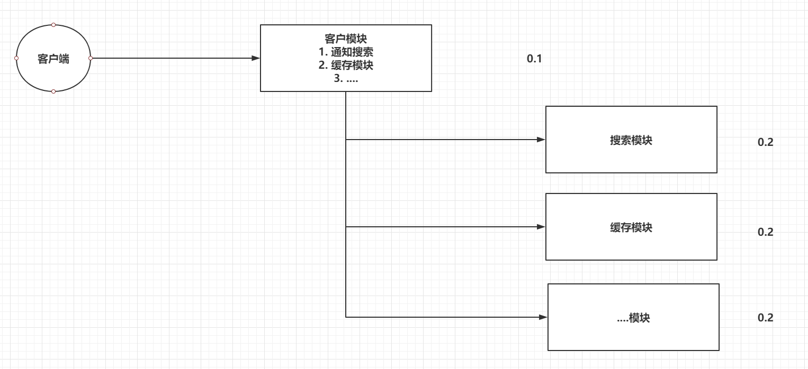 |


### 二、RabbitMQ介绍 

----

> 市面上比较火爆的几款MQ：
>
> ActiveMQ，RocketMQ，Kafka，RabbitMQ。
>
> - 语言的支持：ActiveMQ，RocketMQ只支持Java语言，Kafka可以支持多种语言，RabbitMQ支持多种语言。
>- 效率方面：ActiveMQ，RocketMQ，Kafka效率都是毫秒级别，RabbitMQ是微秒级别的。
> - 消息丢失，消息重复问题： RabbitMQ针对消息的持久化，和重复问题都有比较成熟的解决方案。
>
> - 学习成本：RabbitMQ非常简单。
>
> RabbitMQ是由Rabbit公司去研发和维护的，最终是在Pivotal。
>
> RabbitMQ严格的遵循AMQP协议，高级消息队列协议，帮助我们在进程之间传递异步消息。


### 三、RabbitMQ安装

----

```yml
version: "3.1"
services:
  rabbitmq:
    image: daocloud.io/library/rabbitmq:management
    restart: always
    container_name: rabbitmq
    ports:
      - 5672:5672 #消息端口
      - 15672:15672 #webui端口
    volumes:
      - ./data:/var/lib/rabbitmq
```

> 镜像management结尾的自带web页面,如果是management结尾的镜像,需要开启web访问界面,进入docker容器后执行命令 rabbitmq-plugins enable rabbitmq_management

### 四、RabbitMQ架构【`重点`】

----

#### 4.1 官方的简单架构图

> - Publisher - 生产者：发布消息到RabbitMQ中的Exchange
>- Consumer - 消费者：监听RabbitMQ中的Queue中的消息
> 
>- Exchange - 交换机：和生产者建立连接并接收生产者的消息
> 
>- Queue - 队列：Exchange会将消息分发到指定的Queue，Queue和消费者进行交互
> 
>- Routes - 路由：交换机以什么样的策略将消息发布到Queue

|   角色    |            图标            | 介绍 |
| :-------: | :------------------------: | :-----------------------------------------------------: |
| Publisher |  | *Producing* means nothing more than sending. A program that sends messages is a *producer* |
|   Queue   |     | *A queue* is the name for a post box which lives inside RabbitMQ. Although messages flow through RabbitMQ and your applications, they can `only be stored inside a *queue*`. A *queue* is only bound by the host's memory & disk limits, it's essentially a large message buffer. `Many *producers* can send messages that go to one queue, and many *consumers* can try to receive data from one *queue`* |
| Consumer  |  | *Consuming* has a similar meaning to receiving. A *consumer* is a program that mostly waits to receive messages: |
| Exchange |  | The core idea in the messaging model in RabbitMQ is that the `producer never sends any messages directly to a queue`. Actually, quite often the producer doesn't even know if a message will be delivered to any queue at all.    Instead, the `producer can only send messages to an *exchange*`. An exchange is a very simple thing. On one side it receives messages from producers and the other side it pushes them to queues. The exchange must know exactly what to do with a message it receives. |


|                简单架构图                 |
| :---------------------------------------: |
| 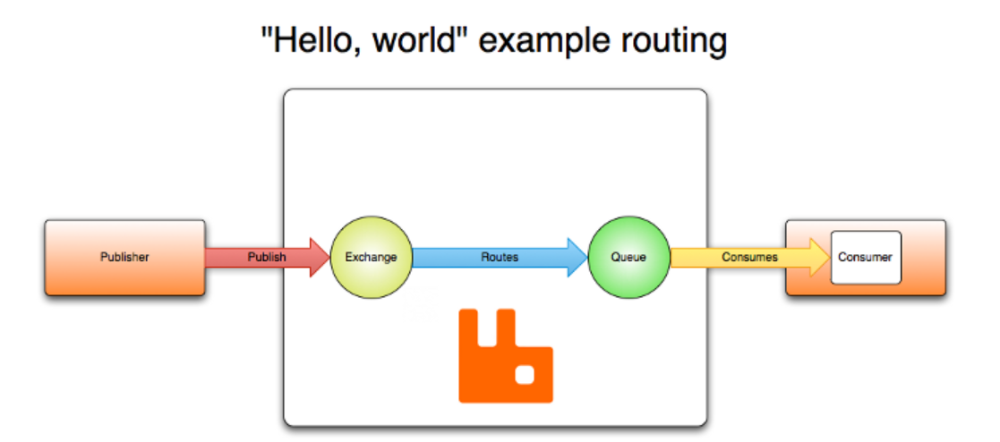 |


#### 4.2 RabbitMQ的完整架构图

> 完整架构图

|                完整架构图                 |
| :---------------------------------------: |
| 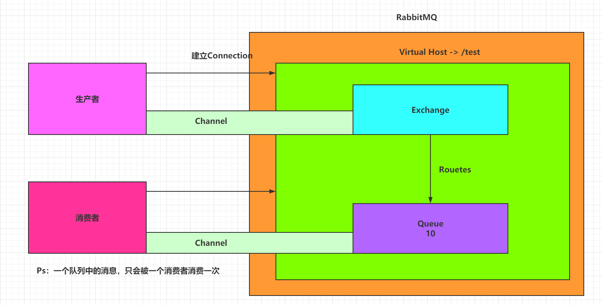 |


#### 4.3 查看图形化界面并创建一个Virtual Host

> 创建一个全新的用户和全新的Virtual Host，并且将test用户设置上可以操作/test的权限
>
> 虚拟主机可以隔离不同的请求,不同的虚拟主机下可以有相同的交换机和队列
>
> 每个虚拟主机分配不同的用户,这样防止连接错误的虚拟主机

|                 监控界面                  |
| :---------------------------------------: |
|  |


### 五、RabbitMQ的使用【`重点`】

----

#### 5.1 RabbitMQ的通讯方式

|                           通讯方式                           |
| :----------------------------------------------------------: |
| 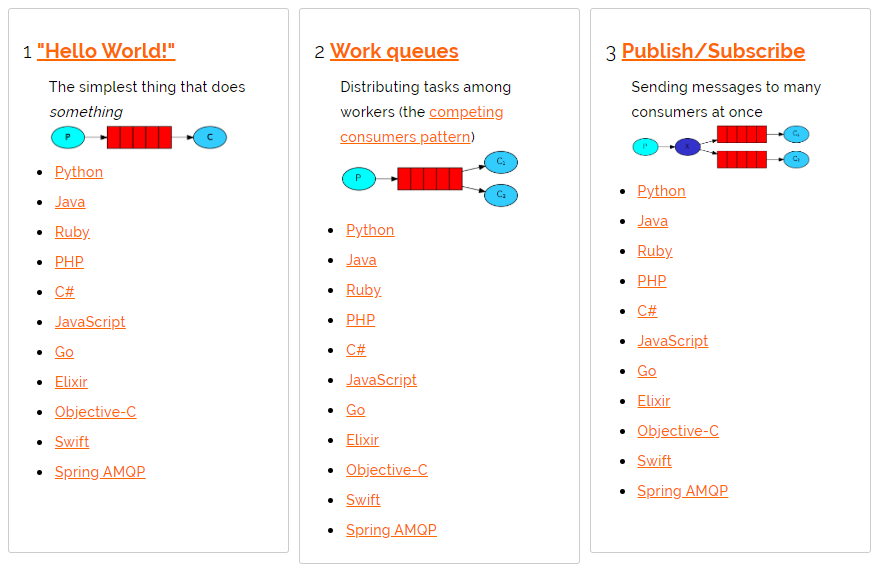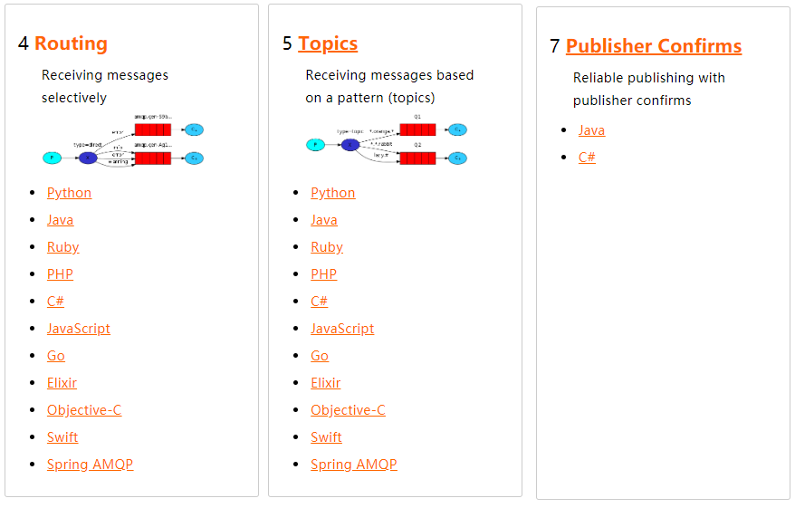 |


#### 5.2 Java连接RabbitMQ

##### 5.2.1 创建maven项目

> 本案例仅创建一个普通的java项目


##### 5.2.2 导入依赖

```xml
<dependencies>
    <dependency>
        <groupId>com.rabbitmq</groupId>
        <artifactId>amqp-client</artifactId>
        <version>5.6.0</version>
    </dependency>

    <dependency>
        <groupId>junit</groupId>
        <artifactId>junit</artifactId>
        <version>4.12</version>
    </dependency>
</dependencies>
```


##### 5.2.3 创建工具类连接RabbitMQ

```java
public static Connection getConnection(){
    // 创建Connection工厂
    ConnectionFactory factory = new ConnectionFactory();
    factory.setHost("192.168.199.109");//服务器地址
    factory.setPort(5672);//消息端口
    factory.setUsername("test");//用户名
    factory.setPassword("test");//密码
    factory.setVirtualHost("/test");//虚拟主机

    // 创建Connection
    Connection conn = null;
    try {
        conn = factory.newConnection();
    } catch (Exception e) {
        e.printStackTrace();
    }
    // 返回
    return conn;
}
```

|                  效果图                   |
| :---------------------------------------: |
| 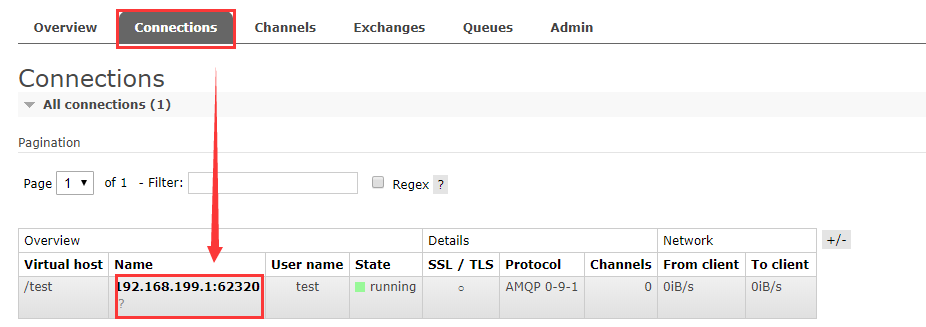 |


#### 5.3 Hello-World

> 一个生产者，一个默认的交换机，一个队列，一个消费者
>
> 看起来是生产者直接发送到队列,实际上是发送到了默认交换机


|                          默认交换机                          |
| :----------------------------------------------------------: |
| 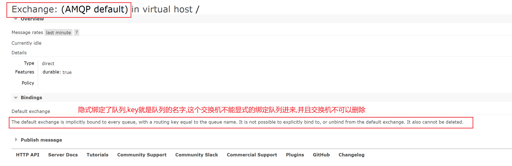 |


|                  结构图                   |
| :---------------------------------------: |
| 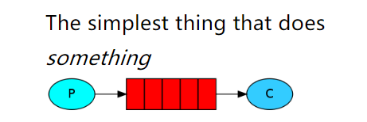 |


> 创建生产者，创建一个channel，发布消息到默认exchange，指定路由key是队列的名字。


##### 5.3.1 生产者

> 生产者发送消息

```java
@Test
public void publish() throws Exception {
    //1. 获取Connection
    Connection connection = RabbitMQClient.getConnection();

    //2. 创建Channel
    Channel channel = connection.createChannel();

    //3. 发布消息到exchange，同时指定路由的规则
    String msg = "Hello-World！";
    // 参数1：指定exchange，使用""。代表默认交换机
    // 参数2：指定路由的规则，使用具体的队列名称。
    // 参数3：指定传递的消息所携带的properties，使用null。
    // 参数4：指定发布的具体消息，byte[]类型
    channel.basicPublish("","HelloWorld",null,msg.getBytes());
    // Ps：exchange是不会帮你将消息持久化到本地的，Queue才会帮你持久化消息。
    System.out.println("生产者发布消息成功！");
    //4. 释放资源
    channel.close();
    connection.close();
}
```


##### 5.3.2 消费者

> 创建消费者，创建一个channel，创建一个队列，并且去消费当前队列


```java
@Test
public void consume() throws Exception {
    //1. 获取连接对象
    Connection connection = RabbitMQClient.getConnection();

    //2. 创建channel
    Channel channel = connection.createChannel();

    //3. 声明队列-HelloWorld
    //参数1：queue - 指定队列的名称
    //参数2：durable - 当前队列是否需要持久化（true）
    //参数3：exclusive：是否排外的，有两个作用，一：当连接关闭时connection.close()该队列是否会自动删除；二：该队列是否是私有的private，如果不是排外的，可以使用两个消费者都访问同一个队列，没有任何问题，如果是排外的，会对当前队列加锁，其他通道channel是不能访问的，如果强制访问会报异常：com.rabbitmq.client.ShutdownSignalException: channel error; protocol method: #method<channel.close>(reply-code=405, reply-text=RESOURCE_LOCKED - cannot obtain exclusive access to locked queue 'queue_name' in vhost '/', class-id=50, method-id=20)一般等于true的话用于一个队列只能有一个消费者来消费的场景
    //参数4：autoDelete - 如果这个队列没有消费者在消费，并且所有消息都消费完,队列自动删除
    //参数5：arguments - 指定当前队列的其他信息
    channel.queueDeclare("HelloWorld",true,false,false,null);

    //4. 开启监听Queue
    DefaultConsumer consume = new DefaultConsumer(channel){
        @Override
        public void handleDelivery(String consumerTag, Envelope envelope, AMQP.BasicProperties properties, byte[] body) throws IOException {
            System.out.println("接收到消息：" + new String(body,"UTF-8"));
        }
    };

    //参数1：queue - 指定消费哪个队列
    //参数2：autoAck - 指定是否自动ACK应答 （true，接收到消息后，会立即告诉RabbitMQ）
    //参数3：consumer - 指定消费回调
    channel.basicConsume("HelloWorld",true,consume);

    System.out.println("消费者开始监听队列！");
    // System.in.read();
    System.in.read();

    //5. 释放资源,消费者处于等待状态,不能释放资源,否则会收不到消息
   // channel.close();
   // connection.close();
}
```


#### 5.4 Work

> 一个生产者，一个默认的交换机，一个队列，多个消费者

|                  结构图                   |
| :---------------------------------------: |
| 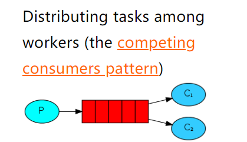 |


> 只需要在消费者端，添加Qos能力以及更改为手动ack即可让消费者，根据自己的能力去消费指定的消息，而不是默认情况下由RabbitMQ平均分配了，生产者不变(如果队列名字修改了则改名字)，正常发布消息到默认的exchange，并指定routing为队列名字


##### 5.4.1 消费者

> 因为work指的是同一个队列下的不同消费者的消费方式,所以生产者无代码变化

```java
@Test
public void consume() throws Exception {
//1. 获取连接对象
    Connection connection = RabbitMQClient.getConnection();

    //2. 创建channel
    Channel channel = connection.createChannel();

    //3. 声明队列-HelloWorld
    channel.queueDeclare("Work",true,false,false,null);

//4 指定当前消费者，一次最多消费多少个消息,只有本次消费应答后才会获取下一次指定数量消息
channel.basicQos(1);
DefaultConsumer consumer = new DefaultConsumer(channel){
    @Override
    public void handleDelivery(String consumerTag, Envelope envelope, AMQP.BasicProperties properties, byte[] body) throws IOException {
        try {
            Thread.sleep(100);//模拟处理时间
        } catch (InterruptedException e) {
            e.printStackTrace();
        }
        System.out.println("消费者1号接收到消息：" + new String(body,"UTF-8"));

        //2. 手动ack,因为不同的机器处理速度不一样,因此不同的机器会在不同时间应答,这样机器就可以根据实际能力处理了
        channel.basicAck(envelope.getDeliveryTag(),false);
    }
};
//3. 指定手动ack
channel.basicConsume("Work",false,consumer);
}
```


#### 5.5 Publish/Subscribe

> 一个生产者，一个交换机，多个队列，多个消费者(每个队列可以多个消费者)

|                  结构图                   |
| :---------------------------------------: |
| 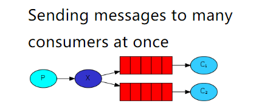 |
|            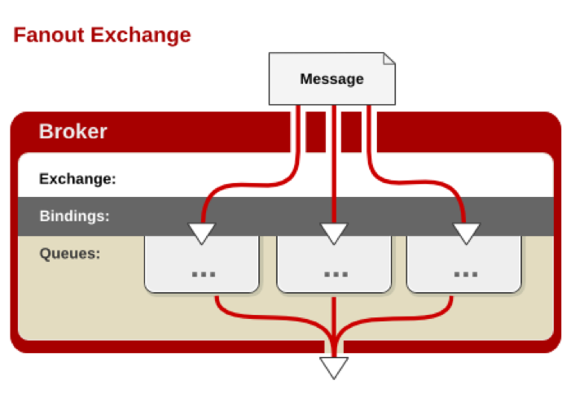            |


> 生产者和消费者都需要声明交换机,但是只会创建一次,避免任意一方使用时候交换机还没存在,
>
> 需要消费的消费者在代码中将自己绑定到对应的交换机中,
>
> 生产者向交换机发送消息即可


##### 5.5.1 消费者 

> 消费者代码 ,相同的业务使用同一个队列,不同的业务只是队列不一样

```java

public class Recv {
	//自己想要监听的交换机
   private static final String EXCHANGENAME = "test_exchange_fanout";
    private static final String QUEUENAME = "subqueue1";//自己的队列,不同的消费者集群使用不同的队列, 同一个消费者集群使用同一个队列,通过work模式分摊数据.

    public static void main(String[] args) throws Exception {
        Connection connection = ConnectionUtils.getConnection();//获取连接
        Channel channel = connection.createChannel();//相当于我们连接数据库的时候的 statment
        //声明队列,相当于我要声明我发送给谁,也就是手机号,如果队列不存在,则创建队列,如果存在则不做事情

        //参数1 交换机的名字
        //参数2 交换机类型
        channel.exchangeDeclare(EXCHANGENAME, "fanout");//交换机必须先声明后使用,不管是谁声明的,交换机必须要先存在

        channel.queueDeclare(QUEUENAME,false,false ,false,null);

        channel.queueBind(QUEUENAME, EXCHANGENAME, "");//将制定的队列绑定到指定的交换机上面,fanout没有key,所以用默认的key""


        channel.basicQos(1);//声明每次处理一个消息,只有处理完成并应答服务器之后才会处理下一条消息


        DefaultConsumer defaultConsumer=new DefaultConsumer(channel){
            @Override
            public void handleDelivery(String consumerTag, Envelope envelope, AMQP.BasicProperties properties, byte[] body) throws IOException {
                System.out.println("消费者1收到的内容是:"+new String(body));

                try {
                    Thread.sleep(10);
                } catch (InterruptedException e) {
                    e.printStackTrace();
                }
                //应答,告诉服务器我收到消息了
                channel.basicAck(envelope.getDeliveryTag(), false);
            }
        };

        channel.basicConsume(QUEUENAME, false, defaultConsumer);

    }
}
```


##### 5.5.2 生产者

> 向指定的交换机发送数据

```java
public class Send {

    private final static String EXCHANGE_NAME = "test_exchange_fanout";

    public static void main(String[] argv) throws Exception {
        // 获取到连接以及mq通道
        Connection connection = ConnectionUtil.getConnection();
        Channel channel = connection.createChannel();

        // 声明exchange
        channel.exchangeDeclare(EXCHANGE_NAME, "fanout");

        // 消息内容
        String message = "Hello World!";
        //将消息发送到交换机,如果此时没有队列绑定,则消息会丢失,因为交换机没有存储消息的能力,发送的时候不需要指定key
        channel.basicPublish(EXCHANGE_NAME, "", null, message.getBytes());
        System.out.println(" 发送消息 '" + message + "'");

        channel.close();
        connection.close();
    }
}
```


#### 5.6 Routing

> 一个生产者，一个交换机，多个队列，多个消费者

|                  结构图                   |
| :---------------------------------------: |
| 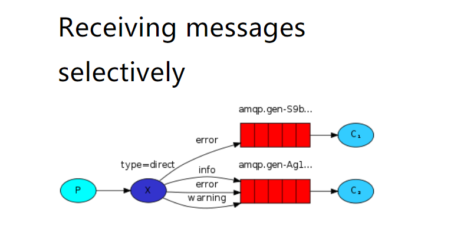 |
|            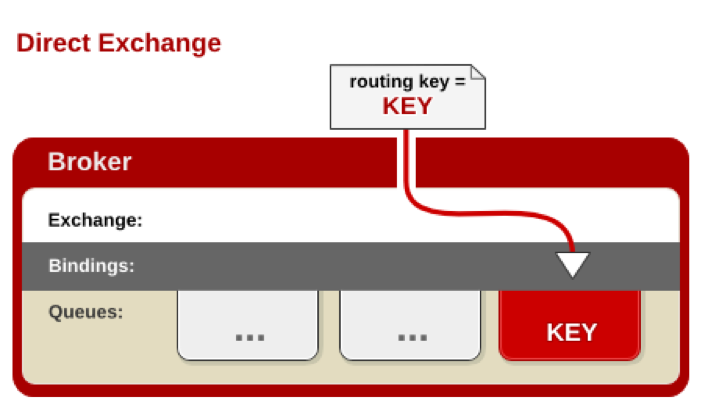            |


> 生产者将消息发送到了 type 为 direct 模式的交换机
>
> 消费者的队列在将自己绑定到路由的时候会给自己绑定一个 key
>
> 只有生产者发送对应 key 的消息时候 消费者才会收到消息
>
> 生产者只向交换机发送数据


##### 5.6.1 消费者1

```java
public class Recv {
    //要绑定的交换机
 private static final String EXCHANGENAME = "test_exchange_direct";
    //自己的队列名字,不同的业务集群使用不同的队列名
    private static final String QUEUENAME = "drectqueue1";

    public static void main(String[] args) throws Exception {
        Connection connection = ConnectionUtils.getConnection();//获取连接
        Channel channel = connection.createChannel();//相当于我们连接数据库的时候的 statment
        //声明队列,相当于我要声明我发送给谁,也就是手机号,如果队列不存在,则创建队列,如果存在则不做事情

        //参数1 交换机的名字
        //参数2 交换机类型
        channel.exchangeDeclare(EXCHANGENAME, "direct");//交换机必须先声明后使用,不管是谁声明的,交换机必须要先存在
		
        channel.queueDeclare(QUEUENAME,false,false ,false,null);
        // 绑定队列到交换机,绑定自己的关键字 key 为key,注意在绑定到指定路由(交换机)的时候,该路由必须存在,也就是我们必须先由发送者创建一个路由才可以
        channel.queueBind(QUEUENAME, EXCHANGENAME, "abc");
        //如果要绑定多个 key 多次执行即可
        channel.queueBind(QUEUENAME, EXCHANGENAME, "abcd");//将制定的队列绑定到指定的交换机上面
        channel.queueBind(QUEUENAME, EXCHANGENAME, "asdf");//将制定的队列绑定到指定的交换机上面
        channel.basicQos(1);//声明每次处理一个消息,只有处理完成并应答服务器之后才会处理下一条消息


        DefaultConsumer defaultConsumer=new DefaultConsumer(channel){
            @Override
            public void handleDelivery(String consumerTag, Envelope envelope, AMQP.BasicProperties properties, byte[] body) throws IOException {
                System.out.println("消费者1收到的内容是:"+new String(body));

                try {
                    Thread.sleep(10);
                } catch (InterruptedException e) {
                    e.printStackTrace();
                }
                //应答,告诉服务器我收到消息了
                channel.basicAck(envelope.getDeliveryTag(), false);
            }
        };
        // 监听队列，手动返回完成
        channel.basicConsume(QUEUENAME, false, defaultConsumer);

    }
}
```


##### 5.6.2 消费者2

> 不同的业务集群只需要不同的队列,绑定相同或者不同的key即可


```java

public class Recv2 {

    private static final String EXCHANGENAME = "directexchange";
    private static final String QUEUENAME = "drectqueue2";

    public static void main(String[] args) throws Exception {
        Connection connection = ConnectionUtils.getConnection();//获取连接
        Channel channel = connection.createChannel();//相当于我们连接数据库的时候的 statment
        //声明队列,相当于我要声明我发送给谁,也就是手机号,如果队列不存在,则创建队列,如果存在则不做事情

        //参数1 交换机的名字
        //参数2 交换机类型
        channel.exchangeDeclare(EXCHANGENAME, "direct");//交换机必须先声明后使用,不管是谁声明的,交换机必须要先存在

        channel.queueDeclare(QUEUENAME,false,false ,false,null);
        // 绑定队列到交换机,绑定自己的关键字 key 为key,注意在绑定到指定路由(交换机)的时候,该路由必须存在,也就是我们必须先由发送者创建一个路由才可以
        channel.queueBind(QUEUENAME, EXCHANGENAME, "abc");
        channel.basicQos(1);//声明每次处理一个消息,只有处理完成并应答服务器之后才会处理下一条消息


        DefaultConsumer defaultConsumer=new DefaultConsumer(channel){
            @Override
            public void handleDelivery(String consumerTag, Envelope envelope, AMQP.BasicProperties properties, byte[] body) throws IOException {
                System.out.println("消费者2222收到的内容是:"+new String(body));

                try {
                    Thread.sleep(10);
                } catch (InterruptedException e) {
                    e.printStackTrace();
                }
                //应答,告诉服务器我收到消息了
                channel.basicAck(envelope.getDeliveryTag(), false);
            }
        };
        // 监听队列，手动返回完成
        channel.basicConsume(QUEUENAME, false, defaultConsumer);

    }
}
```


##### 5.6.3 生产者

```java
public class Send {

    private final static String EXCHANGE_NAME = "test_exchange_direct";//路由名字

    public static void main(String[] argv) throws Exception {
        // 获取到连接以及mq通道
        Connection connection = ConnectionUtil.getConnection();
        Channel channel = connection.createChannel();

        // 声明exchange, type 是direct
        channel.exchangeDeclare(EXCHANGE_NAME, "direct");

        // 消息内容
        String message = "Hello World!";
        channel.basicPublish(EXCHANGE_NAME, "key2", null, message.getBytes()); //发送 key 为 key2的消息
        System.out.println(" 发送消息'" + message + "'");

        channel.close();
        connection.close();
    }
}
```


#### 5.7 Topic

> 一个生产者，一个交换机，多个队列，多个消费者

|                  结构图                   |
| :---------------------------------------: |
| 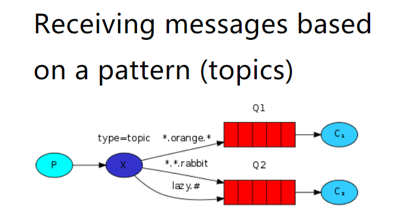 |
|            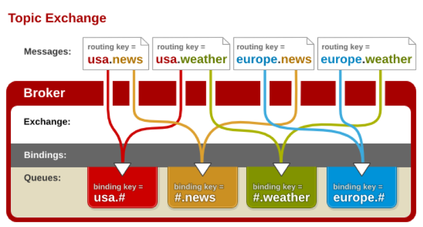            |


> 创建Topic的exchange,消费者将自己绑定到交换机中,在绑定的时候指定routtingkey,可以使用通配符,通配符分为 * 和# 两个,  * 可以匹配且仅匹配单个词, #可以匹配0-n个词, 词和词之间通过 . 分割,比如 a.*  a.b.*  a.# 等, 生产者发送的时候需要指定具体的key,这个key可以匹配哪个通配符,哪个消费者就可以收到消息
>
> - \* (star) can substitute for exactly one word.
> - \# (hash) can substitute for zero or more words.
> - 比如“audit.#”能够匹配到“audit.irs.corporate”甚至更多的 . ，但是“audit.*” 只会匹配到“audit.irs”


##### 5.7.1  消费者1

> 消费者是绑定队列到交换机的时候需要设置自己想要的key的通配符,可以指定多个


```java
public class Recv {
    //绑定的交换机
  private static final String EXCHANGENAME = "test_exchange_topic";
    //自己要消费的队列,不同的业务使用不同的队列
    private static final String QUEUENAME = "topicqueue1";

    public static void main(String[] args) throws Exception {
        Connection connection = ConnectionUtils.getConnection();//获取连接
        Channel channel = connection.createChannel();//相当于我们连接数据库的时候的 statment
        //声明队列,相当于我要声明我发送给谁,也就是手机号,如果队列不存在,则创建队列,如果存在则不做事情

		//参数1 交换机的名字
        //参数2 交换机类型
        channel.exchangeDeclare(EXCHANGENAME, "topic");//交换机必须先声明后使用,不管是谁声明的,交换机必须要先存在

        channel.queueDeclare(QUEUENAME,false,false ,false,null);
        //根据自己的需求绑定具体的key
        channel.queueBind(QUEUENAME, EXCHANGENAME, "key.*");
        channel.queueBind(QUEUENAME, EXCHANGENAME, "abc.#");//将指定的队列绑定到指定的交换机上面
        channel.queueBind(QUEUENAME, EXCHANGENAME, "*.aaa.#");//将指定的队列绑定到指定的交换机上面
        channel.basicQos(1);//声明每次处理一个消息,只有处理完成并应答服务器之后才会处理下一条消息


        DefaultConsumer defaultConsumer=new DefaultConsumer(channel){
            @Override
            public void handleDelivery(String consumerTag, Envelope envelope, AMQP.BasicProperties properties, byte[] body) throws IOException {
                System.out.println("消费者1收到的内容是:"+new String(body));

                try {
                    Thread.sleep(10);
                } catch (InterruptedException e) {
                    e.printStackTrace();
                }
                //应答,告诉服务器我收到消息了
                channel.basicAck(envelope.getDeliveryTag(), false);
            }
        };

        channel.basicConsume(QUEUENAME, false, defaultConsumer);

    }
}
```


##### 5.7.2 消费者 2

> 更多不同的消费者主要就是队列和绑定的key不一样

```java
public class Recv2 {
    //绑定的交换机
  private static final String EXCHANGENAME = "test_exchange_topic";
    //自己要消费的队列,不同的业务使用不同的队列
    private static final String QUEUENAME = "topicqueue1";
  
        Connection connection = ConnectionUtils.getConnection();//获取连接
        Channel channel = connection.createChannel();//相当于我们连接数据库的时候的 statment
        //声明队列,相当于我要声明我发送给谁,也就是手机号,如果队列不存在,则创建队列,如果存在则不做事情

		//参数1 交换机的名字
        //参数2 交换机类型
        channel.exchangeDeclare(EXCHANGENAME, "topic");//交换机必须先声明后使用,不管是谁声明的,交换机必须要先存在

        channel.queueDeclare(QUEUENAME,false,false ,false,null);

        channel.queueBind(QUEUENAME, EXCHANGENAME, "key.*");//将指定的队列绑定到指定的交换机上面
        channel.basicQos(1);//声明每次处理一个消息

        DefaultConsumer defaultConsumer=new DefaultConsumer(channel){
            @Override
            public void handleDelivery(String consumerTag, Envelope envelope, AMQP.BasicProperties properties, byte[] body) throws IOException {
                System.out.println("消费者2222收到的内容是:"+new String(body));

                try {
                    Thread.sleep(1000);
                } catch (InterruptedException e) {
                    e.printStackTrace();
                }
                //应答
                channel.basicAck(envelope.getDeliveryTag(), false);
            }
        };

        channel.basicConsume(QUEUENAME, false, defaultConsumer);
    }
}
```


##### 5.7.3 生产者

> 生产者发送消息的时候需要设置具体的key


```java
public class Send {

    private final static String EXCHANGE_NAME = "test_exchange_topic";

    public static void main(String[] argv) throws Exception {
        // 获取到连接以及mq通道
        Connection connection = ConnectionUtil.getConnection();
        Channel channel = connection.createChannel();

        // 声明exchange,声明为 topic 也就是通配符类型
        channel.exchangeDeclare(EXCHANGE_NAME, "topic");

        // 消息内容
        String message = "Hello World!";
        //发送 key.1 数据,凡是能匹配到这个关键词的都会收到
        channel.basicPublish(EXCHANGE_NAME, "key.1", null, message.getBytes());
        System.out.println(" 发送消息 '" + message + "'");

        channel.close();
        connection.close();
    }
}
```


### 六、RabbitMQ整合SpringBoot【`重点`】

----

#### 6.1 SpringBoot整合RabbitMQ

##### 6.1.1 创建SpringBoot工程

##### 6.1.2 导入依赖

```xml
<dependency>
    <groupId>org.springframework.boot</groupId>
    <artifactId>spring-boot-starter-amqp</artifactId>
</dependency>
<!--
方便发送数据
-->
  <dependency>
            <groupId>org.springframework.boot</groupId>
            <artifactId>spring-boot-starter-web</artifactId>
        </dependency>
```

##### 6.1.3 编写配置文件

```yml
spring:
  rabbitmq:
    host: 192.168.199.109
    port: 5672
    username: test
    password: test
    virtual-host: /test
```

##### 6.1.4 声明exchange、queue

```java
@Configuration
public class RabbitMQConfig {
    //1. 创建exchange - topic类型, 其他类型类名和对应类型一样,参考当前类名
    @Bean
    public TopicExchange getTopicExchange(){
        return new TopicExchange("boot-topic-exchange",true,false);
    }

    //2. 创建queue
    @Bean
    public Queue getQueue(){
        //参数是队列名
        return new Queue("boot-queue",true,false,false,null);
    }

    //3.绑定到一起
    @Bean
    public Binding getBinding(TopicExchange topicExchange,Queue queue){
        return BindingBuilder.bind(queue).to(topicExchange).with("*.red.*");
    }
}
```

##### 6.1.5 发布消息到RabbitMQ

```java
@RestController
public class TestController {

    private RabbitTemplate rabbitTemplate;//操作rabbit的模板对象

    @Autowired
    public void setRabbitTemplate(RabbitTemplate rabbitTemplate) {
        this.rabbitTemplate = rabbitTemplate;
    }

    @RequestMapping("/test1")
    public String test1(String msg) {
        rabbitTemplate.convertAndSend("boot-topic-exchange","slow.red.dog","红色大狼狗！！");
        return "sadadas";
    }
}
```

##### 6.1.6 创建消费者监听消息

```java
@Component
public class Consumer {

    @RabbitListener(queues = "boot-queue")
    public void getMessage(Object message){
        System.out.println("接收到消息：" + message);
    }

}
```


#### 6.2 手动Ack和QOS


##### 6.2.1 添加配置文件

```yml
spring:
  rabbitmq:
    listener:
      simple:
        acknowledge-mode: manual # 手动应答
        prefetch: 1 # qos
```


##### 6.2.2 手动ack

```java
@RabbitListener(queues = "boot-queue")
public void getMessage(String msg, Channel channel, Message message) throws IOException {
    System.out.println("接收到消息：" + msg);
    int i = 1 / 0;
    // 手动ack
    channel.basicAck(message.getMessageProperties().getDeliveryTag(),false);
}
```


### 七、RabbitMQ的其他操作

----

#### 7.1 消息的可靠性

> Rabbitmq会通过重试机制保证只要还有消费者的情况下一定能将消息推送到消费者上,但是前提条件是必须保证消息到达了服务端,那如何保证消息到达了服务端,rabbitmq给我们提供了confirm和return机制来保证,它主要是针对生产者的一种措施,所以代码都在生产者这边

##### 7.1.1 普通Confirm方式

> 发布确认,主要是保证消息一定能到交换机

```java
public class Sender {
    private static final String EXCHANGE_NAME = "sikejiaohuanji";

    public static void main(String[] args) throws Exception {
        Connection connection = ConnectionUtil.getConnection();//建立连接,相当于我们数据库中的建立连接
        //创建通道,相当于sql中statement
        Channel channel = connection.createChannel();
        channel.exchangeDeclare(EXCHANGE_NAME, "fanout");//声明交换机
        channel.confirmSelect();//开启confirm,后面会等待结果
        String message = "最后的疼爱是手放开";
        channel.basicPublish(EXCHANGE_NAME, "", null, message.getBytes(StandardCharsets.UTF_8));
        boolean confirms = channel.waitForConfirms();//是否发送成功,只保证达到服务端交换机,不保证到达队列
        System.err.println("--------------------->"+confirms);
        channel.close();
        connection.close();
    }
}
```


##### 7.1.2 批量Confirm方式。

> 在一次性发送多条消息的情况下,一起等待结果

```java
public class Sender2 {
    private static final String EXCHANGE_NAME = "sikejiaohuanji";

    public static void main(String[] args) throws Exception {
        Connection connection = ConnectionUtil.getConnection();//建立连接,相当于我们数据库中的建立连接
        //创建通道,相当于sql中statement
        Channel channel = connection.createChannel();
        channel.exchangeDeclare(EXCHANGE_NAME, "fanout");//声明交换机
        channel.confirmSelect();//开启confirm,后面会等待结果
        String message = "最后的疼爱是手放开";
        for (int i = 0; i < 100; i++) {
            channel.basicPublish(EXCHANGE_NAME, "", null, message.getBytes(StandardCharsets.UTF_8));
        }
        channel.waitForConfirmsOrDie();//要么全部发送成功,要么全部失败,类似于批量确认
        channel.close();
        connection.close();
    }
}
```


##### 7.1.3 异步Confirm方式。

> 通过子线程来监听结果

```java
public class SenderAsync {
    private static final String EXCHANGE_NAME = "sikejiaohuanji";

    public static void main(String[] args) throws Exception {
        Connection connection = ConnectionUtil.getConnection();//建立连接,相当于我们数据库中的建立连接
        //创建通道,相当于sql中statement
        Channel channel = connection.createChannel();
        channel.exchangeDeclare(EXCHANGE_NAME, "fanout");//声明交换机
        channel.confirmSelect();//开启confirm,后面会等待结果
        channel.addConfirmListener(new ConfirmListener() {
            @Override
            public void handleAck(long deliveryTag, boolean multiple) throws IOException {
                System.err.println("发送成功 标识" + deliveryTag + " 是否是批量发送" + multiple);
            }

            @Override
            public void handleNack(long deliveryTag, boolean multiple) throws IOException {
                System.err.println("发送shibai 标识" + deliveryTag + " 是否是批量发送" + multiple);

            }
        });
        String message = "最后的疼爱是手放开";
        channel.basicPublish(EXCHANGE_NAME, "", null, message.getBytes(StandardCharsets.UTF_8));

       // channel.close();
       // connection.close();
        System.in.read();//因为是异步的.所以不能退出成功,不能关闭连接
    }
}
```

|              消息传递可靠性               |
| :---------------------------------------: |
| 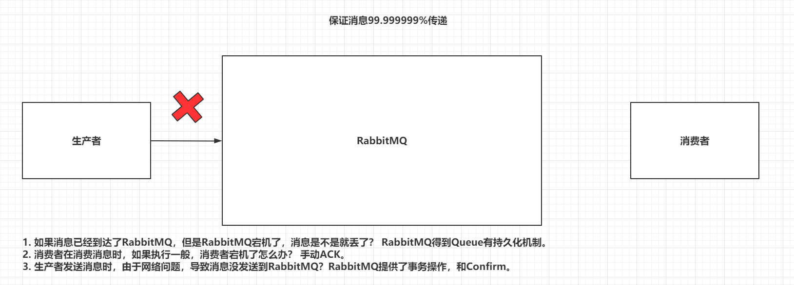 |


##### 7.1.4 Return机制

> Confirm只能保证消息到达exchange，无法保证消息可以被exchange分发到指定queue。
>
> 而且exchange是不能持久化消息的，queue是可以持久化消息。
>
> 采用Return机制来监听消息是否从exchange送到了指定的queue中

|              消息传递可靠性               |
| :---------------------------------------: |
| 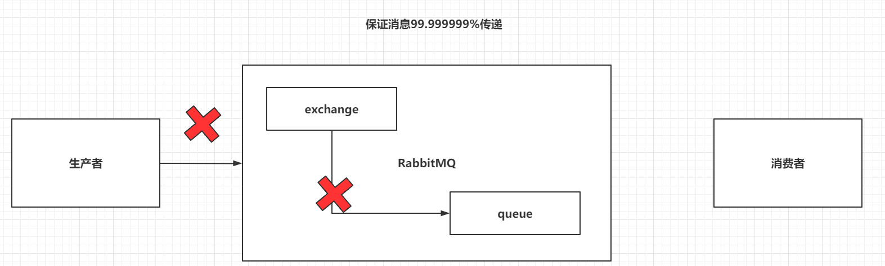 |


> `开启Return机制，并在发送消息时，指定mandatory为true`

```java
public class SenderAsync {
    private static final String EXCHANGE_NAME = "sikejiaohuanji";

    public static void main(String[] args) throws Exception {
        Connection connection = ConnectionUtil.getConnection();//建立连接,相当于我们数据库中的建立连接
        //创建通道,相当于sql中statement
        Channel channel = connection.createChannel();
        channel.exchangeDeclare(EXCHANGE_NAME, "fanout");//声明交换机

        channel.confirmSelect();//开启confirm,后面会等待结果
        channel.addConfirmListener(new ConfirmListener() {
            @Override
            public void handleAck(long deliveryTag, boolean multiple) throws IOException {
                System.err.println("发送到服务器成功 标识" + deliveryTag + " 是否是批量发送" + multiple);
            }

            @Override
            public void handleNack(long deliveryTag, boolean multiple) throws IOException {
                System.err.println("发送到服务器shibai 标识" + deliveryTag + " 是否是批量发送" + multiple);

            }
        });
        //RETURN代表退回
        channel.addReturnListener(new ReturnListener() {
            @Override
            public void handleReturn(int replyCode, String replyText, String exchange, String routingKey, AMQP.BasicProperties properties, byte[] body) throws IOException {
                System.err.println("消息没有送到到指定的目标");
            }
        });
        String message = "最后的疼爱是手放开";
        // 要想使用return机制, 发送的时候 参数3 mandatory参数必须设置true,代表没有送达到队列的时候会退回到生产者
        channel.basicPublish(EXCHANGE_NAME, "", true,null, message.getBytes(StandardCharsets.UTF_8));

       // channel.close();
       // connection.close();
        System.in.read();//因为是异步的.所以不能退出成功,不能关闭连接
    }
}
```


#### 7.2 SpringBoot实现

> 此代码在前面springboot整合基础上扩展


##### 7.2.1 编写配置文件

```yml
spring:
  rabbitmq:
    host: 192.168.199.109
    port: 5672
    username: test
    password: test
    virtual-host: /test
    publisher-confirm-type: simple #开启confirm
    publisher-returns: true #开启return
```


##### 7.2.2 开启Confirm和Return

```java
@Component
public class PublisherConfirmAndReturnConfig implements RabbitTemplate.ConfirmCallback ,RabbitTemplate.ReturnCallback {

    private RabbitTemplate rabbitTemplate;


    @Autowired
    public void setRabbitTemplate(RabbitTemplate rabbitTemplate) {
        this.rabbitTemplate = rabbitTemplate;
        rabbitTemplate.setConfirmCallback(this);
        rabbitTemplate.setReturnCallback(this);
    }

    /**
     * confirm用的
     *
     * @param correlationData correlation data for the callback.
     * @param ack             true for ack, false for nack true代表送达,false代表没有送达
     * @param cause           An optional cause, for nack, when available, otherwise null.
     */
    @Override
    public void confirm(CorrelationData correlationData, boolean ack, String cause) {
        if (ack) {
            System.err.println("送到");
        }else{
            System.err.println("未送达");
        }
    }

    @Override
    public void returnedMessage(Message message, int replyCode, String replyText, String exchange, String routingKey) {
        System.err.println("消息退回来了");
    }
}
```


#### 7.3 避免消息重复消费

> 重复消费消息，会对非幂等行操作造成问题,重复消费消息的原因是，消费者在消费消息后因为某些原因没有给RabbitMQ应答,导致MQ以为消息投递失败


|                 重复消费                  |
| :---------------------------------------: |
| 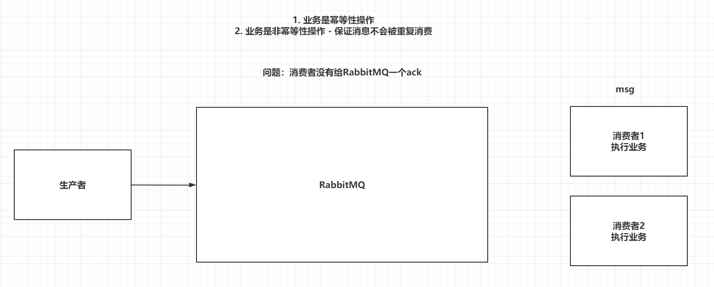 |


> 解决思路就是知道消息是不是消费了,所以肯定需要在某个地方将处理过的消息保存起来,比如我们可以给每个消息设置一个id,可以保存在消息的properties中,每次处理消息的时候先从Redis中查询这个id有没有处理过,没有就处理,然后保存到redis,可以将保存分为多个阶段,比如开始消费,消费到关键位置,消费完成,这样可以通过检查消息的阶段知道处理到什么地方了

> 生产者，发送消息时，指定messageId

```java
AMQP.BasicProperties properties = new AMQP.BasicProperties().builder()
    .deliveryMode(1)     //指定消息是否需要持久化 1 - 需要持久化  2 - 不需要持久化
    .messageId(UUID.randomUUID().toString())//这个id可以根据业务来决定,需要唯一性
    .build();
String msg = "Hello-World！";
channel.basicPublish("","HelloWorld",true,properties,msg.getBytes());
```


> 消费者，在消费消息时，根据具体业务逻辑去操作redis

```java
DefaultConsumer consume = new DefaultConsumer(channel){
    @Override
    public void handleDelivery(String consumerTag, Envelope envelope, AMQP.BasicProperties properties, byte[] body) throws IOException {
        Jedis jedis = new Jedis("192.168.199.109",6379);//redis的操作方式
        String messageId = properties.getMessageId();
        //1. setnx到Redis中，默认指定value-0
        String result = jedis.set(messageId, "0", "NX", "EX", 10);
        if(result != null && result.equalsIgnoreCase("OK")) {
            System.out.println("接收到消息：" + new String(body, "UTF-8"));
            //2. 消费成功，set messageId 1
            jedis.set(messageId,"1");
            channel.basicAck(envelope.getDeliveryTag(),false);
        }else {
            //3. 如果1中的setnx失败，获取key对应的value，如果是0，return，如果是1
            String s = jedis.get(messageId);
            if("1".equalsIgnoreCase(s)){
                channel.basicAck(envelope.getDeliveryTag(),false);
            }
        }
    }
};
```


##### 7.3.1 SpringBoot如何实现

> 此代码在上面的项目基础上修改

###### 7.3.1.1 导入依赖

```xml
<dependency>
    <groupId>org.springframework.boot</groupId>
    <artifactId>spring-boot-starter-data-redis</artifactId>
</dependency>
```


###### 7.3.1.2 编写配置文件

```yml
spring:
  redis:
    host: 192.168.199.109
    port: 6379
```


###### 7.3.1.3 修改生产者

```java
@RestController
public class TestController {

    private RabbitTemplate rabbitTemplate;//操作rabbit的模板对象

    @Autowired
    public void setRabbitTemplate(RabbitTemplate rabbitTemplate) {
        this.rabbitTemplate = rabbitTemplate;
    }

    @RequestMapping("/test1")
    public String test1(String msg) {
     CorrelationData messageId = new CorrelationData(UUID.randomUUID().toString());//此处id需要自己保证唯一性
        rabbitTemplate.convertAndSend("boot-topic-exchange", "slow.red.dog", msg,correlationData);
        return "sadadas";
    }
}
```


###### 7.3.1.4 修改消费者

```java
@Autowired
private StringRedisTemplate redisTemplate;


@RabbitListener(queues = "boot-queue")
public void getMessage(String msg, Channel channel, Message message) throws IOException {
    //0. 获取MessageId
    String messageId = message.getMessageProperties().getHeader("spring_returned_message_correlation");
    //1. 设置key到Redis
    if(redisTemplate.opsForValue().setIfAbsent(messageId,"0",10, TimeUnit.SECONDS)) {
        //2. 消费消息
        System.out.println("接收到消息：" + msg);

        //3. 设置key的value为1
        redisTemplate.opsForValue().set(messageId,"1",10,TimeUnit.SECONDS);
        //4.  手动ack
        channel.basicAck(message.getMessageProperties().getDeliveryTag(),false);
    }else {
        //5. 获取Redis中的value即可 如果是1，手动ack
        if("1".equalsIgnoreCase(redisTemplate.opsForValue().get(messageId))){
            channel.basicAck(message.getMessageProperties().getDeliveryTag(),false);
        }
    }
}
```


#### 7.4 RabbitMQ的优缺点

##### 7.4.1 优点

1. 解耦

> 我们的程序之间不同在直接建立请求关系,而是通过通知的方式来进行通信,双方都可以不用知道另外一方是谁

2. 削峰限流

> 我们的消息发出去后并不是一下子就全部给了消费者,我们的消费者可以通过qos来设置自己处理的速率,这样带来的好处就是消息发出去之后下游消费者不用担心数据量太大冲垮服务器,因为消费者可以自己根据自己的情况来决定以什么速度来消费消息

3. 可扩展性

> 受益于解耦,所以我们可以很方便进行扩展,不用担心功能扩展变化的时候需要修改业务代码


##### 7.4.2  缺点

> 增加了系统的复杂度,因为我们需要维护的地方增加了一个消息的服务器,并且增加了系统出现故障的概率


#### 7.5 理论题

##### 7.5.1 消息堆积

> 有大量的消息堆积在服务器没有被消费,导致服务器可能资源不足崩溃
>
> 我们在解决问题的时候一定要思考原因,什么原因导致的消息没有被消费? 是消费者太少了?消息太多消费不过来? 还是说消费者出现问题导致消息消费不了
>
> 如果是消费者太少就加机器,如果是消费者代表有bug要修复bug,修复是需要时间的,在这个时间内可能就已经崩溃了,所以我们应该有提前预案,就是弄一批消费者,他们只消费消息,并将数据写入到日志,然后等待bug修复后下线这些消费者,然后被写入到日志中的数据我们可以通过再次读取的方式读出来进行重新发送或者处理


##### 7.5.2 死信队列

> 如果消息超出设置的存活时间未被消费,或者消息队列中的消息数量超过队列最大值,如果我们设置了死信队列,那么消息会被丢到死信队列中,否则消息会被丢弃
