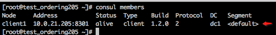
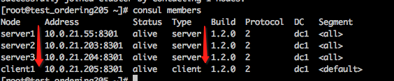
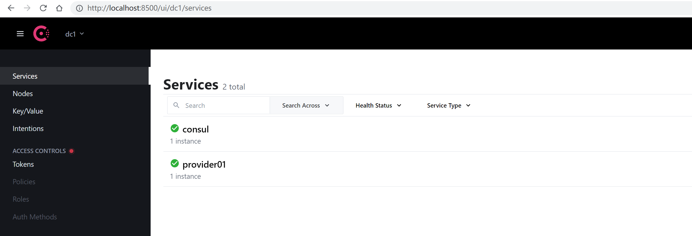
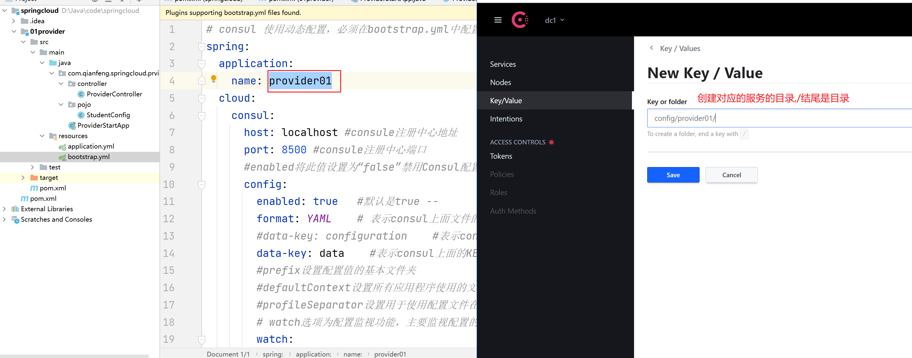
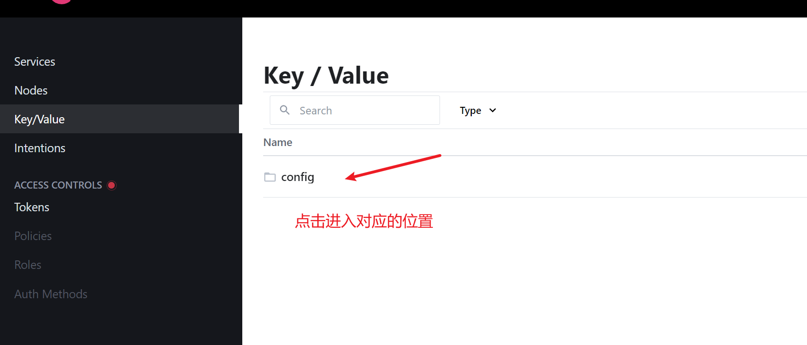
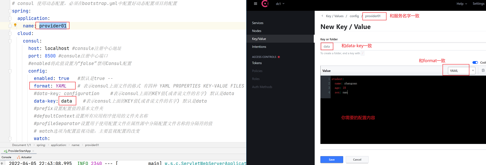
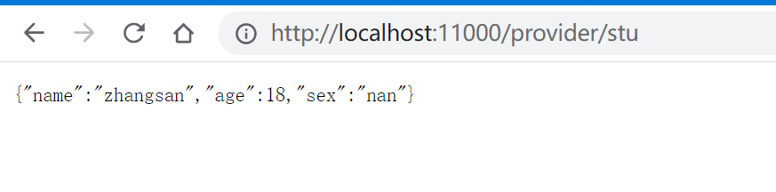
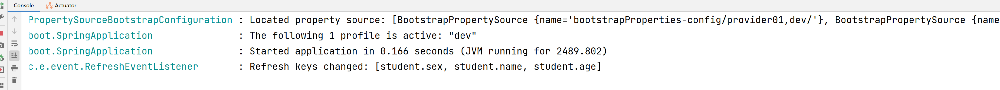
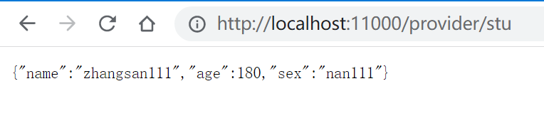

#  Consul 注册配置中心


##  一  Consul注册中心

### 1.1 consul介绍

>  Consul 用于实现分布式系统的服务发现与配置。与其他服务注册与发现相比，Consul更“一站式”，内置了服务注册与发现框架、分布一致性协议实现、健康检查、Key/Value存储、多数据中心方案，不再需要依赖其他工具（比如ZooKeeper等）。使用起来也较为简单。Consul使用Go语言编写，因此具有天然可移植性(支持Linux、windows和Mac OS X)；安装包仅包含一个可执行文件，方便部署，与Docker等轻量级容器可无缝配合。


### 1.2 consul下载

> consul 下载地址https://www.consul.io/downloads


### 1.3 consul启动

> 与其他配置中心一样,我们要使用必须先启动一个server端,然后在程序中通过配置来指定server的地址即可

#### 1.3.1 开发模式

> 我们在本地开发的时候只需使用开发模式即可,只需要下面命令即可
>
> 开发模式，自带了web ui，直接http://localhost:8500/ 即可，非常方便。　


```shell
consul agent -dev
```


#### 1.3.2 生产方式

> consul借助agent来运行，每个需要被发现的服务上，通过consul agent client 来收集服务本身的信息，然后向consul agent server汇报, consul server 可以集群部署。

`假设以下机器为consul集群的机器,我们打算组建3个server节点的consul server cluster，另外有1个client，模拟客户端以及充当consul的web admin ui(管理界面)。`

| 序号 |   节点ip    | 节点名称 |      角色       |
| :--: | :---------: | :------: | :-------------: |
|  1   | 10.0.21.55  | server1  |     server      |
|  2   | 10.0.21.203 | server2  |     server      |
|  3   | 10.0.21.204 | server3  |     server      |
|  4   | 10.0.21.205 | client1  | client & web ui |


###### 1.3.2.1 启动server

> 在每个server机器上安装好consul,此处环境为Linux系统,可以把解压后的consul 程序复制到/usr/local/bin,这样方便直接使用命令


```shell
# 前台运行,关闭终端会自动结束
consul agent -server -bind= 10.0.21.55 -client=0.0.0.0 -bootstrap-expect=3 -data-dir=/data/application/consul_data/ -node=server1
#后台运行
nohup consul agent -server -bind= 10.0.21.55 -client=0.0.0.0 -bootstrap-expect=3 -data-dir=/data/application/consul_data/ -node=server1 > /dev/null 2>&1 &
```

`参数介绍`

- -server 表示是以服务端身份启动

- -bind 表示绑定到哪个ip（有些服务器会绑定多块网卡，可以通过bind参数强制指定绑定的ip）

- -client 指定客户端访问的ip(consul有丰富的api接口，这里的客户端指浏览器或调用方)，0.0.0.0表示不限客户端ip,都可以访问consulserver

- -bootstrap-expect=3 表示server集群最低节点数为3，低于这个值将工作不正常(注：类似zookeeper一样，通常集群数为奇数，方便选举，consul采用的是raft算法)

- -data-dir 表示指定数据的存放目录（该目录必须存在）

- -node 表示节点在web ui中显示的名称


`启动成功后，终端窗口不要关闭，可以在浏览器里，访问下，类似 http://10.0.21.55:8500/，正常的话，应该会看到一行文字：Consul Agent。`


*另外2台节点上，也做类似操作：*


```shell
#第二个机器
nohup consul agent -server -bind=10.0.21.203 -client=0.0.0.0 -bootstrap-expect=3 -data-dir=/data/application/consul_data/ -node=server2 > /dev/null 2>&1 &
#第三个机器
nohup consul agent -server -bind=10.0.21.204 -client=0.0.0.0 -bootstrap-expect=3 -data-dir=/data/application/consul_data/ -node=server3 > /dev/null 2>&1 &

```


###### 1.3.2.2 启动client

> 几乎完全一样，只是把-server 去掉，在10.0.3.94上运行：


```shell
# 第四个客户端启动
nohup consul agent -client=0.0.0.0 -data-dir=/data/application/consul_data/ -node=client1  -ui  > /dev/null 2>&1 &
```


###### 1.3.3.3 组建集群

> 现在我们有了3个server node + 1个client node，但是这4个节点都是相互独立的，可以在任一节点上运行下面的命令

```shell 
consul members
```

|                         效果                         |
| :--------------------------------------------------: |
|  |


> 可以看到，只有自身节点的信息。要加自己加入集群，可以运行以下命令（假设：其它3个节点，都加入10.0.21.55）


```shell
consul join 10.0.21.55
```


>成功后，会输出：
>
>Successfully joined cluster by contacting 1 nodes.
>
>其它2个节点（指：10.0.21.55之外的节点）上类似上述操作，都加入集群中，完成后，可以再次执行consul members验证


|                         效果                         |
| :--------------------------------------------------: |
|  |


###### 1.3.3.4 退出集群

> 如果指定的机器要退出集群，可以在该节点上运行consul leave 即可


###### 1.3.3.5 访问

> 在10.0.21.205这个机器上,因为是client并且添加了-ui的启动参数,因为可以访问http://10.0.21.205:8500/ui 查看注册中心,剩余的使用情况和单机版一致


### 1.4  springcloud整合

#### 1.4.1 导入依赖

> 在实际开发中,我们需要通过项目和consul进行整合,因此需要先导入相关的依赖
>
> 在项目中导入下面的依赖即可,其他的依赖取决于项目其他需求,springboot和springcloud的基础依赖需要提前配置


```xml
  		<dependency>
            <groupId>org.springframework.cloud</groupId>
            <artifactId>spring-cloud-starter-consul-discovery</artifactId>
        </dependency>
```


#### 1.4.2 添加配置

> 注册中心使用很简单,只需要我们在配置文件中指定consul的地址和服务发现的相关设置即可,详情参考下面的配置文件


```yaml
spring:
  application:
    name: provider01 #在consul中如果使用这个值去注册,不能以数字开头
  cloud:
    inetutils:
      ignored-interfaces: [ 'VMware.*' ] #忽略以Vmware开头的网卡,防止注册服务的时候ip错误导致无法访问
    consul:
      host: localhost #consule注册中心地址
      port: 8500 #consule注册中心端口
      discovery: #下面的部分是consul的配置,很多配置本身就是默认值,只是介绍下
      	heartbeat:
          enabled: true #开启心跳检查
        enabled: true #开启服务发现
        # 启用服务注册,默认就是true
        register: true
        # 服务停止时取消注册
        deregister: true
        # 表示注册时使用IP而不是hostname
        prefer-ip-address: true
        # 执行监控检查的频率
        health-check-interval: 30s
        # 设置健康检查失败多长时间后，取消注册
        health-check-critical-timeout: 30s
        # 健康检查的路径
        health-check-path: /actuator/health
        # 服务注册标识，格式为：应用名称+服务器IP+端口
        instance-id: ${spring.application.name}:${spring.cloud.client.ip-address}:${server.port}
      #  service-name: ${spring.application.name} #和上面的id二选一即可
```


#### 1.4.3 启动主程序

> 启动springboot的主程序,在consul的页面中查看即可


|                            效果图                            |
| :----------------------------------------------------------: |
|  |


## 二 consul配置中心

> consul除了可以作为注册中心外还可以作为配置中心,相较于springcloud-config,可以实现自动监听刷新的功能


### 2.1 添加依赖

> consule的配置中心是单独的依赖,添加即可


```xml
  		<dependency>
            <groupId>org.springframework.cloud</groupId>
            <artifactId>spring-cloud-starter-consul-config</artifactId>
        </dependency>
```


### 2.2 配置程序

> 我们期望程序启动的时候自动从配置中心获取数据,因此我们需要告诉springcloud 我们要从配置中心获取数据


#### 2.2.1 定义数据

> 假设我们需要以下数据,数据从配置中心获取以student开头的数据

```java
@ConfigurationProperties(prefix = "student") //对应consul配置中心上 student 前缀开始的配置信息
@Component
public class StudentConfig {

    private String name;
    private int age;
    private String sex;

    public String getName() {
        return name;
    }

    public void setName(String name) {
        this.name = name;
    }

    public int getAge() {
        return age;
    }

    public void setAge(int age) {
        this.age = age;
    }

    public String getSex() {
        return sex;
    }

    public void setSex(String sex) {
        this.sex = sex;
    }

    @Override
    public String toString() {
        return "StudentConfig{" + "name='" + name + '\'' + ", age=" + age + ", sex='" + sex + '\'' + '}';
    }
}

```


#### 2.2.2 bootstrap.yml

> 通过这个文件进行配置,因为我们需要在程序初始化对象之前加载配置,所以只能在这个文件中加载

```yaml
# consul 使用动态配置，必须在bootstrap.yml中配置好动态配置项目的配置
spring:
  application:
    name: provider01 #在consul中如果使用这个值去注册,不能以数字开头,这个属性写在这里,application.yml就不需要了
  cloud:
    consul:
      host: localhost #consule注册中心地址,这个属性写在这里,application.yml就不需要了
      port: 8500 #consule注册中心端口,这个属性写在这里,application.yml就不需要了
      #enabled将此值设置为“false”禁用Consul配置
      config:
        enabled: true   #默认是true --
        format: YAML    # 表示consul上面文件的格式 有四种 YAML PROPERTIES KEY-VALUE FILES
        #data-key: configuration    #表示consul上面的KEY值(或者说文件的名字) 默认是data
        data-key: data    #表示consul上面的KEY值(或者说文件的名字) 默认是data
       # prefixes: config #设置配置值的基本文件夹,默认所有的服务的配置都放在config中
        #defaultContext # 设置所有应用程序使用的文件夹名称,默认和服务名字一样,
        #profileSeparator 设置用于使用配置文件在属性源中分隔配置文件名称的分隔符的值,比如xxx-dev.yml这种样子, 可以获取${spring.profiles.active}
        # 如果配置了上面的值,最终找的位置就是prefixes/defaultContext-profileSeparator/这个目录下的data-key配置
        # watch选项为配置监视功能，主要监视配置的改变
        watch:
          enabled: true
          delay: 10000
          wait-time: 30

```


#### 2.2.3 在配置中心创建配置

##### 2.2.3.1 创建服务对应的目录

> 根据配置文件中的配置,创建服务对应的目录, 默认情况下都是以config开头的目录

|                           创建配置                           |
| :----------------------------------------------------------: |
|  |


##### 2.2.3.2 进入对应的服务

> 要进入具体的服务页面才可以进行设置,在配置页面一层一层点进去

|                       找到指定服务配置                       |
| :----------------------------------------------------------: |
|  |


##### 2.2.3.3 添加数据

>在服务的名字页面再次点击创建配置,根据实际情况添加数据


|                           添加数据                           |
| :----------------------------------------------------------: |
|  |


#### 2.2.4 使用数据

> 通过一个很简单的controller返回我们的数据进行测试


```java
@RestController
@RequestMapping("/provider")
@RefreshScope //不要忘记添加这个注解,不然数据不会发生变化,如果属性是封装到某个类的对象中,则可以不用加
//如果是当前类的一个普通字符串变量,则需要添加这个属性
public class ProviderController {

    private StudentConfig studentConfig;

    @Autowired
    public void setStudentConfig(StudentConfig studentConfig) {
        this.studentConfig = studentConfig;
    }
	//返回数据,看看是不是和配置中心保持一致
    @GetMapping("/stu")
    public StudentConfig getConfig() {
        return studentConfig;
    }
}
```


#### 2.2.5动程序

> 启动程序并测,经过测试发现一致


|                           测试结果                           |
| :----------------------------------------------------------: |
|  |


#### 2.2.6 修改数据测试

> 从配置中心刚才的网页中修改数据并进行测试,控制台会立刻提示刷新配置


|                           刷新配置                           |
| :----------------------------------------------------------: |
|  |


`访问接口,数据也会发生变化`

|                           网页结果                           |
| :----------------------------------------------------------: |
|  |

