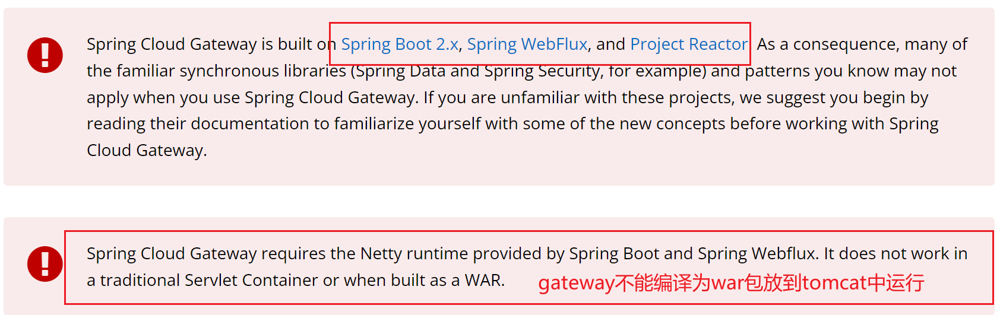
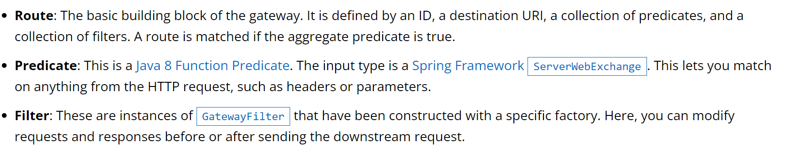
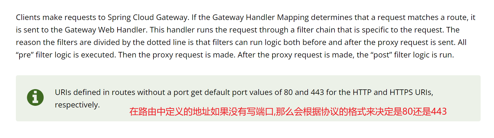
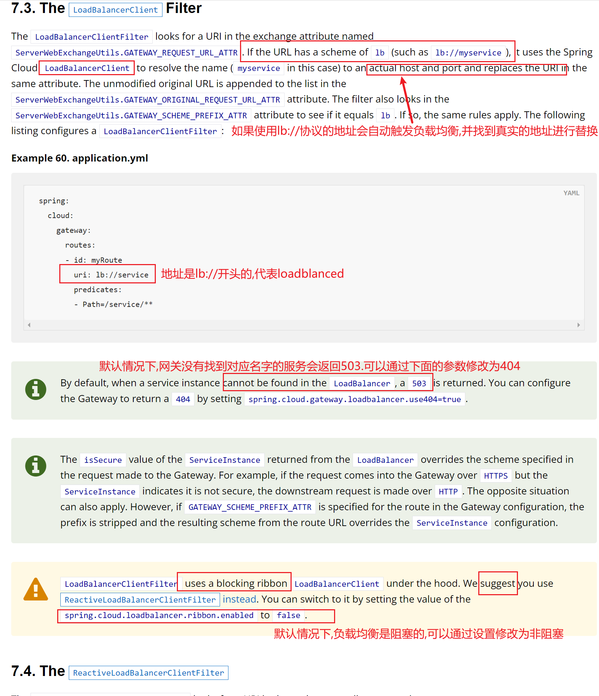
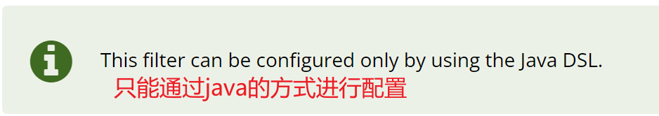
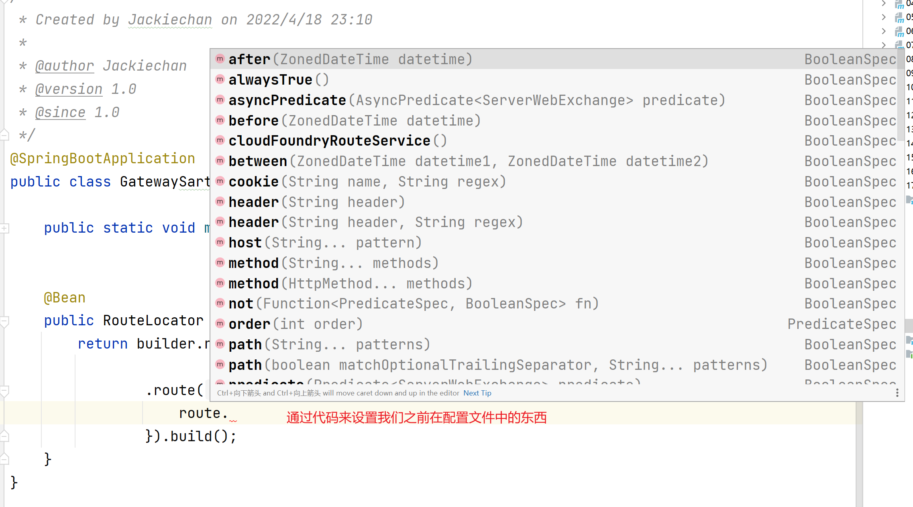
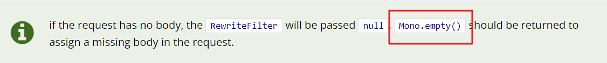
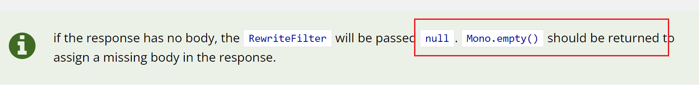
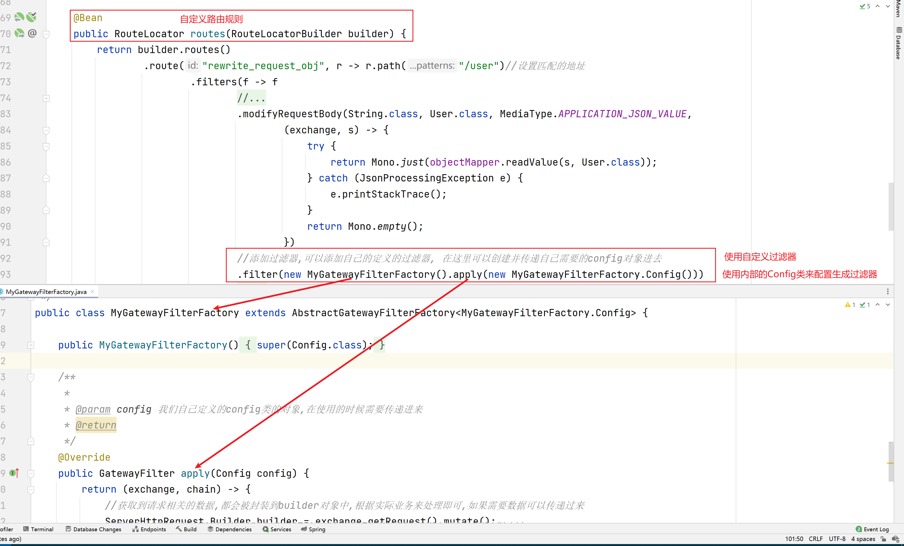

# 												Gateway

##  一 介绍

### 1.1 gateway介绍

> Spring Cloud GateWay是Spring Cloud的⼀个全新项⽬，⽬标是取代Netflix Zuul，基于Spring5.0+SpringBoot2.0+WebFlux（基于⾼性能的Reactor模式响应式通信框架Netty，异步⾮阻塞模型）等技术开发，性能⾼于Zuul，官⽅测试，GateWay是Zuul的1.6倍，旨在为微服务架构提供⼀种简单有效的统⼀的API路由管理⽅式

`在项目中使用网关需要导入下面的依赖,需要是springcloud项目`

```xml
        <dependency>
            <groupId>org.springframework.cloud</groupId>
            <artifactId>spring-cloud-starter-gateway</artifactId>
        </dependency>

```


|                             介绍                             |
| :----------------------------------------------------------: |
|  |


### 1.2 术语介绍

> gateway中包含以下术语

- **Route**: 路由,主要的功能就是将请求转发到对应的服务端点,包含一个唯一的路由id,一个目标的url,一系列断言的集合,一组filter过滤器,当断言条件为true的时候就会执行这个路由


- **Predicate**:  断言,主要是判断当前访问网关的地址应该执行哪个路由,转发到什么地方,可以通过判断请求中的任何数据来决定结果,比如可以判断请求头header,请求参数等


- **Filter**: 过滤器,和servlet中的过滤器类似,主要是在请求转发之前和返回结果之前进行相关的处理


|                             术语                             |
| :----------------------------------------------------------: |
|  |


### 1.3 网关如何工作

> 下图描述了网关如何工作,当网关收到请求的时候,会根据定义好的路由映射进行匹配,查看当前的请求地址能够匹配那个mapping, 然后将相关的请求发送到下面的web handler, handler中有一些过滤器组成了责任链对请求进行pre处理,然后最终送达到响应的服务器,在目标返回结果之后再通过过滤器进行post处理,最终返回给调用这个,过滤器的虚线用于区分是前置处理还是后置处理,其实整体过程类似于SpringMVC


|                          工作流程图                          |
| :----------------------------------------------------------: |
|  |


|                           流程介绍                           |
| :----------------------------------------------------------: |
|  |


##  二 断言

> 断言的作用就是做boolean判断,为true则代表符合当前的路由,会转发到对应的地址,Gateway 提供了很多断言的方式,可以让我们对请求进行匹配映射,并且可以多种断言同时使用
>
> 断言语法: 方式=值


### 2.1 Path断言

> 当请求的地址匹配当前path的时候会执行当前路由

```yaml
predicates:
    - Path=/mg
```


`示例,下面的断言方式和这里一样`

```yaml
spring:
  application:
    name: gateway
  cloud:
    gateway:
      routes:
        - id: 08consumer-eureka-feign # 当前路由策略的唯一ID,可以随便写,但是如果出现多个id,必须唯一
          uri: http://localhost:12000 #当前路由指向的真实地址,这个地址是不是最终真实地址,最终地址会拼接上访问地址
          predicates: #配置断言, 符合下面断言的请求会转发到上面的url,断言很多种条件
            - Path=/order/**  #断言的条件是请求的地址符合这个表达式,注意格式为Path=/order/**
```


### 2.2 Query断言

> 参数值可以写正则，也可以只写参数名,在传递了符合的参数名和值之后会转发到对应的url

```yaml
predicates:
	- Query=name,ba. #要求必须传递一个参数名叫name 值为ba开头的数据 .是匹配一个字符 *匹配N个相同的字符 ,  .*可以匹配任何内容
```
### 2.3 Method断言

> 当请求方式匹配的时候执行当前路由

```yaml
predicates:
	- Method=get
```

### 2.4 Host断言

> 当是通过指定域名访问当前网关的时候执行对应的路由

```yaml
predicates:
	- Host=localhost:8080
```
### 2.5 Cookie断言

> 当包含某个cookie和值的时候执行

```yaml
predicates:
	- Cookie=name,yiming
```
### 2.6 Header断言

> 当包含某个header和对应的值的时候执行

```yaml
predicates:
	- Header=reqId,9090\d+ #正则表达式\d+ 数字
```
### 2.7 Weight 权重路由

> 权重是将相同的请求分配到不同的服务器, Weight后的第一个参数一致的时候通过后面的数字按照比例分配请求

```yaml
- id: weight2 #这个id唯一即可
  uri: http://localhost:12000
  predicates:
    - Path=/order/** #访问的地址
    - Weight=group1,2 #这个值用来控制访问当前地址的时候有多少请求会来这个地方,group1随便写的
  
- id: weight8 #唯一id
  uri: http://localhost:12001
  predicates:
    - Path=/order/** #这个地址和上面的地址一样
    - Weight=group1,8 #这里的group1要和上面一样,才会视为一组需要权重划分的操作
```


### 2.9 Before 时间路由

> 指定一个时间,在当前时间之前可以访问,可以用于定时停机

```yaml
predicates:
	- Before=2022-04-19T00:05:00.789+08:00[Asia/Shanghai]
```


### 2.10 After 时间路由

> 指定一个时间,在当前时间之后可以访问,可以用于定时开启

```yaml
predicates:
	- After=2022-04-19T00:05:00.789+08:00[Asia/Shanghai]
```

### 2.11 Between时间区间路由

> 在指定的时间区间内可以访问

```yaml
predicates:
	- Between=2021-04-19T00:05:00.789+08:00[Asia/Shanghai],2022-04-19T00:05:00.789+08:00[Asia/Shanghai]
```


### 2.12    RemoteAddr

> 必须来自于某个地址发起的请求才可以访问

```yaml
predicates:
	- RemoteAddr=192.168.1.1/24 #注意这个如果是本地localhost测试,并且设置了Host=localhost 那么就无法访问了,因为通过localhost服务端得到的你的ip是0:0:0:0:0:0:0:1,那就无法匹配这个地址了
```


##  三  动态转发

> 上面的例子中我们的目的地址是直接写死的一个服务器,实际开发中肯定是动态从注册中心中获取
>
> 此处以Eureka为例子,其他的注册中心只需要替换对应的 注册中心配置即可


### 3.1 整合注册中心

#### 3.1.1 添加eureka依赖

> 其它的注册中心导入对应依赖,并在配置文件中指定注册中心即可

```xml
        <dependency>
            <groupId>org.springframework.cloud</groupId>
            <artifactId>spring-cloud-starter-netflix-eureka-client</artifactId>
        </dependency>
```

#### 3.1.2 配置

> 我们需要给网关配置注册中心的位置,并且告诉gateway从注册中心中获取服务,需要将url变成lb开头的协议


```yaml
spring:
  application:
    name: gateway
  cloud:
    inetutils:
      ignored-interfaces: [ 'VMware.*' ]  #经过测试,我们发现我们的电脑上存在多个网卡的时候, 程序注册到注册中心的时候可能会带错ip过去,比如把虚拟机的网卡ip带过去了,如果是本机内部使用没问题,但是阔机器就不行了# 忽略掉我们不想要的网卡
    gateway:
      routes:
        - id: 08consumer-eureka-feign # 当前路由策略的唯一ID,可以随便写
          uri: lb://08CONSUMER-EUREKA-FEIGN #lb开头代表是负载均衡,意味着需要从注册中心获取数据,获取的是当前名字的服务地址
          predicates: #配置断言, 符合下面断言的请求会转发到上面的url,断言很多种条件
            - Path=/order/**  #断言的条件是请求的地址符合这个表达式,注意格式为Path=/order/**
    loadbalancer: #设置负载均衡
      ribbon:
        enabled: false #设置不用ribbon的负载均衡方式,因为它是阻塞的,设置为false后会自动变为非阻塞
#配置注册中心
eureka:
  client:
    service-url:
      defaultZone: http://localhost:10000/eureka/
  instance:
    prefer-ip-address: true #在注册中心显示的是ip,而不是机器名
```


> 上面的方式是因为gateway中有默认的一个[ The `LoadBalancerClient` Filter](https://docs.spring.io/spring-cloud-gateway/docs/2.2.9.RELEASE/reference/html/#the-loadbalancerclient-filter),他的主要作用是用于进行负载均衡,当我们的uri是lb://开头的地址的时候会触发负载均衡的规则,不过LoadBalancerClientFilter 默认是阻塞操作,建议使用[ `ReactiveLoadBalancerClientFilter`](https://docs.spring.io/spring-cloud-gateway/docs/2.2.9.RELEASE/reference/html/#reactive-loadbalancer-client-filter) 非阻塞操作,使用方式很简单,只需要设置spring.cloud.loadbalancer.ribbon.enabled属性为false即可,别的不需要动
>
> 注意如果网关找不到对应的服务会提示`503`


|                         负载均衡介绍                         |
| :----------------------------------------------------------: |
|  |


### 3.2 服务名称转发

> 上面的例子中,我们将/order/**映射到了08CONSUMER-EUREKA-FEIGN服务中,并且从注册中心中获取到了地址,
>
> 但是实际开发中我们的网关能处理的地址可能非常多,那就需要设置非常多的配置,这样比较麻烦,因此我们可以通过服务名称转发,我们只需要通过 `http://网关/服务名/地址`的方式访问


```yaml
spring:
  application:
    name: gateway
  cloud:
    inetutils:
      ignored-interfaces: [ 'VMware.*' ]  #经过测试,我们发现我们的电脑上存在多个网卡的时候, 程序注册到注册中心的时候可能会带错ip过去,比如把虚拟机的网卡ip带过去了,如果是本机内部使用没问题,但是阔机器就不行了# 忽略掉我们不想要的网卡
    gateway:
      discovery:
        locator:
          enabled: true #开启基于服务名字的发现,需要在访问地址前先添加服务的名字
          lower-case-service-id: true #将服务名字小写
    loadbalancer:
      ribbon:
        enabled: false #设置不用ribbon的负载均衡方式,因为它是阻塞的,设置为false后会自动变为非阻塞
#配置注册中心
eureka:
  client:
    service-url:
      defaultZone: http://localhost:10000/eureka/
  instance:
    prefer-ip-address: true #在注册中心显示的是ip,而不是机器名
```


##  四 Filter过滤器

> gateway中过滤器主要分为网关(路由)过滤器和全局过滤器两个,网关(路由)过滤器主要是个某个服务指定的过滤器,全局过滤器主要是给所有的路由设置的


### 4.1 网关过滤器

> 网关过滤器用于拦截并通过责任链处理web请求,修改http的请求传入数据和http响应的传出数据,可以实现AOP处理我们的与应用无关的操作,比如安全控制等,主要包含路径过滤器,header过滤器,参数过滤器,body过滤器,状态过滤器,会话过滤器,重定向过滤器,重试过滤器,限流RateLimiter过滤器,熔断器过滤器

#### 4.1.1 Path过滤器

> path过滤器主要是和请求路径相关的一些过滤


##### 4.1.1.1  RewritePathGatewayFilter

> 这个过滤器的主要作用是重写路径, 可以将我们的请求地址从A重写为B再进行访问

```yaml
      routes:
        - id: 08consumer-eureka-feign # 当前路由策略的唯一ID,可以随便写
          uri: lb://08CONSUMER-EUREKA-FEIGN #lb开头代表是负载均衡,意味着需要从注册中心获取数据
          predicates: #配置断言, 符合下面断言的请求会转发到上面的url,断言很多种条件
            - Path=/abc/order/**  #断言的条件是请求的地址符合这个表达式,注意格式为Path=/abc/order/**
          filters:
            - RewritePath=/abc(?<segment>/?.*), $\{segment} # 将/abc/order/**重写为/order/**,可以帮我们去掉前缀
```

##### 4.1.1.2  PrefixPathGatewayFilter

> 这个过滤器的主要作用是给对应路由的添加一个统一的请求前缀地址


```yaml
      routes:
        - id: 08consumer-eureka-feign # 当前路由策略的唯一ID,可以随便写
          uri: lb://08CONSUMER-EUREKA-FEIGN #lb开头代表是负载均衡,意味着需要从注册中心获取数据
          predicates: #配置断言, 符合下面断言的请求会转发到上面的url,断言很多种条件
            - Path=/**  #断言的条件是请求的地址符合这个表达式
          filters:
            - PrefixPath=/order #网关内部实际的访问地址要在上面的path前面添加这个前缀,需要注意,拼接完之后的地址需要在对应的服务中真实存在,否则会提示404,比如我们请求网关localhost:8080/1实际访问的是对应服务的/order/1这个地址
```


##### 4.1.1.3 StripPrefixGatewayFilter

> 这个过滤器的主要作用是将用户的实际请求地址跳过一部分后进行重写转发,这样我们可以要求用户多传递某些路径,我们在内部裁剪后才访问,可以不暴露真实地址


```yaml
      routes:
        - id: 08consumer-eureka-feign # 当前路由策略的唯一ID,可以随便写
          uri: lb://08CONSUMER-EUREKA-FEIGN #lb开头代表是负载均衡,意味着需要从注册中心获取数据
          predicates: #配置断言, 符合下面断言的请求会转发到上面的url,断言很多种条件
            - Path=/abc/def/order/**  #断言的条件是请求的地址符合这个表达式
          filters:
            #作用是将真实的请求地址的前面两层路径去掉,比如实际访问的地址是 /abc/def/order/1,会被修改为/order/1,想去掉几层写几
            - StripPrefix=2
```


##### 4.1.1.4 SetPathGatewayFilter

> 这个过滤器的作用是将请求路径从A转成B,并且可以将A中的某个参数的值填写到B地址中


```yaml
      routes:
        - id: 08consumer-eureka-feign # 当前路由策略的唯一ID,可以随便写
          uri: lb://08CONSUMER-EUREKA-FEIGN #lb开头代表是负载均衡,意味着需要从注册中心获取数据
          predicates: #配置断言, 符合下面断言的请求会转发到上面的url,断言很多种条件
            - Path=/abc/def/aaa/{segment}  # 请求网关的时候必须匹配当前的路径格式, 最后的{segment}想当于 pathvariable
          filters:
            #将上面的请求地址转成下面的格式, 并将对应的参数设置到这里来,参数名和参数名对应即可
            - SetPath=/order/{segment}
```


##### 4.1.1.5 RedirectToGatewayFilter

> 重定向过滤器,向客户端返回指定的重定向地址


```yaml
      routes:
        - id: 08consumer-eureka-feign # 当前路由策略的唯一ID,可以随便写
          uri: lb://08CONSUMER-EUREKA-FEIGN #lb开头代表是负载均衡,意味着需要从注册中心获取数据
          predicates: #配置断言, 符合下面断言的请求会转发到上面的url,断言很多种条件
            - Path=/abc/def/aaa/{segment}  # 请求网关的时候必须匹配当前的路径格式      
          filters:
            - RedirectTo=302, https://www.baidu.com #设置重定向,返回状态码302,重定向到https://www.baidu.com
```


#### 4.1.2  参数过滤器

##### 4.1.2.1 AddRequestParameter

> 这个过滤器的作用是网关会向下游服务添加某个参数,这样可以在不需要客户端传递某个参数的情况下传递额外参数,比如当前网关的标识等


```yaml
spring:
  cloud:
    gateway:
      routes:
        - id: 08consumer-eureka-feign # 当前路由策略的唯一ID,可以随便写
        uri: lb://08CONSUMER-EUREKA-FEIGN #lb开头代表是负载均衡,意味着需要从注册中心获取数据
        predicates:
        	- Host: {segment}.myhost.org #必须是通过某个域名请求的才可以访问
        filters:
        	- AddRequestParameter=foo, bar-{segment} #向下游添加一个名字叫foo,值为bar-{segment}的内容的数据,这个数据可以写死,也可以通过表达式获取,类似于上面pathvariable,根据实际情况决定	
```


##### 4.1.2.2 RemoveRequestParameter

> 这个的作用是将客户端传递的某个参数移除,不传递到下游服务


```yaml
	routes:
        - id: 08consumer-eureka-feign # 当前路由策略的唯一ID,可以随便写
          uri: lb://08CONSUMER-EUREKA-FEIGN #lb开头代表是负载均衡,意味着需要从注册中心获取数据
          predicates: #配置断言, 符合下面断言的请求会转发到上面的url,断言很多种条件
            - Path=/test3333  # 请求网关的时候必须匹配当前的路径格式
          filters:
       	 	- RemoveRequestParameter=name #删除客户端传递的名字叫name的参数
```


#### 4.1.3 状态过滤器


##### 4.1.3.1 SetStatusGatewayFilter

>这个过滤器的主要作用是返回全局的状态码,不管是什么结果都返回指定的状态码


```yaml
      routes:
        - id: 08consumer-eureka-feign # 当前路由策略的唯一ID,可以随便写
          uri: lb://08CONSUMER-EUREKA-FEIGN #lb开头代表是负载均衡,意味着需要从注册中心获取数据
          predicates: #配置断言, 符合下面断言的请求会转发到上面的url,断言很多种条件
            - Path=/** # 请求网关的时候必须匹配当前的路径格式
          filters:
            #设置统一的状态码,不管怎么着都会返回404,注意要查看网络请求返回的状态码,不要只看页面,这里也可以写常量的名字
            - SetStatus=404
```


#### 4.1.4 Header头部过滤器

> 这些过滤器的操作都是和header相关的,包括添加,删除值等


##### 4.1.4.1 AddRequestHeaderGatewayFilter

> 这个过滤器是向请求头中添加header,并传递到下游服务


```yaml
        filters:
        	- AddRequestHeader=X-Request-red, blue #向下游服务添加名字叫X-Request-red值为blue的请求头,这个头中的数据也可以向上面的过滤器一样,来自于其他配置参数的pathvariable
```


##### 4.1.4.2 AddResponseHeaderGatewayFilter

> 这个过滤器的主要作用是向客户端的响应添加响应头的


```yaml
        filters:
        	- AddResponseHeader=foo, bar-{segment} #向客户端添加一个名字叫foo, 值叫bar-{segment}的数据,{segment}的值取决于配置的其他数据,类似于上面的的过滤器的pathvariable
```


##### 4.1.4.3 RemoveRequestHeader

> 此过滤器的作用是将客户端传递的某个请求头删除,不向下游服务传递


```yaml
        filters:
        	- RemoveRequestHeader=X-Request-Foo #移除名字叫X-Request-Foo的请求头
```


##### 4.1.4.4 RemoveResponseHeader

> 这个过滤器的作用是将下游服务返回给我们的某个响应头删除,不返回给客户端


```yaml
        filters:
        	- RemoveResponseHeader=X-Response-Foo #从下游服务中删除X-Response-Foo头数据
```


##### 4.1.4.5 SetRequestHeaderGatewayFilter

> 这个过滤器的作用是设置某个客户端传递的请求头的数据,是替换掉用户传递的某个头,而不是添加


```yaml
        filters:
        	- SetRequestHeader=X-Request-Red, Blue #将请求头中X-Request-Red的值设置为Blue,不会添加
```


##### 4.1.4.6 SetResponseHeaderGatewayFilter

> 这个过滤器的作用是将下游服务返回的响应头数据替换掉


```yaml
        filters:
        	- SetResponseHeader=X-Response-Red, Blue #将下游服务返回的名字叫X-Response-Red的响应头数据设置为Blue返回给客户端
```


##### 4.1.4.7 RequestRateLimiter

> 限流的过滤器,可以帮我们实现限流,使用的是基于令牌桶算法实现的限流措施,需要用到redis,当请求超过限制的流量的时候会返回HTTP 429 - Too Many Requests


###### 4.1.4.7.1 依赖


```xml
<dependency>
    <groupId>org.springframework.boot</groupId>
    <artifactId>spring-boot-starter-data-redis-reactive</artifactId>
</dependency>
```


###### 4.1.4.7.2 限流配置

`此处已全局的默认过滤器为设置,默认过滤器可以参考下面`

>稳定速率是通过在replenishRate（补充令牌速度） 和 burstCapacity（令牌桶容量）中设置相同的值来实现的。可通过设置burstCapacity高于replenishRate来允许临时突发流浪。在这种情况下，限流器需要在两次突发之间留出一段时间（根据replenishRate），因为连续两次突发将导致请求丢失 (HTTP 429 - Too Many Requests).
>
>要限制每秒一个请求，可以将replenishRate设置为目标请求数，requestedTokens设置目标的时间秒数，burstCapacity为replenishRate * requestedTokens。如：设置replenishRate=1, requestedTokens=60 和 burstCapacity=60，就是限制每分钟1个请求.

```yaml
spring:
  cloud:
    gateway:
      default-filters:
        - name: RequestRateLimiter
          args:
            redis-rate-limiter.replenishRate: 1 #允许每个用户每秒执行多少请求，而不丢弃任何请求。这是令牌桶的填充速率
            redis-rate-limiter.burstCapacity: 1 #允许一秒钟内执行的最大请求数。这是令牌桶可以保存的令牌数。将此值设置为零将阻止所有请求。
            redis-rate-limiter.requestedTokens: 1 #每个请求消耗多少个令牌，默认是1
            key-resolver: "#{@myKeyResolver}" #这个必须要配置，否则返回403
```


###### 4.1.4.7.3 myKeyResolver

> myKeyResolver 的作用是从spring bean中找到一个名字叫做myKeyResolver的对象,这个对象会返回一个数据,让我们区分是不是来自于同一个用户的请求


```java
  	@Bean
    KeyResolver myKeyResolver() {
        //通过获取用户的ip地址来判断是不是一个用户,根据实际情况,比如可以通过某个头或者token或者参数等等来区分,只要在这里自己返回即可
        return exchange -> Mono.just(exchange.getRequest().getRemoteAddress().getAddress().getHostAddress());
        //return exchange->Mono.just(exchange.getRequest().getQueryParams().getFirst("canshu")); //按照某个参数限流
    }
```


### 4.2 默认过滤器

> 如果想给所有的请求设置默认的网关路由过滤器,则可以通过下面的配置进行设置


```yaml
spring:
  cloud:
    gateway:
      default-filters: #下面设置的就是默认的过滤器,可以是springcloud中支持的gatewayfilter中的任意一些
      - AddResponseHeader=X-Response-Default-Red, Default-Blue
      - PrefixPath=/httpbin
```


### 4.3 Body过滤器

> 这个过滤器的主要作用是处理请求正文和响应正文的数据,body过滤器只能通过Java代码的方式进行配置

|                          body过滤器                          |
| :----------------------------------------------------------: |
|  |


#### 4.3.1 ModifyRequestBodyGatewayFilter

> 这个过滤器的作用是处理请求正文,将用户传递的正文数据转换为其他的内容,可以是数据内容发生变化,也可以是类型发生变化


|                           方法展示                           |
| :----------------------------------------------------------: |
|  |


`大体代码,根据实际需求来编写`

> 如果客户端传过来的数据是空的,我们需要返回 `Mono.empty()` 

|                          空数据处理                          |
| :----------------------------------------------------------: |
|  |


```java

    @Bean
    public RouteLocator routes(RouteLocatorBuilder builder) {
        return builder.routes()
                .route("rewrite_request_obj", r -> r.path("/user")//设置匹配的地址
                        .filters(f -> f
                                //.prefixPath("/httpbin")//设置前缀
                               // .redirect(302,"http://www.baidu.com")//重定向
                                //.addRequestHeader("dadas","dadasd")//添加请求头
                                // 更多操作查看代码api
                                //处理修改请求正文
                                //参数1 客户端输入的数据类型
                                //参数2 网关期望转换后的目标类型
                                //参数3, 用户传递的数据的格式
                                //参数4 如何转换数据到目标类型
                                .modifyRequestBody(String.class, User.class, MediaType.APPLICATION_JSON_VALUE,
                                        (exchange, s) -> {
                                            try {
                                                return Mono.just(objectMapper.readValue(s, User.class));
                                            } catch (JsonProcessingException e) {
                                                e.printStackTrace();
                                            }
                                            return Mono.empty();
                                        }))
                        .uri("lb://08consumer-eureka-feign"))//设置目标服务的地址,可以使用lb://
                .build();
    }
```


#### 4.3.2 ModifyResponseBodyGatewayFilter

> 这个过滤器的作用是修改结果的数据, 操作和上面的请求正文的一样,必须java编写
>
> 只是方法由modifyRequestBody变成modifyResponseBody而已


```java

    @Bean
    public RouteLocator routes(RouteLocatorBuilder builder) {
        return builder.routes()
                .route("rewrite_request_obj", r -> r.path("/user")//设置匹配的地址
                        .filters(f -> f
                                //.prefixPath("/httpbin")//设置前缀
                               // .redirect(302,"http://www.baidu.com")//重定向
                                //.addRequestHeader("dadas","dadasd")//添加请求头
                                // 更多操作查看代码api
								//自定义处理响应正文
                                //参数1,下游服务给我们返回的数据格式
                                //参数2 我们想给用户返回的数据格式
                                //参数3 我们返回的content-type
                                //参数4 如何将下游服务的结果转换为我们想要的及饿哦过
                                .modifyResponseBody(User.class,String.class, MediaType.APPLICATION_JSON_VALUE,
                                        (exchange, s) -> {
                                            try {
                                                return Mono.just(objectMapper.writeValueAsString(s));
                                            } catch (JsonProcessingException e) {
                                                e.printStackTrace();
                                            }
                                            return Mono.empty();
                                        }))
                        .uri("lb://08consumer-eureka-feign"))//设置目标服务的地址,可以使用lb://
                .build();
    }
```


|  |
| :----------------------------------------------------------: |


### 4.4 全局过滤器

> 全局过滤器和网关过滤器一样,但是全局过滤器不需要通过配置文件或者配置类进行设置,它作用在所有路由上面,经过GatewayFilterAdapter包装为GatewayFilterChain责任链,它主要将我们的请求转换为真实的请求地址并进行访问,不需要经过配置,会自动在系统启动的时候进行加载


#### 4.4.1 ForwardRoutingFilter

> 转发过滤器,当前过滤器的主要作用是将请求转发给网关本身,而不是其他服务,只需要将路由的url设置为forward:///localendpoint格式即可
>
> 当请求进来时，`ForwardRoutingFilter` 会查看一个URL，该URL为 exchange 属性 `ServerWebExchangeUtils.GATEWAY_REQUEST_URL_ATTR` 的值，如果该 url 的 scheme 是 `forward`（例如：`forward://localendpoint`），那么该Filter会使用Spirng的 `DispatcherHandler` 来处理这个请求。该请求的URL路径部分，会被forward URL中的路径覆盖掉。而未修改过的原始URL，会被追加到 `ServerWebExchangeUtils.GATEWAY_ORIGINAL_REQUEST_URL_ATTR` 属性中


```yaml

spring:
  application:
      name: juejin-gateway
  cloud:
    gateway:
      routes:
      - id: forward_sample
        uri: forward:///globalfilters #将请求转发到自己网关内的这个地址
        order: 10000
        predicates:
        - Path=/globalfilters
        filters:
        - PrefixPath=/application/gateway
```


当我们访问网关的 `http://127.0.0.1:8080/application/gateway/globalfilters`这个地址的时候(假设网关是http://127.0.0.1:8080, ForwardRoutingFilter 判断有 `forward://` 前缀( Scheme )，过滤处理，将请求**转发**给 DispatcherHandler,DispatcherHandler 匹配并转发到**当前网关实例本地接口** [`application/gateway/globalfilters`](https://github.com/spring-cloud/spring-cloud-gateway/blob/83496b78944269050373bb92bb2181e1b7c070e8/spring-cloud-gateway-core/src/main/java/org/springframework/cloud/gateway/actuate/GatewayWebfluxEndpoint.java#L96) ,需要通过 PrefixPathGatewayFilterFactory 将请求重写路径，以匹配本地 API ，否则 DispatcherHandler **转发会失败**


#### 4.4.2 LoadBalancerClientFilter

> 这个过滤器的主要作用是进行负载均衡的,当我们的url是lb://myservice格式的时候,会从注册中心找地址进行访问,当前方式是阻塞的同步方式
>
> 当请求进来时，`LoadBalancerClientFilter` 会查看一个URL，该URL为 exchange 的属性 `ServerWebExchangeUtils.GATEWAY_REQUEST_URL_ATTR` 的值，如果该 url 的 scheme 是 `lb`，（例如：`lb://myservice` ），那么该Filter会使用Spring Cloud的 `LoadBalancerClient` 来将 `myservice` 解析成实际的host 和 port ，并替换掉原本 `ServerWebExchangeUtils.GATEWAY_REQUEST_URL_ATTR` 属性的值。而原始 url 会追加到 `ServerWebExchangeUtils.GATEWAY_ORIGINAL_REQUEST_URL_ATTR` 属性中。该过滤器还会查看 `ServerWebExchangeUtils.GATEWAY_SCHEME_PREFIX_ATTR` 属性，如果发现该属性的值是 `lb` ，也会执行相同逻辑。
>
> 注意服务找不到会提示503


#### 4.4.3 ReactiveLoadBalancerClientFilter

> 和LoadBalancerClientFilter一样的作用,只不过是非阻塞的方式,只需要在配置中通过spring.cloud.loadbalancer.ribbon.enabled=fasle来停用上面的方式即可自动开启非同步的

#### 4.4.4 NettyRoutingFilter 

> NettyRoutingFilter ，Netty 路由网关过滤器。其根据 http:// 或 https:// 前缀( Scheme )过滤处理，使用基于 Netty 实现的 HttpClient 请求后端 Http 服务。
>
> 当请求进来时，`NettyRoutingFilter` 会查看一个URL，该URL是 exchange 的属性  `ServerWebExchangeUtils.GATEWAY_REQUEST_URL_ATTR` 的值，如果该 url 的 scheme 是 `http` 或 `https` ，那么该Filter会使用 Netty 的 `HttpClient` 向下游的服务发送代理请求。获得的响应将放在 exchange 的 `ServerWebExchangeUtils.CLIENT_RESPONSE_ATTR` 属性中，以便在后面的 Filter 里使用。（有一个实验性的过滤器： `WebClientHttpRoutingFilter` 可实现相同功能，但无需Netty）


#### 4.4.5 NettyWriteResponseFilter 

>`NettyWriteResponseFilter` 用于将代理响应写回网关的客户端侧，所以该过滤器会在所有其他过滤器执行完成后才执行，并且执行的条件是 exchange 中 `ServerWebExchangeUtils.CLIENT_RESPONSE_CONN_ATTR` 属性的值不为空，该值为 Netty 的 `Connection` 实例。（有一个实验性的过滤器： `WebClientWriteResponseFilter` 可实现相同功能，但无需Netty）


#### 4.4.6  RouteToRequestUrlFilter

> 这个过滤器是根据当前的请求地址找到匹配的路由设置,然后转换出真实的请求url
>
> 当请求进来时，`RouteToRequestUrlFilter` 会从 exchange 中获取 `ServerWebExchangeUtils.GATEWAY_ROUTE_ATTR` 属性的值，该值是一个 `Route` 对象。若该对象不为空的话，`RouteToRequestUrlFilter` 会基于请求 URL 及 `Route` 对象里的 URL 来创建一个新的 URL。新 URL 会被放到 exchange 的 `ServerWebExchangeUtils.GATEWAY_REQUEST_URL_ATTR` 属性中


#### 4.4.7 Websocket Routing Filter

>该过滤器的作用与 `NettyRoutingFilter` 类似。当请求进来时，`WebsocketRoutingFilter` 会查看一个URL，该URL是 exchange 中 `ServerWebExchangeUtils.GATEWAY_REQUEST_URL_ATTR` 属性的值，如果该 url 的 scheme 是 `ws` 或者 `wss`，那么该Filter会使用 Spring Web Socket 将 Websocket 请求转发到下游。
>
>另外，如果 Websocket 请求需要负载均衡的话，可为URL添加 `lb` 前缀以实现负载均衡，例如 `lb:ws://serviceid` 


#### 4.4.8 Gateway Metrics Filter

>想要启用Gateway Metrics Filter，需在项目中添加 `spring-boot-starter-actuator` 依赖，然后在配置文件中配置 `spring.cloud.gateway.metrics.enabled` 的值为`true`。该过滤器会添加名为 `gateway.requests` 的时序度量（timer metric），其中包含以下标记


|       标记       |                             介绍                             |
| :--------------: | :----------------------------------------------------------: |
|    `routeId`     |                            路由ID                            |
|    `routeUri`    |                     当前API将路由到的URI                     |
|    `outcome`     | [HttpStatus.Series](https://docs.spring.io/spring-framework/docs/current/javadoc-api/org/springframework/http/HttpStatus.Series.html) 分类 |
|     `status`     |                  返回给客户端的Http Status                   |
| `httpStatusCode` |               返回给客户端的请求的Http Status                |
|   `httpMethod`   |                     请求所使用的Http方法                     |


### 4.5 自定义GatewayFilter

>通过实现GatewayFilterFactory我们可以自定义过滤器


#### 4.5.1 自定义过滤器

```java
public class MyGatewayFilterFactory extends AbstractGatewayFilterFactory<MyGatewayFilterFactory.Config> {

    public MyGatewayFilterFactory() {
        super(Config.class);
    }

    /**
     *
     * @param config 我们自己定义的config类的对象,在使用的时候需要传递进来
     * @return
     */
    @Override
    public GatewayFilter apply(Config config) {
        return (exchange, chain) -> {
            //获取到请求相关的数据,都会被封装到builder对象中,根据实际业务来处理即可,如果需要数据可以传递过来
            ServerHttpRequest.Builder builder = exchange.getRequest().mutate();
            return chain.filter(exchange.mutate().request(builder.build()).build());
          //拦截请求参考全局过滤器代码
        };
    }

    public static class Config {
        //如果需要自定义的config,在这里可以定义自己需要的数据,然后传递过啦
    }

}
```


#### 4.5.2 使用自定义过滤器

```java
	@Bean
    public RouteLocator routes(RouteLocatorBuilder builder) {
        return builder.routes()
                .route("rewrite_request_obj", r -> r.path("/user")//设置匹配的地址
                        .filters(f -> f
                                //.prefixPath("/httpbin")//设置前缀
                                // .redirect(302,"http://www.baidu.com")//重定向
                                //.addRequestHeader("dadas","dadasd")//添加请求头
                                // 更多操作查看代码api
                                //处理修改请求正文
                                //参数1 客户端输入的数据类型
                                //参数2 网关期望转换后的目标类型
                                //参数3, 用户传递的数据的格式
                                //参数4 如何转换数据到目标类型
                                .modifyRequestBody(String.class, User.class, MediaType.APPLICATION_JSON_VALUE,
                                        (exchange, s) -> {
                                            try {
                                                return Mono.just(objectMapper.readValue(s, User.class));
                                            } catch (JsonProcessingException e) {
                                                e.printStackTrace();
                                            }
                                            return Mono.empty();
                                        })
                                //添加过滤器,可以添加自己的定义的过滤器, 在这里可以创建并传递自己需要的config对象进去
                                .filter(new MyGatewayFilterFactory().apply(new MyGatewayFilterFactory.Config()))
                                //自定义处理响应正文
                                //参数1,下游服务给我们返回的数据格式
                                //参数2 我们想给用户返回的数据格式
                                //参数3 我们返回的content-type
                                //参数4 如何将下游服务的结果转换为我们想要的及饿哦过
                                .modifyResponseBody(User.class, String.class, MediaType.APPLICATION_JSON_VALUE,
                                        (exchange, s) -> {
                                            try {
                                                return Mono.just(objectMapper.writeValueAsString(s));
                                            } catch (JsonProcessingException e) {
                                                e.printStackTrace();
                                            }
                                            return Mono.empty();
                                        }))
                        .uri("lb://08consumer-eureka-feign"))//设置目标服务的地址,可以使用lb://
                .build();
    }

```


|                       自定义网关过滤器                       |
| :----------------------------------------------------------: |
|  |


### 4.6 自定义全局过滤器

> 全局过滤器可以通过实现GlobalFilter和Ordered接口来实现并添加@Compoment, 也可以直接通过@Bean注解声明一个GlobalFilter返回一个匿名对象,全局过滤器作用在所有的过滤器,不需要指定路由,只要对象创建即可


#### 4.6.1 自定义过滤器

> 此方式通过创建类实现接口来实现过滤器


```java
@Component
public class MyGlobalFilter implements GlobalFilter,Ordered {
    @Override
    public Mono<Void> filter(ServerWebExchange exchange, GatewayFilterChain chain) {
        System.err.println("全局过滤器执行了");
        //执行下一个过滤器
        return chain.filter(exchange);
      //拦截请求
//         return exchange.getResponse().writeAndFlushWith( //返回默认的提示信息
//                Mono.just(Mono.just(DefaultDataBufferFactory.sharedInstance
//                        .allocateBuffer().write("网络异常,请检查您的网络".getBytes(StandardCharsets.UTF_8))
//                )));
    }

    /**
     * 优先级,数字越小,优先级越高
     * @return
     */
    @Override
    public int getOrder() {
        return 0;
    }
}
```


#### 4.6.2 匿名对象的方式

> 下面的是匿名过滤器的

```java
    @Bean
    @Order(-1)//指定优先级,不指定的情况下默认优先级是int的最大值,当过滤器的order一样大的时候,会按照创建的顺序来执行,这个顺序只在匿名过滤器之间有效,不会和其他过滤器一起比较顺序
    public GlobalFilter MyFilter() {
        return ((exchange, chain) -> {
            System.err.println("匿名自定义的过滤器执行了了");
            return chain.filter(exchange);
        });
    }
```

