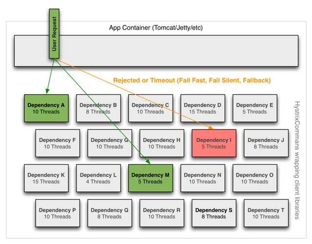

# Hystrix工作原理

#### 工作流程图

------

下面的流程图展示了当使用Hystrix的依赖请求，Hystrix是如何工作的。
|  |
| :----------------------------------------------------------: |

 下面将更详细的解析每一个步骤都发生哪些动作：

- **构建一个HystrixCommand或者HystrixObservableCommand对象。**

  第一步就是构建一个`HystrixCommand`或者`HystrixObservableCommand`对象，该对象将代表你的一个依赖请求，向构造函数中传入请求依赖所需要的参数。

  如果构建`HystrixCommand`中的依赖返回单个响应，例如：

  ```java
  HystrixCommand command = new HystrixCommand(arg1, arg2);
  ```

  如果依赖需要返回一个`Observable`来发射响应，就需要通过构建`HystrixObservableCommand`对象来完 成，例如：

  ```java
  HystrixObservableCommand command = new HystrixObservableCommand(arg1, arg2);
  ```

- **执行命令**

  有4种方式可以执行一个Hystrix命令。

  - `execute()`—该方法是阻塞的，从依赖请求中接收到单个响应（或者出错时抛出异常）。
  - `queue()`—从依赖请求中返回一个包含单个响应的Future对象。
  - `observe()`—订阅一个从依赖请求中返回的代表响应的Observable对象。
  - `toObservable()`—返回一个Observable对象，只有当你订阅它时，它才会执行Hystrix命令并发射响应。

  ```java
  K             value   = command.execute();
  Future<K>     fValue  = command.queue();
  Observable<K> ohValue = command.observe();         //hot observable
  Observable<K> ocValue = command.toObservable();    //cold observable
  ```

同步调用方法`execute()`实际上就是调用`queue().get()`方法，`queue()`方法的调用的是`toObservable().toBlocking().toFuture()`.也就是说，最终每一个HystrixCommand都是通过Observable来实现的，即使这些命令仅仅是返回一个简单的单个值。

- 响应是否被缓存

  如果这个命令的请求缓存已经开启，并且本次请求的响应已经存在于缓存中，那么就会立即返回一个包含缓存响应的`Observable`（下面将Request Cache部分将对请求的cache做讲解）。

- 回路器是否打开

  当命令执行执行时，Hystrix会检查回路器是否被打开。

  如果回路器被打开（或者tripped），那么Hystrix就不会再执行命名，而是直接路由到第`8`步，获取fallback方法，并执行fallback逻辑。

  如果回路器关闭，那么将进入第`5`步，检查是否有足够的容量来执行任务。（其中容量包括线程池的容量，队列的容量等等）。

- 线程池、队列、信号量是否已满

  如果与该命令相关的线程池或者队列已经满了，那么Hystrix就不会再执行命令，而是立即跳到第`8`步,执行fallback逻辑。

- **HystrixObservableCommand.construct() 或者 HystrixCommand.run()**

  在这里，Hystrix通过你写的方法逻辑来调用对依赖的请求，通过下列之一的调用：

  - `HystrixCommand.run()`—返回单个响应或者抛出异常。

  - ```javascript
    HystrixObservableCommand.construct() 
    ```

    —返回一个发射响应的Observable或者发送一个

    ```java
    onError()
    ```

    的通知。

    如果执行`run()`方法或者`construct()`方法的执行时间大于命令所设置的超时时间值，那么该线程将会抛出一个`TimeoutException`异常（或者如果该命令没有运行在它自己的线程中，[or a separate timer thread will, if the command itself is not running in its own thread]）。在这种情况下，Hystrix将会路由到第`8`步，执行fallback逻辑，并且如果`run()`或者`construct()`方法没有被取消或者中断，会丢弃这两个方法最终返回的结果。

    请注意，没有任何方式可以强制终止一个潜在[latent]的线程的运行，Hystrix能够做的最好的方式是让JVM抛出一个`InterruptedException`异常，如果你的任务被Hystrix所包装，并不意味着会抛出一个`InterruptedExceptions`异常，该线程在Hystrix的线程池内会进行执行，虽然在客户端已经接收到了`TimeoutException`异常，这个行为能够渗透到Hystrix的线程池中，[though the load is 'correctly shed']，绝大多数的Http Client不会将这一行为视为`InterruptedExceptions`，所以，请确保正确配置连接或者读取/写入的超时时间。

    如果命令最终返回了响应并且没有抛出任何异常，Hystrix在返回响应后会执行一些log和指标的上报，如果是调用`run()`方法，Hystrix会返回一个Observable，该Observable会发射单个响应并且会调用`onCompleted`方法来通知响应的回调，如果是调用`construct()`方法，Hystrix会通过`construct()`方法返回相同的Observable对象。

- 计算回路指标[Circuit Health]

  Hystrix会报告成功、失败、拒绝和超时的指标给回路器，回路器包含了一系列的滑动窗口数据，并通过该数据进行统计。

  它使用这些统计数据来决定回路器是否应该熔断，如果需要熔断，将在一定的时间内不在请求依赖[短路请求]（译者：这一定的时候可以通过配置指定），当再一次检查请求的健康的话会重新关闭回路器。

- **获取FallBack**

  当命令执行失败时，Hystrix会尝试执行自定义的Fallback逻辑：

  - 当`construct()`或者`run()`方法执行过程中抛出异常。
  - 当回路器打开，命令的执行进入了熔断状态。
  - 当命令执行的线程池和队列或者信号量已经满容。
  - 命令执行超时。

写一个fallback方法，提供一个不需要网络依赖的通用响应，从内存缓存或者其他的静态逻辑获取数据。如果再fallback内必须需要网络的调用，更好的做法是使用另一个`HystrixCommand`或者`HystrixObservableCommand`。

如果你的命令是继承自`HystrixCommand`，那么可以通过实现`HystrixCommand.getFallback()`方法返回一个单个的fallback值。

如果你的命令是继承自`HystrixObservableCommand`，那么可以通过实现`HystrixObservableCommand.resumeWithFallback()`方法返回一个Observable，并且该Observable能够发射出一个fallback值。

Hystrix会把fallback方法返回的响应返回给调用者。

如果你没有为你的命令实现fallback方法，那么当命令抛出异常时，Hystrix仍然会返回一个Observable，但是该Observable并不会发射任何的数据，并且会立即终止并调用`onError()`通知。通过这个`onError`通知，可以将造成该命令抛出异常的原因返回给调用者。

```
失败或不存在回退的结果将根据您如何调用Hystrix命令而有所不同：
```

- `execute()`：抛出一个异常。
- `queue()`：成功返回一个Future，但是如果调用get()方法，将会抛出一个异常。
- `observe()`：返回一个Observable，当你订阅它时，它将立即终止，并调用onError()方法。
- `toObservable()`：返回一个Observable，当你订阅它时，它将立即终止，并调用onError()方法。

- 返回成功的响应

  如果Hystrix命令执行成功，它将以Observable形式返回响应给调用者。根据你在第`2`步的调用方式不同，在返回Observablez之前可能会做一些转换。

|  |
| :----------------------------------------------------------: |

- `execute()`：通过调用`queue()`来得到一个Future对象，然后调用`get()`方法来获取Future中包含的值。
- `queue()`：将Observable转换成`BlockingObservable`，在将`BlockingObservable`转换成一个Future。
- `observe()`：订阅返回的Observable，并且立即开始执行命令的逻辑，
- `toObservable()`：返回一个没有改变的Observable，你必须订阅它，它才能够开始执行命令的逻辑。

#### 回路器

------

下面的图展示了`HystrixCommand`和`HystrixObservableCommand`如何与`HystrixCircuitBroker`进行交互。
|  |
| :----------------------------------------------------------: |

回路器打开和关闭有如下几种情况：

- 假设回路中的请求满足了一定的阈值（`HystrixCommandProperties.circuitBreakerRequestVolumeThreshold()`）
- 假设错误发生的百分比超过了设定的错误发生的阈值`HystrixCommandProperties.circuitBreakerErrorThresholdPercentage()`
- 回路器状态由`CLOSE`变换成`OPEN`
- 如果回路器打开，所有的请求都会被回路器所熔断。
- 一定时间之后`HystrixCommandProperties.circuitBreakerSleepWindowInMilliseconds()`，下一个的请求会被通过（处于半打开状态），如果该请求执行失败，回路器会在睡眠窗口期间返回`OPEN`，如果请求成功，回路器会被置为关闭状态，重新开启`1`步骤的逻辑。

#### 隔离

------

Hystrix采用舱壁模式来隔离相互之间的依赖关系，并限制对其中任何一个的并发访问。
|  |
| :----------------------------------------------------------: |

- 线程和线程池

  客户端（第三方包、网络调用等）会在单独的线程执行，会与调用的该任务的线程进行隔离，以此来防止调用者调用依赖所消耗的时间过长而阻塞调用者的线程。

  [Hystrix uses separate, per-dependency thread pools as a way of constraining any given dependency so latency on the underlying executions will saturate the available threads only in that pool]

|  |
| :----------------------------------------------------------: |

您可以在不使用线程池的情况下防止出现故障，但是这要求客户端必须能够做到快速失败（网络连接/读取超时和重试配置），并始终保持良好的执行状态。

Netflix，设计Hystrix，并且选择使用线程和线程池来实现隔离机制，有以下几个原因：

- 很多应用会调用多个不同的后端服务作为依赖。
- 每个服务会提供自己的客户端库包。
- 每个客户端的库包都会不断的处于变更状态。
- [Client library logic can change to add new network calls]
- 每个客户端库包都可能包含重试、数据解析、缓存等等其他逻辑。
- 对用户来说，客户端库往往是“黑盒”的，对于实现细节、网络访问模式。默认配置等都是不透明的。
- [In several real-world production outages the determination was “oh, something changed and properties should be adjusted” or “the client library changed its behavior.]
- 即使客户端本身没有改变，服务本身也可能发生变化，这些因素都会影响到服务的性能，从而导致客户端配置失效。
- 传递依赖可以引入其他客户端库，这些客户端库不是预期的，也许没有正确配置。
- 大部分的网络访问是同步执行的。
- 客户端代码中也可能出现失败和延迟，而不仅仅是在网络调用中。

|  |
| :----------------------------------------------------------: |

- **使用线程池的好处**

  通过线程在自己的线程池中隔离的好处是：

  - 该应用程序完全可以不受失控的客户端库的威胁。即使某一个依赖的线程池已满也不会影响其他依赖的调用。
  - 应用程序可以低风险的接受新的客户端库的数据，如果发生问题，它会与出问题的客户端库所隔离，不会影响其他依赖的任何内容。
  - 当失败的客户端服务恢复时，线程池将会被清除，应用程序也会恢复，而不至于使得我们整个Tomcat容器出现故障。
  - 如果一个客户端库的配置错误，线程池可以很快的感知这一错误（通过增加错误比例，延迟，超时，拒绝等），并可以在不影响应用程序的功能情况下来处理这些问题（可以通过动态配置来进行实时的改变）。
  - 如果一个客户端服务的性能变差，可以通过改变线程池的指标（错误、延迟、超时、拒绝）来进行属性的调整，并且这些调整可以不影响其他的客户端请求。
  - 除了隔离的优势之外，拥有专用的线程池可以提供内置的请求任务的并发性，可以在同步客户端上构建异步门面。

简而言之，由线程池提供的隔离功能可以使客户端库和子系统性能特性的不断变化和动态组合得到优雅的处理，而不会造成中断。

*注意*：虽然单独的线程提供了隔离，但您的底层客户端代码也应该有超时和/或响应线程中断，而不能让Hystrix的线程池处于无休止的等待状态。

- 线程池的缺点

  线程池最主要的缺点就是增加了CPU的计算开销，每个命令都会在单独的线程池上执行，这样的执行方式会涉及到命令的排队、调度和上下文切换。

  Netflix在设计这个系统时，决定接受这个开销的代价，来换取它所提供的好处，并且认为这个开销是足够小的，不会有重大的成本或者是性能影响。

- 线程成本

  Hystrix在子线程执行`construct()`方法和`run()`方法时会计算延迟，以及计算父线程从端到端的执行总时间。所以，你可以看到Hystrix开销成本包括（线程、度量，日志，断路器等）。

  Netflix API每天使用线程隔离的方式处理10亿多的Hystrix Command任务，每个API实例都有40多个线程池，每个线程池都有5-20个线程（大多数设置为10）

  下图显示了一个HystrixCommand在单个API实例上每秒执行60个请求（每个服务器每秒执行大约350个线程执行总数）：

|  |
| :----------------------------------------------------------: |

在中间位置（或者下线位置）不需要单独的线程池。

在第90线上，单独线程的成本为3ms。

在第99线上，单独的线程花费9ms。但是请注意，线程成本的开销增加远小于单独线程（网络请求）从2跳到28而执行时间从0跳到9的增加。

对于大多数Netflix用例来说，这样的请求在90％以上的开销被认为是可以接受的，这是为了实现韧性的好处。

对于非常低延迟请求（例如那些主要触发内存缓存的请求），开销可能太高，在这种情况下，可以使用另一种方法，如信号量，虽然它们不允许超时，提供绝大部分的有点，而不会产生开销。然而，一般来说，开销是比较小的，以至于Netflix通常更偏向于通过单独的线程来作为隔离实现。

#### 请求合并

------

您可以使用请求合并器（HystrixCollapser是抽象父代）来提前发送HystrixCommand，通过该合并器您可以将多个请求合并为一个后端依赖项调用。

下面的图展示了两种情况下的线程数和网络连接数，第一张图是不使用请求合并，第二张图是使用请求合并（假定所有连接在短时间窗口内是“并发的”，在这种情况下是10ms）。

|  |
| :----------------------------------------------------------: |

- **为什么使用请求合并**

  事情请求合并来减少执行并发HystrixCommand请求所需要的线程数和网络连接数。请求合并以自动方式执行的，不需要代码层面上进行批处理请求的编码。

  - 全局上下文（所有的tomcat线程）

    理想的合并方式是在全局应用程序级别来完成的，以便来自任何用户的任何Tomcat线程的请求都可以一起合并。

    例如，如果将HystrixCommand配置为支持任何用户请求获取影片评级的依赖项的批处理，那么当同一个JVM中的任何用户线程发出这样的请求时，Hystrix会将该请求与其他请求一起合并添加到同一个JVM中的网络调用。

    请注意，合并器会将一个HystrixRequestContext对象传递给合并的网络调用，为了使其成为一个有效选项，下游系统必须处理这种情况。

  - 用户请求上下文（单个tomcat线程）

    如果将HystrixCommand配置为仅处理单个用户的批处理请求，则Hystrix仅仅会合并单个Tomcat线程的请求。

    例如，如果一个用户想要加载300个影片的标签，Hystrix能够把这300次网络调用合并成一次调用。

  - 对象建模和代码的复杂性

    有时候，当你创建一个对象模型对消费的对象而言是具有逻辑意义的，这与对象的生产者的有效资源利用率不匹配。

    例如，给你300个视频对象，遍历他们，并且调用他们的`getSomeAttribute()`方法，但是如果简单的调用，可能会导致300次网络调用（可能很快会占满资源）。

    有一些手动的方法可以解决这个问题，比如在用户调用`getSomeAttribute()`方法之前，要求用户声明他们想要获取哪些视频对象的属性，以便他们都可以被预取。

    或者，您可以分割对象模型，以便用户必须从一个位置获取视频列表，然后从其他位置请求该视频列表的属性。

    这些方法可以会使你的API和对象模型显得笨拙，并且这种方式也不符合心理模式与使用模式（译者：不太懂什么意思）。由于多个开发人员在代码库上工作，可能会导致低级的错误和低效率开发的问题。因为对一个用例的优化可以通过执行另一个用例和通过代码的新路径来打破。

    通过将合并逻辑移到Hystrix层，不管你如何创建对象模型，调用顺序是怎样的，或者不同的开发人员是否知道是否完成了优化或者是否完成。

    getSomeAttribute（）方法可以放在最适合的地方，并以任何适合使用模式的方式被调用，并且合并器会自动将批量调用放置到时间窗口。

####请求Cache

HystrixCommand和HystrixObservableCommand实现可以定义一个缓存键，然后用这个缓存键以并发感知的方式在请求上下文中取消调用（不需要调用依赖即可以得到结果，因为同样的请求结果已经按照缓存键缓存起来了）。

以下是一个涉及HTTP请求生命周期的示例流程，以及在该请求中执行工作的两个线程： 
|  |
| :----------------------------------------------------------: |

请求cache的好处有：

- 不同的代码路径可以执行Hystrix命令，而不用担心重复的工作。

这在许多开发人员实现不同功能的大型代码库中尤其有用。

例如，多个请求路径都需要获取用户的Account对象，可以像这样请求：

```java
Account account = new UserGetAccount(accountId).execute();
//or
Observable<Account> accountObservable = new UserGetAccount(accountId).observe();
```

Hystrix RequestCache将只执行一次底层的run（）方法，执行HystrixCommand的两个线程都会收到相同的数据，尽管实例化了多个不同的实例。

- 整个请求的数据检索是一致的。

每次执行该命令时，不再会返回一个不同的值（或回退），而是将第一个响应缓存起来，后续相同的请求将会返回缓存的响应。

- 消除重复的线程执行。

由于请求缓存位于construct（）或run（）方法调用之前，Hystrix可以在调用线程执行之前取消调用。

如果Hystrix没有实现请求缓存功能，那么每个命令都需要在构造或者运行方法中实现，这将在一个线程排队并执行之后进行。