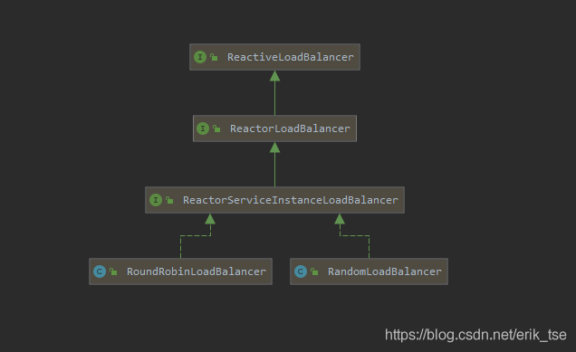

### 一 负载均衡


> 在我们的项目中使用了注册中心后,我们可以从注册中心获取到对应的服务提供者的所有ip地址,然后我们选择一个进行访问,但是每次我们都要自己获取并转换拼接地址,比如使用EurekaClient对象从Eureka注册中心获取到一个地址,然然后拼接成真正地址交给RestTemplate来访问,这样还是有一点点麻烦,我们希望有没有工具可以自动帮我们查找提供者地址,我们只要告诉他找哪个服务即可,这就是我们需要的负载均衡功能.负载均衡功能有很多不同的实现,比如Netflix的Ribbon以及Spring Cloud Loadbalancer,这两个都属于客户端侧负载均衡,也就是由客户端(服务消费者)获取到所有提供者地址后通过算法自行选择一个地址进行访问


### 二 Loabalancer

>Spring Cloud 2020版本以后，默认移除了对Netflix的依赖，其中就包括Ribbon，官方默认推荐使用Spring Cloud Loadbalancer正式替换Ribbon，并成为了Spring Cloud负载均衡器的唯一实现。


#### 2.1 引入依赖

> 此处仅仅显示loadbalancer所需要的依赖,项目本身需要是Spring Cloud工程,其它功能需要的依赖自行导入


```xml
		<dependency>
			<groupId>org.springframework.cloud</groupId>
			<artifactId>spring-cloud-starter-loadbalancer</artifactId>
		</dependency>

```


`如果是Hoxton之前的版本，默认负载均衡器为Ribbon，需要移除Ribbon引用和增加配置spring.cloud.loadbalancer.ribbon.enabled: false`


#### 2.2 开启负载均衡

> 此处的方式是通过使用RestTemplate的方式来实现


```java
import org.springframework.cloud.client.loadbalancer.LoadBalanced;
import org.springframework.context.annotation.Bean;
import org.springframework.context.annotation.Configuration;
import org.springframework.web.client.RestTemplate;

/**
 *
 * @author Jackiechan
 * @version 1.0
 * @since 1.0
 */
@Configuration
public class BeanConfig {
    /**
     * spring提供的一个可以让我们快速发起网络请求的类
     * @return
     */
    @Bean
    @LoadBalanced//给创建的当前对象开启负载均衡功能,会在访问接口的时候自动裁剪出服务名并且从注册中心获取到地址后重新替换拼接为正确地址
    public RestTemplate restTemplate() {
        return new RestTemplate();
    }
}

```


#### 2.3 使用

> 在我们需要访问服务的地方通过template对象来访问


```java

import org.springframework.beans.factory.annotation.Autowired;
import org.springframework.web.bind.annotation.GetMapping;
import org.springframework.web.bind.annotation.PathVariable;
import org.springframework.web.bind.annotation.RequestMapping;
import org.springframework.web.bind.annotation.RestController;
import org.springframework.web.client.RestTemplate;
import xin.chenjunbo.springcloud.order.pojo.Address;
import xin.chenjunbo.springcloud.order.pojo.Order;

import java.util.Random;

/**
 *
 * @author Jackiechan
 * @version 1.0
 * @since 1.0
 */
@RestController
@RequestMapping("/order")
public class OrderController {

    private Random random = new Random();

   // private EurekaClient eurekaClient;

    /**
     * eureka提供的客户端,可以帮我们从eureka注册中心获取到指定服务名字的服务器地址
     * @param eurekaClient
     */
//    @Autowired
//    public void setEurekaClient(EurekaClient eurekaClient) {
//        this.eurekaClient = eurekaClient;
//    }

    private RestTemplate restTemplate;
    //当前注入的对象就是我们在配置类中创建的支持负载均衡的restTemplate
    @Autowired
    public void setRestTemplate(RestTemplate restTemplate) {
        this.restTemplate = restTemplate;
    }

    @GetMapping("/info/{id}")
    public Order findById(@PathVariable Long id) {
        Order order = new Order();
        order.setId(id);
        order.setPrice(random.nextDouble());
        order.setItemName("打气筒"+random.nextInt());

        //我们发现我们还需要地址的数据,但是地址不在当前程序内部,在另外一个服务器的程序里面
        //我们需要拿到数据,怎么能从另外一个服务器拿到数据? 对方提供了一个http接口,我们可以访问这个接口来获取数据
        //现在我们的地址都在注册中心中,所以我们需要从里面获取,参数1 就是我们想要的功能在eureka中的名字,参数2 是不是https
      //  InstanceInfo instanceInfo = eurekaClient.getNextServerFromEureka("04addressprovidereureka", false);
        //获取拿到的服务器地址信息,到端口
       // String homePageUrl = instanceInfo.getHomePageUrl();
    //   System.err.println(homePageUrl);
        //Address address = restTemplate.getForObject(homePageUrl+"/address/info/" + id, Address.class);
        //当我们使用负载均衡后只需要将地址中的域名部分替换为提供者在注册中心中注册的名字既可,这样我们就可以不用使用eureka等工具来获取地址后手动拼接了
       // 04addressprovidereureka就是提供者在注册中心中的名字
        Address address = restTemplate.getForObject("http://04addressprovidereureka/address/info/" + id, Address.class);
        order.setAddress(address);
        return order;
    }
}
```


#### 2.4 访问测试

> 启动访问当前的地址,可以获取到数据,前提是注册中心以及提供者都已经启动好了


### 三 原理

上面是RestTemplate负载均衡的简单实现，除此之外，Spring Cloud LoadBalancer还支持Spring Web Flux响应式编程，两者的实现原理思想相同，都是通过客户端添加拦截器，在拦截器中实现负载均衡。

#### 3.1 RestTemplate

> 提供了一个方法setInterceptors，用于设置拦截器，拦截器需要实现ClientHttpRequestInterceptor接口即可，在实际远程去请求服务端接口之前会先调用拦截器的intercept方法逻辑。这里的拦截器相当于Servlet技术中的Filter功能。


```java
// 代码实现在抽象父类InterceptingHttpAccessor里
// RestTemplate.InterceptingHttpAccessor#setInterceptors
public void setInterceptors(List<ClientHttpRequestInterceptor> interceptors) {
   // Take getInterceptors() List as-is when passed in here
   if (this.interceptors != interceptors) {
      this.interceptors.clear();
      this.interceptors.addAll(interceptors);
      AnnotationAwareOrderComparator.sort(this.interceptors);
   }
}
```


#### 3.2 LoadBalancerAutoConfiguration

> 由于@LoadBalanced注解由spring-cloud-commons实现，查看实现逻辑我们发现spring-cloud-commons存在自动配置类LoadBalancerAutoConfiguration，当满足条件时，将自动创建LoadBalancerInterceptor并注入到RestTemplate中。

```java
@Configuration(
    proxyBeanMethods = false
)
@Conditional({LoadBalancerAutoConfiguration.RetryMissingOrDisabledCondition.class})
static class LoadBalancerInterceptorConfig {
    LoadBalancerInterceptorConfig() {
    }
 
    @Bean
    public LoadBalancerInterceptor loadBalancerInterceptor(LoadBalancerClient loadBalancerClient, LoadBalancerRequestFactory requestFactory) {
        return new LoadBalancerInterceptor(loadBalancerClient, requestFactory);
    }
 
    @Bean
    @ConditionalOnMissingBean
    public RestTemplateCustomizer restTemplateCustomizer(final LoadBalancerInterceptor loadBalancerInterceptor) {
        return (restTemplate) -> {
            List<ClientHttpRequestInterceptor> list = new ArrayList(restTemplate.getInterceptors());
            list.add(loadBalancerInterceptor);
            restTemplate.setInterceptors(list);
        };
    }
}
```
#### 3.3 LoadRalancerLnterceptor

> LoadBalancerInterceptor实现了ClientHttpRequestInterceptor接口，实现intercept方法，用于实现负载均衡的拦截处理。


```java
public class LoadBalancerInterceptor implements ClientHttpRequestInterceptor {
    private LoadBalancerClient loadBalancer;
    private LoadBalancerRequestFactory requestFactory;
public LoadBalancerInterceptor(LoadBalancerClient loadBalancer, LoadBalancerRequestFactory requestFactory) {
    this.loadBalancer = loadBalancer;
    this.requestFactory = requestFactory;
}
 
public LoadBalancerInterceptor(LoadBalancerClient loadBalancer) {
    this(loadBalancer, new LoadBalancerRequestFactory(loadBalancer));
}
 
public ClientHttpResponse intercept(final HttpRequest request, final byte[] body, final ClientHttpRequestExecution execution) throws IOException {
    URI originalUri = request.getURI();
    String serviceName = originalUri.getHost();
    Assert.state(serviceName != null, "Request URI does not contain a valid hostname: " + originalUri);
    return (ClientHttpResponse)this.loadBalancer.execute(serviceName, this.requestFactory.createRequest(request, body, execution));
}
}  
```
#### 3.4 LoadBalancerClient

> 负载均衡客户端，用于进行负载均衡逻辑，从服务列表中选择出一个服务地址进行调用。Spring Cloud LoadBalancer的默认实现为BlockingLoadBalancerClient

```java
public <T> T execute(String serviceId, LoadBalancerRequest<T> request) throws IOException {
    String hint = this.getHint(serviceId);
    LoadBalancerRequestAdapter<T, DefaultRequestContext> lbRequest = new LoadBalancerRequestAdapter(request, new DefaultRequestContext(request, hint));
    Set<LoadBalancerLifecycle> supportedLifecycleProcessors = this.getSupportedLifecycleProcessors(serviceId);
    supportedLifecycleProcessors.forEach((lifecycle) -> {
        lifecycle.onStart(lbRequest);
    });
  //选择服务
    ServiceInstance serviceInstance = this.choose(serviceId, lbRequest);
    if (serviceInstance == null) {
        supportedLifecycleProcessors.forEach((lifecycle) -> {
            lifecycle.onComplete(new CompletionContext(Status.DISCARD, lbRequest, new EmptyResponse()));
        });
        throw new IllegalStateException("No instances available for " + serviceId);
    } else {
        return this.execute(serviceId, serviceInstance, lbRequest);
    }
}
 
public <T> T execute(String serviceId, ServiceInstance serviceInstance, LoadBalancerRequest<T> request) throws IOException {
    DefaultResponse defaultResponse = new DefaultResponse(serviceInstance);
    Set<LoadBalancerLifecycle> supportedLifecycleProcessors = this.getSupportedLifecycleProcessors(serviceId);
    Request lbRequest = request instanceof Request ? (Request)request : new DefaultRequest();
    supportedLifecycleProcessors.forEach((lifecycle) -> {
        lifecycle.onStartRequest(lbRequest, new DefaultResponse(serviceInstance));
    });
 
    try {
        T response = request.apply(serviceInstance);
        Object clientResponse = this.getClientResponse(response);
        supportedLifecycleProcessors.forEach((lifecycle) -> {
            lifecycle.onComplete(new CompletionContext(Status.SUCCESS, lbRequest, defaultResponse, clientResponse));
        });
        return response;
    } catch (IOException var9) {
        supportedLifecycleProcessors.forEach((lifecycle) -> {
            lifecycle.onComplete(new CompletionContext(Status.FAILED, var9, lbRequest, defaultResponse));
        });
        throw var9;
    } catch (Exception var10) {
        supportedLifecycleProcessors.forEach((lifecycle) -> {
            lifecycle.onComplete(new CompletionContext(Status.FAILED, var10, lbRequest, defaultResponse));
        });
        ReflectionUtils.rethrowRuntimeException(var10);
        return null;
    }
}


public ServiceInstance choose(String serviceId) {
    return this.choose(serviceId, ReactiveLoadBalancer.REQUEST);
}

 //通过不同的负载均衡客户端实现选择不同的服务
    public <T> ServiceInstance choose(String serviceId, Request<T> request) {
        ReactiveLoadBalancer<ServiceInstance> loadBalancer = this.loadBalancerClientFactory.getInstance(serviceId);
        if (loadBalancer == null) {
            return null;
        } else {
            Response<ServiceInstance> loadBalancerResponse = (Response)Mono.from(loadBalancer.choose(request)).block();
            return loadBalancerResponse == null ? null : (ServiceInstance)loadBalancerResponse.getServer();
        }
    }
```


#### 3.5 LoadBalancerClientFactory

> BlockingLoadBalancerClient中持有LoadBalancerClientFactory通过调用其getInstance方法获取具体的负载均衡客户端。客户端实现了不同的负载均衡算法，比如轮询、随机等。LoadBalancerClientFactory继承了NamedContextFactory，NamedContextFactory继承ApplicationContextAware，实现Spring ApplicationContext容器操作。


```java

public class LoadBalancerClientFactory extends NamedContextFactory<LoadBalancerClientSpecification> implements Factory<ServiceInstance> {
    public static final String NAMESPACE = "loadbalancer";
    public static final String PROPERTY_NAME = "loadbalancer.client.name";
public LoadBalancerClientFactory() {
    super(LoadBalancerClientConfiguration.class, "loadbalancer", "loadbalancer.client.name");
}
 
public String getName(Environment environment) {
    return environment.getProperty("loadbalancer.client.name");
}
 
public ReactiveLoadBalancer<ServiceInstance> getInstance(String serviceId) {
    return (ReactiveLoadBalancer)this.getInstance(serviceId, ReactorServiceInstanceLoadBalancer.class);
}
}
```

`在spring-cloud-loadbalabcer中的LoadBalancerAutoConfiguration实现了LoadBalancerClientFactory缺省值：`

```java
@ConditionalOnMissingBean
@Bean
public LoadBalancerClientFactory loadBalancerClientFactory() {
    LoadBalancerClientFactory clientFactory = new LoadBalancerClientFactory();
    clientFactory.setConfigurations((List)this.configurations.getIfAvailable(Collections::emptyList));
    return clientFactory;
}
```
#### 3.6 ReactiveLoadBalancer

> 负载均衡器，实现服务选择。Spring Cloud Balancer中实现了轮询RoundRobinLoadBalancer和随机数RandomLoadBalancer两种负载均衡算法。

|  |
| :-----------------: |

`如果没有显式指定负载均衡算法，默认缺省值为RoundRobinLoadBalancer。LoadBalancerClientConfiguration#LoadBalancerClientConfiguration`

```java
@Bean
@ConditionalOnMissingBean
public ReactorLoadBalancer<ServiceInstance> reactorServiceInstanceLoadBalancer(Environment environment, LoadBalancerClientFactory loadBalancerClientFactory) {
    String name = environment.getProperty("loadbalancer.client.name");
    return new RoundRobinLoadBalancer(loadBalancerClientFactory.getLazyProvider(name, ServiceInstanceListSupplier.class), name);
}
```
#### 3.7 LoadBalancerRequestFactory

> LoadBalancerRequest工厂类，用于创建LoadBalancerRequest，调用createRequest方法。在内部持有LoadBalancerClient属性对象，即BlockingLoadBalancerClient。


```java
public class LoadBalancerRequestFactory {
    private LoadBalancerClient ;
    private List<LoadBalancerRequestTransformer> transformers;
public LoadBalancerRequestFactory(LoadBalancerClient loadBalancer, List<LoadBalancerRequestTransformer> transformers) {
    this.loadBalancer = loadBalancer;
    this.transformers = transformers;
}
 
public LoadBalancerRequestFactory(LoadBalancerClient loadBalancer) {
    this.loadBalancer = loadBalancer;
}
 
public LoadBalancerRequest<ClientHttpResponse> createRequest(final HttpRequest request, final byte[] body, final ClientHttpRequestExecution execution) {
    return (instance) -> {
        HttpRequest serviceRequest = new ServiceRequestWrapper(request, instance, this.loadBalancer);
        LoadBalancerRequestTransformer transformer;
        if (this.transformers != null) {
            for(Iterator var6 = this.transformers.iterator(); var6.hasNext(); serviceRequest = transformer.transformRequest((HttpRequest)serviceRequest, instance)) {
                transformer = (LoadBalancerRequestTransformer)var6.next();
            }
        }
 
        return execution.execute((HttpRequest)serviceRequest, body);
    };
}
}
```
