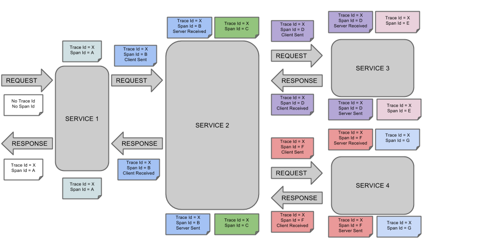
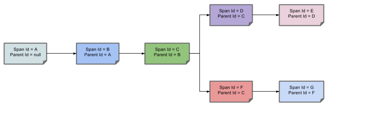
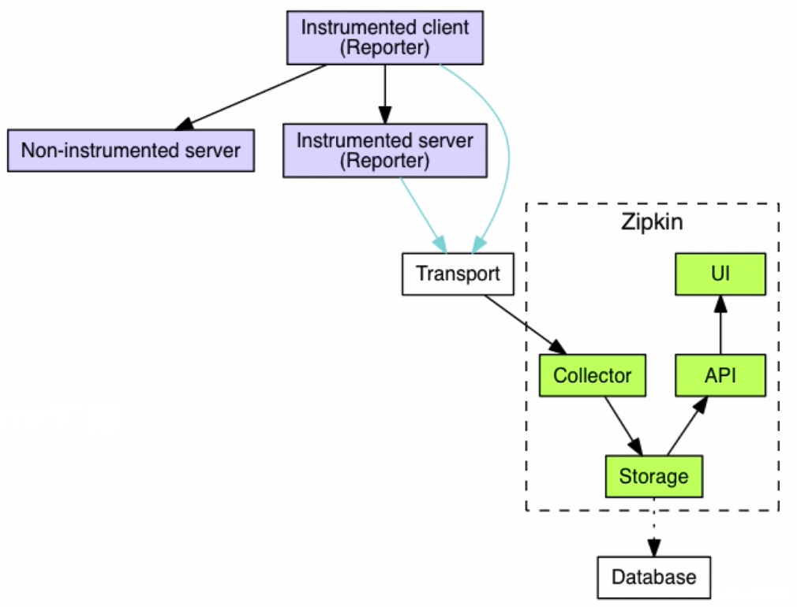
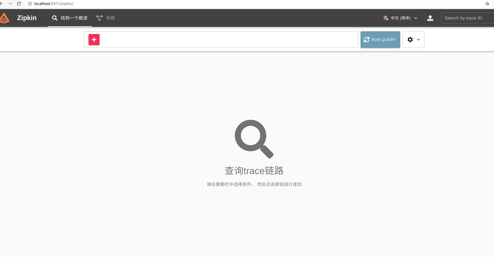
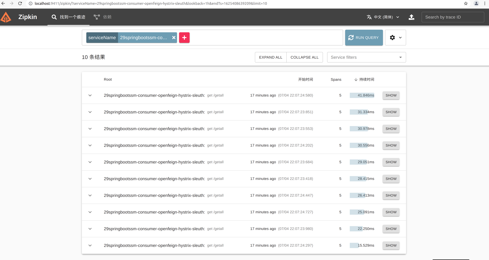
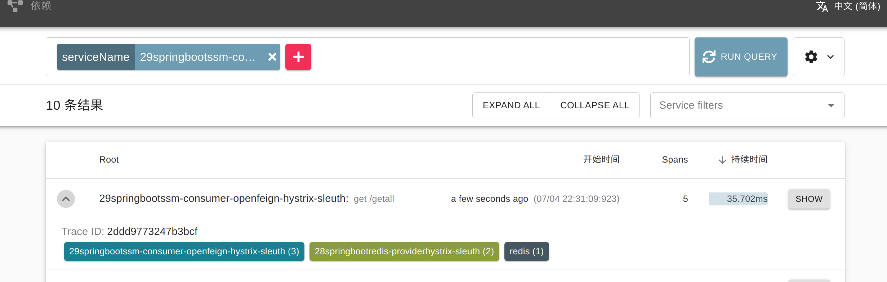
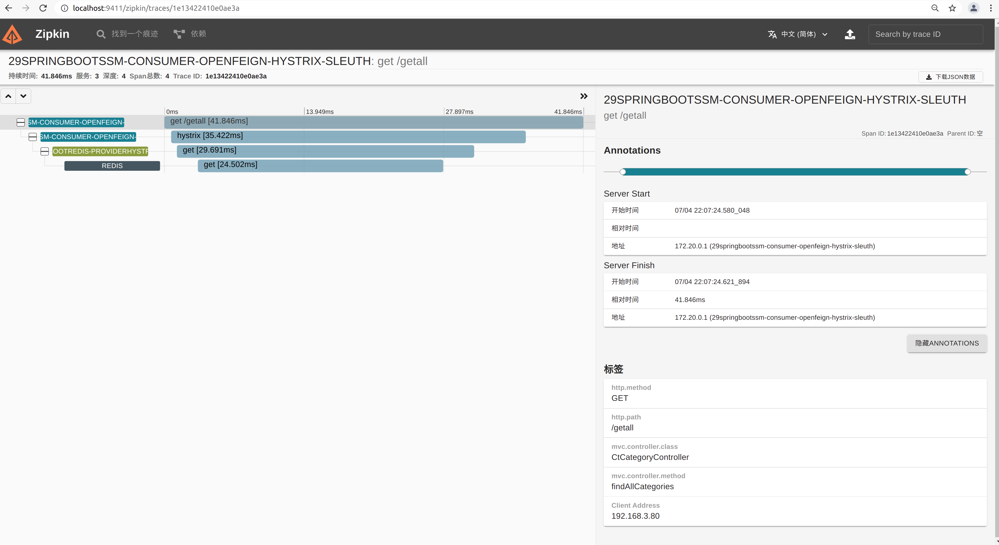
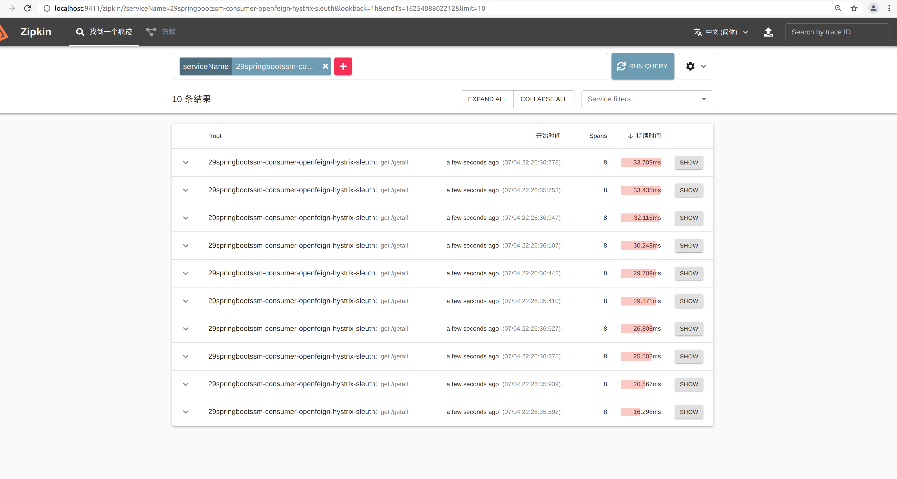
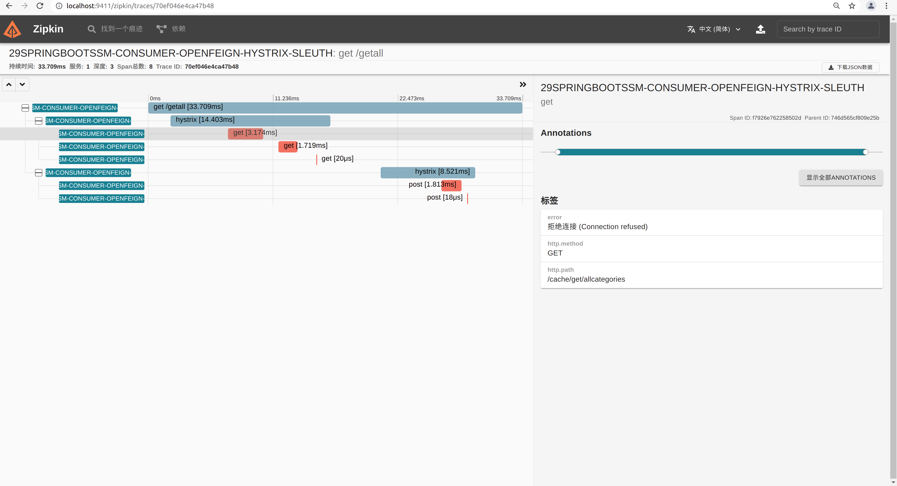

# Sleuth 链路追踪

## 一 简介

**1、简介**

在介绍调用链监控工具之前，我们首先需要知道在微服务架构系统中经常会遇到两个问题：

- 跨微服务的API调用发生异常，要求快速定位（比如5分钟以内）出问题出在哪里，该怎么办？
- 跨微服务的API调用发生性 能瓶颈，要求迅速定位（比如5分钟以内）出系统瓶颈，该怎么办？

　　Spring Cloud Sleuth 是 Spring Cloud 的一个组件，它的主要功能是在分布式系统中提供服务链路追踪的解决方案。 常见的链路追踪组件有 Google 的 Dapper、 Twitter 的 Zipkin ， 以及阿里的 Eagleeye（鹰眼）等，它们都是非常优秀的链路追踪开源组件。
**2、基本术语**

- - Span：基本工作单元，例如，在一个新建的span中发送一个RPC等同于发送一个回应请求给RPC，span通过一个64位ID唯一标识，trace以另一个64位ID表示，span还有其他数据信息，比如摘要、时间戳事件、关键值注释(tags)、span的ID、以及进度ID(通常是IP地址) 
    span在不断的启动和停止，同时记录了时间信息，当你创建了一个span，你必须在未来的某个时刻停止它。
  - Trace：一系列spans组成的一个树状结构，例如，如果你正在跑一个分布式大数据工程，你可能需要创建一个trace。
  - Annotation：用来及时记录一个事件的存在，一些核心annotations用来定义一个请求的开始和结束 
    - cs - Client Sent -客户端发起一个请求，这个annotion描述了这个span的开始
    - sr - Server Received -服务端获得请求并准备开始处理它，如果将其sr减去cs时间戳便可得到网络延迟
    - ss - Server Sent -注解表明请求处理的完成(当请求返回客户端)，如果ss减去sr时间戳便可得到服务端需要的处理请求时间
    - cr - Client Received -表明span的结束，客户端成功接收到服务端的回复，如果cr减去cs时间戳便可得到客户端从服务端获取回复的所有所需时间 

可视化**Span**和**Trace**将与Zipkin注释一起查看系统如下图：

 

|  |
| :---------------------------------------------------: |

一个音符的每个颜色表示跨度（7 spans - 从**A**到**G**）。如果你看到有这样的信息：


```
Trace Id = X
Span Id = D
Client Sent
```

这意味着，当前的跨度**痕量-ID**设置为**X**，**Span -编号**设置为D。它也发出了 **客户端发送的**事件。

这样，spans的父/子关系的可视化将如下所示：

|  |
| :-------------------------------------------------: |


## 二 Zipkin搭建与整合

通过Sleuth产生的调用链监控信息，让我们可以得知微服务之间的调用链路，但是监控信息只输出到控制台始终不太方便查看。所以我们需要一个图形化的工具，这时候就轮到zipkin出场了。Zipkin是Twitter开源的分布式跟踪系统，主要用来收集系统的时序数据，从而追踪系统的调用问题。zipkin官网地址如下：

> https://zipkin.io/

zipkin结构图：

|  |
| :----------------------------------------------------------: |


### 2.1 ZipKin Server 搭建

> zipkin官方现在推荐通过jar或者docker启动server，不再推荐通过应用程序启动

#### 2.1.1 docker-compose.yml

```yaml
version: '3.1'
services:
  zipkin:
    restart: always
    image: baseservice.qfjava.cn:60001/openzipkin/zipkin:latest
    container_name: zipkin
    # Environment settings are defined here https://github.com/openzipkin/zipkin/tree/1.19.0/zipkin-server#environment-variables
    environment:
      # zipkin数据默认保存在内存中，如果重启了zipkin后数据会丢失，所以需要配置存储方式，存储方式支持mysql  es等，可以通过
      - STORAGE_TYPE=mysql
      # Point the zipkin at the storage backend
      - MYSQL_DB=zipkin
      - MYSQL_USER=root #数据库用户名
      - MYSQL_PASS=qishimeiyoumima #数据库密码
      - MYSQL_HOST=10.9.43.84 #数据库地址
      - MYSQL_TCP_PORT=3306 #数据库端口
      # Uncomment to enable scribe
      # - SCRIBE_ENABLED=true
      # Uncomment to enable self-tracing
      # - SELF_TRACING_ENABLED=true
      # Uncomment to enable debug logging
      # - JAVA_OPTS=-Dlogging.level.zipkin=DEBUG -Dlogging.level.zipkin2=DEBUG
      #zipkin可以通过配置mq来从mq中接收追踪数据，这样服务就不需要直接请求我们的zipkin server来传输数据，提高可用性
      - RABBIT_ADDRESSES=rabbitmq.qfjava.cn:9090
      - RABBIT_USER=guest
      - RABBIT_PASSWORD=guest
      - RABBIT_QUEUE=zipkin
      - RABBIT_VIRTUAL_HOST=/test
    ports:
      # Port used for the Zipkin UI and HTTP Api
      - 9411:9411
      # Uncomment if you set SCRIBE_ENABLED=true
      # - 9410:9410
    depends_on:
      - mysql
  mysql: # 服务的名称
    restart: always   # 代表只要docker启动，那么这个容器就跟着一起启动
    image: baseservice.qfjava.cn:60001/mysql:5.7.31  # 指定镜像路径
    container_name: mysql  # 指定容器名称
    ports:
      - 3306:3306  #  指定端口号的映射
    environment:
      MYSQL_ROOT_PASSWORD: qishimeiyoumima   # 指定MySQL的ROOT用户登录密码
      TZ: Asia/Shanghai        # 指定时区
    volumes:
      - ./mysql_data:/var/lib/mysql   # 映射数据卷
```


####  2.1.2 MySQL脚本

> 此脚本是zipkin保存到数据库中数据的表结构，可以在github中查看

```sql

CREATE TABLE IF NOT EXISTS zipkin_spans (
  `trace_id_high` BIGINT NOT NULL DEFAULT 0 COMMENT 'If non zero, this means the trace uses 128 bit traceIds instead of 64 bit',
  `trace_id` BIGINT NOT NULL,
  `id` BIGINT NOT NULL,
  `name` VARCHAR(255) NOT NULL,
  `remote_service_name` VARCHAR(255),
  `parent_id` BIGINT,
  `debug` BIT(1),
  `start_ts` BIGINT COMMENT 'Span.timestamp(): epoch micros used for endTs query and to implement TTL',
  `duration` BIGINT COMMENT 'Span.duration(): micros used for minDuration and maxDuration query',
  PRIMARY KEY (`trace_id_high`, `trace_id`, `id`)
) ENGINE=InnoDB ROW_FORMAT=COMPRESSED CHARACTER SET=utf8 COLLATE utf8_general_ci;

ALTER TABLE zipkin_spans ADD INDEX(`trace_id_high`, `trace_id`) COMMENT 'for getTracesByIds';
ALTER TABLE zipkin_spans ADD INDEX(`name`) COMMENT 'for getTraces and getSpanNames';
ALTER TABLE zipkin_spans ADD INDEX(`remote_service_name`) COMMENT 'for getTraces and getRemoteServiceNames';
ALTER TABLE zipkin_spans ADD INDEX(`start_ts`) COMMENT 'for getTraces ordering and range';

CREATE TABLE IF NOT EXISTS zipkin_annotations (
  `trace_id_high` BIGINT NOT NULL DEFAULT 0 COMMENT 'If non zero, this means the trace uses 128 bit traceIds instead of 64 bit',
  `trace_id` BIGINT NOT NULL COMMENT 'coincides with zipkin_spans.trace_id',
  `span_id` BIGINT NOT NULL COMMENT 'coincides with zipkin_spans.id',
  `a_key` VARCHAR(255) NOT NULL COMMENT 'BinaryAnnotation.key or Annotation.value if type == -1',
  `a_value` BLOB COMMENT 'BinaryAnnotation.value(), which must be smaller than 64KB',
  `a_type` INT NOT NULL COMMENT 'BinaryAnnotation.type() or -1 if Annotation',
  `a_timestamp` BIGINT COMMENT 'Used to implement TTL; Annotation.timestamp or zipkin_spans.timestamp',
  `endpoint_ipv4` INT COMMENT 'Null when Binary/Annotation.endpoint is null',
  `endpoint_ipv6` BINARY(16) COMMENT 'Null when Binary/Annotation.endpoint is null, or no IPv6 address',
  `endpoint_port` SMALLINT COMMENT 'Null when Binary/Annotation.endpoint is null',
  `endpoint_service_name` VARCHAR(255) COMMENT 'Null when Binary/Annotation.endpoint is null'
) ENGINE=InnoDB ROW_FORMAT=COMPRESSED CHARACTER SET=utf8 COLLATE utf8_general_ci;

ALTER TABLE zipkin_annotations ADD UNIQUE KEY(`trace_id_high`, `trace_id`, `span_id`, `a_key`, `a_timestamp`) COMMENT 'Ignore insert on duplicate';
ALTER TABLE zipkin_annotations ADD INDEX(`trace_id_high`, `trace_id`, `span_id`) COMMENT 'for joining with zipkin_spans';
ALTER TABLE zipkin_annotations ADD INDEX(`trace_id_high`, `trace_id`) COMMENT 'for getTraces/ByIds';
ALTER TABLE zipkin_annotations ADD INDEX(`endpoint_service_name`) COMMENT 'for getTraces and getServiceNames';
ALTER TABLE zipkin_annotations ADD INDEX(`a_type`) COMMENT 'for getTraces and autocomplete values';
ALTER TABLE zipkin_annotations ADD INDEX(`a_key`) COMMENT 'for getTraces and autocomplete values';
ALTER TABLE zipkin_annotations ADD INDEX(`trace_id`, `span_id`, `a_key`) COMMENT 'for dependencies job';

CREATE TABLE IF NOT EXISTS zipkin_dependencies (
  `day` DATE NOT NULL,
  `parent` VARCHAR(255) NOT NULL,
  `child` VARCHAR(255) NOT NULL,
  `call_count` BIGINT,
  `error_count` BIGINT,
  PRIMARY KEY (`day`, `parent`, `child`)
) ENGINE=InnoDB ROW_FORMAT=COMPRESSED CHARACTER SET=utf8 COLLATE utf8_general_ci;
```


**`启动主程序 访问zipkin的地址http://localhost:9411/zipkin/`**


|                             预览                             |
| :----------------------------------------------------------: |
|  |


### 2.2 微服务整合Sleuth

**`在我们所有需要追踪的服务中添加配置`**

#### 2.2.1 pom 依赖


```xml

<!--
收集追踪数据
-->
        <dependency>
            <groupId>org.springframework.cloud</groupId>
            <artifactId>spring-cloud-starter-sleuth</artifactId>
        </dependency>
<!--
sleuth和zipkin转换整合
-->
        <dependency>
            <groupId>org.springframework.cloud</groupId>
            <artifactId>spring-cloud-sleuth-zipkin</artifactId>
        </dependency>
<!--
通过mq发送追踪数据
-->
        <dependency>
            <groupId>org.springframework.cloud</groupId>
            <artifactId>spring-cloud-stream-binder-rabbit</artifactId>
        </dependency>
```


#### 2.2.2 application.yml

**`在配置文件中添加一下配置`**

```yaml
spring:  
  rabbitmq: #通过哪个MQ发送追踪数据
    host: rabbitmq.qfjava.cn
    port: 9090
    virtual-host: /test
  zipkin:
    rabbitmq:
      #addresses: 10.9.12.200:8800
      queue: zipkin #和上面的保持一致
    sender:
      type: rabbit
    #base-url: http://10.9.45.78:9411/ #不用 MQ 的情况下   
  sleuth:
    sampler:
      probability: 1  #采样率 0.1-1之间

```


#### 2.2.3 启动所有服务测试

**`1 启动所有的服务访问我们的接口,如果采样率比较低,需要多访问几次服务,然后再去我们的 zipkinserver 中查看`**	

|  |
| :----------------------------------------------------------: |

​	


**`2 上图可以看到有三条记录,查看详情可以点击条目`**


|  |
| :----------------------------------------------------------: |

**`3 详情中可以看到每个服务访问的地址是什么,消耗的时间是多少,谁调用了谁,查看详情可以继续点击每个请求的条目`**


|  |
| :----------------------------------------------------------: |

**`4 当我们的请求出现问题的时候,也会给我们统计出来`**

|  |
| :----------------------------------------------------------: |


**`5 详情中可以查看出错的原因`**


|  |
| :----------------------------------------------------------: |

