### 一 Nacos

> 阿里巴巴发布的一款注册中心和配置中心

#### 1.1 安装

> 单机版安装,配置文件在资料文件夹

##### 1.1.1 单机版

`docker-compose.yml`

```yaml
version: "3"
services:
  nacos:
    image: nacos/nacos-server:v2.2.3
    container_name: nacos-standalone-mysql
    #platform: linux/amd64 #ARM平台
    env_file:
      - ./env/nacos-standlone-mysql.env #nacos的存储设置,在资料目录中
    volumes:
      - ./standalone-logs/:/home/nacos/logs
      - ./init.d/application.properties:/home/nacos/conf/application.properties #在资料目录中
    ports:
      - "8848:8848"
      - "9848:9848"
      - "9555:9555"
    depends_on:
      mysql:
        condition: service_healthy
    restart: on-failure
  mysql:
    container_name: mysql
    #platform: linux/amd64 #ARM平台
    build:
      context: .
      dockerfile: ./mysql57/Dockerfile #根据不同的mysql版本选择不同的文件,具体位置以自己实际情况为准
    env_file:
      - ./env/mysql.env #配置文件,在资料目录中
    volumes:
      - ./mysql:/var/lib/mysql
    ports:
      - "3306:3306"
    healthcheck:
      test: [ "CMD", "mysqladmin" ,"ping", "-h", "localhost" ]
      interval: 5s
      timeout: 10s
      retries: 10
```


##### 1.1.2 集群安装

`docker-compose.yml`

```yaml
version: "3"
services:
  nacos1:
    hostname: nacos1
    container_name: nacos1
    image: nacos/nacos-server:v2.2.3
    #platform: linux/amd64 #ARM平台
    volumes:
      - ./cluster-logs/nacos1:/home/nacos/logs
      - ./init.d/application.properties:/home/nacos/conf/application.properties
    ports:
      - "8848:8848"
      - "9848:9848"
      - "9555:9555"
    env_file:
      - ./env/nacos-hostname.env #nacos的存储设置,在资料目录中
    restart: always
    depends_on:
      mysql:
        condition: service_healthy
  nacos2:
    hostname: nacos2
    image: nacos/nacos-server:v2.2.3
    #platform: linux/amd64 #ARM平台
    container_name: nacos2
    volumes:
      - ./cluster-logs/nacos2:/home/nacos/logs
      - ./init.d/application.properties:/home/nacos/conf/application.properties
    ports:
      - "8849:8848"
      - "9849:9848"
    env_file:
      - ./env/nacos-hostname.env
    restart: always
    depends_on:
      mysql:
        condition: service_healthy
  nacos3:
    hostname: nacos3
    image: nacos/nacos-server:v2.2.3
    #platform: linux/amd64 #ARM平台
    container_name: nacos3
    volumes:
      - ./cluster-logs/nacos3:/home/nacos/logs
      - ./init.d/application.properties:/home/nacos/conf/application.properties
    ports:
      - "8850:8848"
      - "9850:9848"
    env_file:
      - ./env/nacos-hostname.env
    restart: always
    depends_on:
      mysql:
        condition: service_healthy
  mysql:
    container_name: mysql
    build:
      context: .
      dockerfile: ./mysql57/Dockerfile
    env_file:
      - ./env/mysql.env
    volumes:
      - ./mysql:/var/lib/mysql
    ports:
      - "3306:3306"
    healthcheck:
      test: [ "CMD", "mysqladmin" ,"ping", "-h", "localhost" ]
      interval: 5s
      timeout: 10s
      retries: 10
```


##### 1.1.3 效果图

> 访问nacos地址 http://服务器:端口/nacos,比如我Linux虚拟机IP为192.168.3.199, 单机版则为http://192.168.3.199:8848/nacos
>
> 集群因为都在一个机器上,所以通过上面的端口映射 访问8848,8849,8850均可,如果需要账号和密码都是nacos


|                        nacos演示界面                         |
| :----------------------------------------------------------: |
| 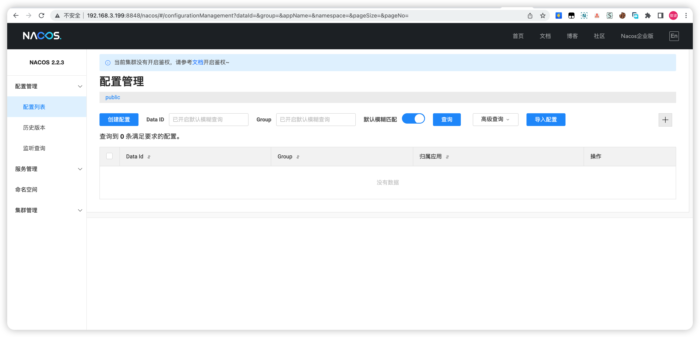 |


#### 1.2 注册中心

>  nacos第一个作用就是作为注册中心,和其他注册中心一样,只需要导入依赖,配置注册中心地址即可, 但是alibaba需要除了在springcloud基础上外还导入一个springcloudalibaba,和springcloud外部依赖放在同一个位置即可

##### 1.2.1 阿里巴巴依赖

```xml
		<dependencyManagement>
        <dependencies>
            <!--
            cloud 依赖
            -->
            <dependency>
                <groupId>org.springframework.cloud</groupId>
                <artifactId>spring-cloud-dependencies</artifactId>
                <version>2021.0.8</version>
                <type>pom</type>
                <scope>import</scope>
            </dependency>
            <!--
            alibaba依赖
            -->
            <dependency>
                <groupId>com.alibaba.cloud</groupId>
                <artifactId>spring-cloud-alibaba-dependencies</artifactId>
                <version>2021.0.4.0</version>
                <type>pom</type>
                <scope>import</scope>
            </dependency>
        </dependencies>
    </dependencyManagement>
```

##### 1.2.2 nacos 注册中心依赖


```xml

        <dependency>
            <groupId>com.alibaba.cloud</groupId>
            <artifactId>spring-cloud-starter-alibaba-nacos-discovery</artifactId>
        </dependency>
```


##### 1.2.3 配置nacos地址

`集群用,分割`

```yaml
spring:
  cloud:
    nacos:
      discovery:
        server-addr: 192.168.204.128:8848  # 注册中心用的nacos的地址
```


##### 1.2.4 效果演示

> 将所有需要注册到注册中心的程序都添加依赖和配置后启动,在nacos页面通过服务列表既可查看


|                         注册中心演示                         |
| :----------------------------------------------------------: |
| 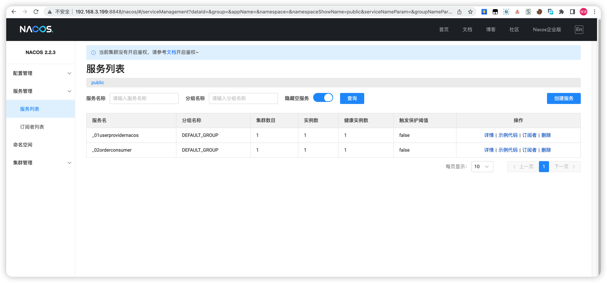 |


##### 1.2.5 设置分组

> 如果要对某些服务进行单独划分,比如某个功能划分为北京和上海两个不同的区域,两个区域的服务不能相互调用,则可以给需要的集群设置group既可,设置相同分组的相同服务为集群,设置相同分组的不同服务可以相互调用

```yaml
spring:
  application:
    name:  _01userprovidernacos
  cloud:
    nacos:
      discovery:
        server-addr: 192.168.3.199:8848
#如果一个服务想进行细分化区分,比如北京上海各有不同的操作,可以给自己设置单独的分组,其它服务在注册时候也设置相同分组既可
        group: bj
```


|                             分组                             |
| :----------------------------------------------------------: |
| 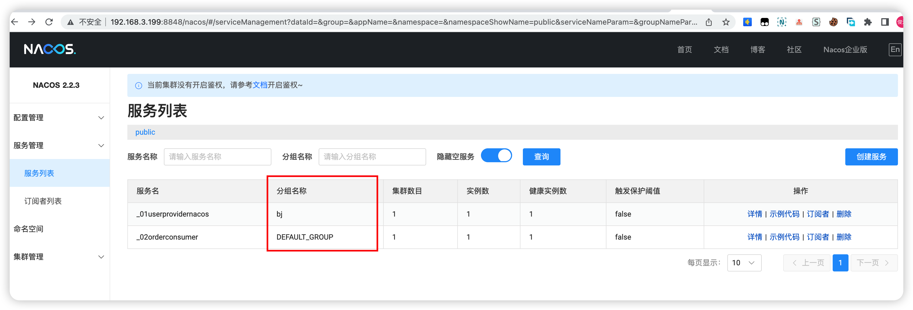 |


#### 1.3 nacos配置中心

> 在分布式微服务中,我们有大量的微服务和服务器,因此会有大量的重复的配置文件,当我们的配置发生变化的时候,需要重新部署到所有的机器上面,非常繁琐,为了解决这个痛点,我们将配置文件都放入到配置中心中,配置中心为了方便服务配置文件统一管理，实时更新，所以需要分布式配置中心组件
>
> nacos的注册中心和配置中心分别为单独的依赖,nacos作为配置中心,key实现实时刷新,从2021版本开始支持import模式


##### 1.3.1 普通模式

###### 1.3.1.1 客户端依赖

```xml
        <dependency>
            <groupId>com.alibaba.cloud</groupId>
            <artifactId>spring-cloud-starter-alibaba-nacos-config</artifactId>
        </dependency>
    <!--
    不使用spring.config.import模式,如果使用的是2021版本以及更新的版本要使用普通模式需要添加当前依赖
    -->
        <dependency>
            <groupId>org.springframework.cloud</groupId>
            <artifactId>spring-cloud-starter-bootstrap</artifactId>
        </dependency>
```


###### 1.3.1.2 客户端配置

> 和其他的配置中心一样,需要配置中心服务器地址和文件的格式


**任何模式都需要在开启刷新的类上面添加`@RefreshScope`注解**

| 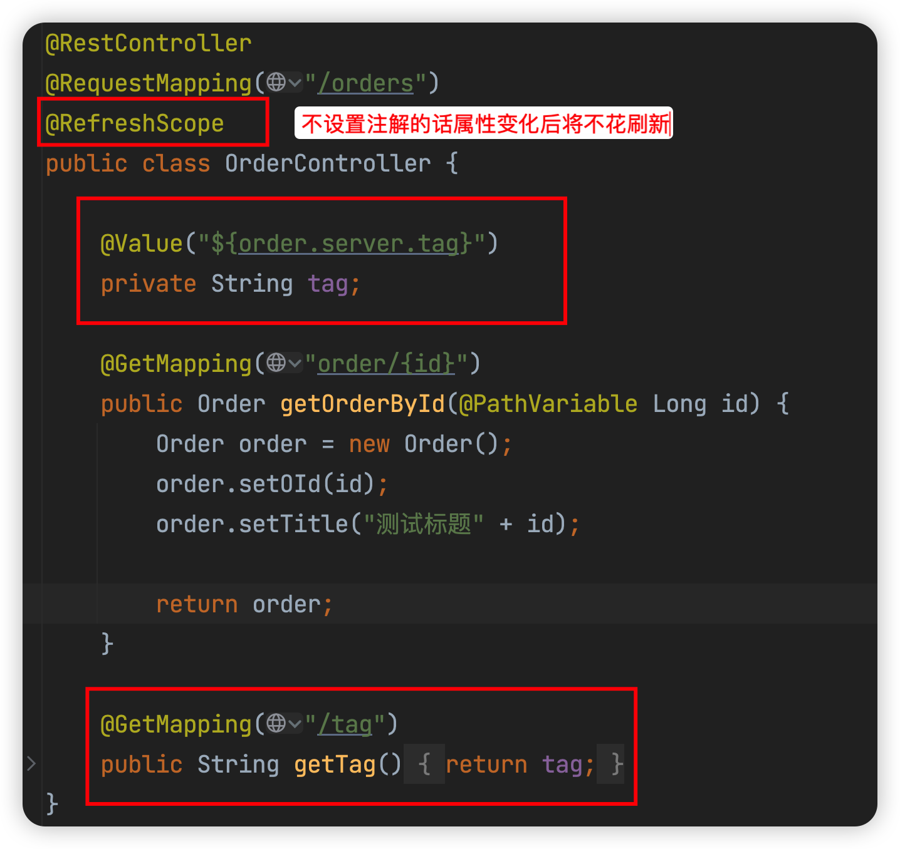 |
| :----------------------------------------------------------: |


在添加了`spring-cloud-starter-bootstrap`依赖的情况下按照规则在nacos中创建对应的文件,符合配置中的规则,程序启动的时候就可以加载了, 此配置需要在`bootstrap.yml`中

```yaml
spring:
  application:
    name:  _02orderconsumer
  profiles:
    active: dev #使用的配置为dev
  cloud:
    nacos:
      discovery:
        server-addr: 192.168.3.199:8848
      config: #最后找的文件就是在namespace下对应的group找一个和applicationname-profile.file-extension的文件,比如此处最终就是查找namespace命名空间下的_02orderconsumer-dev.yml
        server-addr: 192.168.3.199:8848  #配置中心的nacos地址,可以是一个单独的,也可以和注册中心是一个
        file-extension: yml #注意,在老版本的nacos中这个地方必须写yaml,否则启动会找不到文件
        namespace: 02-namespace  # 这里写的不是namespace的名字,而是在nacos中新建命名空间时候的id, 而且在创建namespace的时候id不能为纯数字
        group: beijing #设置配置文件在指定的namespace下的指定group中
        #以下配置在上面的配置无法查到属性的时候生效
        extension-configs:
          - data-id: test01.yml #如果下面的group在nacos中存在,并且存在data-id的文件,会从这个文件中加载数据,自上而下查询,下面的配置会覆盖上面的配置
            group: beijing
          - data-id: test01.yml
            group: group_02
```


###### 1.3.1.3 命名空间

> 创建命名空间

| 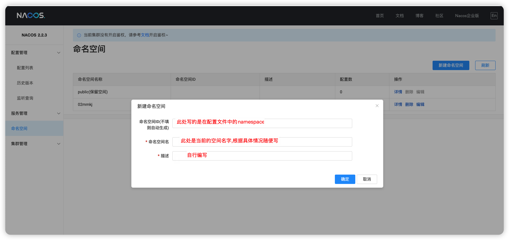 |
| :----------------------------------------------------------: |


###### 1.3.1.4 配置列表

> 在配置列表里面的时候要注意点击对应的命名空间

| 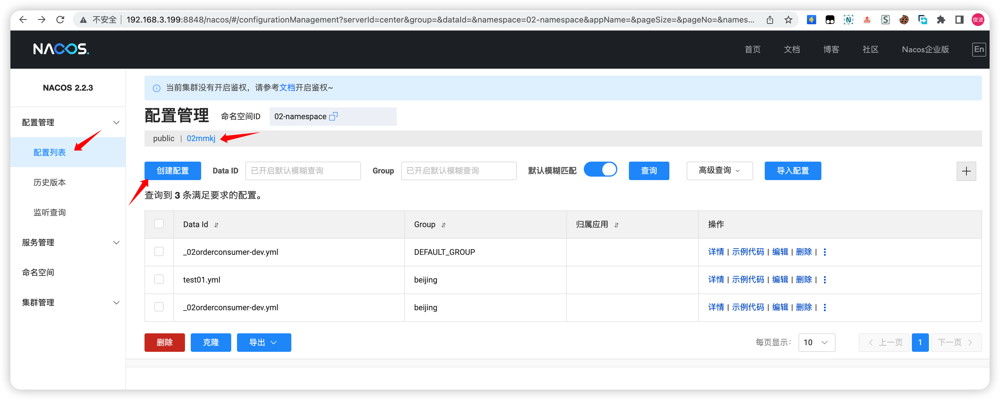 |
| :----------------------------------------------------------: |


###### 1.3.1.5 创建配置

|  |
| :----------------------------------------------------------: |


##### 1.3.2 spring.config.import模式

> nacos 2021版本兼容spring最新的import模式来刷新配置,不需要在项目中添加spring-cloud-starter-bootstrap依赖

import模式按照要求,配置必须写在`application.yml`中, 而不能写在`bootstrap.yml`中, 其它的与上面保持一致,

在需要刷新的属性所在的类上面不要忘记添加`@RefreshScope`注解

> application.yml

```yaml
spring:
  application:
    name:  _03orderconsumer
  profiles:
    active: dev #使用的配置为dev
  cloud:
    nacos:
      discovery:
        server-addr: 192.168.3.199:8848
      config:
        server-addr: 192.168.3.199:8848  #配置中心的nacos地址,可以是一个单独的,也可以和注册中心是一个
        namespace: 02-namespace  # 这里写的不是namespace的名字,而是在nacos中新建命名空间时候的id, 而且在创建namespace的时候id不能为纯数字
 #       group: group_01 #设置配置文件在指定的namespace下的指定group中
  config: #配置中心设置
    import: #下面的配置会挨个检查,后面符合的会覆盖前面复合的选项
      - optional:nacos:_03orderconsumer-dev.yml  # 监听 DEFAULT_GROUP:_03orderconsumer-dev.yml,在没有默认选项的情况下生效
      - optional:nacos:test01.yml?group=group_01 # 如果在nacos中存在group1分组就加载 group_01:test01.yml,除非没有这个文件
      - optional:nacos:test02.yml?group=group_02&refreshEnabled=false # 监听group2的test02.yml并且不开启动态刷新,如果当前也符合会自动覆盖上面符合的选项
      - nacos:test03.yml # 默认加载文件,没有的话会从下面可选的中找符合要求的,如果都没有就会报错
server:
  port: 12355

```


#### 1.4 Nacos 监控

> Nacos 0.8.0版本完善了监控系统，支持通过暴露metrics数据接入第三方监控系统监控Nacos运行状态，目前支持?prometheus、elastic search和influxdb，下面结合prometheus和grafana如何监控Nacos。
>
> 具体参考https://nacos.io/zh-cn/docs/v2/guide/admin/monitor-guide.html

##### 1.4.1 暴露metrics数据

在搭建nacos集群的时候,修改配置application.properties文件，暴露metrics数据,访问{ip}:8848/nacos/actuator/prometheus，看是否能访问到metrics数据

```properties
management.endpoints.web.exposure.include=*
```


|                      nacos metrics数据                       |
| :----------------------------------------------------------: |
| 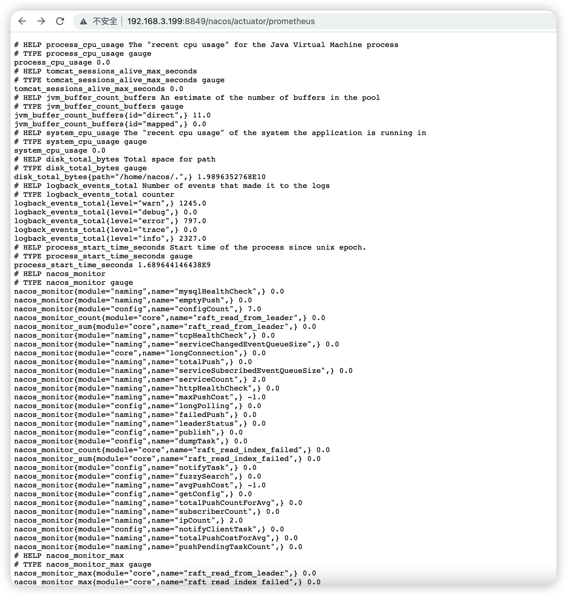 |


##### 1.4.2 启动prometheus

`docker-compose.yml,此处只显示了与之相关的内容,添加到nacos启动的docker-compose中即可,此处以集群搭建nacos的方案为配合`

```yaml
  prometheus: #监控容器,用于获取nacos数据并保存
    container_name: prometheus
    image: prom/prometheus:latest
    #platform: linux/amd64 #ARM平台
    volumes: #设置配置文件,此处使用的是集群的nacos
      - ./prometheus/prometheus-cluster.yaml:/etc/prometheus/prometheus.yml
    ports:
      - "9090:9090"
    depends_on:
      - nacos1
    restart: on-failure
```


`prometheus-cluster.yaml`


```yaml
# my global config
global:
  scrape_interval:     15s # Set the scrape interval to every 15 seconds. Default is every 1 minute.
  evaluation_interval: 15s # Evaluate rules every 15 seconds. The default is every 1 minute.
  # scrape_timeout is set to the global default (10s).

# Alertmanager configuration
alerting:
  alertmanagers:
    - static_configs:
        - targets:
          # - alertmanager:9093

# Load rules once and periodically evaluate them according to the global 'evaluation_interval'.
rule_files:
# - "first_rules.yml"
# - "second_rules.yml"

# A scrape configuration containing exactly one endpoint to scrape:
# Here it's Prometheus itself.
scrape_configs:
  # The job name is added as a label `job=<job_name>` to any timeseries scraped from this config.
  - job_name: 'prometheus'

    # metrics_path defaults to '/metrics'
    # scheme defaults to 'http'.

    static_configs:
      - targets: ['localhost:9090']

  - job_name: 'nacos' #任务名称
    metrics_path: '/nacos/actuator/prometheus' # 数据来源地址
    static_configs:
      - targets: ["nacos1:8848","nacos2:8848","nacos3:8848"] #nacos集群地址,改为具体的集群地址即可
```


##### 1.4.3 查看状态

> 查看状态有没有问题,如果nacos 的状态是up就没问题


| 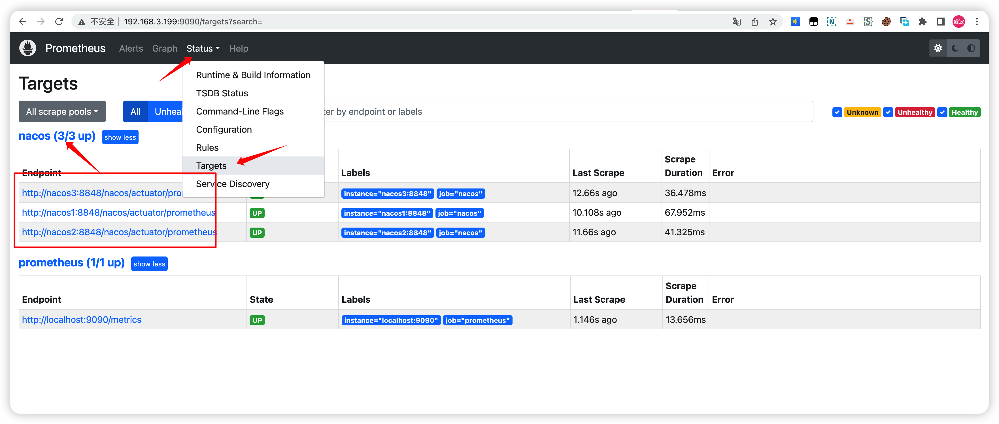 |
| :----------------------------------------------------------: |


##### 1.4.4  查看数据

> 在graph页面的搜索栏输入nacos_monitor就可以查看 到数据了


| 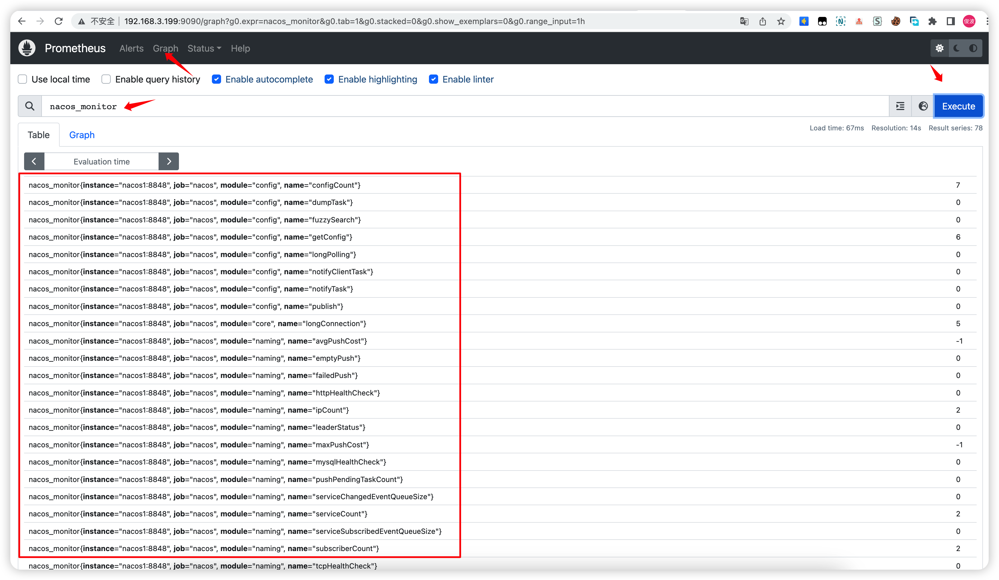 |
| :----------------------------------------------------------: |


##### 1.4.5 搭配grafana图形化展示metrics数据

> 上面的数据都是纯文本,需要自己分析数据,可以搭配grafana来图形化显示数据,`和prometheus在同一台机器上安装grafana`


`最终版docker-compose.yml`

```yaml
version: "3"
services:
  nacos1:
    hostname: nacos1
    container_name: nacos1
    image: nacos/nacos-server:v2.2.3
    #platform: linux/amd64 #ARM平台
    volumes:
      - ./cluster-logs/nacos1:/home/nacos/logs
      - ./init.d/application.properties:/home/nacos/conf/application.properties
    ports:
      - "8848:8848"
      - "9848:9848"
      - "9555:9555"
    env_file:
      - ./env/nacos-hostname.env
    restart: always
    depends_on:
      mysql:
        condition: service_healthy
  nacos2:
    hostname: nacos2
    image: nacos/nacos-server:v2.2.3
    #platform: linux/amd64 #ARM平台
    container_name: nacos2
    volumes:
      - ./cluster-logs/nacos2:/home/nacos/logs
      - ./init.d/application.properties:/home/nacos/conf/application.properties
    ports:
      - "8849:8848"
      - "9849:9848"
    env_file:
      - ./env/nacos-hostname.env
    restart: always
    depends_on:
      mysql:
        condition: service_healthy
  nacos3:
    hostname: nacos3
    #platform: linux/amd64 #ARM平台
    image: nacos/nacos-server:v2.2.3
    container_name: nacos3
    volumes:
      - ./cluster-logs/nacos3:/home/nacos/logs
      - ./init.d/application.properties:/home/nacos/conf/application.properties
    ports:
      - "8850:8848"
      - "9850:9848"
    env_file:
      - ./env/nacos-hostname.env
    restart: always
    depends_on:
      mysql:
        condition: service_healthy
  mysql:
    container_name: mysql
    build:
      context: .
      dockerfile: ./mysql57/Dockerfile
    env_file:
      - ./env/mysql.env
    volumes:
      - ./mysql:/var/lib/mysql
    ports:
      - "3306:3306"
    healthcheck:
      test: [ "CMD", "mysqladmin" ,"ping", "-h", "localhost" ]
      interval: 5s
      timeout: 10s
      retries: 10
  prometheus: #监控容器,用于获取nacos数据并保存
    container_name: prometheus
    #platform: linux/amd64 #ARM平台
    image: prom/prometheus:latest
    volumes: #设置配置文件
      - ./prometheus/prometheus-cluster.yaml:/etc/prometheus/prometheus.yml
    ports:
      - "9090:9090" #prometheus http端口
    depends_on:
      - nacos1
    restart: on-failure
  grafana: #图形化监控地址,配合prometheus使用
    container_name: grafana
    #platform: linux/amd64 #ARM平台
    image: grafana/grafana:latest
    ports:
      - 3000:3000 #grafana http端口
    restart: on-failure     
```


##### 1.4.6 配置grafana

> 通过访问http://{ip}:端口的方式访问grafana,此处为http://192.168.3.199:3000/.`默认用户名密码为admin`,首次登录会要求修改密码


###### 1.4.6.1 配置Prometheus

> 按照下面几张图来设置


| 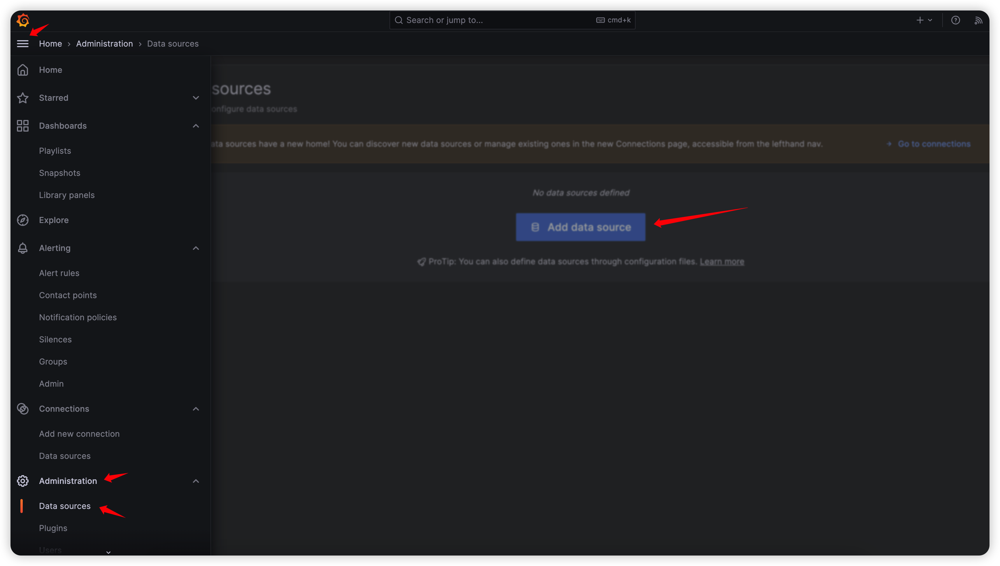 |
| :----------------------------------------------------------: |
| 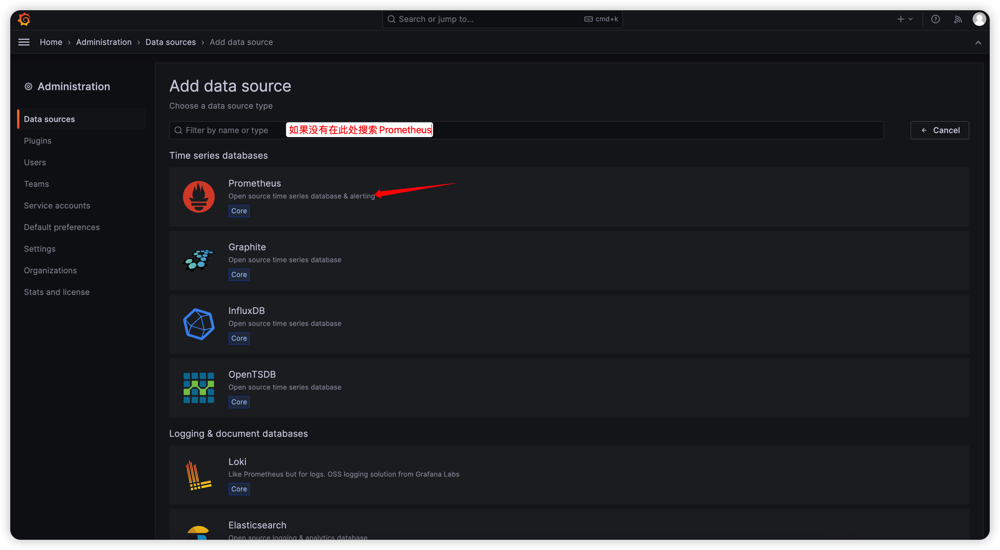 |
| 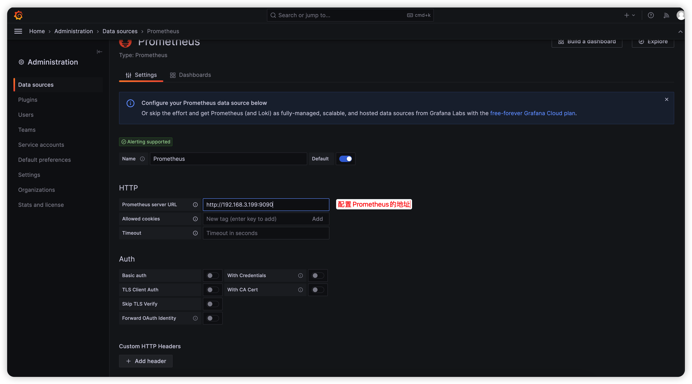 |


###### 1.4.6.2 下载nacos grafana模板

> 访问https://grafana.com/grafana/dashboards/ 搜索nacos


|                         搜索下载模板                         |
| :----------------------------------------------------------: |
| 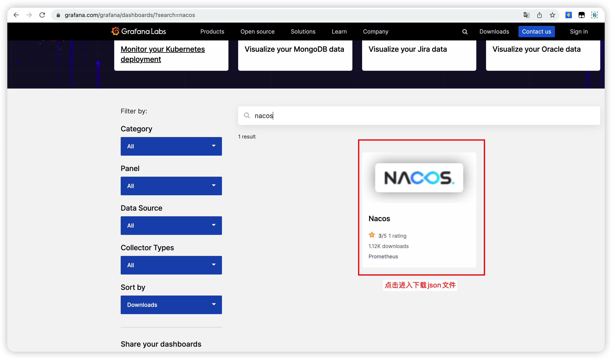 |
| :----------------------------------------------------------: |
| 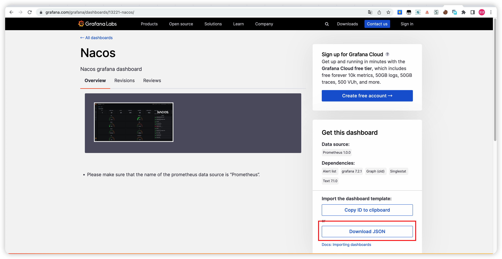 |


###### 1.4.6.3 上传到自己的grafana

> 上传模板,界面外观与grafana版本有关,具体以实际情况为准


| 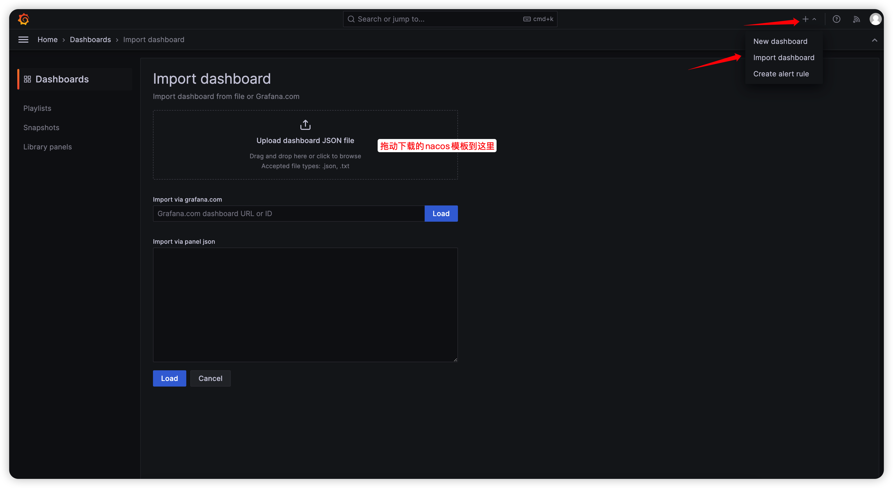 |
| :----------------------------------------------------------: |
| 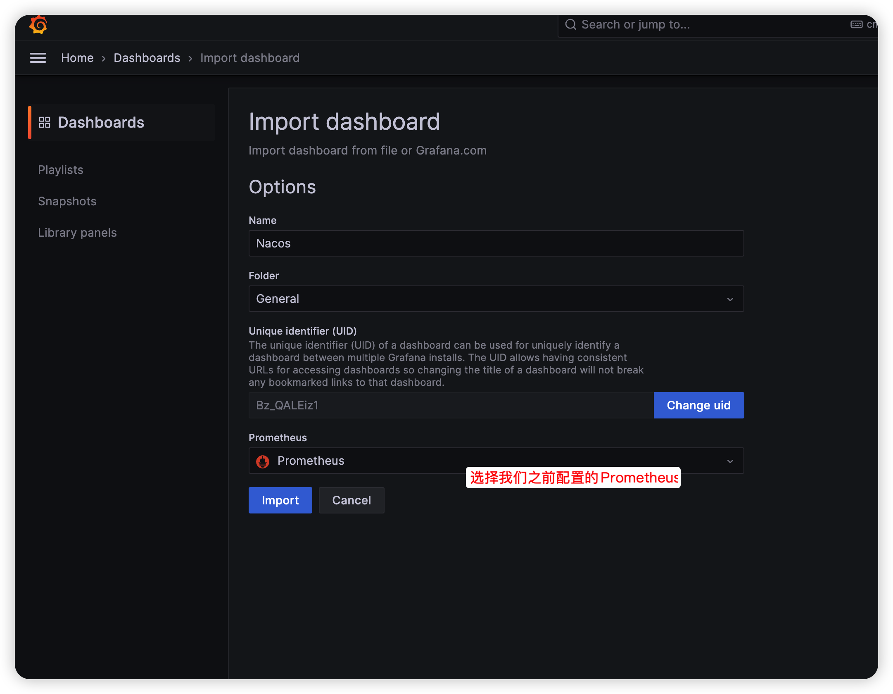 |


###### 1.4.6.4 查看数据

> 鼠标移动到每一个小区域模块的时候会在右上角显示三个点,点击可以进行更多操作

| 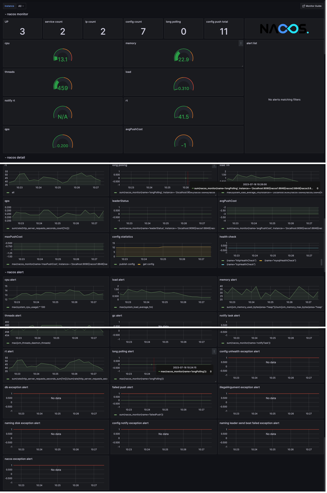 |
| :-----------------------------------------------: |


###### 1.4.6.7 告警

> 当Nacos运行出现问题时，需要grafana告警通知相关负责人。grafana支持多种告警方式，常用的有邮件，钉钉和webhook方式,具体配置请参考官方文档https://nacos.io/zh-cn/docs/v2/guide/admin/monitor-guide.html


###### 1.4.6.8 Nacos metrics含义

> 上面的监控数据的含义请参考官方文档https://nacos.io/zh-cn/docs/v2/guide/admin/monitor-guide.html


