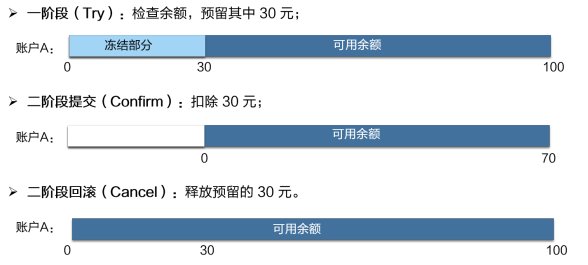
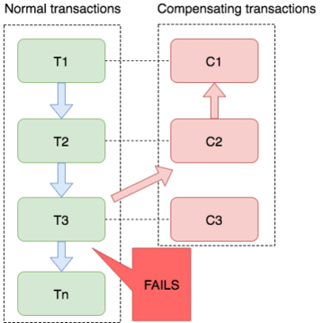

### Seata

> 首先介绍如何使用,后面介绍seata

#### 一 Server安装

> 本文档基于Seata 1.7 版本,与1.5.0开始一样,服务端配置采用application.yml,将不在有conf文件


##### 1.1 docker-compose.yml


```yaml
version: '3.1'
services:
  seata:
    image: seataio/seata-server
    #platform: linux/amd64 #ARM平台
    restart: always
    container_name: seata
    ports:
      - 8091:8091
      - 7091:7091 #web页面端口
    environment:
      - SEATA_IP=192.168.3.201
      - SEATA_PORT=8091      
    volumes:
      - ./application.yml:/seata-server/resources/application.yml #新版的使用yml文件做配置,具体配置参考下面的文档
```


##### 1.2  application.yml

> 服务端application.yml,搭配docker-compose使用自行修改地址

```yaml
server:
  port: 7091

spring:
  application:
    name: seata-server
logging:
  config: classpath:logback-spring.xml
  file:
    path: ${user.home}/logs/seata

console: #控制台账号密码
  user:
    username: admin
    password: admin

seata:
  config: #配置类型,此处使用nacos也就是我们需要再nacos中创建相关配置
    # support: nacos, consul, apollo, zk, etcd3
    type: nacos
    nacos:
      serverAddr: 192.168.3.201:8848
      group: SEATA_GROUP
      namespace: ""
      cluster: default
      username: ""
      password: ""
      data-id: seataServer.properties #在nacos中我们需要创建的配置文件
  registry: #注册中心
    # support: nacos, eureka, redis, zk, consul, etcd3, sofa
    type: nacos
    loadBalance: RandomLoadBalance
    loadBalanceVirtualNodes: 10
    nacos:
      application: seata-server
      serverAddr: 192.168.3.201:8848
      group: SEATA_GROUP
      namespace: ""
      cluster: default
      username: ""
      password: ""
  security:
    secretKey: SeataSecretKey0c382ef121d778043159209298fd40bf3850a017
    tokenValidityInMilliseconds: 1800000
    ignore:
      urls: /,/**/*.css,/**/*.js,/**/*.html,/**/*.map,/**/*.svg,/**/*.png,/**/*.ico,/console-fe/public/**,/api/v1/auth/login


```


##### 1.3 nacos中创建配置

> 因为上面我们选择了使用nacos作为配置中心,因此我们需要在里面将配置设置好
>
> 配置的选项参考https://github.com/seata/seata/blob/develop/script/config-center/config.txt
> 不配置的为默认值,我们主要是配置使用数据库来保存seata相关数据,`注意group,namespace和文件的名字需要和你在上面配置文件中指定的一致`

`注意,如果设置的内容中有空值 比如 name=    这样的需要删除,不然nacos会提示格式错误`


```properties
store.mode=db
store.lock.mode=db
store.session.mode=db
store.db.datasource=druid
store.db.dbType=mysql
store.db.driverClassName=com.mysql.cj.jdbc.Driver
store.db.url=jdbc:mysql://192.168.3.201:3306/seata?useSSL=false&useUnicode=true&rewriteBatchedStatements=true
store.db.user=root
store.db.password=root
store.db.minConn=5
store.db.maxConn=30
store.db.globalTable=global_table
store.db.branchTable=branch_table
store.db.distributedLockTable=distributed_lock
store.db.queryLimit=100
store.db.lockTable=lock_table
store.db.maxWait=5000
```


|                           配置示例                           |
| :----------------------------------------------------------: |
|  |


##### 1.4  协调者数据库配置

> 我们上面的配置文件中使用了数据库来对协调者的数据进行保存,因为需要在上面指定的数据库中创建对应的库和下面的表


```sql
SET NAMES utf8mb4;
SET FOREIGN_KEY_CHECKS = 0;

-- ----------------------------
-- Table structure for branch_table
-- ----------------------------
DROP TABLE IF EXISTS `branch_table`;
CREATE TABLE `branch_table`  (
  `branch_id` bigint(20) NOT NULL,
  `xid` varchar(128) CHARACTER SET utf8 COLLATE utf8_general_ci NOT NULL,
  `transaction_id` bigint(20) NULL DEFAULT NULL,
  `resource_group_id` varchar(32) CHARACTER SET utf8 COLLATE utf8_general_ci NULL DEFAULT NULL,
  `resource_id` varchar(256) CHARACTER SET utf8 COLLATE utf8_general_ci NULL DEFAULT NULL,
  `branch_type` varchar(8) CHARACTER SET utf8 COLLATE utf8_general_ci NULL DEFAULT NULL,
  `status` tinyint(4) NULL DEFAULT NULL,
  `client_id` varchar(64) CHARACTER SET utf8 COLLATE utf8_general_ci NULL DEFAULT NULL,
  `application_data` varchar(2000) CHARACTER SET utf8 COLLATE utf8_general_ci NULL DEFAULT NULL,
  `gmt_create` datetime(6) NULL DEFAULT NULL,
  `gmt_modified` datetime(6) NULL DEFAULT NULL,
  PRIMARY KEY (`branch_id`) USING BTREE,
  INDEX `idx_xid`(`xid`) USING BTREE
) ENGINE = InnoDB CHARACTER SET = utf8 COLLATE = utf8_general_ci ROW_FORMAT = Dynamic;

-- ----------------------------
-- Table structure for global_table
-- ----------------------------
DROP TABLE IF EXISTS `global_table`;
CREATE TABLE `global_table`  (
  `xid` varchar(128) CHARACTER SET utf8 COLLATE utf8_general_ci NOT NULL,
  `transaction_id` bigint(20) NULL DEFAULT NULL,
  `status` tinyint(4) NOT NULL,
  `application_id` varchar(32) CHARACTER SET utf8 COLLATE utf8_general_ci NULL DEFAULT NULL,
  `transaction_service_group` varchar(32) CHARACTER SET utf8 COLLATE utf8_general_ci NULL DEFAULT NULL,
  `transaction_name` varchar(128) CHARACTER SET utf8 COLLATE utf8_general_ci NULL DEFAULT NULL,
  `timeout` int(11) NULL DEFAULT NULL,
  `begin_time` bigint(20) NULL DEFAULT NULL,
  `application_data` varchar(2000) CHARACTER SET utf8 COLLATE utf8_general_ci NULL DEFAULT NULL,
  `gmt_create` datetime NULL DEFAULT NULL,
  `gmt_modified` datetime NULL DEFAULT NULL,
  PRIMARY KEY (`xid`) USING BTREE,
  INDEX `idx_gmt_modified_status`(`gmt_modified`, `status`) USING BTREE,
  INDEX `idx_transaction_id`(`transaction_id`) USING BTREE
) ENGINE = InnoDB CHARACTER SET = utf8 COLLATE = utf8_general_ci ROW_FORMAT = Dynamic;

-- ----------------------------
-- Table structure for lock_table
-- ----------------------------
DROP TABLE IF EXISTS `lock_table`;
CREATE TABLE `lock_table`  (
  `row_key` varchar(128) CHARACTER SET utf8 COLLATE utf8_general_ci NOT NULL,
  `xid` varchar(128) CHARACTER SET utf8 COLLATE utf8_general_ci NULL DEFAULT NULL,
  `transaction_id` bigint(20) NULL DEFAULT NULL,
  `branch_id` bigint(20) NOT NULL,
  `resource_id` varchar(256) CHARACTER SET utf8 COLLATE utf8_general_ci NULL DEFAULT NULL,
  `table_name` varchar(32) CHARACTER SET utf8 COLLATE utf8_general_ci NULL DEFAULT NULL,
  `pk` varchar(36) CHARACTER SET utf8 COLLATE utf8_general_ci NULL DEFAULT NULL,
  `gmt_create` datetime NULL DEFAULT NULL,
  `gmt_modified` datetime NULL DEFAULT NULL,
  PRIMARY KEY (`row_key`) USING BTREE,
  INDEX `idx_branch_id`(`branch_id`) USING BTREE
) ENGINE = InnoDB CHARACTER SET = utf8 COLLATE = utf8_general_ci ROW_FORMAT = Dynamic;

SET FOREIGN_KEY_CHECKS = 1;

```


#### 二 客户端使用

#####  2.1 参与者数据库配置

> seata会在我们参与事物的业务相关的数据库中保存本地回滚日志,用于补偿回滚用,需要创建一个名字叫`undo_log`的表,此表需要所有使用seata作为事务管理的分布式服务操作的数据库中创建这个表


```sql
CREATE TABLE `undo_log` (
  `id` bigint(20) NOT NULL AUTO_INCREMENT,
  `branch_id` bigint(20) NOT NULL,
  `xid` varchar(100) NOT NULL,
  `context` varchar(128) NOT NULL,
  `rollback_info` longblob NOT NULL,
  `log_status` int(11) NOT NULL,
  `log_created` datetime NOT NULL,
  `log_modified` datetime NOT NULL,
  `ext` varchar(100) DEFAULT NULL,
  PRIMARY KEY (`id`),
  UNIQUE KEY `ux_undo_log` (`xid`,`branch_id`)
) ENGINE=InnoDB AUTO_INCREMENT=1 DEFAULT CHARSET=utf8;
```


##### 2.2 导入依赖

> 在所有参与的客户端中添加以下依赖

```xml
  <dependency>
            <groupId>com.alibaba.cloud</groupId>
            <artifactId>spring-cloud-starter-alibaba-seata</artifactId>
            <exclusions>
                <exclusion>
                    <artifactId>seata-spring-boot-starter</artifactId>
                    <groupId>io.seata</groupId>
                </exclusion>
            </exclusions>
        </dependency>
<!--根据实际情况-->
        <dependency>
            <groupId>io.seata</groupId>
            <artifactId>seata-spring-boot-starter</artifactId>
            <version>1.7.0</version>
        </dependency>
```


##### 2.3指定seata位置

> 在所有客户端的application.yml中的配置文件中添加以下配置

```yaml
seata:
  enabled: true
  application-id: 09provider-seata
  registry: #注册中心
    # support: nacos, eureka, redis, zk, consul, etcd3, sofa
    type: nacos
    nacos:
      application: seata-server
      serverAddr: 192.168.3.201:8848
      group: SEATA_GROUP
      namespace: public
      cluster: default
  # Seata 事务组名称，值可以随便写,但是要和下面的保持一致
  tx-service-group: my_test_tx_group
  service:
    vgroupMapping:
      my_test_tx_group: default
```


##### 2.4 代码中添加注解

> Seata使用非常简单,在所有在参与分布式事务的服务的对应方法上面添加注解既可


```java
		@Transactional
    @GlobalTransactional()//noRollbackFor={ArithmeticException.class} 可以通过此参数设置不需要回滚的异常
    public int update(int exp) {

        oderMapper.update();
        wFeign.update();
        if (exp==1) {
            int i = 1 / 0;
        }
        return 10;
    }
```


#### 三、Seata 及其三种模式详解


##### 3.1 分布式事务 Seata 介绍

Seata（Simple Extensible Autonomous Transaction Architecture，简单可扩展自治事务框架）是 2019 年 1 月份蚂蚁金服和阿里巴巴共同开源的分布式事务解决方案。Seata 开源半年左右，目前已经有超过 1.1 万 star，社区非常活跃。我们热忱欢迎大家参与到 Seata 社区建设中，一同将 Seata 打造成开源分布式事务标杆产品。

Seata：[https://](https://github.com/seata/seata)[github.com/seata/seata](https://github.com/seata/seata)

|           Seata           |
| :-----------------------: |
|  |


##### 3.2 分布式事务 Seata 产品模块

如下图所示，Seata 中有三大模块，分别是 TM、RM 和 TC。 其中 TM 和 RM 是作为 Seata 的客户端与业务系统集成在一起，TC 作为 Seata 的服务端独立部署。


|     Seata架构图     |
| :-----------------: |
|  |


在 Seata 中，分布式事务的执行流程：

- TM 开启分布式事务（TM 向 TC 注册全局事务记录）；
- 按业务场景，编排数据库、服务等事务内资源（RM 向 TC 汇报资源准备状态 ）；
- TM 结束分布式事务，事务一阶段结束（TM 通知 TC 提交/回滚分布式事务）；
- TC 汇总事务信息，决定分布式事务是提交还是回滚；
- TC 通知所有 RM 提交/回滚 资源，事务二阶段结束；


##### 3.3 分布式事务 Seata 解决方案

Seata 会有 4 种分布式事务解决方案，分别是 AT 模式、TCC 模式、Saga 模式和 XA 模式。

|                 Seata模式                 |
| :---------------------------------------: |
|  |


###### 3.3.1 AT 模式

AT 模式是一种无侵入的分布式事务解决方案。在 AT 模式下，用户只需关注自己的“业务 SQL”，用户的 “业务 SQL” 作为一阶段，Seata 框架会自动生成事务的二阶段提交和回滚操作。

|           AT模式           |
| :------------------------: |
|  |


###### 3.3.2 AT 模式如何做到对业务的无侵入 

- 一阶段：

在一阶段，Seata 会拦截“业务 SQL”，首先解析 SQL 语义，找到“业务 SQL”要更新的业务数据，在业务数据被更新前，将其保存成“before image”，然后执行“业务 SQL”更新业务数据，在业务数据更新之后，再将其保存成“after image”，最后生成行锁。以上操作全部在一个数据库事务内完成，这样保证了一阶段操作的原子性。

|           一阶段           |
| :------------------------: |
|  |


- 二阶段提交：

二阶段如果是提交的话，因为“业务 SQL”在一阶段已经提交至数据库， 所以 Seata 框架只需将一阶段保存的快照数据和行锁删掉，完成数据清理即可。

|         二阶段提交         |
| :------------------------: |
|  |


- 二阶段回滚：

二阶段如果是回滚的话，Seata 就需要回滚一阶段已经执行的“业务 SQL”，还原业务数据。回滚方式便是用“before image”还原业务数据；但在还原前要首先要校验脏写，对比“数据库当前业务数据”和 “after image”，如果两份数据完全一致就说明没有脏写，可以还原业务数据，如果不一致就说明有脏写，出现脏写就需要转人工处理。

|         二阶段回滚         |
| :------------------------: |
|  |

AT 模式的一阶段、二阶段提交和回滚均由 Seata 框架自动生成，用户只需编写“业务 SQL”，便能轻松接入分布式事务，AT 模式是一种对业务无任何侵入的分布式事务解决方案。


###### 3.3.3 TCC 模式

2019 年 3 月份，Seata 开源了 TCC 模式，该模式由蚂蚁金服贡献。TCC 模式需要用户根据自己的业务场景实现 Try、Confirm 和 Cancel 三个操作；事务发起方在一阶段执行 Try 方式，在二阶段提交执行 Confirm 方法，二阶段回滚执行 Cancel 方法。

|          TCC模式           |
| :------------------------: |
|  |

TCC 三个方法描述：

- Try：资源的检测和预留；
- Confirm：执行的业务操作提交；要求 Try 成功 Confirm 一定要能成功；
- Cancel：预留资源释放；

**`蚂蚁金服在 TCC 的实践经验`**

|  |
| :----------------------------------------: |

**1 TCC 设计 - 业务模型分 2 阶段设计：**

用户接入 TCC ，最重要的是考虑如何将自己的业务模型拆成两阶段来实现。

以“扣钱”场景为例，在接入 TCC 前，对 A 账户的扣钱，只需一条更新账户余额的 SQL 便能完成；但是在接入 TCC 之后，用户就需要考虑如何将原来一步就能完成的扣钱操作，拆成两阶段，实现成三个方法，并且保证一阶段 Try 成功的话 二阶段 Confirm 一定能成功。

|                            |
| :------------------------: |
|  |

如上图所示，

Try 方法作为一阶段准备方法，需要做资源的检查和预留。在扣钱场景下，Try 要做的事情是就是检查账户余额是否充足，预留转账资金，预留的方式就是冻结 A 账户的 转账资金。Try 方法执行之后，账号 A 余额虽然还是 100，但是其中 30 元已经被冻结了，不能被其他事务使用。

二阶段 Confirm 方法执行真正的扣钱操作。Confirm 会使用 Try 阶段冻结的资金，执行账号扣款。Confirm 方法执行之后，账号 A 在一阶段中冻结的 30 元已经被扣除，账号 A 余额变成 70 元 。

如果二阶段是回滚的话，就需要在 Cancel 方法内释放一阶段 Try 冻结的 30 元，使账号 A 的回到初始状态，100 元全部可用。

用户接入 TCC 模式，最重要的事情就是考虑如何将业务模型拆成 2 阶段，实现成 TCC 的 3 个方法，并且保证 Try 成功 Confirm 一定能成功。相对于 AT 模式，TCC 模式对业务代码有一定的侵入性，但是 TCC 模式无 AT 模式的全局行锁，TCC 性能会比 AT 模式高很多。

**2 TCC 设计 - 允许空回滚：**

|                                            |
| :----------------------------------------: |
|  |

Cancel 接口设计时需要允许空回滚。在 Try 接口因为丢包时没有收到，事务管理器会触发回滚，这时会触发 Cancel 接口，这时 Cancel 执行时发现没有对应的事务 xid 或主键时，需要返回回滚成功。让事务服务管理器认为已回滚，否则会不断重试，而 Cancel 又没有对应的业务数据可以进行回滚。

**3 TCC 设计 - 防悬挂控制：**

|                                            |
| :----------------------------------------: |
|  |

悬挂的意思是：Cancel 比 Try 接口先执行，出现的原因是 Try 由于网络拥堵而超时，事务管理器生成回滚，触发 Cancel 接口，而最终又收到了 Try 接口调用，但是 Cancel 比 Try 先到。按照前面允许空回滚的逻辑，回滚会返回成功，事务管理器认为事务已回滚成功，则此时的 Try 接口不应该执行，否则会产生数据不一致，所以我们在 Cancel 空回滚返回成功之前先记录该条事务 xid 或业务主键，标识这条记录已经回滚过，Try 接口先检查这条事务xid或业务主键如果已经标记为回滚成功过，则不执行 Try 的业务操作。

**4 TCC 设计 - 幂等控制：**

|                                            |
| :----------------------------------------: |
|  |

幂等性的意思是：对同一个系统，使用同样的条件，一次请求和重复的多次请求对系统资源的影响是一致的。因为网络抖动或拥堵可能会超时，事务管理器会对资源进行重试操作，所以很可能一个业务操作会被重复调用，为了不因为重复调用而多次占用资源，需要对服务设计时进行幂等控制，通常我们可以用事务 xid 或业务主键判重来控制。


###### 2.3.3 Saga 模式

Saga 模式是 Seata 即将开源的长事务解决方案，将由蚂蚁金服主要贡献。在 Saga 模式下，分布式事务内有多个参与者，每一个参与者都是一个冲正补偿服务，需要用户根据业务场景实现其正向操作和逆向回滚操作。

分布式事务执行过程中，依次执行各参与者的正向操作，如果所有正向操作均执行成功，那么分布式事务提交。如果任何一个正向操作执行失败，那么分布式事务会去退回去执行前面各参与者的逆向回滚操作，回滚已提交的参与者，使分布式事务回到初始状态。

|                            |
| :------------------------: |
|  |

Saga 模式下分布式事务通常是由事件驱动的，各个参与者之间是异步执行的，Saga 模式是一种长事务解决方案。

**1 Saga 模式使用场景**

|                                            |
| :----------------------------------------: |
|  |

Saga 模式适用于业务流程长且需要保证事务最终一致性的业务系统，Saga 模式一阶段就会提交本地事务，无锁、长流程情况下可以保证性能。

事务参与者可能是其它公司的服务或者是遗留系统的服务，无法进行改造和提供 TCC 要求的接口，可以使用 Saga 模式。

Saga模式的优势是：

- 一阶段提交本地数据库事务，无锁，高性能；
- 参与者可以采用事务驱动异步执行，高吞吐；
- 补偿服务即正向服务的“反向”，易于理解，易于实现；

缺点：Saga 模式由于一阶段已经提交本地数据库事务，且没有进行“预留”动作，所以不能保证隔离性。后续会讲到对于缺乏隔离性的应对措施。
**2 基于状态机引擎的 Saga 实现**

|                                           |
| :---------------------------------------: |
|  |

目前 Saga 的实现一般有两种，一种是通过事件驱动架构实现，一种是基于注解加拦截器拦截业务的正向服务实现。Seata 目前是采用事件驱动的机制来实现的，Seata 实现了一个状态机，可以编排服务的调用流程及正向服务的补偿服务，生成一个 json 文件定义的状态图，状态机引擎驱动到这个图的运行，当发生异常的时候状态机触发回滚，逐个执行补偿服务。当然在什么情况下触发回滚用户是可以自定义决定的。该状态机可以实现服务编排的需求，它支持单项选择、并发、异步、子状态机调用、参数转换、参数映射、服务执行状态判断、异常捕获等功能。

**3 状态机引擎原理**

|                                           |
| :---------------------------------------: |
|  |

该状态机引擎的基本原理是，它基于事件驱动架构，每个步骤都是异步执行的，步骤与步骤之间通过事件队列流转，
极大的提高系统吞吐量。每个步骤执行时会记录事务日志，用于出现异常时回滚时使用，事务日志会记录在与业务表所在的数据库内，提高性能。

**4 状态机引擎设计**

|                                            |
| :----------------------------------------: |
|  |

该状态机引擎分成了三层架构的设计，最底层是“事件驱动”层，实现了 EventBus 和消费事件的线程池，是一个 Pub-Sub 的架构。第二层是“流程控制器”层，它实现了一个极简的流程引擎框架，它驱动一个“空”的流程执行，“空”的意思是指它不关心流程节点做什么事情，它只执行每个节点的 process 方法，然后执行 route 方法流转到下一个节点。这是一个通用框架，基于这两层，开发者可以实现任何流程引擎。最上层是“状态机引擎”层，它实现了每种状态节点的“行为”及“路由”逻辑代码，提供 API 和状态图仓库，同时还有一些其它组件，比如表达式语言、逻辑计算器、流水生成器、拦截器、配置管理、事务日志记录等。

**5 Saga 服务设计经验**

和TCC类似，Saga的正向服务与反向服务也需求遵循以下设计原则：

**1）Saga 服务设计 - 允许空补偿**

|                                            |
| :----------------------------------------: |
|  |

**2）Saga 服务设计 - 防悬挂控制**

|                                            |
| :----------------------------------------: |
|  |

**3）Saga 服务设计 - 幂等控制**

|                                                              |
| :----------------------------------------------------------: |
|  |

**4）Saga 设计 - 自定义事务恢复策略**

|                                            |
| :----------------------------------------: |
|  |

前面讲到 Saga 模式不保证事务的隔离性，在极端情况下可能出现脏写。比如在分布式事务未提交的情况下，前一个服务的数据被修改了，而后面的服务发生了异常需要进行回滚，可能由于前面服务的数据被修改后无法进行补偿操作。这时的一种处理办法可以是“重试”继续往前完成这个分布式事务。由于整个业务流程是由状态机编排的，即使是事后恢复也可以继续往前重试。所以用户可以根据业务特点配置该流程的事务处理策略是优先“回滚”还是“重试”，当事务超时的时候，Server 端会根据这个策略不断进行重试。

由于 Saga 不保证隔离性，所以我们在业务设计的时候需要做到“宁可长款，不可短款”的原则，长款是指在出现差错的时候站在我方的角度钱多了的情况，钱少了则是短款，因为如果长款可以给客户退款，而短款则可能钱追不回来了，也就是说在业务设计的时候，一定是先扣客户帐再入帐，如果因为隔离性问题造成覆盖更新，也不会出现钱少了的情况。

**6 基于注解和拦截器的 Saga 实现**

|                                            |
| :----------------------------------------: |
|  |

还有一种 Saga 的实现是基于注解+拦截器的实现，Seata 目前没有实现，可以看上面的伪代码来理解一下，one 方法上定义了 @SagaCompensable 的注解，用于定义 one 方法的补偿方法是 compensateOne 方法。然后在业务流程代码 processA 方法上定义 @SagaTransactional 注解，启动 Saga 分布式事务，通过拦截器拦截每个正向方法当出现异常的时候触发回滚操作，调用正向方法的补偿方法。

**7 两种 Saga 实现优劣对比**

两种 Saga 的实现各有又缺点，下面表格是一个对比：

|                                            |
| :----------------------------------------: |
|  |

状态机引擎的最大优势是可以通过事件驱动的方法异步执行提高系统吞吐，可以实现服务编排需求，在 Saga 模式缺乏隔离性的情况下，可以多一种“向前重试”的事情恢复策略。注解加拦截器的的最大优势是，开发简单、学习成本低。
