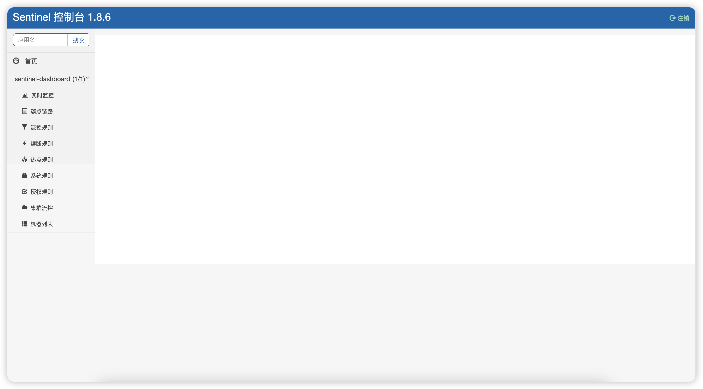

### Sentinel

#### 一  Sentinel是什么

|                 Sentine介绍                 |
| :-----------------------------------------: |
|  |


> 分布式系统的流量防卫兵

- **丰富的应用场景**: Sentinel承接了阿里巴巴近十年的双十一大促流量的核心场景,例如秒杀(即突发流量控制在系统容量可以承受的范围),消息削峰填谷,集群流量控制,实时熔断下游不可用应用等
- **完美的实时监控**:
  Sentinel同事提供实时的监控功能,您可以在控制台看到接入应用的单台机器秒级数据,甚至500台一下规模的集群的汇总运行情况
- **广泛的开源生态**:
  Sentinel提供开箱即用的与其他框架/库的整合模块,例如与SpringCloud,Dubbo,gRPC的整合,您只需要引入响应的依赖并进行简单的配置即可快速接入Sentinel.
- **完美的SPI扩展点**:
  Sentinel提供简单易用的,完美的SPI扩展接口,可以通过实现扩展接口来快速定制逻辑,例如定制规则管理,适配动态数据源等.

> Sentinel 分为两个部分

- 核心库(java客户端) 不依赖于任何框架/库,能够运行所有java运行时环境,同时对Dubbo/Spring Cloud 等框架也有较好的支持
- 控制台(Dashboard)基于Srping Boot开发,打包后可以直接运行,不需要额外的Tomcat等容器,可以通过Dashboard快速查看当前的数据以及进行相关数据的配置


#### 二 控制台安装

#####  2.1 Dockerfile

```dockerfile
FROM amd64/buildpack-deps:buster-curl as installer
#设置使用的sentinel的版本号为1.8.6,可以从https://github.com/alibaba/Sentinel/releases查看
ARG SENTINEL_VERSION=1.8.6
#下载运行的jar包到/home下,并起名叫sentinel-dashboard.jar 
RUN set -x \
    && curl -SL --output /home/sentinel-dashboard.jar https://github.com/alibaba/Sentinel/releases/download/${SENTINEL_VERSION}/sentinel-dashboard-${SENTINEL_VERSION}.jar
#创建启动容器,上面的内容主要是为了下载jar包,如果网络有问题可以提前自己下载好,这样上面的内容可以删除,只保留下面的内容
FROM openjdk:8-jre-slim

# copy sentinel jar,如果上面的下载位置和文件名没变,则可以不变,如果是自己下载的文件,需要根据实际情况修改前半部分的文件地址和名字
COPY --from=installer ["/home/sentinel-dashboard.jar", "/home/sentinel-dashboard.jar"]

ENV JAVA_OPTS '-Dserver.port=8080 -Dcsp.sentinel.dashboard.server=localhost:8080'

RUN chmod -R +x /home/sentinel-dashboard.jar

EXPOSE 8080

CMD java ${JAVA_OPTS} -jar /home/sentinel-dashboard.jar
```


##### 2.2 `docker-compose.yml`

```yaml
version: "3"
services:
  sentinel:
  	restart: always
    container_name: sentinel
    build:
      context: .
      dockerfile: ./Dockerfile # dockerfile所在位置,本案例中在同一目录下
    ports:
      - "8080:8080" #sentinel的端口
```


|  |
| :----------------------------------------------------------: |


##### 2.3  web页面

> 访问对应主机的8080端口,可以查看,默认用户名密码都是sentinel


|  |
| :----------------------------------------------------------: |
|  |


####  三 整合SpringCloud

> 和nacos一样,需要在springcloud-alibaba的基础上才可以使用,此处以基于springmvc的web项目做案例


##### 3.1依赖

```xml
        <dependency>
            <groupId>com.alibaba.cloud</groupId>
            <artifactId>spring-cloud-starter-alibaba-sentinel</artifactId>
        </dependency>
```


#####  3.2 配置

> 通过配置指向 sentinel的控制台,可以查看一些数据或者设置一些规则


```yaml
spring:
  cloud:
    sentinel:
      eager: true #sentinel默认是懒加载,只有在访问被sentinel管理的服务的时候才会出现在dashboard中,该选项可以设置启动就建立心跳链接    
      transport:
        dashboard: 192.168.3.199:8080
```


##### 3.3 使用方式

###### 3.3.1 普通模式

> 只需要在需要进行控制的方法上面添加注解即可


```java
 /*
    value为资源名,fallbackClass指的是fallback方法所在的类,blockHandler为被限流的时候执行的方法的名字,fallback在代码出现异常的时候执行的方法的名字
     */
	@GetMapping("/sentinel1/{ex}")
    @SentinelResource(value = "getOrderSentinel",fallback = "getOrderSentinelfallback",blockHandler = "getOrderSentinelblock")
    public Order getOrderSentinel(@PathVariable int ex) {

        int i = 1 / ex;
        return new Order();
    }

    /**
     * 当前方法的参数列表顺序和正常方法保持一致,返回值保持一致
     * @param ex
     * @return
     */
    public Order getOrderSentinelfallback( int ex) {
        Order order = new Order();
        order.setTitle("getOrderSentinelfallback");
        order.setOId((long) -100);
        return order;
    }

    /**
     * block 的参数必须包含BlockException异常类型
     * @param blockException
     * @return
     */
    public Order getOrderSentinelblock( int ex,BlockException blockException) {

        Order order = new Order();
        order.setTitle("getOrderSentinelblock"+blockException.getMessage());
        order.setOId((long) -200);
        return order;
    }
```


###### 3.3.2 全局模式

> 给每个方法单独设置方法的方式效率不高,在很多情况下我们的处理逻辑是一样的,所以进行封装会更容易使用以及修改,只需要将对应的方法用一个单独的类来编写既可


`MyBlockHandler`

```java
public class MyBlockHandler {

    /**
     * block 的参数必须包含BlockException异常类型,并且是静态
     * @param blockException
     * @return
     */
    public static Order getOrderSentinelblock(int ex, BlockException blockException) {

        Order order = new Order();
        order.setTitle("getOrderSentinelblock"+blockException.getMessage());
        order.setOId((long) -200);
        return order;
    }
}

```


`MyFallbackHandler`


```java

public class MyFallbackHandler {
    /**
     * 当前方法的参数列表顺序和正常方法保持一致,返回值保持一致,并且是静态
     * @param ex
     * @return
     */
    public static Order getOrderSentinelfallback(int ex) {
        Order order = new Order();
        order.setTitle("getOrderSentinelfallback");
        order.setOId((long) -100);
        return order;
    }
}
```


`修改需要控制的方法`

```java
/*
    value为资源名,fallbackClass指的是fallback方法所在的类,blockHandler为被限流的时候执行的方法的名字,fallback在代码出现异常的时候执行的方法的名字
    blockHandlerClass是指的blockHandler方法所在的类,fallbackClass是fallback方法所在的类
     */
    @GetMapping("/sentinel1/{ex}")
    @SentinelResource(value = "getOrderSentinel", blockHandler = "test4BlockHandler" ,blockHandlerClass = {MyBlockHandler.class},fallback = "test4Fallback",fallbackClass ={MyFallbackHandler.class} ,exceptionsToIgnore ={ArithmeticException.class} )
//    @SentinelResource(value = "getOrderSentinel",fallback = "getOrderSentinelfallback",blockHandler = "getOrderSentinelblock")
    public Order getOrderSentinel(@PathVariable int ex) {

        int i = 1 / ex;
        return new Order();
    }
```


#### 四 自定义配置

##### 4.1 实时查看QPS


|                         实时查看QPS                          |
| :----------------------------------------------------------: |
|  |

##### 4.2 簇点链路


|                           簇点链路                           |
| :----------------------------------------------------------: |
|  |

##### 4.3  流控规则 


|                           流控规则                           |
| :----------------------------------------------------------: |
|  |

查过峰值,会抛出异常(可自行配置服务降级回调方法)


|                           限流效果                           |
| :----------------------------------------------------------: |
|  |

###### 4.3.1参数介绍

|          |                          |                                                              |
| :------: | :----------------------: | :----------------------------------------------------------: |
|   QPS    |      每秒并发数限制      |                      超过阈值就执行限流                      |
|  线程数  | 每秒同时处理请求的线程数 | 超过阈值就会执行限流,但是请求速度比较快的情况下,每个线程每秒可能能处理多个请求,所以在相同数值的情况下,线程数一般可以比QPS多很多请求 |
|   直接   |                          |                   直接处理问题,不关注其它                    |
| 快速失败 |                          |                  超出阈值,直接执行block方法                  |
| warm up  |                          | 预热,设置一个单机阈值比如100,平时大约在10 20左右的请求,当请求突然上升比如到40 50的时候就会开始限流,然后慢慢允许更多请求通过,直到到达上限100,warm up需要设置一个时间,在此时间范围内慢慢达到稳定状态 |
| 排队等待 |                          |     超出限制的请求进行排队,排队等待需要设置一个等待时间      |
|   关联   |    关联其他的请求资源    | 关联需要设置关联资源,当关联资源的请求数达到当前限制的数量时候,访问当前资源就会被限流 |
|   链路   |       关联入口资源       | 设置一个关联资源,只有通过关联资源访问当前资源的时候才会生效,比如/testA和testB都在内部访问了testC,当前给C设置限流并且关联资源位B,那么通过A访问C不会限流,通过B访问C会限流 |


##### 4.4 服务降级配置

> Sentinel 熔断降级会在调用链路中某个资源出现不稳定状态时,例如调用超时或异常比例升高,对这个资源的调用进行限制,让请求快速失败,避免影响到其他的资源而导致级联错误.

`当资源被降级后,在接下来的降级时间窗口之内,对该资源的调用都自动熔断(默认抛出DegradeException)`

- RT

每个滑动窗口期内请求平均响应时间,超过阈值,且时间窗口内通过的请求>=最小请求数,两个条件同时满足触发降级,RT最大4900

- 异常比例(/s)

QPS>=最小请求数 且异常比例超过与知识,触发降级,滑动时间窗口结束后,关闭降级

- 异常数(/m)

异常数超过阈值时候并且请求数量大于最小值,触发降级,时间窗口结束后,关闭降级

- 统计时长

滑动窗口周期,代表每次计算的时候会通过以当前时间为结尾向前减去多少时间作为范围进行请求数的统计


|                         降级熔断配置                         |
| :----------------------------------------------------------: |
|  |
|  |
|  |


##### 4.5 热点配置

热点即经常访问的数据,很多时候我们希望统计某个热点数据中访问频次最高的Top K数据,并对其访问进行限制,热点参数限流可以看做是一种特殊的流量控制,仅对包含热点参数的资源调用生效.

|                         热点key配置                          |
| :----------------------------------------------------------: |
|  |


|                       热点key高级选项                        |
| :----------------------------------------------------------: |
|  |


##### 4.6 系统规则

|                           系统规则                           |
| :----------------------------------------------------------: |
|  |

Sentinel 系统自适应保护从整体维度对应用入口流量进行控制，结合应用的 Load、总体平均 RT、入口 QPS 和线程数等几个维度的监控指标，让系统的入口流量和系统的负载达到一个平衡，让系统尽可能跑在最大吞吐量的同时保证系统整体的稳定性。整体管控,设置有风险,需谨慎.

系统保护规则是应用整体维度的，而不是资源维度的，并且**仅对入口流量生效**。入口流量指的是进入应用的流量（`EntryType.IN`），比如 Web 服务或 Dubbo 服务端接收的请求，都属于入口流量。

系统规则支持以下的阈值类型：

- **Load**（仅对 Linux/Unix-like 机器生效）：当系统 load1 超过阈值，且系统当前的并发线程数超过系统容量时才会触发系统保护。系统容量由系统的 `maxQps * minRt` 计算得出。设定参考值一般是 `CPU cores * 2.5`。
- **CPU usage**（1.5.0+ 版本）：当系统 CPU 使用率超过阈值即触发系统保护（取值范围 0.0-1.0）。
- **RT**：当单台机器上所有入口流量的平均 RT 达到阈值即触发系统保护，单位是毫秒。
- **线程数**：当单台机器上所有入口流量的并发线程数达到阈值即触发系统保护。
- **入口 QPS**：当单台机器上所有入口流量的 QPS 达到阈值即触发系统保护。


###### 4.6.1 背景

在开始之前，先回顾一下 Sentinel 做系统自适应保护的目的：

- 保证系统不被拖垮
- 在系统稳定的前提下，保持系统的吞吐量

长期以来，系统自适应保护的思路是根据硬指标，即系统的负载 (load1) 来做系统过载保护。当系统负载高于某个阈值，就禁止或者减少流量的进入；当 load 开始好转，则恢复流量的进入。这个思路给我们带来了不可避免的两个问题：

- load 是一个“果”，如果根据 load 的情况来调节流量的通过率，那么就始终有延迟性。也就意味着通过率的任何调整，都会过一段时间才能看到效果。当前通过率是使 load 恶化的一个动作，那么也至少要过 1 秒之后才能观测到；同理，如果当前通过率调整是让 load 好转的一个动作，也需要 1 秒之后才能继续调整，这样就浪费了系统的处理能力。所以我们看到的曲线，总是会有抖动。
- 恢复慢。想象一下这样的一个场景（真实），出现了这样一个问题，下游应用不可靠，导致应用 RT 很高，从而 load 到了一个很高的点。过了一段时间之后下游应用恢复了，应用 RT 也相应减少。这个时候，其实应该大幅度增大流量的通过率；但是由于这个时候 load 仍然很高，通过率的恢复仍然不高。

[TCP BBR](https://en.wikipedia.org/wiki/TCP_congestion_control#TCP_BBR) (带宽瓶颈和请求响应时间)的思想给了我们一个很大的启发。我们应该根据系统能够处理的请求，和允许进来的请求，来做平衡，而不是根据一个间接的指标（系统 load）来做限流。最终我们追求的目标是 **在系统不被拖垮的情况下，提高系统的吞吐率，而不是 load 一定要到低于某个阈值**。如果我们还是按照固有的思维，超过特定的 load 就禁止流量进入，系统 load 恢复就放开流量，这样做的结果是无论我们怎么调参数，调比例，都是按照果来调节因，都无法取得良好的效果。

Sentinel 在系统自适应保护的做法是，用 load1 作为启动控制流量的值，而允许通过的流量由处理请求的能力，即请求的响应时间以及当前系统正在处理的请求速率来决定。

###### 4.6.2 原理

先用经典图来镇楼:


我们把系统处理请求的过程想象为一个水管，到来的请求是往这个水管灌水，当系统处理顺畅的时候，请求不需要排队，直接从水管中穿过，这个请求的RT是最短的；反之，当请求堆积的时候，那么处理请求的时间则会变为：排队时间 + 最短处理时间。

- 推论一: 如果我们能够保证水管里的水量，能够让水顺畅的流动，则不会增加排队的请求；也就是说，这个时候的系统负载不会进一步恶化。

我们用 T 来表示(水管内部的水量)，用RT来表示请求的处理时间，用P来表示进来的请求数，那么一个请求从进入水管道到从水管出来，这个水管会存在 `P * RT`　个请求。换一句话来说，当 `T ≈ QPS * Avg(RT)` 的时候，我们可以认为系统的处理能力和允许进入的请求个数达到了平衡，系统的负载不会进一步恶化。

接下来的问题是，水管的水位是可以达到了一个平衡点，但是这个平衡点只能保证水管的水位不再继续增高，但是还面临一个问题，就是在达到平衡点之前，这个水管里已经堆积了多少水。如果之前水管的水已经在一个量级了，那么这个时候系统允许通过的水量可能只能缓慢通过，RT会大，之前堆积在水管里的水会滞留；反之，如果之前的水管水位偏低，那么又会浪费了系统的处理能力。

- 推论二:　当保持入口的流量使水管出来的流量达到最大值的时候，可以最大利用水管的处理能力。

然而，和 TCP BBR 的不一样的地方在于，还需要用一个系统负载的值（load1）来激发这套机制启动。

> 注：这种系统自适应算法对于低 load 的请求，它的效果是一个“兜底”的角色。**对于不是应用本身造成的 load 高的情况（如其它进程导致的不稳定的情况），效果不明显。**


#### 五 规则持久化

问题: 在我们配置好规则后,每次重启微服务,我们先配置好的规则就都消失了

方案: 将限流配置规则持久化进Nacos保存,只要刷新某个rest地址,sentinel控制台的流控规则就能看到,只要Nacos里面的配置不删除,针对于微服务的流控规则持续有效

##### 5.1 项目添加依赖


```xml
        <dependency>
            <groupId>com.alibaba.csp</groupId>
            <artifactId>sentinel-datasource-nacos</artifactId>
        </dependency>
```


##### 5.2 项目添加配置

```yaml
    sentinel:
      transport:
        dashboard: 192.168.3.199:8080
      datasource:
        ds1:
          nacos:
            server-addr: 192.168.3.199:8848
            dataId: _05orderconsumersentinel.json #文件的dataid
            groupId: DEV  #文件所在的分组
            namespace: 02-namespace #文件所在的命名空间,根据自己的情况填写
            data-type: json #文件的类型
            rule-type: flow # 流控规则
        ds2: #每个规则需要单独创建一个ds
          nacos:
            server-addr: 192.168.3.199:8848
            dataId: _05orderconsumersentineldegrade.json #文件的dataid
            groupId: DEV  #文件所在的分组
            namespace: 02-namespace #文件所在的命名空间,根据自己的情况填写
            data-type: json #文件的类型
            rule-type: degrade # 熔断规则       
```


##### 5.3 在nacos中创建配置文件

> 此处以流控规则为例,对应com.alibaba.csp.sentinel.slots.block.flow.FlowRule
>
> 降级规则的参数对应类com.alibaba.csp.sentinel.slots.block.degrade.DegradeRule
>
> 系统规则对应的类为com.alibaba.csp.sentinel.slots.system.SystemRule
>
> 热点key对应的类为com.alibaba.csp.sentinel.slots.block.flow.param.ParamFlowRule

`注意,在nacos中创建配置文件的时候需要删除掉json中的注释,不然会报错,其它的规则参考具体的类中的属性`

```json
[
  // 流控规则
    {
        "resource":"getOrderSentinel",//resource: 资源名称
        "limitAPP":"default",//limitApp: 来源应用
        "grade":1,//grade: 阈值类型, 0表示线程数,1表示QPS
        "count":1,//count: 单机阈值
        "strategy":0,//strategy: 流控模式,0表示直接,1表示关联,2表示链路
        "controlBehavior":0,//controlBehavior: 流控效果,0表示快速失败,1表示WarmUp,2表示排队等待
        "clusterMode":false//clusterMode: 是否集群
    }
]
```


```json
//熔断规则
  {
      "resource":"getOrderSentinel",//resource: 资源名称
     	"grade":2,// 0: 平均响应时间, 1: 异常比例, 2: 异常数
    	"count":10, //数量,在RT类型下代表最大响应时间,在异常比例情况下代表比例0-1之间,异常数情况下代表数量
    	"timeWindow": 5, //熔断时间
    	"minRequestAmount":20, //最小请求数量
   	//	 "slowRatioThreshold": 0.5 ,//仅在RT模式下有效,代表比例
    	"statIntervalMs" :1000 //滚动窗口周期
  }
```


|                           配置模板                           |
| :----------------------------------------------------------: |
|  |
|  |

**依次对应后重启我们的微服务,就会看到我们的持久化配置,只要Nacos存在,就会一直生效**


####  六 Sentinel整合Openfeign

> Sentinel对Openfeign提供了支持,可以在不修改Openfeign代码的情况下无缝切换到Sentinel,只需要添加对应的依赖包以及开启对openfeign的支持即可


##### 6.1 导入依赖

```xml
   <!--添加loadbalancer依赖
      由于 Netflix Ribbon 进入停更维护阶段，因此 SpringCloud 2020.0.1 版本之后 删除了eureka中的ribbon，
      替代ribbon的是spring cloud自带的LoadBalancer，默认使用的是轮询的方式
      新版本的 Nacos discovery 都已经移除了 Ribbon ，此时我们需要引入 loadbalancer 代替，才能调用服务提供者提供的服务
  -->
        <dependency>
            <groupId>org.springframework.cloud</groupId>
            <artifactId>spring-cloud-starter-loadbalancer</artifactId>
        </dependency>
        <dependency>
            <groupId>org.springframework.cloud</groupId>
            <artifactId>spring-cloud-starter-openfeign</artifactId>
        </dependency>
```


##### 6.2 开启支持


```yaml
feign:
  sentinel:
    enabled: true #开启openfeign使用sentinel
```


##### 6.3 测试

> 代码中的使用方式与sentinel无关,取决于openfeign的编写,此处略过


#### 七 Sentinel 整合Webflux

> 其实就是给webflux设置资源名以及如何自定义异常处理,具体业务代码取决于自己

##### 7.1 导入依赖

> 此处默认是springcloud工程,并且当前模块是基于webflux的,并且已经导入了sentinel,此处只说明sentinel与webflux整合的依赖

```xml
  			<dependency>
            <groupId>com.alibaba.csp</groupId>
            <artifactId>sentinel-spring-webflux-adapter</artifactId>
        </dependency>
        <!--
        演示操作数据保存在redis中
        -->
        <dependency>
            <groupId>org.springframework.boot</groupId>
            <artifactId>spring-boot-starter-data-redis-reactive</artifactId>
        </dependency>
```


##### 7.2 application.yml

> 此配置主要展示的为sentinel和webflux需要的配置,配置中心等不在此处演示范围,需要的额外配置取决于自己的项目

```yaml
spring:
  application:
    name:  07orderconsumerwebflux
  cloud:
    sentinel:
      eager: true #sentinel默认是懒加载,只有在访问被sentinel管理的服务的时候才会出现在dashboard中,该选项可以设置启动就建立心跳链接
      transport:
        dashboard: 192.168.3.201:8080
    nacos:
      discovery:
        server-addr: 192.168.3.201:8848
  redis: #此演示代码为操作redis,所以此处有redis设置
    host: 192.168.3.201

  main:
    allow-bean-definition-overriding: true #允许覆盖对象
server:
  port: 12365
```


##### 7.3 配置文件


```java
@Configuration
public class RedisConfig {
    @Bean
    @Primary//reids本身有一个template对象,所以会重复,通过Primary注解设置以当前为主
    public ReactiveRedisTemplate<String, String> stringReactiveRedisTemplate(ReactiveRedisConnectionFactory connectionFactory){
        RedisSerializationContext<String, String> serializationContext = RedisSerializationContext
                .<String, String>newSerializationContext(new StringRedisSerializer())
                .hashKey(new StringRedisSerializer())
                .hashValue(new StringRedisSerializer())
                .build();
        return new ReactiveRedisTemplate<>(connectionFactory, serializationContext);
    }
}
```


##### 7.4 controller

> 主要演示如何设置资源名,其它无意义

```java
@RestController
@RequestMapping(value = "/baz")
public class BazController {
    @Autowired
    private BazService bazService;

    @GetMapping("/{id}")
    public Mono<String> apiGetValue(@PathVariable("id") Long id) {
        return bazService.getById(id)//此处为具体业务,由自己的具体情况决定
                .transform(new SentinelReactorTransformer<>("BazService:getById"));//设置在sentinel中的资源名为BazService:getById
    }

    @PostMapping("/{id}")
    public Mono<Boolean> apiSetValue(@PathVariable("id") Long id, @RequestBody String value) {
        return bazService.setValue(id, value)
                .transform(new SentinelReactorTransformer<>("BazService:setValue"));//设置在sentinel中的资源名为BazService:setValue
    }
}
```


##### 7.5 service

> 从redis中读写数据,纯粹为了演示,无实际意义,具体取决于自己的业务

```java
@Service
public class BazService {

    @Autowired
    private ReactiveRedisTemplate<String, String> template;

    public Mono<String> getById(Long id) {
        if (id == null || id <= 0) {
            return Mono.error(new IllegalArgumentException("invalid id: " + id));
        }
        return template.opsForValue()
                .get(KEY_PREFIX + id)
                .switchIfEmpty(Mono.just("not_found"));
    }

    public Mono<Boolean> setValue(Long id, String value) {
        if (id == null || id <= 0 || value == null) {
            return Mono.error(new IllegalArgumentException("invalid parameters"));
        }
        return template.opsForValue()
                .set(KEY_PREFIX + id, value);
    }

    private static final String KEY_PREFIX = "sentinel-reactor-test:";
}
```


##### 7.6 主程序

```java
@SpringBootApplication
public class OrderWebflluxStartApp {
	public static void main(String[] args) {
	    SpringApplication.run(OrderWebflluxStartApp.class, args);
	}
}
```


##### 7.7 限流配置

> 此处仅演示限流效果,熔断等参考上面的内容自行配置

|                             限流                             |
| :----------------------------------------------------------: |
|  |
|                           访问效果                           |
|  |


##### 7.8 自定义异常处理

> 在默认情况下,限流触发的时候会返回默认处理结果,也就是上图中的json,我们可以进行自定义异常处理


|                       限流处理类关系图                       |
| :----------------------------------------------------------: |
|  |


###### 7.8.1 自定义限流异常处理

> 默认的异常处理是由com.alibaba.csp.sentinel.adapter.spring.webflux.callback.DefaultBlockRequestHandler实现 ,我们可以参考它写一个自定义的处理器


```java
@Component
public class MyBlockRequestHandler implements BlockRequestHandler {
    /**
     * 发生异常的时候如何处理请求,取决于自己具体的业务,此处我们返回json数据
     * @param exchange server exchange object
     * @param ex block exception
     * @return
     */
    @Override
    public Mono<ServerResponse> handleRequest(ServerWebExchange exchange, Throwable ex) {
        if (acceptsHtml(exchange)) {
            return htmlErrorResponse(ex);
        }
        // JSON result by default.
        return ServerResponse.status(HttpStatus.TOO_MANY_REQUESTS)//返回429错误码
                .contentType(MediaType.APPLICATION_JSON_UTF8)//返回json数据
                .body(fromObject(buildErrorResult(ex)));//设置响应正文
    }

    /**
     * 处理错误数据
     * @param ex
     * @return
     */
    private Mono<ServerResponse> htmlErrorResponse(Throwable ex) {
        return ServerResponse.status(HttpStatus.TOO_MANY_REQUESTS)
                .contentType(MediaType.TEXT_PLAIN)
                .syncBody("自定义htmlErrorResponse:限流");
    }

    /**
     * 创建错误数据对象,可以根据实际情况来处理
     * @param ex
     * @return
     */
    private MyBlockRequestHandler.ErrorResult buildErrorResult(Throwable ex) {
        return new MyBlockRequestHandler.ErrorResult(HttpStatus.TOO_MANY_REQUESTS.value(),//设置状态码429
                "请求过于频繁,被限流");
    }

    /**
     * Reference from {@code DefaultErrorWebExceptionHandler} of Spring Boot.
     */
    private boolean acceptsHtml(ServerWebExchange exchange) {
        try {
            List<MediaType> acceptedMediaTypes = exchange.getRequest().getHeaders().getAccept();
            acceptedMediaTypes.remove(MediaType.ALL);
            MediaType.sortBySpecificityAndQuality(acceptedMediaTypes);
            return acceptedMediaTypes.stream()
                    .anyMatch(MediaType.TEXT_HTML::isCompatibleWith);
        } catch (InvalidMediaTypeException ex) {
            return false;
        }
    }

    /**
     * 自定义异常响应正文对象可以自己定义
     */
    private static class ErrorResult {
        private final int code;
        private final String message;

        ErrorResult(int code, String message) {
            this.code = code;
            this.message = message;
        }

        public int getCode() {
            return code;
        }

        public String getMessage() {
            return message;
        }
    }
}

```


###### 7.8.2 启动测试

> 启动后设置好限流规则,测试

|                      自定义限流异常结果                      |
| :----------------------------------------------------------: |
|  |


##### 7.9  自定义fallback处理器

> 上面的处理器是在被限流的时候进行处理,如果我们的代码出现异常,则不会执行,在Springmvc中使用@SentinelResource注解的时候我们可以指定fallback执行的方法,在webflux中也有默认方法并且可以自定义


|                       默认fallback处理                       |
| :----------------------------------------------------------: |
|  |


###### 7.9.1 自定义异常处理类

> 在webflux中可以通过实现WebExceptionHandler接口的方式自定义异常处理,在webflux中默认是org.springframework.boot.autoconfigure.web.reactive.error.DefaultErrorWebExceptionHandler实现的,我们可以参考实现自定义


|                       异常处理类关系图                       |
| :----------------------------------------------------------: |
|  |


```java
@Component
public class MyExceptionHandler extends AbstractErrorWebExceptionHandler {
    /**
     * 注意不要使用自动生成的构造方法,本方法参数比默认多,WebProperties.Resources对象需要我们手动创建
     * @param errorAttributes
     * @param resources
     * @param applicationContext
     * @param configurer
     */
    public MyExceptionHandler(ErrorAttributes errorAttributes, WebProperties.Resources resources, ApplicationContext applicationContext, ServerCodecConfigurer configurer) {
        super(errorAttributes, resources, applicationContext);
      
      //注意需要手动添加这行代码,不然启动会报错提示缺少messageWriters对象
        this.setMessageWriters(configurer.getWriters());
    }

    @Override
    protected RouterFunction<ServerResponse> getRoutingFunction(ErrorAttributes errorAttributes) {
        return RouterFunctions.route(this::acceptsJson, this::handleErrorAsJson);
    }
    private boolean acceptsJson(ServerRequest request) {
        //return request.headers().accept().contains(MediaType.APPLICATION_XML);
        return true;
    }
    public Mono<ServerResponse> handleErrorAsJson(ServerRequest request) {
        Mono<ServerResponse> body = ServerResponse.ok().contentType(MediaType.APPLICATION_JSON)
                .body(BodyInserters.fromObject(new ErrorResult(500,"自定义异常错误")));

        return body;
    }
    private static class ErrorResult {
        private final int code;
        private final String message;

        ErrorResult(int code, String message) {
            this.code = code;
            this.message = message;
        }

        public int getCode() {
            return code;
        }

        public String getMessage() {
            return message;
        }
    }
}

```


###### 7.9.2 创建配置类

> 我们通过配置类来创建 WebProperties.Resources 对象


```java
@Configuration
public class WebfluxConfig{
    @Bean
    public WebProperties.Resources getResources(){
        return new WebProperties.Resources();
    }
}
```


###### 7.9.3 启动测试

> 启动访问有异常的接口

|                        自定义演示结果                        |
| :----------------------------------------------------------: |
|  |


#### 八 Sentinel 整合Gateway


##### 8.1 介绍

> 网关作为程序的访问入口,进行限流限制肯定是必须的,Sentinel 支持对 Spring Cloud Gateway、Zuul 等主流的 API Gateway 进行限流.


|                Sentinel网关模块                 |
| :---------------------------------------------: |
|  |


`Sentinel 1.6.0 引入了 Sentinel API Gateway Adapter Common 模块，此模块中包含网关限流的规则和自定义 API 的实体和管理逻辑：`

|    主要模块     |                             介绍                             |
| :-------------: | :----------------------------------------------------------: |
| GatewayFlowRule | 网关限流规则，针对 API Gateway 的场景定制的限流规则，可以针对不同 route 或自定义的 API 分组进行限流，支持针对请求中的参数、Header、来源 IP 等进行定制化的限流 |
|  ApiDefinition  | 用户自定义的 API 定义分组，可以看做是一些 URL 匹配的组合。比如我们可以定义一个 API 叫 my_api，请求 path 模式为 /foo/** 和 /baz/** 的都归到 my_api 这个 API 分组下面。限流的时候可以针对这个自定义的 API 分组维度进行限流 |


`同时,Sentinel提供两种资源维度的限流:`

|      维度       |                             含义                             |
| :-------------: | :----------------------------------------------------------: |
|   route 维度    | 即在 Spring 配置文件中配置的路由条目，资源名为对应的 routeId |
| 自定义 API 维度 |    用户可以利用 Sentinel 提供的 API 来自定义一些 API 分组    |


##### 8.2 导入依赖

> 此处只显示整合gateway需要的依赖,默认项目已经是cloud工程并且已经导入sentinel和gateway等基础依赖


```xml

      <dependency>
            <groupId>com.alibaba.cloud</groupId>
            <artifactId>spring-cloud-alibaba-sentinel-gateway</artifactId>
      </dependency>
      <dependency>
            <groupId>com.alibaba.csp</groupId>
            <artifactId>sentinel-spring-cloud-gateway-adapter</artifactId>
      </dependency>
        <!--
        2021版cloud 移除了ribbon,所以要想使用负载均衡 还需要导入这个依赖
        -->
        <dependency>
            <groupId>org.springframework.cloud</groupId>
            <artifactId>spring-cloud-starter-loadbalancer</artifactId>
        </dependency>

```

##### 8.3 配置

> 与整合webflux一样,整合gateway更多的是配置,此配置主要展示的为sentinel和gateway需要的配置,配置中心等不在此处演示范围,需要的额外配置取决于自己的项目


`application.yml`


```yaml
spring:
  application:
    name:  08gateway
  cloud:
    sentinel:
      eager: true #sentinel默认是懒加载,只有在访问被sentinel管理的服务的时候才会出现在dashboard中,该选项可以设置启动就建立心跳链接
      transport:
        dashboard: 192.168.3.201:8080
      scg:
        # 限流后的响应配置
        fallback:
          content-type: application/json
          # 模式 response、redirect
          mode: response
          # 响应状态码
          response-status: 429
          # 响应信息
          response-body: 对不起，已经被限流了！！！
    gateway:
      # spring cloud gateway 路由配置方式
      discovery:
        locator:
          enabled: true                 #   表明gateway开启服务注册和发现的功能
          lower-case-service-id: true   #   将请求路径上的服务名配置为小写
      routes: #配置路由规则,此处根据实际情况设置
        - id: bazflux #此id其实还是当前api在sentinel中的资源名
          uri: lb://07orderconsumerwebflux
          predicates:
            - Path= /baz/**
    nacos:
      discovery:
        server-addr: 192.168.3.201:8848
  redis: #此演示代码为操作redis,所以此处有redis设置
    host: 192.168.3.201
  main:
    allow-bean-definition-overriding: true #允许覆盖对象
server:
  port: 12465

```


##### 8.4 主程序


```java
@SpringBootApplication
public class GatwayStartapp {
    
    public static void main(String[] args) {
        SpringApplication.run(GatwayStartapp.class, args);
    }

}
```


##### 8.5 效果

> 启动后进入sentinel后台查看,可以看到网关服务,但是功能和之前的不太一样,多了一个api管理,少了热点key和授权

|                            效果图                            |
| :----------------------------------------------------------: |
|  |


##### 8.6 route id限流配置

> 新增配置的时候我们可以看到页面也不太一样,只能根据routeid或者api分组进行设置,其它的内容基本都相似


|                           新增配置                           |
| :----------------------------------------------------------: |
|  |


##### 8.7 测试

> 设置后访问地址进行测试

|                           测试结果                           |
| :----------------------------------------------------------: |
|  |


##### 8.8 API分组限流

> 实际开发中网关作为统一的入口,会代理很多不同的地址,一些地址会使用相同的规则,因此我们需要一个分组功能

######  8.8.1 创建Api分组


|                         创建Api分组                          |
| :----------------------------------------------------------: |
|  |


###### 8.8.2 配置限流


|                       配置API模式限流                        |
| :----------------------------------------------------------: |
|  |


##### 8.9 针对请求属性限流

> 不管是根据route id还是api分钟模式都可以对限流进行更细分化的设置


|                           请求属性                           |
| :----------------------------------------------------------: |
|  |


##### 8.10 代码配置规则

> sentinel支持gateway通过代码来对API分组进行设置以及对规则进行设置


###### 8.10.1 代码配置类

> 此类主要是演示了如何添加数据,具体添加的内容以实际业务为主

```java
Configuration
public class GatewayConfiguration {


    @PostConstruct
    public void doInit() {
        initCustomizedApis();
        initGatewayRules();
    }

    /**
     * 创建API分组的方法
     */
    private void initCustomizedApis() {
        Set<ApiDefinition> definitions = new HashSet<>();
        ApiDefinition api1 = new ApiDefinition("some_customized_api")//API分组名字
                .setPredicateItems(new HashSet<ApiPredicateItem>() {{
                    add(new ApiPathPredicateItem().setPattern("/ahas"));//当前分组内包含的地址,默认为精确模式
                    add(new ApiPathPredicateItem().setPattern("/baz/**")//添加第二个地址
                            .setMatchStrategy(SentinelGatewayConstants.URL_MATCH_STRATEGY_PREFIX));//模式设置为url前缀模式
                }});
        ApiDefinition api2 = new ApiDefinition("another_customized_api")//创建第二个分组
                .setPredicateItems(new HashSet<ApiPredicateItem>() {{
                    add(new ApiPathPredicateItem().setPattern("/**")
                            .setMatchStrategy(SentinelGatewayConstants.URL_MATCH_STRATEGY_PREFIX));
                }});
        definitions.add(api1);//将创建好的api分组添加到集合
        definitions.add(api2);
        GatewayApiDefinitionManager.loadApiDefinitions(definitions);//保存数据
    }

    /**
     * 初始化限流规则的方法
     */
    private void initGatewayRules() {
        Set<GatewayFlowRule> rules = new HashSet<>();
        rules.add(new GatewayFlowRule("aliyun_route")//创建限流规则,针对的资源名为aliyun_route,默认是route id模式
                .setCount(10)//设置限流的次数是10
                .setIntervalSec(1)//设置时间间隔为1秒
        );
        rules.add(new GatewayFlowRule("bazflux")//同上
                .setCount(1)
                .setIntervalSec(1)
        );
        rules.add(new GatewayFlowRule("aliyun_route")//同上
                .setCount(2)
                .setIntervalSec(2)
                .setBurst(2)//应对突发请求时额外允许的请求数目。
                .setParamItem(new GatewayParamFlowItem()//设置参数限流配置
                        .setParseStrategy(SentinelGatewayConstants.PARAM_PARSE_STRATEGY_CLIENT_IP)//模式为客户端ip
                )
        );
        rules.add(new GatewayFlowRule("httpbin_route")
                .setCount(10)
                .setIntervalSec(1)
                .setControlBehavior(RuleConstant.CONTROL_BEHAVIOR_RATE_LIMITER)//流量整形的控制效果，同限流规则的 controlBehavior 字段，目前支持快速失败和匀速排队两种模式，默认是快速失败
                .setMaxQueueingTimeoutMs(600)//匀速排队模式下的最长排队时间，单位是毫秒，仅在匀速排队模式下生效。
                .setParamItem(new GatewayParamFlowItem()
                        .setParseStrategy(SentinelGatewayConstants.PARAM_PARSE_STRATEGY_HEADER)//设置参数过来为请求头
                        .setFieldName("X-Sentinel-Flag")//设置拦截请求头的值为这个
                )
        );
        rules.add(new GatewayFlowRule("httpbin_route")
                .setCount(1)
                .setIntervalSec(1)
                .setParamItem(new GatewayParamFlowItem()
                        .setParseStrategy(SentinelGatewayConstants.PARAM_PARSE_STRATEGY_URL_PARAM)//设置参数为url路径参数
                        .setFieldName("pa")//设置参数名为pa
                )
        );
        rules.add(new GatewayFlowRule("httpbin_route")
                .setCount(2)
                .setIntervalSec(30)
                .setParamItem(new GatewayParamFlowItem()
                        .setParseStrategy(SentinelGatewayConstants.PARAM_PARSE_STRATEGY_URL_PARAM)
                        .setFieldName("type")
                        .setPattern("warn")
                        .setMatchStrategy(SentinelGatewayConstants.PARAM_MATCH_STRATEGY_CONTAINS)//子串匹配模式
                )
        );

        rules.add(new GatewayFlowRule("some_customized_api")//给当前api分组设置限流策略
                .setResourceMode(SentinelGatewayConstants.RESOURCE_MODE_CUSTOM_API_NAME)//模式为api分组,默认是route id
                .setCount(5)
                .setIntervalSec(1)
                .setParamItem(new GatewayParamFlowItem()
                        .setParseStrategy(SentinelGatewayConstants.PARAM_PARSE_STRATEGY_URL_PARAM)
                        .setFieldName("pn")
                )
        );
      //  GatewayRuleManager.loadRules(rules);
        GatewayRuleManager.register2Property(new DynamicSentinelProperty<>(rules));
    }
}
```


###### 8.10.2 GatewayFlowRule解释

> 此介绍主要是对上面代码中添加rule的时候类的参数

网关限流规则 `GatewayFlowRule` 的字段解释如下：

- `resource`：资源名称，可以是网关中的 route 名称或者用户自定义的 API 分组名称。

- `resourceMode`：规则是针对 API Gateway 的 route（`RESOURCE_MODE_ROUTE_ID`）还是用户在 Sentinel 中定义的 API 分组（`RESOURCE_MODE_CUSTOM_API_NAME`），默认是 route。

- `grade`：限流指标维度，同限流规则的 `grade` 字段。

- `count`：限流阈值

- `intervalSec`：统计时间窗口，单位是秒，默认是 1 秒。

- `controlBehavior`：流量整形的控制效果，同限流规则的 `controlBehavior` 字段，目前支持快速失败和匀速排队两种模式，默认是快速失败。

- `burst`：应对突发请求时额外允许的请求数目。

- `maxQueueingTimeoutMs`：匀速排队模式下的最长排队时间，单位是毫秒，仅在匀速排队模式下生效。

- ```
  paramItem
  ```

  ：参数限流配置。若不提供，则代表不针对参数进行限流，该网关规则将会被转换成普通流控规则；否则会转换成热点规则。其中的字段：

  - `parseStrategy`：从请求中提取参数的策略，目前支持提取来源 IP（`PARAM_PARSE_STRATEGY_CLIENT_IP`）、Host（`PARAM_PARSE_STRATEGY_HOST`）、任意 Header（`PARAM_PARSE_STRATEGY_HEADER`）和任意 URL 参数（`PARAM_PARSE_STRATEGY_URL_PARAM`）四种模式。
  - `fieldName`：若提取策略选择 Header 模式或 URL 参数模式，则需要指定对应的 header 名称或 URL 参数名称。
  - `pattern`：参数值的匹配模式，只有匹配该模式的请求属性值会纳入统计和流控；若为空则统计该请求属性的所有值。（1.6.2 版本开始支持）
  - `matchStrategy`：参数值的匹配策略，目前支持精确匹配（`PARAM_MATCH_STRATEGY_EXACT`）、子串匹配（`PARAM_MATCH_STRATEGY_CONTAINS`）和正则匹配（`PARAM_MATCH_STRATEGY_REGEX`）。（1.6.2 版本开始支持）

用户可以通过 `GatewayRuleManager.loadRules(rules)` 手动加载网关规则，或通过 `GatewayRuleManager.register2Property(property)` 注册动态规则源动态推送（推荐方式）。


##### 8.11 自定义处理器


###### 8.11.2 自定义限流处理器

> 和整合webflux一样,自己实现BlockRequestHandler接口即可,需要注意的是这个接口所在的包是属于gateway而不是webflux
>
> com.alibaba.csp.sentinel.adapter.gateway.sc.callback.BlockRequestHandler
>
> 默认实现com.alibaba.csp.sentinel.adapter.gateway.sc.callback.DefaultBlockRequestHandler


`需要注意,在自定义handler的情况下,我们需要将配置文件中关于降级的响应数据去掉,以下内容要注释掉`

```yaml
#      scg:
#        # 限流后的响应配置
#        fallback:
#          content-type: application/json
#          # 模式 response、redirect
#          mode: response
#          # 响应状态码
#          response-status: 429
#          # 响应信息
#          response-body: 对不起，已经被限流了！！！
```


`我们参考默认实现类编写自己的处理器`

```java
@Component
public class MyBlockRequestHandler implements BlockRequestHandler {
    /**
     * 发生异常的时候如何处理请求,取决于自己具体的业务,此处我们返回json数据
     * @param exchange server exchange object
     * @param ex block exception
     * @return
     */
    @Override
    public Mono<ServerResponse> handleRequest(ServerWebExchange exchange, Throwable ex) {
        if (acceptsHtml(exchange)) {
            return htmlErrorResponse(ex);
        }
        // JSON result by default.
        return ServerResponse.status(HttpStatus.TOO_MANY_REQUESTS)//返回429错误码
                .contentType(MediaType.APPLICATION_JSON_UTF8)//返回json数据
                .body(fromObject(buildErrorResult(ex)));//设置响应正文
    }

    /**
     * 处理错误数据
     * @param ex
     * @return
     */
    private Mono<ServerResponse> htmlErrorResponse(Throwable ex) {
        return ServerResponse.status(HttpStatus.TOO_MANY_REQUESTS)
                .contentType(MediaType.TEXT_PLAIN)
                .syncBody("自定义htmlErrorResponse:限流");
    }

    /**
     * 创建错误数据对象,可以根据实际情况来处理
     * @param ex
     * @return
     */
    private ErrorResult buildErrorResult(Throwable ex) {
        return new ErrorResult(HttpStatus.TOO_MANY_REQUESTS.value(),//设置状态码429
                "请求过于频繁,被限流");
    }

    /**
     * Reference from {@code DefaultErrorWebExceptionHandler} of Spring Boot.
     */
    private boolean acceptsHtml(ServerWebExchange exchange) {
        try {
            List<MediaType> acceptedMediaTypes = exchange.getRequest().getHeaders().getAccept();
            acceptedMediaTypes.remove(MediaType.ALL);
            MediaType.sortBySpecificityAndQuality(acceptedMediaTypes);
            return acceptedMediaTypes.stream()
                    .anyMatch(MediaType.TEXT_HTML::isCompatibleWith);
        } catch (InvalidMediaTypeException ex) {
            return false;
        }
    }

    /**
     * 自定义异常响应正文对象可以自己定义
     */
    private static class ErrorResult {
        private final int code;
        private final String message;

        ErrorResult(int code, String message) {
            this.code = code;
            this.message = message;
        }

        public int getCode() {
            return code;
        }

        public String getMessage() {
            return message;
        }
    }
}

```


###### 8.11.3 效果演示

|                        自定义限流效果                        |
| :----------------------------------------------------------: |
|  |


#####  8.12 流程原理

|                         流程图                         |
| :----------------------------------------------------: |
|  |


上图的**整体流程**如下：

1、**外部请求进入API Gateway时会经过Sentinel实现的filter**，其中会依次进行 路由/API 分组匹配、请求属性解析和参数组装。

2、**Sentinel 会根据配置的网关流控规则来解析请求属性**，并依照参数索引顺序组装参数数组，最终传入SphU.entry(res, args) 中。

3、Sentinel API Gateway **Adapter Common 模块向 Slot Chain 中添加了一个 GatewayFlowSlot**，专门用来做网关规则的检查。

4、**GatewayFlowSlot会从GatewayRuleManager中提取生成的热点参数规则**，根据传入的参数依次进行规则检查。若某条规则不针对请求属性，则会在**参数最后一个位置置入预设的常量**，**达到普通流控的效果**。**注意：**

> 当通过 GatewayRuleManager 加载**网关流控规则GatewayFlowRule时**，无论是否针对请求属性进行限流，Sentinel底层都会将**网关流控规则转化为热点参数规则ParamFlowRule**，存储在GatewayRuleManager 中，与正常的热点参数规则相隔离。转换时Sentinel会根据请求属性配置，**为网关流控规则设置参数索引idx**，并同步到**生成的热点参数规则**中
