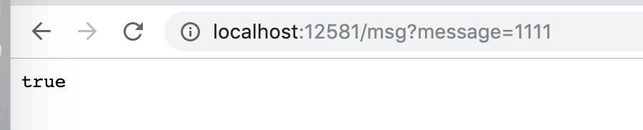
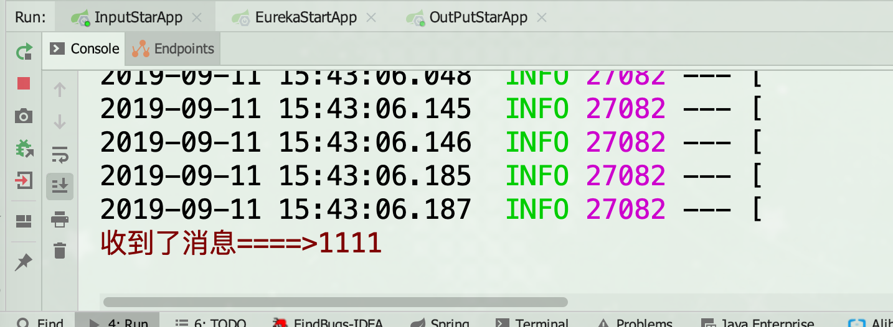
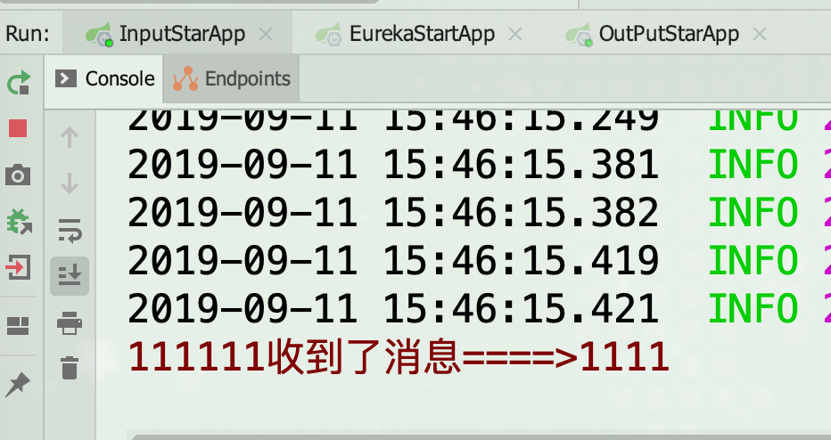
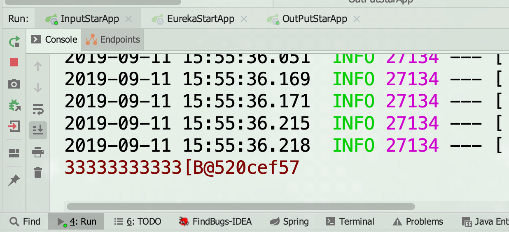

## 一 介绍

官方定义 Spring Cloud Stream 是一个构建消息驱动微服务的框架。

　　应用程序通过 inputs 或者 outputs 来与 Spring Cloud Stream 中binder 交互，通过我们配置来 binding ，而 Spring Cloud Stream 的 binder 负责与消息中间件交互。所以，我们只需要搞清楚如何与 Spring Cloud Stream 交互就可以方便使用消息驱动的方式。

通过使用Spring Integration来连接消息代理中间件以实现消息事件驱动。Spring Cloud Stream 为一些供应商的消息中间件产品提供了个性化的自动化配置实现，引用了发布-订阅、消费组、分区的三个核心概念。目前仅支持RabbitMQ、Kafka。

`为什么需要SpringCloud Stream消息驱动呢？`

　　比方说我们用到了RabbitMQ和Kafka，由于这两个消息中间件的架构上的不同，像RabbitMQ有exchange，kafka有Topic，partitions分区，这些中间件的差异性导致我们实际项目开发给我们造成了一定的困扰，我们如果用了两个消息队列的其中一种，

后面的业务需求，我想往另外一种消息队列进行迁移，这时候无疑就是一个灾难性的，一大堆东西都要重新推倒重新做，因为它跟我们的系统耦合了，这时候springcloud Stream给我们提供了一种解耦合的方式。

如下是官方文档提供的架构图所示：

|  |
| :----------------------------------------------------: |

Spring Cloud Stream由一个中间件中立的核组成。应用通过Spring Cloud Stream插入的input(相当于消费者consumer，它是从队列中接收消息的)和output(相当于生产者producer，它是从队列中发送消息的。)通道与外界交流。

通道通过指定中间件的Binder实现与外部代理连接。业务开发者不再关注具体消息中间件，只需关注Binder对应用程序提供的抽象概念来使用消息中间件实现业务即可。

 

`Binder`

　　通过定义绑定器作为中间层，实现了应用程序与消息中间件(Middleware)细节之间的隔离。通过向应用程序暴露统一的Channel通过，使得应用程序不需要再考虑各种不同的消息中间件的实现。当需要升级消息中间件，或者是更换其他消息中间件产品时，我们需要做的就是更换对应的Binder绑定器而不需要修改任何应用逻辑 。甚至可以任意的改变中间件的类型而不需要修改一行代码。目前只提供了RabbitMQ和Kafka的Binder实现。

> 说白了 Spring Cloud Stream就像一个 JDBC, 提供了统一的规范,然后根据各个 MQ 来做具体实现,但是我们使用的时候不管使用什么 MQ 都可以不需要修改我们的代码


## 二 构建生产者

> stream 通过一个@Output注解来帮我们声明一个生产者,然后通过@EnableBinding注解来帮我们构建对象

### 2.1 pom

```xml

    <dependencies>
		<!--stream 依赖-->
        <dependency>
            <groupId>org.springframework.cloud</groupId>
            <artifactId>spring-cloud-stream-binder-rabbit</artifactId>
        </dependency>
      	<!--web 项目,我们通过请求一个接口来发送消息-->
        <dependency>
            <groupId>org.springframework.boot</groupId>
            <artifactId>spring-boot-starter-web</artifactId>
        </dependency>
    </dependencies>
```


### 2.2 application.yml

> 因为我们要使用MQ,所以需要配置 MQ 的服务器信息


```yaml
server:
  port: 12581
spring:
  rabbitmq: #我们使用的是 rabbitmq
    host: rabbitmq.qfjava.cn
    port: 8800
    username: guest
    password: guest
```


### 2.3 声明生产者

> 构建生产者很简单,只要编写一个接口,内部编写一个返回值为MessageChannel的方法,添加 output 注解,指定队列即可,如果有多个,编写多个方法即可

```java
public interface MySendMessage {
       @Output("def")////声明当前方法的返回值就是一个消息通道,用于发送消息到 def 这个队列,方法的名字随便写,但是必须和消费方一致
    MessageChannel output();
}
```


### 2.4 controller

> 此处使用 web 项目,通过访问接口来触发消息,如果测试可以使用 Java  test 测试

```java
@RestController
public class SendController {
    @Autowired
    private MySendMessage mySendMessage; //声明我们编写的接口对象

    @RequestMapping("/msg")
    public boolean sendMessage(String message) {
        //发消息
        GenericMessage<String> genericMessage=new GenericMessage<>(message);//创建一个文本消息,把传递过来的 message 发送出去
        MessageChannel channel = mySendMessage.output();//获取到消息通道
       return channel.send(genericMessage);//发送消息
    }
}

```


### 2.5 主程序

```java
@SpringBootApplication
@EnableBinding(MySendMessage.class)//会自动帮我们创建MQ的代理对象MySendMessage,内部会链接rabbitmq
public class OutPutStarApp {
    public static void main (String[] args){
        SpringApplication.run(OutPutStarApp.class,args);
    }
}

```


## 三 构建消费者


### 3.1 pom

```xml
 <dependencies>

        <dependency>
            <groupId>org.springframework.cloud</groupId>
            <artifactId>spring-cloud-stream-binder-rabbit</artifactId>
        </dependency>
<!--
我们可以通过 web 项目来接收消息
-->
        <dependency>
            <groupId>org.springframework.boot</groupId>
            <artifactId>spring-boot-starter-web</artifactId>
        </dependency>
    </dependencies>
```

### 3.2 application.yml


```yaml
server:
  port: 12580
spring:
  rabbitmq: #指定我们的 mq
    host: rabbitmq.qfjava.cn
    port: 8800
    username: guest
    password: guest
```


### 3.3 声明消费者方式一

> 消费者可以有多种方式声明

#### 3.3.1 StreamListener

> 通过@StreamListener注解来直接声明接收什么队列的消息

```java
@Component
public class RecvMessageBean {
   
   @StreamListener("def")//收消息的方式1
    public void onMessage(String messgae) {
        System.err.println("收到了消息====>" + messgae);
    }
}
```


#### 3.3.2 主程序

```java
@SpringBootApplication
public class OutPutStarApp {
    public static void main (String[] args){
        SpringApplication.run(OutPutStarApp.class,args);
    }
}

```


#### 3.3.3 测试

> 启动生产者和消费者项目,访问http://localhost:12581/msg?message=1111 发现发送成功,消费者也收到了消息

|  |
| :----------------------------------------------------------: |
|  |


### 3.4 声明消费者方式2

#### 3.4.1  ServiceActivator

```java
@Component
public class RecvMessageBean {
 
    @ServiceActivator(inputChannel = "def")//收消息的方式2
    public void onMessage1(String messgae) {
        System.err.println("111111收到了消息====>" + messgae);
    }
}
```

#### 3.4.2 重启消费者测试

> 重启消费者,依旧访问生产者的http://localhost:12581/msg?message=1111 消费者控制台输出内容

|  |
| :----------------------------------------------------------: |


### 3.5 声明消费者方式3

> 使用 Input 注解方式收取消息


#### 3.5.1 声明Input接口

```java
public interface MyMessage {
    @Input("def") //通过 input 注解声明当前是一个消息的消费者,接收 def 队列的消息
    SubscribableChannel input(); //返回值是一个SubscribableChannel类型的通道
}

```

#### 3.5.2 绑定监听器

```java
@Component
public class RecvMessageBean {
    @Autowired
    private MyMessage myMessage;//注入对象,spring自动创建的代理对象

    @PostConstruct//使用这个函数的主要目的是要绑定监听器,因为这个方法的名字可以随便写,而且消息也不一样是什么时候会发过来,所以必须在程序启动的时候就绑定监听器,我们当前类的对象在程序启动的时候会被创建,我们可以通过PostConstruct注解来让我们当前的方法在创建对象后执行一次,完成绑定操作,此方法的名字随便写
    public void adsfsadfdsfadsfasdsadfsafadsfadsfadsffasdfasdfsaf() {
        SubscribableChannel channel = myMessage.input();//获取订阅的chanel
        channel.subscribe(new MessageHandler() {//订阅,需要 handler 的原因是我们不知道什么时候会来消息,所以通过 handler进行等待
            @Override
            public void handleMessage(Message<?> message) throws MessagingException {
                System.err.println("33333333333"+message.getPayload());
            }
        });
    }

}
```

#### 3.5.3 主程序

```java
@SpringBootApplication
@EnableBinding(MyMessage.class)//此注解的作用是帮我们创建我们指定的对象,然后会帮我们构建内部被 input 注解修饰的对象
public class InputStarApp {
    public static void main (String[] args){
        SpringApplication.run(InputStarApp.class,args);
    }
}
```


#### 3.5.4 重启消费者测试

> 重启消费者,继续访问我们的提供者,发现可以收到数据

|  |
| :----------------------------------------------------------: |

`因为传递过来的是二进制数据也就是数组,并且没有自动帮我们转换,所以直接输出的话就是一个数组对象`