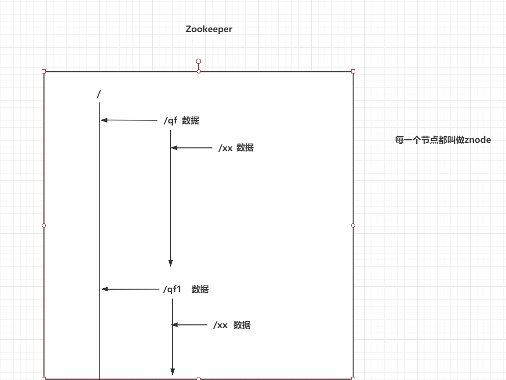
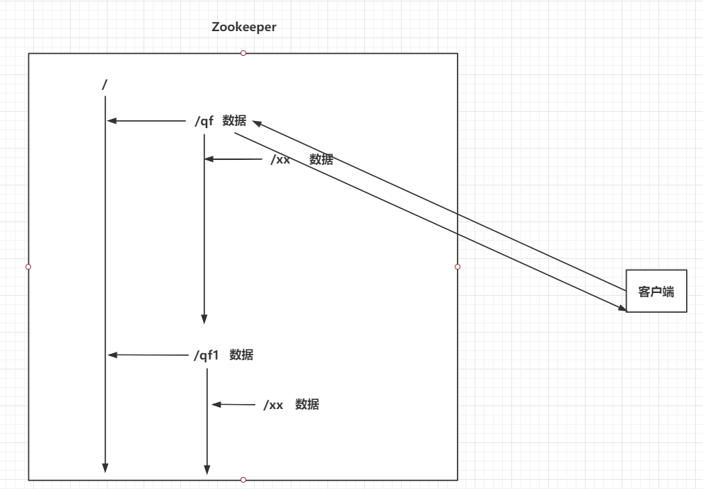
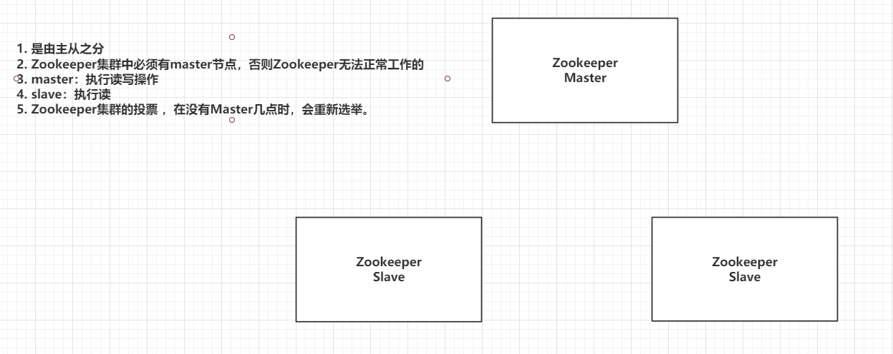
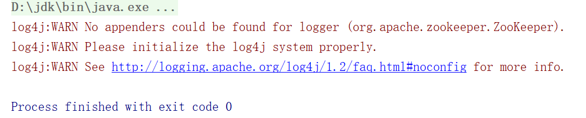

> Author：Jackiechan
>
> Version：9.0.0


[TOC]

### 一、引言

------

> 在分布式环境下，如果舍弃SpringCloud，使用其他的分布式框架，那么注册中心，配置集中管理，集群管理，分布式锁，分布式任务，队列的管理想单独实现怎么办。


### 二、Zookeeper介绍

----

> Zookeeper本身是Hadoop生态园的中的一个组件，Zookeeper强大的功能，在Java分布式架构中，也会频繁的使用到Zookeeper。

|                   Doug                    |
| :---------------------------------------: |
|  |


> Zookeeper就是一个文件系统 + 监听通知机制

### 三、Zookeeper安装

-----

> docker-compose.yml

```yml
version: "3.1"
services:
  zk:
   image: zookeeper:3.6.3
   restart: always
   container_name: zk
   ports:
     - 2181:2181
```


### 四、Zookeeper架构【`重点`】

-----

#### 4.1 Zookeeper的架构图

> - 每一个节点都被称为znode
>- 类标准文件系统
> - 每一个znode中都可以存储数据,并且还可以有子的znode,相当于我们电脑系统既是一个文件,又是一个文件夹
>- 节点名称是不允许重复的,和我们的操作系统是一样的

| Zookeeper的架构图                         |
| ----------------------------------------- |
|  |


#### 4.2 znode类型

> 四种Znode
>
> - 持久节点：永久的保存在你的Zookeeper
>
> - 持久有序节点：永久的保存在你的Zookeeper，他会给节点添加一个有序的序号。   /xx -> /xx0000001
>- 临时节点：当存储的客户端和Zookeeper服务断开连接时，这个临时节点自动删除
> - 临时有序节点：当存储的客户端和Zookeeper服务断开连接时，这个临时节点自动删除，他会给节点添加一个有序的序号。   /xx -> /xx0000001


#### 4.3 Zookeeper的监听通知机制

> 客户端可以去监听Zookeeper中的Znode节点。
>
> Znode改变时，会通知监听当前Znode的客户端

|               监听通知机制                |
| :---------------------------------------: |
|  |


### 五、Zookeeper常用命令

----

> Zookeeper针对增删改查的常用命令

```sh
# 查询当前节点下的全部子节点
ls 节点名称
# 例子 ls /


# 查询当前节点下的数据
get 节点名称
# 例子 get /zookeeper


# 创建节点
create [-s] [-e] znode名称 znode数据
# -s：sequence，有序节点
# -e：ephemeral，临时节点


# 修改节点值
set znode名称 新数据


# 删除节点
delete znode名称    # 没有子节点的znode
rmr znode名称      # 删除当前节点和全部的子节点,版本是3.6以下的
deleteall znode名称 # 删除当前节点和所有的子节点, 3.6以及以上版本

```


### 六、Zookeeper集群【`重点`】

----

#### 6.1 Zookeeper集群架构图

|                集群架构图                 |
| :---------------------------------------: |
|  |


#### 6.2 Zookeeper集群中节点的角色


|   类型   |          介绍          |
| :------: | :--------------------: |
|  Leader  |      Master主节点      |
| Follower | 从节点，参与选举Leader |
| Observer |   从节点，不参与投票   |
| Looking  |    正在找Leader节点    |


#### 6.3 Zookeeper投票策略

> - 每一个Zookeeper服务都会被分配一个全局唯一的myid，myid是一个数字。
>
> - Zookeeper在执行写数据时，每一个节点都有一个自己的FIFO的队列。保证写每一个数据的时候，顺序是不会乱的，Zookeeper还会给每一个数据分配一个全局唯一的zxid，数据越新zxid就越大。

> 选举Leader：
>
> - 选举出zxid最大的节点作为Leader。
> - 在zxid相同的节点中，选举出一个myid最大的节点，作为Leader。


#### 6.4 搭建Zookeeper集群

> docker-compose.yml

```yml
version: "3.1"
services:
  zk1:
    image: baseservice.qfjava.cn:60001/zookeeper:3.6.3
    restart: always
    container_name: zk1
    ports:
      - 2181:2181
    environment:
      ZOO_MY_ID: 1
      ZOO_SERVERS: server.1=zk1:2888:3888;2181 server.2=zk2:2888:3888;2181 server.3=zk3:2888:3888;2181 #下面的配置和这里都是一样的,这个配置是告诉当前节点,集群里面所有的节点都分别在哪,所以配置是一样的. 第一个端口是通信端口,用于判断机器是不是还活着,第二个端口是选举端口,投票用的
  zk2:
    image: baseservice.qfjava.cn:60001/zookeeper:3.6.3
    restart: always
    container_name: zk2
    ports:
      - 2182:2181
    environment:
      ZOO_MY_ID: 2
      ZOO_SERVERS: server.1=zk1:2888:3888;2181 server.2=zk2:2888:3888;2181 server.3=zk3:2888:3888;2181
  zk3:
    image: baseservice.qfjava.cn:60001/zookeeper:3.6.3
    restart: always
    container_name: zk3
    ports:
      - 2183:2181
    environment:
      ZOO_MY_ID: 3
      ZOO_SERVERS: server.1=zk1:2888:3888;2181 server.2=zk2:2888:3888;2181 server.3=zk3:2888:3888;2181
```


`查看集群状态,进入容器后,通过zk目录下的bin目录执行下面的命令,可以查看主从的状态`

```shell
./zkServer.sh status
```


### 七、Java操作Zookeeper

----

#### 7.1 Java连接Zookeeper

> 创建Maven工程

```xml
<dependencies>
    <dependency>
            <groupId>org.apache.curator</groupId>
            <artifactId>curator-recipes</artifactId>
            <version>5.2.1</version>
        </dependency>

    <dependency>
        <groupId>junit</groupId>
        <artifactId>junit</artifactId>
        <version>4.12</version>
    </dependency>
</dependencies>
```


> 编写连接Zookeeper集群的工具类

```java
public class ZkUtil {

    public static CuratorFramework cf(){
        //重试策略,超时后等待3秒再重新连接,最多重试2次,加上第一次最多共计三次
        RetryPolicy retryPolicy = new ExponentialBackoffRetry(3000,2);
        CuratorFramework cf = CuratorFrameworkFactory.builder()
                .connectString("192.168.199.109:2181,192.168.199.109:2182,192.168.199.109:2183")
                .retryPolicy(retryPolicy)
                .build();

        cf.start();//必须启动

        return cf;
    }

}
```


> 测试类

|                   测试                    |
| :---------------------------------------: |
|  |


#### 7.2 Java操作Znode节点

> 查询

```java
public class Demo2 {

    CuratorFramework cf = ZkUtil.cf();

    // 获取子节点
    @Test
    public void getChildren() throws Exception {
        //forpath代表要操作的节点路径,必须在最后
        List<String> strings = cf.getChildren().forPath("/");

        for (String string : strings) {
            System.out.println(string);
        }
    }

    // 获取节点数据
    @Test
    public void getData() throws Exception {
        byte[] bytes = cf.getData().forPath("/qf");
        System.out.println(new String(bytes,"UTF-8"));
    }

}
```


> 添加

```java
@Test
public void create() throws Exception {
    cf.create().withMode(CreateMode.PERSISTENT).forPath("/qf2","uuuu".getBytes());
}
```


> 修改

```java
@Test
public void update() throws Exception {
    cf.setData().forPath("/qf2","oooo".getBytes());
}
```


> 删除

```java
@Test
public void delete() throws Exception {
    cf.delete().deletingChildrenIfNeeded().forPath("/qf2");
}
```


>  查看znode的状态

```java
@Test
public void stat() throws Exception {
    Stat stat = cf.checkExists().forPath("/qf");
    System.out.println(stat);
}
```


#### 7.3 监听通知机制

> zk客户端和server保持长链接,然后客户端选择是否监听指定节点的数据或者子节点发生变化,如果选择监听,则可以在变化的时候收到通知,执行指定的业务


##### 7.3.1  4.x以及以下版本的curator

```java
public class Demo3 {

    CuratorFramework cf = ZkUtil.cf();


    @Test
    public void listen() throws Exception {
        //1. 创建NodeCache对象，指定要监听的znode
        NodeCache nodeCache = new NodeCache(cf,"/qf");
        nodeCache.start();

        //2. 添加一个监听器
        nodeCache.getListenable().addListener(new NodeCacheListener() {
            @Override
            public void nodeChanged() throws Exception {
                byte[] data = nodeCache.getCurrentData().getData();
                Stat stat = nodeCache.getCurrentData().getStat();
                String path = nodeCache.getCurrentData().getPath();

                System.out.println("监听的节点是：" + path);
                System.out.println("节点现在的数据是：" + new String(data,"UTF-8"));
                System.out.println("节点状态是：" + stat);

            }
        });

        System.out.println("开始监听！！");
        //3. System.in.read();
        System.in.read();
    }

}
```


##### 7.3.2  5.x版本 curator

> 5.x开始,curator废弃了NodeCache类,改用了CuratorCache类实现


```java
  CuratorFramework framework = ZkUtil.cf();
public  void testWatcher() throws Exception {
 
        CuratorCache curatorCache = CuratorCache.builder(framework, "/super").build();//创建缓存,监控某个指定的路径

        CuratorCacheListener cacheListener = CuratorCacheListener.builder()
            	//只监听当前节点的创建
//                .forCreates(node -> {
//                    System.err.println(new String(node.getData()));
//                })
            //监听节点发生变化
//                .forNodeCache(() -> {
//                    System.out.println("nodeChanged");
//                })
            //监听所有的操作
                .forAll(new CuratorCacheListener() {
                    @Override
                    public void event(Type type, ChildData oldData, ChildData data) {
                        System.err.println(data);
                    }
                })
                .build();

        curatorCache.listenable().addListener(cacheListener);//添加监听器
        curatorCache.start();//开启监听

        framework.create().creatingParentsIfNeeded().forPath("/super/test1", "测试监听的数据".getBytes(StandardCharsets.UTF_8));
        System.err.println("代码到这里了");
        System.in.read();
    }
```

