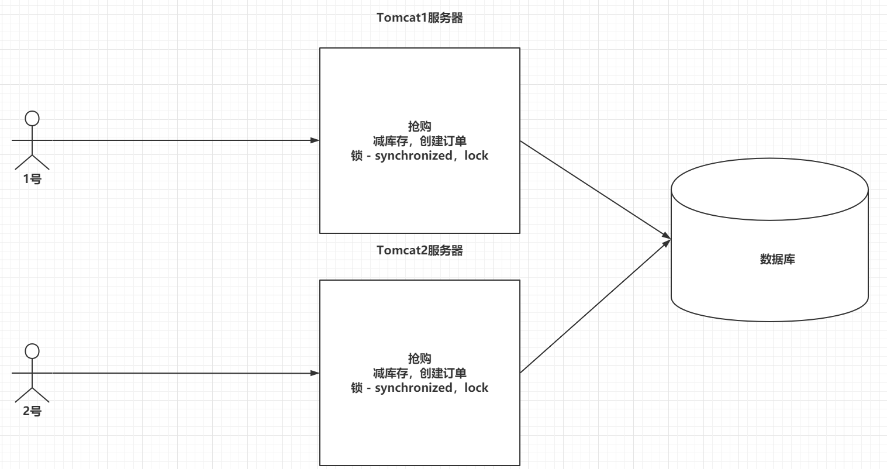
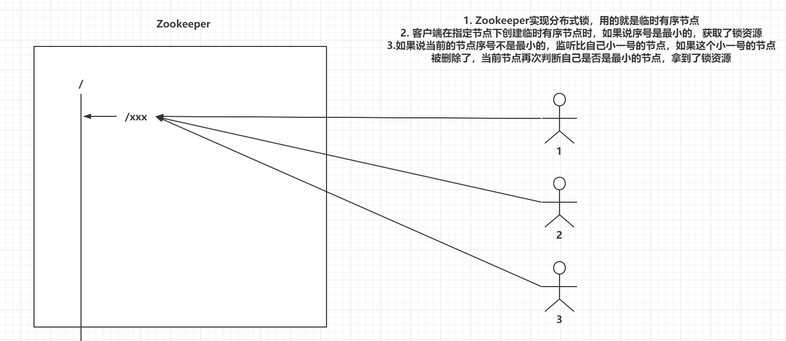
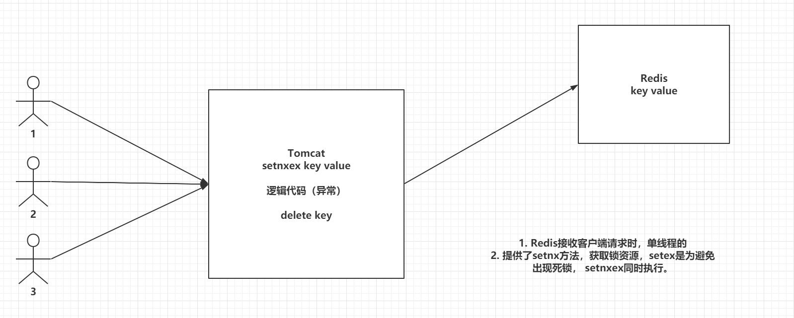
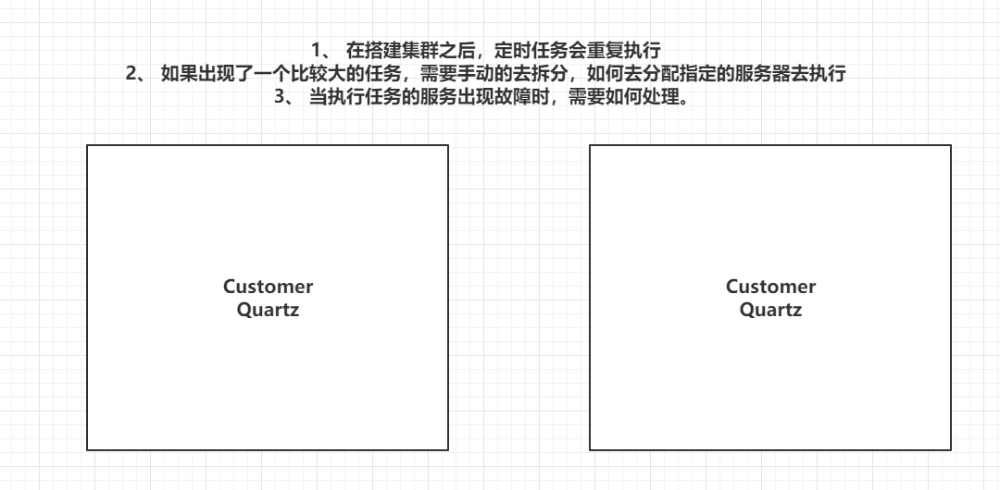
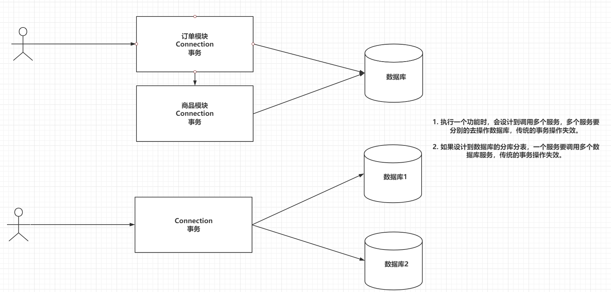
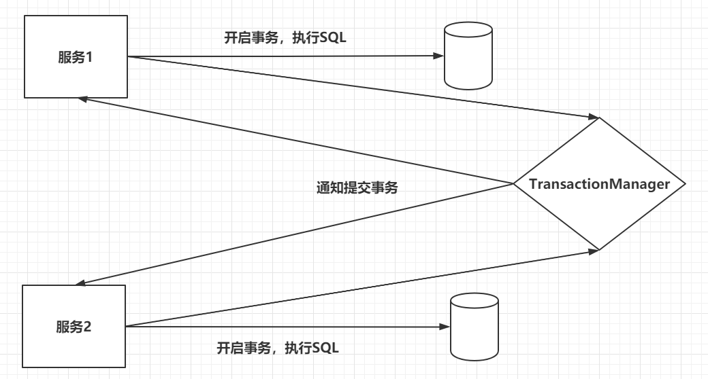
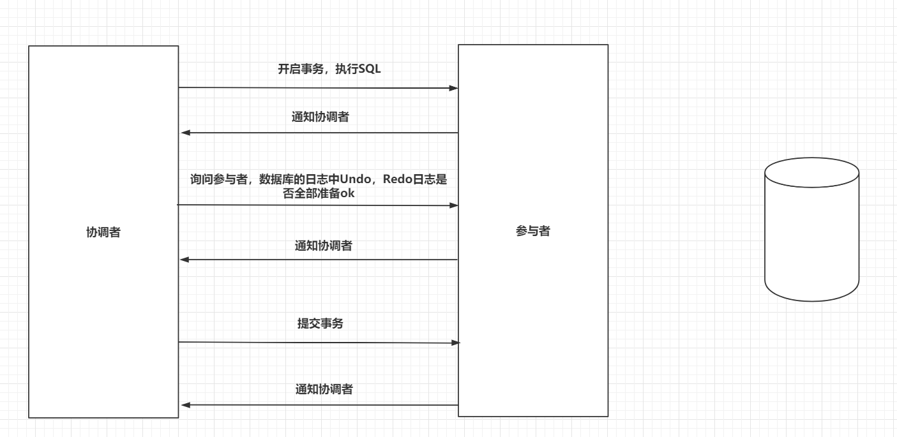
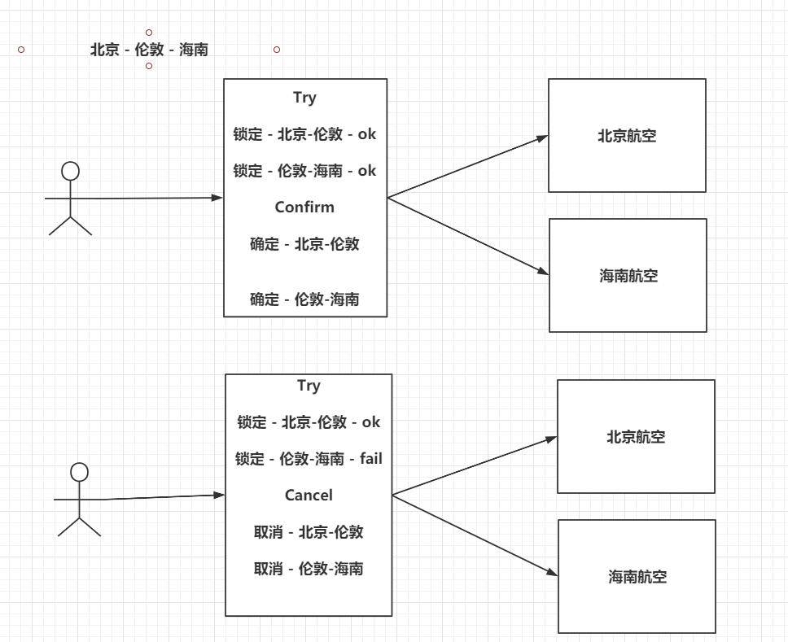
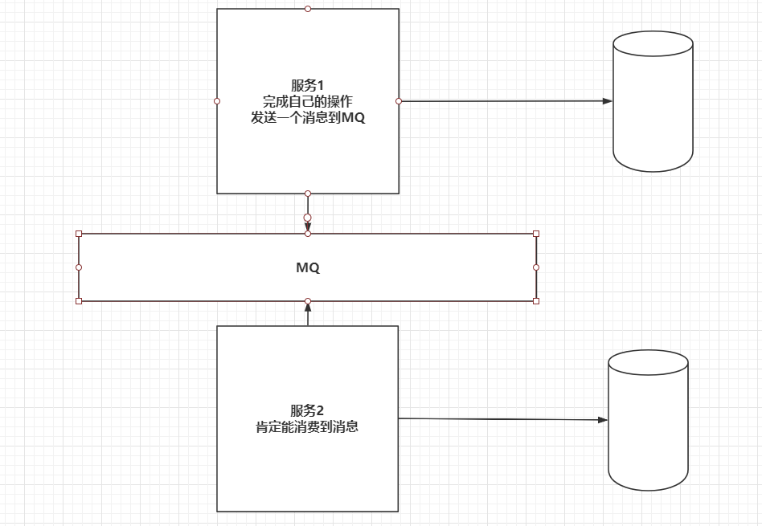
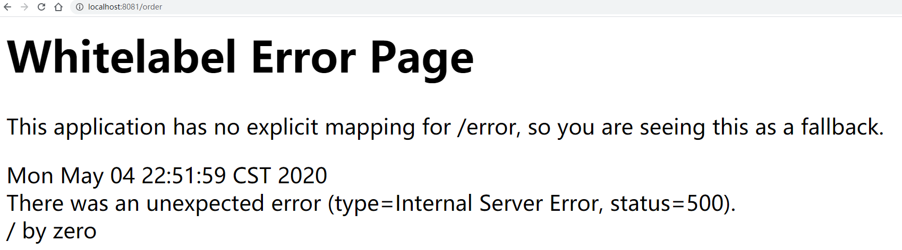

> Author：Eric
>
> Version：9.0.0


[TOC]

### 一、引言

> 在分布式环境下，传统的一些技术会失败，比如传统的synchronized或者lock锁，以及创建数据库的事务，无法保证ACID，还有定时任务也可能会出现重复执行的问题。

### 二、分布式锁介绍

-------

> 由于传统的锁是基于Tomcat服务器内部的，同步锁锁定的都是同一个jvm下的临界资源,搭建了集群之后，会有多个JVM,会有多个临界资源,每个临界资源锁定了一定,但是最终还是多个请求会进来,导致锁失效，使用分布式锁来处理。
>

| 分布式锁介绍                              |
| ----------------------------------------- |
|  |


### 三、分布式锁解决方案【`重点`】

------

#### 3.1 搭建环境

> 创建SpringBoot

> 编写抢购的业务

```java
@RestController
public class SecondKillController {

    //1. 准备商品的库存
    public static Map<String,Integer> itemStock = new HashMap<>();

    //2. 准备商品的订单
    public static Map<String,Integer> itemOrder = new HashMap<>();

    static{
        itemStock.put("牙刷",10000);
        itemOrder.put("牙刷",0);
    }

    @GetMapping("/kill")
    public String kill(String item) throws InterruptedException {
        //1. 减库存
        Integer stock = itemStock.get(item);
        if(stock <= 0){
            return "商品库存数不足！！！";
        }
        
        Thread.sleep(100);
        itemStock.put(item,stock - 1);


        //2. 创建订单
        Thread.sleep(100);
        itemOrder.put(item,itemOrder.get(item) + 1);

        //3. 返回信息
        return "抢购成功！！！" + item + "： 剩余库存数为 - " + itemStock.get(item) + "，订单数为 - " + itemOrder.get(item);
    }

}
```


> 下载ab压力测试

```
ab -n 请求数 -c 并发数 访问的路径
```


> 测试

|                   测试                    |
| :---------------------------------------: |
|  |


#### 3.2 Zookeeper实现分布式锁原理

|         Zookeeper实现分布式锁原理         |
| :---------------------------------------: |
|  |


##### 3.2.1 Zookeeper实现分布式锁

> 导入依赖

```xml
<dependency>
    <groupId>org.apache.zookeeper</groupId>
    <artifactId>zookeeper</artifactId>
    <version>3.6.0</version>
    <exclusions>
        <exclusion>
            <artifactId>slf4j-api</artifactId>
            <groupId>org.slf4j</groupId>
        </exclusion>
        <exclusion>
            <artifactId>slf4j-log4j12</artifactId>
            <groupId>org.slf4j</groupId>
        </exclusion>
        <exclusion>
            <artifactId>log4j</artifactId>
            <groupId>log4j</groupId>
        </exclusion>
    </exclusions>
</dependency>

<dependency>
    <groupId>org.apache.curator</groupId>
    <artifactId>curator-recipes</artifactId>
    <version>4.0.1</version>
    <exclusions>
        <exclusion>
            <artifactId>slf4j-api</artifactId>
            <groupId>org.slf4j</groupId>
        </exclusion>
    </exclusions>
</dependency>
```


> 编写配置类

```java
@Configuration
public class ZkConfig {


    @Bean
    public CuratorFramework cf(){

        RetryPolicy retryPolicy = new ExponentialBackoffRetry(3000,2);

        CuratorFramework curatorFramework = CuratorFrameworkFactory.builder()
                .connectString("192.168.199.109:2181,192.168.199.109:2182,192.168.199.109:2183")
                .retryPolicy(retryPolicy)
                .build();

        curatorFramework.start();

        return curatorFramework;
    }

}
```


> 在业务代码中添加分布式锁

```java
InterProcessMutex lock = new InterProcessMutex(cf,"/lock");

//...加锁
lock.acquire();
lock.acquire(1,TimeUnit.SECONDS); // 指定排队多久就放弃获取锁资源

//----------------业务逻辑代码------------------------

// 释放锁
lock.release();
```


#####  3.2.2 Zookeeper双层栅栏

> 类似于王者荣耀这种游戏 要大家都加载完成后才可以进入游戏, 要大家都完成后才可以退出游戏


> 代码

```java
public class Barrier1 {

    @Test
    public void testLock() {
        //十个玩家
        for (int i = 0; i < 10; i++) {
            new Thread() {
                @Override
                public void run() {
                    System.err.println("线程" + Thread.currentThread().getName() + "创建成功了");
                    //连接zk
                    CuratorFramework framework = CuratorFrameworkFactory.builder()
                            .connectString("10.9.12.200:9096")
                            .connectionTimeoutMs(60000)
                            .sessionTimeoutMs(60000)
                            .retryPolicy(new ExponentialBackoffRetry(1000,3))
                            .build();
                    framework.start();//启动
                    //每个玩家有自己的手机客户端,和游戏服务器建立连接,参数3就是需要几个客户端进入
                    DistributedDoubleBarrier doubleBarrier = new DistributedDoubleBarrier(framework,"/wangzherongyao001",10);
                    System.err.println("玩家" + Thread.currentThread().getName() + "点开始了");
                    try {
                        //模拟玩家的游戏加载时间
                        Thread.sleep(new Random().nextInt(10000));
                        System.err.println("玩家" + Thread.currentThread().getName() + "加载完毕,准备进入游戏");
                        doubleBarrier.enter();//游戏加载完成,准备进入
                        System.err.println("玩家" + Thread.currentThread().getName() + "进入游戏");
                        //模拟有的玩家不想玩
                        Thread.sleep(new Random().nextInt(10000));
                        System.err.println("玩家" + Thread.currentThread().getName() + "想退出游戏游戏");
                        //退出
                        doubleBarrier.leave();
                        System.err.println("玩家" + Thread.currentThread().getName() + "退出成功");
                    } catch (Exception e) {
                        throw new RuntimeException(e);
                    }finally {
                        framework.close();
                    }

                }
            }.start();

        }
        try {
            System.in.read();
        } catch (Exception e) {
            throw new RuntimeException(e);
        }

    }

}
```


#####  3.2.3 栅栏

> 类似于田径赛跑,运动员准备好后,需要等裁判开枪后才执行


###### 3.2.3.1 运动员


```java

public class Barrier2 {

    @Test
    public void testLock() {
        //十个玩家
        for (int i = 0; i < 10; i++) {
            new Thread() {
                @Override
                public void run() {
                    System.err.println("线程" + Thread.currentThread().getName() + "创建成功了");
                    //连接zk
                    CuratorFramework framework = CuratorFrameworkFactory.builder()
                            .connectString("10.9.12.200:9096")
                            .connectionTimeoutMs(60000)
                            .sessionTimeoutMs(60000)
                            .retryPolicy(new ExponentialBackoffRetry(1000,3))
                            .build();
                    framework.start();//启动


                 try {
                     //运动员准备
                     DistributedBarrier barrier = new DistributedBarrier(framework, "/bisai");
                     barrier.setBarrier();//准备
                     System.err.println("运动员" + Thread.currentThread().getName() + "准备好了,等开枪");
                     barrier.waitOnBarrier();//等开枪
                     System.err.println("运动员" + Thread.currentThread().getName() + "开始跑了");
                 }catch (Exception e){
                    e.printStackTrace();
                 }finally {
                     framework.close();
                 }


                }
            }.start();

        }
        try {
            System.in.read();
        } catch (Exception e) {
            throw new RuntimeException(e);
        }

    }

}

```


###### 3.2.3.2 裁判


```java

public class CP {

    public static void main(String[] args) {
        //连接zk
        CuratorFramework framework = CuratorFrameworkFactory.builder()
                .connectString("10.9.12.200:9096")
                .connectionTimeoutMs(60000)
                .sessionTimeoutMs(60000)
                .retryPolicy(new ExponentialBackoffRetry(1000,3))
                .build();
        framework.start();//启动
        //创建裁判对象
        DistributedBarrier barrier = new DistributedBarrier(framework, "/bisai");
        System.err.println("裁判创建好了");
        try {
            barrier.removeBarrier();//开枪
            System.err.println("裁判开枪了");
        } catch (Exception e) {
            throw new RuntimeException(e);
        }finally {
            framework.close();
        }
    }

}
```


#### 3.3 Redis实现分布式锁原理

|           Redis实现分布式锁原理           |
| :---------------------------------------: |
|  |


##### 3.3.1 Redis实现分布式锁

> 导入依赖，添加配置文件

```xml
# redis依赖
<dependency>
    <groupId>org.springframework.boot</groupId>
    <artifactId>spring-boot-starter-data-redis</artifactId>
</dependency>

```


> 配置redis地址


```yaml
# 配置文件
spring:
  redis:
    host: 192.168.199.109
    port: 6379
```


> 编写工具类

```java
@Component
public class RedisLockUtil {

    @Autowired
    private StringRedisTemplate redisTemplate;


    public boolean lock(String key,String value,int second){
        return redisTemplate.opsForValue().setIfAbsent(key,value,second, TimeUnit.SECONDS);
    }


    public void unlock(String key){
        redisTemplate.delete(key);
    }


}
```


>  修改业务逻辑代码

```java
@GetMapping("/redis/kill")
public String redisKill(String item) throws Exception {
    //...加锁
    if(lock.lock(item,System.currentTimeMillis() + "",1)){
        // 业务代码。。。
        // 释放锁
        lock.unlock(item);
    }
}
```


##### 3.3.2 redission实现分布式锁

> 上面的方式需要我们手动实现没有抢到锁的重试功能,redission可以帮我们等待并重试


> 依赖包


```xml
        <dependency>
            <groupId>org.redisson</groupId>
            <artifactId>redisson</artifactId>
            <version>3.17.7</version>
        </dependency>
```


>抢锁的代码


```java

public class RedisLock3 {

    private CountDownLatch countDownLatch = new CountDownLatch(1);

    @Test
    public void testLock() {
        //模拟不同的服务器
        for (int i = 0; i < 10; i++) {
            new Thread() {
                @Override
                public void run() {
                    System.err.println(Thread.currentThread().getName() + "创建成功了,等待连接redis");
                    //通过redission连接redis服务器
                    Config config = new Config();
                    //注意服务器地址必须以redis://或者rediss://开头,ss代表是ssl连接
                    config.useSingleServer().setAddress("redis://10.9.12.200:9081").setPassword("redis001");
                    RedissonClient redissonClient = Redisson.create(config);
                    //使用相同的key创建锁对象
                    RLock lock = redissonClient.getLock("xiawanle");
                    System.err.println(Thread.currentThread().getName() + "连接redis成功了");
                    //等一会
                    try {
                        countDownLatch.await();
                    } catch (InterruptedException e) {
                        throw new RuntimeException(e);
                    }
                    //抢锁,抢到的会自动执行,抢不到的会进入阻塞状态,6秒后锁会失效
                    lock.lock(6, TimeUnit.SECONDS);
                    System.err.println(Thread.currentThread().getName() + "抢到了,执行自己的业务");
                    try {
                        Thread.sleep(3000);
                        System.err.println(Thread.currentThread().getName() + "wancheng ye wu le ");
                        if (new Random().nextInt(3)==1) {
                            int i = 1 / 0;
                        }

                        //手动释放锁
                        lock.unlock();
                        System.err.println(Thread.currentThread().getName() + "shifangsuole");
                    } catch (InterruptedException e) {
                        throw new RuntimeException(e);
                    }
                }
            }.start();
        }
        try {
            Thread.sleep(5000);
            countDownLatch.countDown();//放行
            System.in.read();//让主线程不要退出
        } catch (Exception e) {
            throw new RuntimeException(e);
        }
    }

}
```


### 四、分布式任务介绍

--------

|              分布式任务介绍               |
| :---------------------------------------: |
|  |


### 五、分布式任务解决方案【`重点`】

-------------

#### 5.1 Elastic-Job介绍

> 官网：https://shardingsphere.apache.org/elasticjob/index_zh.html
>
> 由当当网基于Quartz + Zookeeper的二次开发产品,现在捐献给了Apache
>
> - 基于Zookeeper分布式锁，保证只有一个服务去执行定时任务。
>- 基于Zookeeper实现了注册中心，自动帮助我们去调度指定的服务执行定时任务。
> 
>- 基于Zookeeper实现了注册中心，基于心跳的方式，自动去检测服务的健康情况。


#### 5.2 Elastic-Job实现分布式任务

> 创建SpringBoot工程

> 导入依赖

```xml
<dependency>
    <groupId>com.dangdang</groupId>
    <artifactId>elastic-job-lite-spring</artifactId>
    <version>2.1.5</version>
</dependency>
```


> 配置Zookeeper信息

```java
// 注册中心
@Bean
public CoordinatorRegistryCenter center(){
    CoordinatorRegistryCenter regCenter = new ZookeeperRegistryCenter(
            new ZookeeperConfiguration("192.168.199.109:2181,192.168.199.109:2182,192.168.199.109:2183", "elastic-job-demo"));
    regCenter.init();
    return regCenter;
}
```


> 创建指定的定时任务

```java
@Component
public class MyElasticJob implements SimpleJob {

    @Override
    public void execute(ShardingContext context) {
        switch (context.getShardingItem()) {
            case 0:
                System.out.println("执行0任务！！");
                break;
            case 1:
                System.out.println("执行1任务！！");
                break;
            case 2:
                System.out.println("执行2任务！！");
                break;
            // case n: ...
        }
    }
}
```


> 配置执行的周期，并且开始调度任务

```java
// 执行任务调度信息
@Bean
public SpringJobScheduler scheduler(MyElasticJob job,CoordinatorRegistryCenter center){
    // 定义作业核心配置
    JobCoreConfiguration simpleCoreConfig = JobCoreConfiguration.
            newBuilder("demoSimpleJob", "0/10 * * * * ?", 3)
            .shardingItemParameters("0=A,1=B,2=C").build();
    // 定义SIMPLE类型配置
    SimpleJobConfiguration simpleJobConfig = new SimpleJobConfiguration(simpleCoreConfig, MyElasticJob.class.getCanonicalName());
    // 定义Lite作业根配置
    LiteJobConfiguration simpleJobRootConfig = LiteJobConfiguration.newBuilder(simpleJobConfig).build();
    // 定义SpringJobScheduler
    SpringJobScheduler scheduler = new SpringJobScheduler(job,center,simpleJobRootConfig);
    scheduler.init();
    return scheduler;
}
```


> 测试


####  5.3  3.0版本

##### 5.3.1 依赖

```xml
		 <dependency>
            <groupId>org.apache.shardingsphere.elasticjob</groupId>
            <artifactId>elasticjob-lite-spring-boot-starter</artifactId>
            <version>3.0.0</version>
        </dependency>


        <dependency>
            <groupId>org.apache.curator</groupId>
            <artifactId>curator-recipes</artifactId>
            <version>5.2.1</version>
        </dependency>
```


##### 5.3.2 任务

```java
@Component
public class MyMqJob implements SimpleJob {

    @Override
    public void execute(ShardingContext shardingContext) {
      //  System.err.println("定时任务执行了");
        int shardingTotalCount = shardingContext.getShardingTotalCount();//总共分了几个任务
        String parameter = shardingContext.getShardingParameter();
        System.err.println(parameter);
//        switch (parameter) {
//            case "Caoxian":
//                System.err.println("曹县开始干活了");
//                break;
//            case "Guangzhou":
//                System.err.println("广州开始干活了");
//                break;
//            case "Shanghai":
//                System.err.println("上海开始干活了");
//                break;
//            case "Beijing":
//                System.err.println("北京开始干活了");
//                break;
//        }

    }
}
```


##### 5.3.3 配置

```yaml
elasticjob:
  reg-center:
    server-lists: 10.9.12.200:9096 #zk的地址
    namespace: weishenmeqimingzizhemenan #我们的一些配置都会保存在zk的这个目录里面，但是如果配置发生更改，其实里面并不会变化，所以如果更改了一些配置是不会生效的，需要删除之后再重新启动
    max-sleep-time-milliseconds: 8000
    max-retries: 3 #最大重试次数
  jobs:
    fkjahsdhgflhshhgfsadf: #可以支持不同任务,每个任务在job下要单独写一个名字，这个名字可以随便写，但是要保证唯一
      elastic-job-class: com.qianfeng.chinatelcom.monitor.job.MyMqJob #【配置任务的执行类】
      cron: 0/10 * * * * ?
      sharding-total-count: 4  #分片,一个任务分成四份来做,这个值一旦设置就不可变,除非从zk中删除当前任务的配置再重新设置
      sharding-item-parameters: 0=Beijing,1=Shanghai,2=Guangzhou,3=Caoxian  #根据分成几份,每一个起一个标识,可以根据标识来判断当前是第几份,和上面一样也不可变
      overwrite: true #在当前属性设置为true的情况下,上面的配置可以进行修改,重启后会生效,否则需要先从zk中删除对应的配置后才生效

```


### 六、分布式事务介绍

-----------

#### 6.1分布式事务介绍

|              分布式事务介绍               |
| :---------------------------------------: |
|  |


#### 6.2 Base理论

> CAP理论，C：一致性，A：可用性，P：分区容错性。分布式环境下，三者取其二。
>
> - Eureka：AP，保证了可用性，舍弃了一致性。
>
> - Zookeeper：CP，每一个节点必须能够找到Master才能对外提供服务，舍弃了可用性。

> Base理论，BA：基本可用，S：中间状态，E：最终一致性。
>
> - 基于CAP理论演化而来的，是对CAP定理中一致性和可用性的一个权衡结果。
>
> - 核心思想：我们无法做到强一致性，但是每一个应用都可以根据自身的业务特点，采用一些适当的方式来权衡，最终达到一致性。
>
> - BA：分布式系统中因为一个原因，导致出现了一些问题，允许损失掉部分服务的可用性，保证我核心功能的高可用。
>
> - S：允许系统之间存在一个中间状态，并不会影响正常的去使用整个系统，允许数据的同步存在延迟。
>
> - E：系统中所有的数据副本经过一定时间后，最终能够达到一致的状态，不需要保证系统数据强一致性。


### 七、分布式事务解决方案【`重点`】

----

#### 7.1 2PC两段提交

> 两段提交分为两个阶段：
>
> - 第一个阶段是准备阶段，参与者需要开启事务，执行SQL，保证数据库中已经存在相应的数据。参与者会向TransactionManager准备OK。
>
> - 第二个阶段当TransactionManager收到了所有的参与者的通知之后，向所有的参与者发送Commit请求。

> 问题1：执行的性能是很低的。一般是传统事务的10倍以上。
>
> 问题2：TransactionManager是没有超时时间的。
>
> 问题3：TransactionManager存在单点故障的问题

|                2PC两段提交                |
| :---------------------------------------: |
|  |


#### 7.2  3PC三段提交

> 三段提交在二段提交的基础上，引入了超时时间机制，并且在二段提交的基础上，又多了一个步骤，在提交事务之前，再询问一下，数据库的日志信息，是否已经完善。

|                3PC三段提交                |
| :---------------------------------------: |
|  |


#### 7.3 TCC机制

> TCC（Try，Confirm，Cancel），和你的业务代码切合在一起。
>
> - Try：尝试去预执行具体业务代码。	下单订ing。。。
>
> - try成功了：Confirm：再次执行Confirm的代码。
>
> - try失败了：Cancel：再次执行Cancel的代码。

|                    TCC                    |
| :---------------------------------------: |
|  |


#### 7.4 MQ分布式事务

> RabbitMQ在发送消息时，confirm机制，可以保证消息发送到MQ服务中，消费者有手动ack机制，保证消费到MQ中的消息。

|               MQ分布式事务                |
| :---------------------------------------: |
|  |


#### 7.5 LCN实现分布式事务

> 基于三段提交和TCC实现的

> 创建一个协调者工程，创建两个服务

> 协调者：添加依赖

```xml
<dependency>
    <groupId>com.codingapi.txlcn</groupId>
    <artifactId>txlcn-tm</artifactId>
    <version>5.0.2.RELEASE</version>
</dependency>

<dependency>
    <groupId>org.springframework.boot</groupId>
    <artifactId>spring-boot-starter-web</artifactId>
</dependency>
```

> 协调者：编写配置文件

```yml
server:
  port: 8080

spring:
  datasource:
    driver-class-name: com.mysql.cj.jdbc.Driver
    url: jdbc:mysql:///lcn?serverTimezone=UTC
    username: root
    password: root
  redis:
    host: 192.168.199.109
    port: 6379
    # 协调的端口号
tx-lcn:
  manager:
    port: 8070

```

> 协调者：添加注解

```
@EnableTransactionManagerServer
```

> 协调者：准备表

```sql
# 创建表
CREATE TABLE `t_tx_exception`  (
  `id` bigint(20) NOT NULL AUTO_INCREMENT,
  `group_id` varchar(64) CHARACTER SET utf8mb4 COLLATE utf8mb4_general_ci NULL DEFAULT NULL,
  `unit_id` varchar(32) CHARACTER SET utf8mb4 COLLATE utf8mb4_general_ci NULL DEFAULT NULL,
  `mod_id` varchar(128) CHARACTER SET utf8mb4 COLLATE utf8mb4_general_ci NULL DEFAULT NULL,
  `transaction_state` tinyint(4) NULL DEFAULT NULL,
  `registrar` tinyint(4) NULL DEFAULT NULL,
  `remark` varchar(4096) NULL DEFAULT  NULL,
  `ex_state` tinyint(4) NULL DEFAULT NULL COMMENT '0 未解决 1已解决',
  `create_time` datetime(0) NULL DEFAULT NULL,
  PRIMARY KEY (`id`) USING BTREE
) ENGINE = InnoDB AUTO_INCREMENT = 1 CHARACTER SET = utf8mb4 COLLATE = utf8mb4_general_ci ROW_FORMAT = Dynamic;
```


> 服务： 添加依赖

```xml
<dependency>
    <groupId>org.mybatis.spring.boot</groupId>
    <artifactId>mybatis-spring-boot-starter</artifactId>
    <version>2.1.2</version>
</dependency>

<dependency>
    <groupId>mysql</groupId>
    <artifactId>mysql-connector-java</artifactId>
</dependency>

<dependency>
    <groupId>com.codingapi.txlcn</groupId>
    <artifactId>txlcn-tc</artifactId>
    <version>5.0.2.RELEASE</version>
</dependency>

<dependency>
    <groupId>com.codingapi.txlcn</groupId>
    <artifactId>txlcn-txmsg-netty</artifactId>
    <version>5.0.2.RELEASE</version>
</dependency>

<dependency>
    <groupId>org.springframework.boot</groupId>
    <artifactId>spring-boot-starter-web</artifactId>
</dependency>
```

> 服务： 编写配置文件

```yml
server:
  port: 8081

spring:
  datasource:
    driver-class-name: com.mysql.cj.jdbc.Driver
    url: jdbc:mysql:///lcn?serverTimezone=UTC
    username: root
    password: root

tx-lcn:
  client:
    manager-address: localhost:8070
```

> 服务： 启动类添加注解

```
@EnableDistributedTransaction
```

> 服务：Service层添加注解

```java
@Override
@Transactional
@LcnTransaction
public void createOrder() {
//        1. 减库存
    restTemplate.getForObject("http://localhost:8082/item",String.class);
    int i = 1/0;
//        2. 创建订单
    orderMapper.save();
}
```


> 测试，异常后，事务回滚

|                   测试                    |
| :---------------------------------------: |
|  |

