<center><span style='font-size:36px'>响应式编程</span></center>

>Author: Jackiechan
>
>Version: 1.0

## 一 响应式编程

### 1.1 简介

响应式编程是一种面向数据流和变化传播的编程范式。这意味着可以在编程语言中很方便
地表达静态或动态的数据流，而相关的计算模型会自动将变化的值通过数据流进行传播。比如Excel表格中的公式，公式的值会随着单元格的变化而变化。
Java8提供观察者模式两个类Observer和Observable，Java9提供Flow类实现响应式编程。

### 1.2 Reactive

Reactive基于事件驱动(事件模式或者说订阅者模式)，类似于Netty异步事件编程模型，对不同的事件做不同的处理。所有信息都通过一个编程模型处理，就像水在管道里面运动一样（这里把事件比作水流）

- 响应流必须是无阻塞的。
- 响应流必须是一个数据流。
- 它必须可以异步执行。
- 并且它也应该能够处理背压

`背压`是反应流中的一个重要概念，简单来说就是下游能够向上游反馈流量请求的机制。我们知道，如果消费者消费数据的速度赶不上生产者生产数据的速度时，它就会持续消耗系统的资源，直到这些资源被消耗殆尽。
这个时候，就需要有一种机制使得消费者可以根据自身当前的处理能力通知生产者来调整生产数据的速度，这种机制就是背压。采用背压机制，消费者会根据自身的处理能力来请求数据，而生产者也会根据消费者的能力来生产数据，从而在两者之间达成一种动态的平衡，确保系统的即时响应性。

​			响应式编程框架主要采用了观察者模式，而Spring Reactor的核心则是对观察者模式的一种衍伸。关于观察者模式的架构中被观察者(Observable)和观察者(Subscriber)处在不同的线程环境中时，由于者各自的工作量不一样，导致它们产生事件和处理事件的速度不一样，这时就出现了两种情况:


- 被观察者产生事件慢一些，观察者处理事件很快。那么观察者就会等着被观察者发送事件好比观察者在等米下锅，程序等待）。

- 被观察者产生事件的速度很快，而观察者处理很慢。那就出问题了，如果不作处理的话，事件会堆积起来，最终挤爆你的内存，导致程序崩溃。（好比被观察者生产的大米没人吃，堆积最后就会烂掉）。为了方便下面理解Mono和Flux，也可以理解为Publisher（发布者也可以理解为被观察者）主动推送数据给Subscriber（订阅者也可以叫观察者），如果Publisher发布消息太快，超过了Subscriber的处理速度，如何处理。这时就出现了Backpressure（背压—–指在异步场景中，被观察者发送事件速度远快于观察者的处理速度的情况下，一种告诉上游的被观察者降低发送速度的策略）


### 1.3. Publisher

​		由于响应流的特点，我们不能再返回一个简单的**POJO**对象来表示结果了。必须返回一个类似**Java**中的Future的概念，在有结果可用时通知消费者进行消费响应。

​		Reactive Stream规范中这种被定义为Publisher<T> ，Publisher<T>是一个可以提供0-N个序列元素的提供者，并根据其订阅者Subscriber<? super T>的需求推送元素。一个Publisher<T>可以支持多个订阅者，并可以根据订阅者的逻辑进行推送序列元素。

​		响应式的一个重要特点：**当没有订阅时发布者什么也不做**。

```java
public interface Publisher<T> {
    public void subscribe(Subscriber<? super T> s);
}
```


### 1.4 Subscriber

- Subscriber 代表的是一种可以从发布者那里订阅并接收元素的订阅者

```java
public interface Subscriber<T> {
    public void onSubscribe(Subscription s);
    public void onNext(T t);
    public void onError(Throwable t);
    public void onComplete();
}
```


`onSubscribe() 方法：`

> 从命名上看就是一个回调方法，当发布者的 subscribe() 方法被调用时就会触发这个回调。而在该方法中有一个参数 Subscription，可以把这个 Subscription 看作是一种用于订阅的上下文对象。Subscription 对象中包含了这次回调中订阅者想要向发布者请求的数据个数。

`onNext() 方法：`

> 当订阅关系已经建立，那么发布者就可以调用订阅者的 onNext() 方法向订阅者发送一个数据。这个过程是持续不断的，直到所发送的数据已经达到 Subscription 对象中所请求的数据个数。

`onComplete() 方法：`

> 当所发送的数据已经达到 Subscription 对象中所请求的数据个数时，这时候 onComplete() 方法就会被触发，代表这个数据流已经全部发送结束。

`onError() 方法：`

> 一旦在在数据流发送过程中出现了异常，那么就会触发 onError() 方法，我们可以通过这个方法捕获到具体的异常信息进行处理，而数据流也就自动终止了。


### 1.5 Subscription

Subscription 代表的就是一种订阅上下文对象，它在订阅者和发布者之间进行传输，从而在两者之间形成一种契约关系。Subscription 接口定义如下所示：


```java
public interface Subscription {
    public void request(long n);
    public void cancel();
}
```


​		这里的 request() 方法用于请求 n 个元素，订阅者可以通过不断调用该方法来向发布者请求数据；而 cancel() 方法显然是用来取消这次订阅。请注意，Subscription 对象是确保生产者和消费者针对数据处理速度达成一种动态平衡的基础，也是流量控制中实现背压机制的关键所在。
​			Publisher、Subscriber 和 Subscription 接口是响应式编程的核心组件，响应式流规范也只包含了这些接口，因此是一个非常抽象且精简的接口规范。响应式流规范实际上提供了一种“推-拉”结合的混合数据流模型。
当然，响应式流规范非常灵活，还可以提供独立的“推”模型和“拉”模型。如果为了实现纯“推”模型，我们可以考虑一次请求足够多的元素；而对于纯“拉”模型，相当于就是在每次调用 Subscriber 的 onNext() 方法时只请求一个新元素。


|                 响应式编程                  |
| :-----------------------------------------: |
| 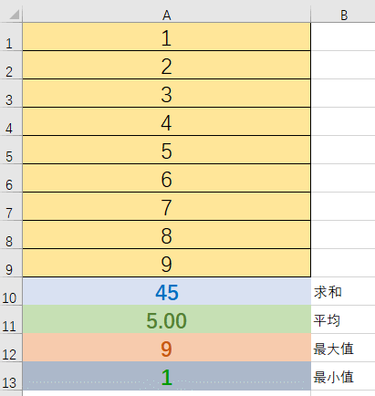 |


> A1-A9就可以看做Publisher及其提供的元素序列。A10-A13分别是求和函数SUM(A1:A9)、平均函数AVERAGE(A1:A9)、最大值函数MAX(A1:A9)、最小值函数MIN(A1:A9)，可以看作订阅者Subscriber。假如说我们没有A10-A13，那么A1-A9就没有实际意义，它们并不产生计算。这也是响应式的一个重要特点：当没有订阅时发布者什么也不做。


### 1.6 Reactor实现

#### 1.6.1 简介

- Reactor是满足Reactive规范的框架
- Reactor有Mono和Flux两个核心类，这两个类都实现了Publisher接口，提供丰富操作符。
- Flux 表示的是包含 0 到 N 个元素的异步序列。在该序列中可以包含三种不同类型的消息通知：正常的包含元素的消息、序列结束的消息和序列出错的消息。当消息通知产生时，订阅者中对应的方法 onNext(), onComplete()和 onError()会被调用。
- Mono 表示的是包含 0 或者 1 个元素的异步序列。该序列中同样可以包含与 Flux 相同的三种类型的消息通知。Flux 和 Mono 之间可以进行转换。对一个 Flux 序列进行计数操作，得到的结果是一个 Mono<Long>对象。把两个 Mono 序列合并在一起，得到的是一个 Flux 对象。
- 使用 Flux 和 Mono 都可以发出三种数据信号：元素值，错误信号，完成信号,  当消息通知产生时，订阅者中对应的方法 onNext(), onComplete()和 onError()会被调用。
- 错误信号和完成信号都代表终止信号，终止信号用于告诉订阅者数据流结束了。错误信号终止数据流同时把错误信息传递给订阅者

#### 1.6.2 三种信号特点

- 错误信号和完成信号都是终止信号，不能共存的

- 如果没有发送任何元素值，而是直接发送错误或者完成信号，表示是空数据流

- 如果没有错误信号，没有完成信号，表示是无限数据流

  


> 区分响应式API的类型：从返回的类型我们就可以知道一个方法会“发射并忘记”或“请求并等待”（Mono），还是在处理一个包含多个数据项的流（Flux）。Flux和Mono的一些操作利用了这个特点在这两种类型间互相转换。例如，调用Flux<T>的single()方法将返回一个Mono<T>，而使用concatWith()方法把两个Mono串在一起就可以得到一个Flux。


### 1.7 Flux

>Flux可以触发零到多个事件，并根据实际情况结束处理或触发错误。
>
>Flux 是一个发出(emit)0-N个元素组成的异步序列的Publisher<T>,可以被onComplete信号或者onError信号所终止。在响应流规范中存在三种给下游消费者调用的方法 onNext, onComplete, 和onError


> 发射0到N个元素的异步"发射器(生产0-N个异步数据的生产者)

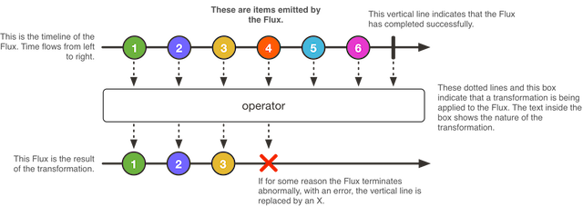


- Flux<T>是一个标准Publisher<T>，表示0到N个发射项的异步序列，可选地以完成信号或错误终止。与Reactive Streams规范中一样，这三种类型的信号转换为对下游订阅者的onNext、onComplete或onError方法的调用。
- 在这种大范围的可能信号中，Flux是通用的reactive 类型。注意，所有事件，甚至终止事件，都是可选的：没有onNext事件，但是onComplete事件表示一个空的有限序列，但是移除onComplete并且您有一个无限的空序列（除了关于取消的测试之外，没有特别有用）。同样，无限序列不一定是空的。例如，Flux.interval(Duration) 产生一个Flux<Long>，它是无限的，从时钟发出规则的数据。

### 1.8 Mono

> 发射0到1个元素的异步"发射器


- Mono<T>是一个专门的Publisher<T>，它最多发出一个项，然后可选地以onComplete信号或onError信号结束。
- 它只提供了可用于Flux的操作符的子集，并且一些操作符（特别是那些将Mono与另一个发布者组合的操作符）切换到Flux。
- 例如，Mono#concatWith(Publisher)返回一个Flux ，而Mono#then(Mono)则返回另一个Mono。
- 注意，Mono可以用于表示只有完成概念（类似于Runnable）的无值异步进程。若要创建一个，请使用Mono<Void>。


## 二 代码案例


### 2.1 依赖导入


```xml
 <dependencies>

        <dependency>
            <groupId>io.projectreactor</groupId>
            <artifactId>reactor-core</artifactId>
        </dependency>
    </dependencies>

    <dependencyManagement>

        <dependencies>


            <dependency>
                <groupId>io.projectreactor</groupId>
                <artifactId>reactor-bom</artifactId>
                <version>2023.0.5</version>
                <scope>import</scope>
                <type>pom</type>
            </dependency>

        </dependencies>


    </dependencyManagement>
```


### 2.2 Flux 创建函数

#### `create`

> 以编程方式创建具有多次发射能力也就是多个数据的的Flux,元素通过FluxSink API以同步或异步方式进行。


```java
    Flux.create((t) -> {
            t.next("create");
            t.next("create1");
            t.complete();//声明结束
        }).subscribe(System.out::println);//订阅数据,处理方式为打印到控制台

//处理方式2
  Flux.create((t) -> {
            t.next("create");
            t.next("create1");
            t.complete();//声明结束
        }).subscribe(new Subscriber<String>() {//使用Subscriber来订阅
            private Subscription subscription;

            /**
             * 和生产者建立联系,准备问生产要数据
             * @param subscription
             */
            @Override
            public void onSubscribe(Subscription subscription) {
                System.err.println("FluxTest中的方法onSubscribe 执行了--->");
                subscription.request(1);//向上游的生产者要1个数据,通过这个方法可以控制消费的速度
                this.subscription = subscription;
            }

            /**
             * 当我们的消费者收到数据的时候执行
             * @param s
             */
            @Override
            public void onNext(String s) {
                System.err.println("FluxTest中的方法onNext 执行了--->"+s);
                //要下一条数据
                try {
                    Thread.sleep(5000);
                } catch (InterruptedException e) {
                    throw new RuntimeException(e);
                }
                subscription.request(1);
            }

            /**
             * 发生错误的时候执行
             * @param throwable
             */
            @Override
            public void onError(Throwable throwable) {
                System.err.println("FluxTest中的方法onError 执行了--->");
            }

            /**
             * 当数据已经处理完成的时候执行
             */
            @Override
            public void onComplete() {
                System.err.println("FluxTest中的方法onComplete 执行了--->");
            }
        });
```

#### `generate`

> 以编程方式创建一个的Flux,通过consumer回调逐一生成信号；generate中next只能调1次，否则会报错 reactor.core.Exceptions$ErrorCallbackNotImplemented

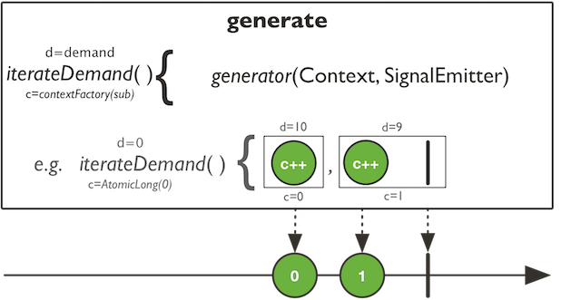


```java
    Flux.generate(synchronousSink -> {
              //注意generate中next只能调用1次
            synchronousSink.next("generate");
        		//synchronousSink.next("老王");
            //如果不执行complete方法,就是一个一致循环发送一条数据的无限流
            synchronousSink.complete();
        }).subscribe(System.out::println);
```

#### `just`

> 通过我们指定的数据来创建一个flux

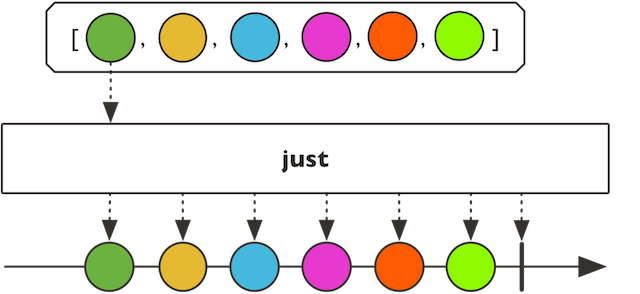


```java
    //单个元素
    Flux.just("just").subscribe(System.out::println);
    //多个元素
    Flux.just("just", "just1", "just2").subscribe(System.out::println);
```

#### `from`

> 用Flux API指定的Publisher创建一个Flux

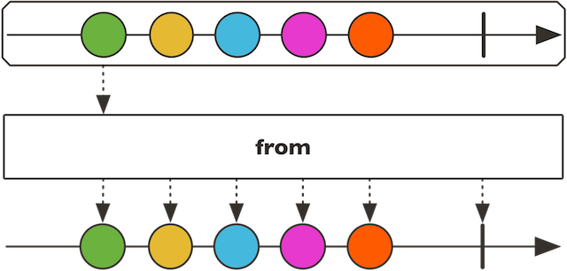


```java
    //Flux->Flux
        Flux.from(Flux.just("外面没有人做核酸了", "做核酸也是应付公事", "尼龙棒破碰了下我的舌尖就结束了"))
                .subscribe(System.out::println);
        //Mono->Flux
        Flux.from(Mono.just("我们有个同事结婚了,秘而不宣,被我侦破了")).subscribe(System.out::println);
```

#### `fromArray`

> 通过数组来创建Flux,将数组内的每个数据作为Flux内部的一个序列数据

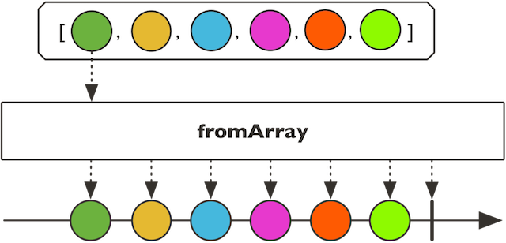


```java
    Flux.fromArray(new String[] { "不要在我面前搞小秘密", "很容易就被我推导出来", "有钱有别墅的杰哥"})
                .subscribe(System.out::println);
```

#### `fromIterable`

> 通过一个可迭代的集合等提供的数据创建flux

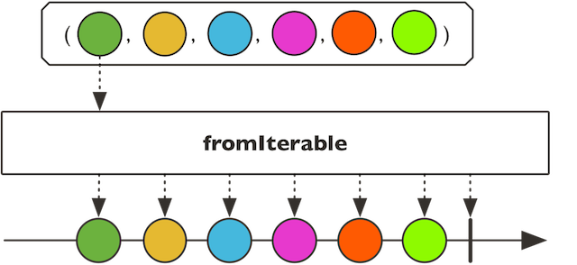


```java
Set<String> v = new HashSet<>();
    v.add("1");
    v.add("2");
    v.add("3");
Flux.fromIterable(() -> v.iterator()).subscribe(System.out::println);
```

#### `fromStream`

> 通过Stream流创建一个Flux,此Stream不可以被重复操作,并且此flux不可以被重复订阅

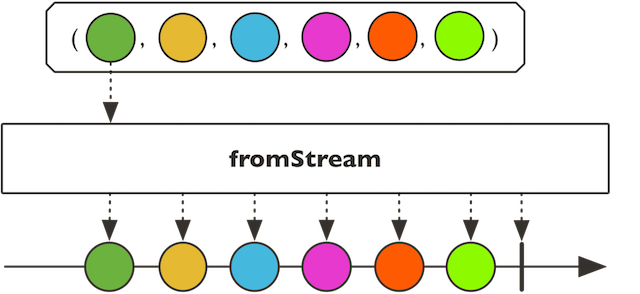


```java
        ArrayList<Object> list = new ArrayList<>();
        list.add("xuefu");
        list.add("hefan");
        list.add("hengui");
        list.add("banmian");
        list.add("pianyi");
        Stream<Object> stream = list.stream();

        Flux<Object> flux = Flux.fromStream(stream);
        flux.subscribe(System.out::println);
      //  通过stream创建的flux不可以重复订阅,下面会抛出异常
      //  flux.subscribe(System.out::println);
```


#### `defer`

> 每当对得到的Flux进行Subscription时，延迟提供Publisher，因此实际的源实例化被推迟，直到每个订阅和Supplier可以创建订阅者特定的实例。
>  但是，如果供应商没有生成新的实例，这个操作符将有效地从Publisher起作用。

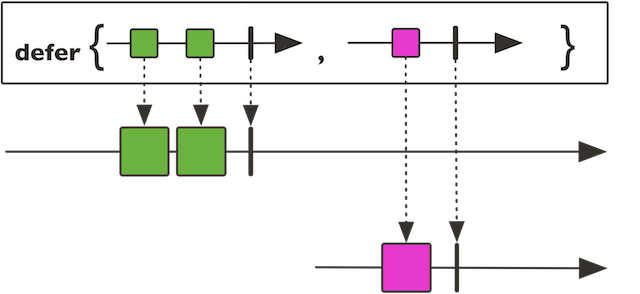


```java
Flux.defer(() -> Flux.just("just", "just1", "just2"))
        .subscribe(System.out::println);
```

#### `interval`

> 循环生成数据,从0开始自增,间隔时间为指定的时间

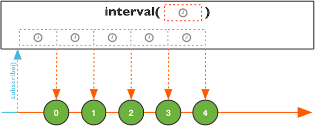


```java
Flux.interval(Duration.of(1000, ChronoUnit.MILLIS))  //每个1秒中生成一个数据
        .subscribe(System.out::println);
 //参数1代表3秒后才开始, 第二参数代表每个多少时间生成一条数据
        //  Flux.interval(Duration.ofMillis(3000), Duration.ofMillis(200)).subscribe(System.err::println);
//防止程序过早退出，放一个CountDownLatch拦住
CountDownLatch latch = new CountDownLatch(1);
latch.await();
```

#### `empty`

> 创建一个空的flux

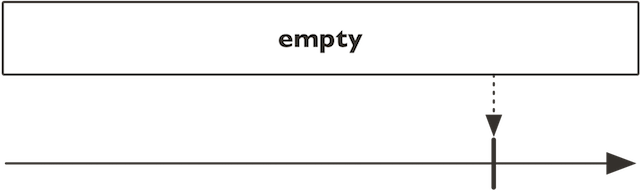


```java
Flux.empty().subscribe(System.out::println);
```

#### `error`

> 创建一个带有异常的Flux，它在订阅之后立即以指定的错误终止。

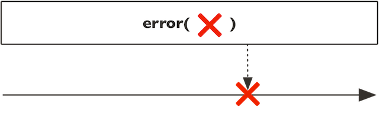


```java
Flux.error(new RuntimeException()).subscribe(System.out::println);
```

#### `never`

> 创建一个Flux，它永远不会发出任何数据、错误或完成信号。


```java
Flux.never().subscribe(System.out::println);
```

#### `range`

> 建立一个Flux，它只会发出一个count递增整数的序列，从start开始。也就是说，在start（包含）和start + count（排除）之间发出整数，然后完成。

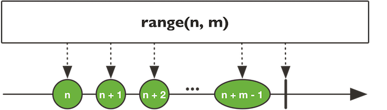


```java
 //参数1 代表从几开始,参数2要几个,包括第一个参数的值
Flux.range(0, 100).subscribe(System.out::println);
```


### 2.3 Reactor 操作函


#### `concatWithValues`

```java
@SafeVarargs
public final Flux<T> concatWithValues(T... values)
```

> 将值连接到Flux的末尾,需要在第一个flux发出complete之后才追加

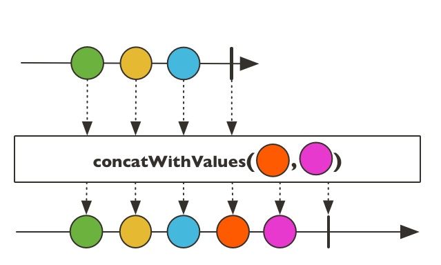

```java
//拼接,必须是前面flux的生产的数据订阅完成后才会拼接新的数据  
Flux.create(t -> {
            t.next("a").next("b").complete();//必须执行完成操作,不然不会拼接
        }).concatWithValues("c","d").subscribe(System.out::println);
```


#### `concat`

```java
public static <T> Flux<T> concat(Iterable<? extends Publisher<? extends T>> sources)
```

> 连接两个Flux， 会按照顺序依次获取两个flux中的数据,如果发生异常,会立刻终止

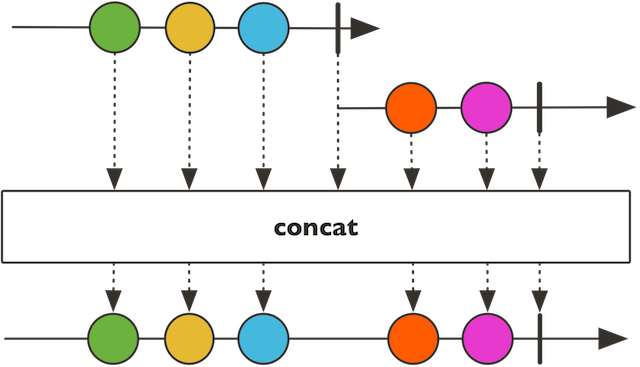


```java
        Flux.concat(Flux.just("1", "2", "3"), Flux.just("a", "b", "c")).subscribe(System.out::println);
	//错误会中断
  Flux.concat(Flux.just(1, 2, 0)
                        .doOnNext(integer -> System.out.println(100/integer))//doOnNext在执行next之前先执行的操作
                , Flux.just(4, 5, 6)).subscribe(new Subscriber<Integer>() {
            Subscription subscription;
            @Override
            public void onSubscribe(Subscription s) {
                s.request(1);
                subscription = s;
            }

            @Override
            public void onNext(Integer integer) {
                System.err.println(integer);
                subscription.request(1);
            }

            @Override
            public void onError(Throwable t) {
                t.printStackTrace();
            }

            @Override
            public void onComplete() {
                System.err.println("TestMain中的方法onComplete 执行了");
            }
        });
```


#### `concatDelayError`

```java
public static <T> Flux<T> concatDelayError(Publisher<? extends Publisher<? extends T>> sources)
```

> 连接两个flux,会依次获取数据,如果出现异常会先继续执行后面的数据,最后再将错误抛出

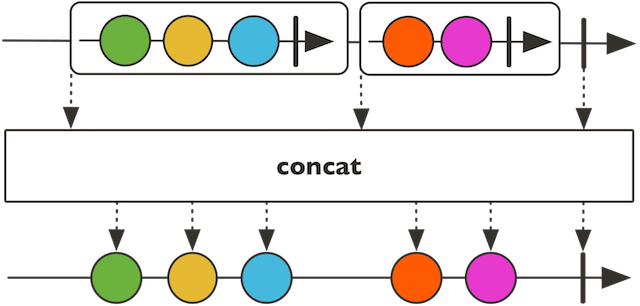


> 此操作符在取消时丢弃内部排队的元素以产生背压。


```java
//前面的数据失败的情况下可以继续执行
Flux.concatDelayError(Flux.just(1, 2, 0)
                        .doOnNext(integer -> System.out.println(100/integer))//doOnNext在执行next之前先执行的操作
                , Flux.just(4, 5, 6)).subscribe(new Subscriber<Integer>() {
            Subscription subscription;
            @Override
            public void onSubscribe(Subscription s) {
                s.request(1);
                subscription = s;
            }

            @Override
            public void onNext(Integer integer) {
                System.err.println(integer);
                subscription.request(1);
            }

            @Override
            public void onError(Throwable t) {
                t.printStackTrace();
            }

            @Override
            public void onComplete() {
                System.err.println("TestMain中的方法onComplete 执行了");
            }
        });
```


#### `first`


```java
@SafeVarargs
    public static <I> Flux<I> first(Publisher<? extends I>... sources)
```

> 选择第一个Publisher发出任何信号（onNext/onError/onComplete）并重放来自该Publisher的所有信号,`新版本已经过时`

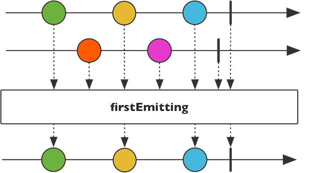


> 返回一个新的Flux


```java
  Flux.firstWithSignal(Flux.just(1, 2, 0) , Flux.just(4, 5, 6)).subscribe(new Subscriber<Integer>() {
            Subscription subscription;
            @Override
            public void onSubscribe(Subscription s) {
                s.request(1);
                subscription = s;
            }

            @Override
            public void onNext(Integer integer) {
                System.err.println(integer);
                subscription.request(1);
            }

            @Override
            public void onError(Throwable t) {
                t.printStackTrace();
            }

            @Override
            public void onComplete() {
                System.err.println("TestMain中的方法onComplete 执行了");
            }
        });
```


#### `merge`


```java
public static <T> Flux<T> merge(Publisher<? extends Publisher<? extends T>> source)
```

> 交替获取两个flux中的数据

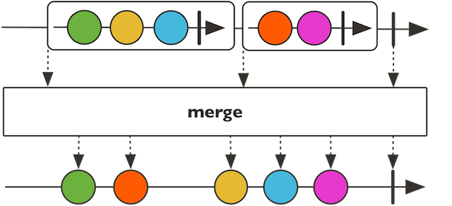


```java
//交替
Flux.merge(Flux.interval(Duration.ofMillis(0), Duration.ofMillis(100)).take(5), Flux.interval(Duration.ofMillis(50), Duration.ofMillis(100)).take(5))
                .toStream()
                .forEach(System.out::println);

```


> 返回一个合并的Flux

#### `mergeOrdered`


```java
@SafeVarargs
public static <I extends Comparable<? super I>> Flux<I> mergeOrdered(Publisher<? extends I>... sources)
```

> 3.x版本已经由mergeComparing替换,将多个Flux排序后执行,需要提供排序方式,注意flux内部的数据可能不排序,只是flux之间排序,默认情况下如果是有字典顺序的数据会按照字典顺序排序,指定排序方式后会进行flux间排序

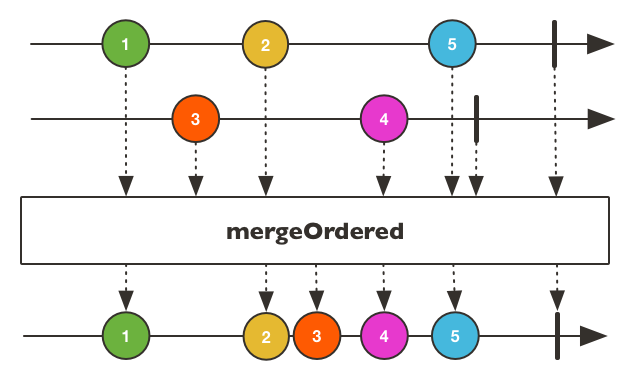


> 返回 一个合并Flux，但保持原始排序的合并Flux


```java
//结果就是两个flux的数据按照顺序输出自己的数据,类似两个玩家比较自己的牌的大小,每个玩家拿一张,比较后小的就输出,大的作为下次的比较
Flux.mergeComparing((s1,s2)-> s1-s2, Flux.just(1, 3, 2), Flux.just(6, 5, 4)).subscribe(System.out::println);
//如果每个只有一个数据,可以看到明显的排序效果
Flux.mergeComparing((s1,s2)-> s2-s1, Flux.just(1), Flux.just(6), Flux.just(2), Flux.just(4), Flux.just(7)).subscribe(System.out::println);
```


#### `zip`


```java
public static <T1,T2,O> Flux<O> zip(Publisher<? extends T1> source1,
                                    Publisher<? extends T2> source2,
                                    BiFunction<? super T1,? super T2,? extends O> combinator)
```

> 将两个源压缩在一起，也就是说，等待所有源发出一个元素，并将这些元素组合成一个输出值（由提供的组合器构造）。然后重复直至任意一个数据源结束。如果中间遇到错误将立即出发错误操作。这种“Step-Merge”处理在分散聚集场景中特别有用。

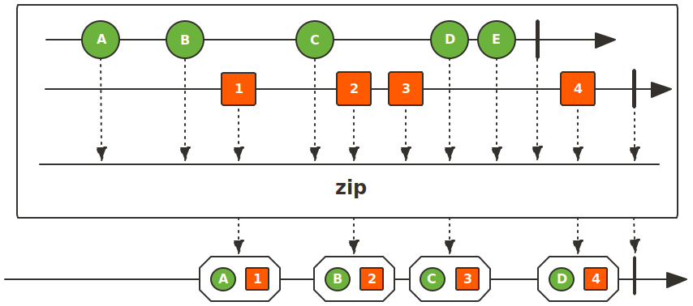


```java
 //每个flux的每个位置的数据合并到一个数组中交给订阅者,多余的数据会舍弃
Flux.zip(Flux.just(1, 2, 0), Flux.just(4, 5, 6)).subscribe(System.out::println);
//分组并进行响应操作后返回一个结果交给订阅者,比如此处是将两个flux的数据加起来后的结果返回
Flux.zip(Flux.just(1, 2, 0), Flux.just(4, 5, 6),(i1,i2)->i1+i2).subscribe(System.out::println);
```


#### `all`


```java
public final Mono<Boolean> all(Predicate<? super T> predicate)
```

> 判断所有的数据是不是符合断言的要求,符合就返回true,任意一个不符合就返回false

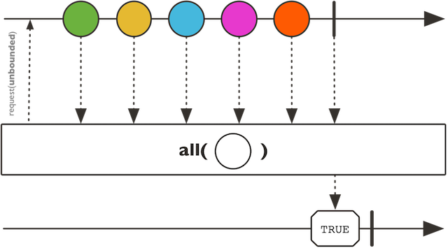


```java
Flux.just(1, 2, 0).all(i->i>0).subscribe(System.out::println);
```


#### `any`


```java
public final Mono<Boolean> any(Predicate<? super T> predicate)
```

> 如果这个Flux序列的任何值与断言匹配，则发出一个布尔布尔值true。
>  该实现使用短路逻辑，如果任何值与断言不匹配，则完成FALSE。

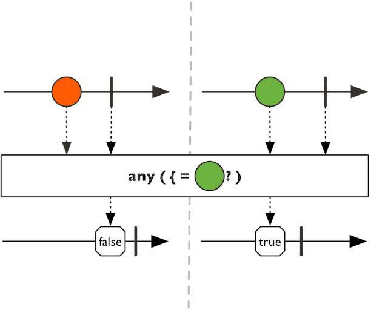


#### `as`


```java
public final <P> P as(Function<? super Flux<T>,P> transformer)
```

> 将此Flux转换为目标类型。将所有的数据挨个传递给我们,我们最终将数组进行响应的操作后返回一个结果,具体返回什么取决于我们自己的业务


```java
 System.err.println(Flux.just(1,2,3).as(new Function<Flux<Integer>, Object>() {
            @Override
            public Object apply(Flux<Integer> integerFlux) {
                final String[] s = {""};
                integerFlux.subscribe(integer -> s[0] = s[0] + integer);
                return s[0];
            }
        }));
```


#### `buffer`


```java
public final Flux<List<T>> buffer()
```

> 将所有传入的值收集到一个列表缓冲器中，一旦该Flux完成，将由返回的Flux发出。

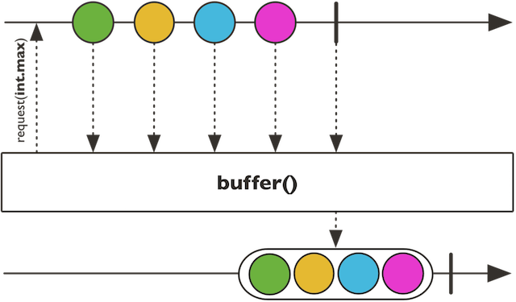


> 该操作在数据信号触发的取消或错误时丢弃缓冲器。


```java
        //buffer一次缓冲多少数据,然后一次性作为一个数组返回,不足的数据将放到一个数组中
        Flux.just(1,2,3,4,5).buffer(3).subscribe(System.out::println);
		//几个为1组,分完一组后跳过几个值再开始分组
        Flux.just(1,2,3).buffer(2,1).subscribe(System.out::println);
```


#### `cache`


```java
public final Flux<T> cache()
```

> 缓存指定个数的所有数据,首次获取到的是所有数据,再次订阅后得到的将是指定个数的缓存数据,缓存可以设有效期,在超过有效期后会重新输入数据源并获取指定缓存

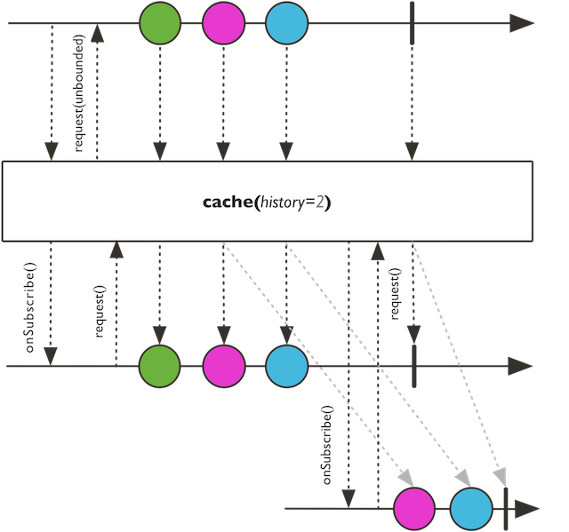


> 返回一个缓存的 Flux

```java
        Flux<Integer> cache = Flux.just(1, 2, 3, 4, 5).cache(2);
//        //第一次订阅是原始的所有的数据,然后会根据我们期望的cache的个数来将最后几个数据进行缓存
        cache.subscribe(System.out::println);
        //第二次次订阅后只有缓存的最后的个数的数据
        cache.subscribe(System.out::println);
        //将最后指定个数的数据缓存,保存一定时间,在这个时间内订阅的话得到的是缓存的数据,当缓存时间结束后,再次订阅得到的结果就是是原始数据
        Flux<Integer> cache1 = Flux.just(1, 2, 3, 4, 5).cache(2, Duration.of(10, ChronoUnit.SECONDS));
		//第一次原始数据
        cache1.subscribe(System.out::println);
        System.out.println("-------");
		//缓存的个数的数据
        cache1.subscribe(System.out::println);
        System.out.println("-------");
		//缓存的个数的数据
        cache1.subscribe(System.out::println);
        System.out.println("-------");
		//缓存的个数的数据
        cache1.subscribe(System.out::println);
        System.out.println("-------");
        Thread.sleep(11000);
        //过期后再订阅就是原始数据
        cache1.subscribe(System.out::println);
```


#### `cast`


```php
public final <E> Flux<E> cast(Class<E> clazz)
```

> 将产生的Flux类型强制转换为目标产生类型的Flux,注意类型转换异常,一般是因为数据的来源中没有具体的类型,所以是object,但是我们在操作的时候是知道具体类型的,要么每次强转数据,要么我们可以通过cast一次性强转再进行操作

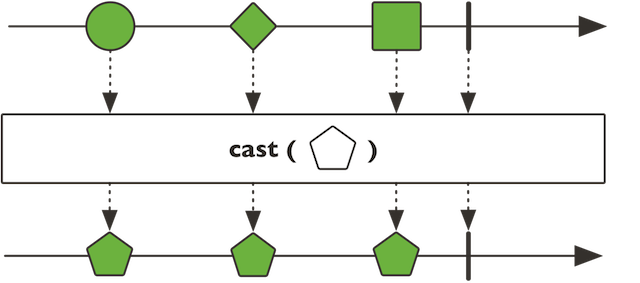


#### `collect`


```java
public final <E> Mono<E> collect(Supplier<E> containerSupplier,
                                 BiConsumer<E,? super T> collector)
```

> 将数据保存到一个集合中,然后作为一个数据放到mono中
>
> 通过containerSupplier返回最终数据交给订阅者,并且此数据会随着每个元素传递给collector

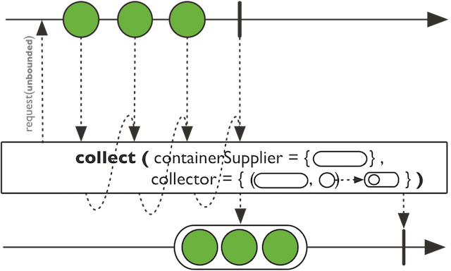

```java
        //将数据保存到一个集合中,然后作为一个数据放到mono中
        Flux.just(1, 2, 3, 4, 5, 6, 6).collect(Collectors.toSet()).subscribe(System.out::println);

	//通过自定义函数来收集
        Flux.just(1, 2, 3, 4, 5, 6, 6).collect(
                ()->"a",//将这个返回的a拼接到我们的每个数据的前面,这个只会执行一次
                (t,u)->System.out.println(t+u)//t就是我们每次拼接到前面的那个a, u就是每次遍历的数据
        ).subscribe(System.err::println);//订阅其实就是我们返回的那个a

```


#### `collectList`


```php
public final Mono<List<T>> collectList()
```

> 将数据全部放到一个集合中之后作为一个返回值,放到mono中

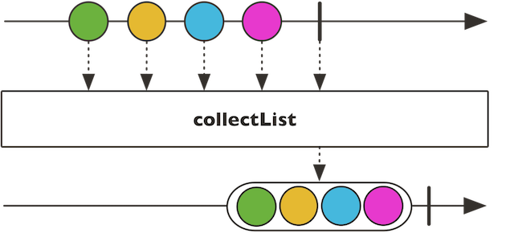


```java
  		//将数据全部放到一个集合中之后作为一个返回值,放到mono中
      Flux.just(1, 2, 3, 4, 5, 6, 6).collectList().subscribe(System.err::println);
 
```


#### `defaultIfEmpty`


```java
public final Flux<T> defaultIfEmpty(T defaultV)
```

> 如果没有任何数据完成此序列，则提供默认的唯一值

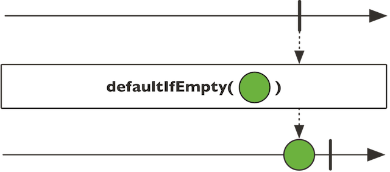


```java
Flux.just().defaultIfEmpty(10).subscribe(System.out::println);
```


#### `distinct`


```java
public final Flux<T> distinct()
```

> 对于每一个Subscriber，跟踪已经从这个Flux 跟踪元素和过滤出重复。
>  值本身被记录到一个用于检测的哈希集中。如果希望使用distinct(Object::hashcode)更轻量级的方法，该方法不保留所有对象，但是更容易由于hashcode冲突而错误地认为两个元素是不同的。

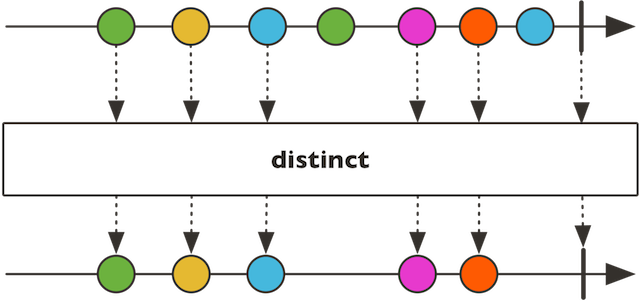


```java
      //去重
        Flux.just(1, 2, 3, 4, 5,5).distinct().subscribe(System.out::println);
        //连续重复的数据只会订阅到一个,变化的数据都可以订阅到,比如5 5 5 只有一个5 4 5 4可以都订阅到
        Flux.just(1, 2, 3, 4, 5,5,4).distinctUntilChanged().subscribe(System.out::println);
        //参数1,确定当前数据是不是已经存在过,符合这个条件的就是已经存在过了,比如我们例子中的条件是当前数据是不是>4
        //第一个数字1小于4,并且现在没有数据小于4,就保存起来,第二个数字2也小于4,但是因为已经有一个小于4的了,所以认为他俩是一样的
        //直到10之前都是不大于4,都是重复的数据,到了10之后是大于4的并且是第一个数据,所以保存起来,后面的数据有的大于有的小于等于,但是因为两个数据都已经有了,所以后面的数据全是重复的数据
        //参数2,用什么集合来保存这个重复的数据
        Flux.just(1, 2, 3, 4,4, 10,5, 5,4,6,7,8,9).distinct(integer ->integer>4, () -> new HashSet<>()).subscribe(System.out::println);
```


#### `doOnCancel`


```java
public final Flux<T> doOnCancel(Runnable onCancel)
```

> 当Flux被取消时触发的方法（side-effect）。

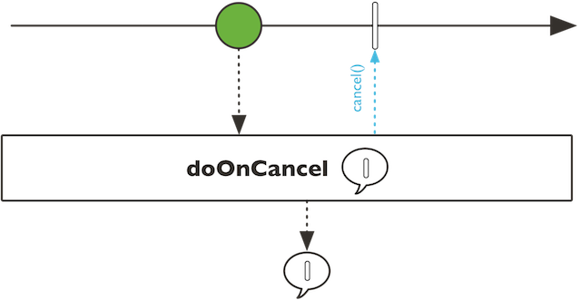


#### `doOnComplete`


```java
public final Flux<T> doOnComplete(Runnable onComplete)
```

> 当Flux完成时触发的方法effect）。

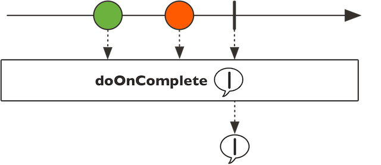


```java

        Flux.just(1, 2, 3, 4, 5, 5)
            .doOnComplete(() -> System.out.println("马上结束"))//在onComplete执行之前执行
            .subscribe(new Subscriber<Integer>() {
            Subscription subscription;

            @Override
            public void onSubscribe(Subscription subscription) {
                this.subscription = subscription;
                subscription.request(1);

            }

            @Override
            public void onNext(Integer integer) {
                System.err.println("TestFlux中的方法onNext 执行了" + integer);
                subscription.request(1);
            }

            @Override
            public void onError(Throwable throwable) {

            }

            @Override
            public void onComplete() {
                System.err.println("TestFlux中的方法onComplete 执行了");
            }
        });
```


#### `doOnNext`


```java
public final Flux<T> doOnNext(Consumer<? super T> onNext)
```

> 当订阅者的onNext方法执行之前执行

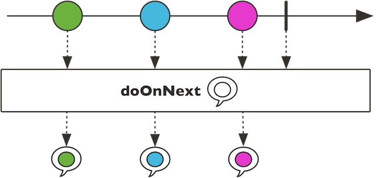


#### `filter`


```swift
public final Flux<T> filter(Predicate<? super T> p)
```

> 只保留符合断言条件的数据

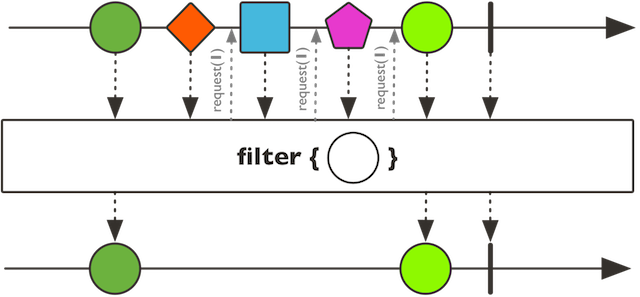


```java
     Flux.just(1, 2, 3, 4, 5, 5).filter(integer -> integer>3).subscribe(System.out::println);

```


#### `log`


```java
public final Flux<T> log()
```

> 观察所有 Reactive Streams信号并使用记录器支持跟踪它们。默认值将使用Level.INFO和 java.util.logging日志记录。如果SLF4J是可用的，它将被用来代替。

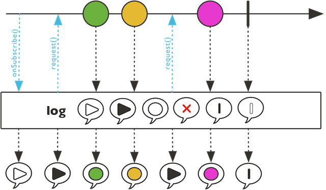


#### `map`


```java
public final <V> Flux<V> map(Function<? super T,? extends V> mapper)
```

> 将Flux中的数据转换为另外一种格式的数据。

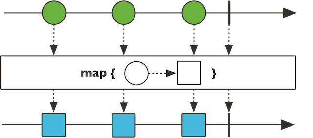


```java
Flux.just(1, 2, 3, 4, 5, 5).map(integer -> "a"+integer).subscribe(System.out::println);
```


#### `flatmap`


```java
public final <R> Flux<R> flatMap(Function<? super T, ? extends Publisher<? extends R>> mapper) 
```

> 扁平化转换,更多的使用场景是我们有一个集合(多个序列)数据,然后里面的每个数据内部又有一个集合数据,我们想将所有的数据的内部的集合的数据全部取出来放到一个flux中(不是flux里面放很多个集合,而是将集合拆开将数据放到flux)


|  |
| :-----------------------------------------: |


```java
 List<User> users = new ArrayList<>();
        for (int i = 0; i < 10; i++) {
            User user = new User();
            user.setId(i);
            user.setUserName("username-->"+i);
            ArrayList<Item> items = new ArrayList<>();
            for (int i1 = 0; i1 < 10; i1++) {
                Item item = new Item();
                item.setId(i1);
                item.setName(i+"-->"+i1+"==>itemname");
                items.add(item);
            }
            user.setItems(items);
            users.add(user);
        }
       // System.err.println(users);
        Flux.fromIterable(users)
            //将每个user里面的items全部取出来,一个一个的放到flux中,返回结果是Flux<Item>
                .flatMap(user -> Flux.fromIterable(user.getItems()))
                .subscribe(System.out::println);

        Flux.fromIterable(users)
            //将user的items取出来作为集合.将一个一个的集合放到flux中,返回结果是Flux<List<Item>>
                .map(user -> user.getItems())
                .subscribe(System.out::println);
    }
```


#### `then`


```java
public final <V> Mono<V> then(Mono<V> other)
```

> 让这个Flux完成，然后播放信号提供的Mono。
>  换句话说，忽略这个Flux和转换完成信号的发射和提供Mono完成信号。在得到的Mono中重放错误信号。


| 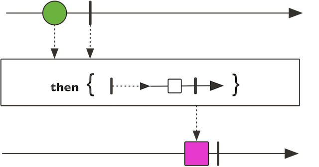 |
| :-----------------------------------------: |


```java
 // 让前面的flux结束,然后执行后面提供的mono中的操作,flux没有人订阅获取数据,但是实际上可以认为是被订阅了,只是没有具体处理措施,doOnNext是执行的
        Flux.just(1, 2, 3, 4, 8, 5, 6, 6, 10, 100).doOnNext(integer -> {
            System.err.println("当前拿到了" + integer);
        }).doOnComplete(()->{
            System.err.println("结束了");
        }).then(Mono.just("abc")).subscribe(System.err::println);
```


#### `Skip`

```java
public final Flux<T> skip(long skipped)
```

>从该Flux的开始跳过指定数量的元素，然后发布剩余的元素

| 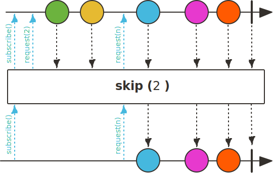 |
| :---------------------: |


```java
Flux.just(1, 2, 3, 4, 8, 5, 6, 6, 10, 100).skip(3).subscribe(System.out::println);
```


#### `Skip(Duration)`

```java
public final Flux<T> skip(Duration timespan)
```

> 跳过指定时间的数据,比如一个数据大于需要10秒钟,设置2秒则意味着前2秒的数据会跳过,只保留后面的8秒数据


| 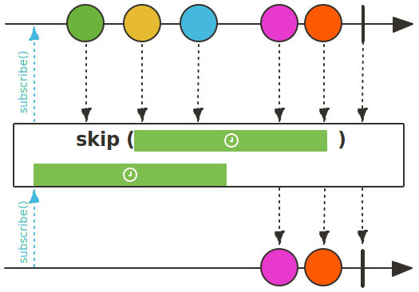 |
| :---------------------------------------------: |


```java
     Flux.interval(Duration.ofSeconds(1)).skip(Duration.ofSeconds(2)).subscribe(System.out::println);
```


### 2.4Flux其它操作

```java
public final Flux<T> take(long n) 
//与skip相反，只发布前面指定数量的数据项
public final Flux<T> take(Duration timespan)

public final Flux<T> filter(Predicate<? super T> p)

public final Flux<T> subscribeOn(Scheduler scheduler)
//在指定的调度器的Scheduler. worker上运行subscribe、onSubscribe和request,
//声明每个订阅都应该在并行线程中进行，可以异步并行执行

//缓存数据、收集数据
public final Flux<List<T>> buffer(int maxSize) 
public final Flux<List<T>> buffer() //收集所有的数据项 大小为Integer.MAX_VALUE 
//产生一个新包含List的Flux

public final <K> Mono<Map<K, T>> collectMap(Function<? super T, ? extends K> keyExtractor)
//收集所有的数据项，产生一个发布Map的Mono，key是从传入消息的某些我特征衍生而来
//key相同，后面的消息值会覆盖前面的

public final Mono<T> next() 
//获取第一个数据项到一个新的Mono 
//应用于每个子Flux,记录了所有的响应式事件
public final Flux<T> checkpoint(String description);
Flux.just(1, 0).map(x -> 1 / x).checkpoint("test").subscribe(System.out::println);
```


### 2.5 Mono 方法

 多只触发一个事件，可以把Mono<Void>用于在异步任务完成时发出通知 

`Mono` 是一个发出(emit)`0-1`个元素的`Publisher<T>`,可以被`onComplete`信号或者`onError`信号所终止。


```java
//通过一个发布者创建,并将返回的结果订阅
Mono.fromSupplier(() -> "Hello").subscribe(System.out::println);
//创建或者是空的
Mono.justOrEmpty(Optional.of("Hello")).subscribe(System.out::println);

//通过消费者创建
Mono.create(sink -> sink.success("Hello")).subscribe(System.out::println);
 
//empty()：创建一个不包含任何元素，只发布结束消息的序列
Mono.empty().subscribe(System.out::println); #允许消费者在有结果可用时进行消费
 
//just()：可以指定序列中包含的全部元素。创建出来的 Mono序列在发布这些元素之后会自动结束。
Mono.just("www.baidu.com").subscribe(System.out::println);
 
//ustOrEmpty()：从一个 Optional 对象或可能为 null 的对象中创建 Mono。
//只有 Optional 对象中包含值或对象不为 null 时，Mono 序列才产生对应的元素。
Mono.justOrEmpty(null).subscribe(System.out::println);
Mono.justOrEmpty("jackiechan").subscribe(System.out::println);
Mono.justOrEmpty(Optional.of("jackiechan")).subscribe(System.out::println);
 
//error(Throwable error)：创建一个只包含错误消息的序列。
Mono.error(new RuntimeException("error")).subscribe(System.out::println, System.err::println);
 
//never()：创建一个不包含任何消息通知的序列。
Mono.never().subscribe(System.out::println);
 
//通过 create()方法来使用 MonoSink 来创建 Mono。
Mono.create(sink -> sink.success("jackiechan")).subscribe(System.out::println);
//通过fromRunnable创建，并实现异常处理
Mono.fromRunnable(() -> {
    System.out.println("thread run");
throw new RuntimeException("thread run error");
}).subscribe(System.out::println, System.err::println);
 
//通过fromCallable创建
Mono.fromCallable(() -> "callable run ").subscribe(System.out::println);
 
//通过fromSupplier创建
Mono.fromSupplier(() -> "create from supplier").subscribe(System.out::println);
 
//delay(Duration duration)和 delayMillis(long duration)：创建一个 Mono 序列，在指定的延迟时间之后，产生数字 0 作为唯一值。
long start = System.currentTimeMillis();
Disposable disposable = Mono.delay(Duration.ofSeconds(2)).subscribe(n -> {
    System.out.println("生产数据源："+ n);
    System.out.println("当前线程ID："+ Thread.currentThread().getId() + ",生产到消费耗时："+ (System.currentTimeMillis() - start));
});
System.out.println("主线程"+ Thread.currentThread().getId() + "耗时："+ (System.currentTimeMillis() - start));
while(!disposable.isDisposed()) {
    //
}

```

