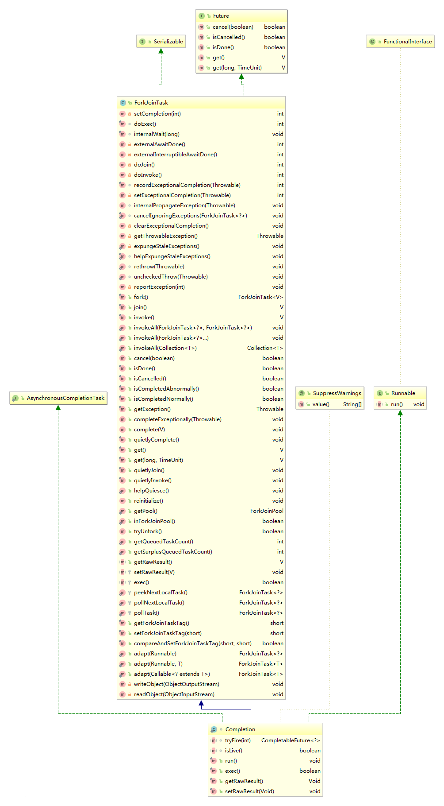

# 1.官方文档


```kotlin
A Future that may be explicitly completed (setting its value and 
status), and may be used as a CompletionStage, supporting 
dependent functions and actions that trigger upon its 
completion.

When two or more threads attempt to complete, 
completeExceptionally, or cancel a CompletableFuture, only one 
of them succeeds.

In addition to these and related methods for directly 
manipulating status and results, CompletableFuture implements 
interface CompletionStage with the following policies:
* Actions supplied for dependent completions of non-async 
  methods may be performed by the thread that completes the 
  current CompletableFuture, or by any other caller of a 
  completion method.
* All async methods without an explicit Executor argument are 
  performed using the ForkJoinPool.commonPool() (unless it 
  does not support a parallelism level of at least two, in which 
  case, a new Thread is created to run each task). To simplify 
  monitoring, debugging, and tracking, all generated 
  asynchronous tasks are instances of the marker interface 
  CompletableFuture.AsynchronousCompletionTask.
* All CompletionStage methods are implemented independently 
  of other public methods, so the behavior of one method is not 
  impacted by overrides of others in subclasses.

CompletableFuture also implements Future with the following 
policies:
* Since (unlike FutureTask) this class has no direct control over 
  the computation that causes it to be completed, cancellation is 
  treated as just another form of exceptional completion. Method 
  cancel has the same effect as completeExceptionally(new 
  CancellationException()). Method isCompletedExceptionally() 
  can be used to determine if a CompletableFuture completed in 
  any exceptional fashion.
* In case of exceptional completion with a CompletionException, 
  methods get() and get(long, TimeUnit) throw an 
  ExecutionException with the same cause as held in the 
  corresponding CompletionException. To simplify usage in most 
  contexts, this class also defines methods join() and getNow(T) 
  that instead throw the CompletionException directly in these 
  cases.
```

可以显式完成的Future（设置其值和状态），并且可以用作CompletionStage，支持在完成时触发依赖函数和操作。

当两个或多个线程尝试complete、completeExceptionally或cancel CompletableFuture时，只有一个能成功。

除了直接操作状态和结果的这些以及相关方法之外，CompletableFuture还使用以下策略实现接口CompletionStage：

- 为非异步方法的依赖完成提供的动作可以由完成当前CompletableFuture的线程执行，或者由完成方法的任何其他调用者执行。
- 所有没有显式Executor参数的异步方法都是使用ForkJoinPool.commonPool()执行的（除非它不支持至少两个并行级别，在这种情况下，创建一个新的Thread来运行每个任务）。为了简化监视、调试和跟踪，所有生成的异步任务都是标记接口CompletableFuture.AsynchronousCompletionTask的实例。
- 所有CompletionStage方法都是独立于其他公共方法实现的，因此一个方法的行为不会受到子类中其他方法的覆盖的影响。

CompletableFuture还通过以下策略实现Future：

- 由于（与FutureTask不同）此类无法直接控制导致其完成的计算，因此取消仅被视为异常完成的另一种形式。cancel方法等效于completeExceptionally(new CancellationException())。方法isCompletedExceptionally()可用于确定CompletableFuture是否以任何异常方式完成。
- 当以CompletionException异常完成时，则方法get()和get(long，TimeUnit)抛出ExecutionException，其原因与相应的CompletionException中保存的原因相同。为了简化大多数上下文中的使用，此类还定义了join()和getNow(T)方法，它们在这些情况下直接抛出CompletionException。

|  |
| :----------------------------------------: |


|  |
| :----------------------------------------: |


## 1.1 实现说明


```csharp
A CompletableFuture may have dependent completion actions,
collected in a linked stack. It atomically completes by CASing
a result field, and then pops off and runs those actions. This
applies across normal vs exceptional outcomes, sync vs async
actions, binary triggers, and various forms of completions.

Non-nullness of field result (set via CAS) indicates done.  An
AltResult is used to box null as a result, as well as to hold
exceptions.  Using a single field makes completion simple to
detect and trigger.  Encoding and decoding is straightforward
but adds to the sprawl of trapping and associating exceptions
with targets.  Minor simplifications rely on (static) NIL (to
box null results) being the only AltResult with a null
exception field, so we don't usually need explicit comparisons.
Even though some of the generics casts are unchecked (see
SuppressWarnings annotations), they are placed to be
appropriate even if checked.

Dependent actions are represented by Completion objects linked
as Treiber stacks headed by field "stack". There are Completion
classes for each kind of action, grouped into single-input
(UniCompletion), two-input (BiCompletion), projected
(BiCompletions using either (not both) of two inputs), shared
(CoCompletion, used by the second of two sources), zero-input
source actions, and Signallers that unblock waiters. Class
Completion extends ForkJoinTask to enable async execution
(adding no space overhead because we exploit its "tag" methods
to maintain claims). It is also declared as Runnable to allow
usage with arbitrary executors.

Support for each kind of CompletionStage relies on a separate
class, along with two CompletableFuture methods:

* A Completion class with name X corresponding to function,
  prefaced with "Uni", "Bi", or "Or". Each class contains
  fields for source(s), actions, and dependent. They are
  boringly similar, differing from others only with respect to
  underlying functional forms. We do this so that users don't
  encounter layers of adaptors in common usages. We also
  include "Relay" classes/methods that don't correspond to user
  methods; they copy results from one stage to another.

* Boolean CompletableFuture method x(...) (for example
  uniApply) takes all of the arguments needed to check that an
  action is triggerable, and then either runs the action or
  arranges its async execution by executing its Completion
  argument, if present. The method returns true if known to be
  complete.

* Completion method tryFire(int mode) invokes the associated x
  method with its held arguments, and on success cleans up.
  The mode argument allows tryFire to be called twice (SYNC,
  then ASYNC); the first to screen and trap exceptions while
  arranging to execute, and the second when called from a
  task. (A few classes are not used async so take slightly
  different forms.)  The claim() callback suppresses function
  invocation if already claimed by another thread.

* CompletableFuture method xStage(...) is called from a public
  stage method of CompletableFuture x. It screens user
  arguments and invokes and/or creates the stage object.  If
  not async and x is already complete, the action is run
  immediately.  Otherwise a Completion c is created, pushed to
  x's stack (unless done), and started or triggered via
  c.tryFire.  This also covers races possible if x completes
  while pushing.  Classes with two inputs (for example BiApply)
  deal with races across both while pushing actions.  The
  second completion is a CoCompletion pointing to the first,
  shared so that at most one performs the action.  The
  multiple-arity methods allOf and anyOf do this pairwise to
  form trees of completions.

Note that the generic type parameters of methods vary according
to whether "this" is a source, dependent, or completion.

Method postComplete is called upon completion unless the target
is guaranteed not to be observable (i.e., not yet returned or
linked). Multiple threads can call postComplete, which
atomically pops each dependent action, and tries to trigger it
via method tryFire, in NESTED mode.  Triggering can propagate
recursively, so NESTED mode returns its completed dependent (if
one exists) for further processing by its caller (see method
postFire).

Blocking methods get() and join() rely on Signaller Completions
that wake up waiting threads.  The mechanics are similar to
Treiber stack wait-nodes used in FutureTask, Phaser, and
SynchronousQueue. See their internal documentation for
algorithmic details.

Without precautions, CompletableFutures would be prone to
garbage accumulation as chains of Completions build up, each
pointing back to its sources. So we null out fields as soon as
possible (see especially method Completion.detach). The
screening checks needed anyway harmlessly ignore null arguments
that may have been obtained during races with threads nulling
out fields.  We also try to unlink fired Completions from
stacks that might never be popped (see method postFire).
Completion fields need not be declared as final or volatile
because they are only visible to other threads upon safe
publication.
```

CompletableFuture可能具有相关的完成操作，收集在栈中。它通过CASing更新结果字段以原子方式完成，然后弹出并运行这些操作。这适用于正常与异常结果，同步与异步动作，binary触发器和各种形式的完成。

字段结果的非零值（通过CAS设置）表示已完成。 AltResult将null装箱并作为结果，以及保存异常。使用单个字段可以使检测和触发变得简单。编码和解码很简单，但会增加陷阱并将异常与目标相关联。较小的简化依赖于（静态）NIL（to box null results）是唯一具有null异常字段的AltResult，因此我们通常不需要进行显式比较。即使某些泛型类型转换未经检查（请参阅SuppressWarnings注释），即使经过检查，它们放置的位置也是合适的。

相关动作由作为Treiber栈链接的Completion对象表示，该栈由字段“stack”表示。每种动作都有完成类，分为单输入（UniCompletion），双输入（BiCompletion），projected（BiCompletions使用两个输入中的一个），共享（CoCompletion，两个来源中的第二个），零输入源动作，以及解锁等待线程的Signallers。类Completion扩展了ForkJoinTask以启用异步执行（不添加空间开销，因为我们利用其“tag”方法来维护声明）。它也被声明为Runnable以允许使用任意执行程序。

对每种CompletionStage的支持依赖于一个单独的类，以及两个CompletableFuture方法：

- 名称为X的Completion类，对应于函数，前缀为“Uni”，“Bi”或“Or”。每个类都包含source(s)、actions和dependent的字段。它们非常相似，仅与底层功能形式有所不同。我们这样做是为了让用户在常见用法中不会遇到适配器层。我们还包括与用户方法不对应的“Relay”类/方法;他们将结果从一个stage复制到另一个。
- Boolean CompletableFuture方法x（...）（例如uniApply）获取检查操作是否可触发所需的所有参数，然后运行操作或通过执行其Completion参数（如果存在）安排其异步执行。如果已知完成，则该方法返回true。
- 完成方法tryFire(int mode)调用以其参数调用关联的x方法，并在成功时清除。 mode参数允许tryFire被调用两次（SYNC，然后是ASYNC）;第一个在安排执行时屏蔽和捕获异常，第二个在任务调用时 （一些类不使用异步，因此采用略有不同的形式。）如果另一个线程已经claim了，则claim()回调会抑制函数调用。
- CompletableFuture方法xStage(...)从CompletableFuture x的公共stage方法处调用。它会筛选用户参数并调用和/或创建stage对象。如果不是异步并且x已经完成，则立即执行操作。否则，创建Completion c，压入x的堆栈（除非完成），并通过c.tryFire启动或触发。如果x在压入时完成，这也包括可能的争用。具有两个输入的类（例如BiApply）在push动作时处理两者之间的争用。第二个completion是指向第一个的CoCompletion，共享以便最多只执行一个动作。多重方法allOf和anyOf成对地形成completions树。

请注意，方法的泛型类型参数根据“this”是源、依赖还是完成而有所不同。

方法postComplete在完成时被调用，除非保证目标不可观察（即，尚未返回或链接）。多个线程可以调用postComplete，它会自动弹出每个依赖操作，并尝试在NESTED模式下通过方法tryFire触发它。触发可以递归传播，因此NESTED模式返回其完成的依赖（如果存在）以供其调用者进一步处理（请参阅postFire方法）。

**阻塞方法get()和join()依赖于唤醒等待线程的Signaller Completions。这些机制类似于FutureTask、Phaser和SynchronousQueue中使用的Treiber堆栈等待节点。有关算法详细信息，请参阅其内部文档。**

如果没有预防措施，CompletableFutures将容易导致垃圾堆积，因为Completions链的堆积，每个都指向其源。 所以我们尽快使字段null out（特别参见方法Completion.detach）。 无论如何，筛选检查无害地忽略了null参数，其在使用线程将字段置零的比赛期间可能获得的。 我们还尝试从可能永远不会弹出的栈中取消链接已fired的Completions（请参阅方法postFire）。 Completion字段不需要声明为final或volatile，因为它们仅在安全发布时对其他线程可见。

# 2.为什么引入CompletableFuture

## 2.1 回调

回调函数比较通用的解释是，它是一个通过函数指针调用的函数。如果你把函数的指针（地址）作为参数传递给另一个函数，当这个指针被用为调用它所指向的函数时，我们就说这是回调函数。回调函数不是由该函数的实现方直接调用，而是在特定的事件或条件发生时由另外一方调用的，用于对该事件或条件进行响应。

回调函数的机制：

- 定义一个回调函数；
- 提供函数实现的一方在初始化时候，将回调函数的函数指针注册给调用者；
- 当特定的事件或条件发生的时候，调用者使用函数指针调用回调函数对事件进行处理。

## 2.2 回调方式的异步编程

JDK5 新增了 Future 接口，用于描述一个异步计算的结果。虽然 Future 以及相关使用方法提供了异步执行任务的能力，但是对于结果的获取却是很不方便，只能通过阻塞或者轮询的方式得到任务的结果。阻塞的方式显然和我们的异步编程的初衷相违背，轮询的方式又会耗费无谓的 CPU 资源，而且也不能及时地得到计算结果。

为什么不能用观察者设计模式呢？即当计算结果完成及时通知监听者。
 有一些开源框架实现了我们的设想：

- 例如 Netty 的 ChannelFuture 类扩展了 Future 接口，通过提供 addListener 方法实现支持回调方式的异步编程。Netty 中所有的 I/O 操作都是异步的,这意味着任何的 I/O 调用都将立即返回，而不保证这些被请求的 I/O 操作在调用结束的时候已经完成。取而代之地，你会得到一个返回的 ChannelFuture 实例，这个实例将给你一些关于 I/O 操作结果或者状态的信息。当一个 I/O 操作开始的时候，一个新的 Future 对象就会被创建。在开始的时候，新的 Future 是未完成的状态－－它既非成功、失败，也非被取消，因为 I/O 操作还没有结束。如果 I/O 操作以成功、失败或者被取消中的任何一种状态结束了，那么这个 Future 将会被标记为已完成，并包含更多详细的信息（例如：失败的原因）。请注意，即使是失败和被取消的状态，也是属于已完成的状态。
- Google guava也提供了通用的扩展Future:ListenableFuture、SettableFuture 以及辅助类Futures等，方便异步编程。
- Scala也提供了简单易用且功能强大的Future/Promise异步编程模式。
- CompletableFuture提供了非常强大的 Future 的扩展功能，可以帮助我们简化异步编程的复杂性，并且提供了函数式编程的能力，可以通过回调的方式处理计算结果，也提供了转换和组合 CompletableFuture 的方法。

## 2.3 CompletableFuture

处理非阻塞调用的传统方法是使用事件处理器，程序员为任务完成之后要出现的动作注册一个处理器。但是，要尝试在一组事件处理器中实现一个控制流会很困难。

CompletableFuture提供了一种候选方法，与事件处理器不同，CompletableFuture可以组合。利用CompletableFuture，可以指定希望做什么，以及希望以什么顺序执行这些工作。这些动作不会立即发生，不过重要的是将所有代码放在一起。

CompletableFuture提供了非常强大的 Future 的扩展功能，可以帮助我们简化异步编程的复杂性，并且提供了函数式编程的能力，可以通过回调的方式处理计算结果，也提供了转换和组合 CompletableFuture 的方法。

对于阻塞或者轮询方式，依然可以通过 CompletableFuture 类的 CompletionStage 和 Future 接口方式支持。

CompletableFuture 类声明了 CompletionStage 接口，CompletionStage 接口实际上提供了同步或异步运行计算的舞台，所以我们可以通过实现多个 CompletionStage 命令，并且将这些命令串联在一起的方式实现多个命令之间的触发。

# 3.每一种方法的三种形式


```tsx
    public <U> CompletableFuture<U> thenApply(
        Function<? super T,? extends U> fn) {
        return uniApplyStage(null, fn);
    }

    public <U> CompletableFuture<U> thenApplyAsync(
        Function<? super T,? extends U> fn) {
        return uniApplyStage(asyncPool, fn);
    }

    public <U> CompletableFuture<U> thenApplyAsync(
        Function<? super T,? extends U> fn, Executor executor) {
        return uniApplyStage(screenExecutor(executor), fn);
    }
```


```java
    private static final boolean useCommonPool =
        (ForkJoinPool.getCommonPoolParallelism() > 1);

    /**
     * Default executor -- ForkJoinPool.commonPool() unless it cannot
     * support parallelism.
     */
    private static final Executor asyncPool = useCommonPool ?
        ForkJoinPool.commonPool() : new ThreadPerTaskExecutor();

    /** Fallback if ForkJoinPool.commonPool() cannot support parallelism */
    static final class ThreadPerTaskExecutor implements Executor {
        public void execute(Runnable r) { new Thread(r).start(); }
    }
```

- 非异步方法由当前线程或调用线程执行
- 不带executor的异步方法使用asyncPool来执行
   1）如果不支持多线程，则新建一个线程专门执行
   2）否则使用ForkJoinPool.commonPool()执行
- 另一种异步方法使用executor执行

# 4.创建CompletableFuture


```cpp
    public CompletableFuture() {
    }

    private CompletableFuture(Object r) {
        this.result = r;
    }
```


```csharp
    public static <U> CompletableFuture<U> supplyAsync(Supplier<U> supplier) {
        return asyncSupplyStage(asyncPool, supplier);
    }

    public static <U> CompletableFuture<U> supplyAsync(Supplier<U> supplier,
                                                       Executor executor) {
        return asyncSupplyStage(screenExecutor(executor), supplier);
    }
```


```csharp
    public static CompletableFuture<Void> runAsync(Runnable runnable) {
        return asyncRunStage(asyncPool, runnable);
    }

    public static CompletableFuture<Void> runAsync(Runnable runnable,
                                                   Executor executor) {
        return asyncRunStage(screenExecutor(executor), runnable);
    }
```

# 5.中间组合操作

- Runnable类型的参数会忽略计算的结果
- Consumer是纯消费计算结果，BiConsumer会组合另外一个CompletionStage纯消费
- Function会对计算结果做转换，BiFunction会组合另外一个CompletionStage的计算结果做转换。

## 5.1 转换

thenApply功能相当于将CompletableFuture<T>转换成CompletableFuture<U>。


```tsx
    public <U> CompletableFuture<U> thenApply(
        Function<? super T,? extends U> fn) {
        return uniApplyStage(null, fn);
    }
```


```xml
    public <U> CompletableFuture<U> applyToEither(
        CompletionStage<? extends T> other, Function<? super T, U> fn) {
        return orApplyStage(null, other, fn);
    }
```

其实从功能上来讲，thenCombine的功能更类似thenAcceptBoth，只不过thenAcceptBoth是纯消费，它的函数参数没有返回值，而thenCombine的函数参数fn有返回值。


```tsx
    public <U,V> CompletableFuture<V> thenCombine(
        CompletionStage<? extends U> other,
        BiFunction<? super T,? super U,? extends V> fn) {
        return biApplyStage(null, other, fn);
    }
```

这一组方法接受一个Function作为参数，这个Function的输入是当前的CompletableFuture的计算值，返回结果将是一个新的CompletableFuture，这个新的CompletableFuture会组合原来的CompletableFuture和函数返回的CompletableFuture。


```tsx
    public <U> CompletableFuture<U> thenCompose(
        Function<? super T, ? extends CompletionStage<U>> fn) {
        return uniComposeStage(null, fn);
    }
```

示例：


```csharp
public class Test3 {
    public static void main(String[] args) throws ExecutionException, InterruptedException {
        CompletableFuture<Integer> future = CompletableFuture.supplyAsync(() -> {
            return 100;
        });
        CompletableFuture<String> f =  future.thenApplyAsync(i -> i * 10).thenApply(i -> i.toString());
        System.out.println(f.get());
    }
}
```

结果：


```undefined
1000
```


```csharp
public class Test6 {
    public static void main(String[] args) throws ExecutionException, InterruptedException {
        CompletableFuture<Integer> future = CompletableFuture.supplyAsync(() -> {
            return 100;
        });
        CompletableFuture<String> future2 = CompletableFuture.supplyAsync(() -> {
            return "abc";
        });
        CompletableFuture<String> f =  future.thenCombine(future2, (x,y) -> y + "-" + x);
        System.out.println(f.get());
    }
}
```

结果：


```undefined
abc-100
```


```csharp
public class Test7 {
    public static void main(String[] args) throws ExecutionException, InterruptedException {
        CompletableFuture<Integer> future = CompletableFuture.supplyAsync(() -> {
            return 100;
        });
        CompletableFuture<String> f =  future.thenCompose( i -> {
            return CompletableFuture.supplyAsync(() -> {
                return (i * 10) + "";
            });
        });
        System.out.println(f.get());
    }
}
```

结果：


```undefined
1000
```

## 5.2 消费

thenAccept只对结果执行Action，而不返回新的计算值。


```kotlin
    public CompletableFuture<Void> thenAccept(Consumer<? super T> action) {
        return uniAcceptStage(null, action);
    }
```


```kotlin
    public <U> CompletableFuture<Void> thenAcceptBoth(
        CompletionStage<? extends U> other,
        BiConsumer<? super T, ? super U> action) {
        return biAcceptStage(null, other, action);
    }
```


```xml
    public <U> CompletableFuture<U> applyToEither(
        CompletionStage<? extends T> other, Function<? super T, U> fn) {
        return orApplyStage(null, other, fn);
    }
```

示例：


```kotlin
public class Test4 {
    public static void main(String[] args) throws ExecutionException, InterruptedException {
        CompletableFuture<Integer> future = CompletableFuture.supplyAsync(() -> {
            return 100;
        });
        CompletableFuture<Void> f =  future.thenAccept(System.out::println);
        System.out.println(f.get());
    }
}
```

结果：


```csharp
100
null
```


```csharp
public class Test5 {
    public static void main(String[] args) throws ExecutionException, InterruptedException {
        CompletableFuture<Integer> future = CompletableFuture.supplyAsync(() -> {
            return 100;
        });
        CompletableFuture<Void> f =  future.thenAcceptBoth(CompletableFuture.completedFuture(10), (x, y) -> System.out.println(x * y));
        System.out.println(f.get());
    }
}
```

结果：


```csharp
1000
null
```

## 5.3 运行

thenRun更彻底地，下面一组方法当计算完成的时候会执行一个Runnable，与thenAccept不同，Runnable并不使用CompletableFuture计算的结果。


```kotlin
    public CompletableFuture<Void> thenRun(Runnable action) {
        return uniRunStage(null, action);
    }
```


```kotlin
    public CompletableFuture<Void> runAfterBoth(CompletionStage<?> other,
                                                Runnable action) {
        return biRunStage(null, other, action);
    }
```


```kotlin
    public CompletableFuture<Void> runAfterEither(CompletionStage<?> other,
                                                  Runnable action) {
        return orRunStage(null, other, action);
    }
```

## 5.4 批量


```csharp
    public static CompletableFuture<Void> allOf(CompletableFuture<?>... cfs) {
        return andTree(cfs, 0, cfs.length - 1);
    }
```


```csharp
    public static CompletableFuture<Object> anyOf(CompletableFuture<?>... cfs) {
        return orTree(cfs, 0, cfs.length - 1);
    }
```

# 6.终止操作


```java
    public <U> CompletableFuture<U> handle(
        BiFunction<? super T, Throwable, ? extends U> fn) {
        return uniHandleStage(null, fn);
    }
```


```java
    public CompletableFuture<T> whenComplete(
        BiConsumer<? super T, ? super Throwable> action) {
        return uniWhenCompleteStage(null, action);
    }
```


```php
    public CompletableFuture<T> exceptionally(
        Function<Throwable, ? extends T> fn) {
        return uniExceptionallyStage(fn);
    }
```

# 7.通过阻塞或者轮询的方式获得结果

get在遇到底层异常时，会抛出受查异常ExecutionException。


```java
    public T get() throws InterruptedException, ExecutionException {
        Object r;
        return reportGet((r = result) == null ? waitingGet(true) : r);
    }

    public T get(long timeout, TimeUnit unit)
        throws InterruptedException, ExecutionException, TimeoutException {
        Object r;
        long nanos = unit.toNanos(timeout);
        return reportGet((r = result) == null ? timedGet(nanos) : r);
    }
```

join在遇到底层的异常时，会抛出未受查的CompletionException。


```csharp
    public T join() {
        Object r;
        return reportJoin((r = result) == null ? waitingGet(false) : r);
    }
```


```csharp
    public T getNow(T valueIfAbsent) {
        Object r;
        return ((r = result) == null) ? valueIfAbsent : reportJoin(r);
    }
```

示例：


```csharp
public class Test1 {
    public static void main(String[] args) throws ExecutionException, InterruptedException {
        CompletableFuture<Integer> future = CompletableFuture.supplyAsync(() -> {
            int i = 1/0;
            return 100;
        });
        System.out.println(future.get());
    }
}
```

结果：


```csharp
Exception in thread "main" java.util.concurrent.ExecutionException: java.lang.ArithmeticException: / by zero
    at java.util.concurrent.CompletableFuture.reportGet(CompletableFuture.java:357)
    at java.util.concurrent.CompletableFuture.get(CompletableFuture.java:1895)
    at com.enjoy.learn.core.concurrency.completablefuture.Test1.main(Test1.java:19)
Caused by: java.lang.ArithmeticException: / by zero
```


```csharp
    public static void main(String[] args) throws ExecutionException, InterruptedException {
        CompletableFuture<Integer> future = CompletableFuture.supplyAsync(() -> {
            int i = 1/0;
            return 100;
        });
        System.out.println(future.join());
    }
```

结果：


```bash
Exception in thread "main" java.util.concurrent.CompletionException: java.lang.ArithmeticException: / by zero
    at java.util.concurrent.CompletableFuture.encodeThrowable(CompletableFuture.java:273)
    at java.util.concurrent.CompletableFuture.completeThrowable(CompletableFuture.java:280)
    at java.util.concurrent.CompletableFuture$AsyncSupply.run(CompletableFuture.java:1592)
    at java.util.concurrent.CompletableFuture$AsyncSupply.exec(CompletableFuture.java:1582)
    at java.util.concurrent.ForkJoinTask.doExec(ForkJoinTask.java:289)
    at java.util.concurrent.ForkJoinPool$WorkQueue.runTask(ForkJoinPool.java:1056)
    at java.util.concurrent.ForkJoinPool.runWorker(ForkJoinPool.java:1692)
    at java.util.concurrent.ForkJoinWorkerThread.run(ForkJoinWorkerThread.java:157)
Caused by: java.lang.ArithmeticException: / by zero
```

# 8.源码解析

supplyAsync调用asyncSupplyStage(asyncPool, supplier)：


```csharp
    static <U> CompletableFuture<U> asyncSupplyStage(Executor e,
                                                     Supplier<U> f) {
        if (f == null) throw new NullPointerException();
        CompletableFuture<U> d = new CompletableFuture<U>();
        e.execute(new AsyncSupply<U>(d, f));
        return d;
    }
```

|  |
| :----------------------------------------: |


```java
    static final class AsyncSupply<T> extends ForkJoinTask<Void>
            implements Runnable, AsynchronousCompletionTask {
        CompletableFuture<T> dep; Supplier<T> fn;
        AsyncSupply(CompletableFuture<T> dep, Supplier<T> fn) {
            this.dep = dep; this.fn = fn;
        }

        public final Void getRawResult() { return null; }
        public final void setRawResult(Void v) {}
        public final boolean exec() { run(); return true; }

        public void run() {
            CompletableFuture<T> d; Supplier<T> f;
            if ((d = dep) != null && (f = fn) != null) {
                dep = null; fn = null;
                if (d.result == null) {
                    try {
                        d.completeValue(f.get());
                    } catch (Throwable ex) {
                        d.completeThrowable(ex);
                    }
                }
                d.postComplete();
            }
        }
    }
```

postComplete方法：


```kotlin
    /**
     * Pops and tries to trigger all reachable dependents.  Call only
     * when known to be done.
     */
    final void postComplete() {
        /*
         * On each step, variable f holds current dependents to pop
         * and run.  It is extended along only one path at a time,
         * pushing others to avoid unbounded recursion.
         */
        CompletableFuture<?> f = this; Completion h;
        while ((h = f.stack) != null ||
               (f != this && (h = (f = this).stack) != null)) {
            CompletableFuture<?> d; Completion t;
            if (f.casStack(h, t = h.next)) {
                if (t != null) {
                    if (f != this) {
                        pushStack(h);
                        continue;
                    }
                    h.next = null;    // detach
                }
                f = (d = h.tryFire(NESTED)) == null ? this : d;
            }
        }
    }
```

|  |
| :----------------------------------------: |


```cpp
    volatile Object result;       // Either the result or boxed AltResult
    volatile Completion stack;    // Top of Treiber stack of dependent actions
```

stack：保存的是依靠当前的CompletableFuture一串任务，完成即触发（回调）


|  |
| :----------------------------------------: |

|  |
| :----------------------------------------: |


|  |
| :----------------------------------------: |

tryFire是Completion中声明的方法：


|  |
| :----------------------------------------: |


```java
    abstract static class Completion extends ForkJoinTask<Void>
        implements Runnable, AsynchronousCompletionTask {
        volatile Completion next;      // Treiber stack link

        /**
         * Performs completion action if triggered, returning a
         * dependent that may need propagation, if one exists.
         *
         * @param mode SYNC, ASYNC, or NESTED
         */
        abstract CompletableFuture<?> tryFire(int mode);

        /** Returns true if possibly still triggerable. Used by cleanStack. */
        abstract boolean isLive();

        public final void run()                { tryFire(ASYNC); }
        public final boolean exec()            { tryFire(ASYNC); return true; }
        public final Void getRawResult()       { return null; }
        public final void setRawResult(Void v) {}
    }
```


```dart
    // Modes for Completion.tryFire. Signedness matters.
    static final int SYNC   =  0;
    static final int ASYNC  =  1;
    static final int NESTED = -1;
```


|  |
| :----------------------------------------: |


# 