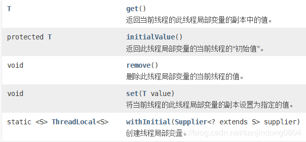
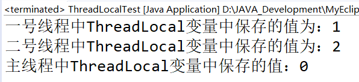
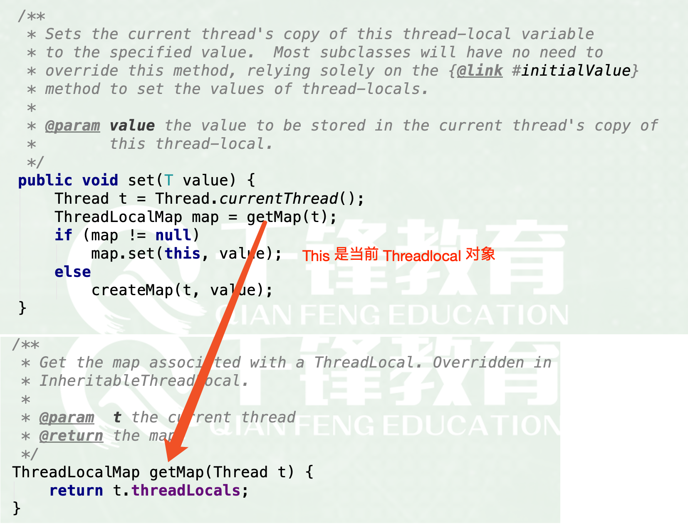
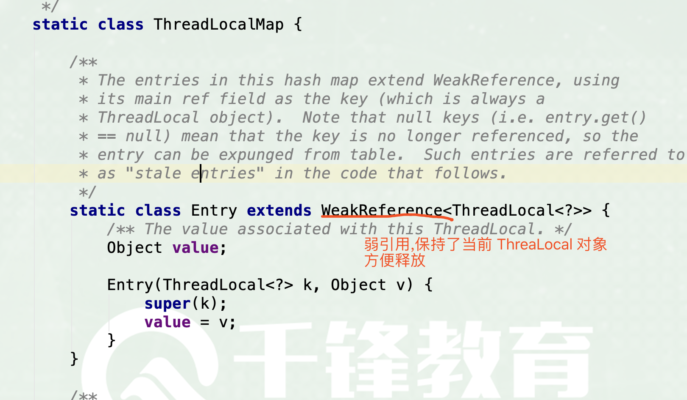

### 概述
在java学习生涯中可能很多人都会听到ThreadLocal变量，从字面上理解ThreadLocal就是“线程局部变量”的意思。简单的说就是，一个ThreadLocal在一个线程中是共享的，在不同线程之间又是隔离的（每个线程都只能看到自己线程的值）。可能一开始把这句话放出来很难理解，那我们就继续往后面看吧。

### API介绍
再学习一个类之前我们需要了解一个类的API，这也是我们学习类的入口。而ThreadLocal类的API相当简单。



在这里面比较重要的就是，get、set、remove了，这三个方法是对这个变量进行操作的关键。set用于赋值操作，get用于获取变量中的值，remove就是删除当前这个变量的值。为什么我们将ThreadLocal说成变量，我们姑且可以这么理解，每个ThreadLocal实例中都可以保存一个常量或者一个对象，而内部保存的值是可以修改的，而这样的特性与变量的特性及其相似，变量不就是用来保存一个值的吗？

也就是说每一个ThreadLocal实例就类似于一个变量名，不同的ThreadLocal实例就是不同的变量名，它们内部会存有一个值（暂时这么理解）在后面的描述中所说的“ThreadLocal变量或者是线程变量”代表的就是ThreadLocal类的实例。

这里还需要介绍一下`initialValue`方法，我么都知道在Java中成员变量都会有默认值，而ThreadLocal做变量也会有默认值，那我们可以通过重写initialValue方法指定ThreadLocal变量的初始值。默认情况下initialValue返回的是null。

### ThreadLocal的理解
说完了ThreadLocal类的API了，那我们就来动手实践一下了，来理解前面没有理解的那句话：一个ThreadLocal在一个线程中是共享的，在不同线程之间又是隔离的（每个线程都只能看到自己线程的值）

public class ThreadLocalTest {

```java
private static ThreadLocal<Integer> num = new ThreadLocal<Integer>() {
	// 重写这个方法，可以修改“线程变量”的初始值，默认是null
	@Override
	protected Integer initialValue() {
		return 0;
	}
};
 
public static void main(String[] args) {
	// 创建一号线程
	new Thread(new Runnable() {
		@Override
		public void run() {
			// 在一号线程中将ThreadLocal变量设置为1
			num.set(1);
			System.out.println("一号线程中ThreadLocal变量中保存的值为：" + num.get());
		}
	}).start();
 
	// 创建二号线程
	new Thread(new Runnable() {
		@Override
		public void run() {
			num.set(2);
			System.out.println("二号线程中ThreadLocal变量中保存的值为：" + num.get());
		}
	}).start();
 
	//为了让一二号线程执行完毕，让主线程睡500ms
	try {
		Thread.sleep(500);
	} catch (InterruptedException e) {
		// TODO Auto-generated catch block
		e.printStackTrace();
	}
	
	System.out.println("主线程中ThreadLocal变量中保存的值：" + num.get());
}
```
}
稍微解释一下上面的代码：

在类中创建了一个静态的“ThreadLocal变量”，在主线程中创建两个线程，在这两个线程中分别设置ThreadLocal变量为1和2。然后等待一号和二号线程执行完毕后，在主线程中查看ThreadLocal变量的值。

程序结果及分析



程序结果重点看的是主线程输出的是0，如果是一个普通变量，在一号线程和二号线程中将普通变量设置为1和2，那么在一二号线程执行完毕后在打印这个变量，输出的值肯定是1或者2（到底输出哪一个由操作系统的线程调度逻辑有关）。但使用ThreadLocal变量通过两个线程赋值后，在主线程程中输出的却是初始值0。在这也就是为什么“一个ThreadLocal在一个线程中是共享的，在不同线程之间又是隔离的”，每个线程都只能看到自己线程的值，这也就是ThreadLocal的核心作用：实现线程范围的局部变量。

### ThreadLocal的原理分析
 		先将最后结论摆在前面，`每个Thread对象都有一个ThreadLocalMap，当创建一个ThreadLocal的时候，就会将该ThreadLocal对象添加到该Map中，其中键就是ThreadLocal，值可以是任意类型`。这句话看不懂很正常，等我们一起看完源码以后就明白了。

​		此时就需要纠正前面提到的错误观点了，前面我们的理解是所有的常量值或者是引用类型的引用都是保存在ThreadLocal实例中的，但实际上不是的，这种说法只是让我们更好的理解ThreadLocal变量这个概念。向ThreadLocal存入一个值，实际上是向当前线程对象中的`ThreadLocalMap`存入值，ThreadLocalMap我们可以简单的理解成一个Map，而向这个Map存值的key就是ThreadLocal实例本身。



​		也就是说，想要存入的ThreadLocal中的数据实际上并没有存到ThreadLocal对象中去，而是以这个ThreadLocal实例作为key存到了当前线程中的一个Map中去了，获取ThreadLocal的值时同样也是这个道理。这也就是为什么ThreadLocal可以实现线程之间隔离的原因了。


### ThreadLocalMap
​		通过Entry数组保存局部变量。通过key（ThreadLocal类型）的hashcode来计算数组存储的索引位置i。如果i位置已经存储了对象，那么就往后挪一个位置依次类推，直到找到空的位置，再将对象存放。另外，在最后还需要判断一下当前的存储的对象个数是否已经超出了阈值（threshold的值）大小，如果超出了，需要重新扩充并将所有的对象重新计算位置。



```
	线程保存ThreadLocalMap对象，对象主要通过Entry[]数组存放键{threadlocal}值，通过threadlocal的threadLocalHashCode定位存放数组位置，Entry extendsWeakReference<ThreadLocal> 的value保存变量副本，通过Entry.get获取threadlocal。

​		如果这里使用普通的key-value形式来定义存储结构，实质上就会造成节点的生命周期与线程强绑定，只要线程没有销毁，那么节点在GC分析中一直处于可达状态，没办法被回收，而程序本身也无法判断是否可以清理节点。弱引用是Java中四档引用的第三档，比软引用更加弱一些，如果一个对象没有强引用链可达，那么一般活不过下一次GC。当某个ThreadLocal已经没有强引用可达，则随着它被垃圾回收，在ThreadLocalMap里对应的Entry的键值会失效，这为ThreadLocalMap本身的垃圾清理提供了便利。

​		ThreadLocalMap维护了Entry环形数组，数组中元素Entry的逻辑上的key为某个ThreadLocal对象（实际上是指向该ThreadLocal对象的弱引用），value为代码中该线程往该ThreadLoacl变量实际塞入的值。从ThreadLocal读一个值可能遇到的情况：根据入参threadLocal的threadLocalHashCode对表容量取模得到 index,如果index对应的slot就是要读的threadLocal，则直接返回结果调用getEntryAfterMiss线性探测，过程中每碰到无效slot，调用expungeStaleEntry进行段清理；如果找到了key，则返回结果entry,没有找到key，返回null
```

- **ThreadLocal的set方法可能会有的情况。**

  探测过程中slot都不无效，并且顺利找到key所在的slot，直接替换即可
  探测过程中发现有无效slot，调用replaceStaleEntry，效果是最终一定会把key和value放在这个slot，并且会尽可能清理无效slot

在replaceStaleEntry过程中，如果找到了key，则做一个swap把它放到那个无效slot中，value置为新值
在replaceStaleEntry过程中，没有找到key，直接在无效slot原地放entry
探测没有发现key，则在连续段末尾的后一个空位置放上entry，这也是线性探测法的一部分。放完后，做一次启发式清理，如果没清理出去key，并且当前table大小已经超过阈值了，则做一次rehash，rehash函数会调用一次全量清理slot方法也即expungeStaleEntries，如果完了之后table大小超过了threshold – threshold / 4，则进行扩容2倍


### 总结
ThreadLocal的作用：实现线程范围内的局部变量，即ThreadLocal在一个线程中是共享的，在不同线程之间是隔离的。

ThreadLocal的原理：ThreadLocal存入值时使用当前ThreadLocal实例作为key，存入当前线程对象中的Map中去。最开始在看源码之前，我以为是以当前线程对象作为key将对象存入到ThreadLocal中的Map中去....

