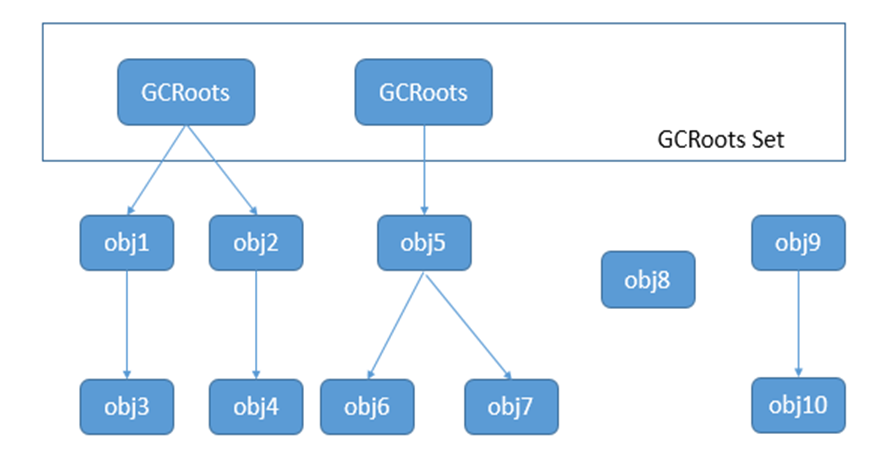
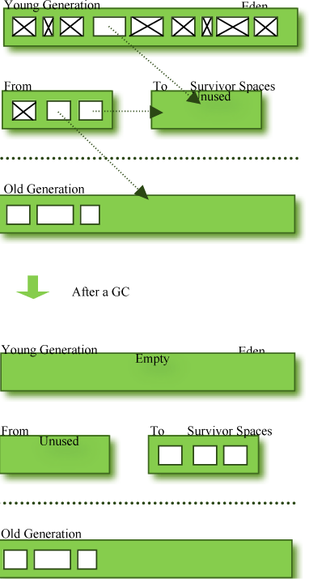
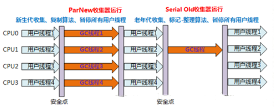

## 一 JVM基础

### 1. 基础术语


#### 1.1 并行并发

- 并行

  ```
  并行是多个线程同时在运行,其发生在多核心 CPU 下,每个 CPU 核心执行一个线程,多个线程同时执行
  ```

- 并发

  ```
  并发偏重于任务交替执行,但是多个任务之间是串行的,一般指的是一个 CPU 核心的多个线程轮流执行
  ```

  

#### 1.2 进程和线程

- 进程

  ```
  每个独立运行的程序都是一个进程,程序和程序之间相互隔离,进程和进程之间也隔离
  ```

- 线程

  ```
  每个进程内部至少会有一个线程或者多少线程,线程是运行指令的最小单位,每个程序的功能就是由它进程内的所有线程共同完成的
  ```

  

#### 1.3 内存泄露和内存溢出

- 内存泄露

  ```
  内存泄露指的是我们的程序内部的对象在使用了空间后本应该将资源释放掉,但是没有释放,导致这片内存空间一直无法被再次分配出去,这叫泄露
  ```

- 内存溢出

  ```
  内存溢出指的是当我们的程序申请内存的时候,因为剩余的空间不足,在一定操作后(如回收垃圾)仍旧无法满足分配需求,就会出现内存溢出,内存溢出就是我要的资源你满足不了, 内存泄露在不断增加的情况下最终会导致内存溢出
  ```


#### 1.4 对象引用级别

***Java 中提供了四种级别引用***

- 强引用

  ```
  强引用属于包内可见,在一个线程中通过引用可以直接操作对象,除非引用不存在了,否则对象不会被 GC 回收,我们平时声明变量就是强引用,普通情况下百分之99的对象都是强引用
  ```

- 软引用

  ```
  属于public,当我们的 jvm 内存不足的时候,GC 会清理(不是回收)所有的软引用对象,当 GC 在清理的时候会通过一系列的算法来决定是否回收软引用对象,并可选的把软引用对象存放在一个引用队列,虚拟机会尽可能让软引用对象存活的时间更长点
  ```

- 弱引用

  ```
  属于public,GC 在回收的时候一定会回收弱引用,但是关系复杂的弱引用一般要经过几次 GC 后才会被回收完,弱引用对象常常用于 Map 中,当 Map 这个强引用对象被释放后,内部的对象就是弱引用了,可以被 GC 快速回收
  ```

- 虚引用

  ```
  属于 public,又称幽灵引用,本身不是为了使用这个对象而存在,主要目的是在一个对象被回收前收到通知,创建幽灵对象的时候必须要创建一个引用队列,并且在 get 这个对象的时候必须返回 null
  ```

  

#### 1.5 finalization

>Java 提供了对象终止机制(finalization)来允许开发人员在对象销毁之前来执行自定义的处理逻辑,这个机制就是通过 Object 的finalize来触发的,在这个方法内我们可以做任何我们可以做的事情,比如关闭连接,释放资源等,也可以在里面让对象重新建立引用

`Java 中的对象有三种状态:`

1. 第一种是可达状态,也就是处于引用不可回收状态
2. 第二种是可复活状态,此状态发生在当 JVM 发现对象处于不可达的时候,如果对象没有触发过终止机制,就会触发对象终止机制,当发现我们的对象重写了finalize并且在里面对对象重新建立引用后会触发对象的复活状态
3. 第三种是不可达状态 也就是可以回收的状态,这个状态的对象可以是没有重写finalize方法的对象或者是已经执行过一次并复活之后再次不可达的对象


​		`finalize只会执行一次,当第二次不可达的时候不会再执行这个方法,同时不要在这个方法内执行比较耗时的操作,java虚拟机不保证这个方法一定会执行完,可能在没有执行完成的时候就已经把对象回收掉了`


### 2. JVM 基础

> JVM (Java visual machine ) java虚拟机是Java中的一套规范,不同的java实现会有不同的虚拟机实现,最终都遵循java规范

#### 2.1  JVM的主要组成部分

1. 类加载器（ClassLoader）
2. 运行时数据区（Runtime Data Area）
3. 执行引擎（Execution Engine）
4. 本地库接口（Native Interface）


>程序在执行之前先要把java代码转换成字节码（class文件），jvm首先需要把字节码通过一定的方式 `类加载器（ClassLoader` 把文件加载到内存中放到 `运行时数据区（Runtime Data Area）` ，而字节码文件是jvm的一套指令集规范，并不能直接交个底层操作系统去执行，因此需要特定的命令解析器 `执行引擎（Execution Engine）` 将字节码翻译成底层系统指令再交由CPU去执行，而这个过程中需要调用其他语言的接口 `本地库接口（Native Interface）` 来实现整个程序的功能，这就是这4个主要组成部分的职责与功能。
>
>而我们通常所说的jvm组成指的是`运行时数据区（Runtime Data Area）`，因为通常需要程序员调试分析的区域就是“运行时数据区”，或者更具体的来说就是“运行时数据区”里面的Heap（堆）模块，那接下来我们来看运行时数据区（Runtime Data Area）是由哪些模块组成的。


|                         jvm组成部分                          |
| :----------------------------------------------------------: |
|  |


#### 2.2 JVM的运行时数据区

> 不同虚拟机实现可能略微有所不同，但都会遵从Java虚拟机规范，Java 8 虚拟机规范规定，Java虚拟机所管理的内存将会包括以下几个运行时数据区域：

1. 程序计数器（Program Counter Register）
2. Java虚拟机栈（Java Virtual Machine Stacks）
3. 本地方法栈（Native Method Stack）
4. Java堆（Java Heap）
5. 方法区（Methed Area）


#####  2.2.1 程序计数器

> 程序计数器（Program Counter Register）是一块较小的内存空间，它是运行速度最快的存储区域,因为它位于处理器内部,它可以看作是当前线程所执行的字节码的行号指示器。在虚拟机的概念模型里，字节码解析器的工作是通过改变这个计数器的值来选取下一条需要执行的字节码指令，分支、循环、跳转、异常处理、线程恢复等基础功能都需要依赖这个计数器来完成。

- **特性：内存私有,线程独享**

​		由于jvm的多线程是通过线程轮流切换并分配处理器执行时间的方式来实现的，也就是任何时刻，一个处理器（或者说一个内核）都只会执行一条线程中的指令。因此为了线程切换后能恢复到正确的执行位置，每个线程都有独立的程序计数器。

- **异常规定：无**

​			如果线程正在执行Java中的方法，程序计数器记录的就是正在执行虚拟机字节码指令的地址，如果是Native方法，这个计数器就为空（undefined），因此该内存区域是唯一一个在Java虚拟机规范中没有规定OutOfMemoryError的区域。


##### 2.2.2 Java虚拟机栈

> Java虚拟机栈（Java Virtual Machine Stacks）描述的是Java方法执行的内存模型，每个方法在执行的同时都会创建一个栈帧（Stack Frame）用于存储局部变量表、操作数栈、动态链接、方法出口等信息，每个方法从调用直至执行完成的过程，都对应着一个栈帧在虚拟机栈中入栈到出栈的过程。**平时说的栈一般指局部变量表部分**

​		栈中存储的数据大小和生命周期必须是确定的,所以Java 中只有某些数据,如对象引用是被放在栈中的,而应用程序内部庞大的生命周期不确定的对象却放在的堆中

- **特性：线程私有，它的生命周期和线程相同。**

​		栈中的数据在本栈内是共享的,注意,因为栈是线程私有的,所以数据共享并不是和其他线程共享,而是栈内共享

- **异常规定：StackOverflowError、OutOfMemoryError**

1、如果线程请求的栈深度大于虚拟机所允许的栈深度就会抛出StackOverflowError异常。

2、如果虚拟机是可以动态扩展的，如果扩展时无法申请到足够的内存就会抛出OutOfMemoryError异常。


> 如图所示:虚拟机栈在运行时使用一种叫栈帧的数据机构来保存上下文数据,栈帧中存放了方法的局部变量表,操作数栈,动态链接方法和返回地址信息(方法出口)


|                          栈帧                          |
| :----------------------------------------------------: |
|  |


|    main方法栈帧     |
| :-----------------: |
|  |


###### 2.2.2.1 栈帧组成

> 栈帧由三部分组成,局部变量表(本地变量表),操作数栈和帧数据区组成

**局部变量表**

​		局部变量区被定义为一个从0开始的数字数组, byte,short,char 在存储前会被转换为 int,boolean 也会被转成int(JVM 底层数字都是 int),0为 false,非0为 true, double 和 long 则占据两个字节,局部变量区是从下标访问的.它一片连续的内存空间，用来存放方法参数，以及方法内定义的局部变量，存放着编译期间已知的数据类型(八大基本类型和对象引用(reference类型),returnAddress类型。它的最小的局部变量表空间单位为Slot，虚拟机没有指明Slot的大小，但在jvm中，long和double类型数据明确规定为64位，这两个类型占2个Slot，其它基本类型固定占用1个Slot。
​		需要注意的是，局部变量表所需要的内存空间在编译期完成分配，当进入一个方法时，这个方法在栈中需要分配多大的局部变量空间是完全确定的，在方法运行期间不会改变局部变量表大小。
​		注意:如果一个对象的引用被保存在局部变量表中,在当前线程结束之前,与之对应的空间并不会被回收,因为这个对象是可达的.

​		在方法执行的时候,虚拟机使用局部变量表来完成参数值到参数变量列表的传递过程,如果执行是实例方法(非 static) 那么局部变量表中的第0位索引的 Slot 默认是方法所属的实例对象,在方法中可以通过 this 这个关键字来访问到这个隐含的参数


**操作数栈**

> 操作数栈也被定义为一个数组,但是不同于局部变量区,它不是通过数组下标访问的,而是通过栈的 push 和 pop 操作, 前一个 push 进的数据可以被下一个操作 pop 出来进行使用
>  操作数区的主要作用有以下三点:

 1. 解析常量池中的数据
 2. 方法执行完成后方法返回,并且恢复调用方现场(A 方法内部调用 B,A 就是调用方)
 3. 方法执行过程中抛出的异常的异常处理,异常处理存储在一个异常表,当出现异常的时候,虚拟机会查看相应的异常表有没有对应的 catch 语句,有就执行,没有就终止当前方法调用


#####  2.2.3 本地方法栈

>本地方法并不是 Java 语言实现的,而是由 C 语言实现的,当某个线程调用一个本地方法的时候,它就进入了一个全新的不受虚拟机限制的区域,本地方法可以通过本地方法接口来访问虚拟机内部的运行时数据区,它还可以直接操作处理器的寄存器,或者直接从本地内存中直接分配任意数量的内存,从层级来说, 它和虚拟机有同样的权限.
>
>本地方法本质上是依赖于实现的,虚拟机实现的设计者可以自由决定使用什么样的机制来让 Java 程序执行本地方法,任何本地方法都会使用某种本地方法栈,当调用本地方法的时候,虚拟机会保持当前栈不变,本地方法不会在线程栈内压入新的数据,虚拟机只是简单的动态链接并直接调用指定的本地方法
>
>在Java虚拟机规范中对于本地方法栈没有特殊的要求，虚拟机可以自由的实现它，因此在Sun HotSpot虚拟机直接把本地方法栈和虚拟机栈合二为一了
>
>​		本地方法栈（Native Method Stack）与虚拟机栈的作用是一样的，只不过虚拟机栈是服务Java方法的，而本地方法栈是为虚拟机调用Native方法服务的。
>
>

- **特性和异常：** 同虚拟机栈


##### 2.2.4 Java堆

###### 2.2.4.1 堆介绍

​		Java堆（Java Heap）是Java虚拟机中内存最大的一块，是被所有线程共享的，在虚拟机启动时候创建，Java堆唯一的目的就是存放对象实例，几乎所有的对象实例都在这里分配内存，随着JIT编译器的发展和逃逸分析技术的逐渐成熟，栈上分配、标量替换优化的技术将会导致一些微妙的变化，所有的对象都分配在堆上渐渐变得不那么“绝对”了。

- **特性：内存共享**

- **异常规定：OutOfMemoryError**

​			如果在堆中没有内存完成实例分配，并且堆不可以再扩展时，将会抛出OutOfMemoryError。Java虚拟机规范规定，Java堆可以处在物理上不连续的内存空间中，只要逻辑上连续即可，就像我们的磁盘空间一样。在实现上也可以是固定大小的，也可以是可扩展的，不过当前主流的虚拟机都是可扩展的，通过-Xmx和-Xms控制。


```
堆在Java 虚拟机规范中是一种通用性的内存池,用于存放所有的 Java 对象,堆是一个运行时的数据区,类的对象从中分配空间,这些对象通过 new 关键字建立,他们不需要程序代码来显式的释放,堆是有垃圾回收来负责的,堆的优势在于可以动态的分配大小,生命周期也不需要事先告诉编译器,但是缺点就是因为是运行时分配,所以数据访问速度较慢,在大多数虚拟机中,Java 中的对象和数组都是在堆中
```


###### 2.2.4.2 TLAB

> TLAB  (Thread Local Allocation Buffers )即线程本地分配缓冲,是一个线程专有的内存区域,这块区域在堆内存中,目的是为了加速对象分配而产生的,对象的创建是堆上面分配空间的,因此在同一时间可能会有多个线程在创建对象,因此每次创建对象都需要同步进行,这样在竞争激烈的场合下分配的效率会进一步下降,考虑到创建对象分配内存是经常性的操作,所以 JVM 就使用 TLAB 这种机制给每个线程预先分配一小段专属空间来避免多线程冲突,提高分配效率,TLAB 占用的是EDEN 区,因为在默认情况下我们创建的对象会在 EDEN 区


###### 2.2.4.3 其他

```
因为 Java 堆是存储对象实例的区域,所以它也是 GC(垃圾回收)的重点关注区域,所以 GC 可能在大内存使用或者频繁垃圾回收的时候造成系统性能瓶颈,所以不同的虚拟机还有一些其他的实现,比如阿里的 AliJVM 就是将生命周期较长的对象从老年代中移到了堆外内存中,以此达到降级 GC 回收频率和提升 GC 回收效率的目的

除此之外,采用栈上分配这种机制也可以降低 GC 的回收频率和提升回收效率,这样一来堆就不再是 Java 对象内存分配的唯一选择了,但是栈上分配是有前提条件的,也就是对象的内存空间不会发生逃逸问题,也就是当 JVM 确认不会发生逃逸的时候,会将对象拆分为标量然后在内存中创建复制并使用
我们的对象其实内部其实是由不同的标量组合起来的组合量, 标量就是基本数据类型啊 字符串等类型
```


###### 2.24.4 逃逸分析

> 如果一个对象的指针被多个线程或者方法引用的时候,那我们就可以称这个指针发生了逃逸,常见的逃逸主要是全局变量赋值,返回值逃逸,实例引用逃逸 (线程逃逸最终也是通过这三种情况来产生的)
>
> 我们在写代码过程中应当尽量减少逃逸的情况,比如当方法返回值是 stringbuffer 的时候,我们拿到它的目的紧紧是为了获取里面多字符串,那么久干脆让方法直接返回字符串,这样 buffer 对象就会随着方法执行完成而回收,就不会发生逃逸问题了

```java
//此处是伪代码
public class Test{
  public static B b;
  
  public void test1(){
    b=new B(); //当我们调用此方法的时候会发生全局变量赋值逃逸
  }
  
   public B test2(){
     
     return new B(); //当调用此方法的时候会发生返回值逃逸,因为这个对象是局部对象,理论上应该随着方法执行完成而销毁,但是因为作为返回值返回被其它变量引用了,所以无法回收
   }
  
  public void test3(){
    b.aaaa(this); //此时发生了实例引用逃逸,注意此处用的是 this,但是不是说只能是 this,因为在 aaa 方法内可能会对参数进行其他引用等操作,导致对象无法回收
  }
  
  
}
```


```
JDK7开始支持对象的栈上分配和逃逸分析机制,这种机制除了能将对象由堆上分配变成栈上分配外,还以实现以下优化
1.同步消除:我们知道线程的同步代价是很高的,同步的后果是降低了并发性和性能,逃逸分析可以判断出某个对象是不是只被一个线程使用,如果确定只被一个线程使用,那么该对象的同步操作会被转换为没有同步保护的操作,这样就可以提升性能
2.矢量代替,当逃逸分析发现如果对象的内存存储结构不需要连续继续进行的话,就可以将对象的部分甚至全部放入到 CPU 寄存器内,大大加快访问速度
```


#####  2.2.5 方法区

###### 2.2.5.1 方法区介绍

​	方法区（Methed Area）用于存储已被虚拟机加载的类信息、常量、静态变量、即时编译后的代码等数据。

- **误区：方法区不等于永久代**

```
很多人愿意把方法区称作“永久代”（Permanent Generation,Permgen Space），本质上两者并不等价，方法区是 JVM 虚拟机规范中的内容,而HotSpot虚拟机垃圾回收器团队把GC分代收集扩展到了方法区，或者说是用来永久代来实现方法区而已，这样能省去专门为方法区编写内存管理的代码，但是在Jdk8也移除了“永久代”，使用Native Memory来实现方法区。并重新命名为Metaspace元空间.  也就是方法区相当于我们的Java中的接口,永久代是实现类
```


- **特性：内存共享,线程共享**

- **异常规定：OutOfMemoryError**

当方法无法满足内存分配需求时会抛出OutOfMemoryError异常。


> 方法区(永久代,堆外内存)和我们的堆不同,GC 不会在主程序运行期间对永久区进行清理,所以如果应用程序加载的类非常多的话,可能会导致出现Permgen Space错误,这种情况常见在 WEB 服务器对 jsp 进行预编译的时候,因为使用了大量的第三方 lib,导致其大小超出了 JVM 的默认大小出现错误


###### 2.2.5.2 方法区调整

在 ***JDK7***的时候,永久代还是存在并使用的,不过从内部已经移出了部分数据:

***符号引用***被移到了本地堆 

> (符号引用和直接引用,比如我们 A 类定义了一个常量,在 B 类中通过 A.xxx 引用,在编译的时候会编程直接引用, 但是我们定义了 int i=new Random().nextInt() 这个值是什么是不知道的,只有在运行时才知道,这时候就通过一个符号来标记引用)

**字符串**被移动到了 Java 堆

**类静态属性**被移动到了 Java 堆


###### 2.2.5.3永久代修改的原因

```
随着JDK8的到来，JVM不再有PermGen。但类的元数据信息（metadata）还在，只不过不再是存储在连续的堆空间上，而是移动到叫做“Metaspace”的本地内存（Native memory）中。

类的元数据信息转移到Metaspace的原因是PermGen很难调整。PermGen中类的元数据信息在每次FullGC的时候可能会被收集，但成绩很难令人满意。而且应该为PermGen分配多大的空间很难确定，因为PermSize的大小依赖于很多因素，比如JVM加载的class的总数，常量池的大小，方法的大小等。

此外，在HotSpot中的每个垃圾收集器需要专门的代码来处理存储在PermGen中的类的元数据信息。从PermGen分离类的元数据信息到Metaspace,由于Metaspace的分配具有和Java Heap相同的地址空间，因此Metaspace和Java Heap可以无缝的管理，而且简化了FullGC的过程，以至将来可以并行的对元数据信息进行垃圾收集，而没有GC暂停
```


- ***永久代的移除对最终用户意味着什么***

  ```
  由于类的元数据可以在本地内存(native memory)之外分配,所以其最大可利用空间是整个系统内存的可用空间。这样，你将不再会遇到OOM错误，溢出的内存会涌入到交换空间。最终用户可以为类元数据指定最大可利用的本地内存空间，JVM也可以增加本地内存空间来满足类元数据信息的存储。
  
  注：永久代的移除并不意味者类加载器泄露的问题就没有了。因此，你仍然需要监控你的消费和计划，因为内存泄露会耗尽整个本地内存，导致内存交换(swapping)，这样只会变得更糟。并且元空间没有压缩,所以在元空间虚拟机回收内存后会产生内存碎片
  ```

  

- ***移动到Metaspace和它的内存分配***

  ```
  Metaspace VM利用内存管理技术来管理Metaspace。这使得由不同的垃圾收集器来处理类元数据的工作，现在仅仅由Metaspace VM在Metaspace中通过C++来进行管理。Metaspace背后的一个思想是，类和它的元数据的生命周期是和它的类加载器的生命周期一致的。也就是说，只要类的类加载器是存活的，在Metaspace中的类元数据也是存活的，不能被释放。
  ```

  

- ***类型信息***

```
类型信息包含类的完整名称(全限定名称),父类的完整名称,类型修饰符和类型的直接接口类表
```


- ***常量池***

```
常量池中包括类方法以及域等信息所引用的常量信息  
域信息包括域名称,域类型和域修饰符
方法信息包含方法名称,返回类型,方法参数,方法修饰符,方法字节码,操作数栈和方法栈帧的局部变量区大小以及异常表,方法区是线程共享的,当多个线程同时加载一个类的信息的时候,一个线程会请求 classloader 来加载,其他线程则等待,方法区内部保存的信息大部分来自于 class 文件
```


### 3. 扩展知识

#### 3.1 运行时常量池

```
运行时常量池是方法区的一部分，Class文件中除了有类的版本、字段、方法、接口等描述信息外，还有一项信息是常量池（Constant Pool Table）用于存放编译期生成的各种字面量和符号引用，这部分在类加载后进入方法区的运行是常量池中，如String类的intern()方法。
```


#### 3.2 直接内存

> 直接内存(Native Memory 也叫本地内或者堆外内存)

```
直接内存（Direct Memory）并不是虚拟机运行时数据区的一部分，但这部分内存也会被频繁的使用，而且可能导致OutOfMemoryError。在JDK 1.4中新加入了NIO类，引入了一种基于Channel与缓冲区Buffer的IO方式，它通过一个存储在Java堆中的DirectByteBuffer对象作为这块内存的引用操作，它因此更高效，它避免了Java堆和Native堆来回交换数据的时间。JDK1.7之后HotSpot虚拟机将原先的永久代拆分,常量池等内容放入了堆. JDK1.8之后移出了永久代,转而将Java 类信息等内容放入了元空间

堆内存是jvm 内部的划分,相当于 JVM 这个程序从系统中申请到内存,然后在内部又拆分了不同区域给程序用,堆外内存就是不属于 jvm 申请来自己用的
```

**注意** ：直接内存分配不会受到Java堆大小的限制，但是受到本机总内存大小限制，在设置虚拟机参数的时候，不能忽略直接内存，把实际内存设置为-Xmx，使得内存区域的总和大于物理内存的限制，从而导致动态扩展时出现OutOfMemoryError异常。


### 4 类加载机制


#### 4.1 类加载过程

当程序要使用某个类时，如果该类还未被加载到内存中，则系统会通过加载，连接，初始化三步来实现这个类进行初始化。

##### 4.1.1   加载

加载，是指Java虚拟机查找字节流（查找.class文件），并且根据字节流创建java.lang.Class对象的过程。这个过程，将类的.class文件中的二进制数据读入内存，放在运行时区域的方法区内。然后在堆中创建java.lang.Class对象，用来封装类在方法区的数据结构。

类加载阶段：

（1）Java虚拟机将.class文件读入内存，通过一个类的全限定名来获取其定义的二进制字节流, 并为之创建一个Class对象。

（2）任何类被使用时系统都会为其创建一个且仅有一个Class对象。

（3）这个Class对象描述了这个类创建出来的对象的所有信息，比如有哪些构造方法，都有哪些成员方法，都有哪些成员变量等。

相对于类加载的其他阶段而言，加载阶段（准确地说，是加载阶段获取类的二进制字节流的动作）是可控性最强的阶段，因为开发人员既可以使用系统提供的类加载器来完成加载，也可以自定义自己的类加载器来完成加载。

加载阶段完成后，虚拟机外部的 二进制字节流就按照虚拟机所需的格式存储在方法区之中，而且在Java堆中也创建一个java.lang.Class类的对象，这样便可以通过该对象访问方法区中的这些数据

Student类加载过程图示：

 

##### 4.1.2    链接

链接包括验证、准备以及解析三个阶段。

（1）`验证阶段`。主要的目的是确保被加载的类（.class文件的字节流）满足Java虚拟机规范，不会造成安全错误。

（2）`准备阶段`。负责为类的静态成员分配内存，并设置默认初始值。

```
准备阶段是正式为类变量分配内存并设置类变量初始值的阶段，这些内存都将在方法区中分配。对于该阶段有以下几点需要注意：

1、这时候进行内存分配的仅包括类变量（static），而不包括实例变量，实例变量会在对象实例化时随着对象一块分配在Java堆中。

2、这里所设置的初始值通常情况下是数据类型默认的零值（如0、0L、null、false等），而不是被在Java代码中被显式地赋予的值。

假设一个类变量的定义为：public static int value = 3；

那么变量value在准备阶段过后的初始值为0，而不是3，因为这时候尚未开始执行任何Java方法，而把value赋值为3的putstatic指令是在程序编译后，存放于类构造器<clinit>（）方法之中的，所以把value赋值为3的动作将在初始化阶段才会执行。
```

（3）`解析阶段`。将类的二进制数据中的符号引用替换为直接引用。

```
解析阶段是虚拟机将常量池内的符号引用替换为直接引用的过程，解析动作主要针对类或接口、字段、类方法、接口方法、方法类型、方法句柄和调用点限定符7类符号引用进行。
```

**说明：**

​		符号引用。即一个字符串，但是这个字符串给出了一些能够唯一性识别一个方法，一个变量，一个类的相关信息。

​		直接引用。可以理解为一个内存地址，或者一个偏移量。比如类方法，类变量的直接引用是指向方法区的指针；而实例方法，实例变量的直接引用则是从实例的头指针开始算起到这个实例变量位置的偏移量。

​		举个例子来说，现在调用方法hello()，这个方法的地址是0xaabbccdd，那么hello就是符号引用，0xaabbccdd就是直接引用。

​		在解析阶段，虚拟机会把所有的类名，方法名，字段名这些符号引用替换为具体的内存地址或偏移量，也就是直接引用。

##### 4.1.3  初始化

​		初始化，则是为标记为常量值的字段赋值的过程。换句话说，只对static修饰的变量或语句块进行初始化。

​		在Java中对类变量进行初始值设定有两种方式：

①声明类变量是指定初始值；

②使用静态代码块为类变量指定初始值；

如果初始化一个类的时候，其父类尚未初始化，则优先初始化其父类。

如果同时包含多个静态变量和静态代码块，则按照自上而下的顺序依次执行。


###### 4.1.3.1 JVM初始化步骤

 1、假如这个类还没有被加载和连接，则程序先加载并连接该类

 2、假如该类的直接父类还没有被初始化，则先初始化其直接父类

 3、假如类中有初始化语句，则系统依次执行这些初始化语句

 

###### 4.1.3.2 类初始化时机

只有当对类的主动使用的时候才会导致类的初始化，类的主动使用包括以下六种：

– 创建类的实例，也就是new的方式

– 访问某个类或接口的静态变量，或者对该静态变量赋值

– 调用类的静态方法

– 反射（如Class.forName(“com.qianfeng.Test”)）

– 初始化某个类的子类，则其父类也会被初始化

– Java虚拟机启动时被标明为启动类的类（Java Test），直接使用java.exe命令来运行某个主类


#### 4.2 类加载器

​	JVM 类加载是通过ClassLoader 及其子类来完成的，类的层次关系和加载顺序可以由下图来描述：


(1)` Bootstrap ClassLoader`

　　负责加载$JAVA_HOME中的jre/lib/rt.jar 里所有的class，由c++实现，不是ClassLoader子类。

(2)` Extension ClassLoader`

　　负责加载Java 平台中扩展功能的一些jar包，包括$JAVA_HOME中的jre/lib/ext/*.jar 或 -D java.ext.dirs指定目录下的jar包。

(3) `App ClassLoader`

　　负责加载classpath 中指定的jar包及目录中class

(4) `Custom ClassLoader`

　　应用程序根据自身需要自定义的ClassLoader，如tomcat，jboss 都会根据j2ee规范自行实现ClassLoader，加载过程中会先检查是否已被加载，检查顺序是自底向上，从Custom ClassLoader 到BootStrap ClassLoader逐层检查，只要某个classloader已加载就视为已加载此类，保证此类在所有ClassLoader 只加载一次。而加载的顺序是自顶向下，也就是由上层来逐层尝试加载此类。

#### 4.3 JVM 三种预定义加载器

> JVM预定义有三种类加载器，当一个 JVM启动的时候，Java 默认开始使用如下三种类加载器：

(1) `引导类加载器（Bootstrap class loader）`：它用来加载 Java 的核心库，是用原生代码来实现的，并不继承自 java.lang.ClassLoader。它负责将<Java_Runtime_Home>/lib下面的核心类库或-Xbootclasspath选项指定的jar包加载到内存中。由于引导类加载器涉及到虚拟机本地实现细节，开发者无法直接获取到启动类加载器的引用，所以不允许直接通过引用进行操作。

(2) `扩展类加载器（Extensions class loader）`：该类加载器在此目录里面查找并加载 Java 类。扩展类加载器是由Sun的 ExtClassLoader（sun.misc.Launcher$ExtClassLoader）实现的。它用来加载 Java 的扩展库。Java 虚拟机的实现会提供一个扩展库目录。它负责将< Java_Runtime_Home >/lib/ext或者由系统变量-Djava.ext.dirs指定位置中的类库加载到内存中。开发者可以直接使用标准扩展类加载器。

(3) `系统类加载器（System class loader）`：系统类加载器是由 Sun的 AppClassLoader（sun.misc.Launcher$AppClassLoader）实现的。它负责将系统类路径java -classpath或-Djava.class.path变量所指的目录下的类库加载到内存中。开发者可以直接使用系统类加载器。一般来说，Java 应用的类都是由它来完成加载的。可以通过 ClassLoader.getSystemClassLoader()来获取它。


#### 4.4 双亲委派

##### 4.4.1 双亲委派介绍


```
上图中展示的类加载器之间的层次关系，就称为类加载器的双亲委派模型(Parents Delegation Model)。双亲委派模型要求除了顶层的启动类加载器之外，其余的类加载器都应当有自己的父类加载器。这里的类加载器之间的父子关系一般不会以继承（Inheritance）的关系来实现，而是使用组合（Composition）关系来复用父加载器的代码。

类加载器的双亲委派模型在JDK1.2期间被引入并广泛用于之后几乎所有的Java程序中，但它并不是一个强制性的约束模型，而是Java设计者推荐给开发者的一种类加载实现方式。

双亲委派模型的式作过程是：如果一个类加载器收到了类加载的请求，它首先不会自己去尝试加载这个类，而是把这个请求委派给父类加载器去完成，每一个层次的类加载器都是如此，因此所有的加载请求最终都应该传送到顶层的启动类加载器中，只有当父加载器反馈自己无法完全这个加载请求（它的搜索范围中没有找到所需的类）时，子加载器才会尝试自己去加载。
```


##### 4.4.2 双亲委派模型优点

```
Java类随着它的类加载器一起具备了一种带有优先级的层次关系，例如类java.lang.Object，它存在在rt.jar中，无论哪一个类加载器要加载这个类，最终都会委派给出于模型最顶端的启动类加载器进行加载，因此Object类在程序的各种类加载器环境中都是同一个类。相反，如果没有使用双亲委派模型，由各个类加载器自行去加载的话，如果用户自己编写了一个称为java.lang.Object的类（该类具有系统的Object类一样的功能，只是在某个函数稍作修改。比如equals函数，这个函数经常使用，如果在这这个函数中，黑客加入一些“病毒代码”。并且通过自定义类加载器加入到JVM中，那就热闹了），并放在程序的ClassPath中，那系统中将会出现多个不同的Object类，java类型体系中最基础的行为也就无法保证了，应用程序也将变得一片混乱。
```


## 二 GC 基础

### 1 基础术语

#### 1.1 对象基本信息

##### 1.1.1 对象划分

- `年轻代`

  JVM 堆中一片区域, 用于存放对象用,内部分为 EDEN,SURVIVOR(包含 FROM和 TO 两份)区域,比例是8:2(FROM,TO 各占1)

- `老年代`

  JVM 堆中一片区域,用于存放对象用,用于存放生命周期较长或者空间较大的对象(G1中有专门的大对象区间)

- `永久代`

  JDK8已经移除,之前是 JVM 规范中方法区的实现,此类对象一般一旦出生就几乎不死了，它们几乎会一直永生不灭，记得，只是几乎不灭而已。例子：**String池中的对象（享元模式）、加载过的类信息**等等 Hotspot虚拟机通过永久代实现方法区


##### 1.1.2 对象提升规则

  虚拟机给每个对象定义了一个年龄计数器,对象每经过一次年轻代的垃圾回收然后存活下来就会加1,当达到一定年龄后(默认是15)会将对象提升放入到老年代中


#### 1.2 垃圾收集的分类

##### 1.2.1 Minor GC

  		年轻代的回收称之为Minor GC,年轻代的回收频率特别频繁,大多数对象都是在年轻代中创建并回收的

##### 1.2.2 MajorGC/Full GC

  		年老代(老年代)的内存区域一般大于年轻代,所以年老代发生 GC 的频率会比年轻代少,对象从年老代消失的时候我们称为MajorGC或者Full GC,Full GC 会占用大量时间导致程序一段时间内无响应

##### 1.2.3 FullGC 发生原因

1. `老年代空间不足`

​		老年代只有在年轻代对象转入或者创建大对象,大数组的时候才会出现不足的情况,因为 Full GC 的资源消耗问题,所以我们尽量减少创建大对象和大数组,让对象尽量在年轻代就回收

2. `永久代空间满`

​		当加载到类过多或者反射过多的类已经调用过多方法的时候永久代可能会被占满,可以通过设置更大的永久代来解决,JDK8之后这些信息进入元空间,不需要我们再分配

3. `整体空间不足`

​		此情况和1很像,年轻代回收的时候发现对象放不下,转而向老年代放,老年代暂时内存也不够放,这时候就会触发 FullGC

4. `对象提升的平均大小 大于老年代的剩余空间`

​		此情况其实还是和前面很像,不过有区别,第一个 Minor GC 后,假设有 10M 内存对象被提升到了老年代,下一次 Minor GC 的时候会先判断老年代空间有没有10M,没有就触发 Full GC


##### 1.2.4 Mixed GC Event

  混合 GC 事件,即所有的年轻代和一部分老年代一起回收,混合 GC 一定是跟随在 Minor GC 后端

  为什么是老年代的**部分**Region？。什么时候触发Mixed GC?回收**部分**老年代是参数`-XX:MaxGCPauseMillis`，用来指定一个G1收集过程目标停顿时间，默认值200ms，当然这只是一个期望值。G1的强大之处在于他有一个停顿预测模型（Pause Prediction Model），他会有选择的挑选**部分**Region，去尽量满足停顿时间，关于G1的这个模型是如何建立的，这里不做深究。
  Mixed GC的触发也是由一些参数控制。比如`XX:InitiatingHeapOccupancyPercent`表示老年代占整个堆大小的百分比，默认值是45%，达到该阈值就会触发一次Mixed GC

#### 1.3 垃圾收集中的概念
##### 1.3.1 STW

 	` STOP THE WORLD` ,GC 事件过程发生的时候JVM要暂停你程序的线程的执行,类似于你妈妈拖地的时候让你滚到一边站在那别动
 	
 		这样的设计的原则是因为垃圾回收器的任务就是对垃圾对象进行清理,为了让垃圾回收器可以有效的执行,大部分情况下会要求程序进入一个停顿状态,暂停所有线程的执行,只有这样才不会产生新的垃圾,同时也保证了系统在某一时间的一致性,因为垃圾回收的时候会产生程序停顿的感觉,这种感觉叫STW

##### 1.3.2 System.gc()

  	这个方法的作用主要是触发 FullGC,对老年代和年轻代进行回收,但是注意这个操作仅仅是请求垃圾回收的建议而已,JVM 不一定会立刻执行,而是对垃圾回收算法加权,使得垃圾回收更容易发生,就相当于你家里有垃圾你没丢,你妈妈冲你吼快去把垃圾扔掉,你可能会立刻去扔,你也可能翻翻身继续睡


##### 1.3.3 Region

  		在G1的垃圾回收算法中，堆内存采用了另外一种完全不同的方式进行组织，被划分为多个（默认2048个）大小相同的内存块（Region），每个Region是逻辑连续的一段内存，在被使用时都充当一种角色，每次垃圾收集的时候只会处理几个区域,以此来控制垃圾回收产生的停顿时间,Region表示一个区域,每个区域里面的字符代表属于不同的分代内存空间类型`(E[Eden],O[Old],S[Survivor],H[Humongous])`,空白的分区不属于任何一个分代,G1可以在需要的时候将这个区域分给 O 或者 E 之类的 ,其中H是以往算法中没有的，它代表Humongous，表示这些Region存储的是巨型对象（humongous object，H-obj），当新建对象大小超过Region大小一半时，直接在新的一个或多个连续Region中分配，并标记为H。 Region的大小只能是1M、2M、4M、8M、16M或32M，比如`-Xmx16g -Xms16g`，G1就会采用16G / 2048 = 8M 的Region. 如下图：

  G1通过内存分区来避免内存碎片的问题,每个分区的大小是一样的,从逻辑来说,他们是连续的内存空间,G1的并行全局标记阶段会决定整个堆区的活动对象,在标记完成后,G1 就知道哪些Region是空的了

  

  

  

##### 1.3.4 RSet

每个Region初始化时，会初始化一个`remembered set`（已记忆集合），这个翻译有点拗口，以下简称RSet，该集合用来记录并跟踪其它Region指向该Region中对象的引用，每个Region默认按照512byte划分成多个Card，所以RSet需要记录的东西应该是 xx Region的 xx Card。


Region1和Region3中有对象引用了Region2的对象，则在Region2的Rset中记录了这些引用。

`RSet有什么好处？`

进行垃圾回收时，如果Region1有根对象A引用了Region2的对象B，显然对象B是活的，如果没有Rset，就需要扫描整个Region1或者其它Region，才能确定对象B是活跃的，有了Rset可以避免对整个堆进行扫描。

##### 1.3.5 CSet

`拷贝存活对象(Evacuation)`,Evacuation阶段是全暂停的。它负责把一部分region里的活对象拷贝到空region里去（并行拷贝），然后回收原本的region的空间。Evacuation阶段可以自由选择任意多个region来独立收集构成收集集合（collection set，简称CSet），CSet集合中Region的选定依赖于上文中提到的**停顿预测模型**(混合回收那里提及)，该阶段并不evacuate所有有活对象的region，只选择收益高的少量region来evacuate，这种暂停的开销就可以（在一定范围内）可控,如果在拷贝存活对象时候空间不够用,一般做法是扩展堆内存,但是堆内存总得由上线,所以这个时候 GC会让一些已经拷贝成功的对象引用进入老年代,对于 G1 GC 拷贝不成功的对象会立即进入老年代


### 2 垃圾收集算法

#### 2.1 标记算法

> 常见的垃圾标记算法有两种,分别是引用计数器算法和可达性分析算法(根搜索算法)

##### 2.1.1 引用计数器算法

​			引用计数算法很简单，它实际上是通过在对象头中分配一个空间来保存该对象被引用的次数。如果该对象被其它对象引用，则它的引用计数加一，如果删除对该对象的引用，那么它的引用计数就减一，当该对象的引用计数为0时，那么该对象就会被回收。

​			引用计数垃圾收集机制不一样，它只是在引用计数变化为0时即刻发生，而且只针对某一个对象以及它所依赖的其它对象。所以，我们一般也称呼引用计数垃圾收集为**直接**的垃圾收集机制

​			但是这种引用计数算法有一个比较大的问题，那就是它不能处理环形数据 - 即如果有两个对象相互引用，那么这两个对象就不能被回收，因为它们的引用计数始终为1。这也就是我们常说的“内存泄漏”问题

**算法特点**

1. 需要单独的字段存储计数器，增加了存储空间的开销；

2. 每次赋值都需要更新计数器，增加了时间开销；

3. 垃圾对象便于辨识，只要计数器为0，就可作为垃圾回收；

4. 及时回收垃圾，没有延迟性；

5. 不能解决循环引用的问题；


##### 2.1.2 可达性分析算法

​		根搜索算法的基本思路就是通过一系列名为”GC Roots”的对象作为起始点，从这些节点开始向下搜索，搜索所走过的路径称为引用链(Reference Chain)，当一个对象到GC Roots没有任何引用链相连时，则证明此对象是不可用的。
###### 2.1.2.1 GC Root

  > 一个指针(引用),它保存了堆里面的对象(指向),而自己又不存储在堆中,那么它就可以是一个 ROOT,可以作为 GC Roots 的节点主要是全局性的引用(如常量或者静态属性引用的对象)与执行上下文(栈帧中的局部变量表)以及 JNI 本地方法栈中引用的对象

那么问题又来了，如何选取GCRoots对象呢？在Java语言中，可以作为GCRoots的对象包括下面几种：

**(1). 虚拟机栈（栈帧中的局部变量区，也叫做局部变量表）中引用的对象。**

**(2). 方法区中的类静态属性引用的对象。**

**(3). 方法区中常量引用的对象。**

**(4). 本地方法栈中JNI(Native方法)引用的对象。**

下面给出一个GCRoots的例子，如下图，为GCRoots的引用链。



 

看下面的图：


 

#### 2.2 收集算法

> 当我们成功标记出存活和死亡对象后,GC 接下来就开始执行垃圾回收,释放内存,常见的收集算法有三种  标记-清除算法(Mark-Sweep) ,复制算法(Copying),标记-压缩算法(Mark-Compact)也有人称标记-整理算法

|          |   标记清除    |   标记-压缩   |              复制算法              |
| :------: | :-----------: | :-----------: | :--------------------------------: |
|   速度   |      中       |      慢       |                 快                 |
|   空间   | 少,会堆积碎片 | 少,不堆积碎片 | 多(至少存活对象2倍大小),不堆积碎片 |
| 移动对象 |      否       |      是       |                 是                 |

##### 2.2.1 标记-清除算法

###### 2.2.1.1、概念

​	 分为**标记**和**清除**两阶段：首先标记出所有需要回收的对象(其实一开始标记到的都是可达对象,然后没有标记的这些就是垃圾对象,所以没有标记也是一种标记)，然后统一回收所有被标记的垃圾对象。

​	在标记阶段，collector从mutator根对象开始进行遍历，对从mutator根对象可以访问到的对象都打上一个标识(`这个标识标记的是可达的对象,不是垃圾对象`)，一般是在对象的header中，将其记录为可达对象。

​	而在清除阶段，collector对堆内存(heap memory)从头到尾进行线性的遍历，如果发现某个对象没有标记为可达对象-通过读取对象的header信息，则就将其回收。

​	举个例子,老师在某个角落发现了一堆"闲书",他进教室后,让大家先停下来,然后开始问 这个是谁的,那个是谁的,然后把有人认领的书记下来,最后把没人要的书统统扔掉

​	回到算法本身,先说几个概念

​		首先是`mutator`和`collector`，这两个名词经常在垃圾收集算法中出现，collector指的就是垃圾收集器，而mutator是指除了垃圾收集器之外的部分，比如说我们应用程序本身。mutator的职责一般是NEW(分配内存),READ(从内存中读取内容),WRITE(将内容写入内存)，而collector则就是回收不再使用的内存来供mutator进行NEW操作的使用。

​		第二个基本概念是关于mutator roots(mutator根对象),mutator根对象一般指的是分配在堆内存之外，可以直接被mutator直接访问到的对象，一般是指静态/全局变量以及Thread-Local变量(在Java中，存储在java.lang.ThreadLocal中的变量和分配在栈上的变量 - 方法内部的临时变量等都属于此类).

​		第三个基本概念是关于可达对象的定义，从mutator根对象开始进行遍历，可以被访问到的对象都称为是可达对象。这些对象也是mutator(你的应用程序)正在使用的对象

###### 2.2.1.2、图解


###### 2.2.1.3、缺点

 1、标记阶段和清除阶段的效率都不高。
 2、显而易见的，清除后产生了大量不连续的内存碎片，导致在程序运行过程中需要分配较大对象的时候，无法找到足够的连续内存而不得不提前触发一次垃圾收集动作。


##### 2.2.2 标记-压缩算法

​		内存碎片一直是非移动垃圾回收器(指在垃圾回收时不进行对象的移动)的一个问题，比如说在前面的标记-清除垃圾回收器就有这样的问题。而标记-压缩垃圾回收算法能够有效的缓解这一问题。

###### 2.2.2.1 算法原理

​		既然叫标记-压缩算法，那么它也分为两个阶段，一个是标记(mark)，一个是压缩(compact). 其中标记阶段跟标记-清除算法中的标记阶段是一样的

​		而对于压缩阶段，它的工作就是移动所有的可达对象到堆内存的同一个区域中，使他们紧凑的排列在一起，从而将所有**非可达对象释放出来的空闲内存**都集中在一起，通过这样的方式来达到减少内存碎片的目的。

​		在压缩阶段，由于要移动**可达对象**，那么需要考虑移动对象时的顺序，一般分为下面三种：

1. 任意顺序 - 即不考虑原先对象的排列顺序，也不考虑对象间的引用关系，随意的移动可达对象，这样可能会有内存访问的局部性问题。
2. 线性顺序 - 在重新排列对象时，会考虑对象间的引用关系，比如A对象引用了B对象，那么就会尽可能的将A，B对象排列在一起。
3. 滑动顺序 - 顾名思义，就是在重新排列对象时，将对象按照**原先堆内存中的排列顺序滑动**到堆的一端。

​		现在大多数的垃圾收集算法都是按照**任意顺序**或**滑动顺序**去实现的。下面我们分别来看下它们各自的算法原理。

###### 2.2.2.2 Two-Finger 算法

Two-Finger算法来自Edwards, 它在压缩阶段移动对象时是任意顺序移动的，它最适用于处理包含**固定大小**对象的内存区域。由于Mark阶段都是跟标记-清除算法一致的，这里我们只关注Compact阶段。

​		Two-Finger算法是一个**Two Passes**算法，即需要遍历堆内存两次，第一次遍历是将堆末尾的可达对象移动到堆开始的空闲内存单元去，第二次遍历则需要修改可达对象的引用，因为一些可达对象已经被移动到别的地址，而原先引用它们的对象还指向着它们移动前的地址。

在这两次遍历过程中，首尾两个指针分别从堆的头尾两个位置向中间移动，直至两个指针相遇，由于它们的运动轨迹酷似两根手指向中间移动的轨迹，因此称为Two Finger算法。


- `第一次遍历`

下面我们先看下第一遍遍历的伪代码 - 来自<<GC手册>>,

```c++
compact():
    relocate(HeapStart,HeapEnd)
    updateReferences(HeapStart,free)

relocate(start,end)
    free <- start
    scan <- end
    
    while free < scan 
        //找到一个可以被释放的空间
        while isMarked(free)
            unsetMarked(free)
            free <- free + size(free)
        
        //找到一个可以移动的可达对象
        while not isMarked(scan) && scan > free
            scan <- scan - size(scan)
            
        if scan > free
            unsetMarked(scan)
            move(scan, free) //将scan位置的可达对象移动到free位置上
            *scan <- free //将可达对象移动后的位置写到原先可达对象处于的位置
            free <- free + size(free)
            scan <- scan - size(scan)
```

​		第一次遍历的原理是，头指针(free)沿着堆头向堆尾前进，直到找到一个空闲的内存单元（即没有被标记为可达对象的内存单元），如遇到可达对象，则清除其标记。接着尾指针(scan)从堆尾向堆头方向前进，直到找到一个被标记为可达的内存单元。最后，collector将可达对象从尾指针(scan)指向的位置移动到头指针(free)指向的位置，最后将可达对象移动后的位置(当前free指针指向的位置)写到原先可达对象处于的位置(当前尾指针scan指向的位置), 为下一次的遍历 - 更新对象相互间的引用做好准备。**注：当移动可达对象时，其引用的对象在可达对象移动后保持不变，如下图中的G对象移动后依然指向位置5和位置10。**


- `第二次遍历`

而第二次的遍历则是为了更新引用关系，一个可达对象可以被其他对象引用，比如上图中的K对象，如果其被移动后，引用它的对象比如说G并不知道它被移动了，那么这第二次的遍历就是为了告诉G它所引用的对象K已经被移动到新的位置上去了，它需要更新它对K的引用。

```c++
updateReferences(start,end)
    for each fld in Roots //先更新mutator根对象所引用的对象关系
        ref <- *fld
        if ref >= end
            *fld <- *ref 
    scan <- start
    while scan < ned
        for each fld in Pointers(scan)
            ref <- * fld
            if ref >= end 
                *fld <- *ref
        scan <- scan + size(scan)
```

第二次遍历，collector先会对根对象进行遍历，比如根对象2引用着位置6的内存单元，根据算法，该位置大于等于end指针所指向的位置 - 即第一次遍历free指针和scan指针相遇的位置，那么我们就认为这个位置的对象已经被移动，需要更新根对象2的引用关系，即从引用位置6改为引用位置2(位置6的内存单元中记录着该对象被移动后的新位置)。同理，在移动G对象的时候，也是要判断看G所引用的内存单元位置是否大于end指针指向的位置，如果小于，则不处理。否则则修改G的引用关系。


###### 2.2.2.3 LISP2 算法

​		Lisp2算法是一种应用更为广泛的压缩算法，它属于**滑动顺序**算法中的一种。它跟Two-Finger算法的不同还在于它可以处理不同大小的对象，而不再是固定大小的对象。同时，计算出来的可达对象的迁移地址需要额外的空间进行存储而不再是复写原先对象所在的位置。最后，Lips2算法需要进行3次堆内存的遍历。

- `第一次遍历`

第一次遍历，collecor仅仅是计算和记录可达对象应该迁移去的地址。

```c++
compact():
    computeLocations(HeapStart,HeapEnd,HeapStart)
    updateReferences(HeapStart,HeapEnd)
    relocate(HeapStart,HeapEnd)
    
computeLocations(start,end,toRegion):
    scan <- start
    free <- toRegion
    while scan < end
        if isMarked(scan)
            forwardingAddress(scan) <- free
            free <- free + size(scan)
        scan <- scan + size(scan)
```


1. 指针free, scan同时指向堆起始位置，同时scan指针向堆尾移动，目的是要找到被标记的可达对象。

2. 找到可达对象后，在scan指针对应的位置分配一个额外的空间来存储该可达对象应该迁移到的地址 - 就是free指针指向的位置0，同时free指针向堆尾移动B对象大小的距离- free'指针指向的位置。最后scan指针继续往前走，直到寻找到下一个可达对象D - scan'指针指向的位置。

3. 同理，在可达对象D处分配一块空间来保存对象D应该迁移到的位置，由于B对象已经占用了2个内存单元，所以对象E的迁移地址是从位置2开始，也就是当前free指针指向的位置。

4. 指针free，scan继续向前移动。

5. 第一次遍历完后，所有的可达对象都有了对应的迁移地址，free指针指向位置9，因为所有的可达对象总共占了9个单元大小的空间。

- `第二次遍历`

第二次遍历主要是修改对象间的引用关系，基本跟Two Finger算法的第二次遍历一样。

```c++
updateReferences(start,end):
    for each fld in Roots
        ref <- *fld
        if ref != null
            *fld <- forwardingAddress(ref)
    
    scan <- start
    while scan < end
        if isMarked(scan)
            for each fld in Pointers(scan)
                if *fld != null
                    *fld <- forwardingAddress(*fld)
        scan <- scan + size(scan)
```


1. 修改根对象的引用关系，根对象1引用对象B，对象B的迁移地址为0，于是collector将根对象对B对象的引用指向它的迁移地址 - 位置0， 现在A对象所处的位置。
2. 同理，对于根对象2，3都执行同样的操作，将它们对其所引用的对象的引用修改为对应的它们所引用的对象的迁移地址。
3. 通过scan指针遍历堆内存，更新所有的可达对象对其引用对象的引用为其引用对象的迁移地址。比如说，对于可达对象B， 它引用了对象D，D的迁移地址是2，那么B直接将其对D对象的引用重新指向2这个位置。
4. 第二次遍历结束后的对象之间的引用关系。


- `第三次遍历`

第三次遍历则是根据可达对象的迁移地址去移动可达对象，比如说可达对象B，它的迁移地址是0，那么就将其移动到位置0，同时去除可达对象的标记，以便下次垃圾收集。

```
relocate(start,end):
    scan <- start
    while scan < end
        if isMarked(scan)
            dest <- forwardingAddress(scan)
            move(scan,dest) //将可达对象从scan位置移动到dest位置
            unsetMarked(dest)
        scan <- scan + size(scan)
```

所有可达对象移动结束后，内存单元展示为：


标记-压缩算法虽然缓解的内存碎片问题，但是它也引用了额外的开销，比如说额外的空间来保存迁移地址，需要遍历多次堆内存等。

##### 2.2.3 复制算法

>复制算法(半区复制算法)的目的也是为了更好的缓解内存碎片问题。对比于`标记-压缩算法`, 它不需要遍历堆内存那么多次，节约了时间，但是它也带来了一个主要的缺点，那就是相比于标记-清除和标记-压缩垃圾回收器，它的可用堆内存减少了一半。同时对于大对象，复制比标记的代价更大。所以半区复制算法更一般适合回收小的，存活期短的对象。


- **三色抽象法**

​		在我们深入半区复制算法原理前，我们需要了解下什么是三色抽象法。对于一个对象，垃圾收集器可以将其标记为灰色，黑色和白色中的一种，每种颜色代表不同的含义，

1. 灰色 - 表示垃圾收集器已经访问过该对象，但是还没有访问过它的所有孩子节点。
2. 黑色 - 表示该对象以及它的所有孩子节点都已经被垃圾收集器访问过了。
3. 白色 - 表示该对象从来没有被垃圾收集器访问过，这就是非可达对象。

​			三色抽象法也可以用在标记-清除算法和标记-压缩算法。当垃圾收集结束后，可达对象都被标记为黑色，非可达对象都被标记为白色，不会有灰色对象存在。在半区复制算法里，我们也采用了三色抽象法来标记对象。


- **算法原理**

​			之所以叫半区复制，是因为它将堆内存对半分为两个半区，只用其中一个半区来进行对象内存的分配，如果在这个半区内存不够给新的对象分配了，那么就开始进行垃圾收集，将这个半区中的所有可达对象都拷贝到另外一个半区中去，然后继续在另外那个半区进行新对象的内存分配。半区复制算法中比较常见是Cheney算法。

下面是复制算法的伪代码：

```c++
atomic collect():
    flip()
    scan <- free
    for each fld in Roots
        process(fld)
    while not isEmpty(worklist)
        ref <- remove(worklist)
        scan(ref)

flip():
    fromspace, tospace <- tospace, fromspace
    top <- tospace+extent  //界定堆内存的边界
    free <- tospace

scan(ref):
    for each fld in Pointers(ref)
        process(fld)

process(fld):
    fromRef <- *fld
    if fromRef != null
        *fld <- forward(fromRef) //将可达对象复制后的地址写到原对象的位置上，当作迁移地址
    
forward(fromRef):
    toRef <- forwardingAddress(fromRef) //读取该位置上对象的迁移地址
    if toRef == null //如果该位置上的对象没有迁移地址，那就说明它还没有被复制，需要复制到tospace中去
        toRef <- copy(fromRef)
    return toRef
    
copy(fromRef):
    toRef <- free 
    free <- free + size(fromRef)
    move(fromRef, toRef) //从fromRef位置复制对象到toRef位置上
    forwardingAddress(fromRef) <- toRef  //将地址toRef写到fromRef位置上的对象中去
    add(worklist, toRef)
    return toRef

remove(worklist):
    ref <- scan
    scan <- scan + size(scan)
    return ref
```

实际上半区复制算法的实现跟标记-压缩算法的实现差不多， 都是采用的深度遍历算法，理解该算法的关键点是，怎么计算可达对象的迁移地址(forwardingAddress) - 看copy(fromRef)方法的实现， 以及怎么更新对象间的引用关系。

半区复制算法的过程如下：


我们假设A,B对象是根对象。

1. 首先先交换左右半区(ToSpace, FromSpace), 同时设置free指针和top指针。
2. 遍历处理根对象A,B。先将A对象复制到free指针指向的位置，同时将A对象复制后的地址(迁移地址)写到原先A对象所在的位置，图中虚线的箭头表示。可以看到A对象已经被collector访问过了，但是还没有访问其孩子节点，所以将其标为了灰色。紧接着scan，free指针继续向前移动。
3. 由于是深度遍历算法，紧接collector会先遍历处理A对象所引用的对象C，当发现对象C没有迁移地址时，说明它还没有被复制，由于它又是可达对象，所以接着collector会将它复制到当前free指针指向的位置，即对象A后面。对象C复制完后，会用其复制后的地址来更新A原先对C的引用，同时也写到原先C对象所在的地址上。
4. 接着collector会处理对象C的孩子节点（深度遍历算法），由于对象C没有引用任何对象，于是对象C的处理结束，将其标记为黑色。然后collector接着处理A对象的另外一个孩子节点E对象，处理方式跟处理对象C一致。
5. 对象E也没有孩子节点，collector也将其标识为黑色。
6. 到目前为此，A对象也全部处理结束了，于是collector将其标识为黑色，然后接着去处理对象B。当复制B对象结束后，发现B对象所引用的对象C有迁移地址，于是就更新其对对象C的引用，使其指向FromSpace半区中对象C的迁移地址 - 即C对象复制后所在ToSpace的地址。这个情况下就不需要再次复制对象C了。
7. 当所有的可达对象都从FromSpace半区复制到ToSpace半区后，垃圾收集结束。新对象的内存分配从free指针指向的位置开始进行分配。

> 其实，从垃圾收集过程中对象的移动顺序来看，collector将相邻的对象都复制在相近的位置上，它属于前面我们在标记-压缩算法里所说的“线性顺序”。


##### 2.2.4 增量算法

> incremental collection,在垃圾回收的时候,系统会出于 STW 状态,如果垃圾回收时间过长,应用程序会被挂起很久,严重影响用户体验或者系统等稳定性

​			增量算法的基本思想史如果一次性将所有垃圾都回收,需要造成系统长时间停顿,那么可以让垃圾回收线程和程序线程教程执行,垃圾回收只收集一小片区域的内存空间,然后切换到应用程序,依次反复,直到垃圾收集完成,使用这种方式能减少系统停顿时间,不过因为线程上下文的切换,导致垃圾回收总体成本较高,系统吞吐量下降

​	本质上,增量算法基础上还是传统的复制算法和标记清除算法

##### 2.2.5 分代收集

>“分代收集”（Generational Collection）算法，这种算法并没有什么新的思想，只是根据对象的存活周期的不同将内存划分为几块。一般是把Java堆分为新生代和老年代，这样就可以根据各个年代的特点采用最适当的收集算法。在新生代中，每次垃圾收集时都发现有大批对象死去，只有少量存活，那就选用复制算法，只需要付出少量存活对象的复制成本就可以完成收集。而老年代中因为对象存活率高、没有额外空间对它进行分配担保，就必须使用“**标记-清除**”或“**标记-整理**”算法来进行回收。方法区永久代，回收方法同老年代。注:JDK8移除了永久代


分代搜集算法是针对对象的不同特性，而使用适合的算法，这里面并没有实际上的新算法产生。与其说分代搜集算法是第四个算法，不如说它是对前三个算法的实际应用。
首先我们来探讨一下对象的不同特性，接下来和各位来一起给这些对象选择GC算法。

##### 2.2.6 Java内存分配机制

​	这里所说的内存分配，主要指的是在堆上的分配，一般的，对象的内存分配都是在堆上进行。Java内存分配和回收的机制概括的说，就是：分代分配，分代回收。对象将根据存活的时间被分为：年轻代（Young Generation）、年老代（Old Generation）、永久代（Permanent Generation，也就是方法区）。如下图
　　


- **年轻代（Young Generation）**

  对象被创建时，内存的分配首先发生在年轻代（大对象可以直接 被创建在年老代），大部分的对象在创建后很快就不再使用，因此很快变得不可达，于是被年轻代的GC机制清理掉，这个GC机制被称为Minor GC或叫Young GC。注意，Minor GC并不代表年轻代内存不足，它事实上只表示在年轻代上的GC。
  年轻代上的内存分配是这样的，年轻代可以分为3个区域：Eden区（伊甸园，亚当和夏娃偷吃禁果生娃娃的地方，用来表示内存首次分配的区域，再贴切不过）和两个存活区（Survivor 0 、Survivor 1）。比例为 8:1:1 内存分配过程为

　　

​	绝大多数刚创建的对象会被分配在Eden区，其中的大多数对象很快就会消亡。Eden区是连续的内存空间，因此在其上分配内存极快；当Eden区满的时候，执行Minor GC，将消亡的对象清理掉，并将剩余的对象复制到一个存活区Survivor0（此时，Survivor1是空白的，两个Survivor总有一个是空白的）；此后，每次Eden区满了，就执行一次Minor GC，并将剩余的对象都添加到Survivor0；当Survivor0也满的时候，将其中仍然活着的对象直接复制到Survivor1，以后Eden区执行Minor GC后，就将剩余的对象添加Survivor1（此时，Survivor0是空白的）。当两个存活区切换了几次（HotSpot虚拟机默认15次，用-XX:MaxTenuringThreshold控制，大于该值进入老年代）之后，仍然存活的对象（其实只有一小部分，比如，我们自己定义的对象），将被复制到老年代。
从上面的过程可以看出，Eden区是连续的空间，且Survivor总有一个为空。经过一次GC和复制，一个Survivor中保存着当前还活 着的对象，而Eden区和另一个Survivor区的内容都不再需要了，可以直接清空，到下一次GC时，两个Survivor的角色再互换。因此，这种方 式分配内存和清理内存的效率都极高，这种垃圾回收的方式就是复制算法（将Eden区和一个Survivor中仍然存活的对象拷贝到另一个Survivor中）。


- **年老代（Old Generation）**

  对象如果在年轻代存活了足够长的时间而没有被清理掉（即在几次 Young GC后存活了下来），则会被复制到年老代，年老代的空间一般比年轻代大，能存放更多的对象，在年老代上发生的GC次数也比年轻代少。当年老代内存不足时， 将执行Major GC，也叫 Full GC。　　
  可以使用-XX:+UseAdaptiveSizePolicy开关来控制是否采用动态控制策略，如果动态控制，则动态调整Java堆中各个区域的大小以及进入老年代的年龄。
  如果对象比较大（比如长字符串或大数组），Young空间不足，则大对象会直接分配到老年代上（大对象可能触发提前GC，应少用，更应避免使用短命的大对象）。用-XX:PretenureSizeThreshold来控制直接升入老年代的对象大小，大于这个值的对象会直接分配在老年代上。
  可能存在年老代对象引用新生代对象的情况，如果需要执行Young GC，则可能需要查询整个老年代以确定是否可以清理回收，这显然是低效的。解决的方法是，年老代中维护一个512 byte的块——”card table“，所有老年代对象引用新生代对象的记录都记录在这里。Young GC时，只要查这里即可，不用再去查全部老年代，因此性能大大提高。


- **永久代（Permanent Generation方法区）**

  永久代的回收有两种：常量池中的常量，无用的类信息，常量的回收很简单，没有引用了就可以被回收。对于无用的类进行回收，必须保证3点：

- 类的所有实例都已经被回收

- 加载类的ClassLoader已经被回收
- 类对象的Class对象没有被引用（即没有通过反射引用该类的地方）
  永久代的回收并不是必须的，可以通过参数来设置是否对类进行回收。HotSpot提供-Xnoclassgc进行控制
  使用-verbose，-XX:+TraceClassLoading、-XX:+TraceClassUnLoading可以查看类加载和卸载信息
  -verbose、-XX:+TraceClassLoading可以在Product版HotSpot中使用；
  -XX:+TraceClassUnLoading需要fastdebug版HotSpot支持
  垃圾收集器

| 参数                            | 内容                                                         |
| ------------------------------- | ------------------------------------------------------------ |
| **-Xms**                        | 初始堆大小。如：-Xms256m                                     |
| -Xmx                            | 最大堆大小。如：-Xmx512m                                     |
| -Xmn                            | 新生代大小。通常为 Xmx 的 1/3 或 1/4。新生代 = Eden + 2 个 Survivor 空间。实际可用空间为 = Eden + 1 个 Survivor，即 90% |
| -Xss                            | JDK1.5+ 每个线程堆栈大小为 1M，一般来说如果栈不是很深的话， 1M 是绝对够用了的。 |
| -XX:NewRatio                    | 新生代与老年代的比例，如 –XX:NewRatio=2，则新生代占整个堆空间的1/3，老年代占2/3 |
| **-XX:SurvivorRatio**           | 新生代中 Eden(8) 与 Survivor(1+1) 的比值。默认值为 8。即 Eden 占新生代空间的 8/10，另外两个 Survivor 各占 1/10 |
| -XX:PermSize                    | 永久代(方法区)的初始大小                                     |
| **-XX:MaxPermSize**             | 永久代(方法区)的最大值                                       |
| -XX:+PrintGCDetails             | 打印 GC 信息                                                 |
| -XX:+HeapDumpOnOutOfMemoryError | 让虚拟机在发生内存溢出时 Dump 出当前的内存堆转储快照，以便分析用 |


> GC主要有YoungGC，OldGC，FullGC（还有G1中独有的Mixed GC，收集整个young区以及部分Old区）
> YoungGC：回收Eden区，有些地方称之为Minor GC，或者简称YGC
> OldGC：回收Old区，只单独回收Old区的只有CMS GC，且是CMS的concurrent collection模式。
> FullGC：收集整个GC堆，也称之为Major GC。
> 当有人说“Major GC”的时候一定要问清楚他想要指的是上面的FullGC还是OldGC。对这个GC的误解最大，尤其最常用的ParNew+CMS组合，很多人误解FullGC可能是受到jstat结果的影响。
> 如果配置了CMS垃圾回收器，那么jstat中的FGC并不表示就一定发生了FullGC，很有可能是发生了CMS GC，而且每发生一次CMS GC，jstat中的FGC就会+2（因为CMS GC时初始化标记和重新标记都会STW，所以FGC的值会+2，可以通过让JVM按照预期GC提供的代码验证）
> 事实上，FullGC的触发条件比较苛刻，判断是否发生了FullGC最好通过GC日志，所以强烈建议生产环境开启GC日志，它的价值远大于它对性能的影响。


- `GC 流程`

  


### 3 GC 垃圾回收器

#### 3.1 概念

​			GC 垃圾回收器是 JVM 中自动内存管理机制的具体实现,在 HotSpot 虚拟机中 GC 的工作主要划分为两大类,分别是内存动态分配和垃圾回收,在内存执行分配之前,GC 首先会对内存空间进行划分,考虑到 JVM 中存活对象的生命周期会具有两极化,应该采取不同的垃圾收集策略,分代收集可以实现这个目标,目前几乎所有的GC 都是采用分代收集算法执行垃圾回收

​			一般来说当内存空间中的内存消耗到达一定阈值之后,GC 就会执行垃圾回收,而且回收算法必须非常准确,一定不能造成内存中存活的对象被错误的回收掉,也不能造成已经死亡的对象没有及时回收,而且 GC 执行内存回收的时候应该做到高效,不应该导致程序长时间的暂停,以及要避免产生内存碎片,不过 GC 回收垃圾的时候不可避免的会产生碎片,因为被回收的对象空间不是连续的,这样一来会导致没有足够的空间分配给大内存对象,不过可以通过压缩算法来消除碎片

可以通过以下六点来评估一个 GC 的性能

1. 吞吐量:程序的运行时间(程序时间+回收时间)
2. 垃圾回收开销: 吞吐量的补数,垃圾回收器所占时间与总时间的比例
3. 暂停时间: 执行垃圾回收的时候,程序的工作线程被暂停的时间
4. 收集频率: 相对于程序的执行,收集操作发生的频率
5. 堆空间: Java 堆占用的空间大小
6. 快速: 一个对象从创建到被回收所经历的时间

#### 3.2 垃圾回收器分类

​		由于 JDK 的高速迭代,Java 到现在已经衍生了很多版本的 GC,比如 Serial/Serial Old 收集器,ParNew 收集器,Parallel/Parallel Old 收集器,CMS(Concurrent-Mark-Sweep) 收集器,以及从 JDK7U4版本开始的出现的 G1(Garbage-First)收集器等

按照不同的划分角度,可以将 GC 分为 不同的类型

##### 3.2.1 线程分类

按照`线程数`划分 可以分为 `串行垃圾回收器`和`并行垃圾回收器`

1. ​		串行回收指的是同一段时间内只允许一件事情发生,当有多个 CPU 的时候也只能有一个 CPU 用于执行垃圾回收操作,并且在执行回收的时候,程序中的工作线程会被暂停,回收结束后才会恢复,这就是串行回收,一般情况下串行回收被用在 client 模式下,和串行回收相反,并行回收可以使用多个 CPU 来执行垃圾回收,因此提升了应用的吞吐量,不过并行回收仍然使用 STW和复制算法

   ​		串行回收有两个特点:首先 它仅仅使用单个线程进行垃圾回收, 其次它是`独占式`的垃圾回收方式

2. ​        年轻代串行回收器使用复制算法,实现相对简单,逻辑处理特别高效,而且没有额外的线程切换开销,在诸如单 CPU 或者较小的应用内存等硬件平台,它的性能可以超过并行回收器

   ​		并行收集器是工作在新生代 垃圾回收器,它只是简单的将串行回收器多线程化,它的回收策略算法以及参数和串行一致,并行回收器也是独占式的回收器,在收集过程中,也会 STW,不过在并发能力强的 CPU 上面,它产生的停顿时间小于串行收集器,效率更高


##### 3.2.2 工作模式

按照`工作模式`分可以划分为`并发式回收器`和`独占式回收器`,并发式(注意不是并行)回收器与应用程序线程交替执行,以尽量减少应用程序的停顿时间,独占式垃圾回收器一旦运行就停止应用中的其他线程,直到回收结束


##### 3.2.3 压缩分类

按照`碎片处理`方式分可以分为`压缩式垃圾回收器`和`非压缩式垃圾回器`,压缩式垃圾回收器会在回收完成后堆存货对象进行压缩整理,消除回收后的碎片,非压缩式的垃圾回收器不会进行此过程


##### 3.2.4 工作位置

按照`工作内存区间`划分又可以分为`年轻代垃圾回收器`和`年老代垃圾回收器`


#### 3.3常见垃圾回收器


##### 3.3.1 Serial 收集器

​			Serial收集器是JAVA虚拟机中最基本、历史最悠久的收集器，在JDK 1.3.1之前是JAVA虚拟机`新生代`收集的唯一选择。Serial收集器是一个串行垃圾收集器，但它的“单线程”的意义并不仅仅是说明它只会使用一个CPU或一条收集线程去完成垃圾收集工作，更重要的是在它进行垃圾收集时，必须暂停其他所有的工作线程，直到它收集结束,通过` -XX:+UseSerialGC `指定使用 Sarial 收集器

​			Serial收集器到JDK1.7为止，它依然是JAVA虚拟机运行在Client模式下的`默认新生代收集器`。它也有着优于其他收集器的地方：简单而高效（与其他收集器的单线程比），对于限定单个CPU的环境来说，Serial收集器由于没有线程交互的开销，专心做垃圾收集自然可以获得最高的单线程收集效率。在用户的桌面应用场景中，分配给虚拟机管理的内存一般来说不会很大，收集几十兆甚至一两百兆的新生代（仅仅是新生代使用的内存，桌面应用基本上不会再大了），停顿时间完全可以控制在几十毫秒最多一百多毫秒以内，只要不是频繁发生，这点停顿是可以接受的。所以，Serial收集器对于运行在低硬件资源的应用来说是一个很好的选择


#####  3.3.2 Seiral Old 收集器

​			除了年轻代之外,Seiral 还提供了用于执行年老代垃圾收集的 Seiral Old 收集器, Seiral Old 收集器同样也采用了串行回收和 STW 机制,只不过回收算法为标记-压缩算法,在 JVM 受制于单个 CPU 核心的环境下,使用 Seiral  收集器和 Seiral Old 收集器组合执行 Client 模式下单内存回收将会是不错的选择,基于串行回收的收集器适用于大多数对于暂停时间要求不高的 Client 模式下的 JVM,由于 Seiral  收集器是一个串行的独占式的收集器,所以在堆空间比较大的应用程序中,一旦老年代的串行收集器启动,应用程序很可能会卡顿几秒甚至更长时间

 **Serial/Serial Old组合收集器运行示意图如下：**

****


##### 3.3.3 ParNew 收集器

ParNew收集器是JAVA虚拟机中垃圾收集器的一种。它是Serial收集器的多线程版本，除了使用多条线程进行垃圾收集之外，其余行为包括Serial收集器可用的所有控制参数（例如：-XX:SurvivorRatio、-XX:PretenureSizeThreshold、-XX:HandlePromotionFailure等）、收集算法、Stop The World、对象分配规则、回收策略等都与Serial收集器一致,通过使用`-XX:+UseParNewGC`来指定使用 ParNew 收集器

需要注意的是，ParNew在单核甚至双核环境下绝对不会有比Serial收集器更好的效果，但是随着CPU数量的增加ParNew相较于Serial的优势会越来越明显，但并不是成倍增长的，原因还是那个，多线程切换的开销

在Server模式下，ParNew收集器是一个非常重要的收集器，因为除了Serial收集器外，目前只有它能与CMS收集器配合工作；但在单个CPU环境中，不会比Serail收集器有更好的效果，因为存在线程交互开销



**`为什么只有ParNew能与CMS收集器配合：`**
CMS是HotSpot在JDK1.5推出的第一款真正意义上的并发（Concurrent）收集器，第一次实现了让垃圾收集线程与用户线程（基本上）同时工作；
CMS作为老年代收集器，但却无法与JDK1.4已经存在的新生代收集器Parallel Scavenge配合工作；这是因为Parallel Scavenge（以及G1）都没有使用传统的GC收集器代码框架，而另外独立实现，而其余几种收集器则共用了部分的框架代码。

##### 3.3.4 Parallel 收集器

​			首先第一点，也是**针对Eden**内存回收,它是从java 5开始出现，也是**多线程(并行)**GC收集器，采用的也是跟ParNew一样的，**复制算法**；唯一的区别在于Parallar scavenge更**注重吞吐量**，通过相关JVM配置可以让JVM调整Heap相关区域的内存大小，从而达到能调整吞吐量的效果；因此它也被称为吞吐量优先的垃圾收集器,另外，它还有个**悲观策略**，因为该策略，有时候看到Old还有剩余空间却发生了Full GC,可以通过`-XX:+UseParallelGC`来开启新生代Parallel收集器

​			需要注意点事,垃圾收集器中的吞吐量和低延迟这两个目标是相互矛盾的,如果要选择吞吐量,一定需要降低垃圾收集的频率,但是这样又会导致在 GC 的时候需要更长时间来回收,反之为了保证低延迟,降低回收的暂停时间,就必须频繁回收对象,这样又引起了年轻代内存的缩减和程序的吞吐量下降

​			同样,Parallel 收集器也提供了用于执行老年代垃圾收集的Parallel Old 收集器,采用的是标记-压缩算法,也是基于并行收集和 STW,在吞吐量优先的场景,使用Parallel 收集器和Parallel  Old收集器 组合,在 Server 模式下性能不错,通过-XX:+UseParallel OldGC 开启年老代和年轻代都使用Parallel 收集器


##### 3.3.5 CMS 收集器

1. CMS(Concurrent Mark Sweep)收集器是一种获取最短回收停顿时间为目标的收集器,工作在老年代
2. CMS收集器是一种基于"标记-清除"算法实现的收集器，整个过程分为四步

> - 初始标记(CMS initial mark).该过程分为两步： 
>   - 标记GC Roots可达的老年代对象
>   - 遍历新生代对象，标记可达的老年代对象
> - 并发标记(CMS concurrent mark)
> - 重新标记 (CMS remark)
> - 并发清除 (CMS concurrent sweep)

1.  CMS 执行生命周期以一个称为`初始标记阶段`开始,在这个阶段程序所有的工作线程都会因为 STW 而暂停,这个阶段的主要任务就是标记内存中那些被根对象集合所链接的对象是否可达,一旦标记完成就会恢复被暂停的工作线程
2. `并发标记阶段,`这个阶段仍然会触发 STW,这个阶段的主要任务是将之前不可达的对象标记为垃圾对象,在执行最后回收之前,尽管这些看起来是垃圾对象,但是由于在并发标记阶段,程序中的工作线程和垃圾收集线程交替执行,因此在并发阶段无法保证被标记为垃圾的对象引用关系遭到破坏,为了解决这个问题 ,CMS 会再次进入标记阶段,这样程序会因为 STW 再次在暂停
3. `重新标记阶段`,对之前的对象进行再次标记,用于检查状态是否被改变
4. `并发清除`清除无用（被标记的）对象。此阶段的回收是并发性的,非独占式的


- **`CMS优点`**
  （1）并发收集
  （2）尽可能降低停顿
  真的是一个很优秀的垃圾收集器！


- **`CMS 收集器的缺点`**

1. `CMS收集器对CPU非常敏感`。其实面向并发设计的程序都对CPU比较敏感，在并发阶段，虽然不会导致用户线程停顿，但是会因为占用了一部分线程(或者说CPU资源)而导致应用程序变慢，总吞吐量降低。CMS默认启动的回收线程数是(CPU数量+3)/4,也就是当CPU在4个以上时，并发回收时，垃圾收集线程不少于25%的CPU资源，并且随着CPU数量的增加而下降。但是当CPU数量不足4个时，CMS对用户程序的影响就可能变的很大。如果CPU负载本来就很大，还要分出一半的运行能力去执行收集器线程，就可能导致用户程序的执行能力下降50%

2. `CMS收集器无法处理浮动垃圾`。可能出现"Concurrent Mode Failure"失败而导致另一次Full GC。由于CMS并发清理阶段用户线程还在运行着，伴随着程序的运行自然就还会有新的垃圾不断产生，这一部分产生的垃圾，CMS无法在当次收集中处理掉他们，只要留待下一次GC再进行处理。这一部分产生的垃圾成为"浮动垃圾"。也是由于在垃圾收集阶段用户线程还要继续运行，那也就还需要预留足够的内存空间给用户线程使用。因此CMS收集器不能像其他收集器那样，等到老年代被填满后再进行垃圾回收。需要预留一部分空间供并发收集时的程序运行使用。

3. 由于CMS采用"标记-清理"算法实现，所以当垃圾收集后，`会产生大量的内存碎片`。空间碎片过多，当程序运行需要分配大对象时，由于找不到连续的内存空间，而不得不提前触发一次Full GC.CMS采用了-XX:+UseCMSCompactAtFullCollection开关参数，用于在CMS收集器顶不住要进行Full GC时开启内存碎片的合并整理过程。内存碎片的整理是无法并发执行的，空间碎片问题没有了，但是随之而来的停顿时间变长了。因此，虚拟机设计者还提供了一个参数：-XX:CMSFullGCsBeforeCompaction来进行设置执行多少次不压缩的Full GC后进行一次带压缩的(默认是0.标识每次进入Full GC后都会带有一次内存压缩)

**`什么时候使用CMS收集器`**
 如果应用程序对停顿比较敏感，并在在应用程序运行时可以提供更大的内存和更多的CPU(硬件相当牛逼)，那么使用CMS收集器会给我们带来很多好处。还有就是如果JVM中，有相对较多存货时间较长的对象(老年代比较大)会更适合使用CMS

##### 3.3.6 G1回收器

###### 3.3.6.1 概念

  ​			G1 Garbage First, JDK7U4版本时候推出的新的垃圾收集器,G1采取了与之前的三个完全不同方式,从而解决了前面三个的很多缺陷,从长期目标来说,G1是为了取代 CMS 存在的,G1引入了 Region 区域概念,从而避免了 GC 操作需要在整个 Java 堆或者整个老年代进行,从而节省大量时间,提高吞吐量,降低延迟

  ​			G1是一个压缩式的并行非独占分代收集器,和其他的收集器一样,当一个年轻代收集执行时,整个年轻代会被回收,所有的应用线程都会被暂停,G1会启动多线程进行年轻代回收,和年轻代不一样.老年代的G1收集器和其他的收集器不一样,G1的老年代不需要整个老年代被回收,一次只需要扫描/回收一小部分的老年代 Region 就可以了,此外,需要注意的是这个老年代 Region 是和年轻代一起回收的,和 CMS 类型,当老年代空间耗尽的时候,G1 GC 回启动一个失败保护的应急机制(FULL GC),改机制会收集压缩整个老年代

- **`特点`**

  ​			从分代上来说,G1仍然是区分年轻代和老年代,并且年轻代还是分为 Eden 去和 Survivor 区,但是从堆结构上来说,它并不要求整个 Eden 区,年轻代或者老年代包含的 Region 是逻辑连接的,G1使用了全新的分区算法.特点如下:

  1. 并行性: 在回收期间,可以有多个 GC 线程同时工作,可以有效的利用多核的计算能力
  2. 并发性: G1拥有与应用程序交替执行的能力,部分工作可以和应用程序同时执行,因此不会在整个回收阶段发生完全阻塞应用的的情况
  3. 分代 GC: G1依然是一个分代 收集器,和其他的收集器不同,它同时兼顾了年轻代和老年代,而其他收集器,或者工作在年轻代或者工作在老年代
  4. 空间整理: G1在回收过程中会对对象进行适当的移动,不像 CMS 那样只是简单的标记清理对象,在若干次回收后,CMS 必须进行一次内存清理,而 G1不同,他每次回收都会有效的复制对象,减少空间碎片,进而提高内部循环速度
  5. 可预见性: 由于分区的原因,G1可以只选取部分区域进行内存回收,这样缩小了回收的范围,因此对于全局停顿情况的发生也能得到较好的控制

​		随着 G1的出现,GC 从传统的连续堆内存布局逐渐走向了不连续内存块布局,这是通过引入` Region` 概念实现的,也就是说由一堆不连续的` Region `组成了堆内存,当然并不是真的不连续,只是由原先的物理连续逐渐转变为逻辑连续,通过 Region 动态分配可以把一个` Region `分配给 `Eden` 或者 `Survivor `或者老年代或者大对象区间或者空闲区间等任意一个

在JDK1.9中移除了JDK 8中已弃用的垃圾收集器(GC)组合，官网原始文档如下：

> Removes garbage collector (GC) combinations that were deprecated in JDK 8.
> This means that the following GC combinations no longer exist:
>
> 1. DefNew + CMS
> 2. ParNew + SerialOld
> 3. Incremental CMS
>
> The "foreground" mode for Concurrent Mark Sweep (CMS) has also been
> removed. The following command-line flags have been removed:
>
> 1. -Xincgc
> 2. -XX:+CMSIncrementalMode
> 3. -XX:+UseCMSCompactAtFullCollection
> 4. -XX:+CMSFullGCsBeforeCompaction
> 5. -XX:+UseCMSCollectionPassing
>
> The command line flag -XX:+UseParNewGC no longer has an effect. ParNew can only be used with CMS and CMS requires ParNew. Thus, the -XX:+UseParNewGC flag has been deprecated and will likely be removed in a future release.

​		在JDK1.9以后，将不再推荐使用CMS垃圾回收器，官方推荐使用 G1 垃圾回收器，官方原始文档如下：

> Makes Garbage-First (G1) the default garbage collector (GC) on 32- and 64-bit >server configurations. Using a low-pause collector such as G1 provides a better >overall experience, for most users, than a throughput-oriented collector such as >the Parallel GC, which was previously the default.

###### 3.3.6.2 回收机制

  G1 GC 的垃圾回收循环主要由三个主要类型组成 :`年轻代循环`,`多步骤并行标记循环` `混合收集循环`,当然FULL GC 还是存在的,它主要是对 GC 的评估失败提供失败保护机制,完成强力回收

  ​	G1 GC 在回收暂停阶段会回收最大量的堆内区间(Region),通过回收区间达到回收垃圾的目的,但是在并行标记阶段清除的时候会发生例外,G1 GC 在清除步骤发现如果所有的区间都是由可回收垃圾组成的,那么它会立即回收这些区间,并将这些区间插入一个基于 LinkedList 实现的空闲区间队列里,以备后用,因此释放这些区间并不需要等到下一个垃圾回收的中断,它是实时的

​		在年轻代回收期,G1 GC 会暂停应用线程,然后从年轻代区间移动存活对象到幸存者区间或者老年代区间,也有可能两个区间都涉及,对于一个混合回收,G1 GC 从老年代区间移动存活对象到空间区间,这些空间区间也就成了老年代的一部分

​		在 G1 中,堆内存被平均分成若干个大小相等的区域(Region),每个 Region 都有一个关联的 Remembered Set(RSet),RSet 是 Hash表,里面多数据是 Card Table(堆中每512byte 映射在 card table 1byte),简单的说,Rset 里面存在的是在 Region 存活的对象的指针,当 Region 中的数据发生变化的时候,首先反应到 Card Table 中的一个或者多个 Card 上面 RSet 通过扫描内部的 Card Table 来得到 Region 中内存的使用情况和存活对象,在使用 Region的过程中,如果 Region 填满了,分配内存的线程就会重新选择一个可用的新的 Region, 空闲的 Region 被存在一个基于LinkedList 的结构中,这样可以快速获取到新 Region

###### 3.3.6.3 G1 GC 分代管理

> G1 GC收集过程涵盖了4个阶段,即年轻代 GC,并发标记周期,混合收集和 Full GC

- **`年轻代`**

  ​	G1 GC 依然是一个基于分代概念涉及的 GC,年龄代由年轻代和年老代组成,对于绝大多数正常情况下的对象分配方式而言,他们都会被分配在线程的本地分配缓存(TLAB)里面.如果对象必 TLAB 所能存储的对象更大一些,这些对象会被当成大对象(Humongous) 相应的存储到大对象区间(Humongous Regions),当一个对象比大对象小一点,又大于 TLAB 的大小,那么会有特定的线程区处理这些数据

  ​	因为 TLAB 调用资源使用的是本地 Java 线程的无锁分配模式,所以对象的分配速度很快,这些 TLAB 来自于 G1区间并被加入到年轻代


- **`年轻代回收暂停`**

  ​		年轻代是由 Eden 区和 Survivor 两个区间组成,当 Eden 区间分配内存失败,也可以说内存占满的时候,一次年轻代回收就被触发了,这次的触发对于 GC 来说,它的工作是释放一些内存,属于一次轻量级的回收操作,首先,GC 需要吧所有的存活对象从 Eden 区间移动到 Survicor 区域,这就是所谓的拷贝到幸存者区间都动作,这个操作类似于交换算法操作,任何一个年轻代回收都会提升整个年轻代的存活对象(有 Eden 和 Survivor区间组成)到新的 Survior 区间

  ​		当存活对象从年轻代被移动到年老代的时候,我们成为对象的提升.也可以称为对象进阶,相应的这个进阶是有年龄限制的,默认情况下,在年轻代中的对象每经过一次回收并存活下来年龄就加1,当年龄到达15的时候就会被提升到老年代

  

- **`大对象区间`**

  ​		在G1内部,堆区间大小决定了什么对象可以被认定为大对象,大对象通常是很大的对象, 如果大小超过了 Region 的50%,则认为是一个大对象,大对象没有按照年轻代等会收方式把对象放到老年代,而是放到了老年代以外的大对象区间里面,即单独分离出来一片新的区域,独立管理

  ​		大对象区间独立的原因是因为大对象在堆内存里面是物理连续的,所以在回收阶段如果频繁的回收大对象,存在两个问题:1.移动对象需要拷贝数据,对象比较大,拷贝效率会成为瓶颈,2就是很难找到连续的堆内存用于大对象存储, 回收越频发,越容易出现相互独立的空间,所以大对象是单独划分的

  ​		在 JDK8U40之前,即便大对象区间是完全空闲的,也只会在并行回收循环的清除暂停阶段才会回收大对象,而在之后的版本,新增了年轻代,FULL GC 阶段针对大对象区间的回收功能,只要大对象不在使用,这些区间就会被回收并且放入空间空间队列

  

- **`混合回收暂停`**

  **成功完成并发标记周期后, g1 gc 从执行年轻代回收切换到执行混合回收。在混合回收中, g1 gc 可选择将一些老年代区域添加到将回收的 Eden 和幸存者区域集。添加的老年区域的确切数量由几个flag控制。g1 gc 回收足够数量的老年代区域 (通过多次混合回收) 后, g1 将恢复到执行年轻代回收, 直到下一个并发标记周期完成。**

  ```
  我们知道年轻代回收是把年轻代活着的对象都拷贝到Survivor的特定区域（Survivor to），剩下的Eden和Survivor from就可以全部回收清理了。那么，mixed GC就是把一部分老年区的region加到Eden和Survivor from的后面，合起来称为collection set, 就是将被回收的集合，下次mixed GC evacuation把他们所有都一并清理。选old region的顺序是垃圾多的（存活对象少）优先，这也是garbage first的来历。这也是利用了G1堆逻辑分区（Region）的灵活性。G1似乎并没有把Survivor分成from和to，但是回收时的道理是一样的，暂且这么理解。
  ```

  

  那么怎么决定把那些老年区region回收呢？这就是并发标记周期concurrent marking cycle要做的，它分为五个步骤：

  （1）`初始标记`（initial mark，STW）

  ​		在此阶段，G1 GC 对根进行标记。该阶段主要利用了常规的年轻代垃圾回收暂停（STW）。

  （2）`根区域扫描`（root region scan）

  ​		G1 GC 在初始标记的年轻代存活区扫描对老年代的引用，并标记被引用的对象。该阶段与应用程序（非 STW）同时运行，并且只有完成该阶段后，才能开始下一次 STW 年轻代垃圾回收。

  （3）`并发标记`（Concurrent Marking）

  ​		G1 GC 在整个堆中查找可访问的（存活的）对象。该阶段与应用程序同时运行，可以被 STW 年轻代垃圾回收中断。

  （4）`最终标记`（Remark，STW）

  ​		该阶段是 STW 回收，帮助完成标记周期。G1 GC 清空 SATB 缓冲区，跟踪未被访问的存活对象，并执行引用处理。

  （5）`清除垃圾`（Cleanup，STW）

  

  在这个最后阶段，G1 GC 执行统计和 RSet 净化的 STW 操作。在统计期间，G1 GC 会识别完全空的区域和可供进行混合垃圾回收的区域。清理阶段在将空白区域重置并添加到空闲列表时为部分并发。注意完全空的region不会被加到CSet，都在这个阶段直接回收了。

  **观察：**

  1.从（3）开始并发标记周期这个过程可以和年轻代回收并发，当然看起来年轻代回收会打断（3），（4）和（5）会暂停所有访问堆的线程（STW）。

  2.混合回收就是把老年代的一些区域加在将要回收的Eden和survivor的后面，这些所有将要回收的区域叫做Collection Set（CSet），最后用年轻代回收算法一起回收。