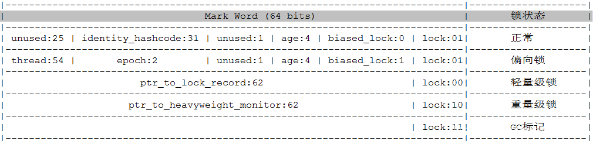

对象由多部分构成的，对象头，属性字段、补齐区域等。所谓补齐区域是指如果对象总大小不是4字节的整数倍，会填充上一段内存地址使之成为整数倍。

对象头这部分在对象的最前端，包含两部分或者三部分：Mark Words、Klass Words，如果对象是一个数组，那么还可能包含第三部分：数组的长度。

 

------

Klass Word里面存的是一个地址，占32位或64位，是一个指向当前对象所属于的类的地址，可以通过这个地址获取到它的元数据信息。

------

 Mark Word需要重点说一下，这里面主要包含对象的哈希值、年龄分代、锁标志位等，大小为32位或64位

当对象处于不同的锁状态时，它的Mark Word里的东西会被替换成不同东西，如下表所示：

 

1、对象未加锁的时候，lock标志位为01，包含哈希值、年龄分代和偏向锁标志位等，此时偏向锁标志位为0；

2、当对象被施加偏向锁时，哈希值和一部分无用内存会转化为锁主人的线程信息，以及加锁的时间戳epoch，此时lock标志位没变，偏向锁为1，也就是说，**偏向锁和lock标志位共同决定是否偏向锁状态。**

> 偏向锁的加锁步骤：
>
> - Load-and-test，也就是简单判断一下当前线程id是否与Markword当中的线程id是否一致.
> - 如果一致，则说明此线程已经成功获得了锁，继续执行下面的代码.
> - 如果不一致，则要检查一下对象是否还是可偏向，即“是否偏向锁”标志位的值。
> - 如果还未偏向，则利用CAS操作来竞争锁，也即是第一次获取锁时的操作。

3、当发生锁竞争时，偏向锁会变为轻量级锁，这时需要先将偏向锁进行锁撤销，这一步骤也会消耗不少的性能，轻量级锁的Mark Word中，lock标志位为00，其余内容被替换为一个指针，指向了栈里面的锁记录。

> 锁撤销的过程如下：
>
> - 在一个安全点停止拥有锁的线程。
> - 遍历线程栈，如果存在锁记录的话，需要修复锁记录和Markword，使其变成无锁状态。
> - 唤醒当前线程，将当前锁升级成轻量级锁。
>
> 所以，如果某些同步代码块大多数情况下都是有两个及以上的线程竞争的话，那么偏向锁就会是一种累赘，对于这种情况，我们可以一开始就把偏向锁这个默认功能给关闭
>
> 轻量级锁的加锁步骤：
>
> - 线程在自己的**栈桢**中创建锁记录LockRecord。
> - 将锁对象的对象头中的MarkWord复制到线程的刚刚创建的锁记录中。
> - 将锁记录中的Owner指针指向锁对象。
> - 将锁对象的对象头的MarkWord替换为指向锁记录的指针。
>
> 轻量级锁主要有两种：自旋锁和自适应自旋锁。自旋锁会导致空耗CPU且很可能锁不公平；自适应是指根据上一次该线程是否成功或者多久获取过该锁设置旋转次数，若上次失败很可能直接进入重量级锁

4、如果竞争线程增多，锁继续膨胀，变为重量级锁，也是互斥锁，即synchronized，其lock标志位为10，Mark Word其余内容被替换为一个指向对象监视器Monitor的指针。

特殊的是，如果此对象已经被GC标记过，lock会变为11，不含其余内容。

------

 

**Monitor对象**

每个对象都有一个Monitor对象相关联，Monitor对象中记录了持有锁的线程信息、等待队列等。Monitor对象包含以下三个字段：

- _owner 记录当前持有锁的线程
- _EntryList 是一个队列，记录所有阻塞等待锁的线程
- _WaitSet 也是一个队列，记录调用 wait() 方法并还未被通知的线程

当线程持有锁的时候，线程id等信息会拷贝进owner字段，其余线程会进入阻塞队列entrylist，当持有锁的线程执行wait方法，会立即释放锁进入waitset，当线程释放锁的时候，owner会被置空，公平锁条件下，entrylist中的线程会竞争锁，竞争成功的线程id会写入owner，其余线程继续在entrylist中等待。

------

 

**Monitor与Synchronized**

对于Synchronized的同步代码块，JVM会在进入代码块之前加上monitorenter ，如果进入monitor成功，线程便获取了锁，一个对象的monitor同一时刻只能被一个线程锁占有；

对于同步方法，JVM会将方法设置 ACC_SYNCHRONIZED 标志，调用的时候 JVM 根据这个标志判断是否是同步方法。

采用Synchronized给对象加锁会使线程阻塞，因而会造成线程状态的切换，而线程状态的切换必须要操作系统来执行，因此需要将用户态切换为内核态，这个切换的过程是十分耗时的都需要操作系统来帮忙，有可能比用户执行代码的时间还要长。

------

 Synchronized是JVM级别的锁，它在不断被优化着，从目前来看Synchronized已经远没有以前那么“重”了，也大概就是JUC包源码（如ConcurrentHashMap）中大量使用Synchronized的原因把