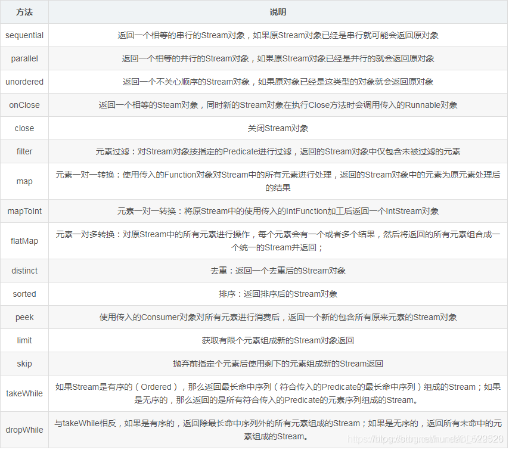
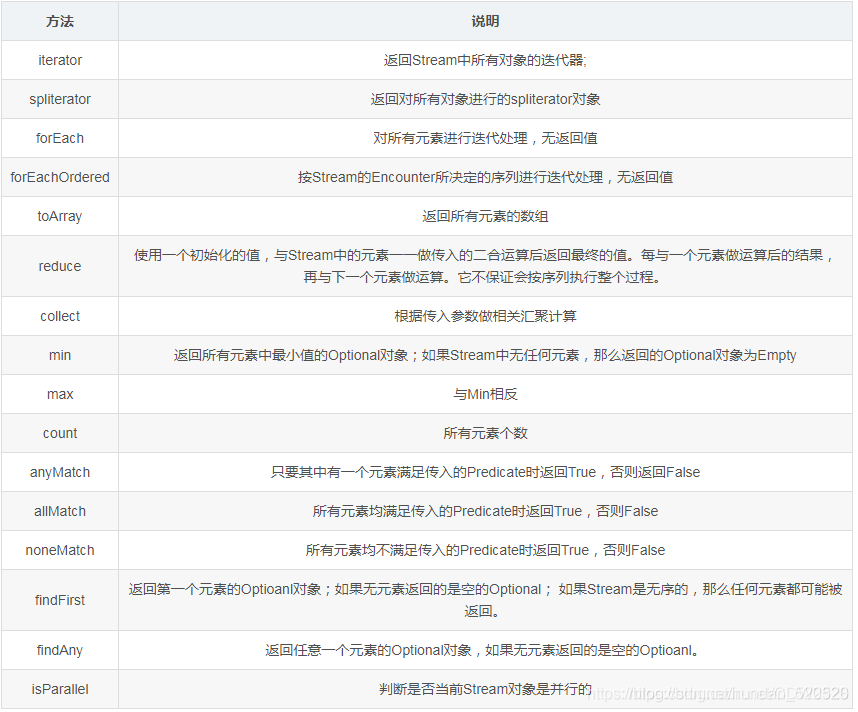
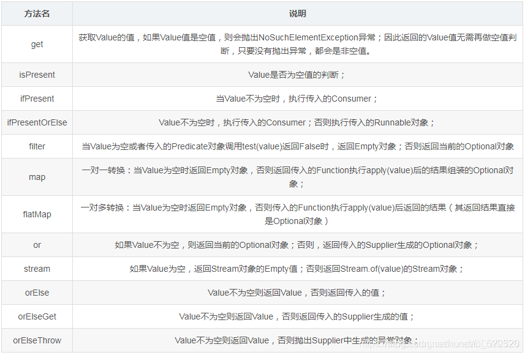

## 1.Java[函数式编程](https://so.csdn.net/so/search?q=函数式编程&spm=1001.2101.3001.7020)的语法：

使用Consumer作为示例，它是一个函数式接口，包含一个抽象方法accept，这个方法只有输入而无输出也就是说这个方法无返回值。
现在我们要定义一个Consumer接口的实例化对象，传统的方式是这样定义的：

```java
public static void main(String[] args) {
	//JDK1.8版本之前的做法
	Consumer<Integer> con = new Consumer<Integer>() {
		@Override
		public void accept(Integer t) {
			System.out.println(t);
		}
	};
	//调用方法
	con.accept(3);
}

```

这里可以打印出3.
上面是JDK1.8以前的做法，在1.8以后引入函数式的编程可以这样写：

```java
public static void main(String[] args) {
	// 1. Consumer只有一个入参，没有出参
	// 第一种写法(有且只有一个入参)
	Consumer<Integer> con = (param) -> {
		System.out.println(param);
	};
	// 第二种写法
	Consumer<Integer> con1 = (param) -> System.out.println(param);
	// 第三种写法
	Consumer<Integer> con2 = System.out::print;
	Consumer<Integer> con3 = (param) -> {
		System.out.println(param * param);
	};
	Consumer<Integer> con4 = (param) -> {
		System.out.println(param + param + 1);
	};
	// 调用
	con.accept(1);
	con1.accept(2);
	con2.accept(3);
}

```

上面的con、con1、con2这个Consumer对象的引用照样可以打印出3.

- 在上面的第二种写法是第一种写法的精简，但是只有在函数题中只有一条语句时才可以这么使用，做进一步的简化。
- 在上面的第三种写法是对第一、二种写法的进一步精简，由于第三种写法只是进行打印，调用了System.out中的println静态方法对输入参数直接进行打印。它表示的意思就是针对输入的参数将其调用System.out中的静态方法println进行打印。
- 上面已说明，函数式编程接口都只有一个抽象方法，因此在采用这种写法时，编译器会将这段函数编译后当作该抽象方法的实现。
  如果接口有多个抽象方法，编译器就不知道这段函数应该是实现哪个方法的了。 因此，= 后面的函数体我们就可以看成是accept函数的实现。
- 输入：-> 前面的部分，即被()包围的部分。此处只有一个输入参数，实际上输入是可以有多个的（Consumer只有一个入参），如两个参数时写法：(a, b);当然也可以没有输入，此时直接就可以是()。
- 函数体：->后面的部分，即被{}包围的部分；可以是一段代码。
- 输出：函数式编程可以没有返回值，也可以有返回值。如果有返回值时，需要代码段的最后一句通过return的方式返回对应的值。但是Consumer这个函数式接口不能有具体的返回值。
- Java 8 中我们可以通过 `::` 关键字来访问类的构造方法，对象方法，静态方法。

好了，到这一步就可以感受到函数式编程的强大能力。
通过最后一段代码，我们可以简单的理解函数式编程，Consumer接口直接就可以当成一个函数了，这个函数接收一个输入参数，然后针对这个输入进行处理；当然其本质上仍旧是一个对象，但我们已经省去了诸如老方式中的对象定义过程，直接使用一段代码来给函数式接口对象赋值。
而且最为关键的是，这个函数式对象因为本质上仍旧是一个对象，因此可以做为其它方法的参数或者返回值，可以与原有的代码实现无缝集成！

## 2. Java函数式接口

常用的接口有：

```java
java.util.function.Consumer;
java.util.function.Function;
java.util.function.Predicate;

```

### 2.1 Consumer

Consumer是一个函数式编程接口； 顾名思义，Consumer的意思就是消费，即针对某个东西我们来使用它，因此它包含有一个有输入而无输出（无返回值）的accept接口方法；
除accept方法，它还包含有andThen这个方法；
JDK源码定义如下：

```java
default Consumer<T> andThen(Consumer<? super T> after) {
	Objects.requireNonNull(after);
	return (T t) -> { accept(t); after.accept(t); };
}

```

andThen这个方法是作用是：指定在调用当前Consumer后是否还要调用其它的Consumer；

```java
    public static void main(String[] args) {
        //定义第一个Consumer
        Consumer<Integer> consumer1 = (param) -> {
            System.out.println(param);
        };
        //定义第二个Consumer
        Consumer<Integer> consumer2 = (param) -> {
            System.out.println(param * param);
        };
        //consumer1可以连续的调用自己
        consumer1.andThen(consumer1).andThen(consumer1).accept(3);
        //打印出 3 3 3
        //consumer1可以调用自己后调用consumer2
        consumer1.andThen(consumer1).andThen(consumer2).accept(3);
        //打印出3 3 9
    }

```

注意：当一个Consumer接口调用另外一个Consumer对象时两个Counsumer对象的泛型必须一致。

### 2.2 Function

Function也是一个函数式编程接口；它代表的含义是“函数”，它是个接受一个参数并生成结果的函数，而函数经常是有输入输出的，因此它含有一个apply方法，包含一个输入与一个输出；除apply方法外，它还有compose与andThen及indentity三个方法，其使用见下述示例；


```java
/**
 * 表示一个函数，它接收一个参数并且返回一个结果。
 * 这是一个函数式接口，它有一个重要的方法是apply(Object)
 * @param <T> 函数的输入类型
 * @param <R> 函数结果的类型
 * @since 1.8
 */
@FunctionalInterface
public interface Function<T, R> {

    /**
     * 将该方法应用到指定的参数上
     * @param t 函数参数
     * @return 返回函数的结果
     */
    R apply(T t);

    /**
     * 返回一个组合函数，首先使用before给它的输入参数，接着将前面的结果应用给此函数。
     将第二个函数的结果作为第一个的参数
     * 如果在评测期间抛出任何异常，都会由调用者返回给组合函数。
     *
     * @param <V> 组合函数中，before 函数的输入类型
     * @param before 该函数应该在当前函数引用之后在应用。
     * @return 一个组合函数第一次被应用before函数
     * function and then applies this function
     * @throws 如果before为null，就会抛出NullPointerException异常
     */
    default <V> Function<V, R> compose(Function<? super V, ? extends T> before) {
        Objects.requireNonNull(before);
        //将第一个function传进计算before.apply，然后将结果作为第二次传入的值，
        // 对第二个function进行apply
        return (V v) -> apply(before.apply(v));
    }

    /**
     * 返回一个组合函数，第一个使用该函数给它的输入，接着对其结果使用after函数。
     * 如果评测期间有任何的异常抛出，都将会有调用者抛给组合函数。
     将第一个的结果作为第二个的参数
     * @param <V> after函数和组合函数的输出类型
     * @param after 当前函数应用之后再应用该函数
     * @return 返回一个组合函数，第一次应用该函数第二次应用after函数
     * @throws 如果after为null,则会抛出NullPointerException异常
     */
    default <V> Function<T, V> andThen(Function<? super R, ? extends V> after) {
        Objects.requireNonNull(after);
        return (T t) -> after.apply(apply(t));
    }

    /**
     * 返回一个函数总返回自己的输入参数
     *
     * @param <T> 函数的输入和输出对象类型
     * @return 返回一个函数总返回自己的输入参数
     */
    static <T> Function<T, T> identity() {
        return t -> t;
    }
}
```


**apply的用法：**

```java
    public static void main(String[] args) {
        Function<Integer, Integer> fun = res -> res + 1;
        Integer i = fun.apply(2);
        System.out.println(i);
    }

```

上面打印出2。
Function编程接口有两个泛型Function<T, R> T表示：函数的输入类型，R表示：函数的输出类型。

**compose的用法：**

JDK源码定义：

```java
    default <V> Function<V, R> compose(Function<? super V, ? extends T> before) {
        Objects.requireNonNull(before);
        return (V v) -> apply(before.apply(v));
    }

    public static void main(String[] args) {
        Function<Integer, Integer> fun = res -> res + 1;
        Function<Integer, Integer> fun1 = res -> res * 10;
        Integer i = (Integer) fun.compose(fun1).apply(2);
        System.out.println(i);
    }

```

上面打印出21；
上面表示了 fun1 接收到 2 后先计算，然后将 fun1 计算的结果再交给 fun 再计算。

**andThen方法的用法：**

JDK源码定义：

```java
    default <V> Function<T, V> andThen(Function<? super R, ? extends V> after) {
        Objects.requireNonNull(after);
        return (T t) -> after.apply(apply(t));
    }

    public static void main(String[] args) {
        Function<Integer, Integer> fun = res -> res + 1;
        Function<Integer, Integer> fun1 = res -> res * 10;
        Integer i = (Integer) fun.andThen(fun1).apply(3);
        System.out.println(i);
    }

```

上面打印出40
上面表示了 fun 先计算得到4，然后将计算结果4再给 fun1 计算得到40；

**indentity方法的用法：**

JDK源码定义：

```java
    static <T> Function<T, T> identity() {
        return t -> t;
    }

    public static void main(String[] args) {
        System.out.println(Function.identity().apply("总分"));
    }

```

上面打印出“总分“；就是说传入什么参数输出什么参数。


### 2.3 BiFunction接口

BiFunction是一个函数式接口，它接口两个参数并产生一个结果值返回。


```java
/**
 * BiFunction是一个函数式接口，它接口两个参数并产生一个结果值返回。
 * 它里面有一个apply(Object,Object)方法。
 * @param <T> 函数的第一个参数类型
 * @param <U> 函数的第二个参数类型
 * @param <R> 函数的结果类型
 * @since 1.8
 */
@FunctionalInterface
public interface BiFunction<T, U, R> {

    /**
     * 将apply函数应用到给定的参数上面
     *
     * @param t 函数的第一个参数
     * @param u 函数的第二个参数
     * @return R 函数的结果
     */
    R apply(T t, U u);

    /**
     * 返回一个组合的函数，第一次是将该函数应用到它的输入，接着是将该函数的after应用到
     * 之前的结果上。如果在任一函数评测期间抛出异常，它都会被传递给组合函数的调用者。
     * @param <V> 组合函数和after函数的输出类型
     * @param after 该函数应用将被在当前函数apply后被apply
     * @return 返回一个组合函数，第一次应用该函数，接着应用after函数
     * @throws 当after为null的时候，会抛出NullPointerException异常。
     */
    default <V> BiFunction<T, U, V> andThen(Function<? super R, ? extends V> after) {
        Objects.requireNonNull(after);
        return (T t, U u) -> after.apply(apply(t, u));
    }
}
```


**示例代码**

```java
public class BiFunctionTest {
    public static void main(String[] args){
        BiFunctionTest test = new BiFunctionTest();
        //实现四则运算
        System.out.println(test.compute(4,2,(value1,value2)->value1+value2));
        System.out.println(test.compute(4,2,(v1,v2)->v1-v2));
        System.out.println(test.compute(1,2,(v1,v2)->v1*v2));
        System.out.println(test.compute(3,2,(v1,v2)->v1/v2));
        System.out.println(test.calcute(3,4,(v1,v2)->v1+v2,v->v * v));
    }

    public  int compute(int num1, int num2, BiFunction<Integer,Integer,Integer> biFunction){
        return  biFunction.apply(num1,num2);
    }

    public int calcute(int num1, int num2, BiFunction<Integer,Integer,Integer> biFunction, Function<Integer,Integer> function){
        //调用addThen首先对接收的两个参数进行bifunction的apply，然后在进行function的apply
        return biFunction.andThen(function).apply(num1,num2);
    }
}
```


输出结果:6 2 2 1 49


### 2.4 BinaryOperator

BiFunction的一个特殊例子，接收两个参数，产生一个结果，只是它的三个参数都是同一个数据类型，这个函数式接口就是**BinaryOperator**


```java
/**
 * 表示对两个相同类型的操作数的操作。产生与操作数相同类型的结果。
 * 这是BiFunction的一个特殊例子，它的结果和操作数都是相同的数据类型。
 * 这个是一个函数式接口，该接口有一个函数方法apply(Object,Object)。
 * @param <T> 操作数和结果的数据类型
 * @since 1.8
 */
@FunctionalInterface
public interface BinaryOperator<T> extends BiFunction<T,T,T> {
    /**
     * 通过比较器Comparator来比较两个元素中较小的一个作为返回值返回。
     * @param <T> 比较器的输入参数的类型
     * @param comparator 用来比较两个值的Comparator
     * @return 通过比较器Comparator来比较两个元素中较小的一个作为返回值返回。
     * @throws 如果参数为NULL,就会抛出NullPointerException异常
     */
    public static <T> BinaryOperator<T> minBy(Comparator<? super T> comparator) {
        Objects.requireNonNull(comparator);
        return (a, b) -> comparator.compare(a, b) <= 0 ? a : b;
    }

    /**
     * 通过比较器Comparator来比较两个元素中较大的一个作为返回值返回。
     * @param <T> 比较器的输入参数的类型
     * @param comparator 用来比较两个值的Comparator
     * @return 通过比较器Comparator来比较两个元素中较小的一个作为返回值返回。
     * @throws 如果参数为NULL,就会抛出NullPointerException异常
     */
    public static <T> BinaryOperator<T> maxBy(Comparator<? super T> comparator) {
        Objects.requireNonNull(comparator);
        return (a, b) -> comparator.compare(a, b) >= 0 ? a : b;
    }
}
```


**示例代码**


```java
public class BinaryOperatorTest {
    public static void main(String[] args){
        BinaryOperatorTest test = new BinaryOperatorTest();
        test.testBinaryOperator(1,2,(num1,num2)->num1 + num2);
        test.testBinaryOperator(4,2,(num1,num2)->num1 - num2);
        test.testBinaryOperator(3,2,(num1,num2)->num1 * num2);
        test.testBinaryOperator(8,2,(num1,num2)->num1 / num2);
        test.testMinBy("hello","wonders",(str1,str2)->str1.length()-str2.length());
        //方法引用
        test.testMinBy("hello","wonders", Comparator.comparingInt(String::length));
        test.testMinBy("hello","wonders",(str1,str2)->str1.charAt(0)-str2.charAt(0));
        //方法引用
        test.testMinBy("hello","wonders", Comparator.comparingInt(str -> str.charAt(0)));
        test.testMaxBy("hello","wonders",(str1,str2)->str1.length()-str2.length());
        //方法引用
        test.testMaxBy("hello","wonders", Comparator.comparingInt(String::length));
        test.testMaxBy("hello","wonders",(str1,str2)->str1.charAt(0)-str2.charAt(0));
        //方法引用
        test.testMaxBy("hello","wonders", Comparator.comparingInt(str -> str.charAt(0)));
    }


    public void testBinaryOperator(Integer num1,Integer num2,BinaryOperator<Integer> result){
        System.out.println(result.apply(num1,num2));
    }

    /**
     * 返回两者里面较小的一个
     * @param str1
     * @param str2
     * @param comparator
     */
    public void testMinBy(String str1, String str2, Comparator<String> comparator){
        System.out.println(BinaryOperator.minBy(comparator).apply(str1,str2));
    }

    /**
     * 返回两者里面较大的一个
     * @param str1
     * @param str2
     * @param comparator
     */
    public void testMaxBy(String str1, String str2, Comparator<String> comparator){
        System.out.println(BinaryOperator.maxBy(comparator).apply(str1,str2));
    }
}
```


输出结果

```
3
2
6
4
hello
hello
hello
hello
wonders
wonders
wonders
wonders
```


### 2.5 Predicate

Predicate为函数式接口，predicate的中文意思是“断定”，即判断的意思，判断某个东西是否满足某种条件； 因此它包含test方法，根据输入值来做逻辑判断，其结果为True或者False。

**test方法的用法：**

JDK源码定义：

```java
boolean test(T t);
    public static void main(String[] args) {
        Predicate<String> pre = res -> res.equals("1234");
        boolean rest = pre.test("1234");
        System.out.println(rest);
    }

```

上面打印出true。

**and方法的用法：**

JDK源码定义：

```java
    default Predicate<T> and(Predicate<? super T> other) {
        Objects.requireNonNull(other);
        return (t) -> test(t) && other.test(t);
    }
    public static void main(String[] args) {
        Predicate<String> pre = res -> res.equals("1234");
        Predicate<String> pre1 = res -> res.equals("1234");
        Predicate<String> pre3 = res -> res.equals("1234");
        boolean rest = pre.and(pre1).test("1234");
        boolean rest1 = pre.and(pre1).test("12341");
        System.out.println(rest);
        System.out.println(rest1);
    }
```

上面先打印出true，后打印出false

根据源码，"1234"先和pre比较，如果为true，再和pre1比较。不为true直接返回false，不再和pre1比较。当“1234”和pre比较后为true，再和pre1比较结果为true，所以最终返回true。

**negate()的用法：**

JDK源码定义

```java
    default Predicate<T> negate() {
        return (t) -> !test(t);
    }
    public static void main(String[] args) {
        Predicate<String> pre = res -> res.equals("1234");
        boolean rest = pre.negate().test("1234");
        System.out.println(rest);
    }
```

上面打印出false，上面的意思是如果比较的结果是true，那么返回false，如果为false，就返回true。

**or的方法的用法：**

JDK源码定义：

```java
    default Predicate<T> or(Predicate<? super T> other) {
        Objects.requireNonNull(other);
        return (t) -> test(t) || other.test(t);
    }
    public static void main(String[] args) {
        Predicate<String> pre = res -> res.equals("1234");
        Predicate<String> pre1 = res -> res.equals("12341");
        boolean rest = pre.or(pre1).test("12341");
        System.out.println(rest);
    }
```

上面打印出true；or方法的意思是：只要一个为true就返回true。

**isEqual方法用法：**

JDK源码定义：

```java
    static <T> Predicate<T> isEqual(Object targetRef) {
        return (null == targetRef)
                ? Objects::isNull
                : object -> targetRef.equals(object);
    }

    public static void main(String[] args) {
        System.out.println(Predicate.isEqual("12345").test("12345"));
    }
```

上面打印出true；isEqual里的参数是要比较的目标对象。


## 3.函数式编程接口的使用

通过Stream以及Optional两个类，可以进一步利用函数式接口来简化代码。

### 3.1 Stream

Stream可以对多个元素进行一系列的操作，也可以支持对某些操作进行并发处理。

**3.1.1 方法**
Stream对象提供多个非常有用的方法，这些方法可以分成两类：

- 中间操作：将原始的Stream转换成另外一个Stream；如filter返回的是过滤后的Stream。
- 终端操作：产生的是一个结果或者其它的复合操作；如count或者forEach操作。

所有中间操作：


所有的终端操作：


### 3.2 Optional

Optional用于简化Java中对空值的判断处理，以防止出现各种空指针异常。
Optional实际上是对一个变量进行封装，它包含有一个属性value，实际上就是这个变量的值。

**3.2.1 方法**
