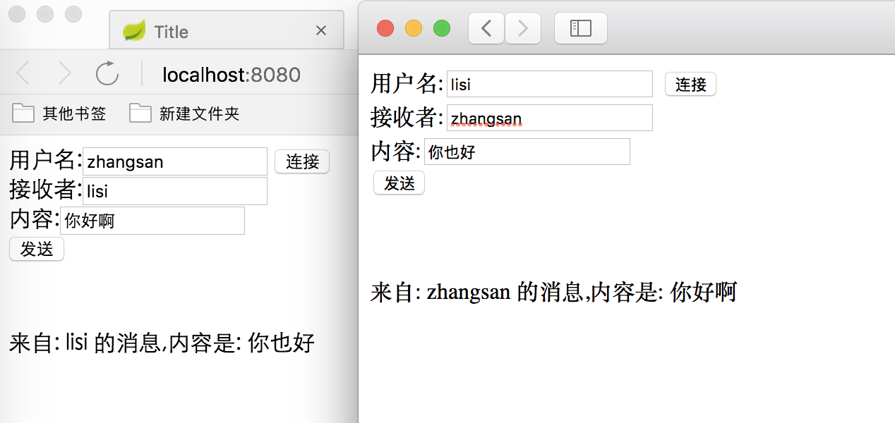

#  WebSocket

> Websocket 是一种长连接方式,可以帮助我们通过浏览器和服务端进行长连接,用于可以即时通讯,推送消息等
>
> Java 中 WebSocket 使用比较简单, java 给我们提供了响应的 api 用于处理建立连接,收消息,关闭连接等

## 1.1 POM 依赖

```xml
<project xmlns="http://maven.apache.org/POM/4.0.0" xmlns:xsi="http://www.w3.org/2001/XMLSchema-instance"
  xsi:schemaLocation="http://maven.apache.org/POM/4.0.0 http://maven.apache.org/maven-v4_0_0.xsd">
  <modelVersion>4.0.0</modelVersion>
  <groupId>com.qianfeng</groupId>
  <artifactId>testwebsocket</artifactId>
  <packaging>war</packaging>
  <version>1.0-SNAPSHOT</version>
  <name>testwebsocket Maven Webapp</name>
  <url>http://maven.apache.org</url>
  <dependencies>
    <dependency>
      <groupId>junit</groupId>
      <artifactId>junit</artifactId>
      <version>3.8.1</version>
      <scope>test</scope>
    </dependency>
<!--servlet3.1规范-->
    <dependency>
      <groupId>javax.servlet</groupId>
      <artifactId>javax.servlet-api</artifactId>
      <version>3.1.0</version>
    </dependency>
    <dependency>
      <groupId>javax.servlet.jsp</groupId>
      <artifactId>jsp-api</artifactId>
      <version>2.2</version>
    </dependency>
    <!-- https://mvnrepository.com/artifact/javax.websocket/javax.websocket-api
     websocket 依赖
     -->
    <dependency>
      <groupId>javax.websocket</groupId>
      <artifactId>javax.websocket-api</artifactId>
      <version>1.1</version>
      <scope>provided</scope>
    </dependency>
    <!--用于处理json 数据的-->
    <dependency>
      <groupId>net.sf.json-lib</groupId>
      <artifactId>json-lib</artifactId>
      <version>2.4</version>
    </dependency>
  </dependencies>
  <build>
    <finalName>testwebsocket</finalName>
  </build>
</project>

```


## 1.2 Web.xml

> 注意 maven 工程的 xml 文件的版本应该是3.0+

```xml
<web-app xmlns="http://xmlns.jcp.org/xml/ns/javaee"
         xmlns:xsi="http://www.w3.org/2001/XMLSchema-instance"
         xsi:schemaLocation="http://xmlns.jcp.org/xml/ns/javaee
         http://xmlns.jcp.org/xml/ns/javaee/web-app_3_1.xsd"
         version="3.1">
</web-app>
```


## 1.3  JAVA 类

```java
package com.qianfeng.servlet;

//
//                            _ooOoo_  
//                           o8888888o  
//                           88" . "88  
//                           (| -_- |)  
//                            O\ = /O  
//                        ____/`---'\____  
//                      .   ' \\| |// `.  
//                       / \\||| : |||// \  
//                     / _||||| -:- |||||- \  
//                       | | \\\ - /// | |  
//                     | \_| ''\---/'' | |  
//                      \ .-\__ `-` ___/-. /  
//                   ___`. .' /--.--\ `. . __  
//                ."" '< `.___\_<|>_/___.' >'"".  
//               | | : `- \`.;`\ _ /`;.`/ - ` : | |  
//                 \ \ `-. \_ __\ /__ _/ .-` / /  
//         ======`-.____`-.___\_____/___.-`____.-'======  
//                            `=---='  
//  
//         .............................................  
//                  佛祖镇楼                  BUG辟易  
//          佛曰:  
//                  写字楼里写字间，写字间里程序员；  
//                  程序人员写程序，又拿程序换酒钱。  
//                  酒醒只在网上坐，酒醉还来网下眠；  
//                  酒醉酒醒日复日，网上网下年复年。  
//                  但愿老死电脑间，不愿鞠躬老板前；  
//                  奔驰宝马贵者趣，公交自行程序员。  
//                  别人笑我忒疯癫，我笑自己命太贱；  
//  


import net.sf.json.JSONObject;

import javax.websocket.*;
import javax.websocket.server.PathParam;
import javax.websocket.server.ServerEndpoint;
import java.io.IOException;
import java.util.Map;
import java.util.concurrent.ConcurrentHashMap;

/**
 * Created by jackiechan on 2022/2/5/下午2:08
 *
 * WebSocket 的处理类
 * 状态 注解:
 *  连接  OnOpen
 *  收到消息 OnMessage
 *  关闭连接 OnClose
 *  错误 OnError
 *  这是一个多例对象,每一次连接都会创建一个对象
 */
@ServerEndpoint("/websocket/{name}")
public class WebSocket {
    private String name;
    private Session session;

    private static Map<String,Session>  allClients=new ConcurrentHashMap();//用于记录所有的用户和连接之间的关系

    public WebSocket() {
        System.out.println("构造方法执行了");
    }

    /**
     * 当打开连接的时候,代表有人连接我们了
     * @param name  此处的 name 代表类注解上面的访问路径后的name, 我们此处做测试,根据用户传过来的名字做区分, 也可以通过 ip 等区分
     * @param session 当前连接的 session
     * @throws Exception
     */
    @OnOpen//此注解的作用是声明当前方法是当建立连接的时候调用
    public void onOpen(@PathParam("name") String name, Session session) throws  Exception{
        this.name=name;
        this.session = session;
        allClients.put(name, session);//将当前连接放入到 map中
    }

    /**
     * 收到消息的时候,此处应该填写自己的业务逻辑,我们服务端只是负责收到消息,实际开发中可能是两个人在聊天,我们这边收到消息后,应该当消息转发给接受者
     * 接收者到底是谁,一般情况下,如果是和客服聊天,我们这里应该是另外一个客服的连接页面,也是连接这里,然后将所有的客服存起来,随机或者按照某种规则选择客服进行通信
     * 如果是用户指定的人,那么在消息中应该会带有标记,比如发送给哪个人,我们取出来之后找到对方的连接,发过去即可
     * @param message 收到的消息,实际上,收到的消息中应当包含消息最终要发给谁,这样服务端就可以知道转发给谁了
     */
    @OnMessage//此注解的作用是当收到消息的时候执行
    public void onMessage(Session session ,String message) {
        System.out.println(session);
        //------实际开发中替换为自己的业务逻辑-------
        System.out.println("当前收到的消息是:"+message);
        JSONObject jsonObject = JSONObject.fromObject(message);
        String toName = jsonObject.getString("toName");//接收者
        String content = jsonObject.getString("content");//真正的消息内容,但是我们将这个内容修改后发过去,因为用户在页面需要判断出是谁给我发的消息,所以还需要一个发送者的信息
        sendMessage(toName,"来自: "+name+" 的消息,内容是: "+content);//此处直接拼接的字符串,没有弄成 json, 实际开发请自行处理
    }

    /**
     * 当服务端出现异常的时候,比如,用户直接非法断开连接导致 socket 出现异常
     * @param session 出现异常的连接
     * @param e 异常内容
     */
    @OnError//此注解的作用是当出现异常的时候执行
    public void onError(Session session,Throwable e) {
        try {
            session.close();
            allClients.remove(name);
        } catch (IOException e1) {
            e1.printStackTrace();
        }
        e.printStackTrace();
    }

    /**
     * 当连接关闭的时候
     */
    @OnClose//此注解的作用是 当连接关闭的时候执行
    public void onClose(Session session) {
        System.out.println(session);
        allClients.remove(name);//将当前连接移除
    }

    /**
     * 发送消息
     * @param name 接收方的名字
     * @param message 发送的内容
     */
    public void sendMessage(String name, String message) {
        Session toSession = allClients.get(name);//找到目标所在对应的 session

            if (toSession != null) {
                toSession.getAsyncRemote().sendText(message);// 发送消息
                return;
            }

            session.getAsyncRemote().sendText("对方不在线");//如果对方不在线,告诉当前用户
    }


    public String getName() {
        return name;
    }

    public void setName(String name) {
        this.name = name;
    }

    public Session getSession() {
        return session;
    }

    public void setSession(Session session) {
        this.session = session;
    }

    public static Map<String, Session> getAllClients() {
        return allClients;
    }

    public static void setAllClients(Map<String, Session> allClients) {
        WebSocket.allClients = allClients;
    }
}

```

## 1.4 html

> html 中比较简单,就是单纯聊天,没有做很复杂的名单列表,聊天记录列表等功能,
>
> 使用的时候 开多个浏览器, 各自填写自己的名字,连接后, 就可以填写收消息人的名字,发送消息了

```html
<!DOCTYPE html>
<html lang="en">
<head>
    <meta charset="UTF-8">
    <title>Title</title>
    <script type="text/javascript">
        var websocket = null;
        function abc() {

            //var username = localStorage.getItem("name");
            var username=document.getElementById("me").value;
            //判断当前浏览器是否支持WebSocket
            if ('WebSocket' in window) {
                websocket = new WebSocket("ws://" + document.location.host + "/websocket/"+username);
            } else {
                alert('当前浏览器 Not support websocket')
            }

            //连接发生错误的回调方法
            websocket.onerror = function() {
                setMessageInnerHTML("WebSocket连接发生错误");
            };

            //连接成功建立的回调方法
            websocket.onopen = function() {
                setMessageInnerHTML("WebSocket连接成功");
            }

            //接收到消息的回调方法
            websocket.onmessage = function(event) {
                setMessageInnerHTML(event.data);
            }

            //连接关闭的回调方法
            websocket.onclose = function() {
                setMessageInnerHTML("WebSocket连接关闭");
            }

            //监听窗口关闭事件，当窗口关闭时，主动去关闭websocket连接，防止连接还没断开就关闭窗口，server端会抛异常。
            window.onbeforeunload = function() {
                closeWebSocket();
            }
        }

        /**
         * 发送消息
         */
        function sendmessage() {
            var toName=document.getElementById("to").value;
            if (websocket!=null) {
                var content=document.getElementById("content").value;

                var message='{"toName":"'+toName+'","content":"'+content+'"}';//将发送的内容拼接为 json 字符串,服务端用于解析好处理
                websocket.send(message);
            }
        }

        //关闭WebSocket连接
        function closeWebSocket() {
            if (websocket!=null) {

                websocket.close();
            }
        }
        function setMessageInnerHTML(data) {
            document.getElementById("neirong").innerHTML = data;
        }
    </script>
</head>
<body>
 用户名:<input type="text" id="me" /> <button onclick="abc()"> 连接</button><br>
 <!--实际接收者应该由用户选择,或者由系统安排,比如客服的话,应该是服务端已经存储了所有在线的客服,用户只需要发送消息即可,如果是两个用户聊天,则应该有用户列表,选择后指定目标-->
    接收者:<input type="text" id="to" /><br>
    内容:<input type="text" id="content" /><br>
    <button onclick="sendmessage()">发送</button><br>
<br>
<br>
<br>
<span id="neirong"></span>
</body>
</html>
```

## 1.5 测试

