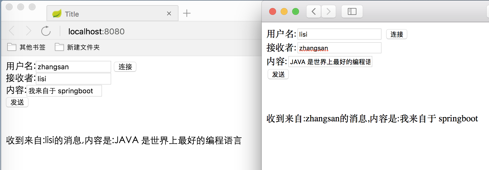

# WebSocket+Springboot

## 1.1 pom 文件的依赖和插件

```xml
 <parent>
        <groupId>org.springframework.boot</groupId>
        <artifactId>spring-boot-starter-parent</artifactId>
        <version>1.5.9.RELEASE</version>
    </parent>

    <dependencies>
        <dependency>
            <groupId>junit</groupId>
            <artifactId>junit</artifactId>
            <version>3.8.1</version>
            <scope>test</scope>
        </dependency>
        <!--servlet3.1规范-->
        <dependency>
            <groupId>javax.servlet</groupId>
            <artifactId>javax.servlet-api</artifactId>
            <version>3.1.0</version>
        </dependency>
       
        <!--用于处理json 数据的-->
        <dependency>
            <groupId>net.sf.json-lib</groupId>
            <artifactId>json-lib</artifactId>
            <version>2.4</version>
        </dependency>
        <dependency>
            <groupId>org.springframework.boot</groupId>
            <artifactId>spring-boot-starter-web</artifactId>
            <exclusions>
                <exclusion>
                    <groupId>org.springframework.boot</groupId>
                    <artifactId>spring-boot-starter-tomcat</artifactId>
                </exclusion>
            </exclusions>
        </dependency>
        <!-- https://mvnrepository.com/artifact/org.springframework/spring-websocket 
		spring 整合websocket
		-->
        <dependency>
            <groupId>org.springframework</groupId>
            <artifactId>spring-websocket</artifactId>
        </dependency>
      <!--springboot 需要的依赖包-->
        <dependency>
            <groupId>ch.qos.logback</groupId>
            <artifactId>logback-core</artifactId>
        </dependency>
        <dependency>
            <groupId>ch.qos.logback</groupId>
            <artifactId>logback-classic</artifactId>
        </dependency>
    </dependencies>
    <build>
        <finalName>websocketspring</finalName>

        <plugins>
            <plugin>
                <groupId>org.springframework.boot</groupId>
                <artifactId>spring-boot-maven-plugin</artifactId>
            </plugin>
        </plugins>
    </build>
```

## 1.2 WebSocket 的配置文件

> 用于启动 websocket,注入处理器和拦截器

```java
/**
 * Created by jackiechan on 2022/2/5/下午4:05
 */
@Configuration //声明为配置文件
@EnableWebSocket//启用 websocket
public class WebSocketConfig implements WebSocketConfigurer {
    @Override
    public void registerWebSocketHandlers(WebSocketHandlerRegistry webSocketHandlerRegistry) {
        System.out.println("初始化路径拦截");//指定所有/websocket开头的路径会被 websocket 拦截,设置处理器和拦截器
        webSocketHandlerRegistry.addHandler(chatMessageHandler(),"/websocket/*").addInterceptors(new ChatHandshakeInterceptor());
    }

    /**
     * 创建处理器
     * @return
     */
    @Bean
    public TextWebSocketHandler chatMessageHandler(){
        System.out.println("创建 handler");
        return new ChatMessageHandler();
    }
}

```


##1.3 ChatHandshakeInterceptor拦截器

> 用于每次 websocket 在握手之前进行拦截,可以在内部进行校验

```java

/**
 * Created by jackiechan on 2022/2/5/下午4:16
 *
 * WebSocket握手请求的拦截器. 检查握手请求和响应, 对WebSocketHandler传递属性
 */
public class ChatHandshakeInterceptor extends HttpSessionHandshakeInterceptor {
    /**
     * 在握手之前执行该方法, 继续握手返回true, 中断握手返回false. 通过attributes参数设置WebSocketSession的属性
     * @param request
     * @param response
     * @param wsHandler
     * @param attributes
     * @return
     * @throws Exception
     */
    @Override
    public boolean beforeHandshake(ServerHttpRequest request, ServerHttpResponse response, WebSocketHandler wsHandler,
                                   Map<String, Object> attributes) throws Exception {
        //为了方便区分来源以及在后面的时候方便找到会话主动向客户端发送消息,我们需要区分每个会话并保存,在此以用户的名字来区分,名字我们通过要求用输入进行传递,所以在这里先从请求中获取到用户输入的名字,因为是使用的rest 风格,所以规定路径的最后一个字符串是名字
        System.out.println("握手之前");
        String s = request.getURI().toString();
        String s1 = s.substring(s.lastIndexOf("/") + 1);
        attributes.put(Constants.WEBSOCKET_USERNAME, s1);//给当前连接设置属性

        return super.beforeHandshake(request, response, wsHandler, attributes);
    }

    /**
     * 在握手之后执行该方法. 无论是否握手成功都指明了响应状态码和相应头.
     * @param request
     * @param response
     * @param wsHandler
     * @param ex
     */
    @Override
    public void afterHandshake(ServerHttpRequest request, ServerHttpResponse response, WebSocketHandler wsHandler,
                               Exception ex) {
        System.out.println("After Handshake");
        super.afterHandshake(request, response, wsHandler, ex);
    }

}
```


## 1.4 ChatMessageHandler消息处理器

> 用于收到消息的时候处理消息

```java

/**
 * Created by jackiechan on 2022/2/5/下午4:11
 * 文本消息的处理器
 */
public class ChatMessageHandler extends TextWebSocketHandler {

    private static final Map<String,WebSocketSession> allClients;//用于缓存所有的用户和连接之间的关系
    private static Logger logger = Logger.getLogger(ChatMessageHandler.class);

    static {
        allClients = new ConcurrentHashMap();//初始化连接
    }

    /**
     * 当和用户成功建立连接的时候会调用此方法,在此方法内部应该保存连接
     */
    @Override
    public void afterConnectionEstablished(WebSocketSession session) throws Exception {
        System.out.println("建立连接成功");
        String name = (String) session.getAttributes().get(Constants.WEBSOCKET_USERNAME);//将在拦截器中保存的用户的名字取出来,然后作为 key 存到 map 中
        if (name != null) {
            allClients.put(name, session);//保存当前的连接和用户之间的关系
        }
        // 这块会实现自己业务，比如，当用户登录后，会把离线消息推送给用户

    }

    /**
     * 收到消息的时候会触发该方法
     * @param session 发送消息的用户的 session
     * @param message  发送的内容
     * @throws Exception
     */
    @Override
    protected void handleTextMessage(WebSocketSession session, TextMessage message) throws Exception {
        //此处请根据自己的具体业务逻辑做处理
        JSONObject jsonObject= JSONObject.fromObject(new String(message.asBytes()));//将用户发送的消息转换为 json,实际开发中请根据自己的需求处理
        String toName = jsonObject.getString("toName");//获取数据中的收消息人的名字
        String content = jsonObject.getString("content");//获取到发送的内容
        String fromName = (String) session.getAttributes().get(Constants.WEBSOCKET_USERNAME);//获取当前发送消息的人的名字
        content = "收到来自:" +fromName+ "的消息,内容是:" + content;
        //拼接内容转发给接收者,实际开发中请参考自己的需求做处理
        TextMessage textMessage = new TextMessage(content);//将内容转换为 TextMessage
        sendMessageToUser(toName,textMessage);// 发送给指定的用户
        //sendMessageToUsers(message);//给所有人发送
        //super.handleTextMessage(session, message);
    }

    /**
     * 给某个用户发送消息
     *
     * @param userName
     * @param message
     */
    public void sendMessageToUser(String userName, TextMessage message) {
        WebSocketSession webSocketSession = allClients.get(userName);//根据接收方的名字找到对应的连接
        if (webSocketSession != null&& webSocketSession.isOpen()) {//如果没有离线,如果离线,请根据实际业务需求来处理,可能会需要保存离线消息
            try {
                webSocketSession.sendMessage(message);//发送消息
            } catch (IOException e) {
                e.printStackTrace();
            }
        }
    }

    /**
     * 给所有在线用户发送消息,此处以文本消息为例子
     *
     * @param message
     */
    public void sendMessageToUsers(TextMessage message) {
        for (Map.Entry<String, WebSocketSession> webSocketSessionEntry : allClients.entrySet()) {//获取所有的连接

            WebSocketSession session = webSocketSessionEntry.getValue();//找到每个连接
            if (session != null&& session.isOpen()) {
                try {
                    session.sendMessage(message);
                } catch (IOException e) {
                    e.printStackTrace();
                }
            }
        }
    }

    /**
     * 出现异常的时候
     * @param session
     * @param exception
     * @throws Exception
     */
    @Override
    public void handleTransportError(WebSocketSession session, Throwable exception) throws Exception {
        String name = (String) session.getAttributes().get(Constants.WEBSOCKET_USERNAME);
        if (session.isOpen()) {
            session.close();
        }
        logger.debug("连接关闭");
        allClients.remove(name);//移除连接
    }

    /**
     * 连接关闭后
     * @param session
     * @param closeStatus
     * @throws Exception
     */
    @Override
    public void afterConnectionClosed(WebSocketSession session, CloseStatus closeStatus) throws Exception {
        logger.debug("连接关闭");
        String name = (String) session.getAttributes().get(Constants.WEBSOCKET_USERNAME);//找到用户对应的连接
        allClients.remove(name);//移除
    }

    @Override
    public boolean supportsPartialMessages() {
        return false;
    }

}
```

## 1.5 springboot 启动类

> 注意此类最好放在根包下

```java

/**
 * Created by jackiechan on 2022/2/5/下午4:34
 */
@SpringBootApplication
@Configuration
public class App {
    public static void main(String[] args) {
        SpringApplication.run(App.class, args);//   spingboot    }
    }
}

```


## 1.6 web 方式启动项的配置类

```java

/**
 * Created by jackiechan on 2022/2/5/下午4:34
 用于将项目打包成 war 包后发布
 */
public class SpringBootStartApplication extends SpringBootServletInitializer {
    @Override
    protected SpringApplicationBuilder configure(SpringApplicationBuilder builder)
    {
        return builder.sources(App.class);
    }
}
```


## 1.7 html

> 与非 springboot 的方式内容一致

```html
<!DOCTYPE html>
<html lang="en">
<head>
    <meta charset="UTF-8">
    <title>Title</title>
    <script type="text/javascript">
        var websocket = null;
        function abc() {

            //var username = localStorage.getItem("name");
            var username=document.getElementById("me").value;
            //判断当前浏览器是否支持WebSocket
            if ('WebSocket' in window) {
                websocket = new WebSocket("ws://" + document.location.host + "/websocket/"+username);
            } else {
                alert('当前浏览器 Not support websocket')
            }

            //连接发生错误的回调方法
            websocket.onerror = function() {
                setMessageInnerHTML("WebSocket连接发生错误");
            };

            //连接成功建立的回调方法
            websocket.onopen = function() {
                setMessageInnerHTML("WebSocket连接成功");
            }

            //接收到消息的回调方法
            websocket.onmessage = function(event) {
                setMessageInnerHTML(event.data);
            }

            //连接关闭的回调方法
            websocket.onclose = function() {
                setMessageInnerHTML("WebSocket连接关闭");
            }

            //监听窗口关闭事件，当窗口关闭时，主动去关闭websocket连接，防止连接还没断开就关闭窗口，server端会抛异常。
            window.onbeforeunload = function() {
                closeWebSocket();
            }
        }

        /**
         * 发送消息
         */
        function sendmessage() {
            var toName=document.getElementById("to").value;
            if (websocket!=null) {
                var content=document.getElementById("content").value;

                var message='{"toName":"'+toName+'","content":"'+content+'"}';//将发送的内容拼接为 json 字符串,服务端用于解析好处理
                websocket.send(message);
            }
        }

        //关闭WebSocket连接
        function closeWebSocket() {
            if (websocket!=null) {

                websocket.close();
            }
        }
        function setMessageInnerHTML(data) {
            document.getElementById("neirong").innerHTML = data;
        }
    </script>
</head>
<body>
用户名:<input type="text" id="me" /> <button onclick="abc()"> 连接</button><br>
<!--实际接收者应该由用户选择,或者由系统安排,比如客服的话,应该是服务端已经存储了所有在线的客服,用户只需要发送消息即可,如果是两个用户聊天,则应该有用户列表,选择后指定目标-->
接收者:<input type="text" id="to" /><br>
内容:<input type="text" id="content" /><br>
<button onclick="sendmessage()">发送</button><br>
<br>
<br>
<br>
<span id="neirong"></span>
</body>
</html>
```


## 1.8 启动测试

