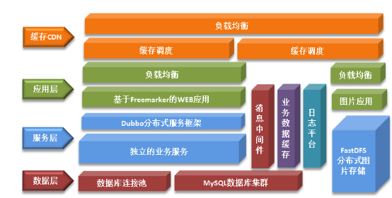
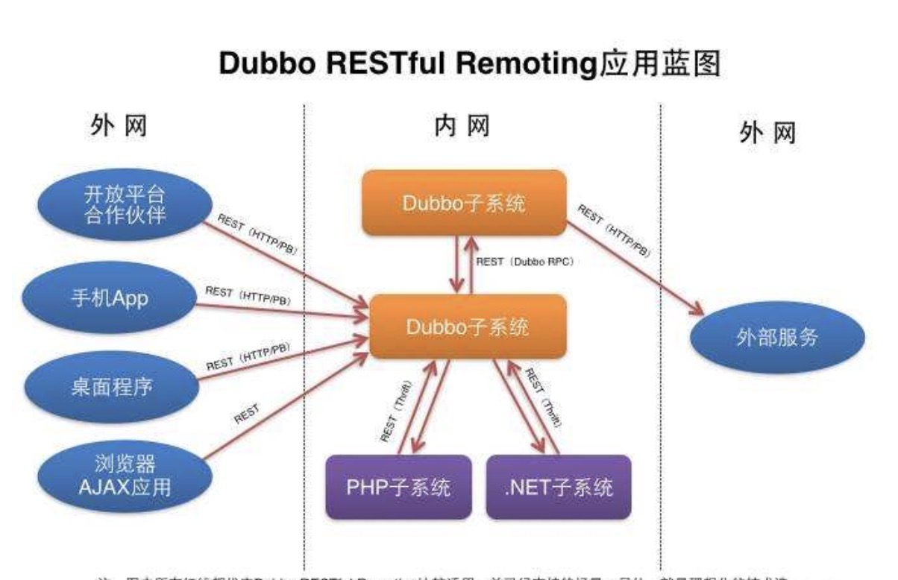
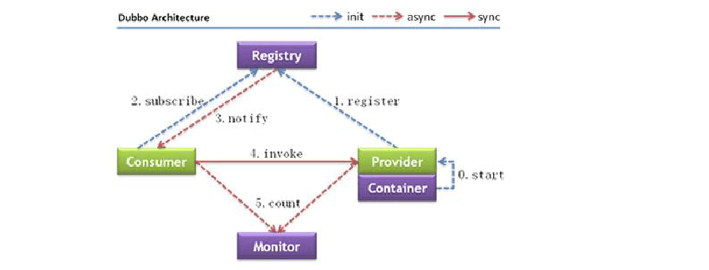
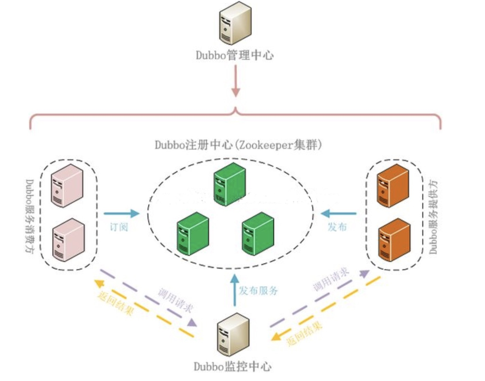

### Dubbo

------

版本：

Dubbo 2.5.7

#### 第一节 Dubbo简介

1.1 程序框架演变

###### 1.1.1 单一应用框架(ORM) 

 

```
当网站流量很小时，只需一个应用，将所有功能如下单支付等都部署在一起，以减少部署节点和成本。

缺点：单一的系统架构，使得在开发过程中，占用的资源越来越多，而且随着流量的增加越来越难以维护 
```

###### 1.1.2 垂直应用框架(MVC) 

 

```
垂直应用架构解决了单一应用架构所面临的扩容问题，流量能够分散到各个子系统当中，且系统的体积可控，一定程度上降低了开发人员之间协同以及维护的成本，提升了开发效率。 

缺点：但是在垂直架构中相同逻辑代码需要不断的复制，不能复用。 
```

###### 1.1.3 分布式应用架构(RPC) 

 

```
当垂直应用越来越多，应用之间交互不可避免，将核心业务抽取出来，作为独立的服务，逐渐形成稳定的服务中心 
```

```
RPC(Remote Procedure Call Protocol)：远程过程调用： 
两台服务器A、B，分别部署不同的应用a,b。当A服务器想要调用B服务器上应用b提供的函数或方法的时候，由于不在一个内存空间，不能直接调用，需要通过网络来表达调用的语义传达调用的数据。 


RPC是一种通过网络从远程计算机程序上请求服务，而不需要了解底层网络技术的协议。RPC协议假定某些传输协议的存在，如TCP或UDP，为通信程序之间携带信息数据。在OSI网络通信模型中，RPC跨越了传输层和应用层。RPC使得开发包括网络分布式多程序在内的应用程序更加容易。 
RPC采用客户机/服务器模式。请求程序就是一个客户机，而服务提供程序就是一个服务器。首先，客户机调用进程发送一个有进程参数的调用信息到服务进程，然后等待应答信息。在服务器端，进程保持睡眠状态直到调用信息到达为止。当一个调用信息到达，服务器获得进程参数，计算结果，发送答复信息，然后等待下一个调用信息，最后，客户端调用进程接收答复信息，获得进程结果，然后调用执行继续进行。
```

###### 1.1.4 流动计算架构(SOA) 

```
随着服务化的进一步发展，服务越来越多，服务之间的调用和依赖关系也越来越复杂，诞生了面向服务的架构体系(SOA)，也因此衍生出了一系列相应的技术，如对服务提供、服务调用、连接处理、通信协议、序列化方式、服务发现、服务路由、日志输出等行为进行封装的服务框架
```


###### 1.1.5 项目的演变过程

 
单一应用架构

```
当网站流量很小时，只需一个应用，将所有功能都部署在一起，以减少部署节点和成本。
此时，用于简化增删改查工作量的 数据访问框架(ORM) 是关键。
```

垂直应用架构

```
当访问量逐渐增大，单一应用增加机器带来的加速度越来越小，将应用拆成互不相干的几个应用，以提升效率。
此时，用于加速前端页面开发的 Web框架(MVC) 是关键。
```

分布式服务架构 

```
当垂直应用越来越多，应用之间交互不可避免，将核心业务抽取出来，作为独立的服务，逐渐形成稳定的服务中心，使前端应用能更快速的响应多变的市场需求。
此时，用于提高业务复用及整合的 分布式服务框架(RPC) 是关键。
```

流动计算架构 

```
当服务越来越多，容量的评估，小服务资源的浪费等问题逐渐显现，此时需增加一个调度中心基于访问压力实时管理集群容量，提高集群利用率。
此时，用于提高机器利用率的 资源调度和治理中心(SOA) 是关键
```

1.5 Dubbo实现分布式架构



##### 1.2 Dubbo是什么

```
Dubbo是Alibaba开源的分布式服务框架，它最大的特点是按照分层的方式来架构，使用这种方式可以使各个层之间解耦合（或者最大限度地松耦合）。从服务模型的角度来看，Dubbo采用的是一种非常简单的模型，要么是提供方提供服务，要么是消费方消费服务，所以基于这一点可以抽象出服务提供方（Provider）和服务消费方（Consumer）两个角色。

	Dubbo是一个被国内很多互联网公司广泛使用的开元分布式服务框架，即使从国际视野来看也是一个非常全面的SOA基础框架。作为一个重要的技术可以，当当网根据自身的需求，为Dubbo实现了一些新的功能，并将其命名为Dubbox（即Dubbo eXtensions）。
```



##### 1.3 Dubbo做什么

```
1.透明化的远程方法调用，就像调用本地方法一样调用远程方法，只需简单配置，没有任何API侵入。      
2.软负载均衡及容错机制，可在内网替代F5等硬件负载均衡器，降低成本，减少单点。
3. 服务自动注册与发现，不再需要写死服务提供方地址，注册中心基于接口名查询服务提供者的IP地址，并且能够平滑添加或删除服务提供者。
4. Dubbo采用全Spring配置方式，透明化接入应用，对应用没有任何API侵入，只需用Spring加载Dubbo的配置即可，Dubbo基于Spring的Schema扩展进行加载。 
```

##### 1.4 Dubbo原理



名词解释：

```
Provider： 暴露服务的提供方。
Consumer：调用远程服务的服务消费方。
Registry： 服务注册中心和发现中心。
Monitor： 统计服务和调用次数，调用时间监控中心。（dubbo管控中心的控制台页面中可以显示）
Container：服务运行的容器。
```

调用关系：

```
0、服务器负责启动，加载，运行提供者（例如在tomcat容器中，启动dubbo服务端）。
1、提供者在启动时，向注册中心注册自己提供的服务。
2、消费者启动时，向注册中心订阅自己所需的服务。
3、注册中心返回提供者地址列表给消费者，如果有变更，注册中心将基于长连接推送变更数据给消费者。
4、消费者，从远程接口列表中，调用远程接口，dubbo会基于负载均衡算法，选一台提供者进行调用，如果调用失败则选择另一台。
5、消费者和提供者，在内存中累计调用次数和调用时间，定时每分钟发送一次统计数据到监控中心。（可以在dubbo管控中心的可视化界面看到）
```

##### 1.5 Dubbo分布式集群模型



Dubbo服务默认的就是一个Cluster模式。

#### 第二节 Dubbo管控台安装

##### 2.1 概述

```
Dubbo管理控制台的主要作用:服务治理
管理控制台主要包含:
	路由规则
	动态配置
	服务降级
	访问控制
	权重调整	
	负载均衡等管理功能
```

```
Dubbo 管控台可以对注册到 zookeeper 注册中心的服务或服务消费者进行管理，但管控台是否正常对 Dubbo 服务没有影响，管控台也不需要高可用，因此可以单节点部署
```

##### 2.2 部署


```
将从Github上下载的Dubbo项目，解压找到对应的dubbo-admin，然后使用Maven重新打包，可以直接从公司的svn上直接下载

将war项目上传到服务器，可以将其存放到Tomcat的webapps目录下

启动Tomcat，可以自动将刚刚的war文件解压。

关闭Tomcat,查看dubbo-admin的配置文件默认的Zookeeper地址是否一致，如果不一致就修改，一致就直接运行Zookeeper然后再运行Tomcat

```

 

 

 


##### 2.2 访问

```
浏览器输入：
http://10.211.55.12:8080/dubbo-admin-2.8.4/
需要输入账号和密码，默认的账号和密码都是root
```

 

 

```
在这里就可以查询发布的服务
```


#### 第三节 Dubbo的使用

##### 3.1 发布方

Maven+Idea

###### 3.1.1 配置文件

pom.xml

```xml
<?xml version="1.0" encoding="UTF-8"?>
<project xmlns="http://maven.apache.org/POM/4.0.0"
         xmlns:xsi="http://www.w3.org/2001/XMLSchema-instance"
         xsi:schemaLocation="http://maven.apache.org/POM/4.0.0 http://maven.apache.org/xsd/maven-4.0.0.xsd">
    <modelVersion>4.0.0</modelVersion>

    <groupId>xph</groupId>
    <artifactId>My_DubboProvider</artifactId>
    <version>1.0-SNAPSHOT</version>


    <properties>
        <springframework.version>4.3.11.RELEASE</springframework.version>
    </properties>

    <dependencies>

        <dependency>
            <groupId>com.alibaba</groupId>
            <artifactId>dubbo</artifactId>
            <version>2.5.7</version>
        </dependency>

        <dependency>
            <groupId>org.springframework</groupId>
            <artifactId>spring-context</artifactId>
            <version>${springframework.version}</version>
        </dependency>
        <dependency>
            <groupId>org.springframework</groupId>
            <artifactId>spring-web</artifactId>
            <version>${springframework.version}</version>
        </dependency>
        <dependency>
            <groupId>log4j</groupId>
            <artifactId>log4j</artifactId>
            <version>1.2.17</version>
        </dependency>

        <dependency>
            <groupId>org.apache.zookeeper</groupId>
            <artifactId>zookeeper</artifactId>
            <version>3.4.6</version>
        </dependency>
        <dependency>
            <groupId>com.101tec</groupId>
            <artifactId>zkclient</artifactId>
            <version>0.3</version>
        </dependency>
    </dependencies>

</project>
```

log4j.properties

```properties
log4j.rootLogger=INFO, console, file

log4j.appender.console=org.apache.log4j.ConsoleAppender
log4j.appender.console.layout=org.apache.log4j.PatternLayout
log4j.appender.console.layout.ConversionPattern=%d %p [%c] - %m%n

log4j.appender.file=org.apache.log4j.DailyRollingFileAppender
#log4j.appender.file.File=D:/002_developer/workspace_001/zcmoni.log
log4j.appender.file.layout=org.apache.log4j.PatternLayout
log4j.appender.file.layout.ConversionPattern=%d %p [%c] - %m%n

log4j.logger.org.springframework=WARN
```

spring-dubboprovider.xml

```xml
<?xml version="1.0" encoding="UTF-8"?>
<beans xmlns="http://www.springframework.org/schema/beans"
       xmlns:xsi="http://www.w3.org/2001/XMLSchema-instance"
       xmlns:dubbo="http://code.alibabatech.com/schema/dubbo"
       xsi:schemaLocation="
       http://www.springframework.org/schema/beans
       http://www.springframework.org/schema/beans/spring-beans.xsd
       http://code.alibabatech.com/schema/dubbo
       http://code.alibabatech.com/schema/dubbo/dubbo.xsd">


    <!-- 具体的实现bean -->
    <bean id="hello" class="com.qf.dubbo.HelloServiceImple" />
    <!-- 使用zookeeper注册中心暴露服务地址 -->
    <dubbo:registry address="zookeeper://10.211.55.12:2181" />

    <!-- 用dubbo协议在20880端口暴露服务 -->
    <dubbo:protocol name="dubbo" port="20880" />

    <!-- 提供方应用信息，用于计算依赖关系 -->
    <dubbo:application name="hello-provider" />

    <!-- 声明需要暴露的服务接口  写操作可以设置retries=0 避免重复调用SOA服务 -->
    <dubbo:service retries="0" interface="com.qf.dubbo.HelloService" ref="hello" />

</beans>
```

###### 3.1.2 代码

User

```java
public class User {
    private Long id;
    private String name;
    private String sex;
    private int age;
    public Long getId() {
        return id;
    }
    public String getName() {
        return name;
    }
    public String getSex() {
        return sex;
    }
    public int getAge() {
        return age;
    }
    public void setId(Long id) {
        this.id = id;
    }
    public void setName(String name) {
        this.name = name;
    }
    public void setSex(String sex) {
        this.sex = sex;
    }
    public void setAge(int age) {
        this.age = age;
    }
    public User(Long id, String name, String sex, int age) {
        this.id = id;
        this.name = name;
        this.sex = sex;
        this.age = age;
    }
    public User() {
    }
}
```

HelloService

```java
public interface HelloService {
    String sayHello(String name);
    List<User> getUsers();
}
```

HelloServiceImple

```java
public class HelloServiceImple implements HelloService {
    public String sayHello(String name) {
        return name+",快来千锋学java";
    }
    public List<User> getUsers() {
        Random random=new Random();
        List<User> users=new ArrayList<User>();
        int count=random.nextInt(100);
        for(int i=1;i<=count;i++){
            users.add(new User((long)i,"java"+i,(random.nextBoolean()?"男":"女"),random.nextInt(30)+10));

        }
        return users;
    }
}
```

Provider_Main

```java
public class Provider_Main {
    public static void main(String[] args) throws IOException {
        ClassPathXmlApplicationContext context = new ClassPathXmlApplicationContext(
               "spring-dubboprovider.xml");
        context.start();//启动
        System.in.read(); // 为保证服务一直开着，利用输入流的阻塞来模拟
    }
}
```

###### 3.1.3 查看


 

 

##### 3.2 消费方

Maven+Idea

###### 3.2.1 配置文件

pom.xml

跟生产者的pom一样

```Xml
<?xml version="1.0" encoding="UTF-8"?>
<project xmlns="http://maven.apache.org/POM/4.0.0"
         xmlns:xsi="http://www.w3.org/2001/XMLSchema-instance"
         xsi:schemaLocation="http://maven.apache.org/POM/4.0.0 http://maven.apache.org/xsd/maven-4.0.0.xsd">
    <modelVersion>4.0.0</modelVersion>

    <groupId>xph</groupId>
    <artifactId>My_DubboConsumer</artifactId>
    <version>1.0</version>

    <properties>
        <springframework.version>4.3.11.RELEASE</springframework.version>
    </properties>

    <dependencies>

        <dependency>
            <groupId>com.alibaba</groupId>
            <artifactId>dubbo</artifactId>
            <version>2.5.7</version>
        </dependency>

        <dependency>
            <groupId>org.springframework</groupId>
            <artifactId>spring-context</artifactId>
            <version>${springframework.version}</version>
        </dependency>
        <dependency>
            <groupId>org.springframework</groupId>
            <artifactId>spring-web</artifactId>
            <version>${springframework.version}</version>
        </dependency>
        <dependency>
            <groupId>log4j</groupId>
            <artifactId>log4j</artifactId>
            <version>1.2.17</version>
        </dependency>

        <dependency>
            <groupId>org.apache.zookeeper</groupId>
            <artifactId>zookeeper</artifactId>
            <version>3.4.6</version>
        </dependency>
        <dependency>
            <groupId>com.101tec</groupId>
            <artifactId>zkclient</artifactId>
            <version>0.3</version>
        </dependency>
    </dependencies>
</project>
```

log4j.properties

```properties
log4j.rootLogger=INFO, console, file

log4j.appender.console=org.apache.log4j.ConsoleAppender
log4j.appender.console.layout=org.apache.log4j.PatternLayout
log4j.appender.console.layout.ConversionPattern=%d %p [%c] - %m%n

log4j.appender.file=org.apache.log4j.DailyRollingFileAppender
#log4j.appender.file.File=D:/002_developer/workspace_001/zcmoni.log
log4j.appender.file.layout=org.apache.log4j.PatternLayout
log4j.appender.file.layout.ConversionPattern=%d %p [%c] - %m%n

log4j.logger.org.springframework=WARN
```

spring-dubboconsumer.xml

```Xml
<?xml version="1.0" encoding="UTF-8"?>
<beans xmlns="http://www.springframework.org/schema/beans"
       xmlns:xsi="http://www.w3.org/2001/XMLSchema-instance"
       xmlns:dubbo="http://code.alibabatech.com/schema/dubbo"
       xsi:schemaLocation="
       http://www.springframework.org/schema/beans
       http://www.springframework.org/schema/beans/spring-beans.xsd
       http://code.alibabatech.com/schema/dubbo
       http://code.alibabatech.com/schema/dubbo/dubbo.xsd">
    <!-- 消费方应用名，用于计算依赖关系，不是匹配条件，不要与提供方一样 -->
    <dubbo:application name="hello-consumer" />
    <!--<dubbo:registry address="zookeeper://10.0.31.143:2181?backup=10.0.31.144:2181,10.0.31.145:2181" />-->
    <dubbo:registry address="zookeeper://10.211.55.12:2181"/>
    <!-- 生成远程服务代理，可以像使用本地bean一样使用helloService 检查级联依赖关系 默认为true 当有依赖服务的时候，需要根据需求进行设置
    id 随意取名
    interface 必须要和服务提供方的接口路径一致-->
    <dubbo:reference id="helloService" check="false"
                     interface="com.qf.dubbo.HelloService" />
</beans>
```

###### 3.2.2 代码

注意User类和HelloService接口所在包必须和生产者的一致

User

User类需要实现序列化接口Serializable

```java
public class User implements Serializable{
    private Long id;
    private String name;
    private String sex;
    private int age;
    public Long getId() {
        return id;
    }
    public String getName() {
        return name;
    }
    public String getSex() {
        return sex;
    }
    public int getAge() {
        return age;
    }
    public void setId(Long id) {
        this.id = id;
    }
    public void setName(String name) {
        this.name = name;
    }
    public void setSex(String sex) {
        this.sex = sex;
    }
    public void setAge(int age) {
        this.age = age;
    }
    public User(Long id, String name, String sex, int age) {
        this.id = id;
        this.name = name;
        this.sex = sex;
        this.age = age;
    }
    public User() {
    }
   @Override
    public String toString() {
        return "User{" +
                "id=" + id +
                ", name='" + name + '\'' +
                ", sex='" + sex + '\'' +
                ", age=" + age +
                '}';
    }
}
```

HelloService

```java
public interface HelloService {
    String sayHello(String name);
    List<User> getUsers();
}
```

Consumer_Main

```java

public class Consumer_Main {
    public static void main(String[] args) {
        ClassPathXmlApplicationContext context = new ClassPathXmlApplicationContext(
                "spring-dubboconsumer.xml");
        context.start();

        HelloService sampleService = (HelloService) context.getBean("helloService");
        String hello = sampleService.sayHello("tom");
        System.err.println("字符串："+hello);

        List<User> list = sampleService.getUsers();
        System.err.println("集合："+list);
       System.in.read(); // 为保证消费方一直开着，利用输入流的阻塞来模拟
    }
}

```

###### 3.2.3 访问

 

 

 

