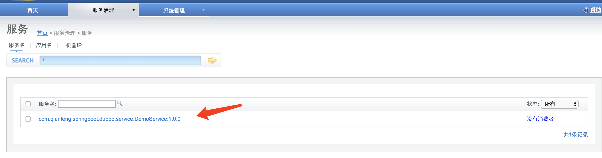
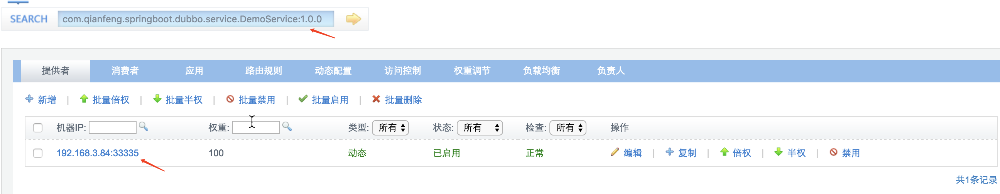
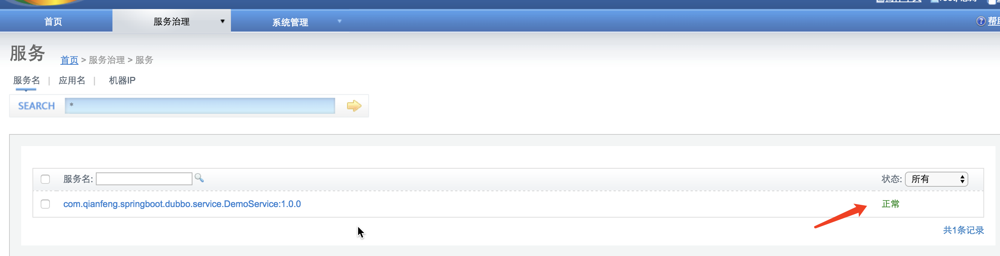
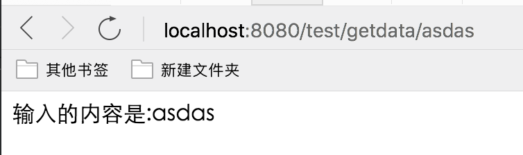

# 一 SpringBoot 1.x 整合 dubbo 配置文件模式

> 此内容比较早了,包括依赖版本,推荐使用下面的注解方式

> Springboot 整合 dubbo 和以前的流程是一致,不过是没有了 xml 配置文件,改为了 springboot 的配置文件
>
> 大约流程:
>
> 1. 导入依赖
> 2. 编写中间接口
> 3. 编写提供者
> 4. 编写消费者
> 5. 测试

> 本案例是简单的入门配置,使用的是 IDEA 软件,采用的是一个 project 内部多个 module 的方式, 所有的依赖添加在了 project 的 pom 文件中,请注意

## 1 Project 的 POM 文件

```xml
<project xmlns="http://maven.apache.org/POM/4.0.0" xmlns:xsi="http://www.w3.org/2001/XMLSchema-instance"
  xsi:schemaLocation="http://maven.apache.org/POM/4.0.0 http://maven.apache.org/xsd/maven-4.0.0.xsd">
  <modelVersion>4.0.0</modelVersion>

  <groupId>com.qianfeng</groupId>
  <artifactId>springboot-dubbo</artifactId>
  <version>1.0-SNAPSHOT</version>
    <!--声明为 springboot 项目-->
  <parent>
    <groupId>org.springframework.boot</groupId>
    <artifactId>spring-boot-starter-parent</artifactId>
    <version>1.5.9.RELEASE</version>
  </parent>
  <modules>
    <module>springdubboprovider</module>
    <module>springdubbointerface</module>
    <module>springdubboconsumer</module>
  </modules>
  <packaging>pom</packaging>

  <name>springboot-dubbo</name>
  <url>http://maven.apache.org</url>

  <properties>
    <project.build.sourceEncoding>UTF-8</project.build.sourceEncoding>
  </properties>

  <dependencies>
    <dependency>
      <groupId>junit</groupId>
      <artifactId>junit</artifactId>
      <version>3.8.1</version>
      <scope>test</scope>
    </dependency>
      <!--web 依赖-->
    <dependency>
      <groupId>org.springframework.boot</groupId>
      <artifactId>spring-boot-starter-web</artifactId>
    </dependency>
      <!--dubbo 需要的健康兼容依赖-->
    <dependency>
      <groupId>org.springframework.boot</groupId>
      <artifactId>spring-boot-starter-actuator</artifactId>
    </dependency>
      <!--dubbo 需要的快速启动依赖,如果无法下载,请配置下面的仓库-->
    <dependency>
      <groupId>com.alibaba.boot</groupId>
      <artifactId>dubbo-spring-boot-starter</artifactId>
      <version>1.0.0-SNAPSHOT</version>
    </dependency>
      <!--springboot 需要的依赖-->
    <dependency>
      <groupId>ch.qos.logback</groupId>
      <artifactId>logback-classic</artifactId>
    </dependency>
    <dependency>
      <groupId>ch.qos.logback</groupId>
      <artifactId>logback-core</artifactId>
    </dependency>
    <!--zookeeper 客户端 -->
    <dependency>
      <groupId>com.101tec</groupId>
      <artifactId>zkclient</artifactId>
      <version>0.10</version>
    </dependency>

  </dependencies>
  <!--如果上面的依赖包无法下载,添加一下仓库地址-->
  <repositories>
    <repository>
      <id>sonatype-nexus-snapshots</id>
      <url>https://oss.sonatype.org/content/repositories/snapshots</url>
      <releases>
        <enabled>false</enabled>
      </releases>
      <snapshots>
        <enabled>true</enabled>
      </snapshots>
    </repository>
  </repositories>
</project>

```

## 2 中间接口 DemoService

> 主要是用于提供者和接收者依赖用,在一个独立的 module 中,此module属于 project 的子项目

```java

/**
 * Created by jackiechan on 2018/2/8/下午7:16
 * 提供者的统一接口
 */
public interface DemoService {
    /**
     * 测试方法,没有实际意义
     * @param name
     * @return
     */
    String getData(String name);
}
```

## 3 安装 service 到仓库

> 需要首先安装 project 才可以,因为要安装此 module 需要先安装父,所以最好先安装父,在安装当前 module

## 4 Provider提供者

> 用于提供具体的服务,内部中的类实现了上面的接口

### 4.1 pom.xml

> 只需要添加 service 的依赖即可

```xml
 <!--注意此依赖是上面的 service 对应的内容,实际开发请填写自己的具体的依赖-->
		<dependency>
            <groupId>com.qianfeng</groupId>
            <artifactId>spring-dubbo-interface</artifactId>
            <version>1.0-SNAPSHOT</version>
        </dependency>
```


###4.2 application.properties

> 此文件用于配置 springboot, 在 resources 目录中,内部其实配置的就是原先 xml 相关内容

```properties
# Spring boot application
spring.application.name = dubbo-provider-demo
server.port = 9090
management.port = 9091

#扫描 dubbo 的 service 注解
# Base packages to scan Dubbo Components (e.g @Service , @Reference)
dubbo.scan.basePackages  = com.qianfeng.springboot.service.impl


# Dubbo Config properties
## ApplicationConfig Bean
#在监控平台显示的程序的名字
dubbo.application.id = dubbo-provider
dubbo.application.name = dubbo-provider
#dubbo.application.qos.port=22222
#dubbo.application.qos.enable=true
#spring.dubbo.application.name 应用名称
#spring.dubbo.protocol.name 协议名称
#spring.dubbo.protocol.port 协议端口
#spring.dubbo.scan dubbo 服务类包目录
## ProtocolConfig Bean
# 相当于<dubbo:protocol  name="dubbo" port="33335"></dubbo:protocol>
dubbo.protocol.id = dubbo
dubbo.protocol.name = dubbo
dubbo.protocol.port = 33335
dubbo.protocol.status = server

## RegistryConfig Bean
#spring.dubbo.registry.address 注册中心地址
#<dubbo:registry address="47.95.244.39" port="2181" protocol="zookeeper"></dubbo:registry>
dubbo.registry.id = my-registry
dubbo.registry.address =zookeeper://192.168.3.212:2181

# Dubbo Endpoint (default status is disable)
endpoints.dubbo.enabled = true

# Dubbo Health
## StatusChecker Name defaults (default : "memory", "load" )
management.health.dubbo.status.defaults = memory
## StatusChecker Name extras (default : empty )
management.health.dubbo.status.extras = load,threadpool
```

### 4.2 service 实现类 DemoServiceImpl

> 内部对业务做了具体实现,用于被调用

```java
/**
 * Created by jackiechan on 2018/2/8/下午7:23
 */
@Service(//注意注解是 dubbo 的注解,不是 spring 的
        version = "1.0.0",
        application = "${dubbo.application.id}",//程序的 id
        protocol = "${dubbo.protocol.id}",// 协议的 id
        registry = "${dubbo.registry.id}"// 注册中心的 id
)
public class DemoServiceImpl implements DemoService {
    @Override
    public String getData(String name) {
        return "输入的内容是:" + name;
    }
}
```

### 4.3 SpringBoot 启动类StarProvider

```java
/**
 * Created by jackiechan on 2018/2/8/下午7:24
 */
@SpringBootApplication
public class StarProvider {
    public static void main(String[] args) {
        SpringApplication.run(StarProvider.class, args);
    }
}
```


### 4.4 启动提供者,测试

> 可以在 dubbo 的监控平台查看信息






## 5 Consumer消费者

### 5.1 pom文件

```xml
 <!--注意此依赖是上面的 service 对应的内容,实际开发请填写自己的具体的依赖-->
		<dependency>
            <groupId>com.qianfeng</groupId>
            <artifactId>spring-dubbo-interface</artifactId>
            <version>1.0-SNAPSHOT</version>
        </dependency>
```

### 5.2 application.properties

> springboot 的配置文件,用于配置消费者相关信息,内部其实配置的就是原先 xml 相关内容

```properties
spring.application.name = dubbo-consumer-demo
server.port = 8080
management.port = 8081


# Dubbo Config properties
## ApplicationConfig Bean
dubbo.application.id = dubbo-consumer-demo
dubbo.application.name = dubbo-consumer-demo

## Legacy QOS Config
#dubbo.qos.port = 22223

## ProtocolConfig Bean
dubbo.protocol.id = dubbo
dubbo.protocol.name = dubbo
dubbo.protocol.port = 12345
# Dubbo Endpoint (default status is disable)
#endpoints.dubbo.enabled = true
#相当于<dubbo:registry address="47.95.244.39" port="2181" protocol="zookeeper"></dubbo:registry>
dubbo.registry.id = my-registry
dubbo.registry.address =zookeeper://192.168.3.212:2181
# Dubbo Health
## StatusChecker Name defaults (default : "memory", "load" )
#management.health.dubbo.status.defaults = memory
```

### 5.3 controller

```java

/**
 * Created by jackiechan on 2018/2/8/下午7:53
 */
@RestController
@RequestMapping("/test")
public class DemoController {
    @Reference(
            version = "1.0.0",
            application = "${dubbo.application.id}"


    )
    private DemoService demoService;
    @RequestMapping("/getdata/{name}")
    public String testData(@PathVariable("name") String name) {
        return demoService.getData(name);
    }
}
```

### 5.4 Springboot 启动类

```java
/**
 * Created by jackiechan on 2018/2/8/下午8:53
 */
@SpringBootApplication(scanBasePackages = {"com.qianfeng.controller"})
public class App 
{
    public static void main( String[] args )
    {
        SpringApplication.run(App.class, args);
    }
}
```

### 5.5 启动消费者测试






# 二 Springboot 1.x整合dubbo 2.6x 注解方式


## 1. POM文件

```xml
<?xml version="1.0" encoding="UTF-8"?>
<project xmlns="http://maven.apache.org/POM/4.0.0"
         xmlns:xsi="http://www.w3.org/2001/XMLSchema-instance"
         xsi:schemaLocation="http://maven.apache.org/POM/4.0.0 http://maven.apache.org/xsd/maven-4.0.0.xsd">
     <groupId>com.qianfeng</groupId>
    <artifactId>userserviceimpl</artifactId>
    <version>1.0</version>

    <modelVersion>4.0.0</modelVersion>
    <parent>
        <groupId>org.springframework.boot</groupId>
        <artifactId>spring-boot-starter-parent</artifactId>
        <version>1.5.10.RELEASE</version>
        <relativePath/> <!-- lookup parent from repository -->
    </parent>

    <artifactId>userserviceimpl</artifactId>

        <dependencies>
            <dependency>
                <groupId>com.qianfeng</groupId>
                <artifactId>userseviceinterface</artifactId>
                <version>1.0</version>
            </dependency>
          <!--dubbo-->
            <dependency>
                <groupId>com.alibaba.boot</groupId>
                <artifactId>dubbo-spring-boot-starter</artifactId>
                <version>0.1.1</version>
            </dependency>
            <dependency>
                <groupId>org.springframework.boot</groupId>
                <artifactId>spring-boot-starter-web</artifactId>
            </dependency>
            <dependency>
                <groupId>com.qianfeng</groupId>
                <artifactId>userdao</artifactId>
                <version>1.0</version>
            </dependency>

            <dependency>
                <groupId>com.alibaba</groupId>
                <artifactId>druid-spring-boot-starter</artifactId>
                <version>1.1.10</version>
            </dependency>
            <dependency>
                <groupId>mysql</groupId>
                <artifactId>mysql-connector-java</artifactId>
            </dependency>
            <dependency>
                <groupId>com.github.pagehelper</groupId>
                <artifactId>pagehelper-spring-boot-starter</artifactId>
                <version>1.1.2</version>
            </dependency>
         
        </dependencies>
</project>

```


## 2. dubbo配置类

```java
import com.alibaba.dubbo.config.ApplicationConfig;
import com.alibaba.dubbo.config.ProtocolConfig;
import com.alibaba.dubbo.config.RegistryConfig;
import org.springframework.context.annotation.Bean;
import org.springframework.context.annotation.Configuration;

/**
 * Created by jackiechan on 9/6/18/1:05 AM
 *
 * @Author jackiechan
 */
@Configuration
public class UserServiceConfig {

    @Bean
    public ApplicationConfig applicationConfig() {
        ApplicationConfig applicationConfig = new ApplicationConfig();
        applicationConfig.setName("userservice");
        return applicationConfig;
    }
    @Bean
    public RegistryConfig registryConfig() {
        RegistryConfig registryConfig = new RegistryConfig();
//        registryConfig.setAddress("10.9.251.200:8091");
//        registryConfig.setProtocol("zookeeper");
        registryConfig.setAddress("zookeeper://10.9.251.200:8091");
        return registryConfig;
    }
    @Bean
    public ProtocolConfig protocolConfig() {
        ProtocolConfig protocolConfig = new ProtocolConfig();
        protocolConfig.setName("dubbo");
        protocolConfig.setPort(23456);
        return protocolConfig;
    }

}

```


## 3 service提供者实现类


```java
import com.alibaba.dubbo.config.annotation.Service;
import com.qianfeng.p2p.commons.bean.result.ResultBean;
import com.qianfeng.p2p.user.dao.UserMapper;
import com.qianfeng.p2p.user.pojo.User;
import com.qianfeng.p2p.user.service.UserService;
import org.springframework.beans.factory.annotation.Autowired;

import java.io.Serializable;
import java.util.Date;

/**
 * Created by jackiechan on 9/3/18/6:26 PM.
 */
//相当于<dubbo:service interface =com.qianfeng.p2p.user.service.UserService ref =""
//如果这个类实现自多个接口,想指定一个特定的接口类型发布,那么可以在注解内指定interfaceClass参数,不指定则代表默认实现的接口
@Service(interfaceClass = UserService.class)//dubbo的注解
public class UserServiceImpl implements UserService , Serializable {
    @Autowired
    private UserMapper userMapper;
    @Override
    public ResultBean register(User user) throws Exception {

        try {
            //补全数据
            //用户的注册日期
            //用户的密码  明文123  密文--->MD5,SHA1,SHA256---->不是加密--->属于理论不可逆操作 --->基于消息摘要算法算出来的一个校验值
            //加密算法  对称加密,非对称加密
            //对称加密
            //用户密码的盐
            //csdn

            //不成熟小建议,不要把鸡蛋都放到一个篮子,不要把你所有网站的账号和密码弄成一样的
            //命名规律
            //账号 wzhangsanx wfsdfsddx
        user.setCreateAt(new Date());
        //获取原始密码
            //定义盐值和次数
            //生成md5
           // String s = DigestUtils.md5DigestAsHex("123".getBytes());
        // user.setPassword();
       // user.setPasswordSalt();//混淆的
        userMapper.insertUser(user);
        return ResultBean.setOk(null);

        }catch (Exception e){
           e.printStackTrace();
        }
        return ResultBean.setError(null);
    }

}

```


## 4启动类

```java
@SpringBootApplication
//@DubboComponentScan(basePackages = {"com.qianfeng.p2p.user.service.impl"})
// 如果不在里面添加包名字,默认会扫描本类所在的包以及子包下面的内容
@DubboComponentScan
//@DubboEnable //这个注解是自动配置,可以取代上面的扫包注解
@MapperScan(basePackages = {"com.qianfeng.p2p.user.dao"})//扫描mapper接口,一定要指定mapper具体所在的包,千万不要写一个大的包,因为它的标注只有一个就是只要是接口就创建代理对象
public class UserServiceStarter {


    public static void main(String[] args) {
        SpringApplication.run(UserServiceStarter.class, args);
    }
}
```


# 三 Springboot 2.x整合dubbo 2.6x 注解方式

> 主要列出来依赖包和配置文件,其他和之前一样

## 1. POM文件

```xml
<?xml version="1.0" encoding="UTF-8"?>
<project xmlns="http://maven.apache.org/POM/4.0.0"
         xmlns:xsi="http://www.w3.org/2001/XMLSchema-instance"
         xsi:schemaLocation="http://maven.apache.org/POM/4.0.0 http://maven.apache.org/xsd/maven-4.0.0.xsd">
  
   <groupId>com.qianfeng</groupId>
    <artifactId>p2puserservicet</artifactId>
    <version>1.0</version>

   <parent>
        <groupId>org.springframework.boot</groupId>
       <artifactId>spring-boot-starter-parent</artifactId>
        <version>2.0.6.RELEASE</version>
    </parent>

    <modelVersion>4.0.0</modelVersion>

    <artifactId>userserviceimpl</artifactId>

        <dependencies>
          <!--这个是我们的接口的依赖包,此处替换为自己的即可-->
            <dependency>
                <groupId>com.qianfeng</groupId>
                <artifactId>userserviceinterface</artifactId>
                <version>1.0</version>
            </dependency>
            <!--dubbo starter依赖包-->
            <dependency>
                <groupId>com.alibaba.boot</groupId>
                <artifactId>dubbo-spring-boot-starter</artifactId>
                <version>0.2.0</version>
            </dependency>
            <dependency>
                <groupId>org.springframework.boot</groupId>
                <artifactId>spring-boot-starter-web</artifactId>
            </dependency>
            <dependency>
                <groupId>com.qianfeng</groupId>
                <artifactId>usermapper</artifactId>
                <version>1.0</version>
            </dependency>
            <dependency>
                <groupId>com.alibaba</groupId>
                <artifactId>druid-spring-boot-starter</artifactId>
                <version>1.1.10</version>
            </dependency>
            <dependency>
                <groupId>mysql</groupId>
                <artifactId>mysql-connector-java</artifactId>
                <scope>runtime</scope>
            </dependency>
        </dependencies>
</project>

```


## 2 dubbo 配置类

```java
import com.alibaba.dubbo.config.ApplicationConfig;
import com.alibaba.dubbo.config.ProtocolConfig;
import com.alibaba.dubbo.config.RegistryConfig;
import org.springframework.context.annotation.Bean;
import org.springframework.context.annotation.Configuration;

/**
 * Created by jackiechan on 18-12-21/下午5:21
 *
 * @Author jackiechan
 */
@Configuration
public class UserServiceConfig {
    //程序别名
    @Bean
    public ApplicationConfig applicationConfig() {
        ApplicationConfig applicationConfig = new ApplicationConfig();
        applicationConfig.setName("user-service");
        return applicationConfig;
    }

    //注册中心
    @Bean
    public RegistryConfig registryConfig() {
        RegistryConfig registryConfig = new RegistryConfig();
        //假设注册中心是zookeeper 地址是192.168.1.10:2181  方式1:zookeeper://192.168.1.10:2181
        //方式二 协议: zookeeper  地址:192.168.1.10:2181
        // registryConfig.setAddress("192.168.1.10:2181");
        ///registryConfig.setProtocol("zookeeper");
        registryConfig.setProtocol("zookeeper");//设置注册中心的协议类型
        registryConfig.setAddress("qianfeng1.qfjava.cn:8601,qianfeng1.qfjava.cn:8602,qianfeng1.qfjava.cn:8603");
        return registryConfig;
    }
    //协议和端口
    @Bean
    public ProtocolConfig protocolConfig() {
        ProtocolConfig protocolConfig = new ProtocolConfig();
        protocolConfig.setName("dubbo");
        protocolConfig.setPort(12345);
        return protocolConfig;
    }

    //指定发布的服务,通过扫描dubbo的注解就可以实现
}

```

## 3 service 提供者实现类

```java
import com.alibaba.dubbo.config.annotation.Service;
import com.qianfeng.p2p.user.mapper.UserMapper;
import com.qianfeng.p2p.user.pojo.User;
import com.qianfeng.p2p.user.service.UserService;
import org.springframework.beans.factory.annotation.Autowired;

/**
 * Created by jackiechan on 18-12-21/下午5:20
 *
 * @Author jackiechan
 */
@Service //此处需要注意使用的是dubbo的注解
public class UserServiceImpl implements UserService {
    @Autowired
    private UserMapper userMapper;

    @Override
    public void addUser(User user) throws Exception {
        System.out.println("执行了");
        //插入数据库
        userMapper.addUser(user);
    }
}

```

## 4 启动类

```java

import com.alibaba.dubbo.config.spring.context.annotation.DubboComponentScan;
import org.mybatis.spring.annotation.MapperScan;
import org.springframework.boot.SpringApplication;
import org.springframework.boot.autoconfigure.SpringBootApplication;
import com.alibaba.dubbo.config.spring.context.annotation.EnableDubbo;
/**
 * Created by jackiechan on 18-12-21/下午5:28
 *
 * @Author jackiechan
 */
@SpringBootApplication
//@DubboComponentScan //扫描带有dubbo注解的包,可以在里面指定包
@EnableDubbo 使用这个注解会自动扫码带有dubbo的注解,可以用来取代上面的包扫描
@MapperScan("com.qianfeng.p2p.user.mapper")
public class UserServiceStarterApp {
    public static void main(String[] args) {
        SpringApplication.run(UserServiceStarterApp.class, args);
    }
}

```


# 四 Springboot 2.x整合dubbo2.7x 注解方式


## 1. pom文件

```xml
<?xml version="1.0" encoding="UTF-8"?>
<project xmlns="http://maven.apache.org/POM/4.0.0"
         xmlns:xsi="http://www.w3.org/2001/XMLSchema-instance"
         xsi:schemaLocation="http://maven.apache.org/POM/4.0.0 http://maven.apache.org/xsd/maven-4.0.0.xsd">
    <modelVersion>4.0.0</modelVersion>

    <groupId>com.qianfeng</groupId>
    <artifactId>user-module-service</artifactId>
    <version>1.0</version>
    <parent>
        <groupId>org.springframework.boot</groupId>
        <artifactId>spring-boot-starter-parent</artifactId>
        <version>2.0.6.RELEASE</version>
    </parent>
    <dependencies>

        <dependency>
            <groupId>org.apache.dubbo</groupId>
            <artifactId>dubbo-spring-boot-starter</artifactId>
            <version>2.7.1</version>
        </dependency>
        <dependency>
            <groupId>org.apache.dubbo</groupId>
            <artifactId>dubbo</artifactId>
            <version>2.7.1</version>
        </dependency>
        <dependency>
            <groupId>org.springframework.boot</groupId>
            <artifactId>spring-boot-starter-web</artifactId>
        </dependency>
        <dependency>
            <groupId>com.qianfeng</groupId>
            <artifactId>user-module-api</artifactId>
            <version>1.0</version>
        </dependency>
<!--
因为服务器是3.4.13版本的zookeeper,所以必须使用2.x的curator 否则会报错,具体错误参考下面的bug介绍
-->
        <dependency>
            <groupId>org.apache.curator</groupId>
            <artifactId>curator-recipes</artifactId>
            <version>2.13.0</version>
            <exclusions>
<!--
因为2.13的curator默认使用的是3.4.8版本的zookeeper,所以手动排除后添加3.4.13版本的zookeeper
-->
                <exclusion>
                    <groupId>org.apache.zookeeper</groupId>
                    <artifactId>zookeeper</artifactId>
                </exclusion>

            </exclusions>
        </dependency>

        <dependency>
            <groupId>org.apache.zookeeper</groupId>
            <artifactId>zookeeper</artifactId>
            <version>3.4.13</version>
        </dependency>
    </dependencies>

</project>

```

## 2 dubbo配置类

> 此处把配置和启动程序写一起了

```java
import org.apache.dubbo.config.ApplicationConfig;
import org.apache.dubbo.config.MetadataReportConfig;
import org.apache.dubbo.config.ProtocolConfig;
import org.apache.dubbo.config.RegistryConfig;
import org.apache.dubbo.config.spring.context.annotation.EnableDubbo;
import org.springframework.boot.SpringApplication;
import org.springframework.boot.autoconfigure.SpringBootApplication;
import org.springframework.context.annotation.Bean;

/**
 * Created by jackiechan on 2019-04-19/17:17
 *
 * @Author jackiechan
 */
@SpringBootApplication
@EnableDubbo//开启dubbo自动装配,自2.7开始包名变了,老的类过时了
public class UserServiceStartApp {
		//程序配置类,,自2.7开始包名变了,老的类过时了
    @Bean
    public ApplicationConfig applicationConfig() {
        ApplicationConfig applicationConfig = new ApplicationConfig("userservice");

        return applicationConfig;
    }
//注册中心配置,自2.7开始包名变了,老的类过时了
    @Bean
    public RegistryConfig registryConfig() {
        RegistryConfig registryConfig = new RegistryConfig();
        registryConfig.setAddress("zookeeper://zookeeper.qfjava.cn:8601?backup=zookeeper.qfjava.cn:8602,zookeeper.qfjava.cn:8603");
        return registryConfig;
    }
//协议配置,自2.7开始包名变了,老的类过时了
    @Bean
    public ProtocolConfig protocolConfig() {
        ProtocolConfig protocolConfig = new ProtocolConfig();
        protocolConfig.setName("dubbo");
        protocolConfig.setPort(12345);
        return protocolConfig;
    }

    /**
     * 2.7以后的dubbo可以添加元数据
     * @return
     */
    @Bean
    public MetadataReportConfig metadataReportConfig() {
        MetadataReportConfig metadataReportConfig = new MetadataReportConfig();
        metadataReportConfig.setAddress("zookeeper://zookeeper.qfjava.cn:8601?backup=zookeeper.qfjava.cn:8602,zookeeper.qfjava.cn:8603");
        return metadataReportConfig;
    }
    
    public static void main (String[] args){
        SpringApplication.run(UserServiceStartApp.class,args);
    }
}
```

## 3 service提供者实现类

```java
import com.qianfeng.user.pojo.UserInfo;
import com.qianfeng.user.service.IUserService;
import org.apache.dubbo.config.annotation.Service;

/**
 * Created by jackiechan on 2019-04-19/17:09
 *
 * @Author jackiechan
 */
@Service//注意注解是dubbo的,自2.7开始包名变了,老的类过时了
public class UserServiceImple implements IUserService {
    //@Autowired
  //  private UserMapper userMapper;

    @Override
    public UserInfo getUserInfoByOpenid(String openid) {
        return null;
       // return userMapper.getUserInfoByOpenId(openid);
    }
}
```

## 4 启动类

> 和配置类放一起了

# 五 问题BUG

> 如果出现以下类型bug

```java
java.lang.IllegalStateException: Failed to register dubbo://192.168.1.3:12345/com.qianfeng.user.service.IUserService?anyhost=true&application=userservice&bean.name=providers:dubbo:com.qianfeng.user.service.IUserService&default.deprecated=false&default.dynamic=false&default.register=true&deprecated=false&dubbo=2.0.2&dynamic=false&generic=false&interface=com.qianfeng.user.service.IUserService&methods=getUserInfoByOpenid&pid=89401&register=true&release=2.7.1&revision=1.0&side=provider&timestamp=1555813755321 to registry zookeeper.qfjava.cn:8601, cause: Failed to register dubbo://192.168.1.3:12345/com.qianfeng.user.service.IUserService?anyhost=true&application=userservice&bean.name=providers:dubbo:com.qianfeng.user.service.IUserService&default.deprecated=false&default.dynamic=false&default.register=true&deprecated=false&dubbo=2.0.2&dynamic=false&generic=false&interface=com.qianfeng.user.service.IUserService&methods=getUserInfoByOpenid&pid=89401&register=true&release=2.7.1&revision=1.0&side=provider&timestamp=1555813755321 to zookeeper zookeeper://zookeeper.qfjava.cn:8601/org.apache.dubbo.registry.RegistryService?application=userservice&backup=zookeeper.qfjava.cn:8602,zookeeper.qfjava.cn:8603&dubbo=2.0.2&interface=org.apache.dubbo.registry.RegistryService&pid=89401&release=2.7.1&timestamp=1555813755317, cause: KeeperErrorCode = Unimplemented for /dubbo/com.qianfeng.user.service.IUserService/providers/dubbo%3A%2F%2F192.168.1.3%3A12345%2Fcom.qianfeng.user.service.IUserService%3Fanyhost%3Dtrue%26application%3Duserservice%26bean.name%3Dproviders%3Adubbo%3Acom.qianfeng.user.service.IUserService%26default.deprecated%3Dfalse%26default.dynamic%3Dfalse%26default.register%3Dtrue%26deprecated%3Dfalse%26dubbo%3D2.0.2%26dynamic%3Dfalse%26generic%3Dfalse%26interface%3Dcom.qianfeng.user.service.IUserService%26methods%3DgetUserInfoByOpenid%26pid%3D89401%26register%3Dtrue%26release%3D2.7.1%26revision%3D1.0%26side%3Dprovider%26timestamp%3D1555813755321
	at org.apache.dubbo.registry.support.FailbackRegistry.register(FailbackRegistry.java:244) ~[dubbo-2.7.1.jar:2.7.1]
	at org.apache.dubbo.registry.integration.RegistryProtocol.register(RegistryProtocol.java:160) ~[dubbo-2.7.1.jar:2.7.1]
	at org.apache.dubbo.registry.integration.RegistryProtocol.export(RegistryProtocol.java:194) ~[dubbo-2.7.1.jar:2.7.1]
	at org.apache.dubbo.rpc.protocol.ProtocolListenerWrapper.export(ProtocolListenerWrapper.java:55) ~[dubbo-2.7.1.jar:2.7.1]
	at org.apache.dubbo.rpc.protocol.ProtocolFilterWrapper.export(ProtocolFilterWrapper.java:106) ~[dubbo-2.7.1.jar:2.7.1]
	at org.apache.dubbo.qos.protocol.QosProtocolWrapper.export(QosProtocolWrapper.java:61) ~[dubbo-2.7.1.jar:2.7.1]
	at org.apache.dubbo.rpc.Protocol$Adaptive.export(Protocol$Adaptive.java) ~[dubbo-2.7.1.jar:2.7.1]
	at org.apache.dubbo.config.ServiceConfig.doExportUrlsFor1Protocol(ServiceConfig.java:559) ~[dubbo-2.7.1.jar:2.7.1]
	at org.apache.dubbo.config.ServiceConfig.doExportUrls(ServiceConfig.java:417) ~[dubbo-2.7.1.jar:2.7.1]
	at org.apache.dubbo.config.ServiceConfig.doExport(ServiceConfig.java:375) ~[dubbo-2.7.1.jar:2.7.1]
	at org.apache.dubbo.config.ServiceConfig.export(ServiceConfig.java:337) ~[dubbo-2.7.1.jar:2.7.1]
	at org.apache.dubbo.config.spring.ServiceBean.export(ServiceBean.java:319) ~[dubbo-2.7.1.jar:2.7.1]
	at org.apache.dubbo.config.spring.ServiceBean.onApplicationEvent(ServiceBean.java:113) ~[dubbo-2.7.1.jar:2.7.1]
	at org.apache.dubbo.config.spring.ServiceBean.onApplicationEvent(ServiceBean.java:59) ~[dubbo-2.7.1.jar:2.7.1]
	at org.springframework.context.event.SimpleApplicationEventMulticaster.doInvokeListener(SimpleApplicationEventMulticaster.java:172) ~[spring-context-5.0.10.RELEASE.jar:5.0.10.RELEASE]
	at org.springframework.context.event.SimpleApplicationEventMulticaster.invokeListener(SimpleApplicationEventMulticaster.java:165) ~[spring-context-5.0.10.RELEASE.jar:5.0.10.RELEASE]
	at org.springframework.context.event.SimpleApplicationEventMulticaster.multicastEvent(SimpleApplicationEventMulticaster.java:139) ~[spring-context-5.0.10.RELEASE.jar:5.0.10.RELEASE]
	at org.springframework.context.support.AbstractApplicationContext.publishEvent(AbstractApplicationContext.java:400) ~[spring-context-5.0.10.RELEASE.jar:5.0.10.RELEASE]
	at org.springframework.context.support.AbstractApplicationContext.publishEvent(AbstractApplicationContext.java:354) ~[spring-context-5.0.10.RELEASE.jar:5.0.10.RELEASE]
	at org.springframework.context.support.AbstractApplicationContext.finishRefresh(AbstractApplicationContext.java:886) ~[spring-context-5.0.10.RELEASE.jar:5.0.10.RELEASE]
	at org.springframework.boot.web.servlet.context.ServletWebServerApplicationContext.finishRefresh(ServletWebServerApplicationContext.java:161) ~[spring-boot-2.0.6.RELEASE.jar:2.0.6.RELEASE]
	at org.springframework.context.support.AbstractApplicationContext.refresh(AbstractApplicationContext.java:551) ~[spring-context-5.0.10.RELEASE.jar:5.0.10.RELEASE]
	at org.springframework.boot.web.servlet.context.ServletWebServerApplicationContext.refresh(ServletWebServerApplicationContext.java:140) ~[spring-boot-2.0.6.RELEASE.jar:2.0.6.RELEASE]
	at org.springframework.boot.SpringApplication.refresh(SpringApplication.java:754) [spring-boot-2.0.6.RELEASE.jar:2.0.6.RELEASE]
	at org.springframework.boot.SpringApplication.refreshContext(SpringApplication.java:386) [spring-boot-2.0.6.RELEASE.jar:2.0.6.RELEASE]
	at org.springframework.boot.SpringApplication.run(SpringApplication.java:307) [spring-boot-2.0.6.RELEASE.jar:2.0.6.RELEASE]
	at org.springframework.boot.SpringApplication.run(SpringApplication.java:1242) [spring-boot-2.0.6.RELEASE.jar:2.0.6.RELEASE]
	at org.springframework.boot.SpringApplication.run(SpringApplication.java:1230) [spring-boot-2.0.6.RELEASE.jar:2.0.6.RELEASE]
	at com.qianfeng.user.service.impl.UserServiceStartApp.main(UserServiceStartApp.java:88) [classes/:na]
Caused by: org.apache.dubbo.rpc.RpcException: Failed to register dubbo://192.168.1.3:12345/com.qianfeng.user.service.IUserService?anyhost=true&application=userservice&bean.name=providers:dubbo:com.qianfeng.user.service.IUserService&default.deprecated=false&default.dynamic=false&default.register=true&deprecated=false&dubbo=2.0.2&dynamic=false&generic=false&interface=com.qianfeng.user.service.IUserService&methods=getUserInfoByOpenid&pid=89401&register=true&release=2.7.1&revision=1.0&side=provider&timestamp=1555813755321 to zookeeper zookeeper://zookeeper.qfjava.cn:8601/org.apache.dubbo.registry.RegistryService?application=userservice&backup=zookeeper.qfjava.cn:8602,zookeeper.qfjava.cn:8603&dubbo=2.0.2&interface=org.apache.dubbo.registry.RegistryService&pid=89401&release=2.7.1&timestamp=1555813755317, cause: KeeperErrorCode = Unimplemented for /dubbo/com.qianfeng.user.service.IUserService/providers/dubbo%3A%2F%2F192.168.1.3%3A12345%2Fcom.qianfeng.user.service.IUserService%3Fanyhost%3Dtrue%26application%3Duserservice%26bean.name%3Dproviders%3Adubbo%3Acom.qianfeng.user.service.IUserService%26default.deprecated%3Dfalse%26default.dynamic%3Dfalse%26default.register%3Dtrue%26deprecated%3Dfalse%26dubbo%3D2.0.2%26dynamic%3Dfalse%26generic%3Dfalse%26interface%3Dcom.qianfeng.user.service.IUserService%26methods%3DgetUserInfoByOpenid%26pid%3D89401%26register%3Dtrue%26release%3D2.7.1%26revision%3D1.0%26side%3Dprovider%26timestamp%3D1555813755321
	at org.apache.dubbo.registry.zookeeper.ZookeeperRegistry.doRegister(ZookeeperRegistry.java:103) ~[dubbo-2.7.1.jar:2.7.1]
	at org.apache.dubbo.registry.support.FailbackRegistry.register(FailbackRegistry.java:231) ~[dubbo-2.7.1.jar:2.7.1]
	... 28 common frames omitted
Caused by: java.lang.IllegalStateException: KeeperErrorCode = Unimplemented for /dubbo/com.qianfeng.user.service.IUserService/providers/dubbo%3A%2F%2F192.168.1.3%3A12345%2Fcom.qianfeng.user.service.IUserService%3Fanyhost%3Dtrue%26application%3Duserservice%26bean.name%3Dproviders%3Adubbo%3Acom.qianfeng.user.service.IUserService%26default.deprecated%3Dfalse%26default.dynamic%3Dfalse%26default.register%3Dtrue%26deprecated%3Dfalse%26dubbo%3D2.0.2%26dynamic%3Dfalse%26generic%3Dfalse%26interface%3Dcom.qianfeng.user.service.IUserService%26methods%3DgetUserInfoByOpenid%26pid%3D89401%26register%3Dtrue%26release%3D2.7.1%26revision%3D1.0%26side%3Dprovider%26timestamp%3D1555813755321
	at org.apache.dubbo.remoting.zookeeper.curator.CuratorZookeeperClient.createPersistent(CuratorZookeeperClient.java:93) ~[dubbo-2.7.1.jar:2.7.1]
	at org.apache.dubbo.remoting.zookeeper.support.AbstractZookeeperClient.create(AbstractZookeeperClient.java:71) ~[dubbo-2.7.1.jar:2.7.1]
	at org.apache.dubbo.registry.zookeeper.ZookeeperRegistry.doRegister(ZookeeperRegistry.java:101) ~[dubbo-2.7.1.jar:2.7.1]
	... 29 common frames omitted
Caused by: org.apache.zookeeper.KeeperException$UnimplementedException: KeeperErrorCode = Unimplemented for /dubbo/com.qianfeng.user.service.IUserService/providers/dubbo%3A%2F%2F192.168.1.3%3A12345%2Fcom.qianfeng.user.service.IUserService%3Fanyhost%3Dtrue%26application%3Duserservice%26bean.name%3Dproviders%3Adubbo%3Acom.qianfeng.user.service.IUserService%26default.deprecated%3Dfalse%26default.dynamic%3Dfalse%26default.register%3Dtrue%26deprecated%3Dfalse%26dubbo%3D2.0.2%26dynamic%3Dfalse%26generic%3Dfalse%26interface%3Dcom.qianfeng.user.service.IUserService%26methods%3DgetUserInfoByOpenid%26pid%3D89401%26register%3Dtrue%26release%3D2.7.1%26revision%3D1.0%26side%3Dprovider%26timestamp%3D1555813755321
	at org.apache.zookeeper.KeeperException.create(KeeperException.java:103) ~[zookeeper-3.5.3-beta.jar:3.5.3-beta-8ce24f9e675cbefffb8f21a47e06b42864475a60]
	at org.apache.zookeeper.KeeperException.create(KeeperException.java:51) ~[zookeeper-3.5.3-beta.jar:3.5.3-beta-8ce24f9e675cbefffb8f21a47e06b42864475a60]
	at org.apache.zookeeper.ZooKeeper.create(ZooKeeper.java:1525) ~[zookeeper-3.5.3-beta.jar:3.5.3-beta-8ce24f9e675cbefffb8f21a47e06b42864475a60]
	at org.apache.curator.framework.imps.CreateBuilderImpl$17.call(CreateBuilderImpl.java:1181) ~[curator-framework-4.0.1.jar:4.0.1]
	at org.apache.curator.framework.imps.CreateBuilderImpl$17.call(CreateBuilderImpl.java:1158) ~[curator-framework-4.0.1.jar:4.0.1]
	at org.apache.curator.connection.StandardConnectionHandlingPolicy.callWithRetry(StandardConnectionHandlingPolicy.java:64) ~[curator-client-4.0.1.jar:na]
	at org.apache.curator.RetryLoop.callWithRetry(RetryLoop.java:100) ~[curator-client-4.0.1.jar:na]
	at org.apache.curator.framework.imps.CreateBuilderImpl.pathInForeground(CreateBuilderImpl.java:1155) ~[curator-framework-4.0.1.jar:4.0.1]
	at org.apache.curator.framework.imps.CreateBuilderImpl.protectedPathInForeground(CreateBuilderImpl.java:605) ~[curator-framework-4.0.1.jar:4.0.1]
	at org.apache.curator.framework.imps.CreateBuilderImpl.forPath(CreateBuilderImpl.java:595) ~[curator-framework-4.0.1.jar:4.0.1]
	at org.apache.curator.framework.imps.CreateBuilderImpl.forPath(CreateBuilderImpl.java:573) ~[curator-framework-4.0.1.jar:4.0.1]
	at org.apache.curator.framework.imps.CreateBuilderImpl.forPath(CreateBuilderImpl.java:49) ~[curator-framework-4.0.1.jar:4.0.1]
	at org.apache.dubbo.remoting.zookeeper.curator.CuratorZookeeperClient.createPersistent(CuratorZookeeperClient.java:90) ~[dubbo-2.7.1.jar:2.7.1]
	... 31 common frames omitted
```

> 上述问题的主要问题是Caused by: org.apache.zookeeper.KeeperException$UnimplementedException: KeeperErrorCode = Unimplemented for xxxxx

## 1 原因

```xml
	<!--出错的地方是这个4.x的依赖包-->
        <dependency>
            <groupId>org.apache.curator</groupId>
            <artifactId>curator-recipes</artifactId>
            <version>4.0.1</version>
        </dependency>
```


> 此问题主要原因就是版本不匹配的缘故
>
> 在出现此问题的配置中 zookeeper服务端是3.4.13版本,所以它支持的zookeeper客户端最高位3.4.13版本
>
> 上面的配置中我们使用了4.0.1版本的curator,内部自动依赖了3.5.x的zookeeper客户端.所以不行

## 2 解决方案

```
1. 升级zookeeper为3.5版本, 但是这个版本当前是测试版,不建议使用
2. 降级curator版本为2.x版本, 注意curator的3.x版本也是使用zookeeper5的依赖包,但是2.x最新版本2.13.0使用的是3.4.8版本的zookeeper,所以从curator的依赖中排除掉zookeeper,然后单独依赖一个zookeeper客户端,最终编程下面样子
```


```xml

<!--
因为服务器是3.4.13版本的zookeeper,所以必须使用2.x的curator 否则会报错
-->
        <dependency>
            <groupId>org.apache.curator</groupId>
            <artifactId>curator-recipes</artifactId>
            <version>2.13.0</version>
            <exclusions>
<!--
因为2.13的curator默认使用的是3.4.8版本的zookeeper,所以手动排除后添加3.4.13版本的zookeeper
-->
                <exclusion>
                    <groupId>org.apache.zookeeper</groupId>
                    <artifactId>zookeeper</artifactId>
                </exclusion>

            </exclusions>
        </dependency>

        <dependency>
            <groupId>org.apache.zookeeper</groupId>
            <artifactId>zookeeper</artifactId>
            <version>3.4.13</version>
        </dependency>

```

