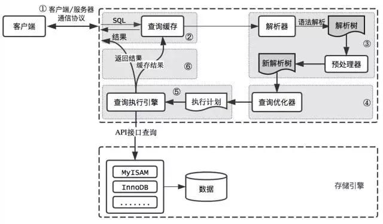

# MySQL 架构及优化原理 

MySQL逻辑架构

MySQL逻辑架构整体分为三层 :
1> 客户端 : 并非MySQL所独有，诸如 : 连接处理、授权认证、安全等功能均在这一层处理
2> 核心服务 : 包括查询解析、分析、优化、缓存、内置函数(比如 : 时间、数学、加密等函数)，所有的跨存储引擎的功能也在这一层实现 : 存储过程、触发器、视图等
3> 存储引擎 : 负责 MySQL 中的数据存储和提取，和 Linux 下的文件系统类似，每种存储引擎都有其优势和劣势，中间的服务层通过 API 与存储引擎通信，这些 API接口 屏蔽不同存储引擎间的差异

MySQL查询过程

MySQL 整个查询执行过程，总的来说分为 5 个步骤 :
1> 客户端向 MySQL 服务器发送一条查询请求
2> 服务器首先检查查询缓存，如果命中缓存，则立刻返回存储在缓存中的结果，否则进入下一阶段
3> 服务器进行 SQL解析、预处理、再由优化器生成对应的执行计划
4> MySQL 根据执行计划，调用存储引擎的 API来执行查询
5> 将结果返回给客户端，同时缓存查询结果

客户端/服务端通信协议
MySQL客户端/服务端通信协议 是 “半双工” 的，在任一时刻，要么是服务器向客户端发送数据，要么是客户端向服务器发送数据，这两个动作不能同时发生。一旦一端开始发送消息，另一端要接收完整个消息才能响应它，所以无法也无须将一个消息切成小块独立发送，也没有办法进行流量控制。客户端用一个单独的数据包将查询请求发送给服务器，所以当查询语句很长的时候，需要设置 max_allowed_packet参数，如果查询实在是太大，服务端会拒绝接收更多数据并抛出异常。与之相反的是，服务器响应给用户的数据通常会很多，由多个数据包组成。但是当服务器响应客户端请求时，客户端必须完整的接收整个返回结果，而不能简单的只取前面几条结果，然后让服务器停止发送。因而在实际开发中，尽量保持查询简单且只返回必需的数据，减小通信间数据包的大小和数量是一个非常好的习惯，这也是查询中尽量避免使用 SELECT * 以及加上 LIMIT 限制的原因之一

查询缓存
在解析一个查询语句前，如果查询缓存是打开的，那么 MySQL 会检查这个查询语句是否命中查询缓存中的数据。如果当前查询恰好命中查询缓存，在检查一次用户权限后直接返回缓存中的结果。这种情况下，查询不会被解析，也不会生成执行计划，更不会执行。MySQL将缓存存放在一个引用表 (不要理解成table，可以认为是类似于 HashMap 的数据结构)，通过一个哈希值索引，这个哈希值通过查询本身、当前要查询的数据库、客户端协议版本号等一些可能影响结果的信息计算得来。所以两个查询在任何字符上的不同 (例如 : 空格、注释)，都会导致缓存不会命中

如果查询中包含任何用户自定义函数、存储函数、用户变量、临时表、MySQL库中的系统表，其查询结果都不会被缓存。比如函数 NOW() 或者 CURRENT_DATE() 会因为不同的查询时间，返回不同的查询结果，再比如包含 CURRENT_USER 或者 CONNECION_ID() 的查询语句会因为不同的用户而返回不同的结果，将这样的查询结果缓存起来没有任何的意义

MySQL 查询缓存系统会跟踪查询中涉及的每个表，如果这些表 (数据或结构) 发生变化，那么和这张表相关的所有缓存数据都将失效。正因为如此，在任何的写操作时，MySQL必须将对应表的所有缓存都设置为失效。如果查询缓存非常大或者碎片很多，这个操作就可能带来很大的系统消耗，甚至导致系统僵死一会儿，而且查询缓存对系统的额外消耗也不仅仅在写操作，读操作也不例外 :
1> 任何的查询语句在开始之前都必须经过检查，即使这条 SQL语句 永远不会命中缓存
2> 如果查询结果可以被缓存，那么执行完成后，会将结果存入缓存，也会带来额外的系统消耗

基于此，并不是什么情况下查询缓存都会提高系统性能，缓存和失效都会带来额外消耗，特别是写密集型应用，只有当缓存带来的资源节约大于其本身消耗的资源时，才会给系统带来性能提升。可以尝试打开查询缓存，并在数据库设计上做一些优化 :
1> 用多个小表代替一个大表，注意不要过度设计
2> 批量插入代替循环单条插入
3> 合理控制缓存空间大小，一般来说其大小设置为几十兆比较合适
4> 可以通过 SQL_CACHE 和 SQL_NO_CACHE 来控制某个查询语句是否需要进行缓存
注 : SQL_NO_CACHE 是禁止缓存查询结果，但并不意味着 cache 不作为结果返回给 query，之前的缓存结果之后也可以查询到
mysql> SELECT SQL_CACHE COUNT(*) FROM a;
+----------+
| COUNT(*) |
+----------+
|    98304 |
+----------+
1 row in set, 1 warning (0.01 sec)

mysql> SELECT SQL_NO_CACHE COUNT(*) FROM a;
+----------+
| COUNT(*) |
+----------+
|    98304 |
+----------+
1 row in set, 1 warning (0.02 sec)
可以在 SELECT 语句中指定查询缓存的选项，对于那些肯定要实时的从表中获取数据的查询，或者对于那些一天只执行一次的查询，都可以指定不进行查询缓存，使用 SQL_NO_CACHE 选项。对于那些变化不频繁的表，查询操作很固定，可以将该查询操作缓存起来，这样每次执行的时候不实际访问表和执行查询，只是从缓存获得结果，可以有效地改善查询的性能，使用 SQL_CACHE 选项

查看开启缓存的情况
mysql> SHOW VARIABLES LIKE '%query_cache%';
+------------------------------+---------+
| Variable_name                | Value   |
+------------------------------+---------+
| have_query_cache             | YES     |
| query_cache_limit            | 1048576 |
| query_cache_min_res_unit     | 4096    |
| query_cache_size             | 1048576 |  # 给缓存分配的最大内存空间
| query_cache_type             | OFF     |  # 是否开启查询缓存，0 表示不开启查询缓存，1 表示始终开启查询缓存 (不要缓存使用 sql_no_cache)， 2 表示按需开启查询缓存 (需要缓存使用 sql_cache)
| query_cache_wlock_invalidate | OFF     |
+------------------------------+---------+
6 rows in set (0.00 sec)

对于查询缓存的一些操作
FLUSH QUERY CACHE : 清理查询缓存内存碎片
RESET QUERY CACHE : 从查询缓存中移出所有查询
FLUSH TABLES : 关闭所有打开的表，同时该操作将会清空查询缓存中的内容

查询优化
经过前面的步骤生成的语法树被认为是合法的了，并且由优化器将其转化成查询计划。多数情况下，一条查询可以有很多种执行方式，最后都返回相应的结果。优化器的作用就是找到这其中最好的执行计划。MySQL使用基于成本的优化器，它尝试预测一个查询使用某种执行计划时的成本，并选择其中成本最小的一个。在 MySQL 可以通过查询当前会话的 last_query_cost 的值来得到其计算当前查询的成本
mysql> SELECT * FROM p_product_fee WHERE total_price BETWEEN 580000 AND 680000;
mysql> SHOW STATUS LIKE 'last_query_cost'; # 显示要做多少页的随机查询才能得到最后一查询结果，这个结果是根据一些列的统计信息计算得来的，这些统计信息包括 : 每张表或者索引的页面个数、索引的基数、索引和数据行的长度、索引的分布情况等等
有非常多的原因会导致 MySQL 选择错误的执行计划，比如统计信息不准确、不会考虑不受其控制的操作成本(用户自定义函数、存储过程)、MySQL认为的最优跟我们想的不一样 (我们希望执行时间尽可能短，但 MySQL 值选择它认为成本小的，但成本小并不意味着执行时间短) 等等

MySQL的查询优化器是一个非常复杂的部件，它使用了非常多的优化策略来生成一个最优的执行计划 :
1> 重新定义表的关联顺序 (多张表关联查询时，并不一定按照 SQL 中指定的顺序进行，但有一些技巧可以指定关联顺序)
2> 优化 MIN() 和 MAX()函数 (找某列的最小值，如果该列有索引，只需要查找 B+Tree索引 最左端，反之则可以找到最大值)
3> 提前终止查询 (比如 : 使用 Limit 时，查找到满足数量的结果集后会立即终止查询)
4> 优化排序 (在老版本 MySQL 会使用两次传输排序，即先读取行指针和需要排序的字段在内存中对其排序，然后再根据排序结果去读取数据行，而新版本采用的是单次传输排序，也就是一次读取所有的数据行，然后根据给定的列排序。对于I/O密集型应用，效率会高很多)

查询执行引擎
在完成解析和优化阶段以后，MySQL会生成对应的执行计划，查询执行引擎根据执行计划给出的指令逐步执行得出结果。整个执行过程的大部分操作均是通过调用存储引擎实现的接口来完成，这些接口被称为 handler API。查询过程中的每一张表由一个 handler 实例表示。实际上，MySQL在查询优化阶段就为每一张表创建了一个 handler实例，优化器可以根据这些实例的接口来获取表的相关信息，包括表的所有列名、索引统计信息等。存储引擎接口提供了非常丰富的功能，但其底层仅有几十个接口，这些接口像搭积木一样完成了一次查询的大部分操作

返回结果给客户端
查询执行的最后一个阶段就是将结果返回给客户端。即使查询不到数据，MySQL 仍然会返回这个查询的相关信息，比如该查询影响到的行数以及执行时间等。如果查询缓存被打开且这个查询可以被缓存，MySQL也会将结果存放到缓存中。结果集返回客户端是一个增量且逐步返回的过程。有可能 MySQL 在生成第一条结果时，就开始向客户端逐步返回结果集。这样服务端就无须存储太多结果而消耗过多内存，也可以让客户端第一时间获得返回结果。需要注意的是，结果集中的每一行都会以一个满足客户端/服务器通信协议的数据包发送，再通过 TCP协议 进行传输，在传输过程中，可能对 MySQL 的数据包进行缓存然后批量发送

查询系统性能
SHOW STATUS LIKE 'value';
value参数的几个统计参数如下 :
Connections : 连接 MySQL 服务器的次数
Uptime : MySQL 服务器的上线时间
Slow_queries : 慢查询次数
Com_Select : 查询操作的次数
Com_insert : 插入操作的次数
Com_update : 更新操作的次数
Com_delete : 删除操作的次数

1> 分析查询语句
EXPLAIN，DESCRIBE用于分析SELECT语句的执行情况
EXPLAIN SELECT 语句;
DESCRIBE SELECT 语句;
返回的查询结果信息 :
id : 表示 SELECT 语句的编号
select_type : 表示 SELECT 语句类型。该参数有几个常用的取值，即 SIMPLE 表简单查询，其中不包括连接查询和子查询；PRIMARY 表示主查询，或者是最外层的查询语句；UNION 表示连接查询的第二个或后面的查询语句
table : 表示查询的表
type : 表示表的连接类型。该参数有几个常用的取值，即 system 表示表中只有一条记录；const 表示表中有多条记录，但值从表中查询一条记录；ALL 表示对表进行完整的扫描；eq_ref 表示多表连接时，后面的表示用 UNIQUE 或者 PRIMARY KEY；ref 表示多表查询时，后面的表示用普通索引；unique_subquery 表示子查询中使用 UNIQUE 或者 PRIMARY KEY；index_subquery 表示子查询中使用普通索引；range 表示查询语句中给出查询范围；index 表示对表中的索引进行完整的扫描
possible_keys : 表示查询中可能使用的索引
key : 表示查询使用到的索引
key_len : 表示索引字段的长度
ref : 表示使用哪个列或常数与索引一起来查询记录
rows : 表示查询的行数
Extra : 表示查询过程的附加信息

2> 索引查询
<1> 使用 LIKE 关键字查询时，若匹配字符串的第一个字符为 % 时，索引不会被使用，如果不在第一个位置，索引就会被使用
<2> 多列索引是在表的多个字段上创建一个索引，只有查询条件中使用这些字段中第一个字段时，索引才会被使用
<3> 查询语句只有 OR 关键字时，若 OR 前后两个条件的列都是索引时查询中将使用索引，若 OR 前后有一个条件的列不是索引，那么查询中将不会使用索引
<4> 应尽量避免在WHERE子句中对字段进行NULL值判断，否则将导致引擎放弃使用索引而进行全表扫描
<5> 使用多列索引时主意顺序和查询条件保持一致，同时删除不必要的单列索引
<6> 尽量避免在WHERE子句中使用 != 或 <>操作符，否则将引擎放弃使用索引而进行全表扫描

3> 优化子查询 : 子查询时，系统内层查询语句的查询结果建立一个临时表，然后外层查询语句再在临时表中查询记录，查询完成后撤销掉这些临时表，因此使用连接查询来代替子查询，这是由于连接查询不需要建立临时表，其速度比子查询要快
<1> 将字段很多的表分解成多个表 : 有些表在设计了很多字段，其中有些字段使用频率低，当该表数据量大时，查询数据的速度就会被拖慢，因此将那些使用频率很低的字段放置在另外一个表中(两外一个表可以是 *_extra)
<2> 增加中间表 : 在查询两个表中的几个字段，经常连表查询会降低数据库查询速度，可将这些字段建立一个中间表并将原来那几个表的数据插入到中间表中，之后使用中间表来进行查询和统计，以此提高查询速度
<3> 增加冗余字段：表的规范化程度越高，表与表之间的关系就越多，若经常进行多表连接查询会浪费很多时间，可增加冗余字段的方式来提高查询速度

4> 优化一行数据的查询，若已知查询、更新或删除结果只有一条，在查询、更新或删除语句之后添加 LIMIT 1 可以在数据库引擎会在找到一条数据后停止搜索，而不是继续往后查找下一条符合记录的数据

5> 使用 JOIN 级联查询时，应该保证两表中 JOIN 的字段已近建立过索引且类型相同，这样 MySQL 内部会启动优化 JOIN 的 SQL语句的机制，如 : 如果要把 DECIMAL 字段和一个 INT 字段 JOIN 在一起，MySQL 就无法使用它们的索引。对于那些 STRING类型，还需要有相同的字符集才行

6> 避免 SELECT * 查询数据，从数据库里读出越多的数据，那么查询就会变得越慢并且，如果数据库服务器和WEB服务器是两台独立的服务器的话，这还会增加网络传输的负载。所以，应该养成一个需要什么就取什么的好的习惯

7> 能使用 ENUM 而就不要使用 VARCHAR，ENUM 类型是非常快和紧凑的，实际上 ENUM 保存的是 TINYINT，但其外表上显示为字符串。这样用这个字段来做一些选项列表变得相当的完美。如果有一个字段，比如“性别”，“国家”，“民族”，“状态”或“部门”，这些字段的取值是有限而且固定的，那么，你应该使用 ENUM 而不是 VARCHAR

8> 从 PROCEDURE ANALYSE() 取得建议 ：PROCEDURE ANALYSE() 会让 MySQL 帮你去分析你的字段和其实际的数据，并会给你一些有用的建议。只有表中有实际的数据，这些建议才会变得有用，因为要做一些大的决定是需要有数据作为基础
PROCEDURE ANALYSE() 语法如下 :
SELECT ... FROM ... WHERE ... PROCEDURE ANALYSE([max_elements,[max_memory]])
max_elements : (默认值256) analyze 查找每一列不同值时所需关注的最大不同值的数量，analyze 还用这个值来检查优化的数据类型是否该是 ENUM，如果该列的不同值的数量超过 max_elements值 ENUM 就不做为建议优化的数据类型
max_memory : (默认值8192) analyze 查找每一列所有不同值时可能分配的最大的内存数量

mysql> DESC user_account;
+-----------+------------------+------+-----+---------+----------------+
| Field     | Type             | Null | Key | Default | Extra          |
+-----------+------------------+------+-----+---------+----------------+
| USERID    | int(10) unsigned | NO   | PRI | NULL    | auto_increment |
| USERNAME  | varchar(10)      | NO   |     | NULL    |                |
| PASSSWORD | varchar(30)      | NO   |     | NULL    |                |
| GROUPNAME | varchar(10)      | YES  |     | NULL    |                |
+-----------+------------------+------+-----+---------+----------------+
4 rows in set (0.00 sec)

mysql> select * from user_account PROCEDURE ANALYSE(1)\G
*************************** 1. row ***************************
             Field_name: ibatis.user_account.USERID
              Min_value: 1
              Max_value: 103
             Min_length: 1
             Max_length: 3
       Empties_or_zeros: 0
                  Nulls: 0
Avg_value_or_avg_length: 51.7500
                    Std: 50.2562
      Optimal_fieldtype: TINYINT(3) UNSIGNED NOT NULL
*************************** 2. row ***************************
             Field_name: ibatis.user_account.USERNAME
              Min_value: dfsa
              Max_value: LMEADORS
# analyze 分析 ibatis.user_account.USERID 列最小值1，最大值103，最小长度1，最大长度3等信息，并给出修改字段的优化建议 : 建议将该字段的数据类型改成 TINYINT(3) UNSIGNED NOT NULL

9> 尽可能的使用 NOT NULL：NULL会占用额外的空间来记录其值是否为空，对于 MyISAM表 每个空列都需要额外的一个字节并将其四舍五入到最近的字节。MySQL难以优化引用可空列查询，它会使索引、索引统计和值更加复杂 可空列被索引后，每条记录都需要一个额外的字节，还能导致 MyISAM 中固定大小的索引变成可变大小的索引。在进行比较的时候会是程序更复杂，其所代表的意义在不同的数据库中会有所不同坑是字符串 "Empty"、"NULL"或是NULL，因此尽量使用 NOT NULL
<1> 所有使用 NULL值的情况，都可以通过一个有意义的值来代替，这样有利于代码的可读性和可维护性，并能从约束上增强业务数据的规范性
<2> NULL值 到 非NULL 的更新无法做到原地更新，更容易发生索引分裂，从而影响性能
注 : 把 NULL列 改为 NOT NULL 带来的性能提升很小，除非确定它带来了问题，否则不要把它当成优先的优化措施，最重要的是使用的列的类型的适当性
<3> NULL值 在 timestamp类型 下容易出问题，特别是没有启用参数 explicit_defaults_for_timestamp
<4> NOT IN、!= 等负向条件查询在有 NULL 值的情况下返回永远为空结果，查询容易出错
mysql> CREATE TABLE table_2(id INT(11) NOT NULL,user_name VARCHAR(20) NOT NULL);
mysql> CREATE TABLE table_3(id INT(11) NOT NULL,user_name VARCHAR(20));
mysql> INSERT INTO table_2 VALUES(4,'zhaoliu_2_1'),(2,'lisi_2_1'),(3,'wangmazi_2_1'),(1,'zhangsan_2'),(2,'lisi_2_2'),(4,'zhaoliu_2_2'),(3,'wangmazi_2_2');
mysql> INSERT INTO table_3 VALUES(1,"zhaoliu_2_1"),(2, null);

# NOT IN子查询在有NULL值的情况下返回永远为空结果，查询容易出错
mysql> SELECT user_name FROM table_2 WHERE user_name NOT IN(SELECT user_name FROM table_3 WHERE id!=1);
Empty set (0.00 sec)

# 单列索引不存 NULL值，复合索引不存全为 NULL值，如果列允许为 NULL，可能会得到“不符合预期”的结果集
# 如果name允许为 NULL，索引不存储 NULL值，结果集中不会包含这些记录。所以，请使用 NOT NULL约束以及默认值
mysql> SELECT * FROM table_3 WHERE user_name!='zhaoliu_2_1';
Empty set (0.00 sec)

# 如果在两个字段进行拼接 : 比如题号+分数，首先要各字段进行非null判断，否则只要任意一个字段为空都会造成拼接的结果为null
mysql> SELECT CONCAT("1",null);
+------------------+
| CONCAT("1",null) |
+------------------+
| NULL             |
+------------------+
1 row in set (0.00 sec)

# 如果有 NULL column 存在的情况下，count(NULL column)需要格外注意，NULL 值不会参与统计
mysql> SELECT * FROM table_3;
+----+-------------+
| id | user_name   |
+----+-------------+
|  1 | zhaoliu_2_1 |
|  2 | NULL        |
+----+-------------+
2 rows in set (0.00 sec)
mysql> SELECT COUNT(user_name) FROM table_3;
+------------------+
| count(user_name) |
+------------------+
|                1 |
+------------------+
1 row in set (0.00 sec)

# 注意 NULL 字段的判断方式，= NULL 将会得到错误的结果
mysql> CREATE INDEX idx_test ON table_3(user_name);
mysql> SELECT * FROM table_3 WHERE user_name IS NULL;
+----+-----------+
| id | user_name |
+----+-----------+
|  2 | NULL      |
+----+-----------+
1 row in set (0.00 sec)

mysql> DESC SELECT * FROM table_3 WHERE user_name='zhaoliu_2_1';
+----+-------------+---------+------------+------+---------------+----------+---------+-------+------+----------+-------+
| id | select_type | table   | partitions | type | possible_keys | key      | key_len | ref   | rows | filtered | Extra |
+----+-------------+---------+------------+------+---------------+----------+---------+-------+------+----------+-------+
|  1 | SIMPLE      | table_3 | NULL       | ref  | idx_test      | idx_test | 23      | const |    1 |   100.00 | NULL  |
+----+-------------+---------+------------+------+---------------+----------+---------+-------+------+----------+-------+
1 row in set, 1 warning (0.00 sec)

mysql> DESC SELECT * FROM table_3 WHERE user_name=null;
+----+-------------+-------+------------+------+---------------+------+---------+------+------+----------+--------------------------------+
| id | select_type | table | partitions | type | possible_keys | key  | key_len | ref  | rows | filtered | Extra                          |
+----+-------------+-------+------------+------+---------------+------+---------+------+------+----------+--------------------------------+
|  1 | SIMPLE      | NULL  | NULL       | NULL | NULL          | NULL | NULL    | NULL | NULL |     NULL | no matching row in const table |
+----+-------------+-------+------------+------+---------------+------+---------+------+------+----------+--------------------------------+
1 row in set, 1 warning (0.00 sec)

mysql> DESC SELECT * FROM table_3 WHERE user_name IS NULL;
+----+-------------+---------+------------+------+---------------+----------+---------+-------+------+----------+-----------------------+
| id | select_type | table   | partitions | type | possible_keys | key      | key_len | ref   | rows | filtered | Extra                 |
+----+-------------+---------+------------+------+---------------+----------+---------+-------+------+----------+-----------------------+
|  1 | SIMPLE      | table_3 | NULL       | ref  | idx_test      | idx_test | 23      | const |    1 |   100.00 | Using index condition |
+----+-------------+---------+------------+------+---------------+----------+---------+-------+------+----------+-----------------------+
1 row in set, 1 warning (0.00 sec)
<5> Null 列需要更多的存储空间 : 需要一个额外字节作为判断是否为 NULL 的标志位
mysql> ALTER TABLE table_3 ADD INDEX idx_user_name(user_name);
mysql> ALTER TABLE table_2 ADD INDEX idx_user_name(user_name);
mysql> EXPLAIN SELECT * FROM table_2 WHERE user_name='zhaoliu_2_1';
+----+-------------+---------+------------+------+---------------+---------------+---------+-------+------+----------+-------+
| id | select_type | table   | partitions | type | possible_keys | key           | key_len | ref   | rows | filtered | Extra |
+----+-------------+---------+------------+------+---------------+---------------+---------+-------+------+----------+-------+
|  1 | SIMPLE      | table_2 | NULL       | ref  | idx_user_name | idx_user_name | 22      | const |    1 |   100.00 | NULL  |
+----+-------------+---------+------------+------+---------------+---------------+---------+-------+------+----------+-------+
1 row in set, 1 warning (0.00 sec)

mysql> EXPLAIN SELECT * FROM table_3 WHERE user_name='zhaoliu_2_1';
+----+-------------+---------+------------+------+------------------------+----------+---------+-------+------+----------+-------+
| id | select_type | table   | partitions | type | possible_keys          | key      | key_len | ref   | rows | filtered | Extra |
+----+-------------+---------+------------+------+------------------------+----------+---------+-------+------+----------+-------+
|  1 | SIMPLE      | table_3 | NULL       | ref  | idx_test,idx_user_name | idx_test | 23      | const |    1 |   100.00 | NULL  |
+----+-------------+---------+------------+------+------------------------+----------+---------+-------+------+----------+-------+
1 row in set, 1 warning (0.00 sec)
可以看到同样的 varchar(20) 长度，table_2 要比 table_3 索引长度大，这是因为 : 两张表的字符集不一样，且字段一个为 NULL 一个非 NULL
key_len 的计算规则和三个因素有关 : 数据类型、字符编码、是否为 NULL
table_3 建立的索引在空间消耗上面需要增加额外一个字节存储数据是否为 NULL，所以说索引字段最好不要为 NULL，因为 NULL会使索引、索引统计和值更加复杂，并且需要额外一个字节的存储空间。基于以上这些理由和原因，所以不建议使用 NULL

10> 把 IP地址 存成 INT UNSIGNED；如果用整形来存放，只需要4个字节，并且你可以有定长的字段。而且，这会为你带来查询上的优势，尤其是当需要使用这样的 WHERE条件 : IP between ip1 and ip2
       配合使用后面两个函数来转换ip信息 : INET_ATON：将 IP地址 转换成数字型
　　                                                            INET_NTOA：将数字型转换成 IP地址

11> 拆分大的 DELETE 或 INSERT 语句：由于DELETE 和 INSERT操作时会锁表的，表一锁住别的操作都无法进行，对于访问量大的网站所积累 进程/线程 的延迟会让Web服务Crash，还会使这个服务器挂掉，因此限制一次对数据库数据修改的次数，对DELETE采用LIMT
mysql> DELETE FROM logs WHERE log_date <= '2009-11-01' LIMIT 1000;

12> 越小的列会越快：如果一个表只会有几列罢了 (比如说字典表，配置表)，那么，就没有理由使用 INT 来做主键，使用 MEDIUMINT, SMALLINT 或是更小的 TINYINT 会更经济一些。如果不需要记录时间，使用 DATE 要比 DATETIME 好得多
注 : 需要留够足够的扩展空间，否则日后修改表时会很困难

13> 对表选择正确的存储引擎：
       MyISAM : 适合于一些需要大量查询的应用，但其对于有大量写操作并不是很好，甚至只是需要 update 一个字段，整个表都会被锁起来，而别的进程，就算是读进程都无法操作直到读操作完成。另外，MyISAM 对于 SELECT COUNT(*) 这类的计算是超快无比的
       InnoDB : 是一个非常复杂的存储引擎，对于一些小的应用，它会比 MyISAM 还慢。他是它支持“行锁” ，于是在写操作比较多的时候，会更优秀。并且，他还支持更多的高级应用，比如：事务

14> 优化插入记录的速度
<1> 禁用索引 : 插入记录时索引会对插入的记录进行排序，若插入大量数据时，这些排序会降低插入数据的速度，因此在插入大量数据时，先禁用索引，待插入数据完毕再开启索引
       禁用索引的语句 : ALTER TABLE 表名 DISABLE KEYS;
       重新开启索引的语句 : ALTER TABLE 表名 ENABLE KEYS;
<2> 禁用唯一性检查 : 插入记录时系统会进行唯一性校验，校验会降低插入记录的速度，可以在插入记录之前禁用唯一性检查，待插入数据完毕再开启
       禁用唯一性检查的语句 : SET UNIQUE_CHECKS=0;
       重新开启唯一性检查的语句 : SET UNIQUE_CHECKS=1;
<3> 优化INSERT语句 : 当插入多条数据时，通过一条插入语句比分多条插入语句执行效率速度快很多，这是由于减少与数据库之间的连接等操作，因此能使用 LOAD DATA INFILE语句比 INSERT语句速度快
<4> 在事务中进行插入处理，进行一个 INSERT 操作时，MySQL内部会建立一个事务，在事务内才进行真正插入处理操作。通过使用事务可以减少创建事务的消耗，所有插入都在执行后才进行提交操作，因此采用事务操作可提高插入数据的速度
<5> 插入数据是有序的，这样可减少索引的维护成本
注 : 合并数据+事务+有序数据的方式在数据量达到千万级以上表现依旧是良好，在数据量较大时，有序数据索引定位较为方便，不需要频繁对磁盘进行读写操作，所以可以维持较高的性能

15> 分析表、检查表和优化表
<1> 分析表，语法格式 : ANALYZE TABLE 表名1[,表名2,...]; 返回的结果
Table : 表示表的名称
Op : 表示执行的操作；analyze 表示进行分析操作；check 表示进行检查查找；optimize 表示进行优化操作
Msg_type : 表示信息类型，其显示的值通常是状态、警告、错误和信息这四者之一
Msg_text : 显示信息
<2> 检查表，语法格式 : CHECK TABLE 表名1[,表名2...][option]; option参数有5个参数分别是 QUICK、FAST、CHANGED、MEDIUM和EXTENDED，这5个参数的执行效率依次降低
注 : option选项只对 MyISAM 类型的表有效，对 InnoDB类型的表无效，CHECK TABLE语句在执行过程中会给表加上只读锁
<3> 优化表，使用 OPTIMIZE TABLE语句来优化表，该语句只对 InnoDB 和 MyISAM类型的表有效，且该语句只能优化VARCHAR、BLOB或TEXT类型的字段，该语句可以消除删除和更新造成的磁盘碎片从而减少空间的浪费，语法格式 : OPTIMIZE TABLE 表名1[,表名2...];

16> 尽量使用 TIMESTAMP 而 非DATETIME

17> 不用外键，由程序保证约束；尽量不用UNIQUE，由程序保证约束

18> OR改写成IN : OR的效率是n级别，IN的效率是 log(n)级别，in的个数建议控制在200以内

19> 对于连续数值，使用 BETWEEN 不用 IN : SELECT id FROM t WHERE num BETWEEN 1 AND 5

20> 优化 MySQL服务器，采用数据库主从的形式将数据库进行读写分离

21> 精确度与空间的转换。在存储相同数值范围的数据时，浮点数类型通常都会比 DECIMAL类型使用更少的空间。FLOAT字段使用4字节存储数据。DOUBLE类型需要8个字节并拥有更高的精确度和更大的数值范围，DECIMAL类型的数据将会转换成DOUBLE类型

22> 系统配置与维护优化
<1> 重要的一些变量
    key_buffer_size 索引块缓存区大小，针对 MyISAM存储引擎，该值越大，性能越好，但是超过操作系统能承受的最大值，反而会使 mysql 变得不稳定
    sort_buffer_size 这是索引在排序缓冲区大小，若排序数据大小超过该值，则创建临时文件，注意和 myisam_sort_buffer_size的区别
    read_rnd_buffer_size 当排序后按排序后的顺序读取行时，则通过该缓冲区读取行，避免搜索硬盘。将该变量设置为较大的值可以大大改进 ORDER BY 的性能。但是，这是为每个客户端分配的缓冲区，因此你不应将全局变量设置为较大的值。相反，只为需要运行大查询的客户端更改会话变量
    join_buffer_size 用于表间关联(join)的缓存大小
    tmp_table_size 缓存表的大小
    table_cache 允许 MySQL 打开的表的最大个数，并且这些都 cache 在内存中
    delay_key_write 针对 MyISAM存储引擎，延迟更新索引，意思是说，update记录时，先将数据up到磁盘，但不up索引，将索引存在内存里，当表关闭时，将内存索引，写到磁盘

22> 其他技巧
<1> 尽量使用 count(*) 计算数量 : 列的偏移 量决定性能，列越靠后，访问的开销越大。由于 count(*) 的算法与列偏移量无关，所以 count(*) 最快，count(最后列)最慢
<2> 单实例或者单节点组 : 自增ID相对UUID来说，自增ID主键性能高于UUID，磁盘存储费用比UUID节省一半的钱，所以在单实例上或者单节点组上，使用自增 ID 作为首选主键

 分布式架构场景 : 20个节点组下的小型规模的分布式场景，为了快速实现部署，可以采用多花存储费用、牺牲部分性能而使用 UUID 主键快速部署；20到200个节点组的中等规模的分布式场景，可以采用 自增ID+步长的较快速方案；200以上节点组的大数据下的分布式场景，可以借鉴类似 twitter雪花算法构造的全局 自增ID 作为主键

