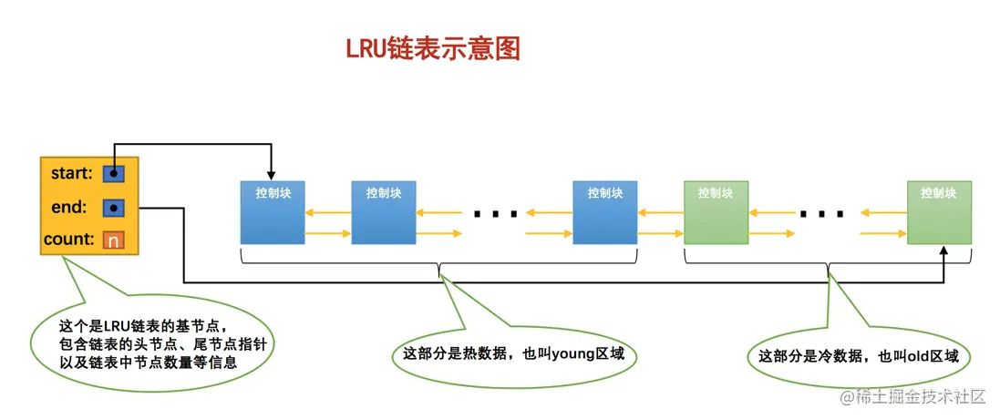
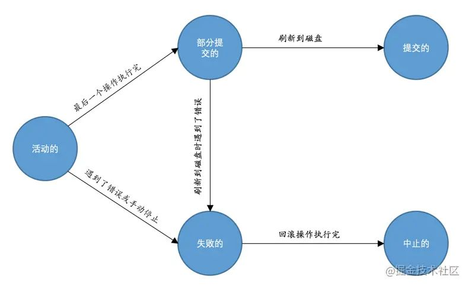

- ## MySQL客户端进程与服务端进程间通信

  ### Window 用户

  可以考虑使用 **命名管道** 或 **共享内存** 进行通信

  - 使用 **命名管道** 来进行进程间通信

  需要在启动服务器程序的命令中加上 `--enable-named-pipe` 参数，然后在启动客户端程序的命令中加入 `--pipe` 或者 `--protocol=pipe` 参数

  - 使用 **共享内存** 来进行进程间通信

  需要在启动服务器程序的命令上加上 `shared-memory` 参数，然后成功启动服务器后 **共享内存** 便成为本地客户端程序的默连接方式，不过我们也可以在启动客户端程序的命令中加入 `--protocol=memory` 参数来显示的指定使用共享内存进行通信

  需要注意的是，使用 **共享内存** 的方式进行通信的服务器进程和客户端进程必须在同一台 `Windows` 主机中。

  ### Unix 用户

  如果服务器和客户端进程都运行在同一台操作系统为类 `unix` 的机器上的话，我们可以使用 **Unix域套接字文件** 来进行进程间通信

  如果在启动客户端程序的时候指定的主机名为 `localhost` ,或者指定了 `--protocol=socket` 的启动参数，那服务器程序和客户端程序之间就可以通过 **Unix域套接字文件** 来进行通信了

  ### 服务器进程与客户端进程运行在不同的主机中

  - 采用 `TCP/IP` 协议进行连接

  ## 存储引擎

  - 存储引擎是表级的，不同的表可以设置不同的存储引擎，也就是说不同的表可以有不同的物理存储结构，不同的提取和写入方式

  ```mysql
  // 如果表已经建好了，可以使用这个语句来修改表的存储引擎
  ALTER TABLE 表名 ENGINE = 存储引擎名称;
  ```

  ## utf8与utf8mb4的区别

  utf8字符集表示字符需要使用1~4个字节，但是我们常用的一些字符使用1~3个字节就可以表示了。而在MySQL中字符集表示一个字符所用最大字节长度在某些方面会影响系统的存储和性能，所以MySQL定义了以下两个概念：

  - `utf8mb3`：阉割过的 `utf8` 字符集，只使用1~3个字节表示字符。
  - `utf8mb4`：正宗的 `utf8` 字符集，使用1~4个字节表示字符

  在MySQL中，`utf8` 是 `utf8mb3` 的别名，所以之后在MySQL中提到 `utf8` 就意味着使用1~3个字节来表示一个字符，但是如果有使用4个字节编码一个字符的情况，比如说存储一些emoji表情之类的，就使用 `utf8mb4` 。

  ## 字符集比较规则

  **比较规则**的作用通常体现在比较字符串大小的表达式以及对某个字符串列进行排序中，所以有时候也称为**排序规则**

  | 后缀 | 英文释义           | 描述             |
  | ---- | ------------------ | ---------------- |
  | _ai  | accent insensitive | 不区分重音       |
  | _as  | accent sensitive   | 区分重音         |
  | _ci  | case insensitive   | 不区分大小写     |
  | _cs  | case sensitive     | 区分大小写       |
  | _bin | binary             | 以二进制方式比较 |

  比如 `utf8_general_ci` 是以 `_ci` 结尾，说明不区分大小写

  所以说如果以后在对字符串作比较或者对某个字符串做排序操作时没有得到想象中的结果，需要考虑一下是不是**比较规则**的问题

  ## InnoDB记录存储结构

  `InnoDB` 将表中的数据存储到磁盘上，但是处理数据的过程是发生在内存中的，`InnoDB` 不会一条一条这样的从磁盘中读取数据，这样太慢了。

  `InnoDB` 采取的方式是将数据划分为若干个页，一般大小为 `16KB`，以页作为磁盘和内存之间交互的基本单位。也就是说在一般情况下，`InnoDB` 一次最少从磁盘读取16KB到内存中，一次最少把内存中的16KB内容刷新到磁盘中。

  当一条记录中某个列中存储的数据占用字节数非常多时，该列就可能成为**溢出列**，伴随着就会出现**溢出页**的情况，也就是一条记录存储在多个页的情况

  ### InnoDB的行格式记录头信息

  行格式：Compact

  - `delete_mask`

  标记当前记录是否被删除，0：没有被删除，1：已被删除

  这些被删除的记录之所以不立即从磁盘上移除，是因为移除它们之后把其他的记录在磁盘上重新排列需要性能消耗，所以只是打上一个删除标记，所有被删除的记录都会组成一个所谓的**垃圾链表**，这个链表中的记录占用的空间称之为所谓的**可重用空间**，当以后有新记录插入到表中时，可能会覆盖这些可重用空间。

  - `next_record`

  它表示从当前记录的真实数据到下一条记录的真实数据的地址偏移量，也就相当于是指向下一条记录的地址

  注意：下一条记录指的并不是我们按插入顺序的下一条记录，而是按照主键值由小到大的顺序的下一条记录

  > 这其实就是链表，可以通过一条记录找到它的下一条记录
  > 而且当数据页中存在多条被删除掉的记录时，这些记录的 `next_record` 属性会把这些被删除掉的记录组成一个垃圾链表，以备
  > 之后重用这部分存储空间。

  ### Page Directory（页目录）

  如何根据主键值查找某条记录

  因为一个页中的记录是按照主键值由小到大串联成的单链表，我们想要查找根据主键值查找某条记录，显而易见可以直接遍历单链表来进行查询，但这种方法效率太低，比较笨。所以说 `InnoDB` 采用了类似于书的的目录那用的解决方案

  设计师将所有正常的记录按从小到大划分为几个组（包括InnoDB自己自动插入的两个伪记录，**最小记录**和**最大记录**），规定最小记录所在的组只能有它自己本身，最大记录所在的分组只能在1~8条记录之间，剩下的分组中记录的条数范围是4~8条之间，每个组中的主键值最大的那条记录的 `n_owned` 值代表所在组现在有几条记录。

  - 初始情况下一个数据页只有最小记录和最大记录两条记录，它们分属两个分组
  - 之后每插入一条，都会从**页目录**中找到主键值比本记录的主键值大并且差值最小的槽，然后把该槽对应的记录的 `n_owned` 值加一。直到记录数到达8个
  - 如果记录数等于8，再插入记录时就会将记录拆分为两个组，页目录中对应再新增一个槽来记录新增分组中最大记录的偏移量

  因为这些槽也是从小到大排序的，所以可以直接用二分查找来查找到记录所在的槽，并找到该分组中主键值最小的那条记录，然后再进行遍历就可以了。

  > 因为是链表，槽对应的偏移量记录的是组中主键值最大的元素(组中最后一个元素)，所以我们可以通过前一个槽对应的记录来查询到当前分组的主键值最小的记录，然后再进行遍历，且因为一个组中包含的记录数只能是1~8条，所以遍历一个组中所有记录的代价也很小。

  ### 页分裂

  在页中对数据进行增删改操作时，我们必须通过一些记录的移动操作来保证下一个数据页中用户记录的主键值必须大于上一个页中用户记录的主键值，这个过程称为页分裂。

  ## 索引类型

  ### 聚簇索引

  B+树本身就是一个目录，或者说本身就是一个索引。它有两个特点：

  1. 使用记录主键值的大小进行记录和页的排序，包含三方面：
  2. 页内的记录是按照主键的大小顺序排成一个单向链表
  3. 各个存放用户记录的页也是根据页中用户记录的主键大小顺序拍成一个双向链表
  4. 存放目录项记录的页分为不同的层次，在同一层次中的页也是根据页中目录项记录的主键大小顺序拍成一个双向链表
  5. B+树的叶子节点存储的是完整的用户记录

  所谓完整的用户记录，就是指这个记录中存储了所有列的值（包括隐藏列）

  我们把具有这两种特性的B+树称为 **聚簇索引** ，所有完整的用户记录都存放在这个聚簇索引的叶子节点处，聚簇索引并不需要我们显式的使用 `INDEX` 语句来创建，`InnoDB` 会自动为我们创建。另外，在 `InnoDB` 存储引擎中，**聚簇索引** 就是数据的存储方式（所有的用户记录都存储在叶子节点），也就是所谓的 ==索引即数据，数据即索引== 。

  ### 二级索引

  也称为 **辅助索引**

  `InnoDB` 会将查询列与主键列再建一棵B+树，以查询列的大小为排序规则，叶子节点存储的并不是完整的用户记录，而是 查询列 + 主键值（因为如果每建立一颗B+树就全部拷贝一次全部完整的用户记录太浪费存储空间了）

  当使用查询列的某条记录时，会根据查询列一层一层找到叶子节点，然后在叶子节点中找到对应的主键值。再根据主键值到聚簇索引中再查找一遍完整的用户记录，这个过程称为 **回表**

  因为这种按照 **非主键索引** 建立的B+树需要一次 **回表** 操作才可以定位到完整的用户记录，所以这种 B+树 也被称为 **二级索引**，或者辅助索引

  ### 联合索引

  同时以多个列的大小作为排序规则，也就是同时为多个列建立索引，比方说我们想让B+树按照 `c2` 和 `c3` 列的大小进行排序，这个包含两层含义：

  1. 先把各个记录和页按照 `c2` 进行排序
  2. 在记录的 `c2` 列相同的情况下，采用 `c3` 进行排序

  > 注意

  - 每条目录项记录都由 `c2`、`c3`、 页号这三个部分组成，各条记录先按照`c2`列的值进行排序，如果记录的`c2`列相同，则按照`c3`列的值进行排序。
  - B+树叶子节点处的用户记录由 `c2`、`c3`、和主键 `c1` 列组成
  - ==联合索引本质上也是一个二级索引==

  ### B+树适应的条件

  ### 全值匹配

  搜索条件中的列和索引的列一致

  > 搜索条件的先后顺序不会对查询结果造成影响，因为 `MySQL` 有 **查询优化器**，会分析这些搜索条件并且按照可以使用的索引索引中列的顺序来决定先使用哪个搜索条件

  ### 匹配左边的列

  在搜索语句中可以不用包含全部联合索引中的列，只包含左边的或者多个左边的列就行

  ### 匹配列前缀

  字符串的前 `n` 个字符，也就是前缀都是排好序的，所以对于字符串类型的索引来说，我们只匹配它的前缀也是可以快速定位记录的，比如说 `'As%'`

  > 但是只给出后缀 `'%As'` 或中间某个字符 `'%As%'` 不行，因为字符串中间或结尾有 `'As'` 的字符串并没有排好序，所以只能全表扫描了

  ### 匹配范围值

  因为B+树中所有记录值都是按照索引列的值从小到大的顺序排好序的，所以可以极大的方便我们查找索引列的值在某个范围内的记录

  > 需要注意在使用联合进行范围查找的时候需要注意，如果对多个列同时进行范围查找的话，只有对索引最左边的那个列进行范围查找的时候才能用到B+树索引，因为只有在最左边列值相同的情况下才会使用下一个列的值进行排序，而在联合范围查找中通过左边列进行范围查找的记录可能并不是按照下一个列进行排序的

  ### 精确匹配某一列并范围匹配另外一列

  对于同一个联合索引来说，虽然多个列都进行范围查找时只能用到最左边那个索引列，但是如果左边的列是精确查找，则右边的列可以进行范围查找

  ### 用于排序

  总体上与使用索引查找值的情况相似，也是根据最左匹配原则，因为索引本身就是排序好的，如果可以满足条件直接从索引中提取数据，然后进行回表操作取出该索引中不包含的列就好了

  ### 用于分组

  和使用B+树索引进行排序是一个道理

  ### 覆盖索引

  因为 **回表** 操作可能会带来较高的性能损耗，所以建议：最好在查询列表中只包含索引列

  因为如果在查询列表中只包含索引列，那么在通过索引得到结果后就不必再到 **聚簇索引** 中查找记录的剩余项（因为我们没有查询它），这样就省去了 **回表** 操作带来的性能损耗。我们把这种只需要用到索引的查询方式称为 **索引覆盖**，排序操作也优先使用 **覆盖索引** 的方式进行查询。

  ## 如何挑选索引

  ### 只为用于搜索、排序或分组的列创建索引

  也就是说，只为出现在 `WHERE` 子句中的列、连接子句中的连接列，或者出现在 `ORDER BY` 或 `GROUP BY` 子句中的列创建索引。而出现在查询列表中的列就没必要建立索引了

  ### 考虑列的基数

  - 列的基数：指的是某一列中不重复数据的个数，比如所某一列的数值为 `2、5、8、2、5、8、2、5、8` ，虽然有 9 条记录，但该列的基数却是 3，也就是说，在记录行数一定的情况下，列的基数越大，该列的值越分散，列的基数越小，列的值越集中。

  这个列的基数指标很重要，直接关系到我们是否能有效利用索引

  我们最好为那些列的基数大的列建立索引，为基数太小的列建立索引效果可能不好

  > 因为重复值多的话，那么使用这个二级索引还可能要进行回表操作，这样性能损耗就更大了
  > 另外也可以从InnoDB设计的思路来想，主键也是不可重复的

  ### 索引列的类型尽量小

  以整数类型为例，有 `TINYINT`、`MEDIUMINT`、`INT`、`BIGINT` 这么几种

  尽量让索引列使用较小的类型

  - 数据类型越小，在查询时进行的比较操作越快（CPU层次）
  - 数据类型越小，索引占用的存储空间就越少，一个数据页中就可以放下更多记录，从而减少 磁盘 `I/O` 带来的性能损耗，也就意味着可以把更多的数据页缓存在内存中，从而加快读写效率

  这个建议对于表的主键来说更见适用，因为不仅是聚簇索引中会存储主键值，其他所有二级索引的节点处都会存储一份记录的主键值。如果主键值适用更小的数据类型，也就意味着节省更多的存储空间和更高效的 `I/O`。

  ### 索引字符串值的前缀

  假如说我们需要建立索引的字段是字符串类型的，并且它很长的话，那么我们存储一个字符串就需要很大的存储空间，这样，当我们在适用索引进行字符串比较的时候也会占用更多的时间

  所以我们鼓励使用字符串前缀来建立索引，比如说这样

  ```mysql
  # name(10)就表示在建立的B+树索引中只保留记录的前10个字符的编码
  KEY idx_name_birthday_phone_number (name(10), birthday, phone_number)
  ```

  > 但是需要注意，如果按照这样建立索引，再按照 `name` 进行排序语句是无法使用索引排序的

  ### 让索引列在比较表达式中单独出现

  比如说下面两个语句：

  ```mysql
  WHERE my_col * 2 < 4
  WHERE my_col < 4/2
  ```

  第一个语句中存储引擎会依次遍历所有的元素，计算 `my_col` 的值是不是小于 4，所以这种情况下使用不到索引

  第二个语句 `my_col` 是以单独列的形式出现，可以直接使用索引

  > 所以，如果索引列在比较表达式中不是以单独列的形式出现，而是以某个表达式，或者函数调用形式出现的话，是用不到索引的

  ### 主键插入顺序

  当一个数据页满了，这时候再插入一条主键值位于数据页主键值中间大小的值(也就是新插入的这条记录应该存放在这个数据页中)，这时候就会造成 **页分裂**，也就意味着 **性能损耗**

  所以建议将主键值设为自增，在插入记录时存储引擎会自动为我们填入自增的主键值

  ### 冗余和重复索引

  避免冗余的索引

  ### 页面类型

  InnoDB 是以页为单位管理存储空间的，我们的聚簇索引（也就是完整的表数据）和其他二级索引都是以 B+树 的形式保存到表空间的，而==B+树的节点就是数据页==

  ## join 连接

  - 连接的本质就是把各个连接表中的记录都取出来依次匹配的组合加入结果集并返回给用户
  - **笛卡尔积**：连接查询的结果集中包含一个表中的每一条记录与另一个表中的每一条记录相互匹配的组合，像这样的结果集就可以称之为 **笛卡尔积**

  ### 内连接

  对于 **内连接** 的两个表，驱动表中的记录在被驱动表中找不到匹配的记录，该记录不会加入到最后的结果集

  ```mysql
  SELECT * FROM t1 [INNER | CROSS] JOIN t2 [ON 连接条件] [WHERE 普通过滤条件];
  
  // 内连接有多种写法，下面几种内连接的写法都是等价的
  SELECT * FROM t1 JOIN t2;
  SELECT * FROM t1 INNER JOIN t2;
  SELECT * FROM t1 CROSS JOIN t2;
  SELECT * FROM t1,t
  ```

  ### 外连接

  对于 **外连接** 的两个表，驱动表中的记录即使在被驱动表中没有匹配的记录，也仍然需要加入到结果集中

  在 MySQL 中，根据选取驱动表的不同，外连接仍然可以细分为两种

  - 左外连接（左连接）：选取左侧的表为驱动表

  ```mysql
  SELECT * FROM t1 LEFT JOIN t2 ON 连接条件 [WHERE普通过滤条件];
  ```

  - 右外连接（右连接）：选取右侧的表为驱动表

  ```mysql
  SELECT * FROM t1 RIGHT JOIN t2 ON 连接条件 [WHERE普通过滤条件];
  ```

  ### 过滤条件

  - WHERE 子句中的过滤条件

  不管是内连接还是外连接，凡是不符合 WHERE 子句的过滤条件的记录都不会被加入最后的结果集

  - ON 子句中的过滤条件

  对于外连接的驱动表的记录来说，如果无法在被驱动表中找到匹配 ON 子句的过滤条件的记录，那么该记录仍然会被加入到结果集中，对应的被驱动表记录的各个字段使用 `NULL`值填充

  > 需要注意的是，ON 子句是专门为外连接驱动表中的记录在被驱动表找不到匹配记录时应不应该把该记录加入结果集这个场景下提出的，所以如果把 ON 子句放到内连接中，MySQL 会把它和 WHERE 子句一样对待，也就是说：
  > 内连接中的 WHERE 子句和 ON 子句是等价的

  一般把放到 ON 子句中的过滤条件也称之为 **连接条件**

  ## InnoDB对语句的成本估算

  ### 成本的定义

  包括 I/O 成本和 CPU 成本

  对于 InnoDB 存储引擎来说，页是磁盘和内存之间交互的基本单位，MySQL 的设计者规定读取一个页面花费的成本默认是 1.0，读取及检测一条记录是否符合搜索条件的成本默认是 0.2，

  > 注意，不管读取记录时需不需要检测是否满足搜索条件，其成本都算是 0.2

  ### 单表查询的成本

  MySQL 的 **查询优化器** 会找出执行该语句所有可能使用的方案，对比之后找出成本最低的方案，这个成本最低的方案就是所谓的 **执行计划**，之后才会调用存储引擎提供的接口真正的执行查询

  对于单表查询 MySQL 的查询过程是这样：

  1. 根据搜索条件，找出所有可能使用的索引
  2. 计算全表扫描的代价
  3. 计算使用不同索引执行查询的代价
  4. 对比不同的执行方案，找出成本最低的那一个

  ### 连接查询的成本

  MySQL 中连接查询采用的是嵌套循环连接算法，驱动表被访问一次，被驱动表可能会被访问多次，所以对于两表连接查询来说，它的查询成本由下边两个部分构成：

  - 单次查询驱动表的成本
  - 多次查询被驱动表的成本（具体查询多少次取决于对驱动表的查询的结果集中有多少条记录）

  ## MySQL对查询语句基于规则的优化

  - MySQL会根据一些规则，将一些执行起来十分耗费性能的语句转换成某种可以比较高效执行的语句，这个过程也可以被称为 **查询重写**

  ### 条件化简

  - 移除不必要的括号
  - 常量传递，`a = 5 AND b > a` 可以被替换为 `a = 5 AND b > 5`
  - 等值传递，与常量传递类似
  - 移除没有的条件：对于一些明显永远为 `True` 或 `False` 的表达式，优化器会移除掉它们
  - 表达式计算：如果表达式中只包含常量，并且要比较的列是以单独的形式做为表达式的操作数时，它的值会被先计算出来
  - HAVING 子句和 WHERE 子句的合并：如果查询函数中没有出现聚集函数或 `group by` 子句，优化器就把 `HAVING` 子句和 `WHERE` 子句合并起来
  - 常量表检测

  ### 外连接消除

  因为 **内连接** 的驱动表和被驱动表的位置可以相互转换，而 **左连接** 和 **右连接** 的驱动表和被驱动表是固定的，这就导致 **内连接** 可能通过优化表的连接顺序来降低整体的查询成本，而外连接不行

  但是在外连接中有一些特殊情况，就是 `WHERE` 子句中包含对被驱动表中的列不为 `null` 的条件，称之为 **空值拒绝**。在被驱动表的 `WHERE` 子句符合空值拒绝的条件后，外连接和内连接就可以相互转换了，然后查询优化器就可以评估不同连接顺序的成本，选出成本最低的连接顺序来执行查询。

  ### 子查询优化

  MySQL 的子查询可以在一个外层查询的各种位置出现：

  - `SELECT` 子句中
  - `FROM` 子句中
  - `WHERE` 或 `ON` 子句中
  - `ORDER BY` 子句中（语法支持，但没啥意义）
  - `GROUP BY` 子句中（也是语法支持，但没啥意义）

  子查询语法注意事项

  - 子查询必须用小括号括起来
  - 在 `SELECT` 子句中的子查询必须是标量子查询
  - 在想要得到标量子查询或者行子查询，但又不能保证子查询的结果集只有一条记录时，应该使用 `LIMIT 1` 语句来限制记录数量
  - 对于 `[NOT] IN/ANY/SOME/ALL` 子查询来说，子查询中不允许有 `LIMIT` 语句
  - 不允许在一条语句中增删改某个表的记录时同时还对该表进行子查询

  ### IN 子查询优化

  如果 `IN` 子查询的结果集太多，意味着 `IN` 子句中的参数特别多，可能会导致无法有效的使用索引，只能对外层查询进行全表扫描，并且因为 `IN` 子句中参数太多，检测一条记录是否符合 `IN` 子句中的参数匹配花费的时间太长

  MySQL的设计者针对这个问题，使用的优化办法是直接将子查询的结果集写入到一个临时表里，该临时表的列就是子查询结果集中的列，写入的临时表记录会被去重（因为 `IN` 语句是判断某个操作数在不在某个集合中，去重不会影响结果并且会使我们的临时表变得更小），如果子查询的结果集不大的离谱，就会为它建立基于内存的使用 `Memory` 存储引擎的临时表，而且会为该表建立哈希索引；如果子查询的结果集非常大，超过的系统变量所设置的临界值，临时表会转而使用基于磁盘的存储引擎来保存结果集中的记录，索引类型也对应转变为 `B+` 树索引

  这个将子查询结果集中的记录保存到临时表的过程称为之 **物化**，临时表称之为 **物化表**。

  > InnoDB 对于 IN 子查询的优化多种策略，如果 `IN` 子查询符合转换 `semi-join(半连接)` 的条件，查询优化器会优先把该子查询转换为 `semi-join`，然后再考虑怎样执行半连接的成本最低，如果 `IN` 子查询不符合 `semi-join` 的条件，那么查询优化器会在 "先将子查询物化之后再执行查询" 和 "执行 `IN to EXISTS` 转换" 中找出一种成本更低的方式执行子查询

  ## Explain

  ### 执行计划中的列注意事项

  ### id

  - 在连接查询的执行计划中，每个表会对应一条记录，这些记录的 `id` 列的值是相同的，出现在前面的表表示 **驱动表**，出现在后边的表表示 **被驱动表**。
  - 在包含子查询的查询语句的执行计划中，每个 `SELECT` 关键字都会对应一个唯一的 `id` 值。

  > 需要注意的是，查询优化器可能会对涉及子查询的查询语句进行重写，从而转化为连接查询。所以如果我们想知道查询优化器是否对某个子查询语句进行了重写，直接查看执行计划就好了

  ## InnoDB 的 Buffer Pool

  因为从磁盘上读取数据页太慢，InnoDB使用内存做为缓存

  InnoDB 为了缓存磁盘中页，在 MySQL 服务器启动的时候就向操作系统申请了一片连续的内存，命名为 `Buffer Pool(缓冲池)`，为了方便管理缓存页，InnoDB 为每一个缓存页都创建了一个对应的 **控制块**，包含这个缓存页的控制信息(所属的表空间编号、页号......)

  ### free链表

  - 为了区分 `Buffer Pool` 中哪些页是空闲的、哪些页是已经被使用了的，InnoDB 将所有空闲的缓存页对应的控制块作为一个个节点放到一个链表中，这个链表就称为 **free链表**，每当需要从磁盘中加载一个页到 `Buffer Pool` 中，就从 **free链表** 中取一个空闲的缓存页，然后更改对应的控制块信息，再把该缓存页对应的节点从 free链表 中移除

  ### 哈希验证

  - InnoDB使用 表空间号 + 页号 来定位一个页是否在 `Buffer Pool` 中（哈希算法），表空间号 + 页号 作为 key，缓存页作为 value

  ### flush链表

  - 如果我们修改了 `Buffer Pool` 中某个缓存页的数据，那它就和磁盘上的页不一致了，这样的缓存页被称为 **脏页**
  - 因为频繁的往磁盘中写数据会严重的影响程序的性能，所以 InnoDB 创建了一个存储 **脏页** 的链表，凡是修改过的缓存页对应的控制块都会作为一个节点加入到一个链表中，称为 **flush链表**

  ### LRU链表

  - 因为 **预读** 和 **全表扫描** 的存在，普通的LRU链表可能出现一下两种情况：
  - 加载到 `Buffer Pool` 中的页不一定被用到
  - 如果非常多的使用频率不高的页同时被加载到 `Buffer Pool` 时，可能会把那些使用频率非常高的页从 `Buffer Pool` 中淘汰掉
  - 为解决这两种情况，InnoDB 将LRU链表按一定比例分成两截，分别是存储使用频率非常高的缓存页，也就是 **热数据**，或者称为 **young 区域**，另一部分存储使用频率不是很高的缓存页，也就是 **冷数据**，也称为 **old 区域**

  

  

  

  - 针对 **预读** 的页面可能不进行后续访问情况，InnoDB 规定，当磁盘上的某个页初次加载到 `Buffer Pool` 时，该缓存页对应的控制块会被放到 **old 区域**，这样针对 **预读** 到 `Buffer Pool` 却不进行后续访问的页面就会被逐渐从 **old 区域** 逐出，而不会影响 **young 区域** 中使用比较频繁的缓存页
  - 对于 **全表扫描** 时，短时间内大量使用频率非常低的页面情况的优化，InnoDB 启用了一个 **间隔时间** 的系统变量(默认是 1 秒)，对于某个被加载到 **LRU链表** 的某个页来说，如果第一次和最后一次访问该页面的时间间隔小于 1s，那么该页就不会被加入到 **young 区域**，也会被逐渐从 old 区域 逐出。

  ### 更进一步的优化LRU链表

  - 如果每访问一个缓存页就将它移动到 LRU链表 的头部，这样的开销太大
  - InnoDB 为此提出了一些优化策略，比如只有被访问的缓存页位于 young 区域 的 `1/4` 的后边，才会被移动到 LRU链表 的头部。

  ### 多个 Buffer Pool 实例

  - `Buffer Pool` 本质上是 InnoDB 向操作系统申请的一块连续的内存空间，在多线程环境下，访问 `Buffer Pool` 中的各种链表都需要加锁处理之类的，在 `Buffer Pool` 特别大而且并发访问特别高的情况下，单一的 `Buffer Pool` 可能会影响请求处理的处理速度
  - 所以在 `Buffer Pool` 特别大的时候，我们可以把它们拆分成若干个小的 `Buffer Pool`，每个 `Buffer Pool` 都称为一个 **实例**，每个 `Buffer Pool` 实例中都有各自独立的链表，互不干扰。

  ## 事务

  ### 四大特性

  - 原子性（Atomicity）：要么全做，要么全不做。强调事务的不可分割
  - 隔离性（Isolation）：一个事务执行的过程中，不应该受到其他事务的干扰
  - 一致性（Consistency）：事务的执行的前后数据的完整性保持一致
  - 持久性（Durability）：一个事务一旦提交，它对数据库中的数据的改变就应该是永久性的。接下来的其他操作或故障不应该对其执行结果有任何影响

  ### 事务的状态

  - 活动的（active）：事务对应的数据库操作正在执行过程中时，该事务就处在 **活动** 状态
  - 部分提交的（partially committed）：事务的最后一个操作完成，但是因为操作都是在内存中进行的，还没有刷新到磁盘，此时该事务就处在 **部分提交的** 状态
  - 失败的（failed）：当事务处在 活动的 或者 部分提交的 状态时，可能遇到某些错误而无法继续执行，或者人为停止，此时事务就处在 **失败的** 状态
  - 中止的（aborted）：当事务处在 **失败的** 状态时，，数据库就需要撤销失败事务对当前数据库造成的影响，也就是 **回滚**，当回滚操作执行完毕时，此时该事务就是 **中止的** 状态
  - 提交的（commited）：当一个处在 部分未提交 状态的事务将修改过的数据都同步到磁盘上之后，我们就可以说该事务处在了 **提交的** 状态

  

  

  

  ### 事务的语法

  ### 支持事务的引擎

  目前只有 **InnoDB** 和 **NDB** 存储引擎支持

  需要注意，如果某个事务中包含了修改使用 **不支持事务的存储引擎的表**，那么对该使用不支持事务的存储引擎的表所做的修改将 **无法进行回滚**

  ### 开启事务

  - BEGIN
  - START TRANSACTION

  ### 提交事务

  - COMMIT

  ### 手动中止事务

  - ROLLBACK

  > ROLLBACK 语句是我们程序员手动的去回滚事务时才去使用的，如果事务在执行过程中遇到了某些错误而无法继续执行的话，事务自身会自动的回滚

  ### 自动提交

  默认情况下，如果不显式使用 `START TRANSACTION` 或者 `BEGIN` 语句开启一个事务，那么每一条语句都算是一个独立的事务。这种特性称之为事务的 **自动提交**

  如果想要关闭 自动提交 的功能，可以使用下面两种方法：

  - 显式的使用 `START TRANSACTION` 或者 `BEGIN` 语句开启一个事务，这样在本次事务提交或者回滚前会暂时关闭掉自动提交的功能
  - 把系统变量 `autocommit` 的值设置为 `off`，这样写入的多条语句就属于是同一个事务，直到我们显式的 `COMMIT` 或者 `ROLLBACK`

  ### 隐式提交

  在我们显式的开启了一个事务或者将系统变量 `autocommit` 设置为 `off` ，时，事务就不会 **自动提交**，但是当我们输入了某些语句之后，事务就会偷偷的提交掉，就像我们输入了 `COMMIT` 语句一样，这种因为某些特殊语句而导致事务提交的情况称为 **隐式提交**，这些情况包括：

  - 定义或修改数据库对象的数据定义语言（Data Definition Language，简称DDL）
  - 隐式的使用或修改 `MySQL` 系统数据库中的表，`ALTER USER`、`CREATE USER` 之类的
  - 事务控制或关于锁定的语句：上一个事务还没提交或回滚就又开启了另一个事务，手动修改系统变量 `autocommit` 为 `on`，也会隐式提交前边语句所属的事务
  - 加载数据的语句：`LOAD DATA` 批量往数据库中导入数据时之类的
  - 关于 MySQL 复制的一些语句

  ### 保存点

  - SAVEPOINT 保存点名称
  - ROLLBACK TO 保存点名称

  ## redo log

  ### redo log 的出现的意义

  InnoDB 存储引擎是以页为单位来管理存储空间的，我们进行的增删改查操作都是在访问页面，而在访问页面之前，需要把将要访问的页缓存到内存中的 `Buffer Pool` 中才可以进行访问，在一个事务提交之后，为了保证事务的 **持久性** 我们需要将该事务所修改的页面刷新到磁盘中，但是将该事务所修改的所有页面都刷新到磁盘中面临着两个问题：

  1. 如果我们仅仅修改了一个页面中的一个字节，就将它刷新到磁盘中太浪费性能了
  2. 一个事务包含很多语句，一个语句也可能会修改很多页面，这些页面可能并不相邻，意味着要进行很多 **随机 I / O** ，太慢了

  所以 redo log 应运而生

  - 只需要把哪些东西修改了记录一下就行，也就是 redo log，它占用的空间非常小，并且是顺序写入磁盘的

  ### Mini-Transaction

  InnoDB 是以组的形式写入 redo log

  InnoDB 的设计者认为向某个索引对应的 B+ 树插入一条记录的这个过程必须是原子的，不能说插入一半之后就停止了。针对某个组的 redo log ，要么把全部的日志都恢复掉，要么一条也不恢复

  ### Mini-Transaction的概念

  MySQL 将对底层页面的一次原子访问的过程称之为一个 `Mini-Transaction`，简称 `mtr`

  一个事务可以包含若干条语句，每一条语句由若干个 `mtr` 组成，每一个 `mtr` 又可以包含若干条 redo log。

  ### redo log 缓冲区

  InnoDB的设计者为了解决磁盘过慢的问题引入了 `Buffer Pool`，同理，写入日志也不能直接写到磁盘上，实际上，服务器启动时就向操作系统申请了一大片称之为 `redo log buffer` 的连续内存空间

  向 `redo log buffer` 中写入 redo log 的过程是顺序的

  ## undo log

  ### undo log 出现的意义

  我们说事务需要保证其 **原子性** ，事务中的操作要么全部完成，要么什么也不做，但是有时候我们会遇到一些特殊的情况，比如说事务执行过程中突然断电，或者我们手动输入 `ROLLBACK` 等，都会导致事务执行到一半就结束，但是事务执行过程中可能已经修改了很多东西，为了保证事务的原子性，我们需要将这些修改过的东西恢复成原来的样子，这个过程就称之为 **回滚**，为了回滚所做的这些记录就称之为 **undo log** 。

  ### 事务id

  一个事务可以是一个只读事务，或者是一个读写事务

  - 只读事务不分配事务id
  - 对于读写事务来说，只有它在第一次对某个表（包括用户创建的临时表）执行增、删、改操作时，才会为这个事务分配一个事务id
  - 事务id是独一无二的

  ## 事务隔离级别

  ### 事务并发执行遇到的问题

  ### 脏写

  - 如果一个事务修改了另一个未提交事务修改过的数据，那就意味着发生了 **脏写**

  ### 脏读

  - 如果一个事务读到了另一个未提交事务修改过的数据，那就意味着发生了 **脏读**

  ### 不可重复读

  - 如果一个事务只能读到另一个已经提交的事务修改过的数据，并且其他事务每对该数据进行一次修改并提交后，该事务都能查询得到最新值，那就意味着发生了 **不可重复读**

  ### 幻读

  - 如果一个事务先根据某些条件查询出一些记录，之后另一个事务又向表中插入了符合这些条件的记录，原先的事务再次按照该条件查询时，能把另一个事务插入的记录也读出来，那就意味着发生了 **幻读**

  > **幻读** 强调的是一个事务按照某个相同的条件多次读取记录时，后读取时读到了之前没有读到的记录

  ### SQL 标准中定义的四个隔离级别

  | 隔离级别 | 脏读 | 不可重复读 | 幻读 | | ------------------ | ------------ | ------------ | ------------ | | `READ UNCOMMITTED` | Possible | Possible | Possible | | `READ COMMITTED` | Not Possible | Possible | Possible | | `REPEATABLE READ` | Not Possible | Not Possible | Possible | | `SERIALIZABLE` | Not Possible | Not Possible | Not Possible |

  > 注意：MySQL InnoDB 的 `REPEATABLE READ` 可以应用加锁读来保证避免幻读，这个加锁读使用到的机制就是 `Next-Key Locks`

  ### MVCC 原理

  - MVCC：Multi-Version Concurrency Control，多版本并发控制

  ### 版本链

  一个事务每次对记录进行改动，都会将旧值放到一条 undo log 中，就算是该记录的一个旧版本，随着更新次数的增多，所有的版本都会被 `roll_pointer` 属性连接成一个链表，我们把这个链表称之为 **版本链**，版本链的头节点就是当前记录的最新值

  ### ReadView

  对于使用 `READ UNCOMMITTED` 隔离级别的事务来说，由于可以读到未提交事务修改过的记录，所以直接读取记录的最新版本就好了

  对于使用 `SERIALIZABLE` 隔离级别的事务来说，InnoDB 规定使用加锁的方式来访问记录

  而对于 `READ COMMITTED` 和 `REPEATABLE READ` 隔离级别的事务来说，假如另一个事务修改了记录但是尚未提交，需要判断一下版本链中哪个版本是当前事务可见的。为此，InnoDB 提出了一个 ReadView 的概念.

  ReadView 中包含一些关于 **事务id** 的属性，因为事务id是不断递增的，所以在一个事务访问某条记录时，所以在判断某条记录的某个版本对于当前事务是否可见时，应该根据以下步骤：

  - 如果被访问版本的事务id与生成该ReadView的事务id相同，说明事务在访问自己修改过的记录，可以访问
  - 判断被访问版本的事务id是否小于生成 ReadView 时活跃事务中的最小的事务id，如果小于，则说明生成该版本的事务在当前事务生成 ReadView 前已经提交了，可以被访问
  - 如果被访问版本的事务id大于当前事务的id，说明生成该版本的事务在当前事务生成 ReadView 后才开启的，所以不可以被当前事务所访问
  - 如果被访问版本的事务id大于当前活跃事务中的最小的事务id，小于当前事务id + 1，那么如果被访问的版本事务id是当前正在活跃的事务，则该版本不可以被访问，如果不是，则说明在当前事务生成 ReadView 时已经提交过了，可以进行访问。

  如果某个版本的数据对当前事务不可见，那就顺着版本链找到下一个版本的数据，再继续进行判断，依次类推，直到版本链中的最后一个版本，如果仍不可见，那么就意味着该条记录对该事务完全不可见，查询结果中就不包含该记录。

  ### 生成 ReadView 时机区别

  - 在一个使用 `READ COMMITTED` 隔离级别的事务中， 在每次读取数据前都会生成一个 ReadView
  - 在一个使用 `REPEATABLE READ` 隔离级别的事务中， 只在第一次读取数据时生成一个 ReadView

  ## 锁

  ### 一致性读

  事务采用 `MVCC` 进行的读取操作称之为 **一致性读**，或者 **一致性无锁读** ，有的地方也称之为 **快照读**，所有普通的 SELECT 语句在 `READ COMMITTED` 、`REPEATABLE READ` 隔离级别下都算是一致性读。

  一致性读并不会对表中的任何记录做加锁操作，其他事务可以自由的对表中的记录做改动

  ### 锁定读

  - 共享锁：事务读数据时，需要先获取共享锁
  - 独占锁：事务改动记录时，需要先获取该记录的独占锁

  ### InnoDB 中的行级锁

  ### Record Locks

  - 记录锁，也分共享锁与独占锁两种，只有读 - 读可以共存

  ### Gap Locks

  - 可以用来解决幻读问题，在记录的前边的间隙不允许再插入记录

  ### Next-Key Locks

  - 既可以锁住某条记录，又可以阻止其他事务在该记录前边的间隙插入新纪录，本质上就是 `Record Locks` 与 `Gap Locks` 的结合体

  ### Insert Intention Locks

  - 插入意向锁，一个事务在插入一条记录时需要判断以下插入的位置是不是被别的事务加入了所谓的 gap 锁，如果有的话，插入操作需要等待，等待时也需要在内存中生成一个锁结构，表明有事务想在某个间隙插入新纪录，也就是 `Insert Intention Locks`

  ### 隐式锁

  - 一个事务对新插入的记录可以不加锁，但是由于事务id的存在，相当于加了一个隐式锁，别的事务在对这条记录加锁时，会先帮助当前事务生成一个锁结构，然后自己再生成一个锁结构后进入等待状态