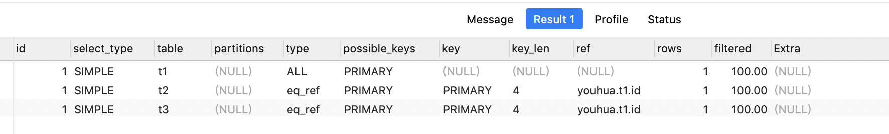
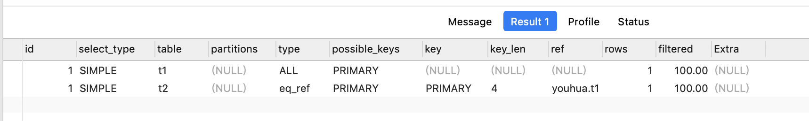
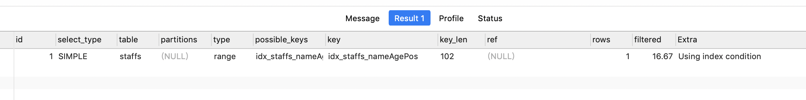
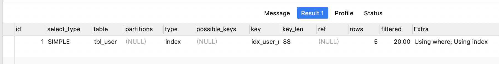
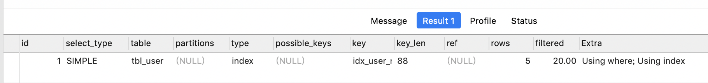

# Explain性能分析

## 1. 概念
使用EXPLAIN关键字可以模拟优化器执行SQL查询语句，从而知道MySQL是如何处理你的SQL语句的。分析你的查询语句或是表结构的性能瓶颈。

用法： Explain+SQL语句。

[执行计划](https://dev.mysql.com/doc/refman/5.7/en/execution-plan-information.html)

Explain执行后返回的信息：


## 2. Explain准备工作

```mysql
CREATE TABLE `t1` (
  `id` int(10) NOT NULL AUTO_INCREMENT,
  `content` varchar(100) DEFAULT NULL,
  PRIMARY KEY (`id`)
) ENGINE=InnoDB AUTO_INCREMENT=2 DEFAULT CHARSET=utf8mb4;

CREATE TABLE `t2` (
  `id` int(10) NOT NULL AUTO_INCREMENT,
  `content` varchar(100) DEFAULT NULL,
  PRIMARY KEY (`id`)
) ENGINE=InnoDB AUTO_INCREMENT=2 DEFAULT CHARSET=utf8mb4;


CREATE TABLE `t3` (
  `id` int(10) NOT NULL AUTO_INCREMENT,
  `content` varchar(100) DEFAULT NULL,
  PRIMARY KEY (`id`)
) ENGINE=InnoDB AUTO_INCREMENT=2 DEFAULT CHARSET=utf8mb4;


CREATE TABLE `t4` (
  `id` int(10) NOT NULL AUTO_INCREMENT,
  `content` varchar(100) DEFAULT NULL,
  PRIMARY KEY (`id`)
) ENGINE=InnoDB AUTO_INCREMENT=2 DEFAULT CHARSET=utf8mb4;


INSERT INTO t1(content) VALUES (CONCAT('t1_',FLOOR(1+RAND()*1000)));
INSERT INTO t2(content) VALUES (CONCAT('t2_',FLOOR(1+RAND()*1000)));
INSERT INTO t3(content) VALUES (CONCAT('t3_',FLOOR(1+RAND()*1000)));
INSERT INTO t4(content) VALUES (CONCAT('t4_',FLOOR(1+RAND()*1000)));
```


```mysql
#课程表
create table Course(
c_id int PRIMARY KEY,
name varchar(10)
);

#增加课程表100条数据
DROP PROCEDURE IF EXISTS insert_Course;
DELIMITER $
CREATE PROCEDURE insert_Course()
BEGIN
    DECLARE i INT DEFAULT 1;
        WHILE i<=100 DO
        INSERT INTO Course(c_id,name) VALUES(i, CONCAT('语文',i+''));
        SET i = i+1;
    END WHILE;
END $
CALL insert_Course();

#学生表
create table Student(
s_id int PRIMARY KEY,
name varchar(10)
);
#学生表增加70000条数据
DROP PROCEDURE IF EXISTS insert_Student;
DELIMITER $
CREATE PROCEDURE insert_Student()
BEGIN
    DECLARE i INT DEFAULT 1;
        WHILE i<=70000 DO
        INSERT INTO Student(s_id,name) VALUES(i, CONCAT('张三',i+''));
        SET i = i+1;
    END WHILE;
END $
CALL insert_Student();

#成绩表
CREATE table Result(
r_id int PRIMARY KEY,
s_id int,
c_id int,
score int
);
#成绩表增加70W条数据
DROP PROCEDURE IF EXISTS insert_Result;
DELIMITER $
CREATE PROCEDURE insert_Result()
BEGIN
    DECLARE i INT DEFAULT 1;
        DECLARE sNum INT DEFAULT 1;
        DECLARE cNum INT DEFAULT 1;
        WHILE i<=700000 DO
                if (sNum%70000 = 0) THEN
                    set sNum = 1;
                elseif (cNum%100 = 0) THEN 
                    set cNum = 1;
                end if;
        INSERT INTO Result(r_id,s_id,c_id,score) VALUES(i,sNum ,cNum , (RAND()*99)+1);
        SET i = i+1;
                SET sNum = sNum+1;
                SET cNum = cNum+1;
    END WHILE;
END $
CALL insert_Result();
```


## 3. id

>  select查询的序列号,包含一组数字，表示查询中执行select子句或操作表的顺序。  

①id相同，执行顺序由上至下

```mysql
EXPLAIN SELECT * FROM t1,t2,t3 WHERE t1.id=t2.id AND t2.id=t3.id
```




②id不同，id不同，如果是子查询，id的序号会递增，id值越大优先级越高，越先被执行

```mysql
EXPLAIN SELECT * FROM 	t1 WHERE t1.id = (SELECT t2.id FROM t2 WHERE t2.id =(SELECT t3.id FROM t3  WHERE t3.content =''))
#新版 mysql 中当我们的子查询是作为 in 的条件的时候会被优化为多个同时执行的 sql,而不是子查询
```


③有相同也有不同

```mysql
EXPLAIN SELECT t2.* FROM t2,(SELECT * from t3 WHERE t3.content='') s3 WHERE t2.id=s3.id
-- 使用5.7以上的 mysql 的时候此方式会被优化为两个 simple 查询
-- 可以使用以下结果来查询
EXPLAIN  SELECT * FROM (SELECT t2.id,t2.content FROM t2 UNION ALL SELECT t3.id,t3.content FROM t3) ut3;
```

`普通结果`


`使用方式2演示出的结果`


id如果相同，可以认为是一组，从上往下顺序执行；在所有组中，id值越大，优先级越高，越先执行 衍生 = DERIVED

 

关注点：`id号每个号码，表示一趟独立的查询。一个sql 的查询趟数越少越好。`

## 4. select_type
select_type代表查询的类型，主要是用于区别普通查询、联合查询、子查询等的复杂查询。


select_type属性

| select_type属性      | 含义                                                         |
| -------------------- | ------------------------------------------------------------ |
| SIMPLE               | 简单的 select 查询,查询中不包含子查询或者UNION               |
| PRIMARY              | 查询中若包含任何复杂的子部分，最外层查询则被标记为Primary    |
| DERIVED              | 在FROM列表中包含的子查询被标记为DERIVED(衍生)MySQL会递归执行这些子查询, 把结果放在临时表里。 |
| SUBQUERY             | 在SELECT或WHERE列表中包含了子查询                            |
| DEPEDENT SUBQUERY    | 在SELECT或WHERE列表中包含了子查询,子查询基于外层             |
| UNCACHEABLE SUBQUERY | 无法使用缓存的子查询                                         |
| UNION                | 若第二个SELECT出现在UNION之后，则被标记为UNION；若UNION包含在FROM子句的子查询中,外层SELECT将被标记为：DERIVED |
| UNION RESULT         | 从UNION表获取结果的SELECT                                    |

 

### 4.1 SIMPLE
SIMPLE代表单表查询；

```mysql
EXPLAIN SELECT * FROM t1;
```


### 4.2 PRIMARY
查询中若包含任何复杂的子部分，最外层查询则被标记为Primary。

```mysql
EXPLAIN SELECT * FROM 	t1 WHERE t1.id = (SELECT t2.id FROM t2 WHERE t2.id =(SELECT t3.id FROM t3  WHERE t3.content =''))
#新版 mysql 中当我们的子查询是作为 in 的条件的时候会被优化为多个同时执行的 sql,而不是子查询
```


### 4.3 DERIVED
在FROM列表中包含的子查询被标记为DERIVED(衍生),MySQL会递归执行这些子查询, 把结果放在临时表里。

### 4.4 SUBQUERY
在SELECT或WHERE列表中包含了子查询。

```mysql
EXPLAIN SELECT * FROM 	t1 WHERE t1.id = (SELECT t2.id FROM t2 WHERE t2.id =(SELECT t3.id FROM t3  WHERE t3.content =''))
#新版 mysql 中当我们的子查询是作为 in 的条件的时候会被优化为多个同时执行的 sql,而不是子查询
```


### 4.5 DEPENDENT SUBQUERY
在SELECT或WHERE列表中包含了子查询,子查询基于外层。

```mysql
EXPLAIN SELECT t2.id FROM t2 WHERE t2.id IN (SELECT t3.id from t3 WHERE t3.content='t3_466')
-- 以上 sql 在mysql 5.7中不在出现一下结果,而是两个 simple 查询

```


    都是where后面的条件，subquery是单个值，dependent subquery是一组值。

```mysql
EXPLAIN SELECT * FROM t1 WHERE t1.id IN (SELECT t2.id FROM t2 UNION SELECT t3.id FROM t3)
```


### 4.6 UNCACHEABLE SUBQUREY


当使用了@@来引用系统变量的时候，不会使用缓存。

### 4.7 UNION
若第二个SELECT出现在UNION之后，则被标记为UNION；若UNION包含在FROM子句的子查询中,外层SELECT将被标记为：DERIVED。

```mysql
EXPLAIN SELECT t2.id,t2.content FROM t2 UNION ALL SELECT t3.id,t3.content FROM t3;
```


### 4.8 UNION RESULT
从UNION表获取结果的SELECT。

```mysql
EXPLAIN SELECT * FROM t1 WHERE t1.id IN (SELECT t2.id FROM t2 UNION SELECT t3.id FROM t3)
```


## 5. table
这个数据是基于哪张表的。

## 6. type
type是查询的访问类型。是较为重要的一个指标，结果值从最好到最坏依次是：

system > const > eq_ref > ref > fulltext > ref_or_null > index_merge > unique_subquery > index_subquery > range > index > ALL ，一般来说，得保证查询至少达到range级别，最好能达到ref。

### 6.1 system
   表只有一行记录（等于系统表），这是const类型的特列，平时不会出现，这个也可以忽略不计

### 6.2 const
表示通过索引一次就找到了,const用于比较primary key或者unique索引。因为只匹配一行数据，所以很快

如将主键置于where列表中，MySQL就能将该查询转换为一个常量。

```mysql
EXPLAIN SELECT * FROM t1 WHERE id =1;
```


### 6.3 eq_ref
唯一性索引扫描，对于每个索引键，表中只有一条记录与之匹配。常见于主键或唯一索引扫描。

```mysql
EXPLAIN SELECT * FROM t1 ,t2 WHERE t1.id =t2.id;
```




### 6.4 ref

非唯一性索引扫描，返回匹配某个单独值的所有行.本质上也是一种索引访问，它返回所有匹配某个单独值的行，然而，它可能会找到多个符合条件的行，所以他应该属于查找和扫描的混合体。

```mysql
EXPLAIN SELECT * FROM t1 ,t2 WHERE t1.content =t2.content;
```


没用索引前：


建立索引后：

```mysql
CREATE INDEX index_t2_cont ON t2(content);
EXPLAIN SELECT * FROM t1 ,t2 WHERE t1.content =t2.content;
```


### 6.5 range
只检索给定范围的行,使用一个索引来选择行。key 列显示使用了哪个索引一般就是在你的where语句中出现了between、<、>、in等的查询这种范围扫描索引扫描比全表扫描要好，因为它只需要开始于索引的某一点，而结束语另一点，不用扫描全部索引。

```mysql
EXPLAIN SELECT * from t1 WHERE t1.id BETWEEN 1 and 3
```


```mysql
-- 以下方式原本会使用 range,但是在5.7之后的数据库成了全表扫描(经过测试,不确定百分百),如果这些条件的数据都在数据库中存在,会变成range,但是注意我们不敢保证数据一定是存在的
 EXPLAIN SELECT * from t1 WHERE t1.id IN (1,2,3); 
```


### 6.6 index
​    出现index是sql使用了索引但是没用通过索引进行过滤，一般是使用了覆盖索引或者是利用索引进行了排序分组。


```mysql
EXPLAIN SELECT * from t1
```


```mysql
EXPLAIN SELECT id from t1
-- index 代表使用率索引,但是没有过滤,因为我们此处要的是所有数据
```


### 6.7 all
​    Full Table Scan，将遍历全表以找到匹配的行。

```mysql
-- 注意上面给 t2.content 添加了索引,此处要先删除之前的索引
EXPLAIN SELECT * FROM t1 ,t2 WHERE t1.content =t2.content;
```


### 6.8 index_merge
在查询过程中需要多个索引组合使用，通常出现在有 or 的关键字的sql中。

```mysql
EXPLAIN SELECT * from t2 WHERE   t2.content IS NULL OR t2.id=2
-- 以上 sql 在新版mysql 中 type 为 index,注意6.7如果删除了索引,需要加回来
```


### 6.9 ref_or_null
对于某个字段既需要关联条件，也需要null值得情况下。查询优化器会选择用ref_or_null连接查询。

```mysql
EXPLAIN SELECT * from t2 WHERE t2.content IS NULL OR t2.content='anb'
```


### 6.10 index_subquery
利用索引来关联子查询，不再全表扫描。


### 6.11 unique_subquery


该联接类型类似于index_subquery。 子查询中的唯一索引。


备注：`一般来说，得保证查询至少达到range级别，最好能达到ref`。

## 7. possible_keys
显示可能应用在这张表中的索引，一个或多个。查询涉及到的字段上若存在索引，则该索引将被列出，`但不一定被查询实际使用。`

## 8. key
实际使用的索引。如果为NULL，则没有使用索引。

## 9. key_len
表示索引中使用的字节数，可通过该列计算查询中使用的索引的长度。 key_len字段能够帮你检查是否充分的利用上了索引。ken_len越长，说明索引使用的越充分。

```mysql
EXPLAIN SELECT * from t2 WHERE t2.content IS NULL OR t2.content='anb';
```


```mysql
desc t2;
```


如何计算：

①先看索引上字段的类型+长度比如 int=4 ;  varchar(`20`) =`20` ; char(`20`) =`20  `

②如果是varchar或者char这种字符串字段，视字符集要乘不同的值，比如utf-8  要乘 3,GBK要乘2，utf8mb4 乘以4

③varchar这种动态字符串要加2个字节

④允许为空的字段要加1个字节  

第一组：key_len=age的字节长度+name的字节长度=4+1  + ( 20*3+2)=5+62=67

第二组：key_len=age的字节长度=4+1=5


## 10. ref
显示索引的哪一列被使用了，如果可能的话，是一个常数。哪些列或常量被用于查找索引列上的值。

```mysql
EXPLAIN SELECT  * FROM t2 WHERE t2.id IN (SELECT t3.id FROM t3 )
```


## 11. rows

rows列显示MySQL认为它执行查询时必须检查的行数。越少越好！


```mysql
EXPLAIN SELECT  * FROM t2 WHERE t2.id IN (SELECT t3.id FROM t3 )
```


## 12. Extra

其他的额外重要的信息。

### 12.1 Using filesort
说明mysql会对数据使用一个外部的索引排序，而不是按照表内的索引顺序进行读取。MySQL中无法利用索引完成的排序操作称为“文件排序”。

出现filesort的情况：

```mysql
-- 以下操作查询的时候通过索引,但是排序的时候没有通过,一般出现的原因是 查询的条件和 order by 的条件不一致,
EXPLAIN SELECT * FROM Student  WHERE s_id IN (1,2,3,4,5) ORDER BY `name`;
```


优化后，不再出现filesort的情况：

```mysql
-- 此处的优化方式是指的 将我们的查询条件和排序条件保持一致,如果需求实在无法保证一致,则无法进行优化,在组合索引的情况下,排序需要用组合索引所在的列,注意name要加索引,在没有索引的情况下,这个是无效的
EXPLAIN SELECT * FROM Student  WHERE name IN ('张三1','张三2') ORDER BY `name`;
```


查询中排序的字段，排序字段若通过索引去访问将大大提高排序速度。

### 12.2 Using temporary
使了用临时表保存中间结果,MySQL在对查询结果排序时使用临时表。常见于排序 order by 和分组查询 group by。

```mysql
EXPLAIN SELECT * FROM Course c,Student s,Result r WHERE c.c_id =r.c_id AND r.s_id =s.s_id ORDER BY s.name; 
-- 此处产生临时表,究其原因也是查询条件的索引和 order by 的不一致
```


优化前：


优化后：

```mysql
EXPLAIN SELECT * FROM Course c,Student s,Result r WHERE c.c_id =r.c_id AND r.s_id =s.s_id ORDER BY c.c_id
-- 实际开发中,我们要求 order by 的列需要在条件中出现, 如果是组合索引,那么 order by 中必须按照对应顺序出现索引,比如 clo1,clo2,col3三个为组合索引,那么 oder by 后应该是 clo1,clo2 或者col1,col2,col3 ,但是不能出现 col1,col3或者 col2,col3,遵从最左侧原则,此原则也适用于作为条件查询,注意我们的条件的比较顺序也会有影响,比如我们把 r.s_id =s.s_id换成 s.s_id =r.s_id也会影响
```


### 12.3 Using index
Using index代表表示相应的select操作中使用了覆盖索引(Covering Index)，避免访问了表的数据行，效率不错！

如果同时出现using where，表明索引被用来执行索引键值的查找;如果没有同时出现using where，表明索引只是用来读取数据而非利用索引执行查找。

覆盖索引(Covering Index) 发生的情况为 我们指定了 col1,col2,col3组合索引,我们 select 中指定了返回结果为 三个列中的列(或三个列全部),没有返回超出三列之外的数据

利用索引进行了排序或分组。

```mysql
EXPLAIN SELECT * FROM Student  WHERE name ='张三1'
```


### 12.4 Using where
表明使用了where过滤。

```mysql
EXPLAIN SELECT * FROM Course c,Student s,Result r WHERE c.c_id =r.c_id AND r.s_id =s.s_id;
```


### 12.5 Using join buffer

内连接缓存,此方式的条件为没有经过索引的列

```mysql
EXPLAIN SELECT * FROM t1  JOIN	 t2 ON t1.content=t2.content
```


使用了连接缓存。

### **12.6 impossible where**

where条件中出现了不可能的情情况,比如一个列的值即等于A又等于B。

```mysql
EXPLAIN SELECT * FROM t1 WHERE t1.id=1 AND t1.id=2
```


### 12.7 select tables optimized away

在没有GROUPBY子句的情况下，基于索引优化MIN/MAX操作或者对于MyISAM存储引擎优化COUNT(*)操作，不必等到执行阶段再进行计算，查询执行计划生成的阶段即完成优化。

在innodb中：


在Myisam中：


# 索引建立

## 1 单表创建

> 单表的索引是以谁做条件,则建立在谁上面,一般加在经常用作查询条件的列

## 2 两表创建

1. 使用左连接的时候将索引建立在右表上(建立在条件列上))
2. 使用右连接的时候,索引建立在左表上

## 3 三表创建索引

> 同两表,左查询的一段在右表, 右查询的一段在左表

`join优化`

> 使用小表驱动大表, 小表就是数据少的表
>
> 减少嵌套查询
>
> 如果有嵌套查询,优先优化嵌套


# 索引失效

```mysql
CREATE TABLE `staffs`  (
  `id` int NOT NULL AUTO_INCREMENT,
  `NAME` varchar(24) NOT NULL DEFAULT "" COMMENT '名字',
  `age` int NOT NULL DEFAULT 0 COMMENT '年龄',
  `pos` varchar(20) NOT NULL DEFAULT "" COMMENT '职务',
  `add_time` timestamp NOT NULL DEFAULT CURRENT_TIMESTAMP COMMENT '入职时间',
  PRIMARY KEY (`id`)
);
INSERT INTO staffs (NAME,age,pos,add_time) VALUES ('z3',22,'manager',NOW());
INSERT INTO staffs (NAME,age,pos,add_time) VALUES ('zhangsan',23,'dev',NOW());
INSERT INTO staffs (NAME,age,pos,add_time) VALUES ('2000',23,'dev',NOW());

ALTER TABLE staffs add INDEX idx_staffs_nameAgePos(name,age,pos);
```

### 1索引失效的情况

1. 全值匹配,查询的时候联合索引的所有的列都应该有值,索引列理论上不能允许为null,否则会导致索引失效
2. 最佳左侧前缀法则,联合索引的时候,查询条件应该根据联合索引的创建顺序依次使用,不能跳过
3. 不在索引列上做任何操作,如计算,函数 ,类型转换等,会导致全表扫描
4. 存储引擎不能使用索引中范围条件右边的列
5. 减少select * 的使用
6. mysql在使用不等于(!=或者<>)的时候无法使用索引会导致全表扫描
7. is null is not null 也无法使用索引
8. like以通配符开头 索引可能会失效


### 失效原因1:左侧前缀

```mysql
EXPLAIN SELECT * FROM staffs WHERE name = 'zhangsan' -- 能用到索引
```


```mysql
EXPLAIN SELECT * FROM staffs WHERE name = 'zhangsan' AND age=23 -- 也能用到索引
```


```mysql
EXPLAIN SELECT * FROM staffs WHERE name = 'zhangsan' AND age=23 AND pos = 'dev' -- 也能用到索引

```


```mysql
-- 但是，以下情况没有用到索引........
EXPLAIN SELECT * FROM staffs WHERE age=23 AND pos = 'dev'
```


原因:`最佳左前缀法则`

如果索引了多列(联合索引)，要遵守最左前缀法则，指的是查询从索引的最左前缀开始并且不跳过索引的列。 至少联合索引第一个是不能跳过的

 如果把索引的3个字段中间拆掉呢?

```mysql
EXPLAIN SELECT * FROM staffs WHERE name = 'zhangsan' AND pos = 'dev' -- 也用到了索引，不过只是部,只有第一个索引
```


### 失效原因2:列上面做了计算

不要在索引列上做任何操作(计算、函数、(自动或者手动)类型转换)，会导致索引失效转向全表扫描

```mysql
EXPLAIN SELECT * FROM staffs WHERE LEFT(name,4) = 'zhangsan' -- left是一个函数，就是字符串截取的作用
```


### 索引优化3

> 存储引擎不能使用索引中范围条件右边的列,如果联合索引中出现范围值,会导致后面的索引失效

```mysql
EXPLAIN SELECT * FROM staffs WHERE name = 'zhangsan' AND age=23 AND pos = 'dev' -- 可以使用索引
-- 但是如果改成了以下
EXPLAIN SELECT * FROM staffs WHERE name = 'zhangsan' AND age>23 AND pos = 'dev'
-- 把上面的select * 改为select xxx会好一点(type=ref)
```



### 索引优化4

> 减少select * 的使用 尽量使用覆盖索引(只访问索引的查询(索引列和查询列一致))，减少select *


```mysql
EXPLAIN SELECT * FROM staffs WHERE name = 'zhangsan' AND age>23 AND pos = 'dev'
```


```mysql
EXPLAIN SELECT name,age,pos FROM staffs WHERE name = 'zhangsan' AND age>23 AND pos = 'dev'
```


`select 后面接的字段如果和使用的索引的字段一致的话，是有可能using index的`


### 索引优化5

> mysql在使用不等于(!=或者<>)的时候无法使用索引会导致全表扫描

```mysql
EXPLAIN SELECT * FROM staffs WHERE name = 'zhangsan'
```


`能用到索引,但是修改一下`

```mysql
EXPLAIN SELECT * FROM staffs WHERE name != 'zhangsan'
```


索引用不上了

```mysql
EXPLAIN SELECT * FROM staffs WHERE name <> 'zhangsan' -- 也同理
```

### 索引优化6

> is null is not null 也无法使用索引

```mysql
EXPLAIN SELECT * FROM staffs WHERE name is NULL
```


`全null，Impossible Where 因为该字段本来不为空`

```mysql
EXPLAIN SELECT * FROM staffs WHERE name is not NULL -- 同样没有用到索引
```


### 索引优化7

> like以通配符开头 索引会失效

```mysql
EXPLAIN SELECT * FROM staffs WHERE name like '%zhangsan%' -- 全表扫描
```


```mysql
EXPLAIN SELECT * FROM staffs WHERE name like '%zhangsan' -- 同上
```


```mysql
EXPLAIN SELECT * FROM staffs WHERE name like 'zhangsan%'
```


`type为range了，说明通配符只有写在右边才不会失效!`

**问题:解决like '%字符串%'时索引不被使用的方法??**

```mysql
CREATE TABLE `youhua`.`tbl_user`  (
  `id` int(11) NOT NULL AUTO_INCREMENT,
  `NAME` varchar(20) NULL,
  `age` int(11) NULL,
  `email` varchar(20) NULL,
  PRIMARY KEY (`id`)
);


INSERT INTO tbl_user (NAME,age,email) VALUES ('1aa1',21,'b@163.com');
INSERT INTO tbl_user (NAME,age,email) VALUES ('2aa2',222,'a@163.com');
INSERT INTO tbl_user (NAME,age,email) VALUES ('3aa3',265,'c@163.com');
INSERT INTO tbl_user (NAME,age,email) VALUES ('4aa4',21,'d@163.com');
INSERT INTO tbl_user (NAME,age,email) VALUES ('aa',121,'e@163.com');

```

```mysql
SELECT NAME,age FROM tbl_user WHERE `NAME` LIKE '%aa%'
```


**`使用索引之前`**

> 以下结果都一样,全表扫描

```mysql
EXPLAIN SELECT NAME,age FROM tbl_user WHERE `NAME` LIKE '%aa%'
EXPLAIN SELECT id FROM tbl_user WHERE `NAME` LIKE '%aa%'
EXPLAIN SELECT NAME FROM tbl_user WHERE `NAME` LIKE '%aa%'
EXPLAIN SELECT age FROM tbl_user WHERE `NAME` LIKE '%aa%'
EXPLAIN SELECT id,NAME FROM tbl_user WHERE `NAME` LIKE '%aa%'
```


**`添加索引`**

```mysql
CREATE INDEX idx_user_nameAge ON tbl_user (name,age);
```

再查一次

```mysql
EXPLAIN SELECT name,age FROM tbl_user WHERE name LIKE '%aa%';
```



发现用上了索引
如果查询的字段是非索引的字段id呢?

```mysql
EXPLAIN SELECT id FROM tbl_user WHERE name LIKE '%aa%'; -- 使用了索引,注意条件列必须是索引中的
```



依然用上了索引!!!原因:id是主键?主键自带了主键索引

```mysql
EXPLAIN SELECT name FROM tbl_user WHERE name LIKE '%aa%'; -- 也用到索引 age也一样。
-- id,name也一样。因为 id 是主键,有索引
-- id,name,age也一样。
-- name,age也一样。
```


```mysql
EXPLAIN SELECT * FROM tbl_user WHERE name LIKE '%aa%'; -- 失效了
EXPLAIN SELECT NAME,age,email FROM tbl_user WHERE name LIKE '%aa%'; -- 失效了
-- 查询的时候多出一个索引外的列就会失效
```


> 当要想 like 能使用索引的时候,建议添加复合索引


### 索引优化8

> 字符串不加单引号索引失效
>
> 不加单引号，会引起数据类型的转换而导致全表扫描

比如 ,前面的 staffs 表中


如果要查name为2000的数据?

```mysql
SELECT * FROM staffs WHERE name = '2000' 
-- 但是，
SELECT * FROM staffs WHERE name = 2000 -- 也能查出来
```

`分析`

```mysql
EXPLAIN SELECT * FROM staffs WHERE name = '2000' -- 使用了索引
```


```mysql
EXPLAIN SELECT * FROM staffs WHERE name = 2000 -- 没有使用索引
```


### 索引优化9

> 少用or，用它来连接时会索引失效

```mysql
EXPLAIN SELECT * FROM staffs WHERE NAME = 'July' OR NAME ='z3'
```


