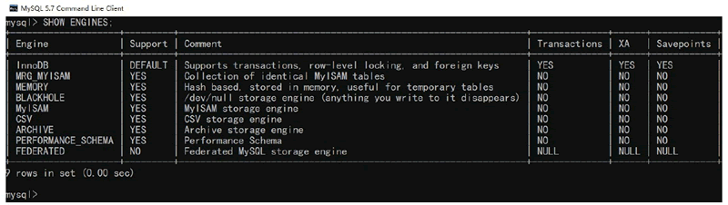
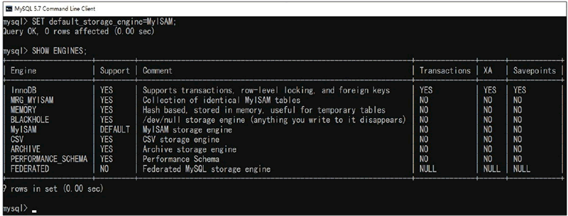
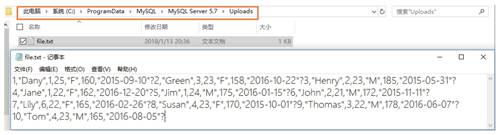

# 一 数据库的概念

本节介绍数据库的基本概念，包括数据库存储方式、数据库技术的发展历史、数据库的存储结构以及数据库在开发中的作用。

## 1.1 数据存储方式

计算机数据（Data）的存储一般以硬盘为数据存储空间资源，从而保证计算机内的数据能够持续保存。对于数据的处理，一般会采用数据库相关的技术进行处理，从而保证数据处理的高效性。
采用数据库的管理模式不仅提高了数据的存储效率，而且在存储的层面上提高了数据的安全性。通过分类的存储模式让数据管理更加安全便捷，更能实现对数据的调用和对比，并且方便查询等操作的使用。


## 1.2 什么是数据库

数据库的存储结构是指数据库中的物理数据和逻辑数据的表示形式、物理数据和逻辑数据之间关系映射方式的描述。在数据库技术中，可以使用两种形式描述客观现实的数据：物理数据描述和逻辑数据描述。物理数据和逻辑数据之间的转换通过数据库管理系统实现。

#### 1.2.1 物理数据描述

物理数据描述是指数据在存储设备上的存储方式，物理数据是实际存放在存储设备上的数据，这些数据也称为物理记录。根据物理记录存储的位置，又可以分为有序存储和无序存储。

在物理数据描述中，使用的数据描述术语包括以下各项。

- 位（bit）：二进制的一个单位称为位，位只能取 1 或 0。
- 字节（byte）：8 个位称为一个字节，可以存放对应 [ASCII](http://c.biancheng.net/c/ascii/) 码的一个字符。
- 字（word）：若干个字节组成一个字。一个字所含的二进制的位数称为字长，许多计算机的字长是不同的，例如计算机的字长可以是 8 位、16 位、24 位、32 位等。
- 块（block）：内存储器和外存储器交换信息的最小单位，又称为物理块或物理记录，每块的大小通常为 256 字节、512 字节、1024 字节等。
- 卷（volume）：一台输入输出设备所能装载的全部有用信息，例如磁带机的一盘磁带即为一卷，磁盘设备的一个盘组也是一卷。
- 无序存储（unordered）：数据记录按照插入的顺序进行存储。

#### 1.2.2 逻辑数据描述

逻辑数据描述是指用户或程序员用于操作的数据形式，逻辑数据是一种抽象的概念，是对客观现实世界的反映和记录，这些数据也可以称为逻辑记录。
逻辑数据包含两个层次，一个层次是对客观现实信息世界的描述，另一个层次是对数据库管理系统中数据的描述。

在对客观现实信息世界的描述中，使用的术语包括以下几项。

- 实体（entity）：客观现实存在的东西使用实体来描述。实体既可以是具体的、有形的对象，也可以是抽象的、无形的对象。例如，一本书是一个有形对象，一次借书过程则是一个无形的对象。
- 实体集（entities）：特性完全相同的同类实体的集合称为实体集。例如，一个图书馆所有的书籍是一个实体集，该图书馆的所有借书过程也是一个实体集。
- 属性（attribute）：实体的特性称为属性。每个属性都有一个值域，这些值域可以是整数类型、浮点数类型、字符类型或日期类型等。例如，实体书的属性包括书名、书号、出版日期、页数、价格以及出版社等，这些属性对应的值域分别为字符类型、字符类型、日期类型、整数类型、浮点数类型和字符类型等。
- 标识符（identifier）：能够唯一地标识每个实体的属性或属性集。例如，书的书号属性是实体书的标识符，借书过程实体的标识符包括借书证号、书号两个属性。


这些逻辑数据最终要通过数据库管理系统来转换成物理数据。在数据库管理系统中，描述逻辑数据的术语包括哪些呢？
下面以关系型数据库管理系统为例进行介绍。

- 数据项（data item）：也称为字段（field），标记实体属性的可以命名的最小信息单位，数据项的命名一般采用属性的描述性名称。这些名称可以是中文、英文或汉语拼音。
- 元组（tuple）：也称为记录（record），数据项的集合称为元组。一个元组表示一个具体的实体。
- 关系（relation）：在关系型数据库系统中，同一类元组所在的集合称为关系。关系适用于描述实体集，它包括一个实体集的所有元组。例如，所有的图书可以组成一个 books 关系。
- 键码（key）：在关系型数据库系统中，能够唯一地标识关系中每个元组的数据项或数据项的组合称为关系的键码。


客观实体经过两层逻辑数据的描述，最后转变成实际存储的物理数据。

## 1.3 数据库的存储结构

数据库的存储结构是指数据库中的物理数据和逻辑数据的表示形式、物理数据和逻辑数据之间关系映射方式的描述。在数据库技术中，可以使用两种形式描述客观现实的数据：物理数据描述和逻辑数据描述。物理数据和逻辑数据之间的转换通过数据库管理系统实现。

#### 1.3.1 物理数据描述

物理数据描述是指数据在存储设备上的存储方式，物理数据是实际存放在存储设备上的数据，这些数据也称为物理记录。根据物理记录存储的位置，又可以分为有序存储和无序存储。
在物理数据描述中，使用的数据描述术语包括以下各项。

#### 1.3.2 逻辑数据描述

逻辑数据描述是指用户或程序员用于操作的数据形式，逻辑数据是一种抽象的概念，是对客观现实世界的反映和记录，这些数据也可以称为逻辑记录。
逻辑数据包含两个层次，一个层次是对客观现实信息世界的描述，另一个层次是对数据库管理系统中数据的描述。

- 实体（entity）：客观现实存在的东西使用实体来描述。实体既可以是具体的、有形的对象，也可以是抽象的、无形的对象。例如，一本书是一个有形对象，一次借书过程则是一个无形的对象。
- 实体集（entities）：特性完全相同的同类实体的集合称为实体集。例如，一个图书馆所有的书籍是一个实体集，该图书馆的所有借书过程也是一个实体集。
- 属性（attribute）：实体的特性称为属性。每个属性都有一个值域，这些值域可以是整数类型、浮点数类型、字符类型或日期类型等。例如，实体书的属性包括书名、书号、出版日期、页数、价格以及出版社等，这些属性对应的值域分别为字符类型、字符类型、日期类型、整数类型、浮点数类型和字符类型等。
- 标识符（identifier）：能够唯一地标识每个实体的属性或属性集。例如，书的书号属性是实体书的标识符，借书过程实体的标识符包括借书证号、书号两个属性。


这些逻辑数据最终要通过数据库管理系统来转换成物理数据。在数据库管理系统中，描述逻辑数据的术语包括哪些呢？

下面以关系型数据库管理系统为例进行介绍。

- 数据项（data item）：也称为字段（field），标记实体属性的可以命名的最小信息单位，数据项的命名一般采用属性的描述性名称。这些名称可以是中文、英文或汉语拼音。
- 元组（tuple）：也称为记录（record），数据项的集合称为元组。一个元组表示一个具体的实体。
- 关系（relation）：在关系型数据库系统中，同一类元组所在的集合称为关系。关系适用于描述实体集，它包括一个实体集的所有元组。例如，所有的图书可以组成一个 books 关系。
- 键码（key）：在关系型数据库系统中，能够唯一地标识关系中每个元组的数据项或数据项的组合称为关系的键码。

客观实体经过两层逻辑数据的描述，最后转变成实际存储的物理数据。

## 1.4 数据库在开发中的作用

从数据库系统应用角度来看，数据库系统常见的运行与应用结构有：客户端/服务器结构、浏览器/服务器结构。

在客户端/服务器（Client/Server，C/S）结构中，数据库的使用者（如 DBA、程序设计者）通过命令行客户端、图形化界面管理工具或应用程序等连接到数据库管理系统，可以通过数据库管理系统查询和处理存储在底层数据库中的各种数据。

数据库使用者与命令行客户端、图形化界面管理工具或应用程序等直接交互，而不与数据库管理系统直接联系。

在这种结构中，命令行客户端、图形化界面管理工具或应用程序等称为“客户端”或“前台”，主要完成与数据库使用者的交互任务；而数据库管理系统则称为“服务器”或“后台”，主要负责数据管理。这种结构经常被称为“C/S”结构。

在客户端/服务器模式中，客户端和服务器可以同时工作在同一台计算机上，这种工作方式称为“单机方式”；也可以“网络方式”运行，即服务器被安装和部署在网络中某一台或多台主机上。

对于客户端应用程序的开发，目前常用的语言工具主要有 Visual [C++](http://c.biancheng.net/cplus/)、Delphi、.NET 框架、Visual Basic、Python等。

数据库能有效存储数据，读取数据、查找数据更是方便，其实那些管理软件就是通过软件的界面向内部的数据库进行数据的增、删、改、查操作。

# 二 数据库涉及技术

本节主要介绍数据库涉及到的技术，包括数据库系统、SQL 语言和数据库访问技术。

## 2.1 数据库系统

数据库管理系统（Database Management System，DBMS）是位于操作系统与用户之间的一种操纵和管理数据库的软件，按照一定的数据模型科学地组织和存储数据，同时可以提供数据高效地获取和维护。

DBMS的主要功能包括以下几个方面。

#### 1) 数据定义功能

DBMS 提供数据定义语言（Data Definition Language，DDL），用户通过它可以方便地对数据库中的数据对象进行定义。

#### 2) 数据操纵功能

DBMS 还提供数据操纵语言（Data Manipulation Language，DML），用户可以使用 DML 操作数据，实现对数据库的基本操作，如查询、插入、删除和修改等。

#### 3) 数据库的运行管理

数据库在建立、运用和维护时由数据库管理系统统一管理、统一控制，以保证数据的安全性、完整性、多用户对数据的并发使用及发生故障后的系统恢复。例如：

- 数据的完整性检查功能保证用户输入的数据应满足相应的约束条件；
- 数据库的安全保护功能保证只有赋予权限的用户才能访问数据库中的数据；
- 数据库的并发控制功能使多个用户可以在同一时刻并发地访问数据库的数据；
- 数据库系统的故障恢复功能使数据库运行出现故障时可以进行数据库恢复，以保证数据库可靠地运行。

#### 4) 提供方便、有效地存取数据库信息的接口和工具

编程人员可通过编程语言与数据库之间的接口进行数据库应用程序的开发。数据库管理员（Database Administrator，DBA）可通过提供的工具对数据库进行管理。
数据库管理员是维护和管理数据库的专门人员。

#### 5) 数据库的建立和维护功能

数据库功能包括数据库初始数据的输入、转换功能，数据库的转储、恢复功能，数据库的重组织功能和性能监控、分析功能等。这些功能通常由一些使用程序来完成。
数据库系统是指在计算机系统中引入数据库后的系统。一个完整的数据库系统（Database System，DBS）一般由数据库、数据库管理系统、应用开发工具、应用系统、数据库管理员和用户组成。完整的数据库系统结构关系如图所示：


## 2.2 了解SQL语言

MySQL服务器正确安装以后，就已经完成了一个完整的 DBMS 的搭建，可以通过命令行管理工具或者图形化的管理工具对 MySQL 数据库进行操作。这种操作实质上是通过结构化查询语言（Structured Query Language，SQL）来实现的，SQL 语言是各种数据库交互方式的基础。

SQL 是一种数据库查询和程序设计语言，用于存取数据以及查询、更新和管理关系数据库系统。与其他程序设计语言（如C、Java等）不同的是，SQL 由很少的关键字组成，每个 SQL 语句通过一个或多个关键字构成。

SQL具有如下优点。

1. 一体化：SQL集数据定义、数据操作和数据控制于一体，可以完成数据库中的全部工作。
2. 使用方式灵活：SQL具有两种使用方式，可以直接以命令方式交互使用；也可以嵌入使用，嵌入C、C++、Fortran、COBOL、Java等语言中使用。
3. 非过程化：只提操作要求，不必描述操作步骤，也不需要导航。使用时只需要告诉计算机“做什么”，而不需要告诉它“怎么做”。
4. 语言简洁、语法简单、好学好用：在ANSI标准中，只包含94个英文单词，核心功能只用6个动词，语法接近英语口语。

```
注意：SQL 语句不区分大小写，许多 SQL 开发人员习惯对 SQL 本身的关键字进行大写，而对表或者列的名称使用小写，这样可以提高代码的可阅读性和可维护性。本教程也按照这种方式组织 SQL 语句。大多数数据库都支持通用的 SQL 语句，同时不同的数据库具有各自特有的 SQL 语言特性。
```

## 2.3 数据库访问技术

数据库访问技术包括 ODBC、DAO、OLE DB 和 ADO

#### ODBC

ODBC（Open Database Connectivity，开放数据库互连）是微软公司开放服务结构（Windows Open Services Architecture，WOSA）中有关数据库的一个组成部分，它建立了一组规范，并提供了一组对数据库访问的标准 API（应用程序编程接口）。这些 API 利用 SQL 来完成其大部分任务。

ODBC 本身也提供了对 SQL 语言的支持，用户可以直接将 SQL 语句送给 ODBC

#### DAO

DAO（Data Access Object，数据访问对象集）是 Microsoft 提供的基于一个数据库对象集合的访问技术，可以独立于 DBMS 进行数据库的访问。

#### OLE DB

OLE DB（Object Linking and Embedding Database，对象连接与嵌入）是微软战略性的通向不同数据源的低级应用程序接口。OLE DB 不仅包括微软资助的标准数据接口，开放数据库连通性（ODBC）的结构化查询语言（SQL）能力，还具有面向其他非 SQL 数据类型的通路。

作为微软的组件对象模型（COM）的一种设计，OLE DB 是一组读写数据的方法（在过去可能称为渠道）。OLD DB 中的对象主要包括数据源对象、阶段对象、命令对象和行组对象

#### ADO

ADO（ActiveX Data Objects）是一个用于存取数据源的 COM 组件，提供了编程语言和统一数据访问方式 OLE DB 的一个中间层，允许开发人员编写访问数据的代码而不用关心数据库是如何实现的，只用关心到数据库的连接。
访问数据库的时候，关于 SQL 的知识不是必要的，但是特定数据库支持的 SQL 命令仍可以通过 ADO 中的命令对象来执行。


# 三 MySQL的优势（优点）

MySQL是一个关系型数据库管理系统，由瑞典 MySQL AB 公司开发，目前属于 Oracle 公司。

MySQL 使用的 SQL 语言是用于访问数据库的最常用的标准化语言。

由于 MySQL 数据库体积小、速度快、总体拥有成本低、开放源代码，其有着广泛的应用，一般中小型网站的开发都选择 MySQL 作为网站数据库。由于其社区版的性能卓越，因此搭配 PHP 和 Apache 服务器可组成良好的开发环境。

MySQL 数据库管理系统具有以下系统特性：

- 使用 C 和 C++编写，并使用多种编译器进行测试，保证源代码的可移植性。
- 支持 AIX、FreeBSD、HP-UX、Linux )、Mac OS、NovellNetware、OpenBSD、OS/2 Wrap、Solaris、Windows 等多种操作系统。
- 为多种编程语言提供了 API。这些编程语言包括 C、C++、Python 、Java  、Perl、PHP、Eiffel、Ruby 和 Tcl 等。
- 支持多线程，充分利用 CPU 资源。
- 优化的 SQL 查询算法，有效地提高查询速度。
- 既能够作为一个单独的应用程序应用在客户端服务器网络环境中，也能够作为一个库而嵌入其他的软件中。
- 提供多语言支持，常见的编码如中文的 GB 2312、BIG 5，日文的 Shift_JIS 等都可以用作数据表名和数据列名。
- 提供 TCP/IP、ODBC 和 JDBC 等多种数据库连接途径。
- 提供用于管理、检查、优化数据库操作的管理工具。
- 支持大型的数据库。可以处理拥有上千万条记录的大型数据库。
- 支持多种存储引擎。

# 四 MySQL 5.7的新特性

与 MySQL 5.6 相比，MySQL 5.7 具有以下几个方面的新功能。

#### 1) 随机 root 密码

MySQL 5.7 数据库初始化完成后，会自动生成一个 root@localhost 用户，root 用户的密码不为空，而是随机产生一个密码。

#### 2) 自定义 test 数据库

MySQL 5.7 默认安装完成后没有 test 数据库。用户可以自行创建 test 数据库并对其进行权限控制。

#### 3) 默认 SSL 加密

MySQL 5.7 采用了更加简单的 SSL 安全访问机制，默认连接使用 SSL 的加密方式。

#### 4) 密码过期策略

MySQL 5.7 支持用户设置密码过期策略，要求用户在一定时间过后必须修改密码。

#### 5) 用户锁

MySQL 5.7 为管理员提供了暂时禁用某个用户的功能，使被锁定的用户无法访问和使用数据库。

#### 6) 全面支持JSON

MySQL 5.7在服务器端提供了一组便于操作 JSON 的函数。存储的方法是将 JSON 编码成 BLOB 后再由存储引擎进行处理。这样，MySQL 就同时拥有了关系型数据库和非关系型数据库的优点，并且可以提供完整的事务支持。

#### 7) 支持两类生成列（generated column）

生成列是通过数据库中的其他列计算得到的一列。当为生成列创建索引时，可以便捷地加快查询速度。MySQL 5.7 支持虚拟生成列和存储生成列。虚拟生成列仅将数据保存在表的元数据中，作为缺省的生成列类型；存储生成列则是将数据永久保存在磁盘上，需要更多的磁盘空间。

#### 8) 引入系统库（sys schema）

系统库中包含一系列视图、函数和存储过程，通过多线程、多进程、组合事务提交和基于行的优化方式将复制功能提高 5 倍以上，用户向外扩充其跨商品系统的工作负载时，得以大幅提升复制的效能和效率


# 五 MySQL客户端和服务器端工具集

 MySQL 一般是安装在服务器上的，我们在客户端可以进行连接，然后可以进行一些增删改查操作。下面我们分服务器端和客户端来讲解一下 MySQL 的实用工具集。

## 5.1 MySQL 服务器端实用工具

#### 1) mysqld

SQL 后台程序（即 MySQL 服务器进程）。该程序必须运行之后，客户端才能通过连接服务器来访问数据库。

#### 2) mysqld_safe

服务器启动脚本。在 UNIX 和 NewWare 中推荐使用 mysqld_safe 来启动 mysqld 服务器。mysqld_safe 增加了一些安全性，例如，当出现错误时，重启服务器并向错误日志文件中写入运行时间信息。

#### 3) mysql.server

服务器启动脚本。该脚本用于使用包含为特定级别的、运行启动服务器脚本的、运行目录的系统。它调用 mysqld_safe 来启动 MySQL 服务器。

#### 4) mysqld_multi

服务器启动脚本，可以启动或停止系统上安装的多个服务器。

#### 5) mysamchk

用来描述、检查、优化和维护 MyISAM 表的实用工具。

#### 6) mysql.server

服务器启动脚本。在 UNIX 中的 MySQL 分发版包括 mysql.server 脚本。

#### 7) mysqlbug

MySQL 缺陷报告脚本。它可以用来向 MySQL 邮件系统发送缺陷报告。

#### 8) mysql_install_db

该脚本用默认权限创建 MySQL 授予权表。通常只是在系统上首次安装 MySQL 时执行一次。


## 5.2 MySQL 客户端实用工具

#### 1) myisampack

压缩 MyISAM 表以产生更小的只读表的一个工具。

#### 2) mysql

交互式输入 SQL 语句或从文件经批处理模式执行它们的命令行工具。

#### 3) mysqlacceess

检查访问主机名、用户名和数据库组合的权限的脚本。

#### 4) mysqladmin

执行管理操作的客户程序，例如创建或删除数据库、重载授权表、将表刷新到硬盘上以及重新打开日志文件。Mysqladmin 还可以用来检索版本、进程以及服务器的状态信息。

#### 5) mysqlbinlog

从二进制日志读取语句的工具。在二进制日志文件中包含执行过的语句，可用来帮助系统从崩溃中恢复。

#### 6) mysqlcheck

检查、修复、分析以及优化表的表维护客户程序。

#### 7) mysqldump

将 MySQL 数据库转储到一个文件（例如 SQL 语句或 Tab 分隔符文本文件）的客户程序。

#### 8) mysqlhotcopy

当服务器在运行时，快速备份 MyISAM 或 ISAM 表的工具。

#### 9) mysql import

使用 LOAD DATA INFILE 将文本文件导入相应的客户程序。

#### 10) mysqlshow

显示数据库、表、列以及索引相关信息的客户程序。

#### 11) perror

显示系统或 MySQL 错误代码含义的工具。


# 六 MySQL创建数据库


数据库可以看作是一个专门存储数据对象的容器，这里的数据对象包括表、视图、触发器、存储过程等，其中表是最基本的数据对象。在 MySQL 数据库中创建数据对象之前，先要创建好数据库。
在 MySQL 中，可以使用  语句创建数据库，语法格式如下： 数据库中创建数据对象之前，先要创建好数据库。

```
CREATE DATABASECREATE DATABASE [IF NOT EXISTS] <数据库名>
[[DEFAULT] CHARACTER SET <字符集名>] [[DEFAULT] COLLATE <校对规则名>];
```

`[ ]`中的内容是可选的。语法说明如下：

- <数据库名>：创建数据库的名称。MySQL 的数据存储区将以目录方式表示 MySQL 数据库，因此数据库名称必须符合操作系统的文件夹命名规则，注意在 MySQL 中不区分大小写。
- IF NOT EXISTS：在创建数据库之前进行判断，只有该数据库目前尚不存在时才能执行操作。此选项可以用来避免数据库已经存在而重复创建的错误。
- [DEFAULT] CHARACTER SET：指定数据库的默认字符集。
- [DEFAULT] COLLATE：指定字符集的默认校对规则。

MySQL 的字符集（CHARACTER）和校对规则（COLLATION）两个不同的概念：字符集是用来定义 MySQL 存储字符串的方式，校对规则定义了比较字符串的方式，解决排序和字符分组的问题。

字符集和校对规则是一对多的关系，每个字符集至少对应一个校对规则，MySQL 支持 39 种字符集的将近 200 种校对规则。

#### 实例1：最简单的创建 MySQL 数据库的语句

在 MySQL 中创建一个名为 test_db 的数据库。在 MySQL 命令行客户端输入 SQL 语句`CREATE DATABASE test_db;`

```mysql
mysql> CREATE DATABASE test_db;
Query OK, 1 row affected (0.12 sec)
```

若再次输入上述语句，则系统会给出错误提示信息，如下所示：

```mysql
mysql> CREATE DATABASE test_db;
ERROR 1007 (HY000): Can't create database 'test_db'; database exists
```

`MySQL 不允许在同一系统创建两个相同名称的数据库。`

如果加上`IF NOT EXISTS`

```mysql
mysql> CREATE DATABASE IF NOT EXISTS test_db;
Query OK, 1 row affected (0.12 sec)
```

#### 实例2：创建 MySQL 数据库时指定字符集和校对规则

使用 MySQL 命令行工具创建一个测试数据库，命名为 test_db_char，指定其默认字符集为 utf8，默认校对规则为 utf8_chinese_ci（简体中文，不区分大小写），输入的 SQL 语句与执行结果如下所示：

```mysql
mysql> CREATE DATABASE IF NOT EXISTS test_db_char
    -> DEFAULT CHARACTER SET utf8
    -> DEFAULT COLLATE utf8_chinese_ci;
Query OK, 1 row affected (0.03 sec)
```

这时，可以使用`SHOW CREATE DATABASE`查看 test_db_char 数据库的定义声明，发现该数据库的指定字符集为 utf8，运行结果如下所示：

```mysql
mysql> SHOW CREATE DATABASE test_db_char;
+--------------+-----------------------------------------------------+
| Database     | Create Database                                     |
+--------------+-----------------------------------------------------+
| test_db_char | CREATE DATABASE `test_db_char` /*!40100 DEFAULT CHARACTER SET utf8 */ |
+--------------+-----------------------------------------------------+
1 row in set (0.05 sec)
```

为防止字符混乱的情况发生，MySQL 有时需要在创建数据库时明确指定字符集；在中国大陆地区，常用的字符集有 utf8 和 gbk。

- utf8 能够存储全球的所有字符，在任何国家都可以使用，默认的校对规则为 utf8_general_ci，对于中文可以使用 utf8_general_ci。
- gbk 只能存储汉语涉及到的字符，不具有全球通用性，默认的校对规则为 gbk_chinese_ci。

# 七 MySQL查看或显示数据库

在 MySQL 中，可使用 **SHOW DATABASES** 语句来查看或显示当前用户权限范围以内的数据库。查看数据库的语法格式为：

```mysql
SHOW DATABASES [LIKE '数据库名'];
```

语法说明如下：

- LIKE 从句是可选项，用于匹配指定的数据库名称。LIKE 从句可以部分匹配，也可以完全匹配。
- 数据库名由单引号`' '`包围。

#### 实例1：查看所有数据库

列出当前用户可查看的所有数据库：

```mysql
mysql> SHOW DATABASES;
+--------------------+
| Database           |
+--------------------+
| information_schema |
| mysql              |
| performance_schema |
| sakila             |
| sys                |
| world              |
+--------------------+
6 row in set (0.22 sec)
```

#### 实例2：创建并查看数据库

先创建一个名为 test_db 的数据库：

```mysql
mysql> CREATE DATABASE test_db;
Query OK, 1 row affected (0.12 sec)
```

再使用 SHOW DATABASES 语句显示权限范围内的所有数据库名，如下所示：

```mysql
mysql> SHOW DATABASES;
+--------------------+
| Database           |
+--------------------+
| information_schema |
| mysql              |
| performance_schema |
| sakila             |
| sys                |
| test_db            |
| world              |
+--------------------+
7 row in set (0.22 sec)
```

你看，刚才创建的数据库已经被显示出来了。

#### 实例3：使用 LIKE 从句

先创建三个数据库，名字分别为 test_db、db_test、db_test_db。

1) 使用 LIKE 从句，查看与 test_db 完全匹配的数据库：

```mysql
mysql> SHOW DATABASES LIKE 'test_db';
+--------------------+
| Database (test_db) |
+--------------------+
| test_db            |
+--------------------+
1 row in set (0.03 sec)
```

2) 使用 LIKE 从句，查看名字中包含 test 的数据库：

```mysql
mysql> SHOW DATABASES LIKE '%test%';
+--------------------+
| Database (%test%)  |
+--------------------+
| db_test            |
+--------------------+
| db_test_db         |
+--------------------+
| test_db            |
+--------------------+
3 row in set (0.03 sec)
```

3) 使用 LIKE 从句，查看名字以 db 开头的数据库：

```mysql
mysql> SHOW DATABASES LIKE 'db%';
+----------------+
| Database (db%) |
+----------------+
| db_test        |
+----------------+
| db_test_db     |
+----------------+
2 row in set (0.03 sec)
```


4) 使用 LIKE 从句，查看名字以 db 结尾的数据库：

```mysql
mysql> SHOW DATABASES LIKE '%db';
+----------------+
| Database (%db) |
+----------------+
| db_test_db     |
+----------------+
| test_db        |
+----------------+
2 row in set (0.03 sec)
```

# 八 MySQL修改数据库

数据库创建好后也是可以修改的，下面我们来介绍一下修改数据库的基本操作

## 8.1 基本语法

在 MySQL 中，可以使用 ALTER DATABASE 或 ALTER SCHEMA 语句来修改已经被创建或者存在的数据库的相关参数。修改数据库的语法格式为：

```mysql
ALTER DATABASE [数据库名] { [ DEFAULT ] CHARACTER SET <字符集名> |
[ DEFAULT ] COLLATE <校对规则名>}
```

语法说明如下：

- ALTER DATABASE 用于更改数据库的全局特性。这些特性存储在数据库目录的 db.opt 文件中。
- 使用 ALTER DATABASE 需要获得数据库 ALTER 权限。
- 数据库名称可以忽略，此时语句对应于默认数据库。
- CHARACTER SET 子句用于更改默认的数据库字符集。

## 8.2 修改数据库的字符集

查看 test_db 数据库的定义声明的执行结果如下所示：

```mysql
mysql> SHOW CREATE DATABASE test_db;
+----------+--------------------------------------------------------+
| Database | Create Database                                        |
+----------+--------------------------------------------------------+
| test_db  | CREATE DATABASE `test_db` /*!40100 DEFAULT CHARACTER SET utf8 */|
+----------+--------------------------------------------------------+
1 row in set (0.05 sec)
```

【例 1】使用命令行工具将数据库 test_db 的指定字符集修改为 gb2312，默认校对规则修改为 utf8_unicode_ci，输入 SQL 语句与执行结果如下所示：

```mysql
mysql> CREATE DATABASE test_db
    -> DEFAULT CHARACTER SET gb2312
    -> DEFAULT COLLATE gb2312_chinese_ci;
mysql> SHOW CREATE DATABASE test_db;
+----------+--------------------------------------------------------+
| Database | Create Database                                        |
+----------+--------------------------------------------------------+
| test_db  | CREATE DATABASE `test_db` /*!40100 DEFAULT CHARACTER SET gb2312 */|
+----------+--------------------------------------------------------+
1 row in set (0.00 sec)
```

# 九 MySQL删除数据库

在  MySQL  中，当需要删除已创建的数据库时，可以使用 **DROP DATABASE** 或 **DROP SCHEMA** 语句。其语法格式为：

```mysql
DROP DATABASE [ IF EXISTS ] <数据库名>
```

语法说明如下：

- <数据库名>：指定要删除的数据库名。
- IF EXISTS：用于防止当数据库不存在时发生错误。
- DROP DATABASE：删除数据库中的所有表格并同时删除数据库。使用此语句时要非常小心，以免错误删除。如果要使用 DROP DATABASE，需要获得数据库 DROP 权限。

注意：MySQL 安装后，系统会自动创建名为 information_schema 和 mysql 的两个系统数据库，系统数据库存放一些和数据库相关的信息，如果删除了这两个数据库，MySQL 将不能正常工作。

## 9.1 MySQL删除数据库实例

下面在 MySQL 中创建一个测试数据库 test_db_del。

```mysql
mysql> CREATE DATABASE test_db_del;
Query OK, 1 row affected (0.08 sec)
mysql> SHOW DATABASES;
+--------------------+
| Database           |
+--------------------+
| information_schema |
| mysql              |
| performance_schema |
| sakila             |
| sys                |
| test_db            |
| test_db_char       |
| test_db_del        |
| world              |
+--------------------+
9 rows in set (0.00 sec)
```

使用命令行工具将数据库 test_db_del 从数据库列表中删除，输入的 SQL 语句与执行结果如下所示：

```mysql
mysql> DROP DATABASE test_db_del;
Query OK, 0 rows affected (0.57 sec)
mysql> SHOW DATABASES;
+--------------------+
| Database           |
+--------------------+
| information_schema |
| mysql              |
| performance_schema |
| sakila             |
| sys                |
| test_db            |
| test_db_char       |
| world              |
+--------------------+
8 rows in set (0.00 sec) 
```

此时数据库 test_db_del 不存在。再次执行相同的命令，直接使用 DROP DATABASE test_db_del，系统会报错，如下所示：

```
mysql> DROP DATABASE test_db_del;
ERROR 1008 (HY000): Can't drop database 'test_db_del'; database doesn't exist
```

如果使用`IF EXISTS`

```mysql
mysql> DROP DATABASE IF EXISTS test_db_del;
Query OK, 0 rows affected, 1 warning (0.00 sec)
```

# 十 MySQL选择数据库

在 MySQL 中，`USE` 语句用来完成一个数据库到另一个数据库的跳转。

当用 CREATE DATABASE 语句创建数据库之后，该数据库不会自动成为当前数据库，需要用 USE 来指定当前数据库。其语法格式为：

```mysql
USE <数据库名>
```

该语句可以通知 MySQL 把`<数据库名>`所指示的数据库作为当前数据库。该数据库保持为默认数据库，直到语段的结尾，或者直到遇见一个不同的 USE 语句。

只有使用 USE 语句来指定某个数据库作为当前数据库之后，才能对该数据库及其存储的数据对象执行操作。

【实例】使用命令行工具将数据库 test_db 设置为默认数据库，输入的 SQL 语句与执行结果如下所示：

```mysql
mysql> USE test_db;
Database changed
```

# 十一 MySQL存储引擎精讲

## 11.1 什么是存储引擎

数据库存储引擎是数据库底层软件组件，数据库管理系统使用数据引擎进行创建、查询、更新和删除数据操作。不同的存储引擎提供不同的存储机制、索引技巧、锁定水平等功能，使用不同的存储引擎还可以获得特定的功能。
现在许多数据库管理系统都支持多种不同的存储引擎。MySQL 的核心就是存储引擎。

提示：InnoDB 事务型数据库的首选引擎，支持事务安全表（ACID），支持行锁定和外键。MySQL 5.5.5 之后，InnoDB 作为默认存储引擎。

MyISAM 是基于 ISAM 的存储引擎，并对其进行扩展，是在 Web、数据仓储和其他应用环境下最常使用的存储引擎之一。MyISAM 拥有较高的插入、查询速度，但不支持事务。

MEMORY 存储引擎将表中的数据存储到内存中，为查询和引用其他数据提供快速访问。

## 11.2 MySQL 5.7 支持的存储引擎

MySQL 支持多种类型的数据库引擎，可分别根据各个引擎的功能和特性为不同的数据库处理任务提供各自不同的适应性和灵活性。在 MySQL 中，可以利用 SHOW ENGINES 语句来显示可用的数据库引擎和默认引擎。

MySQL 提供了多个不同的存储引擎，包括处理事务安全表的引擎和处理非事务安全表的引擎。在 MySQL 中，不需要在整个服务器中使用同一种存储引擎，针对具体的要求，可以对每一个表使用不同的存储引擎。

MySQL 5.7 支持的存储引擎有 InnoDB、MyISAM、Memory、Merge、Archive、Federated、CSV、BLACKHOLE 等。可以使用`SHOW ENGINES`语句查看系统所支持的引擎类型，结果如图所示。




Support 列的值表示某种引擎是否能使用，表示可以使用，表示不能使用，表示该引擎为当前默认的存储引擎

## 11.3 如何选择 MySQL 存储引擎

不同的存储引擎都有各自的特点，以适应不同的需求，如表所示。为了做出选择，首先要考虑每一个存储引擎提供了哪些不同的功能。

| 功能         | MylSAM | MEMORY | InnoDB | Archive |
| ------------ | ------ | ------ | ------ | ------- |
| 存储限制     | 256TB  | RAM    | 64TB   | None    |
| 支持事务     | No     | No     | Yes    | No      |
| 支持全文索引 | Yes    | No     | No     | No      |
| 支持树索引   | Yes    | Yes    | Yes    | No      |
| 支持哈希索引 | No     | Yes    | No     | No      |
| 支持数据缓存 | No     | N/A    | Yes    | No      |
| 支持外键     | No     | No     | Yes    | No      |

可以根据以下的原则来选择 MySQL 存储引擎：

- 如果要提供提交、回滚和恢复的事务安全（ACID 兼容）能力，并要求实现并发控制，InnoDB 是一个很好的选择。
- 如果数据表主要用来插入和查询记录，则 MyISAM 引擎提供较高的处理效率。
- 如果只是临时存放数据，数据量不大，并且不需要较高的数据安全性，可以选择将数据保存在内存的 MEMORY 引擎中，MySQL 中使用该引擎作为临时表，存放查询的中间结果。
- 如果只有 INSERT 和 SELECT 操作，可以选择Archive 引擎，Archive 存储引擎支持高并发的插入操作，但是本身并不是事务安全的。Archive 存储引擎非常适合存储归档数据，如记录日志信息可以使用 Archive 引擎。

提示：使用哪一种引擎要根据需要灵活选择，一个数据库中多个表可以使用不同的引擎以满足各种性能和实际需求。使用合适的存储引擎将会提高整个数据库的性能。


## 11.4 MySQL 默认存储引擎

InnoDB 是系统的默认引擎，支持可靠的事务处理。
使用下面的语句可以修改数据库临时的默认存储引擎

```sql
SET default_storage_engine=< 存储引擎名 >
```

例如，将 MySQL 数据库的临时默认存储引擎修改为 MyISAM，输入的 SQL 语句和运行结果如图所示。




此时，可以发现 MySQL 的默认存储引擎已经变成了 MyISAM。但是当再次重启客户端时，默认存储引擎仍然是 InnoDB。


# 十二 MySQL数据类型简介

数据类型（data_type）是指系统中所允许的数据的类型。

数据库中的每个列都应该有适当的数据类型，用于限制或允许该列中存储的数据。例如，列中存储的为数字，则相应的数据类型应该为数值类型。

使用数据类型有助于对数据进行正确排序，并在优化磁盘使用方面起着重要的作用。因此，在创建表时必须为每个列设置正确的数据类型及可能的长度。

## 12.1 MySQL 常见数据类型

在 MySQL 中常见的数据类型如下：

#### 1) 整数类型

包括 TINYINT、SMALLINT、MEDIUMINT、INT、BIGINT，浮点数类型 FLOAT 和 DOUBLE，定点数类型 DECIMAL。

#### 2) 日期/时间类型

包括 YEAR、TIME、DATE、DATETIME 和 TIMESTAMP。

#### 3) 字符串类型

包括 CHAR、VARCHAR、BINARY、VARBINARY、BLOB、TEXT、ENUM 和 SET 等。

#### 4) 二进制类型

包括 BIT、BINARY、VARBINARY、TINYBLOB、BLOB、MEDIUMBLOB 和 LONGBLOB。

# 十三 MySQL 整数类型

整数类型又称数值型数据，数值型数据类型主要用来存储数字。

MySQL 提供了多种数值型数据类型，不同的数据类型提供不同的取值范围，可以存储的值范围越大，所需的存储空间也会越大。

MySQL 主要提供的整数类型有 **TINYINT**、**SMALLINT**、**MEDIUMINT**、**INT**、**BIGINT**，其属性字段可以添加 AUTO_INCREMENT 自增约束条件。下表中列出了 MySQL 中的数值类型。

| 类型名称      | 说明           | 存储需求 |
| ------------- | -------------- | -------- |
| TINYINT       | 很小的整数     | 1个字节  |
| SMALLINT      | 小的整数       | 2个宇节  |
| MEDIUMINT     | 中等大小的整数 | 3个字节  |
| INT (INTEGHR) | 普通大小的整数 | 4个字节  |
| BIGINT        | 大整数         | 8个字节  |


从上表中可以看到，不同类型的整数存储所需的字节数不相同，占用字节数最小的是 TINYINT 类型，占用字节最大的是 BIGINT 类型，占用的字节越多的类型所能表示的数值范围越大。

根据占用字节数可以求出每一种数据类型的取值范围。例如，TINYINT 需要 1 个字节（8bit）来存储，那么 TINYINT 无符号数的最大值为 28-1，即 255；TINYINT 有符号数的最大值为 27-1，即 127。其他类型的整数的取值范围计算方法相同，如下表所示。

| 类型名称      | 说明                                      | 存储需求                |
| ------------- | ----------------------------------------- | ----------------------- |
| TINYINT       | -128〜127                                 | 0 〜255                 |
| SMALLINT      | -32768〜32767                             | 0〜65535                |
| MEDIUMINT     | -8388608〜8388607                         | 0〜16777215             |
| INT (INTEGER) | -2147483648〜2147483647                   | 0〜4294967295           |
| BIGINT        | -9223372036854775808〜9223372036854775807 | 0〜18446744073709551615 |

```
提示：显示宽度和数据类型的取值范围是无关的。显示宽度只是指明 MySQL 最大可能显示的数字个数，数值的位数小于指定的宽度时会由空格填充。如果插入了大于显示宽度的值，只要该值不超过该类型整数的取值范围，数值依然可以插入，而且能够显示出来。例如，year 字段插入 19999，当使用 SELECT 查询该列值的时候，MySQL 显示的将是完整的带有 5 位数字的 19999，而不是 4 位数字的值。
```

其他整型数据类型也可以在定义表结构时指定所需的显示宽度，如果不指定，则系统为每一种类型指定默认的宽度值。

不同的整数类型有不同的取值范围，并且需要不同的存储空间，因此应根据实际需要选择最合适的类型，这样有利于提高查询的效率和节省存储空间。

# 十四 MySQL 小数类型

MySQL 中使用浮点数和定点数来表示小数。

浮点类型有两种，分别是单精度浮点数（**FLOAT**）和双精度浮点数（**DOUBLE**）；定点类型只有一种，就是 **DECIMAL**。

浮点类型和定点类型都可以用`(M, D)`来表示，其中`M`称为精度，表示总共的位数；`D`称为标度，表示小数的位数。

浮点数类型的取值范围为 M（1～255）和 D（1～30，且不能大于 M-2），分别表示显示宽度和小数位数。M 和 D 在 FLOAT 和DOUBLE 中是可选的，FLOAT 和 DOUBLE 类型将被保存为硬件所支持的最大精度。DECIMAL 的默认 D 值为 0、M 值为 10。

下表中列出了 MySQL 中的小数类型和存储需求。

| 类型名称            | 说明               | 存储需求   |
| ------------------- | ------------------ | ---------- |
| FLOAT               | 单精度浮点数       | 4 个字节   |
| DOUBLE              | 双精度浮点数       | 8 个字节   |
| DECIMAL (M, D)，DEC | 压缩的“严格”定点数 | M+2 个字节 |

DECIMAL 类型不同于 FLOAT 和 DOUBLE。DOUBLE 实际上是以字符串的形式存放的，DECIMAL 可能的最大取值范围与 DOUBLE 相同，但是有效的取值范围由 M 和 D 决定。如果改变 M 而固定 D，则取值范围将随 M 的变大而变大。

从上表中可以看到，DECIMAL 的存储空间并不是固定的，而由精度值 M 决定，占用 M+2 个字节。

FLOAT 类型的取值范围如下：

- 有符号的取值范围：-3.402823466E+38～-1.175494351E-38。
- 无符号的取值范围：0 和 -1.175494351E-38～-3.402823466E+38。

DOUBLE 类型的取值范围如下：

- 有符号的取值范围：-1.7976931348623157E+308～-2.2250738585072014E-308。
- 无符号的取值范围：0 和 -2.2250738585072014E-308～-1.7976931348623157E+308。

```
提示：不论是定点还是浮点类型，如果用户指定的精度超出精度范围，则会四舍五入进行处理。
```

FLOAT 和 DOUBLE 在不指定精度时，默认会按照实际的精度（由计算机硬件和操作系统决定），DECIMAL 如果不指定精度，默认为（10，0）。

浮点数相对于定点数的优点是在长度一定的情况下，浮点数能够表示更大的范围；缺点是会引起精度问题。

`最后再强调一下：在 MySQL 中，定点数以字符串形式存储，在对精度要求比较高的时候（如货币、科学数据），使用 DECIMAL 的类型比较好，另外两个浮点数进行减法和比较运算时也容易出问题，所以在使用浮点数时需要注意，并尽量避免做浮点数比较。`

#十五 MySQL 日期和时间类型

 MySQL  中有多处表示日期的数据类型：**YEAR**、**TIME**、**DATE**、**DTAETIME**、**TIMESTAMP**。当只记录年信息的时候，可以只使用 YEAR 类型。

每一个类型都有合法的取值范围，当指定确定不合法的值时，系统将“零”值插入数据库中。

下表中列出了 MySQL 中的日期与时间类型。

| 类型名称  | 日期格式            | 日期范围                                          | 存储需求 |
| --------- | ------------------- | ------------------------------------------------- | -------- |
| YEAR      | YYYY                | 1901 ~ 2155                                       | 1 个字节 |
| TIME      | HH:MM:SS            | -838:59:59 ~ 838:59:59                            | 3 个字节 |
| DATE      | YYYY-MM-DD          | 1000-01-01 ~ 9999-12-3                            | 3 个字节 |
| DATETIME  | YYYY-MM-DD HH:MM:SS | 1000-01-01 00:00:00 ~ 9999-12-31 23:59:59         | 8 个字节 |
| TIMESTAMP | YYYY-MM-DD HH:MM:SS | 1980-01-01 00:00:01 UTC ~ 2040-01-19 03:14:07 UTC | 4 个字节 |

## 15.1 YEAR 类型

YEAR 类型是一个单字节类型，用于表示年，在存储时只需要 1 个字节。可以使用各种格式指定 YEAR，如下所示：

- 以 4 位字符串或者 4 位数字格式表示的 YEAR，范围为 '1901'～'2155'。输入格式为 'YYYY' 或者 YYYY，例如，输入 '2010' 或 2010，插入数据库的值均为 2010。
- 以 2 位字符串格式表示的 YEAR，范围为 '00' 到 '99'。'00'～'69' 和 '70'～'99' 范围的值分别被转换为 2000～2069 和 1970～1999 范围的 YEAR 值。'0' 与 '00' 的作用相同。插入超过取值范围的值将被转换为 2000。
- 以 2 位数字表示的 YEAR，范围为 1～99。1～99 和 70～99 范围的值分别被转换为 2001～2069 和 1970～1999 范围的 YEAR 值。注意，在这里 0 值将被转换为 0000，而不是 2000。

```
提示：两位整数范围与两位字符串范围稍有不同。例如，插入 3000 年，读者可能会使用数字格式的 0 表示 YEAR，实际上，插入数据库的值为 0000，而不是所希望的 3000。只有使用字符串格式的 '0' 或 '00'，才可以被正确解释为 3000，非法 YEAR值将被转换为 0000。
```

## 15.2 TIME 类型

TIME 类型用于只需要时间信息的值，在存储时需要 3 个字节。格式为 HH:MM:SS。HH 表示小时，MM 表示分钟，SS 表示秒。

TIME 类型的取值范围为 -838：59：59～838：59：59，小时部分如此大的原因是 TIME 类型不仅可以用于表示一天的时间（必须小于 24 小时），还可能是某个事件过去的时间或两个事件之间的时间间隔（可大于 24 小时，或者甚至为负）。

可以使用各种格式指定 TIME 值，如下所示。

- 'D HH：MM：SS' 格式的字符串。还可以使用这些“非严格”的语法：'HH：MM：SS'、'HH：MM'、'D HH' 或 'SS'。这里的 D 表示日，可以取 0～34 之间的值。在插入数据库时，D 被转换为小时保存，格式为 “D*24+HH”。
- 'HHMMSS' 格式、没有间隔符的字符串或者 HHMMSS 格式的数值，假定是有意义的时间。例如，'101112' 被理解为'10：11：12'，但是 '106112' 是不合法的（它有一个没有意义的分钟部分），在存储时将变为 00：00：00。

```
提示：为 TIME 列分配简写值时应注意：如果没有冒号，MySQL 解释值时，假定最右边的两位表示秒。（MySQL 解释 TIME 值为过去的时间而不是当前的时间）。例如，读者可能认为 '1112' 和 1112 表示 11：12：00（即 11 点过 12 分钟），但MySQL 将它们解释为 00：11：12（即 11 分 12 秒）。同样 '12' 和 12 被解释为00：00：12。相反，TIME 值中如果使用冒号则肯定被看作当天的时间，也就是说，'11：12' 表示 11：12：00，而不是 00：11：12。
```

## 15.3 DATE 类型

DATE 类型用于仅需要日期值时，没有时间部分，在存储时需要 3 个字节。日期格式为 'YYYY-MM-DD'，其中 YYYY 表示年，MM 表示月，DD 表示日。

在给 DATE 类型的字段赋值时，可以使用字符串类型或者数字类型的数据插入，只要符合 DATE 的日期格式即可。如下所示：

- 以 'YYYY-MM-DD' 或者 'YYYYMMDD' 字符中格式表示的日期，取值范围为 '1000-01-01'～'9999-12-3'。例如，输入 '2015-12-31' 或者 '20151231'，插入数据库的日期为2015-12-31。
- 以 'YY-MM-DD' 或者 'YYMMDD' 字符串格式表示日期，在这里YY表示两位的年值。MySQL 解释两位年值的规则：'00～69' 范围的年值转换为 '2000~2069'，'70~99' 范围的年值转换为 '1970～1999'。例如，输入 '15-12-31'，插入数据库的日期为 2015-12-31；输入 '991231'，插入数据库的日期为 1999-12-31。
- 以 YYMMDD 数字格式表示的日期，与前面相似，00~69 范围的年值转换为 2000～2069，80～99 范围的年值转换为 1980～1999。例如，输入 151231，插入数据库的日期为 2015-12-31，输入 991231，插入数据库的日期为 1999-12-31。
- 使用 CURRENT_DATE 或者 NOW()，插入当前系统日期。

```
提示：MySQL 允许“不严格”语法：任何标点符号都可以用作日期部分之间的间隔符。例如，'98-11-31'、'98.11.31'、'98/11/31'和'98@11@31' 是等价的，这些值也可以正确地插入数据库。
```

## 15.4 DATETIME 类型

DATETIME 类型用于需要同时包含日期和时间信息的值，在存储时需要 8 个字节。日期格式为 'YYYY-MM-DD HH：MM：SS'，其中 YYYY 表示年，MM 表示月，DD 表示日，HH 表示小时，MM 表示分钟，SS 表示秒。

在给 DATETIME 类型的字段赋值时，可以使用字符串类型或者数字类型的数据插入，只要符合 DATETIME 的日期格式即可，如下所示。

- 以 'YYYY-MM-DD HH：MM：SS' 或者 'YYYYMMDDHHMMSS' 字符串格式表示的日期，取值范围为 '1000-01-01 00：00：00'～'9999-12-3 23：59：59'。例如，输入 '2014-12-31 05：05：05' 或者 '20141231050505’，插入数据库的 DATETIME 值都为 2014-12-31 05：05：05。
- 以 'YY-MM-DD HH：MM：SS' 或者 'YYMMDDHHMMSS' 字符串格式表示的日期，在这里 YY 表示两位的年值。与前面相同，'00～79' 范围的年值转换为 '2000～2079'，'80～99' 范围的年值转换为 '1980～1999'。例如，输入 '14-12-31 05：05：05'，插入数据库的 DATETIME 为 2014-12-31 05：05：05；输入 141231050505，插入数据库的 DATETIME 为 2014-12-31 05：05：05。
- 以 YYYYMMDDHHMMSS 或者 YYMMDDHHMMSS 数字格式表示的日期和时间。例如，输入 20141231050505，插入数据库的 DATETIME 为 2014-12-31 05：05：05；输入 140505050505，插入数据库的 DATETIME 为 2014-12-31 05：05：05。

```
提示：MySQL 允许“不严格”语法：任何标点符号都可用作日期部分或时间部分之间的间隔符。例如，'98-12-31 11：30：45'、'98.12.31 11+30+35'、'98/12/31 11*30*45' 和 '98@12@31 11^30^45' 是等价的，这些值都可以正确地插入数据库。
```

## 15.5 TIMESTAMP 类型

TIMESTAMP 的显示格式与 DATETIME 相同，显示宽度固定在 19 个字符，日期格式为 YYYY-MM-DD HH：MM：SS，在存储时需要 4 个字节。但是 TIMESTAMP 列的取值范围小于 DATETIME 的取值范围，为 '1970-01-01 00：00：01'UTC～'2038-01-19 03：14：07'UTC。在插入数据时，要保证在合法的取值范围内。

```
提示：协调世界时（英：Coordinated Universal Time，法：Temps Universel Coordonné）又称为世界统一时间、世界标准时间、国际协调时间。英文（CUT）和法文（TUC）的缩写不同，作为妥协，简称 UTC。
```

TIMESTAMP 与 DATETIME 除了存储字节和支持的范围不同外，还有一个最大的区别是：

- DATETIME 在存储日期数据时，按实际输入的格式存储，即输入什么就存储什么，与时区无关；
- 而 TIMESTAMP 值的存储是以 UTC（世界标准时间）格式保存的，存储时对当前时区进行转换，检索时再转换回当前时区。即查询时，根据当前时区的不同，显示的时间值是不同的。

```
提示：如果为一个 DATETIME 或 TIMESTAMP 对象分配一个 DATE 值，结果值的时间部分被设置为 '00：00：00'，因此 DATE 值未包含时间信息。如果为一个 DATE 对象分配一个 DATETIME 或 TIMESTAMP 值，结果值的时间部分被删除，因此DATE 值未包含时间信息。
```

# 十六 MySQL 字符串类型

字符串类型用来存储字符串数据，还可以存储图片和声音的二进制数据。字符串可以区分或者不区分大小写的串比较，还可以进行正则表达式的匹配查找。

MySQL 中的字符串类型有 **CHAR**、**VARCHAR**、**TINYTEXT**、**TEXT**、**MEDIUMTEXT**、**LONGTEXT**、**ENUM**、**SET** 等。

下表中列出了 MySQL 中的字符串数据类型，括号中的`M`表示可以为其指定长度。

| 类型名称   | 说明                                         | 存储需求                                                   |
| ---------- | -------------------------------------------- | ---------------------------------------------------------- |
| CHAR(M)    | 固定长度非二进制字符串                       | M 字节，1<=M<=255                                          |
| VARCHAR(M) | 变长非二进制字符串                           | L+1字节，在此，L< = M和 1<=M<=255                          |
| TINYTEXT   | 非常小的非二进制字符串                       | L+1字节，在此，L<2^8                                       |
| TEXT       | 小的非二进制字符串                           | L+2字节，在此，L<2^16                                      |
| MEDIUMTEXT | 中等大小的非二进制字符串                     | L+3字节，在此，L<2^24                                      |
| LONGTEXT   | 大的非二进制字符串                           | L+4字节，在此，L<2^32                                      |
| ENUM       | 枚举类型，只能有一个枚举字符串值             | 1或2个字节，取决于枚举值的数目 (最大值为65535)             |
| SET        | 一个设置，字符串对象可以有零个或 多个SET成员 | 1、2、3、4或8个字节，取决于集合 成员的数量（最多64个成员） |

VARCHAR 和 TEXT 类型是变长类型，其存储需求取决于列值的实际长度（在前面的表格中用 L 表示），而不是取决于类型的最大可能尺寸。

例如，一个 VARCHAR(10) 列能保存一个最大长度为 10 个字符的字符串，实际的存储需要字符串的长度 L 加上一个字节以记录字符串的长度。对于字符 “abcd”，L 是 4，而存储要求 5 个字节。

## 16.1 CHAR 和 VARCHAR 类型

CHAR(M) 为固定长度字符串，在定义时指定字符串列长。当保存时，在右侧填充空格以达到指定的长度。M 表示列的长度，范围是 0～255 个字符。

例如，CHAR(4) 定义了一个固定长度的字符串列，包含的字符个数最大为 4。当检索到 CHAR 值时，尾部的空格将被删除。

VARCHAR(M) 是长度可变的字符串，M 表示最大列的长度，M 的范围是 0～65535。VARCHAR 的最大实际长度由最长的行的大小和使用的字符集确定，而实际占用的空间为字符串的实际长度加 1。

例如，VARCHAR(50) 定义了一个最大长度为 50 的字符串，如果插入的字符串只有 10 个字符，则实际存储的字符串为 10 个字符和一个字符串结束字符。VARCHAR 在值保存和检索时尾部的空格仍保留。

【实例】下面将不同的字符串保存到 CHAR(4) 和 VARCHAR(4) 列，说明 CHAR 和 VARCHAR 之间的差别，如下表所示。

| 插入值   | CHAR(4) | 存储需求 | VARCHAR(4) | 存储需求 |
| -------- | ------- | -------- | ---------- | -------- |
| ' '      | '    '  | 4字节    | ''         | 1字节    |
| 'ab'     | 'ab  '  | 4字节    | 'ab'       | 3字节    |
| 'abc'    | 'abc '  | 4字节    | 'abc'      | 4字节    |
| 'abcd'   | 'abcd'  | 4字节    | 'abcd'     | 5字节    |
| 'abcdef' | 'abcd'  | 4字节    | 'abcd'     | 5字节    |

对比结果可以看到，CHAR(4) 定义了固定长度为 4 的列，无论存入的数据长度为多少，所占用的空间均为 4 个字节。VARCHAR(4) 定义的列所占的字节数为实际长度加 1。

## 16.2 TEXT 类型

TEXT 列保存非二进制字符串，如文章内容、评论等。当保存或查询 TEXT 列的值时，不删除尾部空格。

TEXT 类型分为 4 种：TINYTEXT、TEXT、MEDIUMTEXT 和 LONGTEXT。不同的 TEXT 类型的存储空间和数据长度不同。

- TINYTEXT 表示长度为 255（28-1）字符的 TEXT 列。
- TEXT 表示长度为 65535（216-1）字符的 TEXT 列。
- MEDIUMTEXT 表示长度为 16777215（224-1）字符的 TEXT 列。
- LONGTEXT 表示长度为 4294967295 或 4GB（232-1）字符的 TEXT 列。

## 16.3 ENUM 类型

ENUM 是一个字符串对象，值为表创建时列规定中枚举的一列值。其语法格式如下：

```
<字段名> ENUM( '值1', '值1', …, '值n' )
```


字段名指将要定义的字段，值 n 指枚举列表中第 n 个值。

ENUM 类型的字段在取值时，能在指定的枚举列表中获取，而且一次只能取一个。如果创建的成员中有空格，尾部的空格将自动被删除。

ENUM 值在内部用整数表示，每个枚举值均有一个索引值；列表值所允许的成员值从 1 开始编号，MySQL 存储的就是这个索引编号，枚举最多可以有 65535 个元素。

例如，定义 ENUM 类型的列（'first'，'second'，'third'），该列可以取的值和每个值的索引如下表所示。

| 值     | 索引 |
| ------ | ---- |
| NULL   | NULL |
| ''     | 0    |
| ’first | 1    |
| second | 2    |
| third  | 3    |

ENUM 值依照列索引顺序排列，并且空字符串排在非空字符串前，NULL 值排在其他所有枚举值前。

> 提示：ENUM 列总有一个默认值。如果将 ENUM 列声明为 NULL，NULL 值则为该列的一个有效值，并且默认值为 NULL。如果 ENUM 列被声明为 NOT NULL，其默认值为允许的值列表的第 1 个元素。

## 16.4 SET 类型

SET 是一个字符串的对象，可以有零或多个值，SET 列最多可以有 64 个成员，值为表创建时规定的一列值。指定包括多个 SET 成员的 SET 列值时，各成员之间用逗号`,`

```
SET( '值1', '值2', …, '值n' )
```

与 ENUM 类型相同，SET 值在内部用整数表示，列表中每个值都有一个索引编号。当创建表时，SET 成员值的尾部空格将自动删除。

但与 ENUM 类型不同的是，ENUM 类型的字段只能从定义的列值中选择一个值插入，而 SET 类型的列可从定义的列值中选择多个字符的联合。

> 提示：如果插入 SET 字段中的列值有重复，则 MySQL 自动删除重复的值；插入 SET 字段的值的顺序并不重要，MySQL 会在存入数据库时，按照定义的顺序显示；如果插入了不正确的值，默认情况下，MySQL 将忽视这些值，给出警告。

# 十七 MySQL  二进制类型

MySQL 支持两类字符型数据：文本字符串和二进制字符串，这节我们来讲解二进制字符串。MySQL字符串类型二进制字符串类型有时候也直接被称为“二进制类型”。

```
二进制字符串类型有时候也直接被称为“二进制类型”。
```

MySQL 中的二进制字符串有 **BIT**、**BINARY**、**VARBINARY**、**TINYBLOB**、**BLOB**、**MEDIUMBLOB** 和 **LONGBLOB**。

下表中列出了 MySQL 中的二进制数据类型，括号中的`M`表示可以为其指定长度。

| 类型名称       | 说明                 | 存储需求               |
| -------------- | -------------------- | ---------------------- |
| BIT(M)         | 位字段类型           | 大约 (M+7)/8 字节      |
| BINARY(M)      | 固定长度二进制字符串 | M 字节                 |
| VARBINARY (M)  | 可变长度二进制字符串 | M+1 字节               |
| TINYBLOB (M)   | 非常小的BLOB         | L+1 字节，在此，L<2^8  |
| BLOB (M)       | 小 BLOB              | L+2 字节，在此，L<2^16 |
| MEDIUMBLOB (M) | 中等大小的BLOB       | L+3 字节，在此，L<2^24 |
| LONGBLOB (M)   | 非常大的BLOB         | L+4 字节，在此，L<2^32 |

## BIT 类型

位字段类型。M 表示每个值的位数，范围为 1～64。如果 M 被省略，默认值为 1。如果为 BIT(M) 列分配的值的长度小于 M 位，在值的左边用 0 填充。例如，为 BIT(6) 列分配一个值 b'101'，其效果与分配 b'000101' 相同。

BIT 数据类型用来保存位字段值，例如以二进制的形式保存数据 13，13 的二进制形式为 1101，在这里需要位数至少为 4 位的 BIT 类型，即可以定义列类型为 BIT(4)。大于二进制 1111 的数据是不能插入 BIT(4) 类型的字段中的。

```
提示：默认情况下，MySQL 不可以插入超出该列允许范围的值，因而插入数据时要确保插入的值在指定的范围内。
```

## BINARY 和 VARBINARY 类型

BINARY 和 VARBINARY 类型类似于 CHAR 和 VARCHAR，不同的是它们包含二进制字节字符串。使用的语法格式如下：

```
列名称 BINARY(M) 或者 VARBINARY(M)
```

BINARY 类型的长度是固定的，指定长度后，不足最大长度的，将在它们右边填充 “\0” 补齐，以达到指定长度。例如，指定列数据类型为 BINARY(3)，当插入 a 时，存储的内容实际为 “\a0\0”，当插入 ab 时，实际存储的内容为“ab\0”，无论存储的内容是否达到指定的长度，存储空间均为指定的值 M。

VARBINARY 类型的长度是可变的，指定好长度之后，长度可以在 0 到最大值之间。例如，指定列数据类型为 VARBINARY(20)，如果插入的值长度只有 10，则实际存储空间为 10 加 1，实际占用的空间为字符串的实际长度加 1。

## BLOB 类型

BLOB 是一个二进制的对象，用来存储可变数量的数据。BLOB 类型分为 4 种：TINYBLOB、BLOB、MEDIUMBLOB 和 LONGBLOB，它们可容纳值的最大长度不同，如下表所示。

| 数据类型   | 存储范围                              |
| ---------- | ------------------------------------- |
| TINYBLOB   | 最大长度为255 (28-1)字节              |
| BLOB       | 最大长度为65535 (216-1)字节           |
| MEDIUMBLOB | 最大长度为16777215 (224-1)字节        |
| LONGBLOB   | 最大长度为4294967295或4GB (231-1)字节 |

BLOB 列存储的是二进制字符串（字节字符串），TEXT 列存储的是非进制字符串（字符字符串）。BLOB 列是字符集，并且排序和比较基于列值字节的数值；TEXT 列有一个字符集，并且根据字符集对值进行排序和比较。

# MySQL创建数据表

在创建数据库之后，接下来就要在数据库中创建数据表。所谓创建数据表，指的是在已经创建的数据库中建立新表。

创建数据表的过程是规定数据列的属性的过程，同时也是实施数据完整性（包括实体完整性、引用完整性和域完整性）约束的过程。接下来我们介绍一下创建数据表的语法形式。

## 基本语法

在 MySQL 中，可以使用 **CREATE TABLE** 语句创建表。其语法格式为：

```
CREATE TABLE <表名> ([表定义选项])[表选项][分区选项];
```

其中，`[表定义选项]`的格式为：

```
<列名1> <类型1> [,…] <列名n> <类型n>
```

CREATE TABLE 命令语法比较多，其主要是由表创建定义（create-definition）、表选项（table-options）和分区选项（partition-options）所组成的。

这里首先描述一个简单的新建表的例子，然后重点介绍 CREATE TABLE 命令中的一些主要的语法知识点。

CREATE TABLE 语句的主要语法及使用说明如下：

- CREATE TABLE：用于创建给定名称的表，必须拥有表CREATE的权限。
- <表名>：指定要创建表的名称，在 CREATE TABLE 之后给出，必须符合标识符命名规则。表名称被指定为 db_name.tbl_name，以便在特定的数据库中创建表。无论是否有当前数据库，都可以通过这种方式创建。在当前数据库中创建表时，可以省略 db-name。如果使用加引号的识别名，则应对数据库和表名称分别加引号。例如，'mydb'.'mytbl' 是合法的，但 'mydb.mytbl' 不合法。
- <表定义选项>：表创建定义，由列名（col_name）、列的定义（column_definition）以及可能的空值说明、完整性约束或表索引组成。
- 默认的情况是，表被创建到当前的数据库中。若表已存在、没有当前数据库或者数据库不存在，则会出现错误。

> 提示：使用 CREATE TABLE 创建表时，必须指定以下信息：
>
> - 要创建的表的名称不区分大小写，不能使用SQL语言中的关键字，如DROP、ALTER、INSERT等。
> - 数据表中每个列（字段）的名称和数据类型，如果创建多个列，要用逗号隔开

## 在指定的数据库中创建表

数据表属于数据库，在创建数据表之前，应使用语句“USE<数据库>”指定操作在哪个数据库中进行，如果没有选择数据库，就会抛出 No database selected 的错误。

【实例 1】创建员工表 tb_emp1，结构如下表所示。

| 字段名称 | 数据类型    | 备注         |
| -------- | ----------- | ------------ |
| id       | INT(ll)     | 员工编号     |
| name     | VARCHAR(25) | 员工名称     |
| deptld   | INT(ll)     | 所在部门编号 |
| salary   | FLOAT       | 工资         |

选择创建表的数据库 test_db，创建 tb_emp1 数据表，输入的 SQL 语句和运行结果如下所示。

```mysql
mysql> USE test_db;
Database changed
mysql> CREATE TABLE tb_emp1
    -> (
    -> id INT(11),
    -> name VARCHAR(25),
    -> deptId INT(11),
    -> salary FLOAT
    -> );
Query OK, 0 rows affected (0.37 sec)
```

语句执行后，便创建了一个名称为 tb_emp1 的数据表，使用 SHOW TABLES；语句查看数据表是否创建成功，如下所示。

```mysql
mysql> SHOW TABLES;
+--------------------+
| Tables_in_test_db  |
+--------------------+
| tb_emp1            |
+--------------------+
1 rows in set (0.00 sec)
```

## 查看表结构

在 MySQL 中，使用 SQL 语句创建好数据表之后，可以查看结构的定义，以确认表的定义是否正确。在 MySQL 中，查看表结构可以使用 DESCRIBE 和 SHOW CREATE TABLE 语句。
DESCRIBE/DESC 语句可以查看表的字段信息，包括字段名、字段数据类型、是否为主键、是否有默认值等，语法规则如下：

```
DESCRIBE <表名>;
```

或简写成：

```
DESC <表名>;
```

【实例 2】使用 DESCRIBE 查看表 tb_emp1 的结构，输入的 SQL 语句和运行结果如下所示。

```mysql
mysql> DESCRIBE tb_emp1;
+--------+-------------+------+-----+---------+-------+
| Field  | Type        | Null | Key | Default | Extra |
+--------+-------------+------+-----+---------+-------+
| id     | int(11)     | YES  |     | NULL    |       |
| name   | varchar(25) | YES  |     | NULL    |       |
| deptId | int(11)     | YES  |     | NULL    |       |
| salary | float        | YES  |     | NULL    |       |
+--------+-------------+------+-----+---------+-------+
4 rows in set (0.14 sec)
```

其中，各个字段的含义如下：

- Null：表示该列是否可以存储 NULL 值。
- Key：表示该列是否已编制索引。PRI 表示该列是表主键的一部分，UNI 表示该列是 UNIQUE 索引的一部分，MUL 表示在列中某个给定值允许出现多次。
- Default：表示该列是否有默认值，如果有，值是多少。
- Extra：表示可以获取的与给定列有关的附加信息，如 AUTO_INCREMENT 等。

SHOW CREATE TABLE语句可以用来显示创建表时的CREATE TABLE语句，语法格式如下：

```
SHOW CREATE TABLE <表名>\G；
```

【实例 3】使用 SHOW CREATE TABLE 查看表 tb_emp1 的详细信息，输入的 SQL 语句和运行结果如下所示。

```mysql
mysql> SHOW CREATE TABLE tb_emp1\G
*************************** 1. row ***************************
       Table: tb_emp1
Create Table: CREATE TABLE `tb_emp1` (
  `id` int(11) DEFAULT NULL,
  `name` varchar(25) DEFAULT NULL,
  `deptId` int(11) DEFAULT NULL,
  `salary` float DEFAULT NULL
) ENGINE=InnoDB DEFAULT CHARSET=gb2312
1 row in set (0.03 sec)
```

```
提示：使用 SHOW CREATE TABLE 语句不仅可以查看创建表时的详细语句，而且可以查看存储引擎和字符编码。如果不加“\G”参数，显示的结果可能非常混乱，加上“\G”参数之后，可使显示的结果更加直观，易于查看。
```

# MySQL修改数据表

为实现数据库中表规范化设计的目的，有时候需要对之前已经创建的表进行结构修改或者调整。

在 MySQL 中可以使用 **ALTER TABLE** 语句来改变原有表的结构，例如增加或删减列、创建或取消索引、更改原有列类型、重新命名列或表等。

## 基本语法

修改表指的是修改数据库中已经存在的数据表的结构。MySQL 使用 ALTER TABLE 语句修改表。常用的修改表的操作有修改表名、修改字段数据类型或字段名、增加和删除字段、修改字段的排列位置、更改表的存储引擎、删除表的外键约束等。

常用的语法格式如下：

```
ALTER TABLE <表名> [修改选项]
```

修改选项的语法格式如下：

```
{ ADD COLUMN <列名> <类型>
| CHANGE COLUMN <旧列名> <新列名> <新列类型>
| ALTER COLUMN <列名> { SET DEFAULT <默认值> | DROP DEFAULT }
| MODIFY COLUMN <列名> <类型>
| DROP COLUMN <列名>
| RENAME TO <新表名> }
```

## 添加字段

随着业务的变化，可能需要在已经存在的表中添加新的字段，一个完整的字段包括字段名、数据类型、完整性约束。添加字段的语法格式如下：

```
ALTER TABLE <表名> ADD <新字段名> <数据类型> [约束条件] [FIRST|AFTER 已存在的字段名]；
```


`新字段名`为需要添加的字段的名称； 为可选参数，其作用是将新添加的字段设置为表的第一个字段； 为可选参数，其作用是将新添加的字段添加到指定的的后面。

【实例 1】使用 ALTER TABLE 修改表 tb_emp1 的结构，在表的第一列添加一个 int 类型的字段 col1，输入的 SQL 语句和运行结果如下所示。

```mysql
mysql> ALTER TABLE tb_emp1
    -> ADD COLUMN col1 INT FIRST;
Query OK, 0 rows affected (0.94 sec)
Records: 0  Duplicates: 0  Warnings: 0
mysql> DESC tb_emp1;
+--------+-------------+------+-----+---------+-------+
| Field  | Type        | Null | Key | Default | Extra |
+--------+-------------+------+-----+---------+-------+
| col1   | int(11)     | YES  |     | NULL    |       |
| id     | int(11)     | YES  |     | NULL    |       |
| name   | varchar(25) | YES  |     | NULL    |       |
| deptId | int(11)     | YES  |     | NULL    |       |
| salary | float       | YES  |     | NULL    |       |
+--------+-------------+------+-----+---------+-------+
5 rows in set (0.00 sec)
```

```
提示：“FIRST 或 AFTER 已存在的字段名”用于指定新增字段在表中的位置，如果 SQL 语句中没有这两个参数，则默认将新添加的字段设置为数据表的最后列。
```

【实例 2】使用 ALTER TABLE 修改表 tb_emp1 的结构，在一列 name 后添加一个 int 类型的字段 col2，输入的 SQL 语句和运行结果如下所示。

```mysql
mysql> ALTER TABLE tb_emp1
    -> ADD COLUMN col2 INT AFTER name;
Query OK, 0 rows affected (0.50 sec)
Records: 0  Duplicates: 0  Warnings: 0
mysql> DESC tb_emp1;
+--------+-------------+------+-----+---------+-------+
| Field  | Type        | Null | Key | Default | Extra |
+--------+-------------+------+-----+---------+-------+
| col1   | int(11)     | YES  |     | NULL    |       |
| id     | int(11)     | YES  |     | NULL    |       |
| name   | varchar(25) | YES  |     | NULL    |       |
| col2   | int(11)     | YES  |     | NULL    |       |
| deptId | int(11)     | YES  |     | NULL    |       |
| salary | float        | YES  |     | NULL    |       |
+--------+-------------+------+-----+---------+-------+
6 rows in set (0.00 sec)
```

可以看到，表 tb_emp1 中增加了一个名称为 col2 的字段，其位置在指定的 name 字段后面，添加字段成功。


## 修改字段数据类型

修改字段的数据类型就是把字段的数据类型转换成另一种数据类型。在 MySQL 中修改字段数据类型的语法规则如下：

```
ALTER TABLE <表名> MODIFY <字段名> <数据类型>
```

其中，`表名`指要修改数据类型的字段所在表的名称，`字段名`指需要修改的字段，`数据类型`指修改后字段的新数据类型。

【实例 3】使用 ALTER TABLE 修改表 tb_emp1 的结构，将 name 字段的数据类型由 VARCHAR(22) 修改成 VARCHAR(30)，输入的 SQL 语句和运行结果如下所示。

```mysql
mysql> ALTER TABLE tb_emp1
    -> MODIFY name VARCHAR(30);
Query OK, 0 rows affected (0.15 sec)
Records: 0  Duplicates: 0  Warnings: 0
mysql> DESC tb_emp1;
+--------+-------------+------+-----+---------+-------+
| Field  | Type        | Null | Key | Default | Extra |
+--------+-------------+------+-----+---------+-------+
| col1   | int(11)     | YES  |     | NULL    |       |
| id     | int(11)     | YES  |     | NULL    |       |
| name   | varchar(30) | YES  |     | NULL    |       |
| col2   | int(11)     | YES  |     | NULL    |       |
| deptId | int(11)     | YES  |     | NULL    |       |
| salary | float        | YES  |     | NULL    |       |
+--------+-------------+------+-----+---------+-------+
6 rows in set (0.00 sec)
```

语句执行后，发现表 tb_emp1 中 name 字段的数据类型已经修改成 VARCHAR(30)，修改成功。

## 删除字段

删除字段是将数据表中的某个字段从表中移除，语法格式如下：

```mysql
ALTER TABLE <表名> DROP <字段名>；
```

其中，`字段名`指需要从表中删除的字段的名称。

【实例 4】使用 ALTER TABLE 修改表 tb_emp1 的结构，删除 col2 字段，输入的 SQL 语句和运行结果如下所示。

```mysql
mysql> ALTER TABLE tb_emp1
    -> DROP col2;
Query OK, 0 rows affected (0.53 sec)
Records: 0  Duplicates: 0  Warnings: 0

mysql> DESC tb_emp1;
+--------+-------------+------+-----+---------+-------+
| Field  | Type        | Null | Key | Default | Extra |
+--------+-------------+------+-----+---------+-------+
| col1   | int(11)     | YES  |     | NULL    |       |
| id     | int(11)     | YES  |     | NULL    |       |
| name   | varchar(30) | YES  |     | NULL    |       |
| deptId | int(11)     | YES  |     | NULL    |       |
| salary | float        | YES  |     | NULL    |       |
+--------+-------------+------+-----+---------+-------+
5 rows in set (0.00 sec)
```

## 修改字段名称

MySQL 中修改表字段名的语法规则如下：

```
ALTER TABLE <表名> CHANGE <旧字段名> <新字段名> <新数据类型>；
```

其中，`旧字段名`指修改前的字段名；`新字段名`指修改后的字段名；`新数据类型`指修改后的数据类型，如果不需要修改字段的数据类型，可以将新数据类型设置成与原来一样，但数据类型不能为空。

【实例 5】使用 ALTER TABLE 修改表 tb_emp1 的结构，将 col1 字段名称改为 col3，同时将数据类型变为 CHAR(30)，输入的 SQL 语句和运行结果如下所示。

```mysql
mysql> ALTER TABLE tb_emp1
    -> CHANGE col1 col3 CHAR(30);
Query OK, 0 rows affected (0.76 sec)
Records: 0  Duplicates: 0  Warnings: 0
mysql> DESC tb_emp1;
+--------+-------------+------+-----+---------+-------+
| Field  | Type        | Null | Key | Default | Extra |
+--------+-------------+------+-----+---------+-------+
| col3   | char(30)    | YES  |     | NULL    |       |
| id     | int(11)     | YES  |     | NULL    |       |
| name   | varchar(30) | YES  |     | NULL    |       |
| deptId | int(11)     | YES  |     | NULL    |       |
| salary | float        | YES  |     | NULL    |       |
+--------+-------------+------+-----+---------+-------+
5 rows in set (0.01 sec)
```

CHANGE 也可以只修改数据类型，实现和 MODIFY 同样的效果，方法是将 SQL 语句中的“新字段名”和“旧字段名”设置为相同的名称，只改变“数据类型”。

> 提示：由于不同类型的数据在机器中的存储方式及长度并不相同，修改数据类型可能会影响数据表中已有的数据记录，因此，当数据表中已经有数据时，不要轻易修改数据类型。

## 修改表名

MySQL 通过 ALTER TABLE 语句来实现表名的修改，语法规则如下：

```
ALTER TABLE <旧表名> RENAME [TO] <新表名>；
```

其中，`TO` 为可选参数，使用与否均不影响结果。

【实例 6】使用 ALTER TABLE 将数据表 tb_emp1 改名为 tb_emp2，输入的 SQL 语句和运行结果如下所示。

```mysql
mysql> ALTER TABLE tb_emp1
    -> RENAME TO tb_emp2;
mysql> SHOW TABLES;
+--------------------+
| Tables_in_test_db  |
+--------------------+
| tb_emp2            |
+--------------------+
1 rows in set (0.00 sec)

```

```
提示：用户可以在修改表名称时使用 DESC 命令查看修改后两个表的结构，修改表名并不修改表的结构，因此修改名称后的表和修改名称前的表的结构是相同的。
```

# MySQL删除数据表

在 MySQL 数据库中，对于不再需要的数据表，我们可以将其从数据库中删除。下面我们来了解一下 MySQL 数据库中数据表的删除方法。

## 基本语法

当需要删除一个表的时候，可以使用 **DROP TABLE** 语句来完成，语法格式如下：

```
DROP TABLE [IF EXISTS] <表名> [ , <表名1> , <表名2>] …
```

语法说明如下：

- <表名>：被删除的表名。DROP TABLE 语句可以同时删除多个表，用户必须拥有该命令的权限。
- 表被删除时，所有的表数据和表定义会被取消，所以使用本语句要小心。
- 表被删除时，用户在该表上的权限并不会自动被删除。
- 参数`IF EXISTS`用于在删除前判断删除的表是否存在，加上该参数后，在删除表的时候，如果表不存在，SQL 语句可以顺利执行，但会发出警告（warning）。

## 删除表

选择创建表的数据库 test_db，创建 tb_emp3 数据表，输入的 SQL 语句和运行结果如下所示。

```mysql
mysql> USE test_db;
Database changed
mysql> CREATE TABLE tb_emp3
    -> (
    -> id INT(11),
    -> name VARCHAR(25),
    -> deptId INT(11),
    -> salary FLOAT
    -> );
Query OK, 0 rows affected (0.27 sec)
mysql> SHOW TABLES;
+--------------------+
| Tables_in_test_db  |
+--------------------+
| tb_emp2            |
| tb_emp3            |
+--------------------+
2 rows in set (0.00 sec)
```

【实例】删除数据表 tb_emp3，输入的 SQL 语句和运行结果如下所示。

```mysql
mysql> DROP TABLE tb_emp3;
Query OK, 0 rows affected (0.22 sec)
mysql> SHOW TABLES;
+--------------------+
| Tables_in_test_db  |
+--------------------+
| tb_emp2            |
+--------------------+
1 rows in set (0.00 sec)
```

执行结果可以看到，test_db 数据库的数据表列表中已经不存在名称为 tb_emp3 的表，删除操作成功。

# MySQL主键

“主键（PRIMARY KEY）”的完整称呼是“主键约束”。MySQL 主键约束是一个列或者列的组合，其值能唯一地标识表中的每一行。这样的一列或多列称为表的主键，通过它可以强制表的实体完整性。

## 选取设置主键约束的字段

主键约束即在表中定义一个主键来唯一确定表中每一行数据的标识符。主键可以是表中的某一列或者多列的组合，其中由多列组合的主键称为复合主键。主键应该遵守下面的规则：

- 每个表只能定义一个主键。
- 主键值必须唯一标识表中的每一行，且不能为 NULL，即表中不可能存在两行数据有相同的主键值。这是唯一性原则。
- 一个列名只能在复合主键列表中出现一次。
- 复合主键不能包含不必要的多余列。当把复合主键的某一列删除后，如果剩下的列构成的主键仍然满足唯一性原则，那么这个复合主键是不正确的。这是最小化原则。

## 在创建表时设置主键约束

在 CREATE TABLE 语句中，主键是通过 **PRIMARY KEY** 关键字来指定的。

在定义列的同时指定主键，语法规则如下：

```
<字段名> <数据类型> PRIMARY KEY [默认值]
```

【实例 1】在 test_db 数据库中创建 tb_emp 3 数据表，其主键为 id，输入的 SQL 语句和运行结果如下所示。

```mysql
mysql> CREATE TABLE tb_emp3
    -> (
    -> id INT(11) PRIMARY KEY,
    -> name VARCHAR(25),
    -> deptId INT(11),
    -> salary FLOAT
    -> );
Query OK, 0 rows affected (0.37 sec)
mysql> DESC tb_emp3;
+--------+-------------+------+-----+---------+-------+
| Field  | Type        | Null | Key | Default | Extra |
+--------+-------------+------+-----+---------+-------+
| id     | int(11)     | NO   | PRI | NULL    |       |
| name   | varchar(25) | YES  |     | NULL    |       |
| deptId | int(11)     | YES  |     | NULL    |       |
| salary | float       | YES  |     | NULL    |       |
+--------+-------------+------+-----+---------+-------+
4 rows in set (0.14 sec)
```

在定义完所有列之后，指定主键的语法格式为：

```
[CONSTRAINT <约束名>] PRIMARY KEY [字段名]
```

【实例 2】在 test_db 数据库中创建 tb_emp 4 数据表，其主键为 id，输入的 SQL 语句和运行结果如下所示。

```mysql
mysql> CREATE TABLE tb_emp4
    -> (
    -> id INT(11),
    -> name VARCHAR(25),
    -> deptId INT(11),
    -> salary FLOAT,
    -> PRIMARY KEY(id)
    -> );
Query OK, 0 rows affected (0.37 sec)
mysql> DESC tb_emp4;
+--------+-------------+------+-----+---------+-------+
| Field  | Type        | Null | Key | Default | Extra |
+--------+-------------+------+-----+---------+-------+
| id     | int(11)     | NO   | PRI | NULL    |       |
| name   | varchar(25) | YES  |     | NULL    |       |
| deptId | int(11)     | YES  |     | NULL    |       |
| salary | float       | YES  |     | NULL    |       |
+--------+-------------+------+-----+---------+-------+
4 rows in set (0.14 sec)
```

## 在创建表时设置复合主键

主键由多个字段联合组成，语法规则如下：

```mysql
PRIMARY KEY [字段1，字段2，…,字段n]
```

【实例 3】创建数据表 tb_emp5，假设表中没有主键 id，为了唯一确定一个员工，可以把 name、deptId 联合起来作为主键，输入的 SQL 语句和运行结果如下所示。

```mysql
mysql> CREATE TABLE tb_emp5
    -> (
    -> name VARCHAR(25),
    -> deptId INT(11),
    -> salary FLOAT,
    -> PRIMARY KEY(id,deptId)
    -> );
Query OK, 0 rows affected (0.37 sec)
mysql> DESC tb_emp5;
+--------+-------------+------+-----+---------+-------+
| Field  | Type        | Null | Key | Default | Extra |
+--------+-------------+------+-----+---------+-------+
| name   | varchar(25) | NO   | PRI | NULL    |       |
| deptId | int(11)     | NO   | PRI | NULL    |       |
| salary | float       | YES  |     | NULL    |       |
+--------+-------------+------+-----+---------+-------+
3 rows in set (0.14 sec)
```

## 在修改表时添加主键约束

在修改数据表时添加主键约束的语法规则为：

```mysql
ALTER TABLE <数据表名> ADD PRIMARY KEY(<列名>);
```

查看 tb_emp2 数据表的表结构，如下所示。

```mysql
mysql> DESC tb_emp2;
+--------+-------------+------+-----+---------+-------+
| Field  | Type        | Null | Key | Default | Extra |
+--------+-------------+------+-----+---------+-------+
| id     | int(11)     | NO   |     | NULL    |       |
| name   | varchar(30) | YES  |     | NULL    |       |
| deptId | int(11)     | YES  |     | NULL    |       |
| salary | float       | YES  |     | NULL    |       |
+--------+-------------+------+-----+---------+-------+
4 rows in set (0.14 sec)
```

【实例 4】修改数据表 tb_emp2，将字段 id 设置为主键，输入的 SQL 语句和运行结果如下所示。

```mysql
mysql> ALTER TABLE tb_emp2
    -> ADD PRIMARY KEY(id);
Query OK, 0 rows affected (0.94 sec)
Records: 0  Duplicates: 0  Warnings: 0
mysql> DESC tb_emp2;
+--------+-------------+------+-----+---------+-------+
| Field  | Type        | Null | Key | Default | Extra |
+--------+-------------+------+-----+---------+-------+
| id     | int(11)     | NO   | PRI | NULL    |       |
| name   | varchar(30) | YES  |     | NULL    |       |
| deptId | int(11)     | YES  |     | NULL    |       |
| salary | float       | YES  |     | NULL    |       |
+--------+-------------+------+-----+---------+-------+
4 rows in set (0.12 sec)
```

# MySQL外键约束

MySQL 外键约束（FOREIGN KEY）用来在两个表的数据之间建立链接，它可以是一列或者多列。一个表可以有一个或多个外键。

外键对应的是参照完整性，一个表的外键可以为空值，若不为空值，则每一个外键的值必须等于另一个表中主键的某个值。

外键是表的一个字段，不是本表的主键，但对应另一个表的主键。定义外键后，不允许删除另一个表中具有关联关系的行。

外键的主要作用是保持数据的一致性、完整性。例如，部门表 tb_dept 的主键是 id，在员工表 tb_emp5 中有一个键 deptId 与这个 id 关联。

- 主表（父表）：对于两个具有关联关系的表而言，相关联字段中主键所在的表就是主表。
- 从表（子表）：对于两个具有关联关系的表而言，相关联字段中外键所在的表就是从表。

## 选取设置 MySQL 外键约束的字段

定义一个外键时，需要遵守下列规则：

- 父表必须已经存在于数据库中，或者是当前正在创建的表。如果是后一种情况，则父表与子表是同一个表，这样的表称为自参照表，这种结构称为自参照完整性。
- 必须为父表定义主键。
- 主键不能包含空值，但允许在外键中出现空值。也就是说，只要外键的每个非空值出现在指定的主键中，这个外键的内容就是正确的。
- 在父表的表名后面指定列名或列名的组合。这个列或列的组合必须是父表的主键或候选键。
- 外键中列的数目必须和父表的主键中列的数目相同。
- 外键中列的数据类型必须和父表主键中对应列的数据类型相同。

## 在创建表时设置外键约束

在数据表中创建外键使用 **FOREIGN KEY** 关键字，具体的语法规则如下：

```mysql
[CONSTRAINT <外键名>] FOREIGN KEY 字段名 [，字段名2，…]
REFERENCES <主表名> 主键列1 [，主键列2，…]
```

其中：`外键名`为定义的外键约束的名称，一个表中不能有相同名称的外键；`字段名`表示子表需要添加外健约束的字段列；`主表名`即被子表外键所依赖的表的名称；`主键列`表示主表中定义的主键列或者列组合。

【实例 1】为了展现表与表之间的外键关系，本例在 test_db 数据库中创建一个部门表 tb_dept1，表结构如下表所示。

| 字段名称 | 数据类型    | 备注     |
| -------- | ----------- | -------- |
| id       | INT(ll)     | 部门编号 |
| name     | VARCHAR(22) | 部门名称 |
| location | VARCHAR(22) | 部门位置 |


创建 tb_dept1 的 SQL 语句运行结果如下所示。

```mysql
mysql> CREATE TABLE tb_dept1
    -> (
    -> id INT(11) PRIMARY KEY,
    -> name VARCHAR(22) NOT NULL,
    -> location VARCHAR(50)
    -> );
Query OK, 0 rows affected (0.37 sec)
```

创建数据表 tb_emp6，并在表 tb_emp6 上创建外键约束，让它的键 deptId 作为外键关联到表 tb_dept1 的主键 id，输入的 SQL 语句和运行结果如下所示。

```mysql
mysql> CREATE TABLE tb_emp6
    -> (
    -> id INT(11) PRIMARY KEY,
    -> name VARCHAR(25),
    -> deptId INT(11),
    -> salary FLOAT,
    -> CONSTRAINT fk_emp_dept1
    -> FOREIGN KEY(deptId) REFERENCES tb_dept1(id)
    -> );
Query OK, 0 rows affected (0.37 sec)
mysql> DESC tb_emp6;
+--------+-------------+------+-----+---------+-------+
| Field  | Type        | Null | Key | Default | Extra |
+--------+-------------+------+-----+---------+-------+
| id     | int(11)     | NO   | PRI | NULL    |       |
| name   | varchar(25) | YES  |     | NULL    |       |
| deptId | int(11)     | YES  | MUL | NULL    |       |
| salary | float        | YES  |     | NULL    |       |
+--------+-------------+------+-----+---------+-------+
4 rows in set (1.33 sec)
```

以上语句执行成功之后，在表 tb_emp6 上添加了名称为 fk_emp_dept1 的外键约束，外键名称为 deptId，其依赖于表 tb_dept1 的主键 id。

> 提示：关联指的是关系数据库中，相关表之间的联系。它是通过相同的属性或属性组来表示的。子表的外键必须关联父表的主键，且关联字段的数据类型必须匹配，如果类型不一样，则创建子表时会出现错误“ERROR 1005(HY000)：Can't create table'database.tablename'(errno：150)”。

## 在修改表时添加外键约束

在修改数据表时添加外键约束的语法规则为：

```mysql
ALTER TABLE <数据表名> ADD CONSTRAINT <索引名>
FOREIGN KEY(<列名>) REFERENCES <主表名> (<列名>);
```

【实例 2】修改数据表 tb_emp2，将字段 deptId 设置为外键，与数据表 tb_dept1 的主键 id 进行关联，输入的 SQL 语句和运行结果如下所示。

```mysql
mysql> ALTER TABLE tb_emp2
    -> ADD CONSTRAINT fk_tb_dept1
    -> FOREIGN KEY(deptId)
    -> REFERENCES tb_dept1(id);
Query OK, 0 rows affected (1.38 sec)
Records: 0  Duplicates: 0  Warnings: 0
mysql> SHOW CREATE TABLE tb_emp2\G
*************************** 1. row ***************************
       Table: tb_emp2
Create Table: CREATE TABLE `tb_emp2` (
  `id` int(11) NOT NULL,
  `name` varchar(30) DEFAULT NULL,
  `deptId` int(11) DEFAULT NULL,
  `salary` float DEFAULT NULL,
  PRIMARY KEY (`id`),
  KEY `fk_tb_dept1` (`deptId`),
  CONSTRAINT `fk_tb_dept1` FOREIGN KEY (`deptId`) REFERENCES `tb_dept1` (`id`)
) ENGINE=InnoDB DEFAULT CHARSET=gb2312
1 row in set (0.12 sec)
```

## 删除外键约束

对于数据库中定义的外键，如果不再需要，可以将其删除。外键一旦删除，就会解除主表和从表间的关联关系，MySQL 中删除外键的语法格式如下：

```mysql
ALTER TABLE <表名> DROP FOREIGN KEY <外键约束名>;
```

【实例 3】删除数据表 tb_emp2 中的外键约束 fk_tb_dept1，输入的 SQL 语句和运行结果如下所示。

```mysql
mysql> ALTER TABLE tb_emp2
    -> DROP FOREIGN KEY fk_tb_dept1;
Query OK, 0 rows affected (0.19 sec)
Records: 0  Duplicates: 0  Warnings: 0
mysql> SHOW CREATE TABLE tb_emp2\G
*************************** 1. row ***************************
       Table: tb_emp2
Create Table: CREATE TABLE `tb_emp2` (
  `id` int(11) NOT NULL,
  `name` varchar(30) DEFAULT NULL,
  `deptId` int(11) DEFAULT NULL,
  `salary` float DEFAULT NULL,
  PRIMARY KEY (`id`),
  KEY `fk_tb_dept1` (`deptId`)
) ENGINE=InnoDB DEFAULT CHARSET=gb2312
1 row in set (0.00 sec)
```

可以看到，tb_emp2 中已经不存在 FOREIGN KEY，原有的名称为 fk_emp_dept 的外键约束删除成功。

# MySQL唯一约束

MySQL唯一约束（Unique Key）要求该列唯一，允许为空，但只能出现一个空值。唯一约束可以确保一列或者几列不出现重复值。

## 在创建表时设置唯一约束

在定义完列之后直接使用 **UNIQUE** 关键字指定唯一约束，语法规则如下：

```
<字段名> <数据类型> UNIQUE
```

【实例 1】创建数据表 tb_dept2，指定部门的名称唯一，输入的 SQL 语句和运行结果如下所示。

```mysql
mysql> CREATE TABLE tb_dept2
    -> (
    -> id INT(11) PRIMARY KEY,
    -> name VARCHAR(22) UNIQUE,
    -> location VARCHAR(50)
    -> );
Query OK, 0 rows affected (0.37 sec)
mysql> DESC tb_dept2;
+----------+-------------+------+-----+---------+-------+
| Field    | Type        | Null | Key | Default | Extra |
+----------+-------------+------+-----+---------+-------+
| id       | int(11)     | NO   | PRI | NULL    |       |
| name     | varchar(40) | YES  | UNI | NULL    |       |
| location | varchar(50) | YES  |     | NULL    |       |
+----------+-------------+------+-----+---------+-------+
3 rows in set (0.08 sec)
```

提示：UNIQUE 和 PRIMARY KEY 的区别：一个表可以有多个字段声明为 UNIQUE，但只能有一个 PRIMARY KEY 声明；声明为 PRIMAY KEY 的列不允许有空值，但是声明为 UNIQUE 的字段允许空值的存在。

## 在修改表时添加唯一约束

在修改表时添加唯一约束的语法格式为：

```
ALTER TABLE <数据表名> ADD CONSTRAINT <唯一约束名> UNIQUE(<列名>);
```

实例 2】修改数据表 tb_dept1，指定部门的名称唯一，输入的 SQL 语句和运行结果如下所示。

```mysql
mysql> ALTER TABLE tb_dept1
    -> ADD CONSTRAINT unique_name UNIQUE(name);
Query OK, 0 rows affected (0.63 sec)
Records: 0  Duplicates: 0  Warnings: 0
mysql> DESC tb_dept1;
+----------+-------------+------+-----+---------+-------+
| Field    | Type        | Null | Key | Default | Extra |
+----------+-------------+------+-----+---------+-------+
| id       | int(11)     | NO   | PRI | NULL    |       |
| name     | varchar(22) | NO   | UNI | NULL    |       |
| location | varchar(50) | YES  |     | NULL    |       |
+----------+-------------+------+-----+---------+-------+
3 rows in set (0.00 sec)
```

## 删除唯一约束

在 MySQL 中删除唯一约束的语法格式如下：

```mysql
ALTER TABLE <表名> DROP INDEX <唯一约束名>;
```

【实例 3】删除数据表 tb_dept1 中的唯一约束 unique_name，输入的 SQL 语句和运行结果如下所示。

```mysql
mysql> ALTER TABLE tb_dept1
    -> DROP INDEX unique_name;
Query OK, 0 rows affected (0.20 sec)
Records: 0  Duplicates: 0  Warnings: 0
mysql> DESC tb_dept1;
+----------+-------------+------+-----+---------+-------+
| Field    | Type        | Null | Key | Default | Extra |
+----------+-------------+------+-----+---------+-------+
| id       | int(11)     | NO   | PRI | NULL    |       |
| name     | varchar(22) | NO   |     | NULL    |       |
| location | varchar(50) | YES  |     | NULL    |       |
+----------+-------------+------+-----+---------+-------+
3 rows in set (0.00 sec)
```

# MySQL检查约束

MySQL 检查约束（CHECK）可以通过 CREATE TABLE 或 ALTER TABLE 语句实现，根据用户实际的完整性要求来定义。它可以分别对列或表实施 CHECK 约束。

## 选取设置检查约束的字段

检查约束使用 **CHECK** 关键字，具体的语法格式如下：

```
CHECK <表达式>
```

其中：`<表达式>`指的就是 SQL 表达式，用于指定需要检查的限定条件。

若将 CHECK 约束子句置于表中某个列的定义之后，则这种约束也称为基于列的 CHECK 约束。

在更新表数据的时候，系统会检查更新后的数据行是否满足 CHECK 约束中的限定条件。MySQL 可以使用简单的表达式来实现 CHECK 约束，也允许使用复杂的表达式作为限定条件，例如在限定条件中加入子查询。

```
注意：若将 CHECK 约束子句置于所有列的定义以及主键约束和外键定义之后，则这种约束也称为基于表的 CHECK 约束。该约束可以同时对表中多个列设置限定条件。
```

## 在创建表时设置检查约束

创建表时设置检查约束的语法规则如下：

```
CHECK(<检查约束>)
```

【实例 1】在 test_db 数据库中创建 tb_emp7 数据表，要求 salary 字段值大于 0 且小于 10000，输入的 SQL 语句和运行结果如下所示。

```mysql
mysql> CREATE TABLE tb_emp7
    -> (
    -> id INT(11) PRIMARY KEY,
    -> name VARCHAR(25),
    -> deptId INT(11),
    -> salary FLOAT,
    -> CHECK(salary>0 AND salary<100),
    -> FOREIGN KEY(deptId) REFERENCES tb_dept1(id)
    -> );
Query OK, 0 rows affected (0.37 sec)
```

## 在修改表时添加检查约束

修改表时设置检查约束的语法规则如下：

```
ALTER TABLE tb_emp7 ADD CONSTRAINT <检查约束名> CHECK(<检查约束>)
```

【实例 2】修改 tb_dept 数据表，要求 id 字段值大于 0，输入的 SQL 语句和运行结果如下所示。

```mysql
mysql> ALTER TABLE tb_emp7
    -> ADD CONSTRAINT check_id
    -> CHECK(id>0);
Query OK, 0 rows affected (0.19 sec)
Records: 0  Duplicates: 0  Warnings: 0
```

## 删除检查约束

修改表时删除检查约束的语法规则如下：

```mysql
ALTER TABLE <数据表名> DROP CONSTRAINT <检查约束名>;
```

# MySQL默认值

“默认值（Default）”的完整称呼是“默认值约束（Default Constraint）”。MySQL 默认值约束用来指定某列的默认值。

例如女性同学较多，性别就可以默认为“女”。如果插入一条新的记录时没有为这个字段赋值，那么系统会自动为这个字段赋值为“女”。

## 在创建表时设置默认值约束

创建表时可以使用 **DEFAULT** 关键字设置默认值约束，具体的语法规则如下：

```
<字段名> <数据类型> DEFAULT <默认值>;
```

【实例 1】创建数据表 tb_dept3，指定部门位置默认为 Beijing，输入的 SQL 语句和运行结果如下所示。

```mysql
mysql> CREATE TABLE tb_dept3
    -> (
    -> id INT(11) PRIMARY KEY,
    -> name VARCHAR(22),
    -> location VARCHAR(50) DEFAULT 'Beijing'
    -> );
Query OK, 0 rows affected (0.37 sec)
mysql> DESC tb_dept3;
+----------+-------------+------+-----+---------+-------+
| Field    | Type        | Null | Key | Default | Extra |
+----------+-------------+------+-----+---------+-------+
| id       | int(11)     | NO   | PRI | NULL    |       |
| name     | varchar(22) | YES  |     | NULL    |       |
| location | varchar(50) | YES  |     | Beijing |       |
+----------+-------------+------+-----+---------+-------+
3 rows in set (0.06 sec)
```

以上语句执行成功之后，表 tb_dept3 上的字段 location 拥有了一个默认值 Beijing，新插入的记录如果没有指定部门位置，则默认都为 Beijing。


## 在修改表时添加默认值约束

修改表时添加默认值约束的语法规则如下：

```
ALTER TABLE <数据表名>
CHANGE COLUMN <字段名> <数据类型> DEFAULT <默认值>;
```

【实例 2】修改数据表 tb_dept3，将部门位置的默认值修改为 Shanghai，输入的 SQL 语句和运行结果如下所示。

```mysql
mysql> ALTER TABLE tb_dept3
    -> CHANGE COLUMN location
    -> location VARCHAR(50) DEFAULT 'Shanghai';
Query OK, 0 rows affected (0.15 sec)
Records: 0  Duplicates: 0  Warnings: 0
mysql> DESC tb_dept3;
+----------+-------------+------+-----+----------+-------+
| Field    | Type        | Null | Key | Default  | Extra |
+----------+-------------+------+-----+----------+-------+
| id       | int(11)     | NO   | PRI | NULL     |       |
| name     | varchar(22) | YES  |     | NULL     |       |
| location | varchar(50) | YES  |     | Shanghai |       |
+----------+-------------+------+-----+----------+-------+
3 rows in set (0.00 sec)
```

## 删除默认值约束

修改表时删除默认值约束的语法规则如下：

```mysql
ALTER TABLE <数据表名>
CHANGE COLUMN <字段名> <字段名> <数据类型> DEFAULT NULL;
```

【实例 3】修改数据表 tb_dept3，将部门位置的默认值约束删除，输入的 SQL 语句和运行结果如下所示。

```mysql
mysql> ALTER TABLE tb_dept3
    -> CHANGE COLUMN location
    -> location VARCHAR(50) DEFAULT NULL;
Query OK, 0 rows affected (0.15 sec)
Records: 0  Duplicates: 0  Warnings: 0
mysql> DESC tb_dept3;
+----------+-------------+------+-----+----------+-------+
| Field    | Type        | Null | Key | Default  | Extra |
+----------+-------------+------+-----+----------+-------+
| id       | int(11)     | NO   | PRI | NULL     |       |
| name     | varchar(22) | YES  |     | NULL     |       |
| location | varchar(50) | YES  |     | NULL     |       |
+----------+-------------+------+-----+----------+-------+
3 rows in set (0.00 sec)
```

# MySQL非空约束

MySQL 非空约束（NOT NULL）可以通过 CREATE TABLE 或 ALTER TABLE 语句实现。在表中某个列的定义后加上关键字 NOT NULL 作为限定词，来约束该列的取值不能为空。

非空约束（Not Null Constraint）指字段的值不能为空。对于使用了非空约束的字段，如果用户在添加数据时没有指定值，数据库系统就会报错。

## 在创建表时设置非空约束

创建表时可以使用 **NOT NULL** 关键字设置非空约束，具体的语法规则如下：

```
<字段名> <数据类型> NOT NULL;
```


【实例 1】创建数据表 tb_dept4，指定部门名称不能为空，输入的 SQL 语句和运行结果如下所示。

```mysql
mysql> CREATE TABLE tb_dept4
    -> (
    -> id INT(11) PRIMARY KEY,
    -> name VARCHAR(22) NOT NULL,
    -> location VARCHAR(50)
    -> );
Query OK, 0 rows affected (0.37 sec)
mysql> DESC tb_dept3;
+----------+-------------+------+-----+---------+-------+
| Field    | Type        | Null | Key | Default | Extra |
+----------+-------------+------+-----+---------+-------+
| id       | int(11)     | NO   | PRI | NULL    |       |
| name     | varchar(22) | NO   |     | NULL    |       |
| location | varchar(50) | YES  |     | NULL    |       |
+----------+-------------+------+-----+---------+-------+
3 rows in set (0.06 sec)
```

## 在修改表时添加非空约束

修改表时设置非空约束的语法规则如下：

```
ALTER TABLE <数据表名>
CHANGE COLUMN <字段名>
<字段名> <数据类型> NOT NULL;
```

【实例 1】修改数据表 tb_dept4，指定部门位置不能为空，输入的 SQL 语句和运行结果如下所示。

```mysql
mysql> ALTER TABLE tb_dept4
    -> CHANGE COLUMN location
    -> location VARCHAR(50) NOT NULL;
Query OK, 0 rows affected (0.15 sec)
Records: 0  Duplicates: 0  Warnings: 0
mysql> DESC tb_dept4;
+----------+-------------+------+-----+----------+-------+
| Field    | Type        | Null | Key | Default  | Extra |
+----------+-------------+------+-----+----------+-------+
| id       | int(11)     | NO   | PRI | NULL     |       |
| name     | varchar(22) | NO   |     | NULL     |       |
| location | varchar(50) | NO   |     | NULL     |       |
+----------+-------------+------+-----+----------+-------+
3 rows in set (0.00 sec)
```

## 删除非空约束

修改表时删除非空约束的语法规则如下：

```
ALTER TABLE <数据表名>
CHANGE COLUMN <字段名> <字段名> <数据类型> NULL;
```

【实例 2】修改数据表 tb_dept4，将部门位置的非空约束删除，输入的 SQL 语句和运行结果如下所示。

```mysql
mysql> ALTER TABLE tb_dept4
    -> CHANGE COLUMN location
    -> location VARCHAR(50) NULL;
Query OK, 0 rows affected (0.15 sec)
Records: 0  Duplicates: 0  Warnings: 0
mysql> DESC tb_dept4;
+----------+-------------+------+-----+----------+-------+
| Field    | Type        | Null | Key | Default  | Extra |
+----------+-------------+------+-----+----------+-------+
| id       | int(11)     | NO   | PRI | NULL     |       |
| name     | varchar(22) | NO   |     | NULL     |       |
| location | varchar(50) | YES  |     | NULL     |       |
+----------+-------------+------+-----+----------+-------+
3 rows in set (0.00 sec)
```

# MySQL查看表中的约束

在 MySQL 中可以使用 SHOW CREATE TABLE 语句来查看表中的约束。

查看数据表中的约束语法格式如下：

```
SHOW CREATE TABLE <数据表名>;
```

【实例】创建数据表 tb_emp8 并指定 id 为主键约束，name 为唯一约束，deptId 为非空约束和外键约束，然后查看表中的约束，输入SQL语句运行结果如下。

```mysql
mysql> CREATE TABLE tb_emp8
    -> (
    -> id INT(11) PRIMARY KEY,
    -> name VARCHAR(22) UNIQUE,
    -> deptId INT(11) NOT NULL,
    -> salary FLOAT DEFAULT 0,
    -> CHECK(salary>0),
    -> FOREIGN KEY(deptId) REFERENCES tb_dept1(id)
    -> );
Query OK, 0 rows affected (0.37 sec)
mysql> SHOW CREATE TABLE tb_emp8 \G
*************************** 1. row ***************************
       Table: tb_emp8
Create Table: CREATE TABLE `tb_emp8` (
  `id` int(11) NOT NULL,
  `name` varchar(22) DEFAULT NULL,
  `deptId` int(11) NOT NULL,
  `salary` float DEFAULT '0',
  PRIMARY KEY (`id`),
  UNIQUE KEY `name` (`name`),
  KEY `deptId` (`deptId`),
  CONSTRAINT `tb_emp8_ibfk_1` FOREIGN KEY (`deptId`) REFERENCES `tb_dept1` (`id`)
) ENGINE=InnoDB DEFAULT CHARSET=gb2312
1 row in set (0.19 sec)
```

# MySQL SELECT

MySQL 表单查询是指从一张表的数据中查询所需的数据，主要有查询所有字段、查询指定字段、查询指定记录、查询空值、多条件的查询、对查询结果进行排序等。

## MySQL SELECT 基本语法

MySQL 从数据表中查询数据的基本语句为 SELECT 语句，基本格式如下：

```mysql
SELECT
{* | <字段列名>}
[
FROM <表 1>, <表 2>…
[WHERE <表达式>
[GROUP BY <group by definition>
[HAVING <expression> [{<operator> <expression>}…]]
[ORDER BY <order by definition>]
[LIMIT[<offset>,] <row count>]
]
```

其中，各条子句的含义如下：

- `{*|<字段列名>}`包含星号通配符的字段列表，表示查询的字段，其中字段列至少包含一个字段名称，如果要查询多个字段，多个字段之间要用逗号隔开，最后一个字段后不要加逗号。
- `FROM <表 1>，<表 2>…`，表 1 和表 2 表示查询数据的来源，可以是单个或多个。
- WHERE 子句是可选项，如果选择该项，将限定查询行必须满足的查询条件。
- `GROUP BY< 字段 >`，该子句告诉 MySQL 如何显示查询出来的数据，并按照指定的字段分组。
- `[ORDER BY< 字段 >]`，该子句告诉 MySQL 按什么样的顺序显示查询出来的数据，可以进行的排序有升序（ASC）和降序（DESC）。
- `[LIMIT[<offset>，]<row count>]`，该子句告诉 MySQL 每次显示查询出来的数据条数。

## 使用“*”查询表中的全部内容

在 SELECT 语句中使用星号“*”通配符查询所有字段。

SELECT 查询记录最简单的形式是从一个表中检索所有记录，实现的方法是使用星号“*”通配符指定查找所有列的名称，语法格式如下：

```
SELECT * FROM 表名;
```

【实例 1】从 tb_students_info 表中检索所有字段的数据，输入的 SQL 语句和执行结果如下所示。

```mysql
mysql> use test_db;
Database changed
mysql> SELECT * FROM tb_students_info;
+----+--------+---------+------+------+--------+------------+
| id | name   | dept_id | age  | sex  | height | login_date |
+----+--------+---------+------+------+--------+------------+
|  1 | Dany   |       1 |   25 | F    |    160 | 2015-09-10 |
|  2 | Green  |       3 |   23 | F    |    158 | 2016-10-22 |
|  3 | Henry  |       2 |   23 | M    |    185 | 2015-05-31 |
|  4 | Jane   |       1 |   22 | F    |    162 | 2016-12-20 |
|  5 | Jim    |       1 |   24 | M    |    175 | 2016-01-15 |
|  6 | John   |       2 |   21 | M    |    172 | 2015-11-11 |
|  7 | Lily   |       6 |   22 | F    |    165 | 2016-02-26 |
|  8 | Susan  |       4 |   23 | F    |    170 | 2015-10-01 |
|  9 | Thomas |       3 |   22 | M    |    178 | 2016-06-07 |
| 10 | Tom    |       4 |   23 | M    |    165 | 2016-08-05 |
+----+--------+---------+------+------+--------+------------+
10 rows in set (0.26 sec)
```

> 注意：一般情况下，除非需要使用表中所有的字段数据，否则最好不要使用通配符“*”。使用通配符虽然可以节省输入查询语句的时间，但是获取不需要的列数据通常会降低查询和所使用的应用程序的效率。通配符的优势是，当不知道所需列的名称时，可以通过通配符获取它们。

根据前面 SELECT 语句的格式，SELECT 关键字后面的字段名为将要查找的数据，因此可以将表中所有字段的名称跟在 SELECT 关键字后面，如果忘记了字段名称，可以使用 DESC 命令查看表的结构。

有时，由于表的字段可能比较多，不一定能记得所有字段的名称，因此该方法很不方便，不建议使用。

【实例 2】查询 tb_students_info 表中的所有数据，输入的 SQL 语句和执行结果如下所示。

```mysql
mysql> SELECT id,name,dept_id,age,sex,height,login_date
    -> FROM tb_students_info;
+----+--------+---------+------+------+--------+------------+
| id | name   | dept_id | age  | sex  | height | login_date |
+----+--------+---------+------+------+--------+------------+
|  1 | Dany   |       1 |   25 | F    |    160 | 2015-09-10 |
|  2 | Green  |       3 |   23 | F    |    158 | 2016-10-22 |
|  3 | Henry  |       2 |   23 | M    |    185 | 2015-05-31 |
|  4 | Jane   |       1 |   22 | F    |    162 | 2016-12-20 |
|  5 | Jim    |       1 |   24 | M    |    175 | 2016-01-15 |
|  6 | John   |       2 |   21 | M    |    172 | 2015-11-11 |
|  7 | Lily   |       6 |   22 | F    |    165 | 2016-02-26 |
|  8 | Susan  |       4 |   23 | F    |    170 | 2015-10-01 |
|  9 | Thomas |       3 |   22 | M    |    178 | 2016-06-07 |
| 10 | Tom    |       4 |   23 | M    |    165 | 2016-08-05 |
+----+--------+---------+------+------+--------+------------+
10 rows in set (0.00 sec)
```

> 注意：使用“*”可以返回所有列的数值，但若不需要返回所有列的值，为了提高效率，一般采用 SELECT 字段名列表的形式。

## 查询表中指定的字段

查询表中的某一个字段的语法格式为：

```
SELECT < 列名 > FROM < 表名 >;
```

【实例 3】查询 tb_students_info 表中 name 列所有学生的姓名，输入的 SQL 语句和执行结果如下所示。

```mysql
mysql> SELECT name FROM tb_students_info;
+--------+
| name   |
+--------+
| Dany   |
| Green  |
| Henry  |
| Jane   |
| Jim    |
| John   |
| Lily   |
| Susan  |
| Thomas |
| Tom    |
+--------+
10 rows in set (0.00 sec)
```

输出结果显示了 tb_students_info 表中 name 字段下的所有数据。

使用 SELECT 声明可以获取多个字段下的数据，只需要在关键字 SELECT 后面指定要查找的字段名称，不同字段名称之间用逗号“，”分隔开，最后一个字段后面不需要加逗号，语法格式如下：

```
SELECT <字段名1>,<字段名2>,…,<字段名n> FROM <表名>;
```

【实例 4】从 tb_students_info 表中获取 id、name 和 height 三列，输入的 SQL 语句和执行结果如下所示。

```mysql
mysql> SELECT id,name,height
    -> FROM tb_students_info;
+----+--------+--------+
| id | name   | height |
+----+--------+--------+
|  1 | Dany   |    160 |
|  2 | Green  |    158 |
|  3 | Henry  |    185 |
|  4 | Jane   |    162 |
|  5 | Jim    |    175 |
|  6 | John   |    172 |
|  7 | Lily   |    165 |
|  8 | Susan  |    170 |
|  9 | Thomas |    178 |
| 10 | Tom    |    165 |
+----+--------+--------+
10 rows in set (0.00 sec)
```

输出结果显示了 tb_students_info 表中 id、name 和 height 三个字段下的所有数据。

# MySQL DISTINCT：去重

在使用 MySQL SELECT 语句查询数据的时候返回的是所有匹配的行。

例如，查询 tb_students_info 表中所有 age 的执行结果如下所示。

```
mysql> SELECT age FROM tb_students_info;
+------+
| age  |
+------+
|   25 |
|   23 |
|   23 |
|   22 |
|   24 |
|   21 |
|   22 |
|   23 |
|   22 |
|   23 |
+------+
10 rows in set (0.00 sec)
```

可以看到查询结果返回了 10 条记录，其中有一些重复的 age 值，有时出于对数据分析的要求，需要消除重复的记录值。这时候就需要用到 DISTINCT 关键字指示 MySQL 消除重复的记录值，语法格式为：

```
SELECT DISTINCT <字段名> FROM <表名>;
```

【实例】查询 tb_students_info 表中 age 字段的值，返回 age 字段的值且不得重复，输入的 SQL 语句和执行结果如下所示。

```mysql
mysql> SELECT  DISTINCT age
    -> FROM tb_students_info;
+------+
| age  |
+------+
|   25 |
|   23 |
|   22 |
|   24 |
|   21 |
+------+
5 rows in set (0.11 sec)
```

由运行结果可以看到，这次查询结果只返回了5条记录的 age 值，且没有重复的值。

在使用 MySQL 查询时，当表名很长或者执行一些特殊查询的时候，为了方便操作或者需要多次使用相同的表时，可以为表指定别名，用这个别名代替表原来的名称。

为表取别名的基本语法格式为：

```
<表名> [AS] <别名>
```

其中各子句的含义如下：

- `<表名>`：数据中存储的数据表的名称。 ·
- `<别名>`：查询时指定的表的新名称。
- `AS`：关键字为可选参数。

【实例 1】为 tb_students_info 表取别名 stu，输入的 SQL 语句和执行结果如下所示。

```mysql
mysql> SELECT stu.name,stu.height
    -> FROM tb_students_info AS stu;
+--------+--------+
| name   | height |
+--------+--------+
| Dany   |    160 |
| Green  |    158 |
| Henry  |    185 |
| Jane   |    162 |
| Jim    |    175 |
| John   |    172 |
| Lily   |    165 |
| Susan  |    170 |
| Thomas |    178 |
| Tom    |    165 |
+--------+--------+
10 rows in set (0.04 sec)
```

注意：在为表取别名时，要保证不能与数据库中的其他表的名称冲突。


在使用 SELECT 语句显示查询结果时，MySQL 会显示每个 SELECT 后面指定输出的列，在有些情况下，显示的列名称会很长或者名称不够直观，MySQL 可以指定列的别名，替换字段或表达式。

为列取别名的基本语法格式为：

```
<列名> [AS] <列别名>
```

其中，各子句的语法含义如下：

- `<列名>`：为表中字段定义的名称。
- `<列别名>`：字段新的名称。
- `AS`：关键字为可选参数。

【实例 2】查询 tb_students_info 表，为 name 取别名 student_name，为 age 取别名student_age，输入的 SQL 语句和执行结果如下所示。

```mysql
mysql> SELECT name AS student_name,
    -> age AS student_age
    -> FROM tb_students_info;
+--------------+-------------+
| student_name | student_age |
+--------------+-------------+
| Dany         |          25 |
| Green        |          23 |
| Henry        |          23 |
| Jane         |          22 |
| Jim          |          24 |
| John         |          21 |
| Lily         |          22 |
| Susan        |          23 |
| Thomas       |          22 |
| Tom          |          23 |
+--------------+-------------+
10 rows in set (0.00 sec)
```

```
注意：表别名只在执行查询时使用，并不在返回结果中显示，而列定义别名之后，将返回给客户端显示，显示的结果字段为字段列的别名。
```

# MySQL LIMIT

在使用 MySQL SELECT 语句时往往返回的是所有匹配的行，有些时候我们仅需要返回第一行或者前几行，这时候就需要用到 MySQL LIMT 子句。

基本的语法格式如下：

```
<LIMIT> [<位置偏移量>,] <行数>
```

LIMIT 接受一个或两个数字参数。参数必须是一个整数常量。如果给定两个参数，第一个参数指定第一个返回记录行的偏移量，第二个参数指定返回记录行的最大数目。

第一个参数“位置偏移量”指示 MySQL 从哪一行开始显示，是一个可选参数，如果不指定“位置偏移量”，将会从表中的第一条记录开始（第一条记录的位置偏移量是 0，第二条记录的位置偏移量是 1，以此类推）；第二个参数“行数”指示返回的记录条数。

【实例 1】显示 tb_students_info 表查询结果的前 4 行，输入的 SQL 语句和执行结果如下所示。

```mysql
mysql> SELECT * FROM tb_students_info LIMIT 4;
+----+-------+---------+------+------+--------+------------+
| id | name  | dept_id | age  | sex  | height | login_date |
+----+-------+---------+------+------+--------+------------+
|  1 | Dany  |       1 |   25 | F    |    160 | 2015-09-10 |
|  2 | Green |       3 |   23 | F    |    158 | 2016-10-22 |
|  3 | Henry |       2 |   23 | M    |    185 | 2015-05-31 |
|  4 | Jane  |       1 |   22 | F    |    162 | 2016-12-20 |
+----+-------+---------+------+------+--------+------------+
4 rows in set (0.00 sec)
```

由结果可以看到，该语句没有指定返回记录的“位置偏移量”参数，显示结果从第一行开始，“行数”参数为 4，因此返回的结果为表中的前 4 行记录。

若指定返回记录的开始位置，则返回结果为从“位置偏移量”参数开始的指定行数，“行数”参数指定返回的记录条数。

【实例 2】在 tb_students_info 表中，使用 LIMIT 子句返回从第 4 条记录开始的行数为 5 的记录，输入的 SQL 语句和执行结果如下所示。

```mysql
mysql> SELECT * FROM tb_students_info LIMIT 3,5;
+----+-------+---------+------+------+--------+------------+
| id | name  | dept_id | age  | sex  | height | login_date |
+----+-------+---------+------+------+--------+------------+
|  4 | Jane  |       1 |   22 | F    |    162 | 2016-12-20 |
|  5 | Jim   |       1 |   24 | M    |    175 | 2016-01-15 |
|  6 | John  |       2 |   21 | M    |    172 | 2015-11-11 |
|  7 | Lily  |       6 |   22 | F    |    165 | 2016-02-26 |
|  8 | Susan |       4 |   23 | F    |    170 | 2015-10-01 |
+----+-------+---------+------+------+--------+------------+
5 rows in set (0.00 sec)
```

由结果可以看到，该语句指示 MySQL 返回从第 4 条记录行开始的之后的 5 条记录，第一个数字“3”表示从第 4 行开始（位置偏移量从 0 开始，第 4 行的位置偏移量为 3），第二个数字 5 表示返回的行数。

所以，带一个参数的 LIMIT 指定从查询结果的首行开始，唯一的参数表示返回的行数，即“LIMIT n”与“LIMIT 0，n”等价。带两个参数的 LIMIT 可返回从任何位置开始的指定行数的数据。

返回第一行时，位置偏移量是 0。因此，“LIMIT 1，1”返回第 2 行，而不是第 1 行。

```
注意：MySQL 5.7 中可以使用“LIMIT 4 OFFSET 3”，意思是获取从第5条记录开始的后面的3条记录，和“LIMIT 4，3”返回的结果相同。
```

# MySQL ORDER BY

在 MySQL SELECT 语句中，ORDER BY 子句主要用来将结果集中的数据按照一定的顺序进行排序。

其语法格式为：

```
ORDER BY {<列名> | <表达式> | <位置>} [ASC|DESC]
```

语法说明如下。

#### 1) 列名

指定用于排序的列。可以指定多个列，列名之间用逗号分隔。

#### 2) 表达式

指定用于排序的表达式。

#### 3) 位置

指定用于排序的列在 SELECT 语句结果集中的位置，通常是一个正整数。

#### 4) ASC|DESC

关键字 `ASC` 表示按升序分组，关键字 `DESC` 表示按降序分组，其中 `ASC` 为默认值。这两个关键字必须位于对应的列名、表达式、列的位置之后。

使用 ORDER BY 子句应该注意以下几个方面：

- ORDER BY 子句中可以包含子查询。
- 当排序的值中存在空值时，ORDER BY 子句会将该空值作为最小值来对待。
- 当在 ORDER BY 子句中指定多个列进行排序时，MySQL 会按照列的顺序从左到右依次进行排序。
- 查询的数据并没有以一种特定的顺序显示，如果没有对它们进行排序，则将根据插入到数据表中的顺序显示。使用 ORDER BY 子句对指定的列数据进行排序。

【实例 1】查询 tb_students_info 表的 height 字段值，并对其进行排序，输入的 SQL 语句和执行结果如下所示。


```msyql
mysql> SELECT * FROM tb_students_info ORDER BY height;
+----+--------+---------+------+------+--------+------------+
| id | name   | dept_id | age  | sex  | height | login_date |
+----+--------+---------+------+------+--------+------------+
|  2 | Green  |       3 |   23 | F    |    158 | 2016-10-22 |
|  1 | Dany   |       1 |   25 | F    |    160 | 2015-09-10 |
|  4 | Jane   |       1 |   22 | F    |    162 | 2016-12-20 |
|  7 | Lily   |       6 |   22 | F    |    165 | 2016-02-26 |
| 10 | Tom    |       4 |   23 | M    |    165 | 2016-08-05 |
|  8 | Susan  |       4 |   23 | F    |    170 | 2015-10-01 |
|  6 | John   |       2 |   21 | M    |    172 | 2015-11-11 |
|  5 | Jim    |       1 |   24 | M    |    175 | 2016-01-15 |
|  9 | Thomas |       3 |   22 | M    |    178 | 2016-06-07 |
|  3 | Henry  |       2 |   23 | M    |    185 | 2015-05-31 |
+----+--------+---------+------+------+--------+------------+
10 rows in set (0.08 sec)
```

该语句通过指定 ORDER BY 子句，MySQL 对查询的 height 列的数据按数值的大小进行了升序排序。

有时需要根据多列进行排序。对多列数据进行排序要将需要排序的列之间用逗号隔开。

【实例 2】查询 tb_students_info 表中的 name 和 height 字段，先按 height 排序，再按 name 排序，输入的 SQL 语句和执行结果如下所示。

```mysql
mysql> SELECT name,height
    -> FROM tb_students_info
    -> ORDER BY height,name;
+--------+--------+
| name   | height |
+--------+--------+
| Green  |    158 |
| Dany   |    160 |
| Jane   |    162 |
| Lily   |    165 |
| Tom    |    165 |
| Susan  |    170 |
| John   |    172 |
| Jim    |    175 |
| Thomas |    178 |
| Henry  |    185 |
+--------+--------+
10 rows in set (0.09 sec)
```

```
注意：在对多列进行排序时，首行排序的第一列必须有相同的列值，才会对第二列进行排序。如果第一列数据中所有的值都是唯一的，将不再对第二列进行排序
```

默认情况下，查询数据按字母升序进行排序（A～Z），但数据的排序并不仅限于此，还可以使用 ORDER BY 对查询结果进行降序排序（Z～A），这可以通过关键字 DESC 实现。可以对多列进行不同的顺序排序。

【实例 3】查询 tb_students_info 表，先按 height 降序排序，再按 name 升序排序，输入的 SQL 语句和执行过程如下所示。

```mysql
mysql> SELECT name,height FROM tb_student_info ORDER BY height DESC,name ASC;
+--------+--------+
| name   | height |
+--------+--------+
| Henry  |    185 |
| Thomas |    178 |
| Jim    |    175 |
| John   |    172 |
| Susan  |    170 |
| Lily   |    165 |
| Tom    |    165 |
| Jane   |    162 |
| Dany   |    160 |
| Green  |    158 |
+--------+--------+
10 rows in set (0.00 sec)
```

>注意：DESC 关键字只对前面的列进行降序排列，在这里只对 height 排序，而并没有对 name 进行排序，因此，height 按降序排序，而 name 仍按升序排序，如果要对多列进行降序排序，必须要在每一列的后面加 DESC 关键字。


# MySQL WHERE

在使用 MySQL SELECT语句时，可以使用 WHERE 子句来指定查询条件，从 FROM 子句的中间结果中选取适当的数据行，达到数据过滤的效果。

语法格式如下：

```
WHERE <查询条件> {<判定运算1>，<判定运算2>，…}
```

其中，判定运算其结果取值为 TRUE、FALSE 和 UNKNOWN。

判定运算的语法分类如下：

- <表达式1>`{=|<|<=|>|>=|<=>|<>|！=}`<表达式2>
- <表达式1>`[NOT]LIKE`<表达式2>
- <表达式1>`[NOT][REGEXP|RLIKE]`<表达式2>
- <表达式1>`[NOT]BETWEEN`<表达式2>`AND`<表达式3>
- <表达式1>`IS[NOT]NULL`

## 单一条件的查询语句

【实例 1】在表 tb_students_info 中查询身高为 170cm 的学生的姓名，输入的 SQL 语句和行结果如下所示。

```mysql
mysql> use test_db
Database changed
mysql> SELECT name,height
    -> FROM tb_students_info
    -> WHERE height=170;
+-------+--------+
| name  | height |
+-------+--------+
| Susan |    170 |
+-------+--------+
1 row in set (0.17 sec)
```

该语句采用了简单的相等过滤，查询一个指定列 height 的具体值 170。

【实例 2】查询年龄小于 22 的学生的姓名，输入的 SQL 语句和执行结果如下所示。

```mysql
mysql> SELECT name,age
    -> FROM tb_students_info
    -> WHERE age<22;
+------+------+
| name | age  |
+------+------+
| John |   21 |
+------+------+
1 row in set (0.05 sec)
```

可以看到，查询结果中所有记录的 age 字段的值均小于 22 岁，而大于或等于 22 岁的记录没有被返回。

## 多条件的查询语句

使用 SELECT 查询时，可以增加查询的限制条件，这样可以使查询的结果更加精确。MySQL 在 WHERE 子句中使用 AND 操作符限定只有满足所有查询条件的记录才会被返回。

可以使用 AND 连接两个甚至多个查询条件，多个条件表达式之间用 AND 分开。

【实例 3】在 tb_students_info 表中查询 age 大于 21，并且 height 大于等于 175 的学生的信息，输入的 SQL 语句和执行结果如下所示。

```mysql
mysql> SELECT * FROM tb_students_info
    -> WHERE age>21 AND height>=175;
+----+--------+---------+------+------+--------+------------+
| id | name   | dept_id | age  | sex  | height | login_date |
+----+--------+---------+------+------+--------+------------+
|  3 | Henry  |       2 |   23 | M    |    185 | 2015-05-31 |
|  5 | Jim    |       1 |   24 | M    |    175 | 2016-01-15 |
|  9 | Thomas |       3 |   22 | M    |    178 | 2016-06-07 |
+----+--------+---------+------+------+--------+------------+
3 rows in set (0.06 sec)
```

>注意：上例的 WHERE 子句中只包含一个 AND 语句，把两个过滤条件组合在一起，实际上可以添加多个 AND 过滤条件，增加条件的同时增加一个 AND 关键字。

## 使用 LIKE 的模糊查询

字符串匹配的语法格式如下：

```
<表达式1> [NOT] LIKE <表达式2>
```

字符串匹配是一种模式匹配，使用运算符 LIKE 设置过滤条件，过滤条件使用通配符进行匹配运算，而不是判断是否相等进行比较。

相互间进行匹配运算的对象可以是 CHAR、VARCHAR、TEXT、DATETIME 等数据类型。运算返回的结果是 TRUE 或 FALSE。

利用通配符可以在不完全确定比较值的情形下创建一个比较特定数据的搜索模式，并置于关键字 LIKE 之后。可以在搜索模式的任意位置使用通配符，并且可以使用多个通配符。MySQL 支持的通配符有以下两种：

#### 1) 百分号（%）

百分号是 MySQL 中常用的一种通配符，在过滤条件中，百分号可以表示任何字符串，并且该字符串可以出现任意次。

使用百分号通配符要注意以下几点：

- MySQL 默认是不区分大小写的，若要区分大小写，则需要更换字符集的校对规则。
- 百分号不匹配空值。
- 百分号可以代表搜索模式中给定位置的 0 个、1 个或多个字符。
- 尾空格可能会干扰通配符的匹配，一般可以在搜索模式的最后附加一个百分号。

#### 2) 下划线（_）

下划线通配符和百分号通配符的用途一样，下画线只匹配单个字符，而不是多个字符，也不是 0 个字符。

> 注意：不要过度使用通配符，对通配符检索的处理一般会比其他检索方式花费更长的时间。

【实例 4】在 tb_students_info 表中，查找所有以“T”字母开头的学生姓名，输入的 SQL 的语句和执行结果如下所示。

```mysql
mysql> SELECT name FROM tb_students_info
    -> WHERE name LIKE 'T%';
+--------+
| name   |
+--------+
| Thomas |
| Tom    |
+--------+
2 rows in set (0.12 sec)
```

> 注意：在搜索匹配时，通配符“%”可以放在不同位置。

【实例 5】在 tb_students_info 表中，查找所有包含“e”字母的学生姓名，输入的 SQL 的语句和执行结果如下所示。

```mysql
mysql> SELECT name FROM tb_students_info
    -> WHERE name LIKE '%e%';
+-------+
| name  |
+-------+
| Green |
| Henry |
| Jane  |
+-------+
3 rows in set (0.00 sec)
```

由执行结果可以看出，该语句查询字符串中包含字母 e 的学生的姓名，只要名字中有字母 e，其前面或后面无论有多少个字符，都满足查询的条件。

【实例 6】在 tb_students_info 表中，查找所有以字母“y”结尾，且“y”前面只有 4 个字母的学生的姓名，输入的 SQL 语句和执行结果如下所示。

```mysql
mysql> SELECT name FROM tb_students_info
    -> WHERE name LIKE '____y';
+-------+
| name  |
+-------+
| Henry |
+-------+
1 row in set (0.00 sec)
```

## 日期字段作为条件的查询语句

以日期字段作为条件，可以使用比较运算符设置查询条件，也可以使用 BETWEEN AND 运算符查询某个范围内的值。
BETWEEN AND 用来查询某个范围内的值，该操作符需要两个参数，即范围的开始值和结束值，若字段值满足指定的范围查询条件，则这些记录被返回。

【实例 7】在表 tb_students_info 中查询注册日期在 2016-01-01 之前的学生的信息，输入的 SQL 语句和执行结果如下所示。

```mysql
mysql> SELECT * FROM tb_students_info
    -> WHERE login_date<'2016-01-01';
+----+-------+---------+------+------+--------+------------+
| id | name  | dept_id | age  | sex  | height | login_date |
+----+-------+---------+------+------+--------+------------+
|  1 | Dany  |       1 |   25 | F    |    160 | 2015-09-10 |
|  3 | Henry |       2 |   23 | M    |    185 | 2015-05-31 |
|  6 | John  |       2 |   21 | M    |    172 | 2015-11-11 |
|  8 | Susan |       4 |   23 | F    |    170 | 2015-10-01 |
+----+-------+---------+------+------+--------+------------+
4 rows in set (0.04 sec)
```

【实例 8】在表 tb_students_info 中查询注册日期在 2015-10-01 和 2016-05-01 之间的学生的信息，输入的 SQL 语句和执行结果如下所示。

```mysql
mysql> SELECT * FROM tb_students_info
    -> WHERE login_date
    -> BETWEEN '2015-10-01'
    -> AND '2016-05-01';
+----+-------+---------+------+------+--------+------------+
| id | name  | dept_id | age  | sex  | height | login_date |
+----+-------+---------+------+------+--------+------------+
|  5 | Jim   |       1 |   24 | M    |    175 | 2016-01-15 |
|  6 | John  |       2 |   21 | M    |    172 | 2015-11-11 |
|  7 | Lily  |       6 |   22 | F    |    165 | 2016-02-26 |
|  8 | Susan |       4 |   23 | F    |    170 | 2015-10-01 |
+----+-------+---------+------+------+--------+------------+
4 rows in set (0.02 sec)
```

# MySQL常用运算符详解

MySQL 数据库中的表结构确立后，表中的数据代表的意义就已经确定。而通过 MySQL 运算符进行运算，就可以获取到表结构以外的另一种数据。

例如，学生表中存在一个 birth 字段，这个字段表示学生的出生年份。而运用 MySQL 的算术运算符用当前的年份减学生出生的年份，那么得到的就是这个学生的实际年龄数据。

MySQL 支持 4 种运算符，分别是：

#### 1) 算术运算符

执行算术运算，例如：加、减、乘、除等。

#### 2) 比较运算符

包括大于、小于、等于或者不等于，等等。主要用于数值的比较、字符串的匹配等方面。例如：LIKE、IN、BETWEEN AND 和 IS NULL 等都是比较运算符，还包括正则表达式的 REGEXP 也是比较运算符。

#### 3) 逻辑运算符

包括与、或、非和异或等逻辑运算符。其返回值为布尔型，真值（1 或 true）和假值（0 或 false）。

#### 4) 位运算符

包括按位与、按位或、按位取反、按位异或、按位左移和按位右移等位运算符。位运算必须先将数据转换为二进制，然后在二进制格式下进行操作,运算完成后，将二进制的值转换为原来的类型，返回给用户。


## 算术运算符

算术运算符是 SQL 中最基本的运算符，MySQL 中的算术运算符如下表所示。

| 算术运算符 | 说明               |
| ---------- | ------------------ |
| +          | 加法运算           |
| -          | 减法运算           |
| *          | 乘法运算           |
| /          | 除法运算，返回商   |
| %          | 求余运算，返回余数 |

## 比较运算符

比较运算符的语法格式为：

```
<表达式1> {= | < | <= | > | >= | <=> | < > | !=} <表达式2>
```

MySQL 支持的比较运算符如下表所示。

| 比较运算符        | 说明                               |
| ----------------- | ---------------------------------- |
| =                 | 等于                               |
| <                 | 小于                               |
| <=                | 小于等于                           |
| >                 | 大于                               |
| >=                | 大于等于                           |
| <=>               | 安全的等于，不会返回 UNKNOWN       |
| <> 或!=           | 不等于                             |
| IS NULL 或 ISNULL | 判断一个值是否为 NULL              |
| IS NOT NULL       | 判断一个值是否不为 NULL            |
| LEAST             | 当有两个或多个参数时，返回最小值   |
| GREATEST          | 当有两个或多个参数时，返回最大值   |
| BETWEEN AND       | 判断一个值是否落在两个值之间       |
| IN                | 判断一个值是IN列表中的任意一个值   |
| NOT IN            | 判断一个值不是IN列表中的任意一个值 |
| LIKE              | 通配符匹配                         |
| REGEXP            | 正则表达式匹配                     |

下面分别介绍不同的比较运算符的使用方法。

#### 1) 等于运算符“=”

等号“=”用来判断数字、字符串和表达式是否相等。如果相等，返回值为 1，否则返回值为 0。

数据进行比较时，有如下规则：

- 若有一个或两个参数为 NULL，则比较运算的结果为 NULL。
- 若同一个比较运算中的两个参数都是字符串，则按照字符串进行比较。
- 若两个参数均为正数，则按照整数进行比较。
- 若一个字符串和数字进行相等判断，则 MySQL 可以自动将字符串转换成数字。

#### 2) 安全等于运算符“<=>”

用于比较两个表达式的值。当两个表达式的值中有一个为空值或者都为空值时，将返回 UNKNOWN。

对于运算符“<=>”，当两个表达式彼此相等或都等于空值时，比较结果为 TRUE；若其中一个是空值或者都是非空值但不相等时，则为 FALSE，不会出现 UNKNOWN 的情况。

#### 3) 不等于运算符“<>”或者“!=”

“<>”或者“!=”用于数字、字符串、表达式不相等的判断。如果不相等，返回值为 1；否则返回值为 0。这两个运算符不能用于判断空值（NULL）。

#### 4) 小于或等于运算符“<=”

“<=”用来判断左边的操作数是否小于或等于右边的操作数。如果小于或等于，返回值为 1；否则返回值为 0。“<=”不能用于判断空值。

#### 5) 小于运算符“<”

“<”用来判断左边的操作数是否小于右边的操作数。如果小于，返回值为 1；否则返回值为 0。“<”不能用于判断空值。

#### 6) 大于或等于运算符“>=”

“>=”用来判断左边的操作数是否大于或等于右边的操作数。如果大于或等于，返回值为 1；否则返回值为 0。“>=”不能用于判断空值。

#### 7) 大于运算符“>”

“>”用来判断左边的操作数是否大于右边的操作数。如果大于，返回值为 1；否则返回值为 0。“>”不能用于判断空值。

#### 8) IS NULL（或者 ISNULL）

IS NULL 和 ISNULL 用于检验一个值是否为 NULL，如果为 NULL，返回值为 1；否则返回值为 0。

#### 9) IS NOT NULL

IS NOT NULL 用于检验一个值是否为非 NULL，如果为非 NULL，返回值为 1；否则返回值为 0。

#### 10) BETWWEN AND

语法格式为：

```
<表达式> BETWEEN <最小值> AND <最大值>
```

若`<表达式>`大于或等于`<最小值>`，且小于或等于`<最大值>`，则 BETWEEN 的返回值为 1；否则返回值为 0。

#### 11) LEAST

语法格式为：

```
LEAST(<值1>,<值2>,…,<值n>)
```

其中，值 n 表示参数列表中有 n 个值。存在两个或多个参数的情况下，返回最小值。若任意一个自变量为 NULL，则 LEAST() 的返回值为 NULL。

#### 12) GREATEST

语法格式为：

```
GREATEST (<值1>,<值2>,…,<值n>)
```

其中，值 n 表示参数列表中有 n 个值。存在两个或多个参数的情况下，返回最大值。若任意一个自变量为 NULL，则 GREATEST() 的返回值为 NULL。

#### 13) IN

IN 运算符用来判断操作数是否为 IN 列表中的一个值。如果是，返回值为 1；否则返回值为 0。

#### 14) NOT IN

NOT IN 运算符用来判断表达式是否为 IN 列表中的一个值。如果不是，返回值为 1；否则返回值为 0。

## 逻辑运算符

在 SQL 语言中，所有逻辑运算符求值所得的结果均为 TRUE、FALSE 或 NULL。在 MySQL 中分别体现为 1（TRUE）、0（FALSE）和 NULL。
MySQL 中的逻辑运算符如下表所示。


| 逻辑运算符   | 说明     |
| ------------ | -------- |
| NOT 或者 !   | 逻辑非   |
| AND 或者 &&  | 逻辑与   |
| OR 或者 \|\| | 逻辑或   |
| XOR          | 逻辑异或 |


下面分别介绍不同的逻辑运算符的使用方法。

#### 1) NOT 或者 !

逻辑非运算符 NOT 或者 !，表示当操作数为 0 时，返回值为 1；当操作数为非零值时，返回值为 0；当操作数为 NULL 时，返回值为 NULL。

#### 2) AND 或者 &&

逻辑与运算符 AND 或者 &&，表示当所有操作数均为非零值并且不为 NULL 时，返回值为 1；当一个或多个操作数为 0 时，返回值为 0；其余情况返回值为 NULL。

#### 3) OR 或者 ||

逻辑或运算符 OR 或者 ||，表示当两个操作数均为非 NULL 值且任意一个操作数为非零值时，结果为 1，否则结果为 0；当有一个操作数为 NULL 且另一个操作数为非零值时，结果为 1，否则结果为 NULL；当两个操作数均为 NULL 时，所得结果为 NULL。

#### 4) XOR

逻辑异或运算符 XOR。当任意一个操作数为 NULL 时，返回值为 NULL；对于非 NULL 的操作数，若两个操作数都不是 0 或者都是 0 值，则返回结果为 0；若一个为 0，另一个不为非 0，则返回结果为 1。

## 位运算符

位运算符是用来对二进制字节中的位进行移位或者测试处理的。
MySQL 中提供的位运算符如下表所示。

| 位运算符 | 说明                   |
| -------- | ---------------------- |
| \|       | 按位或                 |
| &        | 按位与                 |
| ^        | 按位异或               |
| <<       | 按位左移               |
| >>       | 按位右移               |
| ~        | 按位取反，反转所有比特 |

下面分别介绍不同的位运算符的使用方法。

#### 1) 位或运算符“|”

位或运算的实质是将参与运算的两个数据按对应的二进制数逐位进行逻辑或运算。若对应的二进制位有一个或两个为 1，则该位的运算结果为 1，否则为 0。

#### 2) 位与运算符“&”

位与运算的实质是将参与运算的两个数据按对应的二进制数逐位进行逻辑与运算。若对应的二进制位都为 1，则该位的运算结果为 1，否则为 0。

#### 3) 位异或运算符“^”

位异或运算的实质是将参与运算的两个数据按对应的二进制数逐位进行逻辑异或运算。对应的二进制位不同时，对应位的结果才为 1。如果两个对应位都为 0 或者都为 1，则对应位的结果为 0。

#### 4) 位左移运算符“<<”

位左移运算符“<<”使指定的二进制值的所有位都左移指定的位数。左移指定位数之后，左边高位的数值将被移出并丢弃，右边低位空出的位置用 0 补齐。

语法格式为`表达式<<n`，这里 n 指定值要移位的位数。

#### 5) 位右移运算符“>>”

位右移运算符“>>”使指定的二进制值的所有位都右移指定的位数。右移指定位数之后，右边高位的数值将被移出并丢弃，左边低位空出的位置用 0 补齐。
语法格式为`表达式>>n`，这里 n 指定值要移位的位数。

#### 6) 位取反运算符“~”

位取反运算符的实质是将参与运算的数据按对应的二进制数逐位反转，即 1 取反后变 0，0 取反后变为 1。

运算符的优先级决定了不同的运算符在表达式中计算的先后顺序，下表列出了 MySQL 中的各类运算符及其优先级。

| 优先级由低到高排列 | 运算符                                                       |
| ------------------ | ------------------------------------------------------------ |
| 1                  | =(赋值运算）、:=                                             |
| 2                  | II、OR                                                       |
| 3                  | XOR                                                          |
| 4                  | &&、AND                                                      |
| 5                  | NOT                                                          |
| 6                  | BETWEEN、CASE、WHEN、THEN、ELSE                              |
| 7                  | =(比较运算）、<=>、>=、>、<=、<、<>、!=、 IS、LIKE、REGEXP、IN |
| 8                  | \|                                                           |
| 9                  | &                                                            |
| 10                 | <<、>>                                                       |
| 11                 | -(减号）、+                                                  |
| 12                 | *、/、%                                                      |
| 13                 | ^                                                            |
| 14                 | -(负号）、〜（位反转）                                       |
| 15                 | !                                                            |

可以看出，不同运算符的优先级是不同的。一般情况下，级别高的运算符优先进行计算，如果级别相同，MySQL 按表达式的顺序从左到右依次计算。

另外，在无法确定优先级的情况下，可以使用圆括号“()”来改变优先级，并且这样会使计算过程更加清晰。

# MySQL 内连接查询

内连接是通过在查询中设置连接条件的方式，来移除查询结果集中某些数据行后的交叉连接。简单来说，就是利用条件表达式来消除交叉连接的某些数据行。

在MySQL FROM 子句中使用关键字 INNER JOIN 连接两张表，并使用 ON 子句来设置连接条件。如果没有任何条件，INNER JOIN 和 CROSS JOIN 在语法上是等同的，两者可以互换。

语法格式如下：

```mysql
SELECT <列名1，列名2 …>
FROM <表名1> INNER JOIN <表名2> [ ON子句]
```

语法说明如下。

- `<列名1，列名2…>`：需要检索的列名。
- `<表名1><表名2>`：进行内连接的两张表的表名。

内连接是系统默认的表连接，所以在 FROM 子句后可以省略 INNER 关键字，只用关键字 JOIN。使用内连接后，FROM 子句中的 ON 子句可用来设置连接表的条件。

在 FROM 子句中可以在多个表之间连续使用 INNER JOIN 或 JOIN，如此可以同时实现多个表的内连接。

【实例 1】表 tb_students_info 和表 tb_departments 都包含相同数据类型的字段 dept_id，在两个表之间使用内连接查询。输入的 SQL 语句和执行结果如下所示。

```mysql
mysql> SELECT id,name,age,dept_name
    -> FROM tb_students_info,tb_departments
    -> WHERE tb_students_info.dept_id=tb_departments.dept_id;
+----+--------+------+-----------+
| id | name   | age  | dept_name |
+----+--------+------+-----------+
|  1 | Dany   |   25 | Computer  |
|  2 | Green  |   23 | Chinese   |
|  3 | Henry  |   23 | Math      |
|  4 | Jane   |   22 | Computer  |
|  5 | Jim    |   24 | Computer  |
|  6 | John   |   21 | Math      |
|  7 | Lily   |   22 | Computer  |
|  8 | Susan  |   23 | Economy   |
|  9 | Thomas |   22 | Chinese   |
| 10 | Tom    |   23 | Economy   |
+----+--------+------+-----------+
10 rows in set (0.00 sec)
```

在这里，SELECT 语句与前面介绍的最大差别是：SELECT 后面指定的列分别属于两个不同的表，id、name、age 在表 tb_students_info 中，而 dept_name 在表 tb_departments 中，同时 FROM 字句列出了两个表 tb_students_info 和 tb_departments。WHERE 子句在这里作为过滤条件，指明只有两个表中的 dept_id 字段值相等的时候才符合连接查询的条件。

返回的结果可以看到，显示的记录是由两个表中的不同列值组成的新记录。

```
提示：因为 tb_students_info 表和 tb_departments 表中有相同的字段 dept_id，所以在比较的时候，需要完全限定表名（格式为“表名.列名”），如果只给出 dept_id，MySQL 将不知道指的是哪一个，并返回错误信息。
```

【实例 2】在 tb_students_info 表和 tb_departments 表之间，使用 INNER JOIN 语法进行内连接查询，输入的 SQL 语句和执行结果如下所示。

```mysql
mysql> SELECT id,name,age,dept_name
    -> FROM tb_students_info INNER JOIN tb_departments
    -> WHERE tb_students_info.dept_id=tb_departments.dept_id;
+----+--------+------+-----------+
| id | name   | age  | dept_name |
+----+--------+------+-----------+
|  1 | Dany   |   25 | Computer  |
|  2 | Green  |   23 | Chinese   |
|  3 | Henry  |   23 | Math      |
|  4 | Jane   |   22 | Computer  |
|  5 | Jim    |   24 | Computer  |
|  6 | John   |   21 | Math      |
|  7 | Lily   |   22 | Computer  |
|  8 | Susan  |   23 | Economy   |
|  9 | Thomas |   22 | Chinese   |
| 10 | Tom    |   23 | Economy   |
+----+--------+------+-----------+
10 rows in set (0.00 sec)
```

在这里的查询语句中，两个表之间的关系通过 INNER JOIN 指定。使用这种语法的时候，连接的条件使用 ON 子句给出，而不是 WHERE，ON 和 WHERE 后面指定的条件相同。

```
提示：使用 WHERE 子句定义连接条件比较简单明了，而 INNER JOIN 语法是 ANSI SQL 的标准规范，使用 INNER JOIN 连接语法能够确保不会忘记连接条件，而且 WHERE 子句在某些时候会影响查询的性能。
```

# MySQL 外连接查询

MySQL 中 `内连接`是在交叉连接的结果集上返回满足条件的记录；而外连接先将连接的表分为基表和参考表，再以基表为依据返回满足和不满足条件的记录。

外连接更加注重两张表之间的关系。按照连接表的顺序，可以分为左外连接和右外连接。

左外连接又称为左连接，在 FROM 子句中使用关键字 LEFT OUTER JOIN 或者 LEFT JOIN，用于接收该关键字左表（基表）的所有行，并用这些行与该关键字右表（参考表）中的行进行匹配，即匹配左表中的每一行及右表中符合条件的行。

在左外连接的结果集中，除了匹配的行之外，还包括左表中有但在右表中不匹配的行，对于这样的行，从右表中选择的列的值被设置为 NULL，即左外连接的结果集中的 NULL 值表示右表中没有找到与左表相符的记录。


【实例 1】在 tb_students_info 表和 tb_departments 表中查询所有学生，包括没有学院的学生，输入的 SQL 语句和执行结果如下所示。

```mysql
mysql> SELECT name,dept_name
    -> FROM tb_students_info s
    -> LEFT OUTER JOIN tb_departments d
    -> ON s.dept_id = d.dept_id;
+--------+-----------+
| name   | dept_name |
+--------+-----------+
| Dany   | Computer  |
| Jane   | Computer  |
| Jim    | Computer  |
| Henry  | Math      |
| John   | Math      |
| Green  | Chinese   |
| Thomas | Chinese   |
| Susan  | Economy   |
| Tom    | Economy   |
| Lily   | NULL      |
+--------+-----------+
10 rows in set (0.03 sec)
```

结果显示了 10 条记录，name 为 Lily 的学生目前没有学院，因为对应的 tb_departments 表中并没有该学生的学院信息，所以该条记录只取出了 tb_students_info 表中相应的值，而从 tb_departments 表中取出的值为 NULL。

右外连接又称为右连接，在 FROM 子句中使用 RIGHT OUTER JOIN 或者 RIGHT JOIN。与左外连接相反，右外连接以右表为基表，连接方法和左外连接相同。在右外连接的结果集中，除了匹配的行外，还包括右表中有但在左表中不匹配的行，对于这样的行，从左表中选择的值被设置为 NULL。

【实例 2】在 tb_students_info 表和 tb_departments 表中查询所有学院，包括没有学生的学院，输入的 SQL 语句和执行结果如下所示。

```mysql
mysql> SELECT name,dept_name
    -> FROM tb_students_info s
    -> RIGHT OUTER JOIN tb_departments d
    -> ON s.dept_id = d.dept_id;
+--------+-----------+
| name   | dept_name |
+--------+-----------+
| Dany   | Computer  |
| Green  | Chinese   |
| Henry  | Math      |
| Jane   | Computer  |
| Jim    | Computer  |
| John   | Math      |
| Susan  | Economy   |
| Thomas | Chinese   |
| Tom    | Economy   |
| NULL   | History   |
+--------+-----------+
10 rows in set (0.00 sec)
```

可以看到，结果只显示了 10 条记录，名称为 History 的学院目前没有学生，对应的 tb_students_info 表中并没有该学院的信息，所以该条记录只取出了 tb_departments 表中相应的值，而从 tb_students_info 表中取出的值为 NULL。

# MySQL子查询详解

子查询指一个查询语句嵌套在另一个查询语句内部的查询，这个特性从 MySQL 4.1 开始引入，在 SELECT 子句中先计算子查询，子查询结果作为外层另一个查询的过滤条件，查询可以基于一个表或者多个表。

子查询中常用的操作符有 ANY（SOME）、ALL、IN 和 EXISTS。

子查询可以添加到 SELECT、UPDATE 和 DELETE 语句中，而且可以进行多层嵌套。子查询也可以使用比较运算符，如“<”、“<=”、“>”、“>=”、“！=”等。

## 子查询中常用的运算符

#### 1) IN子查询

结合关键字 IN 所使用的子查询主要用于判断一个给定值是否存在于子查询的结果集中。其语法格式为：

```
<表达式> [NOT] IN <子查询>
```

语法说明如下。

- `<表达式>`：用于指定表达式。当表达式与子查询返回的结果集中的某个值相等时，返回 TRUE，否则返回 FALSE；若使用关键字 NOT，则返回的值正好相反。
- `<子查询>`：用于指定子查询。这里的子查询只能返回一列数据。对于比较复杂的查询要求，可以使用 SELECT 语句实现子查询的多层嵌套。

#### 2) 比较运算符子查询

比较运算符所使用的子查询主要用于对表达式的值和子查询返回的值进行比较运算。其语法格式为：

```
<表达式> {= | < | > | >= | <= | <=> | < > | != }
{ ALL | SOME | ANY} <子查询>
```

语法说明如下。

- `<子查询>`：用于指定子查询。
- `<表达式>`：用于指定要进行比较的表达式。
- `ALL`、`SOME` 和 `ANY`：可选项。用于指定对比较运算的限制。其中，关键字 ALL 用于指定表达式需要与子查询结果集中的每个值都进行比较，当表达式与每个值都满足比较关系时，会返回 TRUE，否则返回 FALSE；关键字 SOME 和 ANY 是同义词，表示表达式只要与子查询结果集中的某个值满足比较关系，就返回 TRUE，否则返回 FALSE。

#### 3) EXIST子查询

关键字 EXIST 所使用的子查询主要用于判断子查询的结果集是否为空。其语法格式为：

EXIST <子查询>

若子查询的结果集不为空，则返回 TRUE；否则返回 FALSE。

## 子查询的应用

【实例 1】在 tb_departments 表中查询 dept_type 为 A 的学院 ID，并根据学院 ID 查询该学院学生的名字，输入的 SQL 语句和执行结果如下所示。

```mysql
mysql> SELECT name FROM tb_students_info
    -> WHERE dept_id IN
    -> (SELECT dept_id
    -> FROM tb_departments
    -> WHERE dept_type= 'A' );
+-------+
| name  |
+-------+
| Dany  |
| Henry |
| Jane  |
| Jim   |
| John  |
+-------+
5 rows in set (0.01 sec)
```

上述查询过程可以分步执行，首先内层子查询查出 tb_departments 表中符合条件的学院 ID，单独执行内查询，查询结果如下所示。

```mysql
mysql> SELECT dept_id
    -> FROM tb_departments
    -> WHERE dept_type='A';
+---------+
| dept_id |
+---------+
|       1 |
|       2 |
+---------+
2 rows in set (0.00 sec)
```

可以看到，符合条件的 dept_id 列的值有两个：1 和 2。然后执行外层查询，在 tb_students_info 表中查询 dept_id 等于 1 或 2 的学生的名字。嵌套子查询语句还可以写为如下形式，可以实现相同的效果。

```mysql
mysql> SELECT name FROM tb_students_info
    -> WHERE dept_id IN(1,2);
+-------+
| name  |
+-------+
| Dany  |
| Henry |
| Jane  |
| Jim   |
| John  |
+-------+
5 rows in set (0.03 sec)
```

上例说明在处理 SELECT 语句时，MySQL 实际上执行了两个操作过程，即先执行内层子查询，再执行外层查询，内层子查询的结果作为外部查询的比较条件。

【实例 2】与前一个例子类似，但是在 SELECT 语句中使用 NOT IN 关键字，输入的 SQL 语句和执行结果如下所示。

```mysql
mysql> SELECT name FROM tb_students_info
    -> WHERE dept_id NOT IN
    -> (SELECT dept_id
    -> FROM tb_departments
    -> WHERE dept_type='A');
+--------+
| name   |
+--------+
| Green  |
| Lily   |
| Susan  |
| Thomas |
| Tom    |
+--------+
5 rows in set (0.04 sec)
```

> 提示：子查询的功能也可以通过连接查询完成，但是子查询使得 MySQL 代码更容易阅读和编写。

【实例 3】在 tb_departments 表中查询 dept_name 等于“Computer”的学院 id，然后在 tb_students_info 表中查询所有该学院的学生的姓名，输入的 SQL 语句和执行过程如下所示。

```mysql
 mysql> SELECT name FROM tb_students_info
    -> WHERE dept_id =
    -> (SELECT dept_id
    -> FROM tb_departments
    -> WHERE dept_name='Computer');
+------+
| name |
+------+
| Dany |
| Jane |
| Jim  |
+------+
3 rows in set (0.00 sec)
```

【实例 4】在 tb_departments 表中查询 dept_name 不等于“Computer”的学院 id，然后在 tb_students_info 表中查询所有该学院的学生的姓名，输入的 SQL 语句和执行过程如下所示。

```mysql
mysql> SELECT name FROM tb_students_info
    -> WHERE dept_id <>
    -> (SELECT dept_id
    -> FROM tb_departments
    -> WHERE dept_name='Computer');
+--------+
| name   |
+--------+
| Green  |
| Henry  |
| John   |
| Lily   |
| Susan  |
| Thomas |
| Tom    |
+--------+
7 rows in set (0.00 sec)
```

【实例 5】查询 tb_departments 表中是否存在 dept_id=1 的供应商，如果存在，就查询 tb_students_info 表中的记录，输入的 SQL 语句和执行结果如下所示。

```mysql
mysql> SELECT * FROM tb_students_info
    -> WHERE EXISTS
    -> (SELECT dept_name
    -> FROM tb_departments
    -> WHERE dept_id=1);
+----+--------+---------+------+------+--------+------------+
| id | name   | dept_id | age  | sex  | height | login_date |
+----+--------+---------+------+------+--------+------------+
|  1 | Dany   |       1 |   25 | F    |    160 | 2015-09-10 |
|  2 | Green  |       3 |   23 | F    |    158 | 2016-10-22 |
|  3 | Henry  |       2 |   23 | M    |    185 | 2015-05-31 |
|  4 | Jane   |       1 |   22 | F    |    162 | 2016-12-20 |
|  5 | Jim    |       1 |   24 | M    |    175 | 2016-01-15 |
|  6 | John   |       2 |   21 | M    |    172 | 2015-11-11 |
|  7 | Lily   |       6 |   22 | F    |    165 | 2016-02-26 |
|  8 | Susan  |       4 |   23 | F    |    170 | 2015-10-01 |
|  9 | Thomas |       3 |   22 | M    |    178 | 2016-06-07 |
| 10 | Tom    |       4 |   23 | M    |    165 | 2016-08-05 |
+----+--------+---------+------+------+--------+------------+
10 rows in set (0.00 sec)
```

由结果可以看到，内层查询结果表明 tb_departments 表中存在 dept_id=1 的记录，因此 EXSTS 表达式返回 TRUE，外层查询语句接收 TRUE 之后对表 tb_students_info 进行查询，返回所有的记录。

EXISTS 关键字可以和条件表达式一起使用。

【实例 6】查询 tb_departments 表中是否存在 dept_id=7 的供应商，如果存在，就查询 tb_students_info 表中的记录，输入的 SQL 语句和执行结果如下所示。

```mysql
mysql> SELECT * FROM tb_students_info
    -> WHERE EXISTS
    -> (SELECT dept_name
    -> FROM tb_departments
    -> WHERE dept_id=7);
Empty set (0.00 sec)
```

# MySQL 分组查询

在 MySQL SELECT 语句中，允许使用 GROUP BY 子句，将结果集中的数据行根据选择列的值进行逻辑分组，以便能汇总表内容的子集，实现对每个组而不是对整个结果集进行整合。

语法格式如下：

```
GROUP BY { <列名> | <表达式> | <位置> } [ASC | DESC]
```

语法说明如下：

- `<列名>`：指定用于分组的列。可以指定多个列，彼此间用逗号分隔。
- `<表达式>`：指定用于分组的表达式。通常与聚合函数一块使用，例如可将表达式 COUNT(*)AS' 人数 ' 作为 SELECT 选择列表清单的一项。
- `<位置>`：指定用于分组的选择列在 SELECT 语句结果集中的位置，通常是一个正整数。例如，GROUP BY 2 表示根据 SELECT 语句列清单上的第 2 列的值进行逻辑分组。
- `ASC|DESC`：关键字 ASC 表示按升序分组，关键字 DESC 表示按降序分组，其中 ASC 为默认值，注意这两个关键字必须位于对应的列名、表达式、列的位置之后。

> 注意：GROUP BY 子句中的各选择列必须也是 SELECT 语句的选择列清单中的一项。

对于 GROUP BY 子句的使用，需要注意以下几点。

- GROUP BY 子句可以包含任意数目的列，使其可以对分组进行嵌套，为数据分组提供更加细致的控制。
- GROUP BY 子句列出的每个列都必须是检索列或有效的表达式，但不能是聚合函数。若在 SELECT 语句中使用表达式，则必须在 GROUP BY 子句中指定相同的表达式。
- 除聚合函数之外，SELECT 语句中的每个列都必须在 GROUP BY 子句中给出。
- 若用于分组的列中包含有 NULL 值，则 NULL 将作为一个单独的分组返回；若该列中存在多个 NULL 值，则将这些 NULL 值所在的行分为一组。

【实例】根据 dept_id 对 tb_students_info 表中的数据进行分组，将每个学院的学生姓名显示出来，输入的SQL语句和执行结果如下所示。

```mysql
mysql> SELECT dept_id,GROUP_CONCAT(name) AS names
    -> FROM tb_students_info
    -> GROUP BY dept_id;
+---------+---------------+
| dept_id | names         |
+---------+---------------+
|       1 | Dany,Jane,Jim |
|       2 | Henry,John    |
|       3 | Green,Thomas  |
|       4 | Susan,Tom     |
|       6 | Lily          |
+---------+---------------+
5 rows in set (0.02 sec)
```

由运行结果可以看出，根据 dept_id 的不同分别统计了 dept_id 相同的姓名。

# MySQL HAVING：指定过滤条件

在 MySQL SELECT 语句中，除了能使用 GROUP BY 子句分组数据外，还可以使用 HAVING 子句过滤分组，在结果集中规定了包含哪些分组和排除哪些分组。

语法格式如下：

```
HAVING <条件>
```

其中，`<条件>`指的是指定的过滤条件。

HAVING 子句和 WHERE 子句非常相似，HAVING 子句支持 WHERE 子句中所有的操作符和语法，但是两者存在几点差异：

- WHERE 子句主要用于过滤数据行，而 HAVING 子句主要用于过滤分组，即 HAVING 子句基于分组的聚合值而不是特定行的值来过滤数据，主要用来过滤分组。
- WHERE 子句不可以包含聚合函数，HAVING 子句中的条件可以包含聚合函数。
- HAVING 子句是在数据分组后进行过滤，WHERE 子句会在数据分组前进行过滤。WHERE 子句排除的行不包含在分组中，可能会影响 HAVING 子句基于这些值过滤掉的分组。

【实例】根据 dept_id 对 tb_students_info 表中的数据进行分组，并显示学生人数大于1的分组信息，输入的 SQL 语句和执行结果如下所示。

```mysql
mysql> SELECT dept_id,GROUP_CONCAT(name) AS names
    -> FROM tb_students_info
    -> GROUP BY dept_id
    -> HAVING COUNT(name)>1;
+---------+---------------+
| dept_id | names         |
+---------+---------------+
|       1 | Dany,Jane,Jim |
|       2 | Henry,John    |
|       3 | Green,Thomas  |
|       4 | Susan,Tom     |
+---------+---------------+
4 rows in set (0.07 sec)
```

# MySQL REGEXP：正则表达式查询

MySQL中正式表达式通常被用来检索或替换符合某个模式的文本内容，根据指定的匹配模式匹配文中符合要求的特殊字符串。

例如，从一个文件中提取电话号码，查找一篇文章中重复的单词或替换用户输入的敏感语汇等，这些地方都可以使用正则表达式。正则表达式强大而且灵活，常用于复杂的查询。

MySQL 中使用 REGEXP 关键字指定正则表达式的字符匹配模式，下表列出了 REGEXP 操作符中常用的匹配列表。

| 选项         | 说明                                  | 例子                                        | 匹配值示例                  |
| ------------ | ------------------------------------- | ------------------------------------------- | --------------------------- |
| ^            | 匹配文本的开始字符                    | '^b' 匹配以字母 b 开头 的字符串             | book、big、banana、 bike    |
| $            | 匹配文本的结束字符                    | 'st$’ 匹配以 st 结尾的字 符串               | test、resist、persist       |
| .            | 匹配任何单个字符                      | 'b.t’ 匹配任何 b 和 t 之间有一个字符        | bit、bat、but、bite         |
| *            | 匹配零个或多个在它前面的字 符         | 'f*n’ 匹配字符 n 前面有 任意个字符 f        | fn、fan、faan、abcn         |
| +            | 匹配前面的字符 1 次或多次             | 'ba+’ 匹配以 b 开头，后 面至少紧跟一个 a    | ba、bay、bare、battle       |
| <字符串>     | 匹配包含指定字符的文本                | 'fa’                                        | fan、afa、faad              |
| [字符集合]   | 匹配字符集合中的任何一个字 符         | '[xz]'匹配 x 或者 z                         | dizzy、zebra、x-ray、 extra |
| [^]          | 匹配不在括号中的任何字符              | '[^abc]’ 匹配任何不包 含 a、b 或 c 的字符串 | desk、fox、f8ke             |
| 字符串{n,}   | 匹配前面的字符串至少 n 次             | b{2} 匹配 2 个或更多 的 b                   | bbb、 bbbb、 bbbbbbb        |
| 字符串 {n,m} | 匹配前面的字符串至少 n 次， 至多 m 次 | b{2,4} 匹配最少 2 个， 最多 4 个 b          | bbb、 bbbb                  |

## 查询以特定字符或字符串开头的记录

字符“^”匹配以特定字符或者字符串开头的文本。【实例 1】在 tb_departments 表中，查询 dept_name 字段以字母“C”开头的记录，输入的 SQL 语句和执行结果如下所示。

```mysql
mysql> SELECT * FROM tb_departments
    -> WHERE dept_name REGEXP '^C';
+---------+-----------+-----------+-----------+
| dept_id | dept_name | dept_call | dept_type |
+---------+-----------+-----------+-----------+
|       1 | Computer  | 11111     | A         |
|       3 | Chinese   | 33333     | B         |
+---------+-----------+-----------+-----------+
2 rows in set (0.05 sec)
```

在 tb_departments 表中有两条记录的 dept_name 字段值是以字母 C 开头的，返回结果有 2 条记录。

【实例 2】在 tb_departments 表中，查询 dept_name 字段以“Ch”开头的记录，输入的 SQL 语句和执行结果如下所示。

```mysql
mysql> SELECT * FROM tb_departments
    -> WHERE dept_name REGEXP '^Ch';
+---------+-----------+-----------+-----------+
| dept_id | dept_name | dept_call | dept_type |
+---------+-----------+-----------+-----------+
|       3 | Chinese   | 33333     | B         |
+---------+-----------+-----------+-----------+
1 row in set (0.03 sec)
```

只有 Chinese 是以“Ch”开头的，所以查询结果中只有 1 条记录。

## 查询以特定字符或字符串结尾的记录

字符“$”匹配以特定字符或者字符串结尾的文本。

【实例 3】在 tb_departments 表中，查询 dept_name 字段以字母“y”结尾的记录，输入的 SQL 语句和执行结果如下所示。

```mysql
mysql> SELECT * FROM tb_departments
    -> WHERE dept_name REGEXP 'y$';
+---------+-----------+-----------+-----------+
| dept_id | dept_name | dept_call | dept_type |
+---------+-----------+-----------+-----------+
|       4 | Economy   | 44444     | B         |
|       5 | History   | 55555     | B         |
+---------+-----------+-----------+-----------+
2 rows in set (0.00 sec)
```

在 tb_departments 表中有两条记录的 dept_name 字段值是以字母 y 结尾的，返回结果有 2 条记录。

【实例 4】在 tb_departments 表中，查询 dept_name 字段以“my”结尾的记录，输入的 SQL 语句和执行结果如下所示。

```mysql
mysql> SELECT * FROM tb_departments
    -> WHERE dept_name REGEXP 'my$';
+---------+-----------+-----------+-----------+
| dept_id | dept_name | dept_call | dept_type |
+---------+-----------+-----------+-----------+
|       4 | Economy   | 44444     | B         |
+---------+-----------+-----------+-----------+
1 row in set (0.00 sec)
```

只有 Economy 是以“my”结尾的，所以查询结果中只有 1 条记录。

【实例 5】在 tb_departments 表中，查询 dept_name 字段值包含字母“o”与字母“y”，且两个字母之间只有一个字母的记录，输入的 SQL 语句和执行结果如下所示。

```mysql
mysql> SELECT * FROM tb_departments
    -> WHERE dept_name REGEXP 'o.y';
+---------+-----------+-----------+-----------+
| dept_id | dept_name | dept_call | dept_type |
+---------+-----------+-----------+-----------+
|       4 | Economy   | 44444     | B         |
|       5 | History   | 55555     | B         |
+---------+-----------+-----------+-----------+
2 rows in set (0.00 sec)
```

查询语句中“o.y”指定匹配字符中要有字母 o 和 y，且两个字母之间包含单个字符，并不限定匹配的字符的位置和所在查询字符串的总长度，因此 Economy 和 History 都符合匹配条件。

## 使用“*”和“+”来匹配多个字符

星号“*”匹配前面的字符任意多次，包括 0 次。加号“+”匹配前面的字符至少一次。

【实例 6】在 tb_departments 表中，查询 dept_name 字段值包含字母“C”，且“C”后面出现字母“h”的记录，输入的 SQL 语句和执行结果如下所示。

```mysql
mysql> SELECT * FROM tb_departments
    -> WHERE dept_name REGEXP '^Ch*';
+---------+-----------+-----------+-----------+
| dept_id | dept_name | dept_call | dept_type |
+---------+-----------+-----------+-----------+
|       1 | Computer  | 11111     | A         |
|       3 | Chinese   | 33333     | B         |
+---------+-----------+-----------+-----------+
2 rows in set (0.00 sec)
```

星号“*”可以匹配任意多个字符，Computer 中字母 C 后面并没有出现字母 h，但是也满足匹配条件。

【实例 7】在 tb_departments 表中，查询 dept_name 字段值包含字母“C”，且“C”后面出现字母“h”至少一次的记录，输入的 SQL 语句和执行结果如下所示。

```mysql
mysql> SELECT * FROM tb_departments
    -> WHERE dept_name REGEXP '^Ch+';
+---------+-----------+-----------+-----------+
| dept_id | dept_name | dept_call | dept_type |
+---------+-----------+-----------+-----------+
|       3 | Chinese   | 33333     | B         |
+---------+-----------+-----------+-----------+
1 row in set (0.00 sec)
```

“h+”匹配字母“h”至少一次，只有 Chinese 满足匹配条件。

## 匹配指定字符串

正则表达式可以匹配指定字符串，只要这个字符串在查询文本中即可，若要匹配多个字符串，则多个字符串之间使用分隔符“|”隔开。

【实例 8】在 tb_departments 表中，查询 dept_name 字段值包含字符串“in”的记录，输入的 SQL 语句和执行结果如下所示。

```mysql
mysql> SELECT * FROM tb_departments
    -> WHERE dept_name REGEXP 'in';
+---------+-----------+-----------+-----------+
| dept_id | dept_name | dept_call | dept_type |
+---------+-----------+-----------+-----------+
|       3 | Chinese   | 33333     | B         |
+---------+-----------+-----------+-----------+
1 row in set (0.00 sec)
```

可以看到，dept_name 字段的 Chinese 中包含字符串“in”，满足匹配条件。

【实例 9】在 tb_departments 表中，查询 dept_name 字段值包含字符串“in”或者“on”的记录，输入的 SQL 语句和执行结果如下所示。

```mysql
mysql> SELECT * FROM tb_departments
    -> WHERE dept_name REGEXP 'in|on';
+---------+-----------+-----------+-----------+
| dept_id | dept_name | dept_call | dept_type |
+---------+-----------+-----------+-----------+
|       3 | Chinese   | 33333     | B         |
|       4 | Economy   | 44444     | B         |
+---------+-----------+-----------+-----------+
2 rows in set (0.00 sec)
```

可以看到，dept_name 字段的 Chinese 中包含字符串“in”，Economy 中包含字符串“on”，满足匹配条件。

> 提示：LIKE 运算符也可以匹配指定的字符串，但与 REGEXP 不同，LIKE 匹配的字符串如果在文本中间出现，就找不到它，相应的行也不会返回。而 REGEXP 在文本内进行匹配，如果被匹配的字符串在文本中出现，REGEXP 将会找到它，相应的行也会被返回。

## 匹配指定字符串中的任意一个

方括号“[]”指定一个字符集合，只匹配其中任何一个字符，即为所查找的文本。

【实例 10】在 tb_departments 表中，查询 dept_name 字段值包含字母“o”或者“e”的记录，输入的 SQL 语句和执行结果如下所示。

```mysql
mysql> SELECT * FROM tb_departments
    -> WHERE dept_name REGEXP '[io]';
+---------+-----------+-----------+-----------+
| dept_id | dept_name | dept_call | dept_type |
+---------+-----------+-----------+-----------+
|       1 | Computer  | 11111     | A         |
|       3 | Chinese   | 33333     | B         |
|       4 | Economy   | 44444     | B         |
|       5 | History   | 55555     | B         |
+---------+-----------+-----------+-----------+
4 rows in set (0.00 sec)
```

从查询结果可以看到，所有返回的记录的 dept_name 字段的值中都包含字母 o 或者 e，或者两个都有。

方括号“[]”还可以指定数值集合。

【实例 11】在 tb_departments 表中，查询 dept_call 字段值中包含 1、2 或者 3 的记录，输入的 SQL 语句和执行结果如下所示。

```mysql
mysql> SELECT * FROM tb_departments
    -> WHERE dept_call REGEXP '[123]';
+---------+-----------+-----------+-----------+
| dept_id | dept_name | dept_call | dept_type |
+---------+-----------+-----------+-----------+
|       1 | Computer  | 11111     | A         |
|       2 | Math      | 22222     | A         |
|       3 | Chinese   | 33333     | B         |
+---------+-----------+-----------+-----------+
3 rows in set (0.00 sec)
```

查询结果中，dept_call 字段值中有 1、2、3 三个数字中的一个即为匹配记录字段。

匹配集合“[123]”也可以写成“[1-3]”，即指定集合区间。例如，“[a-z]”表示集合区间为a~z的字母，“[0-9]”表示集合区间为所有数字。

## 匹配指定字符以外的字符

“\[^字符集合]”匹配不在指定集合中的任何字符。

【实例 12】在 tb_departments 表中，查询 dept_name 字段值包含字母 a~t 以外的字符的记录，输入的 SQL 语句和执行结果如下所示。

```mysql
mysql> SELECT * FROM tb_departments
    -> WHERE dept_name REGEXP '[^a-t]';
+---------+-----------+-----------+-----------+
| dept_id | dept_name | dept_call | dept_type |
+---------+-----------+-----------+-----------+
|       1 | Computer  | 11111     | A         |
|       4 | Economy   | 44444     | B         |
|       5 | History   | 55555     | B         |
+---------+-----------+-----------+-----------+
3 rows in set (0.00 sec)
```

返回记录中的 dept_name 字段值中包含了指定字母和数字以外的值，如 u、y 等，这些字母均不在 a～t 中，满足匹配条件。

# MySQL 插入数据

数据库与表创建成功以后，需要向数据库的表中插入数据。在 MySQL 中可以使用 INSERT 语句向数据库已有的表中插入一行或者多行元组数据。

## 基本语法

INSERT 语句有两种语法形式，分别是 INSERT…VALUES 语句和 INSERT…SET 语句。

#### 1) INSERT…VALUES语句

INSERT VALUES 的语法格式为：

```
INSERT INTO <表名> [ <列名1> [ , … <列名n>] ]
VALUES (值1) [… , (值n) ];
```

语法说明如下。

- `<表名>`：指定被操作的表名。
- `<列名>`：指定需要插入数据的列名。若向表中的所有列插入数据，则全部的列名均可以省略，直接采用 INSERT<表名>VALUES(…) 即可。
- `VALUES` 或 `VALUE` 子句：该子句包含要插入的数据清单。数据清单中数据的顺序要和列的顺序相对应。

#### 2) INSERT…SET语句

语法格式为：

```
INSERT INTO <表名>
SET <列名1> = <值1>,
        <列名2> = <值2>,
        …
```

此语句用于直接给表中的某些列指定对应的列值，即要插入的数据的列名在 SET 子句中指定，col_name 为指定的列名，等号后面为指定的数据，而对于未指定的列，列值会指定为该列的默认值。

由 INSERT 语句的两种形式可以看出：

- 使用 INSERT…VALUES 语句可以向表中插入一行数据，也可以插入多行数据；
- 使用 INSERT…SET 语句可以指定插入行中每列的值，也可以指定部分列的值；
- INSERT…SELECT 语句向表中插入其他表的数据。
- 采用 INSERT…SET 语句可以向表中插入部分列的值，这种方式更为灵活；
- INSERT…VALUES 语句可以一次插入多条数据。

在 MySQL 中，用单条 INSERT 语句处理多个插入要比使用多条 INSERT 语句更快。

当使用单条 INSERT 语句插入多行数据的时候，只需要将每行数据用圆括号括起来即可。

## 向表中的全部字段添加值

在 test_db 数据库中创建一个课程信息表 tb_courses，包含课程编号 course_id、课程名称 course_name、课程学分 course_grade 和课程备注 course_info，输入的 SQL 语句和执行结果如下所示。

```mysql
mysql> CREATE TABLE tb_courses
    -> (
    -> course_id INT NOT NULL AUTO_INCREMENT,
    -> course_name CHAR(40) NOT NULL,
    -> course_grade FLOAT NOT NULL,
    -> course_info CHAR(100) NULL,
    -> PRIMARY KEY(course_id)
    -> );
Query OK, 0 rows affected (0.00 sec)
```

向表中所有字段插入值的方法有两种：一种是指定所有字段名；另一种是完全不指定字段名。

【实例 1】在 tb_courses 表中插入一条新记录，course_id 值为 1，course_name 值为“Network”，course_grade 值为 3，info 值为“Computer Network”。

在执行插入操作之前，查看 tb_courses 表的SQL语句和执行结果如下所示。

```mysql
mysql> SELECT * FROM tb_courses;
Empty set (0.00 sec)
```

查询结果显示当前表内容为空，没有数据，接下来执行插入数据的操作，输入的 SQL 语句和执行过程如下所示。

```mysql
mysql> INSERT INTO tb_courses
    -> (course_id,course_name,course_grade,course_info)
    -> VALUES(1,'Network',3,'Computer Network');
Query OK, 1 rows affected (0.08 sec)
mysql> SELECT * FROM tb_courses;
+-----------+-------------+--------------+------------------+
| course_id | course_name | course_grade | course_info      |
+-----------+-------------+--------------+------------------+
|         1 | Network     |            3 | Computer Network |
+-----------+-------------+--------------+------------------+
1 row in set (0.00 sec)
```

可以看到插入记录成功。在插入数据时，指定了 tb_courses 表的所有字段，因此将为每一个字段插入新的值。

INSERT 语句后面的列名称顺序可以不是 tb_courses 表定义时的顺序，即插入数据时，不需要按照表定义的顺序插入，只要保证值的顺序与列字段的顺序相同就可以。

【实例 2】在 tb_courses 表中插入一条新记录，course_id 值为 2，course_name 值为“Database”，course_grade 值为 3，info值为“MySQL”。输入的 SQL 语句和执行结果如下所示。

```mysql
mysql> INSERT INTO tb_courses
    -> (course_name,course_info,course_id,course_grade)
    -> VALUES('Database','MySQL',2,3);
Query OK, 1 rows affected (0.08 sec)
mysql> SELECT * FROM tb_courses;
+-----------+-------------+--------------+------------------+
| course_id | course_name | course_grade | course_info      |
+-----------+-------------+--------------+------------------+
|         1 | Network     |            3 | Computer Network |
|         2 | Database    |            3 | MySQL            |
+-----------+-------------+--------------+------------------+
2 rows in set (0.00 sec)
```

使用 INSERT 插入数据时，允许列名称列表 column_list 为空，此时值列表中需要为表的每一个字段指定值，并且值的顺序必须和数据表中字段定义时的顺序相同。

【实例 3】在 tb_courses 表中插入一条新记录，course_id 值为 3，course_name 值为“[Java](http://c.biancheng.net/java/)

```mysql
mysql> INSERT INTO tb_courses
    -> VLAUES(3,'Java',4,'Java EE');
Query OK, 1 rows affected (0.08 sec)
mysql> SELECT * FROM tb_courses;
+-----------+-------------+--------------+------------------+
| course_id | course_name | course_grade | course_info      |
+-----------+-------------+--------------+------------------+
|         1 | Network     |            3 | Computer Network |
|         2 | Database    |            3 | MySQL            |
|         3 | Java        |            4 | Java EE          |
+-----------+-------------+--------------+------------------+
3 rows in set (0.00 sec)
```

INSERT 语句中没有指定插入列表，只有一个值列表。在这种情况下，值列表为每一个字段列指定插入的值，并且这些值的顺序必须和 tb_courses 表中字段定义的顺序相同。

> 注意：虽然使用 INSERT 插入数据时可以忽略插入数据的列名称，若值不包含列名称，则 VALUES 关键字后面的值不仅要求完整，而且顺序必须和表定义时列的顺序相同。如果表的结构被修改，对列进行增加、删除或者位置改变操作，这些操作将使得用这种方式插入数据时的顺序也同时改变。如果指定列名称，就不会受到表结构改变的影响。


## 向表中指定字段添加值

为表的指定字段插入数据，是在 INSERT 语句中只向部分字段中插入值，而其他字段的值为表定义时的默认值。

【实例 4】在 tb_courses 表中插入一条新记录，course_name 值为“System”，course_grade 值为 3，course_info 值为“Operating System”，输入的 SQL 语句和执行结果如下所示。

```mysql
mysql> INSERT INTO tb_courses
    -> (course_name,course_grade,course_info)
    -> VALUES('System',3,'Operation System');
Query OK, 1 rows affected (0.08 sec)
mysql> SELECT * FROM tb_courses;
+-----------+-------------+--------------+------------------+
| course_id | course_name | course_grade | course_info      |
+-----------+-------------+--------------+------------------+
|         1 | Network     |            3 | Computer Network |
|         2 | Database    |            3 | MySQL            |
|         3 | Java        |            4 | Java EE          |
|         4 | System      |            3 | Operating System |
+-----------+-------------+--------------+------------------+
4 rows in set (0.00 sec)
```

可以看到插入记录成功。如查询结果显示，这里的 course_id 字段自动添加了一个整数值 4。这时的 course_id 字段为表的主键，不能为空，系统自动为该字段插入自增的序列值。在插入记录时，如果某些字段没有指定插入值，MySQL 将插入该字段定义时的默认值。

## 使用 INSERT INTO…FROM 语句复制表数据

INSERT INTO…SELECT…FROM 语句用于快速地从一个或多个表中取出数据，并将这些数据作为行数据插入另一个表中。
SELECT 子句返回的是一个查询到的结果集，INSERT 语句将这个结果集插入指定表中，结果集中的每行数据的字段数、字段的数据类型都必须与被操作的表完全一致。

在数据库 test_db 中创建一个与 tb_courses 表结构相同的数据表 tb_courses_new，创建表的 SQL 语句和执行过程如下所示。

```mysql
mysql> CREATE TABLE tb_courses_new
    -> (
    -> course_id INT NOT NULL AUTO_INCREMENT,
    -> course_name CHAR(40) NOT NULL,
    -> course_grade FLOAT NOT NULL,
    -> course_info CHAR(100) NULL,
    -> PRIMARY KEY(course_id)
    -> );
Query OK, 0 rows affected (0.00 sec)
mysql> SELECT * FROM tb_courses_new;
Empty set (0.00 sec)
```

【实例 5】从 tb_courses 表中查询所有的记录，并将其插入 tb_courses_new 表中。输入的 SQL 语句和执行结果如下所示。

```mysql
mysql> INSERT INTO tb_courses_new
    -> (course_id,course_name,course_grade,course_info)
    -> SELECT course_id,course_name,course_grade,course_info
    -> FROM tb_courses;
Query OK, 4 rows affected (0.17 sec)
Records: 4  Duplicates: 0  Warnings: 0
mysql> SELECT * FROM tb_courses_new;
+-----------+-------------+--------------+------------------+
| course_id | course_name | course_grade | course_info      |
+-----------+-------------+--------------+------------------+
|         1 | Network     |            3 | Computer Network |
|         2 | Database    |            3 | MySQL            |
|         3 | Java        |            4 | Java EE          |
|         4 | System      |            3 | Operating System |
+-----------+-------------+--------------+------------------+
4 rows in set (0.00 sec)
```

# MySQL修改数据

在 MySQL 中，可以使用 UPDATE 语句来修改、更新一个或多个表的数据。

## UPDATE 语句的基本语法

使用 UPDATE 语句修改单个表，语法格式为：

```
UPDATE <表名> SET 字段 1=值 1 [,字段 2=值 2… ] [WHERE 子句 ]
[ORDER BY 子句] [LIMIT 子句]
```

语法说明如下：

- `<表名>`：用于指定要更新的表名称。
- `SET` 子句：用于指定表中要修改的列名及其列值。其中，每个指定的列值可以是表达式，也可以是该列对应的默认值。如果指定的是默认值，可用关键字 DEFAULT 表示列值。
- `WHERE` 子句：可选项。用于限定表中要修改的行。若不指定，则修改表中所有的行。
- `ORDER BY` 子句：可选项。用于限定表中的行被修改的次序。
- `LIMIT` 子句：可选项。用于限定被修改的行数。

> 注意：修改一行数据的多个列值时，SET 子句的每个值用逗号分开即可。

## 修改表中的数据

【实例 1】在 tb_courses_new 表中，更新所有行的 course_grade 字段值为 4，输入的 SQL 语句和执行结果如下所示。

```mysql
mysql> UPDATE tb_courses_new
    -> SET course_grade=4;
Query OK, 3 rows affected (0.11 sec)
Rows matched: 4  Changed: 3  Warnings: 0
mysql> SELECT * FROM tb_courses_new;
+-----------+-------------+--------------+------------------+
| course_id | course_name | course_grade | course_info      |
+-----------+-------------+--------------+------------------+
|         1 | Network     |            4 | Computer Network |
|         2 | Database    |            4 | MySQL            |
|         3 | Java        |            4 | Java EE          |
|         4 | System      |            4 | Operating System |
+-----------+-------------+--------------+------------------+
4 rows in set (0.00 sec)
```

## 根据条件修改表中的数据

【实例 2】在 tb_courses 表中，更新 course_id 值为 2 的记录，将 course_grade 字段值改为 3.5，将 course_name 字段值改为“DB”，输入的 SQL 语句和执行结果如下所示。

```mysql
mysql> UPDATE tb_courses_new
    -> SET course_name='DB',course_grade=3.5
    -> WHERE course_id=2;
Query OK, 1 row affected (0.13 sec)
Rows matched: 1  Changed: 1  Warnings: 0
mysql> SELECT * FROM tb_courses_new;
+-----------+-------------+--------------+------------------+
| course_id | course_name | course_grade | course_info      |
+-----------+-------------+--------------+------------------+
|         1 | Network     |            4 | Computer Network |
|         2 | DB          |          3.5 | MySQL            |
|         3 | Java        |            4 | Java EE          |
|         4 | System      |            4 | Operating System |
+-----------+-------------+--------------+------------------+
4 rows in set (0.00 sec)
```

注意：保证 UPDATE 以 WHERE 子句结束，通过 WHERE 子句指定被更新的记录所需要满足的条件，如果忽略 WHERE 子句，MySQL 将更新表中所有的行。


# MySQL DELETE：删除数据

在 MySQL 中，可以使用 DELETE 语句来删除表的一行或者多行数据。

## 删除单个表中的数据

使用 DELETE 语句从单个表中删除数据，语法格式为：

```mysql
DELETE FROM <表名> [WHERE 子句] [ORDER BY 子句] [LIMIT 子句]
```

语法说明如下：

- `<表名>`：指定要删除数据的表名。
- `ORDER BY` 子句：可选项。表示删除时，表中各行将按照子句中指定的顺序进行删除。
- `WHERE` 子句：可选项。表示为删除操作限定删除条件，若省略该子句，则代表删除该表中的所有行。
- `LIMIT` 子句：可选项。用于告知服务器在控制命令被返回到客户端前被删除行的最大值。

注意：在不使用 WHERE 条件的时候，将删除所有数据。

## 删除表中的全部数据

【实例 1】删除 tb_courses_new 表中的全部数据，输入的 SQL 语句和执行结果如下所示。

```mysql
mysql> DELETE FROM tb_courses_new;
Query OK, 3 rows affected (0.12 sec)
mysql> SELECT * FROM tb_courses_new;
Empty set (0.00 sec)
```

## 根据条件删除表中的数据

【实例 2】在 tb_courses_new 表中，删除 course_id 为 4 的记录，输入的 SQL 语句和执行结果如下所示。

```mysql
mysql> DELETE FROM tb_courses
    -> WHERE course_id=4;
Query OK, 1 row affected (0.00 sec)
mysql> SELECT * FROM tb_courses;
+-----------+-------------+--------------+------------------+
| course_id | course_name | course_grade | course_info      |
+-----------+-------------+--------------+------------------+
|         1 | Network     |            3 | Computer Network |
|         2 | Database    |            3 | MySQL            |
|         3 | Java        |            4 | Java EE          |
+-----------+-------------+--------------+------------------+
3 rows in set (0.00 sec)
```

由运行结果可以看出，course_id 为 4 的记录已经被删除。

# MySQL视图简介

视图是数据库系统中一种非常有用的数据库对象。MySQL 5.0 之后的版本添加了对视图的支持。

## 认识视图

视图是一个虚拟表，其内容由查询定义。同真实表一样，视图包含一系列带有名称的列和行数据，但视图并不是数据库真实存储的数据表。
视图是从一个、多个表或者视图中导出的表，包含一系列带有名称的数据列和若干条数据行。

视图并不同于数据表，它们的区别在于以下几点：

- 视图不是数据库中真实的表，而是一张虚拟表，其结构和数据是建立在对数据中真实表的查询基础上的。
- 存储在数据库中的查询操作 SQL 语句定义了视图的内容，列数据和行数据来自于视图查询所引用的实际表，引用视图时动态生成这些数据。
- 视图没有实际的物理记录，不是以数据集的形式存储在数据库中的，它所对应的数据实际上是存储在视图所引用的真实表中的。
- 视图是数据的窗口，而表是内容。表是实际数据的存放单位，而视图只是以不同的显示方式展示数据，其数据来源还是实际表。
- 视图是查看数据表的一种方法，可以查询数据表中某些字段构成的数据，只是一些 SQL 语句的集合。从安全的角度来看，视图的数据安全性更高，使用视图的用户不接触数据表，不知道表结构。
- 视图的建立和删除只影响视图本身，不影响对应的基本表。

视图与表在本质上虽然不相同，但视图经过定义以后，结构形式和表一样，可以进行查询、修改、更新和删除等操作。同时，视图具有如下优点：

#### 1) 定制用户数据，聚焦特定的数据

在实际的应用过程中，不同的用户可能对不同的数据有不同的要求。例如，当数据库同时存在时，如学生基本信息表、课程表和教师信息表等多种表同时存在时，可以根据需求让不同的用户使用各自的数据。学生查看修改自己基本信息的视图，安排课程人员查看修改课程表和教师信息的视图，教师查看学生信息和课程信息表的视图。

#### 2) 简化数据操作

在使用查询时，很多时候要使用聚合函数，同时还要显示其他字段的信息，可能还需要关联到其他表，语句可能会很长，如果这个动作频繁发生的话，可以创建视图来简化操作。

#### 3) 提高基表数据的安全性

视图是虚拟的，物理上是不存在的。可以只授予用户视图的权限，而不具体指定使用表的权限，来保护基础数据的安全。

#### 4) 共享所需数据

通过使用视图，每个用户不必都定义和存储自己所需的数据，可以共享数据库中的数据，同样的数据只需要存储一次。

#### 5) 更改数据格式

通过使用视图，可以重新格式化检索出的数据，并组织输出到其他应用程序中。

#### 6) 重用 SQL 语句

视图提供的是对查询操作的封装，本身不包含数据，所呈现的数据是根据视图定义从基础表中检索出来的，如果基础表的数据新增或删除，视图呈现的也是更新后的数据。视图定义后，编写完所需的查询，可以方便地重用该视图。

> 注意：要区别视图和数据表的本质，即视图是基于真实表的一张虚拟的表，其数据来源均建立在真实表的基础上。

使用视图的时候，还应该注意以下几点：

- 创建视图需要足够的访问权限。
- 创建视图的数目没有限制。
- 视图可以嵌套，即从其他视图中检索数据的查询来创建视图。
- 视图不能索引，也不能有关联的触发器、默认值或规则。
- 视图可以和表一起使用。
- 视图不包含数据，所以每次使用视图时，都必须执行查询中所需的任何一个检索操作。如果用多个连接和过滤条件创建了复杂的视图或嵌套了视图，可能会发现系统运行性能下降得十分严重。因此，在部署大量视图应用时，应该进行系统测试。

ORDER BY 子句可以用在视图中，但若该视图检索数据的 SELECT 语句中也含有 ORDER BY 子句，则该视图中的 ORDER BY 子句将被覆盖。

# MySQL创建视图

创建视图是指在已经存在的 MySQL 数据库表上建立视图。视图可以建立在一张表中，也可以建立在多张表中。

## 基本语法

可以使用 CREATE VIEW 语句来创建视图。
语法格式如下：

```mysql
CREATE VIEW <视图名> AS <SELECT语句>
```

语法说明如下。

- `<视图名>`：指定视图的名称。该名称在数据库中必须是唯一的，不能与其他表或视图同名。
- `<SELECT语句>`：指定创建视图的 SELECT 语句，可用于查询多个基础表或源视图。

对于创建视图中的 SELECT 语句的指定存在以下限制：

- 用户除了拥有 CREATE VIEW 权限外，还具有操作中涉及的基础表和其他视图的相关权限。
- SELECT 语句不能引用系统或用户变量。
- SELECT 语句不能包含 FROM 子句中的子查询。
- SELECT 语句不能引用预处理语句参数。

视图定义中引用的表或视图必须存在。但是，创建完视图后，可以删除定义引用的表或视图。可使用 CHECK TABLE 语句检查视图定义是否存在这类问题。

视图定义中允许使用 ORDER BY 语句，但是若从特定视图进行选择，而该视图使用了自己的 ORDER BY 语句，则视图定义中的 ORDER BY 将被忽略。

视图定义中不能引用 TEMPORARY 表（临时表），不能创建 TEMPORARY 视图。

WITH CHECK OPTION 的意思是，修改视图时，检查插入的数据是否符合 WHERE 设置的条件。


## 创建基于单表的视图

MySQL 可以在单个数据表上创建视图。
查看 test_db 数据库中的 tb_students_info 表的数据，如下所示。

```mysql
mysql> SELECT * FROM tb_students_info;
+----+--------+---------+------+------+--------+------------+
| id | name   | dept_id | age  | sex  | height | login_date |
+----+--------+---------+------+------+--------+------------+
|  1 | Dany   |       1 |   25 | F    |    160 | 2015-09-10 |
|  2 | Green  |       3 |   23 | F    |    158 | 2016-10-22 |
|  3 | Henry  |       2 |   23 | M    |    185 | 2015-05-31 |
|  4 | Jane   |       1 |   22 | F    |    162 | 2016-12-20 |
|  5 | Jim    |       1 |   24 | M    |    175 | 2016-01-15 |
|  6 | John   |       2 |   21 | M    |    172 | 2015-11-11 |
|  7 | Lily   |       6 |   22 | F    |    165 | 2016-02-26 |
|  8 | Susan  |       4 |   23 | F    |    170 | 2015-10-01 |
|  9 | Thomas |       3 |   22 | M    |    178 | 2016-06-07 |
| 10 | Tom    |       4 |   23 | M    |    165 | 2016-08-05 |
+----+--------+---------+------+------+--------+------------+
10 rows in set (0.00 sec)
```

【实例 1】在 tb_students_info 表上创建一个名为 view_students_info 的视图，输入的 SQL 语句和执行结果如下所示。

```mysql
mysql> CREATE VIEW view_students_info
    -> AS SELECT * FROM tb_students_info;
Query OK, 0 rows affected (0.00 sec)
mysql> SELECT * FROM view_students_info;
+----+--------+---------+------+------+--------+------------+
| id | name   | dept_id | age  | sex  | height | login_date |
+----+--------+---------+------+------+--------+------------+
|  1 | Dany   |       1 |   25 | F    |    160 | 2015-09-10 |
|  2 | Green  |       3 |   23 | F    |    158 | 2016-10-22 |
|  3 | Henry  |       2 |   23 | M    |    185 | 2015-05-31 |
|  4 | Jane   |       1 |   22 | F    |    162 | 2016-12-20 |
|  5 | Jim    |       1 |   24 | M    |    175 | 2016-01-15 |
|  6 | John   |       2 |   21 | M    |    172 | 2015-11-11 |
|  7 | Lily   |       6 |   22 | F    |    165 | 2016-02-26 |
|  8 | Susan  |       4 |   23 | F    |    170 | 2015-10-01 |
|  9 | Thomas |       3 |   22 | M    |    178 | 2016-06-07 |
| 10 | Tom    |       4 |   23 | M    |    165 | 2016-08-05 |
+----+--------+---------+------+------+--------+------------+
10 rows in set (0.04 sec)
```

默认情况下，创建的视图和基本表的字段是一样的，也可以通过指定视图字段的名称来创建视图。

【实例 2】在 tb_students_info 表上创建一个名为 v_students_info 的视图，输入的 SQL 语句和执行结果如下所示。

```mysql
mysql> CREATE VIEW v_students_info
    -> (s_id,s_name,d_id,s_age,s_sex,s_height,s_date)
    -> AS SELECT id,name,dept_id,age,sex,height,login_date
    -> FROM tb_students_info;
Query OK, 0 rows affected (0.06 sec)
mysql> SELECT * FROM v_students_info;
+------+--------+------+-------+-------+----------+------------+
| s_id | s_name | d_id | s_age | s_sex | s_height | s_date     |
+------+--------+------+-------+-------+----------+------------+
|    1 | Dany   |    1 |    24 | F     |      160 | 2015-09-10 |
|    2 | Green  |    3 |    23 | F     |      158 | 2016-10-22 |
|    3 | Henry  |    2 |    23 | M     |      185 | 2015-05-31 |
|    4 | Jane   |    1 |    22 | F     |      162 | 2016-12-20 |
|    5 | Jim    |    1 |    24 | M     |      175 | 2016-01-15 |
|    6 | John   |    2 |    21 | M     |      172 | 2015-11-11 |
|    7 | Lily   |    6 |    22 | F     |      165 | 2016-02-26 |
|    8 | Susan  |    4 |    23 | F     |      170 | 2015-10-01 |
|    9 | Thomas |    3 |    22 | M     |      178 | 2016-06-07 |
|   10 | Tom    |    4 |    23 | M     |      165 | 2016-08-05 |
+------+--------+------+-------+-------+----------+------------+
10 rows in set (0.01 sec)
```

可以看到，view_students_info 和 v_students_info 两个视图中的字段名称不同，但是数据却相同。因此，在使用视图时，可能用户不需要了解基本表的结构，更接触不到实际表中的数据，从而保证了数据库的安全。

## 创建基于多表的视图

MySQL 中也可以在两个以上的表中创建视图，使用 CREATE VIEW 语句创建。

【实例 3】在表 tb_student_info 和表 tb_departments 上创建视图 v_students_info，输入的 SQL 语句和执行结果如下所示。

```mysql
mysql> CREATE VIEW v_students_info
    -> (s_id,s_name,d_id,s_age,s_sex,s_height,s_date)
    -> AS SELECT id,name,dept_id,age,sex,height,login_date
    -> FROM tb_students_info;
Query OK, 0 rows affected (0.06 sec)
mysql> SELECT * FROM v_students_info;
+------+--------+------+-------+-------+----------+------------+
| s_id | s_name | d_id | s_age | s_sex | s_height | s_date     |
+------+--------+------+-------+-------+----------+------------+
|    1 | Dany   |    1 |    24 | F     |      160 | 2015-09-10 |
|    2 | Green  |    3 |    23 | F     |      158 | 2016-10-22 |
|    3 | Henry  |    2 |    23 | M     |      185 | 2015-05-31 |
|    4 | Jane   |    1 |    22 | F     |      162 | 2016-12-20 |
|    5 | Jim    |    1 |    24 | M     |      175 | 2016-01-15 |
|    6 | John   |    2 |    21 | M     |      172 | 2015-11-11 |
|    7 | Lily   |    6 |    22 | F     |      165 | 2016-02-26 |
|    8 | Susan  |    4 |    23 | F     |      170 | 2015-10-01 |
|    9 | Thomas |    3 |    22 | M     |      178 | 2016-06-07 |
|   10 | Tom    |    4 |    23 | M     |      165 | 2016-08-05 |
+------+--------+------+-------+-------+----------+------------+
10 rows in set (0.01 sec)
```

通过这个视图可以很好地保护基本表中的数据。视图中包含 s_id、s_name 和 dept_name，s_id 字段对应 tb_students_info 表中的 id 字段，s_name 字段对应 tb_students_info 表中的 name 字段，dept_name 字段对应 tb_departments 表中的 dept_name 字段。


## 查询视图

视图一经定义之后，就可以如同查询数据表一样，使用 SELECT 语句查询视图中的数据，语法和查询基础表的数据一样。

视图用于查询主要应用在以下几个方面：

- 使用视图重新格式化检索出的数据。
- 使用视图简化复杂的表连接。
- 使用视图过滤数据。

DESCRIBE 可以用来查看视图，语法如下：

```mysql
DESCRIBE 视图名；
```

【实例 4】通过 DESCRIBE 语句查看视图 v_students_info 的定义，输入的 SQL 语句和执行结果如下所示。

```mysql
mysql> DESCRIBE v_students_info;
+----------+---------------+------+-----+------------+-------+
| Field    | Type          | Null | Key | Default    | Extra |
+----------+---------------+------+-----+------------+-------+
| s_id     | int(11)       | NO   |     | 0          |       |
| s_name   | varchar(45)   | YES  |     | NULL       |       |
| d_id     | int(11)       | YES  |     | NULL       |       |
| s_age    | int(11)       | YES  |     | NULL       |       |
| s_sex    | enum('M','F') | YES  |     | NULL       |       |
| s_height | int(11)       | YES  |     | NULL       |       |
| s_date   | date          | YES  |     | 2016-10-22 |       |
+----------+---------------+------+-----+------------+-------+
7 rows in set (0.04 sec)
```

> 注意：DESCRIBE 一般情况下可以简写成 DESC，输入这个命令的执行结果和输入 DESCRIBE 是一样的。

# MySQL修改视图

修改视图是指修改 MySQL 数据库中存在的视图，当基本表的某些字段发生变化时，可以通过修改视图来保持与基本表的一致性。

## 基本语法

可以使用 ALTER VIEW 语句来对已有的视图进行修改。

语法格式如下：

```mysql
ALTER VIEW <视图名> AS <SELECT语句>
```

语法说明如下：

- `<视图名>`：指定视图的名称。该名称在数据库中必须是唯一的，不能与其他表或视图同名。
- `<SELECT 语句>`：指定创建视图的 SELECT 语句，可用于查询多个基础表或源视图。


需要注意的是，对于 ALTER VIEW 语句的使用，需要用户具有针对视图的 CREATE VIEW 和 DROP 权限，以及由 SELECT 语句选择的每一列上的某些权限。

修改视图的定义，除了可以通过 ALTER VIEW 外，也可以使用 DROP VIEW 语句先删除视图，再使用 CREATE VIEW 语句来实现。


## 修改视图内容

视图是一个虚拟表，实际的数据来自于基本表，所以通过插入、修改和删除操作更新视图中的数据，实质上是在更新视图所引用的基本表的数据。

> 注意：对视图的修改就是对基本表的修改，因此在修改时，要满足基本表的数据定义。

某些视图是可更新的。也就是说，可以使用 UPDATE、DELETE 或 INSERT 等语句更新基本表的内容。对于可更新的视图，视图中的行和基本表的行之间必须具有一对一的关系。

还有一些特定的其他结构，这些结构会使得视图不可更新。更具体地讲，如果视图包含以下结构中的任何一种，它就是不可更新的：

- 聚合函数 SUM()、MIN()、MAX()、COUNT() 等。
- DISTINCT 关键字。
- GROUP BY 子句。
- HAVING 子句。
- UNION 或 UNION ALL 运算符。
- 位于选择列表中的子查询。
- FROM 子句中的不可更新视图或包含多个表。
- WHERE 子句中的子查询，引用 FROM 子句中的表。
- ALGORITHM 选项为 TEMPTABLE（使用临时表总会使视图成为不可更新的）的时候。

【实例 1】使用 ALTER 语句修改视图 view_students_info，输入的 SQL 语句和执行结果如下所示。

```mysql
mysql> ALTER VIEW view_students_info
    -> AS SELECT id,name,age
    -> FROM tb_students_info;
Query OK, 0 rows affected (0.07 sec)
mysql> DESC view_students_info;
+-------+-------------+------+-----+---------+-------+
| Field | Type        | Null | Key | Default | Extra |
+-------+-------------+------+-----+---------+-------+
| id    | int(11)     | NO   |     | 0       |       |
| name  | varchar(45) | YES  |     | NULL    |       |
| age   | int(11)     | YES  |     | NULL    |       |
+-------+-------------+------+-----+---------+-------+
3 rows in set (0.03 sec)
```

用户可以通过视图来插入、更新、删除表中的数据，因为视图是一个虚拟的表，没有数据。通过视图更新时转到基本表上进行更新，如果对视图增加或删除记录，实际上是对基本表增加或删除记录。

查看视图 view_students_info 的数据内容，如下所示。

```mysql
mysql> SELECT * FROM view_students_info;
+----+--------+------+
| id | name   | age  |
+----+--------+------+
|  1 | Dany   |   24 |
|  2 | Green  |   23 |
|  3 | Henry  |   23 |
|  4 | Jane   |   22 |
|  5 | Jim    |   24 |
|  6 | John   |   21 |
|  7 | Lily   |   22 |
|  8 | Susan  |   23 |
|  9 | Thomas |   22 |
| 10 | Tom    |   23 |
+----+--------+------+
10 rows in set (0.00 sec)
```

【实例 2】使用 UPDATE 语句更新视图 view_students_info，输入的 SQL 语句和执行结果如下所示。

```mysql
mysql> UPDATE view_students_info
    -> SET age=25 WHERE id=1;
Query OK, 0 rows affected (0.24 sec)
Rows matched: 1  Changed: 0  Warnings: 0
mysql> SELECT * FROM view_students_info;
+----+--------+------+
| id | name   | age  |
+----+--------+------+
|  1 | Dany   |   25 |
|  2 | Green  |   23 |
|  3 | Henry  |   23 |
|  4 | Jane   |   22 |
|  5 | Jim    |   24 |
|  6 | John   |   21 |
|  7 | Lily   |   22 |
|  8 | Susan  |   23 |
|  9 | Thomas |   22 |
| 10 | Tom    |   23 |
+----+--------+------+
10 rows in set (0.00 sec)
```

查看基本表 tb_students_info 和视图 v_students_info 的内容，如下所示。

```mysql
mysql> SELECT * FROM tb_students_info;
+----+--------+---------+------+------+--------+------------+
| id | name   | dept_id | age  | sex  | height | login_date |
+----+--------+---------+------+------+--------+------------+
|  1 | Dany   |       1 |   25 | F    |    160 | 2015-09-10 |
|  2 | Green  |       3 |   23 | F    |    158 | 2016-10-22 |
|  3 | Henry  |       2 |   23 | M    |    185 | 2015-05-31 |
|  4 | Jane   |       1 |   22 | F    |    162 | 2016-12-20 |
|  5 | Jim    |       1 |   24 | M    |    175 | 2016-01-15 |
|  6 | John   |       2 |   21 | M    |    172 | 2015-11-11 |
|  7 | Lily   |       6 |   22 | F    |    165 | 2016-02-26 |
|  8 | Susan  |       4 |   23 | F    |    170 | 2015-10-01 |
|  9 | Thomas |       3 |   22 | M    |    178 | 2016-06-07 |
| 10 | Tom    |       4 |   23 | M    |    165 | 2016-08-05 |
+----+--------+---------+------+------+--------+------------+
10 rows in set (0.00 sec)

mysql> SELECT * FROM v_students_info;
+------+--------+------+-------+-------+----------+------------+
| s_id | s_name | d_id | s_age | s_sex | s_height | s_date     |
+------+--------+------+-------+-------+----------+------------+
|    1 | Dany   |    1 |    25 | F     |      160 | 2015-09-10 |
|    2 | Green  |    3 |    23 | F     |      158 | 2016-10-22 |
|    3 | Henry  |    2 |    23 | M     |      185 | 2015-05-31 |
|    4 | Jane   |    1 |    22 | F     |      162 | 2016-12-20 |
|    5 | Jim    |    1 |    24 | M     |      175 | 2016-01-15 |
|    6 | John   |    2 |    21 | M     |      172 | 2015-11-11 |
|    7 | Lily   |    6 |    22 | F     |      165 | 2016-02-26 |
|    8 | Susan  |    4 |    23 | F     |      170 | 2015-10-01 |
|    9 | Thomas |    3 |    22 | M     |      178 | 2016-06-07 |
|   10 | Tom    |    4 |    23 | M     |      165 | 2016-08-05 |
+------+--------+------+-------+-------+----------+------------+
10 rows in set (0.00 sec)
```

## 修改视图名称

修改视图的名称可以先将视图删除，然后按照相同的定义语句进行视图的创建，并命名为新的视图名称。


# MySQL删除视图

删除视图是指删除 MySQL 数据库中已存在的视图。删除视图时，只能删除视图的定义，不会删除数据。

## 基本语法

可以使用 DROP VIEW 语句来删除视图。

语法格式如下：

```mysql
DROP VIEW <视图名1> [ , <视图名2> …]
```

其中：`<视图名>`指定要删除的视图名。DROP VIEW 语句可以一次删除多个视图，但是必须在每个视图上拥有 DROP 权限。

## 删除视图

【实例】删除 v_students_info 视图，输入的 SQL 语句和执行过程如下所示。

```mysql
mysql> DROP VIEW IF EXISTS v_students_info;
Query OK, 0 rows affected (0.00 sec)
mysql> SHOW CREATE VIEW v_students_info;
ERROR 1146 (42S02): Table 'test_db.v_students_info' doesn't exist
```

可以看到，v_students_info 视图已不存在，将其成功删除。


# MySQL自定义函数

在使用 MySQL 的过程中，MySQL 自带的函数可能完成不了我们的业务需求，这时候就需要自定义函数。

自定义函数是一种与存储过程十分相似的过程式数据库对象。它与存储过程一样，都是由 SQL 语句和过程式语句组成的代码片段，并且可以被应用程序和其他 SQL 语句调用。

自定义函数与存储过程之间存在几点区别：

- 自定义函数不能拥有输出参数，这是因为自定义函数自身就是输出参数；而存储过程可以拥有输出参数。
- 自定义函数中必须包含一条 RETURN 语句，而这条特殊的 SQL 语句不允许包含于存储过程中。
- 可以直接对自定义函数进行调用而不需要使用 CALL 语句，而对存储过程的调用需要使用 CALL 语句。

## 创建并使用自定义函数

可以使用 CREATE FUNCTION 语句创建自定义函数。
语法格式如下：

```mysql
CREATE FUNCTION <函数名> ( [ <参数1> <类型1> [ , <参数2> <类型2>] ] … )
  RETURNS <类型>
  <函数主体>
```

语法说明如下：

- `<函数名>`：指定自定义函数的名称。注意，自定义函数不能与存储过程具有相同的名称。
- `<参数><类型>`：用于指定自定义函数的参数。这里的参数只有名称和类型，不能指定关键字 IN、OUT 和 INOUT。
- `RETURNS<类型>`：用于声明自定义函数返回值的数据类型。其中，`<类型>`用于指定返回值的数据类型。
- `<函数主体>`：自定义函数的主体部分，也称函数体。所有在存储过程中使用的 SQL 语句在自定义函数中同样适用，包括前面所介绍的局部变量、SET 语句、流程控制语句、游标等。除此之外，自定义函数体还必须包含一个 `RETURN<值>` 语句，其中`<值>`用于指定自定义函数的返回值。

在 RETURN VALUE 语句中包含 SELECT 语句时，SELECT 语句的返回结果只能是一行且只能有一列值。

若要查看数据库中存在哪些自定义函数，可以使用 SHOW FUNCTION STATUS 语句；若要查看数据库中某个具体的自定义函数，可以使用 SHOW CREATE FUNCTION<函数名> 语句，其中`<函数名>`用于指定该自定义函数的名称。

【实例 1】创建存储函数，名称为 StuNameById，该函数返回 SELECT 语句的查询结果，数值类型为字符串类型，输入的 SQL 语句和执行结果如下所示。

```mysql
mysql> CREATE FUNCTION StuNameById()
    -> RETURNS VARCHAR(45)
    -> RETURN
    -> (SELECT name FROM tb_students_info
    -> WHERE id=1);
Query OK， 0 rows affected (0.09 sec)
```

> 注意：当使用 DELIMITER 命令时，应该避免使用反斜杠“\”字符，因为反斜杠是 MySQL 的转义字符。

成功创建自定义函数后，就可以如同调用系统内置函数一样，使用关键字 SELECT 调用用户自定义的函数，语法格式为：

```mysql
SELECT <自定义函数名> ([<参数> [,...]])
```

【实例 2】调用自定义函数 StuNameById，查看函数的运行结果，如下所示。

```mysql
mysql> SELECT StuNameById();
+---------------+
| StuNameById() |
+---------------+
| Dany          |
+---------------+
1 row in set (0.24 sec)
```

```mysql
-- 创建表
CREATE TABLE `player` (
  `id` int(11) NOT NULL AUTO_INCREMENT,
  `playerName` varchar(20) DEFAULT NULL,
  `playerPosition` varchar(20) DEFAULT NULL,
  `playerNumber` int(11) DEFAULT NULL,
  `teamId` int(11) DEFAULT NULL,
  `championNumber` int(11) DEFAULT NULL,
  PRIMARY KEY (`id`)
) ENGINE=InnoDB DEFAULT CHARSET=utf8mb4


-- 创建函数
DELIMITER ;;  

CREATE FUNCTION   addPlayer(playerName VARCHAR(20) ,playerPosition VARCHAR(20) ,playerNumber INT UNSIGNED ,teamId INT UNSIGNED ,championNumber  INT) 
 RETURNS INT   UNSIGNED
BEGIN
    INSERT INTO player VALUES(NULL,playerName,playerPosition,playerNumber,teamId,championNumber);
    RETURN LAST_INSERT_ID();
END  ;; 

DELIMITER ;

-- 调用函数
SELECT addPlayer('da','dasdas',1,1,1)
```


## 修改自定义函数

可以使用 ALTER FUNCTION 语句来修改自定义函数的某些相关特征。若要修改自定义函数的内容，则需要先删除该自定义函数，然后重新创建。

## 删除自定义函数

自定义函数被创建后，一直保存在数据库服务器上以供使用，直至被删除。删除自定义函数的方法与删除存储过程的方法基本一样，可以使用 DROP FUNCTION 语句来实现。

语法格式如下：

```
DROP FUNCTION [ IF EXISTS ] <自定义函数名>
```

语法说明如下。
`<自定义函数名>`：指定要删除的自定义函数的名称。
`IF EXISTS`：指定关键字，用于防止因误删除不存在的自定义函数而引发错误。

【实例 3】删除自定义函数 StuNameById，查看函数的运行结果，如下所示。

```mysql
mysql> DROP FUNCTION StuNameById;
Query OK, 0 rows affected (0.09 sec)
mysql> SELECT StuNameById();
ERROR 1305 (42000): FUNCTION test_db.StuNameById does not exist
```

# MySQL存储过程简介

我们前面所学习的 MySQL 语句都是针对一个表或几个表的单条 SQL 语句，但是在数据库的实际操作中，并非所有操作都那么简单，经常会有一个完整的操作需要多条 SQL 语句处理多个表才能完成。例如，为了确认学生能否毕业，需要同时查询学生档案表、成绩表和综合表，此时就需要使用多条 SQL 语句来针对几个数据表完成这个处理要求。存储过程可以有效地完成这个数据库操作。

存储过程是数据库存储的一个重要的功能，但是 MySQL 在 5.0 以前并不支持存储过程，这使得 MySQL 在应用上大打折扣。好在 MySQL 5.0 终于开始已经支持存储过程，这样即可以大大提高数据库的处理速度，同时也可以提高数据库编程的灵活性。

存储过程是一组为了完成特定功能的 SQL 语句集合。使用存储过程的目的是将常用或复杂的工作预先用 SQL 语句写好并用一个指定名称存储起来，这个过程经编译和优化后存储在数据库服务器中，因此称为存储过程。当以后需要数据库提供与已定义好的存储过程的功能相同的服务时，只需调用“CALL存储过程名字”即可自动完成。

常用操作数据库的 SQL 语句在执行的时候需要先编译，然后执行。存储过程则采用另一种方式来执行 SQL 语句。

一个存储过程是一个可编程的函数，它在数据库中创建并保存，一般由 SQL 语句和一些特殊的控制结构组成。当希望在不同的应用程序或平台上执行相同的特定功能时，存储过程尤为合适。

存储过程通常有如下优点：

### 1) 封装性

存储过程被创建后，可以在程序中被多次调用，而不必重新编写该存储过程的 SQL 语句，并且数据库专业人员可以随时对存储过程进行修改，而不会影响到调用它的应用程序源代码。

### 2) 可增强 SQL 语句的功能和灵活性

存储过程可以用流程控制语句编写，有很强的灵活性，可以完成复杂的判断和较复杂的运算。

### 3) 可减少网络流量

由于存储过程是在服务器端运行的，且执行速度快，因此当客户计算机上调用该存储过程时，网络中传送的只是该调用语句，从而可降低网络负载。

### 4) 高性能

存储过程执行一次后，产生的二进制代码就驻留在缓冲区，在以后的调用中，只需要从缓冲区中执行二进制代码即可，从而提高了系统的效率和性能。

### 5) 提高数据库的安全性和数据的完整性

使用存储过程可以完成所有数据库操作，并且可以通过编程的方式控制数据库信息访问的权限。


# MySQL创建存储过程

MySQL 存储过程是一些 SQL 语句的集合，比如有的时候我们可能需要一大串的 SQL 语句，或者说在编写 SQL 语句的过程中还需要设置一些变量的值，这个时候我们就完全有必要编写一个存储过程。下面我们来介绍一下如何创建一个存储过程。

## 基本语法

可以使用 CREATE PROCEDURE 语句创建存储过程。
语法格式如下：

```mysql
CREATE PROCEDURE <过程名> ( [过程参数[,…] ] ) <过程体>
[过程参数[,…] ] 格式
[ IN | OUT | INOUT ] <参数名> <类型>
```

语法说明如下：

#### 1) 过程名

存储过程的名称，默认在当前数据库中创建。若需要在特定数据库中创建存储过程，则要在名称前面加上数据库的名称，即 db_name.sp_name。需要注意的是，名称应当尽量避免选取与 MySQL 内置函数相同的名称，否则会发生错误。

#### 2) 过程参数

存储过程的参数列表。其中，`<参数名>`为参数名，`<类型>`为参数的类型（可以是任何有效的 MySQL 数据类型）。当有多个参数时，参数列表中彼此间用逗号分隔。存储过程可以没有参数（此时存储过程的名称后仍需加上一对括号），也可以有 1 个或多个参数。

MySQL 存储过程支持三种类型的参数，即输入参数、输出参数和输入/输出参数，分别用 IN、OUT 和 INOUT 三个关键字标识。其中，输入参数可以传递给一个存储过程，输出参数用于存储过程需要返回一个操作结果的情形，而输入/输出参数既可以充当输入参数也可以充当输出参数。需要注意的是，参数的取名不要与数据表的列名相同，否则尽管不会返回出错信息，但是存储过程的 SQL 语句会将参数名看作列名，从而引发不可预知的结果。

#### 3) 过程体

存储过程的主体部分，也称为存储过程体，包含在过程调用的时候必须执行的 SQL 语句。这个部分以关键字 BEGIN 开始，以关键字 END 结束。若存储过程体中只有一条 SQL 语句，则可以省略 BEGIN-END 标志。

在存储过程的创建中，经常会用到一个十分重要的 MySQL 命令，即 DELIMITER 命令，特别是对于通过命令行的方式来操作 MySQL 数据库的使用者，更是要学会使用该命令。

在 MySQL 中，服务器处理 SQL 语句默认是以分号作为语句结束标志的。然而，在创建存储过程时，存储过程体可能包含有多条 SQL 语句，这些 SQL 语句如果仍以分号作为语句结束符，那么 MySQL 服务器在处理时会以遇到的第一条 SQL 语句结尾处的分号作为整个程序的结束符，而不再去处理存储过程体中后面的 SQL 语句，这样显然不行。为解决这个问题，通常可使用 DELIMITER 命令将结束命令修改为其他字符。

语法格式如下：

```
DELIMITER $$
```

语法说明如下：

- $$ 是用户定义的结束符，通常这个符号可以是一些特殊的符号，如两个“?”或两个“￥”等。
- 当使用 DELIMITER 命令时，应该避免使用反斜杠“\”字符，因为它是 MySQL 的转义字符。

在 MySQL 命令行客户端输入如下SQL语句。

```mysql
mysql > DELIMITER ??
```

成功执行这条 SQL 语句后，任何命令、语句或程序的结束标志就换为两个问号“??”了。

若希望换回默认的分号“;”作为结束标志，则在 MySQL 命令行客户端输入下列语句即可：

```mysql
mysql > DELIMITER ;
```

> 注意：DELIMITER 和分号“;”之间一定要有一个空格。在创建存储过程时，必须具有 CREATE ROUTINE 权限。可以使用 SHOW PROCEDURE STATUS 命令查看数据库中存在哪些存储过程，若要查看某个存储过程的具体信息，则可以使用 SHOW CREATE PROCEDURE <存储过程名>。

## 创建不带参数的存储过程

【实例 1】创建名称为 ShowStuScore 的存储过程，存储过程的作用是从学生成绩信息表中查询学生的成绩信息，输入的 SQL 语句和执行过程如下所示。

```mysql
mysql> DELIMITER //
mysql> CREATE PROCEDURE ShowStuScore()
    -> BEGIN
    -> SELECT * FROM tb_students_score;
    -> END //
Query OK， 0 rows affected (0.09 sec)
```

创建存储过程 ShowStuScore 后，通过 CALL 语句调用该存储过程的 SQL 语句和执行结果如下所示。

```mysql
mysql> DELIMITER ;
mysql> CALL ShowStuScore();
+--------------+---------------+
| student_name | student_score |
+--------------+---------------+
| Dany         |            90 |
| Green        |            99 |
| Henry        |            95 |
| Jane         |            98 |
| Jim          |            88 |
| John         |            94 |
| Lily         |           100 |
| Susan        |            96 |
| Thomas       |            93 |
| Tom          |            89 |
+--------------+---------------+
10 rows in set (0.00 sec)
Query OK, 0 rows affected (0.02 sec)
```

## 创建带参数的存储过程

【实例 2】创建名称为 GetScoreByStu 的存储过程，输入参数是学生姓名。存储过程的作用是通过输入的学生姓名从学生成绩信息表中查询指定学生的成绩信息，输入的 SQL 语句和执行过程如下所示。

```mysql
mysql> DELIMITER //
mysql> CREATE PROCEDURE GetScoreByStu
    -> (IN name VARCHAR(30))
    -> BEGIN
    -> SELECT student_score FROM tb_students_score
    -> WHERE student_name=name;
    -> END //
Query OK, 0 rows affected (0.01 sec)
```

创建存储过程 GetScoreByStu 后，通过 CALL 语句调用该存储过程的 SQL 语句和执行结果如下所示。

```mysql
mysql> DELIMITER ;
mysql> CALL GetScoreByStu('Green');
+---------------+
| student_score |
+---------------+
|            99 |
+---------------+
1 row in set (0.03 sec)
Query OK, 0 rows affected (0.03 sec)
```

# MySQL修改存储过程

在实际开发过程中，业务需求修改的情况时有发生，这样，不可避免的需要修改 MySQL 中存储过程的特征 。

## 基本语法

可以使用 ALTER PROCEDURE 语句修改存储过程的某些特征。
语法格式如下：

```mysql
ALTER PROCEDURE <过程名> [ <特征> … ]
```


> 提示：这个语法用于修改存储过程的某些特征，如要修改存储过程的内容，可以先删除该存储过程，再重新创建。

## 修改存储过程的内容和名称

修改存储过程的内容可以通过删除原存储过程，再以相同的命名创建新的存储过程。
修改存储过程的名称可以通过删除原存储过程，再以不同的命名创建新的存储过程。

# MySQL删除存储过程

当 MySQL 数据库中存在废弃的存储过程是，我们需要将它从数据库中删除。

## 基本语法

存储过程被创建后，保存在数据库服务器上，直至被删除。可以使用 DROP PROCEDURE 语句删除数据库中已创建的存储过程。
语法格式如下：

```mysql
DROP { PROCEDURE | FUNCTION } [ IF EXISTS ] <过程名>
```

语法说明如下：

#### 1) 过程名

指定要删除的存储过程的名称。

#### 2) IF EXISTS

指定这个关键字，用于防止因删除不存在的存储过程而引发的错误。

> 注意：存储过程名称后面没有参数列表，也没有括号，在删除之前，必须确认该存储过程没有任何依赖关系，否则会导致其他与之关联的存储过程无法运行。

## 删除存储过程

删除存储过程 GetScoreByStu，查看存储过程的运行结果如下所示。

```mysql
mysql> DROP PROCEDURE GetScoreByStu;
Query OK, 0 rows affected (0.00 sec)
mysql> CALL GetScoreByStu('Green');
ERROR 1305 (42000): PROCEDURE test_db.GetScoreByStu does not exist
```

# MySQL触发器简介

MySQL 数据库中触发器是一个特殊的存储过程，不同的是执行存储过程要使用 CALL 语句来调用，而触发器的执行不需要使用 CALL 语句来调用，也不需要手工启动，只要一个预定义的事件发生就会被 MySQL自动调用。

引发触发器执行的事件一般如下：

- 增加一条学生记录时，会自动检查年龄是否符合范围要求。
- 每当删除一条学生信息时，自动删除其成绩表上的对应记录。
- 每当删除一条数据时，在数据库存档表中保留一个备份副本。

触发程序的优点如下：

- 触发程序的执行是自动的，当对触发程序相关表的数据做出相应的修改后立即执行。
- 触发程序可以通过数据库中相关的表层叠修改另外的表。
- 触发程序可以实施比 FOREIGN KEY 约束、CHECK 约束更为复杂的检查和操作。

触发器与表关系密切，主要用于保护表中的数据。特别是当有多个表具有一定的相互联系的时候，触发器能够让不同的表保持数据的一致性。

在 MySQL 中，只有执行 INSERT、UPDATE 和 DELETE 操作时才能激活触发器。

在实际使用中，MySQL 所支持的触发器有三种：INSERT 触发器、UPDATE 触发器和 DELETE 触发器。

#### 1) INSERT 触发器

在 INSERT 语句执行之前或之后响应的触发器。
使用 INSERT 触发器需要注意以下几点：

- 在 INSERT 触发器代码内，可引用一个名为 NEW（不区分大小写）的虚拟表来访问被插入的行。
- 在 BEFORE INSERT 触发器中，NEW 中的值也可以被更新，即允许更改被插入的值（只要具有对应的操作权限）。
- 对于 AUTO_INCREMENT 列，NEW 在 INSERT 执行之前包含的值是 0，在 INSERT 执行之后将包含新的自动生成值。

#### 2) UPDATE 触发器

在 UPDATE 语句执行之前或之后响应的触发器。

使用 UPDATE 触发器需要注意以下几点：

- 在 UPDATE 触发器代码内，可引用一个名为 NEW（不区分大小写）的虚拟表来访问更新的值。
- 在 UPDATE 触发器代码内，可引用一个名为 OLD（不区分大小写）的虚拟表来访问 UPDATE 语句执行前的值。
- 在 BEFORE UPDATE 触发器中，NEW 中的值可能也被更新，即允许更改将要用于 UPDATE 语句中的值（只要具有对应的操作权限）。
- OLD 中的值全部是只读的，不能被更新。

> 注意：当触发器设计对触发表自身的更新操作时，只能使用 BEFORE 类型的触发器，AFTER 类型的触发器将不被允许。

#### 3) DELETE 触发器

在 DELETE 语句执行之前或之后响应的触发器。
使用 DELETE 触发器需要注意以下几点：

- 在 DELETE 触发器代码内，可以引用一个名为 OLD（不区分大小写）的虚拟表来访问被删除的行。
- OLD 中的值全部是只读的，不能被更新。

总体来说，触发器使用的过程中，MySQL 会按照以下方式来处理错误。

若对于事务性表，如果触发程序失败，以及由此导致的整个语句失败，那么该语句所执行的所有更改将回滚；对于非事务性表，则不能执行此类回滚，即使语句失败，失败之前所做的任何更改依然有效。

若 BEFORE 触发程序失败，则 MySQL 将不执行相应行上的操作。

若在 BEFORE 或 AFTER 触发程序的执行过程中出现错误，则将导致调用触发程序的整个语句失败。

仅当 BEFORE 触发程序和行操作均已被成功执行，MySQL 才会执行AFTER触发程序。


# MySQL创建触发器

触发器是与 MySQL 数据表有关的数据库对象，在满足定义条件时触发，并执行触发器中定义的语句集合。触发器的这种特性可以协助应用在数据库端确保数据的完整性。


## 基本语法

在 MySQL 5.7 中，可以使用 CREATE TRIGGER 语句创建触发器。
语法格式如下：

```mysql
CREATE <触发器名> < BEFORE | AFTER >
<INSERT | UPDATE | DELETE >
ON <表名> FOR EACH Row<触发器主体>
```

语法说明如下。

#### 1) 触发器名

触发器的名称，触发器在当前数据库中必须具有唯一的名称。如果要在某个特定数据库中创建，名称前面应该加上数据库的名称。

#### 2) INSERT | UPDATE | DELETE

触发事件，用于指定激活触发器的语句的种类。

注意：三种触发器的执行时间如下。

- INSERT：将新行插入表时激活触发器。例如，INSERT 的 BEFORE 触发器不仅能被 MySQL 的 INSERT 语句激活，也能被 LOAD DATA 语句激活。
- DELETE： 从表中删除某一行数据时激活触发器，例如 DELETE 和 REPLACE 语句。
- UPDATE：更改表中某一行数据时激活触发器，例如 UPDATE 语句。

#### 3) BEFORE | AFTER

BEFORE 和 AFTER，触发器被触发的时刻，表示触发器是在激活它的语句之前或之后触发。若希望验证新数据是否满足条件，则使用 BEFORE 选项；若希望在激活触发器的语句执行之后完成几个或更多的改变，则通常使用 AFTER 选项。

#### 4) 表名

与触发器相关联的表名，此表必须是永久性表，不能将触发器与临时表或视图关联起来。在该表上触发事件发生时才会激活触发器。同一个表不能拥有两个具有相同触发时刻和事件的触发器。例如，对于一张数据表，不能同时有两个 BEFORE UPDATE 触发器，但可以有一个 BEFORE UPDATE 触发器和一个 BEFORE INSERT 触发器，或一个 BEFORE UPDATE 触发器和一个 AFTER UPDATE 触发器。

#### 5) 触发器主体

触发器动作主体，包含触发器激活时将要执行的 MySQL 语句。如果要执行多个语句，可使用 BEGIN…END 复合语句结构。

#### 6) FOR EACH ROW

一般是指行级触发，对于受触发事件影响的每一行都要激活触发器的动作。例如，使用 INSERT 语句向某个表中插入多行数据时，触发器会对每一行数据的插入都执行相应的触发器动作。

> 注意：每个表都支持 INSERT、UPDATE 和 DELETE 的 BEFORE 与 AFTER，因此每个表最多支持 6 个触发器。每个表的每个事件每次只允许有一个触发器。单一触发器不能与多个事件或多个表关联。


另外，在 MySQL 中，若需要查看数据库中已有的触发器，则可以使用 SHOW TRIGGERS 语句。

## 创建 BEFORE 类型触发器

在 test_db 数据库中，数据表 tb_emp8 为员工信息表，包含 id、name、deptId 和 salary 字段，数据表 tb_emp8 的表结构如下所示。

```mysql
mysql> SELECT * FROM tb_emp8;
Empty set (0.07 sec)
mysql> DESC tb_emp8;
+--------+-------------+------+-----+---------+-------+
| Field  | Type        | Null | Key | Default | Extra |
+--------+-------------+------+-----+---------+-------+
| id     | int(11)     | NO   | PRI | NULL    |       |
| name   | varchar(22) | YES  | UNI | NULL    |       |
| deptId | int(11)     | NO   | MUL | NULL    |       |
| salary | float       | YES  |     | 0       |       |
+--------+-------------+------+-----+---------+-------+
4 rows in set (0.05 sec)
```

【实例 1】创建一个名为 SumOfSalary 的触发器，触发的条件是向数据表 tb_emp8 中插入数据之前，对新插入的 salary 字段值进行求和计算。输入的 SQL 语句和执行过程如下所示。

```mysql
mysql> CREATE TRIGGER SumOfSalary
    -> BEFORE INSERT ON tb_emp8
    -> FOR EACH ROW
    -> SET @sum=@sum+NEW.salary;
Query OK, 0 rows affected (0.35 sec)
```

触发器 SumOfSalary 创建完成之后，向表 tb_emp8 中插入记录时，定义的 sum 值由 0 变成了 1500，即插入值 1000 和 500 的和，如下所示。

```mysql
SET @sum=0;
Query OK, 0 rows affected (0.05 sec)
mysql> INSERT INTO tb_emp8
    -> VALUES(1,'A',1,1000),(2,'B',1,500);
Query OK, 2 rows affected (0.09 sec)
Records: 2  Duplicates: 0  Warnings: 0
mysql> SELECT @sum;
+------+
| @sum |
+------+
| 1500 |
+------+
1 row in set (0.03 sec)
```

## 创建 AFTER 类型触发器

在 test_db 数据库中，数据表 tb_emp6 和 tb_emp7 都为员工信息表，包含 id、name、deptId 和 salary 字段，数据表 tb_emp6 和 tb_emp7 的表结构如下所示。

```mysql
mysql> SELECT * FROM tb_emp6;
Empty set (0.07 sec)
mysql> SELECT * FROM tb_emp7;
Empty set (0.03 sec)
mysql> DESC tb_emp6;
+--------+-------------+------+-----+---------+-------+
| Field  | Type        | Null | Key | Default | Extra |
+--------+-------------+------+-----+---------+-------+
| id     | int(11)     | NO   | PRI | NULL    |       |
| name   | varchar(25) | YES  |     | NULL    |       |
| deptId | int(11)     | YES  | MUL | NULL    |       |
| salary | float       | YES  |     | NULL    |       |
+--------+-------------+------+-----+---------+-------+
4 rows in set (0.00 sec)
mysql> DESC tb_emp7;
+--------+-------------+------+-----+---------+-------+
| Field  | Type        | Null | Key | Default | Extra |
+--------+-------------+------+-----+---------+-------+
| id     | int(11)     | NO   | PRI | NULL    |       |
| name   | varchar(25) | YES  |     | NULL    |       |
| deptId | int(11)     | YES  |     | NULL    |       |
| salary | float       | YES  |     | 0       |       |
+--------+-------------+------+-----+---------+-------+
4 rows in set (0.04 sec)
```

【实例 2】创建一个名为 double_salary 的触发器，触发的条件是向数据表 tb_emp6 中插入数据之后，再向数据表 tb_emp7 中插入相同的数据，并且 salary 为 tb_emp6 中新插入的 salary 字段值的 2 倍。输入的 SQL 语句和执行过程如下所示。

```mysql
mysql> CREATE TRIGGER double_salary
    -> AFTER INSERT ON tb_emp6
    -> FOR EACH ROW
    -> INSERT INTO tb_emp7
    -> VALUES (NEW.id,NEW.name,deptId,2*NEW.salary);
Query OK, 0 rows affected (0.25 sec)
```

触发器 double_salary 创建完成之后，向表 tb_emp6 中插入记录时，同时向表 tb_emp7 中插入相同的记录，并且 salary 字段为 tb_emp6 中 salary 字段值的 2 倍，如下所示。

```mysql
mysql> INSERT INTO tb_emp6
    -> VALUES (1,'A',1,1000),(2,'B',1,500);
Query OK, 2 rows affected (0.09 sec)
Records: 2  Duplicates: 0  Warnings: 0
mysql> SELECT * FROM tb_emp6;
+----+------+--------+--------+
| id | name | deptId | salary |
+----+------+--------+--------+
|  1 | A    |      1 |   1000 |
|  2 | B    |      1 |    500 |
+----+------+--------+--------+
3 rows in set (0.04 sec)
mysql> SELECT * FROM tb_emp7;
+----+------+--------+--------+
| id | name | deptId | salary |
+----+------+--------+--------+
|  1 | A    |      1 |   2000 |
|  2 | B    |      1 |   1000 |
+----+------+--------+--------+
2 rows in set (0.06 sec)
```

# MySQL修改和删除触发器

修改触发器可以通过删除原触发器，再以相同的名称创建新的触发器。

## 基本语法

与其他 MySQL 数据库对象一样，可以使用 DROP 语句将触发器从数据库中删除。

语法格式如下：

```mysql
DROP TRIGGER [ IF EXISTS ] [数据库名] <触发器名>
```

语法说明如下：

#### 1) 触发器名

要删除的触发器名称。

#### 2) 数据库名

可选项。指定触发器所在的数据库的名称。若没有指定，则为当前默认的数据库。

#### 3) 权限

执行 DROP TRIGGER 语句需要 SUPER 权限。

#### 4) IF EXISTS

可选项。避免在没有触发器的情况下删除触发器。

> 注意：删除一个表的同时，也会自动删除该表上的触发器。另外，触发器不能更新或覆盖，为了修改一个触发器，必须先删除它，再重新创建。

## 删除触发器

使用 DROP TRIGGER 语句可以删除 MySQL 中已经定义的触发器。
【实例】删除 double_salary 触发器，输入的 SQL 语句和执行过程如下所示

```mysql
mysql> DROP TRIGGER double_salary;
Query OK, 0 rows affected (0.03 sec)
```

删除 double_salary 触发器后，再次向数据表 tb_emp6 中插入记录时，数据表 tb_emp7 的数据不再发生变化，如下所示。

```mysql
mysql> INSERT INTO tb_emp6
    -> VALUES (3,'C',1,200);
Query OK, 1 row affected (0.09 sec)
mysql> SELECT * FROM tb_emp6;
+----+------+--------+--------+
| id | name | deptId | salary |
+----+------+--------+--------+
|  1 | A    |      1 |   1000 |
|  2 | B    |      1 |    500 |
|  3 | C    |      1 |    200 |
+----+------+--------+--------+
3 rows in set (0.00 sec)
mysql> SELECT * FROM tb_emp7;
+----+------+--------+--------+
| id | name | deptId | salary |
+----+------+--------+--------+
|  1 | A    |      1 |   2000 |
|  2 | B    |      1 |   1000 |
+----+------+--------+--------+
2 rows in set (0.00 sec)
```

# MySQL索引简介

索引是 MySQL 数据库中的重要对象之一，用于快速找出某个列中有某一特定值的行。

## 为什么要使用索引

索引是 MySQL 中一种十分重要的数据库对象。它是数据库性能调优技术的基础，常用于实现数据的快速检索。
索引就是根据表中的一列或若干列按照一定顺序建立的列值与记录行之间的对应关系表，实质上是一张描述索引列的列值与原表中记录行之间一一对应关系的有序表。

#### 1) 顺序访问

顺序访问是在表中实行全表扫描，从头到尾逐行遍历，直到在无序的行数据中找到符合条件的目标数据。这种方式实现比较简单，但是当表中有大量数据的时候，效率非常低下。例如，在几千万条数据中查找少量的数据时，使用顺序访问方式将会遍历所有的数据，花费大量的时间，显然会影响数据库的处理性能。

#### 2) 索引访问

索引访问是通过遍历索引来直接访问表中记录行的方式。使用这种方式的前提是对表建立一个索引，在列上创建了索引之后，查找数据时可以直接根据该列上的索引找到对应记录行的位置，从而快捷地查找到数据。索引存储了指定列数据值的指针，根据指定的排序顺序对这些指针排序。
例如，在学生基本信息表 students 中，如果基于 student_id 建立了索引，系统就建立了一张索引列到实际记录的映射表，当用户需要查找 student_id 为 12022 的数据的时候，系统先在 student_id 索引上找到该记录，然后通过映射表直接找到数据行，并且返回该行数据。因为扫描索引的速度一般远远大于扫描实际数据行的速度，所以采用索引的方式可以大大提高数据库的工作效率。

## 索引的分类

索引的类型和存储引擎有关，每种存储引擎所支持的索引类型不一定完全相同。根据存储方式的不同，MySQL 中常用的索引在物理上分为以下两类。

#### 1) B-树索引

B-树索引又称为 BTREE 索引，目前大部分的索引都是采用 B-树索引来存储的。B-树索引是一个典型的数据结构

- 叶子节点：包含的条目直接指向表里的数据行。叶子节点之间彼此相连，一个叶子节点有一个指向下一个叶子节点的指针。
- 分支节点：包含的条目指向索引里其他的分支节点或者叶子节点。
- 根节点：一个 B-树索引只有一个根节点，实际上就是位于树的最顶端的分支节点。

基于这种树形数据结构，表中的每一行都会在索引上有一个对应值。因此，在表中进行数据查询时，可以根据索引值一步一步定位到数据所在的行。
B-树索引可以进行全键值、键值范围和键值前缀查询，也可以对查询结果进行 ORDER BY 排序。但 B-树索引必须遵循左边前缀原则，要考虑以下几点约束：

- 查询必须从索引的最左边的列开始。
- 查询不能跳过某一索引列，必须按照从左到右的顺序进行匹配。
- 存储引擎不能使用索引中范围条件右边的列。

#### 2) 哈希索引

哈希（Hash）一般翻译为“散列”，也有直接音译成“哈希”的，就是把任意长度的输入（又叫作预映射，pre-image）通过散列算法变换成固定长度的输出，该输出就是散列值。
哈希索引也称为散列索引或 HASH 索引。MySQL 目前仅有 MEMORY 存储引擎和 HEAP 存储引擎支持这类索引。其中，MEMORY 存储引擎可以支持 B- 树索引和 HASH 索引，且将 HASH 当成默认索引。

HASH 索引不是基于树形的数据结构查找数据，而是根据索引列对应的哈希值的方法获取表的记录行。哈希索引的最大特点是访问速度快，但也存在下面的一些缺点：

- MySQL 需要读取表中索引列的值来参与散列计算，散列计算是一个比较耗时的操作。也就是说，相对于 B- 树索引来说，建立哈希索引会耗费更多的时间。
- 不能使用 HASH 索引排序。
- HASH 索引只支持等值比较，如“=”“IN()”或“<=>”。
- HASH 索引不支持键的部分匹配，因为在计算 HASH 值的时候是通过整个索引值来计算的。

根据索引的具体用途，MySQL 中的索引在逻辑上分为以下 5 类：

#### 1) 普通索引

普通索引是最基本的索引类型，唯一任务是加快对数据的访问速度，没有任何限制。创建普通索引时，通常使用的关键字是 INDEX 或 KEY。

#### 2) 唯一性索引

唯一性索引是不允许索引列具有相同索引值的索引。如果能确定某个数据列只包含彼此各不相同的值，在为这个数据列创建索引的时候就应该用关键字 UNIQUE 把它定义为一个唯一性索引。
创建唯一性索引的目的往往不是为了提高访问速度，而是为了避免数据出现重复。

#### 3) 主键索引

主键索引是一种唯一性索引，即不允许值重复或者值为空，并且每个表只能有一个主键。主键可以在创建表的时候指定，也可以通过修改表的方式添加，必须指定关键字 PRIMARY KEY。

> 注意：主键是数据库考察的重点。注意每个表只能有一个主键。

#### 4) 空间索引

空间索引主要用于地理空间数据类型 GEOMETRY。

#### 5) 全文索引

全文索引只能在 VARCHAR 或 TEXT 类型的列上创建，并且只能在 MyISAM 表中创建。

索引在逻辑上分为以上 5 类，但在实际使用中，索引通常被创建成单列索引和组合索引。

- 单列索引就是索引只包含原表的一个列。
- 组合索引也称为复合索引或多列索引，相对于单列索引来说，组合索引是将原表的多个列共同组成一个索引。

> 提示：一个表可以有多个单列索引，但这些索引不是组合索引。一个组合索引实质上为表的查询提供了多个索引，以此来加快查询速度。比如，在一个表中创建了一个组合索引(c1，c2，c3)，在实际查询中，系统用来实际加速的索引有三个：单个索引(c1)、双列索引(c1，c2)和多列索引(c1，c2，c3)。

为了提高索引的应用性能，MySQL中的索引可以根据具体应用采用不同的索引策略。这些索引策略所对应的索引类型有聚集索引、次要索引、覆盖索引、复合索引、前缀索引、唯一索引等。

## 索引的使用原则和注意事项

虽然索引可以加快查询速度，提高 MySQL 的处理性能，但是过多地使用索引也会造成以下弊端：

- 创建索引和维护索引要耗费时间，这种时间随着数据量的增加而增加。
- 除了数据表占数据空间之外，每一个索引还要占一定的物理空间。如果要建立聚簇索引，那么需要的空间就会更大。
- 当对表中的数据进行增加、删除和修改的时候，索引也要动态地维护，这样就降低了数据的维护速度。

> 注意：索引可以在一些情况下加速查询，但是在某些情况下，会降低效率。

索引只是提高效率的一个因素，因此在建立索引的时候应该遵循以下原则：

- 在经常需要搜索的列上建立索引，可以加快搜索的速度。
- 在作为主键的列上创建索引，强制该列的唯一性，并组织表中数据的排列结构。
- 在经常使用表连接的列上创建索引，这些列主要是一些外键，可以加快表连接的速度。
- 在经常需要根据范围进行搜索的列上创建索引，因为索引已经排序，所以其指定的范围是连续的。
- 在经常需要排序的列上创建索引，因为索引已经排序，所以查询时可以利用索引的排序，加快排序查询。
- 在经常使用 WHERE 子句的列上创建索引，加快条件的判断速度。

与此对应，在某些应用场合下建立索引不能提高 MySQL 的工作效率，甚至在一定程度上还带来负面效应，降低了数据库的工作效率，一般来说不适合创建索引的环境如下：

- 对于那些在查询中很少使用或参考的列不应该创建索引。因为这些列很少使用到，所以有索引或者无索引并不能提高查询速度。相反，由于增加了索引，反而降低了系统的维护速度，并增大了空间要求。
- 对于那些只有很少数据值的列也不应该创建索引。因为这些列的取值很少，例如人事表的性别列。查询结果集的数据行占了表中数据行的很大比例，增加索引并不能明显加快检索速度。
- 对于那些定义为 TEXT、IMAGE 和 BIT 数据类型的列不应该创建索引。因为这些列的数据量要么相当大，要么取值很少。
- 当修改性能远远大于检索性能时，不应该创建索引。因为修改性能和检索性能是互相矛盾的。当创建索引时，会提高检索性能，降低修改性能。当减少索引时，会提高修改性能，降低检索性能。因此，当修改性能远远大于检索性能时，不应该创建索引。

# MySQL创建索引

索引的建立对于 MySQL 数据库的高效运行是很重要的，索引可以大大提升 MySQL 的检索速度。

## 基本语法

MySQL 提供了三种创建索引的方法：

#### 1) 使用 CREATE INDEX 语句

可以使用专门用于创建索引的 CREATE INDEX 语句在一个已有的表上创建索引，但该语句不能创建主键。
语法格式：

```mysql
CREATE <索引名> ON <表名> (<列名> [<长度>] [ ASC | DESC])
```

语法说明如下：

- `<索引名>`：指定索引名。一个表可以创建多个索引，但每个索引在该表中的名称是唯一的。
- `<表名>`：指定要创建索引的表名。
- `<列名>`：指定要创建索引的列名。通常可以考虑将查询语句中在 JOIN 子句和 WHERE 子句里经常出现的列作为索引列。
- `<长度>`：可选项。指定使用列前的 length 个字符来创建索引。使用列的一部分创建索引有利于减小索引文件的大小，节省索引列所占的空间。在某些情况下，只能对列的前缀进行索引。索引列的长度有一个最大上限 255 个字节（MyISAM 和 InnoDB 表的最大上限为 1000 个字节），如果索引列的长度超过了这个上限，就只能用列的前缀进行索引。另外，BLOB 或 TEXT 类型的列也必须使用前缀索引。
- `ASC|DESC`：可选项。`ASC`指定索引按照升序来排列，`DESC`指定索引按照降序来排列，默认为`ASC`。

#### 2) 使用 CREATE TABLE 语句

索引也可以在创建表（CREATE TABLE）的同时创建。在 CREATE TABLE 语句中添加以下语句。语法格式：

```mysql
CONSTRAINT PRIMARY KEY [索引类型] (<列名>,…)
```


在 CREATE TABLE 语句中添加此语句，表示在创建新表的同时创建该表的主键。

语法格式：

```mysql
KEY | INDEX [<索引名>] [<索引类型>] (<列名>,…)
```

在 CREATE TABLE 语句中添加此语句，表示在创建新表的同时创建该表的索引。

语法格式：

```mysql
UNIQUE [ INDEX | KEY] [<索引名>] [<索引类型>] (<列名>,…)
```

在 CREATE TABLE 语句中添加此语句，表示在创建新表的同时创建该表的唯一性索引。

语法格式：

```mysql
FOREIGN KEY <索引名> <列名>
```

在 CREATE TABLE 语句中添加此语句，表示在创建新表的同时创建该表的外键。

在使用 CREATE TABLE 语句定义列选项的时候，可以通过直接在某个列定义后面添加 PRIMARY KEY 的方式创建主键。而当主键是由多个列组成的多列索引时，则不能使用这种方法，只能用在语句的最后加上一个 PRIMARY KRY(<列名>，…) 子句的方式来实现。

#### 3) 使用 ALTER TABLE 语句

CREATE INDEX 语句可以在一个已有的表上创建索引，ALTER TABLE 语句也可以在一个已有的表上创建索引。在使用 ALTER TABLE 语句修改表的同时，可以向已有的表添加索引。具体的做法是在 ALTER TABLE 语句中添加以下语法成分的某一项或几项。

语法格式：

```mysql

ADD INDEX [<索引名>] [<索引类型>] (<列名>,…)
```

在 ALTER TABLE 语句中添加此语法成分，表示在修改表的同时为该表添加索引。

语法格式：

```mysql
ADD PRIMARY KEY [<索引类型>] (<列名>,…)
```

在 ALTER TABLE 语句中添加此语法成分，表示在修改表的同时为该表添加主键。

语法格式：

```mysql
ADD UNIQUE [ INDEX | KEY] [<索引名>] [<索引类型>] (<列名>,…)
```

在 ALTER TABLE 语句中添加此语法成分，表示在修改表的同时为该表添加唯一性索引。

语法格式：

```mysql
ADD FOREIGN KEY [<索引名>] (<列名>,…)
```

在 ALTER TABLE 语句中添加此语法成分，表示在修改表的同时为该表添加外键。

## 创建一般索引

【实例 1】创建一个表 tb_stu_info，在该表的 height 字段创建一般索引。输入的 SQL 语句和执行过程如下所示。

```mysql
mysql> CREATE TABLE tb_stu_info
    -> (
    -> id INT NOT NULL,
    -> name CHAR(45) DEFAULT NULL,
    -> dept_id INT DEFAULT NULL,
    -> age INT DEFAULT NULL,
    -> height INT DEFAULT NULL,
    -> INDEX(height)
    -> );
Query OK，0 rows affected (0.40 sec)
mysql> SHOW CREATE TABLE tb_stu_info\G
*************************** 1. row ***************************
       Table: tb_stu_info
Create Table: CREATE TABLE `tb_stu_info` (
  `id` int(11) NOT NULL,
  `name` char(45) DEFAULT NULL,
  `dept_id` int(11) DEFAULT NULL,
  `age` int(11) DEFAULT NULL,
  `height` int(11) DEFAULT NULL,
  KEY `height` (`height`)
) ENGINE=InnoDB DEFAULT CHARSET=gb2312
1 row in set (0.01 sec)
```

## 创建唯一索引

【实例 2】创建一个表 tb_stu_info2，在该表的 id 字段上使用 UNIQUE 关键字创建唯一索引。输入的 SQL 语句和执行过程如下所示。

```mysql
mysql> CREATE TABLE tb_stu_info2
    -> (
    -> id INT NOT NULL,
    -> name CHAR(45) DEFAULT NULL,
    -> dept_id INT DEFAULT NULL,
    -> age INT DEFAULT NULL,
    -> height INT DEFAULT NULL,
    -> UNIQUE INDEX(height)
    -> );
Query OK，0 rows affected (0.40 sec)
mysql> SHOW CREATE TABLE tb_stu_info2\G
*************************** 1. row ***************************
       Table: tb_stu_info2
Create Table: CREATE TABLE `tb_stu_info2` (
  `id` int(11) NOT NULL,
  `name` char(45) DEFAULT NULL,
  `dept_id` int(11) DEFAULT NULL,
  `age` int(11) DEFAULT NULL,
  `height` int(11) DEFAULT NULL,
  UNIQUE KEY `height` (`height`)
) ENGINE=InnoDB DEFAULT CHARSET=gb2312
1 row in set (0.00 sec)
```

## 查看索引

在 MySQL 中，如果要查看已创建的索引的情况，可以使用 SHOW INDEX 语句查看表中创建的索引。
语法格式：

```mysql
SHOW INDEX FROM <表名> [ FROM <数据库名>]
```

语法说明如下：

- `<表名>`：要显示索引的表。
- `<数据库名>`：要显示的表所在的数据库。

显示数据库 mytest 的表 course 的索引情况。

```mysql
mysql> SHOW INDEX FROM course FROM mytest;
```

该语句会返回一张结果表，该表有如下几个字段，每个字段所显示的内容说明如下。

- Table：表的名称。
- Non_unique：用于显示该索引是否是唯一索引。若不是唯一索引，则该列的值显示为 1；若是唯一索引，则该列的值显示为 0。
- Key_name：索引的名称。
- Seq_in_index：索引中的列序列号，从 1 开始计数。
- Column_name：列名称。
- Collation：显示列以何种顺序存储在索引中。在 MySQL 中，升序显示值“A”（升序），若显示为 NULL，则表示无分类。
- Cardinality：显示索引中唯一值数目的估计值。基数根据被存储为整数的统计数据计数，所以即使对于小型表，该值也没有必要是精确的。基数越大，当进行联合时，MySQL 使用该索引的机会就越大。
- Sub_part：若列只是被部分编入索引，则为被编入索引的字符的数目。若整列被编入索引，则为 NULL。
- Packed：指示关键字如何被压缩。若没有被压缩，则为 NULL。
- Null：用于显示索引列中是否包含 NULL。若列含有 NULL，则显示为 YES。若没有，则该列显示为 NO。
- Index_type：显示索引使用的类型和方法（BTREE、FULLTEXT、HASH、RTREE）。
- Comment：显示评注。

【实例 3】使用 SHOW INDEX 语句查看表 tb_stu_info2 的索引信息，输入的 SQL 语句和执行结果如下所示。

```mysql
mysql> SHOW INDEX FROM tb_stu_info2\G
*************************** 1. row ***************************
        Table: tb_stu_info2
   Non_unique: 0
     Key_name: height
Seq_in_index: 1
  Column_name: height
    Collation: A
  Cardinality: 0
     Sub_part: NULL
       Packed: NULL
         Null: YES
   Index_type: BTREE
      Comment:
Index_comment:
1 row in set (0.03 sec)
```

# MySQL修改和删除索引

在 MySQL 中修改索引可以通过删除原索引，再根据需要创建一个同名的索引，从而实现修改索引的操作。

## 基本语法

当不再需要索引时，可以使用 DROP INDEX 语句或 ALTER TABLE 语句来对索引进行删除。

#### 1) 使用 DROP INDEX 语句

语法格式：

```mysql
DROP INDEX <索引名> ON <表名>
```

语法说明如下：

- `<索引名>`：要删除的索引名。
- `<表名>`：指定该索引所在的表名。

#### 2) 使用 ALTER TABLE 语句

根据 ALTER TABLE 语句的语法可知，该语句也可以用于删除索引。具体使用方法是将 ALTER TABLE 语句的语法中部分指定为以下子句中的某一项。

- DROP PRIMARY KEY：表示删除表中的主键。一个表只有一个主键，主键也是一个索引。
- DROP INDEX index_name：表示删除名称为 index_name 的索引。
- DROP FOREIGN KEY fk_symbol：表示删除外键。

> 注意：如果删除的列是索引的组成部分，那么在删除该列时，也会将该列从索引中删除；如果组成索引的所有列都被删除，那么整个索引将被删除。


【实例 1】删除表 tb_stu_info 中的索引，输入的 SQL 语句和执行结果如下所示。

```mysql
mysql> DROP INDEX height
    -> ON tb_stu_info;
Query OK, 0 rows affected (0.27 sec)
Records: 0  Duplicates: 0  Warnings: 0
mysql> SHOW CREATE TABLE tb_stu_info\G
*************************** 1. row ***************************
       Table: tb_stu_info
Create Table: CREATE TABLE `tb_stu_info` (
  `id` int(11) NOT NULL,
  `name` char(45) DEFAULT NULL,
  `dept_id` int(11) DEFAULT NULL,
  `age` int(11) DEFAULT NULL,
  `height` int(11) DEFAULT NULL
) ENGINE=InnoDB DEFAULT CHARSET=gb2312
1 row in set (0.00 sec)
```

【实例 2】删除表 tb_stu_info2 中名称为 id 的索引，输入的 SQL 语句和执行结果如下所示。

```mysql
mysql> ALTER TABLE tb_stu_info2
    -> DROP INDEX height;
Query OK, 0 rows affected (0.13 sec)
Records: 0  Duplicates: 0  Warnings: 0
mysql> SHOW CREATE TABLE tb_stu_info2\G
*************************** 1. row ***************************
       Table: tb_stu_info2
Create Table: CREATE TABLE `tb_stu_info2` (
  `id` int(11) NOT NULL,
  `name` char(45) DEFAULT NULL,
  `dept_id` int(11) DEFAULT NULL,
  `age` int(11) DEFAULT NULL,
  `height` int(11) DEFAULT NULL
) ENGINE=InnoDB DEFAULT CHARSET=gb2312
1 row in set (0.00 sec)
```

# MySQL创建用户

在对 MySQL 的日常管理和实际操作中，为了避免用户恶意冒名使用 root 账号控制数据库，通常需要创建一系列具备适当权限的账号，应该尽可能地不用或少用 root 账号登录系统，以此来确保数据的安全访问。

## 创建用户

可以使用 CREATE USER 语句来创建一个或多个 MySQL 账户，并设置相应的口令。
语法格式：

```mysql
CREATE USER <用户名> [ IDENTIFIED ] BY [ PASSWORD ] <口令>
```

语法说明如下：

#### 1) <用户名>

指定创建用户账号，格式为 'user_name'@'host_name'。这里`user_name``host_name`

#### 2) PASSWORD

可选项，用于指定散列口令，即若使用明文设置口令，则需忽略`PASSWORD``PASSWORD`

#### 3) IDENTIFIED BY子句

用于指定用户账号对应的口令，若该用户账号无口令，则可省略此子句。

#### 4) <口令>

指定用户账号的口令，在`IDENTIFIED BY``PASSWOED`

使用 CREATE USER 语句应该注意以下几点：

- 如果使用 CREATE USER 语句时没有为用户指定口令，那么 MySQL 允许该用户可以不使用口令登录系统，然而从安全的角度而言，不推荐这种做法。
- 使用 CREATE USER 语句必须拥有 MySQL 中 MySQL 数据库的 INSERT 权限或全局 CREATE USER 权限。
- 使用 CREATE USER 语句创建一个用户账号后，会在系统自身的 MySQL 数据库的 user 表中添加一条新记录。若创建的账户已经存在，则语句执行时会出现错误。
- 新创建的用户拥有的权限很少。他们可以登录 MySQL，只允许进行不需要权限的操作，如使用 SHOW 语句查询所有存储引擎和字符集的列表等。

如果两个用户具有相同的用户名和不同的主机名，MySQL 会将他们视为不同的用户，并允许为这两个用户分配不同的权限集合。

【实例 1】使用 CREATE USER 创建一个用户，用户名是 james，密码是 tiger，主机是 localhost。输入的 SQL 语句和执行过程如下所示。

```mysql
mysql> CREATE USER 'james'@'localhost'
    -> IDENTIFIED BY 'tiger';
Query OK, 0 rows affected (0.12 sec)
```

在 Windows 命令行工具中，使用新创建的用户 james 和密码 tiger 登录数据库服务器，如下所示。

```mysql
C:\Users\USER>mysql -h localhost -u james -p
Enter password: *****
Welcome to the MySQL monitor.  Commands end with ; or \g.
Your MySQL connection id is 5
Server version: 5.7.20-log MySQL Community Server (GPL)
Copyright (c) 2000, 2017, Oracle and/or its affiliates. All rights reserved.
Oracle is a registered trademark of Oracle Corporation and/or its
affiliates. Other names may be trademarks of their respective
owners.
Type 'help;' or '\h' for help. Type '\c' to clear the current input statement.
```

# MySQL修改用户

在上一节我们学习了在 MySQL 数据库中创建用户，接下来我们将介绍如何修改 MySQL 数据库中用户的账号和口令。


## 修改用户账号

可以使用 RENAME USER 语句修改一个或多个已经存在的 MySQL 用户账号。
语法格式：

```mysql
RENAME USER <旧用户> TO <新用户>
```

语法说明如下：

- <旧用户>：系统中已经存在的 MySQL 用户账号。
- <新用户>：新的 MySQL 用户账号。

使用 RENAME USER 语句时应该注意以下几点：
RENAME USER 语句用于对原有的 MySQL 账户进行重命名。
若系统中旧账户不存在或者新账户已存在，则该语句执行时会出现错误。
要使用 RENAME USER 语句，必须拥有 MySQL 中的 MySQL 数据库的 UPDATE 权限或全局 CREATE USER 权限。

【实例 1】使用 RENAME USER 语句将用户名 james 修改为 jack，主机是 localhost。输入的 SQL 语句和执行过程如下所示。

```mysql
mysql> RENAME USER james@'localhost'
    -> TO jack@'localhost';
Query OK, 0 rows affected (0.03 sec)
```

在 Windows 命令行工具中，使用 jack 和密码 tiger 登录数据库服务器，如下所示。

```mysql
C:\Users\USER>mysql -h localhost -u jack -p
Enter password: *****
Welcome to the MySQL monitor.  Commands end with ; or \g.
Your MySQL connection id is 7
Server version: 5.7.20-log MySQL Community Server (GPL)
Copyright (c) 2000, 2017, Oracle and/or its affiliates. All rights reserved.
Oracle is a registered trademark of Oracle Corporation and/or its
affiliates. Other names may be trademarks of their respective
owners.
Type 'help;' or '\h' for help. Type '\c' to clear the current input statement.
```

## 修改用户口令

可以使用 SET PASSWORD 语句修改一个用户的登录口令。
语法格式：

```mysql
SET PASSWORD [ FOR <用户名> ] =
{
    PASSWORD('新明文口令')
    | OLD_PASSWORD('旧明文口令')
    | '加密口令值'
}
```

语法说明如下。

- FOR 子句：可选项。指定欲修改口令的用户。
- PASSWORD('新明文口令')：表示使用函数 PASSWORD() 设置新口令，即新口令必须传递到函数 PASSWORD() 中进行加密。
- 加密口令值：表示已被函数 PASSWORD() 加密的口令值。

> 注意：PASSWORD() 函数为单向加密函数，一旦加密后不能解密出原明文。

使用 SET PASSWORD 语句应注意以下几点：

- 在 SET PASSWORD 语句中，若不加上 FOR 子句，表示修改当前用户的口令。若加上 FOR 子句，表示修改账户为 user 的用户口令。
- user 必须以 'user_name'@'host_name' 的格式给定，user_name 为账户的用户名，host_name 为账户的主机名。
- 该账户必须在系统中存在，否则语句执行时会出现错误。
- 在 SET PASSWORD 语句中，只能使用选项 PASSWORD('新明文口令') 和加密口令值中的一项，且必须使用其中的一项。

【实例 2】使用 SET 语句将用户名为 jack 的密码修改为 lion，主机是 localhost。输入的 SQL 语句和执行过程如下所示。

```mysql
mysql> SET PASSWORD FOR 'jack'@'localhost'=
    -> PASSWORD('lion');
Query OK, 0 rows affected, 1 warning (0.03 sec)
```

在 Windows 命令行工具中，使用 jack 和密码 lion 登录数据库服务器，如下所示。

```mysql
C:\Users\USER>mysql -h localhost -u jack -p
Enter password: *****
Welcome to the MySQL monitor.  Commands end with ; or \g.
Your MySQL connection id is 7
Server version: 5.7.20-log MySQL Community Server (GPL)
Copyright (c) 2000, 2017, Oracle and/or its affiliates. All rights reserved.
Oracle is a registered trademark of Oracle Corporation and/or its
affiliates. Other names may be trademarks of their respective
owners.
Type 'help;' or '\h' for help. Type '\c' to clear the current input statement.
```

# MySQL删除用户

MySQL 数据库中可以使用 DROP USER 语句来删除一个或多个用户账号以及相关的权限。

语法格式：

```mysql
DROP USER <用户名1> [ , <用户名2> ]…
```

使用 DROP USER 语句应该注意以下几点：

- DROP USER 语句可用于删除一个或多个 MySQL 账户，并撤销其原有权限。
- 使用 DROP USER 语句必须拥有 MySQL 中的 MySQL 数据库的 DELETE 权限或全局 CREATE USER 权限。
- 在 DROP USER 语句的使用中，若没有明确地给出账户的主机名，则该主机名默认为“%”。

> 注意：用户的删除不会影响他们之前所创建的表、索引或其他数据库对象，因为 MySQL 并不会记录是谁创建了这些对象。

【实例】使用 DROP USER 语句删除用户'jack'@'localhost'。输入的 SQL 语句和执行过程如下所示。

```mysql
mysql> DROP USER 'jack'@'localhost';
Query OK, 0 rows affected (0.00 sec)
```

在 Windows 命令行工具中，使用 jack 和密码 lion 登录数据库服务器，发现登录失败，说明用户已经删除，如下所示。

```mysql
C:\Users\USER>mysql -h localhost -u jack -p
Enter password: ****
ERROR 1045 (28000): Access denied for user 'jack'@'localhost' (using  password: YES)
```

# MySQL用户授权

当成功创建用户账户后，还不能执行任何操作，需要为该用户分配适当的访问权限。可以使用 SHOW GRANT FOR 语句来查询用户的权限。

> 注意：新创建的用户只有登录 MySQL 服务器的权限，没有任何其他权限，不能进行其他操作。

USAGE ON*.* 表示该用户对任何数据库和任何表都没有权限。

## 授予用户权限

对于新建的 MySQL 用户，必须给它授权，可以用 GRANT 语句来实现对新建用户的授权。

语法格式：

```mysql
GRANT
<权限类型> [ ( <列名> ) ] [ , <权限类型> [ ( <列名> ) ] ]
ON <对象> <权限级别> TO <用户>
其中<用户>的格式：
<用户名> [ IDENTIFIED ] BY [ PASSWORD ] <口令>
[ WITH GRANT OPTION]
| MAX_QUERIES_PER_HOUR <次数>
| MAX_UPDATES_PER_HOUR <次数>
| MAX_CONNECTIONS_PER_HOUR <次数>
| MAX_USER_CONNECTIONS <次数>
```

语法说明如下：

#### 1) <列名>

可选项。用于指定权限要授予给表中哪些具体的列。

#### 2) ON 子句

用于指定权限授予的对象和级别，如在 ON 关键字后面给出要授予权限的数据库名或表名等。

#### 3) <权限级别>

用于指定权限的级别。可以授予的权限有如下几组：

- 列权限，和表中的一个具体列相关。例如，可以使用 UPDATE 语句更新表 students 中 student_name 列的值的权限。
- 表权限，和一个具体表中的所有数据相关。例如，可以使用 SELECT 语句查询表 students 的所有数据的权限。
- 数据库权限，和一个具体的数据库中的所有表相关。例如，可以在已有的数据库 mytest 中创建新表的权限。
- 用户权限，和 MySQL 中所有的数据库相关。例如，可以删除已有的数据库或者创建一个新的数据库的权限。

对应地，在 GRANT 语句中可用于指定权限级别的值有以下几类格式：

- *：表示当前数据库中的所有表。
- *.*：表示所有数据库中的所有表。
- db_name.*：表示某个数据库中的所有表，db_name 指定数据库名。
- db_name.tbl_name：表示某个数据库中的某个表或视图，db_name 指定数据库名，tbl_name 指定表名或视图名。
- tbl_name：表示某个表或视图，tbl_name 指定表名或视图名。
- db_name.routine_name：表示某个数据库中的某个存储过程或函数，routine_name 指定存储过程名或函数名。
- TO 子句：用来设定用户口令，以及指定被赋予权限的用户 user。若在 TO 子句中给系统中存在的用户指定口令，则新密码会将原密码覆盖；如果权限被授予给一个不存在的用户，MySQL 会自动执行一条 CREATE USER 语句来创建这个用户，但同时必须为该用户指定口令。

GRANT语句中的`<权限类型>`的使用说明如下：

#### 1) 授予数据库权限时，<权限类型>可以指定为以下值：

- SELECT：表示授予用户可以使用 SELECT 语句访问特定数据库中所有表和视图的权限。
- INSERT：表示授予用户可以使用 INSERT 语句向特定数据库中所有表添加数据行的权限。
- DELETE：表示授予用户可以使用 DELETE 语句删除特定数据库中所有表的数据行的权限。
- UPDATE：表示授予用户可以使用 UPDATE 语句更新特定数据库中所有数据表的值的权限。
- REFERENCES：表示授予用户可以创建指向特定的数据库中的表外键的权限。
- CREATE：表示授权用户可以使用 CREATE TABLE 语句在特定数据库中创建新表的权限。
- ALTER：表示授予用户可以使用 ALTER TABLE 语句修改特定数据库中所有数据表的权限。
- SHOW VIEW：表示授予用户可以查看特定数据库中已有视图的视图定义的权限。
- CREATE ROUTINE：表示授予用户可以为特定的数据库创建存储过程和存储函数的权限。
- ALTER ROUTINE：表示授予用户可以更新和删除数据库中已有的存储过程和存储函数的权限。
- INDEX：表示授予用户可以在特定数据库中的所有数据表上定义和删除索引的权限。
- DROP：表示授予用户可以删除特定数据库中所有表和视图的权限。
- CREATE TEMPORARY TABLES：表示授予用户可以在特定数据库中创建临时表的权限。
- CREATE VIEW：表示授予用户可以在特定数据库中创建新的视图的权限。
- EXECUTE ROUTINE：表示授予用户可以调用特定数据库的存储过程和存储函数的权限。
- LOCK TABLES：表示授予用户可以锁定特定数据库的已有数据表的权限。
- ALL 或 ALL PRIVILEGES：表示以上所有权限。

#### 2) 授予表权限时，<权限类型>可以指定为以下值：

- SELECT：授予用户可以使用 SELECT 语句进行访问特定表的权限。
- INSERT：授予用户可以使用 INSERT 语句向一个特定表中添加数据行的权限。
- DELETE：授予用户可以使用 DELETE 语句从一个特定表中删除数据行的权限。
- DROP：授予用户可以删除数据表的权限。
- UPDATE：授予用户可以使用 UPDATE 语句更新特定数据表的权限。
- ALTER：授予用户可以使用 ALTER TABLE 语句修改数据表的权限。
- REFERENCES：授予用户可以创建一个外键来参照特定数据表的权限。
- CREATE：授予用户可以使用特定的名字创建一个数据表的权限。
- INDEX：授予用户可以在表上定义索引的权限。
- ALL 或 ALL PRIVILEGES：所有的权限名。

#### 3) 授予列权限时，<权限类型>的值只能指定为 SELECT、INSERT 和 UPDATE，同时权限的后面需要加上列名列表 column-list。

#### 4) 最有效率的权限是用户权限。

授予用户权限时，<权限类型>除了可以指定为授予数据库权限时的所有值之外，还可以是下面这些值：

- CREATE USER：表示授予用户可以创建和删除新用户的权限。
- SHOW DATABASES：表示授予用户可以使用 SHOW DATABASES 语句查看所有已有的数据库的定义的权限。


【实例】使用 GRANT 语句创建一个新的用户 testUser，密码为 testPwd。用户 testUser 对所有的数据有查询、插入权限，并授予 GRANT 权限。输入的 SQL 语句和执行过程如下所示。

```mysql
mysql> GRANT SELECT,INSERT ON *.*
    -> TO 'testUser'@'localhost'
    -> IDENTIFIED BY 'testPwd'
    -> WITH GRANT OPTION;
Query OK, 0 rows affected, 1 warning (0.05 sec)
```

使用 SELECT 语句查询用户 testUser 的权限，如下所示。

```mysql
mysql> SELECT Host,User,Select_priv,Grant_priv
    -> FROM mysql.user
    -> WHERE User='testUser';
+-----------+----------+-------------+------------+
| Host      | User     | Select_priv | Grant_priv |
+-----------+----------+-------------+------------+
| localhost | testUser | Y           | Y          |
+-----------+----------+-------------+------------+
1 row in set (0.01 sec)
```

# MySQL删除用户权限

MySQL 数据库中可以使用 REVOKE 语句删除一个用户的权限，此用户不会被删除。

语法格式有两种形式，如下所示：
1) 第一种：

```mysql
REVOKE <权限类型> [ ( <列名> ) ] [ , <权限类型> [ ( <列名> ) ] ]…
ON <对象类型> <权限名> FROM <用户1> [ , <用户2> ]…
```

#### 2) 第二种：

```mysql
REVOKE ALL PRIVILEGES, GRANT OPTION
FROM user <用户1> [ , <用户2> ]…
```

语法说明如下：

- REVOKE 语法和 GRANT 语句的语法格式相似，但具有相反的效果。
- 第一种语法格式用于回收某些特定的权限。
- 第二种语法格式用于回收特定用户的所有权限。
- 要使用 REVOKE 语句，必须拥有 MySQL 数据库的全局 CREATE USER 权限或 UPDATE 权限。

【实例】使用 REVOKE 语句取消用户 testUser 的插入权限，输入的 SQL 语句和执行过程如下所示。

```mysql
mysql> REVOKE INSERT ON *.*
    -> FROM 'testUser'@'localhost';
Query OK, 0 rows affected (0.00 sec)
mysql> SELECT Host,User,Select_priv,Insert_priv,Grant_priv
    -> FROM mysql.user
    -> WHERE User='testUser';
+-----------+----------+-------------+-------------+------------+
| Host      | User     | Select_priv | Insert_priv | Grant_priv |
+-----------+----------+-------------+-------------+------------+
| localhost | testUser | Y           | N           | Y          |
+-----------+----------+-------------+-------------+------------+
1 row in set (0.00 sec)
```

# MySQL事务

MySQL 数据库中事务是用户一系列的数据库操作序列，这些操作要么全做要么全不做，是一个不可分割的工作单位。

## 为什么要使用事务

事务具有 4 个特性：原子性（Atomicity）、一致性（Consistency）、隔离性（Isolation）和持续性（Durability）。这 4 个特性简称为 ACID 特性。

#### 1) 原子性

事务必须是原子工作单元，事务中的操作要么全部执行，要么全都不执行，不能只完成部分操作。原子性在数据库系统中，由恢复机制来实现。

#### 2) 一致性

事务开始之前，数据库处于一致性的状态；事务结束后，数据库必须仍处于一致性状态。数据库一致性的定义是由用户负责的。例如，在银行转账中，用户可以定义转账前后两个账户金额之和保持不变。

#### 3) 隔离性

系统必须保证事务不受其他并发执行事务的影响，即当多个事务同时运行时，各事务之间相互隔离，不可互相干扰。事务查看数据时所处的状态，要么是另一个并发事务修改它之前的状态，要么是另一个并发事务修改它之后的状态，事务不会查看中间状态的数据。隔离性通过系统的并发控制机制实现。

#### 4) 持久性

一个已完成的事务对数据所做的任何变动在系统中是永久有效的，即使该事务产生的修改不正确，错误也将一直保持。持久性通过恢复机制实现，发生故障时，可以通过日志等手段恢复数据库信息。
事务的 ACID 原则保证了一个事务或者成功提交，或者失败回滚，二者必居其一。因此，它对事务的修改具有可恢复性。即当事务失败时，它对数据的修改都会恢复到该事务执行前的状态。


## 开始事务

事务以 BEGIN TRANSACTION 开始。
语法格式如下：

```mysql
BEGIN TRANSACTION <事务名称> |@<事务变量名称>
```

语法说明如下：

- `@<事务变量名称>`是由用户定义的变量，必须用 char、varchar、nchar 或 nvarchar数据类型来声明该变量。
- `BEGIN TRANSACTION` 语句的执行使全局变量 @@TRANCOUNT 的值加 1。


## 提交事务

COMMIT 表示提交事务，即提交事务的所有操作。具体地说，就是将事务中所有对数据库的更新写回到磁盘上的物理数据库中，事务正常结束。
提交事务，意味着将事务开始以来所执行的所有数据修改成为数据库的永久部分，因此也标志着一个事务的结束。一旦执行了该命令，将不能回滚事务。只有在所有修改都准备好提交给数据库时，才执行这一操作。

语法格式如下：

```mysql
COMMIT TRANSACTION <事务名称> |@<事务变量名称>
```

其中：`COMMIT TRANSACTION`语句的执行使全局变量 @@TRANCOUNT 的值减 1。

## 撤销事务

ROLLBACK 表示撤销事务，即在事务运行的过程中发生了某种故障，事务不能继续执行，系统将事务中对数据库的所有已完成的操作全部撤销，回滚到事务开始时的状态。这里的操作指对数据库的更新操作。
当事务执行过程中遇到错误时，使用 ROLLBACK TRANSACTION 语句使事务回滚到起点或指定的保持点处。同时，系统将清除自事务起点或到某个保存点所做的所有的数据修改，并且释放由事务控制的资源。因此，这条语句也标志着事务的结束。

语法格式如下：

```mysql
ROLLBACK [TRANSACTION]
[<事务名称>| @<事务变量名称> | <存储点名称>| @ <含有存储点名称的变量名>
```

语法说明如下：

- 当条件回滚只影响事务的一部分时，事务不需要全部撤销已执行的操作。可以让事务回滚到指定位置，此时，需要在事务中设定保存点（SAVEPOINT）。保存点所在位置之前的事务语句不用回滚，即保存点之前的操作被视为有效的。保存点的创建通过“SAVING TRANSACTION<保存点名称>”语句来实现，再执行“ROLLBACK TRANSACTION<保存点名称>”语句回滚到该保存点。
- 若事务回滚到起点，则全局变量 @@TRANCOUNT 的值减 1；若事务回滚到指定的保存点，则全局变量 @@TRANCOUNT 的值不变。


# MySQL数据库备份

MySQL 数据库管理系统通常会采用有效的措施来维护数据库的可靠性和完整性。但是在数据库的实际使用过程当中，仍存在着一些不可预估的因素，会造成数据库运行事务的异常中断，从而影响数据的正确性，甚至会破坏数据库，导致数据库中的数据部分或全部丢失。

数据库系统提供了备份和恢复策略来保证数据库中数据的可靠性和完整性。

## 数据库备份

数据库备份是指通过导出数据或者复制表文件的方式来制作数据库的副本。当数据库出现故障或遭到破坏时，将备份的数据库加载到系统，从而使数据库从错误状态恢复到备份时的正确状态。

可以使用 SELECT INTO OUTFILE 语句把表数据导出到一个文本文件中进行备份。

> 注意：这种方法只能导出或导入数据的内容，而不包括表的结构。若表的结构文件损坏，则必须先设法恢复原来表的结构。

【实例】将数据库 test_db 的表 tb_students_info 的全部数据备份到 C 盘的数据备份目录下文件名为 file.txt 的文件中，要求每个字段用逗号分开，并且字符用双引号标注，每行以问号结束。

输入的SQL语句和执行结果如下所示。

```mysql
mysql> SELECT * FROM test_db.tb_students_info
    -> INTO OUTFILE 'C:/ProgramData/MySQL/MySQL Server 5.7/Uploads/file.txt'
    -> FIELDS TERMINATED BY '"'
    -> LINES TERMINATED BY '?';
Query OK, 10 rows affected (0.06 sec)
```

用记事本查看 MySQL 备份文件夹下的 file.txt 文件，内容如下图所示。



# MySQL数据库恢复

数据库恢复是指以备份为基础，与备份相对应的系统维护和管理操作。

系统进行恢复操作时，先执行一些系统安全性的检查，包括检查所要恢复的数据库是否存在、数据库是否变化及数据库文件是否兼容等，然后根据所采用的数据库备份类型采取相应的恢复措施。

数据库恢复机制设计的两个关键问题是：第一，如何建立冗余数据；第二，如何利用这些冗余数据实施数据库恢复。

建立冗余数据最常用的技术是数据转储和登录日志文件。通常在一个数据库系统中，这两种方法是一起使用的。

数据转储是 DBA 定期地将整个数据库复制到磁带或另一个磁盘上保存起来的过程。这些备用的版本成为后备副本或后援副本。

可使用 LOAD DATA…INFILE 语句来恢复先前备份的数据。

【实例】将之前导出的数据备份文件 file.txt 导入数据库 test_db 的表 tb_students_copy 中，其中 tb_students_copy 的表结构和 tb_students_info 相同。

首先创建表 tb_students_copy，输入的 SQL 语句和执行结果如下所示。

```mysql
mysql> CREATE TABLE tb_students_copy
    -> LIKE tb_students_info;
Query OK, 0 rows affected (0.52 sec)
mysql> SELECT * FROM tb_students_copy;
Empty set (0.00 sec)
```

导入数据与查询表 tb_students_copy 的过程如下所示。

```mysql
mysql> LOAD DATA INFILE 'C:/ProgramData/MySQL/MySQL Server 5.7/
Uploads/file.txt'
    -> INTO TABLE test_db.tb_students_copy
    -> FIELDS TERMINATED BY ','
    -> OPTIONALLY ENCLOSED BY '"'
    -> LINES TERMINATED BY '?';
Query OK, 10 rows affected (0.14 sec)
Records: 10  Deleted: 0  Skipped: 0  Warnings: 0
mysql> SELECT * FROM test_db.tb_students_copy;
+----+--------+---------+------+------+--------+------------+
| id | name   | dept_id | age  | sex  | height | login_date |
+----+--------+---------+------+------+--------+------------+
|  1 | Dany   |       1 |   25 | F    |    160 | 2015-09-10 |
|  2 | Green  |       3 |   23 | F    |    158 | 2016-10-22 |
|  3 | Henry  |       2 |   23 | M    |    185 | 2015-05-31 |
|  4 | Jane   |       1 |   22 | F    |    162 | 2016-12-20 |
|  5 | Jim    |       1 |   24 | M    |    175 | 2016-01-15 |
|  6 | John   |       2 |   21 | M    |    172 | 2015-11-11 |
|  7 | Lily   |       6 |   22 | F    |    165 | 2016-02-26 |
|  8 | Susan  |       4 |   23 | F    |    170 | 2015-10-01 |
|  9 | Thomas |       3 |   22 | M    |    178 | 2016-06-07 |
| 10 | Tom    |       4 |   23 | M    |    165 | 2016-08-05 |
+----+--------+---------+------+------+--------+------------+
10 rows in set (0.00 sec)
```