# MySQL体系结构

[TOC]


### 背景

​    了解MySQL的架构图，对MySQL有一个整体的把握，对于以后深入理解MySQL是有很大帮助的。比如：很多查询优化工作实际上就是遵循一些原则让MySQL的优化器能够按照预想的合理方式运行。 MySQL从概念上分为四层，如下图:

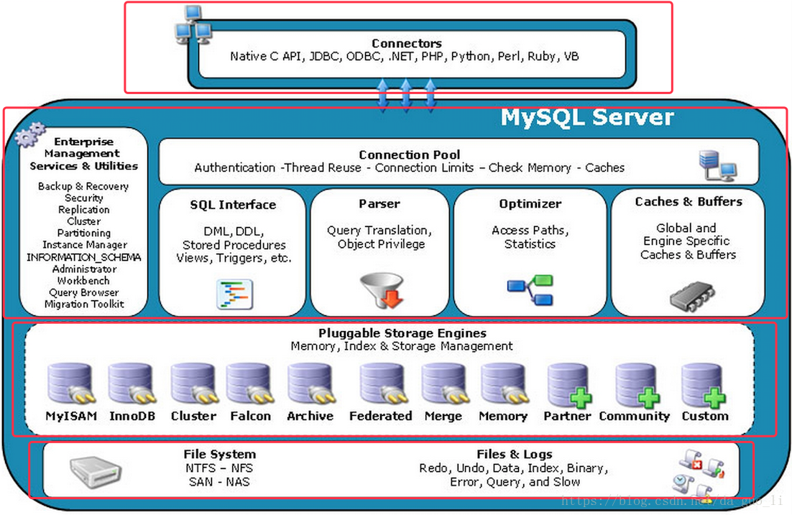

这四层自顶向下分别是网络连接层，服务层（核心层），存储引擎层，系统文件层。我们自顶向下开始讲解。


### 网络接入层

#### 作用

​     主要负责连接管理、授权认证、安全等等。每个客户端连接都对应着服务器上的一个线程。服务器上维护了一个线程池，避免为每个连接都创建销毁一个线程。当客户端连接到MySQL服务器时，服务器对其进行认证。可以通过用户名与密码认证，也可以通过SSL证书进行认证。登录认证后，服务器还会验证客户端是否有执行某个查询的操作权限。这一层并不是MySQL所特有的技术。

#### 为什么要设计成线程池？

​      在服务器内部，每个client都要有自己的线程。这个连接的查询都在一个单独的线程中执行。想象现实场景中数据库访问连接实在是太多了，如果每次连接都要创建一个线程，同时还要负责该线程的销毁。对于系统来说是多么大的消耗。由于线程是操作系统宝贵的资源。这时候线程池的出现就显得自然了，服务器缓存了线程，因此不需要为每个Client连接创建和销毁线程。 

### 服务层

#### 作用

   第二层服务层是MySQL的核心，MySQL的核心服务层都在这一层，查询解析，SQL执行计划分析，SQL执行计划优化，查询缓存。以及跨存储引擎的功能都在这一层实现：存储过程，触发器，视图等。通过下图来观察服务层的内部结构：

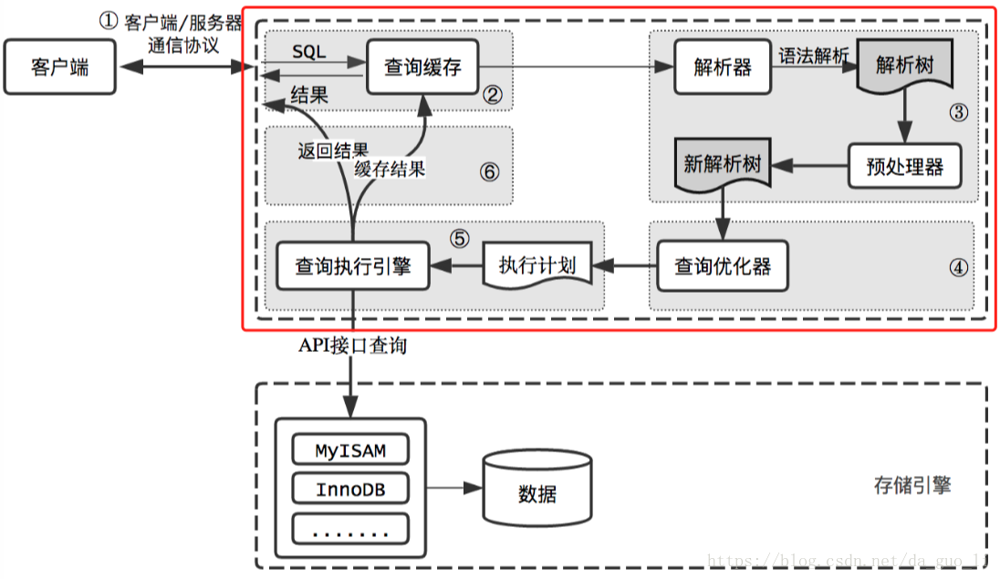

​													 						图中红色框中标出来的就是MySQL服务层内部执行的过程

**下面来简单分析SQL语句在服务层中具体的流程：**

`查询缓存`
    在解析查询之前，服务器会检查查询缓存，如果能找到对应的查询，服务器不必进行查询解析、优化和执行的过程，直接返回缓存中的结果集。

`解析器与预处理器`
    MySQL会解析查询，并创建了一个内部数据结构（解析树）。这个过程解析器主要通过语法规则来验证和解析。比如SQL中是否使用了错误的关键字或者关键字的顺序是否正确等等。预处理会根据MySQL的规则进一步检查解析树是否合法。比如要查询的数据表和数据列是否存在等。

`查询优化器`
    优化器将其转化成查询计划。多数情况下，一条查询可以有很多种执行方式，最后都返回相应的结果。优化器的作用就是找到这其中最好的执行计划。优化器并不关心使用的什么存储引擎，但是存储引擎对优化查询是有影响的。优化器要求存储引擎提供容量或某个具体操作的开销信息来评估执行时间。

`查询引擎`
    在完成解析和优化阶段以后，MySQL会生成对应的执行计划，查询执行引擎根据执行计划给出的指令调用存储引擎的接口得出结果。

### 存储引擎层

#### 作用

​    负责MySQL中数据的存储与提取。 服务器中的查询执行引擎通过API与存储引擎进行通信，通过接口屏蔽了不同存储引擎之间的差异。MySQL采用插件式的存储引擎。MySQL为我们提供了许多存储引擎，每种存储引擎有不同的特点。我们可以根据不同的业务特点，选择最适合的存储引擎。如果对于存储引擎的性能不满意，可以通过修改源码来得到自己想要达到的性能。例如阿里巴巴的X-Engine，为了满足企业的需求facebook与google都对InnoDB存储引擎进行了扩充。
特点：
​    存储引擎是针对于表的而不是针对库的（一个库中不同表可以使用不同的存储引擎），服务器通过API与存储引擎进行通信，用来屏蔽不同存储引擎之间的差异。


#### 存储引擎

**InnoDB**
    `特点`：支持事务，适合OLTP应用，假设没有什么特殊的需求，一般都采用InnoDB作为存储引擎。

​				支持行级锁，从MySQL 5.5.8开始,InnoDB存储引擎是默认的存储引擎。
**MyISAM**
​    `特点`
​        不支持事务，表锁设计，支持全文索引，主要应用于OLAP应用
​    `场景`
​        在排序、分组等操作中，当数量超过一定大小之后，由查询优化器建立的临时表就是MyISAM类型
​        报表，数据仓库
**Memory**
​    `特点`
​        数据都存放在内存中，数据库重启或崩溃，表中的数据都将消失，但是标的结构还是会保存下来。默认使用Hash索引。
​    `场景`
​        适合存储OLTP应用的临时数据或中间表。
​        用于查找或是映射表，例如邮编和地区的对应表。

### 系统文件层

`作用`

​        该层主要是将数据库的数据存储在文件系统之上，并完成与存储引擎的交互。

**`MyISAM物理文件结构为:`**

为了掩饰我先建一个MyISAM存储引擎的表：

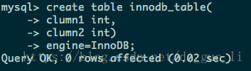


进入MySQL数据存储目录查看数据表在文件上的体现:

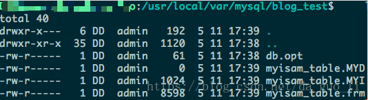

`.frm`文件：与表相关的元数据信息都存放在frm文件，包括表结构的定义信息等。

`.MYD`文件：MyISAM存储引擎专用，用于存储MyISAM表的数据

`.MYI`文件：MyISAM存储引擎专用，用于存储MyISAM表的索引相关信息


**`InnoDB物理文件结构`**

先建两个InnoD存储引擎的表:


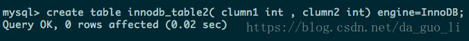

进入MySQL数据存储目录查看数据表在文件上的体现:

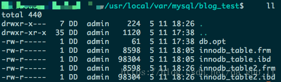

注意上面的每个表都有一个*.frm与*.ibd后缀文件他们的作用分别是：

`.frm`文件：与表相关的元数据信息都存放在frm文件，包括表结构的定义信息等。

`.ibd`文件：存放innodb表的数据文件。

*除了.ibd文件InnoDB还有一种文件的存储格式为.ibdata文件，那么他们之间有什么区别呢?*
这两种文件都是存放innodb数据的文件，之所以用两种文件来存放innodb的数据，是因为InnoDB的数据存储方式能够通过配置来决定是使用共享表空间存放存储数据，还是用独享表空间存放存储数据。独享表空间存储方式使用.ibd文件，并且每个表一个ibd文件。共享表空间存储方式采用.ibdata文件，所有的表共同使用一个ibdata文件，即所有的数据文件都存在一个文件中。决定使用哪种表的存储方式可以通过mysql的配置文件中 innodb_file_per_table选项来指定。InnoDB默认使用的是独享表的存储方式，这种方式的好处是当数据库产生大量文件碎片的时，整理磁盘碎片对线上运行环境的影响较小。

# SELECT语句执行顺序


## 目录

一、SELECT语句的处理过程

1. FROM阶段

2. WHERE阶段

3. GROUP BY阶段

4. HAVING阶段

5. SELECT阶段

6. ORDER BY阶段

7. LIMIT阶段

## SELECT语句的处理过程

查询操作是关系数据库中使用最为频繁的操作，也是构成其他SQL语句（如DELETE、UPDATE）的基础。

我们知道，SQL 查询的大致语法结构如下：

```mysql
(7) SELECT
(8) DISTINCT <select_list>
(1) FROM <left_table>
(3) <join_type> JOIN <right_table>
(2) ON <join_condition>
(4) WHERE <where_condition>
(5) GROUP BY <group_by_list>
(6) HAVING <having_condition>
(9) ORDER BY <order_by_condition>
(10) LIMIT <limit_number>
```


**查询处理的顺序如下:**

1. FROM
2. ON 
3. JOIN 
4. WHERE 
5. GROUP BY 
6. HAVING 
7. SELECT
8. DISTINCT 
9. ORDER BY 
10. LIMIT

这些步骤执行时，每个步骤都会产生一个虚拟表，该虚拟表被用作下一个步骤的输入。这些虚拟表对调用者（客户端应用程序或者外部查询）不可用。只是最后一步生成的表才会返回给调用者。如果没有在查询中指定某一子句，将跳过相应的步骤。

## SELECT各个阶段分别干了什么

**前期准备工作**

**1、新建一个测试数据库**

```mysql
create database testData;

CREATE TABLE `user`  (
  `user_id` int(11) NOT NULL AUTO_INCREMENT,
  `city` varchar(20) NULL,
  `user_name` varchar(255) NULL,
  PRIMARY KEY (`user_id`)
);

INSERT INTO user VALUES(NULL,'beijing','baidu');
INSERT INTO user VALUES(NULL,'chongqing','sina');
INSERT INTO user VALUES(NULL,'beijing','qq');
INSERT INTO user VALUES(NULL,'beijing','163');

CREATE TABLE `orders` (
  `order_id` int(11) NOT NULL AUTO_INCREMENT,
  `user_id` int(11) DEFAULT NULL,
  PRIMARY KEY (`order_id`)
) ENGINE=InnoDB AUTO_INCREMENT=8 DEFAULT CHARSET=utf8mb4;

INSERT INTO orders VALUES (1,1), (2,1), (3,2), (4,2), (5,2), (6,4), (7,NULL);
```

**2、创建测试表,并插入数据如下：**

**用户表**

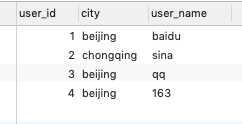

**订单表**

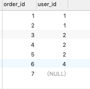


**准备SQL逻辑查询测试语句**

```mysql
SELECT a.user_id,COUNT(b.order_id) as total_orders
FROM user as a
LEFT JOIN orders as b
ON a.user_id = b.user_id
WHERE a.city = 'beijing'
GROUP BY a.user_id
HAVING COUNT(b.order_id) < 2
ORDER BY total_orders desc
```

使用上述SQL查询语句来获得来自北京，并且订单数少于2的客户;

在这些SQL语句的执行过程中，都会产生一个虚拟表，用来保存SQL语句的执行结果

**一、执行FROM语句**

第一步，执行`FROM`语句。我们首先需要知道最开始从哪个表开始的，这就是`FROM`告诉我们的。现在有了`<left_table>`和`<right_table>`两个表，我们到底从哪个表开始，还是从两个表进行某种联系以后再开始呢？它们之间如何产生联系呢？——笛卡尔积

经过FROM语句对两个表执行笛卡尔积，会得到一个虚拟表，VT1（vitual table 1），内容如下：


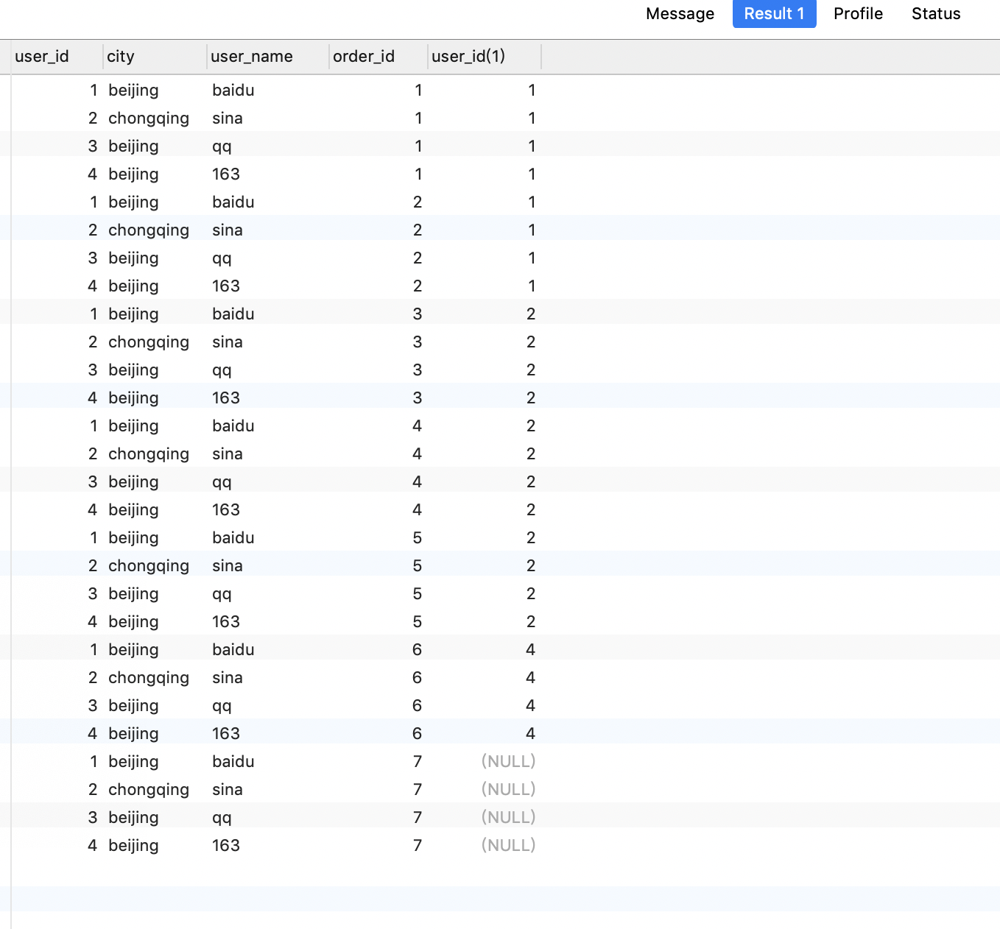


总共有28（user的记录条数 * orders的记录条数）条记录。这就是VT1的结果，接下来的操作就在VT1的基础上进行

**二、执行ON过滤**

执行完笛卡尔积以后，接着就进行`ON a.user_id = b.user_id`条件过滤，根据`ON`中指定的条件，去掉那些不符合条件的数据,得到VT2如下：

```mysql
select * from user as a inner JOIN orders as b ON a.user_id = b.user_id;
```

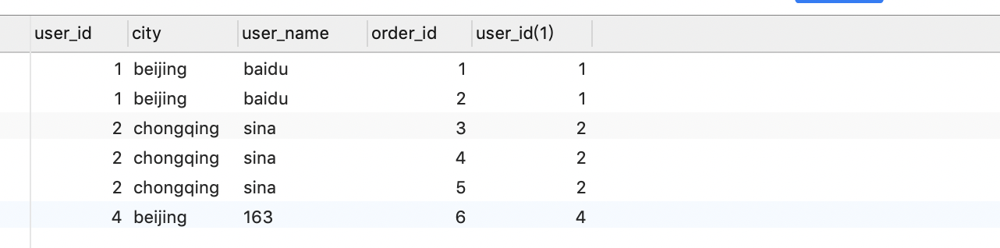


**三、添加外部行**

这一步只有在连接类型为`OUTER JOIN`时才发生，如`LEFT OUTER JOIN`、`RIGHT OUTER JOIN`和`FULL OUTER JOIN`。在大多数的时候，我们都是会省略掉`OUTER`关键字的，但`OUTER`表示的就是外部行的概念。

`LEFT OUTER JOIN`把左表记为保留表：即左表的数据会被全部查询出来，若右表中无对应数据，会用NULL来填充：

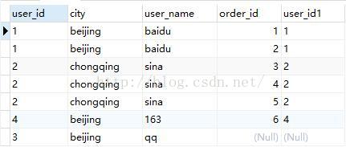

`RIGHT OUTER JOIN`把右表记为保留表：即右表的数据会被全部查询出来，若左表中无对应数据，则用NULL补充；

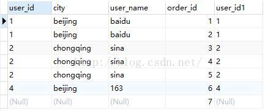

`FULL OUTER JOIN`把左右表都作为保留表，但在Mysql中不支持全连接，可以通过以下方式实现全连接：

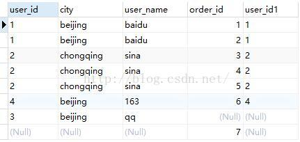

由于我在准备的测试SQL查询逻辑语句中使用的是LEFT JOIN，得到的VT3表如下：

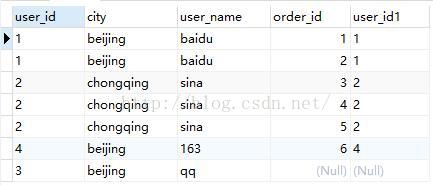

**四、执行where条件过滤**

对添加了外部行的数据进行where条件过滤，只有符合<where_condition>条件的记录会被筛选出来，执行WHERE a.city = 'beijing' 得到VT4如下：

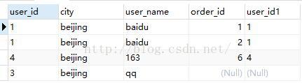

但是在使用WHERE子句时，需要注意以下两点：

1、由于数据还没有分组，因此现在还不能在where过滤条件中使用where_condition=MIN(col)这类对分组统计的过滤；

2、由于还没有进行列的选取操作，因此在select中使用列的别名也是不被允许的，如：`select  city as c from table1 wherec='beijing'` 是不允许的

**五、执行group by分组语句**

`GROU BY`子句主要是对使用`WHERE`子句得到的虚拟表进行分组操作，执行GROUP BY a.user_id得到VT5如下：

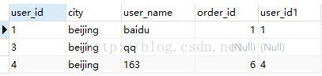

**六、执行having**

`HAVING`子句主要和`GROUP BY`子句配合使用，对分组得到VT5的数据进行条件过滤，执行 HAVING COUNT(b.order_id) < 2，得到VT6如下：

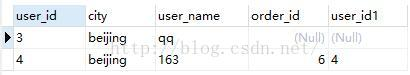

**七、select列表**

现在才会执行到`SELECT`子句，不要以为`SELECT`子句被写在第一行，就是第一个被执行的。

我们执行测试语句中的`SELECT a.user_id,user_name,COUNT(b.order_id) as total_orders`，从VT6中选择出我们需要的内容，得到VT7如下：

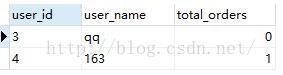

**八、执行distinct去重复数据**

如果在查询中指定了`DISTINCT`子句，则会创建一张内存临时表（如果内存放不下，就需要存放在硬盘了）。这张临时表的表结构和上一步产生的虚拟表是一样的，不同的是对进行DISTINCT操作的列增加了一个唯一索引，以此来除重复数据。测试SQL中没有`DISTINCT`字句，所以不会执行

**九、执行order by字句**

对虚拟表VT7中的内容按照指定的列进行排序，然后返回一个新的虚拟表，我们执行测试SQL语句中的`ORDER BY total_orders DESC` ，得到结果如下：

DESC倒序排序，ASC升序排序

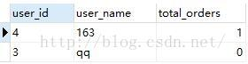

**十、执行limit字句**

LIMIT子句从上一步得到的虚拟表中选出从指定位置开始的指定行数据，常用来做分页；

MySQL数据库的LIMIT支持如下形式的选择：limit n,m

表示从第n条记录开始选择m条记录。对于小数据，使用LIMIT子句没有任何问题，当数据量非常大的时候，使用LIMIT n, m是非常低效的。因为LIMIT的机制是每次都是从头开始扫描，如果需要从第60万行开始，读取3条数据，就需要先扫描定位到60万行，然后再进行读取，而扫描的过程是一个非常低效的过程。


# MySQL的join关键字

SQL Join联接子句用于在两个或更多在数据库中的表的记录组合。JOIN是通过使用从两个表字段共通的值组合连接起来。MySQL官方只提供了三种join方式，内连接、左连接和右连接，不支持其他的连接关键字。但是可以通过一定的语法将达到其他的连接的效果。

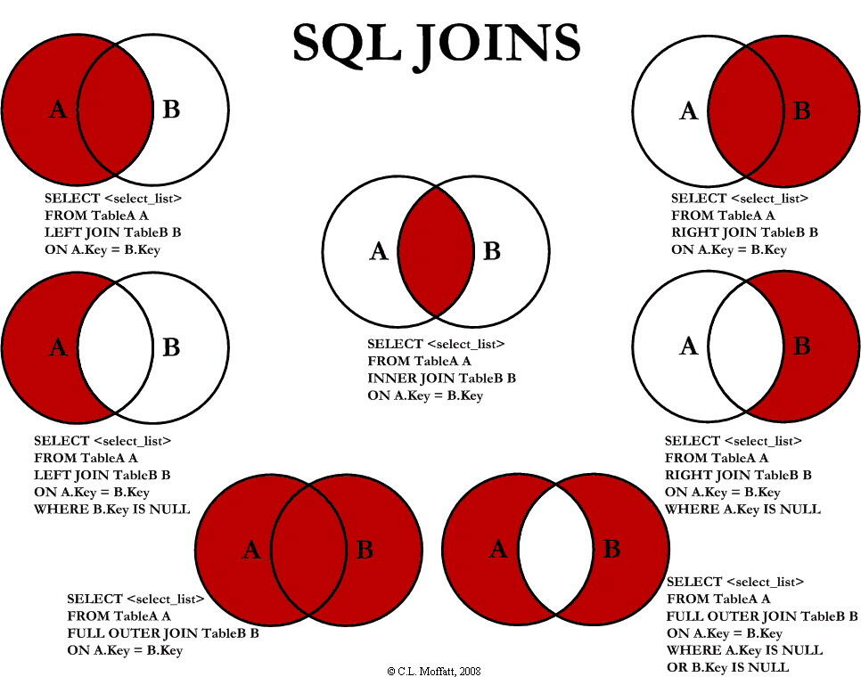

# 1.内连接 inner join

最频繁使用的和重要的联接是INNER JOIN。它也被称为一个等值连接。

INNER JOIN通过结合基于联接谓词两个表(表1和表2)列值创建一个新的结果表。查询比较表1中的每一行与表2中的每一行，找到所有满足联接谓词的行。 当联接谓词被满足时，对于每个匹配的一对A和B的列值被组合成一个结果行。

INNER JOIN基本语法如下：

```mysql
SELECT table1.column1, table2.column2...

FROM table1

INNER JOIN table2

ON table1.common_field = table2.common_field;
```

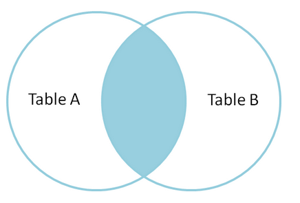

​																													内连接

```mysql
select store_id,address from address inner join store on address.address_id=store.address_id;
```

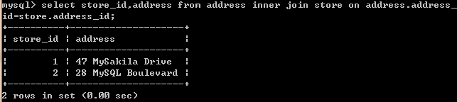

# 2.左外连接 left join

SQL LEFT JOIN返回所有行左表，即使存在左表中没有匹配。这意味着，如果在ON子句在右边的表匹配0(零)个记录，则连接将仍然在结果返回一行，但用NULL显示在右表中的每一列中。

这意味着，一个左连接从左表中返回所有值，再加上如果右表没有匹配就使用NULL值代替返回。

LEFT JOIN的基本语法如下：

```mysql
SELECT table1.column1, table2.column2...

FROM table1

LEFT JOIN table2

ON table1.common_field = table2.common_field;
```


在这里，给定的条件可能是根据您的需要任意给定表达式。

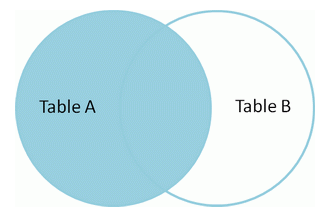

​																												左连接

```mysql
select address,store_id from address left join store on address.address_id=store.address_id limit 20;
```

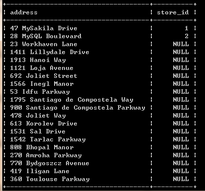

# 3.右外连接 right join

SQL RIGHT JOIN返回右表所有行，即使在左表中没有匹配。这意味着，如果ON子句匹配左表0(零)记录, 连接仍返回一行结果，但用NULL代替左表中的每一列。

这意味着，一个右连接返回右表所有的值，再加上如果没有匹配左表时使用NULL值。

RIGHT JOIN的基本语法如下：

```mysql
SELECT table1.column1, table2.column2...

FROM table1

RIGHT JOIN table2

ON table1.common_field = table2.common_field;
```

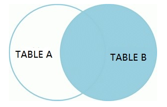

示例

```mysql
select address,store_id from store right join address on address.address_id=store.address_id limit 10;
```

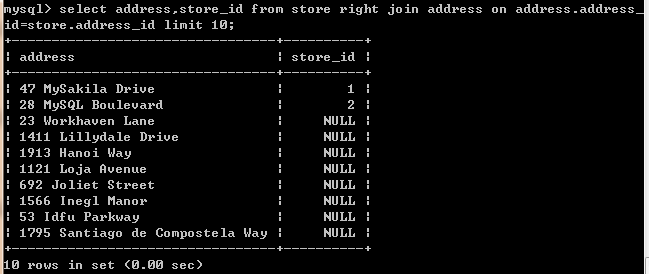

#  4.左连接

从这一个开始，MySQL不提供正式的一步到位的关键字，效果全靠自己模拟。

左连接是得到A表中去除B表内容的剩下的部分，也就是A表独有的一部分。可以看做是在左外连接的结果中将双方共有的部分去掉得到的。

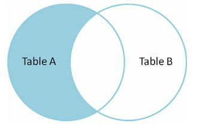

```mysql
select address,store_id from address left join store on address.address_id=store.address_id where store_id is null limit 10;
```

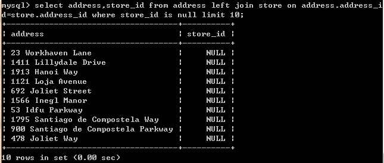

# 5.右连接

同理，右连接是在右外连接的结果中得到B表独有的那一部分

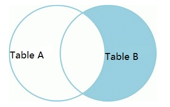

示例

```mysql
select address,store_id from store right join address on address.address_id=store.address_id where store.store_id is null limit 10;
```

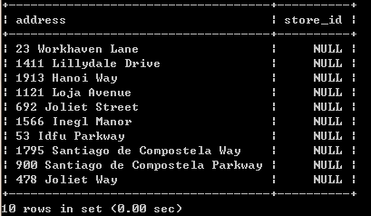

# 6.全连接

全连接顾名思义是获得AB两表全部的数据，oracle提供了 full join关键字完成这一功能，但是MySQL没有。不过MySQL中可以借助union达到这个效果，union的作用是合并两个查询的结果。

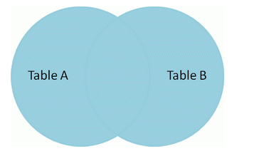

```mysql
select address,store_id 
from store 
right join address 
on address.address_id=store.address_id
union
select address,store_id 
from store 
left join address 
on address.address_id=store.address_id
limit 10;
```

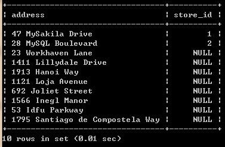

# 7.差集

两表的全连接中除去重合的部分，即两张表分别的特有部分的合集。

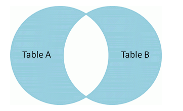

```mysql
select address,store_id 
from store 
right join address 
on address.address_id=store.address_id
where store_id is null
union
select address,store_id 
from store 
left join address 
on address.address_id=store.address_id
where address.address_id is null
limit 10;
```

