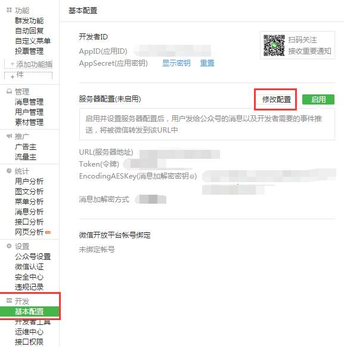
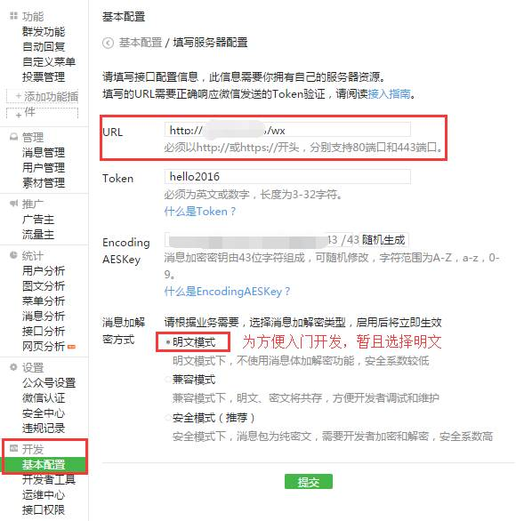

# 公众号基本开发

## 一 申请公众号

```
此步骤略过,请参考官方说明申请和认证
文档地址https://mp.weixin.qq.com/wiki?t=resource/res_main&id=mp1472017492_58YV5
```

## 二 配置服务器和 token

> 此步骤使用的是非数据库,实际开发请结合数据库

### 2.1 服务器

> 使用 springboot 搭建

#### 2.1.1 pom 文件

```xml
<project xmlns="http://maven.apache.org/POM/4.0.0" xmlns:xsi="http://www.w3.org/2001/XMLSchema-instance"
  xsi:schemaLocation="http://maven.apache.org/POM/4.0.0 http://maven.apache.org/xsd/maven-4.0.0.xsd">
  <modelVersion>4.0.0</modelVersion>

  <groupId>com.qianfeng</groupId>
  <artifactId>testweixindelete</artifactId>
  <version>1.0-SNAPSHOT</version>
  <!-- 标记为 war 包-->
  <packaging>war</packaging>
  <parent>
    <groupId>org.springframework.boot</groupId>
    <artifactId>spring-boot-starter-parent</artifactId>
    <version>1.5.9.RELEASE</version>
    <relativePath/> <!-- lookup parent from repository -->
  </parent>
  <name>testweixindelete</name>
  <url>http://maven.apache.org</url>

  <properties>
    <project.build.sourceEncoding>UTF-8</project.build.sourceEncoding>
  </properties>

  <dependencies>
    <dependency>
      <groupId>junit</groupId>
      <artifactId>junit</artifactId>
      <version>3.8.1</version>
      <scope>test</scope>
    </dependency>
    <dependency>
      <groupId>org.springframework.boot</groupId>
      <artifactId>spring-boot-starter-web</artifactId>
      <!-- 忽略自带的 tomcat-->
      <exclusions>
        <exclusion>
          <groupId>org.springframework.boot</groupId>
          <artifactId>spring-boot-starter-tomcat</artifactId>
        </exclusion>
      </exclusions>
    </dependency>
    <dependency>
      <groupId>ch.qos.logback</groupId>
      <artifactId>logback-core</artifactId>
    </dependency>
    <dependency>
      <groupId>ch.qos.logback</groupId>
      <artifactId>logback-classic</artifactId>
    </dependency>
    <!--添加 servlet-->
    <dependency>
      <groupId>javax.servlet</groupId>
      <artifactId>javax.servlet-api</artifactId>
      <version>3.1.0</version>
      <scope>provided</scope>
    </dependency>
    <dependency>
      <groupId>org.dom4j</groupId>
      <artifactId>dom4j</artifactId>
      <version>2.0.0</version>
    </dependency>
    <dependency>
      <groupId>com.thoughtworks.xstream</groupId>
      <artifactId>xstream</artifactId>
      <version>1.4.9</version>
    </dependency>
  </dependencies>
  <build>
      <plugins>
        <plugin>
          <groupId>org.springframework.boot</groupId>
          <artifactId>spring-boot-maven-plugin</artifactId>
        </plugin>
      </plugins>
  </build>
</project>

```

#### 2.1.2 controller

```java
package com.qianfeng;

//
//                            _ooOoo_  
//                           o8888888o  
//                           88" . "88  
//                           (| -_- |)  
//                            O\ = /O  
//                        ____/`---'\____  
//                      .   ' \\| |// `.  
//                       / \\||| : |||// \  
//                     / _||||| -:- |||||- \  
//                       | | \\\ - /// | |  
//                     | \_| ''\---/'' | |  
//                      \ .-\__ `-` ___/-. /  
//                   ___`. .' /--.--\ `. . __  
//                ."" '< `.___\_<|>_/___.' >'"".  
//               | | : `- \`.;`\ _ /`;.`/ - ` : | |  
//                 \ \ `-. \_ __\ /__ _/ .-` / /  
//         ======`-.____`-.___\_____/___.-`____.-'======  
//                            `=---='  
//  
//         .............................................  
//                  佛祖镇楼                  BUG辟易  
//          佛曰:  
//                  写字楼里写字间，写字间里程序员；  
//                  程序人员写程序，又拿程序换酒钱。  
//                  酒醒只在网上坐，酒醉还来网下眠；  
//                  酒醉酒醒日复日，网上网下年复年。  
//                  但愿老死电脑间，不愿鞠躬老板前；  
//                  奔驰宝马贵者趣，公交自行程序员。  
//                  别人笑我忒疯癫，我笑自己命太贱；  
//  


import org.springframework.stereotype.Controller;
import org.springframework.web.bind.annotation.RequestMapping;
import org.springframework.web.bind.annotation.RestController;

import javax.servlet.http.HttpServletRequest;
import java.util.Map;

/**
 * Created by jackiechan on 2018/1/23/下午7:59
 */
@RestController()
public class TestController {
    @RequestMapping("getTest")//注意此地址的路径,后面配置的时候会用到
    public String getTest(HttpServletRequest request) {
            String signature = request.getParameter("signature");
            //时间戳
            String timestamp = request.getParameter("timestamp");
            //随机数
            String nonce = request.getParameter("nonce");
            //随机字符串
            String echostr = request.getParameter("echostr");
            if (SignUtil.checkSignature(signature, timestamp, nonce)) {//参考微信说明文档,此处需要服务端对传递过来的数据进行校验,用于判断是否来自于微信服务器
                System.out.println("成功");
                return echostr;//成功的话,将微信服务器传递过来的数据返回
            }
            System.out.println("失败");
            return "shibai";
        
    }
}

```

####2.1.2 SignUtil 

```java
/**
 * Created by jackiechan on 2018/1/23/下午9:03
 */
public class SignUtil {
    private static String token = "qianfengjava";//此处使用的值,需要和一会服务器的配置的 token 保持一致

    /**
     * 校验签名
     * @param signature 签名
     * @param timestamp 时间戳
     * @param nonce 随机数
     * @return 布尔值
     */
    public static boolean checkSignature(String signature,String timestamp,String nonce){
        String checktext = null;
        if (null != signature) {
            //对ToKen,timestamp,nonce 按字典排序
            String[] paramArr = new String[]{token,timestamp,nonce};
            Arrays.sort(paramArr);
            //将排序后的结果拼成一个字符串
            String content = paramArr[0].concat(paramArr[1]).concat(paramArr[2]);

            try {
                MessageDigest md = MessageDigest.getInstance("SHA-1");
                //对接后的字符串进行sha1加密
                byte[] digest = md.digest(content.toString().getBytes());
                checktext = byteToStr(digest);
            } catch (NoSuchAlgorithmException e){
                e.printStackTrace();
            }
        }
        //将加密后的字符串与signature进行对比
        return checktext !=null ? checktext.equals(signature.toUpperCase()) : false;
    }

    /**
     * 将字节数组转化我16进制字符串
     * @param byteArrays 字符数组
     * @return 字符串
     */
    private static String byteToStr(byte[] byteArrays){
        String str = "";
        for (int i = 0; i < byteArrays.length; i++) {
            str += byteToHexStr(byteArrays[i]);
        }
        return str;
    }

    /**
     *  将字节转化为十六进制字符串
     * @param myByte 字节
     * @return 字符串
     */
    private static String byteToHexStr(byte myByte) {
        char[] Digit = {'0','1','2','3','4','5','6','7','8','9','A','B','C','D','E','F'};
        char[] tampArr = new char[2];
        tampArr[0] = Digit[(myByte >>> 4) & 0X0F];
        tampArr[1] = Digit[myByte & 0X0F];
        String str = new String(tampArr);
        return str;
    }

}
```


####2.1.3 App类(Springboot 入口类)

```java
/**
 * Hello world!
 *
 */
@SpringBootApplication
@Configuration
public class App 
{
    public static void main( String[] args )
    {
        SpringApplication.run(App.class, args);//启动 spingboot 项目
    }
}
```


#### 2.1.4 发布项目到远程服务器

> 注意此处的服务器需要外网可以访问,比如阿里云等,需要80端口或者443端口(https),没有的可以使用花生壳的二级域名映射到本地(映射步骤请自行百度)

```
将项目使用 maven 的 package 指令打包 ,发布到远程服务器,发布成功后访问前面的地址,可以访问代表成功
```

##### 2.1.4.1 springboot 项目打包为 war 的方式

```java

/**
 *	按照前面的 pom 配置,然后在项目中新建一个类
 * Created by jackiechan on 2018/1/23/下午8:49
 */
public class SpringBootStartApplication extends SpringBootServletInitializer {

    @Override
    protected SpringApplicationBuilder configure(SpringApplicationBuilder builder) {
        // 注意这里要指向原先用main方法执行的Application启动类
        return builder.sources(App.class);
    }
}
```


## 三 配置微信后台

### 3.1 开发者基本配置





> 参数说明:
>
> url 服务器地址,用于微信进行验证的,填写我们刚才编写的具体的请求地址
>
> Token :令牌, 需和我们的 SignUtil工具类中的 token 保持一致
>
> 密钥: 随机生成

```
填写完对应的资料后,点击提交保存即可,如果提示 TOKEN 校验失败,请检查服务端地址 url 是否正确,以及内部的代码是否判断正确,特别是两边的 token 是否一致,提示成功后,代表我们的程序和微信已经握手成功
```

## 四 收发消息

> 收发消息的原理其实就是我们将消息发送到微信,微信帮我们转到我们自己的服务器地址,这个地址仍旧是我们上面配置的地址,但是请求方式会变成 post,握手的时候是 GET 方式,所以我们需要做判断,如果是在 post 请求的方式下代表用户和我们进行消息传递

###4.1 消息类型

> 具体消息的收发内容请参考微信文档https://mp.weixin.qq.com/wiki?t=resource/res_main&id=mp1421140453

1. 文本消息
2. 图片消息
3. 语音消息
4. 视频消息
5. 小视频消息
6. 地图位置消息
7. 链接消息

### 4.2 收发文本消息

>本案例以文本消息为例
>
>实现简单功能,根据用户发送的内容来决定返回的内容

#### 4.2.1 接收消息的内容格式

> 微信将用户传递的内容以 xml 的方式传递到我们服务端,会携带用户的信息等数据,因此我们需要对数据进行解析

```xml
<xml>  <ToUserName>< ![CDATA[toUser] ]></ToUserName>  <FromUserName>< ![CDATA[fromUser] ]></FromUserName>  <CreateTime>1348831860</CreateTime>  <MsgType>< ![CDATA[text] ]></MsgType>  <Content>< ![CDATA[this is a test] ]></Content>  <MsgId>1234567890123456</MsgId>  </xml>
```

#### 4.2.2 返回消息格式

> 我们返回给微信的内容也是一个 xml 格式,因此我们只需要将数据进行拼接返回即可

```xml
<xml> <ToUserName>< ![CDATA[toUser] ]></ToUserName> <FromUserName>< ![CDATA[fromUser] ]></FromUserName> <CreateTime>12345678</CreateTime> <MsgType>< ![CDATA[text] ]></MsgType> <Content>< ![CDATA[你好] ]></Content> </xml>
```


### 4.3 controller 

```java
package com.qianfeng;

//
//                            _ooOoo_  
//                           o8888888o  
//                           88" . "88  
//                           (| -_- |)  
//                            O\ = /O  
//                        ____/`---'\____  
//                      .   ' \\| |// `.  
//                       / \\||| : |||// \  
//                     / _||||| -:- |||||- \  
//                       | | \\\ - /// | |  
//                     | \_| ''\---/'' | |  
//                      \ .-\__ `-` ___/-. /  
//                   ___`. .' /--.--\ `. . __  
//                ."" '< `.___\_<|>_/___.' >'"".  
//               | | : `- \`.;`\ _ /`;.`/ - ` : | |  
//                 \ \ `-. \_ __\ /__ _/ .-` / /  
//         ======`-.____`-.___\_____/___.-`____.-'======  
//                            `=---='  
//  
//         .............................................  
//                  佛祖镇楼                  BUG辟易  
//          佛曰:  
//                  写字楼里写字间，写字间里程序员；  
//                  程序人员写程序，又拿程序换酒钱。  
//                  酒醒只在网上坐，酒醉还来网下眠；  
//                  酒醉酒醒日复日，网上网下年复年。  
//                  但愿老死电脑间，不愿鞠躬老板前；  
//                  奔驰宝马贵者趣，公交自行程序员。  
//                  别人笑我忒疯癫，我笑自己命太贱；  
//  


import org.springframework.stereotype.Controller;
import org.springframework.web.bind.annotation.RequestMapping;
import org.springframework.web.bind.annotation.RestController;

import javax.servlet.http.HttpServletRequest;
import java.util.Map;

/**
 * Created by jackiechan on 2018/1/23/下午7:59
 */
@Controller
@RestController()
public class TestController {
    @RequestMapping("getTest")
    public String getTest(HttpServletRequest request) {
        if (request.getMethod().equalsIgnoreCase("get")) {
            String signature = request.getParameter("signature");
            //时间戳
            String timestamp = request.getParameter("timestamp");
            //随机数
            String nonce = request.getParameter("nonce");
            //随机字符串
            String echostr = request.getParameter("echostr");
            if (SignUtil.checkSignature(signature, timestamp, nonce)) {
                System.out.println("成功");
                return echostr;
            }
            System.out.println("失败");
            return "shibai";
        } else if (request.getMethod().equalsIgnoreCase("post")) {
            String respMessage = null;
            //默认返回的文本消息类容
            String respContent = "找不到相关数据,请确认发送内容";
            String fromUserName="";
            String toUserName ="";
            String msgType ="";
            try {
                //xml请求解析
                Map<String,String> requestMap = MessageUtil.pareXml(request);

                //发送方账号（open_id）
                fromUserName = requestMap.get("FromUserName");
                //公众账号
                toUserName = requestMap.get("ToUserName");
                //消息类型
                msgType = requestMap.get("MsgType");
//			    //需要判断消息类型来做具体处理,此处忽略
                String fromContent=requestMap.get("Content");
                if (fromContent.contains("姚四十")) {
                    respContent = "住别墅的姚四十很有钱";
                } else if (fromContent.contains("婷")) {
                    respContent = "找不到与 "+fromContent+" 相关的内容?";
                }//等等各种判断
                //回复文本消息
                respMessage=("<xml><ToUserName><![CDATA["+requestMap.get("FromUserName")+
                        "]]></ToUserName>"+"<FromUserName><![CDATA["+requestMap.get("ToUserName")
                        +"]]></FromUserName><CreateTime>"+System.currentTimeMillis()+"</CreateTime><MsgType><![CDATA[text]]></MsgType><Content><![CDATA["+respContent+"]]></Content></xml>");
            } catch (Exception e) {
                respMessage=("<xml><ToUserName><![CDATA["+fromUserName+
                        "]]></ToUserName>"+"<FromUserName><![CDATA["+toUserName
                        +"]]></FromUserName><CreateTime>"+System.currentTimeMillis()+"</CreateTime><MsgType><![CDATA[text]]></MsgType><Content><![CDATA["+respContent+"]]></Content></xml>");
            }
            return respMessage;

        }
        System.out.println("失败了,失败了");
        return "";
    }
}

```


### 4.4 MessageUtil

```java

/**
 * Created by jackiechan on 2018/1/23/下午11:23
 */
public class MessageUtil {
    /**
     * 返回信息类型：文本
     */
    public static final String  RESP_MESSSAGE_TYPE_TEXT = "text";
 
    /**
     * 解析微信发来的请求 XML 
     */
    @SuppressWarnings("unchecked")
    public static Map<String,String> pareXml(HttpServletRequest request) throws Exception {

        //将解析的结果存储在HashMap中
        Map<String,String> reqMap = new HashMap<String, String>();

        //从request中取得输入流
        InputStream inputStream = request.getInputStream();
        //读取输入流
        SAXReader reader = new SAXReader();
        Document document = reader.read(inputStream);
        //得到xml根元素
        Element root = document.getRootElement();
        //得到根元素的所有子节点
        List<Element> elementList = root.elements();
        //遍历所有的子节点取得信息类容
        for(Element elem:elementList){
            reqMap.put(elem.getName(),elem.getText());
        }
        //释放资源
        inputStream.close();
        inputStream = null;

        return reqMap;
    }
    
    /**
     * 拓展xstream，使得支持CDATA块
     *
     */
    private static XStream xstream = new XStream(new XppDriver(){
        public HierarchicalStreamWriter createWriter(Writer out){
            return new PrettyPrintWriter(out){
                //对所有的xml节点的转换都增加CDATA标记
                boolean cdata = true;

                @SuppressWarnings("unchecked")
                public void startNode(String name,Class clazz){
                    super.startNode(name,clazz);
                }

                protected void writeText(QuickWriter writer, String text){
                    if(cdata){
                        writer.write("<![CDATA[");
                        writer.write(text);
                        writer.write("]]>");
                    }else{
                        writer.write(text);
                    }
                }
            };
        }
    });

}
```


### 4.5 重新部署项目

> 重新部署项目后,即可和服务器聊天了