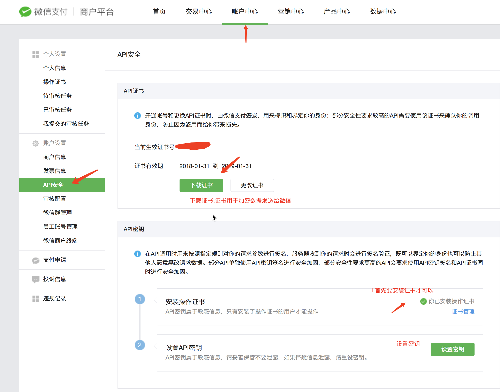
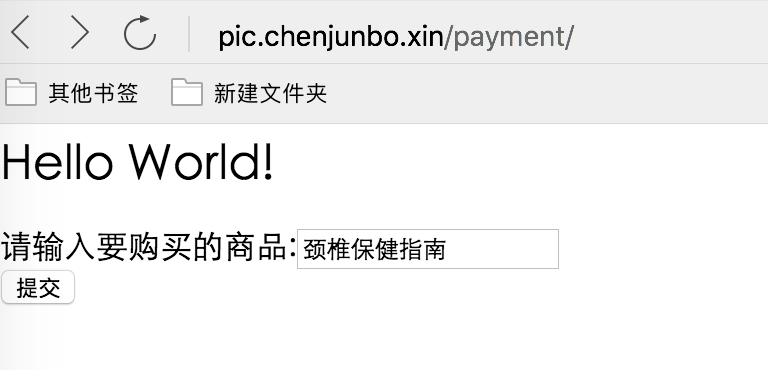
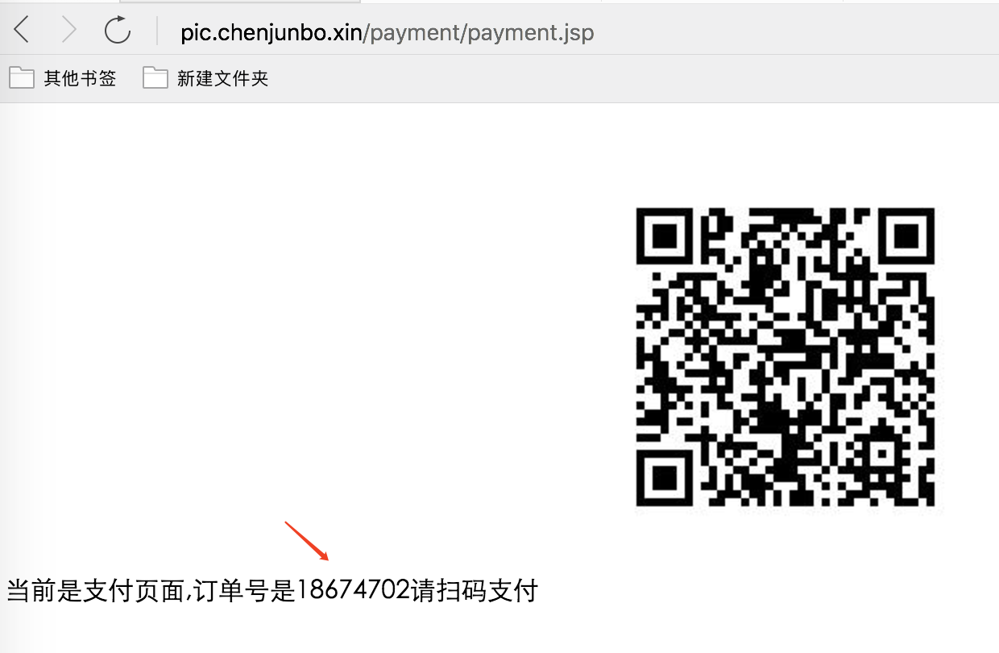

# 微信支付

> 微信支付微信提供了两种使用方式,一种是配置固定回调响应地址, 一种动态设置回调响应地址无论哪种方式,都需要提供一个备案审核通过的外网域名,因为扫码支付最终走的是微信客户端,没有通过浏览器跳转到微信页面,所以微信支付的回调之后服务器之间 点对点通信,没有 url 重定向通知
>
> 其中动态 URL 的方式开发相对简单,本文档中使用的就是动态 URL 方式

## 一. 微信支付申请

```
申请请参考官方的申请流程,此处不做说明
```

## 二. 开发流程

> 此方式为V2版本的api,后续腾讯更新了V3版本,但是不影响V2正常使用

### 2.1 方式一

> 此方式的流程是:
>
> 1. 用户提交购买的商品或者是选择要支付的订单,然后传递到服务器
> 2. 如果是新购买,则生成订单等信息,如果是付款则获取订单信息
> 3. 将订单信息和商户的信息,如回调地址等作为参数,按照要求排序签名后发送到腾讯服务器
> 4. 腾讯服务器会返回一个微信支付二维码的短连接,两小时有效
> 5. 后台将短连接生成图片,跳转到支付页面,让用户扫码
> 6. 用户扫码支付成功后,微信会在他们后台访问我们指定的回调接口地址,将结果传递过来,不会重定向
> 7. 在回调服务内,判断支付状态等,更新数据
> 8. 演示地址:http://ceshi.qfjava.cn/payment

#### 2.1.1微信配置

> 使用超级管理员账号(注册时候绑定的实名认证联系人的微信),安装证书,设置 API 密钥,下载证书(备用)




#### 2.1.2 POM中的依赖文件

```xml
<dependencies>
    <dependency>
      <groupId>junit</groupId>
      <artifactId>junit</artifactId>
      <version>3.8.1</version>
      <scope>test</scope>
    </dependency>
  <!--解析 xml-->
    <dependency>
      <groupId>org.jdom</groupId>
      <artifactId>jdom</artifactId>
      <version>1.1</version>
    </dependency>
    <dependency>
      <groupId>jaxen</groupId>
      <artifactId>jaxen</artifactId>
      <version>1.1.6</version>
    </dependency>
    <!-- https://mvnrepository.com/artifact/com.google.zxing/core 
	用于生成二维码图片的依赖-->
    <dependency>
      <groupId>com.google.zxing</groupId>
      <artifactId>core</artifactId>
      <version>3.3.2</version>
    </dependency>
    <dependency>
      <groupId>com.google.zxing</groupId>
      <artifactId>javase</artifactId>
      <version>3.3.2</version>
    </dependency>
  <!--注意3.1版本的 servlet 的 web.xml 文件头-->
   <dependency>
      <groupId>javax.servlet</groupId>
      <artifactId>javax.servlet-api</artifactId>
      <version>3.1.0</version>
      <scope>provided</scope>
    </dependency>
    <dependency>
      <groupId>javax.servlet.jsp</groupId>
      <artifactId>jsp-api</artifactId>
      <version>2.2</version>
    </dependency>
  </dependencies>
```


#### 2.1.3 开发需要内容

1. 微信APP_ID, 可在微信公众平台查看对应微信号的 ID
2. 商户 ID, 可在微信商户平台查看,上图列表中的商户信息中会有
3. API_KEY 上图中设置的 API 密钥
4. 微信统一下单 URL:https://api.mch.weixin.qq.com/pay/unifiedorder  可以在开发者文档中查看
5. 回调 URL, 用于用户支付成功后 微信后台点对点通知支付结果,非重定向,需要一个公网地址
6. 发起支付的 ip, 创建 ip 地址, 可以填写服务器ip

> 以下代码开发未使用实际商品和数据库,才用虚假数据支付
>
> 实际开发中,只需要更改页面 和 Servlet 中的业务逻辑,以及配置文件中的相关信息
>
> 其中 ResultServlet 中需要处理的是支付成功和失败后需要做的事情

##### 2.1.3.1 index.jsp

> 此页面用于用户输入一个想要购买的商品的名称,模拟购买,不需要输入价格,服务器后台写死1分钱,实际开发请按照购物流程

```html
<%@ page contentType="text/html;charset=UTF-8" language="java" %>
<html>
<body>
<h2>Hello World!</h2>

<form action="/payment/test">
     请输入要购买的商品:<input type="text" name="body"><br>
    <input type="submit" value="提交">
</form>
</body>
</html>

```


##### 2.1.3.2 TestServlet 

> 用于获取用户输入的商品名称,生成订单

```java
/**
 * Created by jackiechan on 2020/2/2/上午11:15
  用于获取用户输入的商品名称,然后生成订单号,发送到腾讯服务器,获取短地址,生成二维码,跳转显示页面
 */
public class TestServlet extends HttpServlet {
    Random random = new Random();
    @Override
    protected void doGet(HttpServletRequest req, HttpServletResponse resp) throws ServletException, IOException {
        req.setCharacterEncoding("UTF-8");
        String price = "1";//此处默认是1分,次数需要项目开发中实际根据用户购买的商品获取
        String body = req.getParameter("body");//商品描述,获取用户前台输入的想要购买的商品,此处需要参考项目实际开发中获取
        if (req.getMethod().equalsIgnoreCase("get")) {
            body = new String(body.getBytes("ISO8859-1"), "UTF-8");
        }
        String orderId = random.nextInt(100000000) + "";//此处随机生成伪订单,实际开发中请参考项目需求生成
        try {
            String url = PayCommonUtil.weixin_pay(price, body, orderId);//获取微信返回的二维码对应的短地址
            BufferedImage image = ZxingUtil.createImage(url, 300, 300);//将地址转成二维码图片
          req.getSession().setAttribute("oid",orderId);//将订单号写入 session, 页面显示用
            req.getSession().setAttribute("image", image);//将图片放到 session 中
            resp.sendRedirect("/payment/payment.jsp");//跳转到支付页面,显示二维码
        } catch (Exception e) {
            e.printStackTrace();
        }
    }

    @Override
    protected void doPost(HttpServletRequest req, HttpServletResponse resp) throws ServletException, IOException {
        this.doGet(req, resp);
    }

}
```

##### 2.1.3.3 payment.jsp

```html
<%@ page contentType="text/html;charset=UTF-8" language="java" %>
<html>
<head>
    <title>Title</title>
</head>
<body>
当前是支付页面,订单号是: ${oid} <br>请扫码支付
 <!--这个地址用于获取TestServlet 中存放到 session 中的图片,指向的是 ImageServlet-->
</body>
</html>

```

##### 2.1.3.4 ImageServlet 

> 用于获取二维码图片显示到页面上面

```java
/**
 * Created by jackiechan on 2020/2/2/上午11:31
 */
public class ImageServlet extends HttpServlet {
    @Override
    protected void doGet(HttpServletRequest req, HttpServletResponse resp) throws ServletException, IOException {
        this.doPost(req, resp);
    }

    @Override
    protected void doPost(HttpServletRequest req, HttpServletResponse resp) throws ServletException, IOException {
        BufferedImage image = (BufferedImage) req.getSession().getAttribute("image");//获取存放的二维码
        if (image != null) {

            ImageIO.write(image, "JPEG", resp.getOutputStream());//发送到页面上
        }
    }
}
```


##### 2.1.3.5 PayConfigUtil

> 用于配置上述需要的信息

```java
/**
 * Created by jackiechan on 2020/2/2/上午10:33
 */
public class PayConfigUtil {
    public static String APP_ID = "wx632c8f211f8122c6";//我们的微信公众号 id
    public static String MCH_ID = "1497984412";//我们的商户 id
    public static String API_KEY = "sbNCm1JnevqI36LrEaxFwcaT0hkGxFnC";//我们的 API_KEY 用于生成签名
    public static String UFDOOER_URL = "https://api.mch.weixin.qq.com/pay/unifiedorder";//微信统一下单地址
    public static String NOTIFY_URL = "http://ceshi.qfjava.cn/payment/result";//我们的回调地址,用于接收微信告诉我们的支付结果,根据实际情况设置,这个地址需要我们自己编写代码处理微信结果
    public static String CREATE_IP = "114.242.26.51"; //发起请求的地址,可以写我们的服务器地址,也可以传递客户的 ip
}
```

##### 2.1.3.6 XMLUtil

> 用于解析微信返回的 xml 数据

```java
/**
 * Created by jackiechan on 2020/2/2/上午10:30
 * 因为微信返回的是 XML 数据,所以需要解析 XML
 */
public class XMLUtil {
    /**
     * 解析xml,返回第一级元素键值对。如果第一级元素有子节点，则此节点的值是子节点的xml数据。
     * @param strxml
     * @return
     * @throws JDOMException
     * @throws IOException
     */
    public static Map doXMLParse(String strxml) throws JDOMException, IOException {
        strxml = strxml.replaceFirst("encoding=\".*\"", "encoding=\"UTF-8\"");

        if(null == strxml || "".equals(strxml)) {
            return null;
        }
		//将xml解析为key-value保存到map中,下面的方法为sax解析
        Map m = new HashMap();

        InputStream in = new ByteArrayInputStream(strxml.getBytes("UTF-8"));
        SAXBuilder builder = new SAXBuilder();
        Document doc = builder.build(in);
        Element root = doc.getRootElement();
        List list = root.getChildren();
        Iterator it = list.iterator();
        while(it.hasNext()) {
            Element e = (Element) it.next();
            String k = e.getName();
            String v = "";
            List children = e.getChildren();
            if(children.isEmpty()) {
                v = e.getTextNormalize();
            } else {
                v = XMLUtil.getChildrenText(children);
            }

            m.put(k, v);
        }

        //关闭流
        in.close();

        return m;
    }

    /**
     * 获取子结点的xml
     * @param children
     * @return String
     */
    public static String getChildrenText(List children) {
        StringBuffer sb = new StringBuffer();
        if(!children.isEmpty()) {
            Iterator it = children.iterator();
            while(it.hasNext()) {
                Element e = (Element) it.next();
                String name = e.getName();
                String value = e.getTextNormalize();
                List list = e.getChildren();
                sb.append("<" + name + ">");
                if(!list.isEmpty()) {
                    sb.append(XMLUtil.getChildrenText(list));
                }
                sb.append(value);
                sb.append("</" + name + ">");
            }
        }

        return sb.toString();
    }
}
```

##### 2.1.3.7 MD5Util

> 用于生成微信需要的校验数据

```java

/**
 * Created by jackiechan on 2020/2/2/上午10:29
 */
public class MD5Util {
    /**
     * 编码,将字节数组转成可识别字符串
     * @param b
     * @return
     */
    private static String byteArrayToHexString(byte b[]) {
        StringBuffer resultSb = new StringBuffer();
        for (int i = 0; i < b.length; i++)
            resultSb.append(byteToHexString(b[i]));

        return resultSb.toString();
    }

    /**
     * 将自己转成可识别字符串
     * @param b
     * @return
     */
    private static String byteToHexString(byte b) {
        int n = b;
        if (n < 0)
            n += 256;
        int d1 = n / 16;
        int d2 = n % 16;
        return hexDigits[d1] + hexDigits[d2];
    }

    /**
     * 获取指定内容的 MD5值
     * @param origin 被转换的内容
     * @param charsetname 字符集
     * @return
     */
    public static String MD5Encode(String origin, String charsetname) {
        String resultString = null;
        try {
            resultString = new String(origin);
            MessageDigest md = MessageDigest.getInstance("MD5");
            if (charsetname == null || "".equals(charsetname))
                resultString = byteArrayToHexString(md.digest(resultString
                        .getBytes()));
            else
                resultString = byteArrayToHexString(md.digest(resultString
                        .getBytes(charsetname)));
        } catch (Exception exception) {
        }
        return resultString;
    }

    private static final String hexDigits[] = {"0", "1", "2", "3", "4", "5",
            "6", "7", "8", "9", "a", "b", "c", "d", "e", "f"
    };
	//url编码
    public static String UrlEncode(String src)  throws UnsupportedEncodingException {
        return URLEncoder.encode(src, "UTF-8").replace("+", "%20");
    }
}

```

##### 2.1.3.8 HttpUtil

> 用于发起网络请求

```java

/**
 * Created by jackiechan on 2020/2/2/上午10:30
 */
public class HttpUtil {
    private final static int CONNECT_TIMEOUT = 5000; // in milliseconds
    private final static String DEFAULT_ENCODING = "UTF-8";

    public static String postData(String urlStr, String data){
        return postData(urlStr, data, null);
    }
	
    /**
     * 发起http请求,我们需要请求微信服务器
     * @param urlStr 请求的地址
     * @param data 请求的参数
     * @param contentType contentType
     * @return 返回的数据
     */
    public static String postData(String urlStr, String data, String contentType){
        BufferedReader reader = null;
        try {
            URL url = new URL(urlStr);
            URLConnection conn = url.openConnection();
            conn.setDoOutput(true);//设置为允许向外发送数据
            conn.setConnectTimeout(CONNECT_TIMEOUT);//设置超时时间
            conn.setReadTimeout(CONNECT_TIMEOUT);//设置读取超时时间
            if(contentType != null)
                conn.setRequestProperty("content-type", contentType);//设置类型
            OutputStreamWriter writer = new OutputStreamWriter(conn.getOutputStream(), DEFAULT_ENCODING);//创建输出流
            if(data == null)
                data = "";
            writer.write(data);//把数据写出去
            writer.flush();
            writer.close();

            reader = new BufferedReader(new InputStreamReader(conn.getInputStream(), DEFAULT_ENCODING));//接收数据
            StringBuilder sb = new StringBuilder();
            String line = null;
            while ((line = reader.readLine()) != null) {//一行一行读取数据
                sb.append(line);
                sb.append("\r\n");
            }
            return sb.toString();//返回数据
        } catch (IOException e) {
            System.err.println("Error connecting to " + urlStr + ": " + e.getMessage());
        } finally {
            try {
                if (reader != null)
                    reader.close();
            } catch (IOException e) {
            }
        }
        return null;
    }
}

```

##### 2.1.3.9 PayCommonUtil 

> 用于校验支付相关的内容, 以及发起微信支付获取支付二维码的字符串

```java

/**
 * Created by jackiechan on 2020/2/2/上午10:29
 */
public class PayCommonUtil {
    /**
     * 是否签名正确,规则是:按参数名称a-z排序,遇到空值的参数不参加签名。
     * @return boolean
     */
    public static boolean isTenpaySign(String characterEncoding, SortedMap<Object, Object> packageParams, String API_KEY) {
        StringBuffer sb = new StringBuffer();
        Set es = packageParams.entrySet();
        Iterator it = es.iterator();
        while(it.hasNext()) {
            Map.Entry entry = (Map.Entry)it.next();
            String k = (String)entry.getKey();
            String v = (String)entry.getValue();
            if(!"sign".equals(k) && null != v && !"".equals(v)) {
                sb.append(k + "=" + v + "&");
            }
        }

        sb.append("key=" + API_KEY);

        //算出摘要
        String mysign = MD5Util.MD5Encode(sb.toString(), characterEncoding).toLowerCase();
        String tenpaySign = ((String)packageParams.get("sign")).toLowerCase();

        //System.out.println(tenpaySign + "    " + mysign);
        return tenpaySign.equals(mysign);
    }

    /**
     * @author
     * @date 2016-4-22
     * @Description：sign签名
     * @param characterEncoding
     *            编码格式
     *            请求参数
     * @return
     */
    public static String createSign(String characterEncoding, SortedMap<Object, Object> packageParams, String API_KEY) {
        StringBuffer sb = new StringBuffer();
        Set es = packageParams.entrySet();
        Iterator it = es.iterator();
        while (it.hasNext()) {
            Map.Entry entry = (Map.Entry) it.next();
            String k = (String) entry.getKey();
            String v = (String) entry.getValue();
            if (null != v && !"".equals(v) && !"sign".equals(k) && !"key".equals(k)) {
                sb.append(k + "=" + v + "&");
            }
        }
        sb.append("key=" + API_KEY);
        String sign = MD5Util.MD5Encode(sb.toString(), characterEncoding).toUpperCase();
        return sign;
    }

    /**
     * @author
     * @date 2016-4-22
     * @Description：将请求参数转换为xml格式的string
     * @param parameters
     *            请求参数
     * @return
     */
    public static String getRequestXml(SortedMap<Object, Object> parameters) {
        StringBuffer sb = new StringBuffer();
        sb.append("<xml>");
        Set es = parameters.entrySet();
        Iterator it = es.iterator();
        while (it.hasNext()) {
            Map.Entry entry = (Map.Entry) it.next();
            String k = (String) entry.getKey();
            String v = (String) entry.getValue();
            if ("attach".equalsIgnoreCase(k) || "body".equalsIgnoreCase(k) || "sign".equalsIgnoreCase(k)) {
                sb.append("<" + k + ">" + "<![CDATA[" + v + "]]></" + k + ">");
            } else {
                sb.append("<" + k + ">" + v + "</" + k + ">");
            }
        }
        sb.append("</xml>");
        return sb.toString();
    }

    /**
     * 取出一个指定长度大小的随机正整数.
     *
     * @param length
     *            int 设定所取出随机数的长度。length小于11
     * @return int 返回生成的随机数。
     */
    public static int buildRandom(int length) {
        int num = 1;
        double random = Math.random();
        if (random < 0.1) {
            random = random + 0.1;
        }
        for (int i = 0; i < length; i++) {
            num = num * 10;
        }
        return (int) ((random * num));
    }

    /**
     * 获取当前时间 yyyyMMddHHmmss
     *
     * @return String
     */
    public static String getCurrTime() {
        Date now = new Date();
        SimpleDateFormat outFormat = new SimpleDateFormat("yyyyMMddHHmmss");
        String s = outFormat.format(now);
        return s;
    }

    /**
     * 统一下单,获取二维码字符串
     * @param order_price 价格
     * @param body 商品描述
     * @param out_trade_no 订单号
     * @return
     * @throws Exception
     */
    public static String weixin_pay( String order_price,String body,String out_trade_no) throws Exception {
        // 账号信息
        String appid = PayConfigUtil.APP_ID;  // appid
        //String appsecret = PayConfigUtil.APP_SECRET; // appsecret
        String mch_id = PayConfigUtil.MCH_ID; // 商业号
        String key = PayConfigUtil.API_KEY; // key

        String currTime = PayCommonUtil.getCurrTime();
        String strTime = currTime.substring(8, currTime.length());
        String strRandom = PayCommonUtil.buildRandom(4) + "";
        String nonce_str = strTime + strRandom;

       /* String order_price = "1"; // 价格   注意：价格的单位是分
        String body = "goodssssss";   // 商品名称
        String out_trade_no = "11111338"; // 订单号*/

        // 获取发起电脑 ip
        String spbill_create_ip = PayConfigUtil.CREATE_IP;
        // 回调接口
        String notify_url = PayConfigUtil.NOTIFY_URL;
        String trade_type = "NATIVE";

        SortedMap<Object,Object> packageParams = new TreeMap<Object,Object>();
        packageParams.put("appid", appid);
        packageParams.put("mch_id", mch_id);
        packageParams.put("nonce_str", nonce_str);
        packageParams.put("body", body);
        packageParams.put("out_trade_no", out_trade_no);
        packageParams.put("total_fee", order_price);
        packageParams.put("spbill_create_ip", spbill_create_ip);
        packageParams.put("notify_url", notify_url);
        packageParams.put("trade_type", trade_type);

        String sign = PayCommonUtil.createSign("UTF-8", packageParams,key);
        packageParams.put("sign", sign);

        String requestXML = PayCommonUtil.getRequestXml(packageParams);
        System.out.println(requestXML);

        String resXml = HttpUtil.postData(PayConfigUtil.UFDOOER_URL, requestXML);

        System.out.println(resXml);
        Map map = XMLUtil.doXMLParse(resXml);
        //String return_code = (String) map.get("return_code");
        //String prepay_id = (String) map.get("prepay_id");

        String urlCode = (String) map.get("code_url");

        return urlCode;
    }
}

```

##### 2.1.3.10 ZxingUtil

> 生成二维码的工具类

```java

/**
 * Created by jackiechan on 2020/2/2/上午11:04
 */
public class ZxingUtil {
    /**
     * Zxing图形码生成工具
     *
     * @param contents
     *            内容
     * @param format
     *            图片格式，可选[png,jpg,bmp]
     * @param width
     *            宽
     * @param height
     *            高
     * @param saveImgFilePath
     *            存储图片的完整位置，包含文件名
     * @return
     */
    public static Boolean encode(String contents, String format, int width, int height, String saveImgFilePath) {
        Boolean bool = false;
        BufferedImage image = createImage(contents,width,height);
        if (image != null) {
            bool = writeToFile(image, format, saveImgFilePath);
        }
        return bool;
    }

    public static void encode(String contents, int width, int height) {
        createImage(contents,width, height);
    }

    public static BufferedImage createImage(String contents ,int width, int height) {
        BufferedImage bufImg=null;
        Map<EncodeHintType, Object> hints = new HashMap<EncodeHintType, Object>();
        // 指定纠错等级
        hints.put(EncodeHintType.ERROR_CORRECTION, ErrorCorrectionLevel.H);
        hints.put(EncodeHintType.MARGIN, 10);
        hints.put(EncodeHintType.CHARACTER_SET, "UTF-8");
        try {
            // contents = new String(contents.getBytes("UTF-8"), "ISO-8859-1");
            BitMatrix bitMatrix = new MultiFormatWriter().encode(contents, BarcodeFormat.QR_CODE, width, height, hints);
            MatrixToImageConfig config = new MatrixToImageConfig(0xFF000001, 0xFFFFFFFF);
            bufImg = MatrixToImageWriter.toBufferedImage(bitMatrix, config);
        } catch (Exception e) {
            e.printStackTrace();
        }
        return bufImg;
    }

   
    /**
     * 将BufferedImage对象写入文件
     *
     * @param bufImg
     *            BufferedImage对象
     * @param format
     *            图片格式，可选[png,jpg,bmp]
     * @param saveImgFilePath
     *            存储图片的完整位置，包含文件名
     * @return
     */
    @SuppressWarnings("finally")
    public static Boolean writeToFile(BufferedImage bufImg, String format, String saveImgFilePath) {
        Boolean bool = false;
        try {
            bool = ImageIO.write(bufImg, format, new File(saveImgFilePath));
        } catch (Exception e) {
            e.printStackTrace();
        } finally {
            return bool;
        }
    }

}

```

##### 2.1.3.11 ResultServlet

> 处理支付结果的 Servlet

```java

/**
 * Created by jackiechan on 2020/2/2/上午11:16
 * 用于响应微信支付结果的 servlet
 */
public class ResuletServlet extends HttpServlet {
    @Override
    protected void doGet(HttpServletRequest req, HttpServletResponse resp) throws ServletException, IOException {
        try {
            weixin_notify(req,resp);
        } catch (Exception e) {
            e.printStackTrace();
        }
    }

    @Override
    protected void doPost(HttpServletRequest req, HttpServletResponse resp) throws ServletException, IOException {
        this.doGet(req, resp);
    }

    /**
     * 解析微信返回的支付结果
     * @param request
     * @param response
     * @throws Exception
     */
 public void weixin_notify(HttpServletRequest request,HttpServletResponse response) throws Exception{
        String writeContent="默认支付失败";//因为没有重定向,所以测试时无法知道支付结果,因此将支付结果写入文件,开发时访问文件查看,实际开发中删除
        String path = request.getServletContext().getRealPath("file");//保存结果文件的位置
        File file = new File(path);
        if (!file.exists()) {
            file.mkdirs();
        }
        FileOutputStream fileOutputStream = new FileOutputStream(path+"/result.txt", true);//创建输出流,写入结果用,实际开发中删除由此到上面的内容
        //读取参数
        InputStream inputStream ;
        StringBuffer sb = new StringBuffer();
        inputStream = request.getInputStream();
        String s ;
        BufferedReader in = new BufferedReader(new InputStreamReader(inputStream, "UTF-8"));
        while ((s = in.readLine()) != null){
            sb.append(s);
        }
        in.close();
        inputStream.close();

        //解析xml成map
        Map<String, String> m = new HashMap<String, String>();
        m = XMLUtil.doXMLParse(sb.toString());

        //过滤空 设置 TreeMap
        SortedMap<Object,Object> packageParams = new TreeMap<Object,Object>();
        Iterator it = m.keySet().iterator();
        while (it.hasNext()) {
            String parameter = (String) it.next();
            String parameterValue = m.get(parameter);

            String v = "";
            if(null != parameterValue) {
                v = parameterValue.trim();
            }
            packageParams.put(parameter, v);
        }

        // 账号信息
        String key = PayConfigUtil.API_KEY; // key

        System.err.println(packageParams);
        String out_trade_no = (String)packageParams.get("out_trade_no");//订单号,实际开发中应该在下面的 IF 中,除非需要对每个订单的每次支付结果做记录
        //判断签名是否正确
        if(PayCommonUtil.isTenpaySign("UTF-8", packageParams,key)) {
            //------------------------------
            //处理业务开始
            //------------------------------
            String resXml = "";
            if("SUCCESS".equals((String)packageParams.get("result_code"))){
                // 这里是支付成功
                //////////执行自己的业务逻辑////////////////
                String mch_id = (String)packageParams.get("mch_id");
                String openid = (String)packageParams.get("openid");
                String is_subscribe = (String)packageParams.get("is_subscribe");
               // String out_trade_no = (String)packageParams.get("out_trade_no");

                String total_fee = (String)packageParams.get("total_fee");

                System.err.println("mch_id:"+mch_id);
                System.err.println("openid:"+openid);
                System.err.println("is_subscribe:"+is_subscribe);
                System.err.println("out_trade_no:"+out_trade_no);
                System.err.println("total_fee:"+total_fee);

                //////////执行自己的业务逻辑////////////////

                System.err.println("支付成功");
                writeContent = "订单:" + out_trade_no + "支付成功";//拼接支付结果信息,写入文件,实际开发中删除
                //通知微信.异步确认成功.必写.不然会一直通知后台.八次之后就认为交易失败了.
                resXml = "<xml>" + "<return_code><![CDATA[SUCCESS]]></return_code>"
                        + "<return_msg><![CDATA[OK]]></return_msg>" + "</xml> ";

            } else {
                writeContent = "订单"+out_trade_no+"支付失败,错误信息：" + packageParams.get("err_code");//拼接支付结果信息,写入文件,实际开发中删除
                System.err.println("订单"+out_trade_no+"支付失败,错误信息：" + packageParams.get("err_code"));
                resXml = "<xml>" + "<return_code><![CDATA[FAIL]]></return_code>"
                        + "<return_msg><![CDATA[报文为空]]></return_msg>" + "</xml> ";
            }
            //------------------------------
            //处理业务完毕
            //------------------------------
            BufferedOutputStream out = new BufferedOutputStream(
                    response.getOutputStream());
            out.write(resXml.getBytes());
            out.flush();
            out.close();
        } else{
            writeContent = "订单"+out_trade_no+"通知签名验证失败,支付失败";//拼接支付结果信息,写入文件,实际开发中删除
            System.err.println("通知签名验证失败");
        }
        fileOutputStream.write(writeContent.getBytes());//将支付结果写入文件,实际开发中删除
        fileOutputStream.close();//将支付结果写入文件,实际开发中删除
    }
}
}

```

### 2.1.4测试

##### 2.1.4.1 提交购买




##### 2.1.4.2 支付页面扫码




##### 2.1.4.3 查看支付结果

