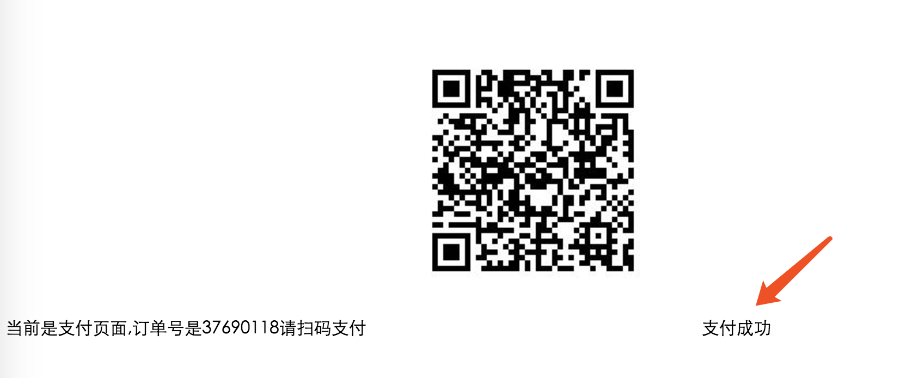

# 微信支付整合 Websocket(Servlet 方式)

> 流程:
>
> 1. 整合微信支付
> 2. 整合 WebSocket
> 3. 修改微信支付的扫码页面,在里面开启websocket, 参数名为订单号,用于服务器存储,关闭页面的时候关闭连接
> 4. 修改微信支付的成功回调接口,在内部获取到订单号,然后根据订单号找到 socket 连接,发送数据给页面
> 5. 页面解析发送的数据,重定向页面
> 6. 测试地址修改为: http://ceshi.qfjava.cn/payment

## 1.1微信支付

```
功能具体参考微信支付功能文档
```

## 1.2 整合 Websocket

```
具体参考 WebSocket 整合,本案例以 Servlet 方式整合的 websocket
```

##1.3 不同的地方

###1.3.1 扫码的jsp 页面

> jsp 中发生的变化,在内部添加了初始化 websocket 的方法,以及将参数的获取方式改为 订单 id

```html
<%--
  Created by IntelliJ IDEA.
  User: jackiechan
  Date: 2018/2/7
  Time: 上午10:20
  To change this template use File | Settings | File Templates.
--%>
<%@ page contentType="text/html;charset=UTF-8" language="java" %>
<html>
<head>
    <title>Title</title>
    <script type="text/javascript">

        var websocket = null;
        function abc() {

            //var username = localStorage.getItem("name");
           // var username=document.getElementById("me").value;
            var username=${oid}+'';//获取到订单号,以此为参数,告诉服务端我是谁
            //判断当前浏览器是否支持WebSocket
            if ('WebSocket' in window) {
                websocket = new WebSocket("ws://" + document.location.host + "/payment/websocket/"+username);
            } else {
                alert('当前浏览器 Not support websocket')
            }

            //连接发生错误的回调方法
            websocket.onerror = function() {
                setMessageInnerHTML("WebSocket连接发生错误");
            };

            //连接成功建立的回调方法
            websocket.onopen = function() {
                setMessageInnerHTML("WebSocket连接成功");
            }

            //接收到消息的回调方法
            websocket.onmessage = function(event) {
                setMessageInnerHTML(event.data);
            }

            //连接关闭的回调方法
            websocket.onclose = function() {
                setMessageInnerHTML("WebSocket连接关闭");
            }

            //监听窗口关闭事件，当窗口关闭时，主动去关闭websocket连接，防止连接还没断开就关闭窗口，server端会抛异常。
            window.onbeforeunload = function() {
                closeWebSocket();
            }
        }
        //关闭WebSocket连接
        function closeWebSocket() {
            if (websocket!=null) {

                websocket.close();
            }
        }

        /**
         * 直接将收到的数据显示到页面上,此处应该根据实际的业务逻辑来决定跳转页面
         * @param data
         */
        function setMessageInnerHTML(data) {
            document.getElementById("neirong").innerHTML = data;
        }
        window.onLoad=abc();

    </script>
</head>
<body>
当前是支付页面,订单号是${oid}请扫码支付


<!--用于显示结果的地方-->
<span id="neirong">


</span>
</body>
</html>

```

### 1.3.2 微信回调 servlet

> 此类中变化的地方为 当支付完成后,添加调用了 websocket 的发送消息的方法

```java
package xin.chenjunbo.weixin.util;

//
//                            _ooOoo_  
//                           o8888888o  
//                           88" . "88  
//                           (| -_- |)  
//                            O\ = /O  
//                        ____/`---'\____  
//                      .   ' \\| |// `.  
//                       / \\||| : |||// \  
//                     / _||||| -:- |||||- \  
//                       | | \\\ - /// | |  
//                     | \_| ''\---/'' | |  
//                      \ .-\__ `-` ___/-. /  
//                   ___`. .' /--.--\ `. . __  
//                ."" '< `.___\_<|>_/___.' >'"".  
//               | | : `- \`.;`\ _ /`;.`/ - ` : | |  
//                 \ \ `-. \_ __\ /__ _/ .-` / /  
//         ======`-.____`-.___\_____/___.-`____.-'======  
//                            `=---='  
//  
//         .............................................  
//                  佛祖镇楼                  BUG辟易  
//          佛曰:  
//                  写字楼里写字间，写字间里程序员；  
//                  程序人员写程序，又拿程序换酒钱。  
//                  酒醒只在网上坐，酒醉还来网下眠；  
//                  酒醉酒醒日复日，网上网下年复年。  
//                  但愿老死电脑间，不愿鞠躬老板前；  
//                  奔驰宝马贵者趣，公交自行程序员。  
//                  别人笑我忒疯癫，我笑自己命太贱；  
//  


import javax.servlet.ServletException;
import javax.servlet.http.HttpServlet;
import javax.servlet.http.HttpServletRequest;
import javax.servlet.http.HttpServletResponse;
import java.io.*;
import java.util.*;

/**
 * Created by jackiechan on 2018/2/2/上午11:16
 * 用于响应微信支付结果的 servlet
 */
public class ResuletServlet extends HttpServlet {
    @Override
    protected void doGet(HttpServletRequest req, HttpServletResponse resp) throws ServletException, IOException {
        try {
            weixin_notify(req,resp);
        } catch (Exception e) {
            e.printStackTrace();
        }
    }

    @Override
    protected void doPost(HttpServletRequest req, HttpServletResponse resp) throws ServletException, IOException {
        this.doGet(req, resp);
    }

    /**
     * 解析微信返回的支付结果
     * @param request
     * @param response
     * @throws Exception
     */

    public void weixin_notify(HttpServletRequest request,HttpServletResponse response) throws Exception{
        String writeContent="默认支付失败";
        String path = request.getServletContext().getRealPath("file");
        File file = new File(path);
        if (!file.exists()) {
            file.mkdirs();
        }
        FileOutputStream fileOutputStream = new FileOutputStream(path+"/result.txt", true);
        //读取参数
        InputStream inputStream ;
        StringBuffer sb = new StringBuffer();
        inputStream = request.getInputStream();
        String s ;
        BufferedReader in = new BufferedReader(new InputStreamReader(inputStream, "UTF-8"));
        while ((s = in.readLine()) != null){
            sb.append(s);
        }
        in.close();
        inputStream.close();

        //解析xml成map
        Map<String, String> m = new HashMap<String, String>();
        m = XMLUtil.doXMLParse(sb.toString());

        //过滤空 设置 TreeMap
        SortedMap<Object,Object> packageParams = new TreeMap<Object,Object>();
        Iterator it = m.keySet().iterator();
        while (it.hasNext()) {
            String parameter = (String) it.next();
            String parameterValue = m.get(parameter);

            String v = "";
            if(null != parameterValue) {
                v = parameterValue.trim();
            }
            packageParams.put(parameter, v);
        }

        // 账号信息
        String key = PayConfigUtil.API_KEY; // key

        System.err.println(packageParams);
        String out_trade_no = (String)packageParams.get("out_trade_no");
        //判断签名是否正确
        if(PayCommonUtil.isTenpaySign("UTF-8", packageParams,key)) {
            //------------------------------
            //处理业务开始
            //------------------------------
            String resXml = "";
            if("SUCCESS".equals((String)packageParams.get("result_code"))){
                // 这里是支付成功
                //////////执行自己的业务逻辑////////////////
                String mch_id = (String)packageParams.get("mch_id");
                String openid = (String)packageParams.get("openid");
                String is_subscribe = (String)packageParams.get("is_subscribe");
               // String out_trade_no = (String)packageParams.get("out_trade_no");

                String total_fee = (String)packageParams.get("total_fee");

                System.err.println("mch_id:"+mch_id);
                System.err.println("openid:"+openid);
                System.err.println("is_subscribe:"+is_subscribe);
                System.err.println("out_trade_no:"+out_trade_no);
                System.err.println("total_fee:"+total_fee);

                //////////执行自己的业务逻辑////////////////

                System.err.println("支付成功");
                writeContent = "订单:" + out_trade_no + "支付成功";
                //通知微信.异步确认成功.必写.不然会一直通知后台.八次之后就认为交易失败了.
                resXml = "<xml>" + "<return_code><![CDATA[SUCCESS]]></return_code>"
                        + "<return_msg><![CDATA[OK]]></return_msg>" + "</xml> ";
              
              
                //实际开发中,应该返回json 数据,这样页面可以解析,可以根据结果来决定做什么,此处只返回支付成功
                WebSocket.sendMessage(out_trade_no,"支付成功,可以跳转页面了",null);

            } else {
                writeContent = "订单"+out_trade_no+"支付失败,错误信息：" + packageParams.get("err_code");
                System.err.println("订单"+out_trade_no+"支付失败,错误信息：" + packageParams.get("err_code"));
                resXml = "<xml>" + "<return_code><![CDATA[FAIL]]></return_code>"
                        + "<return_msg><![CDATA[报文为空]]></return_msg>" + "</xml> ";
            }
            //------------------------------
            //处理业务完毕
            //------------------------------
            BufferedOutputStream out = new BufferedOutputStream(
                    response.getOutputStream());
            out.write(resXml.getBytes());
            out.flush();
            out.close();
        } else{
            writeContent = "订单"+out_trade_no+"通知签名验证失败,支付失败";
            System.err.println("通知签名验证失败");
        }
        fileOutputStream.write(writeContent.getBytes());
        fileOutputStream.close();
    }
}

```

### 1.3.3 WebSocket

> 此类的变化为 将发送消息的方法修改为静态方法,同时方法中额外添加了一个参数,参数代表的意思是如果是点对点聊天,需要将发送方的 session 传递过来

```java

/**
 * Created by jackiechan on 2018/2/7/下午10:08
 *
 * WebSocket 的处理类
 * 状态 注解:
 *  连接  OnOpen
 *  收到消息 OnMessage
 *  关闭连接 OnClose
 *  错误 OnError
 *  这是一个多例对象,每一次连接都会创建一个对象
 */
@ServerEndpoint("/websocket/{name}")
public class WebSocket {
    private String name;
    private Session session;

    private static Map<String,Session>  allClients=new ConcurrentHashMap();//用于记录所有的用户和连接之间的关系

    public WebSocket() {
        System.out.println("构造方法执行了");
    }

    /**
     * 当打开连接的时候,代表有人连接我们了
     * @param name  此处的 name 代表类注解上面的访问路径后的name, 我们此处做测试,根据用户传过来的名字做区分, 也可以通过 ip 等区分
     * @param session 当前连接的 session
     * @throws Exception
     */
    @OnOpen//此注解的作用是声明当前方法是当建立连接的时候调用
    public void onOpen(@PathParam("name") String name, Session session) throws  Exception{
        this.name=name;
        this.session = session;
        allClients.put(name, session);//将当前连接放入到 map中
    }

    /**
     * 收到消息的时候,此处应该填写自己的业务逻辑,我们服务端只是负责收到消息,实际开发中可能是两个人在聊天,我们这边收到消息后,应该当消息转发给接受者
     * 接收者到底是谁,一般情况下,如果是和客服聊天,我们这里应该是另外一个客服的连接页面,也是连接这里,然后将所有的客服存起来,随机或者按照某种规则选择客服进行通信
     * 如果是用户指定的人,那么在消息中应该会带有标记,比如发送给哪个人,我们取出来之后找到对方的连接,发过去即可
     * @param message 收到的消息,实际上,收到的消息中应当包含消息最终要发给谁,这样服务端就可以知道转发给谁了
     */
    @OnMessage//此注解的作用是当收到消息的时候执行
    public void onMessage(Session session ,String message) {
        System.out.println(session);
        //------实际开发中替换为自己的业务逻辑-------
        System.out.println("当前收到的消息是:"+message);
        JSONObject jsonObject = JSONObject.fromObject(message);
        String toName = jsonObject.getString("toName");//接收者
        String content = jsonObject.getString("content");//真正的消息内容,但是我们将这个内容修改后发过去,因为用户在页面需要判断出是谁给我发的消息,所以还需要一个发送者的信息
        sendMessage(toName,"来自: "+name+" 的消息,内容是: "+content,session);//此处直接拼接的字符串,没有弄成 json, 实际开发请自行处理
    }

    /**
     * 当服务端出现异常的时候,比如,用户直接非法断开连接导致 socket 出现异常
     * @param session 出现异常的连接
     * @param e 异常内容
     */
    @OnError//此注解的作用是当出现异常的时候执行
    public void onError(Session session,Throwable e) {
        try {
            session.close();
            allClients.remove(name);
        } catch (IOException e1) {
            e1.printStackTrace();
        }
        e.printStackTrace();
    }

    /**
     * 当连接关闭的时候
     */
    @OnClose//此注解的作用是 当连接关闭的时候执行
    public void onClose(Session session) {
        System.out.println(session);
        allClients.remove(name);//将当前连接移除
    }

    /**
     * 发送消息
     * @param name 接收方的名字
     * @param message 发送的内容
     * @param session 发送方的 session,用于点对点聊天时传递,服务器直接给用户发送消息可以不传递
     */
    public static  void sendMessage(String name, String message,Session session) {
        Session toSession = allClients.get(name);//找到目标所在对应的 session

            if (toSession != null) {
                toSession.getAsyncRemote().sendText(message);// 发送消息
                return;
            }
        if (session != null) {

            session.getAsyncRemote().sendText("对方不在线");//如果对方不在线,告诉当前用户
        }

    }


    public String getName() {
        return name;
    }

    public void setName(String name) {
        this.name = name;
    }

    public Session getSession() {
        return session;
    }

    public void setSession(Session session) {
        this.session = session;
    }

    public static Map<String, Session> getAllClients() {
        return allClients;
    }

    public static void setAllClients(Map<String, Session> allClients) {
        WebSocket.allClients = allClients;
    }
}

```

## 1.4测试




## 1.5 整合 ngixn

> 如果运行程序的 tomcat 地址是通过 nginx 反向代理配置后访问的,会出现 websocket 无法连接的问题,需要修改 nginx 的配置 例如:

```properties
#项目的访问地址,取决于项目实际配置
location /payment {
#tomcat地址
proxy_pass http://127.0.0.1:8090;
#websocket 需要添加以下内容,才可以访问
 		proxy_http_version 1.1;
        proxy_set_header Upgrade $http_upgrade;
        proxy_set_header Connection "upgrade";
        proxy_set_header Origin xxx;
        proxy_set_header X-Real-IP $remote_addr;
        proxy_set_header X-Forwarded-For $proxy_add_x_forwarded_for;
        proxy_set_header Host $http_host;
        proxy_set_header X-NginX-Proxy true;
}
```

