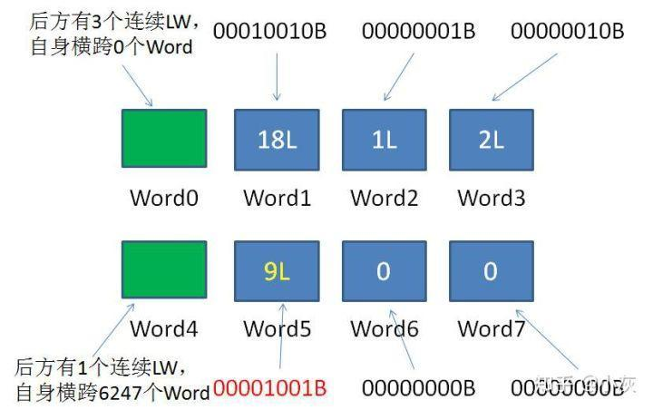

# Bitmap算法

两个月之前——

为满足用户标签的统计需求，小灰利用 Mysql 设计了如下的表结构，每一个维度的标签都对应着 Mysql 表的一列：

要想统计所有90后的程序员该怎么做呢？

用一条求交集的SQL语句即可：

> Select count（distinct Name） as 用户数 from table whare age = '90后' and Occupation = '程序员' ;

Select count（distinct Name） as 用户数 from table whare age = '90后' and Occupation = '程序员' ;

要想统计所有使用苹果手机或者00后的用户总合该怎么做？

用一条求并集的SQL语句即可：

> Select count（distinct Name） as 用户数 from table whare Phone = '苹果' or age = '00后' ;

Select count（distinct Name） as 用户数 from table whare Phone = '苹果' or age = '00后' ;

两个月之后——

\1. 给定长度是 10 的 bitmap，每一个 bit 位分别对应着从 0 到 9 的 10 个整型数。此时 bitmap 的所有位都是 0。

\2. 把整型数 4 存入 bitmap，对应存储的位置就是下标为4的位置，将此 bit 置为 1。

\3. 把整型数2存入bitmap，对应存储的位置就是下标为2的位置，将此bit置为1。

\4. 把整型数1存入bitmap，对应存储的位置就是下标为1的位置，将此bit置为1。

\5. 把整型数3存入bitmap，对应存储的位置就是下标为3的位置，将此bit置为1。

要问此时 bitmap 里存储了哪些元素？显然是 4,3,2,1，一目了然。

Bitmap 不仅方便查询，还可以去除掉重复的整型数。

\3. 这样，实现用户的去重和查询统计，就变得一目了然：

一周之后......

我们以上一期的用户数据为例，用户基本信息如下。按照年龄标签，可以划分成 90 后、00 后两个 Bitmap：

用更加形象的表示，90 后用户的 Bitmap 如下：

这时候可以直接求得非90后的用户吗？直接进行非运算？

显然，非 90 后用户实际上只有 1 个，而不是图中得到的 8 个结果，所以不能直接进行非运算。

同样是刚才的例子，我们给定 90 后用户的 Bitmap，再给定一个全量用户的 Bitmap。最终要求出的是存在于全量用户，但又不存在于 90 后用户的部分。

如何求出呢？我们可以使用异或操作，即相同位为 0，不同位为 1。

【 图片来源：null 所有者：null 】

25769803776 L = 11000000000000000000000000000000000 B

8589947086 L = 1000000000000000000011000011001110 B

1.解析 Word 0，得知当前 RLW 横跨的空 Word 数量为 0，后面有连续 3 个普通 Word。

2.计算出当前 RLW 后方连续普通 Word 的最大 ID 是 64 X (0 + 3) -1 = 191。

\3. 由于 191 < 400003，所以新 ID 必然在下一个 RLW（Word4）之后。

4.解析 Word 4，得知当前 RLW 横跨的空 Word 数量为 6247，后面有连续 1 个普通 Word。

5.计算出当前 RLW（Word4）后方连续普通 Word 的最大 ID 是 191 + （6247 + 1）X64 = 400063。

6.由于 400003 < 400063，因此新 ID 400003 的正确位置就在当前 RLW（Word4）的后方普通 Word，也就是 Word 5 当中。

最终插入结果如下：

