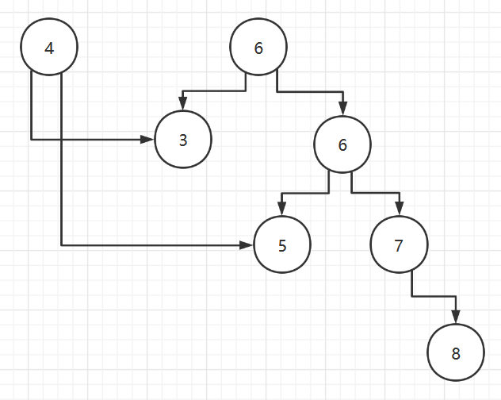

# 一、稀疏数组和队列

## 1、稀疏数组

### 基本功能

当一个数组中大部分元素为０，或者为同一个值的数组时，可以使用**稀疏数组**来保存该数组。

### 处理方法

- 记录数组**一共有几行几列**，有多少个**不同的值**
- 把具有不同值的元素的行列及值记录在一个小规模的数组中，从而**缩小程序**的规模

|  |
| :-------------------------------: |


如图，把一个6X7的二维数组变为了一个9X3的稀疏数组。其中

- 第一行保存的是原二维数组的行、列以及非0值的个数
- 第二到九行保存的是每个非0值所在的位置及其数值

### 转换思路

二维数组转稀疏数组

- 遍历二维数组，得到二维数组中有效值的个数sum
- 创建稀疏数组，有sum+1行，3列（固定）
- 将二维数组中的有效值存入稀疏数组中

稀疏数组转二维数组

- 先读取稀疏数组的第一行（保存二维数组的行列信息），还原二维数组
- 读取稀疏数组的其他行，将值赋给二维数组的对应位置上的数

**代码**

```java
public class Demo2 {
   public static void main(String[] args) {
      //创建一个二维数组
      int[][] arr1 = new int[11][11];
      //向二维数组里放值
      arr1[1][2] = 1;
      arr1[2][3] = 2;
      arr1[3][4] = 3;

      //打印二维数组
      System.out.println("遍历二维数组");
      for (int i = 0; i < arr1.length; i++) {
         for (int j = 0; j < arr1[0].length; j++) {
            System.out.print(arr1[i][j] + "   ");
         }
         System.out.println();
      }

      //二位数组----->稀疏数组
      //遍历二维数组中有效值的个数,用sum来记录
      int sum = 0;
      for (int i = 0; i < arr1.length; i++) {
         for (int j = 0; j < arr1[0].length; j++) {
            if (arr1[i][j] != 0) {
               //二维数组中元素不为0即为有效值
               sum++;
            }
         }
      }

      //创建稀疏数组
      //行数为sum+1，第一行用于保存二维数组的行列及有效值个数，列数固定为3
      int[][] sparseArr = new int[sum + 1][3];
      //存入二维数组的行列及有效值个数
      sparseArr[0][0] = arr1.length;
      sparseArr[0][1] = arr1[0].length;
      sparseArr[0][2] = sum;

      //再次遍历二维数组，将有效值存入稀疏数组
      //用于保存稀疏数组的行数
      int count = 1;
      for (int i = 0; i < arr1.length; i++) {
         for (int j = 0; j < arr1[0].length; j++) {
            if (arr1[i][j] != 0) {
               //将值存入稀疏数组
               sparseArr[count][0] = i;
               sparseArr[count][1] = j;
               sparseArr[count][2] = arr1[i][j];
               count++;
            }
         }
      }

      //打印稀疏数组
      System.out.println("遍历稀疏数组");
      for (int i = 0; i < sparseArr.length; i++) {
         for (int j = 0; j < sparseArr[0].length; j++) {
            System.out.print(sparseArr[i][j] + "   ");
         }
         System.out.println();
      }


      //稀疏数组------>二维数组
      //先得到二位数组的行列数
      int row = sparseArr[0][0];
      int col = sparseArr[0][1];
      int[][] arr2 = new int[row][col];

      //遍历稀疏数组，同时给二维数组赋值
      for (int i = 1; i < sparseArr.length; i++) {
         row = sparseArr[i][0];
         col = sparseArr[i][1];
         //该位置上对应的值
         int val = sparseArr[i][2];
         arr2[row][col] = val;
      }

      //打印二维数组
      System.out.println("遍历还原后的二维数组");
      for (int i = 0; i < arr2.length; i++) {
         for (int j = 0; j < arr2[0].length; j++) {
            System.out.print(arr2[i][j] + "   ");
         }
         System.out.println();
      }
   }
}
```

运行结果

```cmd
遍历二维数组
0   0   0   0   0   0   0   0   0   0   0   
0   0   1   0   0   0   0   0   0   0   0   
0   0   0   2   0   0   0   0   0   0   0   
0   0   0   0   3   0   0   0   0   0   0   
0   0   0   0   0   0   0   0   0   0   0   
0   0   0   0   0   0   0   0   0   0   0   
0   0   0   0   0   0   0   0   0   0   0   
0   0   0   0   0   0   0   0   0   0   0   
0   0   0   0   0   0   0   0   0   0   0   
0   0   0   0   0   0   0   0   0   0   0   
0   0   0   0   0   0   0   0   0   0   0   
遍历稀疏数组
11   11   3   
1   2   1   
2   3   2   
3   4   3   
遍历还原后的二维数组
0   0   0   0   0   0   0   0   0   0   0   
0   0   1   0   0   0   0   0   0   0   0   
0   0   0   2   0   0   0   0   0   0   0   
0   0   0   0   3   0   0   0   0   0   0   
0   0   0   0   0   0   0   0   0   0   0   
0   0   0   0   0   0   0   0   0   0   0   
0   0   0   0   0   0   0   0   0   0   0   
0   0   0   0   0   0   0   0   0   0   0   
0   0   0   0   0   0   0   0   0   0   0   
0   0   0   0   0   0   0   0   0   0   0   
0   0   0   0   0   0   0   0   0   0   0
```

## 2、队列

### 定义

- 队列是一个**有序列表**，可以用**数组**或是**链表**来实现。
- 遵循**先入先出**的原则。即：先存入队列的数据，要先取出。后存入的要后取出

### 模拟思路

- 队列本身是有序列表，若使用数组的结构来存储队列的数据，则队列数组的声明如下图, 其中 maxSize 是该队列的最大容量
- 因为队列的输出、输入是分别从前后端来处理，因此需要两个变量 front及 rear分别记录队列前后端的下标，front 会随着数据输出而改变，而 rear则是随着数据输入而改变，如图所示

|  |
| :------------------------------------------------: |

#### 入队出队操作模拟

当我们将数据存入队列时称为”addQueue”，addQueue 的处理需要有两个步骤：

- 将尾指针往后移：rear+1 , 当 **front == rear** 时，队列为空
- 若尾指针 rear 小于队列的最大下标 maxSize-1，则将数据存入 rear所指的数组元素中，否则无法存入数据。**rear == maxSize - 1**时，队列满

**注意**：front指向的是队列首元素的**前一个位置**

**实现代码**

```java
public class Demo3 {
   public static void main(String[] args) {
      ArrayQueue queue = new ArrayQueue(5);
      queue.addNum(1);
      queue.addNum(2);
      queue.addNum(3);
      queue.addNum(4);
      queue.addNum(5);
      System.out.println(queue.getNum());
      queue.showQueue();
   }
}

class ArrayQueue {
   //队列的大小
   int maxSize;
   //用数组来实现队列
   int[] arr;
   //指向队列首元素的前一个位置
   int front;
   //指向队列的尾元素
   int rear;

   public ArrayQueue(int maxSize) {
      this.maxSize = maxSize;
      arr = new int[this.maxSize];
      //front指向队列首元素的前一个位置
      front = -1;
      rear = -1;
   }


   public boolean isFull() {
      return rear == maxSize - 1;
   }


   public boolean isEmpty() {
      return front == rear;
   }


   public void addNum(int num) {
      if(isFull()) {
         System.out.println("队列已满，无法在进行入队操作");
         return;
      }
      //队尾标记后移，指向要放入的元素的位置
      rear++;
      arr[rear] = num;
   }

   public int getNum() {
      if(isEmpty()) {
         throw new RuntimeException("队列为空，无法出队");
      }
      //队首标记后移，指向队首元素
      System.out.print("出队元素是：");
      front++;
      return arr[front];
   }

   public void showQueue() {
      if(isEmpty()) {
         throw new RuntimeException("队列为空，无法遍历");
      }
      System.out.println("遍历队列");
      //从front+1开始读取元素
      for(int start = front+1; start<=rear; start++) {
         System.out.println(arr[start]);
      }
   }
}
```

运行结果

```cmd
出队元素是：1
遍历队列
2
3
4
5
```

### 环形队列

思路：

- front变量指向**队首元素**，初值为0
- rear变量指向队尾元素的**下一个元素**，初值为0。规定空出一个位置
- 队列为空的判定条件：front == rear
- 队列为满的判定条件：(rear + 1) % maxSize == front
- 队列中有效元素的个数：(rear - front + maxSize) % maxSize
- 入队和出队时，都需要让标记**对maxSize取模**

**代码**

```java
public class Demo4 {
   public static void main(String[] args) {
      ArrayAroundQueue aroundQueue = new ArrayAroundQueue(5);
      aroundQueue.addNum(1);
      aroundQueue.addNum(2);
      aroundQueue.addNum(3);
      aroundQueue.addNum(4);
      aroundQueue.showQueue();
      System.out.println(aroundQueue.getNum());
      System.out.println(aroundQueue.getNum());
      aroundQueue.addNum(5);
      aroundQueue.addNum(6);
      aroundQueue.showQueue();
      aroundQueue.getHead();
   }
}

class ArrayAroundQueue {
   //队列的大小
   int maxSize;
   //用数组来实现队列
   int[] arr;
   //指向队列首元素的前一个位置
   int front;
   //指向队列的尾元素
   int rear;

   public ArrayAroundQueue(int maxSize) {
      this.maxSize = maxSize;
      arr = new int[this.maxSize];
      //front指向队列首元素的前一个位置
      front = 0;
      rear = 0;
   }


   public boolean isFull() {
      return (rear+1)%maxSize == front;
   }


   public boolean isEmpty() {
      return front == rear;
   }


   public void addNum(int num) {
      if(isFull()) {
         System.out.println("队列已满，无法在进行入队操作");
         return;
      }
      //先放入元素，在后移队尾标记
      arr[rear] = num;
      rear = (rear+1)%maxSize;
   }

   public int getNum() {
      if(isEmpty()) {
         throw new RuntimeException("队列为空，无法出队");
      }
      //队首标记后移，指向队首元素
      System.out.print("出队元素是：");
      int num = arr[front];
      front = (front+1)%maxSize;
      return num;
   }

   public void showQueue() {
      if(isEmpty()) {
         throw new RuntimeException("队列为空，无法遍历");
      }
      System.out.println("遍历队列");
      //当front + 1 == rear时停止遍历
      int start = front;
      while(start != rear) {
         System.out.println(arr[start]);
         //移动到下一个元素
         start = (start+1)%maxSize;
      }
   }

   public void getHead() {
      if(isEmpty()) {
         throw new RuntimeException("队列为空");
      }

      System.out.println("队首元素为："+arr[front]);
   }
}
```

运行结果

```cmd
遍历队列
1
2
3
4
出队元素是：1
出队元素是：2
遍历队列
3
4
5
6
队首元素为：3
```

# 二、链表

## 1、单向链表

### 链表的介绍

链表在内存中的存储

|  |
| :------------------------------------------------: |

**特点**

- 链表是以节点的方式来存储,**是链式存储**
- 每个节点包含 data 域 和 next 域。next域用来指向下一个节点
- 链表的各个节点不一定是连续存储的
- 链表分**带头节点的链表**和**没有头节点的链表**，根据实际的需求来确定

带头结点的**逻辑示意图**

|  |
| :------------------------------------------------: |

### 实现思路

**创建（添加）**

- 先创建一个Head头节点，表示单链表的头
- 后面我们每添加一个节点，就放在链表的最后

**遍历**

- 通过一个辅助变量，来遍历整个链表

**有序插入**

- 先遍历链表，找到应该插入的位置
- 要插入的节点的next指向插入位置的后一个节点
- 插入位置的前一个节点的next指向要插入节点
  - 插入前要判断是否在队尾插入

**根据某个属性节点修改值**

- 先遍历节点，找到修改的位置
  - 如果未找到修改节点，则不修改

**删除某个节点**

- 先遍历节点，找到要删除节点的前一个节点
- 进行删除操作

**求倒数第n个节点的信息**

- 遍历链表，求出链表的**有效长度**length（不算头结点）
- 遍历链表到第length-n的节点

**翻转链表**

|  |
| :------------------------------------------------: |

- 创建一个新的头结点，作为新链表的头

- 从头遍历旧链表，将遍历到的节点插入新链表的头结点之后

- 注意需要用到

  两个暂存节点

  - 一个用来保存正在遍历的节点
  - 一个用来保存正在遍历节点的下一个节点

|  |
| :------------------------------------------------: |

|  |
| :------------------------------------------------: |

|  |
| :------------------------------------------------: |

|  |
| :------------------------------------------------: |

|  |
| :------------------------------------------------: |

**逆序打印**

- 遍历链表，将遍历到的节点入栈
- 遍历完后，进行出栈操作，同时打印出栈元素

**代码**

```java
public class Demo1 {
	public static void main(String[] args) {
		LinkedList linkedList = new LinkedList();
		linkedList.traverseNode();
		System.out.println();
		//创建学生节点，并插入链表
		StudentNode student1 = new StudentNode(1, "Nyima");
		StudentNode student3 = new StudentNode(3, "Lulu");
		linkedList.addNode(student1);
		linkedList.addNode(student3);
		linkedList.traverseNode();
		System.out.println();

		//按id大小插入
		System.out.println("有序插入");
		StudentNode student2 = new StudentNode(0, "Wenwen");
		linkedList.addByOrder(student2);
		linkedList.traverseNode();
		System.out.println();

		//按id修改学生信息
		System.out.println("修改学生信息");
		student2 = new StudentNode(1, "Hulu");
		linkedList.changeNode(student2);
		linkedList.traverseNode();
		System.out.println();

		//根据id删除学生信息
		System.out.println("删除学生信息");
		student2 = new StudentNode(1, "Hulu");
		linkedList.deleteNode(student2);
		linkedList.traverseNode();
		System.out.println();

		//获得倒数第几个节点
		System.out.println("获得倒数节点");
		System.out.println(linkedList.getStuByRec(2));
		System.out.println();

		//翻转链表
		System.out.println("翻转链表");
		LinkedList newLinkedList = linkedList.reverseList();
		newLinkedList.traverseNode();
		System.out.println();

		//倒叙遍历链表
		System.out.println("倒序遍历链表");
		newLinkedList.reverseTraverse();

	}
}

/**
 * 创建链表
 */
class LinkedList {
	//头节点，防止被修改，设置为私有的
	private StudentNode head = new StudentNode(0, "");

	/**
	 * 添加节点
	 * @param node 要添加的节点
	 */
	public void addNode(StudentNode node) {
		//因为头节点不能被修改，所以创建一个辅助节点
		StudentNode temp = head;
		//找到最后一个节点
		while (true) {
			//temp是尾节点就停止循环
			if(temp.next == null) {
				break;
			}
			//不是尾结点就向后移动
			temp = temp.next;
		}
		//现在temp是尾节点了，再次插入
		temp.next = node;
	}

	/**
	 * 遍历链表
	 */
	public void traverseNode() {
		System.out.println("开始遍历链表");
		if(head.next == null) {
			System.out.println("链表为空");
		}
		//创建辅助节点
		StudentNode temp = head.next;
		while(true) {
			//遍历完成就停止循环
			if(temp == null) {
				break;
			}
			System.out.println(temp);
			temp = temp.next;
		}
	}

	/**
	 * 按id顺序插入节点
	 * @param node
	 */
	public void addByOrder(StudentNode node) {
		//如果没有首节点，就直接插入
		if(head.next == null) {
			head.next = node;
			return;
		}
		//辅助节点，用于找到插入位置和插入操作
		StudentNode temp = head;
		//节点的下一个节点存在，且它的id小于要插入节点的id，就继续下移
		while (temp.next!=null && temp.next.id < node.id) {
			temp = temp.next;
		}
		//如果temp的下一个节点存在，则执行该操作
		//且插入操作，顺序不能换
		if(temp.next != null) {
			node.next = temp.next;
		}
		temp.next = node;
 	}

	/**
	 * 根据id来修改节点信息
	 * @param node 修改信息的节点
	 */
 	public void changeNode(StudentNode node) {
		if(head == null) {
			System.out.println("链表为空，请先加入该学生信息");
			return;
		}
		StudentNode temp = head;
		//遍历链表，找到要修改的节点
		while (temp.next!= null && temp.id != node.id) {
			temp = temp.next;
		}
		//如果temp已经是最后一个节点，判断id是否相等
		if(temp.id != node.id) {
			System.out.println("未找到该学生的信息，请先创建该学生的信息");
			return;
		}
		//修改学生信息
		temp.name = node.name;
	}

	/**
	 * 根据id删除节点
	 * @param node 要删除的节点
	 */
	public void deleteNode(StudentNode node) {
 		if(head.next == null) {
			System.out.println("链表为空");
			return;
		}
 		StudentNode temp = head.next;
 		//遍历链表，找到要删除的节点
 		if(temp.next!=null && temp.next.id!=node.id) {
 			temp = temp.next;
		}
 		//判断最后一个节点的是否要删除的节点
 		if(temp.next.id != node.id) {
			System.out.println("请先插入该学生信息");
			return;
		}
 		//删除该节点
 		temp.next = temp.next.next;
	}

	/**
	 * 得到倒数的节点
	 * @param index 倒数第几个数
	 * @return
	 */
	public StudentNode getStuByRec(int index) {
		if(head.next == null) {
			System.out.println("链表为空!");
		}
		StudentNode temp = head.next;
		//用户记录链表长度，因为head.next不为空，此时已经有一个节点了
		//所以length初始化为1
		int length = 1;
		while(temp.next != null) {
			temp = temp.next;
			length++;
		}
		if(length < index) {
			throw new RuntimeException("链表越界");
		}

		temp = head.next;
		for(int i = 0; i<length-index; i++) {
			temp = temp.next;
		}
		return temp;
	}

	/**
	 * 翻转链表
	 * @return 反转后的链表
	 */
	public LinkedList reverseList() {
		//链表为空或者只有一个节点，无需翻转
		if(head.next == null || head.next.next == null) {
			System.out.println("无需翻转");
		}
		LinkedList newLinkedList = new LinkedList();
		//给新链表创建新的头结点
		newLinkedList.head = new StudentNode(0, "");
		//用于保存正在遍历的节点
		StudentNode temp = head.next;
		//用于保存正在遍历节点的下一个节点
		StudentNode nextNode = temp.next;
		while(true) {
			//插入新链表
			temp.next = newLinkedList.head.next;
			newLinkedList.head.next = temp;
			//移动到下一个节点
			temp = nextNode;
			nextNode = nextNode.next;
			if(temp.next == null) {
				//插入最后一个节点
				temp.next = newLinkedList.head.next;
				newLinkedList.head.next = temp;
				head.next = null;
				return newLinkedList;
			}
		}
	}

	public void reverseTraverse() {
		if(head == null) {
			System.out.println("链表为空");
		}

		StudentNode temp = head.next;
		//创建栈，用于存放遍历到的节点
		Stack<StudentNode> stack = new Stack<>();
		while(temp != null) {
			stack.push(temp);
			temp = temp.next;
		}

		while (!stack.isEmpty()) {
			System.out.println(stack.pop());
		}
	}
}

/**
 * 定义节点
 */
class StudentNode {
	int id;
	String name;
	//用于保存下一个节点的地址
	StudentNode next;

	public StudentNode(int id, String name) {
		this.id = id;
		this.name = name;
	}

	@Override
	public String toString() {
		return "StudentNode{" +
				"id=" + id +
				", name='" + name + '\'' +
				'}';
	}
}
```

结果

```
开始遍历链表
链表为空

开始遍历链表
StudentNode{id=1, name='Nyima'}
StudentNode{id=3, name='Lulu'}

有序插入
开始遍历链表
StudentNode{id=0, name='Wenwen'}
StudentNode{id=1, name='Nyima'}
StudentNode{id=3, name='Lulu'}

修改学生信息
开始遍历链表
StudentNode{id=0, name='Wenwen'}
StudentNode{id=1, name='Hulu'}
StudentNode{id=3, name='Lulu'}

删除学生信息
开始遍历链表
StudentNode{id=0, name='Wenwen'}
StudentNode{id=3, name='Lulu'}

获得倒数节点
StudentNode{id=0, name='Wenwen'}

翻转链表
开始遍历链表
StudentNode{id=3, name='Lulu'}
StudentNode{id=0, name='Wenwen'}

倒序遍历链表
StudentNode{id=0, name='Wenwen'}
StudentNode{id=3, name='Lulu'}
```

## 2、双向链表

### 双向链表

|  |
| :------------------------------------------------: |

### 实现思路

**遍历**

- 和单向链表的遍历相同，需要一个辅助节点来保存当前正在遍历的节点

**添加**

- 双向链表多出了一个frnot，所以在添加时，要让新增节点的front指向链表尾节点

**修改**

- 和单向链表的修改相同

**删除**

- 使用temp来保存要删除的节点
- temp.pre.next指向temp.next
- temp.next指向temp.pre

**代码**

```java
public class Demo2 {
   public static void main(String[] args) {
      BidirectionalList bidirectionalList = new BidirectionalList();
      bidirectionalList.addNode(new PersonNode(1, "Nyima"));
      bidirectionalList.addNode(new PersonNode(2, "Lulu"));
      bidirectionalList.traverseNode();
      System.out.println();

      System.out.println("修改节点信息");
      bidirectionalList.changeNode(new PersonNode(2, "Wenwen"));
      bidirectionalList.traverseNode();
      System.out.println();

      //删除节点
      System.out.println("删除节点");
      bidirectionalList.deleteNode(new PersonNode(1, "Nyima"));
      bidirectionalList.traverseNode();
   }
}

class BidirectionalList {
   private final PersonNode head = new PersonNode(-1, "");

   /**
    * 判断双向链表是否为空
    * @return 判空结果
    */
   public boolean isEmpty() {
      return head.next == null;
   }

   /**
    * 添加将诶点
    * @param node 要被添加的节点
    */
   public void addNode(PersonNode node) {
      PersonNode temp = head;
      if(temp.next != null) {
         temp = temp.next;
      }
      //插入在最后一个节点的后面
      temp.next = node;
      node.front = temp;
   }

    public void traverseNode() {
       System.out.println("遍历链表");
      if (isEmpty()) {
         System.out.println("链表为空");
         return;
      }
      PersonNode temp = head.next;
      while(temp != null) {
         System.out.println(temp);
         temp = temp.next;
      }
    }

   /**
    * 修改节点信息
    * @param node 要修改的节点
    */
    public void changeNode(PersonNode node) {
      if(isEmpty()) {
         System.out.println("链表为空");
         return;
      }
      PersonNode temp = head.next;
      //用于判定是否做了修改
      boolean flag = false;
      while (temp != null) {
         if(temp.id == node.id) {
            //匹配到节点，替换节点
            temp.front.next = node;
            node.next = temp.next;
            flag = true;
         }
         temp = temp.next;
      }
      if(!flag) {
         System.out.println("未匹配到改人信息");
      }

    }

   /**
    * 删除节点
    * @param node 要删除的节点
    */
    public void deleteNode(PersonNode node) {
      if(isEmpty()){
         System.out.println("链表为空");
         return;
      }
      PersonNode temp = head.next;
      //查看是否删除成功
       boolean flag = false;
      while(temp != null) {
         if(temp.id == node.id) {
            temp.front.next = temp.next;
            temp.next = null;
            flag = true;
         }
         temp = temp.next;
      }
      if(!flag) {
         System.out.println("未找到该节点");
      }
    }


}

class PersonNode {
   int id;
   String name;
   //指向下一个节点
   PersonNode next;
   //指向前一个节点
   PersonNode front;

   public PersonNode(int id, String name) {
      this.id = id;
      this.name = name;
   }

   @Override
   public String toString() {
      return "PersonNode{" +
            "id=" + id +
            ", name='" + name + '\'' +
            '}';
   }
}
```

**输出**

```
遍历链表
PersonNode{id=1, name='Nyima'}
PersonNode{id=2, name='Lulu'}

修改节点信息
遍历链表
PersonNode{id=1, name='Nyima'}
PersonNode{id=2, name='Wenwen'}

删除节点
遍历链表
PersonNode{id=2, name='Wenwen'}
```

## 3、循环链表

### 循环链表

单链表的尾节点指向首节点，即可构成循环链表

|  |
| :------------------------------------------------: |

### 约瑟夫环

N个人围成一圈，从第S个开始报数，第M个将被杀掉，最后剩下一个，其余人都将被杀掉，求出被杀顺序

- 例如N=6，M=5，S=1，被杀掉的顺序是：6，4，5，2，1，3

**大致思路**

- 遍历链表找到指定位置的节点
- 用一个front保存指定节点的前一个节点，方便删除
- 当count==time时，删除此时正在遍历的节点，放入数组中，**并将count的值初始化**
- 用一个变量loopTime记录已经出圈了几个人，**当其等于length时则是最后一个节点**，直接放入数组并返回数即可

**代码**

```java
public class Demo3 {
	public static void main(String[] args) {
		CircularList circularList = new CircularList();
		AttenderNode node1 = new AttenderNode(1);
		AttenderNode node2 = new AttenderNode(2);
		AttenderNode node3 = new AttenderNode(3);
		AttenderNode node4 = new AttenderNode(4);
		circularList.addNode(node1);
		circularList.addNode(node2);
		circularList.addNode(node3);
		circularList.addNode(node4);
		System.out.println("约瑟夫环");
		AttenderNode[] arr = circularList.killAttender(1, 4);
		for(AttenderNode node : arr) {
			System.out.println(node);
		}


	}
}

class CircularList {
	private final AttenderNode head = new AttenderNode(-1);

	AttenderNode temp;

	public void addNode(AttenderNode node) {
		if(head.next == null) {
			head.next = node;
			return;
		}
		temp = head.next;
		//只有一个节点，还没成环
		if(temp.next == null) {
			temp.next = node;
			node.next = head.next;
			return;
		}
		while (temp.next != head.next) {
			temp = temp.next;
		}
		//temp现在为尾节点
		temp.next = node;
		//node现在为尾节点，将其next指向首节点
		node.next = head.next;
	}

		public int getListLength() {
			if(head.next == null) {
				return 0;
			}
			//判断是否只有一个节点
			if(head.next.next == null) {
				return 1;
			}
			//节点个数初始为2
			int length = 2;
			AttenderNode first = head.next;
			AttenderNode temp = first.next;
			while(true) {
				//循环了一轮
				if(temp.next.id == first.id) {
					return length;
				}
				temp = temp.next;
				length++;
			}
		}

	/**
	 * 删除指定位置节点
	 * @param time 次数
	 * @param start 开始节点
	 * @return
	 */
		public AttenderNode[] killAttender(int time, int start) {
			if(head.next == null) {
				System.out.println("链表为空");
				return null;
			}
			temp = head.next;
			int length = getListLength();
			//存放退出队列的节点
			AttenderNode[] arr = new AttenderNode[length];
			//从start开始计数
			if(start > length) {
				System.out.println("超出链表范围");
				return null;
			}
			AttenderNode startNode = temp;
			int count;
			//如果只有一个节点，直接返回
			if(temp.next == null) {
				arr[0] = temp;
				return arr;
			}
			//找到开始节点位置
			for(count = 1; count<start; count++) {
				startNode = startNode.next;
			}
			//找到start的前一个节点，方便删除操作
			AttenderNode front = startNode.next;
			while(front.next != startNode) {
				front = front.next;
			}
			//开始选出节点出链表
			temp = startNode;
			//记录循环次数
			int loopTime = 1;
			int index = 0;
			for(count=1; count<=time; count++) {
				if(loopTime == length) {
					//放入最后一个节点
					arr[index] = temp;
					return arr;
				}
				if(count == time) {
					arr[index] = temp;
					front.next = temp.next;
					index++;
					loopTime++;
					//初始化，因为在循环开始时还会+1，所以这里初始化为0
					count = 0;
				}
				temp =front.next;
			}
			return arr;
		}


}

class AttenderNode {
	int id;
	AttenderNode next;

	@Override
	public String toString() {
		return "KillerNode{" +
				"id=" + id +
				'}';
	}

	public AttenderNode(int id) {
		this.id = id;
	}
}
```

**运行结果**

```
约瑟夫环
KillerNode{id=4}
KillerNode{id=1}
KillerNode{id=2}
KillerNode{id=3}
```

## 4、跳跃表

详见[**Redis设计与实现——跳跃表**

# 三、栈

## 1、定义

- 栈是一个**先入后出**的有序列表
- 栈(stack)是限制线性表中元素的插入和删除只能在线性表的**同一端进行**的一种特殊线性表。允许插入和删除的一端，为变化的一端，称为栈顶，另一端为固定的一端，称为栈底
- 最先放入的元素在栈底，且最后出栈。最后放入的元素在栈顶，且最先出栈

|  |
| :------------------------------------------------: |

## 2、应用场景

- 子程序递归调用。如JVM中的虚拟机栈
- 表达式转换（中缀转后缀）与求值
- 二叉树的遍历
- 图的深度优先遍历

## 3、实现

### 用数组实现

**思路**

- 定义top表示栈顶，初始值为-1
- 入栈的操作，先让top++，再放入数组
- 出栈操作，先取出元素，在让top–
- top == -1时，栈空
- top == maxSize-1时，栈满

**代码**

```java
public class Demo1 {
   public static void main(String[] args) {
      ArrayStack stack = new ArrayStack(5);
      //压栈
      stack.push(1);
      stack.push(2);
      stack.push(3);
      stack.push(4);
      stack.push(5);
      //出栈
      System.out.println(stack.pop());
   }
}

class ArrayStack {
   private final int maxSize;
   int[] stack;
   private int top;

   public ArrayStack(int maxSize) {
      this.maxSize = maxSize;
      stack = new int [this.maxSize];
      top = -1;
   }

   private boolean isEmpty() {
      return top == -1;
   }

   private boolean isFull() {
      return top == maxSize-1;
   }

   public void push(int i) {
      if(isFull()) {
         throw new StackOverflowError("栈满");
      }
      //压栈
      top++;
      stack[top] = i;
   }

   public int pop() {
      if(isEmpty()) {
         throw new EmptyStackException();
      }
      int retNum = stack[top];
      top--;
      return retNum;
   }
}
```

## 4、应用

### 表达式求值

**思路**

|  |
| :------------------------------------------------: |

- 准备一个索引index来帮助我们遍历表达式
- 如果index位置上的元素是一个数字，就直接入栈
- 如果index位置上的元素是一个符号
  - 如果符号栈为空，直接入栈
  - 如果符号栈不为空
    - index位置上的符号的优先级小于或等于栈顶符号的优先级，则弹出两个数栈中的元素和符号栈中的一个符号，并且进行计算。将运算结果放入数栈中，并将index位置上的符号压入符号栈
    - index位置上的符号的优先级大于符号栈栈顶符号的优先级，则将该符号压入符号栈
- 当表达式遍历完毕后，就弹出数栈中的2个数字和符号栈中的1个符号进行运算，并将运行结果入栈
- 最终数栈中只有一个值，这个值便是运算结果
- 注意：
  - 读取的是字符，所以存入数字前需要减去0的ASCII码
  - 如果数字是多位数，需要一直读，读到下一位不是数字为止，然后将读到的字符进行拼接，然后一起压入数栈

**代码**

存在的问题：因为栈是用的整型数组，所以计算除法的时候，无法转化成double

```java
public class Demo2 {
	public static void main(String[] args) {
		String formula = "12+3*15+3/3";
		//索引，用来读取字符串中的元素
		int index = 0;
		//保存读取到的数字和符号
		int number1 = 0;
		int number2 = 0;
		int thisChar = ' ';
		//用于拼接数字
		StringBuilder spliceNumber = new StringBuilder();
		//数栈和符号栈
		ArrayStack2 numberStack = new ArrayStack2(10);
		ArrayStack2 operationStack = new ArrayStack2(10);
		//保存运算结果
		int result;

		//开始读取字符串中的元素
		for (index = 0; index < formula.length(); index++) {
			thisChar = formula.charAt(index);
			if (operationStack.isOperation(thisChar)) {
				if(operationStack.comparePriority(thisChar)) {
					operationStack.push(thisChar);
				} else {
					int popChar = operationStack.pop();
					number2 = numberStack.pop();
					number1 = numberStack.pop();
					//获得运算结果
					result = operationStack.calculation(number1, number2, popChar);
					operationStack.push(thisChar);
					numberStack.push(result);
				}
			} else {
				//如果是数字，就一直读取
				while(thisChar>='0' && thisChar<='9') {
					//可能该数字为多位数，所以不能只存入一位数字
					spliceNumber.append(thisChar - '0');
					System.out.println("拼接字符换 " + spliceNumber);
					index++;
					//如果已经读了最后一个数字了，就停下来
					if(index >= formula.length()) {
						break;
					}
					thisChar = formula.charAt(index);
				}
				int number = Integer.parseInt(spliceNumber.toString());
				numberStack.push(number);
				//初始化spliceNumber
				spliceNumber = new StringBuilder();
				index--;
			}
		}

		while(!operationStack.isEmpty()) {
			int popChar = operationStack.pop();
			number2 = numberStack.pop();
			number1 = numberStack.pop();
			//获得运算结果
			result = operationStack.calculation(number1, number2, popChar);
			numberStack.push(result);
		}

		System.out.println(numberStack.pop());
	}
}

class ArrayStack2 {
	private final int maxSize;
	int[] stack;
	private int top;

	public ArrayStack2(int maxSize) {
		this.maxSize = maxSize;
		stack = new int[this.maxSize];
		top = -1;
	}

	public boolean isEmpty() {
		return top == -1;
	}

	 public boolean isFull() {
		return top == maxSize - 1;
	}

	public void push(int i) {
		if (isFull()) {
			throw new StackOverflowError("栈满");
		}
		//压栈
		top++;
		stack[top] = i;
	}

	public int pop() {
		if (isEmpty()) {
			throw new EmptyStackException();
		}
		int retNum = stack[top];
		top--;
		return retNum;
	}

	public void  traverse() {
		for(int thiChar : stack) {
			System.out.println(thiChar);
		}
	}

	/**
	 * 判断符号的优先级
	 *
	 * @param operation 传入运算符
	 * @return 返回优先级
	 */
	public int getPriority(int operation) {
		if (operation == '*' || operation == '/') {
			return 2;
		} else if (operation == '+' || operation == '-') {
			return 1;
		} else if (operation >= '0' && operation <= '9') {
			return 0;
		} else {
			return -1;
		}
	}

	/**
	 * 比较栈顶元素和传入字符的优先级大小
	 *
	 * @param operation 传入字符
	 * @return true则是传入字符优先级大于栈顶字符，false反之
	 */
	public boolean comparePriority(int operation) {
		if (isEmpty()) {
			return true;
		} else {
  			int priority1 = getPriority(operation);
  			int priority2 = getPriority(stack[top]);
			return priority1 > priority2;
		}
	}

	/**
	 * 判断该位置是不是一个符号
	 *
	 * @param operation 该位置的符号
	 * @return 判断结果
	 */
	public boolean isOperation(int operation) {
		return operation == '*' || operation == '/' || operation == '-' || operation == '+';
	}

	/**
	 * @param number1   第一个运算的数字
	 * @param number2   第二个运算的数字
	 * @param operation 运算符
	 * @return
	 */
	public int calculation(int number1, int number2, int operation) {
		switch (operation) {
			case '+':
				return number1+number2;
			case '-':
				return number1-number2;
			case '*':
				return number1*number2;
			case '/':
				return number1/number2;
			default:
				System.out.println(operation);
				throw new RuntimeException("符号读取错误！");
		}
	}
}
```

结果

```cmd
58
```

## 5、中缀转后缀

**后缀表达式**运算方法

- 从左向右读取表达式
  - 遇到数字就压入栈中
  - 遇到运算符就弹出栈顶和次顶元素。用**次顶元素 运算符 栈顶元素**，并将运算结果压入栈中，直到栈为空，最终结果就是运算结果

### **设计**

**中缀表达式转后缀表达式**

- **从左向右**读取中缀表达式，并且创建**栈s**和**队列q**

- 如果读到的元素的数字，就直接入队放入q中

- 如果读到的是

  运算符

  （运算符判定）

  - 如果s为空，则将该运算符压入s
  - 如果s不为空
    - 如果该运算符为**左括号**，则直接压入s
    - 如果该运算符为**右括号**，则将s中的元素依次出栈并入队到q中，**直到遇见左括号为止**（括号不放入q中）
    - 如果该运算符的优先级**高于**s栈顶的运算符，则将该元素压入s
    - 如果该运算符的优先级**小于等于**s栈顶的运算符，则弹出s栈顶的元素，并将其放入q中，该运算符重**新判定**入栈操作（运算符判定步骤）

- 如果中缀表达式已经读取完毕，则将s中的元素依次出栈，放入q中

- q中的元素依次出队，该顺序即为后缀表达式

**代码**

```java
/**
 * @author Chen Panwen
 * @data 2020/6/17 21:07
 */
public class Demo4 {
   static Queue<String> queue = new LinkedList<>();
   static Stack<String> stack = new Stack<>();

   public static void main(String[] args) {
      //中缀表达式，加上空格，方便取出
      String infixExpression = "1 + ( ( 2 + 3 ) * 4 ) - 5";
      String[] expressionArr = infixExpression.split(" ");
      //用来保存该运算符的类型
      int type;
      //取出的字符串
      String element;
      //弹出栈的字符串
      String stackEle;
      for(int i=0; i<expressionArr.length; i++) {
         element = expressionArr[i];
         type = judgeOperator(element);
         if(type == 0) {
            //数字，直接入队
            queue.add(element);
         }else if(type == 1) {
            //左括号，直接压栈
            stack.push(element);
         }else if(type == 3) {
            //如果右括号，弹出栈顶元素，直到遇见左括号位置再停下来
            do {
               stackEle = stack.pop();
               if(stackEle.equals("(")) {
                  break;
               }
               queue.add(stackEle);
               //弹出栈中的左括号
            }while (!stackEle.equals("("));
         }else if(type == 2) {
            if(stack.isEmpty()) {
               //如果栈为空，直接入栈
               stack.push(element);
               continue;
            }
            int priority1 = getPriority(element);
            //获得栈顶元素，并判断其优先级
            stackEle = stack.peek();
            int priority2 = getPriority(stackEle);
            if(priority2 == 0) {
               //为左括号，运算符直接入栈
               stack.push(element);
            }else if(priority1 > priority2) {
               //该运算符优先级高于栈顶元素优先级，则入栈
               stack.push(element);
            }else {
               stackEle = stack.pop();
               queue.add(stackEle);
               //重新判断该运算符
               i--;
            }
         }
      }
      //把最后一个元素出栈并入队
      stackEle = stack.pop();
      queue.add(stackEle);
      //保存队列长度，因为出队过程中队列的长度会被改变
      int length = queue.size();
      for(int i=0; i<length; i++) {
         element = queue.remove();
         System.out.print(element);
      }
   }

   /**
    * 判断该运算符是不是加减乘除
    * @param operation 运算符
    * @return true则该运算符为加减乘除
    */
   public static boolean firstJudge(String operation) {
      return operation.equals("*") || operation.equals("/") || operation.equals("+") || operation.equals("-");
   }


   /**
    * 判断该字符串的类型
    * @param operation 要判断的字符串
    * @return 3->右括号 2->加减乘除运算符 1->左括号
    */
   public static int judgeOperator(String operation) {
      if(operation.equals(")")) {
         return 3;
      }
      if(firstJudge(operation)) {
         return 2;
      }
      if(operation.equals("(")) {
         return 1;
      } else {
         return 0;
      }
   }

   /**
    * 判断运算符优先级
    * @param operator 要判断的运算符
    * @return 2代表乘除，1代表加减，0代表左括号
    */
   public static int getPriority(String operator) {
      if(operator.equals("*") || operator.equals("/")) {
         return 2;
      }else if(operator.equals("+") || operator.equals("-")) {
         return 1;
      } else {
         return 0;
      }

   }
}
```

结果

```cmd
123+4*+5-
```

# 四、递归

## 1、概念

**递归就是方法自己调用自己**,每次调用时**传入不同的变量**.递归有助于编程者解决复杂的问题,同时可以让代码变得简洁。并且递归用到了**虚拟机栈**

|  |
| :------------------------------------------------: |

## 2、能解决的问题

**数学问题**

- 八皇后问题
- 汉诺塔
- 求阶乘
- 迷宫问题
- 球和篮子

**各种排序算法**

## 3、规则

- 方法的变量是独立的，不会相互影响的

- 如果方法中使用的是引用类型变量(比如数组)，就会共享该引用类型的数据

- 递归**必须向退出递归的条件逼近**，否则就是无限递归，出现 StackOverflowError

- 当一个方法执行完毕，或者遇到 return，就会返回，**遵守谁调用，就将结果返回给谁**，同时当方法执行完毕或

  者返回时，该方法也就执行完毕

## 4、迷宫问题

**思路**

- 用一个二维矩阵代表地图

  - 1代表边界
  - 0代表未做过该地点
  - 2代表走过且能走得通
  - 3代表走过但走不通

- 设置起点和终点以及每个地点的

  行走策略

  - 行走策略指**在该点所走的方向的顺序**，如 右->下->左->上（调用寻找路径的方法，使用递归）

- 每次行走时假设该点能够走通，然后按照策略去判断，如果所有策略判断后都走不通，则**该点走不通**

**图解**

初始地图

|  |
| :------------------------------------------------: |

**行走路径**

策略：右下左上

|  |
| :------------------------------------------------: |

**代码**

```java
public class Demo2 {
   public static void main(String[] args) {
      //得到地图
      int length = 7;
      int width = 6;
      int[][] map = getMap(length, width);

      //设置一些障碍
      map[1][2] = 1;
      map[2][2] = 1;

      //打印地图
      System.out.println("地图如下");
      for(int i=0; i<length; i++) {
         for(int j=0; j<width; j++) {
            System.out.print(map[i][j]+" ");
         }
         System.out.println();
      }

      //走迷宫
      getWay(map, 1, 1);

      //行走路径
      System.out.println("行走路径");
      for(int i=0; i<length; i++) {
         for(int j=0; j<width; j++) {
            System.out.print(map[i][j]+" ");
         }
         System.out.println();
      }

   }

   /**
    * 创建地图
    * @param length 地图的长
    * @param width 地图的宽
    * @return 创建好的地图
    */
   public static int[][] getMap(int length, int width) {
      int[][] map = new int[length][width];
      //先将第一行和最后一行设置为1（边界）
      for(int i=0; i<width; i++) {
         map[0][i] = 1;
         map[length-1][i] = 1;
      }
      //再将第一列和最后一列设置为1
      for(int i=0; i<length; i++) {
         map[i][0] = 1;
         map[i][width-1] = 1;
      }
      return map;
   }

   /**
    * 开始走迷宫
    * @param map 地图
    * @param i 起点横坐标
    * @param j 七点纵坐标
    * @return 能否走通，true能走通，false反之
    */
   public static boolean getWay(int[][] map, int i, int j) {
      int length= map.length;
      int width = map[0].length;
      //假设右下角为终点
      if(map[length-2][width-2] == 2) {
         //走通了，返回true
         return true;
      } else {
         if(map[i][j] == 0) {
            //假设改路能走通
            map[i][j] = 2;
            //行走策略 右->下->左->上
            if(getWay(map, i, j+1)) {
               return true;
            }else if(getWay(map, i+1, j)) {
               return true;
            }else if(getWay(map, i-1, j)) {
               return true;
            }else if(getWay(map, i, j-1)) {
               return true;
            }
            //右下左上都走不通
            map[i][j] = 3;
         }else {
            //改路已经被标记过了，不用再走了，直接返回false
            return false;
         }
      }
      return false;
   }
}
```

运行结果

```cmd
地图如下
1 1 1 1 1 1 
1 0 1 0 0 1 
1 0 1 0 0 1 
1 0 0 0 0 1 
1 0 0 0 0 1 
1 0 0 0 0 1 
1 1 1 1 1 1 
行走路径
1 1 1 1 1 1 
1 2 1 0 0 1 
1 2 1 0 0 1 
1 2 2 2 2 1 
1 0 0 0 2 1 
1 0 0 0 2 1 
1 1 1 1 1 1
```

## 5、八皇后问题

八皇后问题，是一个古老而著名的问题，是**回溯算法**的典型案例。该问题是国际西洋棋棋手马克斯·贝瑟尔于1848年提出：在 8×8格的国际象棋上摆放八个皇后，使其不能互相攻击，即：任意两个皇后都**不能处于同一行、同一列或同一斜线上**，问有多少种摆法(92)。

**思路**

- 将第一个皇后放在第一行第一列
- 将第二个皇后放在第二行第一列，判断是否会和其他皇后相互攻击，若会相互攻击，则将其放到第三列、第四列…知道不会相互攻击为止
- 将第三个皇后放在第三行第一列，判断是否会和其他皇后相互攻击，若会相互攻击，则将其放到第三列、第四列…知道不会相互攻击为止，并**以此类推**，**在摆放的过程中，有可能会改动前面所放的皇后的位置**
- 当得到一个正确的解时，就会回溯到上一行，由此来找出第一个皇后在第一行第一列的所有解
- 再将第一个皇后放到第一行第二列，并重复以上四个步骤
- **注意**：
  - 棋盘本身应该是用二维数组表示，但是因为皇后所在的行数是固定的，所以可以简化为用一个一维数组来表示。其中的值代表皇后所在的列
  - 数组下标代表皇后所在行数，所以判断是否在同一行列斜线上时，只需要判断是否在同一列和同一斜线上即可
    - 是否同列判断：值是否相同
    - 是否同一斜线：行号-行号是否等于列号-列号，且**列号相减要取绝对值**

**代码**

```java
public class Demo3 {
   /**
    * 创建皇后所放位置的数组，数组的下标代表行号，数组中的值代表所在的列号
    */
   static int sum = 0;
   int  max = 8;
   int[] arr = new int[max];
   public static void main(String[] args) {
      Demo3 demo = new Demo3();
      //放入第一个皇后，开始求后面的皇后
      demo.check(0);
      System.out.println("一共有"+sum+"种放法");
   }

   /**
    * 打印数组元素
    */
   public void print() {
      for(int i = 0; i<arr.length; i++) {
         System.out.print(arr[i] + " ");
      }
      sum++;
      System.out.println();
   }

   /**
    * 判断该位置的皇后与前面几个是否冲突
    * @param position 需要判断的皇后的位置
    * @return true代表冲突，false代表不冲突
    */
   public boolean judge(int position) {
      for(int i = 0; i<position; i++) {
         //如果两个皇后在同一列或者同一斜线，就冲突
         //因为数组下标代表行数，所以不会存在皇后在同一行
         //所在行数-所在行数 如果等于 所在列数-所在列数，则两个皇后在同一斜线上
         if(arr[i] == arr[position] || (position-i) == Math.abs(arr[position]-arr[i])) {
            return true;
         }
      }
      return false;
   }

   /**
    * 检查该皇后应放的位置
    * @param queen 要检查的皇后
    */
   public void check(int queen) {
      if(queen == max) {
         //所有的皇后都放好了，打印并返回
         print();
         return;
      }
      //把皇后放在每一列上，看哪些不会和之前的冲突
      for(int i = 0; i<max; i++) {
         //把第queen+1个皇后放在第i列
         arr[queen] = i;
         if(!judge(queen)) {
            //不冲突，就去放下一个皇后
            check(queen+1);
         }
      }
   }
}
```

一共有92种放法，就不一一展示了

# 五、排序

## 1、常见的排序算法

|  |
| :------------------------------------------------: |

## 2、算法的时间复杂度

### 时间频度和时间复杂度

**时间频度T(n)**

一个算法执行所耗费的时间，从理论上是不能算出来的，必须上机运行测试才能知道。但我们不可能也没有必要对每个算法都上机测试，只需知道哪个算法花费的时间多，哪个算法花费的时间少就可以了。并且一个算法花费的时间与算法中**语句的执行次数成正比例**，哪个算法中语句执行次数多，它花费时间就多。**一个算法中的语句执行次数称为语句频度或时间频度**。记为T(n)。

**时间复杂度O(n)**

一般情况下，算法中基本操作重复执行的次数是问题规模n的某个函数，用T(n)表示，若有某个辅助函数f(n),使得当n趋近于无穷大时，T（n)/f(n)的极限值为不等于零的常数，则称f(n)是T(n)的同数量级函数。记作T(n)=O(f(n)),称O(f(n)) 为算法的渐进时间复杂度，简称时间复杂度。

在T(n)=4n²-2n+2中，就有f(n)=n²，使得T（n)/f(n)的极限值为4，那么O(f(n))，也就是时间复杂度为O(n²)

- 对于不是只有常数的时间复杂度**忽略时间频度的系数、低次项常数**
- 对于只有常数的时间复杂度，将常数看为1

### 常见的时间复杂度

#### 常数阶 O(1)

```java
int i = 1;
i++;
```

无论代码执行了多少行，只要没有循环等复杂的结构，时间复杂度都是O(1)

#### 对数阶O(log2n)

```java
while(i<n) {
    i = i*2;
}
```

此处i并不是依次递增到n，而是每次都以倍数增长。假设循环了x次后i大于n。则2x = n，x=log2n

#### 线性阶O(n)

```java
for(int i = 0; i<n; i++) {
	i++;
}
```

这其中，循环体中的代码会执行n+1次，时间复杂度为O(n)

#### 线性对数阶O(nlog2n)

```java
for(int i = 0; i<n; i++) {
    j = 1;
	while(j<n) {
		j = j*2;
	}
}
```

此处外部为一个循环，循环了n次。内部也是一个循环，但内部f循环的时间复杂度是log2n

所以总体的时间复杂度为线性对数阶O(nlog2n)

#### 平方阶O(n2)

```java
for(int i = 0; i<n; i++) {
	for(int j = 0; j<n; j++) {
		//循环体
	}
}
```

#### 立方阶O(n3)

```java
for(int i = 0; i<n; i++) {
	for(int j = 0; j<n; j++) {
		for(int k = 0; k<n; k++) {
			//循环体
		}
	}
}
```

可以看出平方阶、立方阶的复杂度主要是否循环嵌套了几层来决定的

## 3、排序算法的时间复杂度

| 排序算法 | 平均时间 | 最差时间     | 稳定性 | 空间复杂度 | 备注                                         |
| -------- | -------- | ------------ | ------ | ---------- | -------------------------------------------- |
| 冒泡排序 | O(n2)    | O(n2)        | 稳定   | O(1)       | n较小时好                                    |
| 交换排序 | O(n2)    | O(n2)        | 不稳定 | O(1)       | n较小时好                                    |
| 选择排序 | O(n2)    | O(n2)        | 不稳定 | O(1)       | n较小时好                                    |
| 插入排序 | O(n2)    | O(n2)        | 稳定   | O(1)       | 大部分已有序时好                             |
| 基数排序 | O(n*k)   | O(n*k)       | 稳定   | O(n)       | 二维数组（桶）、一维数组（桶中首元素的位置） |
| 希尔排序 | O(nlogn) | O(ns)(1<s<2) | 不稳定 | O(1)       | s是所选分组                                  |
| 快速排序 | O(nlogn) | O(n2)        | 不稳定 | O(logn)    | n较大时好                                    |
| 归并排序 | O(nlogn) | O(nlogn)     | 稳定   | O(1)       | n较大时好                                    |
| 堆排序   | O(nlogn) | O(nlogn)     | 不稳定 | O(1)       | n较大时好                                    |

## 4、冒泡排序

**算法步骤**

- 比较相邻的元素。如果第一个比第二个大，就交换他们两个。
- 对每一对相邻元素作同样的工作，从开始第一对到结尾的最后一对。这步做完后，**最后的元素会是最大的数**。
- 针对所有的元素重复以上的步骤，**除了最后一个**。
- 持续每次对越来越少的元素重复上面的步骤，直到没有任何一对数字需要比较。
- 一共进行了**数组元素个数-1**次大循环，且每次大循环中需要比较的元素越来越少。
- 优化：如果在某次大循环，发现没有发生交换，则证明已经有序。

**代码**

```java
public class Demo1 {
   public static void main(String[] args) {
      int[] arr = {4, 5, 1, 6, 2};
      for(int i = 1; i<arr.length; i++) {
         //定义一个标识，来记录这趟大循环是否发生了交换
         boolean flag = true;
         //只需要比较前length-i个数
         //每次排序会确定一个最大的元素
         for(int j = 0; j<arr.length-i; j++) {
            if(arr[j] > arr[j+1]) {
               int temp = arr[j];
               arr[j] = arr[j+1];
               arr[j+1] = temp;
               //发生了交换，标识改为false
               flag = false;
            }
         }
         //如果这次循环没发生交换，直接停止循环
         if(flag) {
            break;
         }
      }
      for(int i : arr) {
         System.out.println(i);
      }
   }
}
```

## 5、选择排序

**算法步骤**

- 遍历整个数组，找到最小（大）的元素，放到数组的起始位置。
- 再遍历剩下的数组，找到剩下元素中的最小（大）元素，放到数组的第二个位置。
- 重复以上步骤，直到排序完成。
- 一共需要遍历数组元素个数-1次，当找到第二大（小）的元素时，可以停止。这时最后一个元素必是最大（小）元素。

**代码**

```java
public class Demo2 {
	public static void main(String[] args) {
		int[] arr = {3, 1, 6, 10, 2};

		//从第0个元素开始比较，一共循环length-1次，最后一个无须进行排序
		for(int i = 0; i<arr.length-1; i++) {
			//保存最小元素的下标
			int min = i;
			//将该元素与剩下的元素比较，找出最小元素的下标
			for(int j = i+1; j<arr.length; j++) {
				//保存最小元素的下标
				if(arr[j] < arr[min]) {
					min = j;
				}
			}
			//交换元素
			//如果不是arr[i]不是最小的元素，就交换
			if(min != i) {
				int temp;
				temp = arr[i];
				arr[i] = arr[min];
				arr[min] = temp;
			}
		}

		for(int i : arr) {
			System.out.println(i);
		}
	}
}
```

## 6、插入排序

**算法步骤**

- 将待排序序列第一个元素看做一个**有序序列**，把第二个元素到最后一个元素当成是**未排序序列**。
- 从头到尾依次扫描未排序序列，将扫描到的每个元素插入有序序列的适当位置。（如果待插入的元素与有序序列中的某个元素相等，则将待插入元素插入到相等元素的后面。

**代码**

```java
public class Demo3 {
   public static void main(String[] args) {
      int[] arr = {3, 1, 6, 10, 2};
      //从数组的第二个元素开始选择位置插入
      //因为第一个元素已经放入了有序数组中
      for(int i = 1; i<arr.length; i++) {
         //保存该位置上元素的值,后面移动元素可能会覆盖该位置上元素的值
         int temp = arr[i];
         //变量j用于遍历前面的有序数组
         int j = i;
         while (j>0 && temp<arr[j-1]) {
            //如果有序数组中的元素大于temp，则后移一个位置
            arr[j] = arr[j-1];
            j--;
         }

         //j选择所指位置就是待插入的位置
         if(j != i) {
            arr[j] = temp;
         }
      }
      for(int i : arr) {
         System.out.println(i);
      }
   }
}
```

## 7、希尔排序

**回顾：插入排序存在的问题**

当最后一个元素为整个数组的最小元素时，需要将前面的有序数组中的每个元素都向后移一位，这样是非常花时间的。

所以有了希尔排序来帮我们将数组从无序变为整体有序再变为有序。

**算法步骤**

- 选择一个增量序列t1（一般是数组长度/2），t2（一般是一个分组长度/2），……，tk，**其中 ti > tj**, tk = 1；
- 按增量序列个数 k，对序列进行 k 趟排序；
- 每趟排序，根据对应的增量 ti，将待排序列分割成若干长度为 m 的子序列，分别对各子表进行直接插入排序。仅增量因子为 1 时，整个序列作为一个表来处理，表长度即为整个序列的长度。

**示意图**

|  |
| :------------------------------------------------: |

**代码**

```java
public class Demo4 {
   public static void main(String[] args) {
      int[] arr = {3, 6, 1, 4, 5, 8, 2, 0};
      int temp;
      //将数组分为gap组,每个组内部进行插入排序
      for(int gap = arr.length/2; gap>0; gap /= 2) {
         //i用来指向未排序数组的首个元素
         for(int i = gap; i<arr.length; i++) {
            temp = arr[i];
            int j = i;
            //找到temp应该插入的位置,需要先判断数组是否越界
            while (j-gap>=0 && temp<arr[j-gap]) {
               arr[j] = arr[j-gap];
               j -= gap;
            }

            if(j != i) {
               arr[j] = temp;
            }
         }
      }

      for(int i : arr) {
         System.out.println(i);
      }
   }
}
```

## 8、快速排序

**算法步骤**

- 从数列中挑出一个元素，称为 “基准”（pivot）;
- 重新排序数列，所有元素比基准值小的摆放在基准前面，所有元素比基准值大的摆在基准的后面（相同的数可以到任一边）。在这个分区退出之后，该基准就处于数列的中间位置。这个称为分区（partition）操作；
- 递归地（recursive）把小于基准值元素的子数列和大于基准值元素的子数列排序；

**代码**

```java
public class Demo5 {
   public static void main(String[] args) {
      int[] arr = {8, 12, 19, -1, 45, 0, 14, 4, 11};
      QuickSort sort = new QuickSort();
      sort.quickSort(arr);
      for(int i : arr) {
         System.out.println(i);
      }
   }
}

class QuickSort {

   /**
    * 快速排序
    * @param arr 待排序的数组
    */
   public void quickSort(int[] arr) {
      if(arr == null || arr.length<=1) {
         return;
      }

      quickSort(arr, 0, arr.length-1);
   }

   /**
    *
    * @param arr 待排序的数组
    * @param left 左侧开始下标
    * @param right 右侧开始下标
    */
   private void quickSort(int[] arr, int left, int right) {
      //如果分区元素小于等于一个，就返回
      if(right <= left) {
         return;
      }

      //得到基数下标
      int partition = partition(arr, left, right);

      //递归左右两个分区,因为每次是以左边的第一个数为基数，所以右边分区递归需要在partition的右侧开始
      quickSort(arr, left, partition);
      quickSort(arr, partition+1, right);
   }


   /**
    * 返回基准下标
    * @param arr 待排序的数组
    * @param left 左侧开始下标
    * @param right 右侧开始下标
    * @return 中间值的下标
    */
    private int partition(int[] arr, int left, int right) {
      //以该分区最左边的数为基数
      int pivot = arr[left];

      while(left < right) {
         //右边下标开始向左移动，找到小于基数的值时停止
         while(right>left && arr[right] >= pivot) {
            right--;
         }
         //交换数值，此时pivot保存了arr[left]的值，所以不会丢失
         arr[left] = arr[right];

         //左边下标开始移动，找到大于基数的值时停止
         while(left<right && arr[left] <= pivot) {
            left++;
         }
         //交换数值
         arr[right] = arr[left];
         //基数插入到合适的位置
         arr[left] = pivot;
      }

      //返回基数下标
      return left;
   }
}
```

## 9、归并排序

**算法步骤**

归并排序用到了**分而治之**的思想，其难点是**治**

- 申请空间，使其大小为两个已经排序序列之和，该空间用来存放合并后的序列
- 设定两个指针，最初位置分别为两个已经排序序列的起始位置
- 比较两个指针所指向的元素，选择相对小的元素放入到合并空间，并移动指针到下一位置
- 重复上一步 直到**某一指针达到序列尾**
- 将另一序列剩下的所有元素直接复制到合并序列尾

|  |
| :------------------------------------------------: |

|  |
| :------------------------------------------------: |

|  |
| :------------------------------------------------: |

|  |
| :------------------------------------------------: |

**此时第二个序列的指针已经到达末尾，则将第一个序列中剩下的元素全部放入和合并序列末尾**

|  |
| :------------------------------------------------: |

**代码**

```java
public class Demo6 {
   public static void main(String[] args) {
      int[] arr = {1, 5, 6, 3, 2, 8, 7, 4};
      MergeSort mergeSort = new MergeSort(arr.length);
      mergeSort.mergeSort(arr, 0, arr.length-1);
      for(int a : arr) {
         System.out.println(a);
      }
   }
}

class MergeSort {
   /**
    * 临时数组，用于合并时用于存放元素
    */
   int[] temp;


   public MergeSort() {
   }

   public MergeSort(int length) {
      temp = new int[length];
   }

   /**
    * 将分解的序列进行合并，合并的同时完成排序
    * @param arr 待合并的数组
    * @param left 数组左边界
    * @param right 数组右边界
    */
   private void merge(int[] arr, int left, int right) {
      //两个序列的分界点
      int mid = (left+right)/2;
      //temp数组中插入的位置
      int tempLeft = 0;
      int arrLeft = left;
      //第二个序列的首元素下标
      int arrRight = mid+1;

      while(arrLeft<=mid && arrRight<=right) {
         //如果第一个序列的元素小于第二序列的元素，就将其放入temp中
         if(arr[arrLeft] <= arr[arrRight]) {
            temp[tempLeft] = arr[arrLeft];
            arrLeft++;
         }else {
            temp[tempLeft] = arr[arrRight];
            arrRight++;
         }
         tempLeft++;
      }


      //将不为空的序列中的元素依次放入temp中
      while (arrLeft <= mid) {
         temp[tempLeft] = arr[arrLeft];
         tempLeft++;
         arrLeft++;
      }

      while (arrRight <= right) {
         temp[tempLeft] = arr[arrRight];
         tempLeft++;
         arrRight++;
      }

      //将临时数组中的元素放回数组arr中
      tempLeft = 0;
      arrLeft = left;
      while (arrLeft <= right) {
         arr[arrLeft] = temp[tempLeft];
         arrLeft++;
         tempLeft++;
      }
   }

   public void mergeSort(int[] arr, int left, int right) {
      int mid = (left+right)/2;
      if(left < right) {
         mergeSort(arr, left, mid);
         mergeSort(arr, mid+1, right);
         merge(arr, left, right);
      }
   }
}
```

## 10、基数排序

**算法步骤**

- 将所有待比较数值（正整数）统一为同样的数位长度，**数位较短的数前面补零**
- 从最低位开始，依次进行一次排序
- 从最低位排序一直到最高位（个位->十位->百位->…->最高位）排序完成以后, 数列就变成一个有序序列
- 需要我们获得最大数的位数
  - 可以通过将**最大数变为String类型**，再求得它的长度即可

|  |
| :------------------------------------------------: |

**按照个位，放到对应的桶中**

|  |
| :------------------------------------------------: |

**依次取出，同一个桶中有多个元素的，先放入的先取出**

|  |
| :------------------------------------------------: |

**再按照十位，放到对应的桶中，个位数前面补0**

|  |
| :------------------------------------------------: |

**再依次取出桶中元素**

|  |
| :------------------------------------------------: |

**再按照百位，放到对应的桶中，个位数和十位数前面补0**

|  |
| :------------------------------------------------: |

**再依次取出桶中元素**

|  |
| :------------------------------------------------: |**再按照千位，放到对应的桶中，个位数、十位数和百位数前面补0**

|  |
| :------------------------------------------------: |**当所有的数都在0号桶时，依次取出元素，这时顺序即为排好后的顺序**

|  |
| :------------------------------------------------: |

**代码**

```java
public class Demo7 {
   public static void main(String[] args) {
      int[] arr = {43, 52, 1, 89, 190};
      CardinalitySort cardinalitySort = new CardinalitySort();
      cardinalitySort.sort(arr);
      for(int a : arr) {
         System.out.println(a);
      }
   }
}

class CardinalitySort {
   /**
    * 进行基数排序
    * @param arr 待排序的数组
    */
   public void sort(int[] arr) {
      //创建一个二维数组，用于表示桶
      //桶的个数固定为10个（个位是0~9），最大容量由数组的长度决定
      int maxSize = arr.length;
      int[][] bucket = new int[10][maxSize];
      //用于记录每个桶中有多少个元素
      int[] elementCounts = new int[10];

      //获得该数组中最大元素的位数
      int maxDigits = getMaxDigits(arr);

      //将数组中的元素放入桶中, step是在求数组位数时，需要除以的倍数
      for (int time = 1, step = 1; time<=maxDigits; time++, step *= 10) {
         for(int i = 0; i<arr.length; i++) {
            //取出所需的位数
            int digits = arr[i] / step % 10;
            //放入到对应的桶中 [digits]代表桶的编号
            //[elementCounts[digits]]代表放入该桶的位置
            bucket[digits][elementCounts[digits]] = arr[i];
            //桶中元素个数+1
            elementCounts[digits]++;
         }

         //将桶中的元素重新放回到数组中
         //用于记录应该放入原数组的哪个位置
         int index = 0;
         for(int i = 0; i<10; i++) {
            //从桶中按放入顺序依次取出元素，放入原数组
            int position = 0;
            //桶中有元素才取出
            while (elementCounts[i] > 0) {
               arr[index] = bucket[i][position];
               position++;
               elementCounts[i]--;
               index++;
            }
         }
      }

   }

   /**
    * 得到该数组中最大元素的位数
    * @param arr 待求数组
    * @return 最大元素的位数
    */
   public int getMaxDigits(int[] arr) {
      int max = arr[0];
      for(int i=1; i<arr.length; i++) {
         if(arr[i] > max) {
            max = arr[i];
         }
      }
      //将最大值转为字符串，它的长度就是它的位数
      int digits = (max + "").length();
      return digits;
   }
}
```

## 11、堆排序

**基本介绍**

- 堆排序是利用堆这种数据结构而设计的一种排序算法，堆排序是一种选择排序，它的最坏，最好，平均时间复杂度均为 **O(nlogn)**，它也是不稳定排序

- 堆是具有以下性质的**完全二叉树**：

  - 每个结点的值都大于或等于其左右孩子结点的值，称为

    大顶堆

    - 注意 : 没有要求结点的左孩子的值和右孩子的值的大小关系

  - 每个结点的值都小于或等于其左右孩子结点的值，称为**小顶堆**

- 一般升序排序采用大顶堆，降序排列使用小顶堆

|  |
| :------------------------------------------------: |

|  |
| :------------------------------------------------: |

**排序思路**

- 堆是一种树结构，但是排序中会将堆进行**顺序存储**（变为数组结构）
- 将无序序列构建成一个堆，根据升序降序需求选择大顶堆或小顶堆
- 将堆顶元素与末尾元素交换，将最大元素"沉"到数组末端
- 重新调整结构，使其满足堆定义，然后继续交换堆顶元素与当前末尾元素，反复执行调整+交换步骤，直到整个序列有序

**实现代码**

```java
/**
 * @author Chen Panwen
 * @data 2020/7/27 16:19
 */
public class Demo2 {
   public static void main(String[] args) {
      int[] arr = {4, 6, 8, 5, 9};
      //堆排序
      heapSort(arr);
      System.out.println("堆排序后结果");
      System.out.println(Arrays.toString(arr));
   }

   /**
    * 堆排序（升序排序）
    * @param arr 待排序数组
    */
   public static void heapSort(int[] arr) {
      for(int i=arr.length-1; i>=0; i--) {
         //将数组调整为大顶堆，长度为未排序数组的长度
         for(int j=arr.length/2-1; j>=0; j--) {
            adjustHeap(arr, j, i+1);
         }
         //调整后，数组首元素就为最大值，与为元素交换
         int temp = arr[i];
         arr[i] = arr[0];
         arr[0] = temp;
      }
   }

   /**
    * 将无序数组进行调整，将其调整为大顶堆
    * @param arr 待调整的数组
    * @param index 非叶子节点的索引
    * @param length 待调整数组的长度
    */
   public static void adjustHeap(int[] arr, int index, int length) {
      //保存非叶子节点的值，最后需要进行交换操作
      int temp = arr[index];

      //进行调整操作
      //index*2+1代表其左子树
      for(int i = index*2+1; i<length; i = i*2+1) {
         //如果存在右子树，且右子树的值大于左子树，就让索引指向其右子树
         if(i+1<length && arr[i] < arr[i+1]) {
            i++;
         }
         //如果右子树的值大于该节点的值就交换，同时改变索引index的值
         if(arr[i] > arr[index]) {
            arr[index] = arr[i];
            index = i;
         }else {
            break;
         }
         //调整完成后，将temp放到最终调整后的位置
         arr[index] = temp;
      }
   }
}
```

**运行结果**

```cmd
堆排序后结果
[4, 5, 6, 8, 9]
```

# 六、查找

## 1、线性查找

线性查找是一种非常简单的查找方式。查找思路是：从数组的一个元素出发，一个个地和要查找的值进行比较，如果发现有相同的元素就返回该元素的下标。反之返回-1（未找到）

```
public class Demo1 {
   public static void main(String[] args) {
      int[] arr = {1, 11, -1, 0, 55};
      int result = seqSearch(arr, 1);
      if(result == -1) {
         System.out.println("数组中没有该元素");
      }else {
         System.out.println("该元素在数组的下标是：" + result);
      }
   }

   /**
    * 线性查找
    * @param arr 查找的数组
    * @param num 待查找的数字
    * @return 数字的索引
    */
   public static int seqSearch(int[] arr, int num) {
      for(int i = 0; i<arr.length; i++) {
         if(arr[i] == num) {
            return i;
         }
      }
      return -1;
   }
}
```

## 2、二分查找

进行二分查找的数组必须为**有序数组**

- 设置一个指向中间元素下标的变量mid，mid=(left + right)/2
- 让要查找的元素和数组mid下标的元素进行比较
  - 如果查找的元素大于arr[mid]，则left变为mid后面一个元素的下标
  - 如果查找的元素小于arr[mid]，则right变为mid前一个元素的下标
  - 如果查找的元素等于arr[mid]，则mid就是要查找元素所在的位置
- 当left > rigth时，说明元素不在该数组中

```java
public class Demo2 {
   public static void main(String[] args) {
      //进行二分查找的数组必须是有序
      int[] arr = {-1, 0, 2, 11, 30};
      int result = binarySearch(arr, 11);
      if(result == -1) {
         System.out.println("未找到该元素");
      }else {
         System.out.println("该元素的下标是：" + result);
      }
   }

   /**
    * 二分查找
    * @param arr 要查找的有序数组
    * @param num 要查找的数字
    * @return 对应数字的下标
    */
   public static int binarySearch(int[] arr, int num) {
      int left = 0;
      int right = arr.length-1;
      while(left <= right) {
         //防止溢出
         int mid = (right - left)/2 + left;
         //如果要查找的值大于中间位置的值，说明要查找的值在右边部分
         if(arr[mid] < num) {
            left = mid + 1;
         }else if(arr[mid] > num) {
            //如果要查找的值小于中间位置的值
            //说明要查找的值在左边部分
            right = mid - 1;
         }else {
            //找到了该元素
            return mid;
         }
      }
      return -1;
   }
}
```

**但是有可能要查找的元素有多个**。这时就需要在找到一个元素后，不要立即返回，而是**扫描其左边和右边的元素**，将所有相同元素的下标保存到一个数组中，然后一起返回

```java
public class Demo2 {
   public static void main(String[] args) {
      int[] arr = {-1, 0, 11, 11, 11, 11, 30};
      //进行二分查找的数组必须是有序
      Arrays.sort(arr);
      List<Integer> result = binarySearch(arr, 11);
      if(result.size() == 0) {
         System.out.println("未找到该元素");
      }else {
         for(Integer index : result) {
            System.out.println(index);
         }
      }
   }

   /**
    * 二分查找（可以查找重复元素的下标）
    * @param arr 要查找的有序数组
    * @param num 要查找的数字
    * @return 保存了所有该值元素所在的位置
    */
   public static List<Integer> binarySearch(int[] arr, int num) {
      int left = 0;
      int right = arr.length-1;
      int mid;
      //用户保存查找值下标
      List<Integer> positionList = new ArrayList<>();
      while(left <= right) {
         mid = (left + right)/2;
         //如果要查找的值大于中间位置的值，说明要查找的值在右边部分
         if(arr[mid] < num) {
            left = mid + 1;
         }else if(arr[mid] > num) {
            //如果要查找的值小于中间位置的值
            //说明要查找的值在左边部分
            right = mid - 1;
         }else {
            //将下标存入到集合中
            positionList.add(mid);
            //用于遍历mid左边的相同元素
            int leftIndex = mid - 1;
            while(leftIndex > 0 && arr[leftIndex] == num) {
               positionList.add(leftIndex);
               leftIndex--;
            }

            int rightIndex = mid + 1;
            while(rightIndex < right && arr[rightIndex] == num) {
               positionList.add(rightIndex);
               rightIndex++;
            }

            return positionList;
         }
      }

      return positionList;
   }
}
```

## 3、插值查找

在二分查找中，如果我们 要找的元素位于数组的最前端或者最后段，这时的查找效率是很低的。所以在二分查找至上，引入了插值查找，也是一种**基于有序数组**的查找方式

插值查找与二分查找的区别是：插值查找使用了一种**自适应**算法，用这种算法来计算mid。

mid的值在两种查找算法中的求法：

- 二分查找：mid = (left + right)/2

- 插值查找：

  mid = left + (right - left) * (num - arr[left]) / (arr[right] - arr[left])

  - 其中num为要查找的那个值

```java
public class Demo3 {
   public static void main(String[] args) {
      int[] arr = {-1, -1, 0, 11, 11, 11, 11, 30};
      //进行二分查找的数组必须是有序
      Arrays.sort(arr);
      List<Integer> result = insertSearch(arr, 30);
      if(result.size() == 0) {
         System.out.println("未找到该元素");
      }else {
         for(Integer index : result) {
            System.out.println(index);
         }
      }
   }

   /**
    * 插值查找查找（可以查找重复元素的下标）
    * @param arr 要查找的有序数组
    * @param num 要查找的数字
    * @return 保存了所有该值元素所在的位置
    */
   public static List<Integer> insertSearch(int[] arr, int num) {
      List<Integer> positionList = new ArrayList<>();
      int left = 0;
      int right = arr.length - 1;
      int mid;
      while(left<=right) {
         //插值查找的自适应算法
         mid = left+(right-left)*(num-arr[left])/(arr[right]-arr[left]);
         if(arr[mid] > num) {
            right = mid - 1;
         }else if(arr[mid] < num) {
            left = mid + 1;
         }else {
            //找到了该元素的位置
            positionList.add(mid);
         }

         //继续查找mid附近值相同的元素
         int leftIndex = mid - 1;
         while(leftIndex >=0 && arr[leftIndex] == num) {
            positionList.add(leftIndex);
            leftIndex++;
         }
         int rightIndex = mid + 1;
         while (rightIndex <= right && arr[rightIndex] == num) {
            positionList.add(rightIndex);
            rightIndex++;
         }
         return positionList;
      }
      return positionList;
   }
}
```

# 七、哈希表

## 1、基本介绍

散列表（Hash table，也叫哈希表），是根据**关键码值**(Key value)而直接进行访问的数据结构。也就是说，它通过把关键码值映射到表中一个位置来访问记录，以加快查找的速度。这个映射函数叫做散列函数，存放记录的数组叫做散列表。

|  |
| :------------------------------------------------: |

哈希表是一种将**数组与链表相结合**的数据结构

```java
public class Demo5 {
   public static void main(String[] args) {
      //创建学生
      Student student1 = new Student(1, "Nyima");
      Student student2 = new Student(2, "Lulu");
      Student student6 = new Student(6, "WenWen");
      HashTab hashTab = new HashTab(5);
      hashTab.add(student1);
      hashTab.add(student2);
      hashTab.add(student6);
      hashTab.traverse();
      //通过id查找学生信息
      hashTab.findStuById(6);
   }
}

class Student {
    int id;
    String name;
   Student next;

   public Student(int id, String name) {
      this.id = id;
      this.name = name;
   }

   @Override
   public String toString() {
      return "Student{" +
            "id=" + id +
            ", name='" + name + '\'' +
            '}';
   }
}

class LinkedList {
   private Student head = new Student(-1, "");

   /**
    * 插入学生信息
    * @param student 插入学生的信息
    */
   public void add(Student student) {
      if(head.next == null) {
         head.next = student;
         return;
      }

      Student temp = head.next;
      while(temp.next != null) {
         temp = temp.next;
      }

      temp.next = student;
   }

   /**
    * 遍历链表
    */
   public void traverse() {
      if(head.next == null) {
         System.out.println("链表为空");
         return;
      }

      Student temp = head;
      while(temp.next != null) {
         temp = temp.next;
         System.out.print(temp + " ");
      }
      //换行
      System.out.println();
   }

   /**
    * 通过id查找学生信息
    * @param id 学生id
    */
   public void findStuById(int id) {
      if(head.next == null) {
         System.out.println("链表为空");
         return;
      }

      Student temp = head;
      while(temp.next != null) {
         temp = temp.next;
         if(temp.id == id) {
            //找到学生，打印学生信息
            System.out.println("该学生信息：" + temp);
            return;
         }
      }

      System.out.println("未找到该学生信息");
   }
}

class HashTab {
   private LinkedList[] linkedLists;
   private final int size;

   public HashTab(int size) {
      this.size = size;
      //初始化散列表
      linkedLists = new LinkedList[size];
      //初始化每个链表，不然会抛出空指针异常
      for(int i=0; i<this.size; i++) {
         //对每个链表进行初始化操作
         linkedLists[i] = new LinkedList();
      }
   }

   public void add(Student student) {
      int hashId = getHash(student.id);
      linkedLists[hashId].add(student);
   }

   public void traverse() {
      for(int i=0 ; i<size; i++) {
         linkedLists[i].traverse();
      }
   }

   public void findStuById(int id) {
      int hashId = getHash(id);
      linkedLists[hashId].findStuById(id);
   }

   /**
    * 散列函数，获得散列值
    * @param id 学生的id
    * @return 对应的散列值
    */
   private int getHash(int id) {
      return id % size;
   }
}
```

# 八、树结构

## 1、二叉树

### 为什么需要树

- 数组的查找效率高，但是插入效率低。
- 链表的插入效率高，查找效率低。

需要一种数据结构来平衡查找与插入效率，使得查找速度和插入速度都能得到提升，因此有了树这种数据结构。

### 树的基本概念

|  |
| :------------------------------------------------: |

### 二叉树的基本概念

每个节点**最多只能有两个子节点**的一种形式称为二叉树

|  |
| :------------------------------------------------: |

|  |
| :------------------------------------------------: |

|  |
| :------------------------------------------------: |

### 满二叉树

如果该二叉树的所有**叶子节点**都在**最后一层**，并且结点总数= **2n -1** , n为层数，则我们称为满二叉树。

|  |
| :------------------------------------------------: |

### 完全二叉树

如果该二叉树的所有**叶子节点**都在**最后一层**或者**倒数第二层**，而且最后一层的叶子节点在左边连续，倒数第二层的叶子节点在右边连续，我们称为完全二叉树

|  |
| :------------------------------------------------: |

|  |
| :------------------------------------------------: |

### 二叉树的遍历

#### 前序遍历

**先遍历父节点**，再遍历左子节点，最后遍历右子节点

#### 中序遍历

先遍历左子节点，**再遍历父节点**，最后遍历右子节点

#### 后序遍历

先遍历左子节点，再遍历右子节点，最后**遍历父节点**

**可以看出，前中后的区别在于父节点遍历的时机**

#### 示意图

|  |
| :------------------------------------------------: |

**前序遍历结果**：1、2、5、6、3

**中序遍历结果**：5、2、6、1、3

**后序遍历结果**：5、6、2、3、1

#### 实际代码

此代码使用**手动**的方式创建二叉树，使用**递归**的方式遍历二叉树

```java
public class Demo1 {
   public static void main(String[] args) {
      //创建二叉树
      BinaryTree binaryTree = new BinaryTree();

      //手动创建节点，并放入二叉树中
      StuNode stu1 = new StuNode(1, "A");
      StuNode stu2 = new StuNode(2, "B");
      StuNode stu3 = new StuNode(3, "C");
      StuNode stu4 = new StuNode(4, "D");
      stu1.setLeft(stu2);
      stu1.setRight(stu3);
      stu3.setRight(stu4);
      binaryTree.setRoot(stu1);

      //遍历二叉树
      binaryTree.preTraverse();
      binaryTree.midTraverse();
      binaryTree.lastTraverse();
   }
}

class BinaryTree {
   /**
    * 根节点
    */
   private StuNode root;

   public void setRoot(StuNode root) {
      this.root = root;
   }

   public void preTraverse() {
      if(root != null) {
         System.out.println("前序遍历");
         root.preTraverse();
         System.out.println();
      }else {
         System.out.println("二叉树为空！");
      }
   }

   public void midTraverse() {
      if(root != null) {
         System.out.println("中序遍历");
         root.midTraverse();
         System.out.println();
      }else {
         System.out.println("二叉树为空！");
      }  }

   public void lastTraverse() {
      if(root != null) {
         System.out.println("后序遍历");
         root.lastTraverse();
         System.out.println();
      }else {
         System.out.println("二叉树为空！");
      }  }
}

/**
 * 二叉树中的一个节点
 * 保存了学生信息和左右孩子信息
 */
class StuNode {
   int id;
   String name;
   StuNode left;
   StuNode right;

   public StuNode(int id, String name) {
      this.id = id;
      this.name = name;
   }

   public int getId() {
      return id;
   }

   public void setId(int id) {
      this.id = id;
   }

   public String getName() {
      return name;
   }

   public void setName(String name) {
      this.name = name;
   }

   public StuNode getLeft() {
      return left;
   }

   public void setLeft(StuNode left) {
      this.left = left;
   }

   public StuNode getRight() {
      return right;
   }

   public void setRight(StuNode right) {
      this.right = right;
   }

   @Override
   public String toString() {
      return "StuNode{" +
            "id=" + id +
            ", name='" + name + '\'' +
            '}';
   }

   /**
    * 前序遍历
    */
   public void preTraverse() {
      //父节点的位置
      System.out.println(this);
      if(left != null) {
         left.preTraverse();
      }
      if(right != null) {
         right.preTraverse();
      }
   }

   /**
    * 中序遍历
    */
   public void midTraverse() {
      if(left != null) {
         left.midTraverse();
      }
      //父节点的位置
      System.out.println(this);
      if(right != null) {
         right.midTraverse();
      }
   }

   public void lastTraverse() {
      if(left != null) {
         left.lastTraverse();
      }
      if(right != null) {
         right.lastTraverse();
      }
      //父节点的位置
      System.out.println(this);
   }
}
```

**运行结果**

```
前序遍历
StuNode{id=1, name='A'}
StuNode{id=2, name='B'}
StuNode{id=3, name='C'}
StuNode{id=4, name='D'}

中序遍历
StuNode{id=2, name='B'}
StuNode{id=1, name='A'}
StuNode{id=3, name='C'}
StuNode{id=4, name='D'}

后序遍历
StuNode{id=2, name='B'}
StuNode{id=4, name='D'}
StuNode{id=3, name='C'}
StuNode{id=1, name='A'}
```

#### 迭代实现

使用迭代对二叉树进行遍历与递归类似，不过需要自己维护一个**栈**用于存放节点

```java
public class Demo5 {
   public static void main(String[] args) {
      TreeNode node1 = new TreeNode(1);
      TreeNode node2 = new TreeNode(2);
      TreeNode node3 = new TreeNode(3);

      node1.left = node2;
      node1.right = node3;

      List<Integer> integers = preTraverse(node1);
      System.out.println("前序遍历结果");
      for (Integer integer : integers) {
         System.out.print(integer);
         System.out.print(" ");
      }
      System.out.println();

      List<Integer> integers2 = midTraverse(node1);
      System.out.println("中遍历结果");
      for (Integer integer : integers2) {
         System.out.print(integer);
         System.out.print(" ");
      }
      System.out.println();

      List<Integer> integers3 = lastTraverse(node1);
      System.out.println("后遍历结果");
      for (Integer integer : integers3) {
         System.out.print(integer);
         System.out.print(" ");
      }
      System.out.println();
   }

   /**
    * 使用迭代法对二叉树进行前序遍历
    * @param root 二叉树根节点
    * @return 遍历后的集合
    */
   public static List<Integer> preTraverse(TreeNode root) {
      // 用于存放结果的集合
      List<Integer> result = new ArrayList<>();

      if (root == null) {
         return result;
      }

      // 栈，用于存放遍历的节点
      Stack<TreeNode> stack = new Stack<>();
      stack.push(root);
      // 遍历二叉树
      while (!stack.isEmpty()) {
         // 栈顶元素出栈，并放入集合中
         root = stack.pop();
         result.add(root.val);
         // 先遍历右子树，将其压栈
         if (root.right != null) {
            stack.push(root.right);
         }
         // 遍历左子树,压栈
         if (root.left != null) {
            stack.push(root.left);
         }
      }
      return result;
   }

   /**
    * 使用迭代法对二叉树进行中序遍历
    * @param root 二叉树根节点
    * @return 中序遍历结果集合
    */
   public static List<Integer> midTraverse(TreeNode root) {
      List<Integer> result = new ArrayList<>();

      if (root == null) {
         return result;
      }

      Stack<TreeNode> stack = new Stack<>();

      while (root != null || !stack.isEmpty()) {
         // 节点压栈，并遍历其左子树
         while (root != null) {
            stack.push(root);
            root = root.left;
         }

         // 栈顶元素出栈，放入结果集合
         root = stack.pop();
         result.add(root.val);

         // 遍历该节点的右子树
         root = root.right;
      }
      return result;
   }

   /**
    * 使用迭代法的后序遍历
    * @param root 二叉树根节点
    * @return 后序遍历集合
    */
   public static List<Integer> lastTraverse(TreeNode root) {
      List<Integer> result = new ArrayList<>();

      if (root == null) {
         return result;
      }

      Stack<TreeNode> stack = new Stack<>();
      // 保存放入集合的右子树，避免重复放入
      TreeNode pre = null;

      while (root != null || !stack.isEmpty()) {
         while (root != null) {
            stack.push(root);
            root = root.left;
         }

         // 获取栈顶元素
         root = stack.pop();

         // 如果该元素没有右子树，或者右子树已近被遍历过了，就放入集合
         if (root.right == null || root.right == pre) {
            result.add(root.val);
            pre = root;
            root = null;
         } else {
            // 否则就继续遍历该节点的右子树
            stack.push(root);
            root = root.right;
         }
      }
      return result;
   }
}
```

**运行结果**

```cmd
前序遍历结果
1 2 3 
    
中遍历结果
2 1 3 
    
后遍历结果
2 3 1
```

### 二叉树的查找

前、中、后序查找的思路与遍历相似，当找到对应的元素时，直接返回即可。

#### 实现代码

```java
public class Demo2 {
   public static void main(String[] args) {
      //创建根节点
      BinarySearchTree tree = new BinarySearchTree();

      //手动创建节点
      Student student1 = new Student(1, "A");
      Student student2 = new Student(2, "B");
      Student student3 = new Student(3, "C");
      Student student4 = new Student(4, "D");
      Student student5 = new Student(5, "E");
      student1.setLeft(student2);
      student1.setRight(student3);
      student2.setLeft(student4);
      student3.setRight(student5);

      //指定根节点
      tree.setRoot(student1);

      //查找
      tree.preSearch(3);
      tree.midSearch(4);
      tree.lastSearch(7);

   }
}

class BinarySearchTree {
   private Student root;

   public void setRoot(Student root) {
      this.root = root;
   }

   public void preSearch(int id) {
      System.out.println("前序查找");
      if(root == null) {
         System.out.println("树为空！");
         return;
      }
      Student result = root.preSearch(id);
      if(result == null) {
         System.out.println("未找到该元素");
         System.out.println();
         return;
      }
      System.out.println(result);
      System.out.println();
   }

   public void midSearch(int id) {
      System.out.println("中序查找");
      if(root == null) {
         System.out.println("树为空！");
         return;
      }
      Student result = root.midSearch(id);
      if(result == null) {
         System.out.println("未找到该元素");
         System.out.println();
         return;
      }
      System.out.println(result);
      System.out.println();
   }

   public void lastSearch(int id) {
      System.out.println("后序查找");
      if(root == null) {
         System.out.println("树为空！");
         return;
      }
      Student result = root.lastSearch(id);
      if(result == null) {
         System.out.println("未找到该元素");
         System.out.println();
         return;
      }
      System.out.println(result);
      System.out.println();
   }
}

class Student {
   int id;
   String name;
   Student left;
   Student right;

   public Student(int id, String name) {
      this.id = id;
      this.name = name;
   }

   public int getId() {
      return id;
   }

   public void setId(int id) {
      this.id = id;
   }

   public String getName() {
      return name;
   }

   public void setName(String name) {
      this.name = name;
   }

   public Student getLeft() {
      return left;
   }

   public void setLeft(Student left) {
      this.left = left;
   }

   public Student getRight() {
      return right;
   }

   public void setRight(Student right) {
      this.right = right;
   }

   @Override
   public String toString() {
      return "Student{" +
            "id=" + id +
            ", name='" + name + '\'' +
            '}';
   }

   /**
    * 前序查找
    * @param id 要查找的学生id
    * @return 查找到的学生
    */
   public Student preSearch(int id) {
      //如果找到了，就返回
      if(this.id == id) {
         return this;
      }

      //在左子树中查找，如果找到了就返回
      Student student = null;
      if(left != null) {
         student = left.preSearch(id);
      }
      if(student != null) {
         return student;
      }

      //在右子树中查找，无论是否找到，都需要返回
      if(right != null) {
         student = right.preSearch(id);
      }
      return student;
   }

   /**
    * 中序查找
    * @param id 要查找的学生id
    * @return 查找到的学生
    */
   public Student midSearch(int id) {
      Student student = null;
      if(left != null) {
         student = left.midSearch(id);
      }
      if(student != null) {
         return student;
      }

      //找到了就返回
      if(this.id == id) {
         return this;
      }

      if(right != null) {
         student = right.midSearch(id);
      }
      return student;
   }

   /**
    * 后序查找
    * @param id 要查找的学生id
    * @return 查找到的学生
    */
   public Student lastSearch(int id) {
      Student student = null;
      if(left != null) {
         student = left.lastSearch(id);
      }
      if(student !=null) {
         return student;
      }

      if(right != null) {
         student = right.lastSearch(id);
      }

      if(this.id == id) {
         return this;
      }

      return student;
   }
}
```

**运行结果**

```cmd
前序查找
Student{id=3, name='C'}

中序查找
Student{id=4, name='D'}

后序查找
未找到该元素
```

### 二叉树的删除

#### 删除要求

- 如果删除的是叶子节点，则直接删除即可
- 如果删除的是非叶子节点，则**删除该子树**

#### 删除思路

- 因为我们的二叉树是**单向的**，所以我们是判断**当前结点的子结点**是否需要删除结点，而不能去判断当前这个结点是不是需要删除结点
- 如果当前结点的**左子结点不为空**，并且左子结点就是要删除结点，就将 **this.left = null**; 并且就返回 (结束递归删除)
- 如果当前结点的**右子结点不为空**，并且右子结点就是要删除结点，就将 **this.right= null** ;并且就返回 (结束递归删除)
- 如果第2和第3步没有删除结点，那么我们就需要向左子树进行递归删除
- 如果 4步也没有删除结点，则应当向右子树进行递归删除

#### 实现代码

```java
public class Demo3 {
   public static void main(String[] args) {
      //创建根节点
      BinaryDeleteTree deleteTree = new BinaryDeleteTree();

      //手动创建节点
      StudentNode student1 = new StudentNode(1, "A");
      StudentNode student2 = new StudentNode(2, "B");
      StudentNode student3 = new StudentNode(3, "C");
      StudentNode student4 = new StudentNode(4, "D");
      StudentNode student5 = new StudentNode(5, "E");
      student1.setLeft(student2);
      student1.setRight(student3);
      student2.setLeft(student4);
      student3.setRight(student5);

      //指定根节点
      deleteTree.setRoot(student1);

      //删除节点
      deleteTree.deleteNode(3);
   }
}


class BinaryDeleteTree {
   StudentNode root;

   public void setRoot(StudentNode root) {
      this.root = root;
   }

   /**
    * 删除节点
    * @param id 删除节点的id
    */
   public void deleteNode(int id) {
      System.out.println("删除节点");
      if(root.id == id) {
         root = null;
         System.out.println("根节点被删除");
         return;
      }
      //调用删除方法
      root.deleteNode(id);
   }
}

class StudentNode {
   int id;
   String name;
   StudentNode left;
   StudentNode right;

   public StudentNode(int id, String name) {
      this.id = id;
      this.name = name;
   }

   public int getId() {
      return id;
   }

   public void setId(int id) {
      this.id = id;
   }

   public String getName() {
      return name;
   }

   public void setName(String name) {
      this.name = name;
   }

   public StudentNode getLeft() {
      return left;
   }

   public void setLeft(StudentNode left) {
      this.left = left;
   }

   public StudentNode getRight() {
      return right;
   }

   public void setRight(StudentNode right) {
      this.right = right;
   }

   @Override
   public String toString() {
      return "StudentNode{" +
            "id=" + id +
            ", name='" + name + '\'' +
            '}';
   }

   /**
    * 删除节点
    * @param id 删除节点的id
    */
   public void deleteNode(int id) {
      //如果左子树不为空且是要查找的节点，就删除
      if(left != null && left.id == id) {
         left = null;
         System.out.println("删除成功");
         return;
      }

      //如果右子树不为空且是要查找的节点，就删除
      if(right != null && right.id == id) {
         right = null;
         System.out.println("删除成功");
         return;
      }

      //左递归，继续查找
      if(left != null) {
         left.deleteNode(id);
      }

      //右递归，继续查找
      if(right != null) {
         right.deleteNode(id);
      }
   }
}
```

### 顺序存储二叉树

#### **基本说明**

从数据存储来看，数组存储方式和树的存储方式可以相互转换，即**数组可以转换成树**，**树也可以转换成数组**

|  |
| :------------------------------------------------: |

#### 特点

- 顺序二叉树通常只考虑**完全二叉树**

- 第 n个元素的**左**子节点为 **2 × n + 1**

- 第 n个元素的**右**子节点为 **2 × n + 2**

- 第 n个元素的

  父

  节点为

   

  (n-1) ÷2

  - 其中**n** 表示二叉树中的第几个元素(从0开始编号)

遍历过程和二叉树的遍历类似，只不过递归的条件有所不同

#### 实现代码

```java
public class Demo4 {
   public static void main(String[] args) {
      int[] arr = {1, 2, 3, 4, 5, 6, 7};
      ArrBinaryTree arrBinaryTree = new ArrBinaryTree(arr);
      //前序遍历
      System.out.println("数组前序遍历");
      arrBinaryTree.preTraverse();
      System.out.println();

      //中序遍历
      System.out.println("数组中序遍历");
      arrBinaryTree.midTraverse();
      System.out.println();

      //后序遍历
      System.out.println("数组后序遍历");
      arrBinaryTree.lastTraverse();
      System.out.println();
   }
}

class ArrBinaryTree {
   int[] arr;
   final int STEP = 2;

   public ArrBinaryTree(int[] arr) {
      this.arr = arr;
   }

   /**
    * 数组的前序遍历
    */
   public void preTraverse() {
      preTraverse(0);
   }

   /**
    * 数组的前序遍历
    * @param index 遍历到的数组元素下标
    */
   private void preTraverse(int index) {
      if(arr == null || arr.length == 0) {
         System.out.println("数组为空！");
         return;
      }
      System.out.print(arr[index] + " ");
      //向左递归
      if((index * STEP) + 1 < arr.length) {
         preTraverse((index * STEP) + 1);
      }
      //向右递归
      if((index * STEP) + 2 < arr.length) {
         preTraverse((index * STEP) + 2);
      }
   }

   public void midTraverse() {
      midTraverse(0);
   }

   private void midTraverse(int index) {
      if(arr == null || arr.length == 0) {
         System.out.println("数组为空!");
      }

      //左递归
      if((index * STEP) + 1 < arr.length) {
         midTraverse((index * STEP) + 1);
      }
      System.out.print(arr[index] + " ");
      //右递归
      if((index * STEP) + 2 < arr.length) {
         midTraverse((index * STEP) + 2);
      }
   }

   public void lastTraverse() {
      lastTraverse(0);
   }

   private void lastTraverse(int index) {
      if(arr == null || arr.length == 0) {
         System.out.println("数组为空!");
      }
      //左递归
      if((index * STEP) + 1 < arr.length) {
         lastTraverse((index * STEP) + 1);
      }
      //右递归
      if((index * STEP) + 2 < arr.length) {
         lastTraverse((index * STEP) + 2);
      }
      System.out.print(arr[index] + " ");
   }
}
```

**运行结果**

```cmd
数组前序遍历
1 2 4 5 3 6 7 
数组中序遍历
4 2 5 1 6 3 7 
数组后序遍历
4 5 2 6 7 3 1
```

### 线索化二叉树

#### 基本概念

因为一般的二叉树，叶子节点的左右指针都为空，这样就会造成**空间的浪费**。为了减少浪费，便有了线索化二叉树

- n个结点的二叉链表中含有 n+1 【公式 2n-(n-1)=n+1】个空指针域。利用二叉链表中的空指针域，存放指向该结点在**某种遍历次序**下的前驱和后继结点的指针
- 这种加上了线索的二叉链表称为线索链表，相应的二叉树称为线索二叉树
- 根据线索性质的不同，线索二叉树可分为**前序**线索二叉树、**中序**线索二叉树和**后序**线索二叉树三种
- 如果一个节点已经有了左右孩子，那么该节点就不能被线索化了，所以线索化二叉树后，节点的left和right有如下两种情况
  - left可能指向的是左孩子，也可能指向的是前驱节点
  - right可能指向的是右孩子，也可能指向的是后继节点

#### 图解

**中序线索化前**

|  |
| :------------------------------------------------: |

**中序线索化后**

|  |
| :------------------------------------------------: |

#### 实现代码

**线索化思路**

- 每个节点需要用两个变量来表示**左右指针的类型**（保存左右子树，还是前驱后继）
- 需要用两个变量来表示**当前节点**和当前节点的**前驱节点**
- 通过将**当前节点的左指针**指向前驱节点，来实现前驱节点的绑定
- 通过将**前驱节点的右指针**指向当前节点，来实现后继节点的绑定

**遍历方式**

- 各个节点可以通过**线性**的方式遍历，无需使用递归的方式遍历
- 首先有一个外循环，代替递归操作，循环条件的暂存节点不为空
- 第一个内循环用于找到第一个元素，然后打印
- 第二个循环用于找到节点的后继元素
- 最后将暂存节点令为右孩子

```java
public class Demo1 {
	public static void main(String[] args) {
		//初始化节点
		Student student1 = new Student(1, "1");
		Student student2 = new Student(2, "3");
		Student student3 = new Student(3, "6");
		Student student4 = new Student(4, "8");
		Student student5 = new Student(5, "10");
		Student student6 = new Student(6, "14");

		//手动创建二叉树
		ThreadedBinaryTree tree = new ThreadedBinaryTree();
		student1.setLeft(student2);
		student1.setRight(student3);
		student2.setLeft(student4);
		student2.setRight(student5);
		student3.setLeft(student6);

		tree.setRoot(student1);

		tree.midThreaded();

		//得到第五个节点的前驱节点和后继节点
		System.out.println("第五个节点的前驱节点和后继节点");
		System.out.println(student5.getLeft());
		System.out.println(student5.getRight());

		//遍历线索化二叉树
		System.out.println("遍历线索化二叉树");
		tree.midThreadedTraverse();

	}
}

class ThreadedBinaryTree {
	private Student root;
	/**
	 * 指向当前节点的前一个节点
	 */
	private Student pre;

	public void setRoot(Student root) {
		this.root = root;
	}

	/**
	 * 中序线索化
	 * @param node 当前节点
	 */
	private void midThreaded(Student node) {
		if(node == null) {
			return;
		}
		//左线索化
		midThreaded(node.getLeft());
        
		//线索化当前节点
		//如果当前节点的左指针为空，就指向前驱节点，并改变左指针类型
		if(node.getLeft() == null) {
			node.setLeft(pre);
			node.setLeftType(1);
		}
		//通过前驱节点来将右指针的值令为后继节点
		if(pre != null && pre.getRight() == null) {
			pre.setRight(node);
			pre.setRightType(1);
		}

		//处理一个节点后，让当前节点变为下一个节点的前驱节点
		pre = node;

		//右线索化
		midThreaded(node.getRight());
	}

	public void midThreaded() {
		midThreaded(root);
	}

	/**
	 * 遍历线索化后的二叉树
	 */
	public void midThreadedTraverse() {
		//暂存遍历到的节点
		Student tempNode = root;
		//非递归的方法遍历，如果tempNode不为空就一直循环
		while(tempNode != null) {
			//一直访问二叉树的左子树，直到某个节点的左子树指向前驱节点
			while(tempNode.getLeftType() != 1) {
				tempNode = tempNode.getLeft();
			}
			//找到了第一个节点
			System.out.println(tempNode);
			//再访问该节点的右子树，看是否保存了后继节点
			//如果是，则打印该节点的后继节点信息
			while(tempNode.getRightType() == 1) {
				tempNode = tempNode.getRight();
				System.out.println(tempNode);
			}

			tempNode = tempNode.getRight();
		}

	}
}

class Student {
	private int id;
	private String name;
	private Student left;
	private Student right;
	/**
	 * 左、右指针的类型，0-->指向的是左右孩子，1-->指向的是前驱、后续节点
	 */
	private int leftType = 0;
	private int rightType = 0;

	public Student(int id, String name) {
		this.id = id;
		this.name = name;
	}

	public int getId() {
		return id;
	}

	public void setId(int id) {
		this.id = id;
	}

	public String getName() {
		return name;
	}

	public void setName(String name) {
		this.name = name;
	}

	public Student getLeft() {
		return left;
	}

	public void setLeft(Student left) {
		this.left = left;
	}

	public Student getRight() {
		return right;
	}

	public void setRight(Student right) {
		this.right = right;
	}

	public int getLeftType() {
		return leftType;
	}

	public void setLeftType(int leftType) {
		this.leftType = leftType;
	}

	public int getRightType() {
		return rightType;
	}

	public void setRightType(int rightType) {
		this.rightType = rightType;
	}

	@Override
	public String toString() {
		return "Student{" +
				"id=" + id +
				", name='" + name + '\'' +
				'}';
	}
}
```

**运行结果**

```cmd
第五个节点的前驱节点和后继节点
Student{id=2, name='3'}
Student{id=1, name='1'}
遍历线索化二叉树
Student{id=4, name='8'}
Student{id=2, name='3'}
Student{id=5, name='10'}
Student{id=1, name='1'}
Student{id=6, name='14'}
Student{id=3, name='6'}
```

## 2、树的应用

### 堆排序

详见[排序算法——堆排序

### 哈夫曼树

|  |
| :------------------------------------------------: |

#### 基本介绍

- 给定 n个权值作为 n个叶子结点，构造一棵二叉树，**若该树的带权路径长度(wpl)达到最小**，称这样的二叉树为最优二叉树，也称为哈夫曼树(Huffman Tree)
- 哈夫曼树是带权路径长度最短的树，**权值较大的结点离根较近**

#### 重要概念

- **路径和路径长度**：在一棵树中，从一个结点往下可以达到的孩子或孙子结点之间的通路，称为路径。**通路中分支的数目称为路径长度**。若规定根结点的层数为1，则从根结点到第L层结点的路径长度为 **L-1**

- 结点的权及带权路径长度

  ：若将树中结点赋给一个有着某种含义的数值，则这个数值称为该

  结点的权

  。

  - **结点的带权路径长度为**：从根结点到该结点之间的路径长度与该结点的权的**乘积**（W×L）

- **树的带权路径长度**：树的带权路径长度规定为**所有叶子结点的带权路径长度之和**（W1×L1+W2×L2…），记为WPL(weighted pathlength) ,权值越大的结点离根结点越近的二叉树才是最优二叉树。

- WPL最小的就是哈夫曼树

#### 创建思路及图解

**创建思路**

- 从小到大进行排序, 将每一个数据，每个数据都是一个节点 ， 每个节点可以看成是一颗最简单的二叉树
- 取出**根节点权值最小**的两颗二叉树
- 组成一颗新的二叉树, 该新的二叉树的根节点的权值是前面两颗二叉树**根节点权值的和**
- 再将这颗新的二叉树，以**根节点的权值大小 再次排序**，不断重复 1-2-3-4 的步骤，直到数列中，所有的数据都被处理，就得到一颗赫夫曼树

**图解**

以{3, 6, 7, 1, 8, 29, 13}为例

**首先排序**：{1, 3, 6, 7, 8, 13, 29}

|  |
| :------------------------------------------------: |

|  |
| :------------------------------------------------: |

|  |
| :------------------------------------------------: |

|  |
| :------------------------------------------------: |

|  |
| :------------------------------------------------: |

|  |
| :------------------------------------------------: |

#### 实现代码

```java
public class Demo1 {
   public static void main(String[] args) {
      int[] arr = {3, 6, 7, 1, 8, 29, 13};
      HuffmanTree huffmanTree = new HuffmanTree();
      Node root = huffmanTree.createHuffmanTree(arr);
      root.preTraverse();
   }
}

class HuffmanTree {

   public Node createHuffmanTree(int[] arr) {
      //创建数组用于存放Node
      ArrayList<Node> nodes = new ArrayList<>(arr.length);
      for(int value : arr) {
         nodes.add(new Node(value));
      }
      //对集合中的元素进行排序
      Collections.sort(nodes);

      while(nodes.size() > 1) {
         //左右子树在集合中对应的下标
         int leftIndex = 0;
         int rightIndex = 1;

         //取出最小的两个节点
         Node leftNode = nodes.get(leftIndex);
         Node rightNode = nodes.get(rightIndex);
         //创建父节点，并创建左右子树
         Node parent = new Node(leftNode.value + rightNode.value);
         parent.left = leftNode;
         parent.right = rightNode;
         //从集合中移除两个最小的节点，并将父节点放入集合中
         nodes.add(parent);
         nodes.remove(leftNode);
         nodes.remove(rightNode);
         //再次比较
         Collections.sort(nodes);
      }
      //返回根节点
      return nodes.get(0);
   }
}

class Node implements Comparable<Node> {
   int value;
   Node left;
   Node right;

   public Node(int value) {
      this.value = value;
   }

   @Override
   public String toString() {
      return "Node{" +
            "value=" + value +
            '}';
   }

   /**
    * 重写比较函数，用于排序
    */
   @Override
   public int compareTo(Node o) {
      return value - o.value;
   }

   public void preTraverse() {
      System.out.print(this.value + " ");
      if (this.left != null) {
         this.left.preTraverse();
      }
      if (this.right != null) {
         this.right.preTraverse();
      }
   }
}
```

**运行结果**

```cmd
前序遍历哈夫曼树
67 29 38 15 7 8 23 10 4 1 3 6 13
```

### 哈夫曼编码

#### 原理及图解

**前缀编码**：任何一个字符的编码，都不会是其它的字符的前缀

- 统计需编码的字符串中，各个字符出现的次数：如helloworld
  - h:1 e:1 w:1 r:1 d:1 o:2 l:3
- 将字符出现的次数作为权值，构建哈弗曼树。如下图

|  |
| :------------------------------------------------: |

- 根据哈弗曼树进行编码，向左的路径为0，向右的路径为1
  - 字符编码结果为：h:000 e:001 w:100 d:1010 r:1011 l:11 o:01
  - 字符串编码结果为：000001111101100011011111010

#### 实现代码

此处代码只实现了哈弗曼树的创建与每个字符的编码

```java
public class Demo2 {
   public static void main(String[] args) {
      String str = "helloworld";
      //哈夫曼编码
      HuffmanCode huffmanCode = new HuffmanCode();
      ArrayList<Code> list = huffmanCode.getList(str);
      //构建哈弗曼树
      Code root = huffmanCode.createHuffmanTree(list);
      System.out.println("前序遍历哈弗曼树");
      root.preTraverse();
      //进行哈弗曼编码
      Map<Byte, String> codeMap = root.getCodeMap();
      System.out.println("哈弗曼编码");
      System.out.println(codeMap);
   }
}

class HuffmanCode {
   public ArrayList<Code> getList(String codes) {
      //得到字符串对应的字节数组
      byte[] byteCodes = codes.getBytes();

      //创建哈希表，用于存放数据及其权值（出现次数）
      Map<Byte, Integer> dataAndWight = new HashMap<>();
      for(byte b : byteCodes) {
         Integer wight = dataAndWight.get(b);
         //如果还没有该数据，就创建并让其权值为1
         if(dataAndWight.get(b) == null) {
            dataAndWight.put(b, 1);
         }else {
            //如果已经有了该数据，就让其权值加一
            dataAndWight.put(b, wight+1);
         }
      }

      //创建List，用于返回
      ArrayList<Code> list = new ArrayList<>();
      //遍历哈希表，放入List集合中
      for(Map.Entry<Byte, Integer> entry : dataAndWight.entrySet()) {
         list.add(new Code(entry.getKey(), entry.getValue()));
      }
      return list;
   }

   public Code createHuffmanTree(ArrayList<Code> lists) {
      int leftIndex = 0;
      int rightIndex = 1;
      //根据权值进行排序
      Collections.sort(lists);

      while (lists.size() > 1) {
         Code leftCode = lists.get(leftIndex);
         Code rightCode = lists.get(rightIndex);
         Code parent = new Code(null,leftCode.weight + rightCode.weight);
         parent.left = leftCode;
         parent.right = rightCode;
         lists.add(parent);
         lists.remove(leftCode);
         lists.remove(rightCode);
         //再次排序
         Collections.sort(lists);
      }
      return lists.get(0);
   }
}

class Code implements Comparable<Code> {
   Byte data;
   int weight;
   Code left;
   Code right;
   private Map<Byte, String> codeMap = new HashMap<>();


   public Code(Byte data, int weight) {
      this.data = data;
      this.weight = weight;
   }

   @Override
   public String toString() {
      return "Code{" +
            "data=" + data +
            ", weight=" + weight +
            '}';
   }

   public void preTraverse() {
      System.out.println(this);
      if(left != null) {
         left.preTraverse();
      }
      if(right != null) {
         right.preTraverse();
      }
   }

   public Map<Byte, String> getCodeMap() {
      return getCode(this, "", new StringBuilder());
   }

   /**
    * 对哈弗曼树中的叶子节点进行编码
    * @param node 根节点
    * @param code 左子树为0，右子树为1
    * @param stringBuilder 用于拼接的字符串
    * @return
    */
   private Map<Byte, String> getCode(Code node, String code, StringBuilder stringBuilder) {
      //新建拼接路径
      StringBuilder appendCode = new StringBuilder(stringBuilder);
      appendCode.append(code);
      if(node != null) {
         //如果是非叶子结点，就继续向下遍历
         if(node.data == null) {
            getCode(node.left, "0", appendCode);
            getCode(node.right, "1", appendCode);
         }else {
            //如果是叶子节点，就将哈弗曼编码放入哈希表中
            codeMap.put(node.data, appendCode.toString());
         }
      }
      return codeMap;
   }

   @Override
   public int compareTo(Code o) {
      return weight - o.weight;
   }
}
```

**运行结果**

```cmd
前序遍历哈弗曼树
Code{data=null, weight=10}
Code{data=null, weight=4}
Code{data=null, weight=2}
Code{data=114, weight=1}
Code{data=100, weight=1}
Code{data=null, weight=2}
Code{data=101, weight=1}
Code{data=119, weight=1}
Code{data=null, weight=6}
Code{data=108, weight=3}
Code{data=null, weight=3}
Code{data=104, weight=1}
Code{data=111, weight=2}
每个字符对应的哈弗曼编码
{114=000, 100=001, 101=010, 119=011, 104=110, 108=10, 111=111}
```

### 二叉排序树

#### 基本介绍

**二叉排序树**：BST: (Binary Sort(Search) Tree), 对于二叉排序树的**任何一个非叶子节点**，要求**左子节点的值比当前节点的值小，右子节点的值比当前节点的值大**

- **特别说明**：如果有相同的值，可以将该节点放在左子节点或右子节点

比如针对前面的数据 (7, 3, 10, 12, 5, 1, 9) ，对应的二叉排序树为：

|  |
| :------------------------------------------------: |

#### 操作思路

**添加**

- 根据插入节点的值来寻找其应该插入的位置
- 新插入的节点都是**叶子节点**

**删除**

删除**叶子节点**（如删除值为2节点）

- 找到待删除的节点
- 找到待删除节点的父节点
- 判断待删除节点是其**父节点**的左孩子还是右孩子，然后让其令为空

删除**只有一颗子树的节点**（如删除值为1的节点）

- 找到待删除的节点
- 找到待删除的节点的父节点
- 判断待删除节点是其**父节点**的左孩子还是右孩子
- 判断待删除节点的**子树**是其左孩子还是右孩子
- 让父节点指向待删除节点的子树指向待删除节点的子树

删除有**两颗子树的节点**（如删除值为3的节点）

- 找到待删除的节点
- 找到待删除的节点的父节点
- 判断待删除节点是其**父节点**的左孩子还是右孩子
- 顺着待删除节点的**右子树**，找到一个值最小的节点（该值的大小最接近待删除节点的值）
- 让父节点指向待删除节点的子树指向上一步找到的最小的节点

删除**根节点**（如删除值为7的节点）

- 删除根结点的方法和删除有两个子树的方法相似
- 找到一个接近根节点值的节点
- 删除该节点，将该节点的值赋值给根节点即可

#### 实现代码

```java
public class Demo1 {
   public static void main(String[] args) {
      int[] arr = {7, 3, 10, 12, 5, 1, 9, 2};
      //创建二叉排序树
      BinarySortTree binarySortTree = new BinarySortTree();
      for (int i = 0; i < arr.length; i++) {
         binarySortTree.addNode(new Node(arr[i]));
      }
      //前序遍历
      System.out.println("前序遍历二叉排序树");
      binarySortTree.preTraverse();
      System.out.println();
      //删除值为5、1、3、10、7的节点
      binarySortTree.deleteNode(2);
      binarySortTree.deleteNode(1);
      binarySortTree.deleteNode(10);
      binarySortTree.deleteNode(7);
      System.out.println("前序遍历二叉排序树");
      binarySortTree.preTraverse();
   }
}

class BinarySortTree {
   private Node root;

   public void addNode(Node node) {
      //如果根节点为空，就直接将该节点作为根节点
      if (root == null) {
         root = node;
         return;
      }
      //否则就插入该节点到对应的位置
      root.add(node);
   }

   public void preTraverse() {
      if(root == null) {
         System.out.println("二叉树为空");
      } else {
         root.preTraverse();
      }
   }

   public Node getTargetNode(int targetValue) {
      if (root == null) {
         System.out.println("请先创建二叉树");
         return null;
      } else {
         return root.getTargetNode(targetValue);
      }
   }

   public Node getParentNode(int targetValue) {
      if (root == null) {
         System.out.println("请先创建二叉树");
         return null;
      } else {
         return root.getParentNode(targetValue);
      }
   }

   /**
    * 删除节点
    *
    * @param targetValue 待删除节点的值
    */
   public void deleteNode(int targetValue) {
      if (root == null) {
         System.out.println("请先创建二叉树");
         return;
      }

      //找到待删除结点
      Node targetNode = getTargetNode(targetValue);
      if (targetNode == null) {
         System.out.println("未找到该节点，删除失败");
         return;
      }
      //如果只有一个根节点，就删除根节点
      if(root.left == null && root.right == null) {
         root = null;
         System.out.println("删除成功");
         return;
      }

      //得到其父节点
      Node parentNode = getParentNode(targetValue);
      //如果父节点为空（待删除节点为根节点）
      if(parentNode == null) {
         int minValue = getMinValue(targetNode.right);
         deleteNode(minValue);
         //根节点的值令为最接近的值
         targetNode.value = minValue;
         return;
      }

      //如果待删除节点为叶子节点
      if (targetNode.left == null && targetNode.right == null) {
         if (parentNode.left != null && parentNode.left == targetNode) {
            //删除左子树
            parentNode.left = null;
            System.out.println("删除成功");
         } else if (parentNode.right != null && parentNode.right == targetNode) {
            //删除右子树
            parentNode.right = null;
            System.out.println("删除成功");
         }
      } else if (targetNode.left != null && targetNode.right != null) {
         //待删除节点有左右子树
         //得到并删除待删除节点右子树中值最小的节点
         int minValue = getMinValue(targetNode.right);
         deleteNode(minValue);
         //将值最小的节点的值作为新的目标节点
         targetNode.value = minValue;
      } else {
         //待删除节点只有左子树
         if(targetNode.left != null) {
            if(parentNode.left != null && parentNode.left == targetNode) {
               parentNode.left = targetNode.left;
            } else if (parentNode.right != null && parentNode.right == targetNode) {
               parentNode.right = targetNode.left;
            }
         } else {
            //待删除节点只有右子树
            if(parentNode.left != null && parentNode.left == targetNode) {
               parentNode.left = targetNode.right;
            } else if (parentNode.right != null && parentNode.right == targetNode) {
               parentNode.right = targetNode.right;
            }
         }
      }
   }

   /**
    * 找到以node为根节点的二叉树的最小节点的值
    * @param node 作为根节点的节点
    * @return 值最小的节点的值
    */
   public int getMinValue(Node node) {
      while(node.left != null) {
         node = node.left;
      }
      //返回值最小的节点
      return node.value;
   }
}


class Node {
   int value;
   Node left;
   Node right;

   public Node(int value) {
      this.value = value;
   }

   @Override
   public String toString() {
      return "Node{" +
            "value=" + value +
            '}';
   }

   /**
    * 添加节点到二叉排序树的对应位置
    *
    * @param node 待插入的节点
    */
   public void add(Node node) {
      if (node == null) {
         return;
      }
      //如果该节点的值大待插入节点的值
      if (value > node.value) {
         //如果该节点的左子树为空，就直接插入
         if (left == null) {
            left = node;
         } else {
            left.add(node);
         }
      } else {
         if (right == null) {
            right = node;
         } else {
            right.add(node);
         }
      }
   }

   /**
    * 前序遍历
    */
   public void preTraverse() {
      System.out.println(this);
      if (left != null) {
         left.preTraverse();
      }
      if (right != null) {
         right.preTraverse();
      }
   }

   /**
    * 得到目标节点
    *
    * @param targetValue 目标节点的值
    * @return 目标节点
    */
   public Node getTargetNode(int targetValue) {
      //如果当前节点就是目标节点，就返回
      if (value == targetValue) {
         return this;
      }
      //如果当前节点的值大于目标节点，就向左查找，反之向右查找
      if (value > targetValue) {
         if (left == null) {
            return null;
         } else {
            return left.getTargetNode(targetValue);
         }
      } else {
         if (right == null) {
            return null;
         } else {
            return right.getTargetNode(targetValue);
         }
      }
   }

   /**
    * 得到目标节点的父节点
    *
    * @param targetValue 目标节点的值
    * @return 目标节点的父节点
    */
   public Node getParentNode(int targetValue) {
      //如果左右子树是目标节点，就返回该节点，否则继续向下查找
      if (left != null && left.value == targetValue) {
         return this;
      } else if (right != null && right.value == targetValue) {
         return this;
      } else {
         if (left != null && value > targetValue) {
            return left.getParentNode(targetValue);
         }
         if (right != null && value <= targetValue) {
            return right.getParentNode(targetValue);
         } else {
            //没有父节点（根节点）
            return null;
         }
      }
   }
}
```

**运行结果**

```cmd
前序遍历二叉排序树
Node{value=7}
Node{value=3}
Node{value=1}
Node{value=2}
Node{value=5}
Node{value=10}
Node{value=9}
Node{value=12}

删除成功
删除成功
删除成功
删除成功
前序遍历二叉排序树
Node{value=9}
Node{value=3}
Node{value=5}
Node{value=12}
```

### 平衡二叉树

#### 基本介绍

**为什么需要平衡二叉树**

- 如果由数组{1, 2, 3, 4}来构建一颗二叉排序树，得到的二叉树不仅没有体现其特点，反而还退化成了链表

|  |
| :------------------------------------------------: |

**简介**

- 平衡二叉树也叫平衡**二叉搜索树**（Self-balancing binary search tree）又被称为AVL树，可以保证**查询效率较高**
- 具有以下特点：
  - **它是一棵空树**或**它的左右两个子树的高度差的绝对值不超过** **1**，并且**左右两个子树都是一棵平衡二叉树**
  - 平衡二叉树的常用实现方法有红黑树、AVL、替罪羊树、Treap、伸展树等
- 下图所示的二叉树就是平衡二叉树

|  |
| :------------------------------------------------: |

#### 应用案例——左旋转

将由数列 {4,3,6,5,7,8}构建的二叉排序树，修改为一颗平衡二叉树

此处**右子树的高度高于左子树，且差值大于1**，所以需要进行**左旋转**，来降低右子树的高度

|  |
| :------------------------------------------------: |

**步骤**

- 创建一个新节点，值为当前节点的值（4）

|  |
| :------------------------------------------------: |

- 让新节点的左子树指向当前节点的左子树

|  |
| :------------------------------------------------: |

- 让新节点的右子树指向当前节点的右子树的左子树

|  |
| :------------------------------------------------: |

- 将当前节点的值改为其右子树的值

  |  |
| :------------------------------------------------: |

- 将当前节点的右子树变为其右子树的右子树

|  |
| :------------------------------------------------: |

- 让当前节点的左子树指向新节点

|  |
| :------------------------------------------------: |

**整理后结果**

|  |
| :------------------------------------------------: |

#### 应用案例——右旋转

当一颗二叉排序树的**左子树高度大于右子树高度，且差值大于1**时，需要进行右旋转，来降低左子树的高度

**步骤**

- 创建一个新节点，其值为当前节点的值
- 将新节点的右子树指向当前节点的右子树
- 将新节点的左子树指向当前节点的左子树的右子树
- 将当前节点的值改为其左子树的值
- 将当前节点的左子树指向其左子树的左子树
- 将当前节点的右子树指向新节点

#### 应用案例——双旋转

某些时候，只进行左旋转或者右旋转，并不能将二叉排序树变为平衡二叉树。这时就需要进行**双旋转**，即**同时进行左旋转和右旋转**

- 进行左旋转时，如果当前节点右子树的左子树高于其右子树，需要先进行左旋转

|  |
| :------------------------------------------------: |

- 进行右旋转时，如果当前节点左子树的右子树高于其左子树，需要先进性右旋转

|  |
| :------------------------------------------------: |

#### 实现代码

```java
public class Demo1 {
   public static void main(String[] args) {
      int[] arr = {10, 7, 11, 5, 8, 9};
      AVLTree tree = new AVLTree();
      for (int value : arr) {
         tree.addNode(new Node(value));
      }
      System.out.println("左右子树高度差值为 " + tree.getDifference());
      System.out.println("前序遍历");
      tree.preTraverse();
   }
}

class AVLTree {
   private Node root;


   public void addNode(Node node) {
      //如果根节点为空，就直接将该节点作为根节点
      if (root == null) {
         root = node;
         return;
      }
      //否则就插入该节点到对应的位置
      root.add(node);
   }

   public void preTraverse() {
      if(root == null) {
         System.out.println("二叉树为空");
      } else {
         root.preTraverse();
      }
   }

   /**
    * 找到以node为根节点的二叉树的最小节点的值
    * @param node 作为根节点的节点
    * @return 值最小的节点的值
    */
   public int getMinValue(Node node) {
      while(node.left != null) {
         node = node.left;
      }
      //返回值最小的节点
      return node.value;
   }

   public int getDifference() {
      int leftHeight = root.getLeftHeight();
      int rightHeight = root.getRightHeight();
      //返回左右子树高度差值
      return Math.abs(leftHeight - rightHeight);
   }
}

class Node {
   int value;
   Node left;
   Node right;

   public Node(int value) {
      this.value = value;
   }

   @Override
   public String toString() {
      return "Node{" +
            "value=" + value +
            '}';
   }

   /**
    * 添加节点到二叉排序树的对应位置
    *
    * @param node 待插入的节点
    */
   public void add(Node node) {
      if (node == null) {
         return;
      }
      //如果该节点的值大待插入节点的值
      if (value > node.value) {
         //如果该节点的左子树为空，就直接插入
         if (left == null) {
            left = node;
         } else {
            left.add(node);
         }
      } else {
         if (right == null) {
            right = node;
         } else {
            right.add(node);
         }
      }

      //如果右子树高度与左子树高度差值大于一，就进行左旋转
      if(getRightHeight() - getLeftHeight() > 1) {
         //如果当前节点右子树的左子树高度高于右子树，其右子树先进行右旋转
         if(right.getLeftHeight() > right.getRightHeight()) {
            right.rightRotate();
         }
         leftRotate();
      }
      //如果左子树高度与右子树的高度差值大于一，就进行右旋转
      if(getLeftHeight() - getRightHeight() > 1) {
         //如果当前节点左子树的右子树高度高于左子树，其左子树先进行左旋转
         if(left.getRightHeight() > left.getLeftHeight()) {
            left.leftRotate();
         }
         rightRotate();
      }
   }

   /**
    * 前序遍历
    */
   public void preTraverse() {
      System.out.println(this);
      if (left != null) {
         left.preTraverse();
      }
      if (right != null) {
         right.preTraverse();
      }
   }
   
   /**
    * 获得该节点为根节点的树的高度
    *
    * @return 高度
    */
   public int getHeight() {
      return Math.max(left == null ? 0 : left.getHeight(), right == null ? 0 : right.getHeight()) + 1;
   }

   public int getLeftHeight() {
      if(left == null) {
         return 0;
      } else {
         return left.getHeight();
      }
   }

   public int getRightHeight() {
      if(right == null) {
         return 0;
      } else {
         return right.getHeight();
      }
   }

   /**
    * 对二叉排序树进行左旋转（右子树高度较高）
    */
   public void leftRotate() {
      //创建新节点
      Node newNode = new Node(value);
      //新节点的左子树指向当前节点的左子树
      newNode.left = left;
      //新节点的右子树指向当前节点的右子树的左子树
      newNode.right = right.left;
      //当前节点的值变为其右子树的值
      value = right.value;
      //当前节点的右子树指向其右子树的右子树
      right = right.right;
      //当前节点的左子树指向新节点
      left = newNode;
   }

   /**
    * 对二叉树进行右旋转（左子树高度较高）
    */
   public void rightRotate() {
      //创建新节点，值为当前节点的值
      Node newNode = new Node(value);
      //新节点的右子树为当前节点的右子树
      newNode.right = right;
      //新节点的左子树为当前节点的左子树的右子树
      newNode.left = left.right;
      //当前节点的值为其左子树的值
      value = left.value;
      //当前节点的左子树为其左子树的左子树
      left = left.left;
      //当前节点的右子树为新节点
      right = newNode;
   }
}
```

**运行结果**

```cmd
左右子树高度差值为 0
前序遍历
Node{value=8}
Node{value=7}
Node{value=5}
Node{value=10}
Node{value=9}
Node{value=11}
```

## 3、多叉树

### 基本介绍

在二叉树中，每个节点最多有**一个**数据项和**两个**子节点。如果允许每个节点可以有更多的数据项和更多的子节点，就是多叉树（multiway tree）

多叉树通过重新组织节点，**减少树的高度，能对二叉树进行优化**

### 2-3树

|  |
| :------------------------------------------------: |

**2-3树是最简单的B树结构，具有以下特点**

- 2-3树的所有**叶子节点都在同一层**(只要是 B树都满足这个条件)
- 有两个子节点的节点叫**二节点**，二节点要么没有子节点，要么有两个子节点
- 有三个子节点的节点叫三节点，三节点要么没有子节点，要么有三个子节点
- 2-3树是由**二节点和三节点构成的树**（2和3）

**2-3树插入规则**

- 2-3树的所有**叶子节点都在同一层**.(只要是 B树都满足这个条件)
- 有两个子节点的节点叫二节点，二节点要么没有子节点，要么有两个子节点
- 有三个子节点的节点叫三节点，三节点要么没有子节点，要么有三个子节点
- 当按照规则插入一个数到某个节点时，不能满足上面三个要求，就需要拆，**先向上拆，如果上层满，则拆本层，拆后仍然需要满足上面 3个条件**
- 对于三节点的子树的值大小仍然遵守(BST 二叉排序树)的规则
  - 左边的子树值小于父节点的值
  - 中间的子树值在父节点的值之间
  - 右边子树的值大于父节点的值

### B树、B+和B*树

#### **B树**

|  |
| :------------------------------------------------: |

- B树的阶：节点的**最多子节点个数**。比如 2-3树的阶是3，2-3-4树的阶是4
- B树的搜索，从根结点开始，对结点内的关键字（有序）序列进行二分查找，如果命中则结束，否则进入查询关键字所属范围的儿子结点；重复，直到所对应的儿子指针为空，或已经是叶子结点
- 关键字集合分布在整颗树中, 即叶子节点和非叶子节点都存放数据
- 搜索**有可能在非叶子结点结束**
- 其搜索性能等价于在关键字全集内做一次二分查找

#### **B+树**

|  |
| :------------------------------------------------: |

- B+树是B树的变体，也是一种多路搜索树
- B+树的搜索与 B树也基本相同，区别是 B+树只有达到叶子结点才命中（B树可以在非叶子结点命中），其性能也等价于在关键字全集做一次二分查找
- **所有关键字都出现在叶子结点的链表中**（即数据只能在叶子节点【也叫**稠密索引**】），且链表中的关键字(数据)恰好是有序的
- **不可能在非叶子结点命中**
- **非叶子结点**相当于是叶子结点的**索引**（稀疏索引），**叶子结点**相当于是存储（关键字）**数据**的数据层
- 更适合文件索引系统
- B树和 B+树各有自己的应用场景，不能说 B+树完全比 B树好，反之亦然

#### **B\*树**

|  |
| :------------------------------------------------: |

- B*树是 B+树的变体，在 B+树的非根和非叶子结点再增加指向兄弟的指针
- B*树定义了非叶子结点关键字个数至少为(2/3)M，即块的最低使用率为 2/3，而B+树的块的最低使用率为的1/2
- 从第 1个特点我们可以看出，B*树分配新结点的概率比B+树要低，空间使用率更高

# 九、图结构

## 1、基本介绍

### 定义

- 当我们需要表示**多对多**的关系时，我们就需要**图**
- 图是一种**数据结构**，其中结点可以具有零个或多个相邻元素。两个结点之间的连接称为**边**。结点也可以称为顶点

|  |
| :------------------------------------------------: |

### 表示方法

#### 邻接矩阵

- 邻接矩阵是表示图形中**顶点之间相邻关系**的矩阵，对于n个顶点的图而言，矩阵是的row和 col表示的是1…n个点

如上图的邻接矩阵就是

```cmd
0 1 0 0 1 
1 0 1 1 0 
0 1 0 0 0 
0 1 0 0 1 
1 0 0 1 0
```

其中0表示没有连接，1表示有连接

#### 邻接表

- 邻接矩阵需要为每个顶点都分配 n个边的空间，其实有很多边都是不存在,**会造成空间的一定损失**

- 邻接表的实现只关心存在的边，不关心不存在的边。因此没有空间浪费，

  邻接表由数组+链表组成

  - 数组的索引代表顶点
  - 链表中元素的值代表与该顶点相连的顶点的值

如上图的进阶表就是

|  |
| :------------------------------------------------: |

## 2、图的创建

### 邻接矩阵创建图

```java
public class Demo2 {
   public static void main(String[] args) {
      int sum = 5;
      String[] vertex = {"A", "B", "C", "D", "E"};
      Graph graph = new Graph(sum);
      //指明图的顶点
      for(String top : vertex) {
         graph.insertVertex(top);
      }
      //指明相连的顶点
      graph.insertEdge(0, 1, 1);
      graph.insertEdge(0, 2, 1);
      graph.insertEdge(1, 2, 1);
      graph.insertEdge(1, 3, 1);
      graph.insertEdge(1, 4, 1);

      //显示邻接矩阵
      System.out.println("邻接矩阵");
      graph.showGraph();
   }
}

class Graph {
   ArrayList<String> vertexList;
   int[][] edges;
   int numOfEdges;

   public Graph(int sum) {
      //根据顶点总数进行初始化
      vertexList = new ArrayList<>(sum);
      edges = new int[sum][sum];
      numOfEdges = 0;
   }

   public void insertVertex(String vertex) {
      vertexList.add(vertex);
   }

   public void insertEdge(int vertex1, int vertex2, int weight) {
      edges[vertex1][vertex2] = weight;
      edges[vertex2][vertex1] = weight;
      numOfEdges++;
   }

   public int getNumOfEdges() {
      return numOfEdges;
   }

   public int getNumOfVertex() {
      return vertexList.size();
   }

   public int getWeight(int vertex1, int vertex2) {
      return edges[vertex1][vertex2];
   }

   public void showGraph() {
      for(int[] list : edges) {
         System.out.println(Arrays.toString(list));
      }
   }
}
```

**运行结果**

```cmd
[0, 1, 1, 0, 0]
[1, 0, 1, 1, 1]
[1, 1, 0, 0, 0]
[0, 1, 0, 0, 0]
[0, 1, 0, 0, 0]
```

## 3、图的遍历

对该图进行深度优先遍历和广度优先遍历

|  |
| :------------------------------------------------: |

### 深度优先遍历（DFS）

- 深度优先遍历，从初始访问结点出发，初始访问结点可能有多个邻接结点，深度优先遍历的策略就是首先访问第一个邻接结点，然后再以这个被访问的邻接结点作为初始结点，访问它的第一个邻接结点，可以这样理解：每次都在访问完当前结点后首先访问当前结点的第一个邻接结点。
- 这样的访问策略是**优先往纵向挖掘深入**
- 深度优先搜索是一个递归的过程

#### 思路

- 访问初始结点v，并标记结点v为已访问
- 查找结点v的第一个邻接结点w
- 若w存在，则继续执行4，如果w不存在，则回到第1步，将从v的下一个结点继续
- 若w未被访问，对w进行深度优先遍历递归（即把w当做另一个v，然后进行步骤123）
- 查找结点v的w邻接结点的下一个邻接结点，转到步骤 3

#### 实现代码

```java
public class Demo2 {
	public static void main(String[] args) {
		int sum = 5;
		String[] vertex = {"A", "B", "C", "D", "E"};
		Graph graph = new Graph(sum);
		//指明图的顶点
		for(String top : vertex) {
			graph.insertVertex(top);
		}
		//指明相连的顶点
		graph.insertEdge(0, 1, 1);
		graph.insertEdge(0, 2, 1);
		graph.insertEdge(0, 3, 1);
		graph.insertEdge(1, 2, 1);
		graph.insertEdge(1, 4, 1);
		//显示邻接矩阵
		System.out.println("邻接矩阵");
		graph.showGraph();
		//深度优先遍历
		System.out.println("进行深度优先遍历");
		graph.dfs();
	}
}

class Graph {
	private ArrayList<String> vertexList;
	private int[][] edges;
	private int numOfEdges;
	/**
	 * 标记是否访问过该顶点，用于遍历
	 */
	private boolean[] isTraversed;

	public Graph(int sum) {
		//根据顶点总数进行初始化
		vertexList = new ArrayList<>(sum);
		edges = new int[sum][sum];
		isTraversed = new boolean[sum];
		numOfEdges = 0;
	}

	public void insertVertex(String vertex) {
		vertexList.add(vertex);
	}

	public void insertEdge(int vertex1, int vertex2, int weight) {
		edges[vertex1][vertex2] = weight;
		edges[vertex2][vertex1] = weight;
		numOfEdges++;
	}

	public void showGraph() {
		for(int[] list : edges) {
			System.out.println(Arrays.toString(list));
		}
	}
	
	/**
	 * 深度优先遍历
	 * @param vertex 开始顶点下标
	 */
	private void dfs(int vertex) {
		//被访问过了就返回
		if(isTraversed[vertex]) {
			return;
		}
		System.out.print(vertexList.get(vertex) + "->");
		//标记已被访问
		isTraversed[vertex] = true;
		//从相邻顶点开始深度优先遍历
		for(int nextVertex = vertex+1; nextVertex<vertexList.size(); nextVertex++) {
			//如果该顶点存在且未被访问，就向下访问
			if(edges[vertex][nextVertex] != 0 && !isTraversed[nextVertex] ) {
				dfs(nextVertex);
			}
		}
	}

	public void dfs() {
		//对未被访问的顶点都进行深度优先遍历
		for(int i = 0; i<vertexList.size(); i++) {
			if(!isTraversed[i]) {
				dfs(i);
			}
		}
	}
}
```

**运行结果**

```cmd
邻接矩阵
[0, 1, 1, 0, 0]
[1, 0, 1, 1, 1]
[1, 1, 0, 0, 0]
[0, 1, 0, 0, 0]
[0, 1, 0, 0, 0]
进行深度优先遍历
A->B->C->E->D->
```

### 广度优先遍历（BFS）

- 类似于一个**分层搜索**的过程，广度优先遍历需要使用一个**队列**以保持访问过的结点的顺序，以便按这个顺序来访问这些结点的邻接结点

#### 思路

- 访问初始结点 v并标记结点 v为已访问
- 结点v入队列
- 当队列非空时，继续执行，否则算法结束
- 出队列，取得队头结点u
- 查找结点 u的第一个邻接结点 w。
- 若结点 u的邻接结点 w不存在，则转到步骤 3；否则循环执行以下三个步骤：
  - 若结点 w尚未被访问，则访问结点 w并标记为已访问
  - 结点 w入队列
  - 查找结点 u的继 w邻接结点后的下一个邻接结点 w，转到步骤6

#### 实现代码

```java
public class Demo2 {
   public static void main(String[] args) {
      int sum = 5;
      String[] vertex = {"A", "B", "C", "D", "E"};
      Graph graph = new Graph(sum);
      //指明图的顶点
      for(String top : vertex) {
         graph.insertVertex(top);
      }
      //指明相连的顶点
      graph.insertEdge(0, 1, 1);
      graph.insertEdge(0, 2, 1);
      graph.insertEdge(0, 3, 1);
      graph.insertEdge(1, 2, 1);
      graph.insertEdge(1, 4, 1);
      //显示邻接矩阵
      System.out.println("邻接矩阵");
      graph.showGraph();
      //广度优先遍历
      System.out.println("进行广度优先遍历");
      graph.bfs();
   }
}

class Graph {
   private ArrayList<String> vertexList;
   private int[][] edges;
   private int numOfEdges;
   /**
    * 标记是否访问过该顶点，用于遍历
    */
   private boolean[] isTraversed;
   /**
    * 用于保存访问过的顶点
    */
   private Queue<Integer> queue;

   public Graph(int sum) {
      //根据顶点总数进行初始化
      vertexList = new ArrayList<>(sum);
      edges = new int[sum][sum];
      isTraversed = new boolean[sum];
      numOfEdges = 0;
      queue = new LinkedList<Integer>();
   }

   public void insertVertex(String vertex) {
      vertexList.add(vertex);
   }

   public void insertEdge(int vertex1, int vertex2, int weight) {
      edges[vertex1][vertex2] = weight;
      edges[vertex2][vertex1] = weight;
      numOfEdges++;
   }

   public void showGraph() {
      for(int[] list : edges) {
         System.out.println(Arrays.toString(list));
      }
   }

   /**
    * 广度优先遍历
    *
    * @param vertex 遍历顶点的下标
    */
   private void bfs(int vertex) {
      //未被访问，打印顶点信息
      if(!isTraversed[vertex]) {
         System.out.print(vertexList.get(vertex) + "->");
         isTraversed[vertex] = true;
      }
      //继续访问相邻元素
      for(int nextVertex = vertex+1; nextVertex < vertexList.size(); nextVertex++) {
         //如果存在且未被访问
         if(edges[vertex][nextVertex] != 0 && !isTraversed[nextVertex]) {
            //打印顶点信息
            System.out.print(vertexList.get(nextVertex) + "->");
            //标记为已访问
            isTraversed[nextVertex] = true;
            //入队
            queue.add(nextVertex);
         }
      }
      //相邻元素访问完了（广度优先），再让队列中的元素出队，继续访问
      while (!queue.isEmpty()) {
         //队首元素出队，继续访问
         bfs(queue.remove());
      }
   }

   public void bfs() {
      for(int i = 0; i<vertexList.size(); i++) {
         //未被访问过，就进行广度优先遍历
         if(!isTraversed[i]) {
            bfs(i);
         }
      }
   }
}
```

**运行结果**

```cmd
邻接矩阵
[0, 1, 1, 1, 0]
[1, 0, 1, 0, 1]
[1, 1, 0, 0, 0]
[1, 0, 0, 0, 0]
[0, 1, 0, 0, 0]
进行广度优先遍历
A->B->C->D->E->
```

# 十、算法

## 1、分治算法

### 算法介绍

分治法是一种很重要的算法。字面上的解释是“分而治之”，就是**把一个复杂的问题分成两个或更多的相同或相似的子问题，再把子问题分成更小的子问题……直到最后子问题可以简单的直接求解，原问题的解即子问题的解的合并**。这个技巧是很多高效算法的基础，如排序算法(快速排序，归并排序)，傅立叶变换(快速傅立叶变换)……

### 基本步骤

**分治法在每一层递归上都有三个步骤**：

- 分解：将原问题分解为若干个规模较小，相互独立，与原问题形式相同的子问题
- 解决：若子问题规模较小而容易被解决则直接解，否则递归地解各个子问题
- 合并：将各个子问题的解合并为原问题的解

### 应用——汉诺塔

#### 思路

A、B、C三个塔

- 如果只有一个盘，直接A->C

- 如果大于等于两个盘，就分成两部分。

  最下面的一个盘为一部分，上面的所有盘为一部分

  - 将上面部分的盘A->B
  - 最下面的盘A->C
  - 再将B中的盘B->C

#### 实现代码

```java
public class Demo1 {
   public static void main(String[] args) {
      hanoiTower(3, 'A', 'B', 'C');
   }

   /**
    * 汉诺塔
    *
    * @param num 盘的总数
    * @param a 第一个塔
    * @param b 第二个塔
    * @param c 第三个塔
    */
   public static void hanoiTower(int num, char a, char b, char c) {
      //如果只有一个盘，把这个盘从A移动到C
      if(num == 1) {
         System.out.println("把第" + num + "个盘从" + a + "->" + c);
         return;
      }
      //如果大于等于两个盘，将上面部分的盘从A借助C移动到B
      hanoiTower(num-1, a, c, b);
      //把最下面的盘从A移动到C
      System.out.println("把第" + num + "个盘从" + a + "->" + c);
      //把上面部分的盘从B借助A移动到C
      hanoiTower(num-1, b, a, c);
   }
}
```

**运行结果**

```cmd
把第1个盘从A->C
把第2个盘从A->B
把第1个盘从C->B
把第3个盘从A->C
把第1个盘从B->A
把第2个盘从B->C
把第1个盘从A->C
```

### 博客推荐

在刷leetcode时有幸看到了一位大佬写的关于递归的博客，在此转载贴出。

[点此跳转

## 2、动态规划

### 算法介绍

- 动态规划(Dynamic Programming)算法的核心思想是：将**大问题划分为小问题**进行解决，从而一步步获取最优解的处理算法
- 动态规划算法与分治算法类似，其基本思想也是将待求解问题分解成若干个子问题，先求解子问题，然后从这些子问题的解得到原问题的解
- 与分治法不同的是，适合于用动态规划求解的问题，经分解得到**子问题往往不是互相独立的**。( 即下一个子阶段的求解是建立在上一个子阶段的解的基础上，进行进一步的求解 )
- 动态规划可以通过**填表**的方式来逐步推进，得到最优解

### 算法应用——01背包问题

| 物品 | 重量 | 价值 |
| ---- | ---- | ---- |
| 吉他 | 1    | 1500 |
| 音响 | 4    | 3000 |
| 电脑 | 3    | 2000 |

一个背包最多装4kg的东西，求

- 装入物品使得背包的总价值最大，且不超出背包的容量
- 要求装入的物品**不能重复**（01背包）

#### 解题思路

算法的主要思想，利用动态规划来解决。每次遍历到的第 i个物品，根据 w[i]和 v[i]来确定是否需要将该物品放入背包中。即对于给定的 n个物品，**设 v[i]、w[i]分别为第 i个物品的价值和重量**，C为背包的容量。再令二维数组

```java
v[i][j]
```

表示在前 i个物品中能够装入容量为 j的背包中的**最大价值**。则我们有下面的结果

```java
//表示填入表的第一行和第一列是 0，主要是为了方便表示物品和容量
(1) v[i][0]=v[0][j]=0; 

// 当准备加入新增的商品的重量大于当前背包的容量时，就直接使用上一个单元格的装入策略（装入物品的价值）
(2) 当 w[i]>j 时：v[i][j]=v[i-1][j] 

// 当准备加入的新增的商品的容量小于等于当前背包的容量,
// 装入的方式:
(3) 当 j>=w[i]时：v[i][j]=max{v[i-1][j], v[i]+v[i-1][j-w[i]]}

v[i-1][j]：上一个装法的总价值

v[i] : 表示当前商品的价值

v[i-1][j-w[i]] ： 装入i-1商品，到剩余空间j-w[i]的总价值
```

简单来说：

- 装入物品的容量大于背包容量时，直接使用之前装入背包物品的最大价值

- 装入物品容量小于等于背包容量时，比较

  - 装入该物品之前，背包物品的最大价值
  - 装入该后，该物品的价值+剩余容量能放入物品的最大价值

  选取较大者

#### 实现代码

```java
public class Demo2 {
   public static void main(String[] args) {
      //各个物品的重量
      int[] weight = {1, 4, 3};
      //各个物品的价值
      int[] value = {1500, 3000, 2000};
      //背包的最大容量
      int maxSize = 4;
      //各种方法的价值的最大值，第0行和第0列值为0，方便后续操作
      int[][] maxValue = new int[value.length+1][maxSize+1];
      //用于表示物品放入背包的方式
      int[][] method = new int[value.length+1][maxSize+1];

      //依次将物品放入背包
      for(int i = 1; i<maxValue.length; i++) {
         for(int j = 1; j<maxValue[0].length; j++) {
            //如果物品的重量大于背包剩余的容量，就不放入
            //i-1是因为下标是从1开始的，减一后才为0
            if(weight[i-1] > j) {
               maxValue[i][j] = maxValue[i-1][j];
            } else {
               //背包剩余的容量
               int remaining = j - weight[i-1];
               //如果放入该物品前的最大价值大于放入该物品后的最大价值，就不放入该物品
               if(maxValue[i-1][j] > value[i-1]+maxValue[i-1][remaining]) {
                  maxValue[i][j] = maxValue[i-1][j];
               } else {
                  maxValue[i][j] = value[i-1]+maxValue[i-1][remaining];
                  //存入放入方法
                  method[i][j] = 1;
               }
            }
         }
      }

      //打印放入背包的最大价值
      for(int[] arr : maxValue) {
         System.out.println(Arrays.toString(arr));
      }


      //打印价值最大的放法
      //存放方法的二维数组的最大下标，从最后开始搜索存放方法
      int i = method.length - 1;
      int j = method[0].length - 1;
      while(i > 0 && j > 0) {
         if(method[i][j] == 1) {
            System.out.println("将第" + i + "个物品放入背包");
            //背包剩余容量
            j -= weight[i-1];
         }
         i--;
      }
   }
}
```

**运行结果**

```cmd
[0, 0, 0, 0, 0]
[0, 1500, 1500, 1500, 1500]
[0, 1500, 1500, 1500, 3000]
[0, 1500, 1500, 2000, 3500]

将第3个物品放入背包
将第1个物品放入背包
```

## 3、KMP算法

KMP是一个**解决模式串在文本串是否出现过**，如果出现过，找出最早出现的位置的经典算法

### 算法应用——字符串匹配

#### 思路及图解

**问题：**有一个字符串 str1= BBC ABCDAB ABCDABCDABDE，和一个子串 str2=ABCDABD。现在要判断 str1 是否含有 str2, 如果存在，就返回第一次出现的位置, 如果没有，则返回-1

#### 算法步骤

- 首先，用 str1的第一个字符和 str2的**第一个字符去比较，不符合，关键词向后移动一位**

|  |
| :------------------------------------------------: |

- 重复第一步，还是不符合，再后移

|  |
| :------------------------------------------------: |

- 一直重复，直到 Str1有一个字符与 Str2的**第一个字符符合为止**

|  |
| :------------------------------------------------: |

- 接着比较字符串和搜索词的下一个字符，还是符合

|  |
| :------------------------------------------------: |

- 遇到 Str1有一个字符与 Str2对应的字符**不符合**

|  |
| :------------------------------------------------: |

**重要步骤**

- 这时候，想到的是继续遍历 str1的下一个字符，重复第 1步。(其实是很不明智的，因为此时 BCD已经比较过了，**没有必要再做重复的工作**，一个基本事实是，当空格与D不匹配时，**你其实知道前面六个字符是”ABCDAB”**

  - KMP 算法的想法是：设法利用这个已知信息，不要把”搜索位置”移回已经比较过的位置，继续把它向后移，这样就提高了效率

- 怎么做到把刚刚重复的步骤省略掉？可以对 str2计算出一张[部分匹配表，这张表的产生在后面介绍

  - str2的部分匹配表如下

    | 搜索词     | A    | B    | C    | D    | A    | B    | D    |
    | ---------- | ---- | ---- | ---- | ---- | ---- | ---- | ---- |
    | 部分匹配值 | 0    | 0    | 0    | 0    | 1    | 2    | 0    |

- 已知空格与 D不匹配时，前面六个字符”ABCDAB”是匹配的。查表可知，**最后一个匹配字符B**对应的**部分匹配值为 2**，因此按照下面的公式算出向后移动的位数：
  - **移动位数 = 已匹配的字符数 - 对应的部分匹配值**
  - 因为 6 - 2 等于 4，**所以将搜索词向后移动 4 位**

|  |
| :------------------------------------------------: |

|  |
| :------------------------------------------------: |

- 因为空格与Ｃ不匹配，搜索词还要继续往后移。这时，已匹配的字符数为 2（”AB”），对应的**部分匹配值为0**。

  所以，移动位数 = 2 - 0，结果为 2，于是将**搜索词向后移 2 位**

|  |
| :------------------------------------------------: |

- 因为空格与 A不匹配，继续后移一位

|  |
| :------------------------------------------------: |

|  |
| :------------------------------------------------: |

- 逐位比较，直到发现 C与 D不匹配。于是，移动位数 = 6 - 2，继续**将搜索词向后移动 4 位**

|  |
| :------------------------------------------------: |

- 逐位比较，直到搜索词的最后一位，发现完全匹配，**于是搜索完成**。如果还要继续搜索（即找出全部匹配），移动位数 = 7 - 0，再将搜索词向后移动 7 位，这里就不再重复了

|  |
| :------------------------------------------------: |

#### 部分匹配表的生成

**前缀与后缀**

- 前缀：ABCD的前缀为[A, AB, ABC]
- 后缀：ABCD的后缀为[BCD, CD, D]

部分匹配值”就是”前缀”和”后缀”的最长的共有元素的长度。以”ABCDABD”为例，

- ”A”的前缀和后缀都为空集，共有元素的长度为 0；
- ”AB”的前缀为[A]，后缀为[B]，共有元素的长度为 0；
- ”ABC”的前缀为[A, AB]，后缀为[BC, C]，共有元素的长度 0；
- ”ABCD”的前缀为[A, AB, ABC]，后缀为[BCD, CD, D]，共有元素的长度为 0；
- ”ABCDA”的前缀为[**A**, AB, ABC, ABCD]，后缀为[BCDA, CDA, DA, **A**]，共有元素为”A”，**长度为 1**；
- ”ABCDAB”的前缀为[A, **AB,** ABC, ABCD, ABCDA]，后缀为[BCDAB, CDAB, DAB, **AB**, B]，共有元素为”AB”，**长度为 2**；
- ”ABCDABD”的前缀为[A, AB, ABC, ABCD, ABCDA, ABCDAB]，后缀为[BCDABD, CDABD, DABD, ABD, BD,D]，共有元素的长度为 0。

|  |
| :------------------------------------------------: |

#### 实现代码

```java
public class Demo3 {
   public static void main(String[] args) {
      String str1 = "BBC ABCDAB ABCDABCDABDE";
      String str2 = "ABCDABD";
		int result = getPosition(str1, str2);
		if(result != -1) {
			System.out.print("匹配位置是：str1[");
			System.out.println(result + "]");
		} else {
			System.out.println("匹配失败");
		}
   }

   /**
    *得到匹配字符串的部分匹配表
    *
    * @param matchStr 用于匹配的字符串
    * @return 部分匹配表
    */
   public static int[] getTable(String matchStr) {
      //部分匹配值的数组
      int[] sectionTable = new int[matchStr.length()];
      //匹配字符串的第一个元素没有前缀与后缀，部分匹配值为0
      sectionTable[0] = 0;
      //i用来指向部分匹配字符串末尾的字符，j用来指向开始的字符
      for(int i = 1, j = 0; i<matchStr.length(); i++) {
         //当j>0且前缀后缀不匹配时，使用部分匹配表中前一个表项的值
         while (j > 0 && matchStr.charAt(j) != matchStr.charAt(i)) {
            j = sectionTable[j-1];
         }

         //如果前缀后缀匹配，j向后移，继续比较
         if(matchStr.charAt(j) == matchStr.charAt(i)) {
            j++;
         }
         //存入匹配值
         sectionTable[i] = j;
      }
      return sectionTable;
   }

   /**
    * 通过KMP算法匹配字符串，若匹配成功，返回第一个字符出现的位置
    *
    * @param str1 用于匹配的字符串
    * @param str2 要匹配的字符串
    * @return 第一个字符出现的位置，没有则返回-1
    */
   public static int getPosition(String str1, String str2) {
      //获得str2的部分匹配表
      int[] sectionTable = getTable(str2);
      for(int i = 0, j = 0; i < str1.length(); i++) {
         //两个字符匹配
         if(str1.charAt(i) == str2.charAt(j)) {
            j++;
            if(j == str2.length()) {
               //如果匹配完成，返回第一个字符出现位置
               return i - str2.length() + 1;
            }
         } else {
            //如果匹配失败了，使用部分匹配表，跳转到str1对应位置
            //如果j==0，说明没有字符被被匹配，直接让i指向str1的下一个字符
            if(j == 0) {
               continue;
            }
            //跳转步数 = 已经匹配的字符个数 - 部分匹配表对应的值
            int position = j - sectionTable[j-1];
            i += position;
            //因为循环后会+1，所以此处i-1
            i--;
            //重置j，重新匹配
            j = 0;
         }
      }
      return -1;
   }
}
```

**运行结果**

```cmd
匹配位置是：str1[15]
```

## 4、贪心算法

### 算法简介

- 贪心算法(贪心算法)是指在对问题进行求解时，**在每一步选择中都采取最好或者最优**（即最有利)的选择，从而

**希望能够导致结果是最好或者最优的算法**

- 贪心算法所得到的结果**不一定**是最优的结果(有时候会是最优解)，但是都是**相对近似**(接近)最优解的结果

### 算法应用——集合覆盖

假设存在下面需要付费的广播台，以及广播台信号可以覆盖的地区。如何选择最少的广播台，让所有的地区都可以接收到信号

| 电台 | 覆盖地区个数 | 覆盖地区       |
| ---- | ------------ | -------------- |
| K1   | 0            | 北京 上海 天津 |
| K2   | 0            | 广州 北京 深圳 |
| K3   | 0            | 成都 上海 杭州 |
| K4   | 0            | 上海 天津      |
| K5   | 0            | 杭州 大连      |

#### 思路及图解

**思路**

- 遍历所有的广播电台, 找到一个覆盖了最多未覆盖的地区的电台(此电台可能包含一些已覆盖的地区，但没有关系
- 将这个电台加入到一个集合中(比如 ArrayList), 想办法把该电台覆盖的地区在下次比较时去掉。
- 重复第 1步**直到覆盖了全部的**地区

**图解**

|  |
| :------------------------------------------------: |

- 遍历电台的覆盖地区，发现K1覆盖的地区最多，将K1覆盖的地区从地区集合中移除。然后将K1放入电台集合中，并更新覆盖地区个数

|  |
| :------------------------------------------------: |

- 遍历，发现K2覆盖的地区最多，将K2覆盖的地区从地区集合中移除。然后将K2放入电台集合中，并更新覆盖地区个数

|  |
| :------------------------------------------------: |

- 遍历，发现K3覆盖的地区最多，将K3覆盖的地区从地区集合中移除。然后将K3放入电台集合中，并更新覆盖地区个数

|  |
| :------------------------------------------------: |

- 遍历，发现K5覆盖的地区最多，将K5覆盖的地区从地区集合中移除。然后将K5放入电台集合中，并更新覆盖地区个数。所有区域都被覆盖，算法结束

|  |
| :------------------------------------------------: |

### 算法应用——钱币找零

假设纸币金额为1元、5元、10元、20元、50元、100元

要凑成123元应该尽可能兑换少的纸币

#### 算法思路

- 尽可能从大面值一直往下减即可

#### 实现代码

```java
public class Demo1 {
   public static void main(String[] args) {
      splitChange(123);
   }

   /**
    * 拆分零钱
    *
    * @param money 钱币总金额
    */
   public static void splitChange(int money) {
      //零钱金额，纸币的种类
      int[] prices = {100, 50, 20, 10, 5, 1};
      //用于记录每种纸币的数量，下标与prices数组的下标对应
      int[] counts = new int[prices.length];
      //剩下的金额
      int surplus = money;
      if(money > 0) {
         //如果剩下的金额大于0
         while(surplus > 0) {
            //从大金额向小金额进行凑数
            for(int i = 0; i<prices.length; i++) {
               //每张钱币的数量
               int count = 0;
               //如果该金额的钱币小于总金额，该钱币数量+1
               while (surplus - prices[i] >= 0) {
                  count++;
                  surplus -= prices[i];
               }
               counts[i] = count;
            }
         }
      }


      //打印结果
      System.out.println("凑成" + money +"元");
      for(int i = 0; i<prices.length; i++) {
         if(counts[i] != 0) {
            System.out.println("需要" + prices[i] + "元的纸币" + counts[i] + "张");
         }
      }
   }
}
```

**运行结果**

```cmd
凑成123元
需要100元的纸币1张
需要20元的纸币1张
需要1元的纸币3张
```
