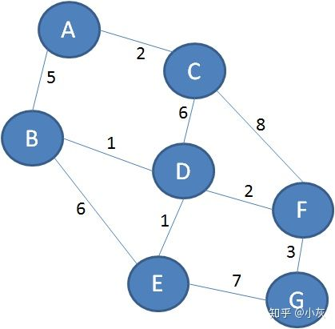
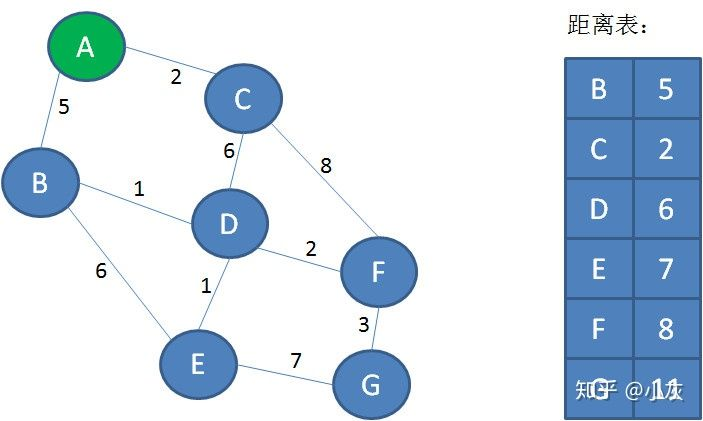
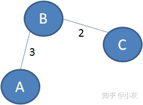
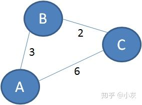
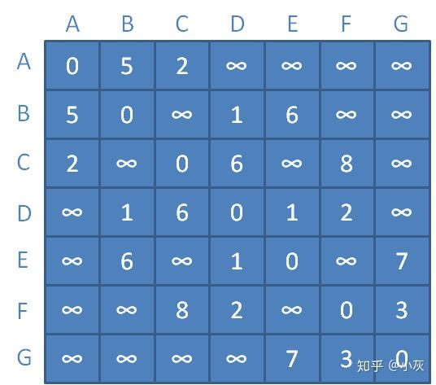
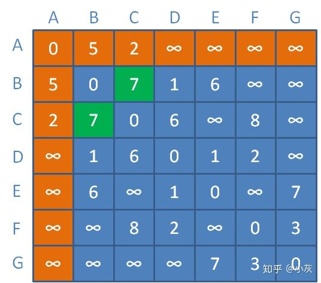
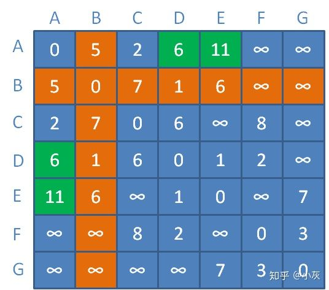
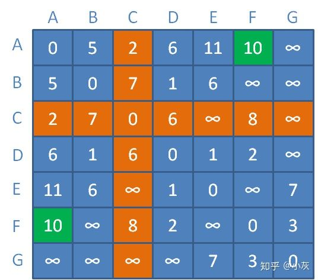
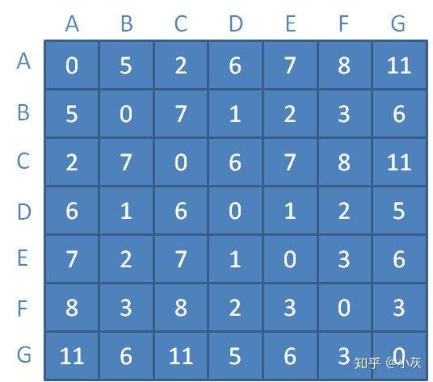

**————— 第二天 —————**





小灰的思路如下：


第一步，利用迪杰斯特拉算法的距离表，求出从顶点A出发，到其他各个顶点的最短距离：





第二步，继续使用迪杰斯特拉算法，求出从顶点B出发，到其他各个顶点的最短距离。

第三步，从顶点C出发，到各个顶点的最短距离。

第四步，从顶点D出发......

.......

就像这样，一直遍历到顶点G。


这个思路的时间复杂度是多少呢？

假如图中有n个顶点，如果不考虑堆优化，一次迪杰斯特拉算法的时间复杂度是O（n^2）。所以，把每一个顶点都计算一遍，总的时间复杂度是O（n^3）。


————————————


举一个栗子：





上图的顶点A和顶点C没有直接相连的边，它们之间的直接距离是无穷大。

如果以B作为“中继顶点”，此时A到C的最短路径就是A-B-C，最短距离是3+2=5。


再举一个栗子：





上图的顶点A和顶点C直接相连，距离是6。但是存在一条“迂回”路径A-B-C，距离是3+2=5<6。

所以，经过中继顶点B，从A到C的最短距离可以是5。


下面我们来看一看Floyd算法的详细步骤。


1.要实现Floyd算法，首先需要构建带权图的邻接矩阵：





在邻接矩阵当中，每一个数字代表着从某个顶点到另一个顶点的直接距离，这个距离是没有涉及到任何中继顶点的。


2.此时假定只允许以顶点A作为中继顶点，那么各顶点之间的距离会变成什么样子呢？

B和C之间的距离原本是无穷大，此时以A为中继，距离缩短为AB距离+AC距离=

5+2=7。

更新对应矩阵元素（橙色区域代表顶点A到其他顶点的临时距离）：





3.接下来以顶点A、B作为中继顶点，那么各顶点之间的距离会变成什么样子呢？

A和D之间的距离原本是无穷大，此时以B为中继，距离缩短为AB距离+BD距离=5+1=6。

A和E之间的距离原本是无穷大，此时以B为中继，距离缩短为AB距离+BE距离=5+6=11。

更新对应矩阵元素（橙色区域代表顶点B到其他顶点的临时距离）：





4.接下来以顶点A、B、C作为中继顶点，那么各顶点之间的距离会变成什么样子呢？

A和F之间的距离原本是无穷大，此时以C为中继，距离缩短为AC距离+CF距离=2+8=10。

更新对应矩阵元素（橙色区域代表顶点C到其他顶点的临时距离）：





.........

.........


以此类推，我们不断引入新的中继顶点，不断刷新矩阵中的临时距离。

最终，当所有顶点都可以作为中继顶点时，我们的距离矩阵更新如下：





此时，矩阵中每一个元素，都对应着某顶点到另一个顶点的最短距离。


为什么这么说呢？让我们回顾一下动态规划的两大要素：

**问题的初始状态**
**问题的状态转移方程式**


对于寻找图的所有顶点之间距离的问题，初始状态就是顶点之间的直接距离，也就是邻接矩阵。


而问题的状态转移方程式又是什么呢？

假设新引入的中继顶点是n，那么：


**顶点i 到 顶点j 的新距离 = Min（顶点i 到 顶点j 的旧距离，顶点i 到 顶点n 的距离+顶点n 到 顶点j 的距离）**


```java
finalstaticint INF =Integer.MAX_VALUE;
publicstaticvoid floyd(int[][] matrix){
//循环更新矩阵的值
for(int k=0; k<matrix.length; k++){
for(int i=0; i<matrix.length; i++){
for(int j=0; j<matrix.length; j++){
if(matrix[i][k]== INF || matrix[k][j]== INF){
continue;
}
matrix[i][j]=Math.min(matrix[i][j], matrix[i][k]+ matrix[k][j]);
}
}
}
// 打印floyd最短路径的结果
System.out.printf("最短路径矩阵: \n");
for(int i =0; i < matrix.length; i++){
for(int j =0; j < matrix.length; j++)
System.out.printf("%3d ", matrix[i][j]);
System.out.printf("\n");
}
}


publicstaticvoid main(String[] args){
int[][] matrix ={
{0,5,2, INF, INF, INF, INF},
{5,0, INF,1,6, INF, INF},
{2, INF,0,6, INF,8, INF},
{INF,1,6,0,1,2, INF},
{INF,6, INF,1,0, INF,7},
{INF, INF,8,2, INF,0,3},
{INF, INF, INF, INF,7,3,0}
};
floyd(matrix);
}
```


