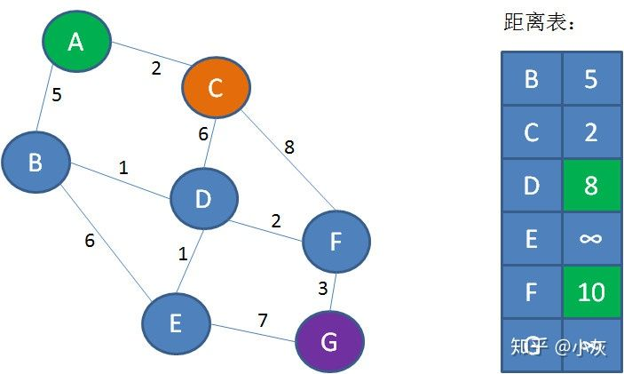
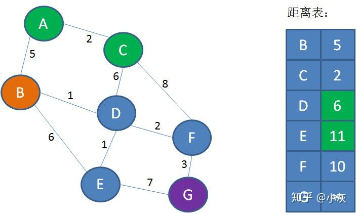

**————— 第二天 —————**


如何遍历呢？


第一层，遍历顶点A：


第二层，遍历A的邻接顶点B和C：


第三层，遍历顶点B的邻接顶点D、E，遍历顶点C的邻接顶点F：


第四层，遍历顶点E的邻接顶点G，也就是目标节点：


由此得出，图中顶点A到G的（第一条）最短路径是A-B-E-G：


换句话说，就是寻找从A到G之间，权值之和最小的路径。


————————————


究竟什么是迪杰斯特拉算法？它是如何寻找图中顶点的最短路径呢？


这个算法的本质，是不断刷新起点与其他各个顶点之间的 “距离表”。


让我们来演示一下迪杰斯特拉的详细过程：


第1步，创建距离表。表中的Key是顶点名称，Value是**从起点A到对应顶点的已知最短距离**。但是，一开始我们并不知道A到其他顶点的最短距离是多少，Value默认是无限大：


第2步，遍历起点A，找到起点A的邻接顶点B和C。从A到B的距离是5，从A到C的距离是2。把这一信息刷新到距离表当中：


第3步，从距离表中找到从A出发距离最短的点，也就是顶点C。


第4步，遍历顶点C，找到顶点C的邻接顶点D和F（A已经遍历过，不需要考虑）。从C到D的距离是6，所以A到D的距离是2+6=8；从C到F的距离是8，所以从A到F的距离是2+8=10。把这一信息刷新到表中：





接下来重复第3步、第4步所做的操作：


第5步，也就是第3步的重复，从距离表中找到从A出发距离最短的点（C已经遍历过，不需要考虑），也就是顶点B。


第6步，也就是第4步的重复，遍历顶点B，找到顶点B的邻接顶点D和E（A已经遍历过，不需要考虑）。从B到D的距离是1，所以A到D的距离是5+1=6，**小于距离表中的8**；从B到E的距离是6，所以从A到E的距离是5+6=11。把这一信息刷新到表中：





（在第6步，A到D的距离从8刷新到6，可以看出距离表所发挥的作用。距离表通过迭代刷新，用新路径长度取代旧路径长度，最终可以得到从起点到其他顶点的最短距离）


第7步，从距离表中找到从A出发距离最短的点（B和C不用考虑），也就是顶点D。


第8步，遍历顶点D，找到顶点D的邻接顶点E和F。从D到E的距离是1，所以A到E的距离是6+1=7，**小于距离表中的11**；从D到F的距离是2，所以从A到F的距离是6+2=8，**小于距离表中的10**。把这一信息刷新到表中：


第9步，从距离表中找到从A出发距离最短的点，也就是顶点E。


第10步，遍历顶点E，找到顶点E的邻接顶点G。从E到G的距离是7，所以A到G的距离是7+7=14。把这一信息刷新到表中：


第11步，从距离表中找到从A出发距离最短的点，也就是顶点F。


第10步，遍历顶点F，找到顶点F的邻接顶点G。从F到G的距离是3，所以A到G的距离是8+3=11，**小于距离表中的14**。把这一信息刷新到表中：


就这样，除终点以外的全部顶点都已经遍历完毕，距离表中存储的是从起点A到所有顶点的最短距离。显然，从A到G的最短距离是11。（路径：A-C-D-F-G）


按照上面的思路，我们来看一下代码实现：

```java
/**
* Dijkstra最短路径算法
*/
publicstaticMap<Integer,Integer> dijkstra(Graph graph,int startIndex){
//创建距离表，存储从起点到每一个顶点的临时距离
Map<Integer,Integer> distanceMap =newHashMap<Integer,Integer>();
//记录遍历过的顶点
Set<Integer> accessedSet =newHashSet<Integer>();
//图的顶点数量
int size = graph.vertexes.length;
//初始化最短路径表，到达每个顶点的路径代价默认为无穷大
for(int i=1; i<size; i++){
distanceMap.put(i,Integer.MAX_VALUE);
}
//遍历起点，刷新距离表
accessedSet.add(0);
List<Edge> edgesFromStart = graph.adj[startIndex];
for(Edge edge : edgesFromStart)
{
distanceMap.put(edge.index, edge.weight);
}
//主循环，重复 遍历最短距离顶点和刷新距离表 的操作
for(int i=1; i<size; i++)
{
//寻找最短距离顶点
int minDistanceFromStart =Integer.MAX_VALUE;
int minDistanceIndex =-1;
for(int j=1; j<size; j++)
{
if(!accessedSet.contains(j)&& distanceMap.get(j)< minDistanceFromStart)
{
minDistanceFromStart = distanceMap.get(j);
minDistanceIndex = j;
}
}
if(minDistanceIndex ==-1){
break;
}
//遍历顶点，刷新距离表
accessedSet.add(minDistanceIndex);
for(Edge edge : graph.adj[minDistanceIndex])
{
if(accessedSet.contains(edge.index)){
continue;
}
int weight = edge.weight;
int preDistance = distanceMap.get(edge.index);
if(weight !=Integer.MAX_VALUE &&(minDistanceFromStart+ weight < preDistance))
{
distanceMap.put(edge.index, minDistanceFromStart + weight);
}
}
}
return distanceMap;
}
publicstaticvoid main(String[] args){
Graph graph =newGraph(7);
initGraph(graph);
Map<Integer,Integer> distanceMap = dijkstra(graph,0);
int distance = distanceMap.get(6);
System.out.println(distance);
}
/**
* 图的顶点
*/
privatestaticclassVertex{
String data;
Vertex(String data){
this.data = data;
}
}
/**
* 图的边
*/
privatestaticclassEdge{
int index;
int weight;
Edge(int index,int weight){
this.index = index;
this.weight = weight;
}
}
/**
* 图
*/
privatestaticclassGraph{
privateVertex[] vertexes;
privateLinkedList<Edge> adj[];
Graph(int size){
//初始化顶点和邻接矩阵
vertexes =newVertex[size];
adj =newLinkedList[size];
for(int i=0; i<adj.length; i++){
adj[i]=newLinkedList<Edge>();
}
}
}
privatestaticvoid initGraph(Graph graph){
graph.vertexes[0]=newVertex("A");
graph.vertexes[1]=newVertex("B");
graph.vertexes[2]=newVertex("C");
graph.vertexes[3]=newVertex("D");
graph.vertexes[4]=newVertex("E");
graph.vertexes[5]=newVertex("F");
graph.vertexes[6]=newVertex("G");
graph.adj[0].add(newEdge(1,5));
graph.adj[0].add(newEdge(2,2));
graph.adj[1].add(newEdge(0,5));
graph.adj[1].add(newEdge(3,1));
graph.adj[1].add(newEdge(4,6));
graph.adj[2].add(newEdge(0,2));
graph.adj[2].add(newEdge(3,6));
graph.adj[2].add(newEdge(5,8));
graph.adj[3].add(newEdge(1,1));
graph.adj[3].add(newEdge(2,6));
graph.adj[3].add(newEdge(4,1));
graph.adj[3].add(newEdge(5,2));
graph.adj[4].add(newEdge(1,6));
graph.adj[4].add(newEdge(3,1));
graph.adj[4].add(newEdge(6,7));
graph.adj[5].add(newEdge(2,8));
graph.adj[5].add(newEdge(3,2));
graph.adj[5].add(newEdge(6,3));
graph.adj[6].add(newEdge(4,7));
graph.adj[6].add(newEdge(5,3));
}
```


