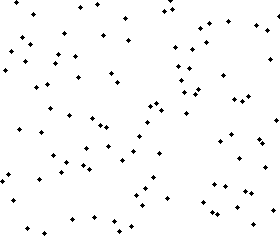
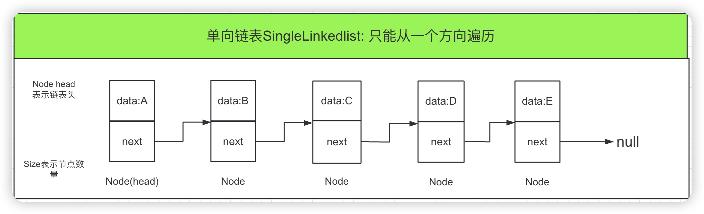
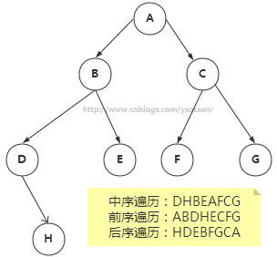
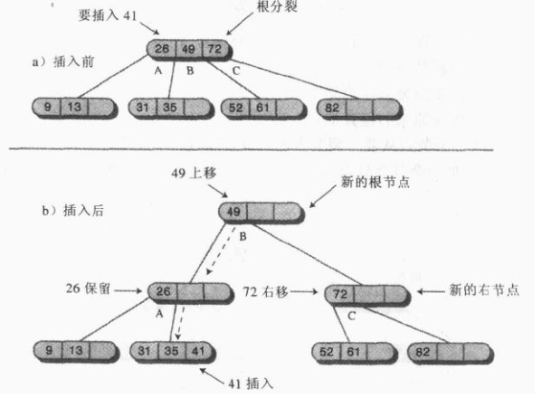

# 一 数据结构和算法介绍

### 1、数据结构

　　**数据结构是计算机存储、组织数据的方式，指相互之间存在一种或多种特定关系的数据元素的集合。**

　　通常情况下，精心选择的数据结构可以带来更高的运行或者存储效率。数据结构往往同高效的检索算法和索引技术有关。


#### 1.1、数据结构的基本功能

　　**①、如何插入一条新的数据项**

　　**②、如何寻找某一特定的数据项**

　　**③、如何删除某一特定的数据项**

　　**④、如何迭代的访问各个数据项，以便进行显示或其他操作**


#### 1.2、常用的数据结构

 　　

 

　　这几种结构优缺点如下：先有个大概印象，后面会详细讲解！！！

　　

 

### 2、算法

　　**算法简单来说就是解决问题的步骤。**

　　在Java中，算法通常都是由类的方法来实现的。前面的数据结构，比如链表为啥插入、删除快，而查找慢，平衡的二叉树插入、删除、查找都快，这都是实现这些数据结构的算法所造成的。后面我们讲的各种排序实现也是算法范畴的重要领域。


#### 2.1**、算法的五个特征**

　　**①、**`有穷性：对于任意一组合法输入值，在执行有穷步骤之后一定能结束，即：算法中的每个步骤都能在有限时间内完成。`

　　**②、**`确定性`：在每种情况下所应执行的操作，在算法中都有确切的规定，使算法的执行者或阅读者都能明确其含义及如何执行。并且在任何条件下，算法都只有一条执行路径。

　　**③、**`可行性：算法中的所有操作都必须足够基本，都可以通过已经实现的基本操作运算有限次实现之。`

　　**④、**`有输入`：作为算法加工对象的量值，通常体现在算法当中的一组变量。有些输入量需要在算法执行的过程中输入，而有的算法表面上可以没有输入，实际上已被嵌入算法之中。

　　**⑤、**`有输出`：它是一组与“输入”有确定关系的量值，是算法进行信息加工后得到的结果，这种确定关系即为算法功能。

　　


#### 2.2、算法的设计原则

　　**①、正确性**：首先，算法应当满足以特定的“规则说明”方式给出的需求。其次，对算法是否“正确”的理解可以有以下四个层次：

　　　　　　　　一、程序语法错误。

　　　　　　　　二、程序对于几组输入数据能够得出满足需要的结果。

　　　　　　　　三、程序对于精心选择的、典型、苛刻切带有刁难性的几组输入数据能够得出满足要求的结果。

　　　　　　　　四、程序对于一切合法的输入数据都能得到满足要求的结果。

　　　　　　　　PS：通常以第 三 层意义的正确性作为衡量一个算法是否合格的标准。

　　**②、可读性**：算法为了人的阅读与交流，其次才是计算机执行。因此算法应该易于人的理解；另一方面，晦涩难懂的程序易于隐藏较多的错误而难以调试。

　　**③、健壮性**：当输入的数据非法时，算法应当恰当的做出反应或进行相应处理，而不是产生莫名其妙的输出结果。并且，处理出错的方法不应是中断程序执行，而是应当返回一个表示错误或错误性质的值，以便在更高的抽象层次上进行处理。

　　**④、高效率与低存储量需求**：通常算法效率值得是算法执行时间；存储量是指算法执行过程中所需要的最大存储空间，两者都与问题的规模有关。

　　前面三点 正确性，可读性和健壮性相信都好理解。对于第四点算法的执行效率和存储量，我们知道比较算法的时候，可能会说“A算法比B算法快两倍”之类的话，但实际上这种说法没有任何意义。因为当数据项个数发生变化时，A算法和B算法的效率比例也会发生变化，比如数据项增加了50%，可能A算法比B算法快三倍，但是如果数据项减少了50%，可能A算法和B算法速度一样。所以描述算法的速度必须要和数据项的个数联系起来。也就是“大O”表示法，它是一种算法复杂度的相对表示方式，这里我简单介绍一下，后面会根据具体的算法来描述。

　　相对(relative)：你只能比较相同的事物。你不能把一个做算数乘法的算法和排序整数列表的算法进行比较。但是，比较2个算法所做的算术操作（一个做乘法，一个做加法）将会告诉你一些有意义的东西；

　　表示(representation)：大O(用它最简单的形式)把算法间的比较简化为了一个单一变量。这个变量的选择基于观察或假设。例如，排序算法之间的对比通常是基于比较操作(比较2个结点来决定这2个结点的相对顺序)。这里面就假设了比较操作的计算开销很大。但是，如果比较操作的计算开销不大，而交换操作的计算开销很大，又会怎么样呢？这就改变了先前的比较方式；

　　复杂度(complexity)：如果排序10,000个元素花费了我1秒，那么排序1百万个元素会花多少时间？在这个例子里，复杂度就是相对其他东西的度量结果。

　　然后我们在说说算法的存储量，包括：

　　程序本身所占空间；

　　输入数据所占空间；

　　辅助变量所占空间；

　　一个算法的效率越高越好，而存储量是越低越好。


# 二 数组


### 1、Java数组介绍

　　在Java中，数组是用来存放同一种数据类型的容器，注意只能存放同一种数据类型(Object类型数组除外)。

　　**①、数组的声明**

　　**第一种方式：**

```
`数据类型 []  数组名称 = ``new` `数据类型[数组长度];`
```

　　这里 [] 可以放在数组名称的前面，也可以放在数组名称的后面，我们推荐放在数组名称的前面，这样看上去 数据类型 [] 表示的很明显是一个数组类型，而放在数组名称后面，则不是那么直观。

　　**第二种方式：**

```
`数据类型 [] 数组名称 = {数组元素``1``，数组元素``2``，......}`
```

　　这种方式声明数组的同时直接给定了数组的元素，数组的大小由给定的数组元素个数决定。

```java
//声明数组1,声明一个长度为3，只能存放int类型的数据
int [] myArray = new int[3];
//声明数组2,声明一个数组元素为 1,2,3的int类型数组
int [] myArray2 = {1,2,3};
```

　　**②、访问数组元素以及给数组元素赋值**

　　数组是存在下标索引的，通过下标可以获取指定位置的元素，数组小标是从0开始的，也就是说下标0对应的就是数组中第1个元素，可以很方便的对数组中的元素进行存取操作。

　　前面数组的声明第二种方式，我们在声明数组的同时，也进行了初始化赋值。

```java
//声明数组,声明一个长度为3，只能存放int类型的数据
int [] myArray = new int[3];
//给myArray第一个元素赋值1
myArray[0] = 1;
//访问myArray的第一个元素
System.out.println(myArray[0]);
```

　　上面的myArray 数组，我们只能赋值三个元素，也就是下标从0到2，如果你访问 myArray[3] ，那么会报数组下标越界异常。

　　**③、数组遍历**

　　数组有个 length 属性，是记录数组的长度的，我们可以利用length属性来遍历数组。

```java
//声明数组2,声明一个数组元素为 1,2,3的int类型数组
int [] myArray2 = {1,2,3};
for(int i = 0 ; i < myArray2.length ; i++){
    System.out.println(myArray2[i]);

```

　　

### 2、用类封装数组实现数据结构

　　上一篇博客我们介绍了一个数据结构必须具有以下基本功能：

　　**①、如何插入一条新的数据项**

　　**②、如何寻找某一特定的数据项**

　　**③、如何删除某一特定的数据项**

　　**④、如何迭代的访问各个数据项，以便进行显示或其他操作**

　　而我们知道了数组的简单用法，现在用类的思想封装一个数组，实现上面的四个基本功能：

　　ps:假设操作人是不会添加重复元素的，这里没有考虑重复元素，如果添加重复元素了，后面的查找，删除，修改等操作只会对第一次出现的元素有效。


```java
 package com.chenjunbo.array;
 
public class MyArray {
    //定义一个数组
    private int [] intArray;
    //定义数组的实际有效长度
    private int elems;
    //定义数组的最大长度
    private int length;
     
    //默认构造一个长度为50的数组
    public MyArray(){
        elems = 0;
        length = 50;
        intArray = new int[length];
    }
    //构造函数，初始化一个长度为length 的数组
    public MyArray(int length){
        elems = 0;
        this.length = length;
        intArray = new int[length];
    }
     
    //获取数组的有效长度
    public int getSize(){
        return elems;
    }
     
    /**
     * 遍历显示元素
     */
    public void display(){
        for(int i = 0 ; i < elems ; i++){
            System.out.print(intArray[i]+" ");
        }
        System.out.println();
    }
     
    /**
     * 添加元素
     * @param value,假设操作人是不会添加重复元素的，如果有重复元素对于后面的操作都会有影响。
     * @return添加成功返回true,添加的元素超过范围了返回false
     */
    public boolean add(int value){
        if(elems == length){
            return false;
        }else{
            intArray[elems] = value;
            elems++;
        }
        return true;
    }
     
    /**
     * 根据下标获取元素
     * @param i
     * @return查找下标值在数组下标有效范围内，返回下标所表示的元素
     * 查找下标超出数组下标有效值，提示访问下标越界
     */
    public int get(int i){
        if(i<0 || i>elems){
            System.out.println("访问下标越界");
        }
        return intArray[i];
    }
    /**
     * 查找元素
     * @param searchValue
     * @return查找的元素如果存在则返回下标值，如果不存在，返回 -1
     */
    public int find(int searchValue){
        int i ;
        for(i = 0 ; i < elems ;i++){
            if(intArray[i] == searchValue){
                break;
            }
        }
        if(i == elems){
            return -1;
        }
        return i;
    }
    /**
     * 删除元素
     * @param value
     * @return如果要删除的值不存在，直接返回 false;否则返回true，删除成功
     */
    public boolean delete(int value){
        int k = find(value);
        if(k == -1){
            return false;
        }else{
            if(k == elems-1){
                elems--;
            }else{
                for(int i = k; i< elems-1 ; i++){
                    intArray[i] = intArray[i+1];
                   
                }
                 elems--;
            }
            return true;
        }
    }
    /**
     * 修改数据
     * @param oldValue原值
     * @param newValue新值
     * @return修改成功返回true，修改失败返回false
     */
    public boolean modify(int oldValue,int newValue){
        int i = find(oldValue);
        if(i == -1){
            System.out.println("需要修改的数据不存在");
            return false;
        }else{
            intArray[i] = newValue;
            return true;
        }
    }
 
}
```


　　测试：

```java
package com.chenjunbo.test;
 
import com.chenjunbo.array.MyArray;
 
public class MyArrayTest {
    public static void main(String[] args) {
        //创建自定义封装数组结构，数组大小为4
        MyArray array = new MyArray(4);
        //添加4个元素分别是1,2,3,4
        array.add(1);
        array.add(2);
        array.add(3);
        array.add(4);
        //显示数组元素
        array.display();
        //根据下标为0的元素
        int i = array.get(0);
        System.out.println(i);
        //删除4的元素
        array.delete(4);
        //将元素3修改为33
        array.modify(3, 33);
        array.display();
    }
 
}
```

　　打印结果为：

　　


### 3、分析数组的局限性

　　通过上面的代码，我们发现数组是能完成一个数据结构所有的功能的，而且实现起来也不难，那数据既然能完成所有的工作，我们实际应用中为啥不用它来进行所有的数据存储呢？那肯定是有原因呢。

　　数组的局限性分析：

　　①、`插入快`，对于无序数组，上面我们实现的数组就是无序的，即元素没有按照从大到小或者某个特定的顺序排列，只是按照插入的顺序排列。无序数组增加一个元素很简单，只需要在数组末尾添加元素即可，但是有序数组却不一定了，它需要在指定的位置插入。

　　②、`查找慢`，当然如果根据下标来查找是很快的。但是通常我们都是根据元素值来查找，给定一个元素值，对于无序数组，我们需要从数组第一个元素开始遍历，直到找到那个元素。有序数组通过特定的算法查找的速度会比无需数组快，后面我们会讲各种排序算法。

　　③、`删除慢`，根据元素值删除，我们要先找到该元素所处的位置，然后将元素后面的值整体向前面移动一个位置。也需要比较多的时间。

　　④、数组一旦创建后，`大小就固定了`，不能动态扩展数组的元素个数。如果初始化你给一个很大的数组大小，那会白白浪费内存空间，如果给小了，后面数据个数增加了又添加不进去了。

　　很显然，数组虽然插入快，但是查找和删除都比较慢，而且扩展性差，所以我们一般不会用数组来存储数据，那有没有什么数据结构插入、查找、删除都很快，而且还能动态扩展存储个数大小呢，答案是有的，但是这是建立在很复杂的算法基础上

 

# 三 数组排序

### 1、冒泡排序

　　这个名词的由来很好理解，一般河水中的冒泡，水底刚冒出来的时候是比较小的，随着慢慢向水面浮起会逐渐增大，这物理规律我不作过多解释，大家只需要了解即可。

　　冒泡算法的运作规律如下：

　　①、比较相邻的元素。如果第一个比第二个大，就交换他们两个。

　　②、对每一对相邻元素作同样的工作，从开始第一对到结尾的最后一对。这步做完后，最后的元素会是最大的数（也就是第一波冒泡完成）。

　　③、针对所有的元素重复以上的步骤，除了最后一个。

　　④、持续每次对越来越少的元素重复上面的步骤，直到没有任何一对数字需要比较。

　　

 

　　

　　**代码如下：**

```java
package com.chenjunbo.sort;
 
public class BubbleSort {
    public static int[] sort(int[] array){
        //这里for循环表示总共需要比较多少轮
        for(int i = 1 ; i < array.length; i++){
            //设定一个标记，若为true，则表示此次循环没有进行交换，也就是待排序列已经有序，排序已经完成。
            boolean flag = true;
            //这里for循环表示每轮比较参与的元素下标
            //对当前无序区间array[0......length-i]进行排序
            //j的范围很关键，这个范围是在逐步缩小的,因为每轮比较都会将最大的放在右边
            for(int j = 0 ; j < array.length-i ; j++){
                if(array[j]>array[j+1]){
                    int temp = array[j];
                    array[j] = array[j+1];
                    array[j+1] = temp;
                    flag = false;
                }
            }
            if(flag){
                break;
            }
            //第 i轮排序的结果为
            System.out.print("第"+i+"轮排序后的结果为:");
            display(array);
             
        }
        return array;
         
    }
     
    //遍历显示数组
    public static void display(int[] array){
        for(int i = 0 ; i < array.length ; i++){
            System.out.print(array[i]+" ");
        }
        System.out.println();
    }
     
    public static void main(String[] args) {
        int[] array = {4,2,8,9,5,7,6,1,3};
        //未排序数组顺序为
        System.out.println("未排序数组顺序为：");
        display(array);
        System.out.println("-----------------------");
        array = sort(array);
        System.out.println("-----------------------");
        System.out.println("经过冒泡排序后的数组顺序为：");
        display(array);
    }
 
}
```

**结果如下：**

　　

　本来应该是 8 轮排序的，这里我们只进行了 7 轮排序，因为第 7 轮排序之后已经是有序数组了。

　　**冒泡排序解释：**

　　冒泡排序是由两个for循环构成，第一个for循环的变量 i 表示总共需要多少轮比较，第二个for循环的变量 j 表示每轮参与比较的元素下标【0,1，......，length-i】，因为每轮比较都会出现一个最大值放在最右边，所以每轮比较后的元素个数都会少一个，这也是为什么 j 的范围是逐渐减小的。相信大家理解之后快速写出一个冒泡排序并不难。

　　**冒泡排序性能分析：**

　　假设参与比较的数组元素个数为 N，则第一轮排序有 N-1 次比较，第二轮有 N-2 次，如此类推，这种序列的求和公式为：

　　（N-1）+（N-2）+...+1 = N*（N-1）/2

　　当 N 的值很大时，算法比较次数约为 N2/2次比较，忽略减1。

　　假设数据是随机的，那么每次比较可能要交换位置，可能不会交换，假设概率为50%，那么交换次数为 N2/4。不过如果是最坏的情况，初始数据是逆序的，那么每次比较都要交换位置。

　　交换和比较次数都和N2 成正比。由于常数不算大 O 表示法中，忽略 2 和 4，那么冒泡排序运行都需要 O(N2) 时间级别。

　　其实无论何时，只要看见一个循环嵌套在另一个循环中，我们都可以怀疑这个算法的运行时间为 O(N2)级，外层循环执行 N 次，内层循环对每一次外层循环都执行N次（或者几分之N次）。这就意味着大约需要执行N2次某个基本操作。

　　


### 2、选择排序 

　　选择排序是每一次从待排序的数据元素中选出最小的一个元素，存放在序列的起始位置，直到全部待排序的数据元素排完。

　　分为三步：

　　①、从待排序序列中，找到关键字最小的元素

　　②、如果最小元素不是待排序序列的第一个元素，将其和第一个元素互换

　　③、从余下的 N - 1 个元素中，找出关键字最小的元素，重复(1)、(2)步，直到排序结束

 　　

　　

 

 　　代码如下：

```java
package com.chenjunbo.sort;
 
public class ChoiceSort {
    public static int[] sort(int[] array){
        //总共要经过N-1轮比较
        for(int i = 0 ; i < array.length-1 ; i++){
            int min = i;
            //每轮需要比较的次数
            for(int j = i+1 ; j < array.length ; j++){
                if(array[j]<array[min]){
                    min = j;//记录目前能找到的最小值元素的下标
                }
            }
            //将找到的最小值和i位置所在的值进行交换
            if(i != min){
                int temp = array[i];
                array[i] = array[min];
                array[min] = temp;
            }
            //第 i轮排序的结果为
            System.out.print("第"+(i+1)+"轮排序后的结果为:");
            display(array);
        }
        return array;
    }
 
    //遍历显示数组
    public static void display(int[] array){
        for(int i = 0 ; i < array.length ; i++){
            System.out.print(array[i]+" ");
        }
        System.out.println();
    }
     
    public static void main(String[] args){
        int[] array = {4,2,8,9,5,7,6,1,3};
        //未排序数组顺序为
        System.out.println("未排序数组顺序为：");
        display(array);
        System.out.println("-----------------------");
        array = sort(array);
        System.out.println("-----------------------");
        System.out.println("经过选择排序后的数组顺序为：");
        display(array);
    }
}
```

　**运行结果：**

　　****

 

　　**选择排序性能分析：**

　　选择排序和冒泡排序执行了相同次数的比较：N*（N-1）/2，但是至多只进行了N次交换。

　　当 N 值很大时，比较次数是主要的，所以和冒泡排序一样，用大O表示是O(N2) 时间级别。但是由于选择排序交换的次数少，所以选择排序无疑是比冒泡排序快的。当 N 值较小时，如果交换时间比选择时间大的多，那么选择排序是相当快的。


### 3、插入排序

　　直接插入排序基本思想是每一步将一个待排序的记录，插入到前面已经排好序的有序序列中去，直到插完所有元素为止。

　　插入排序还分为直接插入排序、二分插入排序、链表插入排序、希尔排序等等，这里我们只是以直接插入排序讲解，后面讲高级排序的时候会将其他的。

　　　　

 

　　

 

　　**代码如下：**

```java
package com.chenjunbo.sort;
 
public class InsertSort {
    public static int[] sort(int[] array){
        int j;
        //从下标为1的元素开始选择合适的位置插入，因为下标为0的只有一个元素，默认是有序的
        for(int i = 1 ; i < array.length ; i++){
            int tmp = array[i];//记录要插入的数据
            j = i;
            while(j > 0 && tmp < array[j-1]){//从已经排序的序列最右边的开始比较，找到比其小的数
                array[j] = array[j-1];//向后挪动
                j--;
            }
            array[j] = tmp;//存在比其小的数，插入
        }
        return array;
    }
     
    //遍历显示数组
    public static void display(int[] array){
        for(int i = 0 ; i < array.length ; i++){
            System.out.print(array[i]+" ");
        }
        System.out.println();
    }
     
    public static void main(String[] args){
        int[] array = {4,2,8,9,5,7,6,1,3};
        //未排序数组顺序为
        System.out.println("未排序数组顺序为：");
        display(array);
        System.out.println("-----------------------");
        array = sort(array);
        System.out.println("-----------------------");
        System.out.println("经过插入排序后的数组顺序为：");
        display(array);
    }
 
}
```

**运行结果：**

　　

　　**插入排序性能分析：**

　　在第一轮排序中，它最多比较一次，第二轮最多比较两次，一次类推，第N轮，最多比较N-1次。因此有 1+2+3+...+N-1 = N*（N-1）/2。

　　假设在每一轮排序发现插入点时，平均只有全体数据项的一半真的进行了比较，我们除以2得到：N*（N-1）/4。用大O表示法大致需要需要 O(N2) 时间级别。

　　复制的次数大致等于比较的次数，但是一次复制与一次交换的时间耗时不同，所以相对于随机数据，插入排序比冒泡快一倍，比选择排序略快。

　　这里需要注意的是，如果要进行逆序排列，那么每次比较和移动都会进行，这时候并不会比冒泡排序快。

 

> 冒泡、选择、插入用大 O 表示法都需要 O(N2) 时间级别。一般不会选择冒泡排序，虽然冒泡排序书写是最简单的，但是平均性能是没有选择排序和插入排序好的。
>
> 选择排序把交换次数降低到最低，但是比较次数还是挺大的。当数据量小，并且交换数据相对于比较数据更加耗时的情况下，可以应用选择排序。
>
> 在大多数情况下，假设数据量比较小或基本有序时，插入排序是三种算法中最好的选择。


# 四 栈

### 1、栈的基本概念

　　**栈**（英语：stack）又称为**堆**栈**或**堆叠，**栈**作为一种数据结构，是一种只能在一端进行插入和删除操作的特殊线性表。它按照先进后出的原则存储数据，先进入的数据被压入栈底，最后的数据在栈顶，需要读数据的时候从栈顶开始弹出数据（最后一个数据被第一个读出来）。栈具有记忆作用，对栈的插入与删除操作中，不需要改变栈底指针。

　　栈是允许在同一端进行插入和删除操作的特殊线性表。允许进行插入和删除操作的一端称为栈顶(top)，另一端为栈底(bottom)；栈底固定，而栈顶浮动；栈中元素个数为零时称为空栈。插入一般称为进栈（PUSH），删除则称为退栈（POP）。

　　由于堆叠数据结构只允许在一端进行操作，因而按照后进先出（LIFO, Last In First Out）的原理运作。栈也称为后进先出表。

　　这里以羽毛球筒为例，羽毛球筒就是一个栈，刚开始羽毛球筒是空的，也就是空栈 ，然后我们一个一个放入羽毛球，也就是一个一个push进栈，当我们需要使用羽毛球的时候，从筒里面拿，也就是pop出栈，但是第一个拿到的羽毛球是我们最后放进去的。

### 2、Java模拟简单的顺序栈实现

　　

```java
package com.chenjunbo.datastructure;
 
public class MyStack {
    private int[] array;
    private int maxSize;
    private int top;
     
    public MyStack(int size){
        this.maxSize = size;
        array = new int[size];
        top = -1;
    }
     
    //压入数据
    public void push(int value){
        if(top < maxSize-1){
            array[++top] = value;
        }
    }
     
    //弹出栈顶数据
    public int pop(){
        return array[top--];
    }
     
    //访问栈顶数据
    public int peek(){
        return array[top];
    }
     
    //判断栈是否为空
    public boolean isEmpty(){
        return (top == -1);
    }
     
    //判断栈是否满了
    public boolean isFull(){
        return (top == maxSize-1);
    }
     
 
}
```

　**测试：**

```java
package com.chenjunbo.test;
 
import com.chenjunbo.datastructure.MyStack;
 
public class MyStackTest {
    public static void main(String[] args) {
        MyStack stack = new MyStack(3);
        stack.push(1);
        stack.push(2);
        stack.push(3);
        System.out.println(stack.peek());
        while(!stack.isEmpty()){
            System.out.println(stack.pop());
        }
         
    }
 
}
```

　**结果：**

　　


　　这个栈是用数组实现的，内部定义了一个数组，一个表示最大容量的值以及一个指向栈顶元素的top变量。构造方法根据参数规定的容量创建一个新栈，push()方法是向栈中压入元素，指向栈顶的变量top加一，使它指向原顶端数据项上面的一个位置，并在这个位置上存储一个数据。pop()方法返回top变量指向的元素，然后将top变量减一，便移除了数据项。要知道 top 变量指向的始终是栈顶的元素。

　　**产生的问题：**

　　**①、上面栈的实现初始化容量之后，后面是不能进行扩容的（虽然栈不是用来存储大量数据的），如果说后期数据量超过初始容量之后怎么办？（自动扩容）**

　　**②、我们是用数组实现栈，在定义数组类型的时候，也就规定了存储在栈中的数据类型，那么同一个栈能不能存储不同类型的数据呢？（声明为Object）**

　　**③、栈需要初始化容量，而且数组实现的栈元素都是连续存储的，那么能不能不初始化容量呢？（改为由链表实现）**

### **3、增强功能版栈**

　　**对于上面出现的问题，第一个能自动扩容，第二个能存储各种不同类型的数据，解决办法如下：（第三个在讲链表的时候在介绍）**

　　**这个模拟的栈在JDK源码中，大家可以参考 Stack 类的实现。**

　　****


```java
package com.chenjunbo.datastructure;
 
import java.util.Arrays;
import java.util.EmptyStackException;
 
public class ArrayStack {
    //存储元素的数组,声明为Object类型能存储任意类型的数据
    private Object[] elementData;
    //指向栈顶的指针
    private int top;
    //栈的总容量
    private int size;
     
     
    //默认构造一个容量为10的栈
    public ArrayStack(){
        this.elementData = new Object[10];
        this.top = -1;
        this.size = 10;
    }
     
    public ArrayStack(int initialCapacity){
        if(initialCapacity < 0){
            throw new IllegalArgumentException("栈初始容量不能小于0: "+initialCapacity);
        }
        this.elementData = new Object[initialCapacity];
        this.top = -1;
        this.size = initialCapacity;
    }
     
     
    //压入元素
    public Object push(Object item){
        //是否需要扩容
        isGrow(top+1);
        elementData[++top] = item;
        return item;
    }
     
    //弹出栈顶元素
    public Object pop(){
        Object obj = peek();
        remove(top);
        return obj;
    }
     
    //获取栈顶元素
    public Object peek(){
        if(top == -1){
            throw new EmptyStackException();
        }
        return elementData[top];
    }
    //判断栈是否为空
    public boolean isEmpty(){
        return (top == -1);
    }
     
    //删除栈顶元素
    public void remove(int top){
        //栈顶元素置为null
        elementData[top] = null;
        this.top--;
    }
     
    /**
     * 是否需要扩容，如果需要，则扩大一倍并返回true，不需要则返回false
     * @param minCapacity
     * @return
     */
    public boolean isGrow(int minCapacity){
        int oldCapacity = size;
        //如果当前元素压入栈之后总容量大于前面定义的容量，则需要扩容
        if(minCapacity >= oldCapacity){
            //定义扩大之后栈的总容量
            int newCapacity = 0;
            //栈容量扩大两倍(左移一位)看是否超过int类型所表示的最大范围
            if((oldCapacity<<1) - Integer.MAX_VALUE >0){
                newCapacity = Integer.MAX_VALUE;
            }else{
                newCapacity = (oldCapacity<<1);//左移一位，相当于*2
            }
            this.size = newCapacity;
            int[] newArray = new int[size];
            elementData = Arrays.copyOf(elementData, size);
            return true;
        }else{
            return false;
        }
    }
     
     
 
}
```

测试：

```java
//测试自定义栈类 ArrayStack
//创建容量为3的栈，然后添加4个元素，3个int，1个String.
@Test
public void testArrayStack(){
    ArrayStack stack = new ArrayStack(3);
    stack.push(1);
    //System.out.println(stack.peek());
    stack.push(2);
    stack.push(3);
    stack.push("abc");
    System.out.println(stack.peek());
    stack.pop();
    stack.pop();
    stack.pop();
    System.out.println(stack.peek());
}
```

结果：

　　


### 4、利用栈实现字符串逆序

　　我们知道栈是后进先出，我们可以将一个字符串分隔为单个的字符，然后将字符一个一个push()进栈，在一个一个pop()出栈就是逆序显示了。如下：

　　将 字符串“how are you” 反转！！！

　　ps：这里我们是用上面自定的栈来实现的，大家可以将ArrayStack替换为JDK自带的栈类Stack试试

```java
//进行字符串反转
@Test
public void testStringReversal(){
    ArrayStack stack = new ArrayStack();
    String str = "how are you";
    char[] cha = str.toCharArray();
    for(char c : cha){
        stack.push(c);
    }
    while(!stack.isEmpty()){
        System.out.print(stack.pop());
    }
}
```

　　结果：

　　


### 5、利用栈判断分隔符是否匹配　　 

　　写过xml标签或者html标签的，我们都知道<必须和最近的>进行匹配，[ 也必须和最近的 ] 进行匹配。

　　比如：<abc[123]abc>这是符号相匹配的，如果是 <abc[123>abc] 那就是不匹配的。

　　对于 12<a[b{c}]>，我们分析在栈中的数据：遇到匹配正确的就消除

　　

　　最后栈中的内容为空则匹配成功，否则匹配失败！！！

```java
//分隔符匹配
//遇到左边分隔符了就push进栈，遇到右边分隔符了就pop出栈，看出栈的分隔符是否和这个有分隔符匹配
@Test
public void testMatch(){
    ArrayStack stack = new ArrayStack(3);
    String str = "12<a[b{c}]>";
    char[] cha = str.toCharArray();
    for(char c : cha){
        switch (c) {
        case '{':
        case '[':
        case '<':
            stack.push(c);
            break;
        case '}':
        case ']':
        case '>':
            if(!stack.isEmpty()){
                char ch = stack.pop().toString().toCharArray()[0];
                if(c=='}' && ch != '{'
                    || c==']' && ch != '['
                    || c==')' && ch != '('){
                    System.out.println("Error:"+ch+"-"+c);
                }
            }
            break;
        default:
            break;
        }
    }
}

```

　　

# 六 队列

### 1、队列的基本概念

　　队列（queue）是一种特殊的线性表，特殊之处在于它只允许在表的前端（front）进行删除操作，而在表的后端（rear）进行插入操作，和栈一样，队列是一种操作受限制的线性表。进行插入操作的端称为队尾，进行删除操作的端称为队头。队列中没有元素时，称为空队列。

　　队列的数据元素又称为队列元素。在队列中插入一个队列元素称为入队，从队列中删除一个队列元素称为出队。因为队列只允许在一端插入，在另一端删除，所以只有最早进入队列的元素才能最先从队列中删除，故队列又称为先进先出（FIFO—first in first out）线性表。

　　比如我们去电影院排队买票，第一个进入排队序列的都是第一个买到票离开队列的人，而最后进入排队序列排队的都是最后买到票的。

　　在比如在计算机操作系统中，有各种队列在安静的工作着，比如打印机在打印列队中等待打印。

　　队列分为：

　　①、单向队列（Queue）：只能在一端插入数据，另一端删除数据。

　　②、双向队列（Deque）：每一端都可以进行插入数据和删除数据操作。

　　这里我们还会介绍一种队列——优先级队列，优先级队列是比栈和队列更专用的数据结构，在优先级队列中，数据项按照关键字进行排序，关键字最小（或者最大）的数据项往往在队列的最前面，而数据项在插入的时候都会插入到合适的位置以确保队列的有序。

 


### 2、Java模拟单向队列实现

　　在实现之前，我们先看下面几个问题：

　　①、与栈不同的是，队列中的数据不总是从数组的0下标开始的，移除一些队头front的数据后，队头指针会指向一个较高的下标位置，如下图：

　　

　　②、我们再设计时，队列中新增一个数据时，队尾的指针rear 会向上移动，也就是向下标大的方向。移除数据项时，队头指针 front 向上移动。那么这样设计好像和现实情况相反，比如排队买电影票，队头的买完票就离开了，然后队伍整体向前移动。在计算机中也可以在队列中删除一个数之后，队列整体向前移动，但是这样做效率很差。我们选择的做法是移动队头和队尾的指针。

　　③、如果向第②步这样移动指针，相信队尾指针很快就移动到数据的最末端了，这时候可能移除过数据，那么队头会有空着的位置，然后新来了一个数据项，由于队尾不能再向上移动了，那该怎么办呢？如下图：

　　

　　为了避免队列不满却不能插入新的数据，我们可以让队尾指针绕回到数组开始的位置，这也称为“循环队列”。

　　

　　弄懂原理之后，Java实现代码如下：

```java
package com.chenjunbo.datastructure;
 
public class MyQueue {
    private Object[] queArray;
    //队列总大小
    private int maxSize;
    //前端
    private int front;
    //后端
    private int rear;
    //队列中元素的实际数目
    private int nItems;
     
    public MyQueue(int s){
        maxSize = s;
        queArray = new Object[maxSize];
        front = 0;
        rear = -1;
        nItems = 0;
    }
     
    //队列中新增数据
    public void insert(int value){
        if(isFull()){
            System.out.println("队列已满！！！");
        }else{
            //如果队列尾部指向顶了，那么循环回来，执行队列的第一个元素
            if(rear == maxSize -1){
                rear = -1;
            }
            //队尾指针加1，然后在队尾指针处插入新的数据
            queArray[++rear] = value;
            nItems++;
        }
    }
     
    //移除数据
    public Object remove(){
        Object removeValue = null ;
        if(!isEmpty()){
            removeValue = queArray[front];
            queArray[front] = null;
            front++;
            if(front == maxSize){
                front = 0;
            }
            nItems--;
            return removeValue;
        }
        return removeValue;
    }
     
    //查看对头数据
    public Object peekFront(){
        return queArray[front];
    }
     
     
    //判断队列是否满了
    public boolean isFull(){
        return (nItems == maxSize);
    }
     
    //判断队列是否为空
    public boolean isEmpty(){
        return (nItems ==0);
    }
     
    //返回队列的大小
    public int getSize(){
        return nItems;
    }
     
}
```


　　测试：

```java
package com.chenjunbo.test;
 
import com.chenjunbo.datastructure.MyQueue;
 
public class MyQueueTest {
    public static void main(String[] args) {
        MyQueue queue = new MyQueue(3);
        queue.insert(1);
        queue.insert(2);
        queue.insert(3);//queArray数组数据为[1,2,3]
         
        System.out.println(queue.peekFront()); //1
        queue.remove();//queArray数组数据为[null,2,3]
        System.out.println(queue.peekFront()); //2
         
        queue.insert(4);//queArray数组数据为[4,2,3]
        queue.insert(5);//队列已满,queArray数组数据为[4,2,3]
    }
 
}
```


　　


### 3、双端队列

　　双端队列就是一个两端都是结尾或者开头的队列， 队列的每一端都可以进行插入数据项和移除数据项，这些方法可以叫做：

　　`insertRight()`、`insertLeft()`、`removeLeft()`、`removeRight()`

　　如果严格禁止调用insertLeft()和removeLeft()（或禁用右端操作），那么双端队列的功能就和前面讲的栈功能一样。

　　如果严格禁止调用insertLeft()和removeRight(或相反的另一对方法)，那么双端队列的功能就和单向队列一样了。

 


### 4、优先级队列

 　　优先级队列（priority queue）是比栈和队列更专用的数据结构，在优先级队列中，数据项按照关键字进行排序，关键字最小（或者最大）的数据项往往在队列的最前面，而数据项在插入的时候都会插入到合适的位置以确保队列的有序。

　　优先级队列 是0个或多个元素的集合，每个元素都有一个优先权，对优先级队列执行的操作有：

　　（1）查找

　　（2）插入一个新元素

　　（3）删除

　　一般情况下，查找操作用来搜索优先权最大的元素，删除操作用来删除该元素 。对于优先权相同的元素，可按先进先出次序处理或按任意优先权进行。

　　这里我们用数组实现优先级队列，这种方法插入比较慢，但是它比较简单，适用于数据量比较小并且不是特别注重插入速度的情况。

　　后面我们会讲解堆，用堆的数据结构来实现优先级队列，可以相当快的插入数据。

　　**数组实现优先级队列，声明为int类型的数组，关键字是数组里面的元素，在插入的时候按照从大到小的顺序排列，也就是越小的元素优先级越高。**

```java
package com.chenjunbo.datastructure;
 
public class PriorityQue {
    private int maxSize;
    private int[] priQueArray;
    private int nItems;
     
    public PriorityQue(int s){
        maxSize = s;
        priQueArray = new int[maxSize];
        nItems = 0;
    }
     
    //插入数据
    public void insert(int value){
        int j;
        if(nItems == 0){
            priQueArray[nItems++] = value;
        }else{
            j = nItems -1;
            //选择的排序方法是插入排序，按照从大到小的顺序排列，越小的越在队列的顶端
            while(j >=0 && value > priQueArray[j]){
                priQueArray[j+1] = priQueArray[j];
                j--;
            }
            priQueArray[j+1] = value;
            nItems++;
        }
    }
     
    //移除数据,由于是按照大小排序的，所以移除数据我们指针向下移动
    //被移除的地方由于是int类型的，不能设置为null，这里的做法是设置为 -1
    public int remove(){
        int k = nItems -1;
        int value = priQueArray[k];
        priQueArray[k] = -1;//-1表示这个位置的数据被移除了
        nItems--;
        return value;
    }
     
    //查看优先级最高的元素
    public int peekMin(){
        return priQueArray[nItems-1];
    }
     
    //判断是否为空
    public boolean isEmpty(){
        return (nItems == 0);
    }
     
    //判断是否满了
    public boolean isFull(){
        return (nItems == maxSize);
    }
 
}
```


　　insert() 方法，先检查队列中是否有数据项，如果没有，则直接插入到下标为0的单元里，否则，从数组顶部开始比较，找到比插入值小的位置进行插入，并把 nItems 加1.

　　remove 方法直接获取顶部元素。

　　优先级队列的插入操作需要 O(N)的时间，而删除操作则需要O(1) 的时间，后面会讲解如何通过 堆 来改进插入时间。


### 5、总结

​	队列的三种形式，分别是单向队列、双向队列以及优先级队列。其实大家听名字也可以听得出来他们之间的区别，单向队列遵循先进先出的原则，而且一端只能插入，另一端只能删除。双向队列则两端都可插入和删除，如果限制双向队列的某一段的方法，则可以达到和单向队列同样的功能。最后优先级队列，则是在插入元素的时候进行了优先级别排序，在实际应用中单项队列和优先级队列使用的比较多。后面讲解了堆这种数据结构，我们会用堆来实现优先级队列，改善优先级队列插入元素的时间。

　　稍微总结一下：

　　①、栈、队列（单向队列）、优先级队列通常是用来简化某些程序操作的数据结构，而不是主要作为存储数据的。

　　②、在这些数据结构中，只有一个数据项可以被访问。

　　③、栈允许在栈顶压入（插入）数据，在栈顶弹出（移除）数据，但是只能访问最后一个插入的数据项，也就是栈顶元素。

　　④、队列（单向队列）只能在队尾插入数据，对头删除数据，并且只能访问对头的数据。而且队列还可以实现循环队列，它基于数组，数组下标可以从数组末端绕回到数组的开始位置。

　　⑤、优先级队列是有序的插入数据，并且只能访问当前元素中优先级别最大（或最小）的元素。

　　⑥、这些数据结构都能由数组实现，但是可以用别的机制（后面讲的链表、堆等数据结构）实现。


# 七 链表

我们知道数组是一种通用的数据结构，能用来实现栈、队列等很多数据结构。而链表也是一种使用广泛的通用数据结构，它也可以用来作为实现栈、队列等数据结构的基础，基本上除非需要频繁的通过下标来随机访问各个数据，否则很多使用数组的地方都可以用链表来代替。

　　但是我们需要说明的是，链表是不能解决数据存储的所有问题的，它也有它的优点和缺点。本篇博客我们介绍几种常见的链表，分别是单向链表、双端链表、有序链表、双向链表以及有迭代器的链表。并且会讲解一下抽象数据类型（ADT）的思想，如何用 ADT 描述栈和队列，如何用链表代替数组来实现栈和队列。

### 1、链表（Linked List）

> 链表通常由一连串节点组成，每个节点包含任意的实例数据（data fields）和一或两个用来指向上一个/或下一个节点的位置的链接（"links"）

　　**链表**（Linked list）是一种常见的基础数据结构，是一种线性表，但是并不会按线性的顺序存储数据，而是在每一个节点里存到下一个节点的指针(Pointer)。

　　使用链表结构可以克服数组需要预先知道数据大小的缺点，链表结构可以充分利用计算机内存空间，实现灵活的内存动态管理。但是链表失去了数组随机读取的优点，同时链表由于增加了结点的指针域，空间开销比较大。

 

### 2、单向链表（Single-Linked List）

　　单链表是链表中结构最简单的。一个单链表的节点(Node)分为两个部分，第一个部分(data)保存或者显示关于节点的信息，另一个部分存储下一个节点的地址。最后一个节点存储地址的部分指向空值。

　　单向链表只可向一个方向遍历，一般查找一个节点的时候需要从第一个节点开始每次访问下一个节点，一直访问到需要的位置。而插入一个节点，对于单向链表，我们只提供在链表头插入，只需要将当前插入的节点设置为头节点，next指向原头节点即可。删除一个节点，我们将该节点的上一个节点的next指向该节点的下一个节点。

　　

　　在表头增加节点：

　　

　　删除节点：

　　


#### ①、单向链表的具体实现

```java
package com.chenjunbo.datastructure;

public class SingleLinkedList {
    private int size;//链表节点的个数
    private Node head;//头节点
    
    public SingleLinkedList(){
        size = 0;
        head = null;
    }
    
    //链表的每个节点类
    private class Node{
        private Object data;//每个节点的数据
        private Node next;//每个节点指向下一个节点的连接
        
        public Node(Object data){
            this.data = data;
        }
    }
    
    //在链表头添加元素
    public Object addHead(Object obj){
        Node newHead = new Node(obj);
        if(size == 0){
            head = newHead;
        }else{
            newHead.next = head;
            head = newHead;
        }
        size++;
        return obj;
    }
    
    //在链表头删除元素
    public Object deleteHead(){
        Object obj = head.data;
        head = head.next;
        size--;
        return obj;
    }
    
    //查找指定元素，找到了返回节点Node，找不到返回null
    public Node find(Object obj){
        Node current = head;
        int tempSize = size;
        while(tempSize > 0){
            if(obj.equals(current.data)){
                return current;
            }else{
                current = current.next;
            }
            tempSize--;
        }
        return null;
    }
    
    //删除指定的元素，删除成功返回true
    public boolean delete(Object value){
        if(size == 0){
            return false;
        }
        Node current = head;
        Node previous = head;
        while(current.data != value){
            if(current.next == null){
                return false;
            }else{
                previous = current;
                current = current.next;
            }
        }
        //如果删除的节点是第一个节点
        if(current == head){
            head = current.next;
            size--;
        }else{//删除的节点不是第一个节点
            previous.next = current.next;
            size--;
        }
        return true;
    }
    
    //判断链表是否为空
    public boolean isEmpty(){
        return (size == 0);
    }
    
    //显示节点信息
    public void display(){
        if(size >0){
            Node node = head;
            int tempSize = size;
            if(tempSize == 1){//当前链表只有一个节点
                System.out.println("["+node.data+"]");
                return;
            }
            while(tempSize>0){
                if(node.equals(head)){
                    System.out.print("["+node.data+"->");
                }else if(node.next == null){
                    System.out.print(node.data+"]");
                }else{
                    System.out.print(node.data+"->");
                }
                node = node.next;
                tempSize--;
            }
            System.out.println();
        }else{//如果链表一个节点都没有，直接打印[]
            System.out.println("[]");
        }
        
    }

}
```


 　　测试：

```java
@Test
public void testSingleLinkedList(){
    SingleLinkedList singleList = new SingleLinkedList();
    singleList.addHead("A");
    singleList.addHead("B");
    singleList.addHead("C");
    singleList.addHead("D");
    //打印当前链表信息
    singleList.display();
    //删除C
    singleList.delete("C");
    singleList.display();
    //查找B
    System.out.println(singleList.find("B"));
}
```


　　打印结果：

　　


#### ②、用单向链表实现栈

　　栈的pop()方法和push()方法，对应于链表的在头部删除元素deleteHead()以及在头部增加元素addHead()。

```java
package com.chenjunbo.datastructure;

public class StackSingleLink {
    private SingleLinkedList link;
    
    public StackSingleLink(){
        link = new SingleLinkedList();
    }
    
    //添加元素
    public void push(Object obj){
        link.addHead(obj);
    }
    
    //移除栈顶元素
    public Object pop(){
        Object obj = link.deleteHead();
        return obj;
    }
    
    //判断是否为空
    public boolean isEmpty(){
        return link.isEmpty();
    }
    
    //打印栈内元素信息
    public void display(){
        link.display();
    }

}
```


### 3、双端链表

　　对于单项链表，我们如果想在尾部添加一个节点，那么必须从头部一直遍历到尾部，找到尾节点，然后在尾节点后面插入一个节点。这样操作很麻烦，如果我们在设计链表的时候多个对尾节点的引用，那么会简单很多。

　　

　　**注意和后面将的双向链表的区别！！！**


#### ①、双端链表的具体实现

```java
package com.chenjunbo.link;

public class DoublePointLinkedList {
    private Node head;//头节点
    private Node tail;//尾节点
    private int size;//节点的个数
    
    private class Node{
        private Object data;
        private Node next;
        
        public Node(Object data){
            this.data = data;
        }
    }
    
    public DoublePointLinkedList(){
        size = 0;
        head = null;
        tail = null;
    }
    
    //链表头新增节点
    public void addHead(Object data){
        Node node = new Node(data);
        if(size == 0){//如果链表为空，那么头节点和尾节点都是该新增节点
            head = node;
            tail = node;
            size++;
        }else{
            node.next = head;
            head = node;
            size++;
        }
    }
    
    //链表尾新增节点
    public void addTail(Object data){
        Node node = new Node(data);
        if(size == 0){//如果链表为空，那么头节点和尾节点都是该新增节点
            head = node;
            tail = node;
            size++;
        }else{
            tail.next = node;
            tail = node;
            size++;
        }
    }
    
    //删除头部节点，成功返回true，失败返回false
    public boolean deleteHead(){
        if(size == 0){//当前链表节点数为0
            return false;
        }
        if(head.next == null){//当前链表节点数为1
            head = null;
            tail = null;
        }else{
            head = head.next;
        }
        size--;
        return true;
    }
    //判断是否为空
    public boolean isEmpty(){
        return (size ==0);
    }
    //获得链表的节点个数
    public int getSize(){
        return size;
    }
    
    //显示节点信息
    public void display(){
        if(size >0){
            Node node = head;
            int tempSize = size;
            if(tempSize == 1){//当前链表只有一个节点
                System.out.println("["+node.data+"]");
                return;
            }
            while(tempSize>0){
                if(node.equals(head)){
                    System.out.print("["+node.data+"->");
                }else if(node.next == null){
                    System.out.print(node.data+"]");
                }else{
                    System.out.print(node.data+"->");
                }
                node = node.next;
                tempSize--;
            }
            System.out.println();
        }else{//如果链表一个节点都没有，直接打印[]
            System.out.println("[]");
        }
    }

}
```


#### ②、用双端链表实现队列

```java
package com.chenjunbo.link;

public class QueueLinkedList {
    
    private DoublePointLinkedList dp;
    
    public QueueLinkedList(){
        dp = new DoublePointLinkedList();
    }
    public void insert(Object data){
        dp.addTail(data);
    }
    
    public void delete(){
        dp.deleteHead();
    }
    
    public boolean isEmpty(){
        return dp.isEmpty();
    }
    
    public int getSize(){
        return dp.getSize();
    }
    
    public void display(){
        dp.display();
    }
    
}
```


### 4、抽象数据类型（ADT）

　　在介绍抽象数据类型的时候，我们先看看什么是数据类型，听到这个词，在Java中我们可能首先会想到像 int,double这样的词，这是Java中的基本数据类型，一个数据类型会涉及到两件事：

　　①、拥有特定特征的数据项

　　②、在数据上允许的操作

　　比如Java中的int数据类型，它表示整数，取值范围为：-2147483648~2147483647，还能使用各种操作符，+、-、*、/ 等对其操作。数据类型允许的操作是它本身不可分离的部分，理解类型包括理解什么样的操作可以应用在该类型上。

　　那么当年设计计算机语言的人，为什么会考虑到数据类型？

　　我们先看这样一个例子，比如，大家都需要住房子，也都希望房子越大越好。但显然，没有钱，考虑房子没有意义。于是就出现了各种各样的商品房，有别墅的、复式的、错层的、单间的……甚至只有两平米的胶囊房间。这样做的意义是满足不同人的需要。

　　同样，在计算机中，也存在相同的问题。计算1+1这样的表达式不需要开辟很大的存储空间，不需要适合小数甚至字符运算的内存空间。于是计算机的研究者们就考虑，要对数据进行分类，分出来多种数据类型。比如int，比如float。

　　虽然不同的计算机有不同的硬件系统，但实际上高级语言编写者才不管程序运行在什么计算机上，他们的目的就是为了实现整形数字的运算，比如a+b等。他们才不关心整数在计算机内部是如何表示的，也不管CPU是如何计算的。于是我们就考虑，无论什么计算机、什么语言都会面临类似的整数运算，我们可以考虑将其抽象出来。抽象是抽取出事物具有的普遍性本质，是对事物的一个概括，是一种思考问题的方式。

　　**抽象数据类型（ADT）是指一个数学模型及定义在该模型上的一组操作。**它仅取决于其逻辑特征，而与计算机内部如何表示和实现无关。比如刚才说得整型，各个计算机，不管大型机、小型机、PC、平板电脑甚至智能手机，都有“整型”类型，也需要整形运算，那么整型其实就是一个抽象数据类型。 　

　　更广泛一点的，比如我们刚讲解的栈和队列这两种数据结构，我们分别使用了数组和链表来实现，比如栈，对于使用者只需要知道pop()和push()方法或其它方法的存在以及如何使用即可，使用者不需要知道我们是使用的数组或是链表来实现的。

　　ADT的思想可以作为我们设计工具的理念，比如我们需要存储数据，那么就从考虑需要在数据上实现的操作开始，需要存取最后一个数据项吗？还是第一个？还是特定值的项？还是特定位置的项？回答这些问题会引出ADT的定义，只有完整的定义了ADT后，才应该考虑实现的细节。

　　这在我们Java语言中的接口设计理念是想通的。

 


### 5、有序链表

　　前面的链表实现插入数据都是无序的，在有些应用中需要链表中的数据有序，这称为有序链表。

　　在有序链表中，数据是按照关键值有序排列的。一般在大多数需要使用有序数组的场合也可以使用有序链表。有序链表优于有序数组的地方是插入的速度（因为元素不需要移动），另外链表可以扩展到全部有效的使用内存，而数组只能局限于一个固定的大小中。

```java
package com.chenjunbo.datastructure;

public class OrderLinkedList {
    private Node head;
    
    private class Node{
        private int data;
        private Node next;
        
        public Node(int data){
            this.data = data;
        }
    }

    public OrderLinkedList(){
        head = null;
    }
    
    //插入节点，并按照从小打到的顺序排列
    public void insert(int value){
        Node node = new Node(value);
        Node pre = null;
        Node current = head;
        while(current != null && value > current.data){
            pre = current;
            current = current.next;
        }
        if(pre == null){
            head = node;
            head.next = current;
        }else{
            pre.next = node;
            node.next = current;
        }
    }
    
    //删除头节点
    public void deleteHead(){
        head = head.next;
    }
    
    public void display(){
        Node current = head;
        while(current != null){
            System.out.print(current.data+" ");
            current = current.next;
        }
        System.out.println("");
    }
    
}
```


　　在有序链表中插入和删除某一项最多需要O(N)次比较，平均需要O(N/2)次，因为必须沿着链表上一步一步走才能找到正确的插入位置，然而可以最快速度删除最值，因为只需要删除表头即可，如果一个应用需要频繁的存取最小值，且不需要快速的插入，那么有序链表是一个比较好的选择方案。比如优先级队列可以使用有序链表来实现。

 

### 6、有序链表和无序数组组合排序

　　比如有一个无序数组需要排序，前面我们在讲解冒泡排序、选择排序、插入排序这三种简单的排序时，需要的时间级别都是O(N2)。

　　现在我们讲解了有序链表之后，对于一个无序数组，我们先将数组元素取出，一个一个的插入到有序链表中，然后将他们从有序链表中一个一个删除，重新放入数组，那么数组就会排好序了。和插入排序一样，如果插入了N个新数据，那么进行大概N2/4次比较。但是相对于插入排序，每个元素只进行了两次排序，一次从数组到链表，一次从链表到数组，大概需要2*N次移动，而插入排序则需要N2次移动，

　　效率肯定是比前面讲的简单排序要高，但是缺点就是需要开辟差不多两倍的空间，而且数组和链表必须在内存中同时存在，如果有现成的链表可以用，那么这种方法还是挺好的。

 

### 7、双向链表

　　我们知道单向链表只能从一个方向遍历，那么双向链表它可以从两个方向遍历。

　　

　　具体代码实现：

```java
package com.chenjunbo.datastructure;

public class TwoWayLinkedList {
    private Node head;//表示链表头
    private Node tail;//表示链表尾
    private int size;//表示链表的节点个数
    
    private class Node{
        private Object data;
        private Node next;
        private Node prev;
        
        public Node(Object data){
            this.data = data;
        }
    }
    
    public TwoWayLinkedList(){
        size = 0;
        head = null;
        tail = null;
    }
    
    //在链表头增加节点
    public void addHead(Object value){
        Node newNode = new Node(value);
        if(size == 0){
            head = newNode;
            tail = newNode;
            size++;
        }else{
            head.prev = newNode;
            newNode.next = head;
            head = newNode;
            size++;
        }
    }
    
    //在链表尾增加节点
    public void addTail(Object value){
        Node newNode = new Node(value);
        if(size == 0){
            head = newNode;
            tail = newNode;
            size++;
        }else{
            newNode.prev = tail;
            tail.next = newNode;
            tail = newNode;
            size++;
        }
    }
    
    //删除链表头
    public Node deleteHead(){
        Node temp = head;
        if(size != 0){
            head = head.next;
            head.prev = null;
            size--;
        }
        return temp;
    }
    
    //删除链表尾
    public Node deleteTail(){
        Node temp = tail;
        if(size != 0){
            tail = tail.prev;
            tail.next = null;
            size--;
        }
        return temp;
    }
    
    //获得链表的节点个数
    public int getSize(){
        return size;
    }
    //判断链表是否为空
    public boolean isEmpty(){
        return (size == 0);
    }
    
    //显示节点信息
    public void display(){
        if(size >0){
            Node node = head;
            int tempSize = size;
            if(tempSize == 1){//当前链表只有一个节点
                System.out.println("["+node.data+"]");
                return;
            }
            while(tempSize>0){
                if(node.equals(head)){
                    System.out.print("["+node.data+"->");
                }else if(node.next == null){
                    System.out.print(node.data+"]");
                }else{
                    System.out.print(node.data+"->");
                }
                node = node.next;
                tempSize--;
            }
            System.out.println();
        }else{//如果链表一个节点都没有，直接打印[]
            System.out.println("[]");
        }
        
    }
}
```


　　我们也可以用双向链表来实现双端队列，这里就不做具体代码演示了。

### 8、总结

　　上面我们讲了各种链表，每个链表都包括一个LinikedList对象和许多Node对象，LinkedList对象通常包含头和尾节点的引用，分别指向链表的第一个节点和最后一个节点。而每个节点对象通常包含数据部分data，以及对上一个节点的引用prev和下一个节点的引用next，只有下一个节点的引用称为单向链表，两个都有的称为双向链表。next值为null则说明是链表的结尾，如果想找到某个节点，我们必须从第一个节点开始遍历，不断通过next找到下一个节点，直到找到所需要的。栈和队列都是ADT，可以用数组来实现，也可以用链表实现。


# 八 递归

​	一个故事：从前有座山，山上有座庙，庙里有一个老和尚和一个小和尚，一天，老和尚给小和尚讲了一个故事，故事内容是“从前有座山，山上有座庙，庙里有一个老和尚和一个小和尚，一天，老和尚给小和尚讲了一个故事，故事内容......”

　　什么是递归，上面的小故事就是一个明显的递归。以编程的角度来看，程序调用自身的编程技巧称为递归（ recursion）。

　　百度百科中的解释是这样的：递归做为一种算法在程序设计语言中广泛应用。 一个过程或函数在其定义或说明中有直接或间接调用自身的一种方法，它通常把一个大型复杂的问题层层转化为一个与原问题相似的规模较小的问题来求解，递归策略只需少量的程序就可描述出解题过程所需要的多次重复计算，大大地减少了程序的代码量。递归的能力在于用有限的语句来定义对象的无限集合。

### 1、递归的定义

　　递归，就是在运行的过程中调用自己。

　　递归必须要有三个要素：

　　①、边界条件

　　②、递归前进段

　　③、递归返回段

　　当边界条件不满足时，递归前进；当边界条件满足时，递归返回。


### 2、求一个数的阶乘：n!

```java
n! = n*(n-1)*(n-2)*......1
```

　　**规定：**

　　**①、0！=1**

　　**②、1！=1**

　　**③、负数没有阶乘**

　　上面的表达式我们先用for循环改写：

```java
/**
 * 0！=1  1！=1
 * 负数没有阶乘,如果输入负数返回-1
 * @param n
 * @return
 */
public static int getFactorialFor(int n){
    int temp = 1;
    if(n >=0){
        for(int i = 1 ; i <= n ; i++){
            temp = temp*i;
        }
    }else{
        return -1;
    }
    return temp;
}
```

　　如果求阶乘的表达式是这样的呢？

```java
	n! = n*(n-1)！
```

　　我们用递归来改写：

```java
/**
 * 0！=1  1！=1
 * 负数没有阶乘,如果输入负数返回-1
 * @param n
 * @return
 */
public static int getFactorial(int n){
    if(n >= 0){
        if(n==0){
            System.out.println(n+"!=1");
            return 1;
        }else{
            System.out.println(n);
            int temp = n*getFactorial(n-1);
            System.out.println(n+"!="+temp);
            return temp;
        }
    }
    return -1;
}
```

　　我们调用该方法getFactorial(4);即求4！打印如下：

　　

　　这段递归程序的边界条件就是n==0时，返回1，具体调用过程如下：

　　


### 3、递归的二分查找

　　注意：二分查找的数组一定是有序的！！！

　　在有序数组array[]中，不断将数组的中间值（mid）和被查找的值比较，如果被查找的值等于array[mid],就返回下标mid; 否则，就将查找范围缩小一半。如果被查找的值小于array[mid], 就继续在左半边查找;如果被查找的值大于array[mid],  就继续在右半边查找。 直到查找到该值或者查找范围为空时， 查找结束。

　　

　　不用递归的二分查找如下：

```java
/**
 * 找到目标值返回数组下标，找不到返回-1
 * @param array
 * @param key
 * @return
 */
public static int findTwoPoint(int[] array,int key){
    int start = 0;
    int last = array.length-1;
    while(start <= last){
        int mid = (last-start)/2+start;//防止直接相加造成int范围溢出
        if(key == array[mid]){//查找值等于当前值，返回数组下标
            return mid;
        }
        if(key > array[mid]){//查找值比当前值大
            start = mid+1;
        }
        if(key < array[mid]){//查找值比当前值小
            last = mid-1;
        }
    }
    return -1;
}
```

　　二分查找用递归来改写，相信也很简单。边界条件是找到当前值，或者查找范围为空。否则每一次查找都将范围缩小一半。

```java
public static int search(int[] array,int key,int low,int high){
    int mid = (high-low)/2+low;
    if(key == array[mid]){//查找值等于当前值，返回数组下标
        return mid;
    }else if(low > high){//找不到查找值，返回-1
        return -1;
    }else{
        if(key < array[mid]){//查找值比当前值小
            return search(array,key,low,mid-1);
        }
        if(key > array[mid]){//查找值比当前值大
            return search(array,key,mid+1,high);
        }
    }
    return -1;
}
```

　　递归的二分查找和非递归的二分查找效率都为O(logN)，递归的二分查找更加简洁，便于理解，但是速度会比非递归的慢。


### 4、分治算法

　　当我们求解某些问题时，由于这些问题要处理的数据相当多，或求解过程相当复杂，使得直接求解法在时间上相当长，或者根本无法直接求出。对于这类问题，我们往往先把它分解成几个子问题，找到求出这几个子问题的解法后，再找到合适的方法，把它们组合成求整个问题的解法。如果这些子问题还较大，难以解决，可以再把它们分成几个更小的子问题，以此类推，直至可以直接求出解为止。这就是分治策略的基本思想。

　　上面讲的递归的二分查找法就是一个分治算法的典型例子，分治算法常常是一个方法，在这个方法中含有两个对自身的递归调用，分别对应于问题的两个部分。

　　二分查找中，将查找范围分成比查找值大的一部分和比查找值小的一部分，每次递归调用只会有一个部分执行。


### 5、汉诺塔问题

　　汉诺塔问题是由很多放置在三个塔座上的盘子组成的一个古老的难题。如下图所示，所有盘子的直径是不同的，并且盘子中央都有一个洞使得它们刚好可以放在塔座上。所有的盘子刚开始都放置在A 塔座上。这个难题的目标是将所有的盘子都从塔座A移动到塔座C上，每次只可以移动一个盘子，并且任何一个盘子都不可以放置在比自己小的盘子之上。

　　

　　试想一下，如果只有两个盘子，盘子从小到大我们以数字命名（也可以想象为直径），两个盘子上面就是盘子1，下面是盘子2，那么我们只需要将盘子1先移动到B塔座上，然后将盘子2移动到C塔座，最后将盘子1移动到C塔座上。即完成2个盘子从A到C的移动。

　　如果有三个盘子，那么我们将盘子1放到C塔座，盘子2放到B塔座，在将C塔座的盘子1放到B塔座上，然后将A塔座的盘子3放到C塔座上，然后将B塔座的盘子1放到A塔座，将B塔座的盘子2放到C塔座，最后将A塔座的盘子1放到C塔座上。

　　如果有四个，五个，N个盘子，那么我们应该怎么去做？这时候递归的思想就很好解决这样的问题了，当只有两个盘子的时候，我们只需要将B塔座作为中介，将盘子1先放到中介塔座B上，然后将盘子2放到目标塔座C上，最后将中介塔座B上的盘子放到目标塔座C上即可。

　　**所以无论有多少个盘子，我们都将其看做只有两个盘子。假设有 N 个盘子在塔座A上，我们将其看为两个盘子，其中(N-1)~1个盘子看成是一个盘子，最下面第N个盘子看成是一个盘子，那么解决办法为：**

　　**①、先将A塔座的第(N-1)~1个盘子看成是一个盘子，放到中介塔座B上，然后将第N个盘子放到目标塔座C上。**

　　**②、然后A塔座为空，看成是中介塔座，B塔座这时候有N-1个盘子，将第(N-2)~1个盘子看成是一个盘子，放到中介塔座A上，然后将B塔座的第(N-1)号盘子放到目标塔座C上。**

　　**③、这时候A塔座上有(N-2)个盘子，B塔座为空，又将B塔座视为中介塔座，重复①，②步骤，直到所有盘子都放到目标塔座C上结束。**

　　简单来说，跟把大象放进冰箱的步骤一样，递归算法为：

　　①、从初始塔座A上移动包含n-1个盘子到中介塔座B上。

　　②、将初始塔座A上剩余的一个盘子（最大的一个盘子）放到目标塔座C上。

　　③、将中介塔座B上n-1个盘子移动到目标塔座C上。

```java
/**
 * 汉诺塔问题
 * @param dish 盘子个数(也表示名称)
 * @param from 初始塔座
 * @param temp 中介塔座
 * @param to   目标塔座
 */
public static void move(int dish,String from,String temp,String to){
    if(dish == 1){
        System.out.println("将盘子"+dish+"从塔座"+from+"移动到目标塔座"+to);
    }else{
        move(dish-1,from,to,temp);//A为初始塔座，B为目标塔座，C为中介塔座
        System.out.println("将盘子"+dish+"从塔座"+from+"移动到目标塔座"+to);
        move(dish-1,temp,from,to);//B为初始塔座，C为目标塔座，A为中介塔座
    }
}


```

　　测试：

```
move(3,"A","B","C");
```

　　打印结果为：

　　


### 5、归并排序

 　　归并算法的中心是归并两个已经有序的数组。归并两个有序数组A和B，就生成了第三个有序数组C。数组C包含数组A和B的所有数据项。

　　

　　非递归算法为：

```java
/**
 * 传入两个有序数组a和b，返回一个排好序的合并数组
 * @param a
 * @param b
 * @return
 */
public static int[] sort(int[] a,int[] b){
    int[] c = new int[a.length+b.length];
    int aNum = 0,bNum = 0,cNum=0;
    while(aNum<a.length && bNum < b.length){
        if(a[aNum] >= b[bNum]){//比较a数组和b数组的元素，谁更小将谁赋值到c数组
            c[cNum++] = b[bNum++];
        }else{
            c[cNum++] = a[aNum++];
        }
    }
    //如果a数组全部赋值到c数组了，但是b数组还有元素，则将b数组剩余元素按顺序全部复制到c数组
    while(aNum == a.length && bNum < b.length){
        c[cNum++] = b[bNum++];
    }
    //如果b数组全部赋值到c数组了，但是a数组还有元素，则将a数组剩余元素按顺序全部复制到c数组
    while(bNum == b.length && aNum < a.length){
        c[cNum++] = a[aNum++];
    }
    return c;
}
```


　　该方法有三个while循环，第一个while比较数组a和数组b的元素，并将较小的赋值到数组c；第二个while循环当a数组所有元素都已经赋值到c数组之后，而b数组还有元素，那么直接把b数组剩余的元素赋值到c数组；第三个while循环则是b数组所有元素都已经赋值到c数组了，而a数组还有剩余元素，那么直接把a数组剩余的元素全部赋值到c数组。

 　　归并排序的思想是把一个数组分成两半，排序每一半，然后用上面的sort()方法将数组的两半归并成为一个有序的数组。如何来为每一部分排序呢？这里我们利用递归的思想：

　　把每一半都分为四分之一，对每个四分之一进行排序，然后把它们归并成一个有序的一半。类似的，如何给每个四分之一数组排序呢？把每个四分之一分成八分之一，对每个八分之一进行排序，以此类推，反复的分割数组，直到得到的子数组是一个数据项，那这就是这个递归算法的边界值，也就是假定一个数据项的元素是有序的。

 

　　


```java
public static int[] mergeSort(int[] c,int start,int last){
    if(last > start){
        //也可以是(start+last)/2，这样写是为了防止数组长度很大造成两者相加超过int范围，导致溢出
        int mid = start + (last - start)/2;
        mergeSort(c,start,mid);//左边数组排序
        mergeSort(c,mid+1,last);//右边数组排序
        merge(c,start,mid,last);//合并左右数组
    }
    return c;
}
 
public static void merge(int[] c,int start,int mid,int last){
    int[] temp = new int[last-start+1];//定义临时数组
    int i = start;//定义左边数组的下标
    int j = mid + 1;//定义右边数组的下标
    int k = 0;
    while(i <= mid && j <= last){
        if(c[i] < c[j]){
            temp[k++] = c[i++];
        }else{
            temp[k++] = c[j++];
        }
    }
    //把左边剩余数组元素移入新数组中
    while(i <= mid){
        temp[k++] = c[i++];
    }
    //把右边剩余数组元素移入到新数组中
    while(j <= last){
        temp[k++] = c[j++];
    }
     
    //把新数组中的数覆盖到c数组中
    for(int k2 = 0 ; k2 < temp.length ; k2++){
        c[k2+start] = temp[k2];
    }
}
```


　　测试：

```java
int[] c = {2,7,8,3,1,6,9,0,5,4};
c = mergeSort(c,0,c.length-1);
System.out.println(Arrays.toString(c));
```

　　结果为：

　　


### 6、消除递归

　　一个算法作为一个递归的方法通常通概念上很容易理解，但是递归的使用在方法的调用和返回都会有额外的开销，通常情况下，用递归能实现的，用循环都可以实现，而且循环的效率会更高，所以在实际应用中，把递归的算法转换为非递归的算法是非常有用的。这种转换通常会使用到栈。


#### 递归和栈

　　递归和栈有这紧密的联系，而且大多数编译器都是用栈来实现递归的，当调用一个方法时，编译器会把这个方法的所有参数和返回地址都压入栈中，然后把控制转移给这个方法。当这个方法返回时，这些值退栈。参数消失了，并且控制权重新回到返回地址处。

　　调用一个方法时所发生的事：

　　一、当一个方法被调用时，它的参数和返回地址被压入一个栈中；

　　二、这个方法可以通过获取栈顶元素的值来访问它的参数；

　　三、当这个方法要返回时，它查看栈以获得返回地址，然后这个地址以及方法的所有参数退栈，并且销毁。


### 7、递归的有趣应用


#### ①、求一个数的乘方

　　一般稍微复杂一点的计算器上面都能求一个数的乘法，通常计算器上面的标志是 x^y 这样的按键，表示求 x 的 y 次方。一般情况下我们是如何求一个数的乘法的呢？

　　比如2^8,我们可以会求表达式2*2*2*2*2*2*2*2 的值，但是如果y的值很大，这个会显得表达式很冗长。那么由没有更快一点方法呢？

　　数学公式如下是成立的：

　　**(Xa)b = Xa\*b**

　　如果如果求28次方，我们可以先假定22=a,于是28 = （22）4 ，那么就是a4 ；假定 a2 = b，那么 a4 = b2，而b2可以写成(b2)1。于是现在28就转换成：b*b

　　也就是说我们将**乘方的运算转换为乘法的运算**。

　　求xy的值，当y是偶数的时候，最后能转换成两个数相乘，当时当y是奇数的时候，最后我们必须要在返回值后面额外的乘以一个x。

```
x^y= (x^2)^(y/2)，定义a=x^2,b=y/2, 则得到形如： x^y= a^b;
```

　　具体算法：

```java
public static int pow(int x,int y){
    if(x == 0 || x == 1){
        return x;
    }
    if(y > 1){
        int b = y/2;
        int a = x*x;
        if(y%2 == 1){//y为奇数
            return pow(a,b)*x;
        }else{//y为偶数
            return pow(a,b);
        }
    }else if(y == 0){
        return 1;
    }else{//y==1
        return x;
    }
}
```


#### ②、背包问题

 　　背包问题也是计算机中的经典问题。在最简单的形式中，包括试图将不同重量的数据项放到背包中，以使得背包最后达到指定的总重量。

　　比如：假设想要让背包精确地承重20磅，并且有 5 个可以放入的数据项，它们的重量分别是 11 磅，8 磅，7 磅，6 磅，5 磅。这个问题可能对于人类来说很简单，我们大概就可以计算出 8 磅+ 7 磅 + 5 磅 = 20 磅。但是如果让计算机来解决这个问题，就需要给计算机设定详细的指令了。

　　算法如下：

　　一、如果在这个过程的任何时刻，选择的数据项的总和符合目标重量，那么工作便完成了。

　　二、从选择的第一个数据项开始，剩余的数据项的加和必须符合背包的目标重量减去第一个数据项的重量，这是一个新的目标重量。

　　三、逐个的试每种剩余数据项组合的可能性，但是注意不要去试所有的组合，因为只要数据项的和大于目标重量的时候，就停止添加数据。

　　四、如果没有合适的组合，放弃第一个数据项，并且从第二个数据项开始再重复一遍整个过程。

　　五、继续从第三个数据项开始，如此下去直到你已经试验了所有的组合，这时才知道有没有解决方案。

　　具体实现过程：

```java
package com.chenjunbo.recursion;
 
public class Knapsack {
    private int[] weights; //可供选择的重量
    private boolean[] selects; //记录是否被选择
     
    public Knapsack(int[] weights){
        this.weights = weights;
        selects = new boolean[weights.length];
    }
     
    /**
     * 找出符合承重重量的组合
     * @param total 总重量
     * @param index 可供选择的重量下标
     */
    public void knapsack(int total,int index){
        if(total < 0 || total > 0 && index >= weights.length){
            return;//没找到解决办法，直接返回
        }
        if(total == 0){//总重量为0，则找到解决办法了
            for(int i = 0 ; i < index ; i++){
                if(selects[i] == true){
                    System.out.println(weights[i]+" ");
                }
            }
            System.out.println();
            return;
        }
        selects[index] = true;
        knapsack(total-weights[index], index+1);
        selects[index] = false;
        knapsack(total, index+1);
    }
     
    public static void main(String[] args) {
        int array[] = {11,9,7,6,5};
        int total = 20;
        Knapsack k = new Knapsack(array);
        k.knapsack(total, 0);
    }
 
}
```


#### ③、组合：选择一支队伍

　　在数学中，组合是对事物的一种选择，而不考虑他们的顺序。

　　比如有5个登山队员，名称为 A,B,C,D和E。想要从这五个队员中选择三个队员去登峰，这时候如何列出所有的队员组合。（不考虑顺序）

　　还是以递归的思想来解决：首先这五个人的组合选择三个人分成两个部分，第一部分包含A队员，第二部分不包含A队员。假设把从 5 个人中选出 3 个人的组合简写为（5,3），规定 n 是这群人的大小，并且 k 是组队的大小。那么根据法则可以有：

　　(n,k) = (n-1,k-1) + (n-1,k)

 　　对于从 5 个人中选择 3 个人，有：

　　(5,3) = (4,2)+(4,3)

　　(4,2)表示已经有A队员了，然后从剩下的4个队员中选择2个队员，(4,3)表示从5个人中剔除A队员，从剩下的4个队员中选择3个队员，这两种情况相加就是从5个队员中选择3个队员。

　　现在已经把一个大问题转换为两个小问题了。从4个人的人群中做两次选择（一次选择2个，一次选择3个），而不是从5个人的人群中选择3个。

　　从4个人的人群中选择2个人，又可以表示为：(4,2) = (3,1) + (3,2)，以此类推，很容易想到递归的思想。

　　具体实现代码：

```java
package com.chenjunbo.recursion;
 
public class Combination {
    private char[] persons;//组中所有可供选择的人员
    private boolean[] selects;//标记成员是否被选中，选中为true
     
    public Combination(char[] persons){
        this.persons = persons;
        selects = new boolean[persons.length];
    }
    public void showTeams(int teamNumber){
        combination(teamNumber,0);
    }
    /**
     *
     * @param teamNumber 需要选择的队员数
     * @param index 从第几个队员开始选择
     */
    public void combination(int teamNumber,int index){
        if(teamNumber == 0){//当teamNumber=0时，找到一组
            for(int i = 0 ; i < selects.length ; i++){
                if(selects[i] == true){
                    System.out.print(persons[i]+" ");
                }
            }
            System.out.println();
            return;
        }
        //index超过组中人员总数，表示未找到
        if(index >= persons.length ){
            return;
        }
        selects[index] = true;
        combination(teamNumber-1, index+1);
        selects[index] = false;
        combination(teamNumber, index+1);
    }
 
    public static void main(String[] args) {
        char[] persons = {'A','B','C','D','E'};
        Combination cb = new Combination(persons);
        cb.showTeams(3);
    }
}
```


### 8、总结

　　一个递归方法每次都是用不同的参数值反复调用自己，当某种参数值使得递归的方法返回，而不再调用自身，这种情况称为边界值，也叫基值。当递归方法返回时，递归过程通过逐渐完成各层方法实例的未执行部分，而从最内层返回到最外层的原始调用处。

　　阶乘、汉诺塔、归并排序等都可以用递归来实现，但是要注意任何可以用递归完成的算法用栈都能实现。当我们发现递归的方法效率比较低时，可以考虑用循环或者栈来代替它。


# 九 高级排序

　　冒泡、选择、插入排序算法它们的时间复杂度大O表示法都是O(N2)，如果数据量少，我们还能忍受，但是数据量大，那么这三种简单的排序所需要的时间则是我们所不能接受的。接着我们在讲解[递归]的时候，介绍了归并排序，归并排序需要O(NlogN)，这比简单排序要快了很多，但是归并排序有个缺点，它需要的空间是原始数组空间的两倍，当我们需要排序的数据占据了整个内存的一半以上的空间，那么是不能使用归并排序的。

　　本篇将介绍几种高级的排序算法：希尔排序和快速排序。


### 1、希尔排序

　　希尔排序是基于直接插入排序的，它在直接插入排序中增加了一个新特性，大大的提高了插入排序的执行效率。所以在讲解希尔排序之前，我们先回顾一下直接插入排序。


#### ①、直接插入排序

　　直接插入排序基本思想是每一步将一个待排序的记录，插入到前面已经排好序的有序序列中去，直到插完所有元素为止。

　　

　　实现代码为：

```java
package com,.chenjunbo.sort;
 
public class InsertSort {
    public static int[] sort(int[] array){
        int j;
        //从下标为1的元素开始选择合适的位置插入，因为下标为0的只有一个元素，默认是有序的
        for(int i = 1 ; i < array.length ; i++){
            int tmp = array[i];//记录要插入的数据
            j = i;
            while(j > 0 && tmp < array[j-1]){//从已经排序的序列最右边的开始比较，找到比其小的数
                array[j] = array[j-1];//向后挪动
                j--;
            }
            array[j] = tmp;//存在比其小的数，插入
        }
        return array;
    }
         
}
```


　　我们可以分析一下这个直接插入排序，首先我们将需要插入的数放在一个临时变量中，这也是一个标记符，标记符左边的数是已经排好序的，标记符右边的数是需要排序的。接着将标记的数和左边排好序的数进行比较，假如比目标数大则将左边排好序的数向右边移动一位，直到找到比其小的位置进行插入。

　　这里就存在一个效率问题了，如果一个很小的数在很靠近右边的位置，比如上图右边待排序的数据 1 ，那么想让这个很小的数 1 插入到左边排好序的位置，那么左边排好序的数据项都必须向右移动一位，这个步骤就是将近执行了N次复制，虽然不是每个数据项都必须移动N个位置，但是每个数据项平均移动了N/2次，总共就是N2/2，因此插入排序的效率是O(N2)。

　　**那么如果以某种方式不必一个一个移动中间所有的数据项，就能把较小的数据项移动到左边，那么这个算法的执行效率会有很大的改进。**


#### **②、希尔排序图解**

　　**希尔排序应运而生了，希尔排序通过加大插入排序中元素的间隔，并在这些有间隔的元素中进行插入排序，从而使数据项能够大跨度的移动。当这些数据项排过一趟序后，希尔排序算法减小数据项的间隔再进行排序，依次进行下去，最后间隔为1时，就是我们上面说的简单的直接插入排序。**

　　下图显示了增量为4时对包含10个数组元素进行排序的第一个步骤，首先对下标为 0,4,8 的元素进行排序，完成排序之后，算法右移一步，对 1,5,9 号元素进行排序，依次类推，直到所有的元素完成一趟排序，也就是说间隔为4的元素都已经排列有序。

　　

　　当我们完成4-增量排序之后，在进行普通的插入排序，即1-增量排序，会比前面直接执行简单插入排序要快很多。


#### **③、**排序间隔选取

　　对于10个元素，我们选取4的间隔，那么100个数据，1000个数据，甚至更多的数据，我们应该怎么选取间隔呢？

　　希尔的原稿中，他建议间隔选为N/2，也就是每一趟都将排序分为两半，因此对于N=100的数组，逐渐减小的间隔序列为：50,25,12，6,3,1。这个方法的好处是不需要在开始排序前为找到初始序列的间隔而计算序列，只需要用2整除N。但是这已经被证明并不是最好的序列。

　　**间隔序列中的数字互质是很重要的指标，也就是说，除了1，他们没有公约数。这个约束条件使得每一趟排序更有可能保持前一趟排序已经排好的结果，而希尔最初以N/2的间隔的低效性就是没有遵守这个准则。**

　　所以一种希尔的变形方法是用2.2来整除每一个间隔，对于n=100的数组，会产生序列45，20，9,4,1。这比用2会整除会显著的改善排序效果。

　　还有一种很常用的间隔序列：**knuth 间隔序列 3h+1**

　　

　　**但是无论是什么间隔序列，最后必须满足一个条件，就是逐渐减小的间隔最后一定要等于1，因此最后一趟排序一定是简单的插入排序。**

　　下面我们通过knuth间隔序列来实现希尔排序：


#### **④、knuth间隔序列的希尔排序算法实现**

```java
//希尔排序 knuth 间隔序列 3h+1
public static void shellKnuthSort(int[] array){
    System.out.println("原数组为"+Arrays.toString(array));
    int step = 1 ;
    int len = array.length;
    while(step <= len/3){
        step = step*3 + 1;//1,4,13,40......
    }  
    while(step > 0){
        //分别对每个增量间隔进行排序
        for(int i = step ; i < len ; i++){
            int temp = array[i];
            int j = i;
            while(j > step-1 && temp <= array[j-step]){
                array[j] = array[j-step];
                j -= step;
            }
            array[j] = temp;
        }//end for
        System.out.println("间隔为"+step+"的排序结果为"+Arrays.toString(array));
        step = (step-1)/3;
    }//end while(step>0)
         
    System.out.println("最终排序："+Arrays.toString(array));
}
```


　　测试结果：

```java
public static void main(String[] args) {
    int[] array = {4,2,8,9,5,7,6,1,3,10};
    shellKnuthSort(array);
}
```

　　

 


#### ⑤、间隔为2h的希尔排序

```java
//希尔排序 间隔序列2h
public static void shellSort(int[] array){
    System.out.println("原数组为"+Arrays.toString(array));
    int step;
    int len = array.length;
    for(step = len/2 ;step > 0 ; step /= 2){
        //分别对每个增量间隔进行排序
        for(int i = step ; i < array.length ; i++){
            int j = i;
            int temp = array[j];
            if(array[j] < array[j-step]){
                while(j-step >=0 && temp < array[j-step]){
                    array[j] = array[j-step];
                    j -= step;
                }
                array[j] = temp;
            }
        }
        System.out.println("间隔为"+step+"的排序结果为"+Arrays.toString(array));
    }
}
```


　　测试结果：

　　


### 2、快速排序

　　快速排序是对冒泡排序的一种改进，由C. A. R. Hoare在1962年提出的一种划分交换排序，采用的是分治策略（一般与递归结合使用），以减少排序过程中的比较次数。


#### ①、快速排序的基本思路

　　一、先通过第一趟排序，将数组原地划分为两部分**，**其中一部分的所有数据都小于另一部分的所有数据**。**原数组被划分为2份

　　二、通过递归的处理， 再对原数组分割的两部分分别划分为两部分，同样是使得其中一部分的所有数据都小于另一部分的所有数据。 这个时候原数组被划分为了4份

　　三、就1,2被划分后的最小单元子数组来看，它们仍然是无序的，但是！ 它们所组成的原数组却逐渐向有序的方向前进。

　　四、这样不断划分到最后，数组就被划分为多个由一个元素或多个相同元素组成的单元，这样数组就有序了。

　　具体实例：

　　

　　对于上图的数组[3,1,4,1,5,9,2,6,5,3]，通过第一趟排序将数组分成了[2,1,1]或[4,5,9,3,6,5,3]两个子数组，且对于任意元素，左边子数组总是小于右边子数组。通过不断的递归处理，最终得到有序数组[1 1 2 3 3 4 5 5 6]


#### ②、快速排序的算法实现

　　假设被排序的无序区间为[A[i],......,A[j]]

　　**一、基准元素选取：**选择其中的一个记录的关键字 v 作为基准元素（控制关键字）;**怎么选取关键字？**

　　**二、划分：**通过基准元素 v 把无序区间 A[I]......A[j] 划分为左右两部分，使得左边的各记录的关键字都**小于** v；右边的各记录的关键字都**大于等于** v；**（如何划分？）**

　　**三、递归求解：重复上面的一、二步骤，**分别对左边和右边两部分递归进行快速排序。

　　**四、组合：**左、右两部分均有序，那么整个序列都有序。

　　上面的第 三、四步不用多说，主要是第一步怎么选取关键字，从而实现第二步的划分？

　　划分的过程涉及到三个关键字：**“基准元素”、“左游标”、“右游标”**

　　**基准元素：**它是将数组划分为两个子数组的过程中，用于界定大小的值，以它为判断标准，将小于它的数组元素“划分”到一个“小数值的数组”中，而将大于它的数组元素“划分”到一个“大数值的数组”中，这样，我们就将数组分割为两个子数组，而其中一个子数组的元素恒小于另一个子数组里的元素。

　　**左游标：**它一开始指向待分割数组最左侧的数组元素，在排序的过程中，它将向右移动。

　　**右游标：**它一开始指向待分割数组最右侧的数组元素，在排序的过程中，它将向左移动。

　　注意：上面描述**的基准元素/右游标/左游标**都是**针对单趟排序过程**的， 也就是说，在整体排序过程的**多趟排序中**，各趟排序取得的基准元素/右游标/左游标**一般都是不同的。**

　　**对于基准元素的选取，原则上是任意的。但是一般我们选取数组中第一个元素为基准元素（假设数组是随机分布的）**


#### ③、快速排序图示

　　

 

　　上面表示的是一个无序数组，选取第一个元素 6 作为基准元素。左游标是 i 哨兵，右游标是 j 哨兵。然后左游标向左移动，右游标向右移动，它们遵循的规则如下：

　　一、**左游标**向**右**扫描， **跨过所有小于基准元素的数组元素**, 直到遇到一个**大于或等于基准元素**的数组元素， 在那个位置**停下**。

　　二、**右游标**向**左**扫描， **跨过所有大于基准元素的数组元素,** 直到遇到一个**小于或等于基准元素**的数组元素，在那个位置**停下。**

　　**第一步：**哨兵 j 先开始出动。因为此处设置的基准数是最左边的数，所以需要让哨兵 j 先开始出动，哨兵 j 一步一步的向左挪动，直到找到一个小于 6 的元素停下来。接下来，哨兵 i 再一步一步的向右挪动，直到找到一个大于 6 的元素停下来。最后哨兵 i 停在了数字 7 面前，哨兵 j 停在了数字 5 面前。

　　

　　到此，第一次交换结束，接着哨兵 j 继续向左移动，它发现 4 比基准数 6 要小，那么在数字4面前停下来。哨兵 i 也接着向右移动，然后在数字 9 面前停下来，然后哨兵 i 和 哨兵 j 再次进行交换。

　　

　　第二次交换结束，哨兵 j 继续向左移动，然后在数字 3 面前停下来；哨兵 i 继续向右移动，但是它发现和哨兵 j 相遇了。那么此时说明探测结束，将数字 3 和基准数字 6 进行交换，如下：

　　

　　到此，第一次探测真正结束，此时已基准点 6 为分界线，6 左边的数组元素都小于等于6,6右边的数组元素都大于等于6。

　　左边序列为【3,1,2,5,4】,右边序列为【9,7,10,8】。接着对于左边序列而言，以数字 3 为基准元素，重复上面的探测操作，探测完毕之后的序列为【2,1,3,5,4】；对于右边序列而言，以数字 9 位基准元素，也重复上面的探测操作。然后一步一步的划分，最后排序完全结束。

　　**通过这一步一步的分解，我们发现快速排序的每一轮操作就是将基准数字归位，知道所有的数都归位完成，排序就结束了。**

　　****

 


#### ④、快速排序完整代码

```java
package com.chenjunbo.high.sort;
 
public class QuickSort {
     
    //数组array中下标为i和j位置的元素进行交换
    private static void swap(int[] array , int i , int j){
        int temp = array[i];
        array[i] = array[j];
        array[j] = temp;
    }
     
    private static void recQuickSort(int[] array,int left,int right){
        if(right <= left){
            return;//终止递归
        }else{
             
            int partition = partitionIt(array,left,right);
            recQuickSort(array,left,partition-1);// 对上一轮排序(切分)时，基准元素左边的子数组进行递归
            recQuickSort(array,partition+1,right);// 对上一轮排序(切分)时，基准元素右边的子数组进行递归
        }
    }
     
    private static int partitionIt(int[] array,int left,int right){
        //为什么 j加一个1，而i没有加1,是因为下面的循环判断是从--j和++i开始的.
        //而基准元素选的array[left],即第一个元素，所以左游标从第二个元素开始比较
        int i = left;
        int j = right+1;
        int pivot = array[left];// pivot 为选取的基准元素（头元素）
        while(true){
            while(i<right && array[++i] < pivot){}
             
            while(j > 0 && array[--j] > pivot){}
             
            if(i >= j){// 左右游标相遇时候停止， 所以跳出外部while循环
                break;
            }else{
                swap(array, i, j);// 左右游标未相遇时停止, 交换各自所指元素，循环继续
            }
        }
        swap(array, left, j);//基准元素和游标相遇时所指元素交换，为最后一次交换
        return j;// 一趟排序完成， 返回基准元素位置(注意这里基准元素已经交换位置了)
    }
     
    public static void sort(int[] array){
        recQuickSort(array, 0, array.length-1);
    }
     
    //测试
    public static void main(String[] args) {
        //int[] array = {7,3,5,2,9,8,6,1,4,7};
        int[] array = {9,9,8,7,6,5,4,3,2,1};
        sort(array);
        for(int i : array){
            System.out.print(i+" ");
        }
        //打印结果为：1 2 3 4 5 6 7 7 8 9
    }
}
```


#### ⑤、优化分析

　　假设我们是对一个逆序数组进行排序，选取第一个元素作为基准点，即最大的元素是基准点，那么第一次循环，左游标要执行到最右边，而右游标执行一次，然后两者进行交换。这也会划分成很多的子数组。

　　那么怎么解决呢？理想状态下，应该选择被排序数组的中值数据作为基准，也就是说一半的数大于基准数，一般的数小于基准数，这样会使得数组被划分为两个大小相等的子数组，对快速排序来说，**拥有两个大小相等的子数组是最优的情况。**

　　**三项取中划分**

　　为了找到一个数组中的中值数据，一般是取数组中第一个、中间的、最后一个，选择这三个数中位于中间的数。

```java
//取数组下标第一个数、中间的数、最后一个数的中间值
private static int medianOf3(int[] array,int left,int right){
    int center = (right-left)/2+left;
    if(array[left] > array[right]){ //得到 array[left] < array[right]
        swap(array, left, right);
    }
    if(array[center] > array[right]){ //得到 array[left] array[center] < array[right]
        swap(array, center, right);
    }
    if(array[center] > array[left]){ //得到 array[center] <  array[left] < array[right]
        swap(array, center, left);
    }
     
    return array[left]; //array[left]的值已经被换成三数中的中位数， 将其返回
}
```

```java
private static int partitionIt(int[] array,int left,int right){
    //为什么 j加一个1，而i没有加1,是因为下面的循环判断是从--j和++i开始的.
    //而基准元素选的array[left],即第一个元素，所以左游标从第二个元素开始比较
    int i = left;
    int j = right+1;
    int pivot = array[left];// pivot 为选取的基准元素（头元素）
     
    int size = right - left + 1;
    if(size >= 3){
        pivot = medianOf3(array, left, right); //数组范围大于3，基准元素选择中间值。
    }
    while(true){
        while(i<right && array[++i] < pivot){}
         
        while(j > 0 && array[--j] > pivot){}
         
        if(i >= j){// 左右游标相遇时候停止， 所以跳出外部while循环
            break;
        }else{
            swap(array, i, j);// 左右游标未相遇时停止, 交换各自所指元素，循环继续
        }
    }
    swap(array, left, j);//基准元素和游标相遇时所指元素交换，为最后一次交换
    return j;// 一趟排序完成， 返回基准元素位置(注意这里基准元素已经交换位置了)
}
```


　　**处理小划分**

　　如果使用三数据取中划分方法，则必须遵循快速排序算法不能执行三个或者少于三个的数据，如果大量的子数组都小于3个，那么使用快速排序是比较耗时的。联想到前面我们讲过简单的排序（冒泡、选择、插入）。

　　当数组长度小于M的时候（high-low <= M）， 不进行快排，而进行插入排序。**转换参数M的最佳值和系统是相关的，一般来说， 5到15间的任意值在多数情况下都能令人满意。**

```java
//插入排序
private static void insertSort(int[] array){
    for(int i = 1 ; i < array.length ; i++){
        int temp = array[i];
        int j = i;
        while(j > 0 && array[j-1] > temp){
            array[j] = array[j-1];
            j--;
        }
        array[j] = temp;
    }
}
```


# 十 树

## 1. 树

树是n个节点的有限集。当n=0时，称为空树。在任意一个非空树中，有如下特点：

有且仅有一个特定的称为根的节点；
当n>1时，其余节点可分为m个互不相交的有限集，每一个集合本身又是一个树，并称为根的子树。
树的最大层级数，称为树的高度或深度。


　　**树**（tree）是一种抽象数据类型（ADT），用来模拟具有树状结构性质的数据集合。它是由n（n>0）个有限**节点**通过连接它们的**边**组成一个具有层次关系的集合。把它叫做“树”是因为它看起来像一棵倒挂的树，也就是说它是根朝上，而叶朝下的。

　　

　　①、节点：上图的圆圈，比如A,B,C等都是表示节点。节点一般代表一些实体，在java面向对象编程中，节点一般代表对象。

　　②、边：连接节点的线称为边，边表示节点的关联关系。一般从一个节点到另一个节点的**唯一方法**就是沿着一条顺着有边的道路前进。在Java当中通常表示引用。

　　树有很多种，向上面的一个节点有多余两个的子节点的树，称为多路树，后面会讲解2-3-4树和外部存储都是多路树的例子。而每个节点最多只能有两个子节点的一种形式称为二叉树，这也是本篇博客讲解的重点。


#### 1.1 树的常用术语

　　

　　①、**路径**：顺着节点的边从一个节点走到另一个节点，所经过的节点的顺序排列就称为“路径”。

　　②、**根**：树顶端的节点称为根。一棵树只有一个根，如果要把一个节点和边的集合称为树，那么从根到其他任何一个节点都必须有且只有一条路径。A是根节点。

　　③、**父节点**：若一个节点含有子节点，则这个节点称为其子节点的父节点；B是D的父节点。

　　④、**子节点**：一个节点含有的子树的根节点称为该节点的子节点；D是B的子节点。

　　⑤、**兄弟节点**：具有相同父节点的节点互称为兄弟节点；比如上图的D和E就互称为兄弟节点。

　　⑥、**叶节点**：没有子节点的节点称为叶节点，也叫叶子节点，比如上图的H、E、F、G都是叶子节点。

　　⑦、**子树**：每个节点都可以作为子树的根，它和它所有的子节点、子节点的子节点等都包含在子树中。

　　⑧、**节点的层次**：从根开始定义，根为第一层，根的子节点为第二层，以此类推。

　　⑨、**深度**：对于任意节点n,n的深度为从根到n的唯一路径长，根的深度为0；

　　⑩、**高度**：对于任意节点n,n的高度为从n到一片树叶的最长路径长，所有树叶的高度为0；


## 2. 二叉树

树的每个节点最多有2个孩子节点。

2.1 满二叉树
一个二叉树的所有非叶子节点都存在左右孩子，并且所有叶子节点都在同一层级上。


2.2 完全二叉树
对一个有n个节点的二叉树，按层级顺序编号，则所有节点的编号为1到n。要求这个树所有节点和同样深度的满二叉树的编号为从1到n的节点位置相同。完全二叉树只需保证最后一个节点之前的节点都齐全即可。


## 3. 二叉树的应用

### 3.1 查找

二叉查找树在二叉树的基础上增加了以下几个条件：

如果左子树不为空，则左子树上所有节点的值均小于根节点的值；
如果右子树不为空，则右子树上所有节点的值均大于根节点的值；
左、右子树也都是二叉查找树。


对于一个节点分布相对均衡的二叉查找树来说，如果节点总数是n，那么搜索节点的时间复杂度都是O(logn)，和树的深度是一样的。

### 3.2 维持相对顺序（插入）

二叉查找树的特性保证了二叉树的有序性，因此还有另外一个名字：二叉排序树。

插入的过程中，可能会出现需要二叉树进行自平衡，例如下图的情况：


二叉树的自平衡的方式有很多种，如红黑树、AVL树、树堆等。

## 4. 二叉树的遍历

- 深度优先遍历
  - 前序遍历
  - 中序遍历
  - 后序遍历
  - 广度优先遍历
  - 层序遍历

```java
public class TreeTest {
 
    /**
     * 二叉树节点
     */
    private static class TreeNode {
        int data;
        TreeNode leftChild;
        TreeNode rightChild;
 
        public TreeNode(int data) {
            this.data = data;
        }
    }
 
    /**
     * 构建二叉树
     * 注意这里构建的顺序和前序遍历的顺序相同
     * @param inputList
     * @return
     */
    public static TreeNode createBinaryTree(LinkedList<Integer> inputList) {
        TreeNode node = null;
 
        if (inputList == null || inputList.isEmpty()) {
            return null;
        }
 
        Integer data = inputList.removeFirst();
        if (data != null) {
            node = new TreeNode(data);
            node.leftChild = createBinaryTree(inputList);
            node.rightChild = createBinaryTree(inputList);
        }
 
        return node;
    }
 
    /**
     * 二叉树的层序遍历
     * @param root
     */
    public static void levelOrderTraversal(TreeNode root) {
        Queue<TreeNode> queue = new LinkedList<>();
 
        queue.offer(root);
        while (!queue.isEmpty()) {
            TreeNode node = queue.poll();
            System.out.println(node.data);
            if (node.leftChild != null) {
                queue.offer(node.leftChild);
            }
            if (node.rightChild != null) {
                queue.offer(node.rightChild);
            }
        }
    }
 
    /**
     * 二叉树的前序遍历递归实现
     * @param node
     */
    public static void preOrderTraveralByRecursion(TreeNode node) {
        if (node == null) {
            return;
        }
 
        System.out.println(node.data);
        preOrderTraveralByRecursion(node.leftChild);
        preOrderTraveralByRecursion(node.rightChild);
    }
 
    /**
     * 二叉树的前序遍历栈实现
     * @param root
     */
    public static void preOrderTraveralByStack(TreeNode root) {
        Stack<TreeNode> stack = new Stack<>();
        TreeNode node = root;
 
        while (node != null || !stack.isEmpty()) {
            while (node != null) {
                stack.push(node);
                System.out.println(node.data);
                node = node.leftChild;
            }
 
            if (!stack.isEmpty()) {
                node = stack.pop();
                node = node.rightChild;
            }
        }
    }
 
    /**
     * 二叉树的中序遍历递归实现
     * @param node
     */
    public static void inOrderTraveralByRecursion(TreeNode node) {
        if (node == null) {
            return;
        }
 
        inOrderTraveralByRecursion(node.leftChild);
        System.out.println(node.data);
        inOrderTraveralByRecursion(node.rightChild);
    }
 
    /**
     * 二叉树的中序遍历栈实现
     * @param root
     */
    public static void inOrderTraveralByStack(TreeNode root) {
        Stack<TreeNode> stack = new Stack<>();
        TreeNode node = root;
 
        while (node != null || !stack.isEmpty()) {
            while (node != null) {
                stack.push(node);
                node = node.leftChild;
            }
 
            if (!stack.isEmpty()) {
                node = stack.pop();
                System.out.println(node.data);
                node = node.rightChild;
            }
        }
    }
 
    /**
     * 二叉树的后序遍历递归实现
     * @param node
     */
    public static void postOrderTraveralByRecursion(TreeNode node) {
        if (node == null) {
            return;
        }
 
        postOrderTraveralByRecursion(node.leftChild);
        postOrderTraveralByRecursion(node.rightChild);
        System.out.println(node.data);
    }
 
    /**
     * 二叉树的后序遍历栈实现
     * @param root
     */
    public static void postOrderTraveralByStack(TreeNode root) {
        Stack<TreeNode> stack = new Stack<>();
        TreeNode node = root;
        TreeNode tempNode = null;
 
        while (node != null || !stack.isEmpty()) {
            while (node != null) {
                stack.push(node);
                node = node.leftChild;
            }
 
            if (!stack.isEmpty()) {
                node = stack.pop();
                tempNode = node.rightChild;
                if (tempNode != null) {
                    node.rightChild = null;
                    stack.push(node);
                } else {
                    System.out.println(node.data);
                }
                node = tempNode;
            }
        }
    }
 
    public static void main(String[] args) {
        LinkedList<Integer> inputList = new LinkedList<>(Arrays.asList(3, 2, 9, null, null, 10, null, null, 8, null, 4));
        TreeNode node = createBinaryTree(inputList);
 
        System.out.println("层序遍历：");
        levelOrderTraversal(node);
 
        System.out.println("前序遍历递归实现：");
        preOrderTraveralByRecursion(node);
 
        System.out.println("前序遍历栈实现：");
        preOrderTraveralByStack(node);
 
        System.out.println("中序遍历递归实现：");
        inOrderTraveralByRecursion(node);
 
        System.out.println("中序遍历栈实现：");
        inOrderTraveralByStack(node);
 
        System.out.println("后序遍历递归实现：");
        postOrderTraveralByRecursion(node);
 
        System.out.println("后序遍历栈实现：");
        postOrderTraveralByStack(node);
    }
}

```


## 5. 二叉堆

`二叉堆`本质上是一种`完全二叉树`，分为2个类型：

`最大堆`：任何一个父节点的值，都大于或等于它左、右孩子节点的值；
`最小堆`：任何一个父节点的值，都小于或等于它左、右孩子节点的值。
二叉堆虽然是一个完全二叉树，但它的存储方式并不是链式存储，而是顺序存储，如下图所示：


假设父节点的下标是parent，那么它的左孩子的下标就是2 * parent + 1，右孩子的下标就是2 * parent + 2。

二叉堆的3种操作（假设是最小堆）：

- 插入节点

  ​	插入节点是通过“上浮”操作完成的：当二叉堆插入节点时，插入位置是完全二叉树的最后一个位置，将该节点与它的父节点进行比较，如果该节点小于它的父节点，那么该与它的父节点交换位置，直到比较到堆顶位置。

时间复杂度O(logn)。

```java
public class HeapTest {
 
    /**
     * 插入节点
     * @param array
     * @param node
     * @return
     */
    public static int[] insert(int[] array, int node) {
        int[] newArray = new int[array.length + 1];
        System.arraycopy(array, 0, newArray, 0, array.length);
        newArray[newArray.length - 1] = node;
        upAdjust(newArray);
        return newArray;
    }
 
    /**
     * “上浮”调整
     * @param array
     */
    private static void upAdjust(int[] array) {
        int childIndex = array.length - 1;
        int parentIndex = (childIndex - 1) / 2;
        int temp = array[childIndex];
 
        while (childIndex > 0 && temp < array[parentIndex]) {
            array[childIndex] = array[parentIndex];
            childIndex = parentIndex;
            parentIndex = (childIndex - 1) / 2;
        }
        array[childIndex] = temp;
    }
 
    public static void main(String[] args) {
        int[] array = new int[]{1, 3, 2, 6, 5, 7, 8, 9, 10};
        System.out.println(Arrays.toString(insert(array, 0)));
    }
}

```


- 删除节点
  删除节点是通过“下沉”操作完成的：将要删除的节点看作是堆顶，只看该节点及它下面的部分。因为堆顶元素要进行删除，将最后一个节点元素替换堆顶元素，将替换后的元素与它的左、右子树进行比较，如果左、右孩子节点中最小的一个比该节点小，那么该节点“下沉”，直到叶子节点。

时间复杂度O(logn)。

```java
public class HeapTest {
 
    /**
     * 删除节点
     * @param array
     * @param deleteIndex
     * @return
     */
    public static int[] delete(int[] array, int deleteIndex) {
        array[deleteIndex] = array[array.length - 1];
        int[] newArray = new int[array.length - 1];
        System.arraycopy(array, 0, newArray, 0, array.length - 1);
        downAdjust(newArray, deleteIndex);
        return newArray;
    }
 
    /**
     * “下沉”操作
     * @param array
     * @param index
     */
    public static void downAdjust(int[] array, int index) {
        int parentIndex = index;
        int leftChildIndex = parentIndex * 2 + 1;
        int rightChildIndex = parentIndex * 2 + 2;
        int temp = array[parentIndex];
 
        while (leftChildIndex <= array.length - 1) {
            int minIndex;
            //如果右孩子存在且右孩子小于左孩子
            if (rightChildIndex <= array.length - 1 && array[rightChildIndex] < array[leftChildIndex]) {
                minIndex = rightChildIndex;
            } else {
                minIndex = leftChildIndex;
            }
 
            if (temp > array[minIndex]) {
                array[parentIndex] = array[minIndex];
                parentIndex = minIndex;
                leftChildIndex = parentIndex * 2 + 1;
                rightChildIndex = parentIndex * 2 + 2;
            } else {
                break;
            }
        }
        array[parentIndex] = temp;
    }
 
    public static void main(String[] args) {
        System.out.println(Arrays.toString(delete(array, 0)));
    }
}


```


- 构建二叉堆
  构建二叉堆就是把一个无序的完全二叉树调整为二叉堆，本质就是让所有非叶子节点依次“下沉”。

时间复杂度O(n)。

```java
public class HeapTest {
 
    /**
     * “下沉”操作
     * @param array
     * @param index
     */
    public static void downAdjust(int[] array, int index) {
        int parentIndex = index;
        int leftChildIndex = parentIndex * 2 + 1;
        int rightChildIndex = parentIndex * 2 + 2;
        int temp = array[parentIndex];
 
        while (rightChildIndex <= array.length - 1) {
            int minIndex;
            if (array[leftChildIndex] < array[rightChildIndex]) {
                minIndex = leftChildIndex;
            } else {
                minIndex = rightChildIndex;
            }
 
            if (temp > array[minIndex]) {
                array[parentIndex] = array[minIndex];
                parentIndex = minIndex;
                leftChildIndex = parentIndex * 2 + 1;
                rightChildIndex = parentIndex * 2 + 2;
            } else {
                break;
            }
        }
        array[parentIndex] = temp;
    }
 
    /**
     * 构建二叉堆
     * @param array
     */
    public static void build(int[] array) {
        for (int i = (array.length - 2) / 2; i >= 0; i--) {
            downAdjust(array, i);
        }
    }
 
    public static void main(String[] args) {
        int[] newArray = new int[]{7, 1, 3, 10, 5, 2, 8, 9, 6};
        build(newArray);
        System.out.println(Arrays.toString(newArray));
    }
}

```


二叉堆是实现堆排序及优先队列的基础。

## 6. 优先队列

优先队列不再遵循先入先出的原则，而是分为两种情况：

`最大优先队列，无论入队顺序如何，都是当前最大的元素优先出队；`
`最小优先队列，无论入队顺序如何，都是当前最小的元素优先出队。`

```java
public class PriorityQueue {
 
    private static int[] array;
    static {
        array = new int[0];
    }
 
    public static void enQueue(int key) {
        array = HeapTest.insert(array, key);
    }
 
    public static int deQueue() throws Exception {
        if (array.length <= 0) {
            throw new Exception("the queue is is empty");
        }
 
        int result = array[0];
        array = HeapTest.delete(array, 0);
        return result;
    }
 
    public static void main(String[] args) throws Exception {
        PriorityQueue.enQueue(3);
        PriorityQueue.enQueue(5);
        PriorityQueue.enQueue(4);
        PriorityQueue.enQueue(2);
        PriorityQueue.enQueue(7);
        System.out.println("出队： " + PriorityQueue.deQueue());
        System.out.println("出队： " + PriorityQueue.deQueue());
    }
}

```

　　

# 十一 二叉树

前面我们介绍数组的数据结构，我们知道对于有序数组，查找很快，并介绍可以通过二分法查找，但是想要在有序数组中插入一个数据项，就必须先找到插入数据项的位置，然后将所有插入位置后面的数据项全部向后移动一位，来给新数据腾出空间，平均来讲要移动N/2次，这是很费时的。同理，删除数据也是。

　　然后我们介绍了另外一种数据结构——链表，链表的插入和删除很快，我们只需要改变一些引用值就行了，但是查找数据却很慢了，因为不管我们查找什么数据，都需要从链表的第一个数据项开始，遍历到找到所需数据项为止，这个查找也是平均需要比较N/2次。

　　那么我们就希望一种数据结构能同时具备数组查找快的优点以及链表插入和删除快的优点，于是 树 诞生了。

### 1、二叉树

　　二叉树：树的每个节点最多只能有两个子节点

　　上图的第一幅图B节点有DEF三个子节点，就不是二叉树，称为多路树；而第二幅图每个节点最多只有两个节点，是二叉树，并且二叉树的子节点称为“左子节点”和“右子节点”。上图的D,E分别是B的左子节点和右子节点。

　　如果我们给二叉树加一个额外的条件，就可以得到一种被称作二叉搜索树(binary search tree)的特殊二叉树。

　　二叉搜索树要求：若它的左子树不空，则左子树上所有结点的值均小于它的根结点的值； 若它的右子树不空，则右子树上所有结点的值均大于它的根结点的值； 它的左、右子树也分别为二叉排序树。

　　

 

　　二叉搜索树作为一种数据结构，那么它是如何工作的呢？它查找一个节点，插入一个新节点，以及删除一个节点，遍历树等工作效率如何，下面我们来一一介绍。

　　**二叉树的节点类：**

```java
package com.chenjunbo.tree;
 
public class Node {
    private Object data;    //节点数据
    private Node leftChild; //左子节点的引用
    private Node rightChild; //右子节点的引用
    //打印节点内容
    public void display(){
        System.out.println(data);
    }
 
}
```


　　**二叉树的具体方法：**

```java
package com.chenjunbo.tree;
 
public interface Tree {
    //查找节点
    public Node find(Object key);
    //插入新节点
    public boolean insert(Object key);
    //删除节点
    public boolean delete(Object key);
    //Other Method......
}
```


### 2、查找节点

　　查找某个节点，我们必须从根节点开始遍历。

　　①、查找值比当前节点值大，则搜索右子树；

　　②、查找值等于当前节点值，停止搜索（终止条件）；

　　③、查找值小于当前节点值，则搜索左子树；

```java
//查找节点
public Node find(int key) {
    Node current = root;
    while(current != null){
        if(current.data > key){//当前值比查找值大，搜索左子树
            current = current.leftChild;
        }else if(current.data < key){//当前值比查找值小，搜索右子树
            current = current.rightChild;
        }else{
            return current;
        }
    }
    return null;//遍历完整个树没找到，返回null
}

```


　　用变量current来保存当前查找的节点，参数key是要查找的值，刚开始查找将根节点赋值到current。接在在while循环中，将要查找的值和current保存的节点进行对比。如果key小于当前节点，则搜索当前节点的左子节点，如果大于，则搜索右子节点，如果等于，则直接返回节点信息。当整个树遍历完全，即current == null，那么说明没找到查找值，返回null。

　　**树的效率**：查找节点的时间取决于这个节点所在的层数，每一层最多有2n-1个节点，总共N层共有2n-1个节点，那么时间复杂度为O(logN),底数为2。

　　我看评论有对这里的时间复杂度不理解，这里解释一下，O(logN)，N表示的是二叉树节点的总数，而不是层数。


### 3、插入节点

　　 要插入节点，必须先找到插入的位置。与查找操作相似，由于二叉搜索树的特殊性，待插入的节点也需要从根节点开始进行比较，小于根节点则与根节点左子树比较，反之则与右子树比较，直到左子树为空或右子树为空，则插入到相应为空的位置，在比较的过程中要注意保存父节点的信息 及 待插入的位置是父节点的左子树还是右子树，才能插入到正确的位置。

```java
//插入节点
public boolean insert(int data) {
    Node newNode = new Node(data);
    if(root == null){//当前树为空树，没有任何节点
        root = newNode;
        return true;
    }else{
        Node current = root;
        Node parentNode = null;
        while(current != null){
            parentNode = current;
            if(current.data > data){//当前值比插入值大，搜索左子节点
                current = current.leftChild;
                if(current == null){//左子节点为空，直接将新值插入到该节点
                    parentNode.leftChild = newNode;
                    return true;
                }
            }else{
                current = current.rightChild;
                if(current == null){//右子节点为空，直接将新值插入到该节点
                    parentNode.rightChild = newNode;
                    return true;
                }
            }
        }
    }
    return false;
}
```


### 4、遍历树

　　遍历树是根据一种特定的顺序访问树的每一个节点。比较常用的有前序遍历，中序遍历和后序遍历。而二叉搜索树最常用的是中序遍历。

　　**①、中序遍历:左子树——》根节点——》右子树**

　　**②、前序遍历:根节点——》左子树——》右子树**

　　**③、后序遍历:左子树——》右子树——》根节点**

　　****

```java
//中序遍历
public void infixOrder(Node current){
    if(current != null){
        infixOrder(current.leftChild);
        System.out.print(current.data+" ");
        infixOrder(current.rightChild);
    }
}
 
//前序遍历
public void preOrder(Node current){
    if(current != null){
        System.out.print(current.data+" ");
        preOrder(current.leftChild);
        preOrder(current.rightChild);
    }
}
 
//后序遍历
public void postOrder(Node current){
    if(current != null){
        postOrder(current.leftChild);
        postOrder(current.rightChild);
        System.out.print(current.data+" ");
    }
}
```


### 5、查找最大值和最小值

　　这没什么好说的，要找最小值，先找根的左节点，然后一直找这个左节点的左节点，直到找到没有左节点的节点，那么这个节点就是最小值。同理要找最大值，一直找根节点的右节点，直到没有右节点，则就是最大值。

```java
//找到最大值
public Node findMax(){
    Node current = root;
    Node maxNode = current;
    while(current != null){
        maxNode = current;
        current = current.rightChild;
    }
    return maxNode;
}
//找到最小值
public Node findMin(){
    Node current = root;
    Node minNode = current;
    while(current != null){
        minNode = current;
        current = current.leftChild;
    }
    return minNode;
}
```


### 6、删除节点　　

　　删除节点是二叉搜索树中最复杂的操作，删除的节点有三种情况，前两种比较简单，但是第三种却很复杂。

　　1、该节点是叶节点（没有子节点）

　　2、该节点有一个子节点

　　3、该节点有两个子节点

　　下面我们分别对这三种情况进行讲解。


#### ①、删除没有子节点的节点

　　要删除叶节点，只需要改变该节点的父节点引用该节点的值，即将其引用改为 null 即可。要删除的节点依然存在，但是它已经不是树的一部分了，由于Java语言的垃圾回收机制，我们不需要非得把节点本身删掉，一旦Java意识到程序不在与该节点有关联，就会自动把它清理出存储器。

　　

```java
@Override
public boolean delete(int key) {
    Node current = root;
    Node parent = root;
    boolean isLeftChild = false;
    //查找删除值，找不到直接返回false
    while(current.data != key){
        parent = current;
        if(current.data > key){
            isLeftChild = true;
            current = current.leftChild;
        }else{
            isLeftChild = false;
            current = current.rightChild;
        }
        if(current == null){
            return false;
        }
    }
    //如果当前节点没有子节点
    if(current.leftChild == null && current.rightChild == null){
        if(current == root){
            root = null;
        }else if(isLeftChild){
            parent.leftChild = null;
        }else{
            parent.rightChild = null;
        }
        return true;
    }
    return false;
}
```


　　删除节点，我们要先找到该节点，并记录该节点的父节点。在检查该节点是否有子节点。如果没有子节点，接着检查其是否是根节点，如果是根节点，只需要将其设置为null即可。如果不是根节点，是叶节点，那么断开父节点和其的关系即可。


#### ②、删除有一个子节点的节点

　　删除有一个子节点的节点，我们只需要将其父节点原本指向该节点的引用，改为指向该节点的子节点即可。

　　

```java
//当前节点有一个子节点
if(current.leftChild == null && current.rightChild != null){
    if(current == root){
        root = current.rightChild;
    }else if(isLeftChild){
        parent.leftChild = current.rightChild;
    }else{
        parent.rightChild = current.rightChild;
    }
    return true;
}else{
    //current.leftChild != null && current.rightChild == null
    if(current == root){
        root = current.leftChild;
    }else if(isLeftChild){
        parent.leftChild = current.leftChild;
    }else{
        parent.rightChild = current.leftChild;
    }
    return true;
}
```


#### ③、删除有两个子节点的节点

 　　

　　当删除的节点存在两个子节点，那么删除之后，两个子节点的位置我们就没办法处理了。既然处理不了，我们就想到一种办法，用另一个节点来代替被删除的节点，那么用哪一个节点来代替呢？

　　我们知道二叉搜索树中的节点是按照关键字来进行排列的，某个节点的关键字次高节点是它的中序遍历后继节点。用后继节点来代替删除的节点，显然该二叉搜索树还是有序的。（这里用后继节点代替，如果该后继节点自己也有子节点，我们后面讨论。）

　　

　　那么如何找到删除节点的中序后继节点呢？其实我们稍微分析，这实际上就是要找比删除节点关键值大的节点集合中最小的一个节点，只有这样代替删除节点后才能满足二叉搜索树的特性。

　　后继节点也就是：比删除节点大的最小节点。

　　算法：程序找到删除节点的右节点，(注意这里前提是删除节点存在左右两个子节点，如果不存在则是删除情况的前面两种)，然后转到该右节点的左子节点，依次顺着左子节点找下去，最后一个左子节点即是后继节点；如果该右节点没有左子节点，那么该右节点便是后继节点。

　　

　　需要确定后继节点没有子节点，如果后继节点存在子节点，那么又要分情况讨论了。

　　①、后继节点是删除节点的右子节点

　　这种情况简单，只需要将后继节点表示的子树移到被删除节点的位置即可！

　　

　　②、后继节点是删除节点的右子节点的左子节点

　　

```java
public Node getSuccessor(Node delNode){
    Node successorParent = delNode;
    Node successor = delNode;
    Node current = delNode.rightChild;
    while(current != null){
        successorParent = successor;
        successor = current;
        current = current.leftChild;
    }
    //将后继节点替换删除节点
    if(successor != delNode.rightChild){
        successorParent.leftChild = successor.rightChild;
        successor.rightChild = delNode.rightChild;
    }
     
    return successor;
}
```


#### ④、删除有必要吗？

 　　通过上面的删除分类讨论，我们发现删除其实是挺复杂的，那么其实我们可以不用真正的删除该节点，只需要在Node类中增加一个标识字段isDelete，当该字段为true时，表示该节点已经删除，反正没有删除。那么我们在做比如find()等操作的时候，要先判断isDelete字段是否为true。这样删除的节点并不会改变树的结构。

```java
public class Node {
    int data;   //节点数据
    Node leftChild; //左子节点的引用
    Node rightChild; //右子节点的引用
    boolean isDelete;//表示节点是否被删除
}
```


### 7、二叉树的效率

　　从前面的大部分对树的操作来看，都需要从根节点到下一层一层的查找。

　　一颗满树，每层节点数大概为2n-1，那么最底层的节点个数比树的其它节点数多1，因此，查找、插入或删除节点的操作大约有一半都需要找到底层的节点，另外四分之一的节点在倒数第二层，依次类推。

　　总共N层共有2n-1个节点，那么时间复杂度为O(logn),底数为2。

　　在有1000000 个数据项的无序数组和链表中，查找数据项平均会比较500000 次，但是在有1000000个节点的二叉树中，只需要20次或更少的比较即可。

　　有序数组可以很快的找到数据项，但是插入数据项的平均需要移动 500000 次数据项，在 1000000 个节点的二叉树中插入数据项需要20次或更少比较，在加上很短的时间来连接数据项。

　　同样，从 1000000 个数据项的数组中删除一个数据项平均需要移动 500000 个数据项，而在 1000000 个节点的二叉树中删除节点只需要20次或更少的次数来找到他，然后在花一点时间来找到它的后继节点，一点时间来断开节点以及连接后继节点。

　　所以，树对所有常用数据结构的操作都有很高的效率。

　　遍历可能不如其他操作快，但是在大型数据库中，遍历是很少使用的操作，它更常用于程序中的辅助算法来解析算术或其它表达式。


### 8、用数组表示树

 　　用数组表示树，那么节点是存在数组中的，节点在数组中的位置对应于它在树中的位置。下标为 0 的节点是根，下标为 1 的节点是根的左子节点，以此类推，按照从左到右的顺序存储树的每一层。

　　

　　树中的每个位置，无论是否存在节点，都对应于数组中的一个位置，树中没有节点的在数组中用0或者null表示。

　　假设节点的索引值为index，那么节点的左子节点是 2*index+1，节点的右子节点是 2*index+2，它的父节点是 （index-1）/2。

　　在大多数情况下，使用数组表示树效率是很低的，不满的节点和删除掉的节点都会在数组中留下洞，浪费存储空间。更坏的是，删除节点如果要移动子树的话，子树中的每个节点都要移到数组中新的位置，这是很费时的。

　　不过如果不允许删除操作，数组表示可能会很有用，尤其是因为某种原因要动态的为每个字节分配空间非常耗时。


### 9、完整的BinaryTree代码

　　Node.java

```java
package com.chenjunbo.tree;
 
public class Node {
    int data;   //节点数据
    Node leftChild; //左子节点的引用
    Node rightChild; //右子节点的引用
    boolean isDelete;//表示节点是否被删除
     
    public Node(int data){
        this.data = data;
    }
    //打印节点内容
    public void display(){
        System.out.println(data);
    }
 
}
```


　　Tree.java

```java
package com.chenjunbo.tree;
 
public interface Tree {
    //查找节点
    public Node find(int key);
    //插入新节点
    public boolean insert(int data);
     
    //中序遍历
    public void infixOrder(Node current);
    //前序遍历
    public void preOrder(Node current);
    //后序遍历
    public void postOrder(Node current);
     
    //查找最大值
    public Node findMax();
    //查找最小值
    public Node findMin();
     
    //删除节点
    public boolean delete(int key);
     
    //Other Method......
}
```


　　BinaryTree.java

```java
package com.chenjunbo.tree;
 
public class BinaryTree implements Tree {
    //表示根节点
    private Node root;
 
    //查找节点
    public Node find(int key) {
        Node current = root;
        while(current != null){
            if(current.data > key){//当前值比查找值大，搜索左子树
                current = current.leftChild;
            }else if(current.data < key){//当前值比查找值小，搜索右子树
                current = current.rightChild;
            }else{
                return current;
            }
        }
        return null;//遍历完整个树没找到，返回null
    }
 
    //插入节点
    public boolean insert(int data) {
        Node newNode = new Node(data);
        if(root == null){//当前树为空树，没有任何节点
            root = newNode;
            return true;
        }else{
            Node current = root;
            Node parentNode = null;
            while(current != null){
                parentNode = current;
                if(current.data > data){//当前值比插入值大，搜索左子节点
                    current = current.leftChild;
                    if(current == null){//左子节点为空，直接将新值插入到该节点
                        parentNode.leftChild = newNode;
                        return true;
                    }
                }else{
                    current = current.rightChild;
                    if(current == null){//右子节点为空，直接将新值插入到该节点
                        parentNode.rightChild = newNode;
                        return true;
                    }
                }
            }
        }
        return false;
    }
     
    //中序遍历
    public void infixOrder(Node current){
        if(current != null){
            infixOrder(current.leftChild);
            System.out.print(current.data+" ");
            infixOrder(current.rightChild);
        }
    }
     
    //前序遍历
    public void preOrder(Node current){
        if(current != null){
            System.out.print(current.data+" ");
            infixOrder(current.leftChild);
            infixOrder(current.rightChild);
        }
    }
     
    //后序遍历
    public void postOrder(Node current){
        if(current != null){
            infixOrder(current.leftChild);
            infixOrder(current.rightChild);
            System.out.print(current.data+" ");
        }
    }
    //找到最大值
    public Node findMax(){
        Node current = root;
        Node maxNode = current;
        while(current != null){
            maxNode = current;
            current = current.rightChild;
        }
        return maxNode;
    }
    //找到最小值
    public Node findMin(){
        Node current = root;
        Node minNode = current;
        while(current != null){
            minNode = current;
            current = current.leftChild;
        }
        return minNode;
    }
     
    @Override
    public boolean delete(int key) {
        Node current = root;
        Node parent = root;
        boolean isLeftChild = false;
        //查找删除值，找不到直接返回false
        while(current.data != key){
            parent = current;
            if(current.data > key){
                isLeftChild = true;
                current = current.leftChild;
            }else{
                isLeftChild = false;
                current = current.rightChild;
            }
            if(current == null){
                return false;
            }
        }
        //如果当前节点没有子节点
        if(current.leftChild == null && current.rightChild == null){
            if(current == root){
                root = null;
            }else if(isLeftChild){
                parent.leftChild = null;
            }else{
                parent.rightChild = null;
            }
            return true;
             
            //当前节点有一个子节点，右子节点
        }else if(current.leftChild == null && current.rightChild != null){
            if(current == root){
                root = current.rightChild;
            }else if(isLeftChild){
                parent.leftChild = current.rightChild;
            }else{
                parent.rightChild = current.rightChild;
            }
            return true;
            //当前节点有一个子节点，左子节点
        }else if(current.leftChild != null && current.rightChild == null){
            if(current == root){
                root = current.leftChild;
            }else if(isLeftChild){
                parent.leftChild = current.leftChild;
            }else{
                parent.rightChild = current.leftChild;
            }
            return true;
        }else{
            //当前节点存在两个子节点
            Node successor = getSuccessor(current);
            if(current == root){
                root= successor;
            }else if(isLeftChild){
                parent.leftChild = successor;
            }else{
                parent.rightChild = successor;
            }
            successor.leftChild = current.leftChild;
        }
        return false;
         
    }
 
    public Node getSuccessor(Node delNode){
        Node successorParent = delNode;
        Node successor = delNode;
        Node current = delNode.rightChild;
        while(current != null){
            successorParent = successor;
            successor = current;
            current = current.leftChild;
        }
        //后继节点不是删除节点的右子节点，将后继节点替换删除节点
        if(successor != delNode.rightChild){
            successorParent.leftChild = successor.rightChild;
            successor.rightChild = delNode.rightChild;
        }
         
        return successor;
    }
     
    public static void main(String[] args) {
        BinaryTree bt = new BinaryTree();
        bt.insert(50);
        bt.insert(20);
        bt.insert(80);
        bt.insert(10);
        bt.insert(30);
        bt.insert(60);
        bt.insert(90);
        bt.insert(25);
        bt.insert(85);
        bt.insert(100);
        bt.delete(10);//删除没有子节点的节点
        bt.delete(30);//删除有一个子节点的节点
        bt.delete(80);//删除有两个子节点的节点
        System.out.println(bt.findMax().data);
        System.out.println(bt.findMin().data);
        System.out.println(bt.find(100));
        System.out.println(bt.find(200));
         
    }
 
}
```


### 10、哈夫曼(Huffman)编码

　　我们知道计算机里每个字符在没有压缩的文本文件中由一个字节（比如ASCII码）或两个字节（比如Unicode,这个编码在各种语言中通用）表示，在这些方案中，每个字符需要相同的位数。

　　有很多压缩数据的方法，就是减少表示最常用字符的位数量，比如英语中，E是最常用的字母，我们可以只用两位01来表示，2位有四种组合：00、01、10、11，那么我们可以用这四种组合表示四种常用的字符吗？

　　答案是不可以的，因为在编码序列中是没有空格或其他特殊字符存在的，全都是有0和1构成的序列，比如E用01来表示，X用01011000表示，那么在解码的时候就弄不清楚01是表示E还是表示X的起始部分，所以在编码的时候就定下了一个规则：**每个代码都不能是其它代码的前缀。**


#### ①、哈夫曼编码　

　　二叉树中有一种特别的树——哈夫曼树（最优二叉树），其通过某种规则（权值）来构造出一哈夫曼二叉树，在这个二叉树中，只有叶子节点才是有效的数据节点（很重要），其他的非叶子节点是为了构造出哈夫曼而引入的！
哈夫曼编码是一个通过哈夫曼树进行的一种编码，一般情况下，以字符：‘0’与‘1’表示。编码的实现过程很简单，只要实现哈夫曼树，通过遍历哈夫曼树，规定向左子树遍历一个节点编码为“0”，向右遍历一个节点编码为“1”，结束条件就是遍历到叶子节点！因为上面说过：哈夫曼树叶子节点才是有效数据节点！

　　

　　我们用01表示S，用00表示空格后，就不能用01和11表示某个字符了，因为它们是其它字符的前缀。在看三位的组合，分别有000,001,010,100,101,110和111，A是010，I是110，为什么没有其它三位的组合了呢？因为已知是不能用01和11开始的组合了，那么就减少了四种选择，同时011用于U和换行符的开始，111用于E和Y的开始，这样就只剩下2个三位的组合了，同理可以理解为什么只有三个四位的代码可用。

　　所以对于消息：SUSIE SAYS IT IS EASY

　　哈夫曼编码为：100111110110111100100101110100011001100011010001111010101110


#### ②、哈夫曼解码

　　如果收到上面的一串哈夫曼编码，怎么解码呢？消息中出现的字符在哈夫曼树中是叶节点，也就是没有子节点，如下图：它们在消息中出现的频率越高，在树中的位置就越高，每个圆圈外面的数字就是频率，非叶节点外面的数字是它子节点数字的和。

　　每个字符都从根开始，如果遇到0，就向左走到下一个节点，如果遇到1，就向右。比如字符A是010，那么先向左，再向右，再向左，就找到了A，其它的依次类推。

　　


### 11、总结

　　树是由边和节点构成，根节点是树最顶端的节点，它没有父节点；二叉树中，最多有两个子节点；某个节点的左子树每个节点都比该节点的关键字值小，右子树的每个节点都比该节点的关键字值大，那么这种树称为二叉搜索树，其查找、插入、删除的时间复杂度都为logN；可以通过前序遍历、中序遍历、后序遍历来遍历树，前序是根节点-左子树-右子树，中序是左子树-根节点-右子树，后序是左子树-右子树-根节点；删除一个节点只需要断开指向它的引用即可；哈夫曼树是二叉树，用于数据压缩算法，最经常出现的字符编码位数最少，很少出现的字符编码位数多一些。


# 十二 红黑树

二叉搜索树是个很好的数据结构，可以快速地找到一个给定关键字的数据项，并且可以快速地插入和删除数据项。但是二叉搜索树有个很麻烦的问题，如果树中插入的是随机数据，则执行效果很好，但如果插入的是有序或者逆序的数据，那么二叉搜索树的执行速度就变得很慢。因为当插入数值有序时，二叉树就是非平衡的了，排在一条线上，其实就变成了一个链表……它的快速查找、插入和删除指定数据项的能力就丧失了。

​		为了能以较快的时间 O(logN) 来搜索一棵树，需要保证树总是平衡的（或者至少大部分是平衡的），这就是说对树中的每个节点在它左边的后代数目和在它右边的后代数目应该大致相等。红-黑树的就是这样的一棵平衡树，对一个要插入的数据项，插入例程要检查会不会破坏树的特征，如果破坏了，程序就会进行纠正，根据需要改变树的结构，从而保持树的平衡。那么红-黑树都有哪些特征呢？

## 1. 红-黑树的特征

它主要有两个特征： 1.节点都有颜色；2.在插入和删除的过程中，要遵循保持这些颜色的不同排列的规则。首先第一个特征很好解决，在节点类中的一个数据字段，例如 boolean 型变量，以此来表示节点的颜色信息。第二个特征比较复杂，红-黑树有它的几个规则，如果遵循这些规则，那么树就是平衡的。红-黑树的主要规则如下：

- 1.每个节点不是红色就是黑色的;
- 2.根节点总是黑色的；
- 3.如果节点是红色的，则它的子节点必须是黑色的（反之不一定）；
- 4.从根节点到叶节点或空子节点的每条路径，必须包含相同数目的黑色节点（即相同的黑色高度）。

在红-黑树中插入的节点都是红色的，这不是偶然的，因为插入一个红色节点比插入一个黑色节点违背红-黑规则的可能性更小。原因是：插入黑色节点总会改变黑色高度（违背规则4），但是插入红色节点只有一半的机会会违背规则3。另外违背规则3比违背规则4要更容易修正。当插入一个新的节点时，可能会破坏这种平衡性，那么红-黑树是如何修正的呢？

## 2. 平衡性的修正

红-黑树主要通过三种方式对平衡进行修正，改变节点颜色、左旋和右旋。这看起来有点抽象，我们分别来介绍它们。

### 2.1 变色

改变节点颜色比较容易理解，因为它违背了规则3。假设现在有个节点E，然后插入节点A和节点S，节点A在左子节点，S在右子节点，目前是平衡的。如果此时再插一个节点，那么就出现了不平衡了，因为红色节点的子节点必须为黑色，但是新插的节点是红色的。所以这时候就必须改变节点颜色了。所以我们将根的两个子节点从红色变为黑色（至于为什么都要变，下面插入的时候会详细介绍），将父节点会从黑色变成红色。可以用如下示意图表示一下：


### 2.2 左旋

通常左旋操作用于将一个向右倾斜的红色链接旋转为向左链接。示意图如下：


左旋有个很萌萌哒的动态示意图，可以方便理解：


### 2.3 右旋

右旋可左旋刚好相反，这里不再赘述，直接看示意图：


当然咯，右旋也有个萌萌的动态图：


这里主要介绍了红-黑树对平衡的三种修正方式，大家有个感性的认识，那么什么时候该修正呢？什么时候该用哪种修正呢？这将是接下来我们要探讨的问题。

## 3. 红-黑树的操作

红-黑树的基本操作是添加、删除和旋转。对红-黑树进行添加或删除后，可能会破坏其平衡性，会用到哪种旋转方式去修正呢？我们首先对红-黑树的节点做一介绍，然后分别对左旋和右旋的具体实现做一分析，最后我们探讨下红-黑树的具体操作。

### 3.1 红-黑树的节点

红-黑树是对二叉搜索树的改进，所以其节点与二叉搜索树是差不多的，只不过在它基础上增加了一个boolean型变量来表示节点的颜色，具体看RBNode类：

​	

```java
public class RBNode<T extends Comparable<T>>{
	boolean color; //颜色
	T key; //关键字(键值)
	RBNode<T> left; //左子节点
	RBNode<T> right; //右子节点
	RBNode<T> parent; //父节点
	
public RBNode(T key, boolean color, RBNode<T> parent, RBNode<T> left, RBNode<T> right) {
	this.key = key;
	this.color = color;
	this.parent = parent;
	this.left = left;
	this.right = right;
}

public T getKey() {
	return key;
}

public String toString() {
	return "" + key + (this.color == RED? "R" : "B");
	}
}
```

### 3.2 左旋的具体实现

​	上面对左旋的概念已经有了感性的认识了，这里就不再赘述了，我们从下面的代码中结合上面的示意图，探讨一下左旋的具体实现：


```java
/*************对红黑树节点x进行左旋操作 ******************/
/*

- 左旋示意图：对节点x进行左旋

- p                       p

- /                       /

- x                       y

- / \                     / \

- lx  y      ----->       x  ry

- / \                 / \

- ly ry               lx ly

- 左旋做了三件事：

- 1. 将y的左子节点赋给x的右子节点,并将x赋给y左子节点的父节点(y左子节点非空时)

- 2. 将x的父节点p(非空时)赋给y的父节点，同时更新p的子节点为y(左或右)

- 3. 将y的左子节点设为x，将x的父节点设为y
     */
     private void leftRotate(RBNode<T> x) {
     //1. 将y的左子节点赋给x的右子节点，并将x赋给y左子节点的父节点(y左子节点非空时)
     RBNode<T> y = x.right;
     x.right = y.left;

  if(y.left != null) 
  	y.left.parent = x;

  //2. 将x的父节点p(非空时)赋给y的父节点，同时更新p的子节点为y(左或右)
  y.parent = x.parent;

  if(x.parent == null) {
  	this.root = y; //如果x的父节点为空，则将y设为父节点
  } else {
  	if(x == x.parent.left) //如果x是左子节点
  		x.parent.left = y; //则也将y设为左子节点
  	else
  		x.parent.right = y;//否则将y设为右子节点
  }

  //3. 将y的左子节点设为x，将x的父节点设为y
  y.left = x;
  x.parent = y;		
  }
```


### 3.3 右旋具体实现

上面对右旋的概念已经有了感性的认识了，这里也不再赘述了，我们从下面的代码中结合上面的示意图，探讨一下右旋的具体实现：


```java
/*************对红黑树节点y进行右旋操作 ******************/
/*

- 左旋示意图：对节点y进行右旋

- p                   p

- /                   /

- y                   x

- / \                 / \

- x  ry   ----->      lx  y

- / \                     / \

- lx  rx                   rx ry

- 右旋做了三件事：

- 1. 将x的右子节点赋给y的左子节点,并将y赋给x右子节点的父节点(x右子节点非空时)

- 2. 将y的父节点p(非空时)赋给x的父节点，同时更新p的子节点为x(左或右)

- 3. 将x的右子节点设为y，将y的父节点设为x
     */
     private void rightRotate(RBNode<T> y) {
     //1. 将y的左子节点赋给x的右子节点，并将x赋给y左子节点的父节点(y左子节点非空时)
     RBNode<T> x = y.left;
     y.left = x.right;

  if(x.right != null) 
  	x.right.parent = y;

  //2. 将x的父节点p(非空时)赋给y的父节点，同时更新p的子节点为y(左或右)
  x.parent = y.parent;

  if(y.parent == null) {
  	this.root = x; //如果x的父节点为空，则将y设为父节点
  } else {
  	if(y == y.parent.right) //如果x是左子节点
  		y.parent.right = x; //则也将y设为左子节点
  	else
  		y.parent.left = x;//否则将y设为右子节点
  }

  //3. 将y的左子节点设为x，将x的父节点设为y
  x.right = y;
  y.parent = x;		
  }
```


### 3.4 插入操作

分析完了红-黑树中主要的旋转操作，接下来我们开始分析常见的插入、删除等操作了。这里先分析插入操作。 由于红-黑树是二叉搜索树的改进，所以插入操作的前半工作时相同的，即先找到待插入的位置，再将节点插入，先来看看插入的前半段代码：

​	

```java
/*********************** 向红黑树中插入节点 **********************/
public void insert(T key) {
	RBNode<T> node = new RBNode<T>(key, RED, null, null, null);
	if(node != null) 
		insert(node);
}

//将节点插入到红黑树中，这个过程与二叉搜索树是一样的
private void insert(RBNode<T> node) {
	RBNode<T> current = null; //表示最后node的父节点
	RBNode<T> x = this.root; //用来向下搜索用的
//1. 找到插入的位置
while(x != null) {
	current = x;
	int cmp = node.key.compareTo(x.key);
	if(cmp < 0) 
		x = x.left;
	else
		x = x.right;
}
node.parent = current; //找到了位置，将当前current作为node的父节点

//2. 接下来判断node是插在左子节点还是右子节点
if(current != null) {
	int cmp = node.key.compareTo(current.key);
	if(cmp < 0)
		current.left = node;
	else
		current.right = node;
} else {
	this.root = node;
}

//3. 将它重新修整为一颗红黑树
insertFixUp(node);
}
```

这与二叉搜索树中实现的思路一模一样，这里不再赘述，主要看看方法里面最后一步insertFixUp操作。因为插入后可能会导致树的不平衡，insertFixUp方法里主要是分情况讨论，分析何时变色，何时左旋，何时右旋。我们先从理论上分析具体的情况，然后再看insertFixUp方法的具体实现。

如果是第一次插入，由于原树为空，所以只会违反红-黑树的规则2，所以只要把根节点涂黑即可；如果插入节点的父节点是黑色的，那不会违背红-黑树的规则，什么也不需要做；但是遇到如下三种情况时，我们就要开始变色和旋转了：

- 1.插入节点的父节点和其叔叔节点（祖父节点的另一个子节点）均为红色的；
- 2.插入节点的父节点是红色，叔叔节点是黑色，且插入节点是其父节点的右子节点；
- 3.插入节点的父节点是红色，叔叔节点是黑色，且插入节点是其父节点的左子节点。

下面我们先挨个分析这三种情况都需要如何操作，然后再给出实现代码。

​		对于情况1：插入节点的父节点和其叔叔节点（祖父节点的另一个子节点）均为红色的。此时，肯定存在祖父节点，但是不知道父节点是其左子节点还是右子节点，但是由于对称性，我们只要讨论出一边的情况，另一种情况自然也与之对应。这里考虑父节点是祖父节点的左子节点的情况，如下左图所示：


​		对于这种情况，我们要做的操作有：将当前节点(4)的父节点(5)和叔叔节点(8)涂黑，将祖父节点(7)涂红，变成上右图所示的情况。再将当前节点指向其祖父节点，再次从新的当前节点开始算法（具体等下看下面的程序）。这样上右图就变成了情况2了。

​		对于情况2：插入节点的父节点是红色，叔叔节点是黑色，且插入节点是其父节点的右子节点。我们要做的操作有：将当前节点(7)的父节点(2)作为新的节点，以新的当前节点为支点做左旋操作。完成后如左下图所示，这样左下图就变成情况3了。


​		对于情况3：插入节点的父节点是红色，叔叔节点是黑色，且插入节点是其父节点的左子节点。我们要做的操作有：将当前节点的父节点(7)涂黑，将祖父节点(11)涂红，在祖父节点为支点做右旋操作。最后把根节点涂黑，整个红-黑树重新恢复了平衡，如右上图所示。至此，插入操作完成！

​		我们可以看出，如果是从情况1开始发生的，必然会走完情况2和3，也就是说这是一整个流程，当然咯，实际中可能不一定会从情况1发生，如果从情况2开始发生，那再走个情况3即可完成调整，如果直接只要调整情况3，那么前两种情况均不需要调整了。故变色和旋转之间的先后关系可以表示为：变色->左旋->右旋。

​		至此，我们完成了全部的插入操作。下面我们看看insertFixUp方法中的具体实现（可以结合上面的分析图，更加利与理解）：

```java
private void insertFixUp(RBNode<T> node) {  
    RBNode<T> parent, gparent; //定义父节点和祖父节点  
      
//需要修整的条件：父节点存在，且父节点的颜色是红色  
while(((parent = parentOf(node)) != null) && isRed(parent)) {  
    gparent = parentOf(parent);//获得祖父节点  
      
    //若父节点是祖父节点的左子节点，下面else与其相反  
    if(parent == gparent.left) {                  
        RBNode<T> uncle = gparent.right; //获得叔叔节点  
          
        //case1: 叔叔节点也是红色  
        if(uncle != null && isRed(uncle)) {  
            setBlack(parent); //把父节点和叔叔节点涂黑  
            setBlack(uncle);  
            setRed(gparent); //把祖父节点涂红  
            node = gparent; //将位置放到祖父节点处  
            continue; //继续while，重新判断  
        }  
          
        //case2: 叔叔节点是黑色，且当前节点是右子节点  
        if(node == parent.right) {  
            leftRotate(parent); //从父节点处左旋  
            RBNode<T> tmp = parent; //然后将父节点和自己调换一下，为下面右旋做准备  
            parent = node;  
            node = tmp;  
        }  
          
        //case3: 叔叔节点是黑色，且当前节点是左子节点  
        setBlack(parent);  
        setRed(gparent);  
        rightRotate(gparent);  
    } else { //若父节点是祖父节点的右子节点,与上面的完全相反，本质一样的  
        RBNode<T> uncle = gparent.left;  
          
        //case1: 叔叔节点也是红色  
        if(uncle != null & isRed(uncle)) {  
            setBlack(parent);  
            setBlack(uncle);  
            setRed(gparent);  
            node = gparent;  
            continue;  
        }  
          
        //case2: 叔叔节点是黑色的，且当前节点是左子节点  
        if(node == parent.left) {  
            rightRotate(parent);  
            RBNode<T> tmp = parent;  
            parent = node;  
            node = tmp;  
        }  
          
        //case3: 叔叔节点是黑色的，且当前节点是右子节点  
        setBlack(parent);  
        setRed(gparent);  
        leftRotate(gparent);  
    }  
}  
  
//将根节点设置为黑色  
setBlack(this.root);  
}  
```

## 4.其他

​       分析完了插入和删除操作的所有东西。另外，红-黑树还有一些其他操作，比如：查找特定值、遍历、返回最值、销毁树等操作


```java
package tree;
/**

- @description implementation of Red-Black Tree by Java

- @author eson_15

- @param <T>

- @date 2019-07-18 19:27:28
  */
  public class RBTree<T extends Comparable<T>> {
  private RBNode<T> root; //根节点
  private static final boolean RED = false; //定义红黑树标志
  private static final boolean BLACK = true;

  //内部类：节点类
  public class RBNode<T extends Comparable<T>>{
  	boolean color; //颜色
  	T key; //关键字(键值)
  	RBNode<T> left; //左子节点
  	RBNode<T> right; //右子节点
  	RBNode<T> parent; //父节点
public RBNode(T key, boolean color, RBNode<T> parent, RBNode<T> left, RBNode<T> right) {
	this.key = key;
	this.color = color;
	this.parent = parent;
	this.left = left;
	this.right = right;
}

public T getKey() {
	return key;
}

public String toString() {
	return "" + key + (this.color == RED? "R" : "B");
}
}

public RBTree() {
	root = null;
}

public RBNode<T> parentOf(RBNode<T> node) { //获得父节点
	return node != null? node.parent : null;
}

public void setParent(RBNode<T> node, RBNode<T> parent) { //设置父节点
	if(node != null) 
		node.parent = parent;
}

public boolean colorOf(RBNode<T> node) { //获得节点的颜色
	return node != null? node.color : BLACK;
}

public boolean isRed(RBNode<T> node) { //判断节点的颜色
	return (node != null)&&(node.color == RED)? true : false;
}

public boolean isBlack(RBNode<T> node) {
	return !isRed(node);
}

public void setRed(RBNode<T> node) { //设置节点的颜色
	if(node != null) 
		node.color = RED;
}

public void setBlack(RBNode<T> node) {
	if(node != null) {
		node.color = BLACK;
	}
}

public void setColor(RBNode<T> node, boolean color) {
	if(node != null)
		node.color = color;
}

/***************** 前序遍历红黑树 *********************/
public void preOrder() {
	preOrder(root);
}

private void preOrder(RBNode<T> tree) {
	if(tree != null) {
		System.out.print(tree.key + " ");
		preOrder(tree.left);
		preOrder(tree.right);
	}
}

/***************** 中序遍历红黑树 *********************/
public void inOrder() {
	inOrder(root);
}

private void inOrder(RBNode<T> tree) {
	if(tree != null) {
		 preOrder(tree.left);
		 System.out.print(tree.key + " ");
		 preOrder(tree.right);
	 }
}

/***************** 后序遍历红黑树 *********************/
public void postOrder() {
	postOrder(root);
}

private void postOrder(RBNode<T> tree) {
	if(tree != null) {
		 preOrder(tree.left);
		 preOrder(tree.right);
		 System.out.print(tree.key + " ");
	 }
}

/**************** 查找红黑树中键值为key的节点 ***************/
public RBNode<T> search(T key) {
	return search(root, key);
//		return search2(root, key); //使用递归的方法，本质一样的
}

private RBNode<T> search(RBNode<T> x, T key) {
	while(x != null) {
		int cmp = key.compareTo(x.key);
		if(cmp < 0) 
			x = x.left;
		else if(cmp > 0) 
			x = x.right;
		else 
			return x;
	}
	return x;
}
//使用递归
private RBNode<T> search2(RBNode<T> x, T key) {
	if(x == null)
		return x;
	int cmp = key.compareTo(x.key);
	if(cmp < 0)
		return search2(x.left, key);
	else if(cmp > 0) 
		return search2(x.right, key);
	else
		return x;
}

/**************** 查找最小节点的值  **********************/
public T minValue() {
	RBNode<T> node = minNode(root);
	if(node != null)
		return node.key;
	return null;
}

private RBNode<T> minNode(RBNode<T> tree) {
	if(tree == null)
		return null;
	while(tree.left != null) {
		tree = tree.left;
	}
	return tree;
}

/******************** 查找最大节点的值 *******************/
public T maxValue() {
	RBNode<T> node = maxNode(root);
	if(node != null)
		return node.key;
	return null;
}

private RBNode<T> maxNode(RBNode<T> tree) {
	if(tree == null)
		return null;
	while(tree.right != null)
		tree = tree.right;
	return tree;
}

/********* 查找节点x的后继节点,即大于节点x的最小节点 ***********/
public RBNode<T> successor(RBNode<T> x) {
	//如果x有右子节点，那么后继节点为“以右子节点为根的子树的最小节点”
	if(x.right != null) 
		return minNode(x.right);
	//如果x没有右子节点，会出现以下两种情况：
	//1. x是其父节点的左子节点，则x的后继节点为它的父节点
	//2. x是其父节点的右子节点，则先查找x的父节点p，然后对p再次进行这两个条件的判断
	RBNode<T> p = x.parent;
	while((p != null) && (x == p.right)) { //对应情况2
		x = p;
		p = x.parent;
	}
	return p; //对应情况1
	
}

/********* 查找节点x的前驱节点，即小于节点x的最大节点 ************/
public RBNode<T> predecessor(RBNode<T> x) {
	//如果x有左子节点，那么前驱结点为“左子节点为根的子树的最大节点”
	if(x.left != null) 
		return maxNode(x.left);
	//如果x没有左子节点，会出现以下两种情况：
	//1. x是其父节点的右子节点，则x的前驱节点是它的父节点
	//2. x是其父节点的左子节点，则先查找x的父节点p，然后对p再次进行这两个条件的判断
	RBNode<T> p = x.parent;
	while((p != null) && (x == p.left)) { //对应情况2
		x = p;
		p = x.parent;
	}
	return p; //对应情况1
}

/*************对红黑树节点x进行左旋操作 ******************/
/*

- 左旋示意图：对节点x进行左旋

- p                       p

- /                       /

- x                       y

- / \                     / \

- lx  y      ----->       x  ry

- / \                 / \

- ly ry               lx ly

- 左旋做了三件事：

- 1. 将y的左子节点赋给x的右子节点,并将x赋给y左子节点的父节点(y左子节点非空时)

- 2. 将x的父节点p(非空时)赋给y的父节点，同时更新p的子节点为y(左或右)

- 3. 将y的左子节点设为x，将x的父节点设为y
     */
     private void leftRotate(RBNode<T> x) {
     //1. 将y的左子节点赋给x的右子节点，并将x赋给y左子节点的父节点(y左子节点非空时)
     RBNode<T> y = x.right;
     x.right = y.left;

  if(y.left != null) 
  	y.left.parent = x;

  //2. 将x的父节点p(非空时)赋给y的父节点，同时更新p的子节点为y(左或右)
  y.parent = x.parent;

  if(x.parent == null) {
  	this.root = y; //如果x的父节点为空，则将y设为父节点
  } else {
  	if(x == x.parent.left) //如果x是左子节点
  		x.parent.left = y; //则也将y设为左子节点
  	else
  		x.parent.right = y;//否则将y设为右子节点
  }

  //3. 将y的左子节点设为x，将x的父节点设为y
  y.left = x;
  x.parent = y;		
  }

/*************对红黑树节点y进行右旋操作 ******************/
/*

- 左旋示意图：对节点y进行右旋

- p                   p

- /                   /

- y                   x

- / \                 / \

- x  ry   ----->      lx  y

- / \                     / \

- lx  rx                   rx ry

- 右旋做了三件事：

- 1. 将x的右子节点赋给y的左子节点,并将y赋给x右子节点的父节点(x右子节点非空时)

- 2. 将y的父节点p(非空时)赋给x的父节点，同时更新p的子节点为x(左或右)

- 3. 将x的右子节点设为y，将y的父节点设为x
     */
     private void rightRotate(RBNode<T> y) {
     //1. 将y的左子节点赋给x的右子节点，并将x赋给y左子节点的父节点(y左子节点非空时)
     RBNode<T> x = y.left;
     y.left = x.right;

  if(x.right != null) 
  	x.right.parent = y;

  //2. 将x的父节点p(非空时)赋给y的父节点，同时更新p的子节点为y(左或右)
  x.parent = y.parent;

  if(y.parent == null) {
  	this.root = x; //如果x的父节点为空，则将y设为父节点
  } else {
  	if(y == y.parent.right) //如果x是左子节点
  		y.parent.right = x; //则也将y设为左子节点
  	else
  		y.parent.left = x;//否则将y设为右子节点
  }

  //3. 将y的左子节点设为x，将x的父节点设为y
  x.right = y;
  y.parent = x;		
  }

/*********************** 向红黑树中插入节点 **********************/
public void insert(T key) {
	RBNode<T> node = new RBNode<T>(key, RED, null, null, null);
	if(node != null) 
		insert(node);
}

//将节点插入到红黑树中，这个过程与二叉搜索树是一样的
private void insert(RBNode<T> node) {
	RBNode<T> current = null; //表示最后node的父节点
	RBNode<T> x = this.root; //用来向下搜索用的
	//1. 找到插入的位置
while(x != null) {
	current = x;
	int cmp = node.key.compareTo(x.key);
	if(cmp < 0) 
		x = x.left;
	else
		x = x.right;
}
node.parent = current; //找到了位置，将当前current作为node的父节点

//2. 接下来判断node是插在左子节点还是右子节点
if(current != null) {
	int cmp = node.key.compareTo(current.key);
	if(cmp < 0)
		current.left = node;
	else
		current.right = node;
} else {
	this.root = node;
}

//3. 将它重新修整为一颗红黑树
insertFixUp(node);
	

}

private void insertFixUp(RBNode<T> node) {
	RBNode<T> parent, gparent; //定义父节点和祖父节点
	//需要修整的条件：父节点存在，且父节点的颜色是红色
while(((parent = parentOf(node)) != null) && isRed(parent)) {
	gparent = parentOf(parent);//获得祖父节点
	
	//若父节点是祖父节点的左子节点，下面else与其相反
	if(parent == gparent.left) {				
		RBNode<T> uncle = gparent.right; //获得叔叔节点
		
		//case1: 叔叔节点也是红色
		if(uncle != null && isRed(uncle)) {
			setBlack(parent); //把父节点和叔叔节点涂黑
			setBlack(uncle);
			setRed(gparent); //把祖父节点涂红
			node = gparent; //将位置放到祖父节点处
			continue; //继续while，重新判断
		}
		
		//case2: 叔叔节点是黑色，且当前节点是右子节点
		if(node == parent.right) {
			leftRotate(parent); //从父节点处左旋
			RBNode<T> tmp = parent; //然后将父节点和自己调换一下，为下面右旋做准备
			parent = node;
			node = tmp;
		}
		
		//case3: 叔叔节点是黑色，且当前节点是左子节点
		setBlack(parent);
		setRed(gparent);
		rightRotate(gparent);
	} else { //若父节点是祖父节点的右子节点,与上面的完全相反，本质一样的
		RBNode<T> uncle = gparent.left;
		
		//case1: 叔叔节点也是红色
		if(uncle != null & isRed(uncle)) {
			setBlack(parent);
			setBlack(uncle);
			setRed(gparent);
			node = gparent;
			continue;
		}
		
		//case2: 叔叔节点是黑色的，且当前节点是左子节点
		if(node == parent.left) {
			rightRotate(parent);
			RBNode<T> tmp = parent;
			parent = node;
			node = tmp;
		}
		
		//case3: 叔叔节点是黑色的，且当前节点是右子节点
		setBlack(parent);
		setRed(gparent);
		leftRotate(gparent);
	}
}

//将根节点设置为黑色
setBlack(this.root);
}

/*********************** 删除红黑树中的节点 **********************/
public void remove(T key) {
	RBNode<T> node;
	if((node = search(root, key)) != null)
		remove(node);
}

private void remove(RBNode<T> node) {
	RBNode<T> child, parent;
	boolean color;
	//1. 被删除的节点“左右子节点都不为空”的情况
if((node.left != null) && (node.right != null)) {
	//先找到被删除节点的后继节点，用它来取代被删除节点的位置
	RBNode<T> replace = node;
	//  1). 获取后继节点
	replace = replace.right;
	while(replace.left != null) 
		replace = replace.left;
	
	//  2). 处理“后继节点”和“被删除节点的父节点”之间的关系
	if(parentOf(node) != null) { //要删除的节点不是根节点
		if(node == parentOf(node).left) 
			parentOf(node).left = replace;
		else
			parentOf(node).right = replace;
	} else { //否则
		this.root = replace;
	}
	
	//  3). 处理“后继节点的子节点”和“被删除节点的子节点”之间的关系
	child = replace.right; //后继节点肯定不存在左子节点！
	parent = parentOf(replace);
	color = colorOf(replace);//保存后继节点的颜色
	if(parent == node) { //后继节点是被删除节点的子节点
		parent = replace;
	} else { //否则
		if(child != null) 
			setParent(child, parent);
		parent.left = child;
		replace.right = node.right;
		setParent(node.right, replace);
	}
	replace.parent = node.parent;
	replace.color = node.color; //保持原来位置的颜色
	replace.left = node.left;
	node.left.parent = replace;
	
	if(color == BLACK) { //4. 如果移走的后继节点颜色是黑色，重新修整红黑树
		removeFixUp(child, parent);//将后继节点的child和parent传进去
	}
	node = null;
	return;
}
}
//node表示待修正的节点，即后继节点的子节点（因为后继节点被挪到删除节点的位置去了）
private void removeFixUp(RBNode<T> node, RBNode<T> parent) {
	RBNode<T> other;
	while((node == null || isBlack(node)) && (node != this.root)) {
	if(parent.left == node) { //node是左子节点，下面else与这里的刚好相反
		other = parent.right; //node的兄弟节点
		if(isRed(other)) { //case1: node的兄弟节点other是红色的
			setBlack(other);
			setRed(parent);
			leftRotate(parent);
			other = parent.right;
		}
		
		//case2: node的兄弟节点other是黑色的，且other的两个子节点也都是黑色的
		if((other.left == null || isBlack(other.left)) && 
				(other.right == null || isBlack(other.right))) {
			setRed(other);
			node = parent;
			parent = parentOf(node);
		} else {
			//case3: node的兄弟节点other是黑色的，且other的左子节点是红色，右子节点是黑色
			if(other.right == null || isBlack(other.right)) {
				setBlack(other.left);
				setRed(other);
				rightRotate(other);
				other = parent.right;
			}
			
			//case4: node的兄弟节点other是黑色的，且other的右子节点是红色，左子节点任意颜色
			setColor(other, colorOf(parent));
			setBlack(parent);
			setBlack(other.right);
			leftRotate(parent);
			node = this.root;
			break;
		}
	} else { //与上面的对称
		other = parent.left;
		
        if (isRed(other)) {
            // Case 1: node的兄弟other是红色的  
            setBlack(other);
            setRed(parent);
            rightRotate(parent);
            other = parent.left;
        }
 
        if ((other.left==null || isBlack(other.left)) &&
            (other.right==null || isBlack(other.right))) {
            // Case 2: node的兄弟other是黑色，且other的俩个子节点都是黑色的  
            setRed(other);
            node = parent;
            parent = parentOf(node);
        } else {
 
            if (other.left==null || isBlack(other.left)) {
                // Case 3: node的兄弟other是黑色的，并且other的左子节点是红色，右子节点为黑色。  
                setBlack(other.right);
                setRed(other);
                leftRotate(other);
                other = parent.left;
            }
 
            // Case 4: node的兄弟other是黑色的；并且other的左子节点是红色的，右子节点任意颜色
            setColor(other, colorOf(parent));
            setBlack(parent);
            setBlack(other.left);
            rightRotate(parent);
            node = this.root;
            break;
        }
	}
}
if (node!=null)
    setBlack(node);
    }

/****************** 销毁红黑树 *********************/
public void clear() {
	destroy(root);
	root = null;
}

private void destroy(RBNode<T> tree) {
	if(tree == null) 
		return;
	if(tree.left != null) 
		destroy(tree.left);
	if(tree.right != null) 
		destroy(tree.right);
	tree = null;
}

/******************* 打印红黑树 *********************/
public void print() {
	if(root != null) {
		print(root, root.key, 0);
	}
}
/*

- key---节点的键值
- direction--- 0:表示该节点是根节点
- 1:表示该节点是它的父节点的左子节点
- 2:表示该节点是它的父节点的右子节点
  */
  private void print(RBNode<T> tree, T key, int direction) {
  if(tree != null) {
  	if(0 == direction) 
  		System.out.printf("%2d(B) is root\n", tree.key);
  	else
  		System.out.printf("%2d(%s) is %2d's %6s child\n", 
  				tree.key, isRed(tree)?"R":"b", key, direction == 1?"right":"left");
  	print(tree.left, tree.key, -1);
  	print(tree.right, tree.key, 1);
  }
  }
  }
```

下面附上测试程序吧：


```java
package test;
 
import tree.RBTree;
 
public class RBTreeTest {
	
	private static final int a[] = {10, 40, 30, 60, 90, 70, 20, 50, 80};
	private static final boolean mDebugInsert = true;    // "插入"动作的检测开关(false，关闭；true，打开)
        private static final boolean mDebugDelete = true;    // "删除"动作的检测开关(false，关闭；true，打开)
 
	public static void main(String[] args) {
		int i, ilen = a.length;
                RBTree<Integer> tree = new RBTree<Integer>();
 
                System.out.printf("== 原始数据: ");
                for(i=0; i<ilen; i++)
                    System.out.printf("%d ", a[i]);
                System.out.printf("\n");
 
                for(i=0; i<ilen; i++) {
                   tree.insert(a[i]);
                    // 设置mDebugInsert=true,测试"添加函数"
                    if (mDebugInsert) {
                        System.out.printf("== 添加节点: %d\n", a[i]);
                        System.out.printf("== 树的详细信息: \n");
                        tree.print();
                        System.out.printf("\n");
                    }
                }
 
                System.out.printf("== 前序遍历: ");
                tree.preOrder();
 
                System.out.printf("\n== 中序遍历: ");
                tree.inOrder();
 
                System.out.printf("\n== 后序遍历: ");
                tree.postOrder();
                System.out.printf("\n");
 
                System.out.printf("== 最小值: %s\n", tree.minValue());
                System.out.printf("== 最大值: %s\n", tree.maxValue());
                System.out.printf("== 树的详细信息: \n");
                tree.print();
                System.out.printf("\n");
        
                // 设置mDebugDelete=true,测试"删除函数"
                if (mDebugDelete) {
                    for(i=0; i<ilen; i++)
                    {
                        tree.remove(a[i]);
 
                        System.out.printf("== 删除节点: %d\n", a[i]);
                        System.out.printf("== 树的详细信息: \n");
                        tree.print();
                        System.out.printf("\n");
                    }
                }
        }
 
}
```


## 5.红-黑树的复杂度

​        前面也说了，当数据以升序或降序插入时，二叉搜索树的性能就会下降到最低，但是红-黑树的自我修复功能保证了即使在最坏的情况下，也能保证时间复杂度在O(logN)的级别上。


# 十三 234树

在二叉树中，每个节点只有一个数据项，最多有两个子节点。如果允许每个节点可以有更多的数据项和更多的子节点，就是多叉树 .2-3-4树，它是一种多叉树，它的每个节点最多有四个子节点和三个数据项。


### 1、2-3-4 树介绍

 　　2-3-4树每个节点最多有四个字节点和三个数据项，名字中 2,3,4 的数字含义是指一个节点可能含有的子节点的个数。对于非叶节点有三种可能的情况：

　　①、有一个数据项的节点总是有两个子节点；

　　②、有二个数据项的节点总是有三个子节点；

　　③、有三个数据项的节点总是有四个子节点；

　　简而言之，非叶节点的子节点数总是比它含有的数据项多1。如果子节点个数为L，数据项个数为D，那么：L = D + 1

　　

　　叶节点（上图最下面的一排）是没有子节点的，然而它可能含有一个、两个或三个数据项。空节点是不会存在的。

　　树结构中很重要的一点就是节点之间关键字值大小的关系。在二叉树中，所有关键字值比某个节点值小的节点都在这个节点左子节点为根的子树上；所有关键字值比某个节点值大的节点都在这个节点右子节点为根的子树上。2-3-4 树规则也是一样，并且还加上以下几点：

　　为了方便描述，用从0到2的数字给数据项编号，用0到3的数字给子节点编号，如下图：

　　

　　①、根是child0的子树的所有子节点的关键字值小于key0；

　　②、根是child1的子树的所有子节点的关键字值大于key0并且小于key1；

　　③、根是child2的子树的所有子节点的关键字值大于key1并且小于key2；

　　④、根是child3的子树的所有子节点的关键字值大于key2。

　　简化关系如下图，由于2-3-4树中一般不允许出现重复关键值，所以不用考虑比较关键值相同的情况。

　　


### 2、搜索2-3-4树

　　查找特定关键字值的数据项和在二叉树中的搜索类似。从根节点开始搜索，除非查找的关键字值就是根，否则选择关键字值所在的合适范围，转向那个方向，直到找到为止。

　　比如对于下面这幅图，我们需要查找关键字值为 64 的数据项。

　　

　　首先从根节点开始，根节点只有一个数据项50，没有找到，而且因为64比50大，那么转到根节点的子节点child1。60|70|80 也没有找到，而且60<64<70，所以我们还是找该节点的child1,62|64|66，我们发现其第二个数据项正好是64，于是找到了。

### 3、插入

　　新的数据项一般要插在叶节点里，在树的最底层。如果你插入到有子节点的节点里，那么子节点的编号就要发生变化来维持树的结构，因为在2-3-4树中节点的子节点要比数据项多1。

　　插入操作有时比较简单，有时却很复杂。

　　①、当插入没有满数据项的节点时是很简单的，找到合适的位置，只需要把新数据项插入就可以了，插入可能会涉及到在一个节点中移动一个或其他两个数据项，这样在新的数据项插入后关键字值仍保持正确的顺序。如下图：

　　

　　②、如果往下寻找插入位置的途中，节点已经满了，那么插入就变得复杂了。发生这种情况时，节点必须分裂，分裂能保证2-3-4树的平衡。

　　ps：这里讨论的是自顶向下的2-3-4树，因为是在向下找到插入点的路途中节点发生了分裂。把要分裂的数据项设为A,B,C，下面是节点分裂的情况（假设分裂的节点不是根节点）：


#### 1、节点分裂

　　一、创建一个新的空节点，它是要分裂节点的兄弟，在要分裂节点的右边；

　　二、数据项C移到新节点中；

　　三、数据项B移到要分裂节点的父节点中；

　　四、数据项A保留在原来的位置；

　　五、最右边的两个子节点从要分裂处断开，连到新节点上。

　　

　　上图描述了节点分裂的例子，另一种描述节点分裂的说法是4-节点变成了两个 2- 节点。节点分裂是把数据向上和向右移动，从而保持了数的平衡。一般插入只需要分裂一个节点，除非插入路径上存在不止一个满节点时，这种情况就需要多重分裂。


#### 2、根的分裂

　　如果一开始查找插入节点时就碰到满的根节点，那么插入过程更复杂：

　　①、创建新的根节点，它是要分裂节点的父节点。

　　②、创建第二个新的节点，它是要分裂节点的兄弟节点；

　　③、数据项C移到新的兄弟节点中；

　　④、数据项B移到新的根节点中；

　　⑤、数据项A保留在原来的位置；

　　⑥、要分裂节点最右边的两个子节点断开连接，连到新的兄弟节点中。

　　

　　上图便是根分裂的情况，分裂完成之后，整个树的高度加1。另外一种描述根分裂的方法是说4-节点变成三个2-节点。

　　**注意：插入时，碰到没有满的节点时，要继续向下寻找其子节点进行插入。如果直接插入该节点，那么还要进行子节点的增加，因为在2-3-4树中节点的子节点个数要比数据项多1；如果插入的节点满了，那么就要进行节点分裂。下图是一系列插入过程，有4个节点分裂了，两个是根，两个是叶节点：**

　　

　　

### 4、完整源码实现

　　分为节点类Node,表示每个节点的数据项类DataItem,以及最后的2-3-4树类Tree234.class

```java
package com.chenjunbo.tree.twothreefour;
 
public class Tree234 {
    private Node root = new Node() ;
    /*public Tree234(){
        root = new Node();
    }*/
    //查找关键字值
    public int find(long key){
        Node curNode = root;
        int childNumber ;
        while(true){
            if((childNumber = curNode.findItem(key))!=-1){
                return childNumber;
            }else if(curNode.isLeaf()){//节点是叶节点
                return -1;
            }else{
                curNode = getNextChild(curNode,key);
            }
        }
    }
     
    public Node getNextChild(Node theNode,long theValue){
        int j;
        int numItems = theNode.getNumItems();
        for(j = 0 ; j < numItems ; j++){
            if(theValue < theNode.getItem(j).dData){
                return theNode.getChild(j);
            }
        }
        return theNode.getChild(j);
    }
     
    //插入数据项
    public void insert(long dValue){
        Node curNode = root;
        DataItem tempItem = new DataItem(dValue);
        while(true){
            if(curNode.isFull()){//如果节点满数据项了，则分裂节点
                split(curNode);
                curNode = curNode.getParent();
                curNode = getNextChild(curNode, dValue);
            }else if(curNode.isLeaf()){//当前节点是叶节点
                break;
            }else{
                curNode = getNextChild(curNode, dValue);
            }
        }//end while
        curNode.insertItem(tempItem);
    }
     
    public void split(Node thisNode){
        DataItem itemB,itemC;
        Node parent,child2,child3;
        int itemIndex;
        itemC = thisNode.removeItem();
        itemB = thisNode.removeItem();
        child2 = thisNode.disconnectChild(2);
        child3 = thisNode.disconnectChild(3);
        Node newRight = new Node();
        if(thisNode == root){//如果当前节点是根节点，执行根分裂
            root = new Node();
            parent = root;
            root.connectChild(0, thisNode);
        }else{
            parent = thisNode.getParent();
        }
        //处理父节点
        itemIndex = parent.insertItem(itemB);
        int n = parent.getNumItems();
        for(int j = n-1; j > itemIndex ; j--){
            Node temp = parent.disconnectChild(j);
            parent.connectChild(j+1, temp);
        }
        parent.connectChild(itemIndex+1, newRight);
         
        //处理新建的右节点
        newRight.insertItem(itemC);
        newRight.connectChild(0, child2);
        newRight.connectChild(1, child3);
    }
     
    //打印树节点
    public void displayTree(){
        recDisplayTree(root,0,0);
    }
    private void recDisplayTree(Node thisNode,int level,int childNumber){
        System.out.println("levle="+level+" child="+childNumber+" ");
        thisNode.displayNode();
        int numItems = thisNode.getNumItems();
        for(int j = 0; j < numItems+1 ; j++){
            Node nextNode = thisNode.getChild(j);
            if(nextNode != null){
                recDisplayTree(nextNode, level+1, j);
            }else{
                return;
            }
        }
    }
 
    //数据项
    class DataItem{
        public long dData;
        public DataItem(long dData){
            this.dData = dData;
        }
        public void displayItem(){
            System.out.println("/"+dData);
        }
    }
     
    //节点
    class Node{
        private static final int ORDER = 4;
        private int numItems;//表示该节点有多少个数据项
        private Node parent;//父节点
        private Node childArray[] = new Node[ORDER];//存储子节点的数组，最多有4个子节点
        private DataItem itemArray[] = new DataItem[ORDER-1];//存放数据项的数组，一个节点最多有三个数据项
         
        //连接子节点
        public void connectChild(int childNum,Node child){
            childArray[childNum] = child;
            if(child != null){
                child.parent = this;
            }
        }
        //断开与子节点的连接，并返回该子节点
        public Node disconnectChild(int childNum){
            Node tempNode = childArray[childNum];
            childArray[childNum] = null;
            return tempNode;
        }
        //得到节点的某个子节点
        public Node getChild(int childNum){
            return childArray[childNum];
        }
        //得到父节点
        public Node getParent(){
            return parent;
        }
        //判断是否是叶节点
        public boolean isLeaf(){
            return (childArray[0] == null)?true:false;
        }
        //得到节点数据项的个数
        public int getNumItems(){
            return numItems;
        }
        //得到节点的某个数据项
        public DataItem getItem(int index){
            return itemArray[index];
        }
        //判断节点的数据项是否满了（最多3个）
        public boolean isFull(){
            return (numItems == ORDER-1) ? true:false;
        }
         
        //找到数据项在节点中的位置
        public int findItem(long key){
            for(int j = 0 ; j < ORDER-1 ; j++){
                if(itemArray[j]==null){
                    break;
                }else if(itemArray[j].dData == key){
                    return j;
                }
            }
            return -1;
        }
         
        //将数据项插入到节点
        public int insertItem(DataItem newItem){
            numItems++;
            long newKey = newItem.dData;
            for(int j = ORDER-2 ; j >= 0 ; j--){
                if(itemArray[j] == null){//如果为空，继续向前循环
                    continue;
                }else{
                    long itsKey = itemArray[j].dData;//保存节点某个位置的数据项
                    if(newKey < itsKey){//如果比新插入的数据项大
                        itemArray[j+1] = itemArray[j];//将大数据项向后移动一位
                    }else{
                        itemArray[j+1] = newItem;//如果比新插入的数据项小，则直接插入
                        return j+1;
                    }
                }
            }
            //如果都为空，或者都比待插入的数据项大，则将待插入的数据项放在节点第一个位置
            itemArray[0] = newItem;
            return 0;
        }
        //移除节点的数据项
        public DataItem removeItem(){
            DataItem temp = itemArray[numItems-1];
            itemArray[numItems-1] = null;
            numItems--;
            return temp;
        }
        //打印节点的所有数据项
        public void displayNode(){
            for(int j = 0 ; j < numItems ; j++){
                itemArray[j].displayItem();
            }
            System.out.println("/");
        }
    }
 
     
}
```

### 5、2-3-4树和红黑树　　

　　2-3-4树是多叉树，而红黑树是二叉树，看上去可能完全不同，但是，在某种意义上它们又是完全相同的，一个可以通过应用一些简单的规则变成另一个，而且使他们保持平衡的操作也是一样，数学上称他们为同构。


#### ①、对应规则

　　应用如下三条规则可以将2-3-4树转化为红黑树：

　　一、把2-3-4树中的每个2-节点转化为红-黑树的黑色节点。

　　二、把每个3-节点转化为一个子节点和一个父节点，子节点有两个自己的子节点：W和X或X和Y。父节点有另一个子节点：Y或W。哪个节点变成子节点或父节点都无所谓。子节点涂成红色，父节点涂成黑色。

　　三、把每个4-节点转化为一个父节点和两个子节点。第一个子节点有它自己的子节点W和X；第二个子节点拥有子节点Y和Z。和前面一样，子节点涂成红色，父节点涂成黑色。

 　　

　　下图是一颗2-3-4树转化成对应的红-黑树。虚线环绕的子树是由3-节点和4-节点变成的。转化后符合红-黑树的规则，根节点为红色，两个红色节点不会相连，每条从根到叶节点的路径上的黑节点个数是一样的。

　　


#### ②、操作等价

　　不仅红-黑树的结构与2-3-4树对应，而且两种树操作也一样。2-3-4树用节点分裂保持平衡，红-黑树用颜色变换和旋转保持平衡。

　　

　　上图是4-节点分裂。虚线环绕的部分等价于4-节点。颜色变换之后，40,60节点都为黑色的，50节点是红色的。因此，节点 50 和它的父节点70 对于3-节点，如上图虚线所示。


### 6、2-3-4 树的效率

　　分析2-3-4树我们可以和红黑树作比较分析。红-黑树的层数（平衡二叉树）大约是log2(N+1)，而2-3-4树每个节点可以最多有4个数据项，如果节点都是满的，那么高度和log4N。因此在所有节点都满的情况下，2-3-4树的高度大致是红-黑树的一半。不过他们不可能都是满的，所以2-3-4树的高度大致在log2(N+1)和log2(N+1)/2。减少2-3-4树的高度可以使它的查找时间比红-黑树的短一些。

　　但是另一方面，每个节点要查看的数据项就多了，这会增加查找时间。因为节点中用线性搜索来查看数据项，使得查找时间的倍数和M成正比，即每个节点数据项的平均数量。总的查找时间和M*log4N成正比。


# 十四 哈希表


　　Hash表也称散列表，也有直接译作哈希表，Hash表是一种根据关键字值（key - value）而直接进行访问的数据结构。它基于数组，通过把关键字映射到数组的某个下标来加快查找速度，但是又和数组、链表、树等数据结构不同，在这些数据结构中查找某个关键字，通常要遍历整个数据结构，也就是O(N)的时间级，但是对于哈希表来说，只是O(1)的时间级。

　　注意，这里有个重要的问题就是如何把关键字转换为数组的下标，这个转换的函数称为哈希函数（也称散列函数），转换的过程称为哈希化。

### 1、哈希函数的引入

　　大家都用过字典，字典的优点是我们可以通过前面的目录快速定位到所要查找的单词。如果我们想把一本英文字典的每个单词，从 a 到 zyzzyva(这是牛津字典的最后一个单词)，都写入计算机内存，以便快速读写，那么哈希表是个不错的选择。

　　这里我们将范围缩小点，比如想在内存中存储5000个英文单词。我们可能想到每个单词会占用一个数组单元，那么数组的大小是5000，同时可以用数组下标存取单词，这样设想很完美，但是数组下标和单词怎么建立联系呢？

　　首先我们要建立单词和数字（数组下标）的关系：

　　我们知道 ASCII 是一种编码，其中 a 表示97，b表示98，以此类推，一直到122表示z，而每个单词都是由这26个字母组成，我们可以不用 ASCII 编码那么大的数字，自己设计一套类似 ASCII的编码，比如a表示1，b表示2，依次类推，z表示26，那么表示方法我们就知道了。

　　接下来如何把单个字母的数字组合成代表整个单词的数字呢？

　　**①、把数字相加**

　　首先第一种简单的方法就是把单词的每个字母表示的数字相加，得到的和便是数组的下标。

　　比如单词 cats 转换成数字：

　　`cats = 3 + 1 + 20 + 19 = 43`

　　那么单词 cats 存储在数组中的下标为43，所有的英文单词都可以用这个办法转换成数组下标。但是这个办法真的可行吗？

　　假设我们约定一个单词最多有 10 个字母，那么字典的最后一个单词为 zzzzzzzzzz ，其转换为数字：

　　`zzzzzzzzzz = 26*10 = 260`

　　那么我们可以得到单词编码的范围是从1-260。很显然，这个范围是不够存储5000个单词的，那么肯定有一个位置存储了多个单词，每个数组的数据项平均要存储192个单词（5000除以260）。

　　对于上面的问题，我们如何解决呢？

　　**第一种方法：**考虑每个数组项包含一个子数组或者一个子链表，这个办法存数据项确实很快，但是如果我们想要从192个单词中查找到其中一个，那么还是很慢。

　　**第二种方法：**为啥要让那么多单词占据同一个数据项呢？也就是说我们没有把单词分的足够开，数组能表示的元素太少，我们需要扩展数组的下标，使其每个位置都只存放一个单词。

　　对于上面的第二种方法，问题产生了，我们如何扩展数组的下标呢？

　　**②、幂的连乘**

　　我们将单词表示的数拆成数列，用适当的 27 的幂乘以这些位数（因为有26个可能的字符，以及空格，一共27个），然后把乘积相加，这样就得出了每个单词独一无二的数字。

　　比如把单词cats 转换为数字：

　`　cats = 3*273 + 1*272 + 20*271 + 19*270 = 59049 + 729 + 540 + 19 = 60337`

　　这个过程会为每个单词创建一个独一无二的数，但是注意的是我们这里只是计算了 4 个字母组成的单词，如果单词很长，比如最长的10个字母的单词 zzzzzzzzzz，仅仅是279 结果就超出了7000000000000，这个结果是很巨大的，在实际内存中，根本不可能为一个数组分配这么大的空间。

　　所以这个方案的问题就是虽然为每个单词都分配了独一无二的下标，但是只有一小部分存放了单词，很大一部分都是空着的。那么现在就需要一种方法，把数位幂的连乘系统中得到的巨大的整数范围压缩到可接受的数组范围中。

　　对于英语字典，假设只有5000个单词，这里我们选定容量为10000 的数组空间来存放（后面会介绍为啥需要多出一倍的空间）。那么我们就需要将从 0 到超过 7000000000000 的范围，压缩到从0到10000的范围。

　　第一种方法：取余，得到一个数被另一个整数除后的余数。首先我们假设要把从0-199的数字（用largeNumber表示），压缩为从0-9的数字（用smallNumber表示），后者有10个数，所以变量smallRange 的值为10，这个转换的表达式为：

　`　smallNumber = largeNumber % smallRange`

　　当一个数被 10 整除时，余数一定在0-9之间，这样，我们就把从0-199的数压缩为从0-9的数，压缩率为 20 :1。

　　

 

　　我们也可以用类似的方法把表示单词唯一的数压缩成数组的下标：

`arrayIndex = largerNumber % smallRange`

　　**这也就是哈希函数。它把一个大范围的数字哈希（转化）成一个小范围的数字，这个小范围的数对应着数组的下标。使用哈希函数向数组插入数据后，这个数组就是哈希表。**

### 2、冲突

　　把巨大的数字范围压缩到较小的数字范围，那么肯定会有几个不同的单词哈希化到同一个数组下标，即产生了**冲突**。

　　冲突可能会导致哈希化方案无法实施，前面我们说指定的数组范围大小是实际存储数据的两倍，因此可能有一半的空间是空着的，所以，当冲突产生时，一个方法是通过系统的方法找到数组的一个空位，并把这个单词填入，而不再用哈希函数得到数组的下标，这种方法称为开放地址法。比如加入单词 cats 哈希化的结果为5421，但是它的位置已经被单词parsnip占用了，那么我们会考虑将单词 cats 存放在parsnip后面的一个位置 5422 上。

　　另一种方法，前面我们也提到过，就是数组的每个数据项都创建一个子链表或子数组，那么数组内不直接存放单词，当产生冲突时，新的数据项直接存放到这个数组下标表示的链表中，这种方法称为链地址法。

### 3、开放地址法

　　开发地址法中，若数据项不能直接存放在由哈希函数所计算出来的数组下标时，就要寻找其他的位置。分别有三种方法：线性探测、二次探测以及再哈希法。


#### ①、线性探测

　　在线性探测中，它会线性的查找空白单元。比如如果 5421 是要插入数据的位置，但是它已经被占用了，那么就使用5422，如果5422也被占用了，那么使用5423，以此类推，数组下标依次递增，直到找到空白的位置。这就叫做线性探测，因为它沿着数组下标一步一步顺序的查找空白单元。

　　完整代码：

```java
package com.chenjunbo.hash;
 
public class MyHashTable {
    private DataItem[] hashArray;   //DataItem类，表示每个数据项信息
    private int arraySize;//数组的初始大小
    private int itemNum;//数组实际存储了多少项数据
    private DataItem nonItem;//用于删除数据项
     
    public MyHashTable(int arraySize){
        this.arraySize = arraySize;
        hashArray = new DataItem[arraySize];
        nonItem = new DataItem(-1);//删除的数据项下标为-1
    }
    //判断数组是否存储满了
    public boolean isFull(){
        return (itemNum == arraySize);
    }
     
    //判断数组是否为空
    public boolean isEmpty(){
        return (itemNum == 0);
    }
     
    //打印数组内容
    public void display(){
        System.out.println("Table:");
        for(int j = 0 ; j < arraySize ; j++){
            if(hashArray[j] != null){
                System.out.print(hashArray[j].getKey() + " ");
            }else{
                System.out.print("** ");
            }
        }
    }
    //通过哈希函数转换得到数组下标
    public int hashFunction(int key){
        return key%arraySize;
    }
     
    //插入数据项
    public void insert(DataItem item){
        if(isFull()){
            //扩展哈希表
            System.out.println("哈希表已满，重新哈希化...");
            extendHashTable();
        }
        int key = item.getKey();
        int hashVal = hashFunction(key);
        while(hashArray[hashVal] != null && hashArray[hashVal].getKey() != -1){
            ++hashVal;
            hashVal %= arraySize;
        }
        hashArray[hashVal] = item;
        itemNum++;
    }
    /**
     * 数组有固定的大小，而且不能扩展，所以扩展哈希表只能另外创建一个更大的数组，然后把旧数组中的数据插到新的数组中。
     * 但是哈希表是根据数组大小计算给定数据的位置的，所以这些数据项不能再放在新数组中和老数组相同的位置上。
     * 因此不能直接拷贝，需要按顺序遍历老数组，并使用insert方法向新数组中插入每个数据项。
     * 这个过程叫做重新哈希化。这是一个耗时的过程，但如果数组要进行扩展，这个过程是必须的。
     */
    public void extendHashTable(){
        int num = arraySize;
        itemNum = 0;//重新计数，因为下面要把原来的数据转移到新的扩张的数组中
        arraySize *= 2;//数组大小翻倍
        DataItem[] oldHashArray = hashArray;
        hashArray = new DataItem[arraySize];
        for(int i = 0 ; i < num ; i++){
            insert(oldHashArray[i]);
        }
    }
     
    //删除数据项
    public DataItem delete(int key){
        if(isEmpty()){
            System.out.println("Hash Table is Empty!");
            return null;
        }
        int hashVal = hashFunction(key);
        while(hashArray[hashVal] != null){
            if(hashArray[hashVal].getKey() == key){
                DataItem temp = hashArray[hashVal];
                hashArray[hashVal] = nonItem;//nonItem表示空Item,其key为-1
                itemNum--;
                return temp;
            }
            ++hashVal;
            hashVal %= arraySize;
        }
        return null;
    }
     
    //查找数据项
    public DataItem find(int key){
        int hashVal = hashFunction(key);
        while(hashArray[hashVal] != null){
            if(hashArray[hashVal].getKey() == key){
                return hashArray[hashVal];
            }
            ++hashVal;
            hashVal %= arraySize;
        }
        return null;
    }
     
    public static class DataItem{
        private int iData;
        public DataItem(int iData){
            this.iData = iData;
        }
        public int getKey(){
            return iData;
        }
    }
 
}
```


　　需要注意的是，当哈希表变得太满时，我们需要扩展数组，但是需要注意的是，数据项不能放到新数组中和老数组相同的位置，而是要根据数组大小重新计算插入位置。这是一个比较耗时的过程，所以一般我们要确定数据的范围，给定好数组的大小，而不再扩容。

　　另外，当哈希表变得比较满时，我们每插入一个新的数据，都要频繁的探测插入位置，因为可能很多位置都被前面插入的数据所占用了，这称为聚集。数组填的越满，聚集越可能发生。

　　这就像人群，当某个人在商场晕倒时，人群就会慢慢聚集。最初的人群聚过来是因为看到了那个倒下的人，而后面聚过来的人是因为它们想知道这些人聚在一起看什么。人群聚集的越大，吸引的人就会越多。


#### ②、装填因子

　　已填入哈希表的数据项和表长的比率叫做装填因子，比如有10000个单元的哈希表填入了6667 个数据后，其装填因子为 2/3。当装填因子不太大时，聚集分布的比较连贯，而装填因子比较大时，则聚集发生的很大了。

　　我们知道线性探测是一步一步的往后面探测，当装填因子比较大时，会频繁的产生聚集，那么如果我们探测比较大的单元，而不是一步一步的探测呢，这就是下面要讲的二次探测。


#### ③、二次探测

 　　二测探测是防止聚集产生的一种方式，思想是探测相距较远的单元，而不是和原始位置相邻的单元。

　　线性探测中，如果哈希函数计算的原始下标是x, 线性探测就是x+1, x+2, x+3, 以此类推；而在二次探测中，探测的过程是x+1, x+4, x+9, x+16，以此类推，到原始位置的距离是步数的平方。二次探测虽然消除了原始的聚集问题，但是产生了另一种更细的聚集问题，叫二次聚集：比如讲184，302，420和544依次插入表中，它们的映射都是7，那么302需要以1为步长探测，420需要以4为步长探测， 544需要以9为步长探测。只要有一项其关键字映射到7，就需要更长步长的探测，这个现象叫做二次聚集。二次聚集不是一个严重的问题，但是二次探测不会经常使用，因为还有好的解决方法，比如再哈希法。

　　

 


#### ④、再哈希法

　　为了消除原始聚集和二次聚集，我们使用另外一种方法：再哈希法。

　　我们知道二次聚集的原因是，二测探测的算法产生的探测序列步长总是固定的：1,4，9,16以此类推。那么我们想到的是需要产生一种依赖关键字的探测序列，而不是每个关键字都一样，那么，不同的关键字即使映射到相同的数组下标，也可以使用不同的探测序列。

　　方法是把关键字用不同的哈希函数再做一遍哈希化，用这个结果作为步长。对于指定的关键字，步长在整个探测中是不变的，不过不同的关键字使用不同的步长。

　　第二个哈希函数必须具备如下特点：

　　一、和第一个哈希函数不同

　　二、不能输出0（否则，将没有步长，每次探测都是原地踏步，算法将陷入死循环）。

　　专家们已经发现下面形式的哈希函数工作的非常好：stepSize = constant - key % constant; 其中constant是质数，且小于数组容量。
　　再哈希法要求表的容量是一个质数，假如表长度为15(0-14)，非质数，有一个特定关键字映射到0，步长为5，则探测序列是0,5,10,0,5,10,以此类推一直循环下去。算法只尝试这三个单元，所以不可能找到某些空白单元，最终算法导致崩溃。如果数组容量为13, 质数，探测序列最终会访问所有单元。即0,5,10,2,7,12,4,9,1,6,11,3,一直下去，只要表中有一个空位，就可以探测到它。

　　完整再哈希法代码：

```java
package com.chenjunbo.hash;
 
public class HashDouble {
    private DataItem[] hashArray;   //DataItem类，表示每个数据项信息
    private int arraySize;//数组的初始大小
    private int itemNum;//数组实际存储了多少项数据
    private DataItem nonItem;//用于删除数据项
     
    public HashDouble(){
        this.arraySize = 13;
        hashArray = new DataItem[arraySize];
        nonItem = new DataItem(-1);//删除的数据项下标为-1
    }
    //判断数组是否存储满了
    public boolean isFull(){
        return (itemNum == arraySize);
    }
     
    //判断数组是否为空
    public boolean isEmpty(){
        return (itemNum == 0);
    }
     
    //打印数组内容
    public void display(){
        System.out.println("Table:");
        for(int j = 0 ; j < arraySize ; j++){
            if(hashArray[j] != null){
                System.out.print(hashArray[j].getKey() + " ");
            }else{
                System.out.print("** ");
            }
        }
    }
    //通过哈希函数转换得到数组下标
    public int hashFunction1(int key){
        return key%arraySize;
    }
     
    public int hashFunction2(int key){
        return 5 - key%5;
    }
     
    //插入数据项
    public void insert(DataItem item){
        if(isFull()){
            //扩展哈希表
            System.out.println("哈希表已满，重新哈希化...");
            extendHashTable();
        }
        int key = item.getKey();
        int hashVal = hashFunction1(key);
        int stepSize = hashFunction2(key);//用第二个哈希函数计算探测步数
        while(hashArray[hashVal] != null && hashArray[hashVal].getKey() != -1){
            hashVal += stepSize;
            hashVal %= arraySize;//以指定的步数向后探测
        }
        hashArray[hashVal] = item;
        itemNum++;
    }
 
    /**
     * 数组有固定的大小，而且不能扩展，所以扩展哈希表只能另外创建一个更大的数组，然后把旧数组中的数据插到新的数组中。
     * 但是哈希表是根据数组大小计算给定数据的位置的，所以这些数据项不能再放在新数组中和老数组相同的位置上。
     * 因此不能直接拷贝，需要按顺序遍历老数组，并使用insert方法向新数组中插入每个数据项。
     * 这个过程叫做重新哈希化。这是一个耗时的过程，但如果数组要进行扩展，这个过程是必须的。
     */
    public void extendHashTable(){
        int num = arraySize;
        itemNum = 0;//重新计数，因为下面要把原来的数据转移到新的扩张的数组中
        arraySize *= 2;//数组大小翻倍
        DataItem[] oldHashArray = hashArray;
        hashArray = new DataItem[arraySize];
        for(int i = 0 ; i < num ; i++){
            insert(oldHashArray[i]);
        }
    }
     
    //删除数据项
    public DataItem delete(int key){
        if(isEmpty()){
            System.out.println("Hash Table is Empty!");
            return null;
        }
        int hashVal = hashFunction1(key);
        int stepSize = hashFunction2(key);
        while(hashArray[hashVal] != null){
            if(hashArray[hashVal].getKey() == key){
                DataItem temp = hashArray[hashVal];
                hashArray[hashVal] = nonItem;//nonItem表示空Item,其key为-1
                itemNum--;
                return temp;
            }
            hashVal += stepSize;
            hashVal %= arraySize;
        }
        return null;
    }
     
    //查找数据项
    public DataItem find(int key){
        int hashVal = hashFunction1(key);
        int stepSize = hashFunction2(key);
        while(hashArray[hashVal] != null){
            if(hashArray[hashVal].getKey() == key){
                return hashArray[hashVal];
            }
            hashVal += stepSize;
            hashVal %= arraySize;
        }
        return null;
    }
    public static class DataItem{
        private int iData;
        public DataItem(int iData){
            this.iData = iData;
        }
        public int getKey(){
            return iData;
        }
    }
}
```


### 4、链地址法

　　在开放地址法中，通过再哈希法寻找一个空位解决冲突问题，另一个方法是在哈希表每个单元中设置链表（即链地址法），某个数据项的关键字值还是像通常一样映射到哈希表的单元，而数据项本身插入到这个单元的链表中。其他同样映射到这个位置的数据项只需要加到链表中，不需要在原始的数组中寻找空位。

　　

　　有序链表：

```java
package com.chenjunbo.hash;
 
public class SortLink {
    private LinkNode first;
    public SortLink(){
        first = null;
    }
    public boolean isEmpty(){
        return (first == null);
    }
    public void insert(LinkNode node){
        int key = node.getKey();
        LinkNode previous = null;
        LinkNode current = first;
        while(current != null && current.getKey() < key){
            previous = current;
            current = current.next;
        }
        if(previous == null){
            first = node;
        }else{
            previous.next = node;
        }
　　　　　　node.next = curent;
    }
    public void delete(int key){
        LinkNode previous = null;
        LinkNode current = first;
        if(isEmpty()){
            System.out.println("Linked is Empty!!!");
            return;
        }
        while(current != null && current.getKey() != key){
            previous = current;
            current = current.next;
        }
        if(previous == null){
            first = first.next;
        }else{
            previous.next = current.next;
        }
    }
     
    public LinkNode find(int key){
        LinkNode current = first;
        while(current != null && current.getKey() <= key){
            if(current.getKey() == key){
                return current;
            }
                        current = current.next;
        }
        return null;
    }
     
    public void displayLink(){
        System.out.println("Link(First->Last)");
        LinkNode current = first;
        while(current != null){
            current.displayLink();
            current = current.next;
        }
        System.out.println("");
    }
    class LinkNode{
        private int iData;
        public LinkNode next;
        public LinkNode(int iData){
            this.iData = iData;
        }
        public int getKey(){
            return iData;
        }
        public void displayLink(){
            System.out.println(iData + " ");
        }
    }
}
```


　　链地址法：

```java
package com.chenjunbo.hash;
 
import com.chenjunbo.hash.SortLink.LinkNode;
 
public class HashChain {
    private SortLink[] hashArray;//数组中存放链表
    private int arraySize;
    public HashChain(int size){
        arraySize = size;
        hashArray = new SortLink[arraySize];
        //new 出每个空链表初始化数组
        for(int i = 0 ; i < arraySize ; i++){
            hashArray[i] = new SortLink();
        }
    }
     
    public void displayTable(){
        for(int i = 0 ; i < arraySize ; i++){
            System.out.print(i + "：");
            hashArray[i].displayLink();
        }
    }
     
    public int hashFunction(int key){
        return key%arraySize;
    }
     
    public void insert(LinkNode node){
        int key = node.getKey();
        int hashVal = hashFunction(key);
        hashArray[hashVal].insert(node);//直接往链表中添加即可
    }
     
    public LinkNode delete(int key){
        int hashVal = hashFunction(key);
        LinkNode temp = find(key);
        hashArray[hashVal].delete(key);//从链表中找到要删除的数据项，直接删除
        return temp;
    }
     
    public LinkNode find(int key){
        int hashVal = hashFunction(key);
        LinkNode node = hashArray[hashVal].find(key);
        return node;
    }
 
}
```


　　链地址法中，装填因子（数据项数和哈希表容量的比值）与开放地址法不同，在链地址法中，需要有N个单元的数组中转入N个或更多的数据项，因此装填因子一般为1，或比1大（有可能某些位置包含的链表中包含两个或两个以上的数据项）。

　　找到初始单元需要O(1)的时间级别，而搜索链表的时间与M成正比，M为链表包含的平均项数，即O(M)的时间级别。


### 5、桶

　　另外一种方法类似于链地址法，它是在每个数据项中使用子数组，而不是链表。这样的数组称为桶。

　　这个方法显然不如链表有效，因为桶的容量不好选择，如果容量太小，可能会溢出，如果太大，又造成性能浪费，而链表是动态分配的，不存在此问题。所以一般不使用桶。

### 6、总结 

　　哈希表基于数组，类似于key-value的存储形式，关键字值通过哈希函数映射为数组的下标，如果一个关键字哈希化到已占用的数组单元，这种情况称为冲突。用来解决冲突的有两种方法：开放地址法和链地址法。在开发地址法中，把冲突的数据项放在数组的其它位置；在链地址法中，每个单元都包含一个链表，把所有映射到同一数组下标的数据项都插入到这个链表中。


# 十五 堆


优先级队列是一种抽象数据类型（ADT），它提供了删除最大（或最小）关键字值的数据项的方法，插入数据项的方法，优先级队列可以用有序数组来实现，这种实现方式尽管删除最大数据项的时间复杂度为O(1)，但是插入还是需要较长的时间 O(N)，因为每次插入平均需要移动一半的数据项，来保证插入后，数组依旧有序。

　　这里可以使用另外一种数据结构——堆，注意这里的堆和我们Java语言，C++语言等编程语言在内存中的“堆”是不一样的，这里的堆是一种树，由它实现的优先级队列的插入和删除的时间复杂度都为O(logN)，这样尽管删除的时间变慢了，但是插入的时间快了很多，当速度非常重要，而且有很多插入操作时，可以选择用堆来实现优先级队列。

### 1、堆的定义

　　①、它是完全二叉树，除了树的最后一层节点不需要是满的，其它的每一层从左到右都是满的。注意下面两种情况，第二种最后一层从左到右中间有断隔，那么也是不完全二叉树。

　　

　　②、它通常用数组来实现。

　　

　　这种用数组实现的二叉树，假设节点的索引值为index，那么：

　　节点的左子节点是 2*index+1，

　　节点的右子节点是 2*index+2，

　　节点的父节点是 （index-1）/2。

　　③、堆中的每一个节点的关键字都大于（或等于）这个节点的子节点的关键字。

　　这里要注意堆和前面说的二叉搜索树的区别，二叉搜索树中所有节点的左子节点关键字都小于右子节点关键字，在二叉搜索树中通过一个简单的算法就可以按序遍历节点。但是在堆中，按序遍历节点是很困难的，如上图所示，堆只有沿着从根节点到叶子节点的每一条路径是降序排列的，指定节点的左边节点或者右边节点，以及上层节点或者下层节点由于不在同一条路径上，他们的关键字可能比指定节点大或者小。所以相对于二叉搜索树，堆是弱序的。


### 2、遍历和查找

　　前面我们说了，堆是弱序的，所以想要遍历堆是很困难的，基本上，堆是不支持遍历的。

　　对于查找，由于堆的特性，在查找的过程中，没有足够的信息来决定选择通过节点的两个子节点中的哪一个来选择走向下一层，所以也很难在堆中查找到某个关键字。

　　因此，堆这种组织似乎非常接近无序，不过，对于快速的移除最大（或最小）节点，也就是根节点，以及能快速插入新的节点，这两个操作就足够了。


### 3、移除

　　移除是指删除关键字最大的节点（或最小），也就是根节点。

　　根节点在数组中的索引总是0，即maxNode = heapArray[0];

　　移除根节点之后，那树就空了一个根节点，也就是数组有了一个空的数据单元，这个空单元我们必须填上。

　　第一种方法：将数组所有数据项都向前移动一个单元，这比较费时。

　　第二种方法：

　　　　①、移走根

　　　　②、把最后一个节点移动到根的位置

　　　　③、一直向下筛选这个节点，直到它在一个大于它的节点之下，小于它的节点之上为止。

　　具体步骤如下：

　　

　　图a表示把最后一个节点移到根节点，图b、c、d表示将节点向下筛选到合适的位置，它的合适位置在最底层（有时候可能在中间），图e表示节点在正确位置的情景。

　　注意：向下筛选的时候，将目标节点和其子节点比较，谁大就和谁交换位置。


### 4、插入

　　插入节点也很容易，插入时，选择向上筛选，节点初始时插入到数组最后第一个空着的单元，数组容量大小增一。然后进行向上筛选的算法。

　　注意：向上筛选和向下不同，向上筛选只用和一个父节点进行比较，比父节点小就停止筛选了。

　　

### 5、完整的Java堆代码

　　首先我们要知道用数组表示堆的一些要点。若数组中节点的索引为x，则：

　　节点的左子节点是 2*index+1，

　　节点的右子节点是 2*index+2，

　　节点的父节点是 （index-1）/2。

　　注意："/" 这个符号，应用于整数的算式时，它执行整除，且得到是是向下取整的值。

```java
package com.chenjunbo.tree.heap;
 
public class Heap {
     
    private Node[] heapArray;
    private int maxSize;
    private int currentSize;
     
    public Heap(int mx) {
        maxSize = mx;
        currentSize = 0;
        heapArray = new Node[maxSize];
    }
     
    public boolean isEmpty() {
        return (currentSize == 0)? true : false;
    }
     
    public boolean isFull() {
        return (currentSize == maxSize)? true : false;
    }
     
    public boolean insert(int key) {
        if(isFull()) {
            return false;
        }
        Node newNode = new Node(key);
        heapArray[currentSize] = newNode;
        trickleUp(currentSize++);
        return true;
    }
    //向上调整
    public void trickleUp(int index) {
        int parent = (index - 1) / 2; //父节点的索引
        Node bottom = heapArray[index]; //将新加的尾节点存在bottom中
        while(index > 0 && heapArray[parent].getKey() < bottom.getKey()) {
            heapArray[index] = heapArray[parent];
            index = parent;
            parent = (parent - 1) / 2;
        }
        heapArray[index] = bottom;
    }
     
    public Node remove() {
        Node root = heapArray[0];
        heapArray[0] = heapArray[--currentSize];
        trickleDown(0);
        return root;
    }
    //向下调整
    public void trickleDown(int index) {
        Node top = heapArray[index];
        int largeChildIndex;
        while(index < currentSize/2) { //while node has at least one child
            int leftChildIndex = 2 * index + 1;
            int rightChildIndex = leftChildIndex + 1;
            //find larger child
            if(rightChildIndex < currentSize &&  //rightChild exists?
                    heapArray[leftChildIndex].getKey() < heapArray[rightChildIndex].getKey()) {
                largeChildIndex = rightChildIndex;
            }
            else {
                largeChildIndex = leftChildIndex;
            }
            if(top.getKey() >= heapArray[largeChildIndex].getKey()) {
                break;
            }
            heapArray[index] = heapArray[largeChildIndex];
            index = largeChildIndex;
        }
        heapArray[index] = top;
    }
    //根据索引改变堆中某个数据
    public boolean change(int index, int newValue) {
        if(index < 0 || index >= currentSize) {
            return false;
        }
        int oldValue = heapArray[index].getKey();
        heapArray[index].setKey(newValue);
        if(oldValue < newValue) {
            trickleUp(index);
        }
        else {
            trickleDown(index);
        }
        return true;
    }
     
    public void displayHeap() {
        System.out.println("heapArray(array format): ");
        for(int i = 0; i < currentSize; i++) {
            if(heapArray[i] != null) {
                System.out.print(heapArray[i].getKey() + " ");
            }
            else {
                System.out.print("--");
            }
        }
    }
}
class Node {
    private int iData;
    public Node(int key) {
        iData = key;
    }
     
    public int getKey() {
        return iData;
    }
     
    public void setKey(int key) {
        iData = key;
    }
}
```


　# 十六 无权无向图

### 1、图的定义

图也是计算机程序设计中最常用的数据结构之一，从数学意义上讲，树是图的一种

　　我们知道，前面讨论的数据结构都有一个框架，而这个框架是由相应的算法实现的，比如二叉树搜索树，左子树上所有结点的值均小于它的根结点的值，右子树所有结点的值均大于它的根节点的值，类似这种形状使得它容易搜索数据和插入数据，树的边表示了从一个节点到另一个节点的快捷方式。

　　而图通常有个固定的形状，这是由物理或抽象的问题所决定的。比如图中节点表示城市，而边可能表示城市间的班机航线。如下图是美国加利福利亚简化的高速公路网：

　　


#### ①、邻接：

　　如果两个顶点被同一条边连接，就称这两个顶点是邻接的，如上图 I 和 G 就是邻接的，而 I 和 F 就不是。有时候也将和某个指定顶点邻接的顶点叫做它的邻居，比如顶点 G 的邻居是 I、H、F。


#### ②、路径：

　　路径是边的序列，比如从顶点B到顶点J的路径为 BAEJ，当然还有别的路径 BCDJ，BACDJ等等。


#### ③、连通图和非连通图：

　　如果至少有一条路径可以连接起所有的顶点，那么这个图称作连通的；如果假如存在从某个顶点不能到达另外一个顶点，则称为非联通的。

　　


#### ④、有向图和无向图：

　　如果图中的边没有方向，可以从任意一边到达另一边，则称为无向图；比如双向高速公路，A城市到B城市可以开车从A驶向B，也可以开车从B城市驶向A城市。但是如果只能从A城市驶向B城市的图，那么则称为有向图。


#### ⑤、有权图和无权图：

　　图中的边被赋予一个权值，权值是一个数字，它能代表两个顶点间的物理距离，或者从一个顶点到另一个顶点的时间，这种图被称为有权图；反之边没有赋值的则称为无权图。

　　本篇博客我们讨论的是无权无向图。


### 2、在程序中表示图

　　我们知道图是由顶点和边组成，那么在计算机中，怎么来模拟顶点和边？


#### ①、顶点：

　　在大多数情况下，顶点表示某个真实世界的对象，这个对象必须用数据项来描述。比如在一个飞机航线模拟程序中，顶点表示城市，那么它需要存储城市的名字、海拔高度、地理位置和其它相关信息，因此通常用一个顶点类的对象来表示一个顶点，这里我们仅仅在顶点中存储了一个字母来标识顶点，同时还有一个标志位，用来判断该顶点有没有被访问过（用于后面的搜索）。

```java
/**
 * 顶点类
 * @author vae
 */
public class Vertex {
    public char label;
    public boolean wasVisited;
     
    public Vertex(char label){
        this.label = label;
        wasVisited = false;
    }
}

```


　　顶点对象能放在数组中，然后用下标指示，也可以放在链表或其它数据结构中，不论使用什么结构，存储只是为了使用方便，这与边如何连接点是没有关系的。


#### ②、边：

　　在前面讲解各种树的数据结构时，大多数树都是每个节点包含它的子节点的引用，比如红黑树、二叉树。也有用数组表示树，树组中节点的位置决定了它和其它节点的关系，比如堆就是用数组表示。

　　然而图并不像树，图没有固定的结构，图的每个顶点可以与任意多个顶点相连，为了模拟这种自由形式的组织结构，用如下两种方式表示图：邻接矩阵和邻接表（如果一条边连接两个顶点，那么这两个顶点就是邻接的）

　　

 

　　**邻接矩阵：**

　　邻接矩阵是一个二维数组，数据项表示两点间是否存在边，如果图中有 N 个顶点，邻接矩阵就是 N*N 的数组。上图用邻接矩阵表示如下：

　　

　　1表示有边，0表示没有边，也可以用布尔变量true和false来表示。顶点与自身相连用 0 表示，所以这个矩阵从左上角到右上角的对角线全是 0 。

　　注意：这个矩阵的上三角是下三角的镜像，两个三角包含了相同的信息，这个冗余信息看似低效，但是在大多数计算机中，创造一个三角形数组比较困难，所以只好接受这个冗余，这也要求在程序处理中，当我们增加一条边时，比如更新邻接矩阵的两部分，而不是一部分。

　　**邻接表：**

　　邻接表是一个链表数组（或者是链表的链表），每个单独的链表表示了有哪些顶点与当前顶点邻接。

　　　　


### 3、搜索 

　　在图中实现最基本的操作之一就是搜索从一个指定顶点可以到达哪些顶点，比如从武汉出发的高铁可以到达哪些城市，一些城市可以直达，一些城市不能直达。现在有一份全国高铁模拟图，要从某个城市（顶点）开始，沿着铁轨（边）移动到其他城市（顶点），有两种方法可以用来搜索图：深度优先搜索（DFS）和广度优先搜索（BFS）。它们最终都会到达所有连通的顶点，深度优先搜索通过栈来实现，而广度优先搜索通过队列来实现，不同的实现机制导致不同的搜索方式。


#### ①、深度优先搜索（DFS）

　　深度优先搜索算法有如下规则：

　　规则1：如果可能，访问一个邻接的未访问顶点，标记它，并将它放入栈中。

　　规则2：当不能执行规则 1 时，如果栈不为空，就从栈中弹出一个顶点。

　　规则3：如果不能执行规则 1 和规则 2 时，就完成了整个搜索过程。

　　

　　对于上图，应用深度优先搜索如下：假设选取 A 顶点为起始点，并且按照字母优先顺序进行访问，那么应用规则 1 ，接下来访问顶点 B，然后标记它，并将它放入栈中；再次应用规则 1，接下来访问顶点 F，再次应用规则 1，访问顶点 H。我们这时候发现，没有 H 顶点的邻接点了，这时候应用规则 2，从栈中弹出 H，这时候回到了顶点 F，但是我们发现 F 也除了 H 也没有与之邻接且未访问的顶点了，那么再弹出 F，这时候回到顶点 B，同理规则 1 应用不了，应用规则 2，弹出 B，这时候栈中只有顶点 A了，然后 A 还有未访问的邻接点，所有接下来访问顶点 C，但是 C又是这条线的终点，所以从栈中弹出它，再次回到 A，接着访问 D,G,I，最后也回到了 A，然后访问 E，但是最后又回到了顶点 A，这时候我们发现 A没有未访问的邻接点了，所以也把它弹出栈。现在栈中已无顶点，于是应用规则 3，完成了整个搜索过程。

　　深度优先搜索在于能够找到与某一顶点邻接且没有访问过的顶点。这里以邻接矩阵为例，找到顶点所在的行，从第一列开始向后寻找值为1的列；列号是邻接顶点的号码，检查这个顶点是否未访问过，如果是这样，那么这就是要访问的下一个顶点，如果该行没有顶点既等于1（邻接）且又是未访问的，那么与指定点相邻接的顶点就全部访问过了（后面会用算法实现）。


#### ②、广度优先搜索（BFS）

　　深度优先搜索要尽可能的远离起始点，而广度优先搜索则要尽可能的靠近起始点，它首先访问起始顶点的所有邻接点，然后再访问较远的区域，这种搜索不能用栈实现，而是用队列实现。

　　规则1：访问下一个未访问的邻接点（如果存在），这个顶点必须是当前顶点的邻接点，标记它，并把它插入到队列中。

　　规则2：如果已经没有未访问的邻接点而不能执行规则 1 时，那么从队列列头取出一个顶点（如果存在），并使其成为当前顶点。

　　规则3：如果因为队列为空而不能执行规则 2，则搜索结束。

　　对于上面的图，应用广度优先搜索：以A为起始点，首先访问所有与 A 相邻的顶点，并在访问的同时将其插入队列中，现在已经访问了 A,B,C,D和E。这时队列（从头到尾）包含 BCDE，已经没有未访问的且与顶点 A 邻接的顶点了，所以从队列中取出B，寻找与B邻接的顶点，这时找到F，所以把F插入到队列中。已经没有未访问且与B邻接的顶点了，所以从队列列头取出C，它没有未访问的邻接点。因此取出 D 并访问 G，D也没有未访问的邻接点了，所以取出E，现在队列中有 FG，在取出 F，访问 H，然后取出 G，访问 I，现在队列中有 HI，当取出他们时，发现没有其它为访问的顶点了，这时队列为空，搜索结束。


#### ③、程序实现

　　实现深度优先搜索的栈 StackX.class

```java
package com.chenjunbo.graph;
 
public class StackX {
    private final int SIZE = 20;
    private int[] st;
    private int top;
     
    public StackX(){
        st = new int[SIZE];
        top = -1;
    }
     
    public void push(int j){
        st[++top] = j;
    }
     
    public int pop(){
        return st[top--];
    }
     
    public int peek(){
        return st[top];
    }
     
    public boolean isEmpty(){
        return (top == -1);
    }
 
}
```


　　实现广度优先搜索的队列Queue.class

```java
package com.chenjunbo.graph;
 
public class Queue {
    private final int SIZE = 20;
    private int[] queArray;
    private int front;
    private int rear;
     
    public Queue(){
        queArray = new int[SIZE];
        front = 0;
        rear = -1;
    }
     
    public void insert(int j) {
        if(rear == SIZE-1) {
            rear = -1;
        }
        queArray[++rear] = j;
    }
     
    public int remove() {
        int temp = queArray[front++];
        if(front == SIZE) {
            front = 0;
        }
        return temp;
    }
     
    public boolean isEmpty() {
        return (rear+1 == front || front+SIZE-1 == rear);
    }
}
```


　　图代码 Graph.class

```java
package com.chenjunbo.graph;
 
public class Graph {
    private final int MAX_VERTS = 20;//表示顶点的个数
    private Vertex vertexList[];//用来存储顶点的数组
    private int adjMat[][];//用邻接矩阵来存储 边,数组元素0表示没有边界，1表示有边界
    private int nVerts;//顶点个数
    private StackX theStack;//用栈实现深度优先搜索
    private Queue queue;//用队列实现广度优先搜索
    /**
     * 顶点类
     * @author vae
     */
    class Vertex {
        public char label;
        public boolean wasVisited;
         
        public Vertex(char label){
            this.label = label;
            wasVisited = false;
        }
    }
     
    public Graph(){
        vertexList = new Vertex[MAX_VERTS];
        adjMat = new int[MAX_VERTS][MAX_VERTS];
        nVerts = 0;//初始化顶点个数为0
        //初始化邻接矩阵所有元素都为0，即所有顶点都没有边
        for(int i = 0; i < MAX_VERTS; i++) {
            for(int j = 0; j < MAX_VERTS; j++) {
                adjMat[i][j] = 0;
            }
        }
        theStack = new StackX();
        queue = new Queue();
    }
     
    //将顶点添加到数组中，是否访问标志置为wasVisited=false(未访问)
    public void addVertex(char lab) {
        vertexList[nVerts++] = new Vertex(lab);
    }
     
    //注意用邻接矩阵表示边，是对称的，两部分都要赋值
    public void addEdge(int start, int end) {
        adjMat[start][end] = 1;
        adjMat[end][start] = 1;
    }
     
    //打印某个顶点表示的值
    public void displayVertex(int v) {
        System.out.print(vertexList[v].label);
    }
    /**深度优先搜索算法:
     * 1、用peek()方法检查栈顶的顶点
     * 2、用getAdjUnvisitedVertex()方法找到当前栈顶点邻接且未被访问的顶点
     * 3、第二步方法返回值不等于-1则找到下一个未访问的邻接顶点，访问这个顶点，并入栈
     *    如果第二步方法返回值等于 -1，则没有找到，出栈
     */
    public void depthFirstSearch() {
        //从第一个顶点开始访问
        vertexList[0].wasVisited = true; //访问之后标记为true
        displayVertex(0);//打印访问的第一个顶点
        theStack.push(0);//将第一个顶点放入栈中
         
        while(!theStack.isEmpty()) {
            //找到栈当前顶点邻接且未被访问的顶点
            int v = getAdjUnvisitedVertex(theStack.peek());
            if(v == -1) {   //如果当前顶点值为-1，则表示没有邻接且未被访问顶点，那么出栈顶点
                theStack.pop();
            }else { //否则访问下一个邻接顶点
                vertexList[v].wasVisited = true;
                displayVertex(v);
                theStack.push(v);
            }
        }
         
        //栈访问完毕，重置所有标记位wasVisited=false
        for(int i = 0; i < nVerts; i++) {
            vertexList[i].wasVisited = false;
        }
    }
     
    //找到与某一顶点邻接且未被访问的顶点
    public int getAdjUnvisitedVertex(int v) {
        for(int i = 0; i < nVerts; i++) {
            //v顶点与i顶点相邻（邻接矩阵值为1）且未被访问 wasVisited==false
            if(adjMat[v][i] == 1 && vertexList[i].wasVisited == false) {
                return i;
            }
        }
        return -1;
    }
     
    /**
     * 广度优先搜索算法：
     * 1、用remove()方法检查栈顶的顶点
     * 2、试图找到这个顶点还未访问的邻节点
     * 3、 如果没有找到，该顶点出列
     * 4、 如果找到这样的顶点，访问这个顶点，并把它放入队列中
     */
    public void breadthFirstSearch(){
        vertexList[0].wasVisited = true;
        displayVertex(0);
        queue.insert(0);
        int v2;
         
        while(!queue.isEmpty()) {
            int v1 = queue.remove();
            while((v2 = getAdjUnvisitedVertex(v1)) != -1) {
                vertexList[v2].wasVisited = true;
                displayVertex(v2);
                queue.insert(v2);
            }
        }
         
        //搜索完毕，初始化，以便于下次搜索
        for(int i = 0; i < nVerts; i++) {
            vertexList[i].wasVisited = false;
        }
    }
     
    public static void main(String[] args) {
        Graph graph = new Graph();
        graph.addVertex('A');
        graph.addVertex('B');
        graph.addVertex('C');
        graph.addVertex('D');
        graph.addVertex('E');
         
        graph.addEdge(0, 1);//AB
        graph.addEdge(1, 2);//BC
        graph.addEdge(0, 3);//AD
        graph.addEdge(3, 4);//DE
         
        System.out.println("深度优先搜索算法 :");
        graph.depthFirstSearch();//ABCDE
         
        System.out.println();
        System.out.println("----------------------");
         
        System.out.println("广度优先搜索算法 :");
        graph.breadthFirstSearch();//ABDCE
    }
}
```


　　测试结果：

　　


### 4、最小生成树

 　　对于图的操作，还有一个最常用的就是找到最小生成树，最小生成树就是用最少的边连接所有顶点。对于给定的一组顶点，可能有很多种最小生成树，但是最小生成树的边的数量 E 总是比顶点 V 的数量小1，即：

　　V = E + 1

　　这里不用关心边的长度，不是找最短的路径（会在带权图中讲解），而是找最少数量的边，可以基于深度优先搜索和广度优先搜索来实现。

　　比如基于深度优先搜索，我们记录走过的边，就可以创建一个最小生成树。因为DFS 访问所有顶点，但只访问一次，它绝对不会两次访问同一个顶点，但她看到某条边将到达一个已访问的顶点，它就不会走这条边，它从来不遍历那些不可能的边，因此，DFS 算法走过整个图的路径必定是最小生成树。

```java
//基于深度优先搜索找到最小生成树
public void mst(){
    vertexList[0].wasVisited = true;
    theStack.push(0);
     
    while(!theStack.isEmpty()){
        int currentVertex = theStack.peek();
        int v = getAdjUnvisitedVertex(currentVertex);
        if(v == -1){
            theStack.pop();
        }else{
            vertexList[v].wasVisited = true;
            theStack.push(v);
             
            displayVertex(currentVertex);
            displayVertex(v);
            System.out.print(" ");
        }
    }
     
    //搜索完毕，初始化，以便于下次搜索
    for(int i = 0; i < nVerts; i++) {
        vertexList[i].wasVisited = false;
    }
}
```


### 5、总结

　　图是由边连接的顶点组成，图可以表示许多真实的世界情况，包括飞机航线、电子线路等等。搜索算法以一种系统的方式访问图中的每个顶点，主要通过深度优先搜索（DFS）和广度优先搜索（BFS），深度优先搜索通过栈来实现，广度优先搜索通过队列来实现。最后需要知道最小生成树是包含连接图中所有顶点所需要的最少数量的边。


# 十七 带权图


# 十八 带权图

​	图除了可以有方向,还有另外一个特性-权值。例如，如果带权图的顶点代表城市，边的权可能代表城市之间的距离，或者城市之间的路费，或者之间的车流量等等。

​	带权图归根究底还是图，图的基本操作例如广度优先搜索和深度优先搜索等都是一样的，这里主要来探讨一下带权图的最小生成树最短路径问题。小生成树

​	首先探讨下最小生成树问题，它与最小生成树不同。最小生成树是个特例，即所有边的权值都一样。那么算法如何设计呢？建议用优先级队列来实现这个反复选择最小的路径，而不是链表或数组，这是解决最小生成树的有效方式。在正式的程序中，优先级队列可能基于堆来实现，这会加快在较大的优先级队列中的操作。但是在本例中，我们使用数组实现优先级队列，仅仅为了说明算法。算法要点如下：

从一个顶点开始，把它放入树的集合中，然后重复做下面的事情：

1. 找到从最新的顶点到其他顶点的所有边，这些顶点不能在树的集合中，把这些边放入优先级队列中。
2. 找出权值最小的边，把它和它所达到的顶点放入树的集合中。

重复这些步骤，直到所有的顶点都在树的集合中，这时工作完成。

下面先看一下最小生成树的代码，然后再解释一些细节上的问题：

```java
//边界路径类，主要记录了边的始末顶点，以及边的权值
class Edge {
	public int srcVert; //index of vertex starting edge
	public int destVert; //index of vertex ending edge
	public int distance; //distance from src to dest
	
	public Edge(int sv, int dv, int d) {
		srcVert = sv;
		destVert = dv;
		distance = d;
	}
}
 
//自定义优先队列，用来存储边
class PriorityQ {
	private final int SIZE = 20;
	private Edge[] queArray; //存储边界的数组
	private int size;
	
	public PriorityQ() {
		queArray = new Edge[SIZE];
		size = 0;
	}
	
	public void insert(Edge item) { //有序的插入边界
		int j;
		for(j = 0; j < size; j++) { //找到插入的位置，从0到size-1，逐渐减小
			if(item.distance >= queArray[j].distance) 
				break;
		}
		//比item.distance小的往后挪一位，给腾出个空间
		for(int k = size-1; k >= j; k--) {
			queArray[k+1] = queArray[k];
		}
		queArray[j] = item; //插入item
		size++;
	}
	
	public Edge removeMin() { //删除最小的边界并返回
		return queArray[--size];
	}
	
	public void removeN(int n) { //删除n位置的边界
		for(int j = n; j < size-1; j++) {
			queArray[j] = queArray[j+1];
		}
		size--;
	}
	
	public Edge peekMin() { //返回最小边界，不删除
		return queArray[size-1];
	}
	
	public Edge peekN(int n) { //返回n位置的边界
		return queArray[n];
	}
	
	public int size() {
		return size;
	}
	
	public boolean isEmpty() {
		return (size == 0);
	}
	
	public int find(int findDex) { //寻找特定disVert的边界索引
		for(int j = 0; j < size; j++) {
			if(queArray[j].destVert == findDex)
				return j;
		}
		return -1;
	}
}
 
//带权图类
public class WeightedGraph {
	private final int MAX_VERTS = 20; //最大顶点数
	private final int INFINITY = 100000; //最远距离...表示无法达到
	private Vertex[] vertexArray; //存储顶点的数组
	private int adjMat[][]; //存储顶点之间的边界
	private int nVerts; //顶点数量
	private int currentVert; //当前顶点索引
	private PriorityQ thePQ; //存储边的优先级队列
	private int nTree; //最小生成树中的顶点数量
	
	public WeightedGraph() {
		vertexArray = new Vertex[MAX_VERTS];
		adjMat = new int[MAX_VERTS][MAX_VERTS];
		for(int i = 0; i < MAX_VERTS; i++) {
			for(int j = 0; j < MAX_VERTS; j++) {
				adjMat[i][j] = INFINITY; //初始化所有边界无穷远
			}
		}
		thePQ = new PriorityQ();
	}
	
	public void addVertex(char lab) { //添加顶点
		vertexArray[nVerts++] = new Vertex(lab);
	}
	
	public void addEdge(int start, int end, int weight) {//添加带权边
		adjMat[start][end] = weight;
		adjMat[end][start] = weight;
	}
	
	public void displayVertex(int v) {
		System.out.print(vertexArray[v].label);
	}
	
	/*
	 * 带权图的最小生成树,要选择一条最优的路径
	 */
	public void MinSpanningTree() {
		currentVert = 0; //从0开始
		while(nTree < nVerts-1) { //当不是所有节点都在最小生成树中时
			//isInTree是上一节Vertex类中新添加的成员变量 private boolean isInTree;
               //表示有没有加入到树中，初始化为false
vertexArray[currentVert].isInTree = true; //将当前顶点加到树中
			nTree++;
			
			//往PQ中插入与当前顶点相邻的一些边界
			for(int i = 0; i < nVerts; i++) {
				if(i == currentVert) //如果是本顶点，跳出
					continue;
				if(vertexArray[i].isInTree) //如果顶点i已经在树中，跳出
					continue;
				int distance = adjMat[currentVert][i]; //计算当前顶点到i顶点的距离
				if(distance == INFINITY) 
					continue; //如果当前顶点与i顶点无穷远，跳出
				putInPQ(i, distance); //将i节点加入PQ中
			}
			
			if(thePQ.size() == 0) { //如果PQ为空，表示图不连接
				System.out.println("Graph not connected!");
				return;
			}
			
			Edge theEdge = thePQ.removeMin();
			int sourceVert = theEdge.srcVert;
			currentVert = theEdge.destVert;
			
			System.out.print(vertexArray[sourceVert].label);
			System.out.print(vertexArray[currentVert].label);
			System.out.print(" ");
		}
	}
 
	private void putInPQ(int newVert, int newDist) {
		int queueIndex = thePQ.find(newVert);//判断PQ中是否已经有到相同目的顶点的边界
		if(queueIndex != -1) { //如果有则与当前顶点到目的顶点的距离作比较，保留短的那个
			Edge tempEdge = thePQ.peekN(queueIndex);//get edge
			int oldDist = tempEdge.distance;
			if(oldDist > newDist) { //如果新的边界更短
				thePQ.removeN(queueIndex); //删除旧边界
				Edge theEdge = new Edge(currentVert, newVert, newDist);
				thePQ.insert(theEdge);
			}
		}
		else { //如果PQ中没有到相同目的顶点的边界
			Edge theEdge = new Edge(currentVert, newVert, newDist);
			thePQ.insert(theEdge);//直接添加到PQ
		}
	}

}
```


算法在while循环中执行，循环结束条件是所有顶点都已在树中。

1. 当前顶点放在树中。
2. 连接这个顶点的边放到优先级队列中（如果合适）。
3. 从优先级队列中删除权值最小的边，这条边的目的顶点变成当前顶点。

再看看这些步骤的细节：1中，通过标记currentVert所指顶点的isInTree字段来表示该顶点放入树中，2中，连接这个顶点的边插入优先级队列。通过在邻接矩阵中扫描行号是currentVert的行寻找需要的边。只要下面任意一个条件为真，这条边就不能放入队列中：

1. 源点和终点相同；
2. 终点在树中；
3. 源点和终点之间没有边（邻接矩阵中对应的值等于无穷大）。

如果没有一个条件为真，调用putInPQ()方法把这条边放入队列中。实际上并不一定会将这条边放入队列中，还得进行判断。步骤3中，将最小权值的边从优先级队列中删除。把这条边和该边的重点加入树，并显示源点和终点。


最后，所有顶点的isInTree变量被重置，即从树中删除。在该程序这样做，是因为根据这些数据只能创建一棵树。然后在完成一项工作后，最好把数据恢复到原始的形态。

接下来探讨下最短路径问题：短路径问题
在带权图中最常遇到的问题就是寻找两点间的最短路径问题，这个问题的解决方法可应用于现实生活中的很多地方。但是它比前面遇到的问题更加复杂一些。为了解决最短路径问题而提出的方法叫做Djikstra算法。这个算法的实现基于图的邻接矩阵表示法，它不仅能够找到任意两点间的最短路径，还可以找到某个指定点到其他所有顶点的最短路径。

为了实现这个算法，首先得建一个辅助类DistPar类，这个类中封装了到初始顶点的距离以及父顶点的信息。

```java
//DistPar类记录了当前顶点到起始顶点点的距离和当前顶点的父顶点
class DistPar {
	public int distance; //distance from start to this vertex
	public int parentVert; //current parent of this vertex
	
	public DistPar(int pv, int d) {
		distance = d;
		parentVert = pv;
	}
}

```


​    另外还得有个数组，这是最短路径算法中的一个关键数据结构，它保持了从源点到其他顶点（终点）的最短路径。在算法的执行过程中这个距离是变化的，知道最后，它存储了从源点开始的真正最短距离。这个数组定义为WeightedGraph的一个私有成员变量：

```java
private DistPar[] sPath; //存储最短路径数据，存储的是上面的DistPar对象
private int startToCurrent; //到当前顶点的距离
```

​    另外需要在构造函数中将其初始化:`sPath =new DistPar[MAX_VERTS];`

下面详细分析最短路径算法中涉及的几个方法，这都是WeightedGraph类中的方法，在这里我抽出来分析的，最后会附上完整的WeightedGraph类代码


```java
/************************** 最短路径问题 ****************************/
/**
 * path()方法执行真正的最短路径算法。
 */
public void path() { //寻找所有最短路径
	/*
	 * 源点总在vertexArray[]数组下标为0的位置，path()方法的第一个任务就是把这个顶点放入树中。
	 * 算法执行过程中，将会把其他顶点也逐一放入树中。把顶点放入树中的操作是设置一下标志位即可。
	 * 并把nTree变量增1，这个变量记录了树中有多少个顶点。
	 */
	int startTree = 0; //从vertex 0开始
	vertexArray[startTree].isInTree = true;
	nTree = 1;
	
	/*
	 * path()方法把邻接矩阵的对应行表达的距离复制到sPath[]中，实际总是先从第0行复制
	 * 为了简单，假定源点的下标总为0。最开始，所有sPath[]数组中的父节点字段为A，即源点。
	 */
	for(int i = 0; i < nVerts; i++) {
		int tempDist = adjMat[startTree][i];
		//sPath中保存的都是到初始顶点的距离，所以父顶点默认都是初始顶点，后面程序中会将其修改
		sPath[i] = new DistPar(startTree, tempDist);
	}
	
	/*
	 * 现在进入主循环，等到所有的顶点都放入树中，这个循环就结束，这个循环有三个基本动作：
	 * 1. 选择sPath[]数组中的最小距离
	 * 2. 把对应的顶点（这个最小距离所在列的题头）放入树中，这个顶点变成“当前顶点”currentVert
	 * 3. 根据currentVert的变化，更新所有的sPath[]数组内容
	 */
	while(nTree < nVerts) {
		//1. 选择sPath[]数组中的最小距离
		int indexMin = getMin(); //获得sPath中的最小路径值索引
		int minDist = sPath[indexMin].distance; //获得最小路径
		
		if(minDist == INFINITY) {
			System.out.println("There are unreachable vertices");
			break;
		}
		//2. 把对应的顶点（这个最小距离所在列的题头）放入树中，这个顶点变成“当前顶点”currentVert
		else { //reset currentVert
			currentVert = indexMin;
			startToCurrent = sPath[indexMin].distance;
		}
		vertexArray[currentVert].isInTree = true;
		nTree++;
		//3. 根据currentVert的变化，更新所有的sPath[]数组内容
		adjust_sPath();
	}
	displayPaths();
	
	nTree = 0;
	for(int i = 0; i < nVerts; i++) {
		vertexArray[i].isInTree = false;
	}
}
 
//获取sPath中最小路径的索引
private int getMin() {
	int minDist = INFINITY;
	int indexMin = 0;
	for(int i = 0; i < nVerts; i++) {
		if(!vertexArray[i].isInTree && sPath[i].distance < minDist) {
			minDist = sPath[i].distance;
			indexMin = i;
		}
	}
	return indexMin;
}
 
/*调整sPath中存储的对象的值，即顶点到初始顶点的距离，和顶点的父顶点
 * 这是Dijkstra算法的核心
 */
private void adjust_sPath() {
	int column = 1;
	while(column < nVerts) {
		if(vertexArray[column].isInTree) {
			column++;
			continue;
		}
		int currentToFringe = adjMat[currentVert][column]; //获得当前顶点到其他顶点的距离，其他顶点不满足isInTree
		int startToFringe = startToCurrent + currentToFringe; //计算其他顶点到初始顶点的距离=当前顶点到初始顶点距离+当前顶点到其他顶点的距离
		int sPathDist = sPath[column].distance; //获得column处顶点到起始顶点的距离，如果不与初始顶点相邻，默认值都是无穷大
		
		if(startToFringe < sPathDist) {
			sPath[column].parentVert = currentVert; //修改其父顶点
			sPath[column].distance = startToFringe; //以及到初始顶点的距离
		}
		column++;
	}
}
//显示路径
private void displayPaths() {
	for(int i = 0; i < nVerts; i++) {
		System.out.print(vertexArray[i].label + "=");
		if(sPath[i].distance == INFINITY)
			System.out.print("infinity");
		else
			System.out.print(sPath[i].distance);
		char parent = vertexArray[sPath[i].parentVert].label;
		System.out.print("(" + parent + ") ");
	}
	System.out.println("");
}

```


由于图的表示法有两种，邻接矩阵和邻接表。是的图的算法效率问题变得相对复杂。如果使用邻接矩阵，前面讨论的算法大多需要O(V2)的时间级，V表示顶点数量。因为这些算法几乎都检查了一遍所有的顶点，具体方法是在邻接矩阵中扫描每一行，一次查看每一条边。换句话说，邻接矩阵的V2个单元都被扫描过。

对于大规模的矩阵，O(V2)的时间基本是非常好的性能。如果图是密集的，那就没什么提高性能的余地了（密集意味着图有很多边，而它的邻接矩阵的许多或大部分单元被占）。然而，许多图是稀疏的，其实并没有一个确定数量的定义说明多少条边的图才是密集的或稀疏的，但如果在一个大图中每个顶点只有很少几条边相连，那么这个图通常被认为是稀疏的。

在稀疏图中，使用邻接表的表示方法代替邻接矩阵，可以改善运行时间，因为不必浪费时间来检索邻接矩阵中没有边的单元。对于无权图，邻接表的深度优先搜索需要O(V+E)的时间级，V是顶点数量，E是边数。对于带权图，最小生成树算法和最短路径算法都需要O(E+V)logV)的时间级，在大型的稀疏图中，与邻接矩阵方法的时间级O(V2)相比，这样的时间级可使性能大幅提升，但是算法会复杂一些。

下面附上有权图的完整代码和测试代码

```java
package graph;
/**
 * @desciption 带权图的完整代码
 * @author eson_15
 */
//边界路径类
class Edge {
	public int srcVert; //index of vertex starting edge
	public int destVert; //index of vertex ending edge
	public int distance; //distance from src to dest
	
	public Edge(int sv, int dv, int d) {
		srcVert = sv;
		destVert = dv;
		distance = d;
	}
}
 
//优先队列
class PriorityQ {
	private final int SIZE = 20;
	private Edge[] queArray; //存储边界的数组
	private int size;
	
	public PriorityQ() {
		queArray = new Edge[SIZE];
		size = 0;
	}
	
	public void insert(Edge item) { //有序的插入边界
		int j;
		for(j = 0; j < size; j++) { //找到插入的位置，从0到size-1，逐渐减小
			if(item.distance >= queArray[j].distance) 
				break;
		}
		//比item.distance小的往后挪一位，给腾出个空间
		for(int k = size-1; k >= j; k--) {
			queArray[k+1] = queArray[k];
		}
		queArray[j] = item; //插入item
		size++;
	}
	
	public Edge removeMin() { //删除最小的边界并返回
		return queArray[--size];
	}
	
	public void removeN(int n) { //删除n位置的边界
		for(int j = n; j < size-1; j++) {
			queArray[j] = queArray[j+1];
		}
		size--;
	}
	
	public Edge peekMin() { //返回最小边界，不删除
		return queArray[size-1];
	}
	
	public Edge peekN(int n) { //返回n位置的边界
		return queArray[n];
	}
	
	public int size() {
		return size;
	}
	
	public boolean isEmpty() {
		return (size == 0);
	}
	
	public int find(int findDex) { //寻找特定disVert的边界索引
		for(int j = 0; j < size; j++) {
			if(queArray[j].destVert == findDex)
				return j;
		}
		return -1;
	}
}
 
//DistPar类记录了当前顶点到起始顶点点的距离和当前顶点的父顶点
class DistPar {
	public int distance; //distance from start to this vertex
	public int parentVert; //current parent of this vertex
	
	public DistPar(int pv, int d) {
		distance = d;
		parentVert = pv;
	}
}
 
//带权图类
public class WeightedGraph {
	private final int MAX_VERTS = 20; //最大顶点数
	private final int INFINITY = 100000; //最远距离...表示无法达到
	private Vertex[] vertexArray; //存储顶点的数组
	private int adjMat[][]; //存储顶点之间的边界
	private int nVerts; //顶点数量
	private int currentVert; //当前顶点索引
	private PriorityQ thePQ; //
	private int nTree; //最小生成树中的顶点数量
	
	private DistPar[] sPath; //存储最短路径数据
	private int startToCurrent; //到当前顶点的距离
	
	public WeightedGraph() {
		vertexArray = new Vertex[MAX_VERTS];
		adjMat = new int[MAX_VERTS][MAX_VERTS];
		for(int i = 0; i < MAX_VERTS; i++) {
			for(int j = 0; j < MAX_VERTS; j++) {
				adjMat[i][j] = INFINITY; //初始化所有边界无穷远
			}
		}
		thePQ = new PriorityQ();
		sPath = new DistPar[MAX_VERTS];
	}
	
	public void addVertex(char lab) { //添加顶点
		vertexArray[nVerts++] = new Vertex(lab);
	}
	
	public void addEdge(int start, int end, int weight) {//添加带权边界
		adjMat[start][end] = weight;
		adjMat[end][start] = weight;  //最优路径的时候不需要这句
	}
	
	public void displayVertex(int v) {
		System.out.print(vertexArray[v].label);
	}
	
	/************************ 带权图的最小生成树 ***************************/	 
	public void MinSpanningTree() {
		currentVert = 0; //从0开始
		while(nTree < nVerts-1) { //当不是所有节点都在最小生成树中时
			vertexArray[currentVert].isInTree = true; //将当前顶点加到树中
			nTree++;
			
			//往PQ中插入与当前顶点相邻的一些边界
			for(int i = 0; i < nVerts; i++) {
				if(i == currentVert) //如果是本顶点，跳出
					continue;
				if(vertexArray[i].isInTree) //如果顶点i已经在树中，跳出
					continue;
				int distance = adjMat[currentVert][i]; //计算当前顶点到i顶点的距离
				if(distance == INFINITY) 
					continue; //如果当前顶点与i顶点无穷远，跳出
				putInPQ(i, distance); //将i节点加入PQ中
			}
			
			if(thePQ.size() == 0) { //如果PQ为空，表示图不连接
				System.out.println("Graph not connected!");
				return;
			}
			
			Edge theEdge = thePQ.removeMin();
			int sourceVert = theEdge.srcVert;
			currentVert = theEdge.destVert;
			
			System.out.print(vertexArray[sourceVert].label);
			System.out.print(vertexArray[currentVert].label);
			System.out.print(" ");
		}
	}
 
	private void putInPQ(int newVert, int newDist) {
		int queueIndex = thePQ.find(newVert);//判断PQ中是否已经有到相同目的顶点的边界
		if(queueIndex != -1) { //如果有则与当前顶点到目的顶点的距离作比较，保留短的那个
			Edge tempEdge = thePQ.peekN(queueIndex);//get edge
			int oldDist = tempEdge.distance;
			if(oldDist > newDist) { //如果新的边界更短
				thePQ.removeN(queueIndex); //删除旧边界
				Edge theEdge = new Edge(currentVert, newVert, newDist);
				thePQ.insert(theEdge);
			}
		}
		else { //如果PQ中没有到相同目的顶点的边界
			Edge theEdge = new Edge(currentVert, newVert, newDist);
			thePQ.insert(theEdge);//直接添加到PQ
		}
	}
	
	/************************** 最短路径问题 ****************************/
	/**
	 * path()方法执行真正的最短路径算法。
	 */
	public void path() { //寻找所有最短路径
		/*
		 * 源点总在vertexArray[]数组下标为0的位置，path()方法的第一个任务就是把这个顶点放入树中。
		 * 算法执行过程中，将会把其他顶点也逐一放入树中。把顶点放入树中的操作是设置一下标志位即可。
		 * 并把nTree变量增1，这个变量记录了树中有多少个顶点。
		 */
		int startTree = 0; //从vertex 0开始
		vertexArray[startTree].isInTree = true;
		nTree = 1;
		
		/*
		 * path()方法把邻接矩阵的对应行表达的距离复制到sPath[]中，实际总是先从第0行复制
		 * 为了简单，假定源点的下标总为0。最开始，所有sPath[]数组中的父节点字段为A，即源点。
		 */
		for(int i = 0; i < nVerts; i++) {
			int tempDist = adjMat[startTree][i];
			//sPath中保存的都是到初始顶点的距离，所以父顶点默认都是初始顶点，后面程序中会将其修改
			sPath[i] = new DistPar(startTree, tempDist);
		}
		
		/*
		 * 现在进入主循环，等到所有的顶点都放入树中，这个循环就结束，这个循环有三个基本动作：
		 * 1. 选择sPath[]数组中的最小距离
		 * 2. 把对应的顶点（这个最小距离所在列的题头）放入树中，这个顶点变成“当前顶点”currentVert
		 * 3. 根据currentVert的变化，更新所有的sPath[]数组内容
		 */
		while(nTree < nVerts) {
			//1. 选择sPath[]数组中的最小距离
			int indexMin = getMin(); //获得sPath中的最小路径值索引
			int minDist = sPath[indexMin].distance; //获得最小路径
			
			if(minDist == INFINITY) {
				System.out.println("There are unreachable vertices");
				break;
			}
			//2. 把对应的顶点（这个最小距离所在列的题头）放入树中，这个顶点变成“当前顶点”currentVert
			else { //reset currentVert
				currentVert = indexMin;
				startToCurrent = sPath[indexMin].distance;
			}
			vertexArray[currentVert].isInTree = true;
			nTree++;
			//3. 根据currentVert的变化，更新所有的sPath[]数组内容
			adjust_sPath();
		}
		displayPaths();
		
		nTree = 0;
		for(int i = 0; i < nVerts; i++) {
			vertexArray[i].isInTree = false;
		}
	}
	
	//获取sPath中最小路径的索引
	private int getMin() {
		int minDist = INFINITY;
		int indexMin = 0;
		for(int i = 0; i < nVerts; i++) {
			if(!vertexArray[i].isInTree && sPath[i].distance < minDist) {
				minDist = sPath[i].distance;
				indexMin = i;
			}
		}
		return indexMin;
	}
	
	/*调整sPath中存储的对象的值，即顶点到初始顶点的距离，和顶点的父顶点
	 * 这是Dijkstra算法的核心
	 */
	private void adjust_sPath() {
		int column = 1;
		while(column < nVerts) {
			if(vertexArray[column].isInTree) {
				column++;
				continue;
			}
			int currentToFringe = adjMat[currentVert][column]; //获得当前顶点到其他顶点的距离，其他顶点不满足isInTree
			int startToFringe = startToCurrent + currentToFringe; //计算其他顶点到初始顶点的距离=当前顶点到初始顶点距离+当前顶点到其他顶点的距离
			int sPathDist = sPath[column].distance; //获得column处顶点到起始顶点的距离，如果不与初始顶点相邻，默认值都是无穷大
			
			if(startToFringe < sPathDist) {
				sPath[column].parentVert = currentVert; //修改其父顶点
				sPath[column].distance = startToFringe; //以及到初始顶点的距离
			}
			column++;
		}
	}
	//显示路径
	private void displayPaths() {
		for(int i = 0; i < nVerts; i++) {
			System.out.print(vertexArray[i].label + "=");
			if(sPath[i].distance == INFINITY)
				System.out.print("infinity");
			else
				System.out.print(sPath[i].distance);
			char parent = vertexArray[sPath[i].parentVert].label;
			System.out.print("(" + parent + ") ");
		}
		System.out.println("");
	}
 
}

```


**下面是测试用例：**

```java
package test;
import graph.WeightedGraph;
 
public class Test {	
	public static void main(String[] args){
		WeightedGraph arr = new WeightedGraph();
		arr.addVertex('A');
		arr.addVertex('B');
		arr.addVertex('C');
		arr.addVertex('D');
		arr.addVertex('E');
		
		arr.addEdge(0, 1, 50);  //AB 50
		arr.addEdge(0, 3, 80);  //AD 80
		arr.addEdge(1, 2, 60);  //BC 60
		arr.addEdge(1, 3, 90);  //BD 90
		arr.addEdge(2, 4, 40);  //CE 40
		arr.addEdge(3, 2, 20);  //DC 20
		arr.addEdge(3, 4, 70);  //DE 70
		arr.addEdge(4, 1, 50);  //EB 50
		
		arr.MinSpanningTree(); //最小生成树
		System.out.println(" ");
		arr.path(); //最短路径
	}
}

```


 输出结果为：

```shell
AB BE EC CD  
A=infinity(A) B=50(A) C=100(D) D=80(A) E=100(B) 
```


